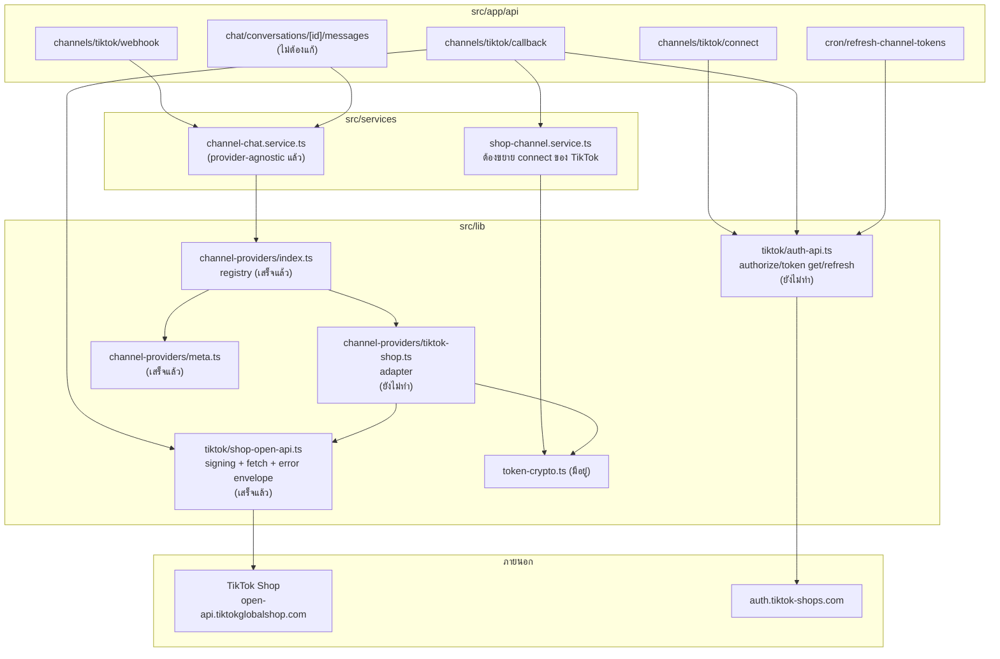
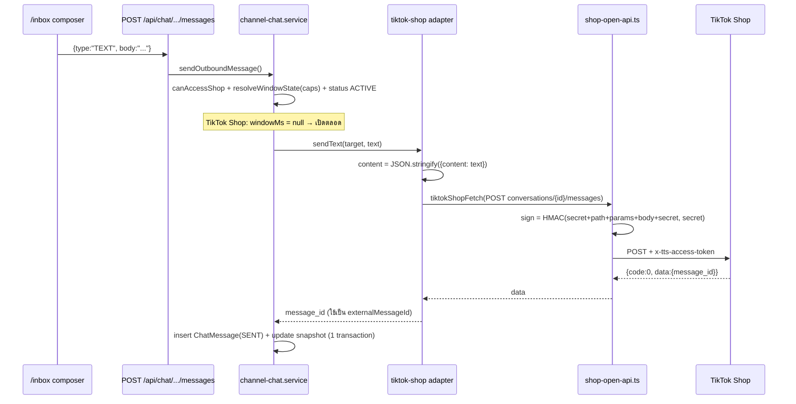
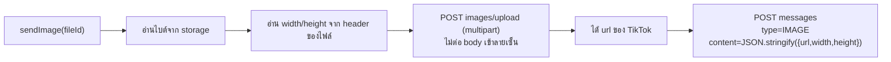
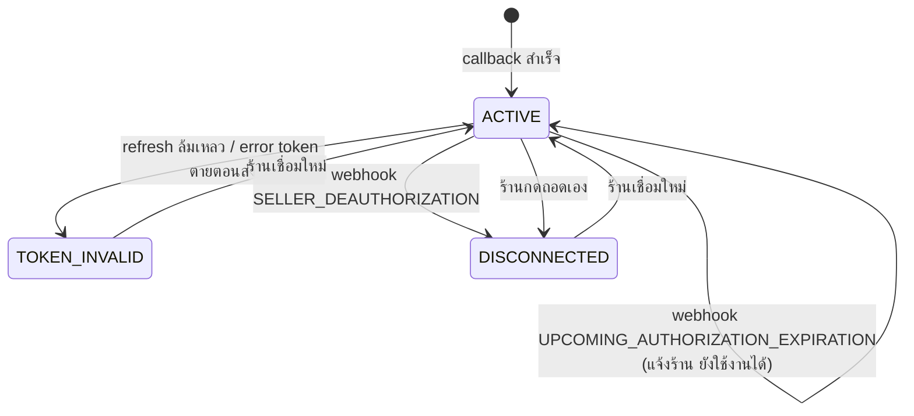

> **โมดูล:** M00020-TikTokChatIntegration
> **ประเภทเอกสาร:** Software Design Specification
> **เวอร์ชัน:** 1.0
> **วันที่จัดทำ:** 2026-07-25
> **สถานะ:** Draft — `shop-open-api.ts` + signing เสร็จ (12 เทสล็อกไว้); provider adapter / route / cron ยังไม่ทำ
> **เจ้าของเอกสาร:** SA/Planner (ดู [[Feature-Docs-Ownership]])
>
> ⚠️ เขียนโดย Controller ไม่ใช่ `safepay-planner` — subagent ล้มไป 2 ครั้งในเซสชันนี้

# SDS: TikTok Chat Integration

---

## 1. หลักการออกแบบ

feature นี้ **ไม่สร้างระบบแชทใหม่** — เสียบ TikTok เป็น "ช่องทางที่สาม" เข้าโครงที่มีอยู่แล้ว
โดยยึด 3 ข้อ:

1. **ไม่แตะพฤติกรรมช่องทางเดิม** (BR-TTC-35..37) — Messenger/Instagram live บน prod อยู่
2. **ความต่างของช่องทางอยู่หลัง `ChannelProvider` เท่านั้น** — service กลางไม่รู้ว่าคุยกับใคร
3. **สิ่งที่ยังไม่ยืนยันจากเอกสารทางการ ห้ามฝังเป็นสมมติฐานเงียบ ๆ** — เขียน comment กำกับที่จุดใช้งาน

### 1.1 ที่มาของข้อมูล (เปลี่ยนจาก v0 ของ API.md)

หน้าเอกสารของ TikTok Shop เป็น **JS-rendered** — HTTP client ธรรมดาดึงได้แต่ title ว่าง
**วิธีที่ใช้ได้จริงคืออ่านผ่าน browser** (Chrome DevTools MCP) ซึ่งรัน JavaScript ให้

| หน้า | URL | ปิด OQ |
|---|---|---|
| Send Message | `/docv2/page/send-message-202309` | **OQ-TTC-02 ปิดแล้ว** |
| Sign your API request | `/docv2/page/sign-your-api-request` | ยืนยันสูตรลายเซ็น |
| Common parameters | `/docv2/page/678e3a4278f4c20311b8b57e` | timestamp window, header |
| Webhooks overview | `/docv2/page/tts-webhooks-overview` | รายการ event ครบ |

> **บทเรียนเชิงกระบวนการ:** ผมเริ่มจากสกัด SDK ชุมชนเพราะเข้าใจว่าเอกสารอ่านไม่ได้ ทั้งที่มี
> browser อยู่ในมือแล้ว — เสียเวลาและได้ข้อมูลที่ **ไม่ครบ** (SDK ไม่รู้ว่า `content` ต้อง
> serialize เป็น string, ไม่รู้ว่า IMAGE ต้องมี width/height, ไม่รู้ 2 event เรื่อง authorization)
> ครั้งหน้าเจอหน้า JS-rendered → เปิด browser ก่อน อย่าไปหา proxy source

---

## 2. Component Diagram



**สิ่งที่เสร็จแล้ว:** registry + meta adapter (Phase 2, commit `e0377127`) และ `shop-open-api.ts` + signing test
**สิ่งที่เหลือ:** `auth-api.ts`, `tiktok-shop.ts` adapter, 4 route, ขยาย `shop-channel.service`

---

## 3. Design Decisions

### TD-001 — `content` ต้อง serialize เป็น string สองชั้น

เอกสาร Send Message ระบุ `content` เป็น **"Message content, in JSON serialized string"** และ curl
ตัวอย่างคือ:

```
-d '{ "type": "TEXT", "content": "{\"content\": \"test\"}" }'
```

**การตัดสินใจ:** adapter ต้อง `JSON.stringify` payload ชั้นในก่อนใส่เป็นค่า `content`
**เหตุผลที่ต้องเขียนเป็น TD:** ถ้าใครอ่านโค้ดแล้วคิดว่า "ทำไมไม่ส่ง object ตรง ๆ" แล้วแก้ให้
"สะอาดขึ้น" → พังทันทีและ error ที่ได้จะเป็น invalid params ที่ไม่ชี้สาเหตุ

**ค่า `type` ที่รับได้ (จากเอกสาร):** `TEXT` `IMAGE` `VIDEO` `PRODUCT_CARD` `ORDER_CARD`
`RETURN_REFUND_CARD` `COUPON_CARD` `LOGISTICS_CARD`

| type | shape ของ `content` (ชั้นใน) |
|---|---|
| `TEXT` | `{ "content": "..." }` — **สูงสุด 2000 ตัวอักษร** |
| `IMAGE` | `{ "url": "...", "width": N, "height": N }` — `url` ต้องได้จาก Upload Buyer Messages Image |
| `VIDEO` | `{ "vid": "..." }` |
| `PRODUCT_CARD` | `{ "product_id": "..." }` |
| `ORDER_CARD` | `{ "order_id": "..." }` |
| `LOGISTICS_CARD` | `{ "order_id": "...", "package_id": "..." }` (package_id optional) |
| `RETURN_REFUND_CARD` | `{ "order_id": "...", "sku_id": "..." }` |
| `COUPON_CARD` | `{ "coupon_id": "..." }` |

### TD-002 — `textLimit` ของ TikTok = 2000 ไม่ใช่ 6000

capability `textLimit` ที่ประกาศใน `ChannelCapabilities` ต้องเป็น **2000** สำหรับ `TIKTOK_SHOP`
(ตัวเลข 6000 ที่ปรากฏใน [[PRD]] §3.1 เป็นของ **Business Messaging ทาง B** ซึ่งเป็น API คนละตัว)
Messenger = 2000 เท่ากันโดยบังเอิญ

**ยังไม่บังคับใช้ในโค้ด** — Phase 2 จงใจไม่ enforce `textLimit` เพราะของเดิมไม่เคยเช็ค การเพิ่ม
ตอนนั้นจะเปลี่ยนพฤติกรรม Messenger บน prod (BR-TTC-35) → เปิดใช้พร้อม adapter TikTok ใน Phase 3
และต้องเช็ค **ก่อน** กดส่ง ไม่ใช่หลัง error (BR-TTC-22)

### TD-003 — 🛑 ส่งรูปต้องมี `width`/`height` → interface Phase 2 ยังไม่พอ

Meta รับ **URL** แล้วไปดึงรูปเอง — TikTok ต้อง:
1. `POST /customer_service/202309/images/upload` (multipart) → ได้ `url` ของ TikTok
2. ส่งด้วย `type=IMAGE`, `content={url, width, height}` — **ต้องรู้ขนาดรูป**

`ChannelProvider.sendImage(target, imageFileId, caption?)` ที่ออกแบบไว้ Phase 2 ให้ provider
ตัดสินเองว่าจะแปลง fileId เป็นอะไร → **รองรับขั้นตอน upload ได้** แต่ **ยังขาดมิติรูป**

**ทางเลือกที่ประเมิน:**

| ทาง | ข้อดี | ข้อเสีย |
|---|---|---|
| **A. อ่านขนาดจากไฟล์ใน storage ตอนส่ง** (เลือก) | ไม่แตะ interface, ไม่แตะ schema, ได้ค่าจริงเสมอ | ต้องอ่าน header ของไฟล์ (PNG/JPEG/WebP) ฝั่ง server — เพิ่ม dependency หรือเขียน parser เล็ก ๆ |
| B. เพิ่ม `width`/`height` เข้า signature ของ `sendImage` | ตรงไปตรงมา | ผู้เรียก (service กลาง) ต้องรู้เรื่องรูป = ย้ายความรู้ของช่องทางออกมานอก provider ผิดหลักข้อ 2 |
| C. เก็บ w/h ตอนอัปโหลด (คอลัมน์ใหม่) | อ่านเร็ว | ต้อง migrate + backfill ไฟล์เก่า และรูปที่ mirror มาจากช่องทางอื่นไม่มีค่า |

**เลือก A** — provider เป็นคนอ่านขนาดเอง ความรู้เรื่อง "TikTok ต้องการ w/h" ไม่รั่วออกนอก adapter

### TD-004 — ใช้ webhook 2 ตัวจัดการ lifecycle ไม่ใช่ cron ล้วน

เอกสาร Webhooks overview ให้ event ที่ **Meta ไม่มี**:

| event_type | ความหมาย | ใช้ทำอะไร |
|---|---|---|
| `SELLER_DEAUTHORIZATION` | ร้านถอนสิทธิ์/เสียสิทธิ์ | ตั้ง `status` เป็น `DISCONNECTED` + หยุดยิง API + แจ้งร้าน **ทันที** ไม่ต้องรอ error |
| `UPCOMING_AUTHORIZATION_EXPIRATION` | authorization จะหมดอายุ — ส่ง **ล่วงหน้า 30 วัน** แล้วทุกวัน 00:00 จนกว่าจะ reauthorize | แจ้งร้านให้เชื่อมใหม่ล่วงหน้า (ต่างจาก access token ที่ refresh เองได้) |

**การตัดสินใจ:** subscribe ทั้งสองตัวตั้งแต่แรก (เอกสารแนะนำเองสำหรับแอปที่ต้องถือสิทธิ์ระยะยาว)

**แต่ยังต้องมี cron ต่ออายุ access token** ตาม FR-TTC-09 — เพราะ 2 event นี้พูดถึง
**authorization** (สิทธิ์ที่ร้านให้) ไม่ใช่ **access token** (ที่หมดเร็วกว่าและ refresh ได้เอง)
และเอกสารเตือนเองว่า *"Do not rely on webhooks as the only source of truth"*

**แก้ข้อความที่เคยเขียนผิดใน [[DATABASE]] §6:** ที่เขียนว่า "ไม่มี webhook แจ้ง token ถูก revoke"
เป็นจริงกับ **Meta** แต่ **ไม่จริงกับ TikTok** — TikTok มี `SELLER_DEAUTHORIZATION`

### TD-005 — ห้าม branch ด้วย numeric `type` ของ webhook payload

เอกสารระบุตรง ๆ: payload มี field `type` เป็นตัวเลข แต่ *"The shared Event API schema publishes the
full event_type enum, but it does not publish a complete numeric type mapping for every topic.
**Do not branch only on the numeric type**; use the subscribed event_type context and the
topic-specific payload schema."*

**การตัดสินใจ:** dispatcher แยก event ด้วย **`event_type` (string)** ถ้า payload ไม่มี ให้ derive
จาก **shape ของ payload** ไม่ใช่จากตัวเลข — และ log ตัวเลขที่ไม่รู้จักไว้เก็บเคส (pattern เดียวกับ
`console.warn('[fb-ingest] unhandled attachment')` ของ 00018)

### TD-009 — 🛑 `isTokenDeadError(): boolean` **ไม่พอ** ต้องเป็น 3 ผลลัพธ์

จากหน้า common-errors (ทางการ) การตีความ error ของ TikTok ซับซ้อนกว่า Meta มาก:

| Code | message keyword | ความหมายจริง | ต้องทำ |
|---|---|---|---|
| `105002` | Expired credentials | access token **หมดอายุ** | **refresh แล้ว retry** ไม่ใช่ให้ร้านเชื่อมใหม่ |
| `36009004` | `x-tts-access-token header is invalid` | token ใช้ไม่ได้จริง | `TOKEN_INVALID` + ให้ร้านเชื่อมใหม่ |
| `36009004` | `Invalid timestamp ...` | **นาฬิกา instance เพี้ยน** | retry — **ห้าม** แตะสถานะช่องทาง |
| `36009004` | `Invalid app_key` / `Missing credentials, signature` | config/บั๊กเราเอง | log + FAILED — **ห้าม** แตะสถานะช่องทาง |
| `106001` | invalid sign | **ลายเซ็นเราผิด** | บั๊กเรา — ห้ามแตะสถานะช่องทาง |
| `105005` | Access denied (scope) | scope ไม่ได้รับอนุมัติ | ปัญหา config ระดับ app — เชื่อมใหม่ไม่ช่วย |
| `36009033` | IP not in allow list | app เปิด IP allow list ไว้ | **ห้ามเปิดฟีเจอร์นี้** — Vercel egress IP ไม่คงที่จะพังทั้งระบบ |
| `36009002` / HTTP 429 | Too many requests | rate limit | backoff + respect `Retry-After` |

เอกสารเตือนเองว่า **`36009004` ถูกใช้ซ้ำหลายกรณี** และ *"Do not use the numeric code alone for
programmatic branching. Combine it with the response message keyword"*

**การตัดสินใจ:** เปลี่ยนสัญญาเป็น `classifyError(e): 'REFRESH' | 'DEAD' | 'TRANSIENT' | 'FAILED'`
(ยังไม่แก้ interface จนถึง Phase 3 — ตอนนี้ `isTokenDeadError` ยังใช้กับ Meta ได้ถูกต้อง)

**กฎความปลอดภัยของการ classify (สำคัญกว่าความแม่น):** เมื่อไม่ชัด **ให้เลือกไม่ mark ช่องทางตาย**
เพราะการ mark ตายผิดพลาด = ร้านตอบลูกค้าไม่ได้ทั้งร้าน ส่วนการไม่ mark ตายเมื่อควร mark = ข้อความ
ถัดไปก็ fail แล้วรู้อีกที (เสียหายน้อยกว่ามาก) — และยังมี `SELLER_DEAUTHORIZATION` webhook เป็น
ตัวจับกรณีจริงอยู่แล้ว (TD-004)

**การ match keyword ต้องทน:** ใช้ substring ที่เจาะจง (`x-tts-access-token` + `invalid`)
**ห้ามพึ่งโครงประโยคทั้งประโยค** (บทเรียน `feedback_spike_must_match_production_path`)

### TD-010 — สองโดเมนแชทที่ชื่อคล้ายกันจนหยิบผิดได้

TikTok Shop มี API แชท 2 ชุดที่ไม่เกี่ยวกัน (ดู [[API]] §6.3): `customer_service/202309`
(**buyer ↔ seller — ของเรา**) กับ `affiliate_seller/202412+` (**creator ↔ seller**)

**การตัดสินใจ:** adapter ของเรารองรับ **customer_service เท่านั้น** และ **ไม่ subscribe**
`NEW_MESSAGE_LISTENER` เพราะเป็น event ของโดเมน affiliate — ถ้า subscribe จะได้เธรดที่ตอบไม่ได้
โผล่ในอินบ็อกซ์ (ต้องใช้ scope `seller.affiliate_messages.write` + API อีกชุด)

จุดที่หยิบผิดง่าย: ชื่อ endpoint คล้ายกัน (`Send IM Message` vs `Send Message`), field ชนิดข้อความ
ต่างกัน (`msg_type` vs `type`), และชุด affiliate ถูก version ใหม่กว่า (202412/202508/202511)
จึงมักโผล่มาก่อนในผลค้นหา

### TD-006 — signing: stringify body ครั้งเดียว

`sign` คำนวณจาก **body string** ที่ส่งออกจริง ถ้า `JSON.stringify` สองครั้งแล้วลำดับ key ต่างกัน
แม้แต่นิด ลายเซ็นจะไม่ตรงกับ body → 401 ที่หาสาเหตุยากมาก
`tiktokShopFetch` จึง stringify **ครั้งเดียว** เก็บใน `rawBody` แล้วใช้ทั้งลายเซ็นและ `fetch` body

### TD-007 — timestamp window ±: ถ้าเจอ 36009004 ให้สงสัยนาฬิกาก่อนสูตร

เอกสารระบุช่วงที่รับ: `[now - 5 นาที, now + 30 วินาที]` — นอกช่วงได้ `36009004 Invalid timestamp`
เขียน comment ไว้ในโค้ดแล้วเพื่อไม่ให้คนไล่ผิดทาง (นาฬิกา instance เพี้ยน vs สูตรผิด)

### TD-008 — reuse `channel-chat.service` ทั้งหมด ไม่แตะ

`sendOutboundMessage` เรียกผ่าน registry แล้ว → เพิ่ม adapter = ส่งข้อความ TikTok ได้ทันที
เส้นทาง **ขาเข้า** (`ingestInboundMessage`) ยังผูกกับ shape ของ Meta อยู่ (`MessagingEvent`)
→ Phase 3 ต้องเพิ่มชั้นแปลง payload ของ TikTok → รูปกลาง **โดยไม่แก้ตัว ingest เดิม**
(ทางที่ปลอดภัยกว่า: เขียน mapper แยกใน `tiktok/webhook-types.ts` แล้วเรียก service ชั้นเดียวกัน)

---

## 4. Flow

### 4.1 ส่งข้อความออก (TEXT)



### 4.2 ส่งรูป (2 ขั้น — ต่างจาก Meta)



**จุดที่ต่างจาก Meta ต้องระวัง:** `images/upload` เป็น `multipart/form-data` → ตามสูตรลายเซ็น
**ต้องไม่ต่อ body** เข้า string ที่เซ็น (`buildSignature` รองรับแล้วและมีเทสครอบ)

### 4.3 lifecycle ของการเชื่อมต่อ



**gap ที่ต้องปิดก่อนเปิดใช้จริง:** สถานะ `TOKEN_INVALID`/`DISCONNECTED` **ยังไม่มีทางกลับ**
เพราะหน้า `/settings/channels` ไม่มีปุ่มเชื่อมใหม่ (พบจาก QA จริง 2026-07-25 — เป็น gap ของ
00018 ที่กระทบ TikTok ด้วย) ดู [[API]] §3.3

---

## 5. Error Handling

| ชั้น | เจอ | ทำ |
|---|---|---|
| `shop-open-api.ts` | network/timeout | `TikTokShopApiError(code=null, httpStatus=0)` |
| | ตอบไม่ใช่ JSON | `TikTokShopApiError(code=null)` — ไม่พึ่งโครงประโยคของ message |
| | `code !== 0` | `TikTokShopApiError(code, requestId, httpStatus)` |
| adapter | `45101006` sensitive content | `deliveryStatus=FAILED` + เหตุผลภาษาไทยที่บอกว่าต้องแก้ข้อความ |
| | `45101004` quota 10000/วัน | FAILED + เหตุผล "โควตาวันนี้เต็ม" — **ห้าม** mark channel invalid |
| | `45102007` no permission to access conversation | FAILED — **ห้าม** mark channel invalid (เป็นเรื่องเธรด ไม่ใช่ token) |
| | error ที่แปลว่า token/สิทธิ์ตาย | `isTokenDeadError()` → `true` → service ตั้ง `TOKEN_INVALID` + แจ้งร้าน |
| service | ทุกกรณีส่งไม่สำเร็จ | บันทึกข้อความไว้ในเธรดพร้อมเหตุผล — **ห้ามล้มเหลวเงียบ** (BR-TTC-23) |

**🛑 บทเรียนจาก QA จริง 2026-07-25 ที่ต้องรักษาไว้:** ต้องแยก "ส่งสื่อไม่ได้" ออกจาก
"การเชื่อมต่อตาย" ให้เด็ดขาด — วันนั้นเจอ `(#100) Upload attachment failure` (ปัญหาไฟล์)
กับ error สิทธิ์ (token ถูกแทนที่) ในเธรดเดียวกัน ถ้าเหมารวมเป็น "token ตาย" ทั้งคู่
ร้านจะตอบ **ข้อความ** ไม่ได้ทั้งร้านเพราะส่ง **รูป** ไม่สำเร็จครั้งเดียว

`isTokenDeadError` ของ TikTok adapter จึงต้อง allow-list code ที่แปลว่า token ตายจริง
**ไม่ใช่** blacklist — ค่า code ที่ตรงกับกรณีนี้ยังต้องยืนยันจากหน้า common error codes (OQ)

---

## 6. Security

| ประเด็น | มาตรการ |
|---|---|
| token ที่เก็บ | AES-256-GCM ทั้ง `accessTokenEnc` และ `refreshTokenEnc` (`token-crypto.ts`) — BR-TTC-05 |
| token รั่วไปหน้าจอ | `GET /api/channels` ใช้ Prisma `select` allow-list — **ต้องตรวจว่า `refreshTokenEnc`/`externalMeta` ไม่หลุด** |
| log | ห้าม log `app_secret`, `access_token`, `refresh_token`, `auth_code`, `sign` — log ได้แค่ `request_id` |
| webhook | HMAC-SHA256 ใน header `Authorization` (signed string = `app_key + rawBody`) — **auth เดียวของ route นี้** ตอบ 401 ถ้าไม่ผ่าน และ **ห้ามเขียน DB** |
| header `Authorization` ถูก normalize | ⚠️ TikTok ใช้ header ที่ปกติสงวนไว้สำหรับ `Bearer` — ต้องทดสอบผ่าน proxy จริง (`src/proxy.ts` + Vercel) ไม่ใช่ unit test เพียว ๆ |
| CSRF | webhook ยกเว้นจาก Origin-check ของ `guardApi` แต่ยัง apply rate-limit; connect/callback ใช้ `state` cookie |
| authz | ทุก query scope `shopId` + `canAccessShop` (เจ้าของ **หรือ** พนักงาน — BR-TTC-29/30) |
| PII → AI | ห้ามส่งเบอร์/อีเมล/ที่อยู่เข้า AI (BR-TTC-31 สืบทอด 00019) |
| PII → RSC | neutralize-at-source ก่อน serialize (BR-TTC-34) |
| SSRF ตอน mirror สื่อ | `mirrorRemoteImage(url, isAllowedHost)` — adapter TikTok ต้องส่ง allow-list ของ CDN TikTok เอง **ห้าม** ใช้ default ของ Meta |

---

## 7. Testing Strategy

| ระดับ | ครอบ | สถานะ |
|---|---|---|
| Unit (pure) | `buildSignature` — fixed vector + กฎย่อย 11 ข้อ (exclude sign/token, sort, path, body, multipart, array, undefined, secret, timestamp) | ✅ **12 เทสผ่าน** |
| Unit | `resolveWindowState` — เคส `windowMs = null` (TikTok Shop เปิดตลอด) | ✅ ผ่านแล้วจาก Phase 2 |
| Unit | adapter: `content` serialize สองชั้น, map error code → FAILED vs TOKEN_INVALID | ยังไม่ทำ |
| Unit | webhook signature verify (รวมเคสความยาวต่างกัน กัน timingSafeEqual throw) | ยังไม่ทำ |
| Integration | ยิง `GET /authorization/202309/shops` จริงด้วย credential sandbox — **พิสูจน์ว่าลายเซ็นถูกจริง** | ยังไม่ทำ (รอ sandbox shop) |
| E2E | Playwright: เชื่อมช่องทาง → รับข้อความ → ตอบ → ส่งรูป | ยังไม่ทำ |

**สิ่งที่ unit test พิสูจน์ไม่ได้:** ว่า TikTok จะรับลายเซ็นเราจริง — ต้องเรียก API จริงครั้งแรก
ให้ผ่านก่อนถือว่า signing ใช้ได้ (`feedback_spike_must_match_production_path`)

---

## 8. Traceability

| Component | FR | สถานะ |
|---|---|---|
| `lib/tiktok/shop-open-api.ts` (signing + fetch) | ทุก FR ที่เรียก API | ✅ เสร็จ + 12 เทส |
| `lib/channel-providers/{types,index,meta}.ts` | FR-TTC-04/05 | ✅ เสร็จ (Phase 2) |
| `lib/tiktok/auth-api.ts` | FR-TTC-01, FR-TTC-09 | ยังไม่ทำ |
| `lib/channel-providers/tiktok-shop.ts` | FR-TTC-04/05/14 | ยังไม่ทำ (TD-001..003) |
| `api/channels/tiktok/{connect,callback}` | FR-TTC-01 | ยังไม่ทำ |
| `api/channels/tiktok/webhook` | FR-TTC-02/03/10 | ยังไม่ทำ (TD-005) |
| `api/cron/refresh-channel-tokens` | FR-TTC-09 | ยังไม่ทำ (TD-004) |
| ปุ่มเชื่อมใหม่เมื่อ TOKEN_INVALID | FR-TTC-08 | ยังไม่ทำ — **gap ของ 00018** |

---

## 9. Open Questions ที่ยังบล็อกอยู่

| # | คำถาม | บล็อกอะไร |
|---|---|---|
| OQ-TTC-11 | sandbox ใช้ host แยกหรือใช้ production host แล้วสร้าง "sandbox shop"? | วิธี config env ของ adapter |
| OQ-TTC-12 | error code ตัวไหนแปลว่า "token/สิทธิ์ตาย" (สำหรับ allow-list ของ `isTokenDeadError`) | §5 — ผิดพลาดแล้วร้านตอบไม่ได้ทั้งร้าน |
| OQ-TTC-13 | payload จริงของ `NEW_MESSAGE` (ชื่อ field ของ conversation/message/sender) | mapper ขาเข้า — อ่านได้จาก topic page ใน browser |
| OQ-TTC-14 | อายุจริงของ access token / authorization | ความถี่ cron (อ่านจาก response จริง ไม่ hardcode) |

**3 ข้อแรกอ่านได้จากเอกสารผ่าน browser** — ไม่ต้องรอ TikTok ตอบ ทำต่อได้เลย
