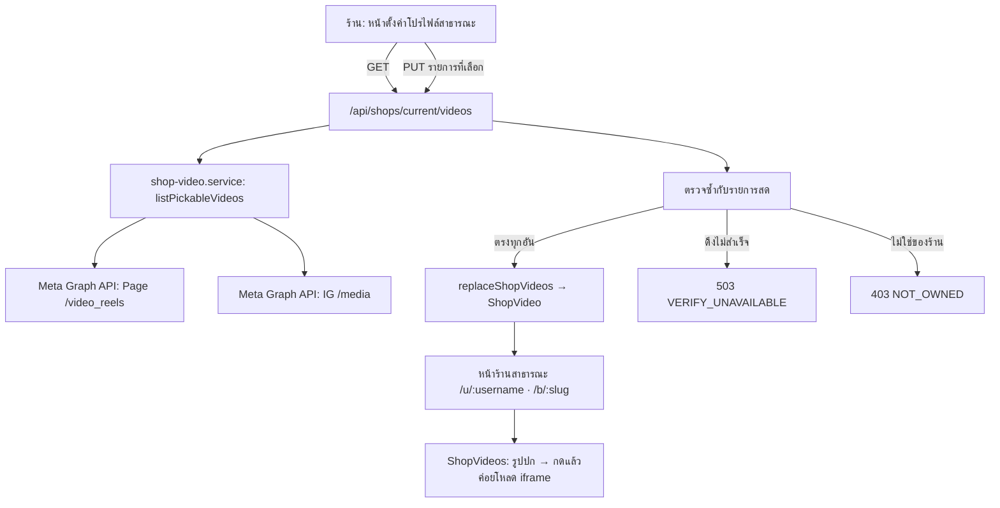

> **โมดูล:** M00021-ShopVideoShowcase · **เอกสาร:** Software Design (SDS) · **สถานะ:** Implemented

# SDS: Shop Video Showcase

## 1. ภาพรวม

## 2. โมดูล

| ไฟล์ | หน้าที่ |
|---|---|
| `src/lib/shop-video.ts` | แยกวิเคราะห์ URL → `{provider, videoId}` และประกอบ URL ฝัง/URL หน้าคลิปกลับขึ้นมาใหม่ ไม่มี dependency ภายนอก ทดสอบได้ล้วน |
| `src/services/shop-video.service.ts` | ดึงคลิปจาก Meta, รวมผลหลายช่องทาง, อ่าน/เขียน `ShopVideo` |
| `src/app/api/shops/current/videos/route.ts` | ตรวจสิทธิ์ ตรวจความเป็นเจ้าของ แปลงข้อผิดพลาดเป็นรหัสสถานะ |
| `src/app/(paces)/seller/(dashboard)/public-profile/` | หน้าตั้งค่าฝั่งร้าน (Paces) |
| `src/views/pages/user-profile/v2/ShopVideos.tsx` | แท็บ "ปักหมุด" บนหน้าร้าน (Vuexy) |

## 3. การตัดสินใจเชิงออกแบบ

### 3.1 ไม่เชื่อ URL ที่รับเข้ามา — แยกเอาเฉพาะรหัส แล้วประกอบใหม่เอง

หน้าร้านคือหน้าที่ผู้ซื้อใช้ตัดสินใจโอนเงิน ถ้าเอา URL ที่รับมาไปทำ iframe ตรง ๆ ช่องนี้จะกลายเป็นที่แปะหน้าหลอกลวงบนหน้าที่ผู้ซื้อไว้ใจที่สุดพอดี

จึงบังคับให้ `buildEmbedUrl` รับเฉพาะ `ParsedVideo` (ไม่ใช่ string) — ไม่มีทางเรียกด้วยค่าที่ผู้ใช้พิมพ์มาโดยตรงได้เลยในระดับชนิดข้อมูล และรหัสคลิปถูกจำกัดชุดตัวอักษรอีกชั้นกันอักขระที่ทำให้ URL หลุดออกนอกโดเมนที่ตั้งใจ

### 3.2 ปฏิเสธลิงก์ย่อทุกชนิด

`vm.tiktok.com`, `vt.tiktok.com`, `facebook.com/share/r/…` ต้องยิง request ตามไปถึงจะรู้ปลายทาง การทำแบบนั้นจากฝั่ง server คือ SSRF — ปล่อยให้ผู้ใช้กำหนดปลายทางที่ server เราจะไปเรียก

### 3.3 แยก "ตรวจไม่ได้" ออกจาก "ไม่ใช่ของคุณ"

`listPickableVideos` คืน `{items, failed}` ไม่ใช่แค่ `items` เพราะตอนแรกโค้ดคืน `[]` เมื่อดึงไม่สำเร็จ ซึ่งทำให้ปลายทางสรุปว่า "ไม่มีคลิปไหนเป็นของร้านนี้" แล้วตอบ 403 ผลคือร้านที่สุจริตถูกบอกว่าเอาคลิปคนอื่นมาแปะ ทั้งที่ปัญหาจริงคือ API ของ Meta ล่ม

### 3.4 Instagram ต้องใช้ shortcode ไม่ใช่ media id

`GET /media` คืน `id` เป็น media id (ตัวเลขล้วน) ซึ่งประกอบเป็น `instagram.com/reel/{id}/embed` แล้วได้หน้าเปล่า ค่าที่ใช้ฝังได้คือ shortcode ที่อยู่ใน `permalink` เท่านั้น จึงต้องแยกออกมาจาก permalink ด้วย `parseVideoUrl`

บั๊กนี้เจอตอนยิง API จริงเท่านั้น — โครงสร้างข้อมูลดูสมเหตุสมผลทุกอย่างจนกว่าจะเปิดหน้าที่ฝังจริง

### 3.5 รูปปกของ Facebook ใช้ `thumbnails` ไม่ใช่ `picture`

`picture` ให้รูปเล็กมากจนเบลอเมื่อวางในกริด 9:16 ส่วน `thumbnails{uri,is_preferred}` ให้ถึง 1080×1920

### 3.6 โหลด iframe เมื่อกดเท่านั้น

ฝังทุกอันตั้งแต่เปิดหน้าจะดึงสคริปต์ของแพลตฟอร์มหลายเมกะไบต์ทันที และแพลตฟอร์มจะเห็นว่าใครเปิดหน้าร้านนี้ทั้งที่ผู้ชมยังไม่ได้เลือกดูสักอัน แสดงรูปปกก่อนได้ทั้งความเร็วและความเป็นส่วนตัว

## 4. บั๊กที่เจอระหว่างทางและวิธีแก้

| อาการ | สาเหตุจริง | แก้ |
|---|---|---|
| บันทึกไม่ได้ "มีคลิปที่ไม่ได้อยู่ในบัญชีที่เชื่อมไว้" ทั้งที่เป็นของร้าน | แถวที่เคยบันทึกไว้ถูกส่งกลับไปใน payload โดยไม่ตรวจว่ายังอยู่ในรายการสดไหม แถวเก่าที่เก็บ media id เพียงแถวเดียวทำให้บันทึกไม่ผ่านทุกครั้ง | กรองรายการที่เลือกไว้เดิมด้วยคีย์ที่มีอยู่จริงก่อนตั้งค่าเริ่มต้น |
| iframe ของ Instagram ขึ้นหน้าเปล่า | ใช้ media id แทน shortcode (§3.4) | แยก shortcode จาก permalink |
| ไอคอนในหน้าตั้งค่าหายไปเฉย ๆ ไม่มี error | ไฟล์นั้นใช้ `@iconify/react` ตรง ๆ ไม่ใช่ wrapper ที่เติม prefix `tabler:` ให้ ชื่อที่ไม่มี prefix จะไม่ render อะไรเลย | ใส่ prefix ให้ครบ |
| ไอคอนช่องทางเป็นคนละชุดกับหน้าแชท | ไปหยิบไอคอนจาก iconify มาเองโดยไม่ได้ดูว่าโปรเจกต์มีไฟล์โลโก้แบรนด์จริงอยู่แล้ว | ชี้ไปที่ `public/images/logos/` ชุดเดียวกับ `ChannelBadge` |

## 5. สิ่งที่ยังไม่ได้ทำ

- TikTok — รอแอปอนุมัติ โครง `provider` รองรับแล้ว
- ยอดวิว Instagram — ต้องให้ร้านเชื่อมใหม่หลังเพิ่ม scope `instagram_manage_insights`
- ยังไม่มีการรีเฟรชยอดอัตโนมัติ
