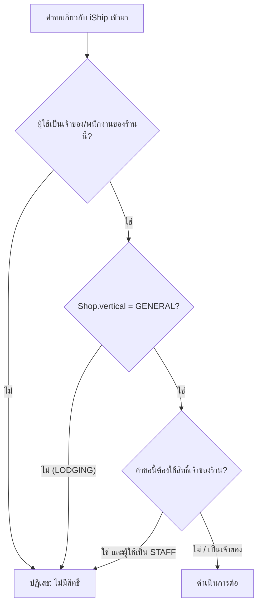
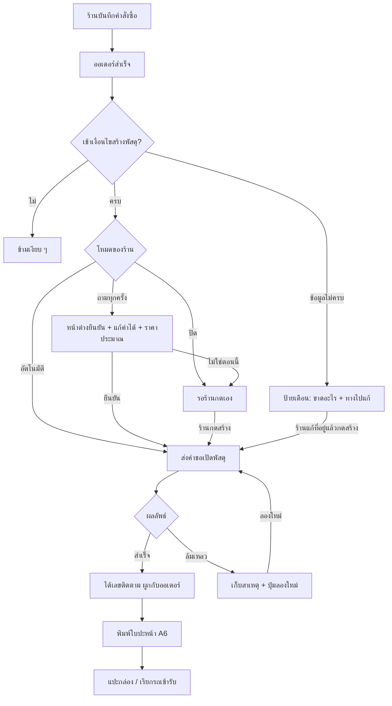
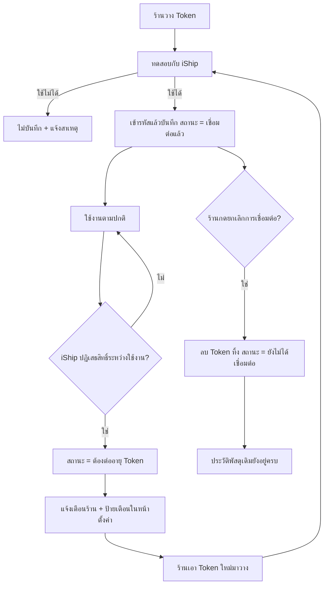
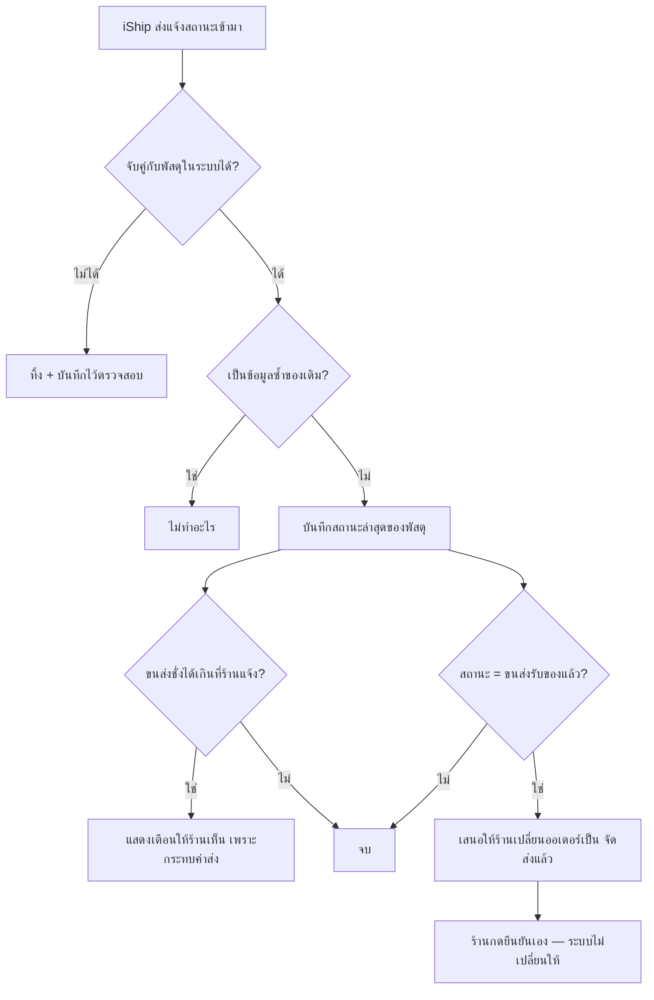

> **โมดูล:** 00022 — iShip Shipping Integration
> **ประเภทเอกสาร:** Business Requirements Document (BRD) - NON-TECHNICAL
> **เวอร์ชัน:** 1.0
> **วันที่จัดทำ:** 2026-07-26
> **สถานะ:** Draft — รอ user review
> **เจ้าของเอกสาร:** BA (ดู [[Feature-Docs-Ownership]])

# BRD: เชื่อมระบบขนส่ง iShip (Business Requirements Document)

---

## 1. บทนำ

### 1.1 วัตถุประสงค์ของเอกสาร

เอกสารนี้มีวัตถุประสงค์เพื่อ:
1. อธิบายความต้องการหลักของการเชื่อมระบบขนส่ง iShip เข้ากับร้านค้าบน Deep — ตั้งแต่การผูกบัญชี การเปิดพัสดุจากคำสั่งซื้อ ไปจนถึงการพิมพ์ใบปะหน้า
2. กำหนดขอบเขตว่าร้านประเภทใดใช้ได้ ออเดอร์แบบใดเข้าเงื่อนไข และอะไรอยู่นอกความรับผิดชอบของ Deep
3. อธิบายเงื่อนไขการใช้งานและกฎทางธุรกิจที่ระบบต้องบังคับ โดยเฉพาะกฎที่เกี่ยวกับเงินจริงและความปลอดภัยของรหัสลับ
4. สร้างความเข้าใจร่วมกันระหว่างทีมธุรกิจ ทีมพัฒนา และทีมทดสอบ ก่อนเริ่มเขียนโค้ด

### 1.2 ขอบเขตของระบบ

**การเชื่อมระบบขนส่ง iShip** คือ ความสามารถที่ทำให้ร้านค้าผูกบัญชี iShip ของตัวเองเข้ากับร้านบน Deep แล้วเปิดพัสดุ พิมพ์ใบปะหน้า และติดตามสถานะได้จากหน้าจอเดียว โดยไม่ต้องกรอกข้อมูลผู้รับซ้ำในระบบขนส่ง

**เข้าสู่ระบบ (Input):**
- Token ที่ร้านคัดลอกมาจากหลังบ้าน iShip
- ค่าตั้งต้นของร้าน — ที่อยู่ผู้ส่ง, ขนส่งประจำ, ขนาด/น้ำหนักกล่อง, ประเภทสินค้า, บริการเสริม, โหมดการสร้างพัสดุ
- ข้อมูลคำสั่งซื้อที่มีอยู่แล้ว — ชื่อ/เบอร์/ที่อยู่ผู้รับ, รายการสินค้า, ยอดเงิน
- การแจ้งเตือนสถานะพัสดุที่ iShip ส่งกลับมา

**ออกจากระบบ (Output):**
- เลขติดตามพัสดุที่ผูกกับคำสั่งซื้อ
- ไฟล์ใบปะหน้าขนาด A6 สำหรับพิมพ์
- สถานะพัสดุและประวัติการเดินทางที่แสดงให้ร้านและผู้ซื้อเห็น
- ผลการทำงานที่ล้มเหลวพร้อมสาเหตุที่ร้านเข้าใจได้และแก้ต่อได้

**ระบบที่เกี่ยวข้อง:**
- ระบบคำสั่งซื้อ (Order) — จุดที่พัสดุไปผูก และแหล่งข้อมูลผู้รับ
- ระบบร้านค้า (Shop) — เจ้าของการเชื่อมต่อ และแหล่งของประเภทธุรกิจที่ใช้ตัดสินสิทธิ์
- ระบบสิทธิ์พนักงานร้าน (feature 00012) — ตัดสินว่าใครตั้งค่าได้ ใครสร้างพัสดุได้
- ระบบเก็บความลับแบบเข้ารหัสที่มีอยู่แล้ว (ใช้ร่วมกับ feature 00018)
- ชุดข้อมูลตำบล/อำเภอ/จังหวัดมาตรฐานที่ระบบใช้อยู่แล้ว
- ผู้ให้บริการภายนอก — iShip Open API

### 1.3 กลุ่มผู้ใช้งาน

| กลุ่มผู้ใช้ | บทบาท | สิทธิ์การใช้งาน |
|-----------|--------|----------------|
| **เจ้าของร้าน (OWNER)** | ผูก/ยกเลิกบัญชี iShip, ตั้งค่าเริ่มต้น, สร้าง/ยกเลิกพัสดุ, พิมพ์ใบปะหน้า | เต็มสิทธิ์ |
| **พนักงานร้าน (STAFF)** | เปิดพัสดุจากออเดอร์, พิมพ์ใบปะหน้า, ดูสถานะ | ใช้งานได้ แต่ **ตั้งค่าและวาง Token ไม่ได้** และไม่เห็น Token |
| **ผู้ซื้อ** | ดูเลขติดตามและชื่อขนส่งบนหน้าลิงก์คำสั่งซื้อ | อ่านอย่างเดียว เฉพาะออเดอร์ของตัวเอง |
| **แอดมิน Deep** | ดูสถิติ/ข้อผิดพลาดเชิงระบบเพื่อสนับสนุนร้าน | อ่านอย่างเดียว **ไม่เห็น Token ของร้านทุกกรณี** |

---

## 2. ความต้องการหลัก (Functional Requirements)

### 2.1 การเชื่อมต่อบัญชี iShip

#### FR-ISHIP-001: สร้างการเชื่อมต่อด้วย Token

**User Story:**
> ในฐานะเจ้าของร้าน ฉันต้องการวาง Token ที่ได้จากหลังบ้าน iShip ลงในระบบ Deep เพื่อให้ร้านของฉันเปิดพัสดุจาก Deep ได้โดยไม่ต้องมอบรหัสผ่านบัญชีขนส่งให้ใคร

**Acceptance Criteria:**
- [ ] หน้าตั้งค่ามีการ์ด "การจัดส่ง — iShip" แสดงสถานะว่ายังไม่ได้เชื่อมต่อ พร้อมปุ่มเริ่มเชื่อมต่อ
- [ ] หน้าเชื่อมต่อมีคำอธิบายว่าไปหา Token ได้ที่ไหนในหลังบ้าน iShip
- [ ] มีช่องกรอก Token แบบปิดบังตัวอักษร (แบบเดียวกับช่องรหัสผ่าน) และปุ่มสลับให้มองเห็นชั่วคราวได้
- [ ] กดบันทึกแล้วระบบต้องทดสอบ Token กับ iShip ก่อนเสมอ — ห้ามบันทึกโดยไม่ทดสอบ
- [ ] Token ที่ใช้ไม่ได้ ต้องไม่ถูกบันทึก และต้องขึ้นข้อความบอกสาเหตุที่ร้านเข้าใจ (เช่น "Token ไม่ถูกต้องหรือหมดอายุ")
- [ ] Token ที่ใช้ได้ ต้องถูกเก็บแบบเข้ารหัส และสถานะเปลี่ยนเป็น "เชื่อมต่อแล้ว"
- [ ] หลังบันทึกแล้ว หน้าจอแสดงเพียง 4 ตัวท้ายของ Token — ห้ามแสดงค่าเต็มซ้ำอีกไม่ว่ากรณีใด
- [ ] คำตอบจากเซิร์ฟเวอร์ทุกเส้นทางต้องไม่มี Token อยู่ในนั้น
- [ ] พนักงานร้าน (STAFF) เข้าหน้านี้แล้วต้องเห็นว่าเป็นสิทธิ์ของเจ้าของร้านเท่านั้น และกดบันทึกไม่ได้

**Business Flow:**
1. เจ้าของร้านเข้าหน้าตั้งค่า → การ์ด iShip
2. กด "เชื่อมต่อ" → เข้าหน้ากรอก Token
3. วาง Token แล้วกด "ทดสอบและบันทึก"
4. ระบบเรียกไปยัง iShip เพื่อพิสูจน์ว่า Token ใช้งานได้จริง
5. ใช้ได้ → เข้ารหัสแล้วบันทึก, สถานะ = เชื่อมต่อแล้ว, พาไปตั้งค่าเริ่มต้นต่อ
6. ใช้ไม่ได้ → ไม่บันทึก, แสดงสาเหตุ, ให้ลองใหม่

**Example:**
```
ร้าน "ของฝากแม่ปุ๊ก" (vertical = GENERAL)
วาง Token: n2vGGmNIugg…zipzUjJHKvdyz0JeLG
กด "ทดสอบและบันทึก"
→ ระบบถามรายชื่อขนส่งของบัญชีนั้น ได้ผลกลับมา 15 รายการ = Token ใช้ได้
→ บันทึกสำเร็จ หน้าจอแสดง "เชื่อมต่อแล้ว · ลงท้ายด้วย …0JeLG"
```

#### FR-ISHIP-002: ดูสถานะ / เปลี่ยน Token / ยกเลิกการเชื่อมต่อ

**User Story:**
> ในฐานะเจ้าของร้าน ฉันต้องการเห็นว่าการเชื่อมต่อยังใช้งานได้อยู่ไหม และเปลี่ยน Token ใหม่หรือถอดการเชื่อมต่อได้เอง เพื่อจัดการเองได้โดยไม่ต้องติดต่อทีมงาน

**Acceptance Criteria:**
- [ ] การ์ดแสดงสถานะได้ 3 แบบ: **เชื่อมต่อแล้ว** / **ต้องต่ออายุ Token** / **ยังไม่ได้เชื่อมต่อ**
- [ ] มีปุ่ม "ทดสอบการเชื่อมต่อ" ให้กดตรวจได้ทุกเมื่อ พร้อมแสดงเวลาที่ตรวจล่าสุด
- [ ] เปลี่ยน Token ใหม่ทับของเดิมได้ โดยผ่านการทดสอบเหมือนตอนสร้างครั้งแรก
- [ ] ยกเลิกการเชื่อมต่อได้ ต้องมีหน้าต่างยืนยันก่อน (Sweet Alerts) และบอกผลที่ตามมาให้ชัด
- [ ] ยกเลิกแล้ว Token ต้องถูกลบทิ้งจริง ไม่ใช่แค่ซ่อน
- [ ] ยกเลิกแล้ว **ประวัติพัสดุที่เคยสร้างต้องยังอยู่ครบ** และยังพิมพ์ใบปะหน้าเดิมไม่ได้ (เพราะไม่มี Token) แต่เลขติดตามยังแสดงอยู่
- [ ] เมื่อระบบเจอว่า iShip ปฏิเสธสิทธิ์ระหว่างใช้งานจริง ต้องเปลี่ยนสถานะเป็น "ต้องต่ออายุ Token" อัตโนมัติและแจ้งเตือนร้าน

**Example:**
```
Token หมดอายุ (ครบ 1 ปี) → ร้านกดสร้างพัสดุ → iShip ปฏิเสธสิทธิ์
→ ระบบเปลี่ยนสถานะการเชื่อมต่อเป็น "ต้องต่ออายุ Token"
→ แจ้งเตือนในระบบ + ป้ายสีเตือนบนการ์ดในหน้าตั้งค่า
→ ออเดอร์ที่สร้างไปแล้วไม่กระทบ รอร้านเอา Token ใหม่มาวาง
```

#### FR-ISHIP-003: จำกัดฟีเจอร์เฉพาะร้านสินค้าและบริการ

**User Story:**
> ในฐานะเจ้าของที่พัก ฉันไม่ต้องการเห็นเมนูเกี่ยวกับการส่งพัสดุเลย เพราะธุรกิจของฉันไม่มีของให้ส่ง

**Acceptance Criteria:**
- [ ] ร้านที่ `Shop.vertical = LODGING` **ไม่เห็นการ์ด/เมนู/ปุ่มใด ๆ** ที่เกี่ยวกับ iShip — ทั้งในหน้าตั้งค่า หน้ารายละเอียดออเดอร์ และหน้ารายการออเดอร์
- [ ] ไม่ใช่การแสดงแล้วปิดการใช้งาน (disabled) — ต้องไม่ปรากฏเลย
- [ ] ทุกเส้นทางฝั่งเซิร์ฟเวอร์ของฟีเจอร์นี้ต้องปฏิเสธคำขอจากร้าน LODGING ด้วยสถานะ "ไม่มีสิทธิ์" แม้จะยิงคำขอตรงโดยไม่ผ่านหน้าจอ
- [ ] ขั้นตอนสร้างพัสดุอัตโนมัติตอนเปิดออเดอร์ ต้องข้ามร้าน LODGING ทันทีโดยไม่ถือเป็นข้อผิดพลาด
- [ ] ร้านที่เคยเชื่อมต่อไว้แล้วเปลี่ยนประเภทเป็น LODGING → ฟีเจอร์ถูกซ่อนและหยุดทำงาน แต่ **ข้อมูลการเชื่อมต่อและประวัติพัสดุต้องไม่ถูกลบ** และกลับมาใช้ได้เมื่อเปลี่ยนกลับเป็น GENERAL

**Business Flow:**


### 2.2 ค่าตั้งต้นของร้าน

#### FR-ISHIP-010: ตั้งที่อยู่ผู้ส่ง

**User Story:**
> ในฐานะเจ้าของร้าน ฉันต้องการตั้งที่อยู่ผู้ส่งไว้ครั้งเดียว เพื่อไม่ต้องกรอกซ้ำทุกครั้งที่เปิดพัสดุ

**Acceptance Criteria:**
- [ ] กรอกได้ครบ: ชื่อผู้ส่ง, เบอร์โทร, ที่อยู่/ถนน, ตำบล, อำเภอ, จังหวัด, รหัสไปรษณีย์
- [ ] ใช้ช่องค้นหาที่อยู่ชุดเดียวกับหน้าเปิดออเดอร์ (พิมพ์แล้วเลือก แล้วเติมตำบล/อำเภอ/จังหวัด/รหัสให้ครบพร้อมกัน) และยังกรอกเองได้
- [ ] ที่อยู่ผู้ส่งเป็นข้อมูลบังคับ — ถ้ายังไม่ครบ ต้องกันไม่ให้เปิดใช้งานการสร้างพัสดุ และบอกให้ชัดว่าขาดอะไร
- [ ] มีปุ่ม "ใช้ที่อยู่ร้าน" เพื่อดึงข้อมูลร้านที่มีอยู่แล้วมาเติมให้ (ถ้ามี)

#### FR-ISHIP-011: ตั้งค่าเริ่มต้นของพัสดุ

**User Story:**
> ในฐานะเจ้าของร้าน ฉันต้องการตั้งขนส่งประจำและขนาดกล่องที่ใช้บ่อยไว้ล่วงหน้า เพื่อกดสร้างพัสดุได้เร็วที่สุด

**Acceptance Criteria:**
- [ ] เลือกขนส่งเริ่มต้นได้จากรายชื่อจริงที่ดึงมาจากบัญชี iShip ของร้าน (ไม่ใช่รายชื่อที่เขียนตายไว้ในโค้ด)
- [ ] เลือกขนาดกล่องจากรายการกล่องมาตรฐานที่ iShip ให้มา หรือกรอกกว้าง/ยาว/สูงเองได้
- [ ] ตั้งน้ำหนักเริ่มต้น (กิโลกรัม) ได้
- [ ] เลือกประเภทสินค้าเริ่มต้นได้จากรายการที่ iShip กำหนด (เอกสาร / อาหารแห้ง / ของใช้ / อุปกรณ์ไอที / เสื้อผ้า / สื่อบันเทิง / อะไหล่รถยนต์ / รองเท้า-กระเป๋า / อุปกรณ์กีฬา / เครื่องสำอาง / เฟอร์นิเจอร์ / ผลไม้ / อื่น ๆ)
- [ ] เปิด/ปิดบริการเสริมเป็นค่าเริ่มต้นได้: ส่งตรงเวลา, ประกันกล่อง, ประกันสินค้า (พร้อมมูลค่าที่เอาประกัน), เข้ารับ/นำไปส่งเอง
- [ ] ตั้งค่าเริ่มต้นของการเก็บเงินปลายทางได้ โดย **ค่าตั้งต้นของระบบต้องเป็นปิด**
- [ ] มีหมายเหตุถึงคนส่งของ (remark) เป็นค่าเริ่มต้นได้
- [ ] มีข้อความอธิบายให้ร้านรู้ว่าขนาด/น้ำหนักที่กรอกเป็นค่าที่ร้านแจ้ง ขนส่งอาจชั่งจริงแล้วคิดเงินต่างจากนี้

#### FR-ISHIP-012: เลือกโหมดการสร้างพัสดุ

**User Story:**
> ในฐานะเจ้าของร้าน ฉันต้องการเลือกเองว่าระบบจะเปิดพัสดุให้อัตโนมัติ ถามก่อน หรือไม่ทำเลย เพราะร้านแต่ละแบบทำงานคนละจังหวะ

**Acceptance Criteria:**
- [ ] เลือกได้ 3 โหมด: **สร้างอัตโนมัติ** / **ถามทุกครั้ง** / **ปิดไว้ก่อน**
- [ ] **ค่าเริ่มต้นของร้านที่เพิ่งเชื่อมต่อคือ "ถามทุกครั้ง"**
- [ ] แต่ละโหมดมีคำอธิบายใต้ตัวเลือกว่าจะเกิดอะไรขึ้นจริง ๆ
- [ ] โหมด "สร้างอัตโนมัติ" ต้องมีข้อความเตือนกำกับว่าจะเกิดค่าใช้จ่ายจริงทุกครั้งที่เปิดออเดอร์ที่เข้าเงื่อนไข
- [ ] เปลี่ยนโหมดแล้วมีผลกับออเดอร์ที่สร้าง **หลังจากนั้น** เท่านั้น ไม่ย้อนหลัง

### 2.3 การสร้างพัสดุ

#### FR-ISHIP-020: สร้างพัสดุอัตโนมัติเมื่อเปิดออเดอร์ (โหมด AUTO)

**User Story:**
> ในฐานะร้านที่ส่งของทุกออเดอร์ ฉันต้องการให้ระบบเปิดพัสดุให้เองทันทีที่บันทึกออเดอร์ เพื่อไม่ต้องกดอะไรเพิ่มเลย

**Acceptance Criteria:**
- [ ] เมื่อบันทึกออเดอร์ที่เข้าเงื่อนไขครบ ระบบเปิดพัสดุให้โดยไม่ถาม
- [ ] **การสร้างออเดอร์ต้องสำเร็จเสมอ ไม่ว่าการเปิดพัสดุจะสำเร็จหรือไม่**
- [ ] ผลลัพธ์แสดงให้ร้านเห็นชัดเจน (สำเร็จ = เห็นเลขติดตามทันที / ล้มเหลว = เห็นสาเหตุและปุ่มลองใหม่)
- [ ] ระยะเวลารอคำตอบจาก iShip ต้องมีขีดจำกัด — เกินแล้วถือว่าล้มเหลวและให้ลองใหม่ได้ ห้ามค้างหน้าจอร้านไว้
- [ ] ถ้า iShip ตอบช้าจนเลยขีดจำกัดแต่จริง ๆ เปิดพัสดุสำเร็จ ระบบต้องไม่เปิดใบซ้ำเมื่อร้านกดลองใหม่

#### FR-ISHIP-021: ถามก่อนสร้างพัสดุ (โหมด ASK — ค่าเริ่มต้น)

**User Story:**
> ในฐานะร้านที่มีทั้งลูกค้ารับเองและส่งพัสดุ ฉันต้องการให้ระบบถามก่อนทุกครั้ง และให้ฉันตรวจ/แก้ข้อมูลได้ก่อนยืนยัน

**Acceptance Criteria:**
- [ ] หลังบันทึกออเดอร์ที่เข้าเงื่อนไข ระบบแสดงหน้าต่างยืนยัน (Sweet Alerts) พร้อมสรุปที่ตรวจได้: ขนส่ง, ชื่อ-เบอร์-ที่อยู่ผู้รับ, ขนาด/น้ำหนัก, เก็บเงินปลายทาง, บริการเสริม
- [ ] แก้ไขค่าเหล่านี้ได้ก่อนกดยืนยัน โดยไม่กระทบค่าตั้งต้นของร้าน
- [ ] แสดงราคาโดยประมาณให้เห็นก่อนยืนยัน พร้อมกำกับว่าเป็นค่าประมาณ
- [ ] มีข้อความเตือนชัดเจนว่าการกดยืนยันคือการเปิดพัสดุจริงและเกิดค่าใช้จ่ายจริง
- [ ] กด "ไม่ใช่ตอนนี้" แล้วต้องไม่เปิดพัสดุ และยังเปิดย้อนหลังจากหน้ารายละเอียดออเดอร์ได้
- [ ] ปิดหน้าต่างหรือรีเฟรชหน้าระหว่างนั้น ต้องไม่เกิดพัสดุขึ้นมาเอง

#### FR-ISHIP-022: สร้างพัสดุย้อนหลังจากหน้ารายละเอียดออเดอร์

**User Story:**
> ในฐานะร้าน ฉันต้องการกดเปิดพัสดุจากหน้าออเดอร์เมื่อไหร่ก็ได้ เพราะบางออเดอร์กว่าลูกค้าจะส่งที่อยู่มาก็อีกวัน

**Acceptance Criteria:**
- [ ] หน้ารายละเอียดออเดอร์มีส่วน "การจัดส่ง" แสดงสถานะพัสดุของออเดอร์นั้น
- [ ] ยังไม่มีพัสดุและข้อมูลครบ → แสดงปุ่ม "สร้างพัสดุ"
- [ ] ยังไม่มีพัสดุแต่ข้อมูลไม่ครบ → แสดงว่าขาดอะไรเป็นข้อ ๆ พร้อมทางไปแก้ไข ไม่ใช่แค่ปุ่มที่กดไม่ได้
- [ ] มีพัสดุแล้ว → แสดงขนส่ง, เลขติดตาม (คัดลอกได้), สถานะล่าสุด, ปุ่มพิมพ์ใบปะหน้า, ปุ่มยกเลิก
- [ ] เคยล้มเหลว → แสดงสาเหตุครั้งล่าสุดและปุ่ม "ลองใหม่"
- [ ] ใช้ได้กับทุกโหมด รวมถึงโหมด "ปิดไว้ก่อน"

#### FR-ISHIP-023: เงื่อนไขการข้ามและการเตือน

**User Story:**
> ในฐานะร้าน ฉันไม่ต้องการเห็นข้อความผิดพลาดจากออเดอร์ที่ไม่ต้องส่งของอยู่แล้ว แต่ถ้าออเดอร์ที่ต้องส่งจริงมีปัญหา ฉันอยากรู้ทันที

**Acceptance Criteria:**
- [ ] ข้ามเงียบ ๆ โดยไม่แจ้งเตือนใด ๆ เมื่อ: ร้านไม่ได้เชื่อมต่อ / โหมด = ปิด / ร้าน LODGING / ออเดอร์ `fulfillmentMode = NO_SHIPPING` / ออเดอร์ประเภท BOOKING, DIGITAL, SERVICE, SUBSCRIPTION
- [ ] แจ้งเตือนพร้อมบอกวิธีแก้เมื่อ: ที่อยู่ผู้รับไม่ครบ / ไม่มีเบอร์ผู้รับ / ร้านยังไม่ตั้งที่อยู่ผู้ส่ง / Token ใช้ไม่ได้ / ยอดเงิน iShip ไม่พอ / iShip ตอบผิดพลาดหรือติดต่อไม่ได้
- [ ] ข้อความผิดพลาดต้องเป็นภาษาไทยที่ร้านเข้าใจ ไม่ใช่ข้อความดิบจากระบบภายนอก แต่ต้องเก็บข้อความดิบไว้ให้ทีมงานตรวจสอบได้
- [ ] "ที่อยู่ไม่ครบ" ต้องระบุว่าขาดช่องไหน (ตำบล / อำเภอ / จังหวัด / รหัสไปรษณีย์) ไม่ใช่บอกรวม ๆ

#### FR-ISHIP-024: กันการเปิดพัสดุซ้ำ

**User Story:**
> ในฐานะร้าน ฉันไม่อยากเสียเงินสองรอบเพราะเผลอกดปุ่มสองครั้ง

**Acceptance Criteria:**
- [ ] 1 ออเดอร์ มีพัสดุสถานะใช้งานอยู่ได้ไม่เกิน 1 ใบ — บังคับที่ระดับฐานข้อมูล ไม่ใช่แค่ปิดปุ่ม
- [ ] กดปุ่มซ้ำระหว่างที่คำขอก่อนหน้ายังไม่รู้ผล ต้องไม่ยิงซ้ำ
- [ ] ส่งรหัสอ้างอิงออเดอร์ของ Deep ไปกับคำขอทุกครั้ง เพื่อให้ตรวจสอบย้อนกลับได้ว่าพัสดุใบไหนคือของออเดอร์ไหน
- [ ] ถ้ามีพัสดุที่ใช้งานอยู่แล้ว ต้องแสดงใบเดิม ไม่เปิดใบใหม่

### 2.4 การพิมพ์ใบปะหน้า

#### FR-ISHIP-030: พิมพ์ใบปะหน้าทีละใบ

**User Story:**
> ในฐานะร้าน ฉันต้องการกดพิมพ์ใบปะหน้าจากหน้าออเดอร์ได้เลย เพื่อแปะกล่องแล้วจบงาน

**Acceptance Criteria:**
- [ ] ปุ่ม "พิมพ์ใบปะหน้า" อยู่ในส่วนการจัดส่งของหน้ารายละเอียดออเดอร์ แสดงเฉพาะเมื่อมีพัสดุที่ยังใช้งานอยู่
- [ ] กดแล้วได้เอกสารขนาด A6 พร้อมพิมพ์
- [ ] **Token ของร้านต้องไม่ปรากฏในเบราว์เซอร์** — ไฟล์ต้องออกผ่านระบบของเรา ไม่ใช่ให้เบราว์เซอร์ไปคุยกับ iShip เอง
- [ ] เฉพาะเจ้าของ/พนักงานของร้านนั้นเท่านั้นที่ขอไฟล์ได้ — คนอื่นแม้รู้เลขติดตามก็ต้องขอไม่ได้
- [ ] พิมพ์ซ้ำได้ไม่จำกัดครั้ง
- [ ] พัสดุที่ถูกยกเลิกแล้ว ต้องพิมพ์ไม่ได้ และบอกเหตุผล
- [ ] แสดงให้เห็นว่าเคยพิมพ์ไปแล้วหรือยัง (เช่น ป้าย "พิมพ์แล้ว" พร้อมเวลาครั้งล่าสุด)

#### FR-ISHIP-031: พิมพ์หลายใบพร้อมกัน

**User Story:**
> ในฐานะร้านที่แพ็คของรอบเดียวตอนเย็น ฉันต้องการเลือกออเดอร์หลายรายการแล้วสั่งพิมพ์ทีเดียว

**Acceptance Criteria:**
- [ ] หน้ารายการออเดอร์เลือกได้หลายรายการ (checkbox) และมีปุ่ม "พิมพ์ใบปะหน้าที่เลือก"
- [ ] ระบบพิมพ์เฉพาะรายการที่มีพัสดุใช้งานอยู่ และ **บอกให้ชัดว่ารายการไหนถูกข้ามเพราะอะไร** ไม่ใช่เงียบ
- [ ] ได้เอกสารรวมไฟล์เดียว เรียงตามลำดับที่เห็นบนหน้าจอ
- [ ] มีเพดานจำนวนต่อครั้ง และถ้าเลือกเกิน ต้องบอกจำนวนสูงสุดให้ทราบ ไม่ใช่ตัดทิ้งเงียบ ๆ

### 2.5 การติดตามสถานะ

#### FR-ISHIP-040: แสดงสถานะและประวัติการเดินทาง

**User Story:**
> ในฐานะร้าน ฉันต้องการรู้ว่าพัสดุถึงไหนแล้ว โดยไม่ต้องเปิดเว็บขนส่ง

**Acceptance Criteria:**
- [ ] หน้ารายละเอียดออเดอร์แสดงสถานะพัสดุล่าสุดเป็นภาษาไทย
- [ ] ดูประวัติการเดินทางแบบไล่ตามเวลาได้ (สถานะ, คำอธิบาย, สถานที่, เวลา)
- [ ] วันเวลาทุกจุดแสดงตามรูปแบบมาตรฐานของระบบ (พ.ศ. เวลาไทย)
- [ ] **สถานะพัสดุแสดงแยกจากสถานะคำสั่งซื้อของ Deep อย่างชัดเจน** ผู้ใช้ต้องไม่สับสนว่าอันไหนคืออันไหน
- [ ] ประวัติการเดินทางโหลดเมื่อผู้ใช้เปิดดู ไม่ใช่ดึงทุกครั้งที่เปิดหน้าออเดอร์

#### FR-ISHIP-041: รับแจ้งสถานะจาก iShip อัตโนมัติ

> 🛑 **เลื่อนออกจากเวอร์ชันแรก (user ตัดสิน 2026-07-26)** — การเปิดใช้ต้องประสานกับผู้ให้บริการ
> เพื่อแจ้ง URL ให้เขา ซึ่งช้ากว่าส่วนอื่นที่เราคุมเองได้ทั้งหมด
> โค้ดยังอยู่ครบและปลอดภัย: เมื่อไม่ได้ตั้ง `ISHIP_WEBHOOK_SECRET` ช่องทางรับแจ้งจะปฏิเสธ
> ทุกคำขอ (ตอบ 404) ไม่ใช่ปล่อยผ่าน. เปิดใช้ภายหลัง = ตั้งค่า env + แจ้ง URL เท่านั้น ไม่ต้องแก้โค้ด
>
> **สิ่งที่ทดแทนในเวอร์ชันแรก:** ร้านกด "ดูการเดินทางของพัสดุ" ในหน้าคำสั่งซื้อ ระบบจะไปดึงสด
> จากผู้ให้บริการ แล้วบันทึกทั้งไทม์ไลน์และสถานะล่าสุดให้ — ได้ข้อมูลชุดเดียวกัน ต่างกันแค่
> ต้องกดเอง ไม่ขยับเอง

**User Story:**
> ในฐานะร้าน ฉันต้องการให้สถานะอัปเดตเอง ไม่ต้องมานั่งกดรีเฟรช

**Acceptance Criteria:**
- [ ] ระบบมีช่องทางรับแจ้งสถานะจาก iShip และบันทึกสถานะล่าสุดของพัสดุนั้น
- [ ] **ห้ามเปลี่ยนสถานะคำสั่งซื้อของ Deep โดยอัตโนมัติ** โดยเฉพาะการทำให้ออเดอร์เป็น "สำเร็จ"
- [ ] เมื่อพัสดุถูกขนส่งรับเข้าระบบแล้ว ระบบ **เสนอ** ให้ร้านเปลี่ยนออเดอร์เป็น "จัดส่งแล้ว" — ร้านเป็นคนกดยืนยัน
- [ ] ข้อมูลที่รับเข้ามาต้องจับคู่กับพัสดุที่มีอยู่จริงในระบบเท่านั้น ถ้าจับคู่ไม่ได้ให้ทิ้งและบันทึกไว้ตรวจสอบ
- [ ] การรับข้อมูลซ้ำ (ข้อความเดิมส่งมาหลายรอบ) ต้องไม่ทำให้ข้อมูลเพี้ยน
- [ ] ที่อยู่ของช่องทางรับแจ้งต้องเดาไม่ได้ และไม่เชื่อข้อมูลขาเข้าโดยไม่ตรวจสอบ
- [ ] เมื่อได้รับแจ้งว่าขนส่งชั่งได้น้ำหนัก/ขนาดเกินกว่าที่ร้านแจ้ง ต้องแสดงให้ร้านเห็น เพราะกระทบค่าส่งจริง

#### FR-ISHIP-042: ผู้ซื้อเห็นเลขติดตาม

**User Story:**
> ในฐานะผู้ซื้อ ฉันต้องการเห็นเลขพัสดุบนหน้าคำสั่งซื้อ เพื่อติดตามเองโดยไม่ต้องทักไปถามร้าน

**Acceptance Criteria:**
- [ ] หน้าลิงก์คำสั่งซื้อ `/o/{token}` แสดงชื่อขนส่งและเลขติดตาม เมื่อมีพัสดุแล้ว
- [ ] กดคัดลอกเลขติดตามได้
- [ ] ผู้ซื้อ **ไม่เห็น** ข้อมูลภายในของร้าน — ที่อยู่ผู้ส่ง, ราคาค่าส่งที่ร้านจ่าย, รหัสอ้างอิงภายใน, ข้อความผิดพลาดดิบ
- [ ] ยังไม่มีพัสดุ → ไม่แสดงส่วนนี้เลย (ไม่ใช่แสดงช่องว่าง)

### 2.6 การยกเลิกพัสดุและการเรียกรถเข้ารับ

#### FR-ISHIP-050: ยกเลิกพัสดุ

**User Story:**
> ในฐานะร้าน ฉันต้องการยกเลิกพัสดุที่เปิดผิดได้จากที่นี่ ไม่ต้องกลับไปเปิดเว็บ iShip

**Acceptance Criteria:**
- [ ] มีปุ่มยกเลิกในส่วนการจัดส่งของหน้ารายละเอียดออเดอร์
- [ ] ต้องมีหน้าต่างยืนยันก่อน (Sweet Alerts) พร้อมบอกผลที่ตามมา
- [ ] ยกเลิกสำเร็จ → สถานะเปลี่ยนเป็นยกเลิก, พิมพ์ใบปะหน้าไม่ได้อีก, และเปิดพัสดุใบใหม่ให้ออเดอร์นี้ได้
- [ ] ยกเลิกไม่ได้เพราะขนส่งรับของไปแล้ว → บอกตามตรงว่าต้องไปจัดการที่ iShip พร้อมเหตุผล
- [ ] บันทึกว่าใครเป็นคนยกเลิกและเมื่อไหร่

#### FR-ISHIP-051: เรียกรถเข้ารับพัสดุ

**User Story:**
> ในฐานะร้าน ฉันต้องการกดเรียกรถเข้ารับจากที่นี่ เพื่อไม่ต้องสลับไปทำที่อื่น

**Acceptance Criteria:**
- [ ] มีปุ่มเรียกรถเข้ารับในหน้าตั้งค่าการจัดส่ง (ไม่ใช่ระดับออเดอร์ เพราะรถมารับทีเดียวหลายกล่อง)
- [ ] ระบุขนส่ง จำนวนพัสดุ และหมายเหตุได้ โดยที่อยู่ใช้ที่อยู่ผู้ส่งของร้าน
- [ ] เรียกสำเร็จ → แสดงหมายเลขคำขอ และข้อมูลพนักงาน/ช่วงเวลาที่จะเข้ารับ ถ้า iShip ส่งกลับมา
- [ ] ยกเลิกคำขอเข้ารับที่ยังไม่ถูกดำเนินการได้
- [ ] มีหน้าต่างยืนยันก่อนส่งคำขอ เพราะเป็นการเรียกคนจริงมาที่หน้าร้าน

### 2.7 ความปลอดภัยและการทดสอบ

#### FR-ISHIP-060: โหมดจำลองสำหรับการทดสอบ

**User Story:**
> ในฐานะทีมพัฒนา/ทดสอบ เราต้องทดสอบเส้นทางทั้งหมดได้โดยไม่เปิดพัสดุจริงและไม่เสียเงินจริง เพราะผู้ให้บริการไม่มีระบบทดสอบแยก

**Acceptance Criteria:**
- [ ] มีการตั้งค่าฝั่งเซิร์ฟเวอร์เพื่อเปิด "โหมดจำลอง" ได้
- [ ] โหมดจำลองต้อง **เปิดไม่ได้บนระบบ production** ไม่ว่ากรณีใด
- [ ] ในโหมดจำลอง คำสั่งที่ก่อค่าใช้จ่ายจริง (เปิดพัสดุ, เรียกรถเข้ารับ) ต้องไม่ถูกส่งออกไปจริง แต่คืนผลลัพธ์เสมือนที่มีรูปแบบเหมือนของจริง
- [ ] คำสั่งที่ไม่ก่อค่าใช้จ่าย (ขอรายชื่อขนส่ง, เช็คราคา, ดูสถานะ) ยังเรียกของจริงได้ตามปกติ
- [ ] พัสดุที่เกิดในโหมดจำลองต้องมีเครื่องหมายกำกับชัดเจน ทั้งในฐานข้อมูลและบนหน้าจอ เพื่อไม่ให้สับสนกับของจริง
- [ ] ที่อยู่ปลายทางของผู้ให้บริการ (base URL) ต้องเปลี่ยนได้ผ่านการตั้งค่า เพื่อรองรับกรณีได้ระบบทดสอบมาภายหลัง

#### FR-ISHIP-061: การปกป้องข้อมูลส่วนบุคคลและความลับ

**User Story:**
> ในฐานะเจ้าของแพลตฟอร์ม เราต้องมั่นใจว่าการเชื่อมระบบภายนอกไม่ทำให้ Token ของร้านหรือข้อมูลผู้ซื้อรั่วออกไป

**Acceptance Criteria:**
- [ ] Token เก็บแบบเข้ารหัสด้วยกลไกเดียวกับที่ระบบใช้อยู่แล้ว — ไม่สร้างกลไกใหม่
- [ ] Token ไม่ปรากฏใน log, ข้อความผิดพลาด, คำตอบจากเซิร์ฟเวอร์, หรือข้อมูลที่ส่งไปหน้าเว็บ
- [ ] ข้อมูลผู้รับ (ชื่อ/เบอร์/ที่อยู่) ที่ส่งไปแสดงในหน้าฝั่งร้าน ต้องผ่านการกรองที่ต้นทางฝั่งเซิร์ฟเวอร์ตามแนวปฏิบัติเดิมของระบบ
- [ ] ข้อความผิดพลาดที่แสดงต่อผู้ใช้ ต้องไม่มีเนื้อหาดิบจากระบบภายนอกที่อาจมีข้อมูลอ่อนไหว
- [ ] ทุกการกระทำที่ก่อค่าใช้จ่าย (เปิดพัสดุ, ยกเลิก, เรียกรถ) ต้องบันทึกว่าใครทำและเมื่อไหร่

---

## 3. Acceptance Criteria สรุป

### 3.1 การเชื่อมต่อบัญชี

**เมื่อระบบทำงานถูกต้อง:**
- ✅ ร้าน GENERAL เห็นการ์ด iShip ในหน้าตั้งค่า ร้าน LODGING ไม่เห็นเลย
- ✅ Token ที่ผิดไม่ถูกบันทึก และแจ้งสาเหตุที่เข้าใจได้
- ✅ Token ที่ถูกต้องถูกเก็บแบบเข้ารหัส และไม่มีทางอ่านค่าเต็มกลับมาจากหน้าจอหรือคำตอบใด ๆ
- ✅ เปลี่ยน Token / ยกเลิกการเชื่อมต่อได้เอง โดยประวัติพัสดุเดิมไม่หาย
- ✅ Token หมดอายุระหว่างใช้งาน → สถานะเปลี่ยนเป็น "ต้องต่ออายุ" อัตโนมัติ พร้อมแจ้งเตือน

### 3.2 การสร้างพัสดุ

**เมื่อร้านเปิดคำสั่งซื้อ:**
- ✅ ออเดอร์บันทึกสำเร็จเสมอ ไม่ว่าฝั่ง iShip จะเป็นอย่างไร
- ✅ โหมด ASK ถามก่อนทุกครั้งและแก้ข้อมูลได้ก่อนยืนยัน
- ✅ โหมด AUTO เปิดพัสดุให้ทันทีเมื่อเข้าเงื่อนไขครบ
- ✅ โหมด OFF ไม่ทำอะไรอัตโนมัติ แต่กดสร้างเองได้จากหน้าออเดอร์
- ✅ ออเดอร์ที่ไม่ต้องส่งของถูกข้ามอย่างเงียบ ๆ ไม่มีข้อความรบกวน
- ✅ ออเดอร์ที่ข้อมูลไม่ครบขึ้นป้ายบอกว่าขาดช่องไหนพร้อมทางไปแก้
- ✅ กดซ้ำหรือยิงซ้ำแล้วไม่เกิดพัสดุซ้ำ

### 3.3 การพิมพ์ใบปะหน้า

**เมื่อพัสดุเปิดสำเร็จแล้ว:**
- ✅ กดพิมพ์แล้วได้เอกสาร A6 พร้อมใช้
- ✅ Token ไม่ปรากฏในเบราว์เซอร์ทุกกรณี
- ✅ คนนอกร้านขอไฟล์ไม่ได้ แม้รู้เลขติดตาม
- ✅ เลือกหลายออเดอร์แล้วพิมพ์รวมได้ พร้อมบอกว่ารายการไหนถูกข้ามเพราะอะไร
- ✅ พัสดุที่ยกเลิกแล้วพิมพ์ไม่ได้

### 3.4 การติดตามสถานะ

**เมื่อพัสดุเดินทาง:**
- ✅ ร้านเห็นสถานะล่าสุดและประวัติการเดินทางเป็นภาษาไทย
- ✅ สถานะพัสดุกับสถานะคำสั่งซื้อแยกกันชัด ไม่ปนกัน
- ✅ ระบบไม่เปลี่ยนสถานะคำสั่งซื้อเองโดยเฉพาะสถานะสำเร็จ
- ✅ ผู้ซื้อเห็นเลขติดตามและชื่อขนส่ง แต่ไม่เห็นข้อมูลภายในของร้าน

### 3.5 ความปลอดภัยและการทดสอบ

**เสมอ:**
- ✅ โหมดจำลองใช้ได้บน dev/QA และเปิดไม่ได้บน production
- ✅ พัสดุที่เกิดจากโหมดจำลองมีเครื่องหมายกำกับ ไม่ปนกับของจริง
- ✅ ทุกการกระทำที่มีค่าใช้จ่ายมีบันทึกว่าใครทำ
- ✅ ร้าน LODGING ถูกปฏิเสธทั้งที่หน้าจอและที่เซิร์ฟเวอร์

---

## 4. Business Flows (กระบวนการทำงาน)

### 4.1 Flow หลัก: จากคำสั่งซื้อถึงใบปะหน้า



### 4.2 Flow: การเชื่อมต่อและอายุของ Token



### 4.3 Flow: การรับแจ้งสถานะจาก iShip



---

## 5. Use Case Scenarios (สถานการณ์การใช้งานจริง)

### Scenario 1: Best Case — ร้านเชื่อมต่อแล้วปิดออเดอร์รวดเดียว

**ผู้เกี่ยวข้อง:** เจ้าของร้านขายเสื้อผ้า (vertical = GENERAL, เชื่อมต่อ iShip แล้ว, โหมด = ถามทุกครั้ง)

**เงื่อนไขเริ่มต้น:**
- ตั้งที่อยู่ผู้ส่งครบ, ขนส่งประจำ = Flash, กล่องเบอร์ B, น้ำหนัก 1 กก., ประเภท = เสื้อผ้า, COD = ปิด

**ขั้นตอน:**
1. เปิดออเดอร์จากหน้าขายหน้าร้าน เลือกลูกค้าเดิมจากรายชื่อ ที่อยู่เติมอัตโนมัติครบ
2. ใส่สินค้า 2 ตัว รวม 890 บาท กดบันทึก
3. ออเดอร์สร้างสำเร็จ ระบบขึ้นหน้าต่างสรุปให้ตรวจ พร้อมราคาส่งโดยประมาณ 39 บาท
4. ร้านเห็นว่าน้ำหนักจริงราว 0.6 กก. ปรับลงจาก 1 กก. แล้วกดยืนยัน
5. ได้เลขติดตามกลับมาผูกกับออเดอร์ทันที
6. กดพิมพ์ใบปะหน้า ได้ A6 ส่งเข้าเครื่องพิมพ์สติกเกอร์

**ผลลัพธ์:**
- ออเดอร์มีเลขติดตามผูกอยู่ ผู้ซื้อเปิดลิงก์ออเดอร์เห็นเลขทันที
- ร้านไม่ได้เปิดเว็บ iShip เลยตลอดกระบวนการ

### Scenario 2: ที่อยู่ไม่ครบ แล้วมาเติมทีหลัง

**ผู้เกี่ยวข้อง:** ร้านที่รับออเดอร์จากแชท

**เงื่อนไขเริ่มต้น:**
- ลูกค้าให้มาแค่ชื่อกับเบอร์ ยังไม่ให้ที่อยู่

**ขั้นตอน:**
1. ร้านเปิดออเดอร์ กรอกได้แค่ชื่อ/เบอร์/สินค้า
2. บันทึก — ออเดอร์สำเร็จ ระบบไม่ถามเรื่องพัสดุ
3. หน้ารายละเอียดออเดอร์ขึ้นป้าย "สร้างพัสดุไม่ได้ — ยังไม่มี ตำบล, อำเภอ, รหัสไปรษณีย์" พร้อมปุ่มไปแก้ที่อยู่
4. วันรุ่งขึ้นลูกค้าส่งที่อยู่มา ร้านค้นหาที่อยู่จากช่องค้นหาแล้วเลือก ตำบล/อำเภอ/จังหวัด/รหัสเติมครบพร้อมกัน
5. ป้ายเปลี่ยนเป็นปุ่ม "สร้างพัสดุ" ร้านกด ได้เลขติดตาม

**ผลลัพธ์:**
- ไม่มีข้อความผิดพลาดรบกวนตอนเปิดออเดอร์
- ร้านรู้แน่ชัดว่าขาดอะไรและแก้ได้เอง

### Scenario 3: Worst Case — iShip ล่มตอนโหมดอัตโนมัติ

**ผู้เกี่ยวข้อง:** ร้านที่ตั้งโหมด = สร้างอัตโนมัติ

**เงื่อนไขเริ่มต้น:**
- iShip ไม่ตอบสนอง (ระบบภายนอกขัดข้อง)

**ขั้นตอน:**
1. ร้านเปิดออเดอร์ 12 รายการติดกันในช่วงเช้า
2. ทุกออเดอร์บันทึกสำเร็จ ร้านทำงานต่อได้ไม่สะดุด
3. ทั้ง 12 รายการแสดงสถานะ "สร้างพัสดุไม่สำเร็จ — ระบบขนส่งไม่ตอบสนอง"
4. ตอนบ่าย iShip กลับมา ร้านเลือกทั้ง 12 รายการแล้วสั่งลองใหม่
5. เปิดพัสดุสำเร็จทั้งหมด ไม่มีใบซ้ำ

**ผลลัพธ์:**
- ไม่มีคำสั่งซื้อใดเสียหายหรือหายไป
- ไม่มีพัสดุซ้ำแม้จะยิงคำขอไปแล้วรอบหนึ่ง

### Scenario 4: ร้านบ้านพักเข้ามาในระบบ

**ผู้เกี่ยวข้อง:** เจ้าของบ้านพักตากอากาศ (vertical = LODGING)

**เงื่อนไขเริ่มต้น:**
- ร้านใช้ระบบจองห้องพักของ Deep อยู่

**ขั้นตอน:**
1. เข้าหน้าตั้งค่า — ไม่มีการ์ด iShip ปรากฏ
2. เปิดการจองใหม่ — ไม่มีการถามเรื่องพัสดุ
3. เปิดหน้ารายละเอียดการจอง — ไม่มีส่วนการจัดส่ง

**ผลลัพธ์:**
- เจ้าของที่พักไม่เจอเมนูที่ไม่เกี่ยวกับธุรกิจตัวเองเลยแม้แต่จุดเดียว

### Scenario 5: กดผิด เปิดพัสดุผิดออเดอร์

**ผู้เกี่ยวข้อง:** พนักงานร้าน

**ขั้นตอน:**
1. พนักงานเผลอกดสร้างพัสดุในออเดอร์ที่ลูกค้านัดรับเอง
2. เห็นทันทีว่าผิด กด "ยกเลิกพัสดุ" มีหน้าต่างยืนยันขึ้นมา
3. ยืนยัน — ขนส่งยังไม่ได้มารับ ยกเลิกสำเร็จ
4. ระบบบันทึกว่าใครยกเลิกและเมื่อไหร่ ออเดอร์กลับไปอยู่ในสถานะไม่มีพัสดุ

**ผลลัพธ์:**
- แก้ไขได้เองภายในระบบ ไม่ต้องเปิดเว็บ iShip
- เจ้าของร้านตรวจสอบย้อนหลังได้ว่าใครทำ

---

## 6. ความต้องการด้านคุณภาพ (Quality Requirements)

### 6.1 ความถูกต้องของข้อมูล
- การจับคู่ข้อมูลที่อยู่ต้องถูกต้องตามระดับการปกครองที่แท้จริง — **ตำบลของเราต้องไปเป็นตำบลของเขา อำเภอต้องไปเป็นอำเภอ** ไม่ใช่จับคู่ตามชื่อฟิลด์ที่บังเอิญเหมือนกัน (ดู PRD §10.3)
- ต้องมีการทดสอบเฉพาะเจาะจงสำหรับการจับคู่ที่อยู่คู่นี้ ถือเป็นเงื่อนไขบังคับก่อนปล่อยใช้งาน
- ยอดเก็บเงินปลายทางที่ส่งไปต้องตรงกับยอดของออเดอร์เสมอ — ห้ามคลาดเคลื่อนจากการปัดเศษ
- รายการสินค้าที่ส่งไปต้องสะท้อนของจริงในกล่อง เพื่อให้เคลมประกันได้เมื่อเกิดปัญหา

### 6.2 ความรวดเร็ว
- การเปิดพัสดุต้องได้ผลลัพธ์ภายในเวลาที่ยอมรับได้ ไม่ทำให้ร้านค้างรอหน้าจอ — เกินเวลาที่กำหนดถือว่าล้มเหลวและให้ลองใหม่
- การบันทึกออเดอร์ต้องไม่ช้าลงอย่างรู้สึกได้จากการมีฟีเจอร์นี้
- ประวัติการเดินทางโหลดเมื่อผู้ใช้เปิดดูเท่านั้น ไม่ดึงล่วงหน้าทุกออเดอร์

### 6.3 ความน่าเชื่อถือ
- **ความล้มเหลวของระบบภายนอกต้องไม่ลามมาทำให้ฟังก์ชันหลักของ Deep ใช้งานไม่ได้** — นี่คือข้อกำหนดที่สำคัญที่สุดของฟีเจอร์นี้
- ทุกความล้มเหลวต้องกู้คืนได้ด้วยการกดลองใหม่ โดยไม่ต้องสร้างออเดอร์ใหม่
- การลองใหม่ต้องไม่ทำให้เกิดพัสดุซ้ำ แม้ในกรณีที่คำขอเดิมสำเร็จแต่คำตอบมาไม่ถึง

### 6.4 ความปลอดภัย
- Token เก็บแบบเข้ารหัส ไม่ปรากฏใน log / คำตอบ / หน้าเว็บ / ข้อความผิดพลาด
- ไฟล์ใบปะหน้าออกผ่านระบบของเราเท่านั้น เบราว์เซอร์ต้องไม่ถือ Token ไปคุยกับ iShip เอง
- ทุกเส้นทางตรวจสอบสิทธิ์ครบ 3 ชั้น: เป็นคนของร้านนี้จริง / ร้านเป็นประเภท GENERAL / คำสั่งที่ต้องใช้สิทธิ์เจ้าของร้านต้องเป็นเจ้าของร้าน
- ช่องทางรับแจ้งสถานะจากภายนอกต้องเดาที่อยู่ไม่ได้ และไม่เชื่อข้อมูลขาเข้าโดยไม่ตรวจสอบ
- ข้อมูลส่วนบุคคลของผู้ซื้อต้องถูกกรองที่ต้นทางฝั่งเซิร์ฟเวอร์ ตามแนวปฏิบัติเดิมของระบบ

### 6.5 ความสะดวกในการใช้งาน (Usability)
- ตั้งค่าครั้งเดียวแล้วใช้ได้ตลอด — งานประจำวันควรจบด้วยการกดยืนยันครั้งเดียวต่อออเดอร์
- ข้อความผิดพลาดต้องบอก "เกิดอะไรขึ้น" และ "ต้องทำอะไรต่อ" เป็นภาษาไทยที่ร้านเข้าใจ ไม่ใช่ข้อความดิบจากระบบภายนอก
- ทุกการกระทำที่ทำให้เกิดเงินจริงต้องมีการยืนยันที่ชัดเจนก่อนเสมอ
- ใช้งานบนมือถือได้จริง เพราะร้านจำนวนมากแพ็คของโดยถือมือถือ

---

## 7. ข้อจำกัด (Constraints)

### 7.1 ข้อจำกัดทางธุรกิจ
- ร้านต้องมีบัญชี iShip และเติมเงินเอง Deep ไม่ได้เปิดบัญชีหรือออกเงินให้
- Token มีอายุจำกัด (ประมาณ 1 ปี) ร้านต้องมาต่ออายุเอง
- ราคาที่แสดงเป็นค่าประมาณ ยอดจริงขึ้นกับการชั่ง/วัดของขนส่ง
- รองรับเฉพาะการส่งภายในประเทศไทย
- ฟีเจอร์นี้ไม่คิดค่าบริการ จึงไม่มีกลไกจำกัดโควตาหรือแพ็กเกจใด ๆ

### 7.2 ข้อจำกัดทางเทคนิค
- ผู้ให้บริการไม่มีระบบทดสอบแยกให้ใช้ — การทดสอบของจริงมีค่าใช้จ่ายจริงทุกครั้ง
- ยังไม่ทราบว่าการแจ้งเตือนขากลับจากผู้ให้บริการมีกลไกพิสูจน์ตัวตนหรือไม่ (ดู Open Questions)
- ระบบของ Deep ทำงานแบบไม่มีเซิร์ฟเวอร์ประจำ การประมวลผลเบื้องหลังจึงต้องออกแบบให้สั้นและกู้คืนได้ ไม่พึ่งงานที่ค้างในหน่วยความจำ
- ฐานข้อมูลของ dev กับ production เป็นชุดเดียวกัน การเปลี่ยนโครงสร้างข้อมูลต้องระมัดระวังเป็นพิเศษและต้องได้รับการยืนยันก่อน

---

## 8. กฎทางธุรกิจ (Business Rules)

### 8.1 กฎด้านสิทธิ์และขอบเขต

| รหัส | กฎ |
|------|-----|
| **BR-ISHIP-01** | ฟีเจอร์นี้ใช้ได้เฉพาะร้านที่ `Shop.vertical = GENERAL` เท่านั้น ร้าน `LODGING` ไม่มีสิทธิ์ทุกช่องทาง |
| **BR-ISHIP-02** | การซ่อนบนหน้าจอไม่ถือเป็นการบังคับสิทธิ์ — ต้องปฏิเสธที่ฝั่งเซิร์ฟเวอร์ด้วยเสมอ |
| **BR-ISHIP-03** | เฉพาะเจ้าของร้านเท่านั้นที่ตั้งค่าการเชื่อมต่อและวาง Token ได้ พนักงานร้านใช้งานได้แต่ไม่เห็นและแก้ Token ไม่ได้ |
| **BR-ISHIP-04** | ร้านที่เปลี่ยนประเภทเป็น LODGING ให้ปิดและซ่อนฟีเจอร์ แต่ห้ามลบข้อมูลการเชื่อมต่อและประวัติพัสดุ |
| **BR-ISHIP-05** | แอดมิน Deep ต้องไม่เห็น Token ของร้านไม่ว่ากรณีใด |

### 8.2 กฎด้านการเชื่อมต่อ

| รหัส | กฎ |
|------|-----|
| **BR-ISHIP-10** | 1 ร้าน เชื่อมต่อ iShip ได้ 1 บัญชีเท่านั้น |
| **BR-ISHIP-11** | ห้ามบันทึก Token โดยไม่ผ่านการทดสอบกับผู้ให้บริการก่อน |
| **BR-ISHIP-12** | Token ต้องเก็บแบบเข้ารหัสเสมอ ห้ามเก็บเป็นข้อความธรรมดา ห้ามเขียนลง log |
| **BR-ISHIP-13** | หลังบันทึกแล้ว ห้ามแสดงค่า Token เต็มซ้ำอีก แสดงได้เพียงบางส่วนเพื่อการยืนยันตัวใบ |
| **BR-ISHIP-14** | เมื่อผู้ให้บริการปฏิเสธสิทธิ์ ให้เปลี่ยนสถานะเป็น "ต้องต่ออายุ Token" ทันทีและแจ้งร้าน |
| **BR-ISHIP-15** | ยกเลิกการเชื่อมต่อ = ลบ Token ทิ้งจริง แต่ประวัติพัสดุยังต้องอยู่ครบ |

### 8.3 กฎด้านการสร้างพัสดุ

| รหัส | กฎ |
|------|-----|
| **BR-ISHIP-20** | โหมดเริ่มต้นของร้านที่เพิ่งเชื่อมต่อคือ "ถามทุกครั้ง" (ASK) |
| **BR-ISHIP-21** | ความล้มเหลวของการสร้างพัสดุ ห้ามทำให้การสร้างคำสั่งซื้อล้มเหลว |
| **BR-ISHIP-22** | 1 คำสั่งซื้อ มีพัสดุสถานะใช้งานอยู่ได้ไม่เกิน 1 ใบ บังคับที่ระดับฐานข้อมูล |
| **BR-ISHIP-23** | ออเดอร์ที่ไม่ต้องจัดส่ง หรือเป็นประเภท BOOKING / DIGITAL / SERVICE / SUBSCRIPTION ให้ข้ามโดยไม่ถือเป็นข้อผิดพลาด |
| **BR-ISHIP-24** | ออเดอร์ที่ควรส่งได้แต่ข้อมูลไม่ครบ ต้องแจ้งให้ร้านเห็นพร้อมระบุช่องที่ขาด ห้ามข้ามเงียบ |
| **BR-ISHIP-25** | ต้องส่งรหัสอ้างอิงคำสั่งซื้อของ Deep ไปกับคำขอเปิดพัสดุทุกครั้ง เพื่อสอบทานย้อนกลับได้ |
| **BR-ISHIP-26** | การลองใหม่ต้องไม่ทำให้เกิดพัสดุซ้ำ แม้คำขอเดิมจะสำเร็จแต่คำตอบมาไม่ถึง |
| **BR-ISHIP-27** | ~~ค่าเริ่มต้นของการเก็บเงินปลายทางในระบบคือ "ปิด"~~ **ยกเลิก 2026-09-05** — ไม่มีค่าเริ่มต้น COD ระดับร้านอีกแล้ว แทนที่ด้วย BR-ISHIP-89/90/91 |
| **BR-ISHIP-89** | ยอดเก็บเงินปลายทางของพัสดุ ตัดสินจาก **วิธีชำระเงินของคำสั่งซื้อใบนั้น** เท่านั้น — ผู้ขายกรอกทับได้รายใบ |
| **BR-ISHIP-90** | ค่าตั้งต้นระดับร้านห้ามตัดสินเงินของคำสั่งซื้อใบเดียว (ระดับร้านเป็นข้อมูลที่หยาบกว่า จึงแพ้ระดับใบเสมอ) |
| **BR-ISHIP-91** | ช่อง "ยอดเก็บปลายทาง" ที่เว้นว่าง = ไม่เก็บเงินปลายทาง ไม่ใช่ "ให้ระบบเดาแทน" |
| **BR-ISHIP-28** | ทุกการกระทำที่ก่อค่าใช้จ่าย (เปิดพัสดุ / ยกเลิก / เรียกรถเข้ารับ) ต้องบันทึกผู้กระทำและเวลา |

### 8.4 กฎด้านที่อยู่และข้อมูล

| รหัส | กฎ |
|------|-----|
| **BR-ISHIP-30** | ที่อยู่ผู้ส่งเป็นข้อมูลบังคับก่อนเปิดใช้งานการสร้างพัสดุ |
| **BR-ISHIP-31** | 🛑 **ตำบล/แขวง ของ Deep (`subdistrict`) ต้องส่งไปเป็นช่อง "district" ของ iShip และ อำเภอ/เขต ของ Deep (`district`) ต้องส่งไปเป็นช่อง "amphure" ของ iShip** — ห้ามจับคู่ตามชื่อฟิลด์ เพราะคำเดียวกันหมายถึงคนละระดับ |
| **BR-ISHIP-32** | ต้องมีการทดสอบเฉพาะสำหรับ BR-ISHIP-31 เป็นเงื่อนไขบังคับก่อนปล่อยใช้งาน |
| **BR-ISHIP-33** | ที่อยู่ผู้รับต้องมีครบ ตำบล อำเภอ จังหวัด รหัสไปรษณีย์ และเบอร์โทร จึงจะเปิดพัสดุได้ |
| **BR-ISHIP-34** | ขนาดและน้ำหนักที่ร้านกรอกถือเป็นค่าที่ร้านแจ้ง ไม่ใช่ค่าที่ผูกพันราคา — ต้องสื่อสารให้ร้านทราบ |

### 8.5 กฎด้านสถานะและ Trust Score

| รหัส | กฎ |
|------|-----|
| **BR-ISHIP-40** | สถานะพัสดุของขนส่งเป็นคนละชุดกับสถานะคำสั่งซื้อของ Deep ต้องเก็บแยกและแสดงแยก |
| **BR-ISHIP-41** | 🛑 ข้อมูลสถานะจากผู้ให้บริการภายนอก **ห้ามเปลี่ยนสถานะคำสั่งซื้อของ Deep โดยอัตโนมัติ** โดยเฉพาะการทำให้เป็นสถานะสำเร็จ |
| **BR-ISHIP-42** | การยืนยันรับสินค้าโดยผู้ซื้อยังคงเป็นเงื่อนไขเดียวที่ทำให้คำสั่งซื้อสำเร็จและมีผลต่อ Trust Score |
| **BR-ISHIP-43** | ระบบเสนอให้ร้านเปลี่ยนสถานะเป็น "จัดส่งแล้ว" ได้เมื่อขนส่งรับของแล้ว แต่ร้านต้องเป็นผู้กดยืนยัน |
| **BR-ISHIP-44** | ฟีเจอร์นี้ไม่มีผลต่อการคำนวณ Trust Score, ตราสัญลักษณ์ (Badge) และคะแนนรีวิว ทั้งทางตรงและทางอ้อม |

### 8.6 กฎด้านเงินและค่าบริการ

| รหัส | กฎ |
|------|-----|
| **BR-ISHIP-50** | ฟีเจอร์นี้ให้ใช้ฟรีทุกร้าน ไม่มีแพ็กเกจ ไม่มีสิทธิ์การใช้งานแบบเสียเงิน |
| **BR-ISHIP-51** | ไม่หักเงินจากกระเป๋าเงินร้าน (`SellerWallet`) และไม่สร้างรายการเคลื่อนไหวเงินใด ๆ ในระบบ Deep |
| **BR-ISHIP-52** | Deep ไม่ถือเงินค่าส่งและไม่รับประกันยอดเก็บเงินปลายทาง — เป็นความสัมพันธ์ระหว่างร้านกับผู้ให้บริการโดยตรง |
| **BR-ISHIP-53** | ระบบต้องไม่แสดงยอดเงินคงเหลือของบัญชี iShip ของร้าน เพื่อไม่ให้เข้าใจผิดว่า Deep เป็นผู้ดูแลเงินก้อนนั้น |

### 8.7 กฎด้านการทดสอบ

| รหัส | กฎ |
|------|-----|
| **BR-ISHIP-60** | โหมดจำลอง (dry-run) ต้องเปิดใช้งานบน production ไม่ได้ |
| **BR-ISHIP-61** | พัสดุที่เกิดจากโหมดจำลองต้องมีเครื่องหมายกำกับทั้งในข้อมูลและบนหน้าจอ |
| **BR-ISHIP-62** | การทดสอบสร้างพัสดุจริงบนระบบ production ต้องได้รับอนุญาตจากเจ้าของระบบก่อน และต้องยกเลิกพัสดุนั้นทันทีหลังตรวจสอบเสร็จ |

---

## 9. อภิธานศัพท์ (Glossary)

| คำศัพท์ | ความหมาย |
|---------|----------|
| **iShip** | แพลตฟอร์มคนกลางที่รวมบริษัทขนส่งไทยไว้ที่เดียว |
| **Token** | รหัสลับที่ iShip ออกให้ ใช้แทนการล็อกอินด้วยรหัสผ่าน |
| **พัสดุ (Shipment)** | รายการส่งของ 1 ใบ มีเลขติดตามและใบปะหน้าของตัวเอง |
| **เลขติดตามพัสดุ** | เลขที่ขนส่งออกให้เพื่อใช้ตรวจสอบตำแหน่งพัสดุ |
| **ใบปะหน้า (Label)** | เอกสาร A6 ที่พิมพ์แล้วแปะกล่อง |
| **COD** | การเก็บเงินปลายทาง |
| **โหมด AUTO / ASK / OFF** | รูปแบบการทำงานเมื่อเปิดคำสั่งซื้อ — สร้างอัตโนมัติ / ถามทุกครั้ง / ปิดไว้ก่อน |
| **vertical** | ประเภทธุรกิจของร้าน — `GENERAL` (สินค้าและบริการ) หรือ `LODGING` (บ้านพัก) |
| **โหมดจำลอง (dry-run)** | โหมดทดสอบที่ไม่ก่อให้เกิดพัสดุจริงและค่าใช้จ่ายจริง |
| **การแจ้งเตือนขากลับ (webhook)** | ช่องทางที่ผู้ให้บริการยิงข้อมูลสถานะกลับมาหาเราเอง |
| **ตำบล / อำเภอ** | ระดับการปกครองที่ต้องระวังเป็นพิเศษในการจับคู่ข้อมูล (ดู BR-ISHIP-31) |

---

## 10. สรุป

เอกสาร BRD นี้อธิบายความต้องการหลักของ **การเชื่อมระบบขนส่ง iShip** แบบไม่ใช่เทคนิค

**จุดเด่นของระบบ:**
- ร้านผูกบัญชีครั้งเดียวด้วยการวาง Token — ไม่ต้องมอบรหัสผ่านบัญชีขนส่งให้ใคร
- เปิดพัสดุจากคำสั่งซื้อได้ทั้งแบบอัตโนมัติ ถามก่อน หรือกดเอง ตามจังหวะการทำงานของแต่ละร้าน
- พิมพ์ใบปะหน้า A6 ได้จากหน้าเดียว ทั้งทีละใบและหลายใบพร้อมกัน
- ความล้มเหลวของระบบภายนอกไม่ลามมาทำให้ร้านเปิดออเดอร์ไม่ได้
- ฟรีทุกร้าน ไม่มีเงื่อนไขแพ็กเกจ

**ผลลัพธ์ที่คาดหวัง:**
- ร้านที่เชื่อมต่อแล้วมีเลขติดตามผูกกับออเดอร์ที่ต้องส่งของอย่างน้อย 70%
- เปิดพัสดุสำเร็จตั้งแต่รอบแรกอย่างน้อย 95%
- ไม่มีคำสั่งซื้อใดสร้างไม่สำเร็จเพราะระบบขนส่งภายนอกขัดข้อง (เป้าหมาย 0 เคส)
- พัสดุตีกลับจากที่อยู่ผิดลดลงเทียบกับก่อนใช้ฟีเจอร์

---

## 11. Open Questions (ต้องให้ผู้มีอำนาจตัดสินใจตอบก่อนเริ่มพัฒนา)

| # | คำถาม | ทำไมต้องตอบก่อน | ข้อเสนอแนะเริ่มต้น |
|---|--------|-----------------|-------------------|
| **OQ-1** | การแจ้งเตือนขากลับจาก iShip มีกลไกพิสูจน์ตัวตน (ลายเซ็น/รหัสลับ) หรือไม่ | ถ้าไม่มี ใครก็ยิงสถานะปลอมเข้ามาได้ ต้องออกแบบวิธีป้องกันเอง | ต้องสอบถามผู้ให้บริการ · ระหว่างนี้ใช้ที่อยู่รับแจ้งที่เดาไม่ได้ และยืนยันกลับไปที่ iShip ก่อนเชื่อสถานะสำคัญ |
| **OQ-2** | ต้องรองรับการส่งต่างประเทศในเวอร์ชันนี้หรือไม่ | เป็นชุดคำสั่งคนละชุด มีเรื่องพิกัดศุลกากรและสกุลเงินเพิ่ม | เสนอ **ไม่รวม** ในเวอร์ชันแรก |
| **OQ-3** | ต้องรองรับส่งด่วนภายในวัน (แมสเซนเจอร์/Lalamove) หรือไม่ | คิดราคาตามระยะทางและต้องเลือกประเภทรถ เป็นคนละกระบวนการ | เสนอ **ไม่รวม** ในเวอร์ชันแรก |
| **OQ-4** | ปุ่มพิมพ์ใบปะหน้าให้เปิดแท็บใหม่ หรือแสดงตัวอย่างในหน้าเดิมก่อนพิมพ์ | กระทบประสบการณ์การแพ็คของโดยตรง โดยเฉพาะบนมือถือ | เสนอ **เปิดแท็บใหม่** เพราะเข้ากับการสั่งพิมพ์จริงมากกว่า |
| **OQ-5** | ฟังก์ชันเรียกรถเข้ารับ อยู่ในเวอร์ชันแรกหรือยกไปทีหลัง | เพิ่มขอบเขตงานพอสมควรและมีการแจ้งเตือนขากลับอีกชุด | เสนอ **อยู่ในเวอร์ชันแรก** แต่ทำเป็นลำดับท้ายสุด ตัดออกได้ถ้าเวลาไม่พอ |
| **OQ-6** | ต้องแสดงราคาค่าส่งโดยประมาณก่อนยืนยันหรือไม่ | เพิ่มการเรียกไปยังผู้ให้บริการอีกครั้งต่อออเดอร์ ทำให้ช้าลงเล็กน้อย | เสนอ **แสดง** เฉพาะในโหมดถามทุกครั้ง เพราะเป็นจังหวะที่ร้านกำลังตัดสินใจอยู่แล้ว |

---

**หมายเหตุ:**
สำหรับความต้องการทางธุรกิจระดับภาพรวม/personas/KPI ดู [[PRD]] ของโมดูลนี้
สำหรับ technical specification (architecture/API/data/NFR) ดู [[SRS]] ของโมดูลนี้

---

## 12. ส่วนขยาย 2026-08-05 — เปรียบเทียบราคาทุกขนส่งก่อนเปิดพัสดุ

> เพิ่มหลังเวอร์ชันแรกขึ้น prod แล้ว จึงเขียนต่อท้ายเอกสารแทนการแทรกกลาง (ตามรูปแบบเดียวกับ [[PRD]] §12)
> สเปกออกแบบเต็ม: `docs/superpowers/specs/2026-08-05-iship-price-compare-design.md`

### 12.1 Functional Requirement

#### FR-ISHIP-032: เปรียบเทียบราคาทุกขนส่งก่อนเปิดพัสดุ

**User Story:**
> ในฐานะร้าน ฉันต้องการเห็นราคาโดยประมาณของขนส่งทุกเจ้าที่ร้านเปิดใช้งานพร้อมกัน เพื่อเลือกเจ้าที่คุ้มที่สุดโดยไม่ต้องสลับ dropdown ทีละเจ้า

**Acceptance Criteria:**
- [ ] มีปุ่ม "เทียบราคา" ข้าง dropdown ขนส่งในฟอร์มสร้างพัสดุ ทั้งโมดัลหน้าออเดอร์และแผงในห้องแชท
- [ ] ปุ่มกดได้ต่อเมื่อกรอกที่อยู่ปลายทาง (ตำบล/อำเภอ/จังหวัด/รหัสไปรษณีย์) และขนาด/น้ำหนักครบ — เงื่อนไขเดียวกับราคาโดยประมาณรายตัวที่มีอยู่แล้ว
- [ ] กดแล้วได้ราคาของขนส่งทุกเจ้าที่ร้านเปิดใช้งานในคำขอเดียว เรียงจากถูกไปแพง
- [ ] ใบที่ถูกที่สุดมีป้ายกำกับ "ถูกที่สุด"; ใบที่ประเมินวันถึงเร็วที่สุดมีป้ายกำกับ "เร็วที่สุด" (มีได้พร้อมกันคนละใบ)
- [ ] กด "ใช้ขนส่งนี้" ที่ใบไหน → ระบบตั้งขนส่งนั้นกลับเข้าฟอร์มทันที และปิดหน้าต่างเปรียบเทียบ (ไม่เปิดพัสดุให้ทันที — ร้านยังต้องกลับไปกดสร้างพัสดุที่ฟอร์มเดิม)
- [ ] ขนส่งเจ้าใดประเมินราคาไม่ได้ ต้อง **ไม่หายเงียบ** — สรุปชื่อไว้ท้ายรายการพร้อมปุ่มลองใหม่เฉพาะกลุ่มนั้น
- [ ] ที่อยู่ผู้รับ/ขนาดยังไม่ครบ → แสดงว่าขาดอะไรแบบเดียวกับฟอร์มหลัก ไม่ใช่ error รวม ๆ
- [ ] ราคาที่แสดงมีข้อความกำกับว่าเป็นค่าประมาณการเสมอ (ตาม BR-ISHIP-34)

**Business Flow:**
1. ร้านกรอกที่อยู่ผู้รับ+ขนาด/น้ำหนักครบในฟอร์มสร้างพัสดุ → ปุ่ม "เทียบราคา" เปิดใช้งาน
2. กดปุ่ม → ระบบยิงคำขอเดียวไปถามราคาทุกขนส่งของร้านพร้อมกัน
3. ระบบเรียงราคาจากถูกไปแพง แสดงพร้อมค่าประกอบ (ค่าส่ง/ค่าน้ำมัน/พื้นที่ห่างไกล) ต่อใบ
4. ร้านเลือกใบที่ต้องการ → ระบบตั้งขนส่งนั้นในฟอร์มหลักให้ทันที
5. ร้านตรวจสอบราคาโดยประมาณ (บรรทัดเดิม) แล้วกด "สร้างพัสดุ" ตามปกติ

**Example:**
```
ร้านกรอกที่อยู่ปลายทาง สงขลา + กล่อง 1.25 กก. 20x14x6 ซม.
กด "เทียบราคา" → ได้ผล 15 ขนส่ง: ถูกสุด "ไปรษณีย์ไทย EMS" 45 บาท (badge ถูกที่สุด)
เร็วสุด "Flash Express" 2 วัน (badge เร็วที่สุด) ราคา 52 บาท · ประเมินไม่ได้ 2 ขนส่ง (สรุปท้ายรายการ)
ร้านกด "ใช้ขนส่งนี้" ที่ใบไปรษณีย์ไทย → กลับไปฟอร์มหลัก ขนส่งถูกตั้งเป็นไปรษณีย์ไทยแล้ว
```

### 12.2 Business Rules

| รหัส | กฎ |
|------|-----|
| **BR-ISHIP-35** | ราคาที่แสดงในหน้าเทียบราคาเป็นค่าประมาณการเช่นเดียวกับราคาโดยประมาณรายตัว (สืบเนื่องจาก BR-ISHIP-34) — การถามราคาไม่ก่อค่าใช้จ่ายเพิ่มไม่ว่าจะถามกี่ครั้ง |
| **BR-ISHIP-36** | ขนส่งเจ้าใดในบัญชีร้านที่ประเมินราคาไม่ได้ (ไม่ตอบ/error) ต้องแสดงชื่อไว้ในผลลัพธ์เสมอ ห้ามตัดออกอย่างเงียบ — ต่อเมื่อ**ทุก**ขนส่งประเมินไม่ได้พร้อมกันจึงถือเป็นความล้มเหลวทั้งชุด |

### 12.3 เพิ่ม Acceptance Criteria สรุป (ต่อ §3.2 การสร้างพัสดุ)

- ✅ ปุ่มเทียบราคาให้เห็นราคาทุกขนส่งพร้อมกัน เรียงถูก→แพง พร้อมป้ายถูกที่สุด/เร็วที่สุด ขนส่งที่ประเมินไม่ได้ไม่หายไปจากรายการสรุป

---

## 13. ส่วนขยาย 2026-08-06 — ปิดงานอัตโนมัติเมื่อขนส่งโอนเงิน COD เข้าร้าน

> 🛑 **ส่วนขยายนี้แก้กฎแกนกลางของฟีเจอร์ (BR-ISHIP-41/42/44)** ไม่ใช่การเพิ่มของใหม่เฉย ๆ — อ่าน §13.3 ก่อนแก้โค้ดใด ๆ ที่แตะสถานะคำสั่งซื้อ

### 13.1 ที่มา

เดิม Deep ยืนกรานว่าข้อมูลจากขนส่ง **ห้าม**เปลี่ยนสถานะคำสั่งซื้อโดยอัตโนมัติ เหตุผลที่บันทึกไว้ตอนนั้น (2026-08-04) คือ **"สถานะทั้ง 15 ของ iShip เป็นสถานะพัสดุล้วน ไม่มีตัวไหนแปลว่าเงินเข้าร้านแล้ว"** — ซึ่งเป็นข้อเท็จจริงที่ผิด และเราเพิ่งพิสูจน์ว่าผิดเมื่อ 2026-08-06

หลักฐาน (ยิง API จริงด้วย token ร้านจริงบน prod, พัสดุ `TH160390J7DJ1I`):

```
GET /api/get_order/TH160390J7DJ1I
  "delivered_at":  "2026-08-04 09:27:42"
  "settlement_at": "2026-08-05 19:00:00"    ← "เงินเข้าระบบ" บนหน้าจอ iShip
  "status": 12, "status_name": "ชำระเงินสำเร็จ"
  "cod_amount": "590.00", "cod_fee": "12.63"
```

- `settlement_at` มีอยู่ใน **`/api/query_orders`** ด้วย ซึ่งคือคำขอ bulk ที่ระบบ sync ใช้อยู่แล้ว → **ต้นทุนคำขอเพิ่ม = 0**
- `/api/traces` **ไม่มี** ข้อมูลนี้ (trace หยุดที่ `delivered`) — ห้ามไปหาจากที่นั่น
- ช่วง 1–6 ส.ค. บัญชีจริงมี **18 ใบ** อยู่ที่สถานะ 12 = สัญญาณนี้เกิดจริงเป็นประจำ ไม่ใช่ค่าที่ทฤษฎีมีแต่ปฏิบัติไม่เคยเจอ

### 13.2 เหตุผลเชิงธุรกิจที่ยอมให้ยืนยันอัตโนมัติได้ (user เคาะ 2026-08-06)

การเก็บเงินปลายทางที่ขนส่ง**โอนเงินให้ร้านแล้ว** คือห่วงโซ่หลักฐานที่ครบทั้งสามท่อน: ขนส่งส่งถึง → ผู้ซื้อจ่ายเงินสดจริง → ขนส่งโอนเงินเข้าบัญชีร้าน ทั้งหมดยืนยันโดยบุคคลที่สามที่ไม่มีส่วนได้เสียกับคะแนนของร้าน

เทียบกับการให้ผู้ซื้อกดปุ่ม: ปุ่มนั้น **ไม่มีเงินค้ำอยู่เบื้องหลังเลย** ใครถือลิงก์ก็กดได้ ในขณะที่การปลอมเส้นทาง COD ต้องจ่ายค่าส่ง + ค่าธรรมเนียม COD จริงทุกใบ (ใบตัวอย่าง ฿12.63) กล่าวคือ **สัญญาณใหม่แข็งแรงกว่าสัญญาณเดิมที่กฎข้อ 41 ปกป้องอยู่** และการบังคับให้ผู้ซื้อที่จ่ายเงินสดไปแล้วต้องกลับมากดยืนยันอีกครั้งคือการขอหลักฐานที่อ่อนกว่าหลักฐานที่มีอยู่ในมือ

### 13.3 กฎที่แก้ + กฎใหม่

| รหัส | สถานะ | กฎ |
|------|-------|-----|
| **BR-ISHIP-41** | 🔄 **แก้** | ข้อมูลจากผู้ให้บริการภายนอกห้ามเปลี่ยนสถานะคำสั่งซื้อเป็นสำเร็จโดยอัตโนมัติ **ยกเว้นกรณีเดียวตาม BR-ISHIP-45** — สถานะพัสดุระหว่างทาง (ส่งถึง/ตีกลับ/มีปัญหา) ยังคงห้ามเด็ดขาดเหมือนเดิม |
| **BR-ISHIP-42** | 🔄 **แก้** | การยืนยันรับสินค้าโดยผู้ซื้อยังเป็นเงื่อนไขหลัก **และมีเงื่อนไขที่สองที่เทียบเท่าคือการที่ขนส่งโอนเงิน COD เข้าร้านแล้ว** (BR-ISHIP-45) |
| **BR-ISHIP-44** | 🔄 **แก้** | ฟีเจอร์นี้มีผลต่อ Trust Score/Badge **เฉพาะทางเดียว** คือผ่านการยืนยันอัตโนมัติตาม BR-ISHIP-45 ซึ่งใช้เส้นทางคำนวณเดียวกับการยืนยันโดยผู้ซื้อทุกประการ ไม่มีสูตรพิเศษ ไม่มีน้ำหนักต่างออกไป |
| **BR-ISHIP-45** | 🆕 | คำสั่งซื้อจะถูกยืนยันอัตโนมัติได้ **ต่อเมื่อครบทุกข้อ**: (ก) เป็นคำสั่งซื้อเก็บเงินปลายทาง (ข) มีพัสดุที่ผูกกับคำสั่งซื้อนี้อยู่ในระบบ (ค) **สถานะพัสดุที่ขนส่งแจ้งคือ "ชำระเงินสำเร็จ"** พร้อมวันเวลาที่โอนและยอด COD มากกว่าศูนย์ (ง) คำสั่งซื้ออยู่ในสถานะรอดำเนินการหรือกำลังจัดส่งเท่านั้น |
| **BR-ISHIP-45.1** | 🆕 | 🛑 **"มีวันที่โอนเงิน" ไม่เท่ากับ "เงินเข้าแล้ว"** — ขนส่งประกาศ *วันนัดโอน* ล่วงหน้าตั้งแต่วันที่ส่งของถึง (นัดไว้ +24 ชม.) ระบบต้องรอจนสถานะพัสดุเปลี่ยนเป็น "ชำระเงินสำเร็จ" เท่านั้น ห้ามใช้การมีอยู่ของวันที่เป็นเกณฑ์ตัดสิน |
| **BR-ISHIP-46** | 🆕 | คำสั่งซื้อที่ถูกยกเลิกไปแล้ว **ห้าม**ถูกปลุกกลับมาสำเร็จด้วยเส้นทางอัตโนมัติไม่ว่ากรณีใด |
| **BR-ISHIP-47** | 🆕 | ทุกใบที่ยืนยันอัตโนมัติต้องบันทึกไว้ในไทม์ไลน์ว่า **ระบบเป็นผู้ยืนยันเพราะขนส่งโอนเงิน** พร้อมวันที่ที่ขนส่งแจ้ง — ห้ามบันทึกเป็น "ผู้ซื้อยืนยันรับของ" เพราะผู้ซื้อไม่ได้กด การเขียนแบบนั้นคือการบันทึกข้อมูลเท็จ |
| **BR-ISHIP-48** | 🆕 | ร้านยังกดยืนยันรับเงินเองได้ตามปกติ — เส้นทางอัตโนมัติ**ไม่ทับ**ค่าที่ร้านกดไว้ก่อนแล้ว (ใครมาก่อนได้ก่อน) |
| **BR-ISHIP-49** | 🆕 | ระบบต้องติดตามพัสดุ COD ต่อไปหลังจากส่งถึงแล้ว จนกว่าจะได้รับแจ้งว่าเงินเข้า — การเลิกติดตามทันทีที่ส่งถึงทำให้ไม่มีวันเห็นเหตุการณ์เงินเข้าเลย |

### 13.4 Business Flow

1. ขนส่งส่งพัสดุถึงผู้ซื้อ → ผู้ซื้อจ่ายเงินสดปลายทาง
2. iShip เก็บเงินจากขนส่ง แล้วโอนเข้าบัญชีร้าน → บันทึก `settlement_at` และเปลี่ยนสถานะพัสดุเป็น "ชำระเงินสำเร็จ"
3. รอบ sync ของ Deep (ทุก 15 นาทีเมื่อร้านเปิดหน้าจอ) เห็นวันที่เงินเข้า
4. Deep บันทึก "ได้รับเงินเก็บปลายทางแล้ว" โดยระบุว่าผู้บันทึกคือระบบ → คำสั่งซื้อออกจากกอง "รอเงิน COD"
5. Deep ยืนยันคำสั่งซื้อให้อัตโนมัติ → คำนวณ Trust Score/Badge ใหม่ชุดเดียวกับตอนผู้ซื้อกด → ผู้ซื้อได้สิทธิ์รีวิว
6. ไทม์ไลน์ของคำสั่งซื้อขึ้นสองบรรทัด: "ขนส่งโอนเงินเก็บปลายทางแล้ว" และ "ระบบยืนยันคำสั่งซื้อให้อัตโนมัติ"

**Example:**
```
ใบ COD ฿590 · ส่งถึง 4 ส.ค. 09:27 · iShip แจ้งเงินเข้า 5 ส.ค. 19:00
→ รอบ sync ถัดไป: ป้ายเปลี่ยนจาก "รอเงิน COD" (เหลือง) เป็น "สำเร็จ" (เขียว)
→ ไทม์ไลน์: [5 ส.ค. 19:00] ขนส่งโอนเงินเก็บปลายทางแล้ว ฿590
            [5 ส.ค. 19:00] ระบบยืนยันคำสั่งซื้อให้อัตโนมัติ
→ ร้านไม่ต้องกดอะไร ผู้ซื้อไม่ต้องกลับมากดอะไร
```

### 13.5 Acceptance Criteria

- ✅ ใบ COD ที่ iShip แจ้งเงินเข้า ต้องหลุดจากกอง "รอเงิน COD" และขึ้นสถานะสำเร็จเองภายในหนึ่งรอบ sync
- ✅ ใบที่ร้านกดรับเงินเองไปแล้ว ค่าที่ร้านกดต้องไม่ถูกเขียนทับ
- ✅ ใบที่ยกเลิกแล้วต้องไม่ถูกยืนยันย้อนหลังไม่ว่าข้อมูลจาก iShip จะบอกอะไร
- ✅ ใบที่ไม่ใช่ COD (โอนล่วงหน้า/พร้อมเพย์) ต้องไม่ถูกแตะ แม้ iShip จะส่ง `settlement_at` มาก็ตาม
- ✅ ไทม์ไลน์ต้องแยกให้ออกว่าใบไหน "ผู้ซื้อกดเอง" ใบไหน "ระบบยืนยันให้"
- ✅ พัสดุ COD ที่ส่งถึงแล้วแต่ยังไม่ได้เงิน ต้องยังอยู่ในรายการที่ระบบถาม iShip รอบถัดไป

### 13.6 ให้วิธีชำระเงินของคำสั่งซื้อตรงกับพัสดุที่เปิดจริง (user สั่งเพิ่ม 2026-08-06)

> "ถ้า user เลือกขอ track iShip เป็น COD แต่พบว่าตอนสร้างไม่ใช่ COD ก็แจ้งเตือนเปลี่ยนให้ user เลย สะดวก"

**ที่มา:** ตอนตรวจข้อมูลจริงเพื่อทำ §13 พบใบ `TH140290UGSM3H` — พัสดุเปิดแบบเก็บเงินปลายทาง ฿360 จริง แต่คำสั่งซื้อบันทึกวิธีชำระเป็น "CASH" ใบแบบนี้หลุดทั้งจากกอง "รอเงิน COD" และจากการปิดงานอัตโนมัติ ทั้งที่ขนส่งกำลังจะเก็บเงินให้จริง ๆ

**หลักคิด: พัสดุคือหลักฐานที่แข็งแรงกว่า** — ยอด COD บนพัสดุคือสิ่งที่ขนส่งจะไปเก็บเงินจริง ส่วนวิธีชำระเงินเป็นข้อความที่ร้านพิมพ์เอง (ค่าที่พบจริงมีทั้ง COD / CASH / TRANSFER / "พร้อมเพย์ 081-xxx") เมื่อสองอย่างขัดกัน ให้พัสดุชนะ

| รหัส | สถานะ | กฎ |
|------|-------|-----|
| **BR-ISHIP-51** | 🆕 | เมื่อร้านเปิดหรือผูกพัสดุที่เก็บเงินปลายทาง แต่คำสั่งซื้อไม่ได้ระบุอย่างนั้น ระบบต้อง**ปรับวิธีชำระเงินของคำสั่งซื้อให้ตรงกับพัสดุทันที** และ**บอกร้านว่าปรับให้แล้ว** (ห้ามแก้เงียบ ๆ — เป็นข้อมูลเรื่องเงิน) |
| **BR-ISHIP-52** | 🆕 | 🛑 **ทิศตรงข้ามห้ามแก้อัตโนมัติ** — คำสั่งซื้อระบุเก็บเงินปลายทาง แต่พัสดุเปิดแบบไม่เก็บเงิน ให้**เตือนอย่างเดียว** เพราะการแก้คำสั่งซื้อให้เป็น "ไม่เก็บปลายทาง" คือการกลบความผิดพลาดที่ร้านต้องไปแก้ที่พัสดุ ผลคือของออกไปโดยไม่มีใครเก็บเงินแล้วไม่มีใครรู้ตัว |
| **BR-ISHIP-53** | 🆕 | การปรับตาม BR-ISHIP-51 ต้องมีรอยในไทม์ไลน์คำสั่งซื้อพร้อมค่าเดิมที่ถูกเปลี่ยนไป |
| **BR-ISHIP-54** | 🆕 | เกณฑ์ตัดสินว่า "คำสั่งซื้อนี้เก็บเงินปลายทางไหม" ในการปิดงานอัตโนมัติ (BR-ISHIP-45 ข้อ ก) ให้ยึด**ยอด COD บนพัสดุ** ไม่ใช่ช่องวิธีชำระเงินของคำสั่งซื้อ |

**Acceptance Criteria เพิ่ม:**

- ✅ เปิดพัสดุแบบเก็บเงินปลายทางกับคำสั่งซื้อที่ระบุวิธีอื่น → วิธีชำระเงินเปลี่ยนเป็นเก็บเงินปลายทางเอง + ร้านเห็นข้อความบอกทั้งตอนกด (แจ้งเตือนชั่วคราว) และในหน้าสถานะพัสดุ (แถบค้าง)
- ✅ เปิดพัสดุแบบไม่เก็บเงินกับคำสั่งซื้อที่ระบุเก็บปลายทาง → ไม่มีอะไรถูกแก้ แต่ร้านเห็นคำเตือน
- ✅ ตรงกันอยู่แล้ว → ไม่มีข้อความรบกวน ไม่มีอะไรเปลี่ยน
- ✅ ไทม์ไลน์บอกได้ว่าเปลี่ยนจากค่าอะไรเป็นอะไร เพราะอะไร
