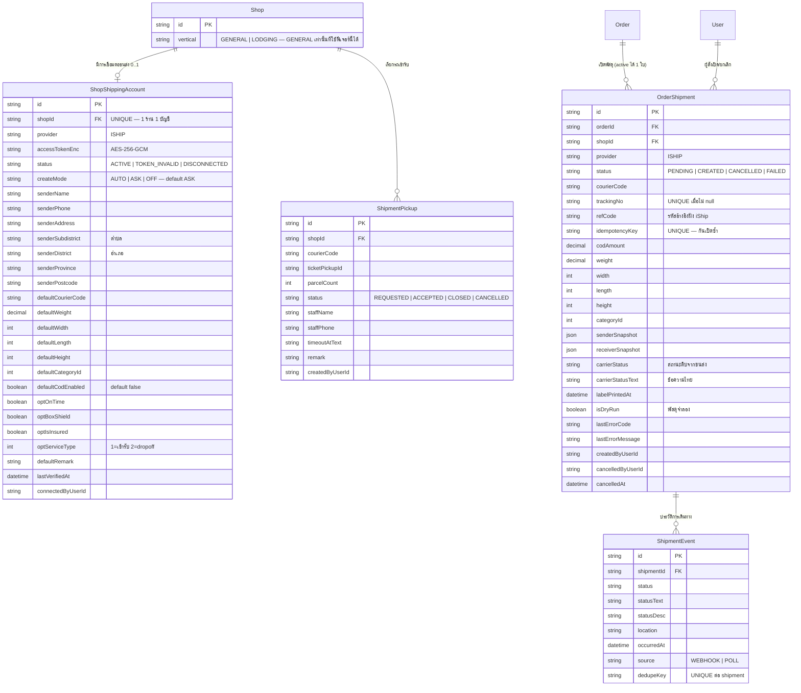

> **โมดูล:** 00022 — iShip Shipping Integration
> **ประเภทเอกสาร:** Database Design & Migration Plan
> **เวอร์ชัน:** 1.0
> **วันที่จัดทำ:** 2026-07-26
> **สถานะ:** Draft — เป็น **contract ที่ freeze แล้ว** สำหรับ SRS/SDS/API/TestCase
> **เจ้าของเอกสาร:** safepay-database (ดู [[Feature-Docs-Ownership]])

# DATABASE: iShip Shipping Integration

---

## 0. 🛑 ข้อควรระวังก่อนแตะ schema นี้

1. **dev กับ prod ใช้ Supabase ตัวเดียวกัน** — การ apply migration = แตะ production ทันที ต้องขอ user ยืนยันก่อนทุกครั้ง
2. **ห้าม `prisma migrate dev`** — DB มี orphaned migration นอก git (Category/Report) `migrate dev` จะ reset และลบข้อมูลจริง ใช้ **`prisma migrate deploy -e .env.local`** กับไฟล์ migration ที่เขียนมือเท่านั้น (ดู `docs/conventions/prisma-shared-db-drift.md`)
3. **ห้าม `prisma db pull`** — จะทับ schema.prisma และดึง model ของ branch อื่นจาก DB ที่แชร์กันเข้ามา รวมถึงทำลาย unmanaged SQL ของ feature 00017 (EXCLUDE constraint)
4. **หลัง apply ต้องแจ้ง user restart dev server** — Prisma client เก่าไม่รู้จัก field ใหม่ → session/route 500
5. migration รอบนี้ **additive ล้วน** ไม่แตะตารางเดิม ไม่มี backfill — ตาราง `Order` / `Shop` **ไม่ถูกแก้แม้แต่คอลัมน์เดียว** (ตั้งใจ ดู §1)

---

## 1. Overview

### สิ่งที่เปลี่ยนแปลง (สรุปภาพรวม)

| สิ่งที่ทำ | ตาราง | ประเภท |
|-----------|-------|--------|
| เก็บการเชื่อมต่อ iShip + ค่าตั้งต้นของร้าน | `ShopShippingAccount` | **ใหม่** |
| เก็บพัสดุที่เปิดกับขนส่ง ผูกกับคำสั่งซื้อ | `OrderShipment` | **ใหม่** |
| เก็บประวัติการเดินทาง/สถานะของพัสดุ | `ShipmentEvent` | **ใหม่** |
| เก็บคำขอเรียกรถเข้ารับ | `ShipmentPickup` | **ใหม่** |
| back-relation ฝั่ง `Shop` และ `Order` | `Shop`, `Order` | **relation เท่านั้น — ไม่มีคอลัมน์ใหม่** |

### สิ่งที่ตรวจสอบแล้วว่า "ไม่ต้อง" ทำ

| เรื่อง | เหตุผล |
|--------|--------|
| **ไม่เพิ่ม `weight` / `width` / `length` / `height` บน `Order`** | น้ำหนัก/ขนาดเป็นคุณสมบัติของ *กล่องที่ส่ง* ไม่ใช่ของ *คำสั่งซื้อ* — 1 ออเดอร์อาจเปิดพัสดุใหม่หลังยกเลิกใบเดิมด้วยขนาดที่ต่างไป เก็บไว้บน `OrderShipment` จึงถูกต้องกว่าและไม่ต้องแตะตารางที่ร้อนที่สุดของระบบ |
| **ไม่แตะ `Order.shippingAddress`** | โครงสร้าง `{ line1, subdistrict, district, province, postcode, note }` ที่ `order.service.ts` ใช้อยู่ ครอบคลุมทุกช่องที่ iShip ต้องการแล้ว (ดู BR-ISHIP-31 เรื่องการจับคู่) |
| **ไม่เพิ่ม entitlement / ตารางเงิน** | ฟีเจอร์นี้ฟรีทุกร้าน ไม่แตะ `SellerWallet` / `WalletTransaction` (BR-ISHIP-50/51) |
| **ไม่เพิ่มสถานะใหม่ใน `Order.status`** | สถานะพัสดุแยกจากสถานะคำสั่งซื้อโดยสิ้นเชิง (BR-ISHIP-40/41) |
| **ไม่สร้างตาราง log แยก** | ใช้ `ShipmentEvent` เก็บทั้ง event จาก webhook และจากการ poll — แยกด้วยคอลัมน์ `source` |

### หลักการออกแบบที่ยึด

- **มิเรอร์ pattern ของ `ShopChannel` (feature 00018)** — token เข้ารหัส, `status` เป็น String, partial unique index สำหรับ "active ได้ทีละอันเดียว" ไม่คิด pattern ใหม่
- **String แทน Prisma enum** ตาม convention เดิมทั้งโปรเจกต์ (`Order.type`, `Shop.kind`, `ShopChannel.status`)
- **เก็บ snapshot ไม่อ้างอิงสด** — ค่าที่ส่งไป iShip แล้ว (ที่อยู่ผู้ส่ง/ผู้รับ, ขนาด, COD) ต้อง freeze ไว้บน `OrderShipment` เพราะถ้าอ้างอิงสด แล้วร้านแก้ค่าตั้งต้นทีหลัง ประวัติพัสดุเก่าจะเปลี่ยนตาม = อธิบายกับขนส่งไม่ได้ (บทเรียนเดียวกับ `Order.depositAmount` ของ feature 00017)

---

## 2. ERD



---

## 3. Tables

### 3.1 `ShopShippingAccount` (ใหม่)

การเชื่อมต่อบัญชีขนส่งของร้าน **รวมค่าตั้งต้นไว้ในตารางเดียวกัน** — ไม่แยกตาราง settings เพราะค่าเหล่านี้ไม่มีความหมายถ้าไม่มีการเชื่อมต่อ และ 1:1 กับ Shop อยู่แล้ว การแยกจะได้แค่ JOIN เพิ่มโดยไม่ได้อะไรกลับมา

| คอลัมน์ | ชนิด | Null | Default | หมายเหตุ |
|---------|------|------|---------|----------|
| `id` | String (uuid) | ✗ | uuid() | PK |
| `shopId` | String | ✗ | — | FK → `Shop.id`, **@unique** (BR-ISHIP-10), ON DELETE CASCADE |
| `provider` | String | ✗ | `"ISHIP"` | เผื่อผู้ให้บริการรายอื่นในอนาคต ไม่ต้อง migrate ซ้ำ |
| `accessTokenEnc` | String | ✗ | — | 🛑 AES-256-GCM ผ่าน `src/lib/token-crypto.ts` (env `CHANNEL_TOKEN_KEY`) **ห้ามเก็บ plaintext ห้าม log ห้ามส่งกลับ client** |
| `tokenLast4` | String | ✓ | null | 4 ตัวท้ายไว้แสดงยืนยันตัวใบ (BR-ISHIP-13) |
| `status` | String | ✗ | `"ACTIVE"` | `ACTIVE` \| `TOKEN_INVALID` \| `DISCONNECTED` |
| `createMode` | String | ✗ | `"ASK"` | `AUTO` \| `ASK` \| `OFF` — **default ASK ตาม BR-ISHIP-20** |
| `senderName` | String | ✓ | null | ที่อยู่ผู้ส่ง — บังคับครบก่อนเปิดใช้งาน (BR-ISHIP-30) แต่ nullable ใน DB เพราะกรอกทีหลังได้ |
| `senderPhone` | String | ✓ | null | |
| `senderAddress` | String | ✓ | null | บ้านเลขที่/ถนน |
| `senderSubdistrict` | String | ✓ | null | **ตำบล/แขวง** → ส่งไปช่อง `src_district` ของ iShip |
| `senderDistrict` | String | ✓ | null | **อำเภอ/เขต** → ส่งไปช่อง `src_amphure` ของ iShip |
| `senderProvince` | String | ✓ | null | |
| `senderPostcode` | String | ✓ | null | |
| `defaultCourierCode` | String | ✓ | null | รหัสขนส่งจาก `GET /api/courier_code` |
| `defaultWeight` | Decimal(6,2) | ✓ | null | กิโลกรัม |
| `defaultWidth` | Int | ✓ | null | เซนติเมตร |
| `defaultLength` | Int | ✓ | null | เซนติเมตร |
| `defaultHeight` | Int | ✓ | null | เซนติเมตร |
| `defaultCategoryId` | Int | ✓ | null | 0-11, 99 ตามที่ iShip กำหนด |
| `defaultCodEnabled` | Boolean | ✗ | `false` | **ต้อง false ตาม BR-ISHIP-27** |
| `optOnTime` | Boolean | ✗ | `false` | ส่งตรงเวลา |
| `optBoxShield` | Boolean | ✗ | `false` | ประกันกล่อง |
| `optIsInsured` | Boolean | ✗ | `false` | ประกันสินค้า |
| `optProductValue` | Decimal(12,2) | ✓ | null | มูลค่าที่เอาประกัน (ใช้เมื่อ `optIsInsured`) |
| `optServiceType` | Int | ✓ | null | `1` = เข้ารับ, `2` = นำไปส่งเอง; null = ตามตั้งค่าฝั่ง iShip |
| `defaultRemark` | String | ✓ | null | หมายเหตุถึงคนส่งของ |
| `lastVerifiedAt` | DateTime | ✓ | null | เวลาที่ทดสอบ Token ผ่านล่าสุด |
| `lastVerifyError` | String | ✓ | null | สาเหตุที่ทดสอบไม่ผ่านครั้งล่าสุด |
| `connectedByUserId` | String | ✗ | — | ใครเป็นคนเชื่อมต่อ |
| `createdAt` / `updatedAt` | DateTime | ✗ | now() / @updatedAt | |

**Index:** `@@index([status])` — ใช้กับงานตรวจสอบสถานะรวม

> หมายเหตุการออกแบบ: **ไม่มี** คอลัมน์เก็บยอดเงินคงเหลือของบัญชี iShip โดยเจตนา (BR-ISHIP-53) — เก็บแล้วจะสื่อผิดว่า Deep ดูแลเงินก้อนนั้น

### 3.2 `OrderShipment` (ใหม่)

พัสดุ 1 ใบที่เปิดกับขนส่ง ผูกกับคำสั่งซื้อ 1 รายการ

| คอลัมน์ | ชนิด | Null | Default | หมายเหตุ |
|---------|------|------|---------|----------|
| `id` | String (uuid) | ✗ | uuid() | PK |
| `orderId` | String | ✗ | — | FK → `Order.id`, ON DELETE CASCADE |
| `shopId` | String | ✗ | — | FK → `Shop.id` — denormalized เพื่อ query ระดับร้านโดยไม่ join Order |
| `provider` | String | ✗ | `"ISHIP"` | |
| `status` | String | ✗ | `"PENDING"` | `PENDING` (กำลังสร้าง) \| `CREATED` (สำเร็จ) \| `CANCELLED` \| `FAILED` |
| `courierCode` | String | ✓ | null | รหัสขนส่งที่ใช้จริง |
| `courierName` | String | ✓ | null | ชื่อที่แสดง ณ เวลาสร้าง (cache ไม่ re-fetch) |
| `trackingNo` | String | ✓ | null | เลขติดตาม — unique เมื่อไม่ null (ดู §4) |
| `refCode` | String | ✓ | null | รหัสอ้างอิงที่ iShip คืนมา (`data.ref`) |
| `externalId` | String | ✓ | null | `data.id` ฝั่ง iShip |
| `idempotencyKey` | String | ✗ | — | **@unique** — คีย์กันเปิดซ้ำ (BR-ISHIP-22/26) รูปแบบใน §3.2.1 |
| `codAmount` | Decimal(12,2) | ✗ | `0` | ยอดเก็บเงินปลายทางที่ส่งไปจริง |
| `weight` | Decimal(6,2) | ✓ | null | กิโลกรัม (ค่าที่ร้านแจ้ง) |
| `width` / `length` / `height` | Int | ✓ | null | เซนติเมตร |
| `categoryId` | Int | ✓ | null | |
| `senderSnapshot` | Json | ✓ | null | ที่อยู่ผู้ส่ง ณ เวลาส่ง — freeze ไม่อ้างอิงสด |
| `receiverSnapshot` | Json | ✓ | null | ที่อยู่ผู้รับ ณ เวลาส่ง — freeze |
| `optionsSnapshot` | Json | ✓ | null | บริการเสริมที่เลือกจริง |
| `carrierStatus` | String | ✓ | null | รหัสสถานะดิบจากขนส่ง (`order_success`, `picked_up`, `delivered`, ...) |
| `carrierStatusText` | String | ✓ | null | ข้อความไทยที่แสดงต่อผู้ใช้ |
| `carrierStatusAt` | DateTime | ✓ | null | เวลาของสถานะล่าสุด |
| `isOverSize` | Boolean | ✗ | `false` | ขนส่งวัดได้เกินที่ร้านแจ้ง (จาก webhook) |
| `isOverWeight` | Boolean | ✗ | `false` | ขนส่งชั่งได้เกินที่ร้านแจ้ง |
| `carrierPrice` | Decimal(12,2) | ✓ | null | **ค่าส่งที่ขนส่งคิดจริง = ต้นทุนของออเดอร์ใบนี้** (แก้ 2026-08-09 — เดิมเขียนว่า "แสดงเฉย ๆ" ซึ่งไม่จริง ไม่เคยมีหน้าไหน render และไม่เคยมีข้อมูลสักแถว) · 🛑 มาจากฟิลด์ **`discount_price`** ของ `query_orders`/`get_order` ซึ่ง**ไม่ใช่ส่วนลด** · `price`/`total_price` ไม่มีในทั้งสอง endpoint — มีเฉพาะใน payload ของ webhook (ที่ไม่เคยเปิดใช้บน prod) และ response ของ `check-price` |
| `actualWeight` | Decimal(6,2) | ✓ | null | **น้ำหนักที่ขนส่งชั่งได้จริง** (kg) — แยกจาก `weight` ข้างบนซึ่งเป็นค่าที่ร้านแจ้ง · 🛑 `query_orders` เรียกมันว่า `actual_weight` แต่ `get_order` เรียกว่า `weight` (ไม่มี `actual_weight` เลย) — ชื่อเดียวกันคนละความหมายในสอง endpoint ยืนยันกับพัสดุจริง 12 ใบ 2026-08-09 · ข้อมูลจริง: 92 จาก 151 ใบชั่งได้หนักกว่าที่ร้านแจ้ง |
| `estimatedPrice` | Decimal(12,2) | ✓ | null | ค่าส่งโดยประมาณ ณ เวลาที่กดสร้างพัสดุ (`check-price` ด้วยน้ำหนักที่ร้านแจ้ง) — **ตัวสำรองเท่านั้น มี `carrierPrice` เมื่อไหร่ต้องใช้ตัวจริงเสมอ** · มีเพราะ iShip ไม่เปิดราคาจริงจนกว่าขนส่งจะเข้ารับและชั่ง (ใบ `status=1` คืน `discount_price=0` · พิสูจน์กับ `TH271991F5GZ5E` 2026-08-10) |
| `codFee` | Decimal(12,2) | ✓ | null | ค่าธรรมเนียมเก็บเงินปลายทางที่ขนส่งหักจากยอดโอนคืนร้าน (`cod_fee`) — **เงินคนละก้อนกับค่าส่ง ไม่ทับซ้อน** (คิดเป็น % ของยอด COD) · **รู้ตั้งแต่วินาทีที่สร้างพัสดุ** ไม่ต้องรอชั่ง จึงเก็บได้ทันทีแม้ `carrierPrice` ยังว่าง |
| `labelPrintedAt` | DateTime | ✓ | null | เวลาพิมพ์ใบปะหน้าครั้งล่าสุด |
| `labelPrintCount` | Int | ✗ | `0` | จำนวนครั้งที่พิมพ์ |
| `isDryRun` | Boolean | ✗ | `false` | 🛑 พัสดุจำลอง (BR-ISHIP-61) — ต้องแสดงเครื่องหมายบนหน้าจอ |
| `lastErrorCode` | String | ✓ | null | รหัสข้อผิดพลาดที่จับกลุ่มแล้วของเรา |
| `lastErrorMessage` | String @db.Text | ✓ | null | ข้อความดิบจาก iShip สำหรับทีมงานตรวจสอบ — **ห้ามแสดงตรงต่อผู้ใช้** |
| `attemptCount` | Int | ✗ | `0` | จำนวนครั้งที่พยายามสร้าง |
| `createdByUserId` | String | ✓ | null | ใครสั่งเปิด (null = ระบบสร้างอัตโนมัติในโหมด AUTO) |
| `cancelledByUserId` | String | ✓ | null | |
| `cancelledAt` | DateTime | ✓ | null | |
| `createdAt` / `updatedAt` | DateTime | ✗ | now() / @updatedAt | |

#### 3.2.1 `idempotencyKey` — กติกาสร้างคีย์

รูปแบบ: `<orderId>:<attemptGroup>`

- `attemptGroup` เริ่มที่ `1` และ **เพิ่มขึ้นเมื่อพัสดุใบก่อนหน้าถูกยกเลิกเท่านั้น**
- การกด "ลองใหม่" จากใบที่ `FAILED` ต้อง **ใช้คีย์เดิม** — เพื่อว่าถ้าคำขอเดิมสำเร็จที่ฝั่ง iShip แต่คำตอบมาไม่ถึงเรา การยิงซ้ำจะไม่เกิดพัสดุใบที่สอง
- ค่านี้ถูกส่งไปเป็น `custom_order_id` ของ iShip ด้วย (BR-ISHIP-25) ทำให้สอบทานย้อนกลับได้ทั้งสองฝั่ง

### 3.3 `ShipmentEvent` (ใหม่)

ประวัติการเดินทางของพัสดุ

| คอลัมน์ | ชนิด | Null | Default | หมายเหตุ |
|---------|------|------|---------|----------|
| `id` | String (uuid) | ✗ | uuid() | PK |
| `shipmentId` | String | ✗ | — | FK → `OrderShipment.id`, ON DELETE CASCADE |
| `status` | String | ✗ | — | รหัสสถานะจากขนส่ง |
| `statusText` | String | ✓ | null | ข้อความไทยสั้น |
| `statusDesc` | String @db.Text | ✓ | null | คำอธิบายเต็มจากขนส่ง |
| `location` | String | ✓ | null | ตำแหน่งพัสดุ |
| `occurredAt` | DateTime | ✗ | — | เวลาที่เกิดเหตุการณ์ (ของขนส่ง ไม่ใช่เวลาที่เราบันทึก) |
| `source` | String | ✗ | `"WEBHOOK"` | `WEBHOOK` \| `POLL` |
| `dedupeKey` | String | ✗ | — | `<status>:<occurredAt epoch>` — **@@unique([shipmentId, dedupeKey])** กันบันทึกซ้ำเมื่อ webhook ยิงซ้ำ (FR-ISHIP-041) |
| `payload` | Json | ✓ | null | ข้อมูลดิบไว้ตรวจสอบ |
| `createdAt` | DateTime | ✗ | now() | |

**Index:** `@@index([shipmentId, occurredAt])` — ใช้ดึงไทม์ไลน์เรียงเวลา

### 3.4 `ShipmentPickup` (ใหม่)

คำขอเรียกรถเข้ารับพัสดุ — ระดับร้าน ไม่ใช่ระดับออเดอร์ (FR-ISHIP-051)

| คอลัมน์ | ชนิด | Null | Default | หมายเหตุ |
|---------|------|------|---------|----------|
| `id` | String (uuid) | ✗ | uuid() | PK |
| `shopId` | String | ✗ | — | FK → `Shop.id`, ON DELETE CASCADE |
| `provider` | String | ✗ | `"ISHIP"` | |
| `courierCode` | String | ✗ | — | |
| `ticketPickupId` | String | ✓ | null | หมายเลขคำขอฝั่ง iShip |
| `parcelCount` | Int | ✗ | `1` | จำนวนกล่อง |
| `pickupAddress` | String | ✓ | null | snapshot ที่อยู่ที่ใช้เรียก |
| `remark` | String | ✓ | null | |
| `status` | String | ✗ | `"REQUESTED"` | `REQUESTED` \| `ACCEPTED` \| `CLOSED` \| `CANCELLED` \| `FAILED` |
| `staffName` / `staffPhone` | String | ✓ | null | ข้อมูลพนักงานที่จะมารับ (ถ้า iShip ส่งมา) |
| `timeoutAtText` | String | ✓ | null | ช่วงเวลาที่จะเข้ารับ เป็นข้อความตามที่ขนส่งส่งมา |
| `ticketMessage` | String @db.Text | ✓ | null | ข้อความจากขนส่ง |
| `isDryRun` | Boolean | ✗ | `false` | |
| `lastErrorMessage` | String @db.Text | ✓ | null | |
| `createdByUserId` | String | ✗ | — | |
| `acceptedAt` / `closedAt` / `cancelledAt` | DateTime | ✓ | null | |
| `createdAt` / `updatedAt` | DateTime | ✗ | now() / @updatedAt | |

**Index:** `@@index([shopId, status])`

### 3.5 `Shop` และ `Order` — back-relation เท่านั้น

```prisma
model Shop {
  // ... เดิมทั้งหมด ไม่แตะ
  shippingAccount ShopShippingAccount?
  shipmentPickups ShipmentPickup[]
  orderShipments  OrderShipment[]
}

model Order {
  // ... เดิมทั้งหมด ไม่แตะ
  shipments OrderShipment[]
}
```

🛑 **ไม่มีคอลัมน์ใหม่บน `Shop` และ `Order`** — Prisma บังคับให้ประกาศ back-relation ทั้งสองฝั่ง แต่ไม่สร้างคอลัมน์จริงใน DB

---

## 4. Indexes & Constraints

| Index / Constraint | ตาราง | เหตุผล |
|-------------------|-------|--------|
| `ShopShippingAccount.shopId` **UNIQUE** | ShopShippingAccount | 1 ร้าน 1 บัญชี (BR-ISHIP-10) |
| `OrderShipment.idempotencyKey` **UNIQUE** | OrderShipment | 🛑 กันเปิดพัสดุซ้ำที่ระดับฐานข้อมูล ไม่ใช่ระดับปุ่ม (BR-ISHIP-22/26) |
| **Partial UNIQUE** `OrderShipment(orderId) WHERE status <> 'CANCELLED'` | OrderShipment | 1 ออเดอร์ = พัสดุที่ยังใช้งานอยู่ได้ใบเดียว แต่ยกเลิกแล้วเปิดใหม่ได้ — Prisma ประกาศ partial index ไม่ได้ ต้องเขียน SQL มือ (pattern เดียวกับ `ShopChannel_active_partial_unique` ของ feature 00018) |
| **Partial UNIQUE** `OrderShipment(trackingNo) WHERE trackingNo IS NOT NULL` | OrderShipment | เลขติดตามห้ามซ้ำ แต่ใบที่ยังไม่สำเร็จมี trackingNo เป็น null ได้หลายใบ |
| `@@unique([shipmentId, dedupeKey])` | ShipmentEvent | กัน webhook ยิงซ้ำแล้วไทม์ไลน์บวม |
| `@@index([shopId, status])` | OrderShipment | หน้ารายการออเดอร์ของร้าน + งานพิมพ์หลายใบ |
| `@@index([shipmentId, occurredAt])` | ShipmentEvent | ดึงไทม์ไลน์เรียงเวลา |
| `@@index([shopId, status])` | ShipmentPickup | หน้าคำขอเข้ารับของร้าน |
| `@@index([status])` | ShopShippingAccount | หาบัญชีที่ token ใช้ไม่ได้เพื่อแจ้งเตือน |

---

## 5. Migration Plan

### 5.1 ลำดับ

**1 migration file, additive ล้วน** — สร้าง 4 ตารางใหม่ + 2 partial unique index ที่เขียน SQL มือ
ไม่มี backfill (ตารางใหม่ทั้งหมดเริ่มจากว่าง) ไม่แตะตารางเดิมแม้แต่คอลัมน์เดียว → **rollback ปลอดภัย 100%**

ชื่อโฟลเดอร์: `prisma/migrations/20260726000000_iship_shipping_integration/`

### 5.2 Migration SQL (โครง)

```sql
-- 1) ShopShippingAccount
CREATE TABLE "ShopShippingAccount" (
  "id" TEXT NOT NULL,
  "shopId" TEXT NOT NULL,
  "provider" TEXT NOT NULL DEFAULT 'ISHIP',
  "accessTokenEnc" TEXT NOT NULL,
  "tokenLast4" TEXT,
  "status" TEXT NOT NULL DEFAULT 'ACTIVE',
  "createMode" TEXT NOT NULL DEFAULT 'ASK',
  -- ที่อยู่ผู้ส่ง
  "senderName" TEXT, "senderPhone" TEXT, "senderAddress" TEXT,
  "senderSubdistrict" TEXT, "senderDistrict" TEXT,
  "senderProvince" TEXT, "senderPostcode" TEXT,
  -- ค่าตั้งต้นพัสดุ
  "defaultCourierCode" TEXT,
  "defaultWeight" DECIMAL(6,2),
  "defaultWidth" INTEGER, "defaultLength" INTEGER, "defaultHeight" INTEGER,
  "defaultCategoryId" INTEGER,
  "defaultCodEnabled" BOOLEAN NOT NULL DEFAULT false,
  "optOnTime" BOOLEAN NOT NULL DEFAULT false,
  "optBoxShield" BOOLEAN NOT NULL DEFAULT false,
  "optIsInsured" BOOLEAN NOT NULL DEFAULT false,
  "optProductValue" DECIMAL(12,2),
  "optServiceType" INTEGER,
  "defaultRemark" TEXT,
  "lastVerifiedAt" TIMESTAMP(3),
  "lastVerifyError" TEXT,
  "connectedByUserId" TEXT NOT NULL,
  "createdAt" TIMESTAMP(3) NOT NULL DEFAULT CURRENT_TIMESTAMP,
  "updatedAt" TIMESTAMP(3) NOT NULL,
  CONSTRAINT "ShopShippingAccount_pkey" PRIMARY KEY ("id")
);
CREATE UNIQUE INDEX "ShopShippingAccount_shopId_key" ON "ShopShippingAccount"("shopId");
CREATE INDEX "ShopShippingAccount_status_idx" ON "ShopShippingAccount"("status");
ALTER TABLE "ShopShippingAccount" ADD CONSTRAINT "ShopShippingAccount_shopId_fkey"
  FOREIGN KEY ("shopId") REFERENCES "Shop"("id") ON DELETE CASCADE ON UPDATE CASCADE;

-- 2) OrderShipment
CREATE TABLE "OrderShipment" ( /* ตาม §3.2 */ );
CREATE UNIQUE INDEX "OrderShipment_idempotencyKey_key" ON "OrderShipment"("idempotencyKey");
CREATE INDEX "OrderShipment_shopId_status_idx" ON "OrderShipment"("shopId", "status");
CREATE INDEX "OrderShipment_orderId_idx" ON "OrderShipment"("orderId");

-- 🛑 partial unique — Prisma ประกาศไม่ได้ ต้องเขียนมือ
CREATE UNIQUE INDEX "OrderShipment_active_order_key"
  ON "OrderShipment"("orderId") WHERE "status" <> 'CANCELLED';
CREATE UNIQUE INDEX "OrderShipment_trackingNo_key"
  ON "OrderShipment"("trackingNo") WHERE "trackingNo" IS NOT NULL;

-- 3) ShipmentEvent
CREATE TABLE "ShipmentEvent" ( /* ตาม §3.3 */ );
CREATE UNIQUE INDEX "ShipmentEvent_shipmentId_dedupeKey_key"
  ON "ShipmentEvent"("shipmentId", "dedupeKey");
CREATE INDEX "ShipmentEvent_shipmentId_occurredAt_idx"
  ON "ShipmentEvent"("shipmentId", "occurredAt");

-- 4) ShipmentPickup
CREATE TABLE "ShipmentPickup" ( /* ตาม §3.4 */ );
CREATE INDEX "ShipmentPickup_shopId_status_idx" ON "ShipmentPickup"("shopId", "status");
```

> 🛑 partial unique index ทั้ง 2 ตัวเป็น **unmanaged SQL** — `prisma db pull` จะทำลายทิ้ง (ปัญหาเดียวกับ EXCLUDE constraint ของ feature 00017) ห้ามรัน `db pull` บน branch นี้

### 5.3 วิธี Apply

```bash
# 🛑 prod = dev Supabase แชร์กัน — ขอ user ยืนยันก่อนทุกครั้ง
npx prisma migrate deploy --schema prisma/schema.prisma   # ใช้ -e .env.local
npx prisma generate

# แจ้ง user restart dev server (Prisma client เก่าไม่รู้จัก model ใหม่ → route 500)
```

### 5.4 Rollback

```sql
DROP TABLE IF EXISTS "ShipmentEvent";
DROP TABLE IF EXISTS "ShipmentPickup";
DROP TABLE IF EXISTS "OrderShipment";
DROP TABLE IF EXISTS "ShopShippingAccount";
```

ปลอดภัยเต็มที่ — ไม่มีคอลัมน์ที่เพิ่มบนตารางเดิม ไม่มี backfill ที่ต้องย้อน ข้อมูลของฟีเจอร์อื่นไม่ได้รับผลกระทบ

### 5.5 ผลกระทบ

| ระบบ | ผลกระทบ |
|------|---------|
| คำสั่งซื้อเดิม | **ไม่มี** — ไม่แตะตาราง `Order` |
| ร้านค้าเดิม | **ไม่มี** — ไม่แตะตาราง `Shop` |
| ร้านที่ไม่เชื่อมต่อ iShip | **ไม่มี** — ไม่มีแถวใน `ShopShippingAccount` = ฟีเจอร์ไม่ทำงาน |
| ร้าน LODGING | **ไม่มี** — ถูกกันตั้งแต่ชั้น service (BR-ISHIP-01/02) |
| Trust Score / Badge / รีวิว | **ไม่มี** (BR-ISHIP-44) |
| กระเป๋าเงินร้าน | **ไม่มี** (BR-ISHIP-51) |
| ขนาด DB | เพิ่มตามจำนวนพัสดุจริง — `ShipmentEvent` โตเร็วสุด (~7 แถวต่อพัสดุ) ดู §6 |

---

## 6. Retention / ข้อควรระวัง

- **`ShipmentEvent` โตเร็วที่สุด** — พัสดุ 1 ใบมีประวัติเดินทางราว 5–10 เหตุการณ์ ถ้าระบบมีพัสดุ 10,000 ใบ/เดือน = ~70,000–100,000 แถว/เดือน ยังไม่ต้องทำ retention ในเวอร์ชันนี้ แต่ควรทบทวนเมื่อเกิน 5 ล้านแถว
- **`lastErrorMessage` เก็บข้อความดิบจากผู้ให้บริการ** — ห้ามแสดงตรงต่อผู้ใช้ และห้ามใส่ Token ลงในนั้นเด็ดขาด ต้องกรองก่อนบันทึกทุกครั้ง
- **`senderSnapshot` / `receiverSnapshot` มีข้อมูลส่วนบุคคล** — หน้าฝั่ง seller อยู่ใต้ client layout ข้อมูลจะถูก serialize เข้า flight payload ทั้งก้อน ต้องกรอง/ปิดบังที่ต้นทางฝั่งเซิร์ฟเวอร์ ไม่ใช่แค่ไม่แสดงบนหน้าจอ (ดู memory `feedback_rsc_pii_neutralize_at_source`)
- **`isDryRun = true` ต้องกรองออกจากสถิติทุกชนิด** — ไม่งั้นตัวเลข KPI จะเพี้ยนเพราะนับพัสดุจำลอง
- **partial unique index เป็น unmanaged SQL** — ห้าม `prisma db pull`, ห้าม `migrate dev`

---

## 7. Traceability

| ตาราง/คอลัมน์ | รองรับข้อกำหนด |
|---------------|----------------|
| `ShopShippingAccount.shopId` UNIQUE | BR-ISHIP-10 |
| `ShopShippingAccount.accessTokenEnc` + `tokenLast4` | BR-ISHIP-12, BR-ISHIP-13, FR-ISHIP-001 |
| `ShopShippingAccount.status` | BR-ISHIP-14, FR-ISHIP-002 |
| `ShopShippingAccount.createMode` default `ASK` | BR-ISHIP-20, FR-ISHIP-012 |
| `ShopShippingAccount.sender*` | BR-ISHIP-30, BR-ISHIP-31, FR-ISHIP-010 |
| `ShopShippingAccount.defaultCodEnabled` default `false` | BR-ISHIP-27 |
| `OrderShipment.idempotencyKey` UNIQUE | BR-ISHIP-22, BR-ISHIP-25, BR-ISHIP-26, FR-ISHIP-024 |
| partial unique `orderId WHERE status <> 'CANCELLED'` | BR-ISHIP-22, FR-ISHIP-050 |
| `OrderShipment.*Snapshot` | หลักการ freeze snapshot §1 |
| `OrderShipment.carrierStatus*` แยกจาก `Order.status` | BR-ISHIP-40, BR-ISHIP-41 |
| `OrderShipment.isDryRun` | BR-ISHIP-60, BR-ISHIP-61 |
| `OrderShipment.createdByUserId` / `cancelledByUserId` | BR-ISHIP-28 |
| `OrderShipment.labelPrintedAt` / `labelPrintCount` | FR-ISHIP-030 |
| `OrderShipment.isOverWeight` / `isOverSize` | FR-ISHIP-041, BR-ISHIP-34 |
| `ShipmentEvent.dedupeKey` UNIQUE | FR-ISHIP-041 |
| `ShipmentPickup.*` | FR-ISHIP-051 |
| ไม่มีคอลัมน์ยอดเงิน iShip | BR-ISHIP-53 |
| ไม่แตะ `SellerWallet` | BR-ISHIP-50, BR-ISHIP-51 |

---

## 8. Open Questions

| # | คำถาม | ผลต่อ schema |
|---|--------|--------------|
| **DB-OQ-1** | webhook ของ iShip มีลายเซ็นยืนยันตัวตนหรือไม่ (OQ-1 ใน BRD) | ถ้ามี ต้องเพิ่มที่เก็บ secret ต่อร้านใน `ShopShippingAccount` — ตอนนี้ยังไม่เพิ่ม รอคำตอบ |
| **DB-OQ-2** | iShip ให้ตั้ง webhook แยกต่อร้าน หรือได้ URL เดียวรวมทุกร้าน | ถ้าเป็น URL เดียวรวม การจับคู่ต้องพึ่ง `refCode`/`trackingNo` อย่างเดียว — ปัจจุบันออกแบบรองรับกรณีนี้ไว้แล้ว |

---

## 9. สรุป (Summary)

- **4 ตารางใหม่** — `ShopShippingAccount`, `OrderShipment`, `ShipmentEvent`, `ShipmentPickup`
- **ไม่แตะตารางเดิมแม้แต่คอลัมน์เดียว** — `Order` และ `Shop` ได้แค่ back-relation ที่ไม่สร้างคอลัมน์จริง
- **กันเปิดพัสดุซ้ำที่ระดับฐานข้อมูล** ด้วย `idempotencyKey` UNIQUE + partial unique บน `orderId`
- **1 migration additive ล้วน ไม่มี backfill** — rollback คือ DROP TABLE 4 ตัว ปลอดภัยเต็มที่
- **Token ใช้กลไกเข้ารหัสเดิมของระบบ** (`token-crypto.ts`) ไม่สร้างของใหม่
- **ไม่เก็บยอดเงิน iShip โดยเจตนา** เพื่อไม่ให้สื่อผิดว่า Deep ดูแลเงินก้อนนั้น

---

## ส่วนขยาย 2026-08-01 — คอลัมน์สำหรับการผูกพัสดุ

migration: `prisma/migrations/20260801100000_iship_shipment_source/`

| คอลัมน์ | ชนิด | หมายเหตุ |
|---|---|---|
| `OrderShipment.source` | `TEXT NOT NULL DEFAULT 'CREATED'` | `'CREATED'` = Deep เปิดใบนี้เอง · `'LINKED'` = ร้านเปิดไว้บน iShip แล้วเอามาผูก |
| `OrderShipment.linkedAt` | `TIMESTAMP(3)` nullable | เวลาที่กดผูก — ต่างจาก `createdAt` ซึ่งคือเวลาที่เราบันทึกแถว (พัสดุจริงอาจถูกเปิดตั้งแต่เมื่อวาน) |
| index | `("shopId", "source")` | หน้ารายการ/สถิติระดับร้าน |

`DEFAULT 'CREATED'` ทำให้แถวเดิมทั้งหมดแปลว่า "Deep เปิดเอง" ซึ่งตรงกับความจริง เพราะก่อนหน้านี้
ยังไม่มีทางผูกใบจากภายนอกเข้ามาได้เลย

**ทำไมต้องมีคอลัมน์นี้ ไม่ใช่เดาจาก `idempotencyKey`:** รูปของคีย์บอกได้ก็จริง แต่นั่นคือการฝังกฎ
ไว้ในสตริงซึ่งอ่านไม่ออกจากตาราง และปุ่ม "ยกเลิก" ของสองชนิดมีความหมายต่างกันคนละเรื่อง
(ใบที่เราเปิดเอง = ยกเลิกกับขนส่งจริง · ใบที่ผูก = ตัดความสัมพันธ์เฉย ๆ)

🛑 **partial unique ที่ยังบังคับใช้กับใบที่ผูกด้วย** — `OrderShipment_trackingNo_key`
(`WHERE trackingNo IS NOT NULL`) ไม่สนสถานะ จึงเป็นเหตุผลที่ "เลิกผูก" ต้อง **ลบแถว**
ไม่ใช่ mark `CANCELLED` (BR-ISHIP-29) — ไม่งั้นเลขนั้นถูกจองไว้ถาวร

---

## ส่วนขยาย 2026-08-06 — คอลัมน์บันทึกการโอนเงิน COD

### `OrderShipment.codSettledAt` (ใหม่)

| คอลัมน์ | ชนิด | Null | ความหมาย |
|---------|------|:----:|----------|
| `codSettledAt` | `DateTime` | ✅ | วันเวลาที่ iShip แจ้งว่าเงินเก็บปลายทางเข้าระบบร้าน (`settlement_at`) — `NULL` = ยังไม่ได้รับแจ้ง |

**ทำไมต้องมีคอลัมน์นี้ทั้งที่มี `Order.codReceivedAt` อยู่แล้ว:** สองช่องนี้ตอบคนละคำถาม

- `Order.codReceivedAt` = "ร้านได้เงินหรือยัง" — เขียนได้ทั้งจากร้านกดเองและจากระบบ
- `OrderShipment.codSettledAt` = "ขนส่งแจ้งว่าโอนเมื่อไร" — เป็นหลักฐานว่าการยืนยันอัตโนมัติเกิดจากอะไร และเป็น **กุญแจกันเขียนซ้ำ** ของรอบ sync (มีค่าแล้ว = เคยประมวลผลไปแล้ว ข้าม)

ถ้ารวมเป็นช่องเดียว จะแยกไม่ออกว่าใบที่ร้านกดเองไปแล้วเคยได้รับแจ้งจากขนส่งหรือยัง แล้วรอบ sync จะประมวลผลซ้ำทุกรอบตลอดไป

**Migration:** `ALTER TABLE "OrderShipment" ADD COLUMN "codSettledAt" TIMESTAMP(3);` — additive ล้วน ไม่มี default ไม่มี backfill ไม่แตะแถวเดิม

**ไม่แตะ:** `Order.codReceivedAt` / `Order.codReceivedByUserId` คงรูปเดิมทุกประการ เปลี่ยนแค่ "ใครเขียนได้บ้าง" ซึ่งเป็นเรื่องของโค้ด ไม่ใช่ของ schema
