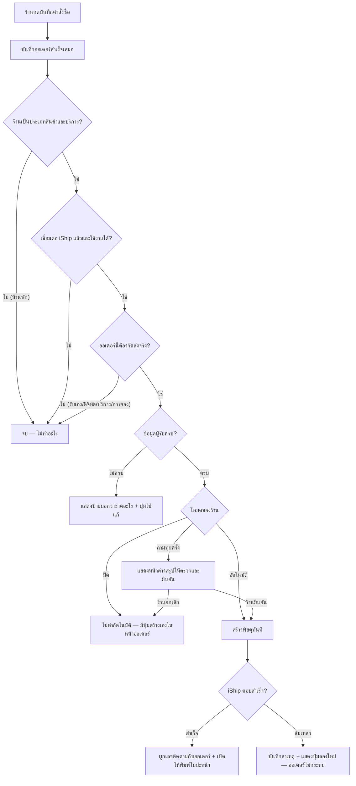

> **โมดูล:** 00022 — iShip Shipping Integration
> **ประเภทเอกสาร:** Product Requirements Document (PRD)
> **เวอร์ชัน:** 1.0
> **วันที่จัดทำ:** 2026-07-26
> **สถานะ:** Draft — รอ user review
> **เจ้าของเอกสาร:** BA + PO + PM (ดู [[Feature-Docs-Ownership]])

# PRD: เชื่อมระบบขนส่ง iShip (iShip Shipping Integration)

---

## Executive Summary

ทุกวันนี้ร้านค้าบน Deep ที่ขายสินค้าจริงต้องทำงานสองที่ซ้ำกัน — สร้างคำสั่งซื้อที่ Deep แล้วเปิดอีกแท็บไปกรอกชื่อ-ที่อยู่-เบอร์ผู้รับซ้ำอีกรอบในระบบขนส่ง เพื่อให้ได้เลขพัสดุกับใบปะหน้ามาแปะกล่อง ยิ่งวันไหนออเดอร์เยอะ ยิ่งเสียเวลาและยิ่งพิมพ์ที่อยู่ผิด

ฟีเจอร์นี้ทำให้ร้านผูกบัญชี **iShip** (แพลตฟอร์มรวมขนส่งไทย — Flash, J&T, Kerry, SPX, ไปรษณีย์ไทย, DHL ฯลฯ) เข้ากับร้านของตัวเองบน Deep ได้ด้วยการวาง Token ที่ได้จากหลังบ้าน iShip ครั้งเดียว หลังจากนั้นเมื่อสร้างคำสั่งซื้อที่ Deep ระบบจะส่งข้อมูลไปเปิดพัสดุที่ iShip ให้ ได้ **เลขติดตามพัสดุ** กลับมาผูกกับออเดอร์ทันที และ **สั่งพิมพ์ใบปะหน้าขนาด A6 ได้จากหน้าเราเลย** ไม่ต้องสลับระบบ

ผลลัพธ์ที่ต้องการคือ ร้านจบงานส่งของได้ในหน้าจอเดียว ลดการพิมพ์ที่อยู่ผิด และผู้ซื้อได้เลขพัสดุติดตามเร็วขึ้นโดยที่ร้านไม่ต้องมาแปะเอง

ฟีเจอร์นี้ **ให้ใช้ฟรีทุกร้าน** Deep ไม่คิดค่าบริการและไม่ยุ่งกับเงินค่าส่ง — ค่าขนส่งและยอดเก็บเงินปลายทางเป็นความสัมพันธ์ระหว่างร้านกับ iShip โดยตรง

---

## 1. Business Goals & KPIs

### 1.1 เป้าหมายทางธุรกิจ

| เป้าหมาย | รายละเอียด |
|----------|-----------|
| **ลดงานซ้ำซ้อนของร้าน** | ตัดขั้นตอน "กรอกที่อยู่ผู้รับซ้ำในระบบขนส่ง" ออกทั้งหมด ข้อมูลที่กรอกที่ Deep ครั้งเดียวไหลไปถึงขนส่ง |
| **ทำให้ Deep เป็นหน้าจอหลักที่ร้านเปิดทั้งวัน** | เมื่อเปิดพัสดุและพิมพ์ใบปะหน้าได้จากที่นี่ ร้านไม่มีเหตุผลต้องย้ายไปทำงานบนแท็บอื่น = ใช้ Deep ลึกขึ้นและถี่ขึ้น |
| **ยกระดับความน่าเชื่อถือของออเดอร์** | ออเดอร์มีเลขพัสดุจริงผูกอยู่ ผู้ซื้อตรวจสอบได้เอง ลดข้อพิพาท "ส่งของแล้วหรือยัง" ซึ่งเป็นแกนหลักของแพลตฟอร์ม |
| **ลดความผิดพลาดในการจัดส่ง** | ที่อยู่มาจากชุดข้อมูลตำบล/อำเภอมาตรฐานของระบบ แทนการพิมพ์มือซ้ำรอบสอง |

### 1.2 ตัวชี้วัดความสำเร็จ (KPIs)

| KPI | คำอธิบาย | เป้าหมาย |
|-----|----------|---------|
| **อัตราร้านที่เชื่อมต่อ** | จำนวนร้าน `vertical = GENERAL` ที่มีการเชื่อมต่อสถานะ ACTIVE ÷ ร้าน GENERAL ที่มีออเดอร์ในรอบ 30 วัน | ≥ 25% ภายใน 60 วันหลังปล่อย |
| **อัตราออเดอร์ที่มีเลขพัสดุ** | ออเดอร์ PHYSICAL ที่ `fulfillmentMode = SHIPPED` และมี shipment สถานะสำเร็จ ÷ ออเดอร์ PHYSICAL SHIPPED ทั้งหมดของร้านที่เชื่อมต่อแล้ว | ≥ 70% |
| **อัตราสร้างพัสดุสำเร็จรอบแรก** | shipment ที่สร้างสำเร็จโดยไม่ต้องกดลองใหม่ ÷ ความพยายามสร้างทั้งหมด | ≥ 95% |
| **เวลาตั้งแต่สร้างออเดอร์ถึงได้เลขพัสดุ** | ค่ามัธยฐาน (median) ของช่วงเวลา `createdAt` ของ shipment ลบด้วยของออเดอร์ | ≤ 30 วินาที (โหมดอัตโนมัติ) |
| **อัตราการพิมพ์ใบปะหน้าจาก Deep** | ออเดอร์ที่มีการกดพิมพ์ใบปะหน้าอย่างน้อย 1 ครั้ง ÷ ออเดอร์ที่มี shipment | ≥ 80% |

---

## 2. User Personas (กลุ่มผู้ใช้งาน)

### 2.1 เจ้าของร้านออนไลน์รายเล็ก (แพ็คของเอง)

**ข้อมูลพื้นฐาน:**
- ขายผ่านเฟซบุ๊ก/ไลน์/ติ๊กต๊อก แล้วมาเปิดออเดอร์ที่ Deep วันละ 5–50 ออเดอร์
- แพ็คของเองที่บ้าน พิมพ์ใบปะหน้าจากเครื่องพิมพ์สติกเกอร์ความร้อนขนาด A6
- มีบัญชี iShip อยู่แล้ว เพราะได้ค่าส่งถูกกว่าไปหน้าร้านขนส่งเอง

**เป้าหมาย:**
- ปิดออเดอร์ให้เร็วที่สุดต่อชิ้น เพราะทำคนเดียวและมีเวลาจำกัดก่อนรถขนส่งเข้ารับ
- ได้ใบปะหน้าที่พิมพ์แล้วแปะกล่องได้ทันที

**ความต้องการ:**
- ผูกบัญชี iShip ครั้งเดียวแล้วจบ ไม่ต้องมาล็อกอินซ้ำทุกวัน
- ตั้งค่าครั้งเดียวว่า "ปกติส่งเจ้าไหน กล่องขนาดไหน" แล้วให้ระบบใช้ค่านั้นทุกครั้ง
- กดพิมพ์ใบปะหน้าทีเดียวหลายใบตอนแพ็คของรอบเย็น

**จุดปวด (Pain Points):**
- ต้องกรอกชื่อ-เบอร์-ที่อยู่ผู้รับซ้ำในเว็บขนส่ง ทั้งที่เพิ่งกรอกที่ Deep ไปเมื่อกี้
- ก็อปที่อยู่ผิดบรรทัด/ตกรหัสไปรษณีย์ แล้วพัสดุตีกลับ เสียค่าส่งฟรี ๆ
- ลืมเอาเลขพัสดุมาแปะในออเดอร์ ลูกค้าทักถามทั้งวันว่าส่งหรือยัง

### 2.2 ร้านที่มีพนักงานช่วยแพ็ค (ธุรกิจโตขึ้น)

**ข้อมูลพื้นฐาน:**
- ร้านแบบ `kind = BUSINESS` มีพนักงานหลายคน (feature 00012 Shop Staff) ผลัดกันเปิดออเดอร์และแพ็คของ
- ออเดอร์ 50–300 ต่อวัน มีคนคุมสต็อกกับคนแพ็คแยกกัน

**เป้าหมาย:**
- ให้พนักงานเปิดพัสดุได้โดยไม่ต้องรู้รหัสผ่านบัญชี iShip ของเจ้าของร้าน
- ควบคุมได้ว่าใครสร้างพัสดุจริงได้บ้าง เพราะทุกครั้งคือเงินจริง

**ความต้องการ:**
- Token เก็บระดับร้าน ไม่ใช่ระดับคน — พนักงานใช้สิทธิ์ของร้านได้โดยไม่เห็น Token
- มีร่องรอยว่าใครกดสร้าง/ยกเลิกพัสดุใบไหน

**จุดปวด (Pain Points):**
- ปัจจุบันต้องเอารหัสผ่าน iShip ให้พนักงาน = เสี่ยงและถอนคืนไม่ได้
- ไม่รู้ว่าพัสดุใบที่หายไปเป็นฝีมือใคร

### 2.3 ผู้ซื้อ (ปลายทางของฟีเจอร์)

**ข้อมูลพื้นฐาน:**
- เปิดลิงก์ออเดอร์ `/o/{token}` จากมือถือเพื่อดูสถานะ

**เป้าหมาย:**
- รู้ว่าของส่งแล้วหรือยัง อยู่ไหน จะถึงเมื่อไหร่ โดยไม่ต้องทักไปถามร้าน

**ความต้องการ:**
- เห็นเลขพัสดุและชื่อขนส่งบนหน้าออเดอร์ กดคัดลอกได้

**จุดปวด (Pain Points):**
- ร้านมักลืมแจ้งเลขพัสดุ ต้องทวงเอง
- ได้เลขมาแล้วแต่ไม่รู้ว่าเป็นของขนส่งเจ้าไหน ต้องไล่เดาเว็บติดตาม

### 2.4 แอดมิน Deep

**ข้อมูลพื้นฐาน:**
- ดูภาพรวมระบบ ตอบเรื่องร้องเรียนจากร้าน

**เป้าหมาย:**
- ตรวจได้ว่าปัญหาการสร้างพัสดุเป็นที่ Deep หรือที่ iShip

**ความต้องการ:**
- เห็นสถิติความล้มเหลวและข้อความ error ที่ iShip ตอบกลับ โดยไม่ต้องเห็น Token ของร้าน

**จุดปวด (Pain Points):**
- ถ้าไม่มี log ที่แยกฝั่งผิดได้ จะกลายเป็นการโยนกันไปมากับผู้ให้บริการภายนอก

---

## 3. Business Requirements

### 3.1 การเชื่อมต่อบัญชี iShip

**ความต้องการ:**
- ร้านกดสร้างการเชื่อมต่อ แล้ววาง Token ที่คัดลอกมาจากหลังบ้าน iShip ลงในช่องเดียว
- ระบบต้องทดสอบ Token ให้ทันทีก่อนบันทึก และบอกผลชัดเจนว่าใช้ได้หรือไม่ได้ พร้อมเหตุผล
- ร้านดูสถานะการเชื่อมต่อได้ตลอด และยกเลิกการเชื่อมต่อได้เอง
- ร้านเปลี่ยน Token ใหม่ทับของเดิมได้ (กรณี Token หมดอายุหรือถูกเพิกถอน)

**Business Rules:**
- 1 ร้าน มีการเชื่อมต่อ iShip ได้ **1 บัญชีเท่านั้น** (ไม่ใช่หลายบัญชีต่อร้าน)
- Token ถือเป็นความลับระดับเดียวกับรหัสผ่าน — เก็บแบบเข้ารหัส ไม่แสดงกลับให้ผู้ใช้เห็นซ้ำ ไม่ปรากฏใน log
- หลังบันทึกแล้ว หน้าจอแสดงได้แค่ตัวอย่างบางส่วน (เช่น 4 ตัวท้าย) เพื่อให้ร้านยืนยันว่าใช่ใบที่ตั้งใจ
- ยกเลิกการเชื่อมต่อ = หยุดใช้งานและลบ Token ทิ้ง แต่ **ประวัติพัสดุที่เคยสร้างยังอยู่ครบ**

**เหตุผล:**
- ร้านส่วนใหญ่คุ้นกับการ "ก็อป Token มาแปะ" อยู่แล้ว และวิธีนี้ทำให้ Deep ไม่ต้องเก็บรหัสผ่านของบัญชีขนส่ง ซึ่งเป็นความเสี่ยงที่ไม่คุ้มกับประโยชน์
- ทดสอบทันทีตอนวาง ป้องกันร้านเข้าใจว่าเชื่อมสำเร็จแล้วมารู้ตอนออเดอร์เข้าจริงว่าพัง

### 3.2 ขอบเขตร้านที่ใช้ได้

**ความต้องการ:**
- ฟีเจอร์นี้มีให้เฉพาะร้านประเภท **สินค้าและบริการ** เท่านั้น
- ร้านประเภท **บ้านพัก/ที่พัก** ต้องไม่เห็นและไม่สามารถเข้าถึงฟีเจอร์นี้ได้เลย

**Business Rules:**
- เงื่อนไขตัดสินคือ `Shop.vertical` — ใช้ได้เมื่อเป็น `GENERAL` เท่านั้น, ปิดเมื่อเป็น `LODGING`
- ร้าน LODGING ต้อง **ไม่เห็นเมนู/การ์ดใด ๆ** ของ iShip (ไม่ใช่เห็นแล้วกดไม่ได้)
- ต้องบังคับที่ฝั่งเซิร์ฟเวอร์ด้วย ไม่ใช่แค่ซ่อนหน้าจอ — ร้าน LODGING ที่ยิงคำสั่งตรงต้องถูกปฏิเสธ
- ถ้าร้านที่เชื่อมต่อไว้แล้วเปลี่ยนประเภทเป็น LODGING → **ปิดการใช้งานและซ่อน ไม่ใช่ลบทิ้ง** (เผื่อสลับกลับ ข้อมูลเดิมต้องไม่หาย)

**เหตุผล:**
- การจองที่พักไม่มีพัสดุให้ส่ง การมีเมนูขนส่งค้างอยู่คือความรกที่ทำให้เจ้าของที่พักสับสนว่าต้องตั้งค่าอะไรหรือเปล่า
- `vertical` เป็นฟิลด์ที่ระบบมีอยู่แล้วจาก feature 00017 ไม่ต้องสร้างแนวคิดใหม่

### 3.3 ค่าตั้งต้นของร้าน (ตั้งครั้งเดียว ใช้ตลอด)

**ความต้องการ:**
- ร้านตั้งค่าเริ่มต้นไว้ล่วงหน้าได้ เพื่อไม่ต้องกรอกซ้ำทุกออเดอร์:
  - **ที่อยู่ผู้ส่ง** (ชื่อผู้ส่ง เบอร์ ที่อยู่ ตำบล อำเภอ จังหวัด รหัสไปรษณีย์)
  - **ขนส่งเริ่มต้น** เลือกจากรายชื่อที่ iShip รองรับ
  - **ขนาดและน้ำหนักพัสดุเริ่มต้น** เลือกจากกล่องมาตรฐานหรือกรอกเอง
  - **ประเภทสินค้า** (หมวดพัสดุตามที่ iShip กำหนด)
  - **บริการเสริม** — ส่งตรงเวลา, ประกันกล่อง, ประกันสินค้า (พร้อมมูลค่าที่เอาประกัน), เข้ารับหรือนำไปส่งเอง
  - **การเก็บเงินปลายทาง (COD)** — เปิด/ปิดเป็นค่าเริ่มต้น
- ทุกค่าเริ่มต้นต้องแก้ไขรายออเดอร์ได้ก่อนยืนยันสร้างพัสดุ

**Business Rules:**
- ที่อยู่ผู้ส่งเป็น **ข้อมูลบังคับ** ก่อนเปิดใช้งานการสร้างพัสดุ — ถ้ายังไม่กรอก ต้องกันไว้ตั้งแต่หน้าตั้งค่า
- ขนาด/น้ำหนักที่กรอกเป็นเพียง "ค่าที่ร้านแจ้ง" — ขนส่งอาจชั่งจริงแล้วคิดเงินต่างจากนี้ ระบบต้องสื่อสารข้อนี้ให้ร้านรู้
- COD เริ่มต้นควรเป็น **ปิด** เพราะการเผลอเปิดหมายถึงเงินจริงที่ร้านจะได้รับผิดจำนวน

**เหตุผล:**
- ร้านเล็กใช้ขนส่งเจ้าเดิมและกล่องขนาดเดิมซ้ำ ๆ การบังคับให้เลือกทุกครั้งคือการเพิ่มงานโดยไม่ได้เพิ่มความถูกต้อง

### 3.4 การส่งข้อมูลออเดอร์ไปเปิดพัสดุ

**ความต้องการ:**
- ร้านเลือกได้ว่าเมื่อสร้างคำสั่งซื้อที่ Deep แล้วจะให้ระบบทำอะไร โดยมี **3 โหมด**:

| โหมด | ชื่อที่ผู้ใช้เห็น | พฤติกรรม |
|------|-----------------|----------|
| **AUTO** | สร้างพัสดุอัตโนมัติ | สร้างออเดอร์เสร็จ ระบบเปิดพัสดุที่ iShip ให้ทันทีโดยไม่ถาม |
| **ASK** | ถามทุกครั้ง *(ค่าเริ่มต้น)* | สร้างออเดอร์เสร็จ ระบบถามยืนยันก่อน แล้วร้านกดตกลงจึงเปิดพัสดุ |
| **OFF** | ปิดไว้ก่อน | ไม่ทำอะไรอัตโนมัติ ร้านไปกดสร้างเองทีหลังจากหน้ารายละเอียดออเดอร์ |

- ไม่ว่าโหมดไหน ร้านต้องกดสร้างพัสดุย้อนหลังจากหน้ารายละเอียดออเดอร์ได้เสมอ
- ถ้าการสร้างพัสดุล้มเหลว ต้องกดลองใหม่ได้ โดยไม่ต้องสร้างออเดอร์ใหม่

**Business Rules:**
- **ค่าเริ่มต้นของร้านใหม่คือ ASK (ถามทุกครั้ง)** — เพราะการเปิดพัสดุคือการก่อค่าใช้จ่ายจริง ระบบต้องไม่ทำแทนโดยที่ร้านไม่ได้สั่ง
- ออเดอร์ที่ **ไม่เข้าเงื่อนไข ให้ข้ามอย่างเงียบ ๆ ถือว่าปกติ ไม่ใช่ข้อผิดพลาด** ได้แก่
  - ออเดอร์ที่ไม่ต้องจัดส่ง (`fulfillmentMode = NO_SHIPPING`)
  - ออเดอร์ประเภทที่ไม่ใช่สินค้าจับต้องได้ — การจอง (BOOKING), สินค้าดิจิทัล (DIGITAL), บริการ (SERVICE), สมาชิกรายเดือน (SUBSCRIPTION)
  - ออเดอร์ของร้านที่ไม่ได้เชื่อมต่อ iShip หรือการเชื่อมต่อไม่พร้อมใช้
- ออเดอร์ที่ **เข้าเงื่อนไขแต่ข้อมูลไม่พอ** (ที่อยู่ผู้รับไม่ครบ / ไม่มีเบอร์ผู้รับ) ต้อง **แจ้งร้านให้เห็นชัดพร้อมบอกว่าขาดอะไร** ไม่ใช่เงียบ — เพราะร้านแก้ได้และควรแก้
- 1 ออเดอร์ มีพัสดุที่ยังใช้งานอยู่ได้ **1 ใบเท่านั้น** — กันการกดซ้ำจนเปิดพัสดุซ้ำและเสียเงินซ้ำ
- **การสร้างพัสดุล้มเหลว ต้องไม่ทำให้การสร้างออเดอร์ล้มเหลว** — ออเดอร์ที่ Deep ต้องบันทึกสำเร็จเสมอ ส่วนพัสดุค่อยลองใหม่

**เหตุผล:**
- ร้านแต่ละแบบทำงานคนละจังหวะ ร้านที่ส่งของทุกออเดอร์อยากได้อัตโนมัติ ส่วนร้านที่มีทั้งรับเองและส่งอยากถามก่อน การบังคับแบบเดียวจะทำให้กลุ่มหนึ่งเจ็บเสมอ
- กติกา "ออเดอร์ต้องรอด" สำคัญที่สุด เพราะ iShip เป็นระบบภายนอกที่เราคุมไม่ได้ ถ้าเขาล่มแล้วออเดอร์เราสร้างไม่ได้ = เราหยุดขายเพราะคนอื่น

### 3.5 การพิมพ์ใบปะหน้าพัสดุ

**ความต้องการ:**
- ร้านสั่งพิมพ์ใบปะหน้า (ขนาด A6) ของพัสดุที่เปิดแล้วได้จากหน้ารายละเอียดออเดอร์
- ร้านเลือกหลายออเดอร์จากหน้ารายการ แล้วสั่งพิมพ์รวดเดียวได้
- ต้องเห็นได้ว่าใบไหนเคยพิมพ์ไปแล้ว เพื่อไม่พิมพ์ซ้ำโดยไม่ตั้งใจ

**Business Rules:**
- พิมพ์ได้เฉพาะพัสดุที่สถานะยังใช้งานอยู่ (ยังไม่ถูกยกเลิก)
- ไฟล์ใบปะหน้าต้องออกผ่านระบบของเรา โดยที่ **Token ของร้านไม่หลุดไปถึงเบราว์เซอร์**
- การพิมพ์ซ้ำได้ไม่จำกัดครั้ง (กระดาษติด เครื่องพิมพ์พัง เป็นเรื่องปกติ) และไม่มีค่าใช้จ่ายเพิ่ม

**เหตุผล:**
- นี่คือสิ่งที่ user ขอมาตรง ๆ และเป็นขั้นตอนสุดท้ายที่ทำให้ร้านไม่ต้องเปิดเว็บ iShip อีกเลย
- พิมพ์ทีละหลายใบคือรูปแบบการทำงานจริงของร้าน — แพ็คของรอบเดียวตอนเย็นแล้วพิมพ์ทีเดียว

### 3.6 การติดตามสถานะพัสดุ

**ความต้องการ:**
- หน้ารายละเอียดออเดอร์แสดงสถานะพัสดุล่าสุดและประวัติการเดินทาง
- ผู้ซื้อเห็นเลขพัสดุและชื่อขนส่งบนหน้าลิงก์ออเดอร์ `/o/{token}` และคัดลอกเลขได้
- เมื่อขนส่งนำจ่ายสำเร็จ ระบบควรสะท้อนให้เห็นโดยที่ร้านไม่ต้องมาอัปเดตมือ

**Business Rules:**
- สถานะพัสดุ (ของขนส่ง) เป็น **คนละเรื่องกับ** สถานะออเดอร์ของ Deep — ต้องแสดงแยกกัน ไม่เอามาปนกัน
- สถานะพัสดุจาก iShip **ห้ามเปลี่ยนสถานะออเดอร์ของ Deep โดยอัตโนมัติในเวอร์ชันนี้** โดยเฉพาะการทำให้ออเดอร์กลายเป็น "สำเร็จ" — เพราะการยืนยันรับของโดยผู้ซื้อคือแกนของ Trust Score ห้ามให้ระบบภายนอกกดแทนผู้ซื้อ
- ยกเว้นที่อนุญาต: เมื่อพัสดุถูกรับเข้าระบบขนส่งแล้ว ระบบ**เสนอ**ให้ร้านเปลี่ยนออเดอร์เป็น "จัดส่งแล้ว" ได้ แต่ร้านเป็นคนกดยืนยัน

**เหตุผล:**
- ถ้าปล่อยให้สถานะจากขนส่งไปดันออเดอร์เป็นสำเร็จเอง จะเปิดช่องให้ปั่น Trust Score ด้วยการยิงพัสดุปลอม ซึ่งขัดกับเหตุผลที่แพลตฟอร์มนี้มีอยู่

### 3.7 การยกเลิกพัสดุ และการเรียกรถเข้ารับ

**ความต้องการ:**
- ร้านยกเลิกพัสดุที่เปิดผิดได้จากหน้าเรา
- ร้านกดเรียกรถเข้ารับพัสดุได้ และยกเลิกคำขอเข้ารับได้

**Business Rules:**
- ยกเลิกพัสดุได้เฉพาะตอนที่ขนส่งยังไม่รับของเข้าระบบ — ถ้าเลยจุดนั้นต้องบอกร้านตามตรงว่าต้องไปจัดการที่ iShip เอง
- หลังยกเลิกสำเร็จ ออเดอร์นั้นต้องเปิดพัสดุใบใหม่ได้
- การเรียกรถเข้ารับเป็นคำสั่งระดับ "ที่อยู่ผู้ส่ง" ไม่ใช่ระดับออเดอร์ — เรียกครั้งเดียวรับได้หลายกล่อง

**เหตุผล:**
- ร้านกดผิดเป็นเรื่องปกติ ถ้ายกเลิกไม่ได้จากที่นี่ ร้านก็ต้องกลับไปเปิดเว็บ iShip = เสียคุณค่าหลักของฟีเจอร์ไป

---

## 4. Business Rules & Constraints

### 4.1 กฎทางธุรกิจหลัก

| กฎ | คำอธิบาย |
|----|----------|
| **เฉพาะร้านสินค้าและบริการ** | ใช้ได้เมื่อ `Shop.vertical = GENERAL` เท่านั้น ร้าน `LODGING` ไม่มีฟีเจอร์นี้ทุกช่องทาง |
| **1 ร้าน 1 บัญชี iShip** | ผูกได้ครั้งละบัญชีเดียว เปลี่ยน Token ทับได้ แต่ไม่มีหลายบัญชีพร้อมกัน |
| **1 ออเดอร์ 1 พัสดุที่ยังใช้งาน** | กันเปิดพัสดุซ้ำและเสียเงินซ้ำ ยกเลิกใบเดิมก่อนจึงเปิดใหม่ได้ |
| **ออเดอร์ต้องรอดเสมอ** | ความล้มเหลวฝั่ง iShip ห้ามทำให้การสร้างออเดอร์ที่ Deep ล้มเหลว |
| **Token เป็นความลับ** | เข้ารหัสก่อนเก็บ ไม่ส่งกลับหน้าจอ ไม่เขียนลง log ไม่แสดงแม้กับแอดมิน Deep |
| **ค่าเริ่มต้นคือถามก่อน** | โหมดเริ่มต้น = ASK เพื่อไม่ให้ระบบก่อค่าใช้จ่ายแทนร้านโดยร้านไม่ได้สั่ง |
| **ไม่แตะสถานะออเดอร์เอง** | สถานะจากขนส่งไม่เปลี่ยนสถานะออเดอร์ Deep อัตโนมัติ โดยเฉพาะสถานะสำเร็จ |
| **Deep ไม่ยุ่งกับเงินค่าส่ง** | ค่าขนส่งและยอด COD เป็นเรื่องระหว่างร้านกับ iShip — Deep ไม่หัก ไม่เก็บ ไม่รับประกันยอด |
| **ฟรีทุกร้าน** | ไม่มีค่าบริการ ไม่มีแพ็กเกจ ไม่หักจากกระเป๋าเงินร้าน (`SellerWallet`) |

### 4.2 ข้อจำกัดทางธุรกิจ

| ข้อจำกัด | รายละเอียด |
|---------|-----------|
| **ต้องมีบัญชี iShip ก่อน** | Deep ไม่ได้เปิดบัญชี iShip ให้ ร้านต้องไปสมัครและเติมเงินกับ iShip เอง |
| **Token มีอายุประมาณ 1 ปี** | Token ที่ iShip ออกให้มีอายุจำกัด เมื่อหมดอายุ ร้านต้องไปเอาใบใหม่มาวางเอง ระบบต้องเตือนล่วงหน้า ไม่ใช่รอให้พังแล้วค่อยรู้ |
| **ราคาค่าส่งเป็นค่าประมาณ** | ราคาที่แสดงก่อนสร้างเป็นตัวเลขที่ iShip ประเมินจากขนาด/น้ำหนักที่ร้านแจ้ง ยอดจริงขึ้นกับการชั่ง/วัดของขนส่ง |
| **ไม่มีระบบทดสอบแยก** | ผู้ให้บริการมีเฉพาะระบบจริง การทดสอบสร้างพัสดุ = พัสดุจริงและค่าใช้จ่ายจริง |
| **ปลายทางในประเทศเท่านั้น** | เวอร์ชันนี้รองรับเฉพาะการส่งในประเทศไทย |

### 4.3 เงื่อนไขการข้ามงานและการแจ้งเตือน

**กรณีที่ระบบ "ข้ามเงียบ ๆ" (ถือว่าปกติ ไม่ต้องแจ้งเตือน):**
- ร้านยังไม่ได้เชื่อมต่อ iShip
- ร้านตั้งโหมดเป็น ปิด (OFF)
- ออเดอร์ไม่ต้องจัดส่ง (`NO_SHIPPING`)
- ออเดอร์เป็นประเภท BOOKING / DIGITAL / SERVICE / SUBSCRIPTION
- ร้านเป็นประเภท LODGING

**กรณีที่ระบบ "ต้องแจ้งให้ร้านเห็นและบอกวิธีแก้":**
- ที่อยู่ผู้รับไม่ครบ (ขาดตำบล/อำเภอ/จังหวัด/รหัสไปรษณีย์ อย่างใดอย่างหนึ่ง)
- ไม่มีเบอร์โทรผู้รับ
- ร้านยังไม่ได้ตั้งที่อยู่ผู้ส่ง
- Token ใช้ไม่ได้แล้ว (หมดอายุ/ถูกเพิกถอน)
- ยอดเงินในบัญชี iShip ของร้านไม่พอ
- iShip ตอบกลับผิดพลาดหรือติดต่อไม่ได้

**กรณีที่ระบบ "ต้องกันไว้ก่อนถามซ้ำ":**
- ออเดอร์นี้มีพัสดุที่ยังใช้งานอยู่แล้ว → ไม่เปิดใบใหม่ ให้แสดงใบเดิม
- ร้านกดสร้างพัสดุขณะที่คำขอก่อนหน้ายังไม่รู้ผล → ไม่ยิงซ้ำ

---

## 5. Out of Scope (นอกขอบเขต)

| หัวข้อ | คำอธิบาย |
|--------|----------|
| **ร้านประเภทบ้านพัก (LODGING)** | การจองที่พักไม่มีพัสดุ — ตัดออกทั้งหมดตามคำสั่ง user |
| **การส่งต่างประเทศ** | iShip มีชุดคำสั่งสำหรับส่งนอกประเทศแยกต่างหาก ยกไปพิจารณาเวอร์ชันถัดไป |
| **ส่งด่วนภายในวัน (แมสเซนเจอร์/Lalamove)** | คนละรูปแบบราคาและการจอง (ต้องเลือกประเภทรถ/คิดตามระยะทาง) ยกไปเวอร์ชันถัดไป |
| **การคิดค่าบริการจากร้าน** | ฟีเจอร์นี้ฟรี ไม่มี entitlement ไม่หักกระเป๋าเงิน |
| **การจัดการเงินค่าส่ง / เติมเงิน iShip** | ร้านเติมเงินและดูยอดที่ iShip เอง Deep ไม่แสดงและไม่รับผิดชอบยอดเงิน |
| ~~การเปรียบเทียบราคาข้ามขนส่งแบบเต็มรูป~~ | **ปิดแล้ว 2026-08-05** — ร้านเทียบราคาทุกขนส่งพร้อมกันได้จากปุ่ม "เทียบราคา" ในฟอร์มสร้างพัสดุ ดู §12 |
| **เปลี่ยนสถานะออเดอร์ Deep อัตโนมัติจากสถานะขนส่ง** | ตั้งใจไม่ทำ เพื่อกันการปั่น Trust Score |
| **การคืนสินค้า / จัดการพัสดุตีกลับ** | แสดงสถานะได้ แต่ไม่มีกระบวนการจัดการคืนในเวอร์ชันนี้ |
| **เชื่อมหลายบัญชี iShip ต่อร้าน** | 1 ร้าน 1 บัญชี |

---

## 6. Risks & Mitigation (ความเสี่ยงและแนวทางแก้ไข)

### 6.1 ความเสี่ยงทางธุรกิจ

| ความเสี่ยง | ผลกระทบ | ระดับความรุนแรง | แนวทางแก้ไข |
|-----------|---------|-----------------|-------------|
| **ระบบเปิดพัสดุจริงโดยร้านไม่ได้ตั้งใจ** | ร้านเสียเงินจริงและต้องตามยกเลิก เสียความไว้ใจในระบบทันที | **สูง** | ค่าเริ่มต้นเป็น ASK (ถามก่อน) · มีหน้าต่างยืนยันก่อนสร้างทุกครั้งในโหมด ASK · กันเปิดซ้ำด้วยกฎ 1 ออเดอร์ 1 พัสดุ · ยกเลิกได้จากหน้าเรา |
| **ที่อยู่ถูกส่งไปผิดช่อง (ตำบล↔อำเภอ)** | พัสดุถึงผิดพื้นที่หรือตีกลับทั้งระบบ โดยไม่มีอะไรฟ้องเพราะข้อมูลผ่านการตรวจหมด | **สูง** | กำหนดตารางจับคู่ฟิลด์ให้ตายตัวในเอกสาร · บังคับมีการทดสอบเฉพาะคู่นี้ · ตรวจความถูกต้องกับชุดข้อมูลตำบล/อำเภอมาตรฐานก่อนส่ง |
| **Token หมดอายุแล้วร้านไม่รู้** | ออเดอร์ไม่มีพัสดุสะสมเงียบ ๆ ร้านมารู้ตอนลูกค้าทวง | กลาง | ทดสอบ Token ตอนวาง · จับอาการปฏิเสธสิทธิ์แล้วเปลี่ยนสถานะเป็น "ต้องต่ออายุ" ทันที · แจ้งเตือนในระบบและขึ้นป้ายในหน้าตั้งค่า |
| **ร้านเข้าใจว่า Deep รับประกันค่าส่ง/ยอด COD** | ข้อพิพาทเรื่องเงินที่ Deep ไม่ได้ถือ | กลาง | เขียนบอกชัดในหน้าเชื่อมต่อว่าเป็นบริการของ iShip · ไม่แสดงยอดเงิน iShip ในระบบเรา |
| **พนักงานร้านเปิดพัสดุพร่ำเพรื่อ** | ค่าใช้จ่ายบานปลายโดยเจ้าของไม่รู้ | กลาง | บันทึกว่าใครเป็นคนสั่งทุกครั้ง · แสดงในประวัติออเดอร์ |

### 6.2 ความเสี่ยงทางเทคนิค

| ความเสี่ยง | ผลกระทบ | แนวทางแก้ไข |
|-----------|---------|-------------|
| **ไม่มีระบบทดสอบแยกจากระบบจริง** | ทุกการทดสอบ = พัสดุจริง + เงินจริง | ทำโหมดจำลอง (dry-run) ควบคุมด้วยการตั้งค่าฝั่งเซิร์ฟเวอร์ สำหรับ dev/QA — เดินครบทุกขั้นยกเว้นขั้นที่ก่อค่าใช้จ่ายจริง · ทดสอบของจริงบนระบบ production ทำเท่าที่จำเป็น โดยขออนุญาตเจ้าของระบบก่อน และยกเลิกทันทีหลังตรวจเสร็จ · แยกที่อยู่ปลายทาง (base URL) เป็นค่าตั้งค่า เผื่อได้ระบบทดสอบมาภายหลัง |
| **iShip ล่มหรือตอบช้า** | ถ้าผูกไว้กับการสร้างออเดอร์ตรง ๆ ร้านจะเปิดออเดอร์ไม่ได้เลย | แยกการสร้างพัสดุออกจากการสร้างออเดอร์ · ออเดอร์บันทึกสำเร็จก่อนเสมอ · พัสดุที่ล้มเหลวเก็บสถานะไว้ให้กดลองใหม่ · จำกัดเวลารอคำตอบ |
| **ยิงซ้ำจนเปิดพัสดุซ้ำ** | เสียเงินซ้ำ ใบปะหน้าซ้ำ ของหายในระบบ | กันด้วยกฎ 1 ออเดอร์ 1 พัสดุที่ระดับฐานข้อมูล ไม่ใช่แค่ปุ่มกดไม่ได้ · ส่งรหัสอ้างอิงออเดอร์ของเราไปด้วยทุกครั้ง |
| **ไม่แน่ใจว่าการแจ้งเตือนขากลับ (webhook) พิสูจน์ตัวตนได้หรือไม่** | ถ้าไม่มีลายเซ็น ใครก็ยิงสถานะปลอมเข้ามาได้ | ตั้งที่อยู่รับแจ้งเตือนแบบเดาไม่ได้ (มีรหัสลับในเส้นทาง) · ไม่เชื่อข้อมูลที่ส่งเข้ามาโดยตรง ให้ยืนยันกลับไปที่ iShip ก่อนบันทึกสถานะสำคัญ · ตั้งเป็นคำถามค้างเพื่อสอบถามผู้ให้บริการ |
| **Token รั่วออกทางหน้าเว็บ** | บัญชีขนส่งของร้านถูกใช้โดยคนอื่น | เก็บแบบเข้ารหัส · ไฟล์ใบปะหน้าออกผ่านระบบเรา ไม่ให้เบราว์เซอร์คุยกับ iShip ตรง ๆ · ไม่ส่ง Token กลับในคำตอบใด ๆ |
| **ข้อมูลส่วนบุคคลของผู้ซื้อไหลออกหน้าเว็บโดยไม่ตั้งใจ** | ชื่อ/เบอร์/ที่อยู่ผู้รับหลุดในหน้าที่ไม่ควรเห็น | ทำตามแนวเดิมของระบบ — กรอง/ปิดบังข้อมูลตั้งแต่ต้นทางฝั่งเซิร์ฟเวอร์ ไม่ใช่แค่ไม่แสดงบนหน้าจอ |

---

## 7. Glossary (อภิธานศัพท์)

| คำศัพท์ | ความหมาย |
|---------|----------|
| **iShip** | แพลตฟอร์มคนกลางที่รวมบริษัทขนส่งไทยไว้ในที่เดียว ร้านเปิดบัญชีกับ iShip แล้วเรียกใช้ขนส่งหลายเจ้าได้ผ่านช่องทางเดียว |
| **Token** | รหัสลับที่ iShip ออกให้ ใช้แทนการล็อกอินด้วยรหัสผ่าน — ร้านคัดลอกจากหลังบ้าน iShip มาวางที่ Deep |
| **พัสดุ (Shipment)** | รายการส่งของ 1 ใบที่เปิดไว้กับขนส่ง มีเลขติดตามและใบปะหน้าเป็นของตัวเอง |
| **เลขติดตามพัสดุ (Tracking Number)** | เลขที่ขนส่งออกให้ ใช้ตรวจสอบว่าของอยู่ไหน |
| **ใบปะหน้า (Label)** | เอกสารขนาด A6 ที่พิมพ์แล้วแปะกล่อง มีที่อยู่ผู้รับและบาร์โค้ดของขนส่ง |
| **COD (เก็บเงินปลายทาง)** | ขนส่งเก็บเงินจากผู้รับแทนร้าน แล้วโอนคืนร้านภายหลัง |
| **vertical** | ประเภทธุรกิจของร้านในระบบ Deep — `GENERAL` (สินค้าและบริการ) หรือ `LODGING` (บ้านพัก) |
| **โหมดจำลอง (dry-run)** | โหมดสำหรับทดสอบ เดินครบทุกขั้นตอนยกเว้นขั้นที่ทำให้เกิดพัสดุจริงและค่าใช้จ่ายจริง |
| **การแจ้งเตือนขากลับ (webhook)** | ช่องทางที่ iShip ยิงข้อมูลสถานะพัสดุกลับมาหาเราเอง โดยเราไม่ต้องคอยถาม |

---

## 8. Success Metrics (ตัวชี้วัดความสำเร็จ)

| ตัวชี้วัด | ค่าที่คาดหวัง | วิธีวัด |
|----------|---------------|--------|
| **ร้านเชื่อมต่อสำเร็จตั้งแต่ครั้งแรก** | ≥ 90% | จำนวนร้านที่บันทึก Token ผ่าน ÷ จำนวนร้านที่เข้าหน้าเชื่อมต่อและกดบันทึก |
| **ออเดอร์ที่ต้องส่งของแล้วมีเลขพัสดุ** | ≥ 70% | สัดส่วนออเดอร์ PHYSICAL SHIPPED ที่มีพัสดุสำเร็จ ของร้านที่เชื่อมต่อแล้ว |
| **สร้างพัสดุสำเร็จรอบแรก** | ≥ 95% | สำเร็จโดยไม่ต้องกดลองใหม่ ÷ ความพยายามทั้งหมด |
| **ที่อยู่ผิดจนตีกลับ** | ลดลงเทียบกับก่อนใช้ฟีเจอร์ | นับพัสดุที่จบด้วยสถานะตีกลับ ÷ พัสดุทั้งหมด |
| **เวลาที่ร้านใช้ต่อออเดอร์** | ลดลงอย่างมีนัย | สัมภาษณ์ร้านตัวอย่าง 5 ร้านก่อน/หลัง (เชิงคุณภาพ ไม่ใช่ log) |
| **ออเดอร์เสียหายจาก iShip ล่ม** | **0** | ต้องไม่มีเคสที่สร้างออเดอร์ที่ Deep ไม่สำเร็จเพราะ iShip |

---

## 9. Dependencies & Assumptions

### 9.1 สิ่งที่ต้องพึ่งพา (Dependencies)

| ระบบ/ส่วนประกอบ | ความสัมพันธ์ |
|-----------------|-------------|
| **iShip Open API** | ผู้ให้บริการภายนอก — ใช้เปิดพัสดุ ออกใบปะหน้า ติดตามสถานะ ยกเลิก และเรียกรถเข้ารับ |
| **ระบบคำสั่งซื้อ (Order)** | แหล่งข้อมูลผู้รับ/รายการสินค้า/ยอดเงิน และเป็นจุดที่ผูกพัสดุเข้าไป |
| **ระบบร้านค้า (Shop)** | เป็นเจ้าของการเชื่อมต่อและค่าตั้งต้น รวมถึงฟิลด์ `vertical` ที่ใช้ตัดสินว่าร้านเข้าเงื่อนไขไหม |
| **ระบบเข้ารหัสความลับที่มีอยู่แล้ว** | ใช้ชุดเดียวกับที่เก็บ Token ของช่องทางแชท (feature 00018) ไม่สร้างกลไกใหม่ |
| **ชุดข้อมูลที่อยู่ไทย** | ไฟล์ตำบล/อำเภอ/จังหวัด/รหัสไปรษณีย์ที่ระบบใช้อยู่แล้วในหน้าเปิดออเดอร์ ใช้ตรวจความถูกต้องก่อนส่ง |
| **ระบบสิทธิ์พนักงานร้าน (feature 00012)** | ใช้ตัดสินว่าใครในร้านตั้งค่าการเชื่อมต่อได้ และใครสร้างพัสดุได้ |

### 9.2 สมมติฐาน (Assumptions)

- ร้านมีบัญชี iShip ของตัวเองอยู่แล้ว และมียอดเงินเพียงพอสำหรับค่าส่ง
- Token ที่ร้านคัดลอกมาเป็นของบัญชีร้านนั้นเอง และมีสิทธิ์เปิดพัสดุ
- ร้านรู้ว่าตัวเองใช้ขนส่งเจ้าไหนเป็นหลัก และรู้ขนาดกล่องที่ใช้ประจำ
- ผู้รับส่วนใหญ่อยู่ในประเทศไทย
- ที่อยู่ผู้รับในออเดอร์ที่กรอกผ่านช่องค้นหาที่อยู่ของระบบ มีตำบล/อำเภอ/จังหวัด/รหัสไปรษณีย์ครบและสะกดตรงกับชุดข้อมูลมาตรฐาน
- iShip คงรูปแบบการเรียกใช้งานตามที่บันทึกไว้ในเอกสารนี้ ณ วันที่จัดทำ

---

## 10. Appendix

### 10.1 ตัวอย่าง User Journey

**Scenario A: ร้านเชื่อมต่อครั้งแรก**

1. เจ้าของร้าน (ร้านประเภทสินค้าและบริการ) เข้าหน้าตั้งค่า เห็นการ์ด "การจัดส่ง — เชื่อมต่อ iShip" ซึ่งยังไม่ได้เชื่อม
2. กด "เชื่อมต่อ" ระบบอธิบายว่าต้องไปเอา Token จากหลังบ้าน iShip พร้อมบอกตำแหน่งที่ต้องไปหา
3. ร้านวาง Token ลงในช่อง แล้วกด "ทดสอบและบันทึก"
4. ระบบเรียกไปถามรายชื่อขนส่งของบัญชีนั้นเพื่อพิสูจน์ว่า Token ใช้ได้จริง — ได้ผลว่าใช้ได้
5. ระบบบันทึกแบบเข้ารหัส แล้วพาไปหน้าตั้งค่าเริ่มต้นต่อทันที
6. ร้านกรอกที่อยู่ผู้ส่ง เลือกขนส่งประจำ เลือกกล่องที่ใช้บ่อย ตั้งประเภทสินค้า และเลือกโหมด "ถามทุกครั้ง"
7. บันทึก — การ์ดเปลี่ยนเป็น "เชื่อมต่อแล้ว" พร้อมแสดง 4 ตัวท้ายของ Token

**Scenario B: เปิดออเดอร์แล้วสร้างพัสดุ (โหมดถามทุกครั้ง)**

1. ร้านเปิดออเดอร์ใหม่จากหน้าขายหน้าร้าน (POS) กรอกลูกค้า ที่อยู่ และสินค้า 2 รายการ
2. กดบันทึกออเดอร์ — ออเดอร์ถูกสร้างสำเร็จทันที
3. ระบบขึ้นหน้าต่างถาม: "สร้างพัสดุที่ iShip ด้วยไหม" พร้อมสรุปให้ตรวจ — ขนส่ง, ผู้รับ, ที่อยู่, ขนาดกล่อง, น้ำหนัก, เก็บเงินปลายทาง (ปิด), ราคาโดยประมาณ
4. ร้านปรับน้ำหนักจาก 1 กก. เป็น 2 กก. แล้วกดยืนยัน
5. ระบบเปิดพัสดุที่ iShip ได้เลขติดตามกลับมา ผูกกับออเดอร์ และแจ้งผลสำเร็จ
6. ร้านกด "พิมพ์ใบปะหน้า" — ได้ไฟล์ A6 ส่งเข้าเครื่องพิมพ์สติกเกอร์ แปะกล่อง จบงาน

**Scenario C: ที่อยู่ไม่ครบ**

1. ร้านเปิดออเดอร์จากแชท ลูกค้าให้มาแค่ชื่อกับเบอร์ ยังไม่ได้ให้ที่อยู่เต็ม
2. กดบันทึกออเดอร์ — ออเดอร์สร้างสำเร็จ
3. ระบบ **ไม่** เสนอให้สร้างพัสดุ แต่ขึ้นป้ายในหน้ารายละเอียดออเดอร์ว่า "สร้างพัสดุไม่ได้ — ยังไม่มีตำบลและรหัสไปรษณีย์" พร้อมปุ่มไปแก้ที่อยู่
4. ร้านถามที่อยู่จากลูกค้าแล้วมาเติม
5. ป้ายเปลี่ยนเป็นปุ่ม "สร้างพัสดุ" — ร้านกด แล้วได้เลขติดตาม

**Scenario D: iShip ล่ม**

1. ร้านตั้งโหมดอัตโนมัติไว้ เปิดออเดอร์ตามปกติ
2. ออเดอร์ถูกบันทึกสำเร็จ ร้านทำงานต่อได้ทันที
3. เบื้องหลังการเปิดพัสดุล้มเหลวเพราะติดต่อ iShip ไม่ได้
4. หน้ารายละเอียดออเดอร์แสดงสถานะ "สร้างพัสดุไม่สำเร็จ — ระบบขนส่งไม่ตอบสนอง" พร้อมปุ่ม "ลองใหม่"
5. อีก 10 นาทีร้านกดลองใหม่ ได้เลขติดตามตามปกติ — ไม่มีออเดอร์ไหนหายหรือเสียหาย

### 10.2 แผนภาพการตัดสินใจตอนสร้างออเดอร์

### 10.3 การจับคู่ข้อมูลที่ต้องระวังเป็นพิเศษ

คำว่า "district" ของ Deep กับของ iShip **หมายถึงคนละระดับการปกครอง** ถ้าจับคู่ตามชื่อฟิลด์ตรง ๆ พัสดุจะถูกส่งผิดตำบลทั้งระบบโดยไม่มีอะไรฟ้อง เพราะข้อมูลผ่านการตรวจสอบทุกด่าน

| ข้อมูลใน Deep | ความหมายจริง | ต้องส่งไปเป็นช่องของ iShip |
|---------------|--------------|---------------------------|
| `shippingAddress.line1` | บ้านเลขที่ / ถนน | ที่อยู่ผู้รับ |
| `shippingAddress.subdistrict` | **ตำบล / แขวง** | ช่อง "district" ของ iShip |
| `shippingAddress.district` | **อำเภอ / เขต** | ช่อง "amphure" ของ iShip |
| `shippingAddress.province` | จังหวัด | จังหวัดผู้รับ |
| `shippingAddress.postcode` | รหัสไปรษณีย์ | รหัสไปรษณีย์ผู้รับ |

ยืนยันความหมายฝั่ง Deep จากโค้ดจริง 3 จุด — ป้ายกำกับช่องกรอกในหน้าเปิดออเดอร์, ตัวแปลงค่าตอนเลือกที่อยู่จากชุดข้อมูลมาตรฐาน, และบรรทัดแสดงผล "ต. … · อ. …" ในหน้าสรุปที่อยู่

---

**หมายเหตุ:**
เอกสารนี้เป็นการบันทึกความต้องการทางธุรกิจ (Business Requirements) โดยไม่มีรายละเอียดทางเทคนิค
สำหรับ Functional Requirements / User Story / Acceptance Criteria ดู [[BRD]] ของโมดูลนี้
สำหรับ technical specification ดู [[SRS]] ของโมดูลนี้

---

## 11. ส่วนขยาย 2026-08-01 — ผูกพัสดุที่ร้านเปิดไว้แล้วบน iShip

### 11.1 ปัญหาที่แก้

ร้านจำนวนหนึ่งทำงานสลับลำดับกับที่ระบบสมมติไว้ — เปิดพัสดุบนเว็บ iShip ตั้งแต่ตอนแพ็กของ
แล้วค่อยมาบันทึกคำสั่งซื้อใน Deep ทีหลัง (บางรายตอนกลางคืน) เวอร์ชันแรกรองรับแค่ "สร้างพัสดุใหม่"
ร้านกลุ่มนี้จึงเหลือทางเลือกแค่เปิดพัสดุใบที่สอง (เสียเงินซ้ำ) หรือเลิกใช้ส่วนจัดส่งของเราไปเลย

มีปัญหาแฝงอีกข้อที่แก้ได้ด้วยทางเดียวกัน: ใบที่ระบบยิง `create_order` สำเร็จแล้วแต่ response
หายกลางทาง — พัสดุเกิดขึ้นจริงฝั่ง iShip แต่เราไม่มีเลข ก่อนหน้านี้กู้คืนไม่ได้เลย ต้องปล่อยทิ้ง
แล้วเปิดใหม่ (เสียเงินซ้ำอีกใบ)

### 11.2 ขอบเขต

| ทำ | ไม่ทำ |
|---|---|
| เลือกใบจากรายการ 7 วันล่าสุด + ค้นหา | ค้นย้อนหลังเกิน 7 วัน (ข้อจำกัดของ iShip: 1 คำขอ ≤ 7 วัน) |
| เทียบที่อยู่ก่อนผูก + เลือกว่าจะยึดฝั่งไหน | เดาใบที่ใช่ให้อัตโนมัติ |
| เติมสถานะ + ไทม์ไลน์ย้อนหลังทันทีที่ผูก | ผูกหลายใบต่อคำสั่งซื้อเดียว (ยังคง 1 ใบที่ใช้งานอยู่ ตาม BR-ISHIP-22) |
| เลิกผูกได้โดยไม่ยกเลิกพัสดุจริง | โลโก้ขนส่งจริง (ยังใช้ไอคอนกลาง — ยังไม่มี asset ในระบบ) |

### 11.3 ข้อตัดสินของ user (2026-08-01)

- จุดเข้า: **ทั้ง** หน้าคำสั่งซื้อและการ์ดในห้องแชท
- ที่อยู่ไม่ตรง: เตือนแล้วให้ร้านเลือกฝั่ง (มีปุ่มใช้ที่อยู่ iShip ทับ) — ไม่บล็อก ไม่เงียบ
- ช่วงเวลา: 7 วัน (1 คำขอ)
- การช่วยหา: ลิสต์ + ช่องค้นหา ไม่มีการจับคู่อัตโนมัติ
- **สถานะคำสั่งซื้อขยับเป็น "จัดส่งแล้ว" อัตโนมัติ** ถ้าพัสดุออกเดินทางแล้ว (BR-ISHIP-45)
  — เป็นข้อยกเว้นที่ user อนุมัติทับ BR-ISHIP-41 เดิม เพราะการผูกย้อนหลังทำให้ออเดอร์
  ค้าง "รอจัดส่ง" ทั้งที่ของอาจถึงมือผู้ซื้อไปแล้ว ซึ่งผู้ซื้อเห็นแล้วขัดกับความจริงตรงหน้า

### 11.4 ความเสี่ยงที่ยังเปิดอยู่

| ความเสี่ยง | สถานะ |
|---|---|
| `dst_area` (อำเภอ ขาเข้า) พิสูจน์จากเอกสารไม่ได้ — ตัวอย่างของ iShip ใส่ค่าซ้ำกันทั้งตำบล/อำเภอ | กันด้วยตารางเทียบที่ร้านต้องดูก่อนกดผูก · **ยังต้องยิงกับบัญชีจริงที่ตำบล ≠ อำเภอ** |
| ผูกผิดใบ = เลขติดตามของลูกค้าคนหนึ่งถูกส่งให้อีกคน | บังคับยืนยัน 2 ขั้น + ตารางเทียบ + เลิกผูกได้ |
| การขยับสถานะอัตโนมัติทำให้ `ShipmentTracking` ถูกเขียนจากฝั่ง iShip เป็นครั้งแรก | จำกัดขอบเขตไว้ที่ฟังก์ชันเดียว + ใช้ `upsert` กัน P2002 (ดู SRS §16.5) |

---

## 12. ส่วนขยาย 2026-08-05 — เปรียบเทียบราคาขนส่งทุกเจ้าก่อนเปิดพัสดุ

### 12.1 ปัญหาที่แก้

ตอนเปิดพัสดุ ร้านเห็น "ค่าส่งโดยประมาณ" ได้ทีละขนส่งเดียวตามที่เลือกใน dropdown — ร้านหนึ่งมีขนส่งเปิดใช้งานได้เป็นสิบกว่ารายการ อยากรู้ว่าเจ้าไหนถูกที่สุดต้องนั่งสลับ dropdown เองทีละเจ้า ส่วนขยายนี้ทำให้กดปุ่มเดียวเห็นราคาทุกขนส่งของร้านเทียบกันจบในหน้าเดียว แล้วเลือกขนส่งจากผลได้เลย

### 12.2 ขอบเขต

| ทำ | ไม่ทำ |
|---|---|
| ปุ่ม "เทียบราคา" ในฟอร์มสร้างพัสดุ (ทั้งโมดัลหน้าออเดอร์และแผงในห้องแชท) | จำ/บันทึกขนส่งที่เลือกเป็นค่าตั้งต้นของร้าน (มีหน้าตั้งค่าอยู่แล้ว) |
| ดึงราคาทุกขนส่งของร้านพร้อมกันในคำขอเดียว เรียงถูก→แพง | เปรียบเทียบในโหมด "ส่งเอง" หรือ "เลือกจาก iShip" (สองแท็บนั้นไม่มีการเปิดพัสดุใหม่) |
| badge "ถูกที่สุด" (ใบแรก) และ "เร็วที่สุด" (วันประเมินน้อยสุด) | เปลี่ยนราคาที่แสดงให้ผูกพัน (ยังเป็นค่าประมาณตาม BR-ISHIP-34 เดิม) |
| เลือกขนส่งจากผลเทียบราคาแล้วตั้งกลับเข้าฟอร์มทันที | เปิดพัสดุจากหน้าเทียบราคาโดยตรง — ยังต้องกลับไปกด "สร้างพัสดุ" ที่ฟอร์มเดิม |
| ขนส่งที่ประเมินราคาไม่ได้ (เจ้าเดียวไม่ตอบ) สรุปชื่อไว้ท้ายรายการพร้อมปุ่มลองใหม่ | เดาราคาแทนขนส่งที่ประเมินไม่ได้ |

### 12.3 ข้อตัดสินของ user (2026-08-05)

- สถาปัตยกรรม: endpoint ใหม่ที่ server เป็นคน fan-out ไปทุกขนส่ง — ไม่ให้ client วนยิงเองทีละเจ้า (จะชน rate-limit ของเราเอง)
- ref จาก user (ภาพหน้าเปรียบเทียบราคาของ iShip เอง): เอาลำดับข้อมูล/IA ตาม ref แต่สี/component ทั้งหมดใช้ Paces ปัจจุบัน (ห้ามใช้แดงตาม ref เพราะแดงใน Paces = danger, ตาม Hard Rule 6)
- อนุมัติ mockup 3 จอ (Mobile/Tablet/Desktop) แล้วสั่ง "ตามนี้เลย"

### 12.4 ความเสี่ยงที่ยังเปิดอยู่

| ความเสี่ยง | สถานะ |
|---|---|
| ยังไม่เคย smoke test `check-price` กับบัญชี iShip จริงเพื่อยืนยันฟิลด์ทั้งหมดของ response — หน้า iShip เองมีช่อง "ค่าขนส่ง(ปริมาตร)" และ "พื้นที่ท่องเที่ยว" ที่ไม่อยู่ในชนิดข้อมูลที่เรารู้จัก | ฟิลด์ที่ใช้ (`price`, `fuel_surcharge_fee`, `remote_area`, `estimate_shipping_date`, `total_price`) อิงจาก curl จริงของ user + ยืนยันกับบัญชีจริง 2026-07-31 — dev DB มีแต่บัญชีเทสที่ token ปลอม ยิงจริงไม่ได้ |
| browser QA ยังไม่เคยกดจริงบนเบราว์เซอร์ | user รับไปทดสอบเองบน prod 2026-08-05 |
