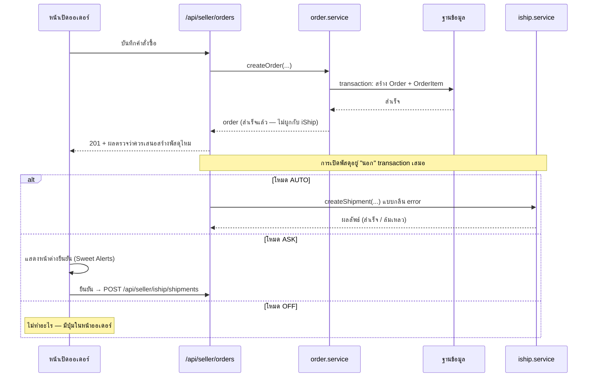
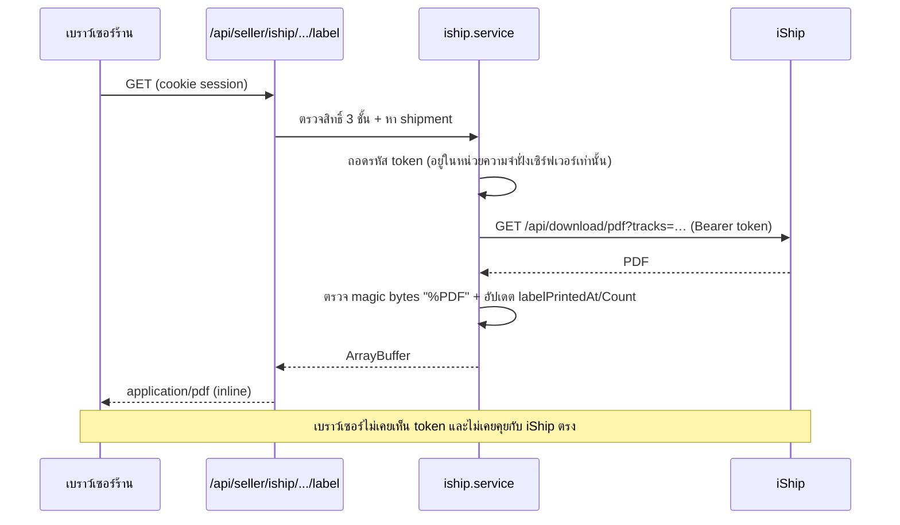

> **โมดูล:** 00022 — iShip Shipping Integration
> **ประเภทเอกสาร:** Software Design Specification
> **เวอร์ชัน:** 1.0
> **วันที่จัดทำ:** 2026-07-26
> **เจ้าของเอกสาร:** safepay-planner

# SDS: เชื่อมระบบขนส่ง iShip

---

## 1. โครงไฟล์

```
src/
├── lib/iship/
│   ├── errors.ts        ✅ error taxonomy + redactToken + classifyUpstream
│   ├── client.ts        ✅ HTTP client + dry-run + timeout ต่อประเภทงาน
│   ├── mapping.ts       ✅ Deep → iShip payload + ตรวจที่อยู่ครบ + idempotencyKey
│   ├── mapping.test.ts  ✅ unit test (blocker: ตำบล/อำเภอ)
│   └── status.ts        ตารางแปลสถานะ 15 ตัว → ข้อความ/สีที่ UI ใช้
├── services/
│   └── iship.service.ts กฎธุรกิจ + สิทธิ์ + เขียน DB (จุดเดียวที่ถอดรหัส token)
└── app/
    ├── api/
    │   ├── seller/iship/…            REST ฝั่งร้าน (ดู API.md §A)
    │   └── webhooks/iship/[secret]/  รับแจ้งสถานะ
    └── (paces)/seller/(dashboard)/
        ├── settings/shipping/        หน้าตั้งค่าการจัดส่ง
        └── orders/[token]/           + ส่วนการจัดส่งในหน้ารายละเอียด
```

✅ = ทำแล้ว (commit `f85cc730`)

---

## 2. ชั้น service — `src/services/iship.service.ts`

**ความรับผิดชอบเฉพาะของชั้นนี้:** ตรวจสิทธิ์ → ถอดรหัส token → เรียก `lib/iship` → เขียนฐานข้อมูล → แปลง error เป็นผลลัพธ์ที่ route ส่งต่อได้

```ts
// ── guard ที่ทุกฟังก์ชันต้องเรียกก่อนเสมอ ──────────────────────────────
// คืน account ที่ถอดรหัส token แล้ว หรือโยน error ที่ route แมปเป็น HTTP ได้
async function requireIShipAccess(
  shopId: string,
  userId: string,
  opts?: { ownerOnly?: boolean },
): Promise<{ account: ShopShippingAccount; token: string }>

// ── การเชื่อมต่อ ──────────────────────────────────────────────────────
getConnection(shopId, userId): Promise<ConnectionView>          // ไม่มี token ใน view
connect(shopId, userId, token): Promise<ConnectionView>         // ownerOnly — ทดสอบก่อนบันทึก
verifyConnection(shopId, userId): Promise<ConnectionView>       // ownerOnly
disconnect(shopId, userId): Promise<void>                       // ownerOnly — ลบ token จริง

// ── ค่าตั้งต้น ────────────────────────────────────────────────────────
getSettings(shopId, userId): Promise<SettingsView>
updateSettings(shopId, userId, input: SettingsInput): Promise<SettingsView>  // ownerOnly

// ── ข้อมูลอ้างอิง (proxy) ─────────────────────────────────────────────
listCouriers(shopId, userId): Promise<IShipCourier[]>
listBoxes(shopId, userId): Promise<IShipBox[]>
quote(shopId, userId, orderId, override?): Promise<QuoteView>

// ── พัสดุ ─────────────────────────────────────────────────────────────
checkEligibility(order, account): EligibilityResult   // pure — ไม่แตะ IO, เทสง่าย
createShipment(shopId, userId, orderId, override?): Promise<ShipmentView>
retryShipment(shopId, userId, shipmentId): Promise<ShipmentView>
cancelShipment(shopId, userId, shipmentId): Promise<ShipmentView>
getTraces(shopId, userId, shipmentId): Promise<ShipmentEvent[]>
getLabelPdf(shopId, userId, shipmentIds: string[]): Promise<{ pdf: ArrayBuffer; skipped: SkippedItem[] }>

// ── เรียกรถเข้ารับ ────────────────────────────────────────────────────
requestPickup(shopId, userId, input): Promise<PickupView>
cancelPickup(shopId, userId, pickupId): Promise<PickupView>

// ── webhook (ไม่มี session — จับคู่ด้วยข้อมูลใน payload) ───────────────
handleStatusWebhook(payload: unknown): Promise<void>
handlePickupWebhook(payload: unknown): Promise<void>
```

**หลักที่ยึด**

- `checkEligibility` เป็น **pure function** — รับ order + account คืนผลลัพธ์ ไม่แตะ IO → เทสครบทุกสาขาได้ด้วย unit test ไม่ต้องปั้น DB
- ทุก view type ที่คืนออกไป **ไม่มี field token** ตั้งแต่ระดับ type — ไม่ใช่หวังว่าจะไม่เผลอใส่
- `IShipError` ที่ `invalidatesConnection` ต้องอัปเดต `status = "TOKEN_INVALID"` ก่อนโยนต่อเสมอ

---

## 3. จุดเชื่อมกับการสร้างคำสั่งซื้อ

**ข้อกำหนดสูงสุด (BR-ISHIP-21): การสร้างออเดอร์ต้องสำเร็จเสมอ**



**สิ่งที่ห้ามทำ**

- ห้ามเรียก `createShipment` **ภายใน** `prisma.$transaction` ของการสร้างออเดอร์ — การเรียกข้ามเครือข่ายในทรานแซกชันจะกินคอนเนกชันและทำให้ทั้งก้อน rollback เมื่อ iShip ช้า
- ห้ามให้ `createOrder` โยน error ของ iShip ออกไป — ต้องกลืนและบันทึกไว้แทน
- ห้าม `await` การเปิดพัสดุก่อนตอบ `201` ในโหมด AUTO ถ้าจะทำให้ผู้ใช้รอนานกว่าที่กำหนด — ให้ตอบออเดอร์ก่อน แล้วให้ UI ถามผลตามทีหลัง

> **ทางเลือกที่เลือกใช้:** โหมด AUTO ทำแบบ "ตอบออเดอร์ก่อน แล้ว UI ยิงคำขอสร้างพัสดุตามทันที"
> ได้ผลเหมือนอัตโนมัติในสายตาร้าน แต่แยกความล้มเหลวออกจากกันโดยสมบูรณ์
> (Vercel ไม่มีเซิร์ฟเวอร์ประจำ — งานเบื้องหลังที่ค้างหลังตอบ response ไม่รับประกันว่าจะได้รัน)

---

## 4. หน้าจอ

> 🛑 ทุกหน้าอยู่ใน `(paces)` → **ต้องผ่าน `safepay-ux` ออก Design Spec ก่อนลงมือ (Hard Rule 8)**
> เอกสารนี้กำหนด *ขอบเขตและที่มาของ markup* เท่านั้น ไม่ใช่การออกแบบแทน ux

| หน้า/ส่วน | ไฟล์ | Base (theme ที่ต้อง copy) |
|-----------|------|---------------------------|
| การ์ด "การจัดส่ง" ในหน้าตั้งค่า | `settings/page.tsx` (แก้) | ล้อการ์ดเดิมในไฟล์นั้น |
| หน้าตั้งค่าการจัดส่ง | `settings/shipping/page.tsx` + `ShippingClient.tsx` | ล้อโครง `settings/channels/` ที่มีอยู่ |
| ฟอร์มที่อยู่ผู้ส่ง | `settings/shipping/SenderAddressForm.tsx` | `theme/paces/.../form/elements/InputTextfieldType.tsx` + `AddressSearchPanel` เดิม (reuse ไม่ copy) |
| ส่วนการจัดส่งในหน้าออเดอร์ | `orders/[token]/components/ShipmentPanel.tsx` | ล้อการ์ดในหน้า order detail เดิม |
| หน้าต่างยืนยันก่อนสร้าง | ใช้ Sweet Alerts | `theme/paces/.../SweetAlerts.tsx` |
| ปุ่มพิมพ์หลายใบ | `orders/components/…` (แก้) | ล้อ toolbar เดิมของหน้ารายการ |

**กฎที่ใช้กับทุกไฟล์ในกลุ่มนี้**

- Paces primitive เท่านั้น — ห้าม arbitrary Tailwind value (Hard Rule 7)
- toast ใช้ `pacesToast` เท่านั้น ห้าม `react-toastify` (Hard Rule 9)
- dialog ที่ต้องกดตอบ ใช้ Sweet Alerts · ที่เด้งหายเอง ใช้ `pacesToast`
- ห้าม emoji — ใช้ icon จริงจาก `@iconify/react` (Hard Rule 12) · จุดที่ยังไม่รู้ว่าใช้ icon ตัวไหน **ต้องถาม user ก่อน**
- วันเวลาใช้ `formatDateTime` จาก `src/lib/format-date.ts` เท่านั้น
- ร้าน `LODGING` ต้องไม่ render ส่วนเหล่านี้เลย (ไม่ใช่ render แล้ว disable)

---

## 5. การพิมพ์ใบปะหน้า — ทำไมต้อง proxy



ถ้าให้เบราว์เซอร์เรียก iShip เอง จะต้องส่ง token ลงไปที่หน้าเว็บ = token ของร้านหลุดให้ทุกคนที่เปิด devtools เห็น

---

## 6. ตัวแปรสภาพแวดล้อม

| ตัวแปร | dev | production |
|-------|-----|------------|
| `CHANNEL_TOKEN_KEY` | มีอยู่แล้ว (feature 00018) | มีอยู่แล้ว |
| `ISHIP_BASE_URL` | ไม่ตั้ง (ใช้ production) | ไม่ตั้ง |
| `ISHIP_DRY_RUN` | `1` | **ห้ามตั้ง** (และตั้งไปก็ไม่มีผล) |
| `ISHIP_WEBHOOK_SECRET` | สุ่ม ≥ 32 ตัว | สุ่ม ≥ 32 ตัว (คนละค่ากับ dev) |

---

## 7. ลำดับงาน (task breakdown)

| S-id | งาน | ขึ้นกับ | สถานะ |
|------|-----|--------|-------|
| **S-1** | schema 4 ตาราง + migration (ยังไม่ apply) | — | ✅ `db7d25fc` |
| **S-2** | `lib/iship` — errors / client / mapping + unit test | — | ✅ `f85cc730` |
| **S-3** | `lib/iship/status.ts` ตารางแปลสถานะ 15 ตัว | S-2 | |
| **S-4** | Valibot schema ใน `validations.ts` | — | |
| **S-5** | `iship.service.ts` — การเชื่อมต่อ + ค่าตั้งต้น | S-1,2,4 | |
| **S-6** | `iship.service.ts` — `checkEligibility` (pure) + unit test | S-1,2 | |
| **S-7** | `iship.service.ts` — สร้าง/ลองใหม่/ยกเลิกพัสดุ | S-5,6 | |
| **S-8** | `iship.service.ts` — ใบปะหน้า (เดี่ยว + หลายใบ) | S-5 | |
| **S-9** | `iship.service.ts` — traces + webhook | S-5 | |
| **S-10** | `iship.service.ts` — เรียกรถเข้ารับ | S-5 | |
| **S-11** | API routes กลุ่มการเชื่อมต่อ + ค่าตั้งต้น | S-5 | |
| **S-12** | API routes กลุ่มพัสดุ + ใบปะหน้า | S-7,8 | |
| **S-13** | API route webhook | S-9 | |
| **S-14** | apply migration (**ต้องขอ user ยืนยัน**) | S-1 | |
| **S-15** | Design Spec จาก `safepay-ux` | S-11,12 | |
| **S-16** | UI หน้าตั้งค่าการจัดส่ง | S-15 | |
| **S-17** | UI ส่วนการจัดส่งในหน้าออเดอร์ + โหมด ASK | S-15 | |
| **S-18** | UI พิมพ์หลายใบในหน้ารายการออเดอร์ | S-15 | |
| **S-19** | แสดง tracking บนหน้า `/o/{token}` ฝั่งผู้ซื้อ | S-12 | |
| **S-20** | Playwright E2E บนโหมดจำลอง | S-16,17,18 | |
| **S-21** | reviewer + security + Impeccable gate | ทั้งหมด | |
| **S-22** | smoke test ของจริงบน production (ขออนุญาตก่อน) | S-21 | |

---

## 8. ความเสี่ยงเชิงออกแบบที่รับไว้

| เรื่อง | การตัดสินใจ | เหตุผล |
|-------|-------------|--------|
| ไม่ retry อัตโนมัติ | ให้ร้านกดเอง | ทุกครั้งคือเงินจริง — retry เองอาจเปิดพัสดุที่ร้านไม่ต้องการ |
| โหมด AUTO ยิงจาก UI ไม่ใช่เบื้องหลัง | ตอบออเดอร์ก่อน แล้ว UI ยิงตาม | ไม่มีเซิร์ฟเวอร์ประจำ งานหลังตอบ response ไม่รับประกันว่าได้รัน |
| ไม่ poll สถานะเป็นรอบ | พึ่ง webhook + เปิดดูเมื่อผู้ใช้กด | poll ทุกพัสดุคือค่าใช้จ่ายที่โตตามจำนวนออเดอร์โดยไม่มีคนดู |
| เก็บ error ดิบไว้ในฐานข้อมูล | เก็บหลัง redact token | ถ้าไม่เก็บ จะแยกไม่ออกว่าปัญหาอยู่ฝั่งเราหรือฝั่งผู้ให้บริการ |
