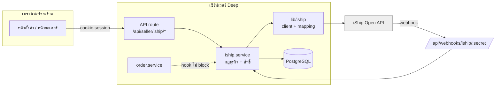
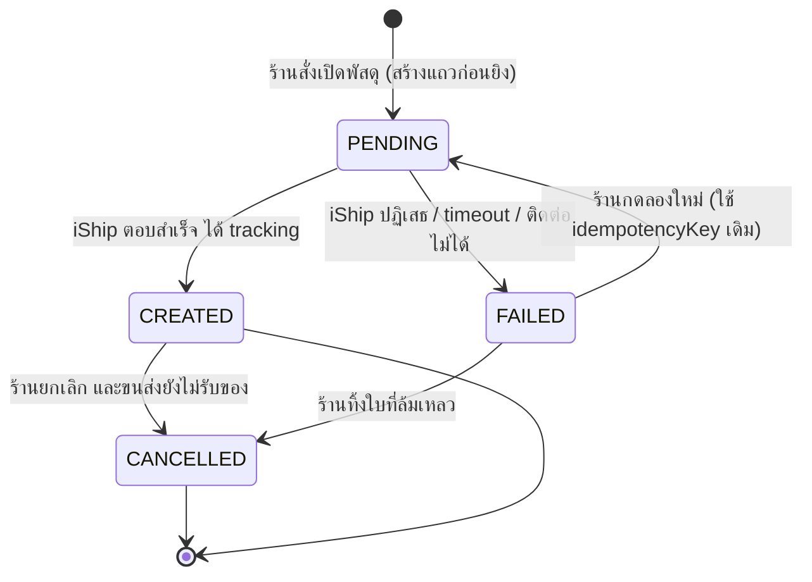
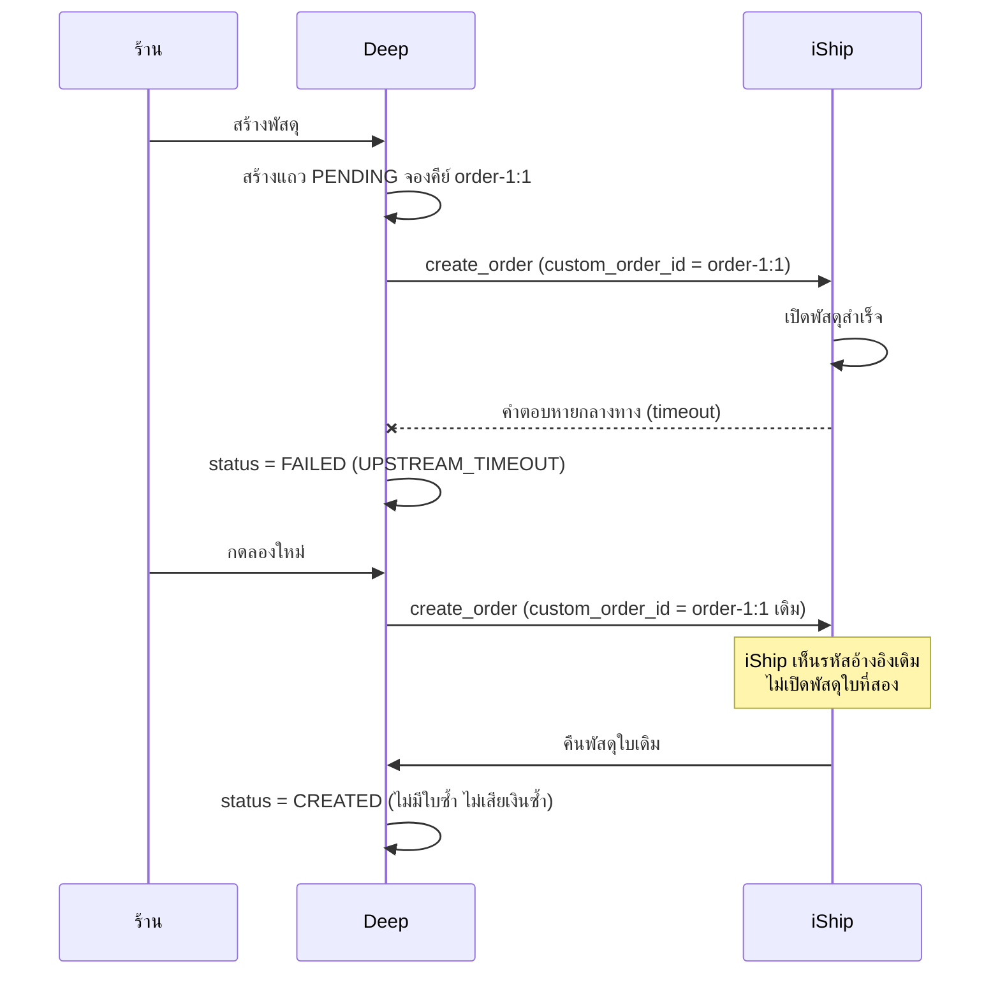
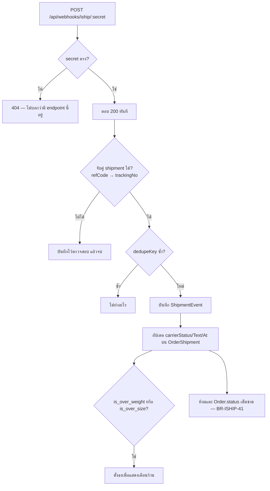
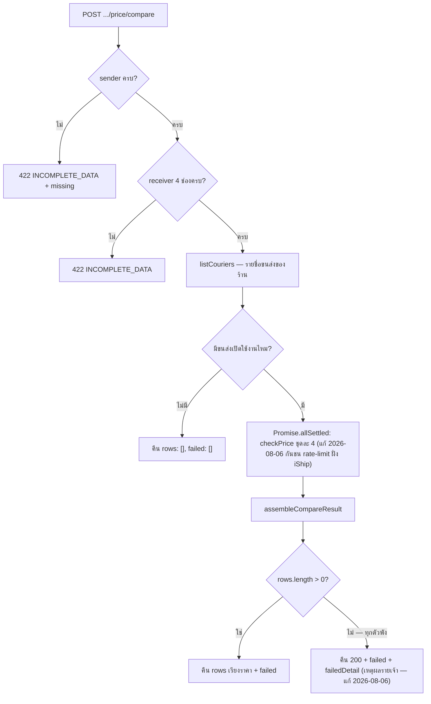

> **โมดูล:** 00022 — iShip Shipping Integration
> **ประเภทเอกสาร:** Software Requirements Specification (technical)
> **เวอร์ชัน:** 1.0
> **วันที่จัดทำ:** 2026-07-26
> **สถานะ:** Draft
> **เจ้าของเอกสาร:** safepay-planner (ดู [[Feature-Docs-Ownership]])

# SRS: เชื่อมระบบขนส่ง iShip

---

## 1. ขอบเขตทางเทคนิค

ฟีเจอร์นี้เพิ่ม **ชั้นเชื่อมต่อผู้ให้บริการขนส่งภายนอก** เข้ากับระบบเดิม โดยไม่เปลี่ยนโครงสร้างของคำสั่งซื้อ

| ชั้น | สิ่งที่เพิ่ม |
|-----|-------------|
| `src/lib/iship/` | HTTP client + error taxonomy + ตัวแปลงข้อมูล + โหมดจำลอง (ไม่รู้จัก Prisma/session) |
| `src/services/iship.service.ts` | กฎธุรกิจ + สิทธิ์ + การเขียนฐานข้อมูล |
| `src/app/api/seller/iship/*` | REST ฝั่งร้าน |
| `src/app/api/webhooks/iship/[secret]` | รับแจ้งสถานะจากภายนอก |
| `src/app/(paces)/seller/(dashboard)/settings/shipping/` | หน้าตั้งค่า |
| ส่วนการจัดส่งในหน้ารายละเอียดออเดอร์ + หน้ารายการออเดอร์ | UI ใช้งานประจำวัน |

**ไม่แตะ:** โครงสร้าง `Order` / `Shop` / Trust Score / Badge / กระเป๋าเงินร้าน

---

## 2. สถาปัตยกรรมและการไหลของข้อมูล



**กติกาแบ่งชั้นที่ห้ามข้าม**

- `lib/iship` ห้าม import Prisma / next-auth — ทดสอบได้ด้วย mock ล้วน
- API route ห้ามเรียก `lib/iship` ตรง ต้องผ่าน service เสมอ (ไม่งั้น guard สิทธิ์จะกระจายและหลุด)
- Token ถูกถอดรหัสเฉพาะใน service แล้วส่งเป็นพารามิเตอร์ให้ client — ไม่มีสถานะ token ค้างในโมดูลใด

---

## 3. State machine ของ `OrderShipment.status`



| จาก | ไป | เงื่อนไข | ผลข้างเคียง |
|-----|-----|---------|-------------|
| — | `PENDING` | ผ่าน eligibility ครบ (§5) | สร้างแถว + จอง `idempotencyKey` |
| `PENDING` | `CREATED` | iShip คืน `tracking_number` | บันทึก tracking/ref, `attemptCount++` |
| `PENDING` | `FAILED` | โยน `IShipError` ทุกชนิด | บันทึก `lastErrorCode`/`lastErrorMessage`, `attemptCount++` |
| `FAILED` | `PENDING` | ร้านกดลองใหม่ | **ไม่สร้างแถวใหม่** — อัปเดตแถวเดิม คีย์เดิม |
| `CREATED` | `CANCELLED` | `cancel_order` สำเร็จ | บันทึกผู้ยกเลิก + เวลา |
| `FAILED` | `CANCELLED` | ร้านเลือกทิ้ง | ปลดล็อก partial unique ให้เปิดใบใหม่ได้ |

**เหตุผลที่ต้องสร้างแถว `PENDING` ก่อนยิง:** `idempotencyKey` เป็น unique ที่ระดับฐานข้อมูล การจองคีย์ก่อนออกไปข้างนอกทำให้คำขอที่ยิงพร้อมกัน (กดรัว/สองแท็บ) ตัวที่สองชน constraint ทันทีโดยไม่ต้องพึ่งล็อกในแอป

---

## 4. การจับคู่ข้อมูล Deep → iShip

### 4.1 ที่อยู่ — จุดที่พลาดแล้วไม่มีอะไรฟ้อง

> 🛑 **BR-ISHIP-31** — คำว่า `district` ของสองระบบหมายถึงคนละระดับการปกครอง

| Deep | ความหมาย | iShip (ผู้รับ) | iShip (ผู้ส่ง) |
|------|----------|----------------|----------------|
| `shippingAddress.line1` | บ้านเลขที่/ถนน | `dst_address` | `src_address` |
| `shippingAddress.subdistrict` | **ตำบล/แขวง** | **`dst_district`** | **`src_district`** |
| `shippingAddress.district` | **อำเภอ/เขต** | **`dst_amphure`** | **`src_amphure`** |
| `shippingAddress.province` | จังหวัด | `dst_province` | `src_province` |
| `shippingAddress.postcode` | รหัสไปรษณีย์ | `dst_zipcode` | `src_zipcode` |
| `Order.buyerName` | ชื่อผู้รับ | `dst_name` | — |
| `Order.buyerContact` | เบอร์ผู้รับ | `dst_phone` | — |
| `ShopShippingAccount.sender*` | ที่อยู่ร้าน | — | `src_*` |

ยืนยันความหมายฝั่ง Deep จากโค้ดจริง: `CartPanel.tsx:334-340` (ป้ายช่องกรอก), `AddressSearchPanel.tsx:100` (`{ subdistrict: r.district, district: r.amphoe }`), `AddressSearchPanel.tsx:184` (`ต.{subdistrict} · อ.{district}`)

**เงื่อนไขบังคับ:** ต้องมี unit test ที่ใช้ค่าตำบลกับอำเภอ **ต่างกัน** (ค่าเท่ากันจะหลอกผ่านได้ถ้า mapper สลับช่อง) — TC-ADDR-01/02, BR-ISHIP-32

### 4.2 ข้อมูลอื่น

| Deep | iShip | หมายเหตุ |
|------|-------|----------|
| `idempotencyKey` (`<orderId>:<attemptGroup>`) | `custom_order_id` | สอบทานย้อนกลับสองทาง (BR-ISHIP-25) |
| `"Deep"` | `platform_name` | คงที่ |
| `OrderItem[]` | `products[]` | น้ำหนักรายชิ้น = น้ำหนักรวม ÷ จำนวนชิ้นรวม (ไม่ใช่จำนวนรายการ) |
| COD ที่ร้านเลือก | `cod_amount` | 0 = ไม่เก็บ; ต้องตรงกับยอดออเดอร์เมื่อเปิด |
| บริการเสริมที่เปิด | `on_time` / `box_shield` / `is_insured` / `product_value` / `service_type` | **ส่งเฉพาะตัวที่เปิด** — ไม่ส่ง = iShip ใช้ค่าตั้งต้นของร้านเอง |

---

## 5. เงื่อนไขความมีสิทธิ์ (eligibility) ตอนสร้างออเดอร์

ตรวจตามลำดับนี้ ผลลัพธ์มี 3 แบบ: **ข้ามเงียบ** / **แจ้งให้แก้** / **ทำต่อ**

| # | เงื่อนไข | ไม่ผ่าน → |
|---|----------|-----------|
| 1 | `Shop.vertical === "GENERAL"` | ข้ามเงียบ (BR-ISHIP-01) |
| 2 | มี `ShopShippingAccount` และ `status === "ACTIVE"` | ข้ามเงียบ |
| 3 | `createMode !== "OFF"` | ข้ามเงียบ |
| 4 | `Order.fulfillmentMode === "SHIPPED"` | ข้ามเงียบ |
| 5 | `Order.type === "PHYSICAL"` | ข้ามเงียบ (BOOKING/DIGITAL/SERVICE/SUBSCRIPTION) |
| 6 | ยังไม่มี shipment ที่ `status <> "CANCELLED"` | แสดงใบเดิม (ไม่ใช่ error) |
| 7 | ที่อยู่ผู้ส่งของร้านครบ | **แจ้งให้แก้** พร้อมรายการช่องที่ขาด |
| 8 | ที่อยู่ผู้รับ + ชื่อ + เบอร์ครบ | **แจ้งให้แก้** พร้อมรายการช่องที่ขาด |
| 9 | มี `defaultCourierCode` / `defaultCategoryId` / ขนาด+น้ำหนัก | **แจ้งให้แก้** (ไปตั้งค่า) |

ข้อ 1–5 เป็นเรื่อง "ออเดอร์นี้ไม่เกี่ยวกับการส่งของ" จึงห้ามรบกวนร้าน
ข้อ 7–9 เป็นเรื่อง "ควรส่งได้แต่ข้อมูลขาด" ซึ่งร้านแก้ได้และควรแก้ (FR-ISHIP-023)

---

## 6. Idempotency

### 6.1 กติกา

- คีย์ = `<orderId>:<attemptGroup>` เก็บใน `OrderShipment.idempotencyKey` (UNIQUE) และส่งไปเป็น `custom_order_id`
- `attemptGroup` เริ่มที่ 1 และ **+1 เมื่อยกเลิกใบก่อนหน้าเท่านั้น**
- กดลองใหม่จากใบ `FAILED` → **ใช้คีย์เดิม** อัปเดตแถวเดิม

### 6.2 เคสที่กติกานี้แก้



**ข้อจำกัดที่ยอมรับ:** ถ้า iShip ไม่ได้ dedupe ตาม `custom_order_id` ให้ ระบบเราจะยังกันใบซ้ำ "ฝั่งเรา" ได้ (unique constraint) แต่ฝั่งผู้ให้บริการอาจมีใบซ้ำ — จึงต้องยืนยันพฤติกรรมนี้ตอน smoke test บน production และบันทึกผลไว้

---

## 7. Error taxonomy

| รหัสของเรา | ที่มา | ข้อความต่อร้าน | การกระทำต่อ |
|-----------|-------|----------------|-------------|
| `TOKEN_INVALID` | HTTP 401/403 หรือคำสำคัญเรื่องสิทธิ์ | "การเชื่อมต่อใช้งานไม่ได้แล้ว…นำ Token ใหม่มาใส่" | ตั้ง `ShopShippingAccount.status = "TOKEN_INVALID"` + แจ้งเตือน (BR-ISHIP-14) |
| `INSUFFICIENT_BALANCE` | คำสำคัญเรื่องยอดเงิน | "ยอดเงินใน iShip ไม่พอ…เติมเงินแล้วลองใหม่" | ไม่แตะสถานะการเชื่อมต่อ |
| `ADDRESS_INVALID` | คำสำคัญเรื่องที่อยู่/รหัสไปรษณีย์ | "ที่อยู่ผู้รับไม่ผ่านการตรวจ…ตรวจตำบล/อำเภอ/จังหวัด/รหัส" | ชี้ทางไปแก้ที่อยู่ |
| `COURIER_UNAVAILABLE` | คำสำคัญเรื่องขนส่ง/พื้นที่ | "ขนส่งที่เลือกไม่รับพื้นที่นี้…เลือกเจ้าอื่น" | เสนอเปลี่ยนขนส่ง, retry ได้ |
| `SHIPMENT_NOT_CANCELLABLE` | คำสำคัญเรื่องยกเลิกไม่ได้ | "ขนส่งรับของไปแล้ว…จัดการที่ iShip" | ไม่เปลี่ยนสถานะพัสดุ |
| `UPSTREAM_TIMEOUT` | `AbortError` จากเราเอง | "ไม่ตอบสนองในเวลาที่กำหนด…ออเดอร์บันทึกแล้ว กดลองใหม่" | retry ได้ (คีย์เดิม) |
| `UPSTREAM_ERROR` | อย่างอื่นทั้งหมด | "ระบบขนส่งขัดข้องชั่วคราว…ออเดอร์บันทึกแล้ว" | retry ได้ |

**ลำดับการตัดสิน:** HTTP status ที่มีความหมายชัด → field ที่เป็นโครงสร้าง → คำสำคัญในข้อความ (ทางเลือกสุดท้าย)
เหตุผล: ผู้ให้บริการแก้ถ้อยคำได้ตลอด การผูกตรรกะกับโครงประโยคคือหนี้ที่จะระเบิดเงียบ ๆ (บทเรียน `feedback_spike_must_match_production_path`)

**ข้อความดิบจาก iShip** เก็บใน `lastErrorMessage` เพื่อการตรวจสอบ — ผ่าน `redactToken()` เสมอ และ **ห้ามแสดงต่อผู้ใช้**

---

## 8. Authorization matrix

| การกระทำ | เจ้าของร้าน | พนักงานร้าน | ผู้ซื้อ | แอดมิน | คนนอก |
|----------|------------|-------------|--------|--------|-------|
| ดูสถานะการเชื่อมต่อ | ✅ | ✅ (ไม่เห็น token) | ✗ | ✗ | ✗ |
| วาง/เปลี่ยน token | ✅ | ✗ **403** | ✗ | ✗ | ✗ |
| ยกเลิกการเชื่อมต่อ | ✅ | ✗ **403** | ✗ | ✗ | ✗ |
| แก้ค่าตั้งต้น/ที่อยู่ผู้ส่ง | ✅ | ✗ **403** | ✗ | ✗ | ✗ |
| สร้าง/ลองใหม่/ยกเลิกพัสดุ | ✅ | ✅ | ✗ | ✗ | ✗ |
| พิมพ์ใบปะหน้า | ✅ | ✅ | ✗ | ✗ | ✗ |
| เรียกรถเข้ารับ | ✅ | ✅ | ✗ | ✗ | ✗ |
| ดู tracking + ชื่อขนส่ง | ✅ | ✅ | ✅ (ออเดอร์ตัวเอง) | ✗ | ✗ |
| ดู token | ✗ **ไม่มีใครเห็นค่าเต็ม** | ✗ | ✗ | ✗ **BR-ISHIP-05** | ✗ |

**Guard 3 ชั้น — ทุก endpoint ต้องผ่านครบ ตามลำดับ**

1. session มีอยู่ และเป็นสมาชิกของ `shopId` นั้น → ไม่ผ่าน = 401/403
2. `Shop.vertical === "GENERAL"` → ไม่ผ่าน = **403** (BR-ISHIP-02 — การซ่อน UI ไม่ใช่การบังคับสิทธิ์)
3. คำสั่งกลุ่มตั้งค่า/token ต้องเป็นเจ้าของร้าน → ไม่ผ่าน = 403

---

## 9. NFR

| ด้าน | ข้อกำหนด |
|-----|----------|
| **Timeout** | อ่าน 10s · เช็คราคา 12s · เขียน (create/cancel/pickup) 20s · ใบปะหน้า 30s |
| **ไม่ขวางการสร้างออเดอร์** | การเปิดพัสดุต้องอยู่นอก transaction ของ `createOrder` และ error ทุกชนิดต้องถูกกลืน ไม่ propagate (BR-ISHIP-21) |
| **Retry** | ไม่ retry อัตโนมัติ — ให้ร้านเป็นคนกด เพราะทุกครั้งคือเงินจริง การ retry เองอาจเปิดพัสดุที่ร้านไม่ต้องการ |
| **Rate limit** | ใช้ `guardApi` เดิมใน `proxy.ts` (auth 30/นาที) + จำกัดการพิมพ์หลายใบไม่เกิน 50 ใบ/ครั้ง |
| **Cache** | ทุก route ของฟีเจอร์นี้ผูกกับผู้ใช้ → `cache-control: private, no-store` + `force-dynamic` (บทเรียน `feedback_auth_api_cache_control`) |
| **ขนาดไฟล์ label** | สตรีมต่อให้เบราว์เซอร์ ไม่เก็บลงดิสก์ ไม่ cache |
| **PII** | หน้าฝั่ง seller อยู่ใต้ client layout → ต้องกรอง/ปิดบัง `receiverSnapshot` ที่ server boundary ก่อนส่งเข้า props |
| **Webhook** | ต้องตอบ 200 เร็ว (< 3s) แม้ประมวลผลไม่ได้ — ไม่งั้นผู้ให้บริการจะยิงซ้ำรัว |

---

## 10. Validation rules (Valibot — `src/lib/validations.ts`)

| Input | กติกา |
|-------|-------|
| `token` | string, trim, ยาว 20–500, ไม่มีช่องว่างภายใน |
| `senderName` | 1–120 |
| `senderPhone` | รูปแบบเบอร์ไทย (ใช้ตัวตรวจเดิมของระบบ) |
| `senderAddress` | 1–255 |
| `senderSubdistrict` / `senderDistrict` / `senderProvince` | 1–100 |
| `senderPostcode` | ตัวเลข 5 หลัก |
| `defaultCourierCode` | string 1–50 — **ต้องมีอยู่ในรายชื่อที่ดึงจาก iShip จริง** ไม่ใช่รายการที่เขียนตายในโค้ด |
| `defaultCategoryId` | integer ที่อยู่ในชุด `0–11, 99` |
| `weight` | > 0 และ ≤ 100 (กก.) |
| `width`/`length`/`height` | integer 1–300 (ซม.) |
| `codAmount` | ≥ 0, ทศนิยม ≤ 2, และเมื่อ > 0 ต้องเท่ากับ `Order.totalAmount` |
| `optProductValue` | > 0 เมื่อ `optIsInsured` เปิด |
| `optServiceType` | 1 หรือ 2 เท่านั้น |
| `createMode` | `AUTO` / `ASK` / `OFF` |
| `parcelCount` (pickup) | integer 1–100 |
| `trackingNos[]` (พิมพ์หลายใบ) | 1–50 รายการ |

---

## 11. การประมวลผล webhook

> 🛑 **เลื่อนออกจากเวอร์ชันแรก (2026-07-26)** — ไม่ตั้ง `ISHIP_WEBHOOK_SECRET` บน production
> route ตอบ 404 ทุกคำขอ. เนื้อหาหัวข้อนี้ยังเป็นสเปกที่ถูกต้องสำหรับตอนเปิดใช้
>
> ผลที่ตามมาที่ต้องรู้: `OrderShipment.carrierStatus` ถูกอัปเดตจาก **การกดดูการเดินทาง**
> (`getTraces` sync สถานะล่าสุดลงด้วย) แทนที่จะมาจาก webhook — สองทางนี้เขียนช่องเดียวกัน
> โดยไม่ตีกันเมื่อเปิด webhook ภายหลัง เพราะต่างเขียน "สถานะล่าสุดที่รู้" ทับลงไป
> และ `ShipmentEvent.dedupeKey` กันบันทึกซ้ำอยู่แล้ว



**การจับคู่:** ใช้ `ref_code` ก่อน (ตรงกับ `OrderShipment.refCode`) ถ้าไม่เจอค่อยใช้ `tracking`
**dedupe:** `dedupeKey = "<status>:<epoch ของ timestamp>"` unique ต่อ shipment
**ความปลอดภัย:** ที่อยู่ endpoint มี secret ที่เดาไม่ได้อยู่ใน path; ไม่เชื่อ payload สำหรับการตัดสินที่มีผลทางธุรกิจ — สถานะสำคัญให้ยืนยันกลับด้วย `get_order` (ดู OQ-1)

---

## 12. โหมดจำลอง (dry-run)

| หัวข้อ | ข้อกำหนด |
|-------|----------|
| **เปิดอย่างไร** | `ISHIP_DRY_RUN=1` **และ** `NODE_ENV !== "production"` — ต้องเป็นจริงทั้งคู่ |
| **call ที่ถูกจำลอง** | `create_order`, `request_courier`, `cancel_order`, `cancel-notify` (ทุกตัวที่ก่อค่าใช้จ่ายหรือเรียกคนจริง) |
| **call ที่ยิงจริง** | `courier_code`, `boxes`, `check-price`, `traces`, `get_order`, `download/pdf` |
| **ผลลัพธ์จำลอง** | `tracking_number` ขึ้นต้น `DRYRUN`, `ref` ขึ้นต้น `DRYRUN-` |
| **การกำกับ** | `OrderShipment.isDryRun = true` + ป้ายบนหน้าจอ + กรองออกจากสถิติทุกชนิด |

**เหตุผลที่ต้องมี:** ผู้ให้บริการไม่มีระบบทดสอบแยก การทดสอบเส้นทางทั้งหมดด้วยของจริงหมายถึงพัสดุจริงและค่าใช้จ่ายจริงทุกครั้ง

---

## 13. ตัวแปรสภาพแวดล้อม

| ตัวแปร | จำเป็น | ค่า | หมายเหตุ |
|-------|-------|-----|----------|
| `CHANNEL_TOKEN_KEY` | ✅ | hex 64 ตัว | **ใช้ตัวเดิมของ feature 00018** ไม่สร้างคีย์ใหม่ |
| `ISHIP_BASE_URL` | ✗ | `https://app.iship.cloud` | ไม่ตั้ง = ใช้ production; เผื่อได้ระบบทดสอบมาภายหลัง |
| `ISHIP_DRY_RUN` | ✗ | `1` | dev/QA เท่านั้น — ไม่มีผลบน production |
| `ISHIP_WEBHOOK_SECRET` | ✅ | สุ่มยาว ≥ 32 | ใช้ประกอบ path ของ webhook |

---

## 14. Traceability

| ข้อกำหนด | ส่วนของ SRS |
|---------|-------------|
| FR-ISHIP-001/002 (เชื่อมต่อ) | §7 (TOKEN_INVALID), §8, §10 |
| FR-ISHIP-003 (LODGING) | §5 ข้อ 1, §8 guard ชั้น 2 |
| FR-ISHIP-010/011/012 (ค่าตั้งต้น) | §10, §13 |
| FR-ISHIP-020/021/022 (3 โหมด) | §3, §5 |
| FR-ISHIP-023 (ข้าม/เตือน) | §5 |
| FR-ISHIP-024 (กันซ้ำ) | §3, §6 |
| FR-ISHIP-030/031 (ใบปะหน้า) | §9 (timeout/PII), §8 |
| FR-ISHIP-040/041/042 (ติดตาม) | §11 |
| FR-ISHIP-050/051 (ยกเลิก/เรียกรถ) | §3, §7 |
| FR-ISHIP-060/061 (ทดสอบ/ความปลอดภัย) | §12, §9 |
| BR-ISHIP-21 (ออเดอร์ต้องรอด) | §9 |
| BR-ISHIP-22/25/26 (idempotency) | §3, §6 |
| BR-ISHIP-31/32 (ที่อยู่) | §4.1 |
| BR-ISHIP-41 (ห้ามแตะสถานะออเดอร์) | §11 |

---

## 15. Open Questions ที่ยังค้าง

| # | คำถาม | ผลกระทบทางเทคนิค |
|---|--------|------------------|
| OQ-1 | webhook มีลายเซ็นยืนยันตัวตนไหม | ตอนนี้พึ่ง secret ใน path + ยืนยันกลับด้วย `get_order` สำหรับสถานะสำคัญ ถ้ามีลายเซ็นจะเปลี่ยนเป็นตรวจลายเซ็นตรง ๆ ได้ |
| OQ-2 | ตั้ง webhook แยกต่อร้านได้ไหม หรือ URL เดียวรวม | ออกแบบรองรับ URL เดียวรวมไว้แล้ว (จับคู่ด้วย `refCode`) |
| OQ-3 | iShip dedupe ตาม `custom_order_id` จริงไหม | ถ้าไม่ dedupe เราจะกันซ้ำได้เฉพาะฝั่งเรา ต้องยืนยันตอน smoke test แล้วบันทึกผล |

---

## 16. ส่วนขยาย 2026-08-01 — ผูกพัสดุที่มีอยู่แล้วบน iShip

> ทำหลังเวอร์ชันแรกขึ้น prod แล้ว หัวข้อนี้จึงเขียนต่อท้ายแทนการแทรกกลางเอกสาร
> สเปกออกแบบเต็ม: `docs/superpowers/specs/2026-08-01-iship-link-existing-parcel-design.md`

### 16.1 Functional requirements

| # | ข้อกำหนด |
|---|---|
| FR-ISHIP-025 | ระบบต้องแสดงรายการพัสดุของร้านบน iShip ในช่วง 7 วันล่าสุด **ที่ยังไม่ถูกผูกกับคำสั่งซื้อใด** พร้อมเลขติดตาม ขนส่ง ผู้รับ ที่อยู่ ยอด COD สถานะขนส่งปัจจุบัน และเวลาที่สร้าง — ค้นหาด้วยเลข/ชื่อ/เบอร์ได้ |
| FR-ISHIP-026 | ก่อนผูก ระบบต้องแสดงตารางเทียบที่อยู่ผู้รับ 7 ช่อง (ผู้รับ/เบอร์/ที่อยู่/ตำบล/อำเภอ/จังหวัด/ไปรษณีย์) ระหว่างคำสั่งซื้อกับพัสดุ และชี้เฉพาะช่องที่ต่าง เมื่อมีช่องต่าง ร้าน **ต้อง** เลือกว่าจะเก็บที่อยู่เดิมหรือใช้ที่อยู่จาก iShip ทับ (ไม่มีค่าปริยาย) |
| FR-ISHIP-027 | เมื่อผูกสำเร็จ ระบบต้องเติมสถานะขนส่งปัจจุบันและไทม์ไลน์ย้อนหลังทั้งเส้นทันที — พัสดุที่ผูกย้อนหลังต้องแสดงความคืบหน้าตำแหน่งจริงตั้งแต่วินาทีแรก ไม่ใช่ค้างที่ขั้นแรก |
| FR-ISHIP-028 | ใบที่ผูกเข้ามาต้อง "เลิกผูก" ได้ โดย **ไม่ยกเลิกพัสดุจริง** กับขนส่ง และต้องแยกออกจากปุ่มยกเลิกพัสดุอย่างชัดเจนจนร้านไม่กดผิด |

### 16.2 Business rules

| # | กฎ |
|---|---|
| BR-ISHIP-29 | `OrderShipment.source` แยก `CREATED` (Deep เปิดเอง) ออกจาก `LINKED` (ผูกเข้ามา) · `idempotencyKey` ของใบที่ผูกใช้รูป `link:<trackNo>:<attemptGroup>` ไม่ใช่รูป `<orderId>:<attempt>` เพราะใบนี้ไม่เคยมี `custom_order_id` ของเราฝั่ง iShip · **เลิกผูกต้องลบแถวทิ้ง ห้าม mark `CANCELLED`** เพราะ partial unique ของ `trackingNo` ครอบทุกแถวที่ไม่เป็น null โดยไม่สนสถานะ — ปิดด้วย `CANCELLED` จะจองเลขนั้นไว้ตลอดกาลจนผูกกับคำสั่งซื้อที่ถูกต้องไม่ได้อีก |
| BR-ISHIP-45 | **ข้อยกเว้นของ BR-ISHIP-41** (user อนุมัติ 2026-08-01) — เมื่อ *ผูก* พัสดุที่ออกเดินทางไปแล้ว ระบบขยับ `Order.status` เป็น `SHIPPED` ให้อัตโนมัติ เงื่อนไข: `order.status = PENDING` **และ** `impliesDispatched(carrierStatus)`. เหตุผล: ผูกย้อนหลังตอนกลางคืน ของอาจถึงผู้ซื้อไปแล้ว การค้างที่ "รอจัดส่ง" ทำให้ผู้ซื้อเห็นข้อมูลขัดกับความจริง. **ขอบเขต:** เฉพาะ `advanceOrderIfDispatched()` ที่ `linkShipment` เรียก — webhook/sync ยังไม่ขยับสถานะเหมือนเดิม |

### 16.3 การจับคู่ข้อมูล — ขาเข้า (ต่อจาก §4.1)

🛑 ขาออกกับขาเข้าใช้ชื่อคนละชุด:

| ระดับ | ขาออก (`create_order`) | ขาเข้า (`query_orders`/`get_order`) | Deep |
|---|---|---|---|
| ตำบล/แขวง | `dst_district` | `dst_district` | `subdistrict` |
| อำเภอ/เขต | `dst_amphure` | **`dst_area`** | `district` |

`dst_area` ไม่เคยปรากฏฝั่งขาออกเลย และตัวอย่างในเอกสารของ iShip ใส่ค่าเดียวกันไว้ทั้งสองช่อง
จึง **พิสูจน์จากเอกสารไม่ได้** ว่าช่องไหนเป็นระดับไหน — ที่เลือกคือ อำเภอ ← `dst_amphure` ถ้ามี
ไม่งั้น `dst_area` (สมมาตรกับขาออก) และกันความเสี่ยงด้วย FR-ISHIP-026 ที่บังคับให้ร้านดู
ตารางเทียบก่อนกดผูกเสมอ ถ้าจับคู่กลับหัวจริงจะเห็นตำบลกับอำเภอสลับที่กันด้วยตา

**ยังต้องยืนยัน:** ยิง `query_orders` กับบัญชีจริงที่มีพัสดุซึ่งตำบล ≠ อำเภอ

### 16.4 Validation

`IShipLinkShipmentSchema` — `{ orderId? (uuid) | orderToken?, trackingNo (4–64), addressResolution: "KEEP_ORDER" | "USE_ISHIP" }`
`addressResolution` ไม่มีค่าปริยายโดยเจตนา (FR-ISHIP-026)

### 16.5 หมายเหตุที่กระทบข้อสังเกตเดิมของระบบ

`advanceOrderIfDispatched()` เขียน `ShipmentTracking` ซึ่งทำให้ข้อความกำกับใน
`order.service.ts` ที่ว่า "ไม่มีจุดไหนใน iShip flow เขียนลงตารางนั้น จึงเชื่อได้ว่า 2 model
ไม่ทับกัน" **ไม่จริงอีกต่อไป** — ใช้ `upsert` (ไม่ใช่ `create`) เพราะ `orderId` เป็น unique
และออเดอร์ที่ร้านเคยกด "แจ้งจัดส่ง" ด้วยมือมาก่อนจะมีแถวอยู่แล้ว (ถ้า `create` จะชน P2002)

### 16.6 แก้กฎ eligibility — `fulfillmentMode` เป็นผู้ตัดสินคนเดียว (2026-08-01)

**เดิม** `checkEligibility` ปฏิเสธออเดอร์ที่ `type !== "PHYSICAL"` เป็น `SKIP_SILENT`

**ปัญหา** ขัดกับ `shipOrder()` (`order.service.ts`) ซึ่งเขียนกำกับไว้ชัดว่าตั้งใจใช้
`fulfillmentMode` แทน `type` เพื่อรองรับ sub-box และ product type ที่ override ได้ —
ออเดอร์ใบเดียวกันจึง "แจ้งเลขพัสดุเอง" ได้ แต่ "เปิดพัสดุผ่าน iShip" ไม่ได้

เจอจริงบน prod 2026-08-01: ออเดอร์ `type = SERVICE` + `fulfillmentMode = SHIPPED`
+ ที่อยู่ครบ + ร้านเชื่อม iShip แล้ว ถูกปฏิเสธด้วยข้อความ "คำสั่งซื้อนี้ไม่มีส่วนการจัดส่ง"
ทั้งที่มีที่อยู่จัดส่งอยู่ตรงหน้า (ร้านที่ขายบริการแล้วต้องส่งอุปกรณ์ประกอบมีจริง)

**ใหม่** ตัดเงื่อนไข `type` ทิ้งทั้งหมด — `fulfillmentMode === "SHIPPED"` คือเงื่อนไขเดียว
และถอด `type` ออกจาก `EligibilityOrderLike` เลย (ฟิลด์ที่อยู่ในสัญญาแต่ไม่ถูกใช้ = หลอกคนอ่าน)
พร้อมถอด `type: true` ออกจาก select ทั้ง 2 จุดที่ไม่มีใครอ่านแล้ว

### 16.7 แยกข้อความ error ของ `order-context` ตามสาเหตุจริง (2026-08-01)

เดิม 4 สาเหตุที่ต่างกันคนละเรื่องถูกยุบเป็น `null` แล้ว route แปลเป็นข้อความเดียวว่า
"คำสั่งซื้อนี้ไม่มีส่วนการจัดส่ง" ซึ่งไม่ตรงกับสาเหตุไหนเลย ทำให้ร้านไล่แก้ผิดจุด

เพิ่ม `getShipmentPanelOrReason()` คืน `{ ctx } | { reason }`; `getShipmentPanel()` เดิม
กลายเป็น wrapper บาง ๆ ที่ยังคืน `ctx | null` ให้หน้าเว็บใช้เหมือนเดิม (ไม่ต้องแก้ page)

| สาเหตุ | ข้อความใหม่ |
|---|---|
| ไม่มี `ShopShippingAccount` | ร้านยังไม่ได้เชื่อมต่อ iShip — เชื่อมต่อได้ที่หน้าตั้งค่าการจัดส่ง |
| `status = DISCONNECTED` | การเชื่อมต่อ iShip ถูกยกเลิกไว้ — เชื่อมต่อใหม่ที่หน้าตั้งค่าการจัดส่ง |
| หาออเดอร์ในร้านไม่เจอ | ไม่พบคำสั่งซื้อนี้ในร้าน |
| `SKIP_SILENT` | ส่ง `eligibility.reason` ออกไปตรง ๆ (เช่น "ออเดอร์นี้ไม่ต้องจัดส่ง") |

### 16.8 ดึงพัสดุมาสร้างคำสั่งซื้อเลย (FR-ISHIP-029, user สั่ง 2026-08-01)

| # | ข้อกำหนด |
|---|---|
| FR-ISHIP-029 | ร้านต้องสร้างคำสั่งซื้อ **จากพัสดุที่มีอยู่บน iShip** ได้โดยตรง ไม่ต้องคีย์คำสั่งซื้อเองก่อน — ระบบสร้างคำสั่งซื้อจากผู้รับ/ที่อยู่/ยอด COD บนพัสดุ แล้วผูกพัสดุใบนั้นให้ในขั้นตอนเดียว |

**ข้อจำกัดที่แก้ไม่ได้:** iShip **ไม่คืนรายการสินค้า** — ยืนยันแล้วทั้ง `query_orders` และ
`get_order` ไม่มี `products`/`items` ในคำตอบ (ขาออกเราส่ง `products` ไปได้ แต่ขาเข้าเขาไม่ส่งกลับ)
พัสดุจึงบอกได้แค่ "ส่งให้ใคร ที่ไหน เก็บเงินเท่าไร" ไม่ได้บอกว่า "ขายอะไร"

**ข้อตัดสิน (user 2026-08-01):** สร้างเลยด้วยรายการเดียว ชื่อเริ่มต้น `สินค้าตามพัสดุ <trackNo>`
ราคาเริ่มต้น = `cod_amount` **และเปิดช่องให้ร้านแก้ชื่อ/ยอดก่อนกดสร้าง** (กดผ่านได้ทันทีถ้าไม่แก้)
— ระบบเดาแทนร้านไม่ได้ว่าขายอะไร แต่การบังคับกรอกก่อนก็ขัดกับเหตุผลที่ฟีเจอร์นี้มีอยู่

**สิ่งที่คำสั่งซื้อที่ถูกสร้างจะได้:** `type = PHYSICAL` · `fulfillmentMode` ตามค่าเริ่มต้นของ
`createOrder` · `salesChannel = "ISHIP_IMPORT"` · `internalNote` อ้างเลขพัสดุ ·
`paymentMethod = COD` **เฉพาะใบที่ `cod_amount > 0`** (ใบที่จ่ายมาแล้วต้องไม่กลายเป็นเก็บเงินซ้ำ)

🛑 **COD ผูกกับ `cod_amount` ของพัสดุเท่านั้น ไม่ผูกกับราคาที่ร้านพิมพ์** — ยอดที่ขนส่งไปเก็บจริง
คือตัวที่อยู่บนพัสดุ ถ้าให้ราคาที่ร้านพิมพ์ไปกำหนด COD ร้านจะเข้าใจผิดว่าแก้ตัวเลขนี้แล้ว
ยอดเก็บปลายทางเปลี่ยนตาม

`POST /api/seller/iship/unlinked/import` — `{ trackingNo, itemName?, itemPrice? }` → `201`
`{ orderId, orderToken, shipment }` · รับแค่เลขติดตามเป็นตัวระบุ ข้อมูลผู้รับทั้งหมดเซิร์ฟเวอร์
ไปอ่านจาก iShip เอง ไม่รับจาก client (ทั้งใบจะกลายเป็นข้อมูลลูกค้าจริง)
· `409 SHIPMENT_EXISTS` ถ้าพัสดุถูกผูกไปแล้ว (เช็คก่อนสร้างออเดอร์ ไม่งั้นออเดอร์ค้างเป็นขยะ)
· `422 INCOMPLETE_DATA` ถ้าที่อยู่ผู้รับบนพัสดุไม่ครบพอจะเป็นคำสั่งซื้อ

**จุดเข้า:** ปุ่ม "ดึงจาก iShip" บนหน้ารายการคำสั่งซื้อ (tonal — "สร้างออเดอร์" ยังเป็น action หลัก)
เนื้อในโมดัล reuse `ShipmentLinkPanel` โหมด `IMPORT` ทั้งชุด (รายการ/ค้นหา/empty/error)

---

## 17. ส่วนขยาย 2026-08-05 — เปรียบเทียบราคาทุกขนส่งในคำขอเดียว

> เพิ่มหลังส่วนขยาย §16 ขึ้น prod แล้ว หัวข้อนี้จึงเขียนต่อท้ายเช่นเดียวกัน
> สเปกออกแบบเต็ม: `docs/superpowers/specs/2026-08-05-iship-price-compare-design.md`

### 17.1 Functional requirement

รองรับ FR-ISHIP-032 (BRD §12.1), BR-ISHIP-35/36 (BRD §12.2)

### 17.2 Endpoint และ request/response shape

`POST /api/seller/iship/price/compare` — guard 3 ชั้นเดียวกับทุก endpoint (§8): session สมาชิกร้าน →
`Shop.vertical === "GENERAL"` → **ไม่บังคับเป็นเจ้าของร้าน** (เจ้าของ+พนักงานเรียกได้เหมือน `POST /price` เดิม)

**Request** (`IShipPriceCompareSchema = v.omit(IShipPriceQuoteSchema, ["courierCode"])` — `src/lib/validations.ts`):
```ts
{
  receiver: {
    subdistrict?: string | null   // ตำบล — ว่าง/null = ถือว่าที่อยู่ยังไม่ครบ
    district?: string | null      // อำเภอ
    province?: string | null
    postcode?: string | null
  }
  weight: number   // 0.01–100 kg
  width: number    // 1–300 cm (integer)
  length: number   // 1–300 cm (integer)
  height: number   // 1–300 cm (integer)
}
```
ไม่มี `courierCode` — server เป็นคนไล่ทุกขนส่งของร้านเอง ที่อยู่ผู้ส่งไม่รับจาก body (อ่านจาก
`ShopShippingAccount.sender*` เสมอ เหมือน `POST /price`)

**Response `200`** (`CompareResult` — `src/lib/iship/compare.ts`):
```ts
{
  rows: {
    courierCode: string
    courierName: string
    totalPrice: number          // ราคารวม — field เดียวที่บังคับมี ไม่มี/ไม่ใช่เลข = ตกไป failed
    basePrice: number | null    // price ของ iShip; null = ไม่ส่งมา/เป็น 0 → ช่องแสดง "—"
    fuelFee: number | null      // fuel_surcharge_fee
    remoteFee: number | null    // remote_area (บาท); "0"/ไม่ส่ง = null (ไม่ใช่ ฿0)
    estimateDays: number | null // estimate_shipping_date
  }[]   // เรียง totalPrice น้อย→มาก แล้ว — client ไม่ต้องเรียงซ้ำ
  failed: { courierCode: string; courierName: string }[]
}
```

### 17.3 พฤติกรรม fan-out (`compareShippingPrices` — `iship.service.ts`)



- payload พื้นฐาน (ที่อยู่+ขนาด) เตรียม**ครั้งเดียว** ด้วย `buildCheckPricePayload()` (BR-ISHIP-31
  mapping ตำบล→`district`/อำเภอ→`amphure` — เดิมอยู่แค่ใน `estimateShippingPrice` จุดเดียว
  refactor ให้ทั้งสองฟังก์ชันเรียก helper เดียวกันแทนเขียน mapping ซ้ำ) แล้วเติม `courier_code`
  ต่อขนส่งตอนยิงแต่ละตัว
- ขนส่งที่ `reject` (timeout/error) หรือ `total_price` ไม่ใช่ตัวเลขที่ finite และ `> 0` → เข้า
  `failed[]` พร้อมชื่อ **ไม่ทำให้ทั้งชุดล้ม** — ขนส่งเจ้าเดียวไม่ตอบไม่ควรทำให้ร้านเทียบเจ้าที่เหลือไม่ได้
- `total_price` ≤ 0 → เข้า `failed[]` ด้วย — 0 คือ "ขนส่งไม่รองรับเส้นทางนี้" ไม่ใช่ส่งฟรี
  (เคสจริง Fuze Post ตอบ 0 แล้วเคยชนะ badge "ถูกที่สุด" บน prod 2026-08-06)
- ทุกขนส่ง fail พร้อมกัน (`rows` ว่าง) → **แก้ 2026-08-06**: คืน `200` + `failedDetail`
  (สรุป code/http/upstream รายเจ้า token-redacted) แทน rethrow 502 ทึบ ๆ — เหตุ prod รอบแรก
  วินิจฉัยไม่ได้เลยเพราะ reject รายเจ้าถูกกลืนเงียบ + vercel logs stream ใช้ไม่ได้จริง
  UI แสดง state ล้มเหลว + "รายละเอียด: …" ให้อ่านจากหน้าจอ/DevTools ได้ตรง ๆ
- **root cause บั๊ก "พังทุกเจ้า" รอบแรก (แก้ 2026-08-06 `541a7296`):** `unwrap` ใน
  `lib/iship/client.ts` บังคับ envelope `status/success` กับ object ทุกก้อน แต่
  `/api/v2/check-price` ตอบ payload เปล่าตรง ๆ → ทุกคำขอถูกตีเป็น `UPSTREAM_ERROR http=200`
  ทั้งที่สำเร็จ (ผลพลอย: quote รายตัวพังเงียบบน prod มาตลอด) — แก้: object ที่ไม่มี key ของ
  envelope เลย (`status`/`success`/`data`/`message`/`msg`) = payload สำเร็จ คืนทั้งก้อน
  (มีเทสกัน 3 เคสใน `client.test.ts`)
- ไม่มี rate-limit เพิ่มเติมเฉพาะ endpoint นี้ — อาศัย per-IP/per-user rate-limit เดิมของ `guardApi`
  (authenticated 30 req/นาที) เพราะ client ยิงคำขอนี้แค่ 1 ครั้งต่อการเปิด sheet ไม่ใช่วนยิงต่อขนส่ง
  แบบที่ endpoint นี้ถูกสร้างมาเพื่อกัน

### 17.4 UI

`PriceCompareSheet.tsx` (`src/components/safepay/iship/`) — view swap ภายในโมดัลเดิมของ
`ShipmentCreateForm` (ไม่ใช่ portal ใหม่ เพราะฟอร์มถูกใช้ทั้งในโมดัลหน้าออเดอร์และแผงในแชทที่ซ่อนด้วย
`hidden` ไม่ unmount — ซ้อน fixed overlay ในบริบทแชทจะชน transform/z-index ของ Chat Rail)

- ผลถูก cache ภายใน sheet ตาม `inputKey` (join ของที่อยู่+ขนาดทั้งหมดด้วย `|`) — เปิดซ้ำโดยไม่แก้
  ที่อยู่/ขนาด เห็นผลเดิมทันที ไม่ยิงซ้ำ; แก้ค่าแล้วเปิดใหม่ถึงยิงใหม่
- Escape ดักที่ `document` แบบ capture แล้ว `stopPropagation` — กลับไปหน้าฟอร์ม ไม่ปิดโมดัลทั้งใบ
  (listener ของ modal shell อยู่ระดับ document เดียวกัน — ดักแค่ใน div ของ sheet แล้ว focus หลุด
  ไปที่พื้นที่ไม่ focusable จะทำให้ Esc ทิ้งทั้งโมดัลแทน)
- badge "เร็วที่สุด" คำนวณจาก `estimateDays` น้อยสุดในกลุ่ม `rows` (ไม่นับ `null`) — มีได้เมื่อ
  `rows.length >= 2`; วันเท่ากันหลายใบ ใบที่ถูกกว่าชนะเพราะ `rows` เรียงราคาไว้แล้ว
- `failed.length > 0` (ยังมี `rows`) → สรุปท้ายรายการพร้อมปุ่ม "ลองใหม่อีกครั้ง" ที่ยิง `load()`
  ใหม่จริง ไม่ใช้ cache เดิม (ปิดแล้วกดเทียบราคาซ้ำจะได้ cache เดิม ไม่ retry)
- โลโก้ขนส่ง: `courierLogoUrl()`/`courierInitials()` จาก `src/lib/iship/courier.ts` (mapping ระดับ
  แบรนด์ตัวเดียวกับแถวออเดอร์ — ไม่สร้าง mapping ใหม่)

### 17.5 Known gap — field ยังไม่ยืนยันครบกับบัญชีจริง

🛑 ยังไม่เคย smoke test `check-price` กับบัญชี iShip จริงเพื่อยืนยัน field ทั้งหมดของ response —
`price`/`fuel_surcharge_fee`/`remote_area`/`estimate_shipping_date`/`total_price` ที่ type
`IShipPrice` ประกาศไว้ (`src/lib/iship/client.ts`) อิงจาก curl จริงของ user + ยืนยันกับบัญชีจริง
2026-07-31 — หน้า iShip เองมีช่อง "ค่าขนส่ง(ปริมาตร)" และ "พื้นที่ท่องเที่ยว" ที่**ไม่อยู่**ใน
response ที่เรารู้จัก ถ้ายิงจริงแล้วพบว่ามีมาด้วย ต้องเพิ่มเป็น optional field ใหม่ + คอลัมน์
ในการ์ด — dev DB มีแต่บัญชีเทสที่ token ปลอม ยิงจริงไม่ได้ (carry — ดู [[RESUME]])

### 17.6 Traceability

| ข้อกำหนด | ส่วนของ SRS |
|---|---|
| FR-ISHIP-032 | §17.2, §17.3 |
| BR-ISHIP-35 (ราคาประมาณการ) | §17.2 |
| BR-ISHIP-36 (ประเมินไม่ได้ต้องไม่หายเงียบ) | §17.3, §17.4 |
