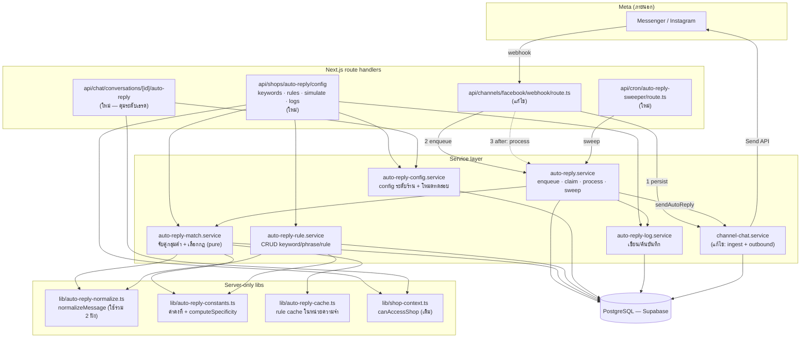
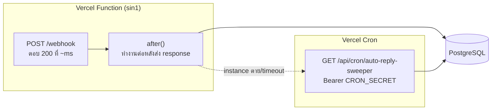
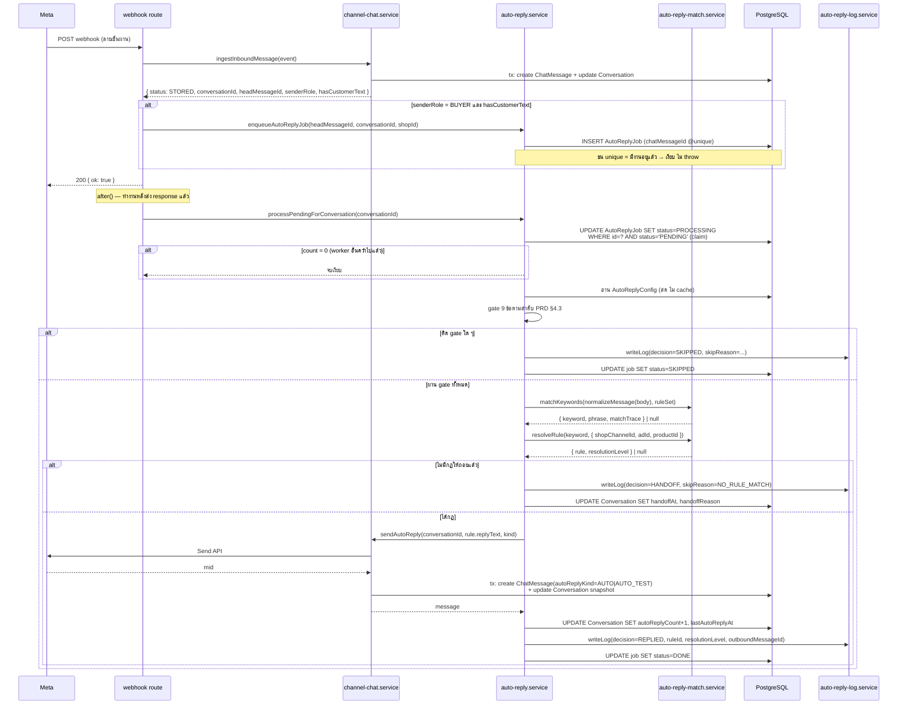
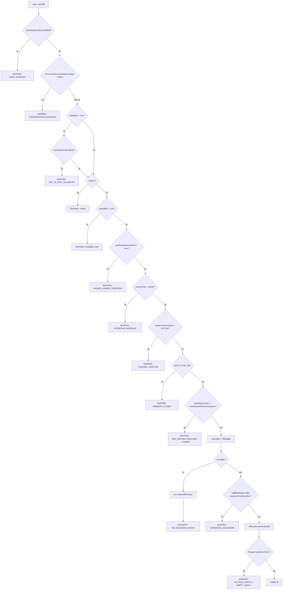
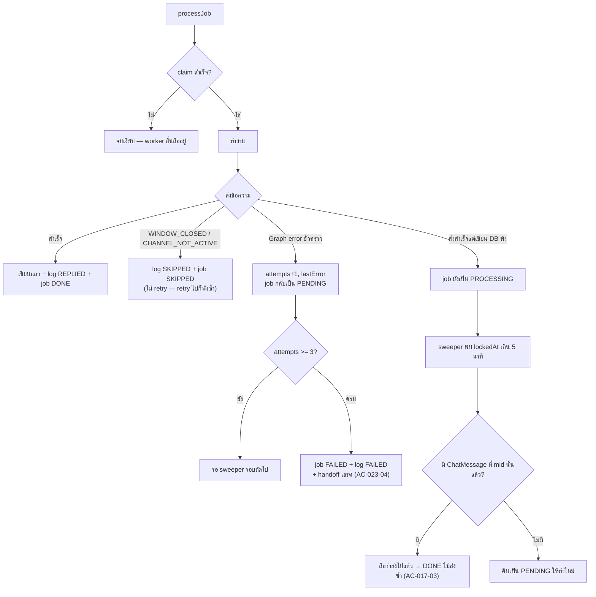
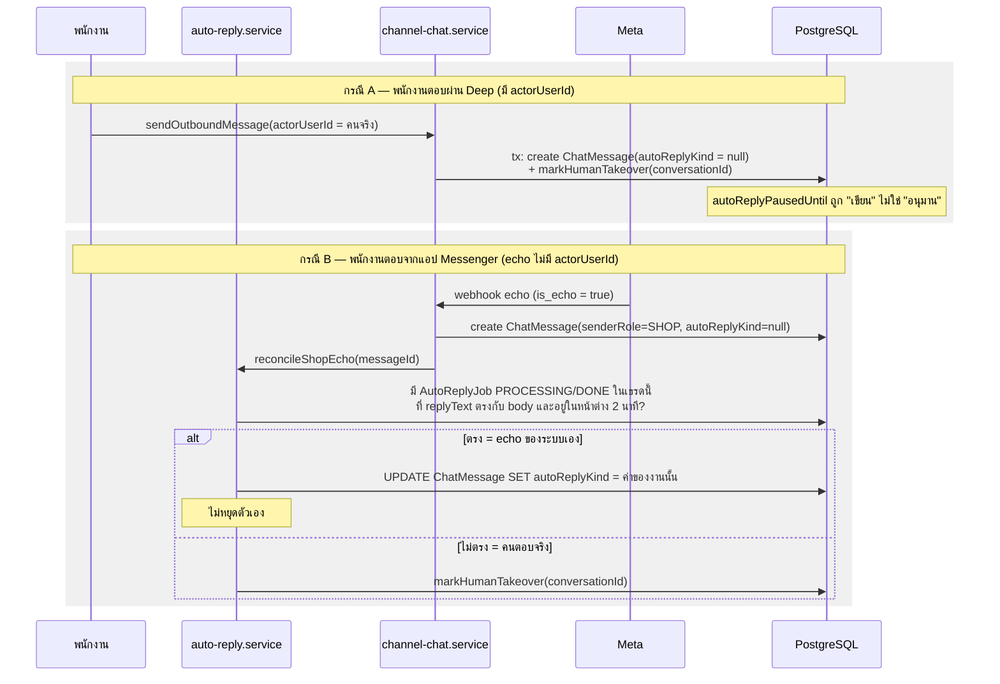
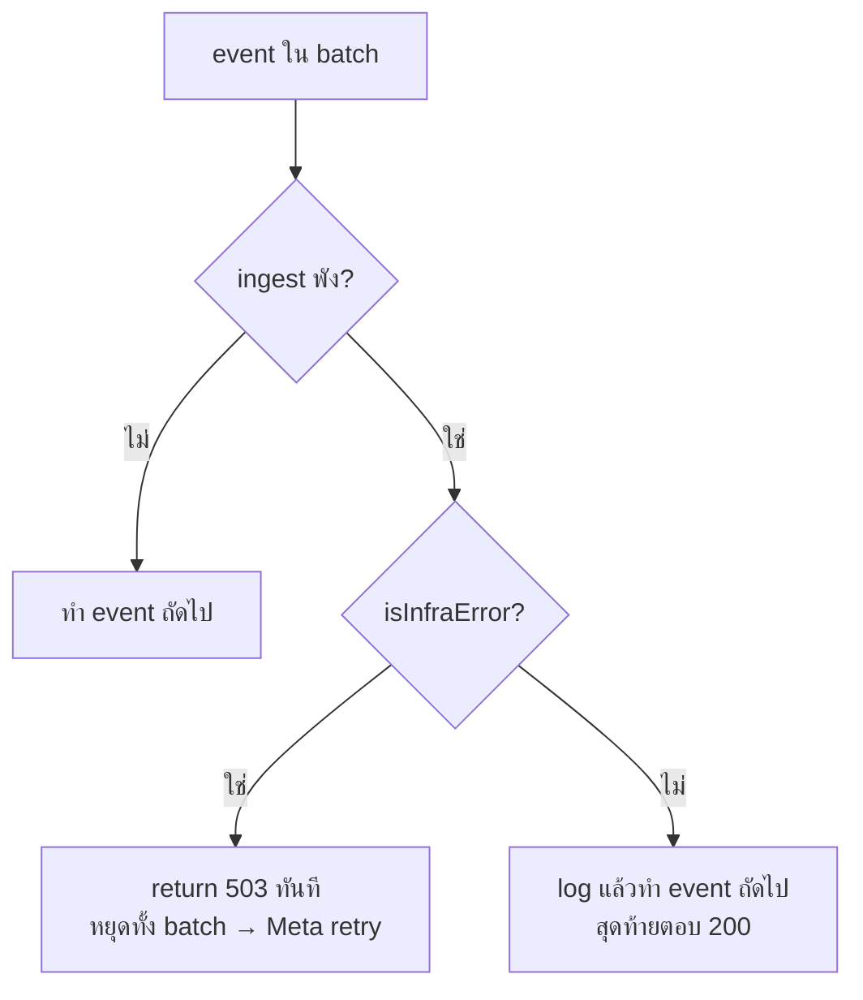
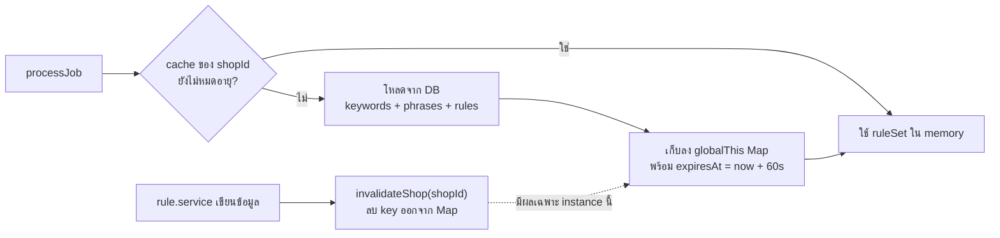
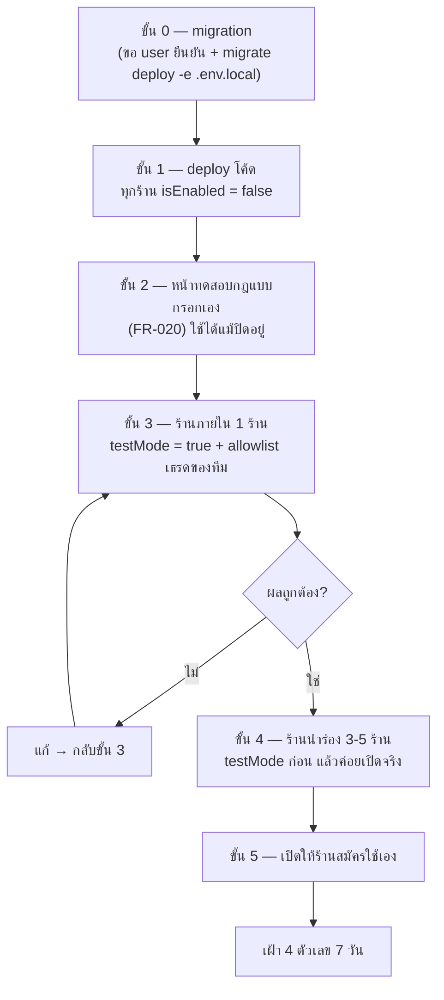

> **โมดูล:** M00023-ChatAutoReply
> **ประเภทเอกสาร:** System Design Spec (SDS)
> **เวอร์ชัน:** 1.0
> **วันที่จัดทำ:** 2026-07-29
> **สถานะ:** Draft
> **เจ้าของเอกสาร:** SA (ดู [[Feature-Docs-Ownership]])

# SDS: ตอบแชทอัตโนมัติจาก Keyword (System Design Spec)

---

## 🛑 ข้อจำกัดที่ล็อกแล้วก่อนเริ่มออกแบบ

เอกสารนี้ **ไม่เปิดประเด็นใหม่** ในสามเรื่องต่อไปนี้ — ถูกตัดสินโดยเจ้าของระบบไปแล้ว หน้าที่ของ SDS คือออกแบบให้ดีที่สุด *ภายใต้* ข้อตัดสินนี้ ไม่ใช่เสนอทางเลือกอื่น:

| เรื่อง | สิ่งที่ล็อกแล้ว |
|---|---|
| **กลไกคิว** | `after()` ของ Next.js + ตาราง `AutoReplyJob` + cron sweeper — **ไม่ใช้** Vercel Queues / QStash / Redis / BullMQ |
| **ขอบเขตเฟสแรก** | template-only — **ไม่มี AI อยู่ในเส้นทางการส่งเลย** ไม่มีการเรียกผู้ให้บริการภายนอกใด ๆ นอกจาก Meta Send API |
| **โหมดทดสอบ** | allowlist ระดับเธรด + **ส่งจริง** + ติดป้ายกำกับ (`autoReplyKind = "AUTO_TEST"`) |

นอกจากนี้ `DATABASE.md` v1.0 อยู่ในสถานะ **FROZEN CONTRACT** — ทุกชื่อ model / field / ค่าคงที่ในเอกสารนี้อ้างตรงตัวจาก `DATABASE.md` §3 และ §3.8 ห้ามตั้งชื่อใหม่

---

## 1. บทนำ & References

### 1.1 วัตถุประสงค์

ออกแบบระดับ component, data flow และการตัดสินใจทางเทคนิคของการตอบแชทอัตโนมัติจาก Keyword เพื่อให้ DEV ลงมือได้โดยไม่ต้องตัดสินใจสถาปัตยกรรมเองระหว่างทาง, QA เอาความเสี่ยงไปวางแผนทดสอบ, และ Controller ประเมินผลกระทบต่อระบบแชทที่ใช้งานอยู่จริงบน production ได้ก่อนแตะโค้ด

จุดเน้นของเอกสารนี้ต่างจาก SDS ทั่วไปหนึ่งข้อ: **ฟีเจอร์นี้ต่อเข้ากับเส้นทางที่ร้านใช้ทุกวันและพังไม่ได้** (`webhook → ingest → inbox`) §7 จึงเป็นหัวข้อบังคับที่วิเคราะห์ผลกระทบทีละจุด ไม่ใช่หมายเหตุท้ายเอกสาร

### 1.2 ขอบเขตการออกแบบ

**อยู่ในขอบเขต:** ชั้น lib, ชั้น service, ชั้น route handler, cron, และการต่อเข้ากับ `webhook/route.ts` + `channel-chat.service.ts` ของ feature 00018 รวมถึงแผน migration/rollout

**นอกขอบเขต:** รายละเอียด visual ของหน้าตั้งค่า/หน้ากล่องข้อความ — เป็นงานของ Design Spec จาก `safepay-ux` (Hard Rule 8) ซึ่งต้อง invoke ก่อนเขียน frontend ทุกชิ้น เอกสารนี้ระบุแค่ "มีหน้าอะไร ทำหน้าที่อะไร วางไฟล์ที่ไหน"

### 1.3 เอกสารอ้างอิง

| เอกสาร | ความสัมพันธ์ |
|--------|-------------|
| [[PRD]] §3, §4.3, §6 | เป้าหมายธุรกิจ, เงื่อนไขที่ห้ามตอบ (9 ข้อเรียงลำดับ), ความเสี่ยง |
| [[BRD]] FR-001..FR-024 | Functional Requirement + AC ที่การออกแบบนี้ต้อง realize |
| [[DATABASE]] (FROZEN) | ชื่อ model/field/ค่าคงที่ทุกตัว + §5 migration + §6 กับดัก echo |
| [[SRS]] | จัดทำแล้ว (commit `b27b7e1e`) — 30 TFR พร้อมอัลกอริทึม normalize/match/resolution |
| `docs/20 - Features/00018 - Facebook Chat Integration/SDS.md` | เส้นทาง ingest/outbound เดิมที่ฟีเจอร์นี้ต่อเข้าไป |
| `docs/20 - Features/00019 - AI Reply Assistant/SDS.md` | แบบอย่าง TD + การแยกตารางตั้งค่าออกจาก `Shop` (TD-001 ของ 00019) |
| `docs/conventions/prisma-shared-db-drift.md` | ข้อบังคับ migration บน DB ที่ dev/prod ใช้ร่วมกัน |
| `docs/conventions/paces-toast.md` · `paces-charts-source.md` | ข้อบังคับ UI ฝั่ง seller |

---

## 2. Architecture Overview

### 2.1 มุมมองสถาปัตยกรรม

สถาปัตยกรรมยึด pattern เดิมของโปรเจกต์ทั้งหมด — route ตัดสินสิทธิ์, service ถือ logic และรับ `shopId` เป็น argument, lib เป็น pure/server-only utility ไม่มีของใหม่ระดับ infrastructure



### 2.2 มุมมองการ Deploy

ไม่มีองค์ประกอบใหม่ระดับ infrastructure — ทุกอย่างรันบน Vercel Functions (`regions: ["sin1"]`) และ PostgreSQL เดิม สิ่งที่ต้องเตรียมก่อน deploy มี 3 อย่าง:

1. **migration** `20260729000000_auto_reply` (ดู [[DATABASE]] §5) — apply ด้วย `npx prisma migrate deploy -e .env.local` เท่านั้น และต้องขอ user ยืนยันก่อน เพราะ dev/prod ใช้ DB ตัวเดียวกัน
2. **cron entry ใหม่** ใน `vercel.json` → `/api/cron/auto-reply-sweeper` (ใช้ `CRON_SECRET` เดิม ไม่มี env ใหม่)
3. **`maxDuration` ของ webhook route** — งานใน `after()` นับรวมในอายุของ function เดิม ต้องประกาศ `export const maxDuration = 60` ที่ `webhook/route.ts` เหมือนที่ cron route ทุกตัวทำ ไม่งั้นงานตอบจะถูกตัดกลางคันที่ 10 วินาที



**ข้อจำกัดที่รับไว้ตั้งแต่ออกแบบ:** `after()` ผูกกับอายุของ instance ที่รับ request นั้น ถ้า instance ถูกฆ่ากลางคัน งานจะค้างที่สถานะ `PENDING`/`PROCESSING` — cron sweeper คือชั้นกู้คืน และ **`after()` ของ webhook ยังกวาดงานค้างของร้านเดียวกันแบบ opportunistic ด้วย** เพื่อไม่ผูกการกู้คืนไว้กับความถี่ของ cron อย่างเดียว (ดู TD-001)

---

## 3. Component Design

### 3.1 ตาราง Component

| Component | หน้าที่ (Responsibility) | Dependency |
|-----------|--------------------------|------------|
| **`lib/auto-reply-normalize.ts`** | `normalizeMessage(text)` — ฟังก์ชันเดียวที่ทั้งระบบใช้ปรับข้อความให้เป็นมาตรฐาน (NFC → trim → ยุบช่องว่าง → lowercase อังกฤษ → ตัดเครื่องหมายท้าย) | ไม่มี (pure, ไม่มี I/O) |
| **`lib/auto-reply-constants.ts`** | ค่าคงที่ทุกตัวจาก [[DATABASE]] §3.8 เป็น `as const` + `computeSpecificity()` + ตารางแปลง `specificity → resolutionLevel` | ไม่มี (pure) |
| **`lib/auto-reply-cache.ts`** | cache ชุดกฎต่อร้านในหน่วยความจำพร้อม TTL + `invalidateShop(shopId)` | `globalThis` (pattern เดียวกับ `api-rate-limit.ts`) |
| **`services/auto-reply-config.service.ts`** | `getConfig(shopId)` (lazy default ไม่ backfill), `upsertConfig`, `setTestMode`, `expireTestMode` | Prisma → `AutoReplyConfig` |
| **`services/auto-reply-rule.service.ts`** | CRUD ของ `AutoReplyKeyword` / `AutoReplyPhrase` / `AutoReplyRule` + **รักษา invariant `specificity`** + `normalizedPhrase` + duplicate/ตรวจกลุ่มว่าง | Prisma, `auto-reply-normalize`, `auto-reply-constants`, `auto-reply-cache` |
| **`services/auto-reply-match.service.ts`** | `matchKeywords(normalizedText, ruleSet)` และ `resolveRule(keyword, ctx, ruleSet)` — **ฟังก์ชันบริสุทธิ์ ไม่มี side effect ไม่ส่งข้อความ ไม่เขียน DB** คืนผลพร้อม `matchTrace` | `auto-reply-cache` (โหลด ruleSet), `auto-reply-constants` |
| **`services/auto-reply.service.ts`** | orchestrator: `enqueueAutoReplyJob` · `claimJob` · `processJob` (gate 9 ข้อ → resolve → send → log) · `sweepStuckJobs` · `markHumanTakeover` | ทุกตัวข้างบน + `channel-chat.service` |
| **`services/auto-reply-log.service.ts`** | `writeLog(entry)` (จุดเขียนบันทึกจุดเดียวของทั้งฟีเจอร์) + `searchLogs(shopId, filter)` | Prisma → `AutoReplyLog` |
| **`services/channel-chat.service.ts` (แก้ไข)** | `ingestInboundMessage` คืน id ของข้อความหัวแถว; `sendOutboundMessage` รองรับ system actor + แก้กับดัก echo | เดิม + field ใหม่ |
| **route ชั้นตั้งค่า** | ตรวจ session → `resolveActiveShopContext` → gate role (OWNER/ADMIN เขียน, STAFF อ่าน) → Valibot → เรียก service | `lib/shop-context`, `lib/validations` |
| **`api/cron/auto-reply-sweeper/route.ts`** | ตรวจ `CRON_SECRET` → `sweepStuckJobs()` → `expireTestMode()` → ลบบันทึกตามนโยบาย retention | `auto-reply.service`, `auto-reply-config.service` |

### 3.2 หลักการแบ่งความรับผิดชอบที่ต้องคงไว้

- **route ตัดสินสิทธิ์ service ไม่รับ role มาตัดสินเอง** — pattern เดียวกับ 00019 SDS §3 และทุก route ของโปรเจกต์
- **`shopId` resolve ที่ route จาก session เท่านั้น** แล้วส่งลงเป็น argument; service ไม่แตะ session
- **ทุก query ต้องมี `shopId` ใน `WHERE`** ห้าม post-filter ใน JS ([[DATABASE]] §6)
- **`auto-reply-match.service` ต้องไม่มี side effect เด็ดขาด** — เพราะหน้าทดสอบกฎแบบกรอกเอง (FR-020) กับเส้นทางจริงต้องเรียก *ฟังก์ชันตัวเดียวกัน* AC-020-05 ("ผลต้องตรงกับสิ่งที่จะเกิดขึ้นจริง") บังคับไว้ ถ้าปล่อยให้ matcher เขียน DB ได้เมื่อไหร่ หน้าทดสอบจะสร้างผลข้างเคียงทันที
- **`auto-reply-log.service.writeLog` เป็นจุดเขียนบันทึกจุดเดียว** — ทุกทางออกของ `processJob` (ตอบ / ข้าม / ส่งต่อ / พัง) ต้องผ่านฟังก์ชันนี้ เพื่อให้ AC-024-02 ("ไม่ตอบก็ต้องบันทึก") บังคับได้ด้วยการอ่านโค้ดไฟล์เดียว

### 3.3 รายการไฟล์ที่จะสร้างใหม่ พร้อมเหตุผลรายไฟล์

| ไฟล์ | เหตุผลที่ต้องเป็นไฟล์แยก |
|---|---|
| `src/lib/auto-reply-normalize.ts` | [[DATABASE]] §6 ระบุว่า `normalizedPhrase` ตอนบันทึกกับข้อความลูกค้าตอนเทียบ **ต้องผ่านฟังก์ชันเดียวกัน** ถ้าฝังไว้ใน service ใดก็ตาม อีกฝั่งจะ import ข้าม service (พันกัน) หรือคัดลอกโค้ด (แยกกันเมื่อไหร่ระบบจะ match ไม่ตรงแบบหาสาเหตุยากมาก) |
| `src/lib/auto-reply-constants.ts` | ค่าคงที่ 8 กลุ่มใน [[DATABASE]] §3.8 เป็น FROZEN CONTRACT — รวมไว้ที่เดียวทำให้ตรวจได้ด้วย grep ว่าโค้ดไม่ได้ตั้งค่าใหม่เอง และ `computeSpecificity()` ต้องอยู่คู่กับ mapping `specificity → resolutionLevel` เพราะสองอย่างนี้ผิดพร้อมกันเสมอถ้าแยกกัน |
| `src/lib/auto-reply-cache.ts` | ต้องใช้ `globalThis` singleton (route handler เป็นคนละ module instance) — pattern เดียวกับ `api-rate-limit.ts` และ `sms-consume-rl.ts` ที่พิสูจน์แล้วในโปรเจกต์ ไม่ควรปนอยู่ใน service ที่มี Prisma |
| `src/services/auto-reply-config.service.ts` | แยกจาก rule service เพราะ **อ่านคนละความถี่**: config อ่านทุกงาน (ห้าม cache — ดู TD-004) แต่ rule อ่านผ่าน cache; ปนกันแล้วจะเผลอ cache สวิตช์เปิดปิด |
| `src/services/auto-reply-rule.service.ts` | CRUD ของ 3 ตารางที่ผูกกันแน่น (keyword → phrase → rule) และเป็นจุดเดียวที่รักษา invariant `specificity` + `normalizedPhrase` — [[DATABASE]] §6 ห้ามให้ client ส่ง `specificity` มา |
| `src/services/auto-reply-match.service.ts` | ต้อง pure และถูกเรียกจาก 2 ที่ (เส้นทางจริง + หน้าทดสอบ FR-020) การแยกไฟล์ทำให้ "ตรงไหนตัดสินใจเลือกกฎ" ตรวจได้จุดเดียว และเขียน unit test ได้โดยไม่ต้องมี DB |
| `src/services/auto-reply.service.ts` | orchestrator ที่ถือ side effect ทั้งหมด (คิว, ส่ง, บันทึก) — แยกจาก matcher โดยเจตนาเพื่อให้ขอบเขต "อะไรที่ส่งข้อความถึงลูกค้าได้" อยู่ในไฟล์เดียว |
| `src/services/auto-reply-log.service.ts` | จุดเขียนบันทึกจุดเดียว + จุดค้นหา; แยกเพราะ `AutoReplyLog` เก็บข้อความลูกค้าดิบ (PII) การรวม logic ปกปิด/ตัดข้อมูลไว้ไฟล์เดียวทำให้ตรวจ NFR ด้านความเป็นส่วนตัวได้ (หลักเดียวกับ TD-003 ของ 00019) |
| `src/app/api/shops/auto-reply/config/route.ts` | GET/PUT config ระดับร้าน — วางใต้ `api/shops/` ตาม pattern ของ `api/shops/ai-settings/` (00019) |
| `src/app/api/shops/auto-reply/keywords/route.ts` · `[id]/route.ts` · `[id]/phrases/route.ts` · `[id]/phrases/[phraseId]/route.ts` | CRUD กลุ่มคำและคำตรวจจับ (FR-001, FR-002) |
| `src/app/api/shops/auto-reply/rules/route.ts` · `[id]/route.ts` | CRUD กฎคำตอบทุกระดับ (FR-005..FR-009) |
| `src/app/api/shops/auto-reply/simulate/route.ts` | หน้าทดสอบกฎแบบกรอกเอง (FR-020) — เรียก matcher ตรง ๆ **ไม่แตะคิว ไม่เขียน DB ไม่ส่งข้อความ** และต้องใช้ได้แม้ `isEnabled = false` (AC-020-06) |
| `src/app/api/shops/auto-reply/logs/route.ts` | ค้นบันทึกย้อนหลัง (FR-024) |
| `src/app/api/shops/auto-reply/ads/route.ts` | รายการโฆษณาที่เคยมีลูกค้าทักเข้ามาจริง (AC-007-05) — อ่านจาก `ConversationAdReferral` ของเดิม ไม่สร้างตารางใหม่ |
| `src/app/api/chat/conversations/[id]/auto-reply/route.ts` | คุมระดับเธรด: เปิด/ปิด (FR-015), เพิ่ม/ถอดจาก allowlist ทดสอบ (FR-021), ล้างสถานะหยุด (AC-016-04), กำหนดบริบทสินค้าเอง (FR-014) — วางใต้เส้นทาง chat เดิมเพราะเป็นการกระทำต่อ "เธรด" ไม่ใช่ต่อ "การตั้งค่าร้าน" |
| `src/app/api/cron/auto-reply-sweeper/route.ts` | กู้งานค้าง + ปิดโหมดทดสอบที่หมดอายุ + retention — คัดลอกโครง auth จาก `api/cron/chat-response-metrics/route.ts` ตรง ๆ |
| `src/app/(paces)/seller/(dashboard)/settings/auto-reply/**` | หน้าตั้งค่า (page + client form + ตารางกลุ่มคำ + ตัวทดสอบ + หน้าบันทึก) — วางคู่กับ `settings/ai/` ที่มีอยู่ |

### 3.4 รายการไฟล์ที่จะแก้ไข พร้อมเหตุผลและขอบเขตการแตะ

| ไฟล์ | สิ่งที่แก้ | ขอบเขตที่ห้ามเกิน |
|---|---|---|
| `prisma/schema.prisma` | เพิ่ม 6 model + 10 คอลัมน์ + relation ฝั่งตรงข้ามใน `Shop`/`Conversation`/`ChatMessage`/`ShopChannel`/`Product`/`User` | additive ล้วน — ห้ามแตะชนิด/ชื่อของ field เดิมแม้แต่ตัวเดียว |
| `src/app/api/channels/facebook/webhook/route.ts` | (1) รับค่าที่ `ingestInboundMessage` คืนมาเพิ่ม (2) เรียก `enqueueAutoReplyJob` ใน try/catch ของตัวเอง (3) `after()` เรียก `processPendingForConversation` (4) `export const maxDuration = 60` | **ห้ามแตะ logic ของลายเซ็น, ลำดับ event, การจัดการ referral, และ `isInfraError` → 503 เดิม** (ดู §7.3) |
| `src/services/channel-chat.service.ts` | (1) `ingestInboundMessage` คืน `{ status, conversationId, headMessageId, senderRole, hasCustomerText }` (2) `sendOutboundMessage` รับ `autoReplyKind` + `systemActor` (3) **แก้ branch unique-violation ที่บรรทัด 879-885 ให้ `UPDATE` แทนการคืนแถวเดิมเฉย ๆ** | ห้ามเปลี่ยนพฤติกรรมของ caller เดิมทุกตัว — field ใหม่ทั้งหมดเป็น optional และ default ต้องให้ผลเหมือนเดิมทุกประการ |
| `vercel.json` | เพิ่ม 1 entry ใน `crons` | ห้ามแตะ `buildCommand` / `regions` / entry เดิม |
| `src/lib/validations.ts` | เพิ่ม Valibot schema ของ config/keyword/phrase/rule/simulate | เพิ่มอย่างเดียว |
| `src/app/(paces)/seller/(chat)/_components/**` | ป้าย "ระบบตอบ"/"ทดสอบ" บนบับเบิล (AC-012-02, AC-021-05), แถบสถานะโหมดทดสอบ (AC-021-07), สถานะหยุด + เวลาที่จะกลับมาทำงาน (AC-016-03) | ต้องผ่าน `safepay-ux` ก่อน (Hard Rule 8) และใช้ Paces primitive เท่านั้น (Hard Rule 7) |
| `src/app/api/chat/conversations/route.ts` (list กล่องข้อความของร้าน) | เรียก `sweepStuckJobs({ shopId, limit })` ใน `after()` — **ชั้น 3(ข) ของ TD-001** ไม่ให้การกู้คืนผูกกับ cron รายวันอย่างเดียว | **ห้าม await ในเส้นทางตอบ response** — ต้องอยู่ใน `after()` เท่านั้น เพื่อไม่ให้หน้ากล่องข้อความช้าลง; พังแล้วต้องกลืน error ไม่กระทบการโหลดรายการ |
| `src/proxy.ts` | **ไม่ต้องแก้** — `/api/cron/*` ถูกยกเว้นจาก CSRF Origin-check อยู่แล้ว (บรรทัด 33) และ webhook ก็ถูกยกเว้นอยู่แล้ว (บรรทัด 35) | บันทึกไว้เพื่อกันคนเผลอไปแก้ |

---

## 4. Data Flow

### 4.1 Flow หลัก: ลูกค้าส่งข้อความ → ระบบตอบ



### 4.2 Flow: ลำดับการตรวจ gate (PRD §4.3 — ตรวจตามลำดับ ห้ามสลับ)

ลำดับนี้ไม่ใช่เรื่องความสวยงามของโค้ด — **BR-AR-17 บังคับว่าการตรวจโหมดทดสอบต้องเกิดก่อนการประมวลผลที่มีต้นทุน** และ AC-015-02 บังคับว่าสวิตช์ระดับร้านต้องมีผลภายใน 1 นาที ทั้งสองข้อจึงถูกวางไว้บนสุดโดยเจตนา



**หมายเหตุการออกแบบ 3 ข้อในไดอะแกรมนี้:**

1. **`SHOP_DISABLED` อยู่บนสุดและอ่านสด** — ไม่ผ่าน cache ใด ๆ (TD-004) เพื่อให้ AC-015-02 เป็นจริงตามตัวอักษร
2. **`OUTBOUND_MESSAGE` ถูกตรวจซ้ำ** ทั้งที่ `enqueueAutoReplyJob` ไม่สร้างงานให้ข้อความฝั่งร้านอยู่แล้ว — เป็น defense-in-depth ตาม BR-AR-22 ซึ่งเป็นกฎที่ผิดพลาดแล้วเสียหายทันทีและแก้ย้อนหลังไม่ได้
3. **`MAX_REPLIES_REACHED` และ `NO_KEYWORD_MATCH` ไม่ใช่แค่ "ไม่ตอบ"** แต่ต้องเปลี่ยนสถานะเธรดเป็น handoff ตาม AC-019-01

### 4.3 Flow กรณีล้มเหลว / ชดเชย



**จุดสำคัญของ flow นี้คือกล่อง `L → O`** — AC-017-03 ("ส่งสำเร็จแต่บันทึกผลไม่สำเร็จ ต้องตรวจพบว่าส่งไปแล้ว") บังคับให้ sweeper **ห้ามคืนงานที่ค้างเป็น PENDING แบบไม่ตรวจอะไรเลย** ต้องตรวจก่อนว่ามี `ChatMessage` ฝั่ง SHOP ที่มี `autoReplyKind != null` เกิดขึ้นในเธรดนั้นหลังเวลาที่ job ถูก claim หรือไม่ ถ้ามี = ส่งไปแล้ว ให้ปิดเป็น `DONE`

### 4.4 Flow: พนักงานเข้ามาตอบ และการคืนดีกับ echo ของระบบเอง



---

## 5. Integration Points

| จุดเชื่อม | ประเภท | Protocol / Contract | ความเสี่ยงเมื่อล่ม |
|-----------|--------|---------------------|---------------------|
| **Meta Send API** (`sendTextMessage` ใน `lib/facebook/graph.ts`) | external | HTTPS REST + page token | ลูกค้าไม่ได้รับคำตอบ; งาน retry ตาม §4.3 แล้วปิดเป็น FAILED + handoff — **แชทเดิมและการตอบด้วยมือไม่กระทบ** |
| **Meta Webhook** | external (ขาเข้า) | POST + `X-Hub-Signature-256` | ไม่มีข้อความเข้า = ไม่มีงาน (ไม่ใช่ความล้มเหลวของฟีเจอร์นี้) |
| **`ingestInboundMessage`** | internal | function call | ถ้าพัง = ไม่มีทั้งข้อความและงาน — 503 เดิมยังทำงานเหมือนเดิม (§7.3) |
| **`sendOutboundMessage`** | internal | function call | ทางเดียวที่ระบบส่งข้อความออกได้ — ผ่าน guard เดิมทั้งหมด (§7.2 / TD-005) |
| **`after()` ของ Next.js** | platform | runtime API | งานไม่ถูกประมวลผลในคำขอนั้น → cron sweeper + opportunistic sweep กู้คืน |
| **Vercel Cron** | platform | GET + `Bearer CRON_SECRET` | งานค้างนานขึ้น แต่ไม่หาย; test mode หมดอายุช้ากว่าที่ตั้งไว้ |
| **`canAccessShop`** | internal | function call | คืน false → 403 ที่ route (fail-closed) |
| **`checkApiRateLimit`** | internal | in-memory counter | เพดานไม่ครอบทั้งระบบบน serverless (known-gap เดิมที่รับไว้แล้ว) |
| **`pacesToast`** | internal (UI) | client API | ไม่มีผลต่อ backend |

**Timeout / Retry / Idempotency:**

- **Send API** — ไม่ retry ภายในคำขอเดียว; retry เกิดที่ระดับงาน (`attempts` ≤ 3) เท่านั้น เพื่อไม่ให้ผู้ใช้ได้รับหลายข้อความจาก retry ซ้อน retry (AC-012-05)
- **Idempotency key ของทั้งฟีเจอร์คือ `AutoReplyJob.chatMessageId @unique`** — ไม่มี key อื่น ไม่มี lock อื่น (TD-002)
- **สัญญา API เต็ม:** ดู `API.md` ของโมดูลนี้ (จัดทำแล้ว commit `b27b7e1e` — 29 endpoint; หน้าทดสอบกฎ freeze ที่ `POST /api/shops/auto-reply/simulate` ตาม GAP-02)

---

## 6. Technical Decisions

### TD-001: ใช้ `after()` + ตาราง `AutoReplyJob` แทน message queue จริง

- **ตัดสินใจ:** งานตอบอัตโนมัติถูก **INSERT ลงตาราง `AutoReplyJob` ก่อนเสมอ** (ในคำขอ webhook เดียวกัน) แล้วประมวลผลใน `after()` ของ Next.js; `Vercel Cron` เป็นตัวกวาดงานค้าง และ `after()` ของ webhook ยังกวาดงานค้าง *ของเธรด/ร้านเดียวกัน* แบบ opportunistic ด้วย
- **เหตุผล:**
  1. **เป็นข้อตัดสินของเจ้าของระบบ** — ไม่เปิดประเด็นใหม่ในเอกสารนี้
  2. ตรงกับข้อจำกัดจริงของ AC-022-01/02 ("ตอบรับ Facebook ทันที เวลาไม่ขึ้นกับจำนวนงาน") ได้ครบ เพราะงานที่ทำในเส้นทางซิงโครนัสเหลือแค่ `INSERT` แถวเดียว
  3. ตารางงานให้สิ่งที่ queue ภายนอกไม่ให้ฟรี ๆ คือ **การกันตอบซ้ำระดับ DB constraint** (TD-002) — ถ้าใช้ queue ภายนอกก็ยังต้องมีตารางนี้อยู่ดี
  4. ไม่มี infrastructure ใหม่ ไม่มี env ใหม่ ไม่มีต้นทุนบริการเพิ่ม สอดคล้องกับที่ทั้งโปรเจกต์ยังไม่มี Redis (`api-rate-limit.ts` ประกาศ known-gap นี้ไว้แล้ว)
- **ทางเลือกที่ไม่เลือก:** (บันทึกไว้เพื่อความครบถ้วนของเอกสาร ไม่ใช่ข้อเสนอ) Vercel Queues / QStash / Redis-backed worker — เจ้าของระบบตัดสินแล้วว่าไม่ใช้ในเฟสนี้
- **ข้อจำกัดที่ยอมรับ (ต้องเขียนไว้ให้ชัดเพราะจะกลายเป็นคำถามตอน incident):**
  - `after()` ผูกกับอายุ instance — instance ถูกฆ่า/หมดเวลา = งานค้างที่ `PENDING`/`PROCESSING` จนกว่าจะถูกกวาด
  - **🛑 ข้อตัดสินของเจ้าของระบบ 2026-07-29: อยู่ Vercel plan เดิม — cron รายวันเท่านั้น ไม่อัปเกรดเพื่อ cron รายนาที** ดังนั้น **cron ห้ามเป็นกลไกกู้คืนหลัก** ต้องออกแบบเป็น 4 ชั้นโดยชั้นล่างยิ่งถูกใช้ยิ่งน้อย:

    | ชั้น | กลไก | ครอบเคสไหน | เวลากู้คืน |
    |---|---|---|---|
    | 1 | `after()` ทำงานทันทีหลังตอบ 200 | ปกติ (ส่วนใหญ่อย่างท่วมท้น) | < 1 วินาที |
    | 2 | **retry ในตัว `after()` เอง** สูงสุด 3 ครั้ง backoff 1s→2s→4s | ความล้มเหลวชั่วคราว (เน็ตกระตุก Meta ตอบช้า) | ไม่กี่วินาที |
    | 3 | opportunistic sweep — **(ก)** ทุก webhook ของร้านนั้น **(ข)** ทุกครั้งที่พนักงานเปิด/โหลดกล่องข้อความของร้านนั้น | `after()` ตายกลางคัน | วินาที–นาที (ตามความถี่ที่มีคนทัก/แอดมินเปิดดู) |
    | 4 | cron รายวัน | ที่รอดมาถึงตรงนี้ + retention + ปิดโหมดทดสอบหมดอายุ | สูงสุด 24 ชม. |

    **เหตุผลที่ยอมรับได้:** ชั้น 2 ปิดความล้มเหลวชั่วคราวซึ่งเป็นสาเหตุส่วนใหญ่ไปตั้งแต่ต้น และร้านที่เปิด auto-reply คือร้านที่มีข้อความเข้าเรื่อย ๆ อยู่แล้ว (ไม่งั้นจะเปิดทำไม) ชั้น 3 จึงทำงานถี่จริงในทางปฏิบัติ ส่วนร้านที่เงียบสนิทก็ไม่มีงานค้างให้กวาดตั้งแต่แรกเพราะไม่มีข้อความเข้ามา
    **เคสที่จะตกถึงชั้น 4 จริง** ต้องเกิดครบทุกข้อพร้อมกัน: `after()` ตาย **และ** retry 3 ครั้งไม่ผ่าน **และ** ไม่มีลูกค้าทักร้านนั้นอีกเลย **และ** แอดมินไม่เปิดกล่องข้อความเลย — ต้องเฝ้าตัวเลขนี้จริง (AC-023-05) ถ้าพบว่าเกิดบ่อยค่อยทบทวน plan
    **ทางเลือกฟรีที่กันไว้เป็นของแถม (ไม่ทำในเฟสแรก):** GitHub Actions `schedule` ยิง `/api/cron/auto-reply-sweeper` ทุก 5 นาที ใช้ `CRON_SECRET` เดิม — เพิ่มได้ภายหลังโดยไม่แตะโค้ด
  - `after()` นับรวมในอายุของ function → ต้อง `export const maxDuration = 60` ที่ webhook route
- **ผลกระทบ:** DEV ต้องเขียน processor ให้ **idempotent เสมอ** เพราะจะถูกเรียกจาก 2 ทางแน่นอน; QA ต้องทดสอบเส้นทาง cron แยกจากเส้นทาง `after()`; DevOps ต้องเฝ้าจำนวนงาน `PENDING` ค้าง (AC-023-05)
- trace: FR-022, FR-023, AC-022-01..04

### TD-002: กันตอบซ้ำที่ `AutoReplyJob.chatMessageId @unique` แทน distributed lock

- **ตัดสินใจ:** ความเป็น "หนึ่งข้อความ หนึ่งคำตอบ" ถูกบังคับด้วย **unique constraint ระดับฐานข้อมูล** ไม่ใช่ lock, ไม่ใช่ flag ในแอป, ไม่ใช่ตัวนับ
- **เหตุผล:**
  - แหล่งที่มาของการซ้ำมี 4 ทางพร้อมกัน: Meta redeliver, cron ทับ `after()`, `after()` สองรอบจาก 2 instance, และการกดทดสอบซ้ำจากหน้า admin — **ทุกทางลงมาชนที่ `INSERT` เดียวกัน** ถ้าให้ constraint เป็นผู้ตัดสิน ไม่มีเส้นทางไหนหลุด
  - โปรเจกต์นี้มีหลักฐานว่าวิธีนี้ทนจริง: `ChatMessage.externalMessageId @unique` ทำหน้าที่ dedupe ทั้ง redelivery และ echo ของ feature 00018 มาแล้วบน production โดยไม่ต้องมี logic แยก
  - distributed lock บน serverless ต้องมี Redis (ไม่มีในระบบ) และยังมีปัญหา lock หมดอายุกลางงาน ซึ่งแปลว่าสุดท้ายก็ต้องมี constraint เป็นชั้นสุดท้ายอยู่ดี — เท่ากับเพิ่มความซับซ้อนโดยไม่เพิ่มการรับประกัน
- **ทางเลือกที่ไม่เลือก:** advisory lock ของ Postgres (`pg_advisory_lock`) — ผูกกับ session ของ connection ซึ่ง Prisma + pgBouncer ของ Supabase ไม่รับประกันว่าเป็น connection เดิม; และ in-memory lock (`globalThis`) ซึ่งไม่ครอบข้าม instance
- **ผลกระทบ:** `enqueueAutoReplyJob` ต้อง **จับ P2002 บน `chatMessageId` แล้วถือว่าเป็นความสำเร็จ ไม่ใช่ error** (ใช้ helper รูปแบบเดียวกับ `isUniqueViolationOn` ที่มีอยู่แล้วใน `channel-chat.service.ts:140`) และห้าม throw ออกไปสู่ webhook loop (§7.3)
- trace: FR-017, BR-AR-21, AC-017-01..05, [[DATABASE]] §3.5

### TD-003: claim งานด้วย conditional `updateMany` (WHERE status = 'PENDING')

- **ตัดสินใจ:** การหยิบงานทำโดย

  ```
  UPDATE "AutoReplyJob"
     SET status='PROCESSING', "lockedAt"=now(), "lockedBy"=<workerId>, attempts=attempts+1
   WHERE id=<id> AND status='PENDING'
  ```

  แล้ว **ตัดสินจาก `count` ที่คืนมา**: `count = 1` คือคว้าได้, `count = 0` คือมีคนอื่นคว้าไปแล้ว → จบเงียบ ไม่ใช่ error
- **เหตุผล:** เป็น pattern เดียวกับ `deductCredit` ใน `wallet.service.ts:104` ที่โปรเจกต์พิสูจน์แล้วว่ากัน race ได้จริง (comment ที่นั่นอธิบายไว้ตรง ๆ ว่าทำไม read-then-write พัง) — DB รับ `UPDATE` ทีเดียว ผู้ชนะมีคนเดียวเสมอโดยไม่ต้องมี lock ภายนอก และเป็นสำนวนที่นักพัฒนาในโปรเจกต์นี้อ่านออกทันทีเพราะเคยเห็นแล้ว
- **ทางเลือกที่ไม่เลือก:**
  - `findFirst` แล้วค่อย `update` — race แบบเดียวกับ read-then-decrement ของ wallet: worker สองตัวอ่านแถวเดียวกันได้ทั้งคู่แล้วส่งข้อความคนละครั้ง = ตอบซ้ำ ซึ่งเป็นสิ่งที่ห้ามเด็ดขาด
  - `SELECT ... FOR UPDATE SKIP LOCKED` — ได้ผลถูกต้องเหมือนกันแต่ต้องใช้ `$queryRaw` และต้องอยู่ในทรานแซกชันที่ถือไว้ตลอดการส่งข้อความ (รวม network call ไป Meta) ซึ่งขัดกับกฎที่โปรเจกต์ยึดอยู่แล้วว่า **ห้าม network call ในทรานแซกชัน** (`channel-chat.service.ts:311`)
- **ผลกระทบ:** `attempts` ถูกเพิ่มตอน claim ไม่ใช่ตอน fail — งานที่ถูกคว้าแล้ว instance ตายจะนับ attempt ไปด้วย ซึ่ง **ตั้งใจ** เพราะงานที่ทำให้ instance ตายซ้ำ ๆ ต้องหยุดเองในที่สุด (AC-023-04)
- trace: FR-023, AC-023-02, AC-017-05

### TD-004: cache ชุดกฎในหน่วยความจำ แต่ **ไม่** cache สวิตช์เปิดปิด

- **ตัดสินใจ:** แบ่งข้อมูลตั้งค่าเป็น 2 ชั้นตามความอ่อนไหวต่อความสด
  - **cache ได้ (TTL 60 วินาที):** `AutoReplyKeyword` + `AutoReplyPhrase` + `AutoReplyRule` ของร้าน — เก็บเป็น `Map<shopId, { ruleSet, expiresAt }>` บน `globalThis`
  - **ห้าม cache (อ่านสดทุกงาน):** `AutoReplyConfig` ทั้งแถว — เป็น query เดียวที่ยิงด้วย `shopId @unique` ราคาถูกมาก
- **เหตุผล:**
  - `AC-015-02` เขียนไว้ตรงตัวว่า "ปิดสวิตช์ระดับร้านแล้ว ต้องไม่มีคำตอบอัตโนมัติใดถูกส่งอีกภายในเวลาไม่เกิน 1 นาที" — สวิตช์นี้คือปุ่มหยุดฉุกเฉินของร้านเมื่อระบบทำอะไรผิด การให้มันช้ากว่าที่ร้านคาดแม้แต่รอบเดียวคือการทำลายความไว้ใจที่ฟีเจอร์นี้ทั้งฟีเจอร์พึ่งพาอยู่ ต้นทุนของการอ่านสดคือ 1 query ต่อข้อความ ซึ่งถูกกว่าความเสี่ยงนั้นมาก
  - ชุดกฎมีขนาดเล็ก (A-4 ของ PRD: หลักสิบกลุ่มต่อร้าน) แต่ต้องใช้ทุกข้อความ และเปลี่ยนแปลงนาน ๆ ครั้ง — เป็นรูปแบบที่เหมาะกับ cache ที่สุด และ [[DATABASE]] §4 ก็ระบุแนวทางนี้ไว้แล้ว
  - TTL 60 วินาที ทำให้ **แม้ invalidation ข้าม instance จะไม่มี** ระบบก็ยังตรงกับ AC-015-02 โดยไม่ต้องพึ่งกลไกใด ๆ เพิ่ม
- **การ invalidate:** `auto-reply-rule.service` เรียก `invalidateShop(shopId)` ทุกครั้งที่เขียน — มีผลทันทีเฉพาะ instance ที่รับ request นั้น instance อื่นรอ TTL
- **ข้อจำกัดที่ยอมรับ:** เหมือน `api-rate-limit.ts` ทุกประการ — **บน Vercel serverless เป็น per-instance ไม่ใช่ global** ร้านที่เพิ่งแก้กฎอาจเห็นกฎเดิมทำงานได้นานสุด 60 วินาที ต้องเขียนไว้ในหน้าตั้งค่าให้ร้านรู้ ("การเปลี่ยนแปลงมีผลภายใน 1 นาที") ไม่ใช่ปล่อยให้ร้านเจอเองแล้วคิดว่าระบบพัง
- **ทางเลือกที่ไม่เลือก:** ไม่ cache เลย (3-4 query ต่อข้อความ — ยอมรับได้ในเชิงปริมาณแต่เสียเปล่าเพราะข้อมูลแทบไม่เปลี่ยน) และ cache ทั้ง config (เร็วกว่าแต่ทำลาย AC-015-02)
- trace: FR-015, AC-015-02, NFR ด้านความเร็ว (BRD §6.2)

### TD-005: ขยาย `sendOutboundMessage` ให้รองรับ system actor โดยไม่กลายเป็นช่องข้าม authz

- **ปัญหา:** `sendOutboundMessage` ปัจจุบันบังคับ `actorUserId: string` แล้วเรียก `canAccessShop(conversation.shopId, actorUserId)` (บรรทัด 781) ซึ่งเป็น guard ที่แก้บั๊กจริงบน production มาแล้ว ระบบที่ตอบเองไม่มี user จริง — ถ้าทำง่าย ๆ ด้วยการรับ `actorUserId?: string` แล้ว "ข้าม `canAccessShop` เมื่อไม่มี actorUserId" **เท่ากับสร้างช่องข้ามการตรวจสิทธิ์ที่เรียกได้จากทุกที่ในโค้ดเบส** — ใครก็ตามที่ลืมส่ง `actorUserId` จะได้สิทธิ์ระบบไปฟรี ๆ ซึ่ง BRD §6.4 ห้ามไว้ตรงตัว
- **ตัดสินใจ:** ใช้ **wrapper แยกฟังก์ชัน + การพิสูจน์ scope ที่แข็งกว่าเดิม** ไม่ใช่การผ่อน guard
  1. เพิ่ม `sendAutoReply(params)` เป็น **export ใหม่ใน `channel-chat.service.ts`** ที่รับ `{ jobId, conversationId, shopId, replyText, kind }` — ไม่รับ `actorUserId` เลย
  2. `sendAutoReply` **ไม่ข้าม guard แต่เปลี่ยนคำถาม**: แทนที่จะถามว่า "user คนนี้เข้าถึงร้านนี้ได้ไหม" มันพิสูจน์ว่า **เธรดที่จะส่งเป็นของ `shopId` ที่มาจาก `AutoReplyJob` แถวนั้นจริง** ด้วย `findFirst({ where: { id: conversationId, shopId } })` — เป็น scope-in-WHERE ตาม `feedback_rsc_dal_authz` และแข็งกว่าการเทียบใน JS
  3. `shopId` ที่ใช้ **ต้องมาจากแถว `AutoReplyJob` เท่านั้น** ซึ่งถูกเขียนตอน enqueue จาก `channel.shopId` ของเพจที่ Meta ยืนยันลายเซ็นมาแล้ว — ไม่มีทางที่ค่านี้จะมาจาก input ของผู้ใช้
  4. `sendAutoReply` **บังคับ `kind` เป็น `"AUTO"` หรือ `"AUTO_TEST"` เท่านั้น** (ห้าม `null`) — ทำให้ไม่มีทางที่เส้นทางระบบจะสร้างข้อความที่ดูเหมือนคนพิมพ์
  5. `sendOutboundMessage` เดิม **คง signature `actorUserId: string` แบบบังคับไว้เหมือนเดิมทุกประการ** — caller เดิมทั้งหมดไม่กระทบและไม่มีทางเรียกแบบไม่มี actor ได้
  6. ตรรกะที่ใช้ร่วมกัน (ส่งจริง → เขียนแถว → อัปเดต snapshot → จัดการ P2002) ถูกดึงเป็น private helper ใน service เดียวกัน ไม่ export ออกไปให้ที่อื่นเรียก
- **เหตุผล:** ช่องข้าม authz ที่อันตรายที่สุดคือช่องที่ "เรียกได้ง่ายและดูไม่มีพิษภัย" การทำให้เส้นทางระบบเป็น **ฟังก์ชันคนละตัวที่รับ argument คนละชุด** ทำให้การใช้ผิดต้องเป็นความตั้งใจ ไม่ใช่ความเผลอ และทำให้ reviewer grep คำว่า `sendAutoReply` แล้วเห็น call-site ทั้งหมดได้ในบรรทัดเดียว
- **ทางเลือกที่ไม่เลือก:** `actorUserId?: string | null` + `if (actorUserId) checkAuth()` (ช่องข้ามที่อธิบายข้างต้น) และ "ใช้ user เจ้าของร้านเป็นตัวแทนระบบ" (`shop.userId`) — วิธีหลังผ่าน guard เดิมได้จริงแต่ทำให้ข้อความของระบบถูกบันทึกว่าเจ้าของร้านเป็นคนส่ง ซึ่งทำลาย AC-012-02 และทำให้ audit trail โกหก
- **ผลกระทบ:** `safepay-security` ต้องรีวิวไฟล์นี้เป็นพิเศษ; reviewer gate: `rg "sendAutoReply\(" src/` ต้องมี call-site เดียวคือใน `auto-reply.service.ts`
- trace: BRD §6.4, AC-012-02, FR-021

### TD-006: กับดัก echo — ตอน unique-violation ต้อง `UPDATE` ไม่ใช่คืนแถวเดิมเฉย ๆ

- **ปัญหา (ระบุไว้แล้วใน [[DATABASE]] §6 — เป็นกับดักที่ทำให้ฟีเจอร์หยุดตัวเองทั้งระบบ):** เมื่อระบบส่งคำตอบ Meta จะยิง echo ของข้อความนั้นกลับมาพร้อม `mid` เดิม ถ้า echo มาถึงและถูก `ingestInboundMessage` เขียนก่อนที่ `sendAutoReply` จะเขียนแถวของตัวเอง แถวนั้นจะมี `autoReplyKind = null` → ระบบอ่านว่า "พนักงานตอบ" → **หยุดตัวเองทุกครั้งที่ตอบ** โค้ดปัจจุบันที่ `sendOutboundMessage:879-885` คืนแถวที่มีอยู่กลับไปเฉย ๆ (`message = existing`) ซึ่งถูกต้องสำหรับ 00018 แต่ไม่พอสำหรับฟีเจอร์นี้
- **ตัดสินใจ:** ป้องกัน **3 ชั้น** เพราะชั้นเดียวมีช่องว่างเวลาเสมอ
  1. **ชั้นแก้:** ใน branch `isUniqueViolationOn(e, 'externalMessageId')` ให้ทำ `UPDATE ChatMessage SET autoReplyKind = <kind> WHERE externalMessageId = mid` **แล้วคืนแถวที่อัปเดตแล้ว** — เขียนเป็นเงื่อนไขเฉพาะเส้นทาง `sendAutoReply` เท่านั้น (`kind != null`) เพื่อไม่เปลี่ยนพฤติกรรมของ caller เดิม
  2. **ชั้นตัดสิน:** การหยุดเพราะพนักงานตอบ **ต้องอ่านจากค่าที่ "ถูกเขียนไว้" (`Conversation.autoReplyPausedUntil`) ไม่ใช่จากการ "อนุมาน" ด้วยการสแกนข้อความล่าสุดทุกครั้ง** — ค่านี้ถูกเขียนโดย `markHumanTakeover()` ซึ่งเรียกจาก 2 จุดที่รู้ตัวตนผู้ส่งแน่นอน (§4.4)
  3. **ชั้นคืนดี:** สำหรับ echo ที่ไม่มี `actorUserId` (พนักงานตอบจากแอป Messenger) `reconcileShopEcho()` เทียบ `body` ของ echo กับ `replyText` ของงานที่อยู่ในสถานะ `PROCESSING`/`DONE` ในเธรดเดียวกันภายใน 2 นาที — ตรง = echo ของระบบเอง (แก้ `autoReplyKind` ให้ถูก ไม่หยุด), ไม่ตรง = คนตอบจริง (เรียก `markHumanTakeover`)
- **เหตุผลที่ต้องมีชั้น 2:** ถ้าตัดสินด้วยการสแกน "ข้อความ SHOP ล่าสุดที่ `autoReplyKind IS NULL`" ทุกครั้ง จะมีหน้าต่างเวลาระหว่างที่ echo ถูกเขียนกับที่เรา `UPDATE` มันเสร็จ ซึ่งข้อความลูกค้าอีกข้อความหนึ่งอาจถูกประมวลผลพอดีแล้วเห็นสถานะผิด การย้ายไปอ่าน field ที่ถูกเขียนแล้วทำให้ผลลัพธ์กำหนดได้แน่นอน (deterministic) ตาม AC-011-03 และเร็วกว่าด้วย
- **ทางเลือกที่ไม่เลือก:** เขียนแถวก่อนส่ง (`externalMessageId = null` แล้วค่อย UPDATE ด้วย mid) — กลับลำดับที่ 00018 จงใจออกแบบไว้ (comment `channel-chat.service.ts:624-626` อธิบายว่าถ้าเขียนก่อนส่งจะได้ข้อความซ้ำ 2 แถว) และยังไม่แก้ปัญหาเพราะ echo ก็ยังสร้างแถวที่สองอยู่ดี
- **ผลกระทบ:** QA ต้องมีเคสทดสอบเฉพาะ "ระบบตอบ 3 ครั้งติดในเธรดเดียว" เพื่อพิสูจน์ว่าระบบไม่หยุดตัวเอง — เป็นเคสที่จะไม่ถูกจับด้วย unit test
- trace: BR-AR-22, AC-016-05, AC-017-04, [[DATABASE]] §6

### TD-007: สร้างงานเฉพาะ "ข้อความจริงของลูกค้า" ไม่ใช่ทุกแถวที่ถูกเขียน

- **ปัญหา:** หนึ่ง event ของ Messenger ที่มีหลายรูปสร้าง **หลายแถว** `ChatMessage` — แถวหัวใช้ `mid` ส่วนแถวถัดไปใช้ `mid#1`, `mid#2` (`channel-chat.service.ts:504-517`) ถ้าสร้างงานต่อทุกแถว ลูกค้าที่ส่ง 4 รูปจะได้คำตอบ 4 ครั้ง ซึ่งละเมิด BR-AR-03 ทันที
- **ตัดสินใจ:** `enqueueAutoReplyJob` ถูกเรียก **ครั้งเดียวต่อ event** ด้วยเงื่อนไข 3 ข้อพร้อมกัน
  1. `status === 'STORED'` (แถวถูกสร้างใหม่จริง — `DUPLICATE` มีเส้นทางแยก ดูด้านล่าง)
  2. `senderRole === 'BUYER'` (BR-AR-22)
  3. `hasCustomerText === true` — คือ `event.message.text` มีเนื้อความจริง **ไม่ใช่** `body` ที่ ingest ประกอบขึ้น
  และ id ที่ส่งไปคือ `headMessageId` (แถวที่ `externalMessageId === mid`) เท่านั้น
- **เหตุผลของเงื่อนไขข้อ 3 (สำคัญและมองข้ามง่ายที่สุด):** `body` ของแถวที่ ingest เขียนไม่ได้เท่ากับสิ่งที่ลูกค้าพิมพ์เสมอ — เมื่อ mirror รูปไม่ผ่านหรือเป็นไฟล์แนบชนิดที่ไม่รองรับ ระบบจะใส่ **ข้อความ placeholder ภาษาไทย** ลงไปแทน เช่น `"[ลูกค้าส่งรูปภาพ — เปิดดูใน Messenger]"` หรือ `"[ตำแหน่งที่ตั้ง] เปิดใน Google Maps: ..."` ถ้าเอา `body` ไป normalize แล้วเทียบกับกลุ่มคำ **ข้อความที่ระบบเขียนเองจะไป match คำตรวจจับของร้านได้** (ร้านที่มีกลุ่มคำ "รูป" หรือ "ที่อยู่" จะโดนเต็ม ๆ) แล้วระบบจะตอบราคาสินค้าให้กับการที่ลูกค้าส่งสติกเกอร์ — ผิดชัดเจนและหาสาเหตุยากมากเพราะข้อความในบันทึกจะดูเหมือนลูกค้าพิมพ์เอง
  เมื่อ `hasCustomerText === true` เท่านั้น จึงรับประกันได้ว่า `ChatMessage.body` เท่ากับ `event.message.text` ตรงตัว (เห็นได้จากนิพจน์ที่บรรทัด 428: `body = mirroredFileId ? text : hasDisplayText ? displayText : ...`) ทำให้ processor อ่าน `body` จาก DB ได้อย่างปลอดภัยโดยไม่ต้องเก็บข้อความซ้ำในตารางงาน (ซึ่ง schema ที่ freeze ไว้ก็ไม่มีคอลัมน์ให้เก็บอยู่แล้ว)
- **เส้นทาง `DUPLICATE`:** เมื่อ Meta ส่งซ้ำ ingest คืน `DUPLICATE` โดยไม่มี id — ให้ webhook **ยังพยายาม enqueue อีกครั้ง** โดยค้นแถวเดิมจาก `externalMessageId` แล้วเรียก `enqueueAutoReplyJob` ปลอดภัยเพราะ unique constraint (TD-002) จะปฏิเสธถ้ามีงานอยู่แล้ว ประโยชน์คือกู้เคส "ingest สำเร็จแต่ enqueue พัง" ได้ฟรีจาก redelivery ของ Meta
- **ผลกระทบ:** ข้อความที่เป็นรูป/เสียง/ไฟล์ล้วนจะ **ไม่มีบันทึกใน `AutoReplyLog`** เพราะระบบไม่เคย "พิจารณา" มัน — สอดคล้องกับถ้อยคำของ AC-024-01 ("ทุกครั้งที่ระบบพิจารณาข้อความ") แต่ต้องเขียนไว้ในหน้าบันทึกให้ร้านเข้าใจ ไม่งั้นร้านจะคิดว่าบันทึกหาย
- trace: BR-AR-03, BR-AR-22, AC-011-01, AC-017-04

### TD-008: การเพิ่ม enqueue ต้องไม่เปลี่ยนสัญญา 200/503 ของ webhook เดิม

- **ปัญหา:** `webhook/route.ts:108-118` มีสัญญาที่คิดมาแล้วอย่างละเอียด — logic/data error ตอบ 200 (retry ไปก็พังซ้ำ) แต่ **infra error ตอบ 503 เพื่อให้ Meta retry ทั้ง batch** เพราะข้อความยังไม่ถูกเขียนแน่ ๆ ถ้าเอา `enqueueAutoReplyJob` ไปวางในบล็อก `try` เดิม แล้วมันโยน `PrismaClientKnownRequestError` รหัส `P1xxx` (pool เต็ม/timeout) ออกมา **batch ที่ข้อความถูกเขียนสำเร็จไปแล้วจะกลายเป็น 503** → Meta ส่งซ้ำทั้งก้อน → ข้อความเดิมถูก ingest ซ้ำ (ปลอดภัยเพราะ dedupe) แต่ **ทำให้ webhook ของร้านนั้นดูเหมือนล่มทั้งที่แชทปกติดี** และถ้า enqueue พังต่อเนื่อง Meta จะถอด subscription ของเพจในที่สุด — ความเสียหายกว้างกว่าตัวฟีเจอร์เอง (PRD §6.2)
- **ตัดสินใจ:** `enqueueAutoReplyJob` **ต้องไม่ throw ในทุกกรณี** — จับ error ทั้งหมดภายในตัวเอง, `console.error` แล้วคืน `{ enqueued: false, reason }` และที่ webhook ต้องห่อด้วย try/catch ของตัวเองอีกชั้นหนึ่งเหมือนที่ `ingestAdReferral` ทำอยู่แล้ว (บรรทัด 102-105 — "referral เป็นข้อมูลเสริม พังแล้วต้องไม่ทำให้ Meta retry ทั้ง batch") ใช้เหตุผลเดียวกันคำต่อคำ
  เช่นเดียวกัน **callback ของ `after()` ต้องมี try/catch ครอบทั้งก้อน** — error ที่หลุดออกจาก `after()` ไม่ควรกลายเป็นสัญญาณความล้มเหลวของ request ที่ตอบ 200 ไปแล้ว
- **ราคาที่จ่าย:** enqueue ที่พังเงียบ = ลูกค้าคนนั้นไม่ได้รับคำตอบ **ยอมรับได้** เพราะ (ก) การไม่ตอบเสียหายน้อยกว่าการทำให้ webhook ทั้งเพจล้ม (ข) Meta redelivery จะกู้ให้เองในหลายกรณี (TD-007) (ค) sweeper มี pass สำรองที่ไล่หาข้อความลูกค้าล่าสุดที่ไม่มีงานผูกอยู่ (§8)
- trace: AC-022-03, PRD §6.2, BRD §6.3 ("ความล้มเหลวของการตอบอัตโนมัติต้องไม่กระทบการรับข้อความ")

### TD-009: matcher เป็นฟังก์ชันบริสุทธิ์ที่ใช้ร่วมกันระหว่างเส้นทางจริงกับหน้าทดสอบ

- **ตัดสินใจ:** `matchKeywords()` และ `resolveRule()` รับ `ruleSet` + บริบท (`shopChannelId`, `adId`, `productId`) เข้ามาเป็น argument แล้วคืนผลลัพธ์ + `matchTrace` โดย **ไม่อ่าน session ไม่เขียน DB ไม่ส่งข้อความ** — ทั้ง `processJob` และ route `simulate` เรียกฟังก์ชันคู่นี้ตัวเดียวกัน
- **เหตุผล:** AC-020-05 บังคับว่า "ผลลัพธ์จากหน้าทดสอบต้องตรงกับสิ่งที่จะเกิดขึ้นจริงเมื่อลูกค้าส่งข้อความเดียวกันในบริบทเดียวกัน" — ข้อนี้จะเป็นจริงได้อย่างเดียวถ้าเป็น **โค้ดชุดเดียวกันจริง ๆ** ไม่ใช่ "โค้ดที่ตั้งใจให้เหมือนกัน" ทุกครั้งที่มีการทำ logic คู่ขนานในระบบแบบนี้ มันจะเริ่มต่างกันภายในไม่กี่สัปดาห์ และผลคือร้านเลิกเชื่อหน้าทดสอบ ซึ่งฆ่าคุณค่าของโหมดทดสอบทั้งหมด (PRD §1.1 "ร้านต้องกล้าเปิดใช้")
- **ผลกระทบเสริม:** matcher ที่ไม่มี I/O เขียน unit test ได้ครบทุกเคสของ AC-011-02/03 (เกณฑ์การตัดสิน 4 ชั้น + tie-break) โดยไม่ต้องมี DB — เป็นชุดทดสอบที่คุ้มที่สุดของฟีเจอร์นี้
- trace: FR-020, AC-020-02/05/06, FR-011

### TD-010: `specificity` คำนวณตอนเขียนเท่านั้น และ tie-break ต้องกำหนดได้แน่นอน

- **ตัดสินใจ:**
  - `computeSpecificity()` อยู่ใน `lib/auto-reply-constants.ts` และถูกเรียกจาก `auto-reply-rule.service` ทุกจุดที่เขียน `AutoReplyRule` — **route ห้ามรับค่านี้จาก client เด็ดขาด** (Valibot schema ต้องไม่มี field นี้)
  - การเลือกกฎใช้ `ORDER BY specificity DESC, "createdAt" ASC, id ASC` และการเลือกกลุ่มคำใช้ `priority DESC → specificity ของกฎที่ดีที่สุด → EXACT ก่อน CONTAINS → ความยาว phrase DESC → id ASC`
- **เหตุผล:** AC-011-03 ห้ามผลลัพธ์ที่ขึ้นกับลำดับที่อ่านข้อมูล — **`ORDER BY` ที่ไม่มี tie-break สุดท้ายที่ unique ไม่ใช่ deterministic ใน Postgres** การปิดท้ายด้วย `id ASC` เป็นสิ่งที่ต้องเขียนไว้ให้ชัดในเอกสาร ไม่งั้นจะถูกมองข้ามและกลายเป็นบั๊กที่ reproduce ไม่ได้; ส่วนการเก็บ `specificity` เป็นคอลัมน์แทนการคำนวณใน `ORDER BY` ทำให้ index `[shopId, keywordId, isActive, specificity]` ใช้ได้จริง ([[DATABASE]] §3.4)
- **ผลกระทบ:** ถ้าอนาคตมีการเพิ่มมิติเงื่อนไขที่ 4 ต้อง **backfill `specificity` ทั้งตาราง** ในไฟล์ migration เดียวกัน — เขียนไว้เป็นคำเตือนให้คนที่มาแก้ทีหลัง
- trace: AC-009-01, AC-011-02/03, [[DATABASE]] §3.4, §6

### TD-011: normalize ตอนเขียน (เก็บ `normalizedPhrase`) ไม่ใช่ตอนเทียบ

- **ตัดสินใจ:** `AutoReplyPhrase.normalizedPhrase` ถูกคำนวณโดย `auto-reply-rule.service` ตอนบันทึกด้วย `normalizeMessage()` ตัวเดียวกับที่ใช้กับข้อความลูกค้า และเป็นฝั่งที่ `@@unique([keywordId, normalizedPhrase])` บังคับ
- **เหตุผล:** นอกจากประหยัดการคำนวณซ้ำทุกข้อความแล้ว ประโยชน์ที่สำคัญกว่าคือ **ทำให้ DB ปฏิเสธคำซ้ำที่ "ต่างกันแค่รูปแบบ" ได้เอง** (AC-002-03) — `"สนใจ "` กับ `"สนใจ"` เป็นคำเดียวกันหลัง normalize; ถ้า normalize ตอนเทียบอย่างเดียว ตาราง `AutoReplyPhrase` จะสะสมคำซ้ำที่มองไม่ออกจนร้านสับสนเอง
- **ผลกระทบ / คำเตือน:** ถ้าแก้ `normalizeMessage()` ในอนาคต **ต้องเขียน migration re-normalize ทั้งตาราง** ไม่งั้นคำที่บันทึกด้วยกฎเก่าจะ match ไม่ตรงกับข้อความที่ normalize ด้วยกฎใหม่ — ต้องมี comment เตือนไว้บนหัวฟังก์ชัน
- trace: FR-010, AC-002-03, AC-010-01..06, [[DATABASE]] §6

### TD-012: `handoff` เป็นการเปลี่ยนสถานะ ไม่ใช่การส่งข้อความ

- **ตัดสินใจ:** เมื่อเข้าเงื่อนไขส่งต่อพนักงาน ระบบทำ 3 อย่างเท่านั้น: เขียน `Conversation.handoffAt` + `handoffReason`, เขียน `AutoReplyLog(decision = "HANDOFF")`, และสร้าง `Notification` ให้เจ้าของร้าน (ใช้กลไกเดิมของ `ingestInboundMessage`) — **ไม่ส่งข้อความใด ๆ ถึงลูกค้า**
- **เหตุผล:** AC-019-05 ระบุตรง ๆ ว่าห้ามส่งข้อความอัตโนมัติตอนส่งต่อ เว้นแต่ร้านตั้งไว้เอง; และการส่ง "รอสักครู่ กำลังโอนให้เจ้าหน้าที่" โดยที่ไม่มีใครมารับจริงตอนตี 2 คือสิ่งที่ทำให้ลูกค้าโกรธมากกว่าความเงียบ
- **ผลกระทบ:** `handoffAt` เมื่อถูกตั้งแล้วจะบล็อกทุกงานถัดไปของเธรด (gate ข้อ `HANDED_OFF`) จนกว่าพนักงานจะล้างเอง — ต้องมีปุ่มล้างในหน้าเธรด ไม่งั้นเธรดจะตายถาวรและร้านจะหาสาเหตุไม่เจอ (AC-016-04)
- trace: FR-019, AC-019-03/05, BR-AR-14

### TD-013: บันทึกทุกการตัดสินใจ ผ่านจุดเขียนจุดเดียว และไม่พึ่ง transaction ร่วมกับการส่ง

- **ตัดสินใจ:** `writeLog()` ถูกเรียกที่ทางออกทุกเส้นของ `processJob` และ **เขียนนอกทรานแซกชันของการส่งข้อความ** ถ้าเขียนบันทึกพัง ให้ `console.error` แล้วปล่อยผ่าน ห้ามทำให้การส่งที่สำเร็จแล้ว rollback
- **เหตุผล:** บันทึกมีคุณค่าสูงมาก (PRD §3.8 บอกว่าเป็นส่วนหนึ่งของคุณค่าฟีเจอร์) แต่ **ไม่มีค่ามากพอที่จะยอมให้ลูกค้าได้รับข้อความซ้ำเพราะ rollback แล้วงานถูกทำใหม่** — ลำดับความสำคัญคือ ส่งถูกต้อง > บันทึกครบ
- **ข้อควรระวังด้าน PII:** `AutoReplyLog.rawText`/`normalizedText` เก็บข้อความลูกค้าดิบ — หน้าที่แสดงบันทึกอยู่ใต้ `(paces)` ซึ่งเป็น client layout ที่ Next serialize ทุก field เข้า flight payload ต้อง **mask/ตัดที่ server boundary ตั้งแต่ต้นทาง** ไม่ใช่ตอนแสดงผล (`feedback_rsc_pii_neutralize_at_source`) และ query ต้องใช้ `select` แบบ allow-list (หลักเดียวกับ TD-004 ของ 00019)
- trace: FR-024, AC-024-01/02/04/06, BR-AR-27

### TD-014: retention และการโตของ `AutoReplyLog` เป็นงานของ sweeper ตัวเดียวกัน

- **ตัดสินใจ:** cron route เดียว (`auto-reply-sweeper`) ทำ 4 อย่างต่อกัน: กวาดงานค้าง → ปิดโหมดทดสอบที่หมดอายุ (`testModeExpiresAt < now`) → ลบ `AutoReplyLog` เก่ากว่า 90 วัน → ลบ `AutoReplyJob` (`DONE` > 7 วัน, `FAILED` > 30 วัน)
- **เหตุผล:** ความถี่ cron บน Vercel มีจำกัดและมีเพดานจำนวน job ต่อ plan — การรวมงานที่ทน "ทำช้าไปหน่อยได้" ไว้ใน route เดียวประหยัด slot และทำให้ไม่มี cron ที่ถูกลืม; ทั้ง 4 งานเป็น idempotent ทั้งหมดจึงรวมกันได้อย่างปลอดภัย; แยกด้วย try/catch ต่อ phase ตาม pattern ของ `business-package-lifecycle/route.ts` ที่มีอยู่แล้ว
- **ผลกระทบ:** โหมดทดสอบอาจหมดอายุช้ากว่าเวลาที่ตั้งไว้เท่ากับคาบของ cron — จึงต้อง **ตรวจ `testModeExpiresAt` ที่ gate ด้วยตอนตัดสินใจตอบ** ไม่รอ cron อย่างเดียว (AC-021-08)
- trace: AC-021-08, AC-024-05, [[DATABASE]] §6

### TD-015: ปล่อยด้วยสวิตช์ที่มีอยู่แล้ว ไม่สร้าง feature flag ใหม่

- **ตัดสินใจ:** `AutoReplyConfig.isEnabled` (default `false`) **คือ** feature flag ของฟีเจอร์นี้ ไม่เพิ่ม env flag ใด ๆ
- **เหตุผล:** [[DATABASE]] §5.2 ระบุว่าการ rollback ระดับแอปคือตั้ง `isEnabled = false` ทุกร้าน — การมี flag ซ้อนสองชั้น (env + DB) ทำให้ตอน incident ต้องเดาว่าปิดชั้นไหนถึงจะหยุดจริง ซึ่งเป็นเวลาที่แย่ที่สุดที่จะต้องเดา; และ default `false` ทำให้การ deploy โค้ดขึ้น production **ไม่เปลี่ยนพฤติกรรมของร้านใดเลย** จนกว่าจะมีร้านกดเปิดเอง
- **ผลกระทบ:** การเปิดให้ร้านแรกทำผ่านการแก้ข้อมูล 1 แถว ไม่ต้อง deploy — และการปิดฉุกเฉินก็เช่นกัน (`UPDATE "AutoReplyConfig" SET "isEnabled" = false`)
- trace: [[DATABASE]] §5.2, AC-015-01/02

---

## 7. 🛑 ผลกระทบต่อ chat flow เดิม (หัวข้อบังคับ)

แชทเป็นระบบที่ร้านใช้ทุกวันบน production การแก้ผิดจุดเดียวเสียหายกว้างกว่าตัวฟีเจอร์เอง (PRD §6.2) หัวข้อนี้ไล่ทีละจุดที่ต้องแตะ ว่า **แก้อะไร / อะไรอาจพัง / กันอย่างไร / QA พิสูจน์อย่างไร**

### 7.1 `webhook/route.ts` — จุดที่แตะ 4 จุด

| # | สิ่งที่แก้ | อะไรอาจพัง | วิธีกัน | วิธีพิสูจน์ |
|---|---|---|---|---|
| 1 | รับค่าที่ `ingestInboundMessage` คืนเพิ่ม | ไม่มี — เป็น field เพิ่มใน object ที่คืนอยู่แล้ว caller เดิมไม่อ่านก็ไม่กระทบ | field ใหม่เป็น optional ทั้งหมด | `tsc` + เรียกจาก call-site เดิมที่ไม่แก้ |
| 2 | เรียก `enqueueAutoReplyJob` หลัง ingest | **enqueue พัง → batch ที่สำเร็จกลายเป็น 503** (ดู TD-008) | try/catch ของตัวเอง + service ไม่ throw เด็ดขาด | ทดสอบโดยบังคับให้ enqueue โยน `P1001` แล้ว assert ว่ายังได้ 200 |
| 3 | เพิ่ม `after()` | callback พัง → error หลุดหลังตอบ 200 ไปแล้ว; งานใน `after()` ยาวเกิน `maxDuration` ถูกตัดกลางคัน | try/catch ครอบทั้ง callback + `export const maxDuration = 60` + งานต่อรอบมีเพดาน (สูงสุด 5 งานต่อการเรียก) | ดู log ว่าไม่มี unhandled rejection; วัดเวลา `after()` ในสภาพมีงานค้าง |
| 4 | ลำดับการเรียกเทียบกับ `ingestAdReferral` | **enqueue ก่อน referral ถูกบันทึก → กฎระดับโฆษณาไม่ถูกเลือก** เพราะ `Conversation.referralAdId` ยังว่างตอนตัดสินใจ | **ต้อง enqueue หลัง `ingestAdReferral` เสมอ** และการอ่านบริบทโฆษณาเกิดตอน `processJob` (ไม่ใช่ตอน enqueue) ซึ่งอยู่หลังทั้งคู่แน่นอน | เคส "ลูกค้ากดโฆษณาแล้วทักครั้งแรก" ต้องได้กฎระดับโฆษณา ไม่ใช่ถอยไประดับเพจ |

**ข้อที่ห้ามแตะเด็ดขาดใน route นี้:** การตรวจลายเซ็น, การ parse `rawBody` เป็น text ก่อน (ลายเซ็นคำนวณจาก byte ดิบ), การ `return 200` เมื่อ payload parse ไม่ผ่าน, และ `isInfraError → 503` — ทั้งสี่ข้อคือสัญญากับ Meta ที่แก้แล้วพังกว้าง

### 7.2 `channel-chat.service.ts` — จุดที่แตะ 3 จุด

| # | สิ่งที่แก้ | อะไรอาจพัง | วิธีกัน |
|---|---|---|---|
| 1 | `ingestInboundMessage` คืน field เพิ่ม | เส้นทาง `DUPLICATE` / `NO_CHANNEL` / `IGNORED` คืน field ไม่ครบ → caller อ่านค่า undefined แล้ว enqueue ผิดแถว | บังคับให้ `headMessageId` มีค่าเฉพาะเมื่อ `status === 'STORED'` เท่านั้น และเงื่อนไข enqueue ตรวจ `status` ก่อนเสมอ (TD-007) |
| 2 | `sendOutboundMessage` — เพิ่ม `autoReplyKind` และแก้ branch P2002 | **ความเสี่ยงสูงสุดของงานทั้งชุด** — ฟังก์ชันนี้คือทางเดียวที่ร้านตอบลูกค้าได้ ถ้าพัง = ตอบแชทไม่ได้ทั้งระบบ | (ก) `autoReplyKind` เป็น optional และ default `undefined` ต้องให้ SQL ที่ออกมาเหมือนเดิมทุกประการ (ข) การ `UPDATE` ใน branch P2002 ทำ **เฉพาะเมื่อ `kind != null`** (ค) ไม่แตะลำดับ send→mid→write (ง) ไม่แตะ guard `canAccessShop` / `WINDOW_CLOSED` / `CHANNEL_NOT_ACTIVE` |
| 3 | เพิ่ม `sendAutoReply` (export ใหม่) | กลายเป็นช่องข้าม authz ถ้าออกแบบมักง่าย | TD-005 — ฟังก์ชันแยก ไม่รับ `actorUserId`, พิสูจน์ scope ด้วย `shopId` ใน `WHERE`, `kind` บังคับ, reviewer grep call-site |

**กับดักที่ต้องเขียนไว้ให้ developer เห็นก่อนลงมือ:** โค้ดที่บรรทัด 879-885 ดู "ถูกแล้ว" มากสำหรับคนที่อ่านผ่าน ๆ (มันคืนแถวที่มีอยู่แทนที่จะ 500 ซึ่งเป็นการแก้บั๊กที่ถูกต้องของ 00018) การไม่แก้จุดนี้จะไม่ทำให้ test ไหน fail และไม่มี error ใด ๆ ปรากฏ — อาการเดียวที่จะเห็นคือ **ระบบตอบครั้งแรกแล้วเงียบตลอดกาลในเธรดนั้น** ซึ่งจะถูกตีความผิดว่าเป็นบั๊กของ cooldown

### 7.3 พฤติกรรม 200/503 ของ webhook — วิเคราะห์แยก

สถานะปัจจุบัน (จาก comment ในไฟล์ บรรทัด 14-19 และ 108-118):



**สิ่งที่ฟีเจอร์นี้ต้องรักษาไว้ 100%:** เส้น `D -- ใช่ --> E` ต้องเกิดจาก **`ingestInboundMessage` เท่านั้น** ห้ามมีเส้นทางใหม่ที่ทำให้ enqueue หรือ `after()` เดินไปถึงกล่อง E ได้ — เพราะความหมายของ 503 ในไฟล์นี้คือ "ข้อความยังไม่ถูกเขียน ขอให้ส่งใหม่" ซึ่ง**ไม่จริง**เมื่อ enqueue พังหลังจากข้อความถูกเขียนไปแล้ว การส่ง 503 ในสถานการณ์นั้นคือการโกหก Meta และทำให้ batch ที่สำเร็จถูกยิงซ้ำโดยไม่จำเป็น

**การบังคับใช้:** `enqueueAutoReplyJob` ประกาศ return type เป็น `Promise<{ enqueued: boolean; reason?: string }>` (ไม่มีทาง throw) และที่ webhook ห่อ try/catch ซ้ำอีกชั้น — reviewer gate: ในไฟล์ `webhook/route.ts` ต้องไม่มี `await enqueue...` ที่อยู่นอก try/catch ของตัวเอง

### 7.4 การอ่านข้อมูลของ inbox เดิม

`Conversation` ได้ 9 คอลัมน์ใหม่ และ `ChatMessage` ได้ 1 คอลัมน์ ทั้งหมดมี default/nullable — query เดิมทุกตัวยังทำงานเหมือนเดิม **แต่มี 2 จุดที่ต้องดูจริง:**

1. **หน้า inbox ที่ `select` ทั้งแถว `Conversation`** จะได้ field ใหม่ติดไปด้วยใน RSC flight payload — ไม่ใช่ PII แต่ต้องยืนยันว่าไม่มีหน้าไหน render ค่าดิบโดยไม่ได้ตั้งใจ
2. **`@@index([conversationId, autoReplyKind, createdAt])` บน `ChatMessage`** เพิ่มต้นทุนการเขียนของตารางที่เขียนถี่ที่สุดในระบบเล็กน้อย — [[DATABASE]] §4 ประเมินไว้แล้วว่ารับได้ ให้เฝ้าดูเวลา ingest หลัง deploy 1 สัปดาห์

### 7.5 สรุปการทดสอบถดถอย (regression) ที่ต้องผ่านก่อน merge

- [ ] ลูกค้าทักเข้ามาแล้วข้อความขึ้นใน inbox ตามปกติ (ทั้งขณะ `isEnabled = true` และ `false`)
- [ ] ร้านตอบด้วยมือผ่าน Deep ได้ตามปกติ
- [ ] ร้านตอบจากแอป Messenger แล้ว echo เข้ามาแสดงถูกต้อง ไม่ซ้ำ
- [ ] ส่งรูปหลายใบใน event เดียว → ขึ้นครบทุกใบ และ **ได้คำตอบอัตโนมัติไม่เกิน 1 ครั้ง**
- [ ] unsend / reaction / read receipt ยังทำงานเหมือนเดิม
- [ ] referral จากโฆษณายังถูกบันทึกและแบนเนอร์ยังขึ้น
- [ ] บังคับให้ enqueue พัง → webhook ยังตอบ 200 และข้อความยังเข้า inbox
- [ ] ปิด `isEnabled` ทุกร้าน → ระบบทำงานเหมือนก่อนมีฟีเจอร์นี้ทุกประการ

---

## 8. Failure Handling

| Failure mode | พฤติกรรมของระบบ | Fallback / การกู้คืน | ผู้ใช้เห็นอะไร |
|---|---|---|---|
| ingest พังด้วย infra error | 503 → Meta retry ทั้ง batch (พฤติกรรมเดิม ไม่แตะ) | dedupe ที่ `externalMessageId` ทำให้ retry ปลอดภัย | ข้อความมาช้าเล็กน้อย |
| `enqueueAutoReplyJob` พัง | log + คืน `{ enqueued: false }` — **ไม่ throw** (TD-008) | Meta redelivery (TD-007) หรือ sweeper pass สำรอง | ไม่ได้รับคำตอบอัตโนมัติในเคสที่กู้ไม่ได้ |
| `after()` ไม่ทำงาน / instance ตายก่อนเริ่ม | งานค้างที่ `PENDING` | **ชั้น 3** — opportunistic sweep จาก webhook ครั้งถัดไปของร้านเดียวกัน **หรือ** จากการที่พนักงานเปิดกล่องข้อความของร้านนั้น; cron รายวันเป็นชั้นสุดท้าย (TD-001) | คำตอบมาช้า |
| instance ตายกลาง `processJob` | งานค้างที่ `PROCESSING` พร้อม `lockedAt` | sweeper: `lockedAt` เกิน 5 นาที → **ตรวจก่อนว่าส่งไปแล้วหรือยัง** (§4.3) → DONE หรือคืนเป็น PENDING | คำตอบมาช้า หรือไม่มา (ถ้าส่งไปแล้ว = ไม่มีปัญหา) |
| Meta Send API คืน error ชั่วคราว | `attempts + 1`, `lastError` | **🛑 retry ทันทีใน `after()` เดิม สูงสุด 3 ครั้ง (backoff 1s→2s→4s) — ห้ามโยนไปรอ sweeper** เพราะ cron เป็นรายวัน (TD-001 ชั้น 2) ครบ 3 ครั้งแล้วยังไม่ผ่านจึงคืนงานเป็น `PENDING` ให้ชั้น 3 รับต่อ | ไม่เห็นอะไร (ระบบยังไม่เคยส่ง) |
| Meta คืน error ถาวร (token 190) | `markChannelTokenInvalid` (กลไกเดิม) + งาน `FAILED` + log `FAILED` | เธรดเข้าสถานะ handoff | แถบเตือน "ต้องเชื่อมเพจใหม่" ของ 00018 |
| หน้าต่าง 24 ชม. ปิด | `SKIPPED: WINDOW_CLOSED` ไม่ยิง Send API | ไม่มี (ถูกต้องแล้ว) | บันทึกระบุเหตุผล |
| ส่งสำเร็จแต่เขียน DB ไม่สำเร็จ | งานค้างที่ `PROCESSING` | sweeper ตรวจ `ChatMessage` ที่ `autoReplyKind != null` ในหน้าต่างเวลานั้น → ปิดเป็น DONE **ไม่ส่งซ้ำ** (AC-017-03) | ลูกค้าได้รับข้อความครั้งเดียว |
| echo มาถึงก่อนแถวของเราถูกเขียน | P2002 → `UPDATE autoReplyKind` (TD-006) | ชั้น 2/3 ของ TD-006 | ไม่มีอาการ |
| เขียน `AutoReplyLog` พัง | `console.error` ปล่อยผ่าน ไม่ rollback การส่ง (TD-013) | ไม่มี — ยอมเสียบันทึกดีกว่าตอบซ้ำ | บันทึกขาดรายการนั้น |
| `AutoReplyRule` ชี้ `productId`/`shopChannelId` ที่ถูกลบ | FK `SetNull` ทำให้กฎกว้างขึ้นเอง; service ตรวจว่ายังใช้ได้ไหมแล้วถอยระดับ | ถอยไประดับถัดไป + log เหตุผล (AC-008-03) | ยังได้รับคำตอบ (ระดับกว้างกว่า) |
| `replyText` ว่างหลัง trim | `SKIPPED: EMPTY_REPLY` แล้วถอยระดับต่อ | ระดับถัดไป หรือ handoff | บันทึกระบุเหตุผล |
| งานล้มเหลวครบ 3 ครั้ง | `FAILED` + handoff เธรด + log | พนักงานรับช่วง | เธรดขึ้นสถานะรอพนักงาน |
| cron ไม่ทำงาน (plan/แพลตฟอร์ม) | งานค้างสะสม, log ไม่ถูกลบ, test mode ไม่หมดอายุตามเวลา | opportunistic sweep ใน `after()` + การตรวจ `testModeExpiresAt` ที่ gate (TD-014) | คำตอบยังมา (จากเส้นทาง webhook) |

---

## 9. Cache Strategy + Invalidation

### 9.1 สิ่งที่ cache และไม่ cache

| ข้อมูล | cache? | TTL | เหตุผล |
|---|---|---|---|
| `AutoReplyConfig` (ทั้งแถว รวม `isEnabled`, `testMode`) | **ไม่** | — | AC-015-02 ต้องมีผลทันที; ราคาแค่ 1 query ด้วย `shopId @unique` |
| `AutoReplyKeyword` + `AutoReplyPhrase` + `AutoReplyRule` (ruleSet ของร้าน) | **ใช่** | 60 วินาที | อ่านทุกข้อความ เขียนนาน ๆ ครั้ง ขนาดเล็ก (A-4) |
| `Conversation` (สถานะเธรด) | **ไม่** | — | เปลี่ยนตลอดเวลาและเป็นตัวตัดสินเรื่องหยุด/ส่งต่อ |
| ผลการ match | **ไม่** | — | ขึ้นกับข้อความแต่ละครั้ง ไม่มีอะไรให้ reuse |

### 9.2 โครงสร้างและการ invalidate



- โครงสร้าง: `globalThis.autoReplyRuleCache: Map<shopId, { ruleSet, expiresAt }>` — pattern เดียวกับ `api-rate-limit.ts` (route handler เป็นคนละ module instance จึงต้องผ่าน `globalThis`)
- **invalidation ทันที** เกิดเฉพาะบน instance ที่รับ request แก้ไข — instance อื่นรอ TTL ครบ
- **ขอบเขตความไม่ตรงกันสูงสุด = 60 วินาที** ซึ่งอยู่ในกรอบที่ AC-015-02 ยอมรับ (และสวิตช์เปิดปิดไม่ได้ cache อยู่แล้ว จึงไม่เข้าข่าย)
- **ต้องมี copy ในหน้าตั้งค่าบอกร้านว่า "การเปลี่ยนแปลงมีผลภายใน 1 นาที"** — เป็นข้อกำหนดของ UI ไม่ใช่ nice-to-have เพราะร้านที่แก้กฎแล้วทดสอบทันทีจะเห็นผลเก่าและสรุปว่าระบบพัง
- **ห้าม cache ข้ามร้าน** — key เป็น `shopId` เสมอ และ ruleSet ที่โหลดต้องมี `shopId` ใน `WHERE` ทุก query

---

## 10. Rollout Plan



### 10.1 ลำดับและเกณฑ์ผ่านของแต่ละขั้น

| ขั้น | สิ่งที่ทำ | เกณฑ์ผ่าน |
|---|---|---|
| **0** | apply migration (additive 100%) | `prisma migrate deploy` สำเร็จ + **restart dev server** (stale Prisma client ทำ session 500 — บทเรียน 2026-06-16) + query เดิมของแชททำงานปกติ |
| **1** | deploy โค้ด | ไม่มีร้านใดมีพฤติกรรมเปลี่ยน (default `isEnabled = false` — TD-015); regression list §7.5 ผ่านครบ |
| **2** | เปิดหน้าตั้งค่า + หน้าทดสอบกฎ | ร้านตั้งกฎและทดสอบได้โดยไม่มีข้อความออกไปหาใครเลย |
| **3** | ร้านภายใน `testMode = true` + allowlist | ลูกค้าจริงของร้านนั้น **ไม่ได้รับข้อความใด ๆ** (AC-021-03) — พิสูจน์ด้วยบันทึกที่ต้องมีแถว `SKIPPED: NOT_IN_TEST_ALLOWLIST` |
| **4** | ร้านนำร่อง 3-5 ร้าน | ไม่มีเคสตอบซ้ำแม้แต่ครั้งเดียว; ไม่มีเคสตอบแทรกขณะแอดมินคุยอยู่ |
| **5** | เปิดทั่วไป | KPI ตาม PRD §1.2 |

### 10.2 ตัวเลขที่ต้องเฝ้าหลังเปิดแต่ละขั้น

1. จำนวน `AutoReplyJob` สถานะ `PENDING` ที่อายุเกิน 5 นาที (สัญญาณว่า `after()`/cron มีปัญหา — AC-023-05)
2. จำนวน `AutoReplyJob` สถานะ `FAILED` ต่อวัน
3. จำนวนข้อความลูกค้า 1 รายการที่มี `AutoReplyLog(decision = "REPLIED")` มากกว่า 1 แถว → **ต้องเป็น 0 ตลอด** ถ้าไม่ใช่ 0 ให้ปิดฟีเจอร์ทันที
4. อัตราส่วน `SKIPPED` แยกตาม `skipReason` — ใช้บอกว่าร้านตั้งค่าไม่ครบตรงไหน

### 10.3 Rollback

อ้าง [[DATABASE]] §5.2 — มี 2 ระดับและ **ไม่มีขั้นตอนใดที่ย้อนกลับไม่ได้**

| ระดับ | วิธี | เวลาที่ใช้ | ผลข้างเคียง |
|---|---|---|---|
| **1 — ระดับแอป (แนะนำ)** | `UPDATE "AutoReplyConfig" SET "isEnabled" = false` (ทุกร้าน หรือเฉพาะร้านที่มีปัญหา) | ทันที ≤ 1 นาที (ไม่ cache — TD-004) | ไม่มี แชทเดิมทำงาน 100% |
| **1.5 — ระดับโค้ด** | revert commit ที่แก้ `webhook/route.ts` + `channel-chat.service.ts` (ตารางยังอยู่ ข้อมูลยังอยู่) | 1 deploy | ไม่มี — ตารางใหม่ไม่มีใครอ่าน |
| **2 — ระดับ schema** | `DROP TABLE` 6 ตาราง + `DROP COLUMN` ที่เพิ่ม | 1 migration | ไม่มีตารางเดิมใดพึ่งพา ข้อมูลเดิมไม่ถูกแตะ |

---

## 11. Implementation Task Breakdown

เรียงตาม dependency — งานที่อยู่ล่างเริ่มไม่ได้จนกว่างานที่อ้างใน Dependency จะเสร็จ

### T-01 — Schema + Migration

- **Scope:** เพิ่ม 6 model + 10 คอลัมน์ + relation ฝั่งตรงข้าม + เขียน `migration.sql` มือ (มี `UNIQUE NULLS NOT DISTINCT` ที่ Prisma ประกาศไม่ได้)
- **ไฟล์:** `prisma/schema.prisma`, `prisma/migrations/20260729000000_auto_reply/migration.sql`
- **Dependency:** —
- **Risk:** **สูง** — DB dev/prod ตัวเดียวกัน; `migrate dev` จะ reset ลบข้อมูลจริง
- **Acceptance:** `migrate deploy -e .env.local` สำเร็จหลัง user ยืนยัน; `prisma generate` ผ่าน; restart dev server แล้ว session ไม่ 500; query เดิมของแชททำงานปกติ
- **Rollback:** `DROP TABLE`/`DROP COLUMN` (additive ล้วน)
- **เจ้าของ:** `safepay-database`

### T-02 — lib พื้นฐาน (normalize + constants + cache)

- **Scope:** `normalizeMessage()`, ค่าคงที่ทั้ง 8 กลุ่มเป็น `as const`, `computeSpecificity()`, mapping `specificity → resolutionLevel`, rule cache
- **ไฟล์:** `src/lib/auto-reply-normalize.ts`, `src/lib/auto-reply-constants.ts`, `src/lib/auto-reply-cache.ts`
- **Dependency:** —
- **Risk:** ต่ำ (pure, ไม่มี I/O) แต่ `normalizeMessage` ผิดแล้วผิดทั้งระบบ
- **Acceptance:** unit test ครอบ AC-010-01..05 ครบ (รวมเคส `สนใจ` / `สนใจค่ะ` / `สนใจคับ` / `สนใจจ้า` / `สนใจ!!` / NFC-NFD)
- **Rollback:** ลบไฟล์ (ยังไม่มีใครเรียก)

### T-03 — Config service + Rule service (CRUD)

- **Scope:** `getConfig` (lazy default ไม่ backfill), `upsertConfig`, CRUD keyword/phrase/rule, invariant `specificity` + `normalizedPhrase`, กฎ "กลุ่มที่เปิดต้องมีคำ + มีคำตอบ" (BR-AR-28), duplicate detection (AC-002-03/04), `invalidateShop`
- **ไฟล์:** `src/services/auto-reply-config.service.ts`, `src/services/auto-reply-rule.service.ts`
- **Dependency:** T-01, T-02
- **Risk:** กลาง — ถ้า `specificity` คำนวณผิด การเลือกกฎจะผิดทั้งระบบแบบเงียบ ๆ
- **Acceptance:** unit test: สร้างกฎ 8 แบบแล้ว `specificity` ตรงตาราง [[DATABASE]] §3.4 ทุกแถว; บันทึกคำซ้ำถูกปฏิเสธ; ทุก query มี `shopId` ใน `WHERE`
- **Rollback:** ลบไฟล์

### T-04 — Matcher / Resolver (pure)

- **Scope:** `matchKeywords()` + `resolveRule()` + การประกอบ `matchTrace` + tie-break ที่กำหนดได้แน่นอน
- **ไฟล์:** `src/services/auto-reply-match.service.ts`
- **Dependency:** T-02, T-03
- **Risk:** กลาง — AC-011-03 (ผลเดิมทุกครั้ง) พลาดง่ายมากถ้าลืม tie-break สุดท้าย
- **Acceptance:** unit test ครอบลำดับ 9 ขั้นของ AC-009-01 ครบทุกขั้น + เคสตรงหลายกลุ่ม + เคสโฆษณาที่ไม่รู้จักต้องถอยไประดับเพจ (AC-007-04); รันชุดทดสอบเดิม 100 รอบได้ผลเหมือนกันทุกรอบ
- **Rollback:** ลบไฟล์

### T-05 — Log service

- **Scope:** `writeLog()` + `searchLogs()` (ฟิลเตอร์ตาม AC-024-03) + การ mask PII ที่ server boundary
- **ไฟล์:** `src/services/auto-reply-log.service.ts`
- **Dependency:** T-01, T-02
- **Risk:** กลาง (PII)
- **Acceptance:** ทุก `decision != "REPLIED"` มี `skipReason` เสมอ (AC-024-02); query ใช้ `select` allow-list; ค้นได้ครบทุกเงื่อนไขของ AC-024-03
- **Rollback:** ลบไฟล์

### T-06 — `sendAutoReply` + แก้กับดัก echo

- **Scope:** เพิ่ม `sendAutoReply` (TD-005), เพิ่มพารามิเตอร์ `autoReplyKind` ให้เส้นทางเขียนแถว, **แก้ branch P2002 ที่บรรทัด 879-885 ให้ `UPDATE`** (TD-006), เพิ่ม `reconcileShopEcho` + `markHumanTakeover`
- **ไฟล์:** `src/services/channel-chat.service.ts`
- **Dependency:** T-01
- **Risk:** **สูงที่สุดของงานทั้งชุด** — ไฟล์นี้คือทางเดียวที่ร้านตอบลูกค้าได้บน production
- **Acceptance:** caller เดิมทุกตัวไม่แก้และยังทำงาน (ตอบด้วยมือ / ส่งรูป / การ์ดออเดอร์ / reply-quote); `rg "sendAutoReply\(" src/` มี call-site เดียว; ทดสอบส่งอัตโนมัติ 3 ครั้งติดในเธรดเดียวโดยระบบไม่หยุดตัวเอง
- **Rollback:** revert commit — ไม่มี schema ผูก
- **หมายเหตุ:** ต้องผ่าน `safepay-security` review

### T-07 — auto-reply.service (คิว + processor)

- **Scope:** `enqueueAutoReplyJob` (ไม่ throw), `claimJob` (conditional `updateMany`), `processJob` (gate 9 ข้อ → resolve → send → log), `processPendingForConversation`, `sweepStuckJobs`
- **ไฟล์:** `src/services/auto-reply.service.ts`
- **Dependency:** T-03, T-04, T-05, T-06
- **Risk:** สูง — จุดที่ "ตอบซ้ำ" จะเกิดถ้าออกแบบ claim ผิด
- **Acceptance:** ยิง `processJob` พร้อมกัน 5 รอบบนงานเดียว → ส่งจริงครั้งเดียว (AC-017-05); ทุกทางออกมี log; งานที่ค้างแบบ "ส่งแล้วแต่เขียนไม่สำเร็จ" ถูกปิดเป็น DONE ไม่ส่งซ้ำ (AC-017-03)
- **Rollback:** ลบไฟล์ (webhook ยังไม่เรียก ถ้า T-08 ยังไม่ merge)

### T-08 — ต่อเข้ากับ webhook

- **Scope:** รับค่าที่ ingest คืนเพิ่ม, enqueue (หลัง `ingestAdReferral`), `after()`, `maxDuration = 60`
- **ไฟล์:** `src/app/api/channels/facebook/webhook/route.ts`, `src/services/channel-chat.service.ts` (return type)
- **Dependency:** T-07
- **Risk:** **สูง** — จุดที่จะทำให้แชททั้งระบบพังถ้าทำสัญญา 200/503 เสีย (§7.3)
- **Acceptance:** regression list §7.5 ผ่านครบ; บังคับ enqueue โยน `P1001` แล้วยังได้ 200 และข้อความยังเข้า inbox
- **Rollback:** revert commit เดียว → ระบบกลับเป็น 00018 เป๊ะ

### T-09 — Cron sweeper

- **Scope:** route + auth `CRON_SECRET` (คัดลอกโครงจาก `chat-response-metrics`) + 4 phase (กวาดงาน / ปิด test mode หมดอายุ / retention log / retention job) + entry ใน `vercel.json`
- **ไฟล์:** `src/app/api/cron/auto-reply-sweeper/route.ts`, `vercel.json`
- **Dependency:** T-07
- **Risk:** กลาง — ถ้า sweeper คืนงานที่ "ส่งไปแล้ว" เป็น PENDING จะเกิดตอบซ้ำ (ดู §4.3)
- **Acceptance:** ยิงด้วย secret ผิด → 401; ยิงซ้ำ 3 ครั้งติดได้ผลเหมือนกัน (idempotent); งานที่ส่งไปแล้วไม่ถูกส่งซ้ำ
- **Rollback:** ลบ entry ใน `vercel.json` (route ค้างไว้ไม่มีใครเรียกก็ไม่มีผล)

### T-10 — API ตั้งค่า (config / keywords / rules / ads)

- **Scope:** route handlers + Valibot schema + gate role (OWNER/ADMIN เขียน, STAFF อ่าน) + rate limit
- **ไฟล์:** `src/app/api/shops/auto-reply/**`, `src/lib/validations.ts`
- **Dependency:** T-03
- **Risk:** กลาง (authz)
- **Acceptance:** STAFF ยิง PUT ตรง → 403 (AC-004-03); ยิงข้ามร้าน → 404/403 (AC-001-05); Valibot ไม่รับ `specificity` จาก client
- **Rollback:** ลบ route

### T-11 — API หน้าทดสอบกฎ + บันทึก

- **Scope:** `POST /simulate` (ไม่ส่ง ไม่เขียน ใช้ได้แม้ปิดอยู่) + `GET /logs`
- **ไฟล์:** `src/app/api/shops/auto-reply/simulate/route.ts`, `.../logs/route.ts`
- **Dependency:** T-04, T-05, T-10
- **Risk:** ต่ำ-กลาง (PII ในผลลัพธ์)
- **Acceptance:** ผลจาก simulate ตรงกับผลจริงในบริบทเดียวกัน (AC-020-05 — ทดสอบเทียบกับเธรดจริง 5 เคส); ไม่มีแถวใดถูกเขียนหลังเรียก simulate
- **Rollback:** ลบ route

### T-12 — API คุมระดับเธรด

- **Scope:** เปิด/ปิดรายเธรด, เพิ่ม/ถอด allowlist ทดสอบ, ล้างสถานะหยุด, ล้าง handoff, กำหนดบริบทสินค้าเอง (MANUAL ชนะเสมอ)
- **ไฟล์:** `src/app/api/chat/conversations/[id]/auto-reply/route.ts`
- **Dependency:** T-03, T-04
- **Risk:** กลาง — เป็นทางที่พนักงานใช้ตอนฉุกเฉิน ต้องใช้ได้จริงและเร็ว
- **Acceptance:** ปิดเธรดแล้วข้อความถัดไปไม่ถูกตอบ (AC-015-03); `contextProductSource = "MANUAL"` ชนะ `ADS_MAPPING` เสมอ (AC-014-02)
- **Rollback:** ลบ route

### T-13 — UI หน้าตั้งค่า

- **Scope:** หน้าตั้งค่าหลัก + ตารางกลุ่มคำ/คำตรวจจับ + ตัวจัดการกฎทุกระดับ + หน้าทดสอบกฎ + หน้าบันทึก + สวิตช์โหมดทดสอบพร้อม dialog ยืนยันที่แสดงชื่อเธรด
- **ไฟล์:** `src/app/(paces)/seller/(dashboard)/settings/auto-reply/**`
- **Dependency:** T-10, T-11, **`safepay-ux` Design Spec (Hard Rule 8 — บังคับก่อนเขียนโค้ด)**
- **Risk:** กลาง — เป็นจุดที่ตัดสินว่าร้าน "กล้าเปิดใช้" ไหม
- **Acceptance:** Paces primitive เท่านั้น (Hard Rule 7), `pacesToast` เท่านั้น (Hard Rule 9), ไม่มี emoji (Hard Rule 12), commit มี `Base:` line (Hard Rule 3), ผ่าน `/impeccable critique` + `/impeccable clarify`
- **Rollback:** ลบหน้า (backend ยังใช้ได้ผ่าน API)

### T-14 — UI ในหน้ากล่องข้อความ

- **Scope:** ป้าย "ระบบตอบ"/"ทดสอบ" บนบับเบิล, แถบสถานะโหมดทดสอบค้างไว้พร้อมปุ่มปิดคลิกเดียว, สถานะหยุด + เวลาที่จะกลับมาทำงาน, ปุ่มเปิด/ปิดรายเธรด, การแสดงเหตุผลที่ระบบหยุด (AC-019-04)
- **ไฟล์:** `src/app/(paces)/seller/(chat)/**`
- **Dependency:** T-12, `safepay-ux`
- **Risk:** กลาง — แตะหน้าที่ร้านใช้ทุกวัน
- **Acceptance:** AC-012-02, AC-016-03, AC-021-05/07; inbox เดิมไม่ regress
- **Rollback:** revert commit

### T-15 — ชุดทดสอบ + QA

- **Scope:** unit (normalize / specificity / matcher / claim), integration (webhook → job → send), Playwright E2E ตามเมนูจริง
- **ไฟล์:** `src/**/__tests__/**`, `e2e/**`, `docs/20 - Features/00023 - Chat Auto-Reply/TestCase.md`
- **Dependency:** T-01..T-14
- **Risk:** ต่ำ
- **Acceptance:** ครอบ AC ทุกข้อในกลุ่ม "ความปลอดภัยของการตอบ" (§3.3 ของ BRD) 100%; regression list §7.5 ผ่าน
- **Rollback:** —
- **เจ้าของ:** `safepay-qa`

---

## 12. Traceability

| Requirement (BRD) | SDS Element | สถานะ |
|---|---|---|
| FR-001, FR-002, FR-003 | T-03, `auto-reply-rule.service`, TD-011 | Draft |
| FR-004 | T-10 (gate role ที่ route), §3.2 | Draft |
| FR-005..FR-009 | T-04, `auto-reply-match.service`, TD-010 | Draft |
| FR-010 | T-02, `lib/auto-reply-normalize.ts`, TD-011 | Draft |
| FR-011 | TD-010 (tie-break), `matchTrace` | Draft |
| FR-012 | T-06, TD-005, TD-006, T-14 | Draft |
| FR-013 | Flow §4.1 (อ่านบริบทตอน process), §7.1 #4 | Draft |
| FR-014 | T-12, `Conversation.contextProduct*` | Draft |
| FR-015 | TD-004 (ไม่ cache config), TD-015, T-12 | Draft |
| FR-016 | TD-006 ชั้น 2/3, `markHumanTakeover`, Flow §4.4 | Draft |
| FR-017 | **TD-002** (`chatMessageId @unique`), TD-003, TD-007 | Draft |
| FR-018 | Gate `KEYWORD_COOLDOWN` / `MAX_REPLIES_REACHED` §4.2 | Draft |
| FR-019 | TD-012, T-14 | Draft |
| FR-020 | TD-009, T-11 | Draft |
| FR-021 | Gate ลำดับที่ 3 §4.2 (ก่อนงานที่มีต้นทุน), TD-014, T-13 | Draft |
| FR-022 | TD-001, TD-008, Flow §4.1 | Draft |
| FR-023 | TD-001 (sweeper + opportunistic), TD-003, §4.3 | Draft |
| FR-024 | TD-013, T-05, T-11 | Draft |
| BRD §6.3 "ปิดแล้วแชทเดิมทำงานปกติ" | **§7 ทั้งหัวข้อ**, TD-015, §10.3 | Draft |
| BRD §6.4 "ส่งอัตโนมัติต้องไม่ข้าม authz" | **TD-005** | Draft |
| [[DATABASE]] §6 กับดัก echo | **TD-006** | Draft |

---

## 13. สรุป (Summary)

การออกแบบนี้วางน้ำหนักไว้ที่ **การไม่ทำให้ระบบแชทที่ร้านใช้อยู่ทุกวันพัง** มากกว่าความสง่างามของกลไกคิว — เพราะความเสียหายของสองอย่างนี้ไม่เท่ากันเลย ฟีเจอร์ที่ไม่ตอบคือฟีเจอร์ที่ยังปิดอยู่ แต่แชทที่รับข้อความไม่ได้คือธุรกิจของร้านที่หยุดเดิน

**เสาหลัก 4 ต้นของการออกแบบ:**

1. **`AutoReplyJob.chatMessageId @unique` เป็นผู้ตัดสินเรื่อง "หนึ่งข้อความ หนึ่งคำตอบ" ไม่ใช่โค้ด** (TD-002) — ทุกเส้นทางที่ทำให้เกิดการซ้ำลงมาชนที่ constraint เดียวกัน
2. **การส่งของระบบเป็นฟังก์ชันคนละตัวกับการส่งของคน** (TD-005) — เส้นทางระบบไม่มีทางกลายเป็นช่องข้ามการตรวจสิทธิ์ เพราะมันไม่เคยรับ `actorUserId` ตั้งแต่แรก
3. **กับดัก echo ถูกกันสามชั้น และชั้นที่สำคัญที่สุดคือการเปลี่ยนจาก "อนุมาน" เป็น "เขียนไว้"** (TD-006) — การหยุดเพราะพนักงานตอบอ่านจาก `autoReplyPausedUntil` ไม่ใช่จากการเดาว่าใครส่งข้อความล่าสุด
4. **การเพิ่มงานใหม่เข้าไปใน webhook ไม่มีสิทธิ์เปลี่ยนสัญญา 200/503 เดิม** (TD-008) — enqueue ที่พังต้องเงียบ ไม่ใช่ทำให้ batch ที่สำเร็จถูกยิงซ้ำทั้งก้อน

**ลำดับการ build ที่แนะนำ:** T-01 → T-02 → T-03 → T-04 → T-05 → **T-06 (จุดเสี่ยงสูงสุด ต้องมี security review)** → T-07 → **T-08 (จุดที่ต้องรัน regression §7.5 เต็มชุด)** → T-09 → T-10/T-11/T-12 → (`safepay-ux`) → T-13/T-14 → T-15

**Open Questions:**

1. **SRS ยังไม่ได้จัดทำ** — Hard Rule 11 กำหนดลำดับ PRD→BRD→SRS→SDS เอกสารนี้ trace จาก BRD + DATABASE โดยตรง ต้องยืนยันกับ Controller ว่าจะ back-fill SRS ก่อน implement หรือให้ SDS ฉบับนี้ทำหน้าที่แทนในเฟสแรก (ถ้าเลือกอย่างหลัง ต้องบันทึกเป็นหนี้เอกสารอย่างเปิดเผย ไม่ใช่ปล่อยผ่านเงียบ ๆ)
2. **`API.md` ยังไม่ได้จัดทำ** — §3.3 ระบุ endpoint ครบแล้วแต่ยังไม่มี contract ระดับ request/response
3. **ความถี่ cron ที่ plan ปัจจุบันรองรับ** — ต้องยืนยันว่า Vercel plan ของโปรเจกต์รองรับความถี่เท่าไหร่ ตัวเลขนี้กำหนดว่าเวลากู้คืนกรณีเลวร้ายคือ "นาที" หรือ "ชั่วโมง" (มีผลต่อ AC-023-02 โดยตรง)
4. **pass สำรองของ sweeper ที่ไล่หาข้อความลูกค้าที่ไม่มีงานผูกอยู่** ต้องสแกนโดยเริ่มจาก `Conversation.lastInboundAt` ซึ่ง**ยังไม่มี index รองรับ** — schema freeze แล้วจึงเสนอให้ประเมินจริงหลัง T-09 แล้วค่อยตัดสินว่าต้องเพิ่ม index ในรอบถัดไปหรือไม่
5. **`after` ของ Next 16.1.1** — ตอนลงมือต้องอ่าน `node_modules/next/dist/docs/` ยืนยัน signature และ export path ก่อนเขียนโค้ด ตาม `AGENTS.md` (ห้ามเชื่อความจำ)

---

**หมายเหตุ:** schema และแผน migration ดู [[DATABASE]] (FROZEN) · acceptance criteria ต้นทางดู [[BRD]] · เป้าหมายธุรกิจและความเสี่ยงดู [[PRD]] · contract ระดับ endpoint จะแตกจากเอกสารนี้ไปที่ `API.md` · ชุดทดสอบดู `TestCase.md`
