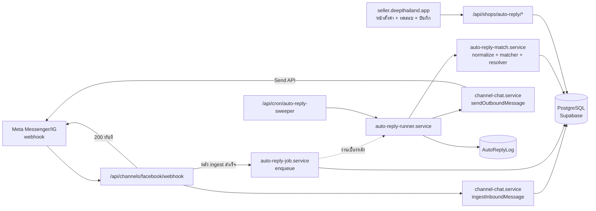
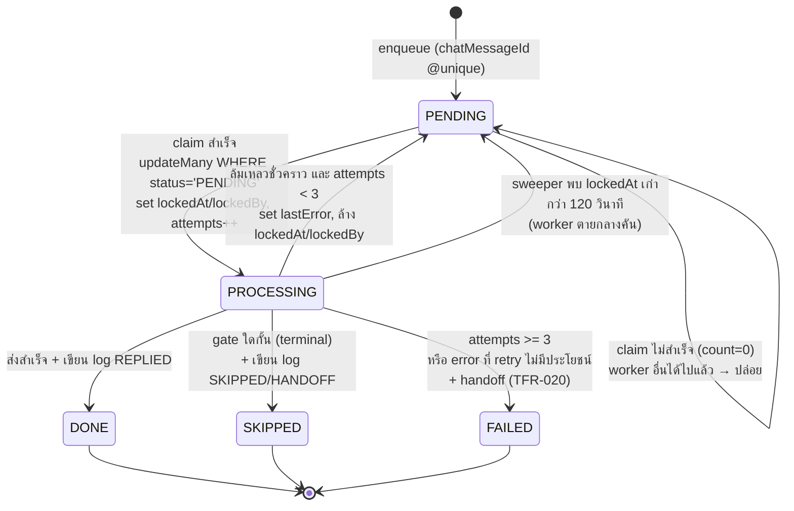
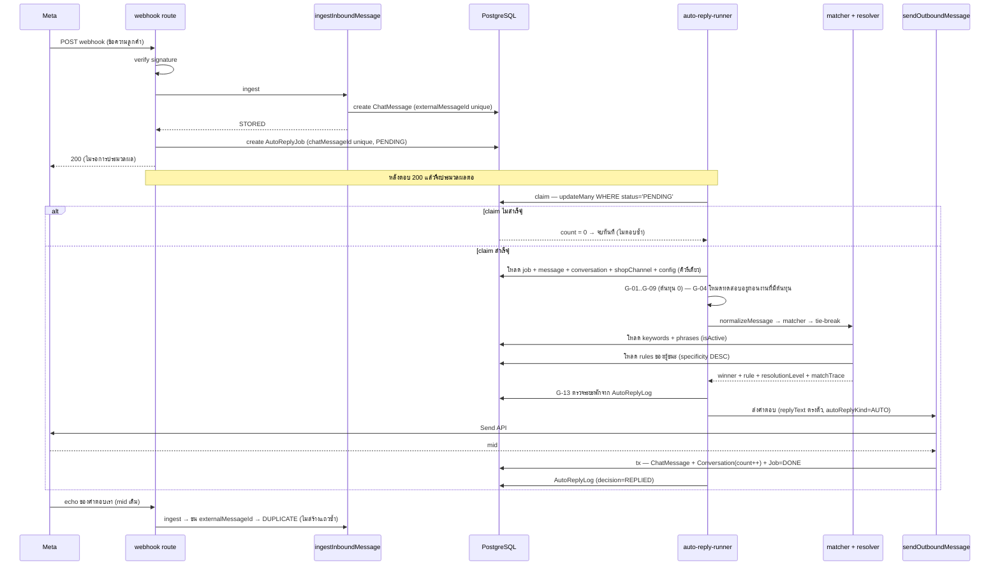
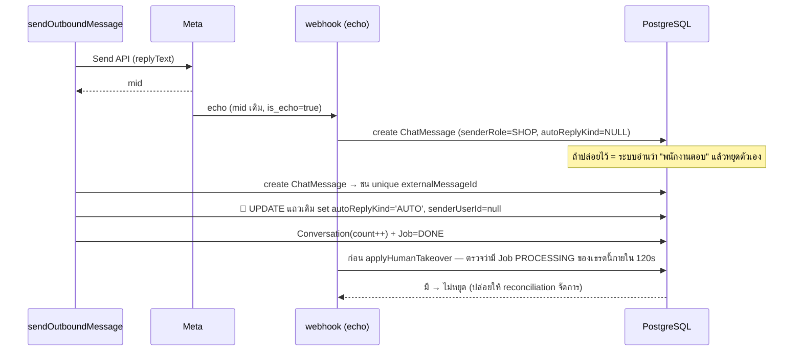
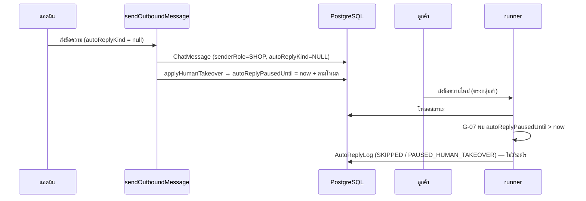
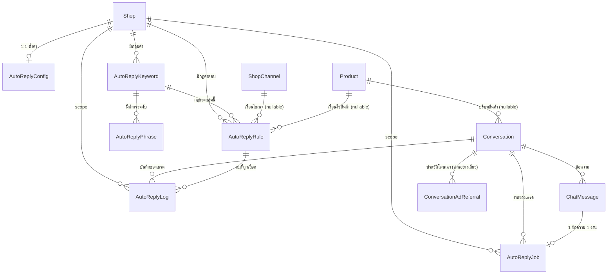

> **โมดูล:** M00023-ChatAutoReply
> **ประเภทเอกสาร:** Software Requirements Specification (SRS) - TECHNICAL
> **เวอร์ชัน:** 1.0
> **วันที่จัดทำ:** 2026-07-29
> **สถานะ:** Draft — trace จาก [[BRD]] v1.0 บน contract ของ [[DATABASE]] v1.0 (FROZEN)
> **เจ้าของเอกสาร:** SA (ดู [[Feature-Docs-Ownership]])

# SRS: ตอบแชทอัตโนมัติจาก Keyword (Software Requirements Specification — Technical)

---

## 🛑 ข้อผูกพันกับ FROZEN CONTRACT

เอกสารนี้ **ไม่ตั้งชื่อ model / field / ค่าคงที่ใหม่เอง** ทุกชื่อที่ปรากฏอ้างตรงตัวจาก [[DATABASE]] §3 และ §3.8 จุดที่ contract ยังไม่ครอบคลุมถูกแยกไว้ที่ §10 "ประเด็นที่ต้องให้ Controller ตัดสิน" ไม่ได้ตัดสินเองเงียบ ๆ

**เฟสแรกไม่มี AI ในเส้นทางการส่ง** — ไม่มี TFR ข้อใดในเอกสารนี้เรียก Gemini หรือผู้ให้บริการ AI ใด ๆ ข้อความที่ลูกค้าได้รับคือ `AutoReplyRule.replyText` ตรงตัวทุกอักษร

---

## 1. บทนำ (Introduction)

### 1.1 วัตถุประสงค์ของเอกสาร

กำหนดสเปกเชิงเทคนิคของระบบตอบแชทอัตโนมัติจาก Keyword ในระดับที่ DEV เขียนโค้ดได้โดยไม่ต้องตีความเพิ่ม และ QA เขียน test case ได้จาก TFR ตรง ๆ ครอบคลุม: อัลกอริทึมการปรับข้อความให้เป็นมาตรฐาน อัลกอริทึมการจับคู่กลุ่มคำ อัลกอริทึมการเลือกกฎคำตอบ state machine ของคิวงาน ลำดับ gate การตัดสินใจ กฎ validation สิทธิ์การเข้าถึง และข้อกำหนดที่ไม่ใช่ฟังก์ชัน

**ผู้อ่าน:** DEV (implement), QA (test design), Reviewer (gate ตรวจ), DevOps (cron + env)

### 1.2 ขอบเขตเชิงระบบ (System Scope)

**อยู่ในขอบเขต:**

- 6 ตารางใหม่ + คอลัมน์เพิ่มใน `Conversation` / `ChatMessage` ตาม [[DATABASE]]
- service layer ใหม่สำหรับ: ตั้งค่า (config/keyword/phrase/rule), จับคู่ (matcher), เลือกกฎ (resolver), ประมวลผลคิว (runner), บันทึก (log)
- ส่วนขยายของ `src/app/api/channels/facebook/webhook/route.ts` ให้ **สร้างงาน** หลัง ingest สำเร็จ (ไม่เปลี่ยนพฤติกรรมเดิมของการรับข้อความ)
- ส่วนขยายของ `sendOutboundMessage` ให้เขียน `ChatMessage.autoReplyKind` ได้ และ reconcile กับ echo ที่มาถึงก่อน
- endpoint ใหม่สำหรับตั้งค่า / ทดสอบกฎ / ดูบันทึก / ควบคุมรายเธรด
- cron sweeper สำหรับงานค้าง

**นอกขอบเขต (เฟสนี้):**

- AI Enhance / ตั้งค่าน้ำเสียง / ตรวจผลลัพธ์ AI — เลื่อนไปเฟส 2 ([[PRD]] §5)
- Fuzzy match, debounce รวบข้อความ, broadcast
- ช่องทาง LINE / TikTok / แชทในแอป (`Conversation.channel = 'DEEP'`)
- แดชบอร์ดสถิติ/กราฟรวม (มีแค่บันทึกที่ค้นหาได้)
- การเปลี่ยนพฤติกรรมการรับ-ส่งข้อความเดิมของ feature 00018

### 1.3 เอกสารอ้างอิง (References)

| เอกสาร | ความสัมพันธ์ |
|--------|-------------|
| [[PRD]] | เป้าหมายธุรกิจ, ลำดับการเลือกคำตอบ 9 ระดับ (§3.2), เงื่อนไขที่ต้องไม่ตอบ 9 ข้อ (§4.3) |
| [[BRD]] | FR-001..FR-024 + AC-xxx + BR-AR-01..BR-AR-30 ที่ TFR ในเอกสารนี้ trace กลับ |
| [[DATABASE]] | 🛑 **FROZEN CONTRACT** — ชื่อ model/field/ค่าคงที่ทุกตัว |
| [[SDS]] | การออกแบบ component และ data flow ที่แตกจาก SRS นี้ |
| [[API]] | contract ระดับ endpoint ที่แตกจาก §4 |
| `docs/20 - Features/00018 - Facebook Chat Integration/*` | เจ้าของ webhook, `ingestInboundMessage`, `sendOutboundMessage`, `ConversationAdReferral` |
| `docs/20 - Features/00019 - AI Reply Assistant/SRS.md` | รูปแบบ TFR + แนวทาง NFR ที่เอกสารนี้เดินตาม |
| `docs/20 - Features/00012 - Shop Staff Invite/*` | ที่มาของ `ShopMember` และ role ที่ใช้ตัดสินสิทธิ์ |
| `docs/conventions/prisma-shared-db-drift.md` | ข้อบังคับ migration บน DB ที่ dev/prod ใช้ร่วมกัน |
| `docs/SRS.md` (ระบบ) | data model และ authorization matrix ระดับระบบ |

### 1.4 นิยามและตัวย่อ (Definitions & Acronyms)

| คำ/ตัวย่อ | ความหมายเชิงเทคนิค |
|-----------|----------|
| **normalizeMessage** | ฟังก์ชัน pure ตัวเดียวที่แปลงข้อความดิบเป็นรูปมาตรฐาน ใช้ **ทั้ง** ตอนบันทึก `AutoReplyPhrase.normalizedPhrase` และตอนเทียบข้อความลูกค้า (TFR-007) |
| **Matcher** | ขั้นที่หา `AutoReplyKeyword` ที่ตรงกับข้อความลูกค้า และตัดสินผู้ชนะเมื่อตรงหลายกลุ่ม (TFR-008/009) |
| **Resolver** | ขั้นที่เลือก `AutoReplyRule` ที่จะใช้ตอบ จาก keyword ที่ชนะ + บริบทของเธรด แล้วถอยระดับ (TFR-010) |
| **specificity** | คอลัมน์ `AutoReplyRule.specificity` = bitmask `(shopChannelId?4:0)+(adId?2:0)+(productId?1:0)` คำนวณตอนเขียนเสมอ (invariant) |
| **resolutionLevel** | ชื่อระดับกฎที่ถูกเลือกจริง — ค่าจาก [[DATABASE]] §3.8 |
| **Job** | แถวใน `AutoReplyJob` — หน่วยงานที่แทน "ข้อความลูกค้า 1 รายการ" หนึ่งต่อหนึ่งด้วย `chatMessageId @unique` |
| **Gate** | เงื่อนไขตัดสินใจไม่ตอบหนึ่งข้อ ผูกกับค่าใน `AutoReplyLog.skipReason` (TFR-015) |
| **Test mode** | `AutoReplyConfig.testMode = true` → ตอบเฉพาะเธรดที่ `Conversation.autoReplyTestEnabled = true` |
| **Human takeover** | พนักงานส่งข้อความในเธรด (`ChatMessage.senderRole='SHOP' AND autoReplyKind IS NULL`) → หยุด auto-reply ชั่วคราว |
| **Handoff** | ระบบตัดสินใจหยุดตอบถาวรสำหรับเธรดนั้นและส่งต่อคน — `Conversation.handoffAt` != null |
| **Active shop** | ร้านที่ session กำลังใช้งานอยู่ (resolve ผ่าน `resolveActiveShopContext` — `src/lib/shop-context.ts`) |

---

## 2. ภาพรวมสถาปัตยกรรม (Architecture Overview)

### 2.1 บริบทระบบ (System Context)



### 2.2 องค์ประกอบหลัก (Components)

| Component | หน้าที่ | Submodule / Stack |
|-----------|---------|-------------------|
| `AutoReplyConfig` `AutoReplyKeyword` `AutoReplyPhrase` `AutoReplyRule` `AutoReplyJob` `AutoReplyLog` | schema ตาม [[DATABASE]] | Prisma / PostgreSQL |
| `src/lib/auto-reply-normalize.ts` | `normalizeMessage()` — pure, ไม่มี dependency, unit-testable (TFR-007) | Server lib (import ได้ทั้ง service และ test) |
| `src/services/auto-reply-config.service.ts` | อ่าน/เขียน `AutoReplyConfig` พร้อม lazy default (TFR-001) | Service layer |
| `src/services/auto-reply-keyword.service.ts` | CRUD `AutoReplyKeyword` + `AutoReplyPhrase` (TFR-002/003/006) | Service layer |
| `src/services/auto-reply-rule.service.ts` | CRUD `AutoReplyRule` + รักษา invariant `specificity` (TFR-004) | Service layer |
| `src/services/auto-reply-match.service.ts` | matcher + resolver + การประกอบบริบท — **pure เมื่อรับ snapshot** เพื่อให้ dry-run กับของจริงใช้โค้ดเดียวกัน (TFR-008..012, TFR-022) | Service layer |
| `src/services/auto-reply-job.service.ts` | enqueue / claim / retry / sweep (TFR-013/014/023/024) | Service layer |
| `src/services/auto-reply-runner.service.ts` | orchestrate gate → match → resolve → send → log (TFR-015..020) | Service layer |
| `src/services/auto-reply-log.service.ts` | เขียน/ค้นหา `AutoReplyLog` + mask PII (TFR-025/026) | Service layer |
| `src/app/api/channels/facebook/webhook/route.ts` | **ขยาย** — enqueue หลัง ingest แล้วตอบ 200 ทันที (TFR-013) | Next.js route handler |
| `src/app/api/cron/auto-reply-sweeper/route.ts` | หยิบงานค้าง/งานที่ lock ค้าง (TFR-024) | Next.js route handler + Vercel Cron |
| `src/app/api/shops/auto-reply/**` | endpoint ตั้งค่า / ทดสอบ / บันทึก (§4) | Next.js route handler |
| `src/app/api/chat/conversations/[id]/auto-reply/route.ts` | ควบคุมระดับเธรด (TFR-029) | Next.js route handler |
| `src/lib/validations.ts` | Valibot schema ทั้งหมดของฟีเจอร์ (TFR-027) | Validation |

### 2.3 มุมมองการ Deploy (Deployment View)

- ทำงานบน Vercel Functions (Node.js runtime) เดียวกับระบบเดิม **ไม่มีบริการใหม่ ไม่มี message broker ใหม่**
- คิวงานคือ **ตารางใน PostgreSQL** (`AutoReplyJob`) ไม่ใช่ queue ภายนอก — เหตุผล: ต้องการ durability กับ idempotency ที่บังคับด้วย unique constraint และ [[PRD]] §6.2 ระบุว่างานต้อง "บันทึกลงฐานข้อมูลก่อนเสมอ"
- ผู้ประมวลผลมี 2 ทาง ซึ่ง **ต้องอยู่ร่วมกันได้โดยไม่ตอบซ้ำ** (TFR-014):
  1. **in-request** — หลังตอบ 200 ให้ Meta แล้ว process ต่อในคำขอเดิม (เส้นทางปกติ ทำให้ลูกค้าได้คำตอบภายในไม่กี่วินาที)
  2. **cron sweeper** — `/api/cron/auto-reply-sweeper` ทุก 1 นาที เก็บงานที่ทาง 1 ทำไม่สำเร็จ/ไม่ได้ทำ
- `vercel.json` ต้องเพิ่ม cron entry และ route ต้องประกาศ `export const maxDuration` ให้พอกับ batch (ค่าเริ่มต้นที่แนะนำ 60)
- env ที่เกี่ยวข้อง: `CRON_SECRET` (มีอยู่แล้ว — ใช้ pattern เดียวกับ `/api/cron/chat-response-metrics`), ไม่มี env ใหม่ที่เป็นความลับของฟีเจอร์นี้
- **ไม่มีการเรียกผู้ให้บริการ AI** → ไม่มีต้นทุนต่อข้อความจากภายนอก (สอดคล้อง A-6)

---
## 3. ข้อกำหนดเชิงฟังก์ชันเชิงเทคนิค (Technical Functional Requirements)

TFR ทั้งหมด **30 ข้อ** แบ่ง 4 กลุ่ม:

| กลุ่ม | TFR | ครอบ FR |
|---|---|---|
| A. การตั้งค่าและสิทธิ์ | TFR-001..006 | FR-001..FR-008, FR-015 |
| B. อัลกอริทึม (หัวใจ) | TFR-007..012 | FR-009..FR-011, FR-013, FR-014 |
| C. คิวงานและการตัดสินใจ | TFR-013..024 | FR-012, FR-016..FR-023 |
| D. บันทึก ตรวจสอบ และรอบนอก | TFR-025..030 | FR-024, FR-020, FR-004 |

---

### กลุ่ม A — การตั้งค่าและสิทธิ์

#### TFR-001: `AutoReplyConfig` แบบ lazy default ต่อร้าน

- **Trace to:** FR-015, FR-016, FR-018, FR-013, FR-019, FR-021 · BR-AR-01
- **คำอธิบายเชิงเทคนิค:**
  - `getAutoReplyConfig(shopId)` อ่านด้วย `findUnique({ where: { shopId } })` ร้านที่ยังไม่มีแถวต้องคืน **ค่าเริ่มต้นจากโค้ด** โดย **ไม่สร้างแถว** (lazy default — pattern เดียวกับ `ShopAiSetting` ของ 00019 TFR-001)
  - ค่าเริ่มต้นต้องตรงกับ `@default` ใน [[DATABASE]] §3.1 ทุกตัว: `isEnabled=false`, `testMode=false`, `humanTakeoverPauseMode="2H"`, `keywordCooldownSec=300`, `maxRepliesPerConversation=10`, `adsContextMode="UNTIL_RESOLVED"`, `handoffPhrases=[]`
  - การบันทึกใช้ `upsert` โดย `shopId` เป็น key และเซ็ต `updatedByUserId` ทุกครั้ง
  - 🛑 `isEnabled` default `false` เป็นข้อกำหนดด้านความปลอดภัย ไม่ใช่ค่าความสะดวก — ห้ามเปลี่ยนเป็น true ในโค้ด seed / migration / onboarding ใด ๆ (AC-015-01)
- **Precondition:** `shopId` มาจาก `resolveActiveShopContext` เท่านั้น ห้ามรับจาก body/query
- **Postcondition:** ผู้เรียกได้ config ที่ครบทุกฟิลด์เสมอ ไม่มี `undefined` ให้ต้องเช็คปลายทาง
- **Error / Edge cases:**
  - resolve ร้านไม่ได้ → 404 (ไม่ใช่ 500)
  - `adsContextMode="HOURS"` แต่ `adsContextHours` เป็น null → ถือว่า **ไม่มีอายุจำกัด** และต้อง `console.warn` (การตั้งค่าที่ไม่สมบูรณ์ต้องไม่ทำให้ระบบพัง — validation ที่ TFR-027 กันไม่ให้เกิดจากหน้าเว็บอยู่แล้ว)
  - `testMode=true` แต่ `testModeExpiresAt=null` → ถือว่าไม่หมดอายุ (ตาม comment ใน [[DATABASE]]) แต่ TFR-027 บังคับให้ endpoint ต้องส่งวันหมดอายุมาเสมอ จึงเกิดได้เฉพาะจากการแก้ DB มือ

#### TFR-002: CRUD `AutoReplyKeyword`

- **Trace to:** FR-001, FR-003 · AC-001-01..08, AC-003-01..03
- **คำอธิบายเชิงเทคนิค:**
  - ทุก query ต้องมี `shopId` ใน `WHERE` เสมอ — รวม `findUnique` ราย id ต้องเปลี่ยนเป็น `findFirst({ where: { id, shopId } })` (AC-001-05, NFR-Sec-01)
  - `matchType` รับเฉพาะ `EXACT` · `CONTAINS` · `STARTS_WITH` ([[DATABASE]] §3.8) ค่าเริ่มต้นกลุ่มใหม่ = `CONTAINS` (AC-003-03)
  - `priority` เป็น Int ค่ามากถูกเลือกก่อน ค่าเริ่มต้น `100` (= "กลาง ๆ" ตาม AC-003-03 บนช่วง 0–1000 ที่ TFR-027 กำหนด)
  - `isActive=false` → **ห้ามถูกโหลดเข้า matcher เลย** (AC-001-03) บังคับด้วย `WHERE isActive = true` ในคิวรีของ matcher ไม่ใช่กรองใน JS
  - หน้ารายการ (AC-001-06) ต้องได้ `_count.phrases` และจำนวนกฎแยกตามระดับด้วย `groupBy` บน `AutoReplyRule` **ครั้งเดียวสำหรับทั้งหน้า** ห้าม N+1
- **Precondition:** ผู้เรียกผ่าน TFR-005
- **Postcondition:** กลุ่มที่บันทึกแล้วมีชื่อไม่ซ้ำในร้าน และมีค่า `matchType`/`priority` ที่ถูกต้องเสมอ
- **Error / Edge cases:**
  - ชื่อซ้ำ → `@@unique([shopId, name])` โยน P2002 → service แปลงเป็น error `KEYWORD_NAME_DUPLICATE` → route ตอบ 409 พร้อมข้อความไทยที่บอกวิธีแก้ (AC-001-04, BRD §6.5)
  - ลบกลุ่ม → `AutoReplyPhrase` และ `AutoReplyRule` ของกลุ่มถูกลบตาม `onDelete: Cascade`; `AutoReplyLog.keywordId` เป็น `SetNull` (บันทึกไม่หาย)
  - เปิดใช้งานกลุ่มที่ไม่มี phrase หรือไม่มีกฎ → ปฏิเสธตาม TFR-006

#### TFR-003: จัดการ `AutoReplyPhrase` และ invariant ของ `normalizedPhrase`

- **Trace to:** FR-002 · AC-002-01..05, AC-010-06 · BR-AR-02
- **คำอธิบายเชิงเทคนิค:**
  - ตอนเขียนทุกครั้ง: `normalizedPhrase = normalizeMessage(phrase)` — **เรียกฟังก์ชันเดียวกับที่ matcher ใช้เท่านั้น** (TFR-007) ห้ามมี normalize เวอร์ชันที่สองในระบบไม่ว่ากรณีใด
  - เก็บ `phrase` ต้นฉบับไว้แสดงใน UI ไม่ทับด้วยค่าที่ normalize แล้ว
  - `normalizedPhrase` ที่ได้เป็นสตริงว่าง → ปฏิเสธ (คำที่มีแต่วรรคตอน/ช่องว่างจับคู่ไม่ได้และจะ match ทุกข้อความถ้าเป็น CONTAINS)
  - คำซ้ำในกลุ่ม → `@@unique([keywordId, normalizedPhrase])` บังคับที่ DB (AC-002-03) — เพราะ "ซ้ำ" หมายถึงซ้ำ **หลัง normalize** (`สนใจ` กับ `สนใจ!!` คือคำเดียวกัน) ซึ่งเช็คใน JS ไม่ทนต่อ race
  - เพิ่มหลายคำในคำขอเดียว: ต้อง dedupe ตาม `normalizedPhrase` ในหน่วยความจำก่อน แล้วใช้ `createMany({ skipDuplicates: true })` และรายงานกลับว่าคำใดถูกรวม
  - **คำเตือนข้ามกลุ่ม (AC-002-04):** ก่อนบันทึก ให้ query `AutoReplyPhrase` ของร้านเดียวกันที่ `normalizedPhrase` ตรงกันและกลุ่มเจ้าของ `isActive=true` → คืนเป็น `warnings[]` ใน response **ไม่บล็อกการบันทึก**
- **Postcondition:** ทุกแถวใน `AutoReplyPhrase` มี `normalizedPhrase` ที่เป็นผลลัพธ์ของ `normalizeMessage` เวอร์ชันปัจจุบันเสมอ
- **Error / Edge cases:**
  - 🛑 **เมื่อ `normalizeMessage` เปลี่ยนพฤติกรรม** ค่าที่เก็บไว้จะ stale ทันที → ต้องมีสคริปต์ backfill (`npm run backfill:auto-reply-phrases`) และการเปลี่ยนอัลกอริทึมถือเป็น breaking change ที่ต้องรัน backfill ในการ deploy รอบเดียวกัน (ดู §8 ความเสี่ยง R-3)
  - ภาษาไทยที่มีวรรณยุกต์/สระครบ ต้องผ่านโดยไม่ถูกตัดทิ้ง (AC-002-05) — ดู TFR-007 ขั้นที่ห้ามทำ

#### TFR-004: CRUD `AutoReplyRule` และ invariant ของ `specificity`

- **Trace to:** FR-005, FR-006, FR-007, FR-008 · AC-005-01..04, AC-006-01..05, AC-007-01..06, AC-008-01..04
- **คำอธิบายเชิงเทคนิค:**
  - 🛑 **`specificity` คำนวณที่ service layer ทุกครั้งที่เขียน ห้ามรับค่านี้จาก client เด็ดขาด:**
    ```
    specificity = (shopChannelId != null ? 4 : 0)
                + (adId != null ? 2 : 0)
                + (productId != null ? 1 : 0)
    ```
    ต้องคำนวณทั้งใน create และ update (การ update ที่ล้าง `productId` แล้วไม่คำนวณใหม่ = กฎถูกจัดอันดับผิดตลอดไป โดยไม่มี error ให้เห็น)
  - **invariant เพิ่มเติมที่ทำให้ค่า `resolutionLevel` ครอบคลุมครบ** (ดู §10 ประเด็นที่ 1):
    - `adId != null` ⇒ `shopChannelId != null` — โฆษณาต้องผูกเพจเสมอ (AC-007-02 ระบุว่าโฆษณาเดียวกันคนละเพจตั้งคำตอบต่างกันได้ = เพจเป็นส่วนหนึ่งของกุญแจ) ⇒ `specificity` 2 และ 3 เกิดไม่ได้
    - `keywordId == null` ⇒ `adId == null AND productId == null` — คำตอบกลางระดับเพจ/ร้านไม่มีเงื่อนไขโฆษณา/สินค้า ⇒ `specificity` ของกฎกลางมีได้แค่ 4 (`PAGE_DEFAULT`) หรือ 0 (`SHOP_DEFAULT`)
  - เงื่อนไขทุกมิติต้อง scope ร้าน: `shopChannelId` ต้องเป็นเพจที่ `ShopChannel.shopId = shopId`, `productId` ต้องเป็นสินค้าที่ `Product.shopId = shopId` — ตรวจฝั่ง server ก่อนเขียนเสมอ (AC-006-01, AC-008-01)
  - unique constraint `UNIQUE NULLS NOT DISTINCT (shopId, keywordId, shopChannelId, adId, productId)` เขียนมือในไฟล์ migration ([[DATABASE]] §3.4) → ชนกันคืน P2002 → service แปลงเป็น `RULE_CONDITION_DUPLICATE` → 409 (AC-006-02)
  - `activeFrom`/`activeUntil` เก็บเป็น UTC; การเทียบทำที่ resolver (TFR-010)
- **Postcondition:** ทุกแถวมี `specificity` ที่สอดคล้องกับคอลัมน์เงื่อนไขของแถวนั้นเสมอ (invariant ตรวจได้ด้วยคิวรีเดียวใน QA)
- **Error / Edge cases:**
  - เพจถูกถอด → `shopChannelId` เป็น `SetNull` ตาม schema ⇒ **`specificity` ที่เก็บไว้กลายเป็นค่าเก่าทันที** และกฎกลายเป็นกว้างขึ้นโดยที่คะแนนยังสูงอยู่ → 🛑 ต้องมี **ตัวซ่อม**: resolver ต้องถือว่ากฎที่ `specificity >= 4` แต่ `shopChannelId == null` เป็นกฎที่ **ไม่สอดคล้อง** และข้ามทิ้งพร้อม `console.warn` (AC-006-05); และ sweeper (TFR-024) ต้อง recompute `specificity` ของแถวที่ไม่สอดคล้องให้ตรงเป็นงานเก็บกวาด
  - สินค้าถูกลบ → `productId` เป็น `SetNull` → ใช้กลไกซ่อมเดียวกัน (AC-008-03) และบันทึกเหตุผลใน `AutoReplyLog.matchTrace.skippedRules`
  - สินค้าถูกปิดการขาย (ยังไม่ถูกลบ) → **กฎยังใช้ได้** (ร้านอาจตั้งใจตอบว่า "รุ่นนี้หมดแล้ว") ระบบไม่ตัดสินแทนร้าน — ตัดสินใจนี้อ้าง BR-AR หลัก "ข้อความที่ส่งเป็นของร้าน"
  - `replyText` ว่างหลัง trim → ปฏิเสธตอนบันทึก (AC-005-03, BR-AR-29)

#### TFR-005: สิทธิ์การเข้าถึงและการแยกข้อมูลตามร้าน

- **Trace to:** FR-004 · AC-004-01..05, AC-024-06 · BR-AR-01, BR-AR-30
- **คำอธิบายเชิงเทคนิค:**
  - `shopId` **ต้อง** derive จาก `resolveActiveShopContext(session)` เท่านั้น — ห้ามรับ `shopId` จาก request body / query / header ในทุก endpoint ของฟีเจอร์นี้
  - สิทธิ์เขียนการตั้งค่า: `ctx.role === 'OWNER' || ctx.role === 'ADMIN'` — เขียนเป็นเงื่อนไข allow-list ไม่ใช่ deny-list (`role !== 'STAFF'`) เพื่อให้ role ใหม่ที่เพิ่มภายหลัง **ถูกปฏิเสธโดยปริยาย** ซึ่งเป็นสิ่งที่ AC-004-03 ต้องการ
  - สิทธิ์อ่านการตั้งค่าและบันทึก: `canAccessShop(shopId, userId)` (ครอบเจ้าของร้าน + `ShopMember` ทุก role)
  - สิทธิ์ควบคุมระดับเธรด (TFR-029): `canAccessShop` + เธรดต้องเป็นของร้านนั้น (`Conversation.shopId = ctx.shopId` ใน `WHERE` ไม่ใช่เช็คหลัง `findUnique` — memory `feedback_rsc_dal_authz`)
  - ทุก response ที่ UI ใช้ตัดสินโหมดอ่านอย่างเดียวต้องมีฟิลด์ `canEdit: boolean` (AC-004-02)
  - `createdByUserId` / `updatedByUserId` ต้องถูกเซ็ตทุกครั้งที่เขียน (AC-004-05)
- **Postcondition:** ไม่มีเส้นทางใดที่ผู้ใช้ของร้าน A อ่านหรือแก้ข้อมูลของร้าน B ได้ แม้ส่ง id ของร้าน B มาตรง ๆ
- **Error / Edge cases:**
  - resolve ร้านไม่ได้ → 404, ไม่มี session → 401, role ไม่พอ → 403 (ห้ามคืน 404 แทน 403 เพราะ UI ต้องแยกสองกรณีนี้เพื่อแสดงข้อความที่ต่างกัน)
  - Business ที่ถูก package lock (`ctx.locked = true`) → การเขียนทั้งหมดต้อง 403 พร้อม `lockReason` (สอดคล้องกับ gate เดิมของโปรเจกต์)
  - 🛑 **ข้อจำกัดที่ต้องรู้:** `ShopMember.role` ปัจจุบันมีแค่ `OWNER` และ `ADMIN` — ไม่มี `STAFF` ในโค้ด (ดู §10 ประเด็นที่ 2)

#### TFR-006: กฎความสมบูรณ์ก่อนเปิดใช้งานกลุ่มคำ

- **Trace to:** FR-002, FR-005 · AC-002-02, AC-005-02, AC-001-08 · BR-AR-28
- **คำอธิบายเชิงเทคนิค:**
  - ก่อนบันทึก `AutoReplyKeyword` ที่ `isActive = true` ต้องผ่านทั้งสองข้อ **ในทรานแซกชันเดียวกับการบันทึก** (เช็คนอกทรานแซกชันแล้วเขียนทีหลังจะหลุดเมื่อมีคำขอลบพร้อมกัน):
    1. มี `AutoReplyPhrase` อย่างน้อย 1 แถว
    2. มี `AutoReplyRule` ที่ `keywordId` = กลุ่มนี้ และ `isActive=true` และ `replyText` ไม่ว่าง อย่างน้อย 1 แถว
  - เงื่อนไขเดียวกันต้องบังคับตอน **ลบ phrase สุดท้าย** หรือ **ลบ/ปิดกฎสุดท้าย** ของกลุ่มที่เปิดอยู่ → ปฏิเสธ พร้อมข้อความบอกทางเลือก ("ปิดใช้งานกลุ่มก่อน แล้วจึงลบ")
  - **ทำสำเนา (AC-001-08):** `duplicateKeyword(id)` คัดลอกกลุ่ม + phrase ทั้งหมด + rule ทั้งหมดของกลุ่ม โดย **บังคับ `isActive = false` ที่กลุ่มสำเนาเสมอ** และตั้งชื่อ `"{name} (สำเนา)"` เพิ่ม suffix ตัวเลขจนไม่ซ้ำ ทำในทรานแซกชันเดียว
- **Error / Edge cases:**
  - กลุ่มที่มีเฉพาะกฎกลางระดับร้าน (`keywordId = null`) ไม่นับ — กฎกลางไม่ผูกกลุ่ม
  - สำเนาที่ชื่อชนเกิน 20 ครั้ง → ปฏิเสธพร้อมให้ผู้ใช้ตั้งชื่อเอง (กัน loop ไม่จบ)

---
### กลุ่ม B — อัลกอริทึม (หัวใจของฟีเจอร์)

#### TFR-007: อัลกอริทึม `normalizeMessage`

- **Trace to:** FR-010 · AC-010-01..06 · BR-AR-02
- **ที่อยู่:** `src/lib/auto-reply-normalize.ts` — export `normalizeMessage(input: string | null | undefined): string`
- **ข้อบังคับสูงสุด:** 🛑 **เป็นฟังก์ชันเดียวที่ใช้ทั้งตอนบันทึก `AutoReplyPhrase.normalizedPhrase` (TFR-003) และตอนเทียบข้อความลูกค้า (TFR-008)** ถ้ามีสองเวอร์ชันเมื่อไหร่ ระบบจะ match ไม่ตรงแบบหาสาเหตุยากมาก ([[DATABASE]] §6) — Reviewer gate: `rg "normalize" src/services/auto-reply-*` ต้องไม่พบการแปลงข้อความอื่นนอกจากการเรียกฟังก์ชันนี้
- **คุณสมบัติที่ต้องเป็นจริง:** pure (ไม่มี I/O, ไม่มีสถานะ), deterministic, idempotent — `normalizeMessage(normalizeMessage(x)) === normalizeMessage(x)` ต้องเป็นจริงเสมอ (เป็น unit test บังคับ)

**ขั้นตอนตามลำดับ (ห้ามสลับ):**

| # | ขั้นตอน | รายละเอียดเชิงเทคนิค | เหตุผลที่ต้องอยู่ลำดับนี้ | AC |
|---|---|---|---|---|
| 1 | รับค่าว่าง | `null`/`undefined` → คืน `""` ทันที | ผู้เรียกไม่ต้องเช็คก่อน | — |
| 2 | **Unicode NFC** | `s.normalize("NFC")` | ต้องมาก่อนทุกขั้น เพื่อให้ขั้นถัดไปเห็นรูปอักขระเดียวกันเสมอ ถ้าทำทีหลัง การเทียบ char-class จะไม่ตรงกับที่คิด | AC-010-04 |
| 3 | รวมชนิดช่องว่าง | แทน `\t \n \r \f \v` และ ` `(NBSP) `​`(ZWSP) `　`(ideographic space) ``(BOM) ด้วยช่องว่างปกติ `" "` | ต้องมาก่อนขั้นยุบช่องว่าง ไม่งั้น `\s+` จะไม่จับ NBSP/ZWSP ที่ลูกค้าคัดลอกมาบ่อย | AC-010-01 |
| 4 | ตัวพิมพ์เล็ก | `s.toLowerCase()` | ภาษาไทยไม่มีผล; ต้องทำก่อนขั้นวรรคตอนเพื่อให้ตารางอักขระที่เทียบมีชุดเดียว | AC-010-02 |
| 5 | **วรรคตอนกลุ่ม "ลบทิ้ง"** | แทนด้วย `""` : `! ? . , ; : " ' \` ~ * # ( ) [ ] { } … ‼ ⁉ ๆ ฯ ๏ ๚ ๛ ！ ？ 。 、` และอักขระ Emoji/Symbol ทั้งหมดในช่วง `\u{1F000}-\u{1FAFF}` `\u{2600}-\u{27BF}` `\u{2B00}-\u{2BFF}` `️` | ทำ **หลัง** lowercase และ **ก่อน** ยุบช่องว่าง เพราะขั้นนี้ทั้งลบและสร้างช่องว่างใหม่ | AC-010-03, AC-010-05 |
| 6 | **ตัวคั่นคำกลุ่ม "แทนด้วยช่องว่าง"** | แทนด้วย `" "` : `- – — _ / \\ \| + = @ &` | อักขระกลุ่มนี้ในภาษาอังกฤษคือขอบเขตคำจริง (`cash-on-delivery`) ต่างจากกลุ่มที่ 5 ที่เป็นเครื่องประดับ | AC-010-03 |
| 7 | ยุบช่องว่าง | `s.replace(/\s+/g, " ")` | ต้องอยู่หลังขั้น 5–6 ที่สร้างช่องว่างใหม่ | AC-010-01 |
| 8 | ตัดหัวท้าย | `s.trim()` | ขั้นสุดท้ายเสมอ | AC-010-01 |

**🛑 ขั้นตอนที่ห้ามทำ (ระบุไว้เพื่อกันการตีความผิดจาก [[PRD]] BR-AR-02 คำว่า "ตัดวรรณยุกต์"):**

- **ห้ามตัดวรรณยุกต์ไทย** (`่-๋`), **ห้ามตัดสระ** (`ะ-ฺ`, `็`, `์-๎`) และ **ห้ามตัดไม้ไต่คู้/ทัณฑฆาต**
  - เหตุผล 1: AC-002-05 บังคับว่า "รองรับข้อความภาษาไทยที่มีวรรณยุกต์และสระครบถ้วน"
  - เหตุผล 2: การตัดวรรณยุกต์ทำให้ `ข้าว` = `ขาว`, `เก่า` = `เกา` ซึ่งทำลาย `EXACT` และสร้างการตอบผิดบริบทที่เป็นความเสี่ยงระดับสูงสุดใน [[PRD]] §6.1
  - เหตุผล 3: **ไม่จำเป็น** — AC-010-05 ทุกเคสผ่านได้ด้วยกลไก `CONTAINS` โดยไม่ต้องตัดวรรณยุกต์ (ดูตารางด้านล่าง)
- ห้ามตัดตัวเลข ห้ามตัดอักษรอังกฤษ ห้ามตัดช่องว่างภายในทั้งหมด (คำที่มีช่องว่างภายในต้องยังใช้ได้ — AC-002-05)

**ตารางตัวอย่าง input → output (ครอบ AC-010-05 ครบทุกตัว):**

สมมติกลุ่มคำ `สนใจสินค้า` มี phrase `สนใจ` (`normalizedPhrase = "สนใจ"`) และ `matchType = CONTAINS`

| # | input (ข้อความลูกค้าดิบ) | output ของ `normalizeMessage` | CONTAINS `สนใจ` | AC |
|---|---|---|---|---|
| 1 | `สนใจ` | `สนใจ` | ✅ | AC-010-05 |
| 2 | `สนใจครับ` | `สนใจครับ` | ✅ | AC-010-05 |
| 3 | `สนใจค่ะ` | `สนใจค่ะ` | ✅ (วรรณยุกต์คงอยู่ แต่ prefix `สนใจ` ยังตรง) | AC-010-05 |
| 4 | `สนใจคับ` | `สนใจคับ` | ✅ | AC-010-05 |
| 5 | `สนใจจ้า` | `สนใจจ้า` | ✅ | AC-010-05 |
| 6 | `สนใจ!!` | `สนใจ` | ✅ (ขั้น 5 ลบ `!`) | AC-010-05 |
| 7 | `  สนใจ    ครับ  ` | `สนใจ ครับ` | ✅ | AC-010-01 |
| 8 | `สนใจ ๆ` | `สนใจ` | ✅ (ขั้น 5 ลบ `ๆ` แล้วขั้น 7–8 เก็บช่องว่าง) | FR-010 user story |
| 9 | `สนใจ​ค่ะ` (มี ZWSP คั่น) | `สนใจ ค่ะ` | ✅ | AC-010-01 |
| 10 | `สนใจครับ😍😍` | `สนใจครับ` | ✅ | AC-010-03 |
| 11 | `ราคาเท่าไหร่คะ???` | `ราคาเท่าไหร่คะ` | — (ตัวอย่างกลุ่ม `ถามราคา`) | AC-010-03 |
| 12 | `COD ได้ไหม` | `cod ได้ไหม` | — (lowercase อังกฤษ) | AC-010-02 |
| 13 | `cash-on-delivery` | `cash on delivery` | — (ขั้น 6 ตัวคั่นคำ) | AC-010-03 |
| 14 | `สนใจ` (พิมพ์ NFD/ตัวประกอบแยก) | `สนใจ` (รูป NFC) | ✅ | AC-010-04 |
| 15 | `!!!` | `` (สตริงว่าง) | ไม่เข้าสู่ matcher | TFR-008 edge |

- **Postcondition:** ผลลัพธ์ไม่มีช่องว่างหัวท้าย ไม่มีช่องว่างซ้อน อยู่ในรูป NFC และไม่มีอักขระในกลุ่มขั้น 5–6
- **Error / Edge cases:**
  - ข้อความยาวมาก (Meta อนุญาตถึง ~2,000 ตัวอักษร) → ต้องไม่ใช้ regex ที่ backtrack; ทุกขั้นเป็น `replace` เชิงเส้น
  - ผลลัพธ์เป็นสตริงว่าง → matcher ต้องข้ามทันทีด้วย `NO_KEYWORD_MATCH` ไม่ใช่ match ทุกกลุ่ม (สตริงว่างเป็น substring ของทุกสตริง — เป็นบั๊กที่เกิดง่ายที่สุดของขั้นนี้)
  - `สนใจ` แบบพิมพ์ผิด (`สนจัย`, `เเ` แทน `แ`) **ไม่อยู่ในขอบเขตเฟสนี้** — เป็น fuzzy match ที่ [[PRD]] §5 เลื่อนไปเฟส 2

#### TFR-008: อัลกอริทึมการจับคู่กลุ่มคำต่อ `matchType`

- **Trace to:** FR-003, FR-010 · AC-003-01, AC-010-05
- **คำอธิบายเชิงเทคนิค:**
  - โหลดกลุ่มคำด้วยคิวรีเดียว: `AutoReplyKeyword` where `shopId` และ `isActive = true` `include: { phrases: { select: { id, phrase, normalizedPhrase } } }` — ใช้ index `[shopId, isActive, priority]` ตาม [[DATABASE]] §4
  - ให้ `T = normalizeMessage(rawText)` และ `P = phrase.normalizedPhrase`
  - เทียบตาม `keyword.matchType` ด้วย **การเทียบสตริงล้วน ไม่ใช้ regex** (ข้อความลูกค้าเป็น untrusted input — regex ที่ประกอบจากค่าที่ผู้ใช้ตั้งเปิดช่อง ReDoS):

    | `matchType` | เงื่อนไข | หมายเหตุ |
    |---|---|---|
    | `EXACT` | `T === P` | ตรงทั้งข้อความหลัง normalize |
    | `STARTS_WITH` | `T.startsWith(P)` | ขึ้นต้นด้วยคำนี้ |
    | `CONTAINS` | `T.includes(P)` | มีคำนี้อยู่ในประโยค |

  - ถ้า `T === ""` → ไม่มีกลุ่มใด match (ข้ามลูปทั้งหมด) — กันเคส #15 ของตาราง TFR-007
  - ถ้า `P === ""` → ข้าม phrase นั้น (ป้องกันเชิงลึกซ้อนกับ TFR-003 ที่ห้ามบันทึกอยู่แล้ว)
  - หนึ่งกลุ่มอาจตรงหลาย phrase → **ตัวแทนของกลุ่มคือ phrase ที่ `normalizedPhrase.length` มากที่สุด** ถ้ายาวเท่ากันใช้ `phrase.id` น้อยกว่า (deterministic)
  - ผลลัพธ์ของขั้นนี้: `MatchCandidate[]` แต่ละตัวมี `{ keywordId, keywordName, priority, matchType, matchedPhrase, matchedPhraseNormalized, matchedLength }`
- **Postcondition:** รายการ candidate ที่คำนวณจากข้อมูลชุดเดิมได้ผลเดิมทุกครั้ง (ไม่ขึ้นกับลำดับที่ DB คืนแถว)
- **Error / Edge cases:**
  - ร้านไม่มีกลุ่มคำที่เปิดใช้เลย → `MatchCandidate[]` ว่าง → ไปต่อที่การถอยระดับกฎกลาง (TFR-010) ไม่ใช่จบทันที (BR-AR-06)
  - ประสิทธิภาพ: A-4 กำหนดว่ากลุ่มคำต่อร้านอยู่หลักสิบ → การวนเทียบทั้งหมดใน JS มีต้นทุนต่ำกว่าการทำ full-text index และให้ผลที่อธิบายได้ 100% ซึ่ง AC-011-04 ต้องการ

#### TFR-009: เกณฑ์ตัดสินเมื่อตรงหลายกลุ่ม (deterministic tie-break)

- **Trace to:** FR-011 · AC-011-01..04 · BR-AR-03, BR-AR-04
- **คำอธิบายเชิงเทคนิค:**

  ก่อนจัดอันดับ ต้องรู้ "กฎที่ดีที่สุด" ของแต่ละ candidate ก่อน เพราะเกณฑ์ที่ 2 คือความเฉพาะเจาะจง:

  1. **คิวรีเดียวสำหรับทุก candidate (ห้าม N+1):**
     ```
     AutoReplyRule.findMany({
       where: { shopId, keywordId: { in: candidateKeywordIds }, isActive: true },
       orderBy: [{ specificity: 'desc' }, { id: 'asc' }],
     })
     ```
     แล้วกรองด้วย `isRuleApplicable()` (TFR-010) กับบริบทจริง → `bestSpecificity[keywordId]` = `specificity` ของกฎที่ผ่านตัวแรก, `-1` ถ้าไม่มีกฎใดใช้ได้
  2. **จัดอันดับด้วยเกณฑ์ต่อไปนี้ตามลำดับ หยุดที่เกณฑ์แรกที่ต่างกัน:**

     | ลำดับ | เกณฑ์ | ทิศทาง | ที่มา | ค่า `matchTrace.criterion` |
     |---|---|---|---|---|
     | 1 | `keyword.priority` | มาก → น้อย | AC-003-02, AC-011-02 | `PRIORITY` |
     | 2 | `bestSpecificity[keywordId]` | มาก → น้อย | AC-011-02 "เฉพาะเจาะจงกว่า" | `RULE_SPECIFICITY` |
     | 3 | อันดับของ `matchType` | `EXACT`(3) → `STARTS_WITH`(2) → `CONTAINS`(1) | AC-011-02 "ตรงทั้งข้อความก่อนมีคำในประโยค" | `MATCH_TYPE` |
     | 4 | `matchedLength` (ความยาว `normalizedPhrase` ที่ตรง) | มาก → น้อย | AC-011-02 "คำที่ยาวกว่า" | `PHRASE_LENGTH` |
     | 5 | `keyword.id` | น้อย → มาก (ASC, เปรียบเทียบสตริง uuid) | **tie-break สุดท้าย** | `KEYWORD_ID` |

  3. **ทำไมจึง deterministic (คำตอบของ AC-011-03):**
     - เกณฑ์ที่ 5 ใช้ `keyword.id` ซึ่งเป็น **primary key ที่ unique และไม่เปลี่ยนตลอดอายุของแถว** ⇒ ไม่มีทางที่ candidate สองตัวจะเท่ากันครบทั้ง 5 เกณฑ์ ⇒ ผู้ชนะมีเพียงหนึ่งเดียวเสมอ
     - การจัดอันดับทำ **ในหน่วยความจำด้วย comparator ที่กำหนดครบทุกเกณฑ์** ไม่พึ่ง `ORDER BY` ของ DB (Postgres ไม่รับประกันลำดับของแถวที่เท่ากัน) ⇒ ผลลัพธ์ไม่ขึ้นกับ query plan / จำนวนแถว / เวลา
     - ไม่มีการใช้ `Math.random()`, `Date.now()` หรือ `Array.prototype.sort` แบบไม่ระบุ comparator ในเส้นทางนี้
     - `bestSpecificity` คำนวณจากบริบทที่ถูก snapshot ไว้ก่อนเริ่มตัดสิน (TFR-011/012) ⇒ ข้อมูลนำเข้าชุดเดิมให้ผลเดิมเสมอ แม้บริบทของเธรดจะเปลี่ยนหลังจากนั้น
  4. **บันทึกร่องรอย (AC-011-04):** เขียน `AutoReplyLog.matchTrace` เป็น JSON รูปแบบ:
     ```json
     {
       "winner": { "keywordId": "…", "keywordName": "สนใจสินค้า", "matchedPhrase": "สนใจ",
                   "matchType": "CONTAINS", "priority": 100, "bestSpecificity": 6 },
       "criterion": "RULE_SPECIFICITY",
       "losers": [
         { "keywordId": "…", "keywordName": "ถามราคา", "matchedPhrase": "ราคา",
           "matchType": "CONTAINS", "priority": 100, "bestSpecificity": 0,
           "lostAt": "RULE_SPECIFICITY" }
       ]
     }
     ```
     `criterion` = เกณฑ์ที่ทำให้ผู้ชนะแยกตัวออกจากอันดับ 2; `lostAt` ของแต่ละผู้แพ้ = เกณฑ์แรกที่แพ้ผู้ชนะ
- **Postcondition:** ได้ผู้ชนะ 0 หรือ 1 กลุ่มเสมอ — ไม่มีทางได้ 2 (AC-011-01, BR-AR-03)
- **Error / Edge cases:**
  - candidate ทุกตัวมี `bestSpecificity = -1` (ไม่มีกฎเลย) → ยังจัดอันดับตามปกติและได้ผู้ชนะ แต่ resolver จะถอยไปกฎกลางระดับเพจ/ร้าน (TFR-010)
  - `matchTrace.losers` ต้องจำกัดไม่เกิน 20 รายการ (กัน JSON บวมเมื่อร้านมีกลุ่มคำมาก) และระบุ `"truncated": true` เมื่อถูกตัด

#### TFR-010: อัลกอริทึม rule resolution และการถอยระดับ

- **Trace to:** FR-009, FR-006, FR-007, FR-008 · AC-009-01..05, AC-006-03/04, AC-007-03/04, AC-008-02 · BR-AR-06, BR-AR-07, BR-AR-08
- **คำอธิบายเชิงเทคนิค:**

  **ขั้นที่ 1 — เตรียมบริบทจริงของเธรด** (จาก TFR-011/012):
  ```
  ctx = { shopChannelId: conversation.shopChannelId,   // เพจที่ลูกค้าทักเข้ามา (ไม่มีทางเป็น null บนช่องทางนอก)
          adId:          effectiveAdId,                 // null ถ้าไม่มี/หมดอายุ (TFR-011)
          productId:     effectiveProductId,            // null ถ้าไม่มี (TFR-012)
          now:           new Date() }
  ```

  **ขั้นที่ 2 — คิวรีกฎของกลุ่มคำที่ชนะ** ใช้ index `[shopId, keywordId, isActive, specificity]` ตรงตัว:
  ```
  AutoReplyRule.findMany({
    where:   { shopId, keywordId: winnerKeywordId, isActive: true },
    orderBy: [{ specificity: 'desc' }, { id: 'asc' }],
  })
  ```
  🛑 **ห้ามใส่เงื่อนไข `shopChannelId`/`adId`/`productId` ลงใน `WHERE`** — เพราะ `null` ใน SQL แปลว่า "ไม่จำกัด" ไม่ใช่ "ต้องเท่ากับ null" การกรองต้องทำใน JS ตามขั้นที่ 3

  **ขั้นที่ 3 — กรอง candidate ที่เงื่อนไขไม่ขัดกับบริบทจริง (`isRuleApplicable`):** กฎผ่านเมื่อ **ทุกข้อ** เป็นจริง

  | # | เงื่อนไข | ความหมาย |
  |---|---|---|
  | a | `rule.shopChannelId == null` **หรือ** `rule.shopChannelId === ctx.shopChannelId` | null = ใช้ได้ทุกเพจ |
  | b | `rule.adId == null` **หรือ** `rule.adId === ctx.adId` | null = ใช้ได้ทุกโฆษณา; ถ้ากฎระบุโฆษณาแต่ `ctx.adId` เป็น null → **ไม่ผ่าน** → ถอยไประดับเพจเอง (AC-007-04, BR-AR-07) |
  | c | `rule.productId == null` **หรือ** `rule.productId === ctx.productId` | เช่นเดียวกัน (AC-008-02) |
  | d | `rule.activeFrom == null` **หรือ** `rule.activeFrom <= ctx.now` | ตารางเวลา |
  | e | `rule.activeUntil == null` **หรือ** `rule.activeUntil > ctx.now` | ตารางเวลา |
  | f | `rule.replyText.trim().length > 0` | คำตอบว่าง = ไม่มีคำตอบ → ถอยระดับ (AC-009-03, BR-AR-29) |
  | g | **ความสอดคล้องของ `specificity`** — `computeSpecificity(rule) === rule.specificity` | กันแถวที่คอลัมน์เงื่อนไขถูก `SetNull` ไปแล้วแต่คะแนนยังค้าง (TFR-004 edge) — ไม่ผ่านให้ `console.warn` และข้าม |

  **ขั้นที่ 4 — เลือกตัวแรกที่ผ่าน** (รายการเรียง `specificity DESC, id ASC` มาแล้ว) การถอยระดับ **เกิดขึ้นเองโดยไม่ต้องเขียน loop 6 ชั้น** เพราะ `specificity` ถูกออกแบบให้เรียงตรงกับ AC-009-01 พอดี

  **ขั้นที่ 5 — ถ้าไม่มีกฎของกลุ่มคำใดผ่านเลย (หรือไม่มีกลุ่มคำใด match ตั้งแต่ต้น) → คิวรีกฎกลาง:**
  ```
  AutoReplyRule.findMany({
    where:   { shopId, keywordId: null, isActive: true },
    orderBy: [{ specificity: 'desc' }, { id: 'asc' }],
  })
  ```
  แล้วกรองด้วย `isRuleApplicable` ชุดเดิม → ตัวแรกที่ผ่านคือ `PAGE_DEFAULT` (specificity 4) หรือ `SHOP_DEFAULT` (specificity 0)

  **ขั้นที่ 6 — แมป `specificity` → `resolutionLevel`** (ค่าทั้งหมดจาก [[DATABASE]] §3.8 ครบทุกค่า ไม่มีค่าไหนขาดและไม่มีค่าไหนเกิน):

  | `keywordId` | `specificity` | เงื่อนไขที่ระบุ | `resolutionLevel` | ระดับใน [[PRD]] §3.2 |
  |---|---|---|---|---|
  | ไม่ null | 7 | เพจ + โฆษณา + สินค้า | `KEYWORD_PAGE_AD_PRODUCT` | 1 |
  | ไม่ null | 6 | เพจ + โฆษณา | `KEYWORD_PAGE_AD` | 2 |
  | ไม่ null | 5 | เพจ + สินค้า | `KEYWORD_PAGE_PRODUCT` | 3 |
  | ไม่ null | 4 | เพจ | `KEYWORD_PAGE` | 4 |
  | ไม่ null | 3 | *(โฆษณา + สินค้า ไม่ระบุเพจ)* | **เกิดไม่ได้** — invariant TFR-004 | — |
  | ไม่ null | 2 | *(โฆษณา ไม่ระบุเพจ)* | **เกิดไม่ได้** — invariant TFR-004 | — |
  | ไม่ null | 1 | สินค้า | `KEYWORD_PRODUCT` | 5 |
  | ไม่ null | 0 | ไม่มีเงื่อนไข | `KEYWORD_DEFAULT` | 6 |
  | null | 4 | เพจ | `PAGE_DEFAULT` | 7 |
  | null | 0 | ไม่มีเงื่อนไข | `SHOP_DEFAULT` | 8 |
  | — | — | ไม่มีกฎใดใช้ได้ | `NONE` → เข้าสู่ handoff (TFR-020) | 9 |

  **ขั้นที่ 7 — บันทึกร่องรอยการถอยระดับ** ลง `matchTrace.fallbackFrom` เป็นรายชื่อ `resolutionLevel` ที่ **มีกฎอยู่แต่ไม่ผ่าน** พร้อมเหตุผล (`AD_MISMATCH` / `PRODUCT_MISMATCH` / `PAGE_MISMATCH` / `SCHEDULE` / `EMPTY_TEXT` / `STALE_SPECIFICITY`) — นี่คือข้อมูลที่ AC-020-04 ("ทำไมกฎอื่นไม่ถูกเลือก") และ Scenario 2 ของ BRD ต้องใช้

- **Precondition:** เธรดอยู่บนช่องทางนอก (`Conversation.channel != 'DEEP'`) และ `shopChannelId` ไม่เป็น null
- **Postcondition:** ได้ `{ rule, resolutionLevel }` หนึ่งชุด หรือ `{ rule: null, resolutionLevel: 'NONE' }` — ไม่มีสถานะกำกวมอื่น
- **Error / Edge cases:**
  - โฆษณาที่ไม่เคยตั้งค่า → ไม่มีกฎ specificity 6/7 ที่ผ่านเงื่อนไข b → ตกลง `KEYWORD_PAGE` เอง **ไม่ใช่หยุดตอบ** (AC-007-04) — เป็นผลพลอยได้ของการเรียงด้วย `specificity` ไม่ต้องเขียนโค้ดพิเศษ
  - `ctx.shopChannelId` เป็น null (ไม่ควรเกิดบนช่องทางนอก) → เงื่อนไข a ทำให้กฎระดับเพจทั้งหมดตกไปเอง แล้วถอยไป `KEYWORD_DEFAULT`/`SHOP_DEFAULT` — fail-safe ไม่ throw
  - กฎที่มี `specificity` ซ้ำกันภายในกลุ่มเดียวกัน: เป็นไปไม่ได้เพราะ `UNIQUE NULLS NOT DISTINCT` + invariant TFR-004 ทำให้แต่ละ specificity มีได้อย่างมาก 1 แถวต่อชุดค่าที่บริบทตรึงไว้ — แต่ comparator ยังมี `id ASC` เป็นชั้นสุดท้ายไว้ป้องกัน
  - resolver ต้องเป็น **ฟังก์ชันบริสุทธิ์เมื่อรับ snapshot** (`resolveRule(rules, ctx)`) เพื่อให้ dry-run (TFR-022) ใช้โค้ดชุดเดียวกันจริง ๆ ตามที่ AC-020-05 บังคับ

#### TFR-011: บริบทโฆษณาและอายุของบริบท

- **Trace to:** FR-013 · AC-013-01..06 · BR-AR-09, BR-AR-10, BR-AR-11
- **คำอธิบายเชิงเทคนิค:**
  - **แหล่งข้อมูลใช้ของเดิมทั้งหมด ห้ามสร้างตารางใหม่** ([[DATABASE]] §1): `Conversation.referralAdId` (ค่าล่าสุดที่ 00018 denormalize ไว้) และ `ConversationAdReferral` (ประวัติครบทุกครั้ง)
  - อ่าน referral ล่าสุด: `ConversationAdReferral.findFirst({ where: { conversationId }, orderBy: { receivedAt: 'desc' } })` — ใช้ index `[conversationId, receivedAt]` ที่มีอยู่แล้ว
  - `effectiveAdId` คำนวณตาม `AutoReplyConfig.adsContextMode`:

    | `adsContextMode` | เงื่อนไขที่ยังใช้บริบทได้ | `effectiveAdId` |
    |---|---|---|
    | `UNTIL_RESOLVED` | `conversation.resolvedAt == null` **หรือ** `latest.receivedAt > conversation.resolvedAt` | `latest.adId` |
    | `HOURS` | `now - latest.receivedAt <= adsContextHours ชั่วโมง` (ถ้า `adsContextHours` null → ไม่จำกัด + `console.warn`) | `latest.adId` |
    | `UNTIL_NEW_PRODUCT` | ไม่มี `conversation.contextProductAt` ที่ใหม่กว่า `latest.receivedAt` โดยที่ `contextProductSource != 'REFERRAL'` | `latest.adId` |

    ไม่เข้าเงื่อนไข → `effectiveAdId = null` และ resolver ถอยไประดับเพจเองตาม TFR-010 (AC-013-04)
  - **ใช้ตัวล่าสุดเสมอ (AC-013-01/02, BR-AR-09):** อ่านจากแถว `receivedAt` มากสุด ไม่ใช่แถวแรกของเธรด — ลูกค้าเก่าที่กลับมากดโฆษณาใหม่จึงได้คำตอบของตัวใหม่โดยอัตโนมัติ
  - **ประวัติไม่ถูกทับ (AC-013-06, BR-AR-10):** ฟีเจอร์นี้ **อ่านอย่างเดียว** จาก `ConversationAdReferral` — ห้าม `update`/`delete` แถวใด ๆ ในตารางนั้น (การเขียนเป็นหน้าที่ของ `ingestAdReferral` ใน 00018 ซึ่ง create แถวใหม่เสมออยู่แล้ว)
  - **ที่มาและเวลา (AC-013-05, BR-AR-11):** บันทึกลง `AutoReplyLog.adId` (snapshot ณ เวลาตัดสิน) และ `matchTrace.adsContext = { adId, receivedAt, mode, expired: boolean }`
- **Postcondition:** `effectiveAdId` เป็น `string | null` เสมอ และคำนวณได้จาก snapshot เดิมซ้ำแล้วได้ผลเดิม (ยกเว้นโหมด `HOURS` ที่ขึ้นกับ `now` — dry-run จึงต้องรับ `now` เข้ามาเป็นพารามิเตอร์ ไม่เรียก `new Date()` ข้างใน)
- **Error / Edge cases:**
  - เธรดไม่มี `ConversationAdReferral` เลย (ลูกค้าทักตรงไม่ผ่านโฆษณา) → `effectiveAdId = null` เป็นเรื่องปกติ ไม่ใช่ error
  - `latest.adId` เป็น null แต่ `source = 'SHORTLINK'` → `effectiveAdId = null` (ลิงก์ m.me ไม่ใช่โฆษณา)
  - เธรดเก่าก่อน 00018 E5 ที่มีแต่ `Conversation.referralAdId` ไม่มีแถวประวัติ → ใช้ `Conversation.referralAdId` เป็น fallback โดยถือว่า **ไม่มีอายุ** (ไม่มี timestamp ให้เทียบ) และบันทึก `matchTrace.adsContext.legacy = true`

#### TFR-012: บริบทสินค้าและการแก้ข้อขัดแย้ง

- **Trace to:** FR-014 · AC-014-01..05 · BR-AR-12
- **คำอธิบายเชิงเทคนิค:**
  - เก็บที่ `Conversation.contextProductId` / `contextProductSource` / `contextProductAt` ([[DATABASE]] §3.7)
  - `contextProductSource` รับเฉพาะ `ADS_MAPPING` · `MANUAL` · `REFERRAL` ([[DATABASE]] §3.8) ความหมาย:
    - `MANUAL` — พนักงานกำหนดเองผ่าน TFR-029
    - `ADS_MAPPING` — มาจาก `AutoReplyRule` ที่ผูก `adId` กับ `productId` ไว้ (AC-007-06)
    - `REFERRAL` — `ConversationAdReferral.productId` ที่ Meta ส่งมาพร้อม referral (AC-014-01)
  - **กฎการเขียนทับ (`shouldReplaceProductContext`) — บังคับที่ service เดียว ห้ามเขียนคอลัมน์เหล่านี้จากที่อื่น:**

    | ที่มาใหม่ \ ที่มาเดิม | (ว่าง) | `REFERRAL` | `ADS_MAPPING` | `MANUAL` |
    |---|---|---|---|---|
    | `REFERRAL` | เขียน | ใหม่กว่าชนะ | ❌ ไม่เขียน | ❌ ไม่เขียน |
    | `ADS_MAPPING` | เขียน | เขียน | ใหม่กว่าชนะ | ❌ ไม่เขียน |
    | `MANUAL` | เขียน | เขียน | เขียน | ใหม่กว่าชนะ |

    ลำดับศักดิ์: `MANUAL`(3) > `ADS_MAPPING`(2) > `REFERRAL`(1) — **สิ่งที่พนักงานกำหนดเองชนะเสมอ** (AC-014-02, BR-AR-12); ศักดิ์เท่ากันให้ `contextProductAt` ใหม่กว่าชนะ (AC-014-03)
  - `effectiveProductId` ที่ส่งให้ resolver = `conversation.contextProductId` โดยตรง (ไม่มีการคำนวณอายุ — อายุถูกจัดการที่ `UNTIL_NEW_PRODUCT` ของ TFR-011 ฝั่งโฆษณาแทน)
  - 🛑 **ห้ามเดาสินค้าจากข้อความลูกค้า** (AC-014-04) — ไม่มีการ match ชื่อสินค้ากับข้อความในเฟสนี้ ทุกเส้นทางที่เขียน `contextProductId` ต้องมาจาก 3 แหล่งข้างต้นเท่านั้น
  - พนักงานล้างบริบท → เซ็ตทั้งสามคอลัมน์เป็น null พร้อมกันในคำสั่งเดียว และ **มีผลทันทีกับข้อความถัดไป** เพราะ runner อ่านค่าสดทุกครั้ง ไม่มี cache ระดับเธรด (AC-014-05)
- **Postcondition:** สามคอลัมน์นี้สอดคล้องกันเสมอ (มีค่าครบสามหรือ null ครบสาม) — ห้ามมีสถานะที่ `contextProductId` มีค่าแต่ `contextProductSource` เป็น null
- **Error / Edge cases:**
  - สินค้าถูกลบ → `contextProductId` เป็น `SetNull` ตาม schema แต่ `contextProductSource`/`At` ค้าง → resolver ต้องถือว่า `effectiveProductId = null` (เงื่อนไข c ของ TFR-010 จัดการเอง) และ sweeper ล้างสองคอลัมน์ที่ค้างเป็นงานเก็บกวาด
  - สินค้าของร้านอื่น (ส่งมาจาก API ตรง) → ปฏิเสธที่ TFR-027/TFR-029 ก่อนถึงจุดนี้

---
### กลุ่ม C — คิวงานและการตัดสินใจ

#### TFR-013: ตอบรับ Meta ทันทีแล้วบันทึกงานไว้ก่อนประมวลผล

- **Trace to:** FR-022, FR-023 · AC-022-01..04, AC-023-01 · [[PRD]] §4.2, §6.2
- **คำอธิบายเชิงเทคนิค:**
  - ใน `POST /api/channels/facebook/webhook` **หลัง** `ingestInboundMessage` คืน `status = 'STORED'` เท่านั้น ให้เรียก `enqueueAutoReplyJob({ chatMessageId, conversationId, shopId })`
  - **เงื่อนไขก่อนสร้างงาน (pre-filter ราคาถูก ทำในหน่วยความจำ ไม่มีคิวรีเพิ่ม):**
    1. `Conversation.channel !== 'DEEP'` (เฟสนี้เฉพาะช่องทางนอก)
    2. ข้อความเป็นของลูกค้า — `senderRole === 'BUYER'` และ `event.message.is_echo !== true`
    3. ข้อความมีเนื้อหาที่เทียบได้ — `body` ไม่ว่างหลัง trim (รูป/ไฟล์/สติกเกอร์ล้วนไม่สร้างงาน)
    เงื่อนไขข้อ 2 คือการบังคับ BR-AR-22/AC-017-04 ที่ **ชั้นถูกที่สุด** — ข้อความฝั่งร้านไม่มีทางเข้าสู่ matcher ได้เลยเพราะไม่มีงานให้ทำตั้งแต่ต้น (runner ยังตรวจซ้ำที่ G-01 เป็น defense-in-depth)
  - `enqueueAutoReplyJob` เขียนแถวเดียว `status = 'PENDING'` แล้วคืนทันที — **ห้ามมี network call ใด ๆ ในฟังก์ชันนี้**
  - หลัง loop ของ event จบ ให้ route **คืน 200 ทันที** แล้วจึงเรียก `processPendingJobs(jobIds)` ต่อในคำขอเดียวกัน (Vercel Fluid/Node runtime ยังรัน handler ต่อได้หลัง response) — ถ้ารูปแบบนี้ใช้ไม่ได้ในสภาพแวดล้อมจริง ให้ตกไปพึ่ง cron sweeper (TFR-024) ล้วน โดยยังคง AC-022-01/02 ไว้ครบ
  - 🛑 **ห้ามให้ความล้มเหลวของการ enqueue ทำให้ webhook ตอบ non-200** — ห่อด้วย try/catch แล้ว `console.error` (AC-022-03) รูปแบบเดียวกับที่ 00018 ทำกับ `ingestAdReferral`
- **Precondition:** ลายเซ็น `X-Hub-Signature-256` ผ่านแล้ว (กลไกเดิมของ 00018)
- **Postcondition:** ข้อความลูกค้าทุกข้อความที่ควรพิจารณา มีแถวใน `AutoReplyJob` เสมอก่อนที่การประมวลผลใด ๆ จะเริ่ม (AC-023-01)
- **Error / Edge cases:**
  - Meta redeliver ข้อความเดิม → `ingestInboundMessage` คืน `DUPLICATE` → ไม่ enqueue; ถ้าเล็ดลอดมาถึง `enqueueAutoReplyJob` ก็ชน `chatMessageId @unique` → จับ P2002 แล้ว **คืนเงียบ ๆ ว่า `DUPLICATE_JOB`** ไม่ throw (AC-017-02)
  - เวลาที่ใช้ตอบ Meta ต้องไม่ขึ้นกับจำนวนงาน (AC-022-02) — การ enqueue เป็น O(1) ต่อ event และการประมวลผลอยู่หลัง response แล้ว

#### TFR-014: State machine ของ `AutoReplyJob` และการ claim แบบ atomic

- **Trace to:** FR-017, FR-023 · AC-017-01/05, AC-023-02/03 · BR-AR-21, BR-AR-23
- **คำอธิบายเชิงเทคนิค:**



  - **การ claim ต้องเป็น conditional `updateMany` เท่านั้น** (pattern เดียวกับ atomic deduct ของ `wallet.service` — [[DATABASE]] §3.5):
    ```
    const { count } = await prisma.autoReplyJob.updateMany({
      where: { id: jobId, status: 'PENDING' },
      data:  { status: 'PROCESSING', lockedAt: new Date(),
               lockedBy: workerId, attempts: { increment: 1 } },
    })
    if (count === 0) return   // worker อื่นถือครองอยู่ — จบทันที ไม่ทำอะไรต่อ
    ```
    🛑 ห้ามใช้ `findUnique` แล้วค่อย `update` (read-then-write) เพราะ `after()` กับ cron sweeper ทำงานพร้อมกันได้จริง และช่องว่างระหว่างสองคำสั่งคือช่องที่ทำให้ลูกค้าได้คำตอบซ้ำ (AC-017-05)
  - `workerId` = `"${runtimeTag}:${crypto.randomUUID()}"` — ใช้เพื่อวินิจฉัยเท่านั้น ไม่ใช้ตัดสินสิทธิ์
  - **สถานะปลายทาง `DONE`/`SKIPPED`/`FAILED` เปลี่ยนกลับไม่ได้** — sweeper ต้องไม่หยิบงานที่อยู่ในสามสถานะนี้ไม่ว่ากรณีใด
  - เวลาหมดอายุ lock = **120 วินาที** (มากกว่า `maxDuration` ของ webhook route เท่าตัว เพื่อไม่ให้ sweeper แย่งงานที่ยังทำอยู่จริง)
- **Postcondition:** สำหรับ `chatMessageId` หนึ่งค่า มีการส่งข้อความออกได้อย่างมาก 1 ครั้งตลอดอายุระบบ (BR-AR-21)
- **Error / Edge cases:**
  - เครื่องดับหลัง `PROCESSING` แต่ก่อนส่ง → sweeper คืนเป็น `PENDING` แล้วทำใหม่ ปลอดภัยเพราะยังไม่มีข้อความออก
  - เครื่องดับ **หลังส่งสำเร็จแต่ก่อนอัปเดตสถานะ** → นี่คือเคสของ BR-AR-23/AC-017-03 ดู TFR-019

#### TFR-015: ลำดับ gate การตัดสินใจและการแมปเป็น `skipReason`

- **Trace to:** FR-015..FR-019, FR-021 · [[PRD]] §4.3 · AC-021-09, AC-024-02
- **คำอธิบายเชิงเทคนิค:**

  **ก่อนเริ่ม gate ให้โหลดข้อมูลทั้งหมดด้วยคิวรีเดียว** (`AutoReplyJob` → `include: { message, conversation: { include: { shopChannel } } }` + `getAutoReplyConfig(shopId)`) ⇒ gate G-01..G-08 ทุกข้อตัดสินจากค่าที่อยู่ในหน่วยความจำแล้ว **ไม่มีคิวรีเพิ่ม ไม่มี network call**

  | # | Gate | เงื่อนไขที่ทำให้ **ไม่ตอบ** | `decision` | `skipReason` | ต้นทุน | [[PRD]] §4.3 |
  |---|---|---|---|---|---|---|
  | G-01 | ข้อความฝั่งร้าน | `message.senderRole !== 'BUYER'` หรือ `message.autoReplyKind != null` | `SKIPPED` | `OUTBOUND_MESSAGE` | 0 | ข้อ 6 |
  | G-02 | ร้านปิด | `resolveEnabled() === false` เพราะ `config.isEnabled = false` และ `conversation.autoReplyEnabled == null` | `SKIPPED` | `SHOP_DISABLED` | 0 | ข้อ 1 |
  | G-03 | เธรดปิด | `conversation.autoReplyEnabled === false` | `SKIPPED` | `CONVERSATION_DISABLED` | 0 | ข้อ 1 (ขยาย) |
  | **G-04** | **โหมดทดสอบ** | `isTestModeActive(config, now)` **และ** `conversation.autoReplyTestEnabled !== true` | `SKIPPED` | `NOT_IN_TEST_ALLOWLIST` | 0 | ข้อ 2 |
  | G-05 | สแปม | `conversation.isSpam === true` | `SKIPPED` | `SPAM` | 0 | ข้อ 3 |
  | G-06 | ส่งต่อแล้ว | `conversation.handoffAt != null` | `SKIPPED` | `HANDED_OFF` | 0 | ข้อ 4 |
  | G-07 | พนักงานเพิ่งตอบ | `conversation.autoReplyPausedUntil != null` **และ** (`= SENTINEL_MANUAL` หรือ `> now`) | `SKIPPED` | `PAUSED_HUMAN_TAKEOVER` | 0 | ข้อ 5 |
  | G-08 | ช่องทางไม่พร้อม | `conversation.shopChannel.status !== 'ACTIVE'` | `SKIPPED` | `CHANNEL_INACTIVE` | 0 | *(เพิ่มเชิงเทคนิค)* |
  | G-09 | หน้าต่าง 24 ชม. ปิด | `getWindowState(conversation.lastInboundAt).open === false` | `SKIPPED` | `WINDOW_CLOSED` | 0 | *(เพิ่ม — [[PRD]] §4.2 ชั้นป้องกันสุดท้าย)* |
  | G-10 | ตอบครบจำนวน | `conversation.autoReplyCount >= config.maxRepliesPerConversation` | `HANDOFF` | `MAX_REPLIES_REACHED` | 0 | ข้อ 8 |
  | G-11 | สัญญาณส่งต่อ | `normalizedText` มี phrase ใดใน `config.handoffPhrases` (เทียบด้วย `includes` หลัง `normalizeMessage`) | `HANDOFF` | `HANDED_OFF` (ดู §10 ประเด็นที่ 3) | ต่ำ (in-memory) | AC-019-02 |
  | G-12 | ไม่ตรงกลุ่มคำและไม่มีกฎกลาง | matcher คืนว่าง **และ** ไม่มีกฎ `PAGE_DEFAULT`/`SHOP_DEFAULT` ที่ใช้ได้ | `HANDOFF` | `NO_KEYWORD_MATCH` | คิวรี | ข้อ 9 |
  | G-13 | ระยะพักของกลุ่มคำ | มี `AutoReplyLog` ของเธรดนี้ที่ `keywordId` เดียวกัน `decision='REPLIED'` และ `createdAt > now - keywordCooldownSec` | `SKIPPED` | `KEYWORD_COOLDOWN` | คิวรี | ข้อ 7 |
  | G-14 | ไม่มีกฎที่ใช้ได้ | resolver คืน `resolutionLevel = 'NONE'` ทั้งที่มีกลุ่มคำ match | `HANDOFF` | `NO_RULE_MATCH` | คิวรี | ข้อ 9 |
  | G-15 | คำตอบว่าง | `rule.replyText.trim() === ''` (ป้องกันเชิงลึกซ้อนกับ TFR-004/TFR-010 f) | `HANDOFF` | `EMPTY_REPLY` | 0 | AC-005-03 |

  **🛑 ข้อบังคับ AC-021-09 — gate โหมดทดสอบต้องอยู่ก่อน gate ที่มีต้นทุน:**
  - G-04 อยู่ที่ลำดับ 4 จาก 15 และอยู่ **ก่อน G-11 (การ normalize + เทียบสัญญาณส่งต่อ), G-12/G-13/G-14 (คิวรีกลุ่มคำ/กฎ/บันทึก) และก่อนการเรียก Send API ทุกกรณี**
  - G-01..G-08 ทุกข้อมีต้นทุน 0 (อ่านจาก object ที่โหลดมาแล้ว) ⇒ **ไม่มีคิวรีเพิ่มและไม่มี network call ใดเกิดขึ้นก่อน G-04**
  - Reviewer gate: ใน `auto-reply-runner.service.ts` ต้องไม่มี `prisma.*` หรือ `fetch` ปรากฏก่อนบรรทัดที่ตรวจ G-04
  - BR-AR-16 บังคับเพิ่มว่า ขณะ `testMode` เธรดนอกรายการต้อง **เงียบสนิท** — G-04 คืน `SKIPPED` ทันทีโดยไม่ไปต่อ ไม่ใช่ handoff (การ handoff จะสร้าง noise ให้แอดมินทั้งร้านตอนทดสอบ)
  - `isTestModeActive(config, now)` = `config.testMode === true && (config.testModeExpiresAt == null || config.testModeExpiresAt > now)` — หมดอายุแล้วถือว่า **ไม่อยู่ในโหมดทดสอบ** ⇒ ระบบกลับไปตอบทุกเธรดตามปกติ (AC-021-08)

  **การรวมค่าเปิด/ปิดระหว่างร้านกับเธรด (`resolveEnabled`) — AC-015-03:**
  ```
  conversation.autoReplyEnabled === true  → เปิด  (เธรดสั่งเปิดชัดเจน ชนะค่าร้าน)
  conversation.autoReplyEnabled === false → ปิด   (เธรดสั่งปิดชัดเจน ชนะค่าร้าน) → G-03
  conversation.autoReplyEnabled === null  → ตามค่าร้าน config.isEnabled          → G-02
  ```
  nullable สามสถานะคือเหตุผลที่ [[DATABASE]] §3.7 เลือก `Boolean?` — ปิดร้านแล้วเปิดกลับต้องไม่ปลุกเธรดที่ร้านตั้งใจปิดไว้

- **Postcondition:** ทุกงานที่ถูก claim จบด้วยการเขียน `AutoReplyLog` เสมอ 1 แถว ไม่ว่าผลจะเป็นอะไร (AC-024-01/02)
- **Error / Edge cases:**
  - gate ที่ให้ `decision = HANDOFF` ต้องเรียก TFR-020 ต่อ (เปลี่ยนสถานะเธรด + แจ้งพนักงาน) ส่วน `SKIPPED` ไม่แตะสถานะเธรด
  - `config.maxRepliesPerConversation` ถูกลดค่าลงหลังจากเธรดตอบไปเกินแล้ว → G-10 ทำงานทันทีในข้อความถัดไป (พฤติกรรมที่ต้องการ)

#### TFR-016: หยุดอัตโนมัติเมื่อพนักงานเข้ามาตอบ (human takeover)

- **Trace to:** FR-016 · AC-016-01..06 · BR-AR-13, BR-AR-15
- **คำอธิบายเชิงเทคนิค:**
  - **นิยามของ "พนักงานตอบ" (บังคับใช้ที่เดียวทั้งระบบ):**
    ```
    senderRole = 'SHOP'  AND  autoReplyKind IS NULL
    ```
    คอลัมน์ `ChatMessage.autoReplyKind` คือสิ่งเดียวที่ทำให้เงื่อนไขนี้เป็นจริงได้ — ถ้าไม่มี ระบบจะนับคำตอบของตัวเองเป็นพนักงานแล้วหยุดตัวเองทุกครั้งที่ตอบ ([[DATABASE]] §3.7, §8)
  - **จุดที่ตั้งเวลาหยุด — ต้องเป็น "ตอนพนักงานส่ง" ไม่ใช่ "ตอนลูกค้าส่งแล้วค่อยย้อนดู":**
    1. `sendOutboundMessage` (แอดมินตอบผ่านหน้า `/inbox` ของเรา) — เมื่อ `autoReplyKind` ที่ส่งเข้ามาเป็น null
    2. `ingestInboundMessage` เมื่อ `is_echo = true` **และ** ข้อความนั้นไม่ใช่ echo ของคำตอบระบบเอง (แอดมินตอบจากแอป Messenger โดยตรง — AC-017-04)
    ทั้งสองจุดเรียก `applyHumanTakeover(conversationId, config.humanTakeoverPauseMode)` ตัวเดียวกัน
  - **การแปลงโหมดเป็นค่า `Conversation.autoReplyPausedUntil`:**

    | `humanTakeoverPauseMode` | `autoReplyPausedUntil` | การกลับมาทำงาน |
    |---|---|---|
    | `30M` | `now + 30 นาที` | ครบเวลาแล้วกลับมาเอง |
    | `2H` (default) | `now + 2 ชั่วโมง` | ครบเวลาแล้วกลับมาเอง |
    | `MANUAL` | `SENTINEL_MANUAL` = `9999-12-31T00:00:00.000Z` | ต้องกดเปิดกลับเองเท่านั้น (AC-016-04) |
    | `UNTIL_RESOLVED` | `SENTINEL_MANUAL` และเมื่อ `Conversation.resolvedAt` ถูกเซ็ต → ล้าง `autoReplyPausedUntil` เป็น null | ปิดเธรดแล้วกลับมาทำงานรอบหน้า |

    ใช้ค่า sentinel แทน `null` เพราะ `null` แปลว่า "ไม่ถูกหยุด" อยู่แล้ว ([[DATABASE]] §3.7) จึงต้องมีค่าที่แทน "หยุดไม่มีกำหนด" ได้โดยไม่เพิ่มคอลัมน์ใหม่ (คงสัญญา FROZEN)
  - 🛑 **คำตอบของระบบเองต้องไม่ทำให้เกิดการหยุด (AC-016-05):** `sendAutoReply` ส่ง `autoReplyKind = 'AUTO'`/`'AUTO_TEST'` ⇒ ไม่เข้าเงื่อนไข `applyHumanTakeover` และ echo ของมันถูก reconcile ที่ TFR-018 ให้มี `autoReplyKind` ที่ถูกต้องก่อนที่ใครจะอ่าน
  - **การมองเห็นสถานะ (AC-016-03, BR-AR-15):** API ของเธรด (TFR-029) ต้องคืน `{ autoReplyState: 'ON'|'OFF'|'PAUSED'|'HANDED_OFF', pausedUntil, handoffAt, handoffReason }` เพื่อให้หน้าเธรดแสดงได้ว่าหยุดอยู่และจะกลับมาเมื่อไหร่ — ห้ามหยุดเงียบ
  - พนักงานกดเปิดกลับก่อนครบเวลา → เซ็ต `autoReplyPausedUntil = null` (AC-016-04)
- **Error / Edge cases:**
  - แอดมินตอบจาก Messenger โดยตรงแล้ว echo มาถึง **ก่อน** ที่เราจะเขียนคำตอบระบบ → ดู TFR-018 (echo reconciliation) มิฉะนั้นระบบจะหยุดตัวเอง
  - A-3 ระบุว่าผู้ทดสอบจะทักในฐานะลูกค้า ⇒ โหมดทดสอบไม่ถูกกลไกนี้กระทบ
  - เธรดสแปม/ส่งต่อแล้วถูกกันที่ G-05/G-06 อยู่แล้ว (AC-016-06)

#### TFR-017: ระยะพักของกลุ่มคำ และเพดานจำนวนคำตอบต่อเธรด

- **Trace to:** FR-018 · AC-018-01..05 · [[PRD]] §4.3 ข้อ 7–8
- **คำอธิบายเชิงเทคนิค:**
  - **ระยะพัก (G-13):** ตรวจด้วยคิวรีเดียวหลังรู้ผู้ชนะแล้ว ใช้ index `[conversationId, createdAt]` ของ `AutoReplyLog`:
    ```
    AutoReplyLog.findFirst({
      where: { conversationId, keywordId: winnerKeywordId, decision: 'REPLIED',
               createdAt: { gt: new Date(now - keywordCooldownSec * 1000) } },
      select: { id: true, createdAt: true },
    })
    ```
    พบ → `SKIPPED` / `KEYWORD_COOLDOWN` พร้อมบันทึก `matchTrace.cooldownUntil` (AC-018-04)
  - **เพดานจำนวน (G-10):** อ่านจาก `Conversation.autoReplyCount` ที่ denormalize ไว้ (ไม่ `count()` ทุกครั้ง) เกินเพดาน → `HANDOFF` / `MAX_REPLIES_REACHED` (AC-018-02)
  - **การเพิ่มตัวนับต้องอยู่ในทรานแซกชันเดียวกับการเขียนข้อความคำตอบ** (TFR-018) ด้วย `{ increment: 1 }` — ห้ามอ่านค่ามาบวกใน JS แล้วเขียนกลับ (race ทำให้เพดานทะลุ)
  - **ค่าเริ่มต้นต้องปลอดภัยไว้ก่อน (AC-018-03):** `keywordCooldownSec = 300`, `maxRepliesPerConversation = 10` ตาม [[DATABASE]] §3.1 — ช่วงค่าที่แก้ได้อยู่ที่ TFR-027
  - **AC-018-05 (ลูกค้าพิมพ์รัว):** ผลลัพธ์เกิดจากสองกลไกร่วมกันโดยไม่ต้องมี debounce (ซึ่ง [[PRD]] §5 เลื่อนไปเฟส 2): ข้อความติดกันมักตรงกลุ่มคำเดียวกัน → G-13 ตัดตั้งแต่ข้อความที่สอง; ถ้าตรงคนละกลุ่มจริง ๆ ก็ยังถูกจำกัดด้วย G-10 — ต้องระบุใน Tests ว่าเคสนี้วัดจากผลลัพธ์ปลายทาง ไม่ใช่จากการมี debounce
- **Error / Edge cases:**
  - `keywordCooldownSec = 0` → ปิดระยะพัก (อนุญาต ค่าอยู่ในช่วงที่ TFR-027 กำหนด) แต่ G-10 ยังคุมอยู่
  - `winnerKeywordId` เป็น null (ตอบด้วยกฎกลางระดับเพจ/ร้าน) → **ข้าม G-13** เพราะระยะพักผูกกับกลุ่มคำตามนิยาม; เพดาน G-10 ยังบังคับ
  - ในโหมดทดสอบ G-10/G-13 **ยังบังคับตามปกติ** (AC-021-10, A-2) — ถ้าต้องการทดสอบรัว ๆ ให้ใช้หน้าทดสอบกฎ (TFR-022)

#### TFR-018: การส่งคำตอบ การติดป้าย และการ reconcile กับ echo

- **Trace to:** FR-012, FR-021 · AC-012-01..05, AC-021-04/05 · BR-AR-18, BR-AR-22 · [[DATABASE]] §6
- **คำอธิบายเชิงเทคนิค:**
  - เพิ่มพารามิเตอร์ `autoReplyKind?: 'AUTO' | 'AUTO_TEST' | null` ให้ `sendOutboundMessage` และเพิ่มทางเรียกที่ไม่ต้องมี `actorUserId` เป็นคนจริง (ระบบเป็นผู้ส่ง):
    - `senderUserId = null`, `senderRole = 'SHOP'`, `autoReplyKind = 'AUTO'` (หรือ `'AUTO_TEST'` เมื่อ `isTestModeActive` เป็นจริง — AC-021-05)
    - ข้ามการเช็ค `canAccessShop` (ไม่มี actor) แต่ **ต้องคงการเช็คทุกข้ออื่นไว้ครบ**: เธรดเป็นของร้านนั้น, ช่องทาง `ACTIVE`, หน้าต่าง 24 ชม. เปิด — 🛑 การส่งอัตโนมัติต้องไม่กลายเป็นช่องข้ามการตรวจสอบสิทธิ์ (BRD §6.4)
  - 🛑 **`replyText` ส่งออกตรงตัวทุกอักษร** (AC-012-03) — ห้าม trim (นอกจากการตรวจว่าไม่ว่าง), ห้ามเติมคำนำหน้า/ต่อท้าย, ห้ามเติมป้าย "ทดสอบ" ลงในตัวข้อความ ป้ายกำกับเป็นเรื่องของฝั่งร้านเท่านั้นผ่าน `autoReplyKind` (BR-AR-18)
  - ลำดับที่บังคับ (เดินตามของเดิมใน 00018): **ส่งออกก่อน → ได้ `mid` → ค่อยเขียน DB**
  - **ทรานแซกชันเดียวเมื่อส่งสำเร็จ:**
    1. `ChatMessage.create` (`autoReplyKind`, `externalMessageId = mid`, `deliveryStatus='SENT'`)
    2. `Conversation.update` — `lastMessageAt`, `lastMessagePreview`, `lastSenderRole='SHOP'`, `autoReplyCount: { increment: 1 }`, `lastAutoReplyAt = now`
    3. `AutoReplyJob.update` → `status='DONE'`
  - 🛑 **echo reconciliation (ข้อควรระวังสำคัญที่สุดใน [[DATABASE]] §6):** ถ้าขั้นที่ 1 ชน unique บน `externalMessageId` แปลว่า echo ของคำตอบเราเองมาถึงและถูก `ingestInboundMessage` เขียนไปก่อน โดยแถวนั้นมี `autoReplyKind = null` ⇒ ระบบจะอ่านว่า "พนักงานตอบ" แล้วหยุดตัวเอง
    → ต้อง **`UPDATE` แถวที่มีอยู่ให้ `autoReplyKind` ถูกต้อง** ไม่ใช่คืนแถวเดิมเฉย ๆ อย่างที่ `sendOutboundMessage:879-885` ทำอยู่ตอนนี้:
    ```
    await tx.chatMessage.update({
      where: { externalMessageId: mid },
      data:  { autoReplyKind, senderUserId: null },
    })
    ```
    และยังต้องทำขั้น 2–3 ให้ครบเหมือนกรณีปกติ
  - **ป้องกันอีกชั้นที่ฝั่ง ingest:** ก่อนเรียก `applyHumanTakeover` จาก echo (TFR-016) ต้องหน่วงตรวจว่ามี `AutoReplyJob` ของเธรดนี้ที่ `status='PROCESSING'` และ `lockedAt` ภายใน 120 วินาทีอยู่หรือไม่ — ถ้ามี ให้ **ไม่หยุด** และปล่อยให้ reconciliation จัดการ
  - **ส่งไม่สำเร็จ (AC-012-04/05):** เขียน `ChatMessage` ด้วย `deliveryStatus='FAILED'` + `failureReason` (ร้านเห็นในเธรด) และ **ไม่เพิ่ม `autoReplyCount`** จากนั้นไปที่ TFR-023 — 🛑 ห้ามส่งซ้ำภายในงานเดียวกันโดยไม่ผ่าน state machine
- **Postcondition:** ทุกข้อความที่ระบบส่งมี `autoReplyKind != null` เสมอ ไม่ว่า echo จะมาถึงก่อนหรือหลัง
- **Error / Edge cases:**
  - `WINDOW_CLOSED` / `CHANNEL_NOT_ACTIVE` ที่หลุดมาถึงชั้นนี้ → ถือเป็น gate ย้อนหลัง เขียน log ด้วย `skipReason` ที่ตรง (`WINDOW_CLOSED`/`CHANNEL_INACTIVE`) และ `status='SKIPPED'` ไม่ใช่ `FAILED` (retry ไม่ช่วย)
  - `GraphApiError code 190` (token ตาย) → `markChannelTokenInvalid` (ของเดิม) + `status='FAILED'` + handoff

#### TFR-019: การรับประกัน "หนึ่งข้อความ หนึ่งคำตอบ"

- **Trace to:** FR-017 · AC-017-01..05 · BR-AR-21, BR-AR-23 · [[PRD]] §1.2 KPI "อัตราการตอบซ้ำต้องเป็นศูนย์"
- **คำอธิบายเชิงเทคนิค:** การรับประกันนี้ **ไม่พึ่งวินัยของโค้ดชั้นเดียว** แต่ซ้อนกัน 4 ชั้น:

  | ชั้น | กลไก | กันอะไร | AC |
  |---|---|---|---|
  | 1 | `ChatMessage.externalMessageId @unique` (ของเดิม 00018) | Meta redeliver ข้อความลูกค้าเดิม → `ingestInboundMessage` คืน `DUPLICATE` → ไม่ enqueue | AC-017-02 |
  | 2 | **`AutoReplyJob.chatMessageId @unique`** | ข้อความลูกค้า 1 แถวสร้างงานได้ครั้งเดียวตลอดกาล แม้ enqueue ถูกเรียกซ้ำจากหลายเส้นทาง | AC-017-01 |
  | 3 | conditional `updateMany` ตอน claim (TFR-014) | worker สองตัว (in-request + sweeper) หยิบงานเดียวกันพร้อมกัน | AC-017-05 |
  | 4 | **การกู้คืนเมื่อ "ส่งสำเร็จแต่บันทึกไม่สำเร็จ"** (ด้านล่าง) | เครื่องดับคาระหว่างส่งกับเขียน | AC-017-03, BR-AR-23 |

  **ชั้นที่ 4 โดยละเอียด** — ก่อนส่งจริงในการทำงาน **รอบที่ 2 เป็นต้นไป** (`job.attempts > 1`) ต้องตรวจก่อนว่าคำตอบออกไปแล้วหรือยัง:
  ```
  const already = await prisma.chatMessage.findFirst({
    where: { conversationId: job.conversationId,
             autoReplyKind: { not: null },
             createdAt: { gte: job.createdAt } },
    orderBy: { createdAt: 'desc' },
  })
  if (already) { → status='DONE', เขียน log decision='REPLIED' + skipReason='DUPLICATE_JOB', ไม่ส่งซ้ำ }
  ```
  ใช้ index `[conversationId, autoReplyKind, createdAt]` ที่ [[DATABASE]] §3.7 เตรียมไว้ให้แล้ว

  🛑 **ข้อจำกัดที่ยอมรับอย่างเปิดเผย:** ถ้าเครื่องดับ **หลัง Meta รับข้อความแล้วแต่ก่อนที่เราจะได้ `mid` กลับมา** จะไม่มีร่องรอยฝั่งเราเลยจนกว่า echo จะมาถึง — ชั้นที่ 4 อาศัย echo ของข้อความนั้น (ซึ่ง `ingestInboundMessage` เขียนเป็น `senderRole='SHOP'`) ⇒ เพื่อให้ครอบเคสนี้ ให้เงื่อนไขของ `already` ครอบ **ทั้ง** ข้อความที่มี `autoReplyKind != null` และข้อความ `senderRole='SHOP'` ที่ `body === rule.replyText` และเกิดหลัง `job.createdAt` (ตรวจเนื้อหาตรงตัว — ทำได้เพราะเฟสนี้ไม่มีการดัดแปลงข้อความ)
- **Postcondition:** ข้อความลูกค้า 1 รายการ นำไปสู่ข้อความอัตโนมัติที่ถึงลูกค้าอย่างมาก 1 ข้อความ ในทุกสถานการณ์ที่ระบุใน BRD §3.3

#### TFR-020: การส่งต่อให้พนักงาน (handoff)

- **Trace to:** FR-019, FR-023 · AC-019-01..05 · BR-AR-08, BR-AR-24, BR-AR-25
- **คำอธิบายเชิงเทคนิค:**
  - `applyHandoff(conversationId, reason)` ทำสี่อย่างใน **ทรานแซกชันเดียว**:
    1. `Conversation.handoffAt = now` (ถ้ายังเป็น null — ไม่ทับของเดิม), `handoffReason = reason`
    2. หยุด auto-reply — `autoReplyPausedUntil = SENTINEL_MANUAL`
    3. สร้าง `Notification` ให้สมาชิกร้าน (ใช้กลไกแจ้งเตือนเดิมของโปรเจกต์)
    4. เขียน `AutoReplyLog` ด้วย `decision = 'HANDOFF'` + `skipReason` ที่ตรงกับเหตุ
  - **ค่า `Conversation.handoffReason`** ([[DATABASE]] ไม่ได้ freeze ค่ากลุ่มนี้ — SRS กำหนด ดู §10 ประเด็นที่ 4):
    `NO_KEYWORD_MATCH` · `NO_RULE_MATCH` · `HANDOFF_PHRASE` · `MAX_REPLIES_REACHED` · `EMPTY_REPLY` · `JOB_FAILED` · `MANUAL`
  - 🛑 **การส่งต่อต้องไม่ส่งข้อความใดถึงลูกค้า** (AC-019-05) — ไม่มีการเรียก Send API ในเส้นทางนี้เลย
  - **บริบทที่พนักงานต้องเห็น (AC-019-04, BR-AR-25):** API ของเธรด (TFR-029) ต้องคืน `recentAutoReplies` (ข้อความที่ `autoReplyKind != null` ล่าสุด 10 รายการ), `lastMatchedKeyword` (จาก `AutoReplyLog` ล่าสุดที่ `keywordId != null`), `adsContext`, `productContext`, `handoffReason` — ทั้งหมดจากคิวรีชุดเดียว ห้าม N+1
  - เมื่อพนักงานจัดการเสร็จและกด "เปิด auto-reply กลับ" → `handoffAt = null`, `handoffReason = null`, `autoReplyPausedUntil = null` (TFR-029)
- **Error / Edge cases:**
  - handoff ซ้ำบนเธรดที่ถูก handoff แล้ว → G-06 กันไว้ตั้งแต่ต้น ไม่มีทางถึงจุดนี้
  - การสร้าง `Notification` ล้มเหลว → ต้องไม่ rollback ขั้น 1–2 (สถานะเธรดสำคัญกว่าการแจ้งเตือน) → แยก try/catch นอกทรานแซกชันแล้ว `console.error`

#### TFR-021: โหมดทดสอบกับเธรดจริง

- **Trace to:** FR-021 · AC-021-01..10 · BR-AR-16..BR-AR-20
- **คำอธิบายเชิงเทคนิค:**
  - สวิตช์ระดับร้าน 1 จุด: `AutoReplyConfig.testMode` + `testModeExpiresAt` + `testModeEnabledByUserId` (AC-021-01, A-1)
  - allowlist ระดับเธรด: `Conversation.autoReplyTestEnabled` — ค้นด้วย index `[shopId, autoReplyTestEnabled]` (AC-021-02)
  - การบังคับ allowlist อยู่ที่ G-04 (TFR-015) ซึ่ง**อยู่ก่อนงานที่มีต้นทุนทั้งหมด** (AC-021-09, BR-AR-17)
  - **หมดอายุเอง (AC-021-08, BR-AR-20):** `testModeExpiresAt` บังคับต้องมีค่าเสมอตอนเปิด (TFR-027) ค่าเริ่มต้นที่แนะนำ `now + 2 ชั่วโมง` เพดาน 24 ชั่วโมง — เมื่อหมดอายุ `isTestModeActive` คืน false ทันทีโดยไม่ต้องมี job ไปปิด และ cron sweeper (TFR-024) ทำหน้าที่ **แจ้งร้าน** + ล้าง `testMode=false`, `autoReplyTestEnabled=false` ของทุกเธรดในร้านนั้น เพื่อไม่ให้ allowlist ค้างไปรอบหน้า
  - **การยืนยันก่อนเพิ่มเธรด (AC-021-06, BR-AR-19):** endpoint เพิ่มเธรดเข้ารายการต้องรับ `confirmed: true` และคืนชื่อเธรด/ผู้ติดต่อกลับมาใน response เพื่อให้ UI แสดงในกล่องยืนยัน — server ปฏิเสธคำขอที่ไม่มี `confirmed`
  - ข้อความในโหมดทดสอบ **ส่งถึงผู้รับจริง** (AC-021-04, A-5) และติดป้ายด้วย `autoReplyKind='AUTO_TEST'` + `AutoReplyLog.isTest=true` (AC-021-05)
  - แถบสถานะค้าง (AC-021-07) — `GET /api/shops/auto-reply/config` ต้องคืน `testModeActive`, `testModeExpiresAt`, `testThreadCount` ให้ layout ของ `/inbox` และหน้าตั้งค่าใช้ร่วมกัน
- **Error / Edge cases:**
  - ปิดโหมดทดสอบ → ต้องล้าง `autoReplyTestEnabled` ของทุกเธรดในร้านด้วย (`updateMany`) มิฉะนั้นการเปิดโหมดครั้งถัดไปจะตอบเธรดเก่าที่ร้านลืม
  - เธรดในรายการทดสอบถูกลบ/ย้ายร้าน → คอลัมน์หายไปพร้อมเธรด ไม่มีผลข้างเคียง

#### TFR-022: หน้าทดสอบกฎแบบกรอกเอง (dry-run ไม่ส่งออกจริง)

- **Trace to:** FR-020 · AC-020-01..06
- **คำอธิบายเชิงเทคนิค:**
  - `simulateAutoReply(shopId, input)` โดย `input = { text, shopChannelId?, adId?, productId?, now? }`
  - 🛑 **ต้องเรียก `normalizeMessage` → matcher → resolver ชุดเดียวกับ runner จริง** (AC-020-05) — ทำได้เพราะ TFR-008/009/010 ถูกกำหนดให้เป็นฟังก์ชันบริสุทธิ์ที่รับ snapshot; runner กับ simulate ต่างกันแค่ "ใครประกอบ ctx ให้"
  - **ห้ามมีผลข้างเคียงใด ๆ** (AC-020-02): ไม่เรียก Send API, ไม่เขียน `ChatMessage`, ไม่เขียน `AutoReplyLog`, ไม่แตะ `Conversation`, ไม่สร้าง `AutoReplyJob`
  - ผลลัพธ์ที่ต้องคืน (AC-020-03/04):
    ```
    { normalizedText, matched: [ {keywordId, keywordName, matchedPhrase, matchType, priority, bestSpecificity} ],
      winner, matchTrace, rule: {id, replyText}|null, resolutionLevel,
      fallbackFrom: [ {resolutionLevel, ruleId, reason} ],
      wouldSkip: {gate, skipReason}|null }
    ```
    `wouldSkip` จำลอง gate ที่ **ไม่ขึ้นกับเธรดจริง** เท่านั้น (G-10/G-13 ข้ามไป เพราะไม่มีเธรด) และต้องระบุในผลลัพธ์ว่า gate ใดถูกข้ามเพื่อไม่ให้ร้านเข้าใจผิด
  - **ใช้ได้แม้ auto-reply ระดับร้านปิดอยู่** (AC-020-06) — endpoint นี้ไม่ตรวจ `config.isEnabled`
  - ความเร็ว: ต้องตอบภายใน p95 ≤ 500 ms เพื่อให้ปรับค่าไปมาได้ลื่น (BRD §6.2) — ทำได้เพราะเป็นคิวรี 2 ครั้ง (keywords+phrases, rules) บนข้อมูลขนาดเล็กตาม A-4
- **Error / Edge cases:**
  - `shopChannelId`/`productId` ที่ไม่ใช่ของร้าน → 403 ก่อนคำนวณ
  - `text` ว่างหลัง normalize → คืน `matched: []` + `wouldSkip: { gate: 'G-12', skipReason: 'NO_KEYWORD_MATCH' }` ไม่ใช่ error

#### TFR-023: การลองใหม่ การหยุดลอง และการส่งต่อเมื่อพัง

- **Trace to:** FR-023, FR-012 · AC-023-03/04, AC-012-05
- **คำอธิบายเชิงเทคนิค:**
  - **แยก error สองรส** (เดินตาม `isInfraError` ที่ 00018 ใช้ใน webhook route):

    | รส | ตัวอย่าง | การจัดการ |
    |---|---|---|
    | ชั่วคราว (retry มีประโยชน์) | Prisma P1xxx, timeout, Graph API 5xx / rate limit / `code 613` | `attempts < 3` → กลับเป็น `PENDING` + `lastError`, ล้าง lock; `attempts >= 3` → `FAILED` + handoff `JOB_FAILED` |
    | ถาวร (retry ไม่ช่วย) | `code 190` (token ตาย), `code 10`/`200` (สิทธิ์), `WINDOW_CLOSED`, `CHANNEL_NOT_ACTIVE`, ข้อมูลไม่ครบ | `FAILED` หรือ `SKIPPED` ทันที ไม่ลองใหม่ |

  - **ห้ามใช้ backoff ที่ทำให้ลูกค้าได้คำตอบช้าเกินมีประโยชน์** — งานที่เก่ากว่า **10 นาที** นับจาก `createdAt` ต้องไม่ถูกส่งอีก ให้ปิดเป็น `FAILED` + handoff แทน (ตอบช้าครึ่งชั่วโมงแย่กว่าไม่ตอบ สำหรับลูกค้าที่ [[PRD]] §2.3 บอกว่ารอไม่เกิน 5–10 นาที)
  - เพดาน `attempts` = **3** (`AutoReplyJob.attempts` เพิ่มขึ้นตอน claim เสมอ ⇒ ค่านี้คือจำนวนครั้งที่ **เริ่มทำ** ไม่ใช่จำนวนครั้งที่ล้มเหลว — ต้องระบุให้ชัดใน Tests)
  - 🛑 **การลองใหม่ต้องไม่ทำให้ลูกค้าได้คำตอบซ้ำ** (AC-023-03) — บังคับด้วยชั้นที่ 4 ของ TFR-019 ซึ่งทำงานทุกครั้งที่ `attempts > 1`
  - `FAILED` → เรียก `applyHandoff(conversationId, 'JOB_FAILED')` (AC-023-04)
- **Error / Edge cases:**
  - งานที่ `FAILED` แล้วห้ามถูกหยิบใหม่โดย sweeper ไม่ว่ากรณีใด (state machine TFR-014)
  - `lastError` เก็บข้อความ error ดิบได้ แต่ **ห้ามมี PII ของลูกค้า** — ตัดที่ 500 ตัวอักษรและห้าม concat ข้อความลูกค้าเข้าไป

#### TFR-024: cron sweeper — งานค้างต้องไม่หาย

- **Trace to:** FR-023 · AC-023-02/05
- **คำอธิบายเชิงเทคนิค:**
  - `GET /api/cron/auto-reply-sweeper` — auth ด้วย `Authorization: Bearer ${CRON_SECRET}` แบบ exact-match และปฏิเสธทันทีเมื่อ env ว่าง (pattern เดิมของ `/api/cron/chat-response-metrics` — 🛑 ห้ามให้ `Bearer undefined` ผ่าน)
  - ตารางเวลา `* * * * *` (ทุก 1 นาที) ใน `vercel.json`; `export const maxDuration = 60`
  - งานที่ต้องทำในแต่ละรอบ ตามลำดับ:
    1. **ปลดล็อกงานค้าง** — `status='PROCESSING'` และ `lockedAt < now - 120s` → `PENDING`, ล้าง `lockedAt`/`lockedBy` (ใช้ index `[status, createdAt]`)
    2. **หยิบงานค้าง** — `status='PENDING'` และ `createdAt < now - 30s` เรียง `createdAt ASC` `take: 50` → เรียก runner ทีละงาน (งานใหม่กว่า 30 วินาทีปล่อยให้เส้นทาง in-request ทำก่อน กันการทำซ้ำที่ไม่จำเป็น)
    3. **ปิดงานที่หมดอายุ** — `PENDING` ที่ `createdAt < now - 10 นาที` → `FAILED` + handoff `JOB_FAILED` (TFR-023)
    4. **ปิดโหมดทดสอบที่หมดอายุ** — `AutoReplyConfig` ที่ `testMode=true` และ `testModeExpiresAt < now` → `testMode=false` + ล้าง allowlist + แจ้งร้าน (TFR-021)
    5. **งานเก็บกวาด invariant** — recompute `AutoReplyRule.specificity` ที่ไม่สอดคล้อง (TFR-004 edge) และล้าง `contextProductSource/At` ที่ค้างโดยไม่มี `contextProductId` (TFR-012 edge)
    6. **ลบข้อมูลตามนโยบายเก็บ** — `AutoReplyLog` เก่ากว่า 90 วัน, `AutoReplyJob` `DONE` เก่ากว่า 7 วัน, `FAILED` เก่ากว่า 30 วัน ([[DATABASE]] §6) — ทำแบบจำกัดจำนวนต่อรอบ (`take` 1,000) เพื่อไม่ให้ล็อกตารางนาน
  - **การตรวจสอบได้ (AC-023-05):** response ของ cron คืน `{ reclaimed, processed, expired, testModeClosed, repaired, purged }` และ `GET /api/shops/auto-reply/health` คืนจำนวนงาน `PENDING`/`FAILED` ของร้านนั้นให้หน้าตั้งค่าแสดง
- **Error / Edge cases:**
  - งานหนึ่งพังต้องไม่หยุดทั้ง batch — ห่อ try/catch ต่อ 1 งาน
  - sweeper ที่รันซ้อนกัน 2 รอบ → conditional claim (TFR-014) กันอยู่แล้ว

---
### กลุ่ม D — บันทึก ตรวจสอบ และรอบนอก

#### TFR-025: เขียน `AutoReplyLog` ทุกครั้งที่ตัดสินใจ

- **Trace to:** FR-024 · AC-024-01/02 · BR-AR-05, BR-AR-26
- **คำอธิบายเชิงเทคนิค:**
  - 🛑 **ทุกงานที่ถูก claim ต้องจบด้วยการเขียน `AutoReplyLog` 1 แถวเสมอ** ไม่ว่าจะตอบหรือไม่ตอบ — เขียนที่ `finally` ของ runner เพื่อให้ครอบเคส exception ด้วย
  - ฟิลด์ที่ต้องมีค่าครบตาม AC-024-01 (ชื่อฟิลด์ตาม [[DATABASE]] §3.6):
    `rawText`, `normalizedText`, `keywordId`, `matchedPhrase`, `matchType`, `matchTrace`, `ruleId`, `resolutionLevel`, `shopChannelId`, `adId`, `productId`, `decision`, `skipReason`, `replyText`, `outboundMessageId`, `isTest`, `durationMs`, `errorMessage`, `createdAt`
  - `decision` รับเฉพาะ `REPLIED` · `SKIPPED` · `HANDOFF` · `FAILED`
  - 🛑 **`skipReason` ต้องมีค่าเมื่อ `decision != 'REPLIED'`** (AC-024-02) — บังคับที่ service ด้วย assertion: ถ้าปลายทางไม่มีค่าให้ใส่และ `console.error` แทนที่จะเขียน null เงียบ ๆ (บันทึกที่ไม่มีเหตุผลทำให้คำถามที่ร้านถามบ่อยที่สุดตอบไม่ได้)
  - `shopChannelId`/`adId`/`productId` เป็น **snapshot ณ เวลาตัดสินใจ** ไม่ join ย้อนหลัง — เพราะบริบทของเธรดเปลี่ยนได้และบันทึกต้องอธิบายอดีตได้ถูก
  - `durationMs` วัดตั้งแต่ claim สำเร็จจนก่อนเขียน log
  - `outboundMessageId` = `ChatMessage.id` ฝั่งขาออก (ไม่ใช่ `mid` ของ Meta)
- **Postcondition:** จำนวนแถวใน `AutoReplyLog` = จำนวนงานที่ถูก claim สำเร็จ (ใช้เป็น invariant ตรวจใน QA)
- **Error / Edge cases:**
  - การเขียน log ล้มเหลว **ต้องไม่** ย้อนสถานะงานหรือทำให้ส่งซ้ำ → `console.error` แล้วปล่อย (การส่งสำเร็จสำคัญกว่าบันทึก)
  - `rawText` ยาวมาก → ตัดที่ 4,000 ตัวอักษรก่อนเขียน

#### TFR-026: ค้นหาบันทึก การปกปิดข้อมูล และการเก็บย้อนหลัง

- **Trace to:** FR-024 · AC-024-03..06 · BR-AR-27
- **คำอธิบายเชิงเทคนิค:**
  - `GET /api/shops/auto-reply/logs` รองรับตัวกรองครบตาม AC-024-03: `conversationId`, `externalContactId` (ผ่าน join เธรด), `shopChannelId`, `adId`, `productId`, `keywordId`, `from`/`to`, `decision`, `skipReason`, `isTest`
  - ทุกคิวรี **ต้องมี `shopId` ใน `WHERE` เป็นเงื่อนไขแรก** (AC-024-06, NFR-Sec-01) และเลือก index ให้ตรงกับตัวกรองหลัก ([[DATABASE]] §4): `[shopId, createdAt]`, `[shopId, decision, createdAt]`, `[shopId, keywordId, createdAt]`, `[shopId, adId, createdAt]`, `[conversationId, createdAt]`
  - แบ่งหน้าแบบ cursor (`createdAt` + `id`) ไม่ใช่ `skip/take` — ตารางนี้โตเร็วที่สุดในฟีเจอร์
  - 🛑 **การปกปิด PII (AC-024-04, BR-AR-27, memory `feedback_rsc_pii_neutralize_at_source`):**
    - `rawText`/`normalizedText`/`replyText` เก็บข้อความลูกค้าดิบ ⇒ ต้องผ่าน `maskPiiInText()` **ที่ server boundary ก่อนออกจาก service** (ไม่ใช่ตอนแสดงผล) — ปกปิดเบอร์โทร, อีเมล, เลขบัญชี ตามมาตรฐานเดิมของโปรเจกต์
    - หน้าบันทึกอยู่ใน `(paces)` ซึ่งเป็น client layout ⇒ ทุกฟิลด์ที่ส่งเข้า props ถูก serialize เข้า flight payload ⇒ ห้ามส่งฟิลด์ที่ไม่ได้ใช้แสดงผลติดไปด้วย (select เฉพาะที่ต้องใช้)
  - route ต้องประกาศ `export const dynamic = 'force-dynamic'` และตั้ง header `Cache-Control: private, no-store` (memory `feedback_auth_api_cache_control`)
  - **นโยบายเก็บย้อนหลัง (AC-024-05):** `AutoReplyLog` 90 วัน, `AutoReplyJob` `DONE` 7 วัน / `FAILED` 30 วัน — บังคับด้วย sweeper (TFR-024 ขั้น 6) และต้องแสดงในหน้าบันทึกว่า "เก็บย้อนหลัง 90 วัน"

#### TFR-027: กฎ validation (Valibot)

- **Trace to:** FR-001..FR-008, FR-015, FR-018, FR-021 · AC-001-01, AC-005-04, AC-018-03 · BR-AR-29
- **คำอธิบายเชิงเทคนิค:** ทุก schema อยู่ที่ `src/lib/validations.ts` (convention เดิม) และเป็น **ชั้นเดียวที่ validate** เพราะ [[DATABASE]] §3.8 ระบุว่าไม่มี DB CHECK

  **`AutoReplyConfig`**

  | ฟิลด์ | กฎ | ข้อความผิดพลาด (ไทย ต้องบอกวิธีแก้) |
  |---|---|---|
  | `isEnabled` | boolean | — |
  | `testMode` | boolean | — |
  | `testModeExpiresAt` | ISO datetime · **บังคับเมื่อ `testMode=true`** · `> now` · `<= now + 24 ชั่วโมง` | "โหมดทดสอบต้องกำหนดเวลาปิดอัตโนมัติ ไม่เกิน 24 ชั่วโมง" |
  | `humanTakeoverPauseMode` | `picklist(['30M','2H','MANUAL','UNTIL_RESOLVED'])` | — |
  | `keywordCooldownSec` | integer · `0..86400` | "ระยะพักต้องอยู่ระหว่าง 0 ถึง 86400 วินาที (24 ชั่วโมง)" |
  | `maxRepliesPerConversation` | integer · `1..100` | "จำนวนคำตอบสูงสุดต่อเธรดต้องอยู่ระหว่าง 1 ถึง 100" |
  | `adsContextMode` | `picklist(['UNTIL_RESOLVED','HOURS','UNTIL_NEW_PRODUCT'])` | — |
  | `adsContextHours` | integer · `1..720` · **บังคับเมื่อ `adsContextMode='HOURS'`** · ต้องเป็น null เมื่อโหมดอื่น | "เลือกโหมดตามชั่วโมงแล้วต้องระบุจำนวนชั่วโมง (1–720)" |
  | `handoffPhrases` | array ≤ **30** รายการ · แต่ละรายการ trim แล้วยาว `1..50` · dedupe หลัง `normalizeMessage` | "คำสัญญาณส่งต่อได้สูงสุด 30 คำ คำละไม่เกิน 50 ตัวอักษร" |

  **`AutoReplyKeyword`**

  | ฟิลด์ | กฎ |
  |---|---|
  | `name` | trim · `1..60` ตัวอักษร (AC-001-01 บังคับอย่างน้อย 1) · ไม่ซ้ำในร้าน (บังคับที่ DB, TFR-002) |
  | `matchType` | `picklist(['EXACT','CONTAINS','STARTS_WITH'])` · default `CONTAINS` |
  | `priority` | integer · `0..1000` · default `100` |
  | `isActive` | boolean · เปิดได้เมื่อผ่าน TFR-006 |
  | จำนวนกลุ่มต่อร้าน | ≤ **100** กลุ่ม (A-4 ระบุหลักสิบ — เผื่อไว้เท่าตัว) |

  **`AutoReplyPhrase`**

  | ฟิลด์ | กฎ |
  |---|---|
  | `phrase` | trim · `1..100` ตัวอักษร · `normalizeMessage(phrase)` ต้องไม่เป็นสตริงว่าง |
  | จำนวน phrase ต่อกลุ่ม | ≤ **50** คำ |
  | เพิ่มครั้งเดียวหลายคำ | ≤ 50 รายการต่อคำขอ |

  **`AutoReplyRule`**

  | ฟิลด์ | กฎ |
  |---|---|
  | `replyText` | trim ตรวจว่าไม่ว่าง · ความยาว `1..2000` ตัวอักษร (เพดานข้อความของ Meta Send API) · UI ต้องแสดงตัวนับขณะพิมพ์ (AC-005-04) |
  | `keywordId` | uuid หรือ null · ต้องเป็นกลุ่มของร้านเดียวกัน |
  | `shopChannelId` | uuid หรือ null · ต้องเป็นเพจของร้านเดียวกันและยัง `ACTIVE` ตอนบันทึก |
  | `adId` | `1..64` ตัวอักษร · `^[A-Za-z0-9_-]+$` · **บังคับให้มี `shopChannelId` ด้วย** (invariant TFR-004) |
  | `adLabel` | trim · `0..60` ตัวอักษร |
  | `productId` | uuid หรือ null · ต้องเป็นสินค้าของร้านเดียวกัน |
  | `activeFrom`/`activeUntil` | ISO datetime หรือ null · ถ้ามีทั้งคู่ `activeFrom < activeUntil` |
  | `specificity` | ❌ **ห้ามรับจาก client** — ถ้ามีในเพย์โหลดให้ปฏิเสธ 400 (ไม่ใช่เพิกเฉย) |
  | `keywordId = null` | ⇒ `adId` และ `productId` ต้องเป็น null (invariant TFR-004) |
  | จำนวนกฎต่อร้าน | ≤ **1000** แถว |

  **`simulate` (TFR-022):** `text` `1..2000`; `shopChannelId`/`productId` uuid ของร้านตัวเอง; `adId` รูปแบบเดียวกับด้านบน
  **การควบคุมระดับเธรด (TFR-029):** `autoReplyEnabled` `boolean | null`; `autoReplyTestEnabled` boolean + `confirmed` ต้องเป็น `true` เมื่อเปิด; `contextProductId` uuid ของร้านตัวเองหรือ null

- **Error / Edge cases:** ทุก 400 ต้องคืน `{ error, field, message }` ที่ message เป็นภาษาไทยและบอกวิธีแก้ (BRD §6.5) ไม่ใช่ dump ของ Valibot issues ดิบ

#### TFR-028: การจำกัดอัตราการเรียกและการป้องกันระดับ route

- **Trace to:** BRD §6.4 · NFR เดิมของโปรเจกต์
- **คำอธิบายเชิงเทคนิค:**
  - endpoint ตั้งค่าทั้งหมดใช้เพดานกลางของ `guardApi` ใน `src/proxy.ts` (auth 30 คำขอ/นาที/IP) — ไม่ต้องเพิ่มเฉพาะทาง
  - `POST /api/shops/auto-reply/simulate` เรียกได้ถี่จากการพิมพ์ → เพิ่มเพดานเฉพาะ **30 ครั้ง/ผู้ใช้/นาที** ด้วย `checkApiRateLimit(\`ar-sim:${userId}\`, 30, 60_000)` เกิน → 429
  - `/api/channels/facebook/webhook` **คงการยกเว้น CSRF Origin-check เดิม** และ **ห้ามเพิ่ม rate limit** ที่ route นี้ (Meta ยิงถี่โดยชอบธรรม การจำกัดจะทำให้ข้อความหาย)
  - `/api/cron/auto-reply-sweeper` ต้องอยู่ในรายการยกเว้น CSRF ของ `proxy.ts` เช่นเดียวกับ cron เดิม
  - **known-gap ที่รับไว้อย่างเปิดเผย:** `checkApiRateLimit` เป็น in-memory ต่อ instance บน Vercel serverless ⇒ ไม่ใช่เพดานรวมทั้งระบบ (สอดคล้อง known-gap เดิมของโปรเจกต์ — Redis เป็น Phase 2)

#### TFR-029: การควบคุมระดับเธรดและข้อมูลสถานะสำหรับหน้าเธรด

- **Trace to:** FR-015, FR-016, FR-014, FR-019, FR-021 · AC-015-03, AC-016-03/04, AC-014-05, AC-019-04, AC-021-02/06
- **คำอธิบายเชิงเทคนิค:**
  - `PATCH /api/chat/conversations/{id}/auto-reply` รับได้ (ทีละหลายฟิลด์):
    - `autoReplyEnabled: boolean | null` — null = กลับไปตามค่าร้าน (AC-015-03)
    - `resume: true` — ล้าง `autoReplyPausedUntil` (AC-016-04)
    - `clearHandoff: true` — ล้าง `handoffAt`/`handoffReason` และ `autoReplyPausedUntil`
    - `autoReplyTestEnabled: boolean` + `confirmed: true` — เพิ่ม/ถอดจากรายการทดสอบ (AC-021-02/06)
    - `contextProductId: uuid | null` — เขียนผ่าน `shouldReplaceProductContext` ด้วย `contextProductSource='MANUAL'` (AC-014-05)
  - `GET` เดียวกันคืนสถานะที่หน้าเธรดต้องใช้: `{ autoReplyState, effectiveEnabled, pausedUntil, handoffAt, handoffReason, autoReplyCount, lastAutoReplyAt, testEnabled, adsContext, productContext, lastMatchedKeyword, recentAutoReplies }` (AC-019-04)
  - authz: `canAccessShop` + `Conversation.shopId = ctx.shopId` ใน `WHERE`
  - 🛑 ทุกการเปลี่ยนสถานะต้องมีผลกับข้อความ **ถัดไป** ทันที — runner อ่านค่าสดจาก DB ทุกครั้ง ห้ามมี cache ระดับเธรดในหน่วยความจำ
- **Error / Edge cases:**
  - เธรด `channel='DEEP'` → 400 (`AUTO_REPLY_NOT_SUPPORTED_ON_DEEP`) — เฟสนี้ไม่รองรับ
  - `contextProductId` ที่ศักดิ์ต่ำกว่าค่าปัจจุบัน → ไม่เขียน แต่คืน 200 พร้อม `{ applied: false, reason: 'LOWER_PRECEDENCE' }` (ไม่ใช่ error — ผู้ใช้ควรรู้ว่าทำไมไม่เปลี่ยน)

#### TFR-030: การแสดงผลข้อความอัตโนมัติในเธรด

- **Trace to:** FR-012 · AC-012-01/02 · [[DATABASE]] §3.7
- **คำอธิบายเชิงเทคนิค:**
  - API รายการข้อความของเธรด (ของเดิม) ต้องเพิ่ม `autoReplyKind` ในผลลัพธ์เพื่อให้ UI แยกได้ (AC-012-02)
  - ข้อความที่ระบบส่งเรียงตามเวลาปกติเหมือนข้อความอื่น ไม่แยก section (AC-012-01)
  - ป้ายกำกับฝั่งร้าน: `AUTO` → ป้าย "ตอบอัตโนมัติ", `AUTO_TEST` → ป้าย "ทดสอบ" — 🛑 เป็น **icon + ข้อความ** ห้ามใช้ emoji (Hard Rule 12) และรายละเอียดภาพเป็นหน้าที่ของ `safepay-ux` (Hard Rule 8) ไม่ใช่เอกสารนี้
  - ข้อความที่ `deliveryStatus='FAILED'` ต้องแสดงสถานะล้มเหลว + `failureReason` (AC-012-04) — กลไกเดิมของ 00018 ใช้ได้ทันที ไม่ต้องแก้
  - ⚠️ **ผลกระทบต่อ realtime:** payload ของเธรดเพิ่ม 1 ฟิลด์ ⇒ ต้องตรวจว่า client เดิมที่ยังไม่รู้จักฟิลด์นี้ไม่พัง (เพิ่มฟิลด์อย่างเดียว ไม่แก้/ไม่ลบ)

---
## 4. ข้อกำหนดส่วนต่อประสาน (Interface / API Specification)

> รายละเอียดระดับ request/response ต่อ endpoint อยู่ใน [[API]] — ส่วนนี้กำหนด **ผิวสัมผัสและกฎที่ผูกกับ TFR** เพื่อให้ [[API]] แตกต่อได้โดยไม่ขัดกัน

### 4.1 API Endpoints

| Method | Path | คำอธิบาย | Auth | TFR |
|--------|------|----------|------|-----|
| GET | `/api/shops/auto-reply/config` | อ่านการตั้งค่าร้าน (lazy default) + สถานะโหมดทดสอบ | session + `canAccessShop` | TFR-001, TFR-021 |
| PUT | `/api/shops/auto-reply/config` | บันทึกการตั้งค่าร้าน | session + role OWNER/ADMIN | TFR-001, TFR-005, TFR-027 |
| GET | `/api/shops/auto-reply/keywords` | รายการกลุ่มคำ + จำนวน phrase/rule (ค้นหา/กรอง/เรียง) | `canAccessShop` | TFR-002 |
| POST | `/api/shops/auto-reply/keywords` | สร้างกลุ่มคำ | OWNER/ADMIN | TFR-002, TFR-006 |
| GET/PATCH/DELETE | `/api/shops/auto-reply/keywords/{id}` | อ่าน/แก้/ลบกลุ่มคำ | อ่าน=`canAccessShop`, เขียน=OWNER/ADMIN | TFR-002, TFR-006 |
| POST | `/api/shops/auto-reply/keywords/{id}/duplicate` | ทำสำเนากลุ่ม (สำเนาปิดไว้เสมอ) | OWNER/ADMIN | TFR-006 |
| POST | `/api/shops/auto-reply/keywords/{id}/phrases` | เพิ่มคำตรวจจับ (หลายคำได้) + คำเตือนคำซ้ำข้ามกลุ่ม | OWNER/ADMIN | TFR-003 |
| DELETE | `/api/shops/auto-reply/keywords/{id}/phrases/{phraseId}` | ลบคำตรวจจับ | OWNER/ADMIN | TFR-003, TFR-006 |
| GET | `/api/shops/auto-reply/rules` | รายการกฎ (กรองตาม keyword/เพจ/โฆษณา/สินค้า) | `canAccessShop` | TFR-004 |
| POST | `/api/shops/auto-reply/rules` | สร้างกฎ (คำนวณ `specificity` ที่ server) | OWNER/ADMIN | TFR-004, TFR-027 |
| PATCH/DELETE | `/api/shops/auto-reply/rules/{id}` | แก้/ลบกฎ (คำนวณ `specificity` ใหม่ทุกครั้ง) | OWNER/ADMIN | TFR-004 |
| GET | `/api/shops/auto-reply/ads` | รายการโฆษณาที่เคยมีลูกค้าทักเข้ามาจริง (จาก `ConversationAdReferral` groupBy `adId`) | `canAccessShop` | AC-007-05 |
| POST | `/api/shops/auto-reply/simulate` | ทดสอบกฎแบบกรอกเอง — ไม่ส่ง ไม่บันทึก | `canAccessShop` + rate limit เฉพาะ | TFR-022, TFR-028 |
| GET | `/api/shops/auto-reply/logs` | ค้นหาบันทึกการทำงาน (cursor pagination) | `canAccessShop` | TFR-026 |
| GET | `/api/shops/auto-reply/health` | จำนวนงาน `PENDING`/`FAILED` ของร้าน | `canAccessShop` | AC-023-05 |
| GET/PATCH | `/api/chat/conversations/{id}/auto-reply` | สถานะ/ควบคุมระดับเธรด | `canAccessShop` + เธรดของร้านนั้น | TFR-029 |
| POST | `/api/channels/facebook/webhook` | **ของเดิม — ขยายให้ enqueue หลัง ingest** | ลายเซ็น `X-Hub-Signature-256` | TFR-013 |
| GET | `/api/cron/auto-reply-sweeper` | เก็บงานค้าง/ปิดโหมดทดสอบหมดอายุ/เก็บกวาด | `Bearer ${CRON_SECRET}` | TFR-024 |

### 4.2 กฎที่บังคับกับทุก endpoint ของฟีเจอร์นี้

1. `shopId` derive จาก `resolveActiveShopContext` เท่านั้น — **ห้ามรับจาก client** (TFR-005)
2. `export const dynamic = 'force-dynamic'` + header `Cache-Control: private, no-store` ทุก endpoint ที่คืนข้อมูลต่อผู้ใช้ (memory `feedback_auth_api_cache_control`)
3. รหัสสถานะที่ใช้ร่วมกัน: `400` payload ไม่ผ่าน Valibot · `401` ไม่มี session · `403` role ไม่พอ / ข้ามร้าน / ร้านถูก package lock · `404` resolve ร้านหรือทรัพยากรไม่ได้ · `409` ชนกฎเอกลักษณ์ (ชื่อกลุ่มซ้ำ / เงื่อนไขกฎซ้ำ) · `429` เกินเพดานเรียก
4. ทุก response ที่ UI ใช้ตัดสินโหมดแก้ไข ต้องมี `canEdit: boolean`
5. ห้าม endpoint ใดคืนฟิลด์ที่ไม่ได้ใช้แสดงผล โดยเฉพาะฟิลด์ที่มี PII (TFR-026)

### 4.3 Events / Messaging

| "Event" | Producer | Consumer | Payload |
|---|---|---|---|
| แถวใน `AutoReplyJob` (`status='PENDING'`) | webhook route (TFR-013) | in-request runner + cron sweeper (TFR-014/024) | `{ id, chatMessageId, conversationId, shopId }` |
| `Notification` เมื่อ handoff | `applyHandoff` (TFR-020) | สมาชิกร้าน | กลไกแจ้งเตือนเดิมของโปรเจกต์ |

**ไม่มี message broker ใหม่** — คิวคือตารางใน PostgreSQL ตามเหตุผลใน §2.3

### 4.4 Sequence ของ flow สำคัญ

**Flow 1 — ลูกค้าส่งข้อความแล้วระบบตอบ (เส้นทางปกติ):**



**Flow 2 — echo มาถึงก่อนที่เราจะเขียนแถวของตัวเอง (เคสอันตรายที่สุด):**



**Flow 3 — พนักงานเข้ามาตอบแล้วระบบหยุด:**



---

## 5. ข้อกำหนดด้านข้อมูล (Data Requirements)

> 🛑 **[[DATABASE]] คือ SSOT ของ schema** — ส่วนนี้สรุปเพื่อความครบถ้วนของ SRS เท่านั้น ถ้าขัดกันให้ยึด [[DATABASE]]

### 5.1 Data Model / Entities

| Entity | คำอธิบาย | สถานะ | Owner store |
|--------|----------|-------|-------------|
| `AutoReplyConfig` | ตั้งค่าระดับร้าน 1:1 กับ `Shop` | ใหม่ | PostgreSQL (Supabase) |
| `AutoReplyKeyword` | กลุ่มคำ | ใหม่ | PostgreSQL |
| `AutoReplyPhrase` | คำตรวจจับ + `normalizedPhrase` | ใหม่ | PostgreSQL |
| `AutoReplyRule` | กฎคำตอบทุกระดับในตารางเดียว + `specificity` | ใหม่ | PostgreSQL |
| `AutoReplyJob` | คิวงาน + แกนกลางการกันตอบซ้ำ (`chatMessageId @unique`) | ใหม่ | PostgreSQL |
| `AutoReplyLog` | บันทึกการตัดสินใจทุกครั้ง | ใหม่ | PostgreSQL |
| `Conversation` | +9 คอลัมน์สถานะ auto-reply และบริบทสินค้า | เพิ่มคอลัมน์ | PostgreSQL |
| `ChatMessage` | +`autoReplyKind` | เพิ่มคอลัมน์ | PostgreSQL |
| `ShopChannel`, `ExternalContact`, `ConversationAdReferral`, `Product`, `Shop`, `ShopMember` | อ่านอย่างเดียว — **ไม่แตะเลย** | เดิม | PostgreSQL |

### 5.2 ความสัมพันธ์ (ERD)



### 5.3 Migration / Data Lifecycle

- ไฟล์เดียว `prisma/migrations/20260729000000_auto_reply/migration.sql` — **additive 100%** ([[DATABASE]] §5.1)
- 🛑 apply ด้วย `npx prisma migrate deploy -e .env.local` **เท่านั้น** และ **ต้องขอ user ยืนยันก่อนทุกครั้ง** — ห้าม `migrate dev` เด็ดขาด (memory `project_shared_db_drift_no_migrate_dev`)
- 🛑 `UNIQUE NULLS NOT DISTINCT` บน `AutoReplyRule` **Prisma ประกาศไม่ได้ ต้องเขียน SQL มือในไฟล์ migration** ([[DATABASE]] §3.4) — ถ้าลืม กฎ "1 กลุ่มคำ 1 คำตอบต่อ 1 เพจ" (AC-006-02) จะบังคับไม่ได้จริงและจะรู้ตัวตอน production เท่านั้น
- ⚠️ หลัง migrate ต้อง **restart dev server** (stale Prisma client → session 500)
- **ไม่มี backfill** — ทุกคอลัมน์ใหม่มี default หรือ nullable; เธรดเดิมได้ `autoReplyEnabled = null` (ตามค่าร้านซึ่ง default = ปิด) และข้อความเดิมได้ `autoReplyKind = null` (= คนส่ง ซึ่งถูกต้อง)
- **ยกเว้นหนึ่งเดียวที่ต้อง backfill:** เมื่อ `normalizeMessage` เปลี่ยนพฤติกรรมภายหลัง ต้องรัน backfill `AutoReplyPhrase.normalizedPhrase` ในการ deploy รอบเดียวกัน (TFR-003)
- **Rollback:** ปิดด้วย `AutoReplyConfig.isEnabled = false` ทุกร้าน (ไม่แตะ DB) หรือ `DROP TABLE`/`DROP COLUMN` — ไม่มีขั้นตอนใดที่ย้อนกลับไม่ได้ ([[DATABASE]] §5.2)

---
## 6. ข้อกำหนดที่ไม่ใช่ฟังก์ชัน (Non-Functional Requirements)

| รหัส | ด้าน | ข้อกำหนด | เป้าหมายที่วัดได้ | Trace |
|---|------|----------|-------------------|---|
| **NFR-Perf-01** | Performance — webhook | 🛑 การตอบ 200 ให้ Meta ต้องเกิดหลัง ingest + enqueue เท่านั้น **ไม่รอ** matcher/resolver/Send API | p95 ของเวลาตอบ webhook ≤ **1,000 ms** และไม่เพิ่มขึ้นตามจำนวน event ใน batch | AC-022-01/02 |
| **NFR-Perf-02** | Performance — enqueue | การ enqueue เป็น O(1) ต่อ event (เขียน 1 แถว ไม่มี network call) | จำนวนคิวรีที่เพิ่มต่อ event = 1 | AC-022-02 |
| **NFR-Perf-03** | Performance — เวลาถึงลูกค้า | เวลาตั้งแต่ลูกค้าส่งจนได้คำตอบ ในสภาวะปกติ | p95 ≤ **5 วินาที** (in-request path); กรณีตกไป sweeper ≤ 90 วินาที | AC-022-04 |
| **NFR-Perf-04** | Performance — คิวรี | ห้าม N+1 ทุกจุด: โหลดกลุ่มคำ+phrase 1 คิวรี, โหลดกฎของทุก candidate 1 คิวรี, หน้ารายการใช้ `groupBy` ครั้งเดียว | จำนวนคิวรีต่องานคงที่ ไม่ขึ้นกับจำนวนกลุ่มคำ/กฎ | TFR-002/008/009 |
| **NFR-Perf-05** | Performance — dry-run | หน้าทดสอบกฎต้องปรับค่าไปมาได้ลื่น | p95 ≤ **500 ms** | AC-020, BRD §6.2 |
| **NFR-Scale-01** | Scalability | รองรับข้อความขาเข้าพุ่งหลังโฆษณาออก โดยไม่ทำให้ Meta redeliver | คิวรองรับ ≥ **200 งาน/นาที ต่อร้าน** โดย webhook ยังตอบใน NFR-Perf-01 | [[PRD]] §6.2 |
| **NFR-Rel-01** | Reliability — ไม่ตอบซ้ำ | ข้อความลูกค้า 1 รายการ → คำตอบอัตโนมัติ ≤ 1 ครั้ง **ในทุกสถานการณ์** | **0 เคส** (hard requirement ไม่ใช่เป้าหมาย) — ตรวจด้วยคิวรี invariant: ไม่มี `conversationId` ใดที่มี `AutoReplyLog` `decision='REPLIED'` มากกว่า 1 แถวต่อ `chatMessageId` | AC-017-01, KPI [[PRD]] §1.2 |
| **NFR-Rel-02** | Reliability — งานไม่หาย | งานถูกบันทึกก่อนประมวลผลเสมอ และงานค้างถูกหยิบใหม่อัตโนมัติ | 100% ของงานจบที่สถานะปลายทางภายใน 10 นาที | AC-023-01/02 |
| **NFR-Rel-03** | Reliability — ไม่กระทบระบบเดิม | 🛑 ความล้มเหลวของ auto-reply ต้องไม่กระทบการรับข้อความ การแสดงเธรด และการตอบด้วยมือ | ทดสอบด้วยการจำลอง service ของฟีเจอร์นี้ throw ทุกจุด แล้วแชทเดิมยังทำงานครบ | AC-022-03, BRD §6.3 |
| **NFR-Rel-04** | Reliability — ปิดได้ทันที | ปิดสวิตช์ระดับร้านแล้วไม่มีคำตอบอัตโนมัติถูกส่งอีกภายใน ≤ 1 นาที | ทดสอบจริง: ปิดแล้วยิงข้อความ | AC-015-02 |
| **NFR-Sec-01** | Security — ขอบเขตข้อมูล | 🛑 **ทุกคิวรีของฟีเจอร์นี้ต้องมี `shopId` ใน `WHERE`** ห้าม post-filter ใน JS | Reviewer gate: ตรวจทุก `prisma.autoReply*` call ว่ามี `shopId`; `findUnique` ราย id ต้องเป็น `findFirst({ where: { id, shopId } })` | BR-AR-01, AC-001-05, AC-024-06 |
| **NFR-Sec-02** | Security — สิทธิ์ | ตรวจ role ฝั่ง server ทุกครั้งสำหรับการเขียน ด้วย allow-list (`OWNER`/`ADMIN`) | ทดสอบเรียก API ตรงด้วยบัญชีที่ไม่ใช่ OWNER/ADMIN → 403 | AC-004-03, BR-AR-30 |
| **NFR-Sec-03** | Security — การส่งอัตโนมัติ | การส่งโดยระบบต้องไม่ข้ามการตรวจอื่นนอกจาก actor: เธรดของร้านนั้น + ช่องทาง `ACTIVE` + หน้าต่าง 24 ชม. | code review + test เธรดข้ามร้าน | BRD §6.4 |
| **NFR-Sec-04** | Security — PII | ข้อความลูกค้าใน `AutoReplyLog` ต้อง mask ที่ server boundary ก่อนออกจาก service ไม่ใช่ตอนแสดงผล | grep: ไม่มี `rawText`/`normalizedText` ดิบใน props ของ client component | AC-024-04, memory `feedback_rsc_pii_neutralize_at_source` |
| **NFR-Sec-05** | Security — ข้อความเป็นเนื้อหา | ข้อความลูกค้าห้ามเปลี่ยนพฤติกรรมระบบได้ — ไม่มีการ eval, ไม่ประกอบ regex จากค่าที่ผู้ใช้ตั้ง, การเทียบเป็นสตริงล้วน | ทดสอบด้วย input ที่มี metacharacter ของ regex | BRD §6.4, TFR-008 |
| **NFR-Sec-06** | Security — cron | `CRON_SECRET` ว่าง → 401 ทันที ห้ามให้ `Bearer undefined` ผ่าน | test env ว่าง | TFR-024 |
| **NFR-Det-01** | Determinism | ข้อมูลนำเข้าชุดเดิมต้องให้ผลเดิมทุกครั้ง — comparator กำหนดครบทุกเกณฑ์และปิดท้ายด้วย `keyword.id`; ห้าม `Math.random()`; `now` ต้องรับเข้ามาเป็นพารามิเตอร์ในฟังก์ชันบริสุทธิ์ | unit test รันซ้ำ 100 รอบด้วยลำดับ input สลับ ได้ผู้ชนะเดิม | AC-011-03, BRD §6.1 |
| **NFR-Det-02** | Determinism — dry-run ตรงของจริง | หน้าทดสอบกฎเรียกฟังก์ชันชุดเดียวกับ runner | test เปรียบเทียบผลของ `simulate` กับ runner บน input เดียวกัน | AC-020-05 |
| **NFR-Obs-01** | Observability | บันทึกทุกการตัดสินใจ (ตอบ/ไม่ตอบ) พร้อมเหตุผลที่ระบุได้ | 100% ของงานที่ claim สำเร็จมี `AutoReplyLog` 1 แถว และ `skipReason` ไม่เป็น null เมื่อ `decision != 'REPLIED'` | AC-024-01/02 |
| **NFR-Obs-02** | Observability — งานค้าง | จำนวนงาน `PENDING`/`FAILED` ตรวจสอบได้จาก UI | endpoint `health` + ผลลัพธ์ของ cron | AC-023-05 |
| **NFR-Store-01** | Storage | `AutoReplyLog` เขียนทุกข้อความขาเข้าของร้านที่เปิดใช้ → ต้องมีนโยบายลบย้อนหลัง | เก็บ 90 วัน; `AutoReplyJob` `DONE` 7 วัน / `FAILED` 30 วัน | AC-024-05, [[DATABASE]] §6 |
| **NFR-Cost-01** | Cost | 🛑 เฟสแรก **ไม่มีการเรียกผู้ให้บริการ AI ในเส้นทางการตอบ** | grep: ไม่มี import `lib/gemini` ใน `auto-reply-*` | [[PRD]] A-6, §5 |
| **NFR-Maint-01** | Maintainability | `normalizeMessage`, matcher, resolver, `computeSpecificity` ต้องมี unit test (Vitest) ครอบทุกแถวในตารางตัวอย่างของ TFR-007 และทุกค่า `resolutionLevel` ของ TFR-010 | coverage ของ 4 ฟังก์ชันนี้ ≥ 90% | Hard Rule ทีม |

---

## 7. ข้อจำกัดทางเทคนิคและการพึ่งพา (Technical Constraints & Dependencies)

### 7.1 ข้อจำกัดทางเทคนิค

- **Next.js 16 App Router** — route handler ที่คืนข้อมูลต่อผู้ใช้ต้อง `export const dynamic = 'force-dynamic'`; อ่านคู่มือใน `node_modules/next/dist/docs/` ก่อนใช้ API ที่เกี่ยวกับงานหลัง response (`AGENTS.md`)
- **Vercel serverless** — งานหลัง response ไม่มีการรับประกันแบบ background worker จริง ⇒ **cron sweeper ไม่ใช่ของสำรอง แต่เป็นส่วนที่ขาดไม่ได้ของการรับประกัน NFR-Rel-02**
- **DB dev/prod ใช้ instance เดียวกัน** ⇒ migration ต้อง additive และ apply ด้วย `migrate deploy` พร้อมขอยืนยันจากผู้ใช้ก่อน
- **ไม่มี Prisma enum** — ค่าคงที่ทุกกลุ่มเป็น `String` validate ที่ Valibot ชั้นเดียว ([[DATABASE]] §3.8) ⇒ ข้อมูลที่ถูกแก้ผ่าน SQL มือหลุดการตรวจได้ ⇒ ทุกจุดที่อ่านค่าคงที่ต้องมี `default` ที่ปลอดภัยเมื่อเจอค่าที่ไม่รู้จัก (fail-closed: ถือว่าไม่ตอบ)
- **`UNIQUE NULLS NOT DISTINCT`** ต้องการ Postgres 15+ (Supabase รัน PG16 — ผ่าน) และต้องเขียน SQL มือ
- **หน้า UI อยู่ใน `(paces)`** ⇒ ต้องประกอบจาก Paces primitive (Hard Rule 7), toast ต้องใช้ `pacesToast` (Hard Rule 9), ห้าม emoji (Hard Rule 12) และต้องผ่าน `safepay-ux` ก่อนเขียนโค้ด (Hard Rule 8) — 🛑 SRS นี้ไม่กำหนดรายละเอียดหน้าจอโดยเจตนา
- **Meta Send API** — ข้อความยาวไม่เกิน ~2,000 ตัวอักษร และตอบได้ภายในหน้าต่าง 24 ชั่วโมง

### 7.2 การพึ่งพาภายนอก/ภายใน

| Dependency | ประเภท | ความเสี่ยงถ้าล่ม/เปลี่ยน |
|------------|--------|------------|
| **Meta Messenger/IG Platform** | external | ส่งข้อมูลซ้ำเป็นปกติ (ออกแบบรองรับแล้ว), Send API ล่ม → งาน `FAILED` + handoff, เปลี่ยนรูปแบบ webhook → กระทบ 00018 ก่อนถึงฟีเจอร์นี้ |
| `ingestInboundMessage` (00018) | internal | เป็นต้นทางของ `chatMessageId` — ถ้าเปลี่ยนกติกา dedupe จะกระทบชั้นที่ 1 ของ TFR-019 |
| `sendOutboundMessage` (00018) | internal | 🛑 ต้องแก้ให้ reconcile echo (TFR-018) — เป็นการแก้พฤติกรรมของโค้ดที่ใช้งานจริงบน production จุดเดียวของฟีเจอร์นี้ ต้อง regression test การตอบด้วยมือ |
| `ConversationAdReferral` (00018 E5) | internal | อ่านอย่างเดียว — ถ้าหยุดเขียน บริบทโฆษณาจะหายและระบบถอยไประดับเพจเอง (ไม่พัง) |
| `canAccessShop` / `resolveActiveShopContext` | internal | ฐานของสิทธิ์ทั้งหมด — resolve ผิด = ข้อมูลข้ามร้าน |
| `getWindowState` (00018) | internal | ชั้นป้องกันสุดท้ายของหน้าต่าง 24 ชม. |
| `checkApiRateLimit` | internal | in-memory ต่อ instance — known-gap เดิมของโปรเจกต์ |
| `Notification` service | internal | ใช้แจ้ง handoff — ล้มเหลวต้องไม่ rollback สถานะเธรด |
| Vercel Cron | external | ไม่ทำงาน → งานค้างไม่ถูกเก็บ ⇒ ต้องมี `health` ให้เห็น |

### 7.3 สมมติฐานทางเทคนิค (Assumptions)

- **A-T1** ร้านมีกลุ่มคำหลักสิบและสินค้าหลักร้อย ([[PRD]] A-4) ⇒ การจับคู่ด้วยการวนเทียบสตริงใน JS มีต้นทุนต่ำกว่าการทำ full-text index และให้ผลที่อธิบายได้ 100% ซึ่ง AC-011-04 บังคับ
- **A-T2** `Conversation.shopChannelId` ไม่เป็น null เสมอบนเธรดช่องทางนอก (จริงตาม unique constraint `[shopChannelId, externalContactId]` ของ 00018)
- **A-T3** เธรดที่ระบบตอบเป็นช่องทางนอกเท่านั้น ⇒ `Conversation.channel != 'DEEP'` เป็นเงื่อนไขก่อน enqueue
- **A-T4** ผู้ทดสอบทักเข้ามาในฐานะลูกค้า ([[PRD]] A-3) ⇒ กลไก human takeover ไม่ถูกกระทบระหว่างทดสอบ
- **A-T5** เวลาของเซิร์ฟเวอร์เชื่อถือได้ในระดับวินาที (ใช้กับ cooldown / pause / test-mode expiry ทั้งหมด)
- **A-T6** ข้อความที่มีแต่รูป/ไฟล์/สติกเกอร์ไม่ต้องตอบอัตโนมัติในเฟสนี้ (ไม่มี `body` ให้เทียบ) — ถ้าธุรกิจต้องการตอบด้วย ต้องเป็นข้อกำหนดใหม่

---

## 8. ความเสี่ยงเชิงสถาปัตยกรรม (Architectural Risks)

| # | ความเสี่ยง | ผลกระทบเชิงระบบ | แนวทางลด |
|---|-----------|---------|----------|
| **R-1** | **echo ของคำตอบตัวเองมาถึงก่อนที่เราจะเขียนแถว** → แถวมี `autoReplyKind = null` → ระบบอ่านว่าพนักงานตอบ → **หยุดตัวเองทุกครั้งที่ตอบ** | ฟีเจอร์ตอบได้ครั้งเดียวต่อเธรดแล้วเงียบ โดยไม่มี error ให้เห็น — เป็นความเสี่ยงอันดับ 1 ที่ [[DATABASE]] §6 ชี้ไว้ | TFR-018: `UPDATE` แถวที่ชนแทนการคืนแถวเดิม + ฝั่ง ingest ตรวจ `AutoReplyJob` `PROCESSING` ก่อน `applyHumanTakeover` + Tests ต้องมีเคสนี้เป็น test case บังคับ |
| **R-2** | **งานหลัง response ไม่ทำงานจริงบน Vercel** | ลูกค้าได้คำตอบช้าเท่ารอบ cron (สูงสุด ~90 วินาที) — ขัด NFR-Perf-03 แต่ไม่ทำให้ผิดพลาด | ออกแบบให้ sweeper เป็นเส้นทางที่ถูกต้องสมบูรณ์ในตัว (ไม่ใช่ของแถม) + วัด `durationMs` จริงหลัง deploy แล้วค่อยตัดสินว่าต้องเปลี่ยนวิธีไหม |
| **R-3** | **`normalizedPhrase` stale เมื่อ `normalizeMessage` เปลี่ยน** | กลุ่มคำที่เคยทำงานหยุด match เงียบ ๆ ทั้งระบบ | ถือว่าเป็น breaking change: ต้องมีสคริปต์ backfill + รันในการ deploy รอบเดียวกัน + unit test idempotency ของ `normalizeMessage` |
| **R-4** | **`specificity` ค้างหลัง `SetNull`** (เพจถูกถอด/สินค้าถูกลบ) | กฎที่กว้างแล้วยังถูกจัดอันดับสูง → ตอบผิดบริบท ซึ่งเป็นความเสี่ยงระดับสูงสุดของ [[PRD]] §6.1 | TFR-010 เงื่อนไข g ข้ามกฎที่ไม่สอดคล้องทันที + sweeper recompute เป็นงานเก็บกวาด |
| **R-5** | **การแก้ `sendOutboundMessage` กระทบการตอบด้วยมือบน production** | ความเสียหายกว้างกว่าตัวฟีเจอร์ — แชทเป็นระบบที่ร้านใช้ทุกวัน | เพิ่มพารามิเตอร์แบบ optional ที่ default = พฤติกรรมเดิมทุกประการ + regression test การตอบด้วยมือ/รูป/การ์ดออเดอร์/reply ครบก่อน merge |
| **R-6** | **`AutoReplyLog` โตเร็วเกินคาด** (เขียนทุกข้อความขาเข้า + 5 index) | พื้นที่และความเร็วค้นหาแย่ลง | นโยบายลบ 90 วันบังคับตั้งแต่ deploy แรก + cursor pagination + จำกัดขนาด `matchTrace` (≤20 losers) |
| **R-7** | **ร้านลืมปิดโหมดทดสอบ** | ลูกค้าจริงทั้งร้านไม่ได้รับคำตอบโดยร้านไม่รู้ตัว ([[PRD]] §6.1 ระดับสูง) | `testModeExpiresAt` บังคับตอนเปิด + sweeper ปิดให้เอง + แจ้งเตือน + แถบสถานะค้างในหน้ากล่องข้อความ |
| **R-8** | **`priority` ที่ร้านตั้งเองทำให้กลุ่มคำสั้นดักกลุ่มที่ควรชนะ** | ตอบผิดเรื่อง | หน้าทดสอบกฎ (TFR-022) แสดง `matchTrace` ให้ร้านเห็นว่าใครแพ้เพราะเกณฑ์ใด + คำเตือนคำซ้ำข้ามกลุ่ม (AC-002-04) |
| **R-9** | **ค่าคงที่เป็น `String` ไม่มี DB CHECK** | ข้อมูลที่แก้ผ่าน SQL มือหลุดการตรวจ | ทุกจุดที่อ่านค่าคงที่ต้อง fail-closed (ค่าที่ไม่รู้จัก = ไม่ตอบ) + Valibot เป็นชั้นเดียวที่บังคับตอนเขียน |
| **R-10** | **การเพิ่ม index บน `ChatMessage`** (ตารางที่เขียนถี่ที่สุดในระบบ) | ต้นทุนเขียนเพิ่มทุกข้อความของทั้งระบบ | ยอมรับตาม [[DATABASE]] §4 (index นี้แทนการ scan เธรดทุกครั้งที่ตัดสินใจ) + วัด write latency ก่อน/หลังบน production |

---

## 9. Traceability Matrix

| BRD FR-ID | หัวข้อ | SRS TFR-ID | Component หลัก | สถานะ |
|-----------|--------|------------|-----------|-------|
| FR-001 | สร้าง/จัดการกลุ่มคำ | TFR-002, TFR-006 | `auto-reply-keyword.service` | Draft |
| FR-002 | คำตรวจจับในกลุ่ม | TFR-003, TFR-006 | `auto-reply-keyword.service`, `lib/auto-reply-normalize` | Draft |
| FR-003 | รูปแบบตรวจจับ + priority | TFR-002, TFR-008 | `AutoReplyKeyword`, matcher | Draft |
| FR-004 | สิทธิ์เข้าถึงการตั้งค่า | TFR-005 | `shop-context`, ทุก route | Draft |
| FR-005 | คำตอบกลางของกลุ่ม | TFR-004, TFR-006 | `auto-reply-rule.service` | Draft |
| FR-006 | คำตอบแยกตามเพจ | TFR-004, TFR-010 | `AutoReplyRule.specificity`, resolver | Draft |
| FR-007 | คำตอบแยกตามโฆษณา | TFR-004, TFR-010, TFR-011 | resolver, `ConversationAdReferral` | Draft |
| FR-008 | คำตอบแยกตามสินค้า | TFR-004, TFR-010, TFR-012 | resolver, `Conversation.contextProduct*` | Draft |
| FR-009 | ลำดับเลือกคำตอบ + ถอยระดับ | **TFR-010** | resolver | Draft |
| FR-010 | ปรับข้อความเป็นมาตรฐาน | **TFR-007** | `lib/auto-reply-normalize.ts` | Draft |
| FR-011 | ตัดสินเมื่อตรงหลายกลุ่ม | **TFR-008, TFR-009** | matcher + comparator | Draft |
| FR-012 | ส่งคำตอบ + แสดงผลในเธรด | TFR-018, TFR-030 | `sendOutboundMessage`, thread API | Draft |
| FR-013 | บริบทโฆษณา + อายุ | TFR-011, TFR-001 | `auto-reply-match.service` | Draft |
| FR-014 | บริบทสินค้า + ข้อขัดแย้ง | TFR-012, TFR-029 | `shouldReplaceProductContext` | Draft |
| FR-015 | เปิด/ปิดร้าน + เธรด | TFR-001, TFR-015, TFR-029 | `resolveEnabled`, G-02/G-03 | Draft |
| FR-016 | หยุดเมื่อพนักงานตอบ | **TFR-016**, TFR-015 | `applyHumanTakeover`, G-07 | Draft |
| FR-017 | ป้องกันการตอบซ้ำ | TFR-013, TFR-014, TFR-018, **TFR-019** | `AutoReplyJob.chatMessageId @unique` | Draft |
| FR-018 | จำกัดจำนวน + ระยะพัก | TFR-017, TFR-001 | G-10, G-13 | Draft |
| FR-019 | ส่งต่อพนักงาน | **TFR-020**, TFR-015 | `applyHandoff`, G-11/G-12/G-14 | Draft |
| FR-020 | ทดสอบกฎแบบกรอกเอง | **TFR-022** | `simulateAutoReply` | Draft |
| FR-021 | โหมดทดสอบกับเธรดจริง | **TFR-021**, TFR-015 (G-04), TFR-018 | `AutoReplyConfig.testMode`, `autoReplyTestEnabled` | Draft |
| FR-022 | ตอบรับ Meta ทันที | **TFR-013** | webhook route | Draft |
| FR-023 | งานค้างไม่หาย | TFR-014, TFR-023, **TFR-024** | `AutoReplyJob`, cron sweeper | Draft |
| FR-024 | บันทึก + ค้นหาย้อนหลัง | **TFR-025, TFR-026** | `AutoReplyLog`, logs API | Draft |
| — | validation ทุก input | TFR-027 | `lib/validations.ts` | Draft |
| — | rate limit / CSRF | TFR-028 | `proxy.ts`, `api-rate-limit` | Draft |

**AC ที่ต้องมี test case เฉพาะ (ระบุไว้ให้ `safepay-qa` หยิบไปใช้ตรง ๆ):**

| AC | ทดสอบอะไร | TFR |
|---|---|---|
| AC-010-05 | 6 รูปแบบของ `สนใจ` เข้ากลุ่มเดียวกันได้ | TFR-007 ตารางตัวอย่าง |
| AC-011-03 | รันซ้ำได้ผู้ชนะเดิมทุกครั้ง แม้สลับลำดับ input | TFR-009 |
| AC-017-01/03 | ประมวลผลซ้ำ/เครื่องดับกลางคัน ไม่ตอบซ้ำ | TFR-019 ทั้ง 4 ชั้น |
| AC-016-05 | ระบบตอบแล้วไม่หยุดตัวเอง (รวมเคส echo มาก่อน) | TFR-018, R-1 |
| AC-021-03/09 | เธรดนอกรายการเงียบสนิท และ gate อยู่ก่อนงานที่มีต้นทุน | TFR-015 G-04 |
| AC-007-04 | โฆษณาที่ไม่รู้จักถอยไประดับเพจ ไม่ใช่หยุดตอบ | TFR-010 |
| AC-020-05 | dry-run ให้ผลตรงกับของจริง | TFR-022, NFR-Det-02 |
| AC-024-02 | ทุกกรณีที่ไม่ตอบมี `skipReason` | TFR-025 |

---

## 10. สรุป (Summary)

SRS นี้กำหนดข้อกำหนดเชิงเทคนิค **30 TFR** ของระบบตอบแชทอัตโนมัติจาก Keyword บน contract ที่ [[DATABASE]] freeze ไว้ โดยไม่ตั้งชื่อ model/field/ค่าคงที่ใหม่แม้แต่ตัวเดียว

**ขอบเขตที่ครอบคลุม:**

- 6 ตารางใหม่ + 10 คอลัมน์ในตารางเดิม (additive 100%), service ใหม่ 7 ตัว, lib ใหม่ 1 ตัว, endpoint ใหม่ 15 เส้นทาง, cron ใหม่ 1 ตัว, และการแก้โค้ดที่ใช้งานจริง **จุดเดียว** คือ `sendOutboundMessage` (echo reconciliation)
- อัลกอริทึม 4 ตัวที่กำหนดครบระดับเขียนโค้ดได้: `normalizeMessage` (8 ขั้น + 15 ตัวอย่าง), keyword matching (3 matchType), tie-break 5 เกณฑ์ที่ deterministic โดยพิสูจน์ได้, และ rule resolution ที่แมป `specificity` → `resolutionLevel` ครบทั้ง 9 ค่า
- gate การตัดสินใจ 15 ข้อที่แมปกับ `skipReason` ทุกค่าใน [[DATABASE]] §3.8 โดย **gate โหมดทดสอบอยู่ลำดับ 4 จาก 15 และอยู่ก่อนคิวรี/ network call ทุกชนิด** (AC-021-09)
- การรับประกัน "หนึ่งข้อความ หนึ่งคำตอบ" 4 ชั้น ที่ชั้นหลักเป็น DB constraint ไม่ใช่วินัยของโค้ด

**การตัดสินใจเชิงเทคนิคที่สำคัญที่สุด 3 ข้อ:**

1. **matcher/resolver เป็นฟังก์ชันบริสุทธิ์ที่รับ snapshot + `now`** — ทำให้ dry-run (TFR-022) กับ runner จริงใช้โค้ดชุดเดียวกันจริง ๆ ซึ่งเป็นวิธีเดียวที่ AC-020-05 เป็นจริงได้แบบพิสูจน์ได้ ไม่ใช่แค่ตั้งใจ
2. **การถอยระดับไม่ใช่ loop 6 ชั้น แต่เป็นผลพลอยได้ของ `ORDER BY specificity DESC` + ตัวกรองความสอดคล้อง** — โค้ดสั้นลง อธิบายง่ายขึ้น และเพิ่มระดับใหม่ในอนาคตได้โดยไม่แตะ logic
3. **cron sweeper ไม่ใช่ของสำรอง แต่เป็นส่วนที่ขาดไม่ได้ของ NFR-Rel-02** — เพราะงานหลัง response บน serverless ไม่มีการรับประกัน การออกแบบให้ sweeper สมบูรณ์ในตัวคือสิ่งที่ทำให้ "งานค้างไม่หาย" เป็นจริง

**ประเด็นที่ต้องให้ Controller ตัดสิน (Open Questions):**

| # | ประเด็น | ที่มาของความกำกวม | ทางที่ SRS เลือกไว้ชั่วคราว | สิ่งที่ต้องตัดสิน |
|---|---|---|---|---|
| **1** | **`specificity` 2 และ 3 ไม่มี `resolutionLevel` รองรับ** | [[DATABASE]] §3.4 comment ยอมรับเองว่า "2=K+โฆษณาไม่ระบุเพจ และ 3=K+โฆษณา+สินค้า ไม่อยู่ในลิสต์ของ PRD" แต่ §3.8 ไม่มีค่าคงที่ให้ทั้งสองค่า ⇒ ถ้าเกิดจริงจะเขียน `resolutionLevel` ไม่ได้ | เพิ่ม invariant `adId != null ⇒ shopChannelId != null` (TFR-004) ทำให้ 2 และ 3 **เกิดไม่ได้** และค่าคงที่ 9 ตัวครอบคลุมครบพอดี | ยอมรับ invariant นี้ (ทางที่ไม่ต้องแก้ contract) **หรือ** เพิ่มค่า `KEYWORD_AD` / `KEYWORD_AD_PRODUCT` เข้า §3.8 |
| **2** | **บทบาท `STAFF` ไม่มีอยู่จริงในโค้ด** | BRD §1.3 และ FR-004 อ้าง STAFF (อ่านอย่างเดียว) แต่ `ShopMember.role` ปัจจุบันมีแค่ `OWNER` \| `ADMIN` และ `resolveActiveShopContext` คืนได้แค่สองค่านี้ ⇒ AC-004-02/03 ทดสอบไม่ได้บนระบบปัจจุบัน | เขียนสิทธิ์เป็น allow-list `role === 'OWNER' \|\| role === 'ADMIN'` ⇒ role ใหม่ที่เพิ่มภายหลัง **ถูกปฏิเสธโดยปริยาย** (AC-004-03 เป็นจริงโดยโครงสร้าง) และคืน `canEdit` ให้ UI | ยืนยันว่า AC-004-02/03 เป็น "เตรียมไว้ล่วงหน้า" (ยอมรับได้) **หรือ** ต้องเพิ่ม role `STAFF` เข้า `ShopMember` ในฟีเจอร์นี้ (จะกลายเป็น schema change ที่ [[DATABASE]] ไม่ได้ครอบ) |
| **3** | **`skipReason` ไม่มีค่าสำหรับ "ลูกค้าขอคุยกับคน / คำสัญญาณส่งต่อ"** | AC-019-01/02 บังคับให้ส่งต่อเมื่อเจอคำสัญญาณ แต่ §3.8 มีแค่ `HANDED_OFF` ซึ่งความหมายเดิมคือ "เธรดถูกส่งต่อไปแล้ว" | ใช้ `skipReason='HANDED_OFF'` สำหรับ gate G-11 ด้วย แล้วแยกความต่างที่ `Conversation.handoffReason='HANDOFF_PHRASE'` + `matchTrace` | ยอมรับการใช้ค่าร่วม (ทำให้ตัวกรอง "ทำไมไม่ตอบ" แยกสองเคสนี้ไม่ได้จาก `skipReason` อย่างเดียว) **หรือ** เพิ่ม `HANDOFF_PHRASE` เข้า §3.8 |
| **4** | **`Conversation.handoffReason` ไม่ได้ถูก freeze** | [[DATABASE]] §3.7 ประกาศคอลัมน์แต่ §3.8 ไม่ได้ระบุค่าที่อนุญาต | SRS กำหนด 7 ค่า: `NO_KEYWORD_MATCH` `NO_RULE_MATCH` `HANDOFF_PHRASE` `MAX_REPLIES_REACHED` `EMPTY_REPLY` `JOB_FAILED` `MANUAL` (TFR-020) | ยืนยันชุดค่านี้แล้วเพิ่มเข้า §3.8 ของ [[DATABASE]] เพื่อให้ [[API]]/Tests อ้างตรงกัน |
| **5** | **ข้อความฝั่งร้านไม่ถูกสร้าง `AutoReplyJob` ⇒ ไม่มี `AutoReplyLog`** | AC-024-02 บอกให้บันทึกทุกกรณีที่ไม่ตอบ แต่ §3.8 มีค่า `OUTBOUND_MESSAGE` อยู่ ⇒ ตีความได้ว่าต้องเขียน log ให้ข้อความฝั่งร้านด้วย ซึ่งจะเพิ่มปริมาณเขียนหลายเท่าโดยไม่มีคุณค่าในการวินิจฉัย | pre-filter ที่ webhook (ไม่สร้างงาน ไม่เขียน log) และคง `OUTBOUND_MESSAGE` ไว้เป็น gate เชิงป้องกันของ runner (TFR-013/G-01) | ยืนยันว่า "ทุกการตัดสินใจ" หมายถึงการตัดสินใจบน **ข้อความของลูกค้า** เท่านั้น |
| **6** | **`humanTakeoverPauseMode = 'MANUAL' / 'UNTIL_RESOLVED'` ไม่มีที่เก็บ "หยุดไม่มีกำหนด"** | `autoReplyPausedUntil` เป็น `DateTime?` โดย `null` แปลว่า "ไม่ถูกหยุด" อยู่แล้ว | ใช้ค่า sentinel `9999-12-31T00:00:00.000Z` (TFR-016) เพื่อไม่เพิ่มคอลัมน์ใหม่และคงสัญญา FROZEN | ยอมรับ sentinel (ทางที่ไม่แก้ contract) **หรือ** เพิ่มคอลัมน์ `autoReplyPauseMode` ที่เธรด |
| **7** | **การแก้ `sendOutboundMessage` เป็นการแตะโค้ด production ของ 00018** | [[PRD]] §6.2 บอก "ออกแบบให้เพิ่มเข้าไปโดยไม่แก้พฤติกรรมเดิม" แต่ echo reconciliation (R-1) แก้ไม่ได้ถ้าไม่แตะ | แก้แบบ additive: พารามิเตอร์ optional ที่ default = พฤติกรรมเดิม + regression test ครบก่อน merge | ยืนยันว่ายอมรับการแตะจุดนี้ และกำหนดว่าต้องผ่าน QA E2E ของการตอบด้วยมือ/รูป/การ์ดออเดอร์/reply ก่อน merge |

**หมายเหตุ:** สำหรับการออกแบบ component และ data flow ดู [[SDS]] · contract ระดับ endpoint ดู [[API]] · schema และ migration ดู [[DATABASE]] · acceptance criteria ต้นทาง ดู [[BRD]]


