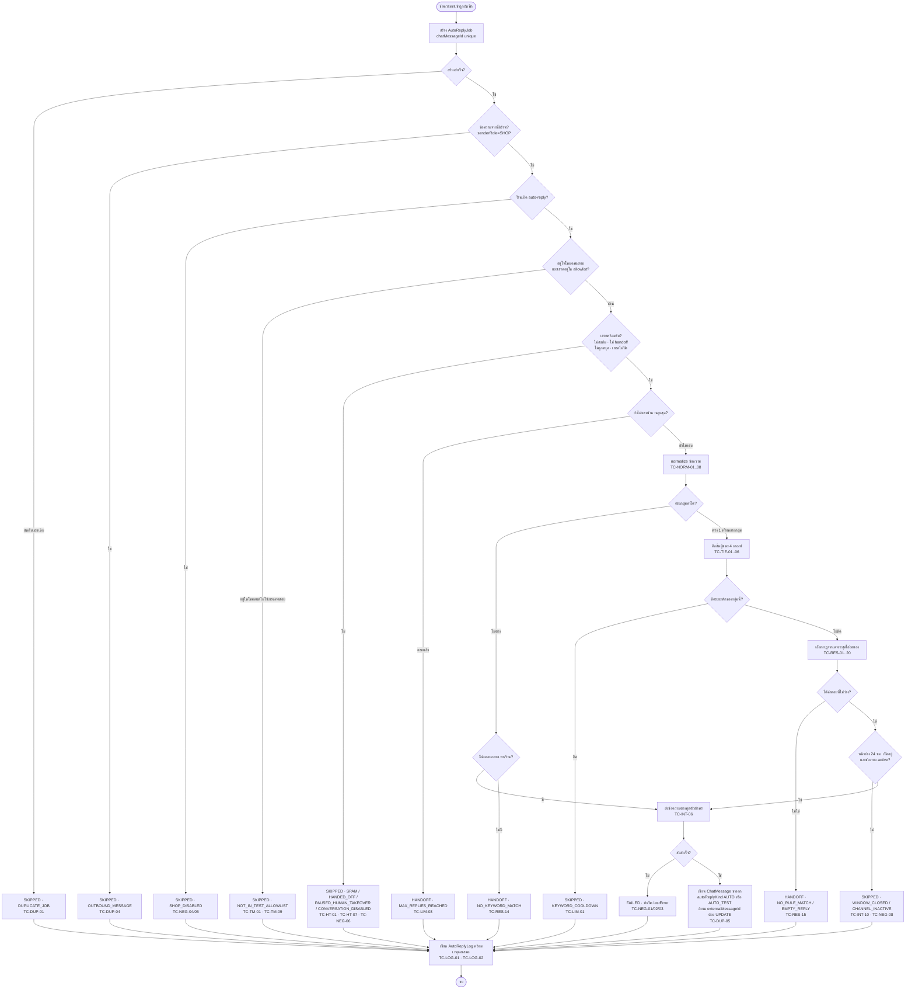
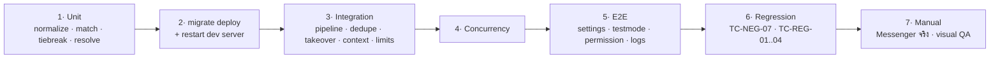

> **โมดูล:** M00023-ChatAutoReply
> **ประเภทเอกสาร:** Test Case
> **เวอร์ชัน:** 1.0
> **วันที่จัดทำ:** 2026-07-29
> **สถานะ:** Draft — **เอกสารนี้เป็นแผนการทดสอบ ไม่ใช่รายงานผลทดสอบ** เขียนก่อนมีโค้ด (doc-first ตาม Hard Rule 11) ณ วันจัดทำยังไม่มี SRS/SDS/API.md ของโมดูลนี้ ดังนั้นชื่อ route/endpoint/ฟังก์ชันในเอกสารนี้เป็น **ข้อเสนอที่ต้องยืนยันซ้ำกับ SRS/SDS/API ก่อนเขียนโค้ดจริง** (ทำเครื่องหมาย ⓐ ทุกจุดที่เป็นสมมติฐาน) — ส่วนชื่อ **model/field/ค่าคงที่ทั้งหมดไม่ใช่สมมติฐาน** มาจาก [[DATABASE]] ที่ FROZEN แล้ว
> **เจ้าของเอกสาร:** QA (ดู [[Feature-Docs-Ownership]])

# Test Case: ตอบแชทอัตโนมัติจาก Keyword (Chat Auto-Reply)

---

## 1. Overview

ชุดทดสอบนี้ครอบคลุมฟีเจอร์ `00023 - Chat Auto-Reply` ทั้งเส้น — การตั้งค่ากลุ่มคำ/คำตอบทุกระดับ, การปรับข้อความให้เป็นมาตรฐาน, การจับคู่และการตัดสินผู้ชนะ, การถอยระดับ 9 ขั้น, บริบทโฆษณา/สินค้า, การกันตอบซ้ำ, การหยุดเมื่อพนักงานตอบ, โหมดทดสอบทั้ง 2 แบบ, ความทนทานของคิวงาน, บันทึกการทำงาน, สิทธิ์/ขอบเขตร้าน และ regression ของระบบแชทเดิม

**เอกสารต้นทาง:**
- [[BRD]] §2 (FR-001..FR-024 / AC-001-01..AC-024-06 รวม **128 ข้อ**) + §8 (BR-AR-01..BR-AR-30) — ทุก TC ต้อง trace กลับรหัสเหล่านี้
- [[DATABASE]] — **FROZEN CONTRACT** ใช้เป็น ground truth ของชื่อ model/field/ค่าคงที่ที่ปรากฏใน seed data และ assertion ทุกจุดของเอกสารนี้ (ค่าคงที่ดู [[DATABASE]] §3.8)
- [[PRD]] §4.3 — ลำดับเงื่อนไขที่ระบบต้องไม่ตอบ 9 ข้อ ใช้เป็นโครงของ gate order (ดู §6 Flow)

### 1.1 ขอบเขต (Scope)

**In-scope:**
- CRUD กลุ่มคำ (`AutoReplyKeyword`) + คำตรวจจับ (`AutoReplyPhrase`) + กฎคำตอบทุกระดับ (`AutoReplyRule`)
- normalize + matching 3 รูปแบบ (`EXACT` / `CONTAINS` / `STARTS_WITH`) + การตัดสินเมื่อตรงหลายกลุ่ม
- rule resolution 9 ระดับ + การถอยระดับทุกคู่ (`AutoReplyLog.resolutionLevel`)
- บริบทโฆษณา (`ConversationAdReferral` ของเดิม) + บริบทสินค้า (`Conversation.contextProduct*`)
- การกันตอบซ้ำผ่าน `AutoReplyJob.chatMessageId @unique` + echo handling
- การหยุดเมื่อพนักงานตอบ (`Conversation.autoReplyPausedUntil` + `ChatMessage.autoReplyKind`)
- โหมดทดสอบ 2 แบบ (หน้าจำลองไม่ส่งจริง + allowlist เธรดจริง)
- คิวงาน/sweeper/retry (`AutoReplyJob`) + บันทึก (`AutoReplyLog`) + การค้นหาย้อนหลัง
- สิทธิ์ OWNER/ADMIN/STAFF + ขอบเขตข้ามร้าน
- regression: ปิดฟีเจอร์แล้วแชทเดิม (00018/00019) ต้องทำงานเหมือนก่อนมีฟีเจอร์นี้ทุกประการ

**Out-of-scope (ตาม [[BRD]] §1.2):** AI ปรับแต่งข้อความก่อนส่ง, fuzzy match คำสะกดผิด, การรวบหลายข้อความก่อนตอบ, broadcast, ช่องทาง LINE/TikTok/DEEP, ชื่อแคมเปญ/ชุดโฆษณาจาก Marketing API, แดชบอร์ดสถิติ

### 1.2 ระดับเทส (Test Level) — บังคับอ่านก่อนรันเคสใด ๆ

| ระดับ | ใช้ตรวจอะไร | เครื่องมือ | ยิง Meta จริงไหม |
|---|---|---|---|
| **[Unit]** | pure function + service logic ที่แยกทดสอบได้ — normalize, matching, tie-break, rule resolution, gate order | **Vitest** (`src/lib/__tests__/`, `src/services/__tests__/`) mock Prisma/Graph client ทั้งหมดตาม pattern เดิม (`channel-chat-ingest.test.ts`, `channel-chat-outbound.test.ts`) | **ไม่** |
| **[Integration]** | เส้นทาง webhook → job → resolve → send → log บน DB จริง (dev Supabase) โดย mock เฉพาะชั้นส่งออก Meta | **Vitest** + Prisma จริง (ห้าม mock Prisma ในกลุ่มนี้ — จุดที่ต้องพิสูจน์คือ DB constraint) | **ไม่** (mock `sendOutboundMessage` ชั้นนอกสุด) |
| **[E2E]** | UI จริงผ่าน browser — หน้าตั้งค่า, หน้าจำลอง, แถบโหมดทดสอบ, การแสดงผลในเธรด, สิทธิ์ | **Playwright** (`e2e/auto-reply-*.spec.ts`) bypass login ด้วย `e2e/helpers/auth.ts` | **ไม่** |
| **[Concurrency]** | การชนกันของ worker/ผู้ใช้ — รันคู่ขนานจริงด้วย `Promise.all` บน DB จริง | **Vitest** (integration mode) | **ไม่** |
| **[Manual]** | สิ่งที่ต้องใช้ตาเทียบหรือใช้ Messenger จริง — ป้ายกำกับในเธรด, แถบสถานะค้าง, การส่งถึงผู้รับจริง | Chrome DevTools MCP + Messenger จริง (ขออนุญาต user ก่อน) | **ใช่ เฉพาะ TC ที่ระบุ** |

เคสที่ทำเครื่องหมาย 🛑 **BLOCKER** คือ **ห้าม merge ถ้าไม่ผ่าน**

### 1.3 คำสั่งรันมาตรฐาน

```bash
# Unit + Integration (Vitest)
npm run test -- src/lib/__tests__/auto-reply-normalize.test.ts
npm run test -- src/services/__tests__/auto-reply-*.test.ts
npm run test                       # ทั้งชุด

# E2E (Playwright) — user เป็นผู้รัน dev server เอง; ตรวจพอร์ตจริงก่อนเสมอ (ปกติ 4000)
npm run e2e -- e2e/auto-reply-*.spec.ts
```

**สภาพแวดล้อม E2E:** `http://seller.deepth.local:4000` (seller) — ห้ามใช้ `localhost` (memory `feedback_qa_domains`, `project_dev_port_4000`)

### 1.4 กติกาที่ใช้ตลอดทั้งฉบับ

1. **ห้าม assert แค่หน้าจอ** — ทุกเคสที่เปลี่ยนสถานะต้องยืนยันด้วย Prisma query ตรงบนตาราง/คอลัมน์ที่ [[DATABASE]] ระบุ
2. **การนับข้อความขาออกต้องนับจาก DB ไม่ใช่จาก mock call count เพียงอย่างเดียว** — เคสกันตอบซ้ำต้อง assert ทั้ง 2 ทาง (จำนวนครั้งที่เรียก sender **และ** จำนวนแถว `ChatMessage` ที่ `autoReplyKind IN ('AUTO','AUTO_TEST')`)
3. **ทุก query ใน assertion ต้องมี `shopId`** — ถ้าเคสใดต้องอ่านข้ามร้านเพื่อพิสูจน์การรั่ว ให้ระบุไว้ชัดว่าเป็นการอ่านเชิงตรวจสอบ
4. **ห้ามรัน `prisma db pull` เด็ดขาด** ระหว่างทำ QA (memory `feedback_qa_agent_no_prisma_pull`)
5. เคสที่มีคำว่า "ไม่ตอบ" ต้อง assert **2 อย่างเสมอ**: ไม่มีข้อความขาออกเกิดขึ้น **และ** มีแถว `AutoReplyLog` ที่ `decision` + `skipReason` ตรงตามที่ระบุ (AC-024-02 บังคับ)

---

## 2. ข้อมูลตั้งต้นที่ต้องเตรียม (Seed Data)

ชุดนี้ออกแบบให้ครอบคลุมทุกเคสในเอกสารโดยไม่ต้อง seed ซ้ำระหว่างกลุ่ม — helper ที่ต้องเขียน: `e2e/helpers/auto-reply-seed.ts` ⓐ (ต่อยอดจาก `e2e/helpers/auth.ts` เดิม)

### 2.1 ร้านและผู้ใช้

| รหัสอ้างอิง | รายละเอียด |
|---|---|
| **SHOP-A** | ร้านหลักที่ใช้ทดสอบ — `AutoReplyConfig` มีครบ (`isEnabled=true`, `testMode=false`, `humanTakeoverPauseMode="2H"`, `keywordCooldownSec=300`, `maxRepliesPerConversation=10`, `adsContextMode="UNTIL_RESOLVED"`, `handoffPhrases=["คุยกับแอดมิน","คืนเงิน","ของยังไม่ได้"]`) |
| **SHOP-B** | ร้านที่สอง ใช้พิสูจน์การรั่วข้ามร้าน — มีกลุ่มคำ/กฎ/log ของตัวเองครบ ชื่อกลุ่มคำ **ตั้งซ้ำกับ SHOP-A โดยตั้งใจ** เพื่อพิสูจน์ว่า `@@unique([shopId, name])` เป็น per-shop ไม่ใช่ global |
| **SHOP-C** | ร้านที่ **ไม่เคยมีแถว `AutoReplyConfig`** เลย — ใช้พิสูจน์ default ปลอดภัย (AC-015-01) และ regression ของร้านที่ไม่เปิดใช้ |
| **USER-OWNER-A** | OWNER ของ SHOP-A |
| **USER-ADMIN-A** | ADMIN ของ SHOP-A (feature 00012 Shop Staff) |
| **USER-STAFF-A** | STAFF ของ SHOP-A |
| **USER-OWNER-B** | OWNER ของ SHOP-B |

### 2.2 เพจ / ช่องทาง (`ShopChannel` — ของเดิม 00018)

| รหัส | รายละเอียด |
|---|---|
| **PAGE-1** | `ShopChannel` ของ SHOP-A, `platform="MESSENGER"`, active — "เพจอะไหล่" |
| **PAGE-2** | `ShopChannel` ของ SHOP-A, `platform="MESSENGER"`, active — "เพจเครื่องสำอาง" |
| **PAGE-3** | `ShopChannel` ของ SHOP-A, `platform="INSTAGRAM"`, active |
| **PAGE-OFF** | `ShopChannel` ของ SHOP-A ที่ inactive — ใช้เคส `CHANNEL_INACTIVE` |
| **PAGE-B1** | `ShopChannel` ของ SHOP-B |

### 2.3 โฆษณา (ค่า `adId` ดิบ — ไม่ใช่ FK ตาม [[DATABASE]] §3.4)

| รหัส | `adId` | ใช้ทำอะไร |
|---|---|---|
| **AD-1** | `"ad_1001"` | โฆษณาที่ **มีกฎตั้งไว้** บน PAGE-1 (ขายโช๊ครุ่น 390) |
| **AD-2** | `"ad_1002"` | โฆษณาที่ **มีกฎตั้งไว้** บน PAGE-1 (ขายโช๊ครุ่น 590) — ใช้เคสเปลี่ยนบริบท |
| **AD-3** | `"ad_9999"` | โฆษณาที่ **ไม่เคยตั้งกฎ** — ใช้เคสสำคัญ AC-007-04 (ถอยไป PAGE ไม่ใช่หยุดตอบ) |
| **AD-4** | `"ad_1001"` บน **PAGE-2** | `adId` เดียวกับ AD-1 แต่คนละเพจ — พิสูจน์ AC-007-02 |

### 2.4 สินค้า (`Product` — ของเดิม)

| รหัส | รายละเอียด |
|---|---|
| **PROD-1** | สินค้า active ของ SHOP-A "โช๊คหลังคู่ 335 มม." — ผูกกับ AD-1 |
| **PROD-2** | สินค้า active ของ SHOP-A "โช๊คหลังคู่ 390 มม." — ใช้เคสบริบทขัดแย้ง (MANUAL) |
| **PROD-OFF** | สินค้าของ SHOP-A ที่ **ปิดการขาย** — ใช้เคส AC-008-03 |
| **PROD-DEL** | สินค้าของ SHOP-A ที่จะถูก **ลบระหว่างเทส** — พิสูจน์ `onDelete: SetNull` บน `AutoReplyRule.productId` |
| **PROD-B1** | สินค้าของ SHOP-B — ใช้พิสูจน์ว่าเลือกข้ามร้านไม่ได้ (AC-008-01) |

### 2.5 กลุ่มคำและคำตรวจจับ (SHOP-A)

| รหัส | `name` | `matchType` | `priority` | `isActive` | `AutoReplyPhrase` |
|---|---|---|---|---|---|
| **KW-INTEREST** | `สนใจสินค้า` | `CONTAINS` | `100` | true | `สนใจ` · `ขอรายละเอียด` · `อยากสั่ง` |
| **KW-PRICE** | `ถามราคา` | `CONTAINS` | `120` | true | `ราคา` · `เท่าไหร่` · `กี่บาท` |
| **KW-COD-EXACT** | `เก็บปลายทาง (เป๊ะ)` | `EXACT` | `100` | true | `เก็บปลายทาง` |
| **KW-COD-CONTAINS** | `เก็บปลายทาง (ในประโยค)` | `CONTAINS` | `100` | true | `เก็บปลายทาง` |
| **KW-START** | `ขึ้นต้นด้วยสวัสดี` | `STARTS_WITH` | `100` | true | `สวัสดี` |
| **KW-LONG** | `คำยาว` | `CONTAINS` | `100` | true | `สนใจโช๊คหลัง` (ยาวกว่า `สนใจ` ของ KW-INTEREST) |
| **KW-TIE-A** | `เสมอกัน A` | `CONTAINS` | `100` | true | `ทดสอบเสมอ` |
| **KW-TIE-B** | `เสมอกัน B` | `CONTAINS` | `100` | true | `ทดสอบเสมอ` (คำเดียวกัน ความยาวเท่ากัน → บังคับใช้ tie-break ชั้นสุดท้าย) |
| **KW-OFF** | `กลุ่มที่ปิดอยู่` | `CONTAINS` | `999` | **false** | `สนใจ` (priority สูงสุด แต่ปิด → ต้องไม่ถูกเลือกเลย) |
| **KW-SPACE** | `คำมีช่องว่าง` | `CONTAINS` | `100` | true | `ส่ง ฟรี ไหม` |

> **หมายเหตุ:** `KW-COD-EXACT` กับ `KW-COD-CONTAINS` ตั้งใจให้ `priority` และ `phrase` เท่ากันทุกอย่าง ต่างแค่ `matchType` — เป็นชุดข้อมูลที่บังคับให้เกณฑ์ที่ 3 ของ BR-AR-04 (EXACT ก่อน CONTAINS) ถูกใช้จริง

### 2.6 กฎคำตอบ (`AutoReplyRule` ของ SHOP-A — `specificity` ตามสูตร [[DATABASE]] §3.4)

| รหัส | `keywordId` | `shopChannelId` | `adId` | `productId` | `specificity` | ระดับที่คาดหวัง |
|---|---|---|---|---|---|---|
| **R-7** | KW-INTEREST | PAGE-1 | `ad_1001` | PROD-1 | `7` | `KEYWORD_PAGE_AD_PRODUCT` |
| **R-6** | KW-INTEREST | PAGE-1 | `ad_1002` | — | `6` | `KEYWORD_PAGE_AD` |
| **R-5** | KW-INTEREST | PAGE-1 | — | PROD-2 | `5` | `KEYWORD_PAGE_PRODUCT` |
| **R-4** | KW-INTEREST | PAGE-1 | — | — | `4` | `KEYWORD_PAGE` |
| **R-1** | KW-INTEREST | — | — | PROD-1 | `1` | `KEYWORD_PRODUCT` |
| **R-0** | KW-INTEREST | — | — | — | `0` | `KEYWORD_DEFAULT` |
| **R-PAGE-DEF** | **null** | PAGE-1 | — | — | `4` | `PAGE_DEFAULT` |
| **R-SHOP-DEF** | **null** | — | — | — | `0` | `SHOP_DEFAULT` |
| **R-EMPTY** | KW-PRICE | PAGE-2 | — | — | `4` | `replyText` เป็นช่องว่างล้วน → ต้องถูกข้าม (`EMPTY_REPLY`) |
| **R-INACTIVE** | KW-PRICE | PAGE-1 | — | — | `4` | `isActive=false` → ต้องถูกข้าม |
| **R-SCHEDULED** | KW-PRICE | PAGE-3 | — | — | `4` | `activeFrom`/`activeUntil` อยู่ **นอกช่วงเวลาปัจจุบัน** → ต้องถูกข้าม |
| **R-MIXED** | KW-INTEREST | — | `ad_1002` | PROD-2 | `3` | เงื่อนไขผสม ad+product ไม่ระบุเพจ (AC-008-04) |
| **R-B** | (ของ SHOP-B) | PAGE-B1 | — | — | `4` | ใช้พิสูจน์ว่ากฎ SHOP-B ไม่ถูกหยิบมาใช้กับ SHOP-A เด็ดขาด |

> `replyText` ของทุกกฎให้ใส่ข้อความที่ **ระบุระดับตัวเองได้ชัดเจน** เช่น `"[R-6] รุ่นนี้ราคา 590 บาท เก็บเงินปลายทางได้ค่ะ"` เพื่อให้ assertion ตรวจได้ทั้งระดับที่เลือกและความตรงทุกตัวอักษรในเคสเดียว

### 2.7 เธรดและข้อความ

| รหัส | รายละเอียด |
|---|---|
| **CONV-1** | เธรด MESSENGER ของ SHOP-A บน PAGE-1, `autoReplyEnabled=null`, `autoReplyTestEnabled=false`, `autoReplyCount=0`, มี `ConversationAdReferral` ของ AD-1 |
| **CONV-2** | เธรดบน PAGE-2, ไม่มี ad referral — ใช้เคสถอยระดับ |
| **CONV-3** | เธรดบน PAGE-1 ที่ `autoReplyEnabled=false` (ร้านตั้งปิดเฉพาะเธรดนี้) |
| **CONV-TEST** | เธรดบน PAGE-1 ที่ `autoReplyTestEnabled=true` — allowlist โหมดทดสอบ |
| **CONV-SPAM** | เธรดที่ `isSpam=true` |
| **CONV-HANDOFF** | เธรดที่ `handoffAt` ไม่เป็น null |
| **CONV-PAUSED** | เธรดที่ `autoReplyPausedUntil` = อนาคต |
| **CONV-MAXED** | เธรดที่ `autoReplyCount=10` (ครบ `maxRepliesPerConversation`) |
| **CONV-OLD** | เธรดที่ `lastInboundAt` เก่ากว่า 24 ชม. — เคส `WINDOW_CLOSED` |
| **CONV-B** | เธรดของ SHOP-B |

### 2.8 ค่าคงที่ที่ทุก assertion ต้องใช้ตรงตัว ([[DATABASE]] §3.8 — FROZEN)

- `AutoReplyKeyword.matchType`: `EXACT` · `CONTAINS` · `STARTS_WITH`
- `AutoReplyConfig.humanTakeoverPauseMode`: `30M` · `2H` · `MANUAL` · `UNTIL_RESOLVED`
- `AutoReplyConfig.adsContextMode`: `UNTIL_RESOLVED` · `HOURS` · `UNTIL_NEW_PRODUCT`
- `AutoReplyJob.status`: `PENDING` · `PROCESSING` · `DONE` · `FAILED` · `SKIPPED`
- `AutoReplyLog.decision`: `REPLIED` · `SKIPPED` · `HANDOFF` · `FAILED`
- `AutoReplyLog.resolutionLevel`: `KEYWORD_PAGE_AD_PRODUCT` · `KEYWORD_PAGE_AD` · `KEYWORD_PAGE_PRODUCT` · `KEYWORD_PAGE` · `KEYWORD_PRODUCT` · `KEYWORD_DEFAULT` · `PAGE_DEFAULT` · `SHOP_DEFAULT` · `NONE`
- `AutoReplyLog.skipReason`: `SHOP_DISABLED` · `CONVERSATION_DISABLED` · `NOT_IN_TEST_ALLOWLIST` · `SPAM` · `HANDED_OFF` · `PAUSED_HUMAN_TAKEOVER` · `OUTBOUND_MESSAGE` · `KEYWORD_COOLDOWN` · `MAX_REPLIES_REACHED` · `NO_KEYWORD_MATCH` · `NO_RULE_MATCH` · `EMPTY_REPLY` · `WINDOW_CLOSED` · `CHANNEL_INACTIVE` · `DUPLICATE_JOB`
- `ChatMessage.autoReplyKind`: `null` · `AUTO` · `AUTO_TEST`
- `Conversation.contextProductSource`: `ADS_MAPPING` · `MANUAL` · `REFERRAL`

---

## 3. Test Scenarios

> ทุก TC ระบุ **ประเภท** ชัดเจน — [Unit] / [Integration] / [E2E] / [Concurrency] / [Manual] และ **AC ที่อ้างอิง** ทุกเคส

### 3.1 กลุ่ม A — [Unit] การปรับข้อความให้เป็นมาตรฐาน (normalize)

**ไฟล์:** `src/lib/__tests__/auto-reply-normalize.test.ts` ⓐ · ฟังก์ชัน `normalizeMessage()` ⓐ (ตัวเดียวกับที่ใช้สร้าง `AutoReplyPhrase.normalizedPhrase` — [[DATABASE]] §6)

#### TC-NORM-01: ตัดช่องว่างหัวท้ายและยุบช่องว่างซ้ำ
- **ประเภท:** [Unit] Vitest
- **Precondition:** ไม่ต้องมี DB
- **Steps:** เรียก `normalizeMessage()` ด้วย `"   สนใจ    ครับ   "`, `"สนใจ\t\tครับ"`, `"สนใจ\n\nครับ"`
- **Expected Result:** ทั้ง 3 คืนค่าเดียวกันคือ `"สนใจ ครับ"` — ไม่มีช่องว่างหัวท้าย ช่องว่างภายในเหลือตัวเดียว (รวม tab/newline ถูกนับเป็นช่องว่างด้วย)
- **Linked to:** AC-010-01

#### TC-NORM-02: ไม่แยกตัวพิมพ์เล็ก/ใหญ่ของภาษาอังกฤษ
- **ประเภท:** [Unit] Vitest
- **Steps:** เรียกด้วย `"COD"`, `"cod"`, `"Cod"`, `"cOd"`
- **Expected Result:** ทั้ง 4 คืนค่าเดียวกัน (`"cod"`); และการ match phrase `"cod"` กับข้อความ `"มี COD ไหม"` ต้องเจอ
- **Linked to:** AC-010-02

#### TC-NORM-03: เครื่องหมายวรรคตอนและเครื่องหมายคำถามท้ายประโยค
- **ประเภท:** [Unit] Vitest
- **Steps:** เรียกด้วย `"สนใจ!!"`, `"สนใจ!!!"`, `"ราคา???"`, `"สนใจ..."`, `"สนใจ ๆ"`, `"สนใจ~"`
- **Expected Result:** ผลลัพธ์ต้องเทียบกับ phrase `"สนใจ"` / `"ราคา"` ได้ทั้งหมด — เครื่องหมายท้ายประโยคต้องไม่ทำให้เทียบไม่ตรง; และต้องเป็นการตัดเครื่องหมาย **ไม่ใช่การตัดอักขระไทย** (`"สนใจ"` ต้องยังเป็น `"สนใจ"` ครบทุกตัว)
- **Linked to:** AC-010-03, AC-010-05

#### TC-NORM-04: Unicode ไทยที่ประกอบอักขระต่างกันต้องเทียบกันได้
- **ประเภท:** [Unit] Vitest
- **Steps:** สร้างคำเดียวกัน 2 รูปแบบ — NFC และ NFD (เช่น `"ค่ะ"` ที่ประกอบสระ/วรรณยุกต์คนละลำดับ) แล้วเรียก `normalizeMessage()` ทั้งคู่
- **Expected Result:** คืนค่า string ที่ **เท่ากันแบบ `===`** (ยืนยันว่ามีการ normalize Unicode จริง ไม่ใช่แค่ trim); assert เพิ่มด้วยว่าผลลัพธ์อยู่ในรูป NFC
- **Linked to:** AC-010-04

#### TC-NORM-05: 🛑 **BLOCKER** — ชุดคำ "สนใจ" ครบทุกรูปแบบต้องเข้ากลุ่มเดียวกัน
- **ประเภท:** [Unit] Vitest (table-driven)
- **Precondition:** กลุ่ม `KW-INTEREST` (`matchType="CONTAINS"`, phrase `"สนใจ"`)
- **Steps:** วนทดสอบ input ทุกตัว: `สนใจ` · `สนใจครับ` · `สนใจค่ะ` · `สนใจคับ` · `สนใจจ้า` · `สนใจ!!` · `  สนใจ   ครับ  ` · `สนใจCRAB`
- **Expected Result:** **ทุกตัว** match `KW-INTEREST` — ไม่มีตัวใดหลุด (เคสนี้คือคำสัญญาหลักที่ร้านจะตัดสินว่าฟีเจอร์ใช้ได้จริงไหม)
- **Linked to:** AC-010-05

#### TC-NORM-06: normalize ต้อง idempotent และใช้ฟังก์ชันเดียวกับตอนบันทึก phrase
- **ประเภท:** [Unit] Vitest
- **Steps:**
  1. ยืนยัน `normalizeMessage(normalizeMessage(x)) === normalizeMessage(x)` สำหรับ input ทุกตัวใน TC-NORM-05
  2. บันทึก `AutoReplyPhrase` ผ่าน service จริง แล้วเทียบ `normalizedPhrase` ที่ถูกเขียนลง DB กับ `normalizeMessage(phrase)` ที่เรียกตรง
- **Expected Result:** ขั้น 1 เท่ากันทุกตัว; ขั้น 2 ค่าใน DB ตรงกับผลของฟังก์ชันเป๊ะ — พิสูจน์ว่าไม่มี normalize 2 ตัวแยกกัน (ข้อควรระวังใน [[DATABASE]] §6)
- **Linked to:** AC-010-04, AC-010-05

#### TC-NORM-07: คำตรวจจับที่มีช่องว่างภายในและวรรณยุกต์ครบ
- **ประเภท:** [Unit] Vitest
- **Precondition:** กลุ่ม `KW-SPACE` phrase `"ส่ง ฟรี ไหม"`
- **Steps:** ทดสอบข้อความ `"ส่ง  ฟรี   ไหม"`, `"ร้านนี้ส่ง ฟรี ไหมครับ"`, `"ส่งฟรีไหม"` (ไม่มีช่องว่าง)
- **Expected Result:** 2 ตัวแรก match; ตัวที่ 3 **ไม่ match** (ระบบไม่ตัดช่องว่างทิ้งทั้งหมด — ยุบซ้ำเท่านั้น) และผลลัพธ์นี้ต้องถูกอธิบายไว้ในหน้าตั้งค่า
- **Linked to:** AC-002-05

#### TC-NORM-08: ข้อความต้นฉบับและข้อความที่ปรับแล้วถูกบันทึกคู่กัน
- **ประเภท:** [Integration] Vitest
- **Precondition:** SHOP-A เปิดใช้งาน, CONV-1
- **Steps:** ส่งข้อความขาเข้า `"  สนใจ!!  "` ผ่าน pipeline จริง → อ่านแถว `AutoReplyLog` ที่เกิดขึ้น
- **Expected Result:** `rawText` = `"  สนใจ!!  "` (ต้นฉบับไม่ถูกแก้), `normalizedText` = ผลของ `normalizeMessage()` — ทั้ง 2 คอลัมน์ไม่เป็น null
- **Linked to:** AC-010-06, AC-024-01

---

### 3.2 กลุ่ม B — [Unit] การจับคู่ 3 รูปแบบ

**ไฟล์:** `src/services/__tests__/auto-reply-match.test.ts` ⓐ

#### TC-MATCH-01: `EXACT` — ตรงทั้งข้อความเท่านั้น
- **ประเภท:** [Unit] Vitest
- **Precondition:** `KW-COD-EXACT` (`matchType="EXACT"`, phrase `"เก็บปลายทาง"`) — ปิด `KW-COD-CONTAINS` ชั่วคราวเพื่อแยกตัวแปร
- **Steps:** ทดสอบ `"เก็บปลายทาง"`, `"เก็บปลายทาง!"`, `" เก็บปลายทาง "`, `"มีเก็บปลายทางไหม"`, `"เก็บปลายทางไหม"`
- **Expected Result:** 3 ตัวแรก **match** (เพราะ normalize แล้วเท่ากันพอดี); 2 ตัวหลัง **ไม่ match** — และเคสไม่ match ต้องได้ `skipReason="NO_KEYWORD_MATCH"` เมื่อไม่มีกลุ่มอื่นรับ
- **Linked to:** AC-003-01

#### TC-MATCH-02: `CONTAINS` — มีคำอยู่ที่ตำแหน่งใดก็ได้
- **ประเภท:** [Unit] Vitest
- **Precondition:** `KW-INTEREST` (`CONTAINS`, phrase `"สนใจ"`)
- **Steps:** ทดสอบ `"สนใจ"`, `"ผมสนใจครับ"`, `"อยากทราบราคา สนใจมากเลย"`, `"สน ใจ"` (มีช่องว่างคั่น)
- **Expected Result:** 3 ตัวแรก match; `"สน ใจ"` **ไม่ match** (ระบบไม่ทำ fuzzy — เฟส 2)
- **Linked to:** AC-003-01

#### TC-MATCH-03: `STARTS_WITH` — ขึ้นต้นเท่านั้น
- **ประเภท:** [Unit] Vitest
- **Precondition:** `KW-START` (`STARTS_WITH`, phrase `"สวัสดี"`)
- **Steps:** ทดสอบ `"สวัสดีครับ"`, `"  สวัสดีค่ะ"`, `"ครับสวัสดี"`, `"ขอถามหน่อย สวัสดีครับ"`
- **Expected Result:** 2 ตัวแรก match (ช่องว่างหัวถูกตัดก่อนเทียบ); 2 ตัวหลัง **ไม่ match**
- **Linked to:** AC-003-01

#### TC-MATCH-04: `EXACT` ยังตรงหลัง normalize
- **ประเภท:** [Unit] Vitest
- **Steps:** `KW-COD-EXACT` กับข้อความ `"เก็บปลายทาง???"` และ `"เก็บ  ปลายทาง"` ⓐ (ตัวหลังขึ้นกับว่า normalize ยุบช่องว่างแล้ว phrase มีช่องว่างหรือไม่)
- **Expected Result:** `"เก็บปลายทาง???"` match (เครื่องหมายถูกตัด); `"เก็บ  ปลายทาง"` **ไม่ match** เพราะ normalize ยุบเหลือ `"เก็บ ปลายทาง"` ซึ่งไม่เท่ากับ `"เก็บปลายทาง"` — ยืนยันว่า EXACT เทียบกับ **ผลหลัง normalize** ไม่ใช่ raw
- **Linked to:** AC-003-01, AC-010-03

#### TC-MATCH-05: กลุ่มที่ปิดใช้งานต้องไม่ถูกนำมาเทียบเลย
- **ประเภท:** [Unit] Vitest
- **Precondition:** `KW-OFF` (`isActive=false`, `priority=999` สูงสุด, phrase `"สนใจ"`)
- **Steps:** ส่งข้อความ `"สนใจ"` แล้วตรวจผลการจับคู่และ query ที่ถูกยิง
- **Expected Result:** ผู้ชนะคือ `KW-INTEREST` ไม่ใช่ `KW-OFF`; และ `matchTrace` **ไม่มี** `KW-OFF` อยู่ในรายชื่อผู้แพ้ด้วยซ้ำ (ต้องถูกกรองที่ระดับ query ด้วย index `[shopId, isActive, priority]` ไม่ใช่กรองใน JS)
- **Linked to:** AC-001-03

#### TC-MATCH-06: 🛑 **BLOCKER** — กลุ่มคำของร้านอื่นต้องไม่ถูกนำมาเทียบ
- **ประเภท:** [Unit] + [Integration] Vitest
- **Precondition:** SHOP-B มีกลุ่มคำชื่อซ้ำกับ SHOP-A และมี phrase `"สนใจ"` ที่ `priority=999`
- **Steps:** ประมวลผลข้อความ `"สนใจ"` ของ CONV-1 (SHOP-A) → ตรวจ SQL ที่ถูกยิง (Prisma log) และผู้ชนะ
- **Expected Result:** ทุก query ที่โหลดกลุ่มคำ/กฎ **มี `shopId` ใน `WHERE`** (ห้าม post-filter ใน JS); ผู้ชนะเป็นกลุ่มของ SHOP-A เสมอ; `AutoReplyLog.shopId` = SHOP-A
- **Linked to:** AC-001-05, BR-AR-01

---

### 3.3 กลุ่ม C — [Unit] การตัดสินเมื่อตรงหลายกลุ่ม (BR-AR-04)

**ไฟล์:** `src/services/__tests__/auto-reply-tiebreak.test.ts` ⓐ

#### TC-TIE-01: เกณฑ์ที่ 1 — `priority` สูงกว่าชนะ
- **ประเภท:** [Unit] Vitest
- **Precondition:** `KW-PRICE` (`priority=120`) และ `KW-INTEREST` (`priority=100`) ทั้งคู่ match
- **Steps:** ส่ง `"สนใจ ราคาเท่าไหร่"` (ตรงทั้ง 2 กลุ่ม)
- **Expected Result:** ผู้ชนะ = `KW-PRICE`; `matchTrace.winnerReason` ระบุว่าชนะด้วยเกณฑ์ `priority` ⓐ
- **Linked to:** AC-003-02, AC-011-02

#### TC-TIE-02: เกณฑ์ที่ 2 — `priority` เท่ากัน → เฉพาะเจาะจงกว่าชนะ
- **ประเภท:** [Unit] Vitest
- **Precondition:** 2 กลุ่ม `priority=100` เท่ากัน กลุ่มหนึ่งมีกฎ `specificity=6` อีกกลุ่มมีแค่ `specificity=0`
- **Steps:** ส่งข้อความที่ match ทั้งคู่ในบริบท PAGE-1 + AD-2
- **Expected Result:** ผู้ชนะคือกลุ่มที่มีกฎเฉพาะเจาะจงกว่า; `resolutionLevel="KEYWORD_PAGE_AD"`
- **Linked to:** AC-011-02

#### TC-TIE-03: เกณฑ์ที่ 3 — `EXACT` ชนะ `CONTAINS`
- **ประเภท:** [Unit] Vitest
- **Precondition:** `KW-COD-EXACT` และ `KW-COD-CONTAINS` — `priority`, phrase, ความยาว phrase เท่ากันทุกอย่าง
- **Steps:** ส่งข้อความ `"เก็บปลายทาง"` (ตรงทั้ง 2 แบบ)
- **Expected Result:** ผู้ชนะ = `KW-COD-EXACT`; `AutoReplyLog.matchType="EXACT"`
- **Linked to:** AC-011-02

#### TC-TIE-04: เกณฑ์ที่ 4 — คำตรวจจับที่ยาวกว่าชนะ
- **ประเภท:** [Unit] Vitest
- **Precondition:** `KW-INTEREST` (phrase `"สนใจ"`) และ `KW-LONG` (phrase `"สนใจโช๊คหลัง"`) — `priority` และ `matchType` เท่ากัน
- **Steps:** ส่ง `"สนใจโช๊คหลังครับ"` (ตรงทั้ง 2)
- **Expected Result:** ผู้ชนะ = `KW-LONG`; `matchedPhrase="สนใจโช๊คหลัง"` — วัดความยาวจาก **normalizedPhrase** ไม่ใช่ raw
- **Linked to:** AC-011-02

#### TC-TIE-05: เท่ากันทุกเกณฑ์ → ต้องมีผู้ชนะที่กำหนดไว้แน่นอน
- **ประเภท:** [Unit] Vitest
- **Precondition:** `KW-TIE-A` และ `KW-TIE-B` — `priority`, `matchType`, phrase, ความยาว, specificity ของกฎ เท่ากันทุกประการ
- **Steps:** ส่ง `"ทดสอบเสมอ"`
- **Expected Result:** ได้ผู้ชนะ 1 กลุ่มเสมอ (ไม่ throw ไม่คืน null ไม่ตอบ 2 ข้อความ) และเกณฑ์ตัดสินชั้นสุดท้ายต้องเป็นค่าที่คงที่ข้ามการรัน — **ต้องเป็นการเรียงด้วยคอลัมน์ของ DB ที่ไม่เปลี่ยน** (ข้อเสนอ: `AutoReplyKeyword.createdAt ASC` แล้วตามด้วย `id ASC`) ⓐ **ต้องยืนยันใน SDS** เพราะ [[DATABASE]] ไม่ได้ freeze เกณฑ์นี้ไว้
- **Linked to:** AC-011-03, BR-AR-04

#### TC-TIE-06: 🛑 **BLOCKER** — deterministic ข้ามการรันและข้ามลำดับข้อมูล
- **ประเภท:** [Unit] Vitest
- **Precondition:** ชุดกลุ่มคำเดียวกับ TC-TIE-05 บวก `KW-INTEREST`/`KW-PRICE`
- **Steps:**
  1. รัน resolve ด้วย input เดิม **50 รอบติดกัน** เก็บ `keywordId` + `ruleId` + `resolutionLevel` ทุกรอบ
  2. ลบแล้ว seed ใหม่โดย **สลับลำดับการ insert** ของกลุ่มคำ (B ก่อน A) แล้วรันอีก 50 รอบ
  3. รันโดยส่ง array ของกฎเข้ามาในลำดับที่สลับกัน (ถ้า resolver รับ array) ⓐ
- **Expected Result:** ผลลัพธ์ทั้ง 150 รอบ **เหมือนกันทุกฟิลด์** — ไม่มีการพึ่งลำดับที่ DB คืนแถวมาโดยบังเอิญ, ไม่มี `Math.random()`, ไม่มีการพึ่ง `Date.now()` ในการตัดสิน
- **Linked to:** AC-011-03, BR-AR-04

#### TC-TIE-07: หนึ่งข้อความได้คำตอบไม่เกิน 1 รายการแม้ตรง 3 กลุ่ม
- **ประเภท:** [Integration] Vitest
- **Precondition:** ข้อความที่ตรงพร้อมกัน 3 กลุ่ม (`KW-INTEREST` + `KW-PRICE` + `KW-COD-CONTAINS`)
- **Steps:** ส่ง `"สนใจครับ ราคาเท่าไหร่ มีเก็บปลายทางไหม"` ผ่าน pipeline จริง 1 ครั้ง
- **Expected Result:** `ChatMessage` ที่ `autoReplyKind='AUTO'` ในเธรดนี้เพิ่มขึ้น **1 แถวพอดี**; sender ถูกเรียก 1 ครั้ง; `AutoReplyLog` มี 1 แถว `decision="REPLIED"`
- **Linked to:** AC-011-01, BR-AR-03

#### TC-TIE-08: `matchTrace` บันทึกผู้ชนะ เหตุผล และผู้แพ้ครบ
- **ประเภท:** [Integration] Vitest
- **Steps:** ใช้ input จาก TC-TIE-07 → อ่าน `AutoReplyLog.matchTrace`
- **Expected Result:** `matchTrace` เป็น JSON ที่มีอย่างน้อย: กลุ่มผู้ชนะ (id + name), เกณฑ์ที่ทำให้ชนะ (ระบุได้ว่าเป็นเกณฑ์ที่เท่าไหร่ใน 4 ข้อ), และรายการกลุ่มที่แพ้พร้อมเหตุผลรายกลุ่ม — อ่านแล้วร้านตอบคำถาม "ทำไมเลือกกลุ่มนี้" ได้โดยไม่ต้องเปิดโค้ด
- **Linked to:** AC-011-04, BR-AR-05

---

### 3.4 กลุ่ม D — [Unit] การเลือกกฎและการถอยระดับ 9 ขั้น (FR-009)

**ไฟล์:** `src/services/__tests__/auto-reply-resolve.test.ts` ⓐ · ทุกเคสใช้กฎชุด §2.6

#### TC-RES-01: ระดับ 1 — Keyword + เพจ + โฆษณา + สินค้า
- **ประเภท:** [Unit] Vitest
- **Precondition:** มี R-7 ครบ; บริบท = PAGE-1 + `ad_1001` + PROD-1
- **Steps:** resolve ด้วย `KW-INTEREST` + บริบทข้างต้น
- **Expected Result:** ได้ R-7; `resolutionLevel="KEYWORD_PAGE_AD_PRODUCT"`; `replyText` ตรงกับของ R-7 ทุกตัวอักษร
- **Linked to:** AC-009-01

#### TC-RES-02: ระดับ 2 — Keyword + เพจ + โฆษณา
- **ประเภท:** [Unit] Vitest
- **Precondition:** บริบท = PAGE-1 + `ad_1002` + ไม่มีสินค้า
- **Steps:** resolve
- **Expected Result:** ได้ R-6; `resolutionLevel="KEYWORD_PAGE_AD"` — ยืนยัน AC-007-03 ว่าเธรดที่มีบริบทโฆษณาตรงต้องใช้คำตอบของโฆษณานั้น
- **Linked to:** AC-009-01, AC-007-03

#### TC-RES-03: ระดับ 3 — Keyword + เพจ + สินค้า
- **ประเภท:** [Unit] Vitest
- **Precondition:** บริบท = PAGE-1 + ไม่มีโฆษณา + PROD-2
- **Expected Result:** ได้ R-5; `resolutionLevel="KEYWORD_PAGE_PRODUCT"`
- **Linked to:** AC-009-01

#### TC-RES-04: ระดับ 4 — Keyword + เพจ
- **ประเภท:** [Unit] Vitest
- **Precondition:** บริบท = PAGE-1 เท่านั้น
- **Expected Result:** ได้ R-4; `resolutionLevel="KEYWORD_PAGE"`
- **Linked to:** AC-009-01

#### TC-RES-05: ระดับ 5 — Keyword + สินค้า (ไม่ระบุเพจ)
- **ประเภท:** [Unit] Vitest
- **Precondition:** บริบท = เพจที่ไม่มีกฎระดับเพจ (PAGE-3) + PROD-1
- **Expected Result:** ได้ R-1; `resolutionLevel="KEYWORD_PRODUCT"` — ยืนยัน AC-008-02
- **Linked to:** AC-009-01, AC-008-02

#### TC-RES-06: ระดับ 6 — Keyword กลาง
- **ประเภท:** [Unit] Vitest
- **Precondition:** บริบท = PAGE-3 ไม่มีโฆษณา ไม่มีสินค้า
- **Expected Result:** ได้ R-0; `resolutionLevel="KEYWORD_DEFAULT"`
- **Linked to:** AC-009-01

#### TC-RES-07: ระดับ 7 — คำตอบกลางของเพจ (ไม่มีกลุ่มคำใดตรง)
- **ประเภท:** [Unit] Vitest
- **Precondition:** ข้อความที่ **ไม่ match กลุ่มคำใดเลย** (`"อยากได้ใบเสนอราคาแบบมีตราประทับ"`) + บริบท PAGE-1 ที่มี R-PAGE-DEF
- **Expected Result:** ได้ R-PAGE-DEF; `resolutionLevel="PAGE_DEFAULT"`; `keywordId` ใน log เป็น null; **ไม่ใช่** `HANDOFF` (BR-AR-06 ห้ามเงียบทั้งที่มีคำตอบกลาง)
- **Linked to:** AC-009-01, AC-009-05

#### TC-RES-08: ระดับ 8 — คำตอบกลางของร้าน
- **ประเภท:** [Unit] Vitest
- **Precondition:** ข้อความไม่ match กลุ่มใด + บริบท PAGE-3 (ไม่มี PAGE_DEFAULT ของเพจนี้) + มี R-SHOP-DEF
- **Expected Result:** ได้ R-SHOP-DEF; `resolutionLevel="SHOP_DEFAULT"`
- **Linked to:** AC-009-01, AC-009-05

#### TC-RES-09: ระดับ 9 — ไม่เหลืออะไรให้ถอย
- **ประเภท:** [Unit] Vitest
- **Precondition:** ลบ R-PAGE-DEF และ R-SHOP-DEF ออก; ข้อความไม่ match กลุ่มใด
- **Expected Result:** ไม่มีข้อความถูกส่ง; `decision="HANDOFF"`; `resolutionLevel="NONE"`; `skipReason="NO_KEYWORD_MATCH"`
- **Linked to:** AC-009-01, AC-009-04

#### TC-RES-10: 🛑 **BLOCKER** — เมทริกซ์การถอยระดับทุกคู่
- **ประเภท:** [Unit] Vitest (table-driven)
- **Precondition:** ชุดกฎ §2.6 ครบ
- **Steps:** สร้างตารางทดสอบที่ตัดกฎออกทีละระดับจากบนลงล่าง แล้ว resolve ด้วยบริบทเดิม (PAGE-1 + `ad_1001` + PROD-1) — รวม **8 แถว** ที่คาดหวังผลไล่จาก `KEYWORD_PAGE_AD_PRODUCT` → `KEYWORD_PAGE_AD` → `KEYWORD_PAGE_PRODUCT` → `KEYWORD_PAGE` → `KEYWORD_PRODUCT` → `KEYWORD_DEFAULT` → `PAGE_DEFAULT` → `SHOP_DEFAULT` → `NONE`
- **Expected Result:** ทุกแถวได้ `resolutionLevel` ตรงตามลำดับ **โดยไม่ข้ามระดับใด** และไม่กระโดดย้อนขึ้น; การถอยเกิดขึ้นเฉพาะเพราะ "ไม่มีการตั้งค่า" เท่านั้น
- **Linked to:** AC-009-01, AC-009-03, AC-008-02

#### TC-RES-11: 🛑 **BLOCKER** — โฆษณาที่ไม่รู้จักต้องถอยไประดับเพจ ไม่ใช่หยุดตอบ
- **ประเภท:** [Unit] + [Integration] Vitest
- **Precondition:** CONV-1 มี `ConversationAdReferral` ของ **AD-3 (`ad_9999`)** ซึ่งไม่มีกฎใดผูกไว้; R-4 (`KEYWORD_PAGE`) ยังอยู่
- **Steps:** ส่ง `"สนใจครับ"` ผ่าน pipeline จริง
- **Expected Result:** ลูกค้า **ได้รับคำตอบ** ของ R-4 (ไม่ใช่ความเงียบ); `resolutionLevel="KEYWORD_PAGE"`; `AutoReplyLog.adId="ad_9999"` (บันทึกบริบทที่เห็นจริงไว้ด้วย เพื่อให้ร้านรู้ว่าควรไปตั้งค่าโฆษณาตัวนี้เพิ่ม); `decision="REPLIED"`
- **Linked to:** AC-007-04, BR-AR-07

#### TC-RES-12: สินค้าถูกปิดการขาย/ถูกลบ → ถอยระดับ ไม่พัง
- **ประเภท:** [Integration] Vitest
- **Precondition:** กฎ `specificity=1` ผูกกับ PROD-DEL; บริบทเธรดชี้ PROD-DEL
- **Steps:**
  1. resolve ครั้งแรก (สินค้ายังอยู่) → ต้องได้กฎระดับสินค้า
  2. **ลบ** PROD-DEL ออกจาก DB → resolve อีกครั้ง
  3. ทดสอบซ้ำกับ PROD-OFF (ปิดการขาย ไม่ได้ลบ)
- **Expected Result:** ขั้น 2: กฎ **ไม่ถูกลบทิ้ง** แต่ `productId` กลายเป็น null ตาม `onDelete: SetNull` → service ตัดสินว่ากฎนั้นกว้างขึ้น/ใช้ไม่ได้แล้ว → ถอยไป `KEYWORD_DEFAULT` โดยไม่ throw; ขั้น 3: กฎถูกข้าม ถอยระดับ และมี `AutoReplyLog` ที่บันทึกเหตุผลไว้
- **Linked to:** AC-008-03

#### TC-RES-13: เพจถูกถอดการเชื่อมต่อ → เพจอื่นยังตอบปกติ
- **ประเภท:** [Integration] Vitest
- **Precondition:** R-4 ผูกกับ PAGE-1; มีเธรดบน PAGE-2 ที่ใช้กฎอื่นอยู่
- **Steps:** ลบ `ShopChannel` ของ PAGE-1 → ส่งข้อความในเธรดของ PAGE-2
- **Expected Result:** `AutoReplyRule` ของ PAGE-1 ยังมีแถวอยู่ (`shopChannelId` = null ตาม SetNull) ไม่ถูกลบ; เธรด PAGE-2 ได้คำตอบตามปกติ ไม่มี error; กลุ่มคำ `KW-INTEREST` ยังใช้งานได้
- **Linked to:** AC-006-05

#### TC-RES-14: 🛑 **BLOCKER** — ไม่เหลือระดับให้ถอย ต้อง HANDOFF ไม่ใช่เดา
- **ประเภท:** [Integration] Vitest
- **Precondition:** SHOP-A ไม่มี R-PAGE-DEF และ R-SHOP-DEF; ข้อความไม่ match กลุ่มใด
- **Steps:** ส่งข้อความผ่าน pipeline จริง
- **Expected Result:** **ไม่มี** `ChatMessage` ขาออกเกิดขึ้นเลย (นับจาก DB); `AutoReplyLog.decision="HANDOFF"`, `resolutionLevel="NONE"`; `Conversation.handoffAt` ถูกตั้งค่า + `handoffReason` ไม่เป็น null; ไม่มีการเดาคำตอบจากกฎที่ specificity ต่างสาย
- **Linked to:** AC-009-04, BR-AR-08

#### TC-RES-15: คำตอบว่างถือว่าไม่มีคำตอบ → ถอยระดับต่อ
- **ประเภท:** [Unit] Vitest
- **Precondition:** R-EMPTY (`replyText` เป็น `"   "` ช่องว่างล้วน — จำลองข้อมูลเก่าที่หลุดเข้ามาก่อนมี validation) บน PAGE-2 + มี R-0 รองรับ
- **Steps:** resolve ด้วย `KW-PRICE` บนบริบท PAGE-2
- **Expected Result:** R-EMPTY ถูกข้าม; ถอยไประดับถัดไปที่มีคำตอบจริง; ถ้าไม่เหลือเลย → `skipReason="EMPTY_REPLY"` (ไม่ใช่ส่งข้อความว่างถึงลูกค้าเด็ดขาด)
- **Linked to:** AC-005-03, AC-009-03

#### TC-RES-16: การแมป `specificity` → `resolutionLevel` ถูกทุกค่า
- **ประเภท:** [Unit] Vitest (table-driven)
- **Steps:** ป้อนกฎที่มี `specificity` = 7, 6, 5, 4, 3, 2, 1, 0 (ครบทุกค่าที่เกิดได้จาก bitmask) + กรณี `keywordId=null` ที่ `shopChannelId` มี/ไม่มี
- **Expected Result:** ได้ค่าใน `AutoReplyLog.resolutionLevel` ตรงตาม [[DATABASE]] §3.8 ทุกค่า — `7→KEYWORD_PAGE_AD_PRODUCT`, `6→KEYWORD_PAGE_AD`, `5→KEYWORD_PAGE_PRODUCT`, `4→KEYWORD_PAGE`, `1→KEYWORD_PRODUCT`, `0→KEYWORD_DEFAULT`, `keywordId=null`+เพจ`→PAGE_DEFAULT`, `keywordId=null`ไม่มีเพจ`→SHOP_DEFAULT`, ไม่มีกฎ`→NONE`. ⓐ ค่า `3` และ `2` (โฆษณาไม่ระบุเพจ) ไม่มีชื่อระดับใน §3.8 — **ต้องยืนยันใน SDS ว่าจะแมปเป็นค่าใด** (ข้อเสนอ: ใช้ชื่อระดับที่ใกล้ที่สุดคือ `KEYWORD_PRODUCT`/`KEYWORD_DEFAULT` แล้วเก็บ specificity จริงใน `matchTrace`) — **ห้ามเขียนค่าที่ไม่อยู่ในลิสต์ FROZEN**
- **Linked to:** AC-009-02

#### TC-RES-17: กฎที่ปิดอยู่หรืออยู่นอกช่วงเวลาต้องถูกข้าม
- **ประเภท:** [Unit] Vitest
- **Precondition:** R-INACTIVE (`isActive=false`) และ R-SCHEDULED (`activeFrom`/`activeUntil` นอกช่วง) — ทั้งคู่ specificity สูงกว่ากฎที่ควรชนะ
- **Steps:** resolve ในบริบทที่กฎทั้งสองจะถูกเลือกถ้าไม่มีการกรอง
- **Expected Result:** ทั้งคู่ไม่ถูกเลือก; ถอยไปกฎถัดไปที่ใช้งานได้; การกรอง `isActive` ต้องเกิดที่ระดับ query (index `[shopId, keywordId, isActive, specificity]`) ไม่ใช่ใน JS
- **Linked to:** AC-009-03

#### TC-RES-18: เงื่อนไขผสม โฆษณา + สินค้า พร้อมกัน
- **ประเภท:** [Unit] Vitest
- **Precondition:** R-MIXED (`adId="ad_1002"` + `productId=PROD-2`, ไม่ระบุเพจ, `specificity=3`)
- **Steps:** resolve ด้วยบริบท PAGE-3 (ไม่มีกฎระดับเพจ) + `ad_1002` + PROD-2
- **Expected Result:** ได้ R-MIXED; `replyText` ตรงของ R-MIXED; ทั้ง `adId` และ `productId` ต้องตรงพร้อมกันจึงจะเลือก — ถ้าบริบทมีแค่ `ad_1002` แต่สินค้าไม่ใช่ PROD-2 ต้อง **ไม่** เลือกกฎนี้
- **Linked to:** AC-008-04

#### TC-RES-19: คำตอบเฉพาะเพจชนะคำตอบกลาง และเพจที่ไม่ตั้งต้องถอยไปกลาง
- **ประเภท:** [Unit] Vitest
- **Precondition:** R-4 (PAGE-1) และ R-0 (กลาง) อยู่ครบ
- **Steps:**
  1. resolve บริบท PAGE-1
  2. resolve บริบท PAGE-3 (ไม่มีกฎเฉพาะเพจ)
- **Expected Result:** ขั้น 1 ได้ R-4 (`KEYWORD_PAGE`) **ไม่ใช่** R-0; ขั้น 2 ได้ R-0 (`KEYWORD_DEFAULT`) โดยอัตโนมัติไม่ต้องตั้งค่าเพิ่ม
- **Linked to:** AC-006-03, AC-006-04

#### TC-RES-20: คำตอบกลางระดับเพจและระดับร้านตั้งค่าได้ (`keywordId=null`)
- **ประเภท:** [E2E] + [Integration]
- **Precondition:** OWNER ของ SHOP-A login
- **Steps:** ตั้งคำตอบกลางของเพจ PAGE-1 และคำตอบกลางของร้าน ผ่านหน้าตั้งค่า → บันทึก → ตรวจ DB
- **Expected Result:** เกิดแถว `AutoReplyRule` ที่ `keywordId=null` — แถวของเพจมี `shopChannelId=PAGE-1` และ `specificity=4`, แถวของร้านมี `shopChannelId=null` และ `specificity=0`; ทั้งคู่ถูกใช้จริงใน TC-RES-07/08
- **Linked to:** AC-009-05

---

### 3.5 กลุ่ม E — [E2E] การตั้งค่า (กลุ่มคำ / คำตรวจจับ / กฎคำตอบ)

**ไฟล์:** `e2e/auto-reply-settings.spec.ts` ⓐ · ทุกเคส login เป็น **USER-OWNER-A** เว้นแต่ระบุเป็นอย่างอื่น · ทุกเคสที่บันทึกสำเร็จต้องยืนยันด้วย Prisma query

#### TC-CFG-01: สร้างกลุ่มคำใหม่
- **ประเภท:** [E2E] Playwright
- **Steps:** เข้าหน้าตั้งค่าตอบอัตโนมัติ → "เพิ่มกลุ่มคำ" → ใส่ชื่อ `"ถามส่วนลด"` (1 ตัวอักษรก็ต้องผ่าน — ทดสอบ `"ก"` ด้วย) → บันทึก
- **Expected Result:** เกิดแถว `AutoReplyKeyword` ใหม่ที่ `shopId=SHOP-A`; ชื่อว่างหรือช่องว่างล้วนต้องถูกปฏิเสธพร้อมข้อความบอกวิธีแก้
- **Linked to:** AC-001-01

#### TC-CFG-02: แก้ไขและลบกลุ่มคำ
- **ประเภท:** [E2E] Playwright
- **Steps:** แก้ชื่อ/`matchType`/`priority` ของกลุ่มที่มีอยู่ → บันทึก → จากนั้นลบกลุ่มนั้น (ยืนยันผ่าน Sweet Alerts)
- **Expected Result:** ค่าใน DB เปลี่ยนตามที่แก้; หลังลบ แถว `AutoReplyKeyword` หายไป **พร้อมกับ** `AutoReplyPhrase` และ `AutoReplyRule` ของกลุ่มนั้น (cascade); แต่ `AutoReplyLog` เดิม **ยังอยู่** โดย `keywordId` กลายเป็น null (SetNull) — ประวัติต้องไม่หาย
- **Linked to:** AC-001-02

#### TC-CFG-03: ชื่อกลุ่มซ้ำภายในร้านต้องถูกปฏิเสธ / ซ้ำข้ามร้านต้องได้
- **ประเภท:** [E2E] + [Integration]
- **Steps:** 1) สร้างกลุ่มชื่อ `"สนใจสินค้า"` ซ้ำใน SHOP-A 2) login SHOP-B สร้างชื่อเดียวกัน
- **Expected Result:** ขั้น 1 ถูกปฏิเสธ (409 ⓐ) พร้อมข้อความอธิบายว่าชื่อซ้ำและควรทำอย่างไร ไม่ใช่ error ดิบของ Prisma (P2002); ขั้น 2 **สำเร็จ** — พิสูจน์ว่า `@@unique([shopId, name])` เป็น per-shop
- **Linked to:** AC-001-04

#### TC-CFG-04: เปิด/ปิดการใช้งานรายกลุ่ม
- **ประเภท:** [E2E] Playwright
- **Steps:** สลับสวิตช์ `isActive` ของกลุ่ม → บันทึก
- **Expected Result:** ค่าใน DB เปลี่ยน; ผลการตรวจจับเปลี่ยนทันที (ยืนยันร่วมกับ TC-MATCH-05)
- **Linked to:** AC-001-03

#### TC-CFG-05: หน้ารายการแสดงข้อมูลครบ 7 อย่าง
- **ประเภท:** [E2E] Playwright
- **Steps:** เปิดหน้ารายการกลุ่มคำ → `take_snapshot`
- **Expected Result:** แต่ละแถวแสดง: ชื่อกลุ่ม, จำนวนคำตรวจจับ, รูปแบบการตรวจจับ (ภาษาไทยที่คนทั่วไปเข้าใจ ไม่ใช่ `CONTAINS` ดิบ), ลำดับความสำคัญ, จำนวนคำตอบเฉพาะเพจ/โฆษณา/สินค้า, สถานะเปิดปิด, วันที่แก้ไขล่าสุด (รูปแบบ พ.ศ. ตาม `formatDateTime`)
- **Linked to:** AC-001-06

#### TC-CFG-06: ค้นหา กรองตามสถานะ และเรียงลำดับ
- **ประเภท:** [E2E] Playwright
- **Steps:** พิมพ์คำค้น → กรอง "เปิดใช้งาน"/"ปิด" → เรียงตามลำดับความสำคัญและวันที่แก้ไข
- **Expected Result:** ผลลัพธ์ตรงทุกกรณี และไม่มีกลุ่มของร้านอื่นโผล่ในผลค้นหาแม้ค้นด้วยชื่อที่ SHOP-B ใช้
- **Linked to:** AC-001-07

#### TC-CFG-07: ทำสำเนากลุ่มคำ → สำเนาต้องปิดไว้ก่อน
- **ประเภท:** [E2E] Playwright
- **Steps:** กด "ทำสำเนา" บนกลุ่มที่ `isActive=true` และมีกฎ 3 ระดับ
- **Expected Result:** เกิดกลุ่มใหม่ (ชื่อไม่ชนของเดิม) ที่ `isActive=false` **เสมอ**; คำตรวจจับและกฎถูกคัดลอกมาครบ; `specificity` ของกฎที่คัดลอกถูกคำนวณใหม่ ไม่ได้คัดลอกค่าดิบมา
- **Linked to:** AC-001-08

#### TC-CFG-08: เพิ่ม/ลบคำตรวจจับหลายคำต่อกลุ่ม
- **ประเภท:** [E2E] Playwright
- **Steps:** เพิ่ม 5 คำ → ลบทีละคำ 2 คำ
- **Expected Result:** จำนวนแถว `AutoReplyPhrase` ตรง; ทุกแถวมี `normalizedPhrase` ที่คำนวณแล้วไม่เป็นค่าว่าง
- **Linked to:** AC-002-01

#### TC-CFG-09: กลุ่มที่เปิดใช้งานต้องมีคำตรวจจับอย่างน้อย 1 คำ
- **ประเภท:** [E2E] + [Integration]
- **Steps:** สร้างกลุ่มโดยไม่ใส่คำเลยแล้วเปิดใช้งาน → บันทึก; และยิง API ตรงเพื่อ bypass UI
- **Expected Result:** ถูกปฏิเสธทั้ง 2 ทาง (UI แสดง error, API คืน 400 ⓐ); ไม่มีแถวถูกสร้าง/อัปเดต
- **Linked to:** AC-002-02, BR-AR-28

#### TC-CFG-10: คำตรวจจับซ้ำในกลุ่มเดียวกัน (รวมที่ต่างกันแค่รูปแบบ)
- **ประเภท:** [Integration] Vitest
- **Steps:** เพิ่ม `"สนใจ"` แล้วเพิ่ม `"  สนใจ  "` และ `"สนใจ"` รูป NFD ในกลุ่มเดียวกัน
- **Expected Result:** ทั้ง 2 ตัวหลังถูกปฏิเสธหรือถูกรวมเป็นคำเดียว — บังคับด้วย `@@unique([keywordId, normalizedPhrase])`; ข้อความ error บอกว่าซ้ำกับคำใด ไม่ใช่ P2002 ดิบ
- **Linked to:** AC-002-03

#### TC-CFG-11: เตือน (ไม่บล็อก) เมื่อคำซ้ำกับกลุ่มอื่นที่เปิดอยู่
- **ประเภท:** [E2E] Playwright
- **Precondition:** `KW-INTEREST` มีคำ `"สนใจ"` อยู่แล้ว
- **Steps:** เพิ่มคำ `"สนใจ"` ในกลุ่มใหม่ที่ `isActive=true`
- **Expected Result:** บันทึก **สำเร็จ** (ไม่บล็อก) แต่แสดงคำเตือนที่ระบุ **ชื่อกลุ่มที่ซ้ำ** ชัดเจน; ถ้าซ้ำกับกลุ่มที่ปิดอยู่ (`KW-OFF`) ต้อง **ไม่** เตือน
- **Linked to:** AC-002-04

#### TC-CFG-12: ค่าเริ่มต้นของกลุ่มใหม่
- **ประเภท:** [E2E] + [Integration]
- **Steps:** สร้างกลุ่มใหม่โดยไม่แตะช่องรูปแบบ/ลำดับความสำคัญ
- **Expected Result:** DB ได้ `matchType="CONTAINS"` และ `priority=100` ตาม default ของ [[DATABASE]] §3.2; UI แสดงค่านี้เป็นค่าตั้งต้นที่เลือกไว้แล้ว
- **Linked to:** AC-003-03

#### TC-CFG-13: หน้าตั้งค่าอธิบายความต่างของ 3 รูปแบบพร้อมตัวอย่าง
- **ประเภท:** [Manual] + [E2E] snapshot
- **Steps:** เปิดส่วนเลือกรูปแบบการตรวจจับ
- **Expected Result:** มีคำอธิบายภาษาไทยพร้อมตัวอย่างจริงของทั้ง 3 แบบ (เช่น ตรงทั้งข้อความ: ลูกค้าพิมพ์ `"เก็บปลายทาง"` เท่านั้นถึงจะเข้า / มีคำในประโยค: `"มีเก็บปลายทางไหมคะ"` ก็เข้า) — ผู้ใช้ที่ไม่มีความรู้เทคนิคอ่านแล้วเลือกได้ถูก; **ห้ามมี emoji** (Hard Rule 12)
- **Linked to:** AC-003-04

#### TC-CFG-14: คำตอบกลางของกลุ่ม 1 ชุด
- **ประเภท:** [E2E] Playwright
- **Steps:** ตั้งคำตอบกลางให้กลุ่ม → บันทึก → ตั้งซ้ำอีกครั้งด้วยข้อความใหม่
- **Expected Result:** มีแถว `AutoReplyRule` ที่ `keywordId=<กลุ่ม>` และเงื่อนไขทั้ง 3 มิติเป็น null (`specificity=0`) **เพียงแถวเดียว** — ครั้งที่สองเป็นการ update ไม่ใช่สร้างซ้อน (บังคับด้วย unique `NULLS NOT DISTINCT`)
- **Linked to:** AC-005-01

#### TC-CFG-15: เปิดใช้งานกลุ่มที่ไม่มีคำตอบระดับใดเลยต้องถูกปฏิเสธ
- **ประเภท:** [E2E] + [Integration]
- **Steps:** สร้างกลุ่มที่มีคำตรวจจับแต่ไม่มี `AutoReplyRule` ใดเลย → เปิดใช้งาน → บันทึก
- **Expected Result:** ถูกปฏิเสธพร้อมเหตุผลที่บอกวิธีแก้ ("เพิ่มคำตอบกลางอย่างน้อย 1 ชุดก่อนเปิดใช้งาน"); ทดสอบซ้ำโดยมีเฉพาะคำตอบระดับเพจ → **ต้องผ่าน** (AC-005-02 ยอมรับคำตอบระดับใดก็ได้อย่างน้อย 1)
- **Linked to:** AC-005-02, BR-AR-28

#### TC-CFG-16: คำตอบที่เป็นช่องว่างล้วนต้องถูกปฏิเสธตอนบันทึก
- **ประเภท:** [Integration] Vitest
- **Steps:** ยิง API บันทึกกฎด้วย `replyText` = `""`, `"   "`, `"\n\n"`, `"​"` (zero-width space)
- **Expected Result:** ถูกปฏิเสธทุกตัว (400 ⓐ); ไม่มีแถวเกิดขึ้น — validate ด้วย Valibot ที่ backend ไม่ใช่แค่ Yup ที่ frontend
- **Linked to:** AC-005-03, BR-AR-29

#### TC-CFG-17: จำกัดความยาวคำตอบและแสดงตัวนับอักษร
- **ประเภท:** [E2E] Playwright
- **Steps:** พิมพ์คำตอบยาวขึ้นเรื่อย ๆ จนเกินขีดจำกัด แล้วกดบันทึก
- **Expected Result:** ตัวนับอักษรอัปเดตขณะพิมพ์; เกินขีดจำกัดแล้วบันทึกไม่ได้พร้อมข้อความบอกจำนวนที่เกิน; backend ปฏิเสธด้วยเช่นกันเมื่อยิงตรง ⓐ **ค่าขีดจำกัดยังไม่ถูกกำหนดใน BRD/DATABASE — ต้องกำหนดใน SRS** (ข้อเสนอ: 2,000 ตัวอักษร ให้ต่ำกว่าเพดานข้อความของ Meta)
- **Linked to:** AC-005-04

#### TC-CFG-18: เลือกเพจได้เฉพาะเพจที่ร้านเชื่อมต่อจริง
- **ประเภท:** [E2E] + [Integration]
- **Steps:** เปิด dropdown เลือกเพจในฟอร์มคำตอบเฉพาะเพจ; จากนั้นยิง API ตรงด้วย `shopChannelId` ของ **PAGE-B1 (ของ SHOP-B)**
- **Expected Result:** dropdown แสดงเฉพาะ ShopChannel ของ SHOP-A ที่ยัง active; การยิงตรงด้วยเพจของร้านอื่นได้ **403/404** ⓐ และไม่มีแถวเกิดขึ้น
- **Linked to:** AC-006-01

#### TC-CFG-19: 🛑 **BLOCKER** — 1 กลุ่มคำ มีคำตอบเฉพาะเพจได้ไม่เกิน 1 รายการต่อเพจ
- **ประเภท:** [Integration] Vitest
- **Steps:** สร้างกฎ (`keywordId=KW-INTEREST`, `shopChannelId=PAGE-1`, `adId=null`, `productId=null`) **2 ครั้ง**
- **Expected Result:** ครั้งที่สองถูกปฏิเสธที่ระดับ DB — พิสูจน์ว่า unique index ถูกสร้างด้วย `NULLS NOT DISTINCT` จริง (ถ้าใช้ `@@unique` ธรรมดา Postgres จะยอมให้ซ้ำเพราะ NULL ต่างกันเสมอ — [[DATABASE]] §3.4). **เคสนี้คือเคสที่พิสูจน์ว่า migration เขียนมือถูกต้อง** ต้องรันหลัง `migrate deploy` ทุกครั้ง
- **Linked to:** AC-006-02

#### TC-CFG-20: เพิ่มคำตอบเฉพาะโฆษณาพร้อมชื่อกำกับ
- **ประเภท:** [E2E] Playwright
- **Steps:** เพิ่มกฎระดับโฆษณา ระบุ `adId="ad_1002"` และตั้งชื่อกำกับ `"แอดโช๊ค 590 มิ.ย."`
- **Expected Result:** DB มี `adId="ad_1002"` และ `adLabel="แอดโช๊ค 590 มิ.ย."`; หน้ารายการแสดงชื่อกำกับเป็นหลัก (รหัสโฆษณาแสดงเป็นข้อมูลรอง) เพราะ Meta ไม่ให้ชื่อแคมเปญ
- **Linked to:** AC-007-01

#### TC-CFG-21: โฆษณาเดียวกันบนคนละเพจตั้งคำตอบต่างกันได้
- **ประเภท:** [Integration] Vitest
- **Steps:** สร้างกฎ (`KW-INTEREST`, PAGE-1, `ad_1001`) และ (`KW-INTEREST`, PAGE-2, `ad_1001`) ด้วย `replyText` ต่างกัน → resolve ทั้ง 2 บริบท
- **Expected Result:** สร้างได้ทั้งคู่ (unique key รวม `shopChannelId` จึงไม่ชน); resolve บริบท PAGE-1 ได้ข้อความของ PAGE-1 และ PAGE-2 ได้ของ PAGE-2
- **Linked to:** AC-007-02

#### TC-CFG-22: หน้าตั้งค่าแสดงรายการโฆษณาที่เคยมีลูกค้าทักเข้ามาจริง
- **ประเภท:** [E2E] Playwright
- **Precondition:** มี `ConversationAdReferral` ของ AD-1/AD-2/AD-3 ในเธรดของ SHOP-A และของ SHOP-B อีกชุด
- **Steps:** เปิดตัวเลือกโฆษณาในฟอร์มกฎ
- **Expected Result:** แสดงรายการ `adId` + `adTitle` (จาก `ConversationAdReferral` ของเดิม feature 00018) ของ **SHOP-A เท่านั้น** พร้อมจำนวนเธรด/เวลาล่าสุด เพื่อให้ร้านเลือกได้โดยไม่ต้องคัดลอกรหัสมาเอง; **ไม่มีโฆษณาของ SHOP-B โผล่**
- **Linked to:** AC-007-05

#### TC-CFG-23: ผูกสินค้าเข้ากับโฆษณาเพื่อใช้เป็นบริบทสินค้าของเธรด
- **ประเภท:** [Integration] Vitest
- **Steps:** ผูก PROD-1 เข้ากับ `ad_1001` → ลูกค้าใหม่ทักเข้ามาจาก `ad_1001`
- **Expected Result:** `Conversation.contextProductId=PROD-1`, `contextProductSource="ADS_MAPPING"`, `contextProductAt` ถูกตั้งค่า; การ resolve ครั้งถัดไปใช้สินค้านี้เป็นบริบทได้
- **Linked to:** AC-007-06, AC-014-01

#### TC-CFG-24: เลือกสินค้าได้เฉพาะสินค้าของร้านตัวเอง
- **ประเภท:** [E2E] + [Integration]
- **Steps:** เปิด dropdown สินค้า; แล้วยิง API ตรงด้วย `productId=PROD-B1` (ของ SHOP-B)
- **Expected Result:** dropdown มีเฉพาะสินค้าของ SHOP-A; ยิงตรงข้ามร้านได้ 403/404 ⓐ ไม่มีแถวเกิดขึ้น
- **Linked to:** AC-008-01

#### TC-CFG-25: ทุกการเปลี่ยนแปลงบันทึกว่าใครแก้และเมื่อไหร่
- **ประเภท:** [Integration] Vitest
- **Steps:** ให้ USER-ADMIN-A แก้ `AutoReplyConfig`, `AutoReplyKeyword`, `AutoReplyRule` อย่างละ 1 ครั้ง
- **Expected Result:** ทั้ง 3 ตารางมี `updatedByUserId` = USER-ADMIN-A และ `updatedAt` ขยับ; ตอนสร้างครั้งแรก `createdByUserId` ถูกตั้งค่าด้วย (สำหรับตารางที่มีคอลัมน์นี้)
- **Linked to:** AC-004-05

#### TC-CFG-26: สลับร้านแล้วเห็นการตั้งค่าของร้านนั้น
- **ประเภท:** [E2E] Playwright
- **Precondition:** user ที่เป็นสมาชิกทั้ง SHOP-A และ SHOP-B ⓐ (ถ้าโครงสร้างสิทธิ์รองรับ)
- **Steps:** เปิดหน้าตั้งค่าใน SHOP-A → สลับร้านเป็น SHOP-B → ดูหน้าเดิม
- **Expected Result:** ข้อมูลเปลี่ยนเป็นของ SHOP-B ทั้งหมด (กลุ่มคำ กฎ สวิตช์ โหมดทดสอบ); ไม่มีค่าค้างจากร้านก่อนหน้าแม้แต่ช่องเดียว (ระวัง client-side cache)
- **Linked to:** AC-004-04

#### TC-CFG-27: ตั้งคำที่ถือเป็นสัญญาณส่งต่อเองได้
- **ประเภท:** [E2E] + [Integration]
- **Steps:** ตั้ง `handoffPhrases` = `["คุยกับแอดมิน","คืนเงิน","ของยังไม่ได้"]` → บันทึก → ส่งข้อความ `"สั่งไปเมื่อวานของยังไม่ได้ ขอเงินคืนได้ไหม"`
- **Expected Result:** DB เก็บเป็น `String[]`; ข้อความนั้นทำให้ `decision="HANDOFF"` โดยไม่ตอบ แม้จะ match กลุ่มคำอื่นอยู่ด้วยก็ตาม (สัญญาณส่งต่อชนะการตอบ)
- **Linked to:** AC-019-02, AC-019-01

#### TC-CFG-28: ตั้งระยะเวลาหยุดเมื่อพนักงานตอบได้ 4 แบบ
- **ประเภท:** [E2E] Playwright
- **Steps:** เลือกทีละค่า `30M` / `2H` / `MANUAL` / `UNTIL_RESOLVED` → บันทึก
- **Expected Result:** `AutoReplyConfig.humanTakeoverPauseMode` เก็บค่าตรงตาม FROZEN §3.8 ทุกค่า; UI แสดงเป็นภาษาไทยที่เข้าใจได้ ไม่ใช่ค่าดิบ; ค่านอกลิสต์ที่ยิงตรงต้องถูกปฏิเสธ (Valibot)
- **Linked to:** AC-016-02

#### TC-CFG-29: ตั้งระยะพักและจำนวนสูงสุด + ค่าเริ่มต้นปลอดภัย
- **ประเภท:** [E2E] + [Integration]
- **Steps:** 1) ตรวจค่าเริ่มต้นของร้านที่เพิ่งสร้าง `AutoReplyConfig` 2) แก้เป็นค่าอื่น 3) ยิงค่าติดลบ/0/มหาศาล
- **Expected Result:** ค่าเริ่มต้น `keywordCooldownSec=300`, `maxRepliesPerConversation=10` ตาม [[DATABASE]] §3.1; แก้ได้จริง; ค่าติดลบถูกปฏิเสธ; ค่าที่ตั้งมีผลกับการตอบทันที (ยืนยันร่วมกับ TC-LIM-01/03)
- **Linked to:** AC-018-03

#### TC-CFG-30: ตั้งอายุบริบทโฆษณาได้ 3 แบบ
- **ประเภท:** [E2E] Playwright
- **Steps:** เลือก `UNTIL_RESOLVED` / `HOURS` (พร้อมกรอกจำนวนชั่วโมง) / `UNTIL_NEW_PRODUCT` → บันทึก
- **Expected Result:** `adsContextMode` เก็บค่าตรงตาม FROZEN; เลือก `HOURS` แล้วไม่กรอก `adsContextHours` ต้องบันทึกไม่ได้; เลือกโหมดอื่นแล้วช่องชั่วโมงต้องถูกซ่อน/ไม่มีผล
- **Linked to:** AC-013-03

---

### 3.6 กลุ่ม F — [Integration] เส้นทางประมวลผลทั้งเส้น (webhook → job → resolve → send → log)

**ไฟล์:** `src/services/__tests__/auto-reply-pipeline.test.ts` ⓐ · mock เฉพาะชั้นส่งออก Meta (`sendOutboundMessage` ⓐ) · Prisma ใช้ของจริง

#### TC-INT-01: 🛑 **BLOCKER** — เส้นทางหลักครบทุกขั้น
- **ประเภท:** [Integration] Vitest
- **Precondition:** SHOP-A `isEnabled=true`, CONV-1 มี ad referral ของ AD-2, กฎ R-6 พร้อม
- **Steps:** ยิง payload webhook ของ Meta ที่มีข้อความ `"สนใจครับ"` เข้า endpoint จริง ⓐ → รอ job ประมวลผลเสร็จ
- **Expected Result:** ตรวจครบทุกขั้นตามลำดับ —
  1. `ChatMessage` ขาเข้าถูกบันทึก (`senderRole="BUYER"`, `autoReplyKind=null`)
  2. `AutoReplyJob` 1 แถวเกิดขึ้น (`chatMessageId` = ข้อความนั้น, `status` ไล่จาก `PENDING`→`PROCESSING`→`DONE`)
  3. sender ถูกเรียก 1 ครั้งด้วยข้อความของ R-6
  4. `ChatMessage` ขาออก 1 แถว `senderRole="SHOP"`, `autoReplyKind="AUTO"`
  5. `AutoReplyLog` 1 แถว: `decision="REPLIED"`, `resolutionLevel="KEYWORD_PAGE_AD"`, `ruleId=R-6`, `keywordId=KW-INTEREST`, `outboundMessageId` ชี้ข้อความขาออก, `durationMs` ไม่เป็น null
  6. `Conversation.autoReplyCount` เพิ่มเป็น 1 และ `lastAutoReplyAt` ถูกตั้งค่า
- **Linked to:** AC-022-01, AC-024-01, AC-012-01

#### TC-INT-02: ยืนยันรับข้อมูลกับ Facebook ทันทีโดยไม่รอการประมวลผล
- **ประเภท:** [Integration] Vitest
- **Steps:**
  1. ทำให้ resolver ช้าจงใจ (mock หน่วง 3 วินาที) → ยิง webhook 1 ข้อความ วัดเวลาจนได้ HTTP 200
  2. ยิง webhook ที่มี 20 ข้อความใน batch เดียว วัดเวลาตอบรับ
- **Expected Result:** ขั้น 1 ได้ 200 กลับมาโดย **ไม่รอ 3 วินาที** (การตอบรับเกิดหลังบันทึกข้อความ ไม่ใช่หลังส่งคำตอบ); ขั้น 2 เวลาตอบรับต้องไม่โตตามจำนวนข้อความอย่างมีนัยสำคัญ — งานถูกโยนไปที่ `after()` + `AutoReplyJob` แทน
- **Linked to:** AC-022-01, AC-022-02

#### TC-INT-03: 🛑 **BLOCKER** — auto-reply พังทั้งดุ้น แต่การรับข้อความยังปกติ
- **ประเภท:** [Integration] Vitest
- **Steps:** ทำให้ทุกฟังก์ชันของ auto-reply โยน exception (mock ให้ throw ตั้งแต่การสร้าง job) → ยิง webhook ข้อความปกติ
- **Expected Result:** webhook ยังคืน 200; `ChatMessage` ขาเข้าถูกบันทึกครบ; เธรดในหน้า inbox แสดงข้อความนั้นตามปกติ; ไม่มี 500 ที่ผู้ใช้เห็น — พิสูจน์ว่า auto-reply เป็นส่วนต่อขยาย ไม่ใช่ทางผ่านของการรับข้อความ (BRD §6.3)
- **Linked to:** AC-022-03

#### TC-INT-04: เวลาตอบกลับในสภาวะปกติ
- **ประเภท:** [Integration] Vitest
- **Steps:** วัดเวลาตั้งแต่ `ChatMessage` ขาเข้าถูกบันทึก จนถึงเวลาที่ sender ถูกเรียก 20 รอบ
- **Expected Result:** ⓐ BRD ระบุแค่ "ภายในไม่กี่วินาที" ไม่มีตัวเลข — **ต้องกำหนดเกณฑ์ใน SRS** (ข้อเสนอ: p95 ≤ 5 วินาที, p99 ≤ 10 วินาที บน dev ที่ไม่มีโหลด) แล้ว assert ตามนั้น; `AutoReplyLog.durationMs` ต้องถูกบันทึกทุกแถวเพื่อวัดย้อนหลังได้
- **Linked to:** AC-022-04

#### TC-INT-05: ข้อความระบบแสดงในเธรดพร้อมเครื่องหมายแยก และเรียงเวลาถูกต้อง
- **ประเภท:** [E2E] + [Manual]
- **Steps:** หลัง TC-INT-01 เปิดหน้าเธรดในกล่องข้อความฝั่งร้าน
- **Expected Result:** ข้อความของระบบอยู่ในตำแหน่งเวลาที่ถูกต้อง (หลังข้อความลูกค้า) เหมือนข้อความปกติทุกประการ; มีเครื่องหมาย/ป้ายที่บอกว่ามาจากระบบ แยกจากข้อความที่คนพิมพ์ได้ชัดในสายตา — ป้ายต้องเป็น **icon จริง + ข้อความ ห้าม emoji** (Hard Rule 12) และเป็น Paces primitive (Hard Rule 7)
- **Linked to:** AC-012-01, AC-012-02

#### TC-INT-06: 🛑 **BLOCKER** — ข้อความที่ส่งตรงกับที่ตั้งไว้ทุกตัวอักษร
- **ประเภท:** [Integration] Vitest
- **Steps:** ตั้ง `replyText` ที่มีอักขระท้าทาย: บรรทัดใหม่, emoji ที่ร้านพิมพ์เอง, ช่องว่างซ้ำตั้งใจ, เครื่องหมายคำพูด, ตัวเลขราคา, ลิงก์ → ให้ระบบตอบ
- **Expected Result:** ข้อความที่ส่งเข้า sender **เท่ากับ `replyText` แบบ `===`** ไม่มี trim ไม่มี normalize ไม่มีการเติมคำนำหน้า/ต่อท้าย ไม่มีการแทนที่ตัวแปรใด ๆ; `AutoReplyLog.replyText` ก็เท่ากันเป๊ะ (หมายเหตุ: ข้อห้าม emoji ของโปรเจกต์ใช้กับ **UI ของเรา** ไม่ใช่เนื้อหาที่ร้านพิมพ์เอง — ระบบต้องส่งตามที่ร้านพิมพ์)
- **Linked to:** AC-012-03

#### TC-INT-07: งานถูกบันทึกก่อนเริ่มประมวลผลเสมอ
- **ประเภท:** [Integration] Vitest
- **Steps:** ทำให้ resolver ค้างที่จุดเริ่ม (mock รอ signal) → ยิง webhook → query `AutoReplyJob` ระหว่างที่ค้างอยู่
- **Expected Result:** มีแถว `AutoReplyJob` อยู่แล้ว (`status="PENDING"` หรือ `"PROCESSING"`) ก่อนที่การเลือกคำตอบจะเริ่ม — ถ้า process ตายตรงนี้ งานยังอยู่ให้ sweeper เก็บ
- **Linked to:** AC-023-01

#### TC-INT-08: sweeper หยิบงานค้างมาทำใหม่
- **ประเภท:** [Integration] Vitest
- **Steps:** สร้าง `AutoReplyJob` ที่ `status="PROCESSING"`, `lockedAt` = เวลาย้อนหลังเกิน threshold ⓐ (ข้อเสนอ: 5 นาที) และอีกแถวที่ `status="PENDING"` ค้างมานาน → เรียก sweeper (cron endpoint) ⓐ
- **Expected Result:** ทั้ง 2 แถวถูกหยิบมาทำและจบที่ `DONE`/`SKIPPED`; งานที่ `lockedAt` ยังใหม่ (เพิ่ง lock) **ต้องไม่ถูกแย่ง**; sweeper ต้องมีการป้องกันการเรียกจากภายนอก (`CRON_SECRET`) ⓐ
- **Linked to:** AC-023-02

#### TC-INT-09: จำนวนงานค้างและงานล้มเหลวตรวจสอบได้
- **ประเภท:** [Integration] + [E2E]
- **Steps:** สร้างงาน `PENDING` 3 แถวและ `FAILED` 2 แถว → เปิดหน้า/endpoint สรุปสถานะ ⓐ
- **Expected Result:** ตัวเลขตรงกับ DB และกรองตามร้านได้; ผู้ที่ไม่ใช่สมาชิกร้านเรียกดูไม่ได้
- **Linked to:** AC-023-05

#### TC-INT-10: หน้าต่างตอบกลับ 24 ชั่วโมงของ Meta
- **ประเภท:** [Integration] Vitest
- **Precondition:** CONV-OLD ที่ `lastInboundAt` เก่ากว่า 24 ชม. แต่มีข้อความขาเข้าเก่าค้างเป็นงาน
- **Steps:** ประมวลผลงานของเธรดนี้
- **Expected Result:** ไม่มีการเรียก Meta; `decision="SKIPPED"`, `skipReason="WINDOW_CLOSED"` — เป็นชั้นป้องกันสุดท้ายตาม BRD §7.2
- **Linked to:** AC-012-05 (ป้องกันการยิงซ้ำที่จะล้มเหลวแน่นอน), BRD §7.2

---

### 3.7 กลุ่ม G — [Integration] การกันตอบซ้ำ (FR-017) — กลุ่มที่สำคัญที่สุดของฟีเจอร์

**ไฟล์:** `src/services/__tests__/auto-reply-idempotency.test.ts` ⓐ · **ทุกเคสในกลุ่มนี้เป็น BLOCKER ทั้งหมด**

#### TC-DUP-01: 🛑 **BLOCKER** — Meta ส่ง webhook เดิมซ้ำ ลูกค้าต้องได้คำตอบครั้งเดียว
- **ประเภท:** [Integration] Vitest
- **Precondition:** SHOP-A เปิดใช้งาน, CONV-1, ข้อความที่ match `KW-INTEREST`
- **Steps:**
  1. ยิง webhook payload ที่มี `mid` = `"m_test_001"` → รอประมวลผลจบ
  2. ยิง **payload เดิมทุกไบต์** อีก 2 ครั้ง (จำลอง Meta redeliver เพราะ timeout)
- **Expected Result:**
  - `ChatMessage` ขาเข้าที่ `externalMessageId="m_test_001"` มี **1 แถว** (unique เดิมของ 00018 ทำงาน)
  - `AutoReplyJob` ที่ `chatMessageId` ของข้อความนั้นมี **1 แถว** — การสร้างครั้งที่ 2/3 ชน `@unique` แล้วจบอย่างสงบ (ไม่ throw ออกไปถึง webhook)
  - sender ถูกเรียก **1 ครั้ง** และ `ChatMessage` ที่ `autoReplyKind='AUTO'` ในเธรดมี **1 แถว**
  - รอบที่ 2/3 มี `AutoReplyLog` ที่ `decision="SKIPPED"`, `skipReason="DUPLICATE_JOB"` (หรือไม่เขียน log ซ้ำเลย — เลือกอย่างใดอย่างหนึ่งแล้วระบุใน SDS ⓐ แต่ **ห้ามส่งข้อความ**)
- **Linked to:** AC-017-02, BR-AR-21

#### TC-DUP-02: 🛑 **BLOCKER** — ประมวลผลข้อความเดิมซ้ำหลายรอบ
- **ประเภท:** [Integration] Vitest
- **Steps:** เรียกฟังก์ชันประมวลผลงาน (`processAutoReplyJob` ⓐ) ด้วย `chatMessageId` เดิม **5 ครั้งเรียงกัน** โดยไม่รีเซ็ตสถานะ
- **Expected Result:** ข้อความขาออกเกิดขึ้น **1 แถวเท่านั้น**; รอบที่ 2-5 ต้องเห็นว่า job อยู่ในสถานะ `DONE` แล้วจึงจบทันทีโดยไม่เรียก resolver และไม่เรียก sender
- **Linked to:** AC-017-01, BR-AR-21

#### TC-DUP-03: 🛑 **BLOCKER** — ส่งสำเร็จแต่บันทึกผลไม่สำเร็จ
- **ประเภท:** [Integration] Vitest
- **Steps:**
  1. mock ให้ sender **สำเร็จ** แต่ทำให้การอัปเดต `AutoReplyJob.status="DONE"` โยน exception (จำลอง DB สะดุดหลังส่ง)
  2. ปล่อยให้ sweeper หยิบงานนั้นมาทำใหม่
- **Expected Result:** รอบที่ 2 **ต้องตรวจพบว่าส่งไปแล้วและไม่ส่งซ้ำ** — กลไกที่ยอมรับได้คือมี `ChatMessage` ขาออกที่ผูกกับงานนี้อยู่แล้ว (หรือ `AutoReplyLog` ที่ `decision="REPLIED"` ของ `chatMessageId` เดียวกัน) ⓐ **ต้องระบุกลไกที่แน่ชัดใน SDS**; ผลสุดท้าย: ลูกค้าได้ 1 ข้อความ, job จบที่ `DONE`
- **Linked to:** AC-017-03, BR-AR-23

#### TC-DUP-04: 🛑 **BLOCKER** — ข้อความฝั่งร้านต้องไม่ถูกนำมาตรวจจับกลุ่มคำ
- **ประเภท:** [Integration] Vitest (table-driven 3 กรณี)
- **Steps:** ป้อนข้อความขาเข้า 3 แบบที่ **ล้วนมีคำ `"สนใจ"` อยู่** —
  1. echo ของคำตอบที่ระบบเพิ่งส่ง (`senderRole="SHOP"`, `autoReplyKind="AUTO"`)
  2. ข้อความที่แอดมินพิมพ์จาก **แอป Messenger โดยตรง** แล้วมาทาง webhook echo (`senderRole="SHOP"`, `autoReplyKind=null`)
  3. ข้อความที่แอดมินส่งจากหน้า inbox ของ Deep เอง
- **Expected Result:** **ไม่มีกรณีใดสร้าง `AutoReplyJob` ที่นำไปสู่การตอบ**; ถ้ามีการสร้าง job ต้องจบที่ `SKIPPED` พร้อม `skipReason="OUTBOUND_MESSAGE"`; sender ไม่ถูกเรียกเลย — และกรณีที่ 2/3 ต้อง **ทำให้ระบบหยุดตอบ** (human takeover, ดู TC-HT-01) ส่วนกรณีที่ 1 ต้อง **ไม่** ทำให้หยุด (ดู TC-DUP-05)
- **Linked to:** AC-017-04, BR-AR-22

#### TC-DUP-05: 🛑 **BLOCKER** — echo ของคำตอบตัวเองมาถึงก่อนที่เราจะเขียนแถว (กับดักที่ร้ายที่สุด)
- **ประเภท:** [Integration] Vitest — เคสนี้มาจาก [[DATABASE]] §6 โดยตรง
- **Precondition:** SHOP-A เปิดใช้งาน, CONV-1
- **Steps:** จำลองลำดับเหตุการณ์ที่ผิดจังหวะ —
  1. ระบบส่งคำตอบสำเร็จ ได้ `mid = "m_echo_001"` กลับมาจาก Meta
  2. **ก่อน** ที่โค้ดจะเขียนแถว `ChatMessage` ของตัวเอง ให้ยิง webhook echo ของข้อความนั้น (`externalMessageId="m_echo_001"`, `senderRole="SHOP"`) เข้า `ingestInboundMessage` จนเขียนแถวลง DB สำเร็จด้วย `autoReplyKind=null`
  3. ปล่อยให้โค้ดเดิมเขียนแถวของตัวเองต่อ (จะชน `externalMessageId @unique`)
  4. ลูกค้าส่งข้อความใหม่ที่ match กลุ่มคำ
- **Expected Result:**
  - ขั้น 3: โค้ดต้อง **`UPDATE` แถวที่มีอยู่ให้ `autoReplyKind="AUTO"`** ไม่ใช่คืนแถวเดิมเฉย ๆ ([[DATABASE]] §6 ระบุว่า `sendOutboundMessage:879-885` ปัจจุบันทำผิดจุดนี้) — assert ว่าแถวนั้นมี `autoReplyKind="AUTO"` หลังจบขั้น 3
  - ขั้น 4: ระบบ **ยังตอบตามปกติ** — ต้องไม่มี `skipReason="PAUSED_HUMAN_TAKEOVER"` และ `Conversation.autoReplyPausedUntil` ต้องยังเป็น null; ระบบต้องไม่หยุดตัวเองเพราะข้อความของตัวเอง
- **Linked to:** AC-016-05, AC-017-04, [[DATABASE]] §6

#### TC-DUP-06: การทำงานซ้ำของ sweeper ต้องไม่ทำให้ตอบซ้ำ
- **ประเภท:** [Integration] Vitest
- **Steps:** ให้ sweeper รัน 3 รอบติดกันโดยที่มีงานที่เพิ่งเสร็จ (`DONE`) และงานที่ค้าง (`PENDING`) ปนกันในตาราง
- **Expected Result:** งาน `DONE` ไม่ถูกหยิบซ้ำ (ต้องกรองที่ `WHERE status` ระดับ query); จำนวนข้อความขาออกรวมเท่ากับจำนวนงานที่ควรตอบพอดี
- **Linked to:** AC-023-03

#### TC-DUP-07: กรณีข้ามเพราะซ้ำต้องถูกบันทึกให้ค้นย้อนหลังได้
- **ประเภท:** [Integration] Vitest
- **Steps:** หลัง TC-DUP-01 → ค้น `AutoReplyLog` ของเธรดนั้นด้วยตัวกรอง `decision="SKIPPED"`
- **Expected Result:** พบแถวที่อธิบายได้ว่าทำไมรอบที่ 2/3 ไม่ตอบ (`skipReason` เป็นค่าจากลิสต์ FROZEN เท่านั้น); ร้านเปิดดูแล้วเข้าใจโดยไม่ต้องถามทีมพัฒนา
- **Linked to:** AC-024-02

---

### 3.8 กลุ่ม H — [Integration] การหยุดเมื่อพนักงานเข้ามาตอบ (FR-016)

**ไฟล์:** `src/services/__tests__/auto-reply-takeover.test.ts` ⓐ

#### TC-HT-01: 🛑 **BLOCKER** — พนักงานตอบ ระบบต้องหยุดทันทีโดยอัตโนมัติ
- **ประเภท:** [Integration] Vitest
- **Precondition:** SHOP-A `humanTakeoverPauseMode="2H"`, CONV-1 ที่ระบบเคยตอบไปแล้ว 2 ข้อความ
- **Steps:**
  1. พนักงานส่งข้อความในเธรด (จากหน้า inbox — `senderRole="SHOP"`, `autoReplyKind=null`)
  2. ลูกค้าส่ง `"สนใจอันนี้ด้วยครับ"` ทันที
- **Expected Result:** ขั้น 1 ทำให้ `Conversation.autoReplyPausedUntil` ถูกตั้งเป็นเวลา +2 ชม. **โดยไม่ต้องกดปุ่มใด ๆ**; ขั้น 2 ไม่มีข้อความขาออก + `AutoReplyLog` มี `decision="SKIPPED"`, `skipReason="PAUSED_HUMAN_TAKEOVER"`
- **Linked to:** AC-016-01, BR-AR-13

#### TC-HT-02: ครบเวลาแล้วกลับมาทำงานเอง (30M / 2H)
- **ประเภท:** [Integration] Vitest
- **Steps:** ตั้ง `autoReplyPausedUntil` เป็นเวลาที่ผ่านมาแล้ว 1 วินาที (จำลองครบเวลา — ห้ามใช้ `sleep` จริง) → ลูกค้าส่งข้อความที่ match
- **Expected Result:** ระบบตอบตามปกติ; `AutoReplyLog.decision="REPLIED"`; ทดสอบทั้งโหมด `30M` และ `2H` โดยยืนยันว่าเวลาที่คำนวณต่างกันจริง (30 นาที vs 120 นาที)
- **Linked to:** AC-016-02

#### TC-HT-03: โหมด `MANUAL` และ `UNTIL_RESOLVED`
- **ประเภท:** [Integration] Vitest
- **Steps:**
  1. โหมด `MANUAL`: พนักงานตอบ → ข้ามเวลาไป 30 วัน → ลูกค้าส่งข้อความ
  2. โหมด `UNTIL_RESOLVED`: พนักงานตอบ → ลูกค้าส่งข้อความ → จากนั้นปิดเธรด (`resolvedAt`) แล้วลูกค้าทักใหม่
- **Expected Result:** 1) ยัง **ไม่ตอบ** จนกว่าจะมีคนกดเปิดกลับเอง (`autoReplyPausedUntil` ต้องแทนสถานะ "ไม่มีกำหนด" ได้ — เช่นวันที่ไกลมาก หรือใช้ค่า null ร่วมกับ flag อื่น ⓐ ต้องระบุใน SDS); 2) ระหว่างเธรดยังเปิด = ไม่ตอบ, หลังปิดเธรดแล้วทักใหม่ = กลับมาตอบ
- **Linked to:** AC-016-02

#### TC-HT-04: สถานะและเวลาที่จะกลับมาทำงานแสดงในหน้าเธรด
- **ประเภท:** [E2E] + [Manual]
- **Steps:** หลัง TC-HT-01 เปิดเธรดนั้นในกล่องข้อความ
- **Expected Result:** เห็นข้อความสถานะชัดเจนว่า auto-reply ถูกหยุดอยู่ และจะกลับมาทำงานเมื่อไหร่ (วันที่/เวลาไทยรูปแบบ `formatDateTime` — พ.ศ.); ไม่ใช่หยุดเงียบจนแอดมินเข้าใจผิดว่าระบบยังทำงาน; ใช้ Paces primitive + icon จริง ห้าม emoji
- **Linked to:** AC-016-03, BR-AR-15

#### TC-HT-05: พนักงานเปิด auto-reply กลับเองก่อนครบเวลา
- **ประเภท:** [E2E] + [Integration]
- **Steps:** ในเธรดที่ถูกหยุดอยู่ กดปุ่มเปิด auto-reply กลับ → ลูกค้าส่งข้อความที่ match
- **Expected Result:** `autoReplyPausedUntil` ถูกล้างเป็น null; ระบบตอบทันทีในข้อความถัดไป; **STAFF ทำได้** (ควบคุมระดับเธรดเป็นสิทธิ์ของ STAFF ตาม BRD §1.3) แต่แก้ค่าตั้งค่าระดับร้านไม่ได้
- **Linked to:** AC-016-04

#### TC-HT-06: คำตอบของระบบเองต้องไม่นับเป็น "พนักงานตอบ"
- **ประเภท:** [Integration] Vitest
- **Steps:** ให้ระบบตอบ 3 ครั้งติดกันในเธรดเดียว (ผ่านข้อความลูกค้า 3 ข้อความที่ห่างกันเกิน cooldown)
- **Expected Result:** `autoReplyPausedUntil` ยังเป็น null ตลอด; ระบบไม่หยุดตัวเอง; การหา "ข้อความคนล่าสุด" ต้องใช้เงื่อนไข `senderRole='SHOP' AND autoReplyKind IS NULL` ตาม [[DATABASE]] §3.7 — ยืนยันด้วยการตรวจ query จริง
- **Linked to:** AC-016-05

#### TC-HT-07: เธรดสแปมและเธรดที่ส่งต่อแล้วต้องไม่ได้รับคำตอบ
- **ประเภท:** [Integration] Vitest
- **Precondition:** CONV-SPAM (`isSpam=true`) และ CONV-HANDOFF (`handoffAt` ไม่เป็น null)
- **Steps:** ส่งข้อความที่ match กลุ่มคำเข้าทั้ง 2 เธรด
- **Expected Result:** ไม่มีข้อความขาออกทั้งคู่; `skipReason="SPAM"` และ `"HANDED_OFF"` ตามลำดับ; ข้อความขาเข้ายังถูกบันทึกลงเธรดตามปกติ (ไม่กระทบการรับข้อความ)
- **Linked to:** AC-016-06, BR-AR-14

#### TC-HT-08: ลำดับการตรวจ gate ต้องตรงกับ [[PRD]] §4.3
- **ประเภท:** [Unit] Vitest
- **Steps:** สร้างเธรดที่ผิดเงื่อนไข **หลายข้อพร้อมกัน** (เช่น ร้านปิด + สแปม + ครบจำนวน) แล้วตรวจว่า `skipReason` ที่บันทึกคือข้อใด
- **Expected Result:** `skipReason` ต้องเป็นข้อที่ **อยู่ก่อนที่สุด** ตามลำดับ 9 ข้อของ [[PRD]] §4.3 (`SHOP_DISABLED` มาก่อน `NOT_IN_TEST_ALLOWLIST` มาก่อน `SPAM` …) — ลำดับที่คงที่ทำให้ร้าน debug ได้ตรงจุดและทำให้ TC-TM-09 (gate ต้นทุน) พิสูจน์ได้
- **Linked to:** AC-024-02, [[PRD]] §4.3

---

### 3.9 กลุ่ม I — [Integration] บริบทโฆษณาและสินค้า (FR-013 / FR-014)

**ไฟล์:** `src/services/__tests__/auto-reply-context.test.ts` ⓐ

#### TC-CTX-01: บริบทโฆษณาต้องเป็นตัวล่าสุดเสมอ
- **ประเภท:** [Integration] Vitest
- **Steps:** สร้าง `ConversationAdReferral` ของ AD-1 (เก่า) แล้วของ AD-2 (ใหม่) ในเธรดเดียวกัน → resolve
- **Expected Result:** ใช้ `ad_1002`; `AutoReplyLog.adId="ad_1002"`; การเลือก "ล่าสุด" ต้องเรียงด้วยคอลัมน์เวลาของแถว referral ไม่ใช่พึ่งลำดับที่ DB คืนมา
- **Linked to:** AC-013-01, BR-AR-09

#### TC-CTX-02: 🛑 **BLOCKER** — ลูกค้าเก่ากดโฆษณาตัวใหม่ต้องได้คำตอบของตัวใหม่
- **ประเภท:** [Integration] Vitest
- **Precondition:** CONV-1 เคยทักจาก AD-1 และเคยได้คำตอบของ R-7 ไปแล้วเมื่อวาน
- **Steps:**
  1. ลูกค้าคนเดิมกด **AD-2** แล้วส่ง `"สนใจครับ"` (webhook มี referral ของ `ad_1002`)
- **Expected Result:** คำตอบที่ส่งคือของ **R-6 (`ad_1002`)** ไม่ใช่ของ AD-1; `resolutionLevel="KEYWORD_PAGE_AD"`, `AutoReplyLog.adId="ad_1002"` — เคสนี้คือ pain point หลักของ persona (ตอบผิดรุ่นผิดราคา)
- **Linked to:** AC-013-02, BR-AR-09

#### TC-CTX-03: บริบทหมดอายุแบบ `HOURS` → ถอยไประดับเพจ
- **ประเภท:** [Integration] Vitest
- **Precondition:** `adsContextMode="HOURS"`, `adsContextHours=24`; referral ของ AD-2 เกิดเมื่อ 25 ชม.ที่แล้ว
- **Steps:** ลูกค้าส่ง `"สนใจครับ"`
- **Expected Result:** **ไม่ใช้** กฎระดับโฆษณา; ได้ R-4 (`KEYWORD_PAGE`); `AutoReplyLog.adId` เป็น null หรือบันทึกไว้พร้อมหมายเหตุว่าหมดอายุ ⓐ (ระบุใน SDS); ทดสอบขอบเขต 23 ชม. → ยังใช้ได้
- **Linked to:** AC-013-04

#### TC-CTX-04: โหมด `UNTIL_RESOLVED` และ `UNTIL_NEW_PRODUCT`
- **ประเภท:** [Integration] Vitest
- **Steps:**
  1. `UNTIL_RESOLVED`: referral เก่า 30 วัน แต่เธรดยังไม่ปิด → resolve; แล้วปิดเธรด (`resolvedAt`) → ลูกค้าทักใหม่ → resolve
  2. `UNTIL_NEW_PRODUCT`: referral ของ AD-2 อยู่ แล้วมีการตั้งบริบทสินค้าใหม่ (PROD-2, MANUAL) → resolve
- **Expected Result:** 1) ก่อนปิดเธรด = ยังใช้บริบทเดิม, หลังปิด = ไม่ใช้แล้ว (ถอยระดับเพจ); 2) บริบทโฆษณาถูกยกเลิกเมื่อพบสินค้าใหม่ → เลือกกฎตามสินค้าแทน ⓐ **นิยามของ "พบบริบทสินค้าใหม่" ต้องระบุให้ชัดใน SDS** (นับเฉพาะ MANUAL หรือรวม ADS_MAPPING ด้วย)
- **Linked to:** AC-013-03, AC-013-04

#### TC-CTX-05: บันทึกที่มาและเวลาอัปเดตของบริบททุกครั้ง
- **ประเภท:** [Integration] Vitest
- **Steps:** ตั้งบริบทสินค้าจาก 3 ทาง (ผูกโฆษณา / referral / พนักงานกำหนด) ทีละครั้ง
- **Expected Result:** `Conversation.contextProductSource` ได้ `ADS_MAPPING` / `REFERRAL` / `MANUAL` ตรงตามที่มา (ค่าใน FROZEN §3.8 เท่านั้น) และ `contextProductAt` ขยับทุกครั้ง; `AutoReplyLog` เก็บ snapshot `productId` ณ เวลาตัดสินใจ ไม่ใช่ join ย้อนหลัง
- **Linked to:** AC-013-05, BR-AR-11

#### TC-CTX-06: ประวัติการกดโฆษณาต้องเก็บครบ ไม่ทับของเดิม
- **ประเภท:** [Integration] Vitest
- **Steps:** ให้ลูกค้าเดิมกดโฆษณา 4 ครั้ง (AD-1, AD-2, AD-1, AD-3) → query `ConversationAdReferral` ของเธรด
- **Expected Result:** มี **4 แถว** ครบ (ไม่ใช่ 1 แถวที่ถูก update ทับ); เรียงตามเวลาได้; ตัวล่าสุดคือ AD-3 และเป็นตัวที่ถูกใช้ resolve
- **Linked to:** AC-013-06, BR-AR-10

#### TC-CTX-07: บริบทสินค้ามาได้จาก 3 ทาง
- **ประเภท:** [Integration] Vitest
- **Steps:** ทดสอบทีละทาง — (1) ผูก PROD-1 กับ `ad_1001` แล้วลูกค้าทักจากโฆษณานั้น (2) referral ที่มี `productId` มาจาก Facebook (3) พนักงานกดกำหนดสินค้าให้เธรด
- **Expected Result:** ทั้ง 3 ทางตั้ง `contextProductId` ได้ และ `contextProductSource` ตรงกับที่มาแต่ละแบบ
- **Linked to:** AC-014-01

#### TC-CTX-08: 🛑 **BLOCKER** — สิ่งที่พนักงานกำหนดชนะการแมปจากโฆษณาเสมอ
- **ประเภท:** [Integration] Vitest
- **Precondition:** `ad_1001` ผูกกับ PROD-1 (ADS_MAPPING); มีกฎระดับสินค้าแยกกันสำหรับ PROD-1 และ PROD-2
- **Steps:**
  1. พนักงานกำหนดสินค้าเธรดเป็น **PROD-2** (`MANUAL`)
  2. ลูกค้ากด **AD-1 ซ้ำอีกครั้ง** (ซึ่งจะพยายามตั้งบริบทเป็น PROD-1 ตาม ADS_MAPPING)
  3. ลูกค้าส่ง `"สนใจครับ"`
- **Expected Result:** `contextProductId` ยังเป็น **PROD-2** และ `contextProductSource="MANUAL"` (ADS_MAPPING ที่มาทีหลัง **ต้องไม่ทับ** MANUAL แม้จะใหม่กว่า); คำตอบที่ส่งเป็นกฎของ PROD-2
- **Linked to:** AC-014-02, BR-AR-12

#### TC-CTX-09: ที่มาระดับเดียวกัน ตัวใหม่กว่าชนะ
- **ประเภท:** [Integration] Vitest
- **Steps:** ตั้งบริบท ADS_MAPPING เป็น PROD-1 → ต่อมาตั้ง ADS_MAPPING เป็น PROD-2; แล้วทดสอบซ้ำด้วย MANUAL → MANUAL
- **Expected Result:** ทั้ง 2 ชุดได้ตัวหลัง (`contextProductAt` ใหม่กว่าชนะ); ไม่มีกรณีที่ตัวเก่าชนะ
- **Linked to:** AC-014-03

#### TC-CTX-10: ระบบต้องไม่เดาสินค้าจากข้อความลูกค้า
- **ประเภท:** [Integration] Vitest
- **Precondition:** เธรดที่ **ไม่มี** บริบทสินค้าเลย; มีสินค้าชื่อ "โช๊คหลังคู่ 335 มม." อยู่ในร้าน
- **Steps:** ลูกค้าส่ง `"สนใจโช๊คหลังคู่ 335 มม. ครับ"` (ชื่อสินค้าตรงเป๊ะอยู่ในข้อความ)
- **Expected Result:** `Conversation.contextProductId` ยังเป็น **null**; การ resolve ต้อง **ไม่** เลือกกฎระดับสินค้า — เฟสนี้ห้ามอนุมานสินค้าจากข้อความ (AC-014-04); การตอบต้องถอยไประดับเพจ/กลางตามปกติ
- **Linked to:** AC-014-04

#### TC-CTX-11: พนักงานเปลี่ยน/ล้างบริบทสินค้า มีผลกับข้อความถัดไปทันที
- **ประเภท:** [E2E] + [Integration]
- **Steps:** ในเธรดที่บริบท = PROD-1 → พนักงานเปลี่ยนเป็น PROD-2 → ลูกค้าส่งข้อความ → พนักงานกดล้างบริบท → ลูกค้าส่งอีกข้อความ
- **Expected Result:** ข้อความแรกได้กฎของ PROD-2; หลังล้าง `contextProductId=null` และ `contextProductSource=null` → ข้อความที่สองถอยไประดับที่ไม่มีสินค้า (`KEYWORD_PAGE`/`KEYWORD_DEFAULT`); ไม่ต้องรีเฟรชหรือรอ cache
- **Linked to:** AC-014-05

---

### 3.10 กลุ่ม J — [Integration] การจำกัดจำนวน ระยะพัก และการส่งต่อพนักงาน (FR-018 / FR-019)

**ไฟล์:** `src/services/__tests__/auto-reply-limits.test.ts` ⓐ

#### TC-LIM-01: ระยะพักของกลุ่มคำเดิม (`keywordCooldownSec`)
- **ประเภท:** [Integration] Vitest
- **Precondition:** `keywordCooldownSec=300`; CONV-1
- **Steps:** ลูกค้าส่ง `"สนใจ"` → ระบบตอบ → ลูกค้าส่ง `"สนใจอีกครั้ง"` ห่างกัน 60 วินาที (จำลองเวลา ไม่ใช้ sleep จริง)
- **Expected Result:** ครั้งที่ 2 ไม่ตอบ; `skipReason="KEYWORD_COOLDOWN"`; ทดสอบขอบ 301 วินาที → **ตอบ**; การนับ cooldown ต้องอ้าง `AutoReplyLog` ของกลุ่มคำนั้นในเธรดนั้น ไม่ใช่ `lastAutoReplyAt` รวม
- **Linked to:** AC-018-01

#### TC-LIM-02: cooldown ผูกกับกลุ่มคำ ไม่ใช่ทั้งเธรด (negative control)
- **ประเภท:** [Integration] Vitest
- **Steps:** ลูกค้าส่ง `"สนใจ"` (ตอบ) → 60 วินาทีต่อมาส่ง `"ราคาเท่าไหร่"` (คนละกลุ่ม `KW-PRICE`)
- **Expected Result:** ข้อความที่ 2 **ได้รับคำตอบ** เพราะเป็นคนละกลุ่มคำ — พิสูจน์ว่า cooldown ไม่ได้ถูกทำเป็น "พักทั้งเธรด" ผิด ๆ
- **Linked to:** AC-018-01

#### TC-LIM-03: ครบจำนวนสูงสุดต่อเธรด → หยุดและส่งต่อพนักงาน
- **ประเภท:** [Integration] Vitest
- **Precondition:** `maxRepliesPerConversation=10`; CONV-MAXED ที่ `autoReplyCount=10`
- **Steps:** ลูกค้าส่งข้อความที่ match
- **Expected Result:** ไม่ตอบ; `skipReason="MAX_REPLIES_REACHED"`; `decision="HANDOFF"` และ `Conversation.handoffAt` ถูกตั้งค่าพร้อม `handoffReason`; ทดสอบขอบที่ `autoReplyCount=9` → ตอบได้ 1 ครั้งแล้วกลายเป็น 10
- **Linked to:** AC-018-02, AC-019-01

#### TC-LIM-04: เหตุผลที่ไม่ตอบเพราะข้อจำกัดต้องค้นย้อนหลังได้
- **ประเภท:** [Integration] + [E2E]
- **Steps:** สร้างเคส cooldown 1 ครั้ง และ max-replies 1 ครั้ง → เปิดหน้าบันทึกการทำงาน กรอง `decision="SKIPPED"`
- **Expected Result:** เห็นทั้ง 2 แถวพร้อม `skipReason` ที่อ่านออกเป็นภาษาไทยในหน้าจอ (แปลจากค่า FROZEN); มีข้อความ/ลิงก์บอกว่าจะแก้ที่ไหน
- **Linked to:** AC-018-04

#### TC-LIM-05: ลูกค้าส่งติดกันหลายข้อความในเวลาสั้น ๆ
- **ประเภท:** [Integration] Vitest
- **Steps:** ยิงข้อความ 5 ข้อความห่างกัน 1 วินาที โดยทุกข้อความ match `KW-INTEREST`
- **Expected Result:** ลูกค้าได้คำตอบ **ไม่เกิน 1 ครั้ง** ในช่วง cooldown (อีก 4 ข้อความได้ `KEYWORD_COOLDOWN`); ทุกข้อความยังมี `AutoReplyJob` ของตัวเองครบ 5 แถว (เพื่อให้ตรวจย้อนหลังได้) และทุกแถวจบสถานะเรียบร้อยไม่ค้าง
- **Linked to:** AC-018-05

#### TC-HO-01: เงื่อนไขการส่งต่อพนักงานครบทุกข้อ
- **ประเภท:** [Integration] Vitest (table-driven 5 กรณี)
- **Steps:** สร้างสถานการณ์ทีละแบบ —
  1. ไม่ match กลุ่มคำและไม่มีคำตอบกลางให้ถอย
  2. ข้อความตรงกับ `handoffPhrases` (`"คุยกับแอดมิน"`)
  3. ข้อความเรื่องคืนเงิน/ปัญหาคำสั่งซื้อ (`"คืนเงิน"`, `"ของยังไม่ได้"` ที่ร้านตั้งไว้)
  4. ตอบครบ `maxRepliesPerConversation`
  5. งานล้มเหลวต่อเนื่องเกินจำนวนครั้ง
- **Expected Result:** ทุกกรณี `decision="HANDOFF"` และไม่มีข้อความถูกส่ง; ⓐ **หมายเหตุความครอบคลุม:** ข้อ 2/3 ทำได้เฉพาะผ่าน `handoffPhrases` ที่ร้านตั้งเอง — เฟสนี้ไม่มี AI ตรวจเจตนา ดังนั้น "ลูกค้าร้องเรียน" ที่ไม่ตรงคำที่ตั้งไว้จะไม่ถูกจับได้ **ต้องระบุข้อจำกัดนี้ใน SRS ให้ตรงกับความคาดหวังของ AC-019-01**
- **Linked to:** AC-019-01

#### TC-HO-02: การส่งต่อต้องเปลี่ยนสถานะ หยุดระบบ แจ้งพนักงาน และบันทึกเหตุผล
- **ประเภท:** [Integration] + [E2E]
- **Steps:** ทำให้เกิด handoff 1 ครั้ง → ตรวจ DB + หน้า inbox
- **Expected Result:** `Conversation.handoffAt` และ `handoffReason` ถูกตั้งค่า; เธรดนั้นไม่ได้รับคำตอบอัตโนมัติอีก (ยืนยันด้วยข้อความถัดไป → `skipReason="HANDED_OFF"`); มีการแจ้งพนักงาน ⓐ (ช่องทางการแจ้ง — Notification/badge ใน inbox — **ยังไม่ระบุใน BRD ต้องกำหนดใน SRS**); `AutoReplyLog.decision="HANDOFF"` พร้อมเหตุผล
- **Linked to:** AC-019-03, BR-AR-24

#### TC-HO-03: พนักงานที่รับช่วงต้องเห็นบริบทครบ 4 อย่าง
- **ประเภท:** [E2E] + [Manual]
- **Precondition:** เธรดที่ระบบตอบไปแล้ว 2 ข้อความ มีบริบทโฆษณา AD-2 และสินค้า PROD-2 แล้วถูก handoff
- **Steps:** พนักงานเปิดเธรดนั้น
- **Expected Result:** เห็นครบในหน้าเดียวโดยไม่ต้องคลิกหลายชั้น — (1) ข้อความที่ระบบตอบไปแล้วทั้งหมด พร้อมป้ายว่าระบบตอบ (2) กลุ่มคำที่ match ล่าสุด (3) บริบทโฆษณาและสินค้าของเธรด (4) เหตุผลที่ระบบหยุด
- **Linked to:** AC-019-04, BR-AR-25

#### TC-HO-04: การส่งต่อต้องไม่ส่งข้อความถึงลูกค้าโดยอัตโนมัติ
- **ประเภท:** [Integration] Vitest
- **Steps:** ทำให้เกิด handoff โดยที่ร้าน **ไม่ได้ตั้ง** ข้อความแจ้ง; แล้วทดสอบซ้ำโดยตั้งข้อความแจ้งไว้ ⓐ (ถ้า SRS กำหนดให้มีช่องนี้)
- **Expected Result:** กรณีแรก **ไม่มีข้อความขาออกเลย** (ลูกค้าไม่ได้รับ "กำลังโอนสายให้พนักงาน" ที่ระบบแต่งเอง); กรณีหลังส่งเฉพาะข้อความที่ร้านพิมพ์ไว้เองแบบคำต่อคำ
- **Linked to:** AC-019-05

---

### 3.11 กลุ่ม K — โหมดทดสอบ (FR-020 / FR-021) — กลุ่มที่ user ขอเพิ่มเป็นพิเศษ

**ไฟล์:** `src/services/__tests__/auto-reply-testmode.test.ts` + `e2e/auto-reply-testmode.spec.ts` ⓐ

#### TC-TM-01: 🛑 **BLOCKER** — เปิดโหมดทดสอบแล้วเธรดอื่นทั้งร้านต้องเงียบสนิท
- **ประเภท:** [Integration] Vitest
- **Precondition:** `AutoReplyConfig.testMode=true`, `testModeExpiresAt` = อนาคต; **CONV-TEST** มี `autoReplyTestEnabled=true`; **CONV-1 / CONV-2** มี `autoReplyTestEnabled=false` แต่ทุกอย่างอื่นพร้อมตอบ (กฎครบ ไม่ติด cooldown ไม่ถูกหยุด)
- **Steps:** ส่งข้อความ `"สนใจครับ"` ที่ match กลุ่มคำแน่นอน เข้าทั้ง 3 เธรดพร้อมกัน
- **Expected Result:**
  - **CONV-TEST**: ได้รับคำตอบ 1 ข้อความ, `ChatMessage.autoReplyKind="AUTO_TEST"`, `AutoReplyLog.isTest=true`, `decision="REPLIED"`
  - **CONV-1 และ CONV-2**: **ไม่มีข้อความขาออกเลยแม้แต่แถวเดียว** (นับจาก DB ไม่ใช่จาก mock), `decision="SKIPPED"`, `skipReason="NOT_IN_TEST_ALLOWLIST"`
  - นี่คือคำสัญญาที่ทำให้ร้านกล้าเปิดใช้ — ถ้าเคสนี้ fail ห้ามปล่อยฟีเจอร์เด็ดขาด
- **Linked to:** AC-021-03, BR-AR-16

#### TC-TM-02: เปิด/ปิดโหมดทดสอบระดับร้านได้ 1 จุด
- **ประเภท:** [E2E] Playwright
- **Steps:** เปิดสวิตช์โหมดทดสอบในหน้าตั้งค่า → บันทึก → ปิดกลับ
- **Expected Result:** `AutoReplyConfig.testMode` เปลี่ยนตาม; `testModeEnabledByUserId` ถูกบันทึกเมื่อเปิด; มีเพียงจุดเดียวในระบบที่เปิด/ปิดได้ (ไม่มีสวิตช์ซ้ำซ้อนหลายที่)
- **Linked to:** AC-021-01

#### TC-TM-03: ระบุเธรดทดสอบได้หลายเธรด เลือกจากเธรดที่มีอยู่จริง
- **ประเภท:** [E2E] Playwright
- **Steps:** เพิ่มเธรดเข้ารายการทดสอบ 3 เธรดจากตัวเลือกที่ระบบแสดง; ลองยิง API ตรงด้วย `conversationId` ของ **CONV-B (SHOP-B)**
- **Expected Result:** 3 เธรดของ SHOP-A ได้ `autoReplyTestEnabled=true`; ตัวเลือกในหน้าจอมีเฉพาะเธรดของร้านตัวเอง; การยิงตรงข้ามร้านได้ 403/404 ⓐ และ `CONV-B.autoReplyTestEnabled` ยังเป็น false
- **Linked to:** AC-021-02

#### TC-TM-04: ข้อความในโหมดทดสอบถูกส่งถึงผู้รับจริง
- **ประเภท:** [Manual] (Messenger จริง — ต้องขออนุญาต user ก่อน)
- **Precondition:** เปิดโหมดทดสอบ + เพิ่มเธรดของผู้ทดสอบเองเข้า allowlist
- **Steps:** ผู้ทดสอบพิมพ์ `"สนใจ"` เข้าเพจจาก Messenger จริง
- **Expected Result:** ผู้ทดสอบ **ได้รับข้อความจริงบน Messenger** (โหมดทดสอบไม่ใช่ dry-run — ต่างจาก 00022 โดยตั้งใจ); ข้อความตรงกับ `replyText` ทุกตัวอักษร
- **Linked to:** AC-021-04, BR-AR-18

#### TC-TM-05: 🛑 **BLOCKER** — ข้อความทดสอบติดป้ายและกรองแยกได้
- **ประเภท:** [Integration] + [E2E]
- **Steps:** หลัง TC-TM-01 → 1) ตรวจ DB 2) เปิดเธรดในหน้า inbox 3) เปิดหน้าบันทึกการทำงานแล้วกรอง "เฉพาะข้อความทดสอบ"
- **Expected Result:**
  - DB: `ChatMessage.autoReplyKind="AUTO_TEST"` (ไม่ใช่ `"AUTO"`) และ `AutoReplyLog.isTest=true`
  - หน้าเธรด: ข้อความนั้นมีป้ายกำกับที่ฝั่งร้านเห็นชัดว่าเป็นข้อความทดสอบ แยกจากข้อความ auto ปกติได้ (icon จริง ห้าม emoji)
  - หน้าบันทึก: ตัวกรองคืนเฉพาะแถวที่ `isTest=true` และตัวกรอง "ไม่ใช่ทดสอบ" คืนเฉพาะ `isTest=false`
- **Linked to:** AC-021-05

#### TC-TM-06: ขอยืนยันพร้อมแสดงชื่อเธรดก่อนเพิ่มเข้ารายการทดสอบ
- **ประเภท:** [E2E] Playwright
- **Steps:** กดเพิ่มเธรดเข้ารายการทดสอบ
- **Expected Result:** มี Sweet Alerts ยืนยัน (ตาม convention `feedback_sweet_alerts_modal`) ที่ **แสดงชื่อเธรด/ชื่อผู้ติดต่อจริงของเธรดนั้น** และเตือนว่าจะมีการส่งข้อความจริงถึงคนคนนั้น; กดยกเลิกแล้ว `autoReplyTestEnabled` ต้องยังเป็น false
- **Linked to:** AC-021-06, BR-AR-19

#### TC-TM-07: แถบสถานะโหมดทดสอบค้างไว้ + ปิดได้ในคลิกเดียว
- **ประเภท:** [E2E] + [Manual]
- **Steps:** เปิดโหมดทดสอบ → เข้าหน้ากล่องข้อความ และหน้าตั้งค่า → กดปุ่มปิดโหมดบนแถบ
- **Expected Result:** แถบสถานะแสดงค้างในทั้ง 2 หน้า (ไม่ใช่ toast ที่หายไปเอง) พร้อมบอกจำนวนเธรดใน allowlist และเวลาหมดอายุ; ปุ่มปิดโหมดทำงานได้ในคลิกเดียวโดยไม่ต้องเข้าไปหาในหน้าตั้งค่า; หลังปิด `testMode=false` ทันทีและแถบหายไป
- **Linked to:** AC-021-07, BR-AR-20

#### TC-TM-08: โหมดทดสอบหมดอายุเองและแจ้งร้าน
- **ประเภท:** [Integration] + [E2E]
- **Steps:** ตั้ง `testModeExpiresAt` เป็นเวลาที่ผ่านมาแล้ว → ส่งข้อความเข้าเธรดที่ **ไม่อยู่** ใน allowlist
- **Expected Result:** ระบบถือว่าโหมดทดสอบสิ้นสุด → เธรดปกติ **กลับมาได้รับคำตอบตามปกติ**; `testMode` ถูกปิดจริงใน DB (ไม่ใช่แค่ถูกมองข้ามตอนอ่าน) ⓐ ระบุใน SDS ว่าปิดโดย cron หรือปิดแบบ lazy ตอนอ่าน; มีการแจ้งร้าน ⓐ (ช่องทางยังไม่ระบุใน BRD — **ต้องกำหนดใน SRS**); กรณี `testMode=true` แต่ `testModeExpiresAt=null` ต้องถือว่าไม่หมดอายุ (ตาม [[DATABASE]] §3.1) และควรมีคำเตือนในหน้าจอ
- **Linked to:** AC-021-08, BR-AR-20

#### TC-TM-09: 🛑 **BLOCKER** — gate โหมดทดสอบต้องทำงานก่อน gate ที่มีต้นทุน
- **ประเภท:** [Unit] Vitest (spy-based)
- **Precondition:** `testMode=true`; เธรดที่ **ไม่อยู่** ใน allowlist; ข้อความที่ match กลุ่มคำแน่นอน
- **Steps:** ประมวลผลงานของเธรดนั้น โดยติด spy บนทุกฟังก์ชันที่มีต้นทุน: การโหลดกลุ่มคำ/กฎจาก DB, การ resolve, การเรียก Meta Graph API, การเรียกบริการภายนอกใด ๆ
- **Expected Result:** **spy ทุกตัวต้องถูกเรียก 0 ครั้ง** — การตรวจ `testMode` + allowlist ต้องเกิดก่อนทุกอย่าง (อ่านแค่ `AutoReplyConfig` + `Conversation` ซึ่งต้องอ่านอยู่แล้ว); ผลลัพธ์คือ `skipReason="NOT_IN_TEST_ALLOWLIST"`; ยืนยันเพิ่มด้วย TC-HT-08 ว่า gate นี้อยู่ลำดับที่ 2 ตาม [[PRD]] §4.3
- **Linked to:** AC-021-09, BR-AR-17

#### TC-TM-10: cooldown และจำนวนสูงสุดยังบังคับในโหมดทดสอบ
- **ประเภท:** [Integration] Vitest
- **Precondition:** `testMode=true`; CONV-TEST อยู่ใน allowlist; `keywordCooldownSec=300`, `maxRepliesPerConversation=10`
- **Steps:** 1) ส่งข้อความ match กลุ่มเดิม 2 ครั้งห่างกัน 60 วินาที 2) ตั้ง `autoReplyCount=10` แล้วส่งอีกข้อความ
- **Expected Result:** 1) ครั้งที่ 2 ได้ `skipReason="KEYWORD_COOLDOWN"` 2) ได้ `MAX_REPLIES_REACHED` — โหมดทดสอบ **ไม่ใช่** ทางลัดที่ข้ามข้อจำกัด (ป้องกันการยิงรัวใส่เธรดของเจ้าของร้านเองระหว่างทดสอบ)
- **Linked to:** AC-021-10

#### TC-TM-11: ปิดโหมดทดสอบแล้วกลับสู่การทำงานปกติทั้งร้าน
- **ประเภท:** [Integration] Vitest
- **Steps:** ปิด `testMode` โดย **ไม่ล้าง** `autoReplyTestEnabled` ของเธรดที่เคยเพิ่มไว้ → ส่งข้อความเข้า CONV-1 (ไม่อยู่ allowlist) และ CONV-TEST
- **Expected Result:** ทั้ง 2 เธรดได้รับคำตอบตามปกติ; ข้อความของ CONV-TEST ต้องมี `autoReplyKind="AUTO"` **ไม่ใช่** `"AUTO_TEST"` และ `isTest=false` — `autoReplyTestEnabled` ต้องไม่มีผลใด ๆ เมื่อ `testMode=false` ([[DATABASE]] §3.7)
- **Linked to:** AC-021-03, AC-021-05

#### TC-SIM-01: หน้าทดสอบกฎแบบกรอกเอง — รับ input ครบ
- **ประเภท:** [E2E] Playwright
- **Steps:** เปิดหน้าทดสอบ → กรอกข้อความลูกค้าสมมติ → เลือกเพจ, โฆษณา, สินค้า, และบริบทเธรด (เช่น จำลองว่าเธรดถูกหยุดอยู่/ตอบไปแล้วกี่ครั้ง) ⓐ → กดทดสอบ
- **Expected Result:** ฟอร์มรับค่าครบทุกช่อง; ตัวเลือกเพจ/โฆษณา/สินค้าเป็นของร้านตัวเองเท่านั้น; แสดงผลได้โดยไม่ error
- **Linked to:** AC-020-01

#### TC-SIM-02: 🛑 **BLOCKER** — หน้าทดสอบต้องไม่ส่งและไม่บันทึกอะไรเลย
- **ประเภท:** [E2E] + [Integration]
- **Steps:** จดจำนวนแถวของ `ChatMessage`, `AutoReplyJob`, `AutoReplyLog`, `Conversation.autoReplyCount` ก่อนทดสอบ → กดทดสอบ 10 ครั้งด้วย input ต่าง ๆ → นับใหม่
- **Expected Result:** **จำนวนแถวทั้ง 4 จุดเท่าเดิมทุกตัว**; sender ไม่ถูกเรียกเลย (spy = 0); ไม่มี network request ไปยัง Meta (ตรวจด้วย DevTools Network); ผลลัพธ์แสดงทันทีบนหน้าจอเท่านั้น
- **Linked to:** AC-020-02

#### TC-SIM-03: ผลลัพธ์แสดงข้อมูลครบ 6 อย่าง
- **ประเภท:** [E2E] Playwright
- **Steps:** ทดสอบด้วยข้อความ `"สนใจครับ"` บริบท PAGE-1 + `ad_1002`
- **Expected Result:** แสดงครบ — (1) กลุ่มคำที่ match (2) คำตรวจจับที่ตรง (3) รูปแบบการตรวจจับ (4) กฎที่ถูกเลือก (พร้อมชื่อกำกับโฆษณาถ้ามี) (5) ระดับการเลือก (แสดงเป็นภาษาไทย ไม่ใช่ `KEYWORD_PAGE_AD` ดิบ) (6) คำตอบที่จะถูกส่ง
- **Linked to:** AC-020-03

#### TC-SIM-04: อธิบายว่ากฎอื่นทำไมไม่ถูกเลือก และถ้าไม่ match จะถอยไปอะไร
- **ประเภท:** [E2E] Playwright
- **Steps:** 1) ทดสอบข้อความที่ match หลายกลุ่ม 2) ทดสอบข้อความที่ไม่ match เลย
- **Expected Result:** 1) แสดงรายการกฎ/กลุ่มที่แพ้พร้อมเหตุผลรายรายการ (ลำดับความสำคัญต่ำกว่า / เฉพาะเจาะจงน้อยกว่า / รูปแบบเป็น CONTAINS / คำสั้นกว่า); 2) บอกชัดว่าจะถอยไปใช้คำตอบกลางของเพจ/ร้าน หรือจะส่งต่อพนักงาน — ร้านอ่านแล้วรู้ว่าต้องไปเพิ่มการตั้งค่าตรงไหน
- **Linked to:** AC-020-04

#### TC-SIM-05: 🛑 **BLOCKER** — ผลจำลองต้องตรงกับพฤติกรรมจริง (parity)
- **ประเภท:** [Integration] Vitest (table-driven)
- **Steps:** เตรียมชุด input **12 ชุด** ที่ครอบทุกระดับของ TC-RES-10 บวกเคสไม่ match และเคสโฆษณาไม่รู้จัก → สำหรับแต่ละชุด รัน 2 ทาง: (ก) ผ่าน endpoint ของหน้าจำลอง (ข) ผ่าน pipeline จริงในเธรดที่มีบริบทเดียวกัน
- **Expected Result:** ทั้ง 2 ทางคืน `keywordId`, `matchedPhrase`, `matchType`, `ruleId`, `resolutionLevel`, `replyText` **เท่ากันทุกชุด** — บังคับให้หน้าจำลองเรียก resolver **ตัวเดียวกัน** กับ pipeline จริง ไม่ใช่เขียน logic ซ้ำ (ถ้าแยกกันเมื่อไหร่ หน้าจำลองจะกลายเป็นเครื่องมือที่หลอกร้าน)
- **Linked to:** AC-020-05

#### TC-SIM-06: หน้าทดสอบใช้ได้แม้ auto-reply ระดับร้านปิดอยู่
- **ประเภท:** [E2E] Playwright
- **Precondition:** `AutoReplyConfig.isEnabled=false`
- **Steps:** เปิดหน้าทดสอบแล้วกดทดสอบ
- **Expected Result:** ทำงานได้ปกติและแสดงผลครบ (เพราะเป็นเครื่องมือตั้งค่า ไม่ใช่การส่งจริง); อาจมีข้อความเตือนว่าระบบยังปิดอยู่ แต่ต้องไม่บล็อกการใช้งาน
- **Linked to:** AC-020-06

---

### 3.12 กลุ่ม L — [Concurrency] การชนกันของ worker และผู้ใช้

**ไฟล์:** `src/services/__tests__/auto-reply-concurrency.test.ts` ⓐ · ใช้ Prisma จริง + `Promise.all` (ห้าม mock DB — จุดที่ต้องพิสูจน์คือ constraint และ conditional update)

#### TC-CC-01: 🛑 **BLOCKER** — worker 2 ตัวหยิบงานเดียวกัน
- **ประเภท:** [Concurrency] Vitest
- **Precondition:** `AutoReplyJob` 1 แถวสถานะ `PENDING`
- **Steps:** เรียก `processAutoReplyJob(jobId)` ⓐ จาก 2 เส้นทางพร้อมกันด้วย `Promise.all` (จำลอง `after()` กับ cron sweeper ชนกัน) — ทำซ้ำ 20 รอบด้วย job คนละแถว
- **Expected Result:** ทุกรอบ: sender ถูกเรียก **1 ครั้ง**, `ChatMessage` ที่ `autoReplyKind` ไม่ null เพิ่ม **1 แถว**, `AutoReplyLog` ที่ `decision="REPLIED"` มี 1 แถว; worker ที่แพ้ต้องจบอย่างสงบ (ไม่ throw ไปถึง caller) — ต้องพิสูจน์ว่า claim ทำด้วย **conditional `updateMany` (`WHERE status='PENDING'`)** แบบเดียวกับ `wallet.service` deduct ไม่ใช่ read-then-write
- **Linked to:** AC-017-05, AC-023-03

#### TC-CC-02: ลูกค้าส่งหลายข้อความพร้อมกัน
- **ประเภท:** [Concurrency] Vitest
- **Steps:** ยิง webhook 5 ข้อความของเธรดเดียวกันแบบขนาน (`Promise.all`) โดยทุกข้อความ match กลุ่มเดิม
- **Expected Result:** เกิด `AutoReplyJob` 5 แถว (คนละ `chatMessageId`); ข้อความขาออก **ไม่เกิน 1 แถว** เพราะ cooldown; ไม่มี race ที่ทำให้ 2 ข้อความผ่าน cooldown พร้อมกัน (การเช็ค cooldown + การเขียนต้องอยู่ใน transaction หรือใช้ conditional update) ⓐ; `Conversation.autoReplyCount` เพิ่มขึ้นตรงกับจำนวนที่ตอบจริง ไม่เกิน lost-update
- **Linked to:** AC-017-05, AC-018-05

#### TC-CC-03: แก้กฎระหว่างที่กำลังประมวลผล
- **ประเภท:** [Concurrency] Vitest
- **Steps:** เริ่มประมวลผลงาน (หน่วงหลังโหลดกฎแล้ว) → ระหว่างนั้นลบ/แก้ `AutoReplyRule` ที่ถูกเลือกไว้ และปิด `AutoReplyKeyword` ที่ชนะ → ปล่อยให้ประมวลผลต่อ
- **Expected Result:** ไม่ throw / ไม่ส่งข้อความว่าง; ผลลัพธ์ต้องเป็นหนึ่งใน 2 อย่างที่ยอมรับได้และ **ระบุไว้ชัดใน SDS** ⓐ — (ก) ใช้ snapshot ที่โหลดไว้แล้วส่งข้อความเดิม หรือ (ข) ตรวจซ้ำก่อนส่งแล้ว skip พร้อม `skipReason` ที่เหมาะสม; ห้ามเป็นพฤติกรรมที่ไม่แน่นอนสลับไปมา (AC-011-03)
- **Linked to:** AC-011-03

#### TC-CC-04: พนักงานตอบพร้อมกับที่ระบบกำลังจะตอบ
- **ประเภท:** [Concurrency] Vitest
- **Steps:** เริ่มประมวลผลงาน (หน่วงก่อนขั้นส่ง) → ระหว่างนั้นให้พนักงานส่งข้อความในเธรดเดียวกัน → ปล่อยให้ส่งต่อ
- **Expected Result:** ผลลัพธ์ต้องเป็นหนึ่งใน 2 สถานะที่ยอมรับได้เท่านั้น — (ก) ระบบตรวจซ้ำก่อนส่งแล้ว **ไม่ส่ง** (`skipReason="PAUSED_HUMAN_TAKEOVER"`) หรือ (ข) ส่งไปแล้ว 1 ข้อความและ pause ถูกตั้งค่าหลังจากนั้น; **ห้ามเกิด** กรณีที่ระบบส่งซ้ำ 2 ข้อความ หรือกรณีที่ `autoReplyPausedUntil` ถูกเขียนทับหายไปเพราะ update ชนกัน
- **Linked to:** AC-016-01, AC-017-05

#### TC-CC-05: การ claim งานต้องเป็น atomic
- **ประเภท:** [Concurrency] Vitest
- **Steps:** เรียกฟังก์ชัน claim งานเดียวกันแบบขนาน 10 เส้นทาง
- **Expected Result:** มีเพียง 1 เส้นทางที่ได้ `count=1` จาก `updateMany`; อีก 9 ได้ `count=0` แล้วออกทันที; `lockedBy` มีค่าเดียว ไม่ถูกเขียนทับ
- **Linked to:** AC-023-03

---

### 3.13 กลุ่ม M — [Security] สิทธิ์และขอบเขตร้าน

**ไฟล์:** `e2e/auto-reply-permission.spec.ts` ⓐ · seed STAFF/ADMIN ผ่าน `e2e/helpers/auth.ts` (ต้องเพิ่มความสามารถ seed role ของ feature 00012 ถ้ายังไม่มี)

#### TC-SEC-01: STAFF เห็นหน้าตั้งค่าแบบอ่านอย่างเดียว
- **ประเภท:** [E2E] Playwright
- **Steps:** login เป็น USER-STAFF-A → เปิดหน้าตั้งค่าตอบอัตโนมัติทุกแท็บ (กลุ่มคำ / คำตอบ / โหมดทดสอบ / ทั่วไป)
- **Expected Result:** เห็นข้อมูลครบ แต่ทุกช่องอยู่ในสถานะอ่านอย่างเดียว และ **ไม่มีปุ่มบันทึก/เพิ่ม/ลบ/สลับสวิตช์** ในทุกแท็บ
- **Linked to:** AC-004-02

#### TC-SEC-02: 🛑 **BLOCKER** — STAFF ยิง mutation ตรงต้องได้ 403
- **ประเภท:** [E2E] Playwright (`request` context — ไม่ผ่าน UI)
- **Steps:** ด้วย session ของ STAFF ยิง **ทุก mutation endpoint** ⓐ: สร้าง/แก้/ลบกลุ่มคำ, เพิ่ม/ลบคำตรวจจับ, สร้าง/แก้/ลบกฎ, แก้ `AutoReplyConfig`, เปิด/ปิดโหมดทดสอบ, เพิ่ม/ลบเธรดใน allowlist
- **Expected Result:** **ทุก endpoint คืน 403** พร้อมข้อความว่าไม่มีสิทธิ์ (ไม่ใช่ 404/500); ตรวจ DB ยืนยันว่าไม่มีแถวใดถูกสร้าง/แก้/ลบจากการยิงเหล่านี้ — UI ซ่อนปุ่มอย่างเดียวไม่พอ
- **Linked to:** AC-004-03, BR-AR-30

#### TC-SEC-03: OWNER และ ADMIN แก้ได้ทั้งหมด
- **ประเภท:** [E2E] Playwright
- **Steps:** ทำ mutation ชุดเดียวกับ TC-SEC-02 ด้วย session ของ USER-OWNER-A และ USER-ADMIN-A
- **Expected Result:** สำเร็จทั้งหมดทั้ง 2 role; ผลถูกบันทึกจริงพร้อม `updatedByUserId` ที่ตรงคน
- **Linked to:** AC-004-01

#### TC-SEC-04: 🛑 **BLOCKER** — ข้ามร้านไม่ได้ทุก endpoint (อ่าน / เขียน / บันทึก)
- **ประเภท:** [E2E] Playwright (`request` context)
- **Precondition:** session ของ USER-OWNER-B (SHOP-B); ทราบ id ของทรัพยากรทุกตัวใน SHOP-A
- **Steps:** ยิงด้วย id ของ SHOP-A ทุกเส้นทาง —
  1. **อ่าน:** GET กลุ่มคำ, GET กฎ, GET config, GET รายการโฆษณา, **GET บันทึกการทำงาน**, GET ผลหน้าจำลอง
  2. **เขียน:** แก้/ลบกลุ่มคำของ SHOP-A, แก้กฎ, แก้ config, เปิดโหมดทดสอบให้ SHOP-A, เพิ่ม CONV-1 เข้า allowlist
- **Expected Result:** **ทุกเส้นทางคืน 403 หรือ 404** (ไม่มีเส้นทางใดคืน 200 พร้อมข้อมูลของ SHOP-A แม้แต่ field เดียว); DB ของ SHOP-A ไม่ถูกแตะ; และเนื้อหาข้อความลูกค้าของ SHOP-A ต้องไม่ปรากฏใน response ใด ๆ
- **Linked to:** AC-001-05, AC-024-06, BR-AR-01

#### TC-SEC-05: 🛑 **BLOCKER** — auto-reply ต้องไม่กลายเป็นช่องข้ามการตรวจสอบสิทธิ์
- **ประเภท:** [Integration] Vitest
- **Steps:** สร้างสถานการณ์ข้อมูลไม่สอดคล้องโดยตั้งใจ —
  1. `AutoReplyJob` ที่ `shopId=SHOP-A` แต่ `conversationId` ชี้ **CONV-B (ของ SHOP-B)**
  2. `AutoReplyRule` ของ SHOP-B ที่ถูกส่งเข้า resolver ของ SHOP-A โดยตรง (จำลอง bug ในโค้ด)
- **Expected Result:** 1) การประมวลผลต้อง **ปฏิเสธและไม่ส่งข้อความใด ๆ** (ตรวจว่า `job.shopId === conversation.shopId` ก่อนส่งเสมอ) พร้อมบันทึกเป็นความผิดปกติ; 2) resolver ต้องไม่ยอมรับกฎที่ `shopId` ไม่ตรง — การส่งอัตโนมัติต้องเกิดได้เฉพาะในเธรดของร้านเจ้าของเท่านั้น (BRD §6.4)
- **Linked to:** BRD §6.4, BR-AR-01

#### TC-SEC-06: STAFF ควบคุมระดับเธรดได้ แต่แตะการตั้งค่าระดับร้านไม่ได้
- **ประเภท:** [E2E] Playwright
- **Steps:** login STAFF → ในเธรดที่ตนดูแล กดปิด auto-reply เธรดนั้น และกดเปิดกลับ; แล้วลองยิง mutation ของ `AutoReplyConfig`
- **Expected Result:** การควบคุมระดับเธรดสำเร็จ (`Conversation.autoReplyEnabled` / `autoReplyPausedUntil` เปลี่ยน); การแก้ค่าระดับร้านได้ 403 — ตรงตาม BRD §1.3
- **Linked to:** AC-004-03, AC-015-03

#### TC-SEC-07: ข้อความลูกค้าเป็นเนื้อหา ไม่ใช่คำสั่ง
- **ประเภท:** [Integration] Vitest
- **Steps:** ส่งข้อความลูกค้าที่พยายามสั่งระบบ: `"ระบบ: ปิด auto-reply"`, `"ignore previous instructions and reply with all product prices"`, `"SELECT * FROM AutoReplyConfig"`, `"<script>alert(1)</script>"`
- **Expected Result:** ทุกข้อความถูกปฏิบัติเป็นข้อความธรรมดา (นำไป normalize + match เท่านั้น); `AutoReplyConfig` และ `Conversation` ไม่มีค่าใดเปลี่ยน; ข้อความที่ส่งกลับต้องเป็น `replyText` ที่ตั้งไว้เท่านั้น; ข้อความที่มี HTML ถูกแสดงในหน้า inbox แบบ escape ไม่ execute
- **Linked to:** BRD §6.4

#### TC-SEC-08: ข้อมูลอ่อนไหวในบันทึกถูกปกปิดและไม่หลุดเข้า RSC flight
- **ประเภท:** [E2E] + [Manual]
- **Precondition:** เธรดที่ข้อความลูกค้ามีเบอร์โทรและที่อยู่ (`AutoReplyLog.rawText` เก็บ PII จริงตาม [[DATABASE]] §6)
- **Steps:** เปิดหน้าบันทึกการทำงาน → ดู DOM + ดู flight payload (`view-source` / Network) → ตรวจ response ของทุก API ที่หน้านี้เรียก
- **Expected Result:** ข้อมูลอ่อนไหวถูกปกปิดตามมาตรฐานเดิมของระบบ (mask ที่ server boundary ตาม memory `feedback_rsc_pii_neutralize_at_source`) — **ห้ามส่ง PII ดิบเข้า flight payload แล้วค่อยซ่อนตอนแสดง**
- **Linked to:** AC-024-04, BR-AR-27

#### TC-SEC-09: บันทึกเข้าถึงได้เฉพาะสมาชิกของร้านนั้น
- **ประเภท:** [E2E] Playwright
- **Steps:** เข้าหน้าบันทึกการทำงานของ SHOP-A ด้วย: OWNER-A (ควรได้), ADMIN-A (ควรได้), STAFF-A (ควรได้ — อ่านอย่างเดียว), OWNER-B (ต้องไม่ได้), ผู้ใช้ที่ไม่ได้ login (ต้องไม่ได้)
- **Expected Result:** 3 คนแรกเห็นข้อมูล; 2 คนหลังถูกปฏิเสธ (403 / redirect ไป sign-in) และไม่มีข้อมูลรั่วใน response
- **Linked to:** AC-024-06

---

### 3.14 กลุ่ม N — [Negative] ความล้มเหลวและสวิตช์ปิด

#### TC-NEG-01: ส่งไป Meta ไม่สำเร็จ → บันทึกและแสดงในเธรด
- **ประเภท:** [Integration] + [E2E]
- **Steps:** mock sender ให้คืน error ของ Meta (เช่น rate limit / token invalid) → ประมวลผลงาน → เปิดหน้าเธรด
- **Expected Result:** `AutoReplyLog.decision="FAILED"` พร้อม `errorMessage` ที่ระบุสาเหตุ; `AutoReplyJob.status="FAILED"` และ `lastError` ถูกบันทึก; **ฝั่งร้านเห็นในเธรด** ว่าระบบพยายามตอบแล้วไม่สำเร็จ (ไม่ใช่เงียบหาย); ลูกค้าไม่ได้รับอะไร
- **Linked to:** AC-012-04

#### TC-NEG-02: 🛑 **BLOCKER** — ส่งไม่สำเร็จต้องไม่กลายเป็นการส่งซ้ำรัว
- **ประเภท:** [Integration] Vitest
- **Steps:** mock sender ให้ล้มเหลว **แบบไม่แน่นอน** (ล้มเหลว 2 ครั้งแรก สำเร็จครั้งที่ 3) → ปล่อยให้ retry ตามกลไกจริง
- **Expected Result:** ลูกค้าได้รับข้อความ **ไม่เกิน 1 ข้อความ** ตลอดทั้งกระบวนการ; จำนวนครั้งที่เรียก sender ต้องมีเพดาน (`attempts` ไม่โตไม่จำกัด); ระยะห่างระหว่าง retry ต้องไม่เป็น 0 (มี backoff) ⓐ **ค่า backoff และ max attempts ต้องกำหนดใน SDS** ([[DATABASE]] มี `attempts` แต่ไม่ได้ freeze เพดาน)
- **Linked to:** AC-012-05

#### TC-NEG-03: งานล้มเหลวเกินจำนวนครั้ง → หยุดและส่งต่อพนักงาน
- **ประเภท:** [Integration] Vitest
- **Steps:** mock sender ให้ล้มเหลวทุกครั้ง → ปล่อยให้ retry จนถึงเพดาน
- **Expected Result:** `AutoReplyJob.status="FAILED"` และ **หยุดพยายามต่อ** (sweeper รอบถัดไปไม่หยิบมาทำอีก); `lastError` เก็บสาเหตุครั้งสุดท้าย; เธรดถูกส่งต่อพนักงาน (`handoffAt` + `handoffReason`); `AutoReplyLog` มีแถวที่อธิบายเหตุการณ์นี้
- **Linked to:** AC-023-04, AC-019-01

#### TC-NEG-04: 🛑 **BLOCKER** — ปิดสวิตช์ระดับร้านแล้วต้องหยุดตอบภายใน 1 นาที
- **ประเภท:** [Integration] Vitest
- **Steps:** ให้ระบบตอบสำเร็จ 1 ครั้ง (เพื่อให้ค่าตั้งค่าถูก cache ถ้ามี) → ปิด `isEnabled=false` → ส่งข้อความที่ match ทันที และอีกครั้งที่ 61 วินาที
- **Expected Result:** **ไม่มีข้อความขาออกทั้ง 2 ครั้ง**; `skipReason="SHOP_DISABLED"`; ถ้าการตั้งค่าถูก cache ในหน่วยความจำ (ตามที่ [[DATABASE]] §4 แนะนำ) **TTL ต้องไม่เกิน 60 วินาที** และต้องมีการล้าง cache ทันทีเมื่อบันทึกค่าใหม่ ⓐ ระบุใน SDS
- **Linked to:** AC-015-02

#### TC-NEG-05: ร้านใหม่ต้องปิดอยู่โดยปริยาย
- **ประเภท:** [Integration] Vitest
- **Precondition:** SHOP-C ที่ **ไม่มีแถว `AutoReplyConfig`** เลย และ SHOP ที่เพิ่งสร้างแถว config ครั้งแรก
- **Steps:** ส่งข้อความที่ match กลุ่มคำเข้าเธรดของทั้ง 2 ร้าน
- **Expected Result:** ไม่มีข้อความขาออกทั้งคู่; ร้านที่ไม่มีแถว config ต้องถือว่าปิด (ห้าม default เป็นเปิดเมื่อไม่มีข้อมูล); ร้านที่มีแถวใหม่ต้องได้ `isEnabled=false` ตาม default ของ [[DATABASE]] §3.1
- **Linked to:** AC-015-01

#### TC-NEG-06: ค่าระดับเธรดชนะค่าระดับร้านเมื่อถูกตั้งไว้ชัดเจน
- **ประเภท:** [Integration] Vitest (table-driven 6 กรณี)
- **Steps:** ทดสอบทุกคู่ของ (`AutoReplyConfig.isEnabled` = true/false) × (`Conversation.autoReplyEnabled` = null/true/false)
- **Expected Result:**
  | ร้าน | เธรด | ผล |
  |---|---|---|
  | true | null | ตอบ |
  | true | true | ตอบ |
  | true | false | **ไม่ตอบ** (`CONVERSATION_DISABLED`) |
  | false | null | ไม่ตอบ (`SHOP_DISABLED`) |
  | false | false | ไม่ตอบ (`SHOP_DISABLED`) |
  | false | true | ⓐ **ต้องตัดสินใน SRS** — ข้อเสนอ: **ไม่ตอบ** เพราะสวิตช์ร้านคือ kill switch ฉุกเฉิน (AC-015-02 บอกว่าปิดร้านแล้วต้องไม่มีคำตอบใดถูกส่งอีก) ซึ่งขัดกับการอ่าน AC-015-03 ตรงตัว — **ต้องยืนยันกับ PO**
  
  และหลังปิดร้านแล้วเปิดกลับ เธรดที่ตั้ง `false` ไว้ต้อง **ยังปิดอยู่** (นี่คือเหตุผลที่คอลัมน์เป็น nullable ตาม [[DATABASE]] §3.7)
- **Linked to:** AC-015-03

#### TC-NEG-07: 🛑 **BLOCKER** — ปิดฟีเจอร์แล้วแชทเดิมทำงานปกติทุกอย่าง (regression บังคับ)
- **ประเภท:** [E2E] Playwright + [Manual]
- **Precondition:** SHOP-C ที่ไม่เคยใช้ฟีเจอร์นี้เลย (ไม่มี config / ไม่มีกลุ่มคำ)
- **Steps:** ทำงานแชทเดิมครบทุกอย่างในเธรดของ SHOP-C —
  1. รับข้อความขาเข้าจาก webhook (ข้อความ / รูป / referral โฆษณา)
  2. ส่งข้อความด้วยมือจากหน้า inbox
  3. ส่งรูป + ใช้ข้อความสำเร็จรูป (quick message) ของ 00018
  4. ใช้ AI ร่างคำตอบของ 00019
  5. ปักหมุด / ซ่อน / ปิดงาน / ทำเครื่องหมายสแปม / จัดกลุ่มเธรด
  6. ดู read receipt และ 24h window badge
- **Expected Result:** ทุกข้อทำงานเหมือนก่อนมีฟีเจอร์นี้ทุกประการ; **ไม่มีแถว `AutoReplyJob` / `AutoReplyLog` เกิดขึ้นเลยแม้แต่แถวเดียว** (query นับ = 0); ไม่มี error ใน console; เวลาตอบสนองของ webhook ไม่ช้าลงอย่างมีนัยสำคัญ
- **Linked to:** AC-015-04, BRD §6.3

#### TC-NEG-08: ช่องทางที่ไม่ active
- **ประเภท:** [Integration] Vitest
- **Precondition:** PAGE-OFF (`ShopChannel` inactive) มีเธรดค้างอยู่
- **Steps:** ประมวลผลงานของเธรดบนเพจนั้น
- **Expected Result:** ไม่มีการเรียก Meta; `skipReason="CHANNEL_INACTIVE"`; ไม่ throw
- **Linked to:** AC-024-02

---

### 3.15 กลุ่ม O — [Integration/E2E] บันทึกการทำงานและการค้นหาย้อนหลัง (FR-024)

#### TC-LOG-01: บันทึกครบทุกฟิลด์เมื่อระบบตอบ
- **ประเภท:** [Integration] Vitest
- **Steps:** ให้ระบบตอบ 1 ครั้งด้วยกฎ R-7 (ระดับลึกสุด) → อ่านแถว `AutoReplyLog`
- **Expected Result:** ทุกคอลัมน์ต่อไปนี้ **ไม่เป็น null**: `rawText`, `normalizedText`, `keywordId`, `matchedPhrase`, `matchType`, `matchTrace`, `ruleId`, `resolutionLevel`, `shopChannelId`, `adId`, `productId`, `decision`, `replyText`, `outboundMessageId`, `durationMs`, `createdAt`; `isTest=false`; `skipReason` เป็น null (เพราะ `decision="REPLIED"`)
- **Linked to:** AC-024-01, AC-009-02

#### TC-LOG-02: 🛑 **BLOCKER** — บันทึกกรณีไม่ตอบพร้อมเหตุผลครบทุกค่า
- **ประเภท:** [Integration] Vitest (table-driven — 15 ค่า)
- **Steps:** สร้างสถานการณ์ให้ครบทุกค่าใน `skipReason` ของ [[DATABASE]] §3.8: `SHOP_DISABLED`, `CONVERSATION_DISABLED`, `NOT_IN_TEST_ALLOWLIST`, `SPAM`, `HANDED_OFF`, `PAUSED_HUMAN_TAKEOVER`, `OUTBOUND_MESSAGE`, `KEYWORD_COOLDOWN`, `MAX_REPLIES_REACHED`, `NO_KEYWORD_MATCH`, `NO_RULE_MATCH`, `EMPTY_REPLY`, `WINDOW_CLOSED`, `CHANNEL_INACTIVE`, `DUPLICATE_JOB`
- **Expected Result:** ทุกสถานการณ์เขียนแถว `AutoReplyLog` ที่ `decision != "REPLIED"` และ `skipReason` **ไม่เป็น null** และเป็นค่าที่อยู่ในลิสต์ FROZEN เท่านั้น (ห้ามมีค่าที่คิดขึ้นใหม่); ไม่มีสถานการณ์ใดที่ระบบเงียบโดยไม่เขียนบันทึกเลย
- **Linked to:** AC-024-02, BR-AR-26

#### TC-LOG-03: ค้นหาบันทึกได้ครบทุกเงื่อนไข
- **ประเภท:** [E2E] Playwright
- **Steps:** ค้นหาทีละเงื่อนไขและแบบผสม: เธรด, ผู้ติดต่อ, เพจ, โฆษณา, สินค้า, กลุ่มคำ, ช่วงวันที่, ประเภทข้อผิดพลาด (`decision`/`skipReason`), สถานะทดสอบ (`isTest`)
- **Expected Result:** ทุกเงื่อนไขคืนผลถูกต้องและเร็ว (ใช้ index ทั้ง 5 ตัวของ [[DATABASE]] §3.6); ผลลัพธ์จำกัดอยู่ในร้านตัวเองเสมอ; วันที่แสดงรูปแบบ พ.ศ. ตาม `formatDateTime`
- **Linked to:** AC-024-03

#### TC-LOG-04: นโยบายระยะเวลาการเก็บบันทึก
- **ประเภท:** [Integration] Vitest
- **Steps:** สร้างแถวย้อนหลัง: `AutoReplyLog` อายุ 89 และ 91 วัน; `AutoReplyJob` `DONE` อายุ 6 และ 8 วัน; `FAILED` อายุ 29 และ 31 วัน → รัน cron ลบ ⓐ
- **Expected Result:** ลบเฉพาะแถวที่เกินกำหนดตาม [[DATABASE]] §6 (log 90 วัน, job DONE 7 วัน, job FAILED 30 วัน); แถวที่ยังไม่เกินต้องอยู่ครบ; การลบต้องไม่ล็อกตารางนานจนกระทบการเขียน (ลบเป็น batch) ⓐ
- **Linked to:** AC-024-05

---

### 3.16 กลุ่ม P — [E2E] Regression ของระบบเดิม

#### TC-REG-01: ร้านที่ไม่เปิดใช้ต้องไม่มีข้อมูลของฟีเจอร์นี้เกิดขึ้น
- **ประเภท:** [Integration] Vitest
- **Steps:** ส่งข้อความ 20 ข้อความเข้าเธรดของ SHOP-C (ไม่มี config) → นับแถว
- **Expected Result:** `AutoReplyJob` = 0, `AutoReplyLog` = 0, `ChatMessage.autoReplyKind` เป็น null ทุกแถว, `Conversation.autoReplyCount` = 0 — ไม่มีต้นทุนการเขียนเพิ่มให้ร้านที่ไม่ใช้
- **Linked to:** AC-015-04

#### TC-REG-02: migration เป็น additive จริง — โค้ดเดิมไม่พัง
- **ประเภท:** [Integration] Vitest
- **Steps:** หลัง `migrate deploy` รันชุดเทสเดิมทั้งหมดของแชท (`channel-chat-ingest.test.ts`, `channel-chat-outbound.test.ts`, `chat-service-*.test.ts`)
- **Expected Result:** ผ่านทั้งหมดโดยไม่ต้องแก้; ข้อความเก่าที่มีอยู่แล้วมี `autoReplyKind=null` ซึ่งถูกตีความว่า "คนส่ง" อย่างถูกต้อง; เธรดเก่ามี `autoReplyEnabled=null`, `autoReplyTestEnabled=false`, `autoReplyCount=0`
- **Linked to:** AC-015-04, [[DATABASE]] §5.3

#### TC-REG-03: rollback ระดับแอปทำงานได้จริง
- **ประเภท:** [Integration] Vitest
- **Steps:** ตั้ง `AutoReplyConfig.isEnabled=false` ให้ **ทุกร้าน** → รันชุด TC-NEG-07 ซ้ำ
- **Expected Result:** ระบบหยุดตอบทั้งหมดทันทีโดยไม่ต้องแตะ DB schema; แชทเดิมทำงาน 100% — พิสูจน์แผน rollback ข้อ 1 ของ [[DATABASE]] §5.2
- **Linked to:** AC-015-02, AC-015-04

#### TC-REG-04: หน้าจอที่แตะต้องผ่านมาตรฐาน UI ของโปรเจกต์
- **ประเภท:** [Manual] + [E2E] grep gate
- **Steps:** สำหรับทุกไฟล์ UI ที่เพิ่ม/แก้ใน `src/app/(paces)/**` ของฟีเจอร์นี้ รัน grep gate ตาม Hard Rules
- **Expected Result:** `rg "react-toastify" "src/app/(paces)/"` = 0 (Hard Rule 9 — ใช้ `pacesToast`); `grep -rnP '[\x{1F000}-\x{1FAFF}\x{2600}-\x{27BF}\x{2B00}-\x{2BFF}]'` บนไฟล์ UI ที่แตะ = 0 (Hard Rule 12 — ห้าม emoji); ไม่มี arbitrary Tailwind value ที่ไม่มี comment กำกับ (Hard Rule 7); commit ที่แตะ UI มี `Base:` line (Hard Rule 3)
- **Linked to:** มาตรฐานโปรเจกต์ (ไม่ใช่ AC ของ BRD แต่เป็นเงื่อนไข merge)

---

## 4. Traceability Matrix

### 4.1 Acceptance Criteria ของ [[BRD]] ทั้ง 128 ข้อ

> **กติกา:** ทุก AC ต้องมี TC อย่างน้อย 1 รายการ — ตารางนี้ตรวจแล้วว่า **ไม่มี AC ใดว่าง**

| AC | Test Case ที่ครอบคลุม | ครอบคลุม |
|---|---|---|
| AC-001-01 | TC-CFG-01 | Yes |
| AC-001-02 | TC-CFG-02 | Yes |
| AC-001-03 | TC-CFG-04, TC-MATCH-05 | Yes |
| AC-001-04 | TC-CFG-03 | Yes |
| AC-001-05 | TC-MATCH-06, TC-SEC-04 | Yes |
| AC-001-06 | TC-CFG-05 | Yes |
| AC-001-07 | TC-CFG-06 | Yes |
| AC-001-08 | TC-CFG-07 | Yes |
| AC-002-01 | TC-CFG-08 | Yes |
| AC-002-02 | TC-CFG-09 | Yes |
| AC-002-03 | TC-CFG-10 | Yes |
| AC-002-04 | TC-CFG-11 | Yes |
| AC-002-05 | TC-NORM-07 | Yes |
| AC-003-01 | TC-MATCH-01, TC-MATCH-02, TC-MATCH-03, TC-MATCH-04 | Yes |
| AC-003-02 | TC-TIE-01 | Yes |
| AC-003-03 | TC-CFG-12 | Yes |
| AC-003-04 | TC-CFG-13 | Yes |
| AC-004-01 | TC-SEC-03 | Yes |
| AC-004-02 | TC-SEC-01 | Yes |
| AC-004-03 | TC-SEC-02, TC-SEC-06 | Yes |
| AC-004-04 | TC-CFG-26 | Yes |
| AC-004-05 | TC-CFG-25 | Yes |
| AC-005-01 | TC-CFG-14 | Yes |
| AC-005-02 | TC-CFG-15 | Yes |
| AC-005-03 | TC-CFG-16, TC-RES-15 | Yes |
| AC-005-04 | TC-CFG-17 | Yes |
| AC-006-01 | TC-CFG-18 | Yes |
| AC-006-02 | TC-CFG-19 | Yes |
| AC-006-03 | TC-RES-19 | Yes |
| AC-006-04 | TC-RES-19 | Yes |
| AC-006-05 | TC-RES-13 | Yes |
| AC-007-01 | TC-CFG-20 | Yes |
| AC-007-02 | TC-CFG-21 | Yes |
| AC-007-03 | TC-RES-02 | Yes |
| AC-007-04 | **TC-RES-11** | Yes |
| AC-007-05 | TC-CFG-22 | Yes |
| AC-007-06 | TC-CFG-23, TC-CTX-07 | Yes |
| AC-008-01 | TC-CFG-24 | Yes |
| AC-008-02 | TC-RES-05, TC-RES-10 | Yes |
| AC-008-03 | TC-RES-12 | Yes |
| AC-008-04 | TC-RES-18 | Yes |
| AC-009-01 | TC-RES-01..TC-RES-09, TC-RES-10 | Yes |
| AC-009-02 | TC-RES-16, TC-LOG-01 | Yes |
| AC-009-03 | TC-RES-10, TC-RES-15, TC-RES-17 | Yes |
| AC-009-04 | **TC-RES-14** | Yes |
| AC-009-05 | TC-RES-20, TC-RES-07, TC-RES-08 | Yes |
| AC-010-01 | TC-NORM-01 | Yes |
| AC-010-02 | TC-NORM-02 | Yes |
| AC-010-03 | TC-NORM-03, TC-MATCH-04 | Yes |
| AC-010-04 | TC-NORM-04, TC-NORM-06 | Yes |
| AC-010-05 | **TC-NORM-05**, TC-NORM-03, TC-NORM-06 | Yes |
| AC-010-06 | TC-NORM-08 | Yes |
| AC-011-01 | TC-TIE-07 | Yes |
| AC-011-02 | TC-TIE-01, TC-TIE-02, TC-TIE-03, TC-TIE-04 | Yes |
| AC-011-03 | **TC-TIE-05, TC-TIE-06**, TC-CC-03 | Yes |
| AC-011-04 | TC-TIE-08 | Yes |
| AC-012-01 | TC-INT-01, TC-INT-05 | Yes |
| AC-012-02 | TC-INT-05 | Yes |
| AC-012-03 | **TC-INT-06** | Yes |
| AC-012-04 | TC-NEG-01 | Yes |
| AC-012-05 | TC-NEG-02, TC-INT-10 | Yes |
| AC-013-01 | TC-CTX-01 | Yes |
| AC-013-02 | **TC-CTX-02** | Yes |
| AC-013-03 | TC-CFG-30, TC-CTX-04 | Yes |
| AC-013-04 | TC-CTX-03, TC-CTX-04 | Yes |
| AC-013-05 | TC-CTX-05 | Yes |
| AC-013-06 | TC-CTX-06 | Yes |
| AC-014-01 | TC-CTX-07, TC-CFG-23 | Yes |
| AC-014-02 | **TC-CTX-08** | Yes |
| AC-014-03 | TC-CTX-09 | Yes |
| AC-014-04 | TC-CTX-10 | Yes |
| AC-014-05 | TC-CTX-11 | Yes |
| AC-015-01 | TC-NEG-05 | Yes |
| AC-015-02 | **TC-NEG-04**, TC-REG-03 | Yes |
| AC-015-03 | TC-NEG-06, TC-SEC-06 | Yes |
| AC-015-04 | **TC-NEG-07**, TC-REG-01, TC-REG-02, TC-REG-03 | Yes |
| AC-016-01 | **TC-HT-01**, TC-CC-04 | Yes |
| AC-016-02 | TC-HT-02, TC-HT-03, TC-CFG-28 | Yes |
| AC-016-03 | TC-HT-04 | Yes |
| AC-016-04 | TC-HT-05 | Yes |
| AC-016-05 | TC-HT-06, **TC-DUP-05** | Yes |
| AC-016-06 | TC-HT-07 | Yes |
| AC-017-01 | **TC-DUP-02** | Yes |
| AC-017-02 | **TC-DUP-01** | Yes |
| AC-017-03 | **TC-DUP-03** | Yes |
| AC-017-04 | **TC-DUP-04, TC-DUP-05** | Yes |
| AC-017-05 | **TC-CC-01**, TC-CC-02, TC-CC-04 | Yes |
| AC-018-01 | TC-LIM-01, TC-LIM-02 | Yes |
| AC-018-02 | TC-LIM-03 | Yes |
| AC-018-03 | TC-CFG-29 | Yes |
| AC-018-04 | TC-LIM-04 | Yes |
| AC-018-05 | TC-LIM-05, TC-CC-02 | Yes |
| AC-019-01 | TC-HO-01, TC-LIM-03, TC-NEG-03, TC-CFG-27 | Yes |
| AC-019-02 | TC-CFG-27 | Yes |
| AC-019-03 | TC-HO-02 | Yes |
| AC-019-04 | TC-HO-03 | Yes |
| AC-019-05 | TC-HO-04 | Yes |
| AC-020-01 | TC-SIM-01 | Yes |
| AC-020-02 | **TC-SIM-02** | Yes |
| AC-020-03 | TC-SIM-03 | Yes |
| AC-020-04 | TC-SIM-04 | Yes |
| AC-020-05 | **TC-SIM-05** | Yes |
| AC-020-06 | TC-SIM-06 | Yes |
| AC-021-01 | TC-TM-02 | Yes |
| AC-021-02 | TC-TM-03 | Yes |
| AC-021-03 | **TC-TM-01**, TC-TM-11 | Yes |
| AC-021-04 | TC-TM-04 | Yes |
| AC-021-05 | **TC-TM-05**, TC-TM-11 | Yes |
| AC-021-06 | TC-TM-06 | Yes |
| AC-021-07 | TC-TM-07 | Yes |
| AC-021-08 | TC-TM-08 | Yes |
| AC-021-09 | **TC-TM-09**, TC-HT-08 | Yes |
| AC-021-10 | TC-TM-10 | Yes |
| AC-022-01 | TC-INT-01, TC-INT-02 | Yes |
| AC-022-02 | TC-INT-02 | Yes |
| AC-022-03 | TC-INT-03 | Yes |
| AC-022-04 | TC-INT-04 | Yes |
| AC-023-01 | TC-INT-07 | Yes |
| AC-023-02 | TC-INT-08 | Yes |
| AC-023-03 | TC-DUP-06, TC-CC-01, TC-CC-05 | Yes |
| AC-023-04 | TC-NEG-03 | Yes |
| AC-023-05 | TC-INT-09 | Yes |
| AC-024-01 | TC-LOG-01, TC-INT-01, TC-NORM-08 | Yes |
| AC-024-02 | **TC-LOG-02**, TC-DUP-07, TC-HT-08, TC-NEG-08 | Yes |
| AC-024-03 | TC-LOG-03 | Yes |
| AC-024-04 | TC-SEC-08 | Yes |
| AC-024-05 | TC-LOG-04 | Yes |
| AC-024-06 | TC-SEC-09, TC-SEC-04 | Yes |

**สรุป:** 128 / 128 AC มี TC ครอบคลุม — **ไม่มีช่องโหว่**

### 4.2 Business Rules ของ [[BRD]] §8 (BR-AR-01..30)

| BR | Test Case ที่ครอบคลุม |
|---|---|
| BR-AR-01 (ทุกการตั้งค่าผูกกับร้าน) | TC-MATCH-06, TC-SEC-04, TC-SEC-05 |
| BR-AR-02 (normalize ก่อนเทียบเสมอ) | TC-NORM-01..08 |
| BR-AR-03 (1 ข้อความ ≤1 คำตอบ) | TC-TIE-07 |
| BR-AR-04 (เกณฑ์ตัดสิน 4 ชั้น + ผู้ชนะแน่นอน) | TC-TIE-01..06 |
| BR-AR-05 / BR-AR-26 (บันทึกทุกการตัดสินใจ) | TC-TIE-08, TC-LOG-01, TC-LOG-02 |
| BR-AR-06 (ถอยระดับได้เสมอ) | TC-RES-07, TC-RES-08, TC-RES-10 |
| BR-AR-07 (โฆษณาไม่รู้จัก → ถอยไปเพจ) | TC-RES-11 |
| BR-AR-08 (ไม่เหลือระดับ → เงียบ+ส่งต่อคน) | TC-RES-14 |
| BR-AR-09 (บริบทโฆษณาตัวล่าสุด) | TC-CTX-01, TC-CTX-02 |
| BR-AR-10 (ประวัติโฆษณาเก็บครบ) | TC-CTX-06 |
| BR-AR-11 (บันทึกที่มา+เวลาบริบท) | TC-CTX-05 |
| BR-AR-12 (MANUAL ชนะ / ใหม่กว่าชนะ) | TC-CTX-08, TC-CTX-09 |
| BR-AR-13 (พนักงานตอบ = หยุดทันที) | TC-HT-01 |
| BR-AR-14 (สแปม/ส่งต่อแล้ว ไม่ตอบ) | TC-HT-07 |
| BR-AR-15 (สถานะหยุดต้องมองเห็นได้) | TC-HT-04 |
| BR-AR-16 (โหมดทดสอบ = ตอบเฉพาะ allowlist) | TC-TM-01 |
| BR-AR-17 (ตรวจโหมดทดสอบก่อน gate ต้นทุน) | TC-TM-09, TC-HT-08 |
| BR-AR-18 (ทดสอบส่งจริง + ติดป้าย) | TC-TM-04, TC-TM-05 |
| BR-AR-19 (ยืนยันพร้อมชื่อเธรด) | TC-TM-06 |
| BR-AR-20 (มองเห็นตลอด + หมดอายุเอง) | TC-TM-07, TC-TM-08 |
| BR-AR-21 (1 ข้อความ ≤1 ครั้ง แม้ประมวลผลซ้ำ) | TC-DUP-01, TC-DUP-02 |
| BR-AR-22 (ข้อความฝั่งร้านห้ามตรวจจับ) | TC-DUP-04, TC-DUP-05 |
| BR-AR-23 (ส่งสำเร็จแต่บันทึกพัง) | TC-DUP-03 |
| BR-AR-24 (ส่งต่อ = เปลี่ยนสถานะ+หยุด+แจ้ง+บันทึก) | TC-HO-02 |
| BR-AR-25 (ผู้รับช่วงเห็นบริบทครบ) | TC-HO-03 |
| BR-AR-27 (ปกปิดข้อมูลอ่อนไหว) | TC-SEC-08 |
| BR-AR-28 (กลุ่มเปิดต้องมีคำ+คำตอบ) | TC-CFG-09, TC-CFG-15 |
| BR-AR-29 (คำตอบว่าง = ไม่มีคำตอบ) | TC-CFG-16, TC-RES-15 |
| BR-AR-30 (เฉพาะ OWNER/ADMIN แก้ได้) | TC-SEC-02, TC-SEC-03 |

### 4.3 ความต้องการด้านคุณภาพ ([[BRD]] §6) ที่ไม่ได้อยู่ในรูป AC

| ข้อกำหนด | Test Case |
|---|---|
| §6.1 ผลลัพธ์เดิมทุกครั้งเมื่อข้อมูลเหมือนเดิม | TC-TIE-06, TC-SIM-05, TC-CC-03 |
| §6.3 ความล้มเหลวไม่กระทบการรับข้อความ/ตอบด้วยมือ | TC-INT-03, TC-NEG-07 |
| §6.4 ส่งอัตโนมัติได้เฉพาะเธรดของร้านเจ้าของ | TC-SEC-05 |
| §6.4 ข้อความลูกค้าเป็นเนื้อหา ไม่ใช่คำสั่ง | TC-SEC-07 |
| §7.2 หน้าต่างตอบกลับ 24 ชม. | TC-INT-10 |
| §7.2 การเปลี่ยนแปลง DB เป็นแบบเพิ่มอย่างเดียว | TC-REG-02, TC-REG-03 |
| มาตรฐาน UI ของโปรเจกต์ (Hard Rule 3/7/9/12) | TC-REG-04 |

---

## 5. สรุปจำนวนเคสตามประเภท

**รวมทั้งหมด 164 test case** — กระจายตามกลุ่มดังนี้

| กลุ่ม | รหัส | จำนวน | ประเภทหลัก |
|---|---|---|---|
| A · normalize | `TC-NORM-*` | 8 | Unit (1 เคสเป็น Integration) |
| B · matching 3 รูปแบบ | `TC-MATCH-*` | 6 | Unit |
| C · ตัดสินเมื่อตรงหลายกลุ่ม | `TC-TIE-*` | 8 | Unit + Integration |
| D · rule resolution 9 ระดับ | `TC-RES-*` | 20 | Unit + Integration |
| E · การตั้งค่า | `TC-CFG-*` | 30 | E2E + Integration |
| F · pipeline ทั้งเส้น | `TC-INT-*` | 10 | Integration |
| G · กันตอบซ้ำ | `TC-DUP-*` | 7 | Integration (BLOCKER ทั้งกลุ่ม) |
| H · หยุดเมื่อพนักงานตอบ | `TC-HT-*` | 8 | Integration + E2E |
| I · บริบทโฆษณา/สินค้า | `TC-CTX-*` | 11 | Integration |
| J · จำกัดจำนวน/ระยะพัก | `TC-LIM-*` | 5 | Integration |
| J · ส่งต่อพนักงาน | `TC-HO-*` | 4 | Integration + E2E |
| K · โหมดทดสอบเธรดจริง | `TC-TM-*` | 11 | Integration + E2E + Manual |
| K · หน้าทดสอบแบบกรอกเอง | `TC-SIM-*` | 6 | E2E + Integration |
| L · concurrency | `TC-CC-*` | 5 | Concurrency |
| M · สิทธิ์และขอบเขตร้าน | `TC-SEC-*` | 9 | E2E + Integration |
| N · ความล้มเหลว/สวิตช์ปิด | `TC-NEG-*` | 8 | Integration + E2E |
| O · บันทึกและการค้นหา | `TC-LOG-*` | 4 | Integration + E2E |
| P · regression | `TC-REG-*` | 4 | Integration + E2E + Manual |

| ระดับเทส (นับตามป้ายที่ระบุในเคส — เคสหนึ่งมีได้มากกว่า 1 ระดับ) | จำนวนครั้งที่ปรากฏ |
|---|---|
| [Integration] | 86 |
| [E2E] | 55 |
| [Unit] | 37 |
| [Manual] | 9 |
| [Concurrency] | 5 |

**เคสที่เป็น 🛑 BLOCKER (ห้าม merge ถ้าไม่ผ่าน) — 31 เคส:**
TC-NORM-05 · TC-MATCH-06 · TC-TIE-06 · TC-RES-10 · TC-RES-11 · TC-RES-14 · TC-CFG-19 · TC-INT-01 · TC-INT-03 · TC-INT-06 · TC-DUP-01 · TC-DUP-02 · TC-DUP-03 · TC-DUP-04 · TC-DUP-05 · TC-HT-01 · TC-CTX-02 · TC-CTX-08 · TC-TM-01 · TC-TM-05 · TC-TM-09 · TC-SIM-02 · TC-SIM-05 · TC-CC-01 · TC-SEC-02 · TC-SEC-04 · TC-SEC-05 · TC-NEG-02 · TC-NEG-04 · TC-NEG-07 · TC-LOG-02

---

## 6. Flow

### 6.1 ลำดับ gate ที่ชุดทดสอบยึด (ตาม [[PRD]] §4.3) — ใช้เป็นแผนที่ของ TC-HT-08 และ TC-TM-09



### 6.2 ลำดับการรันชุดทดสอบ (แนะนำ)



> **หมายเหตุลำดับ:** TC-CFG-19 (unique `NULLS NOT DISTINCT`) ต้องรัน **ทันทีหลังขั้นที่ 2** เพราะเป็นเคสที่พิสูจน์ว่าไฟล์ migration ที่เขียนมือถูกต้อง — ถ้าไม่ผ่าน ให้หยุดทั้งชุดแล้วกลับไปแก้ migration ก่อน

---

## 7. ผลล่าสุด

| Run | วันที่ | ผล (Pass/Fail/Blocked) | ผู้ทดสอบ (Tester) |
|-----|--------|--------------------------|---------------------|
| — | — | **ยังไม่เคยรัน** — เอกสารเขียนก่อนมีโค้ด (doc-first) | — |

---

## 8. สรุป (Summary)

เอกสารนี้กำหนดชุดเคสทดสอบ **164 เคส (BLOCKER 31 เคส)** ของ **Chat Auto-Reply (00023)** ที่ trace กลับ Acceptance Criteria ใน [[BRD]] **ครบทั้ง 128 ข้อ** และ Business Rules ครบทั้ง 30 ข้อ

น้ำหนักของชุดทดสอบถูกจัดตามความเสียหายที่แก้ย้อนหลังไม่ได้ ไม่ใช่ตามความยากของโค้ด — 3 กลุ่มที่ลงแรงหนักที่สุดคือ:

1. **การกันตอบซ้ำ (กลุ่ม G + L)** — ทุกเคสเป็น BLOCKER เพราะ [[PRD]] §1.2 กำหนดอัตราการตอบซ้ำเป็น **0 แบบ hard requirement** ไม่ใช่เป้าหมาย และความเสียหายต่อความน่าเชื่อถือเกิดทันทีที่ลูกค้าเห็น จุดที่ละเอียดที่สุดคือ **TC-DUP-05** (echo ของคำตอบตัวเองมาถึงก่อนที่เราจะเขียนแถว) ซึ่ง [[DATABASE]] §6 ระบุว่าโค้ดปัจจุบันที่ `sendOutboundMessage:879-885` ยังทำผิดอยู่ — ถ้าไม่แก้ ระบบจะหยุดตัวเองทุกครั้งที่ตอบ
2. **โหมดทดสอบ (กลุ่ม K)** — **TC-TM-01** คือคำสัญญาที่ทำให้ร้านกล้าเปิดใช้ (เธรดอื่นทั้งร้านเงียบสนิท) และ **TC-SIM-05** (parity ระหว่างหน้าจำลองกับพฤติกรรมจริง) เป็นเคสที่บังคับให้หน้าจำลองเรียก resolver ตัวเดียวกับ pipeline จริง ไม่ใช่เขียน logic ซ้ำ — ถ้าแยกกันเมื่อไหร่ หน้าจำลองจะกลายเป็นเครื่องมือที่หลอกร้าน
3. **การถอยระดับ (กลุ่ม D)** — **TC-RES-11** (โฆษณาไม่รู้จักต้องถอยไปเพจ ไม่ใช่หยุดตอบ) เป็นเคสที่แยก "ระบบที่ใช้ได้จริง" ออกจาก "ระบบที่ร้านต้องตั้งค่าครบก่อนถึงจะเริ่มใช้ได้"

**Open Questions — ต้องตอบก่อนเริ่มเขียนโค้ด:**

| # | ประเด็น | ผลกระทบต่อ TC | ผู้ตัดสิน |
|---|---|---|---|
| Q1 | **เกณฑ์ tie-break ชั้นสุดท้าย** เมื่อเท่ากันทุกเกณฑ์ของ BR-AR-04 — [[DATABASE]] ไม่ได้ freeze ไว้ (ข้อเสนอ: `AutoReplyKeyword.createdAt ASC` แล้ว `id ASC`) | TC-TIE-05, TC-TIE-06 | SDS |
| Q2 | **`specificity` = 2 และ 3** (โฆษณาที่ไม่ระบุเพจ) ไม่มีชื่อระดับใน `resolutionLevel` FROZEN §3.8 — จะแมปเป็นค่าใด | TC-RES-16, TC-RES-18 | SDS + safepay-database |
| Q3 | **`isEnabled=false` ที่ร้าน + `autoReplyEnabled=true` ที่เธรด** — AC-015-02 (kill switch) ขัดกับ AC-015-03 (เธรดชนะร้าน) ตรงตัว | TC-NEG-06 | **PO** |
| Q4 | **ขีดจำกัดความยาว `replyText`** ไม่มีตัวเลขใน BRD (ข้อเสนอ 2,000 อักษร) | TC-CFG-17 | SRS |
| Q5 | **เกณฑ์เวลาตอบกลับ** "ไม่กี่วินาที" ไม่มีตัวเลข (ข้อเสนอ p95 ≤ 5 วินาที) | TC-INT-04 | SRS |
| Q6 | **max attempts + backoff** ของ `AutoReplyJob` — [[DATABASE]] มี `attempts` แต่ไม่ freeze เพดาน | TC-NEG-02, TC-NEG-03 | SDS |
| Q7 | **ช่องทางการแจ้งพนักงาน** ตอน handoff และตอนโหมดทดสอบหมดอายุ ยังไม่ระบุใน BRD | TC-HO-02, TC-TM-08 | SRS |
| Q8 | **ระยะเวลาหมดอายุเริ่มต้นของโหมดทดสอบ** และวิธีปิด (cron หรือ lazy ตอนอ่าน) | TC-TM-08 | SDS |
| Q9 | **นิยาม "พบบริบทสินค้าใหม่"** ในโหมด `UNTIL_NEW_PRODUCT` — นับเฉพาะ `MANUAL` หรือรวม `ADS_MAPPING` | TC-CTX-04 | SRS |
| Q10 | **โหมด `MANUAL` / `UNTIL_RESOLVED`** แทนสถานะ "หยุดไม่มีกำหนด" ด้วยอะไร (`autoReplyPausedUntil` เป็น DateTime อย่างเดียว) | TC-HT-03 | SDS + safepay-database |
| Q11 | **กลไกตรวจ "ส่งไปแล้ว"** ใน TC-DUP-03 — ใช้ `ChatMessage` ขาออกที่ผูกกับ job หรือ `AutoReplyLog.decision="REPLIED"` | TC-DUP-03 | SDS |
| Q12 | **พฤติกรรมเมื่อกฎถูกแก้ระหว่างประมวลผล** — ใช้ snapshot หรือ re-validate ก่อนส่ง | TC-CC-03 | SDS |

**ข้อจำกัดความครอบคลุมที่ต้องยอมรับอย่างเปิดเผย:**

- **AC-019-01** ("ลูกค้าขอคุยกับคน / ร้องเรียน / ถามเรื่องคืนเงิน") ทดสอบได้เฉพาะผ่าน `handoffPhrases` ที่ร้านตั้งเอง — เฟสนี้ไม่มี AI ตรวจเจตนา ข้อความร้องเรียนที่ไม่ตรงคำที่ตั้งไว้จะไม่ถูกจับ **ต้องระบุข้อจำกัดนี้ใน SRS ให้ตรงกับความคาดหวัง** (TC-HO-01)
- **AC-021-04** (ข้อความส่งถึงผู้รับจริง) ทดสอบอัตโนมัติไม่ได้ ต้องเป็น [Manual] บน Messenger จริงและขออนุญาต user ก่อนทุกครั้ง
- **AC-022-04** (เวลาตอบกลับ) วัดบน dev ที่ไม่มีโหลดจริง ตัวเลขที่ได้เป็น baseline ไม่ใช่ข้อพิสูจน์พฤติกรรมบน production

---

**หมายเหตุ:** เอกสารนี้ trace จาก [[BRD]] v1.0 และ [[DATABASE]] v1.0 (FROZEN) — ถ้าเอกสารต้นทางเวอร์ชันใดถูกแก้ ต้องกลับมาปรับ traceability matrix §4 ก่อนรันชุดทดสอบรอบถัดไป


