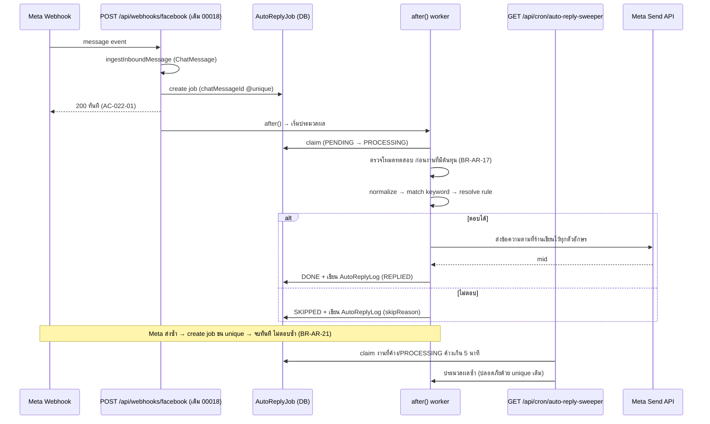
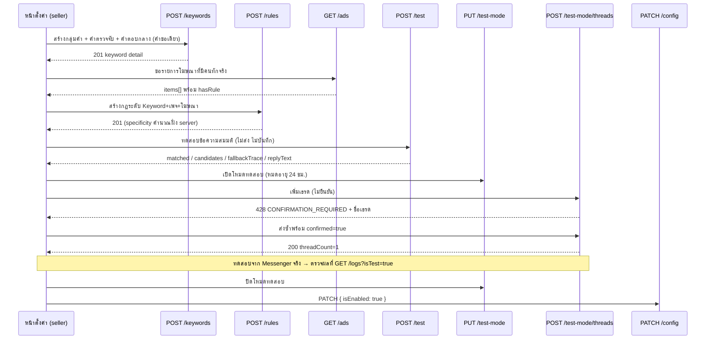

> **โมดูล:** M00023-ChatAutoReply
> **ประเภทเอกสาร:** API Contract
> **เวอร์ชัน:** 1.0
> **วันที่จัดทำ:** 2026-07-29
> **สถานะ:** Draft
> **เจ้าของเอกสาร:** safepay-planner (ดู [[Feature-Docs-Ownership]])

# API Contract: ตอบแชทอัตโนมัติจาก Keyword

---

## 📌 สถานะ ณ 2026-08-02 — ตาราง endpoint ที่ต่างจากโค้ดจริง

ตรวจโดยเทียบรายการ endpoint ในเอกสารนี้กับ `find src/app/api -name route.ts` เมื่อ 2026-08-02
(ไม่ได้เทียบจากความจำ — บทเรียน `feedback_write_docs_from_code_not_memory`)

### ก) เอกสารมี แต่โค้ด **ถูกลบไปแล้ว** (`68c37cd3`) — เรียกแล้วได้ 404

| Endpoint ในเอกสาร | หมายเหตุ |
|---|---|
| `GET/POST /api/shops/auto-reply/keywords/{id}/qna` | คลังคำถามรายกลุ่มคำ — ถูกถอด |
| `PATCH/DELETE /api/shops/auto-reply/keywords/{id}/qna/{qnaId}` | ↑ |
| `POST /api/shops/auto-reply/keywords/{id}/qna/bulk` | ↑ |
| `POST /api/shops/auto-reply/keywords/{id}/qna/import` · `GET …/qna/export` | CSV นำเข้า/ส่งออก (S-16) — ไม่เคยได้ implement แล้วถูกถอดไปพร้อมกัน |
| `GET /api/shops/auto-reply/unanswered` | คิวคำถามที่ตอบไม่ได้ — ถูกถอด |
| `POST /api/shops/auto-reply/unanswered/{id}/convert` · `/dismiss` · `/restore` | ↑ |

### ข) เอกสารมี แต่ **ไม่เคยมีในโค้ดเลย** (เขียนล่วงหน้าแล้วไม่ได้สร้าง หรือเปลี่ยนชื่อไปแล้ว)

| Endpoint ในเอกสาร | ของจริง |
|---|---|
| `PUT /api/shops/auto-reply/test-mode` · `GET/POST/DELETE …/test-mode/threads[/{id}]` | เปลี่ยนรูปเป็น **รายกลุ่มคำ**: `GET/POST /api/shops/auto-reply/keywords/{id}/test-threads` + `DELETE …/test-threads/{conversationId}` |
| `POST /api/shops/auto-reply/keywords/bulk` | ไม่มี |
| `PUT /api/chat/conversations/{id}/auto-reply/context-product` | ไม่มี |
| `POST /api/chat/conversations/{id}/qna-from-message` | ไม่มี |

### ค) โค้ดมี แต่ **เอกสารยังไม่เคยบันทึก** (ของ ChatBot + คลังความรู้ ที่ขึ้น 2026-08-01/02)

| Endpoint จริง | ทำอะไร |
|---|---|
| `GET/PATCH /api/shops/auto-reply/chatbot` | ตั้งค่า ChatBot ระดับร้าน (สถานะ 3 ค่า, ขอบเขต, cooldown, ช่วงเวลา, น้ำเสียง) |
| `GET/POST /api/shops/auto-reply/chatbot/guardrails` · `PATCH/DELETE …/{guardrailId}` | กฎห้ามตอบของ ChatBot (ระดับร้าน) |
| `GET/POST /api/shops/auto-reply/chatbot/test-threads` · `DELETE …/{conversationId}` | allowlist แชทสำหรับโหมดทดสอบของ ChatBot |
| `GET/POST /api/shops/auto-reply/knowledge` · `PATCH/DELETE …/{qnaId}` | **คลังความรู้ระดับร้าน** (มาแทนคลังคำถามรายกลุ่มคำในข้อ ก) |
| `GET/POST /api/shops/auto-reply/keywords/{id}/guardrails` · `PATCH/DELETE …/{guardrailId}` | กฎห้ามตอบรายกลุ่มคำ |
| `GET/POST /api/shops/auto-reply/keywords/{id}/test-threads` · `DELETE …/{conversationId}` | แชททดสอบรายกลุ่มคำ |
| `POST /api/shops/auto-reply/keywords/{id}/duplicate` | คัดลอกกลุ่มคำ |
| `DELETE /api/shops/auto-reply/keywords/{id}/phrases/{phraseId}` | ลบคำตรวจจับรายคำ |

> ⚠️ **`POST /api/shops/auto-reply/simulate` มีจริงและยังใช้อยู่ แต่พฤติกรรมกว้างกว่าที่เอกสารสื่อ** —
> มัน match **ทุกกลุ่มคำของร้าน** ไม่ใช่เฉพาะกลุ่มที่กำลังเปิดดู และ **ไม่เรียก ChatBot/AI เลย**
> (เป็น matcher ล้วน) ดังนั้นผลลัพธ์ `willHandoff: true` **ไม่ได้แปลว่าลูกค้าจะไม่ได้คำตอบ** —
> ในเส้นทางจริง ChatBot จะรับช่วงต่อตรงนั้น

---

---

## 1. Overview

เอกสารนี้กำหนดสัญญาการเชื่อมต่อของ **เฟสที่ 1** ทั้งหมด — ตอบด้วยข้อความสำเร็จรูปที่ร้านเขียนเอง **ไม่มี endpoint ที่เกี่ยวกับ AI เลย** (เลื่อนไปเฟส 2 ตาม PRD §5)

- **Provider:** Next.js 16 App Router — `src/app/api/**` (route handler, nodejs runtime)
- **ผู้บริโภคสัญญา:** หน้าตั้งค่าฝั่งผู้ขาย `(paces)/seller/**` + หน้ากล่องข้อความ `/inbox` + Vercel Cron (server-to-server)
- **Base URL (production):** `https://seller.deepthailand.app`
- **Base URL (development):** `http://seller.deepth.local:4000` (พอร์ตจริงดูจาก dev server ที่ผู้ใช้รัน)
- **Content-Type:** `application/json` ทั้ง request และ response (ยกเว้นไม่มี — ฟีเจอร์นี้ไม่มี binary response)
- **เอกสารต้นทาง:** [[DATABASE]] (🛑 FROZEN CONTRACT) + [[BRD]] — ทุกชื่อฟิลด์ในเอกสารนี้ตรงกับชื่อคอลัมน์ และค่าคงที่ทุกตัวมาจาก DATABASE §3.8 ตรงตัว

### 1.1 กติกาที่ใช้กับทุก endpoint

| หัวข้อ | ข้อกำหนด |
|---|---|
| **shopId** | 🛑 derive จาก session ผ่าน `resolveActiveShopContext` เท่านั้น — **ห้ามรับ `shopId` จาก client ในทุก endpoint** (รวม query string) |
| **Scope ที่ DB** | ทุก query ต้องมี `shopId` ใน `WHERE` — ห้าม `findUnique(id)` แล้วค่อยเทียบ `shopId` ใน JS (memory `feedback_rsc_dal_authz`) |
| **Cache** | ทุก endpoint เป็นข้อมูลรายผู้ใช้ → `export const dynamic = "force-dynamic"` + header `Cache-Control: private, no-store, max-age=0, must-revalidate` (memory `feedback_auth_api_cache_control` — API auth ที่ปล่อย default `public` เคยโดน CDN/เครือข่ายมือถือ cache แล้ว serve ข้ามผู้ใช้จริง) |
| **CSRF** | ครอบด้วย Origin-check กลางของ `guardApi` ใน `src/proxy.ts` (mutation เท่านั้น) — **ยกเว้น `/api/cron/*` ที่ถูก exclude อยู่แล้ว** |
| **Rate limit ฐาน** | per-IP ของ `guardApi` (authenticated 30 คำขอ/นาที) — endpoint ที่มีเพดานเข้มกว่านั้นระบุไว้รายตัว |
| **Idempotency** | ไม่มี `Idempotency-Key` header ที่ใดเลย — ความ idempotent มาจาก unique constraint ที่ DB (`AutoReplyJob.chatMessageId`, `AutoReplyConfig.shopId`, `AutoReplyKeyword(shopId,name)`, `AutoReplyPhrase(keywordId,normalizedPhrase)`, `AutoReplyRule` NULLS NOT DISTINCT) |
| **specificity** | 🛑 ห้ามรับจาก client ทุกกรณี — server คำนวณจากเงื่อนไขที่ส่งมาเสมอ (DATABASE §6 invariant) |
| **PII** | `AutoReplyLog` เก็บข้อความลูกค้าดิบ → ปกปิดที่ server boundary ก่อนคืน (§4.24) |

### 1.2 endpoint เดิมที่ใช้ร่วม (ไม่สร้างใหม่)

หน้าตั้งค่าต้องการรายการเพจและสินค้าเพื่อประกอบฟอร์ม — **ใช้ของเดิม ห้ามสร้าง endpoint ซ้ำ**

| ต้องการ | ใช้ endpoint เดิม |
|---|---|
| รายการเพจที่ร้านเชื่อมไว้ | `GET /api/channels` (feature 00018) |
| รายการสินค้าของร้าน | `GET /api/products` (พร้อม `?q=`) |
| รายการเธรดสำหรับเลือกเข้ารายการทดสอบ | `GET /api/chat/conversations` (feature 00011/00018) |

---

## 2. Authentication & Authorization

| รายการ | ค่า |
|--------|-----|
| **กลไก** | NextAuth.js session cookie (ระบบ login เดิม) |
| **Subdomain** | `seller.*` เท่านั้น |
| **การระบุร้าน** | `resolveActiveShopContext({ user: { id, activeShopId } })` — re-verify membership ทุกครั้ง ไม่เชื่อ JWT เปล่า ๆ |
| **ร้านถูกล็อกแพ็กเกจ** | `activeCtx.locked === true` → **ทุก endpoint ที่เขียนตอบ `403 SHOP_LOCKED`** (อ่านได้ปกติ) |
| **Cron** | `Authorization: Bearer ${CRON_SECRET}` เทียบแบบ exact string เต็ม; `CRON_SECRET` ว่าง/undefined → `401` ทันที (ห้ามปล่อยให้เทียบกับ `Bearer undefined` แล้วผ่าน) |

### 2.1 Authorization Matrix

`role` มาจาก `ActiveShopContext.role`

| กลุ่ม endpoint | OWNER | ADMIN | STAFF |
|---|---|---|---|
| อ่านการตั้งค่า (config / keywords / rules / ads) | ✅ | ✅ | ✅ อ่านอย่างเดียว |
| เขียนการตั้งค่า (config / keywords / phrases / rules / test-mode) | ✅ | ✅ | ❌ `403 FORBIDDEN_ROLE` |
| ทดสอบกฎแบบกรอกเอง (`POST /test`) | ✅ | ✅ | ✅ (ไม่ส่ง ไม่บันทึก จึงไม่ใช่การเขียน) |
| ควบคุมระดับเธรด (เปิด/ปิด/pause/handoff/บริบทสินค้า) | ✅ | ✅ | ✅ (BRD §1.3 — STAFF เป็นผู้รับช่วง จึงต้องคุมเธรดที่ตนดูแลได้) |
| อ่านบันทึกการทำงาน | ✅ | ✅ | ✅ (AC-024-06 — สมาชิกของร้านนั้นเท่านั้น) |
| Cron sweeper | — | — | — (server-to-server เท่านั้น ไม่มี session) |

**การ implement:** `const EDITABLE_ROLES = ["OWNER", "ADMIN"] as const` แล้วส่ง `canEdit` กลับไปให้ UI ตัดสินโหมดอ่านอย่างเดียว — 🛑 **ฝั่ง server ตรวจ role ซ้ำทุกคำขอที่เขียนเสมอ ห้ามเชื่อ `canEdit` ที่ client ส่งกลับมา**

> ✅ **OQ-1 ปิดแล้ว 2026-08-01 (user ตัดสิน) — อ่านย่อหน้านี้ก่อนย่อหน้าเดิมด้านล่าง**
>
> **ไม่เพิ่ม role ใหม่ และไม่ลดสิทธิ์ใคร** — ระบบมี `OWNER` กับ `ADMIN` เท่านั้น ทั้งคู่แก้การตั้งค่าได้
> ทุกที่ในเอกสารชุดนี้ที่เขียนว่า "STAFF อ่านอย่างเดียว" ให้อ่านว่า **ยังไม่มี role อ่านอย่างเดียวในระบบ**
> ผลตามมาที่ต้องยึด:
> - **`FORBIDDEN_ROLE` (403) ไม่มีทางเกิดจาก role** บน endpoint ของฟีเจอร์นี้ — คงรหัสไว้ในตาราง error
>   เพื่อให้ยังถูกต้องถ้าวันหนึ่งมี role อ่านอย่างเดียวเพิ่มเข้ามา แต่ **ห้ามเขียนเทสที่คาดหวังว่าจะเกิดจริง**
> - เทสสิทธิ์ทั้งหมดใช้ **ADMIN** แทน STAFF และเปลี่ยนสิ่งที่พิสูจน์เป็น "ADMIN แก้ได้จริง"
> - **403 ที่เกิดจริงได้คือ `SHOP_LOCKED`** — และ **implement จริงแล้ว 2026-08-01** ใน `forbidIfReadOnly()`
>   (`src/lib/auto-reply-route-context.ts`) ซึ่งเดิมไม่เคยอ่าน `activeCtx.locked` เลยทั้งที่เอกสารอ้างมาตลอด
>   มีผลกับ 11 endpoint เดิมที่เรียก helper นี้อยู่แล้ว + endpoint ใหม่ทุกตัวของ phase `00023-qna`
>
> ---
>
> <details><summary>ข้อความเดิมของ OQ-1 (เก็บไว้เป็นบันทึกที่มา)</summary>
>
> 🛑 **OPEN QUESTION OQ-1 (ต้องให้ Controller ตัดสิน):** `ShopMember.role` ใน schema ปัจจุบันมีแค่ `"OWNER" | "ADMIN"` และ `ActiveShopContext.role` ก็ประกาศเป็น `"OWNER" | "ADMIN"` เท่านั้น — **ไม่มีค่า `STAFF` อยู่จริงในระบบ** พนักงานที่ถูกเชิญผ่าน feature 00012 จึงกลายเป็น `ADMIN` และ **แก้การตั้งค่าตอบอัตโนมัติได้** ซึ่งขัด AC-004-02/AC-004-03 โดยตรง ทางเลือก: (ก) เพิ่มค่า `STAFF` ใน `ShopMember.role` (คนละ feature — กระทบ 00012) (ข) ยอมรับว่าเฟสนี้ ADMIN = แก้ได้ แล้วแก้ BRD ให้ตรงความจริง เอกสารนี้เขียนตาม (ข) ไว้ก่อน โดยวางโครง `EDITABLE_ROLES` ให้เพิ่ม `STAFF` เข้ามาเป็น read-only ได้ทันทีเมื่อเลือก (ก)
>
> </details>

---

## 3. Endpoint List

### 3.1 การตั้งค่าระดับร้าน

| # | Method | Path | คำอธิบาย |
|---|--------|------|----------|
| 4.1 | `GET` | `/api/shops/auto-reply/config` | อ่านการตั้งค่าระดับร้าน |
| 4.2 | `PATCH` | `/api/shops/auto-reply/config` | แก้การตั้งค่าระดับร้าน (partial) |

### 3.2 กลุ่มคำ (Keyword)

| # | Method | Path | คำอธิบาย |
|---|--------|------|----------|
| 4.3 | `GET` | `/api/shops/auto-reply/keywords` | รายการกลุ่มคำ (ค้นหา/กรอง/เรียง/แบ่งหน้า) |
| 4.4 | `POST` | `/api/shops/auto-reply/keywords` | สร้างกลุ่มคำ (พร้อมคำตรวจจับ + คำตอบกลางในคำขอเดียว) |
| 4.5 | `GET` | `/api/shops/auto-reply/keywords/{id}` | รายละเอียดกลุ่มคำ + คำตรวจจับ + กฎ |
| 4.6 | `PATCH` | `/api/shops/auto-reply/keywords/{id}` | แก้กลุ่มคำ |
| 4.7 | `DELETE` | `/api/shops/auto-reply/keywords/{id}` | ลบกลุ่มคำ (cascade คำตรวจจับ + กฎ) |
| 4.8 | `POST` | `/api/shops/auto-reply/keywords/bulk` | เปิด/ปิดหลายกลุ่มพร้อมกัน |
| 4.9 | `POST` | `/api/shops/auto-reply/keywords/{id}/duplicate` | ทำสำเนากลุ่มคำ (สำเนาปิดไว้เสมอ) |

### 3.3 คำตรวจจับ (Trigger Phrase)

| # | Method | Path | คำอธิบาย |
|---|--------|------|----------|
| 4.10 | `GET` | `/api/shops/auto-reply/keywords/{id}/phrases` | รายการคำตรวจจับของกลุ่ม + คำเตือนคำซ้ำข้ามกลุ่ม |
| 4.11 | `POST` | `/api/shops/auto-reply/keywords/{id}/phrases` | เพิ่มคำตรวจจับ (ทีละหลายคำได้) |
| 4.12 | `DELETE` | `/api/shops/auto-reply/keywords/{id}/phrases/{phraseId}` | ลบคำตรวจจับทีละคำ |

### 3.4 กฎคำตอบ (Reply Rule) — ครอบทุกระดับในชุดเดียว

| # | Method | Path | คำอธิบาย |
|---|--------|------|----------|
| 4.13 | `GET` | `/api/shops/auto-reply/rules` | รายการกฎ (กรองตามกลุ่มคำ/เพจ/โฆษณา/สินค้า/ระดับ) |
| 4.14 | `POST` | `/api/shops/auto-reply/rules` | สร้างกฎ (ทุกระดับใช้ endpoint เดียวกัน) |
| 4.15 | `GET` | `/api/shops/auto-reply/rules/{id}` | รายละเอียดกฎ |
| 4.16 | `PATCH` | `/api/shops/auto-reply/rules/{id}` | แก้กฎ (แก้เงื่อนไข = คำนวณ `specificity` ใหม่) |
| 4.17 | `DELETE` | `/api/shops/auto-reply/rules/{id}` | ลบกฎ |

### 3.5 ทดสอบ

| # | Method | Path | คำอธิบาย |
|---|--------|------|----------|
| 4.18 | `POST` | `/api/shops/auto-reply/simulate` | ทดสอบกฎแบบกรอกเอง — **ไม่ส่งจริง ไม่บันทึก** (FR-020) |
| 4.19 | `PUT` | `/api/shops/auto-reply/test-mode` | เปิด/ปิดโหมดทดสอบระดับร้าน |
| 4.20 | `GET` | `/api/shops/auto-reply/test-mode/threads` | รายการเธรดใน allowlist |
| 4.21 | `POST` | `/api/shops/auto-reply/test-mode/threads` | เพิ่มเธรดเข้า allowlist (ต้องยืนยัน) |
| 4.22 | `DELETE` | `/api/shops/auto-reply/test-mode/threads/{conversationId}` | ถอดเธรดออกจาก allowlist |

### 3.6 ควบคุมระดับเธรด

| # | Method | Path | คำอธิบาย |
|---|--------|------|----------|
| 4.23 | `GET` | `/api/chat/conversations/{id}/auto-reply` | สถานะ auto-reply ของเธรด |
| 4.24 | `PATCH` | `/api/chat/conversations/{id}/auto-reply` | เปิด/ปิด/หยุด/กลับมา/ส่งต่อพนักงาน |
| 4.25 | `PUT` | `/api/chat/conversations/{id}/auto-reply/context-product` | ตั้ง/ล้างบริบทสินค้าของเธรด |

### 3.7 บันทึก + โฆษณา + งานเบื้องหลัง

| # | Method | Path | คำอธิบาย |
|---|--------|------|----------|
| 4.26 | `GET` | `/api/shops/auto-reply/logs` | ค้นหาบันทึกการทำงาน (filter ครบตาม AC-024-03) |
| 4.27 | `GET` | `/api/shops/auto-reply/logs/{id}` | รายละเอียดบันทึก 1 รายการ (`matchTrace` เต็ม) |
| 4.28 | `GET` | `/api/shops/auto-reply/ads` | โฆษณาที่เคยมีลูกค้าทักเข้ามาจริง (AC-007-05) |
| 4.29 | `GET` | `/api/cron/auto-reply-sweeper` | Cron กวาดงานค้าง + ปิดโหมดทดสอบหมดอายุ + ลบข้อมูลเก่า |

### 3.8 คลังคำถาม-คำตอบ (QnA) — phase `00023-qna`

| # | Method | Path | คำอธิบาย |
|---|--------|------|----------|
| 4.30 | `GET` | `/api/shops/auto-reply/keywords/{id}/qna` | รายการข้อในคลังของกลุ่ม (ค้นหา + กรอง 4 แบบ) |
| 4.31 | `POST` | `/api/shops/auto-reply/keywords/{id}/qna` | เพิ่มข้อในคลัง |
| 4.32 | `PATCH` | `/api/shops/auto-reply/keywords/{id}/qna/{qnaId}` | แก้ข้อในคลัง |
| 4.33 | `DELETE` | `/api/shops/auto-reply/keywords/{id}/qna/{qnaId}` | ลบข้อในคลัง |
| 4.34 | `POST` | `/api/shops/auto-reply/keywords/{id}/qna/bulk` | เปิด/ปิด/ย้ายกลุ่ม/ลบหลายข้อ (คืน partial result) |
| 4.35 | `POST` | `/api/shops/auto-reply/keywords/{id}/qna/import` | นำเข้า CSV (rows ที่ client parse แล้ว) |
| 4.36 | `GET` | `/api/shops/auto-reply/keywords/{id}/qna/export` | ส่งออกเป็นไฟล์ CSV UTF-8 BOM |

### 3.9 คิวคำถามที่ตอบไม่ได้

| # | Method | Path | คำอธิบาย |
|---|--------|------|----------|
| 4.37 | `GET` | `/api/shops/auto-reply/unanswered` | คิวของร้าน (กรอง PENDING/DISMISSED) |
| 4.38 | `POST` | `/api/shops/auto-reply/unanswered/{id}/dismiss` | กดข้าม (สถานะถาวร ไม่ลบแถว) |
| 4.39 | `POST` | `/api/shops/auto-reply/unanswered/{id}/restore` | ยกเลิกการข้าม (undo — round2 decision ข้อ 1) |
| 4.40 | `POST` | `/api/shops/auto-reply/unanswered/{id}/convert` | กรอกคำตอบ → สร้าง QnA + ปิดคิว (ทรานแซกชันเดียว) |

### 3.10 สร้างจากห้องแชท

| # | Method | Path | คำอธิบาย |
|---|--------|------|----------|
| 4.41 | `POST` | `/api/chat/conversations/{id}/qna-from-message` | mini action ใต้บับเบิลลูกค้า — สร้าง QnA พร้อมปิดคิวถ้ามี |

**รวมเพิ่ม 12 endpoint (29 + 12 = 41)** — endpoint ที่แก้ของเดิม (ไม่นับเพิ่ม) ดู §3.11

### 3.11 ส่วนที่แก้ของเดิม (ไม่ใช่ endpoint ใหม่)

| Endpoint | แก้อะไร |
|---|---|
| `POST /api/shops/auto-reply/simulate` (§4.18 เดิม) | เพิ่ม `qna`/`matchedVia` ใน response — ดู §4.18-ext |
| `GET /api/chat/conversations` (นอกฟีเจอร์นี้ — feature 00011/00018) | เพิ่ม `lastMessageAutoReplyKind`/`lastMessageIsAiEnhanced` ต่อ item — ดู §4.42 🛑 **endpoint นี้ไม่ได้อยู่ใน API.md ของฟีเจอร์นี้จริง ๆ — ดูข้อขัดแย้งท้ายข้อความ** |

**รวม 41 endpoint** (29 ของ base feature + 12 ของ phase `00023-qna` ใน §3.8-§3.10) — ไม่มี endpoint ที่เกี่ยวกับ AI (เฟส 2)

---

## 4. Endpoint Detail

### 4.1 `GET /api/shops/auto-reply/config`

อ่านการตั้งค่าระดับร้านของร้านที่ session กำลังใช้งาน — ถ้าร้านยังไม่เคยตั้งค่า **คืนค่าเริ่มต้นตาม DATABASE §3.1 โดยไม่สร้างแถวใน DB** (pattern เดียวกับ `GET /api/shops/ai-settings`)

**Request** — ไม่มี parameter (ร้านมาจาก session)

**Response — Success (200)**

| ฟิลด์ | ชนิด | คำอธิบาย |
|-------|------|----------|
| `isEnabled` | `boolean` | สวิตช์หลัก — ค่าเริ่มต้น `false` (AC-015-01) |
| `testMode` | `boolean` | อยู่ในโหมดทดสอบหรือไม่ (แก้ที่ §4.19 เท่านั้น) |
| `testModeExpiresAt` | `string \| null` | ISO — เวลาที่โหมดทดสอบหมดอายุเอง |
| `testModeThreadCount` | `int` | จำนวนเธรดใน allowlist — ใช้กับแถบสถานะ (AC-021-07) |
| `humanTakeoverPauseMode` | `"30M" \| "2H" \| "MANUAL" \| "UNTIL_RESOLVED"` | ค่าเริ่มต้น `"2H"` |
| `keywordCooldownSec` | `int` | ค่าเริ่มต้น `300` |
| `maxRepliesPerConversation` | `int` | ค่าเริ่มต้น `10` |
| `adsContextMode` | `"UNTIL_RESOLVED" \| "HOURS" \| "UNTIL_NEW_PRODUCT"` | ค่าเริ่มต้น `"UNTIL_RESOLVED"` |
| `adsContextHours` | `int \| null` | มีค่าเมื่อ `adsContextMode = "HOURS"` เท่านั้น |
| `handoffPhrases` | `string[]` | คำที่ถือเป็นสัญญาณส่งต่อ (AC-019-02) |
| `canEdit` | `boolean` | `true` เมื่อ role ∈ OWNER/ADMIN และร้านไม่ถูกล็อก |
| `updatedAt` | `string \| null` | ISO — `null` ถ้ายังไม่เคยตั้ง |
| `updatedByUserId` | `string \| null` | ผู้แก้ล่าสุด (AC-004-05) |

**Response — Error:** `UNAUTHORIZED` (401), `SHOP_NOT_FOUND` (404), `INTERNAL_ERROR` (500)

```json
// Response 200 — ร้านที่ยังไม่เคยตั้งค่า
{
  "isEnabled": false,
  "testMode": false,
  "testModeExpiresAt": null,
  "testModeThreadCount": 0,
  "humanTakeoverPauseMode": "2H",
  "keywordCooldownSec": 300,
  "maxRepliesPerConversation": 10,
  "adsContextMode": "UNTIL_RESOLVED",
  "adsContextHours": null,
  "handoffPhrases": [],
  "canEdit": true,
  "updatedAt": null,
  "updatedByUserId": null
}
```

---

### 4.2 `PATCH /api/shops/auto-reply/config`

แก้การตั้งค่าระดับร้าน — **partial update** (ส่งเฉพาะฟิลด์ที่ต้องการเปลี่ยน, ฟิลด์ที่ไม่ส่ง = ไม่แตะ) ใช้ `upsert` บน `shopId` ที่ `@unique` จึงไม่มี race

🛑 `testMode` / `testModeExpiresAt` / `testModeEnabledByUserId` **ไม่รับที่ endpoint นี้** — การเปิดโหมดทดสอบมีผลข้างเคียงที่ต้องยืนยัน (BR-AR-19) จึงแยกไป §4.19 · ส่งมาที่นี่ = `400 TEST_MODE_READONLY_HERE`

**Request Body (Valibot)**

```ts
export const AutoReplyConfigPatchSchema = v.pipe(
  v.object({
    isEnabled: v.optional(v.boolean()),
    humanTakeoverPauseMode: v.optional(
      v.picklist(["30M", "2H", "MANUAL", "UNTIL_RESOLVED"], "โหมดหยุดเมื่อพนักงานตอบไม่ถูกต้อง"),
    ),
    keywordCooldownSec: v.optional(
      v.pipe(v.number(), v.integer(), v.minValue(0, "ระยะพักต้องไม่ติดลบ"), v.maxValue(86400, "ระยะพักต้องไม่เกิน 24 ชั่วโมง")),
    ),
    maxRepliesPerConversation: v.optional(
      v.pipe(v.number(), v.integer(), v.minValue(1, "ต้องตอบได้อย่างน้อย 1 ครั้งต่อเธรด"), v.maxValue(100, "จำกัดสูงสุด 100 ครั้งต่อเธรด")),
    ),
    adsContextMode: v.optional(v.picklist(["UNTIL_RESOLVED", "HOURS", "UNTIL_NEW_PRODUCT"], "โหมดอายุบริบทโฆษณาไม่ถูกต้อง")),
    adsContextHours: v.optional(
      v.nullable(v.pipe(v.number(), v.integer(), v.minValue(1, "อายุบริบทต้องอย่างน้อย 1 ชั่วโมง"), v.maxValue(720, "อายุบริบทต้องไม่เกิน 720 ชั่วโมง"))),
    ),
    handoffPhrases: v.optional(
      v.pipe(
        v.array(v.pipe(v.string(), v.trim(), v.minLength(1, "คำสัญญาณส่งต่อต้องไม่เป็นค่าว่าง"), v.maxLength(100))),
        v.maxLength(50, "คำสัญญาณส่งต่อได้ไม่เกิน 50 คำ"),
      ),
    ),
  }),
  // cross-field: HOURS ต้องมีชั่วโมง / โหมดอื่นต้องไม่มี — ตรวจที่นี่ ไม่ใช่ที่ service
  v.check(
    (o) => !(o.adsContextMode === "HOURS" && (o.adsContextHours === null || o.adsContextHours === undefined)),
    "เลือกโหมด “ใช้ภายในกี่ชั่วโมง” แล้วต้องระบุจำนวนชั่วโมงด้วย",
  ),
);
```

**พฤติกรรมเพิ่มเติม**
- `handoffPhrases` ถูก trim + dedupe ด้วยฟังก์ชัน normalize **ตัวเดียวกับที่ใช้กับข้อความลูกค้า** ก่อนบันทึก
- ตั้ง `adsContextMode` เป็นค่าอื่นที่ไม่ใช่ `HOURS` → service เขียน `adsContextHours = null` ให้เองเสมอ (กันค่าค้าง)
- `updatedByUserId` เขียนจาก session — ไม่รับจาก body

**Response — Success (200):** รูปเดียวกับ §4.1 (คืนค่าหลังบันทึก เพื่อให้ client sync ได้โดยไม่ต้อง GET ซ้ำ)

**Response — Error:** `UNAUTHORIZED` (401), `FORBIDDEN_ROLE` (403), `SHOP_LOCKED` (403), `SHOP_NOT_FOUND` (404), `INVALID_INPUT` (400), `ADS_CONTEXT_HOURS_REQUIRED` (400), `TEST_MODE_READONLY_HERE` (400), `INTERNAL_ERROR` (500)

**Audit:** `AutoReplyConfig.updatedByUserId` + `updatedAt`

```json
// Request
{ "isEnabled": true, "keywordCooldownSec": 600, "handoffPhrases": ["คุยกับแอดมิน", "คืนเงิน", "ของยังไม่ได้"] }

// Response 200
{
  "isEnabled": true, "testMode": false, "testModeExpiresAt": null, "testModeThreadCount": 0,
  "humanTakeoverPauseMode": "2H", "keywordCooldownSec": 600, "maxRepliesPerConversation": 10,
  "adsContextMode": "UNTIL_RESOLVED", "adsContextHours": null,
  "handoffPhrases": ["คุยกับแอดมิน", "คืนเงิน", "ของยังไม่ได้"],
  "canEdit": true, "updatedAt": "2026-07-29T04:10:00.000Z", "updatedByUserId": "e2f1..."
}
```

---

### 4.3 `GET /api/shops/auto-reply/keywords`

รายการกลุ่มคำของร้าน — ข้อมูลครบตาม AC-001-06 และรองรับค้นหา/กรอง/เรียงตาม AC-001-07

**Request**

| ส่วน | ฟิลด์ | ชนิด | บังคับ | คำอธิบาย |
|------|-------|------|--------|----------|
| Query | `q` | `string` | no | ค้นในชื่อกลุ่ม **และ** คำตรวจจับ (เทียบกับ `normalizedPhrase`) |
| Query | `status` | `"all" \| "active" \| "inactive"` | no | ค่าเริ่มต้น `all` |
| Query | `sort` | `"priority" \| "name" \| "updatedAt"` | no | ค่าเริ่มต้น `priority` |
| Query | `order` | `"asc" \| "desc"` | no | ค่าเริ่มต้น `desc` (priority มากก่อน = ลำดับที่ระบบใช้จริง) |
| Query | `page` | `int ≥ 1` | no | ค่าเริ่มต้น `1` |
| Query | `pageSize` | `int 1..100` | no | ค่าเริ่มต้น `20` |

**Response — Success (200)**

| ฟิลด์ | ชนิด | คำอธิบาย |
|-------|------|----------|
| `items[]` | `array` | ดูตัวอย่าง |
| `items[].ruleCount` | `object` | แยกจำนวนกฎตามระดับ — ให้ร้านเห็นว่าตั้งค่าเฉพาะไว้กี่จุดโดยไม่ต้องเปิดเข้าไปดู |
| `meta` | `object` | `{ page, pageSize, total, totalPages }` |
| `canEdit` | `boolean` | ใช้ตัดสินโหมดอ่านอย่างเดียวของทั้งหน้า |

**Response — Error:** `UNAUTHORIZED` (401), `SHOP_NOT_FOUND` (404), `INVALID_INPUT` (400)

```json
// Response 200
{
  "items": [
    {
      "id": "a1b2c3d4-0000-4000-8000-000000000001",
      "name": "สนใจสินค้า",
      "matchType": "CONTAINS",
      "priority": 100,
      "isActive": true,
      "phraseCount": 7,
      "ruleCount": { "total": 5, "keywordDefault": 1, "page": 2, "ad": 2, "product": 0 },
      "hasReply": true,
      "updatedAt": "2026-07-29T03:00:00.000Z",
      "updatedByUserId": "e2f1..."
    }
  ],
  "meta": { "page": 1, "pageSize": 20, "total": 3, "totalPages": 1 },
  "canEdit": true
}
```

---

### 4.4 `POST /api/shops/auto-reply/keywords`

สร้างกลุ่มคำ — รับ `phrases` และ `defaultReplyText` มาในคำขอเดียวได้ เพื่อให้ **invariant "กลุ่มที่เปิดใช้งานต้องมีคำตรวจจับ ≥1 และมีคำตอบ ≥1 ระดับ" (AC-002-02 + AC-005-02 / BR-AR-28) บังคับได้ใน transaction เดียว** ถ้าแยกเป็น 3 คำขอจะมีช่วงที่กลุ่มเปิดอยู่แต่ยังไม่มีคำตอบ ซึ่งเป็นสภาวะที่สเปกห้าม

**Request Body (Valibot)**

```ts
export const AutoReplyKeywordCreateSchema = v.pipe(
  v.object({
    name: v.pipe(v.string(), v.trim(), v.minLength(1, "กรุณาตั้งชื่อกลุ่มคำ"), v.maxLength(80, "ชื่อกลุ่มคำต้องไม่เกิน 80 ตัวอักษร")),
    matchType: v.optional(v.picklist(["EXACT", "CONTAINS", "STARTS_WITH"], "รูปแบบการตรวจจับไม่ถูกต้อง"), "CONTAINS"),
    priority: v.optional(v.pipe(v.number(), v.integer(), v.minValue(0), v.maxValue(1000)), 100),
    isActive: v.optional(v.boolean(), true),
    phrases: v.optional(
      v.pipe(
        v.array(v.pipe(v.string(), v.trim(), v.minLength(1, "คำตรวจจับต้องไม่เป็นค่าว่าง"), v.maxLength(200))),
        v.maxLength(100, "คำตรวจจับได้ไม่เกิน 100 คำต่อกลุ่ม"),
      ),
      [],
    ),
    // ส่งมา = สร้าง AutoReplyRule ระดับ "คำตอบกลางของกลุ่ม" (keywordId set, เงื่อนไขอื่น null, specificity 0)
    defaultReplyText: v.optional(v.pipe(v.string(), v.trim(), v.maxLength(2000, "คำตอบต้องไม่เกิน 2,000 ตัวอักษร"))),
  }),
  // BR-AR-28: เปิดใช้งาน = ต้องมีทั้งคำตรวจจับและคำตอบ
  v.check(
    (o) => !o.isActive || ((o.phrases?.length ?? 0) > 0 && (o.defaultReplyText?.length ?? 0) > 0),
    "กลุ่มคำที่เปิดใช้งานต้องมีคำตรวจจับอย่างน้อย 1 คำ และมีคำตอบอย่างน้อย 1 ชุด",
  ),
);
```

**พฤติกรรม**
- `phrases` ที่ normalize แล้วซ้ำกันเองภายในคำขอเดียว → **รวมเป็นคำเดียวเงียบ ๆ** และรายงานกลับใน `mergedPhrases` (AC-002-03 อนุญาต "ปฏิเสธหรือรวมเป็นคำเดียว" — เลือกรวมเพราะเป็นการวางคำจากรายการยาว การ 400 ทั้งคำขอเพราะซ้ำ 1 คำคือ UX ที่แย่)
- คำที่ซ้ำกับ **กลุ่มอื่นที่เปิดใช้งานอยู่** → `warnings[]` (ไม่บล็อก — AC-002-04)
- `defaultReplyText` ที่เป็นช่องว่างล้วน → ถือว่าไม่มีคำตอบ (BR-AR-29) → ตกที่ `v.check` ข้างบนถ้า `isActive = true`

**Response — Success (201):** รูปเดียวกับ §4.5 (keyword detail) + `mergedPhrases: string[]`

**Response — Error:** `UNAUTHORIZED` (401), `FORBIDDEN_ROLE` (403), `SHOP_LOCKED` (403), `SHOP_NOT_FOUND` (404), `INVALID_INPUT` (400), `KEYWORD_INCOMPLETE` (422), `KEYWORD_NAME_DUPLICATE` (409)

**Idempotency:** `@@unique([shopId, name])` — ส่งซ้ำได้ `409` ไม่เกิดแถวซ้ำ

**Audit:** `createdByUserId` + `updatedByUserId` จาก session

```json
// Request
{
  "name": "สนใจสินค้า",
  "matchType": "CONTAINS",
  "priority": 100,
  "isActive": true,
  "phrases": ["สนใจ", "สนใจครับ", "สนใจค่ะ", "ขอรายละเอียด", "อยากสั่ง"],
  "defaultReplyText": "สนใจสินค้ารายการไหนคะ ส่งรูปหรือชื่อสินค้าเข้ามาได้เลยค่ะ"
}

// Response 201
{
  "id": "a1b2c3d4-0000-4000-8000-000000000001",
  "name": "สนใจสินค้า", "matchType": "CONTAINS", "priority": 100, "isActive": true,
  "phrases": [
    { "id": "p-1", "phrase": "สนใจ", "normalizedPhrase": "สนใจ", "createdAt": "2026-07-29T04:20:00.000Z" }
  ],
  "rules": [
    { "id": "r-1", "resolutionLevel": "KEYWORD_DEFAULT", "specificity": 0, "shopChannelId": null, "adId": null,
      "productId": null, "replyText": "สนใจสินค้ารายการไหนคะ...", "isActive": true }
  ],
  "mergedPhrases": [],
  "warnings": [],
  "createdAt": "2026-07-29T04:20:00.000Z",
  "updatedAt": "2026-07-29T04:20:00.000Z",
  "canEdit": true
}
```

---

### 4.5 `GET /api/shops/auto-reply/keywords/{id}`

**Request:** Path param `id` — uuid, ต้องเป็นกลุ่มคำของร้านที่ active

**Response — Success (200)**

| ฟิลด์ | ชนิด | คำอธิบาย |
|-------|------|----------|
| `id` `name` `matchType` `priority` `isActive` | — | ตามคอลัมน์ |
| `phrases[]` | `array` | `{ id, phrase, normalizedPhrase, createdAt }` |
| `rules[]` | `array` | กฎทั้งหมดของกลุ่ม เรียง `specificity` มาก→น้อย พร้อมชื่อเพจ/สินค้าที่ denormalize มาแสดง |
| `warnings[]` | `array` | `{ code: "PHRASE_OVERLAP", phrase, conflictKeywordId, conflictKeywordName }` (AC-002-04) |
| `canEdit` | `boolean` | |

**Response — Error:** `UNAUTHORIZED` (401), `INVALID_ID` (400), `KEYWORD_NOT_FOUND` (404 — รวมกรณีเป็นของร้านอื่น ไม่แยกเพื่อไม่ leak การมีอยู่, AC-001-05)

---

### 4.6 `PATCH /api/shops/auto-reply/keywords/{id}`

แก้เฉพาะคุณสมบัติของกลุ่ม — คำตรวจจับใช้ §4.11/§4.12, คำตอบใช้ §4.14/§4.16

**Request Body (Valibot)**

```ts
export const AutoReplyKeywordPatchSchema = v.object({
  name: v.optional(v.pipe(v.string(), v.trim(), v.minLength(1), v.maxLength(80))),
  matchType: v.optional(v.picklist(["EXACT", "CONTAINS", "STARTS_WITH"])),
  priority: v.optional(v.pipe(v.number(), v.integer(), v.minValue(0), v.maxValue(1000))),
  isActive: v.optional(v.boolean()),
});
```

**พฤติกรรม:** `isActive: true` → service ตรวจก่อนบันทึกว่ากลุ่มมี `phrase ≥ 1` **และ** มีกฎที่ `replyText` ไม่ว่าง ≥ 1 → ไม่ผ่าน = `422 KEYWORD_INCOMPLETE` พร้อม `details.missing: ["phrases"] | ["reply"] | ["phrases","reply"]` เพื่อให้ UI ชี้ช่องที่ขาดได้

**Response:** 200 = keyword detail (§4.5)

**Error:** `UNAUTHORIZED` (401), `FORBIDDEN_ROLE` (403), `SHOP_LOCKED` (403), `INVALID_ID` (400), `INVALID_INPUT` (400), `KEYWORD_NOT_FOUND` (404), `KEYWORD_NAME_DUPLICATE` (409), `KEYWORD_INCOMPLETE` (422)

**Audit:** `updatedByUserId` + `updatedAt`

---

### 4.7 `DELETE /api/shops/auto-reply/keywords/{id}`

ลบกลุ่มคำ — `AutoReplyPhrase` และ `AutoReplyRule` ของกลุ่มถูกลบตาม `onDelete: Cascade`
🛑 `AutoReplyLog.keywordId` เป็น `SetNull` → **บันทึกย้อนหลังยังอยู่ครบ** แต่ช่องกลุ่มคำจะว่าง — UI ต้องเตือนเรื่องนี้ในกล่องยืนยันก่อนลบ

**Response — Success (200)**

```json
{ "ok": true, "deleted": { "phrases": 7, "rules": 5 } }
```

คืนจำนวนที่ถูกลบเพื่อให้ UI ยืนยันสิ่งที่หายไปได้จริง (ไม่ลบเงียบ)

**Error:** `UNAUTHORIZED` (401), `FORBIDDEN_ROLE` (403), `SHOP_LOCKED` (403), `INVALID_ID` (400), `KEYWORD_NOT_FOUND` (404)

---

### 4.8 `POST /api/shops/auto-reply/keywords/bulk`

เปิด/ปิดหลายกลุ่มพร้อมกัน — **ไม่รองรับ bulk delete** โดยเจตนา (การลบเป็น cascade ที่ย้อนกลับไม่ได้ ต้องยืนยันทีละรายการพร้อมเห็นจำนวนกฎที่จะหาย)

```ts
export const AutoReplyKeywordBulkSchema = v.object({
  action: v.picklist(["enable", "disable"], "คำสั่งไม่ถูกต้อง"),
  ids: v.pipe(
    v.array(v.pipe(v.string(), v.uuid())),
    v.minLength(1, "กรุณาเลือกอย่างน้อย 1 กลุ่มคำ"),
    v.maxLength(100, "เลือกได้ครั้งละไม่เกิน 100 กลุ่ม"),
  ),
});
```

**พฤติกรรม:** `enable` ตรวจ invariant BR-AR-28 รายกลุ่ม — กลุ่มที่ไม่ผ่านถูก **ข้าม ไม่ใช่ทำให้ทั้งชุดล้มเหลว** และต้องรายงานกลับทุกรายการที่ข้าม (ห้ามข้ามเงียบ)

**Response — Success (200)**

```json
{
  "updated": 2,
  "skipped": [
    { "id": "kw-3", "code": "KEYWORD_INCOMPLETE", "message": "กลุ่ม “ถามส่งฟรี” ยังไม่มีคำตอบ จึงเปิดใช้งานไม่ได้" }
  ]
}
```

**Error:** `UNAUTHORIZED` (401), `FORBIDDEN_ROLE` (403), `SHOP_LOCKED` (403), `INVALID_INPUT` (400), `BULK_TOO_LARGE` (400)

---

### 4.9 `POST /api/shops/auto-reply/keywords/{id}/duplicate`

ทำสำเนากลุ่มคำพร้อมคำตรวจจับและกฎทั้งหมด (AC-001-08)

**พฤติกรรม**
- 🛑 สำเนามี `isActive = false` **เสมอ** ไม่ว่าต้นฉบับจะเปิดอยู่หรือไม่ — สำเนาที่เปิดทันทีจะแย่ง match กับต้นฉบับโดยที่ร้านยังไม่ได้แก้อะไรเลย
- ชื่อ = `"{ชื่อเดิม} (สำเนา)"` — ถ้าชนอีกให้เติมเลขไล่ขึ้น `"(สำเนา 2)"`, `"(สำเนา 3)"` จนกว่าจะว่าง (ไม่คืน 409 เพราะปุ่มนี้ผู้ใช้ไม่ได้ตั้งชื่อเอง)
- กฎถูกคัดลอกพร้อมเงื่อนไขเดิมและ `specificity` คำนวณใหม่ (ไม่คัดลอกค่าเก่ามาดื้อ ๆ)
- `createdByUserId` = ผู้กดสำเนา ไม่ใช่ผู้สร้างต้นฉบับ

**Response:** `201` = keyword detail (§4.5)

**Error:** `UNAUTHORIZED` (401), `FORBIDDEN_ROLE` (403), `SHOP_LOCKED` (403), `INVALID_ID` (400), `KEYWORD_NOT_FOUND` (404)

---

### 4.10 `GET /api/shops/auto-reply/keywords/{id}/phrases`

**Response — Success (200)**

```json
{
  "items": [
    { "id": "p-1", "phrase": "สนใจ", "normalizedPhrase": "สนใจ", "createdAt": "2026-07-29T04:20:00.000Z" }
  ],
  "warnings": [
    { "code": "PHRASE_OVERLAP", "phrase": "สนใจ", "conflictKeywordId": "kw-9", "conflictKeywordName": "ถามราคา" }
  ],
  "canEdit": true
}
```

**Error:** `UNAUTHORIZED` (401), `INVALID_ID` (400), `KEYWORD_NOT_FOUND` (404)

---

### 4.11 `POST /api/shops/auto-reply/keywords/{id}/phrases`

เพิ่มคำตรวจจับ — รับทีละหลายคำ (วางจากรายการยาวได้)

```ts
export const AutoReplyPhraseCreateSchema = v.object({
  phrases: v.pipe(
    v.array(v.pipe(v.string(), v.trim(), v.minLength(1, "คำตรวจจับต้องไม่เป็นค่าว่าง"), v.maxLength(200))),
    v.minLength(1, "กรุณาระบุคำตรวจจับอย่างน้อย 1 คำ"),
    v.maxLength(100, "เพิ่มได้ครั้งละไม่เกิน 100 คำ"),
  ),
});
```

**พฤติกรรม**
- normalize ด้วยฟังก์ชัน **ตัวเดียวกับที่ใช้กับข้อความลูกค้า** แล้วเขียนลง `normalizedPhrase` (DATABASE §3.3 — ถ้าใช้คนละตัวเมื่อไหร่ ระบบจะ match ไม่ตรงแบบหาสาเหตุยากมาก)
- คำที่ `normalizedPhrase` ซ้ำกับที่มีอยู่ในกลุ่มแล้ว → ไม่เพิ่ม แต่รายงานใน `duplicates[]`
- ถ้า **ไม่มีคำใดถูกเพิ่มเลย** → `409 PHRASE_DUPLICATE`
- กลุ่มมีคำได้สูงสุด 100 คำ (รวมของเดิม) → เกิน = `422 PHRASE_LIMIT`

**Response — Success (201)**

```json
{
  "added": [{ "id": "p-8", "phrase": "สนใจจ้า", "normalizedPhrase": "สนใจจา", "createdAt": "..." }],
  "duplicates": ["สนใจ"],
  "warnings": [{ "code": "PHRASE_OVERLAP", "phrase": "สนใจจ้า", "conflictKeywordId": "kw-9", "conflictKeywordName": "ถามราคา" }]
}
```

**Error:** `UNAUTHORIZED` (401), `FORBIDDEN_ROLE` (403), `SHOP_LOCKED` (403), `INVALID_ID` (400), `INVALID_INPUT` (400), `KEYWORD_NOT_FOUND` (404), `PHRASE_DUPLICATE` (409), `PHRASE_LIMIT` (422)

---

### 4.12 `DELETE /api/shops/auto-reply/keywords/{id}/phrases/{phraseId}`

🛑 ลบคำ **สุดท้าย** ของกลุ่มที่ `isActive = true` → `422 PHRASE_REQUIRED` "กลุ่มคำที่เปิดใช้งานต้องมีคำตรวจจับอย่างน้อย 1 คำ — ปิดกลุ่มก่อนหรือเพิ่มคำอื่นแทน" (AC-002-02 — ถ้าปล่อยผ่านจะได้กลุ่มที่เปิดอยู่แต่ match อะไรไม่ได้เลย ซึ่งดูเหมือนระบบพัง)

**Response:** `200 { "ok": true }`

**Error:** `UNAUTHORIZED` (401), `FORBIDDEN_ROLE` (403), `SHOP_LOCKED` (403), `INVALID_ID` (400), `KEYWORD_NOT_FOUND` (404), `PHRASE_NOT_FOUND` (404), `PHRASE_REQUIRED` (422)

---

### 4.13 `GET /api/shops/auto-reply/rules`

รายการกฎคำตอบ **ทุกระดับใช้ endpoint เดียวกัน** เพราะเป็นตารางเดียว (DATABASE §3.4) — ระดับแยกด้วย query filter ไม่ใช่แยก path

**Request**

| ส่วน | ฟิลด์ | ชนิด | บังคับ | คำอธิบาย |
|------|-------|------|--------|----------|
| Query | `keywordId` | `uuid \| "null"` | no | `"null"` = เฉพาะคำตอบกลางของเพจ/ร้าน (ระดับ 7/8) |
| Query | `shopChannelId` | `uuid \| "null"` | no | |
| Query | `adId` | `string \| "null"` | no | |
| Query | `productId` | `uuid \| "null"` | no | |
| Query | `level` | `string` | no | ค่าจาก `AutoReplyLog.resolutionLevel` (DATABASE §3.8) ยกเว้น `NONE` |
| Query | `isActive` | `"true" \| "false"` | no | |
| Query | `q` | `string` | no | ค้นใน `replyText` และ `adLabel` |
| Query | `page` / `pageSize` | `int` | no | ค่าเริ่มต้น `1` / `20` (สูงสุด `100`) |

**Response — Success (200)**

```json
{
  "items": [
    {
      "id": "r-7",
      "keywordId": "kw-1", "keywordName": "สนใจสินค้า",
      "shopChannelId": "ch-2", "channelName": "โช๊คแต่ง", "channelType": "MESSENGER",
      "adId": "120210987654321", "adLabel": "โช๊ค 590",
      "productId": null, "productName": null,
      "replyText": "รุ่นนี้มีขนาดเดียว ราคา 590 บาท มีบริการเก็บเงินปลายทางค่ะ",
      "specificity": 6,
      "resolutionLevel": "KEYWORD_PAGE_AD",
      "isActive": true, "activeFrom": null, "activeUntil": null,
      "updatedAt": "2026-07-29T03:40:00.000Z"
    }
  ],
  "meta": { "page": 1, "pageSize": 20, "total": 12, "totalPages": 1 },
  "canEdit": true
}
```

- เรียง `specificity` มาก→น้อย แล้ว `updatedAt` ใหม่→เก่า — **ตรงกับลำดับที่ระบบใช้เลือกจริง** เพื่อให้สิ่งที่ร้านเห็นบนหน้าจอคือสิ่งที่ระบบทำ
- `resolutionLevel` คำนวณจาก (`keywordId`, `shopChannelId`, `adId`, `productId`) — เก็บใน DB เฉพาะที่ `AutoReplyLog` ส่วนที่นี่คำนวณตอนอ่านเพื่อแสดงผล

**Error:** `UNAUTHORIZED` (401), `SHOP_NOT_FOUND` (404), `INVALID_INPUT` (400)

---

### 4.14 `POST /api/shops/auto-reply/rules`

สร้างกฎคำตอบระดับใดก็ได้ — ระดับถูกกำหนดโดย **ชุดเงื่อนไขที่ส่งมา** ไม่ใช่พารามิเตอร์แยก

```ts
export const AutoReplyRuleCreateSchema = v.pipe(
  v.object({
    // null = คำตอบกลาง (ระดับ 7 ถ้ามี shopChannelId, ระดับ 8 ถ้าไม่มี)
    keywordId: v.nullable(v.pipe(v.string(), v.uuid())),
    shopChannelId: v.optional(v.nullable(v.pipe(v.string(), v.uuid())), null),
    adId: v.optional(v.nullable(v.pipe(v.string(), v.trim(), v.minLength(1), v.maxLength(64))), null),
    adLabel: v.optional(v.nullable(v.pipe(v.string(), v.trim(), v.maxLength(80))), null),
    productId: v.optional(v.nullable(v.pipe(v.string(), v.uuid())), null),
    replyText: v.pipe(
      v.string(), v.trim(),
      v.minLength(1, "คำตอบต้องไม่เป็นค่าว่าง"),
      v.maxLength(2000, "คำตอบต้องไม่เกิน 2,000 ตัวอักษร"),
    ),
    isActive: v.optional(v.boolean(), true),
    activeFrom: v.optional(v.nullable(v.pipe(v.string(), v.isoTimestamp())), null),
    activeUntil: v.optional(v.nullable(v.pipe(v.string(), v.isoTimestamp())), null),
  }),
  // ระดับ 7/8 (คำตอบกลาง) รองรับเงื่อนไขเพจเท่านั้น — AC-009-05
  v.check(
    (o) => o.keywordId !== null || (o.adId === null && o.productId === null),
    "คำตอบกลางกำหนดได้แค่ระดับเพจหรือระดับร้าน ไม่สามารถผูกกับโฆษณาหรือสินค้าได้",
  ),
  v.check(
    (o) => !o.activeFrom || !o.activeUntil || new Date(o.activeUntil) > new Date(o.activeFrom),
    "เวลาสิ้นสุดต้องอยู่หลังเวลาเริ่มต้น",
  ),
);
```

**การตรวจสอบฝั่ง server (นอกเหนือจาก schema)**

| ตรวจ | ไม่ผ่าน |
|---|---|
| `keywordId` เป็นกลุ่มคำของร้านนี้ | `404 KEYWORD_NOT_FOUND` |
| `shopChannelId` เป็นเพจของร้านนี้ | `400 CHANNEL_NOT_FOUND` "ไม่พบเพจนี้ในร้านของคุณ" |
| `productId` เป็นสินค้าของร้านนี้ | `400 PRODUCT_NOT_FOUND` "ไม่พบสินค้านี้ในร้านของคุณ" |
| unique `(shopId, keywordId, shopChannelId, adId, productId)` **NULLS NOT DISTINCT** | `409 RULE_DUPLICATE` + `details.existingRuleId` |

🛑 **`specificity` คำนวณที่ service เสมอ** = `(shopChannelId ? 4 : 0) + (adId ? 2 : 0) + (productId ? 1 : 0)` — ไม่รับจาก body และไม่ยอมรับแม้ client ส่งมา (จะถูกละทิ้ง)

**Response:** `201` = rule object (รูปเดียวกับ `items[]` ใน §4.13)

**Error:** `UNAUTHORIZED` (401), `FORBIDDEN_ROLE` (403), `SHOP_LOCKED` (403), `INVALID_INPUT` (400), `RULE_LEVEL_INVALID` (400), `RULE_SCHEDULE_INVALID` (400), `CHANNEL_NOT_FOUND` (400), `PRODUCT_NOT_FOUND` (400), `KEYWORD_NOT_FOUND` (404), `RULE_DUPLICATE` (409)

**Audit:** `createdByUserId` / `updatedByUserId`

```json
// Request — กฎระดับ Keyword + เพจ + โฆษณา (ระดับ 2 ของ AC-009-01)
{
  "keywordId": "kw-1",
  "shopChannelId": "ch-2",
  "adId": "120210987654321",
  "adLabel": "โช๊ค 590",
  "productId": null,
  "replyText": "รุ่นนี้มีขนาดเดียว ราคา 590 บาท มีบริการเก็บเงินปลายทางค่ะ"
}

// Response 201
{ "id": "r-7", "specificity": 6, "resolutionLevel": "KEYWORD_PAGE_AD", "isActive": true, "...": "..." }

// Response 409
{ "error": "มีคำตอบสำหรับเงื่อนไขนี้อยู่แล้ว กรุณาแก้ไขคำตอบเดิมแทนการสร้างใหม่",
  "code": "RULE_DUPLICATE", "details": { "existingRuleId": "r-3" } }
```

---

### 4.15 `GET /api/shops/auto-reply/rules/{id}`

**Response:** `200` = rule object (§4.13) + `keyword: { id, name, matchType, priority, isActive } | null`

**Error:** `UNAUTHORIZED` (401), `INVALID_ID` (400), `RULE_NOT_FOUND` (404 — รวมกรณีของร้านอื่น)

---

### 4.16 `PATCH /api/shops/auto-reply/rules/{id}`

partial update — ทุกฟิลด์ของ §4.14 เป็น optional

**พฤติกรรม**
- แก้ `shopChannelId` / `adId` / `productId` → **คำนวณ `specificity` ใหม่ทุกครั้ง** (ห้ามคง invariant เดิมไว้)
- แก้เงื่อนไขจนชนกฎอื่น → `409 RULE_DUPLICATE`
- `replyText` ที่เป็นช่องว่างล้วน → `422 REPLY_TEXT_EMPTY` (BR-AR-29)
- ตั้ง `isActive = false` แล้วกลุ่มคำนั้นไม่เหลือกฎที่ใช้ได้ และกลุ่มยัง `isActive = true` → `422 KEYWORD_INCOMPLETE` พร้อมข้อความบอกให้ปิดกลุ่มก่อน (กันสภาวะที่ AC-005-02 ห้าม)

**Response:** `200` = rule object · **Error:** เหมือน §4.14 + `RULE_NOT_FOUND` (404)

---

### 4.17 `DELETE /api/shops/auto-reply/rules/{id}`

ลบกฎ — `AutoReplyLog.ruleId` เป็น `SetNull` บันทึกย้อนหลังไม่หาย
เงื่อนไข `422 KEYWORD_INCOMPLETE` เดียวกับ §4.16 (ลบกฎสุดท้ายของกลุ่มที่ยังเปิดอยู่)

**Response:** `200 { "ok": true }`

---

### 4.18 `POST /api/shops/auto-reply/simulate`

**หน้าทดสอบกฎแบบกรอกเอง (FR-020)** — จำลองการตัดสินใจทั้งหมดแล้วคืนผลพร้อมเหตุผล

🛑 **ข้อบังคับของ endpoint นี้**
1. **ไม่ส่งข้อความออกไปที่ Meta ใด ๆ ทั้งสิ้น**
2. **ไม่เขียน `AutoReplyJob` ไม่เขียน `AutoReplyLog` ไม่เขียน `ChatMessage`** (AC-020-02)
3. ใช้ได้แม้ `AutoReplyConfig.isEnabled = false` (AC-020-06) — ข้ามการตรวจสวิตช์ระดับร้าน แต่ต้องแจ้งใน `notes`
4. ต้องเรียกใช้ **ฟังก์ชันตัดสินใจตัวเดียวกับ path จริง** ไม่ใช่เขียนตรรกะจำลองแยก มิฉะนั้น AC-020-05 ("ผลต้องตรงกับที่จะเกิดขึ้นจริง") พังทันทีที่โค้ดสองชุดเดินคนละทาง

> 🔄 **แก้ไข 2026-08-02 — ฝั่ง UI เคยส่ง `adId: null` ตายตัว (user report):** endpoint นี้
> รับ `adId` มาตั้งแต่แรกและทำงานถูกต้อง แต่แผงทดสอบด้านขวาของหน้ากลุ่มคำ (`SimulatePanel`
> ใน `KeywordEditorClient.tsx`) hardcode `adId: null` ไว้ในตัว body **เงื่อนไขเฉพาะที่ผูกกับ
> โฆษณาจึงไม่มีทางถูกเลือกในการทดสอบเลย** ร้านตั้งกฎ "โฆษณาตัวนี้ตอบราคานี้" แล้วลองไม่ได้
> ต้องรอลูกค้าจริงทักเข้ามาถึงจะรู้ว่าถูกหรือผิด ซึ่งสายไปแล้ว (ตอบราคาผิดรุ่น = ความเสียหาย
> อันดับ 1 ใน [[PRD]] §6.1)
>
> แก้แล้ว: เพิ่มช่อง **"มาจากโฆษณา"** (`form-select` — เป็นค่าของฟิลด์ ไม่ใช่เมนู action)
> เหนือกล่องสนทนาจำลอง โหลดตัวเลือกจาก `GET /api/shops/auto-reply/ads` ตอน mount และ
> **ซ่อนทั้งแถวเมื่อร้านยังไม่เคยมีลูกค้ามาจากโฆษณา** — ไม่มีอะไรให้เลือกก็ไม่ต้องมีช่อง
> (บทเรียน: การที่ API รับพารามิเตอร์ครบไม่ได้แปลว่าผู้ใช้ส่งค่านั้นได้จริง — ต้องไล่ถึง call site)

**Request Body (Valibot)**

```ts
export const AutoReplyTestSchema = v.object({
  message: v.pipe(v.string(), v.minLength(1, "กรุณาพิมพ์ข้อความที่ต้องการทดสอบ"), v.maxLength(2000)),
  shopChannelId: v.optional(v.nullable(v.pipe(v.string(), v.uuid())), null),
  adId: v.optional(v.nullable(v.pipe(v.string(), v.trim(), v.maxLength(64))), null),
  productId: v.optional(v.nullable(v.pipe(v.string(), v.uuid())), null),
  // ส่งมา = ดึงบริบทจริงของเธรดมาเติมช่องที่ไม่ได้ระบุ (เพจ/โฆษณา/สินค้า/จำนวนที่ตอบไปแล้ว)
  conversationId: v.optional(v.nullable(v.pipe(v.string(), v.uuid())), null),
});
```

**Response — Success (200)**

| ฟิลด์ | ชนิด | คำอธิบาย |
|-------|------|----------|
| `input.raw` / `input.normalized` | `string` | ก่อน/หลัง normalize (AC-010-06) |
| `matched` | `object \| null` | กลุ่มคำที่ชนะ |
| `candidates[]` | `array` | กลุ่มที่ตรงแต่แพ้ พร้อม `lostBy` (AC-011-04) |
| `fallbackTrace[]` | `array` | ไล่ทุกระดับตั้งแต่ 1→9 พร้อมสถานะ (AC-020-04) |
| `rule` | `object \| null` | กฎที่ถูกเลือก |
| `decision` | `"REPLIED" \| "SKIPPED" \| "HANDOFF" \| "FAILED"` | ค่าคงที่ชุดเดียวกับ `AutoReplyLog.decision` |
| `skipReason` | `string \| null` | ค่าคงที่ชุดเดียวกับ `AutoReplyLog.skipReason` |
| `replyText` | `string \| null` | ข้อความที่ **จะ** ถูกส่ง |
| `notes[]` | `string[]` | ข้อจำกัดของการทดสอบที่ผู้ใช้ต้องรู้ |

**ค่าคงที่ `candidates[].lostBy`** (ตรงกับเกณฑ์ใน AC-011-02 ตามลำดับ) — ชุดเดียวกันนี้ต้องถูกใช้ใน `AutoReplyLog.matchTrace` ด้วย:

`PRIORITY` · `SPECIFICITY` · `MATCH_TYPE` · `PHRASE_LENGTH` · `TIE_BREAK_ID`

**ค่าคงที่ `fallbackTrace[].status`:** `SELECTED` · `NO_RULE` (ไม่มีการตั้งค่าระดับนี้) · `EMPTY_REPLY` · `INACTIVE` (กฎถูกปิด/นอกช่วงเวลา) · `NOT_APPLICABLE` (บริบทไม่มีข้อมูลระดับนี้ เช่นไม่มีโฆษณา)

**Rate limit:** 60 คำขอ/นาที/ผู้ใช้ (คีย์ `auto-reply-test:{userId}`) → เกิน = `429 RATE_LIMITED` + `Retry-After: 60`
เหตุผลที่ผ่อนกว่า AI (15/นาที): ไม่มีการเรียกภายนอกและไม่มีต้นทุนต่อครั้ง แต่ยังต้องมีเพดานเพราะหน้านี้ออกแบบให้ปรับค่าไปมาได้ลื่นไหล (NFR §6.2)

**Response — Error:** `UNAUTHORIZED` (401), `SHOP_NOT_FOUND` (404), `INVALID_INPUT` (400), `CONVERSATION_NOT_FOUND` (404), `RATE_LIMITED` (429)

```json
// Request
{ "message": "สนใจครับ!!", "shopChannelId": "ch-2", "adId": "120210987654321", "productId": null }

// Response 200
{
  "input": { "raw": "สนใจครับ!!", "normalized": "สนใจครับ" },
  "matched": {
    "keywordId": "kw-1", "keywordName": "สนใจสินค้า",
    "matchedPhrase": "สนใจ", "matchType": "CONTAINS", "priority": 100
  },
  "candidates": [
    { "keywordId": "kw-4", "keywordName": "ทักทาย", "matchedPhrase": "ครับ",
      "matchType": "CONTAINS", "priority": 50, "lostBy": "PRIORITY" }
  ],
  "fallbackTrace": [
    { "level": "KEYWORD_PAGE_AD_PRODUCT", "status": "NOT_APPLICABLE" },
    { "level": "KEYWORD_PAGE_AD",         "status": "SELECTED", "ruleId": "r-7" },
    { "level": "KEYWORD_PAGE",            "status": "NO_RULE" },
    { "level": "KEYWORD_DEFAULT",         "status": "NO_RULE" }
  ],
  "rule": { "id": "r-7", "resolutionLevel": "KEYWORD_PAGE_AD", "specificity": 6 },
  "decision": "REPLIED",
  "skipReason": null,
  "replyText": "รุ่นนี้มีขนาดเดียว ราคา 590 บาท มีบริการเก็บเงินปลายทางค่ะ",
  "notes": [
    "ผลนี้ไม่รวมการกันตอบซ้ำ ระยะพัก และจำนวนสูงสุดต่อเธรด ซึ่งขึ้นกับสถานะของเธรดจริง",
    "ขณะนี้ระบบตอบอัตโนมัติของร้านปิดอยู่ — ลูกค้าจริงจะยังไม่ได้รับคำตอบ"
  ]
}
```

---

### 4.19 `PUT /api/shops/auto-reply/test-mode`

เปิด/ปิดโหมดทดสอบระดับร้าน (A-1: ระดับร้าน ไม่ใช่ระดับเพจ)

```ts
export const AutoReplyTestModeSchema = v.object({
  enabled: v.boolean(),
  // ใช้เมื่อ enabled = true — หมดอายุเองกันร้านลืมปิด (AC-021-08)
  durationHours: v.optional(v.pipe(v.number(), v.integer(), v.minValue(1), v.maxValue(168, "โหมดทดสอบตั้งได้สูงสุด 7 วัน")), 24),
});
```

**พฤติกรรม**

| `enabled` | ผล |
|---|---|
| `true` | `testMode = true`, `testModeExpiresAt = now + durationHours`, `testModeEnabledByUserId = session.user.id` |
| `false` | `testMode = false`, `testModeExpiresAt = null` — 🛑 **ไม่ล้าง allowlist** (`Conversation.autoReplyTestEnabled` คงไว้) เพื่อให้เปิดทดสอบรอบถัดไปโดยไม่ต้องเลือกเธรดใหม่ |

- เปิดโหมดขณะ allowlist ว่าง = **อนุญาต** (ร้านมักเปิดโหมดก่อนแล้วค่อยเลือกเธรด) แต่ต้องคืน `warning: "TEST_MODE_EMPTY_ALLOWLIST"` และ UI ต้องแสดงเตือน เพราะสภาวะนี้คือ "ทั้งร้านเงียบสนิท" ซึ่งเป็นความเสี่ยงอันดับต้นใน PRD §6.1
- 🛑 `testModeExpiresAt` เป็นเพียงการบันทึกเวลา — **การหยุดจริงต้องตัดสินจาก `testModeExpiresAt < now` ทุกครั้งที่ประมวลผล** ไม่ใช่รอ cron มาปิดให้ (cron เป็นแค่ตัวเก็บกวาดสถานะ + แจ้งเตือน)

**Response — Success (200)**

```json
{
  "testMode": true,
  "testModeExpiresAt": "2026-07-30T04:00:00.000Z",
  "testModeEnabledByUserId": "e2f1...",
  "threadCount": 0,
  "warning": "TEST_MODE_EMPTY_ALLOWLIST"
}
```

**Error:** `UNAUTHORIZED` (401), `FORBIDDEN_ROLE` (403), `SHOP_LOCKED` (403), `SHOP_NOT_FOUND` (404), `INVALID_INPUT` (400)

**Audit:** `testModeEnabledByUserId` + `updatedByUserId`

---

### 4.20 `GET /api/shops/auto-reply/test-mode/threads`

รายการเธรดใน allowlist (`Conversation.autoReplyTestEnabled = true` ของร้านนี้ — ใช้ index `[shopId, autoReplyTestEnabled]`)

```json
{
  "testMode": true,
  "testModeExpiresAt": "2026-07-30T04:00:00.000Z",
  "items": [
    {
      "conversationId": "cv-1",
      "displayName": "ต้น (เจ้าของร้าน)",
      "channel": "MESSENGER",
      "shopChannelId": "ch-2",
      "pageName": "โช๊คแต่ง",
      "lastMessageAt": "2026-07-29T03:55:00.000Z",
      "autoReplyCount": 2
    }
  ]
}
```

**Error:** `UNAUTHORIZED` (401), `SHOP_NOT_FOUND` (404)

---

### 4.21 `POST /api/shops/auto-reply/test-mode/threads`

เพิ่มเธรดเข้า allowlist — 🛑 **การกระทำนี้ทำให้ข้อความถูกส่งถึงคนจริง** (BR-AR-18) จึงบังคับให้ยืนยัน

```ts
export const AutoReplyTestThreadSchema = v.object({
  conversationId: v.pipe(v.string(), v.uuid()),
  // BR-AR-19 / AC-021-06 — ต้องเป็น true เท่านั้น
  confirmed: v.optional(v.boolean(), false),
});
```

**พฤติกรรมการยืนยัน 2 จังหวะ**
- คำขอที่ไม่มี `confirmed: true` → `428 CONFIRMATION_REQUIRED` **พร้อมข้อมูลเธรดใน `details`** เพื่อให้ UI แสดงในกล่องยืนยันได้โดยไม่ต้องยิงคำขออื่นก่อน
- คำขอที่มี `confirmed: true` → เพิ่มจริง

เลือก `428 Precondition Required` แทน `400` เพราะนี่ไม่ใช่ข้อมูลผิด — เป็นเงื่อนไขที่ยังไม่ครบและ client แก้ได้เองโดยส่งซ้ำ

**พฤติกรรมอื่น**
- เธรดที่อยู่ใน allowlist อยู่แล้ว → `200` แบบ no-op (idempotent) ไม่ใช่ `409`
- จำกัด 20 เธรดต่อร้าน → เกิน = `409 TEST_THREAD_LIMIT`
- เธรดที่ `isSpam = true` → `409 CONVERSATION_NOT_ELIGIBLE` (BR-AR-14 — เธรดสแปมไม่ได้รับคำตอบอัตโนมัติอยู่แล้ว ใส่เข้ามาก็ทดสอบไม่ได้ผล)

**Response — Success (200/201)**

```json
{ "ok": true, "conversationId": "cv-1", "threadCount": 1 }
```

**Response — 428**

```json
{
  "error": "การเพิ่มเธรดนี้จะทำให้ระบบส่งข้อความจริงถึงผู้รับ กรุณายืนยันก่อน",
  "code": "CONFIRMATION_REQUIRED",
  "details": {
    "conversationId": "cv-1",
    "displayName": "ต้น (เจ้าของร้าน)",
    "channel": "MESSENGER",
    "pageName": "โช๊คแต่ง",
    "lastMessageAt": "2026-07-29T03:55:00.000Z"
  }
}
```

**Error:** `UNAUTHORIZED` (401), `FORBIDDEN_ROLE` (403), `SHOP_LOCKED` (403), `INVALID_INPUT` (400), `CONVERSATION_NOT_FOUND` (404), `CONFIRMATION_REQUIRED` (428), `TEST_THREAD_LIMIT` (409), `CONVERSATION_NOT_ELIGIBLE` (409)

---

### 4.22 `DELETE /api/shops/auto-reply/test-mode/threads/{conversationId}`

ถอดเธรดออกจาก allowlist (`autoReplyTestEnabled = false`) — ไม่ต้องยืนยัน (ทิศทางปลอดภัย)
เธรดที่ไม่ได้อยู่ใน allowlist → `200` no-op

**Response:** `200 { "ok": true, "threadCount": 0 }`

**Error:** `UNAUTHORIZED` (401), `FORBIDDEN_ROLE` (403), `SHOP_LOCKED` (403), `INVALID_ID` (400), `CONVERSATION_NOT_FOUND` (404)

---

### 4.23 `GET /api/chat/conversations/{id}/auto-reply`

สถานะ auto-reply ของเธรด — เป็นแหล่งข้อมูลของแถบสถานะในหน้าเธรด (BR-AR-15 / AC-016-03 "ต้องมองเห็นได้ชัด ไม่หยุดเงียบ")

**สิทธิ์:** สมาชิกของร้านที่เป็นเจ้าของเธรด (`canAccessShop`) — STAFF เข้าถึงได้

**Response — Success (200)**

| ฟิลด์ | ชนิด | คำอธิบาย |
|-------|------|----------|
| `effectiveEnabled` | `boolean` | ผลรวมทุกชั้น — คือคำตอบของ "ตอนนี้เธรดนี้จะได้รับคำตอบอัตโนมัติไหม" |
| `autoReplyEnabled` | `boolean \| null` | ค่าที่ตั้งไว้ระดับเธรด · `null` = ตามค่าร้าน (AC-015-03) |
| `shopEnabled` | `boolean` | `AutoReplyConfig.isEnabled` |
| `testMode` / `autoReplyTestEnabled` | `boolean` | โหมดทดสอบระดับร้าน / เธรดนี้อยู่ใน allowlist |
| `autoReplyPausedUntil` | `string \| null` | ISO — เวลาที่จะกลับมาทำงาน |
| `pauseMode` | `string` | `AutoReplyConfig.humanTakeoverPauseMode` (ให้ UI อธิบายว่าทำไมหยุด) |
| `autoReplyCount` / `maxRepliesPerConversation` | `int` | ใช้แล้ว / เพดาน |
| `lastAutoReplyAt` | `string \| null` | |
| `handoffAt` / `handoffReason` | `string \| null` | |
| `contextProduct` | `object \| null` | `{ id, name, source, at }` — `source` ∈ `ADS_MAPPING` / `MANUAL` / `REFERRAL` |
| `adContext` | `object \| null` | `{ adId, adTitle, receivedAt, expired }` — `expired` คำนวณจาก `adsContextMode`/`adsContextHours` (AC-013-04) |
| `skipReason` | `string \| null` | 🛑 เหตุผลที่ **ตอนนี้** ระบบจะไม่ตอบ — ค่าคงที่ชุดเดียวกับ `AutoReplyLog.skipReason` |

`skipReason` คือฟิลด์ที่ทำให้แถบสถานะบอกสาเหตุได้จริง แทนที่จะบอกแค่ "ปิดอยู่" — ตอบคำถามที่ร้านถามบ่อยที่สุด (PRD §3.8)

**Error:** `UNAUTHORIZED` (401), `INVALID_ID` (400), `CONVERSATION_NOT_FOUND` (404)

```json
{
  "conversationId": "cv-1",
  "effectiveEnabled": false,
  "autoReplyEnabled": null,
  "shopEnabled": true,
  "testMode": false,
  "autoReplyTestEnabled": false,
  "autoReplyPausedUntil": "2026-07-29T06:10:00.000Z",
  "pauseMode": "2H",
  "autoReplyCount": 2,
  "maxRepliesPerConversation": 10,
  "lastAutoReplyAt": "2026-07-29T03:52:00.000Z",
  "handoffAt": null,
  "handoffReason": null,
  "contextProduct": { "id": "pd-9", "name": "โช๊คหลัง 590", "source": "ADS_MAPPING", "at": "2026-07-29T03:50:00.000Z" },
  "adContext": { "adId": "120210987654321", "adTitle": "video v3", "receivedAt": "2026-07-29T03:50:00.000Z", "expired": false },
  "skipReason": "PAUSED_HUMAN_TAKEOVER"
}
```

---

### 4.24 `PATCH /api/chat/conversations/{id}/auto-reply`

ควบคุม auto-reply ของเธรด — **หนึ่งคำขอ หนึ่ง action** เพื่อให้ผลลัพธ์ตรวจสอบย้อนหลังได้ชัดเจน (ถ้ารับหลายฟิลด์พร้อมกันจะเกิดคำสั่งที่ขัดกันเอง เช่น เปิดพร้อมหยุด)

```ts
export const ConversationAutoReplyPatchSchema = v.pipe(
  v.object({
    action: v.picklist(
      ["ENABLE", "DISABLE", "INHERIT", "PAUSE", "RESUME", "HANDOFF", "CLEAR_HANDOFF"],
      "คำสั่งไม่ถูกต้อง",
    ),
    // ใช้กับ PAUSE เท่านั้น — ไม่ส่ง = ใช้ humanTakeoverPauseMode ของร้าน
    pauseMinutes: v.optional(v.pipe(v.number(), v.integer(), v.minValue(1), v.maxValue(10080))),
    // ใช้กับ HANDOFF เท่านั้น
    reason: v.optional(v.pipe(v.string(), v.trim(), v.maxLength(200))),
  }),
  v.check((o) => o.action === "PAUSE" || o.pauseMinutes === undefined, "ระบุระยะเวลาหยุดได้เฉพาะคำสั่งหยุดชั่วคราว"),
);
```

**ตารางผลของแต่ละ action**

| action | ผลต่อคอลัมน์ | อ้างอิง |
|---|---|---|
| `ENABLE` | `autoReplyEnabled = true` | AC-015-03 |
| `DISABLE` | `autoReplyEnabled = false` | AC-015-03 |
| `INHERIT` | `autoReplyEnabled = null` (กลับไปตามค่าร้าน) | 🛑 ต้องมี — ถ้าไม่มีทางกลับเป็น `null` จะแยก "ยังไม่เคยตั้ง" ออกจาก "ตั้งเป็นปิด" ไม่ได้ ซึ่งเป็นเหตุผลทั้งหมดที่คอลัมน์นี้ nullable |
| `PAUSE` | ตามตารางด้านล่าง | FR-016 |
| `RESUME` | `autoReplyPausedUntil = null` และถ้า `autoReplyEnabled = false` เพราะโหมด `MANUAL` ให้กลับเป็น `null` | AC-016-04 |
| `HANDOFF` | `handoffAt = now`, `handoffReason = reason ?? "ส่งต่อโดยพนักงาน"` · 🛑 **ไม่ส่งข้อความใด ๆ ถึงลูกค้า** | AC-019-03 / AC-019-05 |
| `CLEAR_HANDOFF` | `handoffAt = null`, `handoffReason = null` | |

**การแปลง `PAUSE` ตาม `humanTakeoverPauseMode`** (เมื่อไม่ส่ง `pauseMinutes`)

| mode | ผล |
|---|---|
| `30M` | `autoReplyPausedUntil = now + 30 นาที` |
| `2H` | `autoReplyPausedUntil = now + 120 นาที` |
| `MANUAL` | `autoReplyEnabled = false` (ไม่ใช้ `pausedUntil` — ต้องเปิดเองเท่านั้น) |
| `UNTIL_RESOLVED` | `autoReplyPausedUntil = null` และระบบข้ามเธรดนี้จนกว่า `Conversation.resolvedAt` จะถูกตั้ง |

ส่ง `pauseMinutes` มาเอง = ชนะโหมดของร้านเสมอ (พนักงานรู้สถานการณ์ตรงหน้าดีกว่าค่าตั้งกลาง)

**Response:** `200` = รูปเดียวกับ §4.23 (คืนสถานะหลังเปลี่ยน)

**Error:** `UNAUTHORIZED` (401), `FORBIDDEN` (403 — ไม่ใช่สมาชิกร้านนี้), `INVALID_ID` (400), `INVALID_INPUT` (400), `CONVERSATION_NOT_FOUND` (404)

**Audit:** `handoffReason` เก็บเหตุผล; การเปลี่ยนสถานะรายเธรดไม่มีตาราง audit แยก — ร่องรอยอยู่ที่ `AutoReplyLog` ของข้อความถัดไปซึ่งจะบันทึก `skipReason` ที่สอดคล้องกัน

```json
// Request
{ "action": "PAUSE", "pauseMinutes": 30 }
```

---

### 4.25 `PUT /api/chat/conversations/{id}/auto-reply/context-product`

ตั้ง/ล้างบริบทสินค้าของเธรด — 🛑 **สิ่งที่พนักงานกำหนดเองชนะการแมปจากโฆษณาเสมอ** (BR-AR-12 / AC-014-02)

```ts
export const ConversationContextProductSchema = v.object({
  productId: v.nullable(v.pipe(v.string(), v.uuid())),
});
```

**พฤติกรรม**

| `productId` | ผล |
|---|---|
| uuid | `contextProductId = productId`, `contextProductSource = "MANUAL"`, `contextProductAt = now` |
| `null` | ล้างทั้ง 3 คอลัมน์ — การตัดสินครั้งถัดไปจะกลับไปใช้การแมปจากโฆษณาตามปกติ |

- `productId` ต้องเป็นสินค้าของร้านที่เป็นเจ้าของเธรด → `400 PRODUCT_NOT_FOUND` (AC-008-01)
- 🛑 **ห้าม cache** — AC-014-05 บังคับว่าผลต้องมีทันทีในข้อความถัดไป
- สินค้าที่ปิดการขายอยู่: ตั้งได้ (พนักงานอาจรู้ว่ากำลังจะเปิดขายใหม่) แต่คืน `warning: "PRODUCT_INACTIVE"` ให้ UI แจ้ง

**Response:** `200` = `contextProduct` object เดียวกับ §4.23 + `warning?`

**Error:** `UNAUTHORIZED` (401), `FORBIDDEN` (403), `INVALID_ID` (400), `INVALID_INPUT` (400), `CONVERSATION_NOT_FOUND` (404), `PRODUCT_NOT_FOUND` (400)

---

### 4.26 `GET /api/shops/auto-reply/logs`

ค้นหาบันทึกการทำงาน — ครอบทุกเงื่อนไขใน AC-024-03 และตรงกับ 5 index ของ `AutoReplyLog` (DATABASE §4)

**Request**

| ส่วน | ฟิลด์ | ชนิด | บังคับ | คำอธิบาย |
|------|-------|------|--------|----------|
| Query | `conversationId` | `uuid` | no | ประวัติของเธรดเดียว |
| Query | `contactId` | `uuid` | no | `ExternalContact.id` — ค้นตามผู้ติดต่อ (join ผ่าน `Conversation.externalContactId`) |
| Query | `shopChannelId` | `uuid` | no | เพจ |
| Query | `adId` | `string` | no | โฆษณา |
| Query | `productId` | `uuid` | no | สินค้า |
| Query | `keywordId` | `uuid` | no | กลุ่มคำ |
| Query | `decision` | `"REPLIED" \| "SKIPPED" \| "HANDOFF" \| "FAILED"` | no | |
| Query | `skipReason` | `string` | no | ค่าจาก DATABASE §3.8 (15 ค่า) — "ประเภทข้อผิดพลาด" ของ AC-024-03 |
| Query | `resolutionLevel` | `string` | no | ค่าจาก DATABASE §3.8 (9 ค่า) |
| Query | `isTest` | `"true" \| "false"` | no | แยกผลทดสอบออกจากของจริง (AC-021-05) |
| Query | `from` / `to` | ISO date | no | ช่วงวันที่ (`createdAt`) — ช่วงกว้างสุด 90 วันตามนโยบายเก็บข้อมูล |
| Query | `q` | `string` | no | ค้นใน `rawText` / `normalizedText` |
| Query | `page` / `pageSize` | `int` | no | `1` / `20` (สูงสุด `100`) |

**🛑 การปกปิดข้อมูล (BR-AR-27 / AC-024-04)**
- `rawTextPreview` = ข้อความ 120 ตัวอักษรแรกที่ผ่าน mask เบอร์โทร/อีเมล/ที่อยู่ **ที่ server boundary** ก่อนใส่ลง response — ไม่ mask ตอนแสดงผล (memory `feedback_rsc_pii_neutralize_at_source`)
- ข้อความเต็ม (`rawText`, `normalizedText`, `replyText`, `matchTrace`) มีเฉพาะใน §4.27 เพื่อลดปริมาณ PII ที่ไหลออกในหน้ารายการ

**`meta.total` มีเพดาน:** นับสูงสุด 10,000 แถว — ชนเพดานแล้วส่ง `"totalIsCapped": true` ห้ามส่งตัวเลขที่ตัดแล้วเฉย ๆ เหมือนเป็นจำนวนจริง

**Rate limit:** 60 คำขอ/นาที/ผู้ใช้ (คีย์ `auto-reply-logs:{userId}`) — query มี 5 index ให้เลือกใช้ แต่ `q` เป็น full scan บนตารางที่โตเร็วที่สุด

**Response — Success (200)**

```json
{
  "items": [
    {
      "id": "lg-1",
      "createdAt": "2026-07-29T03:52:10.000Z",
      "conversationId": "cv-1",
      "contactDisplay": "ต้น ส.",
      "decision": "SKIPPED",
      "skipReason": "KEYWORD_COOLDOWN",
      "keywordId": "kw-1", "keywordName": "สนใจสินค้า",
      "matchedPhrase": "สนใจ", "matchType": "CONTAINS",
      "resolutionLevel": "KEYWORD_PAGE_AD",
      "ruleId": "r-7",
      "shopChannelId": "ch-2", "pageName": "โช๊คแต่ง",
      "adId": "120210987654321", "adLabel": "โช๊ค 590",
      "productId": null, "productName": null,
      "rawTextPreview": "สนใจครับ ติดต่อกลับที่ 08x-xxx-xxxx",
      "isTest": false,
      "durationMs": 118,
      "errorMessage": null
    }
  ],
  "meta": { "page": 1, "pageSize": 20, "total": 431, "totalPages": 22, "totalIsCapped": false },
  "retentionDays": 90
}
```

`retentionDays` อยู่ใน response เพื่อให้ UI บอกผู้ใช้ได้ว่าทำไมค้นย้อนหลังเกิน 90 วันไม่เจอ (AC-024-05)

**Error:** `UNAUTHORIZED` (401), `SHOP_NOT_FOUND` (404), `INVALID_INPUT` (400), `RATE_LIMITED` (429)

---

### 4.27 `GET /api/shops/auto-reply/logs/{id}`

รายละเอียดบันทึก 1 รายการ — เป็นจุดที่ตอบคำถาม "ทำไมระบบถึงตัดสินใจแบบนั้น" ได้เต็มรูป

**Response — Success (200)** = ทุกฟิลด์ของ §4.26 + เพิ่ม

| ฟิลด์ | ชนิด | คำอธิบาย |
|-------|------|----------|
| `rawText` | `string \| null` | ข้อความต้นฉบับ (mask PII แล้ว) |
| `normalizedText` | `string \| null` | หลัง normalize (AC-010-06) |
| `matchTrace` | `object \| null` | เกณฑ์ที่ทำให้ชนะ + กลุ่มที่แพ้ พร้อม `lostBy` ชุดเดียวกับ §4.18 (AC-011-04) |
| `replyText` | `string \| null` | ข้อความที่ส่งจริง |
| `outboundMessageId` | `string \| null` | `ChatMessage` ฝั่งขาออกที่เกิดจากการตอบครั้งนี้ |
| `chatMessageId` | `string \| null` | ข้อความขาเข้าที่เป็นต้นเหตุ |

**Error:** `UNAUTHORIZED` (401), `INVALID_ID` (400), `LOG_NOT_FOUND` (404 — รวมกรณีของร้านอื่น)

---

### 4.28 `GET /api/shops/auto-reply/ads`

โฆษณาที่ **เคยมีลูกค้าทักเข้ามาจริง** — เพื่อให้ร้านเลือกจากรายการแทนการคัดลอกรหัสโฆษณามาเอง (AC-007-05)

**แหล่งข้อมูล:** `ConversationAdReferral` join `Conversation` (scope `shopId`) แล้ว group by `adId`
🛑 **ไม่สร้างตารางใหม่** — บริบทโฆษณาถูกเก็บครบแล้วโดย feature 00018 (DATABASE §1 "ตารางที่ไม่แตะเลย")
แถวที่ `adId` เป็น `null` (เช่น `source = "SHORTLINK"`) ถูกตัดออก

**Request**

| ส่วน | ฟิลด์ | ชนิด | บังคับ | คำอธิบาย |
|------|-------|------|--------|----------|
| Query | `shopChannelId` | `uuid` | no | กรองเฉพาะโฆษณาที่เข้ามาทางเพจนี้ |
| Query | `q` | `string` | no | ค้นใน `adId` / `adTitle` / `adBody` |
| Query | `days` | `int 1..365` | no | ย้อนหลังกี่วัน (ค่าเริ่มต้น `90`) |
| Query | `hasRule` | `"true" \| "false"` | no | กรอง "ตั้งค่าแล้ว / ยังไม่ตั้ง" |
| Query | `page` / `pageSize` | `int` | no | `1` / `50` (สูงสุด `100`) |

**Response — Success (200)**

```json
{
  "items": [
    {
      "adId": "120210987654321",
      "adTitle": "video v3",
      "adBody": "โช๊คสามล้อบรรทุกหนัก รับน้ำหนักได้ถึง...",
      "adPermalink": "https://www.facebook.com/...",
      "photoFileId": "f-882",
      "shopChannelId": "ch-2",
      "pageName": "โช๊คแต่ง",
      "conversationCount": 42,
      "firstSeenAt": "2026-07-20T09:00:00.000Z",
      "lastSeenAt": "2026-07-29T03:50:00.000Z",
      "hasRule": true,
      "ruleCount": 2,
      "savedAdLabel": "โช๊ค 590"
    }
  ],
  "meta": { "page": 1, "pageSize": 50, "total": 7, "totalPages": 1, "days": 90 }
}
```

- `hasRule` / `ruleCount` / `savedAdLabel` มาจาก `AutoReplyRule` ของร้าน — ทำให้หน้าเดียวตอบได้ทั้ง "โฆษณาไหนมีคนทักเยอะ" และ "ตัวไหนยังไม่ได้ตั้งคำตอบ" ซึ่งคือสิ่งที่ Scenario 2 ของ BRD ต้องการให้ร้านเห็น
- `adTitle` คือ **ชื่อ ad ใน Ads Manager** ไม่ใช่ข้อความโฆษณา · ชื่อแคมเปญ/ชุดโฆษณา **ไม่มี** ในเฟสนี้ (PRD §4.2)

**Error:** `UNAUTHORIZED` (401), `SHOP_NOT_FOUND` (404), `INVALID_INPUT` (400)

---

### 4.29 `GET /api/cron/auto-reply-sweeper`

งานเบื้องหลังที่ทำให้ "งานค้างไม่หาย" (FR-023) เป็นจริง — **ตาข่ายกันหาย ไม่ใช่เส้นทางหลัก** เส้นทางหลักคือ `after()` ที่ทำงานทันทีหลังตอบรับ webhook

**Auth:** `Authorization: Bearer ${CRON_SECRET}` เทียบ exact string เต็ม — `CRON_SECRET` ไม่ถูกตั้ง → `401` ทันที (pattern เดียวกับ `/api/cron/chat-response-metrics`)
**CSRF:** ยกเว้นอยู่แล้วเพราะ `proxy.ts` exclude `/api/cron/*`
**Runtime:** `export const maxDuration = 60`

**งานที่ทำ (ตามลำดับ)**

1. **claim งานค้าง** — `updateMany` แบบมีเงื่อนไข (pattern เดียวกับ `wallet.service` deduct) บน `AutoReplyJob` ที่
   - `status = "PENDING"` และ `createdAt < now - 90s` (after() ไม่ได้ทำงาน) **หรือ**
   - `status = "PROCESSING"` และ `lockedAt < now - 5m` (worker ตายกลางคัน)
   → ตั้ง `status = "PROCESSING"`, `lockedAt = now`, `lockedBy = "cron:{runId}"`, `attempts += 1`
2. **ประมวลผลทีละงาน** สูงสุด **50 งาน/รอบ** — 🛑 งานที่เหลือต้องรายงานใน `remaining` ห้ามตัดเงียบ
3. **งานที่ `attempts >= 3`** → `status = "FAILED"` + ตั้ง handoff ให้เธรด (`handoffAt`, `handoffReason = "ระบบตอบอัตโนมัติล้มเหลวต่อเนื่อง"`) ตาม AC-023-04
4. **ปิดโหมดทดสอบที่หมดอายุ** — `AutoReplyConfig` ที่ `testMode = true` และ `testModeExpiresAt < now` → `testMode = false` + สร้างการแจ้งเตือนถึงร้าน (AC-021-08)
5. **ลบข้อมูลเก่า** ตาม DATABASE §6 — `AutoReplyLog` > 90 วัน, `AutoReplyJob` `DONE` > 7 วัน, `FAILED` > 30 วัน

**Idempotency:** ปลอดภัยโดยโครงสร้าง — `AutoReplyJob.chatMessageId @unique` ทำให้ต่อให้ sweeper ชนกับ `after()` ก็ไม่เกิดคำตอบซ้ำ (BR-AR-21) และการ claim แบบมีเงื่อนไขทำให้ worker 2 ตัวหยิบงานเดียวกันไม่ได้

**Response — Success (200)**

```json
{
  "runId": "sw-2026072904",
  "claimed": 12, "done": 11, "failed": 1, "remaining": 0,
  "testModeExpired": 2,
  "purged": { "logs": 1204, "jobsDone": 310, "jobsFailed": 5 }
}
```

**Error:** `401 unauthorized` (secret ไม่ตรงหรือ env ไม่ถูกตั้ง — ไม่ leak รายละเอียดใด ๆ), `500 INTERNAL_ERROR`

> 🛑 **OPEN QUESTION OQ-2 (ต้องให้ Controller ตัดสิน):** `vercel.json` ปัจจุบันมี cron 3 ตัวที่รัน **วันละครั้ง** ทั้งหมด ซึ่งเป็นข้อจำกัดของ Vercel **Hobby plan** (cron ความถี่สูงต้อง Pro) แต่ sweeper ที่ทำงานวันละครั้งแปลว่างานที่ `after()` พลาดจะค้างได้นานถึง 24 ชั่วโมง — ลูกค้าไม่ได้รับคำตอบและ AC-023-02 ("ต้องถูกหยิบมาทำใหม่โดยอัตโนมัติ") ไม่มีความหมายในทางปฏิบัติ ทางเลือก: (ก) อัปเกรด Pro แล้วตั้ง `*/5 * * * *` (ข) ใช้ cron ภายนอกยิงเข้ามา (endpoint นี้รองรับอยู่แล้วเพราะป้องกันด้วย `CRON_SECRET` ไม่ใช่ Vercel-only) (ค) ยอมรับว่าเฟสแรกพึ่ง `after()` เป็นหลัก แล้ว sweeper รายวันทำหน้าที่แค่กวาดตกค้าง + ปิดโหมดทดสอบหมดอายุ + ลบข้อมูลเก่า **เอกสารนี้ระบุ `remaining` ไว้ใน response แล้วเพื่อให้เลือกทางไหนก็ตรวจสอบได้ว่าค้างเท่าไหร่**

---

### 4.18-ext ส่วนขยายของ `POST /api/shops/auto-reply/simulate` (phase `00023-qna`)

🛑 **ยืนยันจากโค้ด 2026-08-01: `/simulate` ปัจจุบัน (`src/app/api/shops/auto-reply/simulate/route.ts`)
ยังไม่โหลด/ไม่เรียก `matchQna` เลย** — ส่วนนี้คือ spec ที่ต้องเพิ่ม ไม่ใช่ของที่มีอยู่แล้ว

**สิ่งที่ต้องเพิ่มในโค้ด:**
1. โหลด `allQnas = prisma.autoReplyQna.findMany({ where: { shopId: ctx.shopId }, select: {...} })`
   (ไม่ filter `isActive` ที่ query — `matchQna()` กรองเองภายใน, สอดคล้องกับที่ `allKeywords` ไม่ filter `status`)
2. `const qnaMatch = matched.winner ? null : matchQna(normalizedText, allQnas, allKeywords, { mode: 'EXACT' })`
   — ส่ง `allKeywords` (ไม่กรอง OFFLINE) ไม่ใช่ `ruleSet.keywords` แบบ `processJob` (ดู SDS §14.3)
3. `effectiveKeywordId = matched.winner?.keywordId ?? qnaMatch?.keywordId ?? null` — ใช้แทน `matched.winner?.keywordId` ในบรรทัดที่หา `winner`/`winnerState` เดิม (route.ts:73)

**Response — เพิ่มฟิลด์ (ต่อจาก schema เดิมของ §4.18)**

| ฟิลด์ | ชนิด | คำอธิบาย |
|-------|------|----------|
| `matchedVia` | `"KEYWORD" \| "QNA" \| null` | `null` เมื่อไม่ตอบเลย |
| `qna` | `{ id, question, answer, imageFileIds } \| null` | ข้อที่ชนะจากคลัง — มีค่าเมื่อ `matchedVia = "QNA"` เท่านั้น |

`replyText`/`willHandoff` เดิม: เมื่อ `qnaMatch` ไม่ null ให้ `replyText = qnaMatch.qna.answer` แทน `resolved.rule?.replyText`
(ข้าม `resolveRule` เหมือน path จริง — TFR-032 ข้อ 3)

```json
// Response 200 (เพิ่มเติมจากเดิม)
{
  "matched": null,
  "matchedVia": "QNA",
  "qna": { "id": "q-1", "question": "สอบถามรายละเอียด", "answer": "...", "imageFileIds": [] },
  "replyText": "...",
  "willHandoff": false
}
```

---

### 4.30 `GET /api/shops/auto-reply/keywords/{id}/qna`

รายการข้อในคลังของกลุ่ม — pattern เดียวกับ `GET /keywords/{id}/phrases` (route ต้นแบบ)

**Request**

| ส่วน | ฟิลด์ | ชนิด | บังคับ | คำอธิบาย |
|------|-------|------|--------|----------|
| Path | `id` | uuid | yes | keywordId — ต้องเป็นของร้านนี้ |
| Query | `filter` | `"ALL"\|"ACTIVE"\|"INACTIVE"\|"NEVER_USED"` | no | ค่าเริ่มต้น `ALL` (ตรง `QnaListFilter` ใน service, ตรงชิป 4 ตัวของ mockup §07) |
| Query | `search` | `string` | no | ค้นใน `question` **และ** `answer` (`OR`, `contains insensitive`) |

**Response — Success (200)**

| ฟิลด์ | ชนิด | คำอธิบาย |
|-------|------|----------|
| `items[]` | `array` | `{ id, question, answer, imageFileIds, isActive, useCount, lastUsedAt, source, updatedAt }` |
| `stats` | `object` | `{ total, active, totalUses }` — **ของทั้งกลุ่มเสมอ ไม่ใช่ของผลกรอง** (การ์ด header ต้องบอกภาพรวมแม้กรองอยู่ — ยืนยันจาก `listQna()`) |
| `canEdit` | `boolean` | |

**Response — Error:** `UNAUTHORIZED` (401), `KEYWORD_NOT_FOUND` (404 — รวมกรณีของร้านอื่น)

```json
{
  "items": [
    { "id": "q-1", "question": "สอบถามรายละเอียด", "answer": "ทักได้เลยค่ะ...",
      "imageFileIds": [], "isActive": true, "useCount": 68, "lastUsedAt": "2026-07-31T09:00:00.000Z",
      "source": "MANUAL", "updatedAt": "2026-07-31T09:00:00.000Z" }
  ],
  "stats": { "total": 142, "active": 128, "totalUses": 1204 },
  "canEdit": true
}
```

---

### 4.31 `POST /api/shops/auto-reply/keywords/{id}/qna`

**Request Body (Valibot — ต้องสร้างใหม่ใน `src/lib/validations.ts`)**

```ts
export const AutoReplyQnaCreateSchema = v.object({
  question: v.pipe(v.string(), v.trim(), v.minLength(1, 'กรุณาระบุคำถาม'), v.maxLength(500, 'คำถามยาวเกินกำหนด (500 ตัวอักษร)')),
  answer: v.pipe(v.string(), v.trim(), v.maxLength(2000, 'คำตอบยาวเกินกำหนด (2,000 ตัวอักษร)')),
  imageFileIds: v.optional(v.pipe(v.array(v.string()), v.maxLength(5, 'แนบรูปได้สูงสุด 5 รูป')), []),
})
// หมายเหตุ: answer ว่างได้ถ้ามีรูป — ตรวจ cross-field ที่ service (validateContent) ไม่ใช่ที่ schema
// เพราะ service เป็นจุดเดียวที่ยืนยันแล้วว่าตรวจถูก (ยืนยันจากโค้ด auto-reply-qna.service.ts:53-70)
```

🛑 `question`/`answer` ที่ยาวเกิน trim แล้ว = `400`; `answer` ว่างและไม่มีรูป = `400 AUTO_REPLY_QNA_ANSWER_EMPTY`

**Response — Success (201):** `{ id: string }` (ยืนยันจาก `createQna()` — คืนแค่ `{id}` ไม่ใช่ object เต็ม; **ต่างจากรูปแบบ POST /keywords ที่คืน object เต็ม** — ถ้าต้องการ object เต็ม UI เรียก GET ต่อ หรือถ้าจะแก้ service ให้คืนเต็มต้องเป็น task แยก ระบุไว้ที่นี่เพื่อไม่ให้ FE เข้าใจผิดว่าได้ full object)

**Response — Error:** `UNAUTHORIZED` (401), `FORBIDDEN_ROLE` (403), `SHOP_LOCKED` (403), `INVALID_INPUT` (400),
`KEYWORD_NOT_FOUND` (404), `AUTO_REPLY_QNA_QUESTION_EMPTY` (400), `AUTO_REPLY_QNA_QUESTION_TOO_LONG` (400),
`AUTO_REPLY_QNA_ANSWER_EMPTY` (400), `AUTO_REPLY_QNA_ANSWER_TOO_LONG` (400), `AUTO_REPLY_QNA_TOO_MANY_IMAGES` (400),
`AUTO_REPLY_QNA_DUPLICATE` (409 — ชน `@@unique([keywordId, normalizedQuestion])`)

**Audit:** `createdByUserId`/`updatedByUserId` จาก session

---

### 4.32 `PATCH /api/shops/auto-reply/keywords/{id}/qna/{qnaId}`

partial update — `updateQna()` รับ `{ question?, answer?, imageFileIds?, isActive? }`

```ts
export const AutoReplyQnaUpdateSchema = v.object({
  question: v.optional(v.pipe(v.string(), v.trim(), v.minLength(1), v.maxLength(500))),
  answer: v.optional(v.pipe(v.string(), v.trim(), v.maxLength(2000))),
  imageFileIds: v.optional(v.pipe(v.array(v.string()), v.maxLength(5))),
  isActive: v.optional(v.boolean()),
})
```

**พฤติกรรม:** ถ้าส่ง `question`/`answer`/`imageFileIds` ตัวใดตัวหนึ่ง service จะ validate **ทั้ง 3 ค่าใหม่รวมกัน**
(ใช้ค่าเดิมเติมช่องที่ไม่ส่ง แล้ว re-validate ทั้งชุด) — ยืนยันจาก `updateQna()` บรรทัด 184-193

**Response:** `200 { ok: true }` (service คืน `void` — route ต้อง wrap เอง)

**Error:** เหมือน §4.31 + `AUTO_REPLY_QNA_NOT_FOUND` (404)

---

### 4.33 `DELETE /api/shops/auto-reply/keywords/{id}/qna/{qnaId}`

**Response:** `200 { ok: true }` (ยืนยันจาก `deleteQna()` — `deleteMany` scope ด้วย `{id, shopId}`)
**Error:** `UNAUTHORIZED` (401), `FORBIDDEN_ROLE` (403), `SHOP_LOCKED` (403), `AUTO_REPLY_QNA_NOT_FOUND` (404)

---

### 4.34 `POST /api/shops/auto-reply/keywords/{id}/qna/bulk`

🛑 **คืน partial result เสมอ ไม่ throw ทั้งก้อน** — ยืนยันจาก `bulkQna()` ตรง ๆ

```ts
export const AutoReplyQnaBulkSchema = v.pipe(
  v.object({
    action: v.picklist(['ACTIVATE', 'DEACTIVATE', 'MOVE', 'DELETE'], 'คำสั่งไม่ถูกต้อง'),
    qnaIds: v.pipe(v.array(v.pipe(v.string(), v.uuid())), v.minLength(1, 'กรุณาเลือกอย่างน้อย 1 ข้อ')),
    targetKeywordId: v.optional(v.pipe(v.string(), v.uuid())),
  }),
  v.check((o) => o.action !== 'MOVE' || !!o.targetKeywordId, 'กรุณาเลือกกลุ่มปลายทาง'),
)
```

**Response — Success (200)**

```json
{ "ok": 3, "failed": [{ "id": "q-9", "reason": "AUTO_REPLY_QNA_DUPLICATE" }] }
```

`failed[].reason` เป็นหนึ่งใน: `AUTO_REPLY_QNA_NOT_FOUND` (id ไม่ใช่ของร้านนี้), `AUTO_REPLY_QNA_DUPLICATE` (MOVE ชนคำถามซ้ำที่กลุ่มปลายทาง), `AUTO_REPLY_QNA_MOVE_FAILED` (อื่น ๆ) — **UI ต้องมี Thai label mapping 3 ค่านี้เอง ไม่ใช่โชว์ code ดิบ**

**Error (request-level เท่านั้น — ไม่ใช่ per-item):** `UNAUTHORIZED` (401), `FORBIDDEN_ROLE` (403), `SHOP_LOCKED` (403),
`INVALID_INPUT` (400 — รวม `MOVE` ที่ไม่มี `targetKeywordId`), `AUTO_REPLY_QNA_MOVE_TARGET_REQUIRED` (400 — กรณีหลุด schema check มาถึง service),
`KEYWORD_NOT_FOUND` (404 — `targetKeywordId` ไม่ใช่ของร้านนี้)

---

### 4.35 `POST /api/shops/auto-reply/keywords/{id}/qna/import`

🛑 **ยังไม่มีโค้ด (S-16, P1) — spec นี้อิงลายเซ็น pattern ที่มีอยู่แล้วจริงของ `POST /api/inventory/csv/import`**
(client parse CSV ด้วย `parseCsv()` จาก `src/lib/csv.ts` ก่อน แล้วส่ง rows ที่ parse แล้วเป็น JSON — **ไม่ใช่ raw file upload**)

**Request Body**

```ts
export const AutoReplyQnaImportSchema = v.object({
  rows: v.pipe(
    v.array(v.object({
      question: v.pipe(v.string(), v.trim(), v.maxLength(500)),
      answer: v.pipe(v.string(), v.trim(), v.maxLength(2000)),
      isActive: v.boolean(),
    })),
    v.minLength(1, 'ไฟล์ว่างเปล่า'),
    // 🛑 เพดานยังไม่ชัด — ดูข้อขัดแย้งเรื่อง 500 vs 1000 แถว ต้องตัดสินก่อนเขียนโค้ด
    v.maxLength(500, 'นำเข้าได้สูงสุด 500 แถวต่อครั้ง'),
  ),
})
```

**พฤติกรรม (มิเรอร์ `importStockFromCsvRows` — HTTP 200 เสมอถ้า body ผ่าน validation, ความล้มเหลวรายแถวอยู่ใน response):**
- แถวที่ `question`/`normalizeMessage(question)` ว่าง → นับเป็น `invalid`
- แถวที่คำถามซ้ำกับที่มีอยู่ในกลุ่มแล้ว (`normalizedQuestion` ชน) → นับเป็น `duplicate` **ข้าม ไม่ทับ** (TFR-035 ข้อ 2)
- ทุกแถวที่สำเร็จ `source = 'IMPORT'`

**Response — Success (200)**

```json
{ "added": 38, "duplicates": 2, "invalid": 1, "total": 41 }
```

**Error:** `UNAUTHORIZED` (401), `FORBIDDEN_ROLE` (403), `SHOP_LOCKED` (403), `INVALID_INPUT` (400), `KEYWORD_NOT_FOUND` (404)

**🛑 ต้องสร้างใหม่ทั้ง service function** (`importQnaRows` หรือชื่อใกล้เคียงใน `auto-reply-qna.service.ts`) — วน `createQna` ทีละแถวแบบ per-row isolation เหมือน `bulkQna` MOVE (ห้าม transaction เดียวทั้งไฟล์ — เหตุผลเดียวกัน)

---

### 4.36 `GET /api/shops/auto-reply/keywords/{id}/qna/export`

**Response:** `text/csv; charset=utf-8` + `Content-Disposition: attachment` — ใช้ `stringifyCsv()` จาก `src/lib/csv.ts` (มี BOM ในตัวอยู่แล้ว — บรรทัด 42 `return '\ufeff' + body`) **ห้ามเขียน CSV builder ใหม่**

คอลัมน์: `คำถาม, คำตอบ, เปิดใช้งาน` (ตรง A3 ของ scope baseline) — `เปิดใช้งาน` = `"ใช่"`/`"ไม่ใช่"` (ไม่ใช่ `true`/`false` ดิบ เพื่อให้ Excel ไทยอ่านง่าย)

filename: `deep-auto-reply-qna-{keywordId}-{yyyymmdd}.csv` (มิเรอร์ pattern `inventory/csv/export`)

**Error:** `UNAUTHORIZED` (401), `KEYWORD_NOT_FOUND` (404)

---

### 4.37 `GET /api/shops/auto-reply/unanswered`

**Request**

| ส่วน | ฟิลด์ | ชนิด | บังคับ | คำอธิบาย |
|------|-------|------|--------|----------|
| Query | `status` | `"PENDING"\|"DISMISSED"` | no | ค่าเริ่มต้น `PENDING` (ตรง `listUnanswered()` — **`ANSWERED` ไม่ใช่ค่าที่ query param นี้ควรรับ** เพราะ UI ไม่มีแท็บ "ตอบแล้ว" ตาม mockup — ถ้าส่ง `ANSWERED` มา service ก็ query ได้ตรง ๆ (ไม่ block) แต่ไม่มีหน้าจอไหนเรียก) |
| Query | `search` | `string` | no | ค้นใน `rawSample` |

**Response — Success (200)**

| ฟิลด์ | ชนิด | คำอธิบาย |
|-------|------|----------|
| `items[]` | `array` | `{ id, rawSample, normalizedQuestion, hitCount, firstSeenAt, lastSeenAt, status, qnaId }` |
| `pendingCount` | `int` | **นับเฉพาะ `PENDING` เสมอไม่ว่า `status` query จะเป็นอะไร** (ยืนยันจาก `listUnanswered()` — ใช้กับ badge `รอกรอก {N} ข้อ` ของ card-header) |

**Error:** `UNAUTHORIZED` (401), `SHOP_NOT_FOUND` (404)

---

### 4.38 `POST /api/shops/auto-reply/unanswered/{id}/dismiss`

**Response:** `200 { ok: true }` · **Error:** `UNAUTHORIZED` (401), `FORBIDDEN_ROLE` (403), `SHOP_LOCKED` (403), `AUTO_REPLY_UNANSWERED_NOT_FOUND` (404 — รวมกรณีสถานะไม่ใช่ `PENDING` แล้ว เพราะ `dismissUnanswered()` scope ด้วย `{id, shopId, status:'PENDING'}` ใน `updateMany`)

---

### 4.39 `POST /api/shops/auto-reply/unanswered/{id}/restore`

undo ของ dismiss (round2 decision ข้อ 1 — **ไม่มีในตาราง SRS §4.1 เดิม ต้องขอ sync SRS แยก**)

**Response:** `200 { ok: true }` · **Error:** เหมือน §4.38 (`restoreUnanswered()` scope ด้วย `{id, shopId, status:'DISMISSED'}`)

---

### 4.40 `POST /api/shops/auto-reply/unanswered/{id}/convert`

```ts
export const AutoReplyUnansweredConvertSchema = v.object({
  keywordId: v.pipe(v.string(), v.uuid()),
  question: v.pipe(v.string(), v.trim(), v.minLength(1), v.maxLength(500)),
  answer: v.pipe(v.string(), v.trim(), v.maxLength(2000)),
  imageFileIds: v.optional(v.pipe(v.array(v.string()), v.maxLength(5)), []),
})
```

🛑 **"สร้างกลุ่มใหม่" (ตัวเลือกใน sheet ตาม mockup) ไม่ใช่ path ของ endpoint นี้โดยตรง** — UI ต้องเรียก
`POST /api/shops/auto-reply/keywords` (สร้างกลุ่ม, ได้ `status:'OFFLINE'` เสมอ) **ก่อน** แล้วค่อยส่ง `keywordId` ที่ได้มาที่ endpoint นี้
(2 คำขอต่อเนื่อง — ไม่ใช่ 1 คำขอที่ mux ทั้งสองอย่าง เพราะ `createKeyword`/`convertUnansweredToQna` เป็นคนละ service กัน
และไม่ atomic กันข้าม 2 ฟังก์ชันนี้ — ต้องยอมรับ edge case ที่สร้างกลุ่มสำเร็จแต่ convert ล้มเหลว แล้ว UI ต้อง retry convert เดิม
โดยไม่ต้องสร้างกลุ่มซ้ำ)

**Response — Success (200):** `{ qnaId: string }`

**Error:** `UNAUTHORIZED` (401), `FORBIDDEN_ROLE` (403), `SHOP_LOCKED` (403), `AUTO_REPLY_UNANSWERED_NOT_FOUND` (404),
`AUTO_REPLY_UNANSWERED_ALREADY_ANSWERED` (409 — แถวถูก convert ไปแล้วโดยคำขออื่น), `KEYWORD_NOT_FOUND` (404),
`AUTO_REPLY_QNA_QUESTION_EMPTY`/`TOO_LONG`/`ANSWER_EMPTY`/`TOO_LONG`/`TOO_MANY_IMAGES` (400), `AUTO_REPLY_QNA_DUPLICATE` (409)

---

### 4.41 `POST /api/chat/conversations/{id}/qna-from-message`

mini action ใต้บับเบิลลูกค้า (S-22) — วางคู่ pattern กับ `PATCH .../auto-reply` (§4.24 เดิม, ตรวจ ownership ด้วย
`prisma.conversation.findFirst({where:{id, shopId: ctx.shopId}})` ก่อนเสมอ)

```ts
export const QnaFromMessageSchema = v.pipe(
  v.object({
    chatMessageId: v.pipe(v.string(), v.uuid()), // ข้อความลูกค้าที่กด mini action ใต้บับเบิล
    question: v.pipe(v.string(), v.trim(), v.minLength(1), v.maxLength(500)),
    answer: v.pipe(v.string(), v.trim(), v.maxLength(2000)),
    imageFileIds: v.optional(v.pipe(v.array(v.string()), v.maxLength(5)), []),
    keywordId: v.nullable(v.pipe(v.string(), v.uuid())), // null = ต้องมี newKeywordName
    newKeywordName: v.optional(v.pipe(v.string(), v.trim(), v.maxLength(60))),
  }),
  v.check((o) => o.keywordId !== null || !!o.newKeywordName, 'กรุณาเลือกกลุ่มหรือระบุชื่อกลุ่มใหม่'),
)
```

**พฤติกรรม (TFR-037):**
1. ตรวจ `chatMessageId` เป็นของเธรดนี้จริง (`prisma.chatMessage.findFirst({where:{id, conversationId}})`)
2. `keywordId === null` → เรียก `createKeyword(shopId, userId, {name: newKeywordName})` ก่อน (ได้กลุ่มใหม่ `status:'OFFLINE'`) แล้วใช้ id นั้นต่อ
3. เรียก `createQna(keywordId, shopId, {question, answer, imageFileIds, source:'QUEUE'}, userId)`
4. เรียก `markAnsweredByText(shopId, question, created.id)` — ปิดคิวถ้าข้อความนี้เคยอยู่ใน `AutoReplyUnansweredQuestion` (ไม่ throw ถ้าไม่เจอ — ยืนยันจากโค้ด)
5. `invalidateShop(shopId)` (`createQna` เรียกให้แล้วในตัว — ไม่ต้องเรียกซ้ำ)

**Response — Success (201):** `{ qnaId: string, keywordId: string, keywordCreated: boolean }`

**Error:** `UNAUTHORIZED` (401), `FORBIDDEN_ROLE` (403), `SHOP_LOCKED` (403), `CONVERSATION_NOT_FOUND` (404 — เธรดไม่ใช่ของร้านนี้),
`INVALID_INPUT` (400), `KEYWORD_NOT_FOUND` (404 — `keywordId` ส่งมาแต่ไม่ใช่ของร้านนี้),
`AUTO_REPLY_KEYWORD_NAME_EMPTY`/`TOO_LONG`/`DUPLICATE` (400/400/409 — จาก `createKeyword`, มีใน ERROR_MAP อยู่แล้ว ✅),
`AUTO_REPLY_QNA_*` ทั้งชุดเหมือน §4.31

**Toast:** `pacesToast.chat.success` (bottom-right — มาจากห้องแชท, Hard Rule 9)

---

### 4.42 ส่วนขยาย `GET /api/chat/conversations` (นอกฟีเจอร์นี้ — S-20)

🛑 **หมายเหตุขอบเขต:** endpoint นี้เป็นของ feature 00011/00018 ไม่ใช่ของ API.md ฉบับนี้จริง ๆ — บันทึกไว้ที่นี่
เพราะ S-20 (ป้าย DeepBot) เป็นงานในชุด `00023-qna` แต่ **API.md ของ feature 00011/00018 ควรได้รับการ sync แยกต่างหาก**
ไม่ใช่ผูกไว้ใน API.md ของ 00023 ถาวร (Controller ตัดสินว่าจะ sync ตอนไหน)

**Response item — เพิ่ม 2 ฟิลด์**

| ฟิลด์ | ชนิด | คำอธิบาย |
|-------|------|----------|
| `lastMessageAutoReplyKind` | `"AUTO" \| "AUTO_TEST" \| null` | `autoReplyKind` ของ `ChatMessage` **ล่าสุดจริง** ของเธรด (enrich ด้วย join, ไม่ใช่คอลัมน์ที่ persist — ดู SDS §14.4) — `null` = ข้อความล่าสุดเป็นคนตอบ/ลูกค้าพิมพ์ |
| `lastMessageIsAiEnhanced` | `boolean` | **ค่าคงที่ `false` เสมอในเฟสนี้** (ไม่มี `aiEnhanceEnabled` จริง — สงวนไว้สำหรับ DeepAI ในอนาคตตาม round2 decision ข้อ 5, ไม่ query อะไรเพิ่ม) |

**เงื่อนไขที่ป้ายควรขึ้น (ฝั่ง UI ใช้ 2 ฟิลด์นี้ตัดสิน):** `lastSenderRole === 'SHOP' && lastMessageAutoReplyKind != null`
— 🛑 **ไม่ใช่** `autoReplyCount > 0` (ป้ายจะติดค้างถาวรแม้พนักงานรับช่วงไปแล้ว — scope baseline เตือนไว้ตรง ๆ)

เฉพาะ branch `seller` เท่านั้น (buyer inbox ไม่ต้องมี 2 ฟิลด์นี้)

## 5. Error Code Table

**โครง error response มาตรฐาน**

```json
{
  "error": "ข้อความภาษาไทยที่แสดงต่อผู้ใช้ได้ทันที",
  "code": "MACHINE_READABLE_CODE",
  "details": {}
}
```

`error` เป็น **string** ไม่ใช่ object โดยเจตนา — เพื่อให้ client เดิมทั้งโปรเจกต์ที่อ่าน `json.error` เป็นข้อความได้เลยยังใช้งานได้ (ทุก route ในโปรเจกต์ตอนนี้คืนรูปนี้) และ `code` เป็นส่วนที่เพิ่มเข้ามาสำหรับ QA/UI ที่ต้องแยกเคส · `details` มีเฉพาะ error ที่ระบุไว้ว่ามี

**ข้อยกเว้นเดียว:** `401` คืน `{"error": "unauthorized", "code": "UNAUTHORIZED"}` — คงคำว่า `unauthorized` ไว้เพราะ interceptor ฝั่ง client เดิมตรวจคำนี้เพื่อพากลับหน้า login

| Error Code | HTTP | ข้อความไทยที่ผู้ใช้เห็น | เงื่อนไข |
|------------|------|------------------------|----------|
| `UNAUTHORIZED` | 401 | `unauthorized` (client แปลงเป็น "กรุณาเข้าสู่ระบบใหม่") | ไม่มี session — ทุก endpoint ยกเว้น cron |
| `FORBIDDEN` | 403 | ไม่มีสิทธิ์เข้าถึงข้อมูลนี้ | ไม่ใช่สมาชิกของร้านเจ้าของเธรด (§4.23–4.25) |
| `FORBIDDEN_ROLE` | 403 | ไม่มีสิทธิ์แก้ไขการตั้งค่านี้ | role ไม่อยู่ใน `EDITABLE_ROLES` (AC-004-03) |
| `SHOP_LOCKED` | 403 | ร้านนี้ถูกจำกัดการแก้ไขชั่วคราว (แพ็กเกจหมดอายุ) กรุณาต่ออายุก่อน | `ActiveShopContext.locked = true` — ทุก endpoint ที่เขียน |
| `SHOP_NOT_FOUND` | 404 | ไม่พบร้านที่กำลังใช้งาน | `resolveActiveShopContext` คืน `null` |
| `INVALID_INPUT` | 400 | (ข้อความจาก Valibot issue แรก) | body/query ไม่ผ่าน schema |
| `INVALID_ID` | 400 | รหัสไม่ถูกต้อง | path param ไม่ใช่ uuid |
| `KEYWORD_NOT_FOUND` | 404 | ไม่พบกลุ่มคำนี้ | ไม่มีอยู่ หรือเป็นของร้านอื่น (ไม่แยกเพื่อไม่ leak — AC-001-05) |
| `KEYWORD_NAME_DUPLICATE` | 409 | ชื่อกลุ่มคำนี้มีอยู่แล้ว กรุณาตั้งชื่ออื่น | ชน `@@unique([shopId, name])` (AC-001-04) |
| `KEYWORD_INCOMPLETE` | 422 | กลุ่มคำที่เปิดใช้งานต้องมีคำตรวจจับอย่างน้อย 1 คำ และมีคำตอบอย่างน้อย 1 ชุด | BR-AR-28 — `details.missing: string[]` |
| `PHRASE_DUPLICATE` | 409 | คำตรวจจับนี้มีอยู่ในกลุ่มแล้ว | ชน `@@unique([keywordId, normalizedPhrase])` (AC-002-03) |
| `PHRASE_NOT_FOUND` | 404 | ไม่พบคำตรวจจับนี้ | |
| `PHRASE_REQUIRED` | 422 | กลุ่มคำที่เปิดใช้งานต้องมีคำตรวจจับอย่างน้อย 1 คำ — ปิดกลุ่มก่อนหรือเพิ่มคำอื่นแทน | ลบคำสุดท้ายของกลุ่มที่เปิดอยู่ (AC-002-02) |
| `PHRASE_LIMIT` | 422 | เพิ่มคำตรวจจับได้สูงสุด 100 คำต่อกลุ่ม | |
| `RULE_NOT_FOUND` | 404 | ไม่พบคำตอบนี้ | |
| `RULE_DUPLICATE` | 409 | มีคำตอบสำหรับเงื่อนไขนี้อยู่แล้ว กรุณาแก้ไขคำตอบเดิมแทนการสร้างใหม่ | ชน unique NULLS NOT DISTINCT (AC-006-02) — `details.existingRuleId` |
| `RULE_LEVEL_INVALID` | 400 | คำตอบกลางกำหนดได้แค่ระดับเพจหรือระดับร้าน ไม่สามารถผูกกับโฆษณาหรือสินค้าได้ | `keywordId = null` แต่ส่ง `adId`/`productId` |
| `RULE_SCHEDULE_INVALID` | 400 | เวลาสิ้นสุดต้องอยู่หลังเวลาเริ่มต้น | `activeUntil <= activeFrom` |
| `REPLY_TEXT_EMPTY` | 422 | คำตอบต้องไม่เป็นค่าว่าง | BR-AR-29 / AC-005-03 |
| `CHANNEL_NOT_FOUND` | 400 | ไม่พบเพจนี้ในร้านของคุณ | `shopChannelId` ไม่ใช่ของร้าน |
| `PRODUCT_NOT_FOUND` | 400 | ไม่พบสินค้านี้ในร้านของคุณ | `productId` ไม่ใช่ของร้าน (AC-008-01) |
| `ADS_CONTEXT_HOURS_REQUIRED` | 400 | เลือกโหมด "ใช้ภายในกี่ชั่วโมง" แล้วต้องระบุจำนวนชั่วโมงด้วย | `adsContextMode = "HOURS"` แต่ `adsContextHours` ว่าง |
| `TEST_MODE_READONLY_HERE` | 400 | การเปิด/ปิดโหมดทดสอบต้องทำที่หน้าโหมดทดสอบ | ส่ง `testMode` มาที่ `PATCH /config` |
| `CONVERSATION_NOT_FOUND` | 404 | ไม่พบบทสนทนานี้ | ไม่มีอยู่ หรือไม่ใช่ของร้านที่ active |
| `CONVERSATION_NOT_ELIGIBLE` | 409 | เธรดที่ทำเครื่องหมายเป็นสแปมใช้ทดสอบไม่ได้ | `isSpam = true` (BR-AR-14) |
| `CONFIRMATION_REQUIRED` | 428 | การเพิ่มเธรดนี้จะทำให้ระบบส่งข้อความจริงถึงผู้รับ กรุณายืนยันก่อน | `confirmed ≠ true` (BR-AR-19) — `details` มีข้อมูลเธรด |
| `TEST_THREAD_LIMIT` | 409 | เพิ่มเธรดทดสอบได้สูงสุด 20 เธรด | |
| `BULK_TOO_LARGE` | 400 | เลือกได้ครั้งละไม่เกิน 100 กลุ่ม | |
| `LOG_NOT_FOUND` | 404 | ไม่พบบันทึกนี้ | |
| `RATE_LIMITED` | 429 | ใช้งานถี่เกินไป กรุณารอสักครู่ | เกินเพดานของ endpoint — มี header `Retry-After: 60` |
| `INTERNAL_ERROR` | 500 | เกิดข้อผิดพลาด กรุณาลองใหม่อีกครั้ง | ข้อผิดพลาดที่ไม่คาดคิด (log ฝั่ง server เท่านั้น) |

| `AUTO_REPLY_QNA_QUESTION_EMPTY` | 400 | กรุณาระบุคำถาม | คำถามว่างหรือว่างหลัง normalize |
| `AUTO_REPLY_QNA_QUESTION_TOO_LONG` | 400 | คำถามยาวเกินกำหนด (500 ตัวอักษร) | |
| `AUTO_REPLY_QNA_ANSWER_EMPTY` | 400 | กรุณาระบุคำตอบ หรือแนบรูปอย่างน้อย 1 รูป | คำตอบว่างและไม่มีรูป (TFR-036 ข้อ 6) |
| `AUTO_REPLY_QNA_ANSWER_TOO_LONG` | 400 | คำตอบยาวเกินกำหนด (2,000 ตัวอักษร) | |
| `AUTO_REPLY_QNA_TOO_MANY_IMAGES` | 400 | แนบรูปได้สูงสุด 5 รูป | |
| `AUTO_REPLY_QNA_DUPLICATE` | 409 | คำถามนี้มีอยู่ในกลุ่มแล้ว กรุณาแก้ไขข้อเดิมแทน | ชน `@@unique([keywordId, normalizedQuestion])` |
| `AUTO_REPLY_QNA_MOVE_TARGET_REQUIRED` | 400 | กรุณาเลือกกลุ่มปลายทาง | bulk `MOVE` ไม่มี `targetKeywordId` |
| `AUTO_REPLY_QNA_NOT_FOUND` | 404 | ไม่พบคำถามนี้ | ครอบด้วยกฎ suffix `NOT_FOUND` ใน `mapServiceError` อยู่แล้ว — **ไม่ต้องเพิ่มโค้ด** แต่ต้องมีแถวนี้ในเอกสารกันตกหล่น |
| `AUTO_REPLY_UNANSWERED_NOT_FOUND` | 404 | ไม่พบรายการนี้ในคิว | ครอบด้วยกฎ suffix เช่นกัน — **ไม่ต้องเพิ่มโค้ด** |
| `AUTO_REPLY_UNANSWERED_ALREADY_ANSWERED` | 409 | คำถามนี้ถูกตอบไปแล้ว | `convertUnansweredToQna` เจอ `status='ANSWERED'` อยู่ก่อน |

**หลักการของข้อความ error** (BRD §6.5) — ข้อความต้องบอก **สิ่งที่ทำต่อได้** ไม่ใช่บอกแค่ว่าผิด เช่น `PHRASE_REQUIRED` บอกทั้งกฎและทางออก 2 ทาง ไม่ใช่แค่ "ลบไม่ได้"

---

## 6. Sequence

### 6.1 เส้นทางการตอบจริง — endpoint ชุดนี้อยู่ตรงไหน



### 6.2 การตั้งค่า → ทดสอบ → เปิดใช้จริง



### 6.3 คลังคำถาม-คำตอบ + คิวคำถามที่ตอบไม่ได้

ดู sequence diagram เต็มที่ [[SDS]] §14.5 (ตอบจากคลัง) และ §14.6 (เข้าคิว → กรอกคำตอบ → ตอบได้ครั้งถัดไป)

---

## 7. Traceability

| Endpoint | BRD FR / AC | DATABASE (FROZEN) |
|----------|-------------|-------------------|
| `GET/PATCH /config` | FR-015 (AC-015-01/02/04), FR-016 (AC-016-02), FR-018 (AC-018-03), FR-013 (AC-013-03), FR-019 (AC-019-02), FR-004 (AC-004-05) | `AutoReplyConfig` §3.1 |
| `GET/POST /keywords` | FR-001 (AC-001-01/04/05/06/07), FR-002, FR-003 (AC-003-01/02/03), FR-005 (AC-005-01/02/03) | `AutoReplyKeyword` §3.2, `AutoReplyPhrase` §3.3, `AutoReplyRule` §3.4 |
| `GET/PATCH/DELETE /keywords/{id}` | FR-001 (AC-001-02/03), FR-004 (AC-004-01/03) | `AutoReplyKeyword` §3.2 |
| `POST /keywords/bulk` | FR-001 (AC-001-03) | `AutoReplyKeyword.isActive` |
| `POST /keywords/{id}/duplicate` | FR-001 (AC-001-08) | `AutoReplyKeyword` + `AutoReplyRule` |
| `/keywords/{id}/phrases` (GET/POST/DELETE) | FR-002 (AC-002-01..05) | `AutoReplyPhrase.normalizedPhrase` §3.3 |
| `/rules` (GET/POST/GET id/PATCH/DELETE) | FR-005..FR-009 (AC-005-01..04, AC-006-01..05, AC-007-01/02/06, AC-008-01/04, AC-009-01/03/05) | `AutoReplyRule.specificity` §3.4 + unique NULLS NOT DISTINCT |
| `POST /test` | FR-020 (AC-020-01..06), FR-011 (AC-011-02/04), FR-010 (AC-010-06) | `AutoReplyLog.decision/skipReason/resolutionLevel` §3.8 (ค่าคงที่ร่วม) |
| `PUT /test-mode` | FR-021 (AC-021-01/07/08), BR-AR-20 | `AutoReplyConfig.testMode/testModeExpiresAt/testModeEnabledByUserId` §3.1 |
| `/test-mode/threads` (GET/POST/DELETE) | FR-021 (AC-021-02/03/06), BR-AR-16/19 | `Conversation.autoReplyTestEnabled` §3.7 |
| `GET/PATCH /conversations/{id}/auto-reply` | FR-015 (AC-015-03), FR-016 (AC-016-02/03/04), FR-019 (AC-019-03/05) | `Conversation.autoReplyEnabled/PausedUntil/handoffAt/handoffReason` §3.7 |
| `PUT /conversations/{id}/auto-reply/context-product` | FR-014 (AC-014-01/02/05) | `Conversation.contextProductId/Source/At` §3.7 |
| `GET /logs` + `/logs/{id}` | FR-024 (AC-024-01..06), FR-011 (AC-011-04), FR-010 (AC-010-06) | `AutoReplyLog` §3.6 + 5 index §4 |
| `GET /ads` | FR-007 (AC-007-05) | `ConversationAdReferral` (ของเดิม 00018 — ไม่แตะ) |
| `GET /api/cron/auto-reply-sweeper` | FR-023 (AC-023-02/03/04/05), FR-021 (AC-021-08), FR-024 (AC-024-05) | `AutoReplyJob` §3.5 + retention §6 |


| `/keywords/{id}/qna` (GET/POST/PATCH/DELETE/bulk/import/export) | TFR-031, TFR-034, TFR-035 | `AutoReplyQna` DATABASE §3.9 |
| `/unanswered` (GET/dismiss/restore/convert) | TFR-033 | `AutoReplyUnansweredQuestion` DATABASE §3.10 |
| `/conversations/{id}/qna-from-message` | TFR-037 | `AutoReplyQna` + `AutoReplyUnansweredQuestion` |
**FR ที่ไม่มี endpoint โดยตรง** (เป็นพฤติกรรมของ worker/webhook ไม่ใช่สัญญา HTTP) — ระบุไว้เพื่อไม่ให้เข้าใจว่าตกหล่น:
FR-010 (normalize), FR-011 (ตัดสินเมื่อตรงหลายกลุ่ม), FR-012 (ส่งและแสดงผลในเธรด), FR-013 (อายุบริบท), FR-016 การหยุด**อัตโนมัติ**เมื่อพนักงานตอบ, FR-017 (กันตอบซ้ำ), FR-018 (จำกัดจำนวน/ระยะพัก), FR-022 (ตอบรับ Facebook ทันที) → ทั้งหมดอยู่ใน [[SDS]]

---

## 8. สรุป (Summary)

**29 endpoint** ครอบเฟสแรกทั้งหมดโดยไม่มี endpoint ที่เกี่ยวกับ AI แม้แต่ตัวเดียว

จุดที่ DEV ต้องระวังที่สุด 5 ข้อ:

1. **`shopId` มาจาก session เท่านั้น** และต้องอยู่ใน `WHERE` ของทุก query — ห้ามอ่านก่อนแล้วค่อยเทียบใน JS
2. **`specificity` ห้ามรับจาก client** — คำนวณที่ service ทุกครั้งที่เขียนกฎ รวมถึงตอน PATCH เงื่อนไขและตอน duplicate
3. **`POST /test` ต้องเรียกฟังก์ชันตัดสินใจตัวเดียวกับ path จริง** — เขียนตรรกะจำลองแยกเมื่อไหร่ AC-020-05 พังทันทีที่โค้ดสองชุดเดินคนละทาง
4. **ทุก endpoint ต้อง `force-dynamic` + `private, no-store`** — API auth ที่ปล่อย default เคยโดน cache ข้ามผู้ใช้จริงบน production
5. **การกันตอบซ้ำไม่ได้อยู่ในสัญญา HTTP** แต่อยู่ที่ `AutoReplyJob.chatMessageId @unique` — endpoint ทุกตัวในเอกสารนี้จึงไม่ต้องมี `Idempotency-Key`

**Open Questions:**
- ~~**OQ-1**~~ — ✅ **ปิดแล้ว 2026-08-01:** ไม่เพิ่ม role ใหม่ ไม่ลดสิทธิ์ใคร · `FORBIDDEN_ROLE` (403) ไม่มีทางเกิดจาก role · 403 ที่เกิดจริงคือ `SHOP_LOCKED` ซึ่ง implement แล้วใน `forbidIfReadOnly()` · เทสสิทธิ์ใช้ ADMIN แทน STAFF (รายละเอียดเต็มดู §2.1)
- **OQ-2** — ความถี่ของ cron sweeper ขัดกับข้อจำกัด Vercel Hobby (วันละครั้ง) ซึ่งทำให้ AC-023-02 ไม่มีความหมายในทางปฏิบัติ (ดู §4.29)
- **OQ-3** — AC-002-03 เปิดทางเลือก "ปฏิเสธหรือรวมเป็นคำเดียว" สำหรับคำตรวจจับซ้ำ เอกสารนี้เลือก **รวมเงียบภายในคำขอเดียวกัน** แต่ **`409` เมื่อซ้ำกับของที่มีอยู่แล้วทั้งหมด** (§4.4 / §4.11) — ถ้า user อยากได้พฤติกรรมเดียวกันทั้งสองกรณีต้องแจ้งกลับมาแก้
- **OQ-4** — `PUT /test-mode` อนุญาตให้เปิดโหมดขณะ allowlist ว่าง (คืน `warning` แทน `409`) ซึ่งสร้างสภาวะ "ทั้งร้านเงียบสนิท" ที่ PRD §6.1 ระบุเป็นความเสี่ยงระดับสูง — ถ้าต้องการให้บล็อกไปเลยต้องเปลี่ยนเป็น `409 TEST_MODE_NO_THREAD`


**เพิ่ม 2026-08-01 (phase `00023-qna`) — 41 endpoint รวม:**

จุดที่ DEV ต้องระวังเพิ่ม:
6. 🛑 **ERROR_MAP ของ QNA/UNANSWERED ยังไม่มีเลยสักตัว** — ต้องเพิ่มก่อน/คู่กับ S-09/S-10/S-11 ไม่งั้น validation error ที่ควรเป็น 400/409 จะกลายเป็น 500 (ดู §5)
7. `/simulate` ยังไม่รองรับ QnA — ต้องแก้ route จริง ไม่ใช่แค่เอกสาร (ดู §4.18-ext)
8. ป้าย DeepBot ในรายการแชท **ไม่เพิ่มคอลัมน์ DB** — enrich ด้วย join ที่ read-time (ดู §4.42, SDS §14.4)

**Open Questions ใหม่:**
- **OQ-5** — เพดานแถว CSV import: SRS TFR-035 เขียน 1,000 แต่ `parseCsv()` ที่มีอยู่แล้ว cap 500 จริง และ mockup Modal 3 พูดถึง "ตัดเฉพาะ 500 แถวแรก" (ขัดกับ TFR-035 ที่บอกให้ปฏิเสธไม่ใช่ตัด) — ต้องเลือก 1 ทาง
- **OQ-6** — `POST .../qna` คืนแค่ `{id}` ไม่ใช่ object เต็ม (ต่างจาก `POST /keywords`) — ยอมรับพฤติกรรมนี้ หรือแก้ service ให้คืนเต็ม
- **OQ-7** — `restoreUnanswered` (undo) ไม่มีในตาราง SRS §4.1 — ต้องขอ safepay-planner sync SRS
**หมายเหตุ:** schema ที่รองรับสัญญานี้ดู [[DATABASE]] (🛑 FROZEN) · ตรรกะการตัดสินใจและการออกแบบ service ดู [[SDS]] · acceptance criteria ต้นทางดู [[BRD]]
