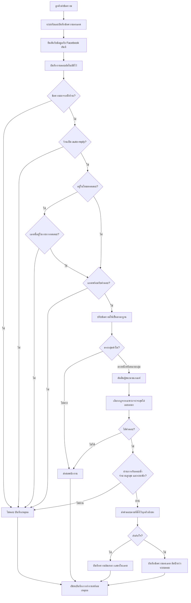
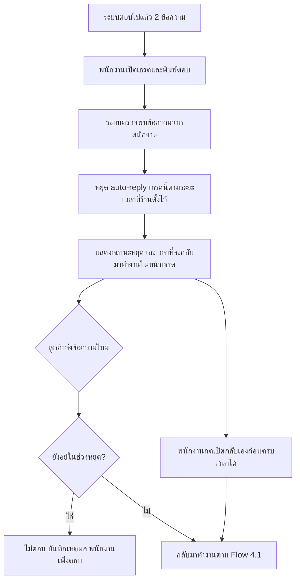
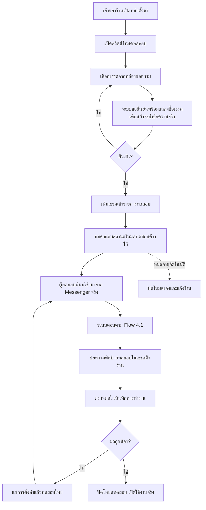

> **โมดูล:** M00023-ChatAutoReply
> **ประเภทเอกสาร:** Business Requirements Document (BRD)
> **เวอร์ชัน:** 1.0
> **วันที่จัดทำ:** 2026-07-29
> **สถานะ:** Draft — รอ user review ก่อนเริ่ม implement (Hard Rule 11)
> **เจ้าของเอกสาร:** BA + PO (ดู [[Feature-Docs-Ownership]])

# BRD: ตอบแชทอัตโนมัติจาก Keyword (Business Requirements Document)

---

## 1. บทนำ

### 1.1 วัตถุประสงค์ของเอกสาร

เอกสารนี้แปลงความต้องการทางธุรกิจใน [[PRD]] เป็น **Functional Requirements ที่ทดสอบได้** พร้อม Acceptance Criteria ระดับที่ QA เขียน test case ได้โดยไม่ต้องตีความเพิ่ม

ขอบเขตของเอกสารนี้คือ **เฟสที่ 1 เท่านั้น** — ตอบด้วยข้อความสำเร็จรูปที่ร้านเขียนเอง **ไม่มี AI อยู่ในเส้นทางการส่ง** (ดูเหตุผลที่ PRD §5)

### 1.2 ขอบเขตของระบบ

**อยู่ในขอบเขต:**
- สร้างและจัดการกลุ่มคำ (Keyword) พร้อมคำตรวจจับหลายคำต่อกลุ่ม
- ตั้งคำตอบแยกตามเพจ / โฆษณา / สินค้า พร้อมกลไกถอยระดับ
- ตรวจจับข้อความลูกค้าที่เข้ามาทางช่องทาง Messenger และ Instagram แล้วส่งคำตอบอัตโนมัติ
- ใช้บริบทโฆษณาที่ระบบเก็บไว้แล้วจาก feature 00018 เพื่อเลือกคำตอบให้ตรงสินค้า
- ควบคุมการทำงานระดับร้านและระดับเธรด รวมถึงการหยุดเมื่อพนักงานเข้ามาตอบ
- โหมดทดสอบ 2 แบบ (กรอกเองแบบไม่ส่งจริง และเธรดจริงแบบส่งจริงติดป้าย)
- ป้องกันการตอบซ้ำ จำกัดจำนวนการตอบ และส่งต่อให้พนักงาน
- บันทึกการตัดสินใจทุกครั้งพร้อมเหตุผล และค้นหาย้อนหลังได้

**ไม่อยู่ในขอบเขต (เฟสนี้):**
- การให้ AI ปรับแต่งข้อความก่อนส่ง และการตั้งค่าบุคลิก/น้ำเสียง AI (เฟส 2)
- การตรวจจับคำสะกดผิด (Fuzzy Match) และการรวบข้อความหลายข้อความก่อนตอบ (เฟส 2)
- Broadcast หรือการส่งข้อความหาลูกค้าที่ไม่ได้ทักมาก่อน
- ช่องทาง LINE, TikTok และแชทในแอป (DEEP)
- ชื่อแคมเปญ/ชุดโฆษณาจาก Facebook Marketing API
- แดชบอร์ดสถิติและกราฟรวม

### 1.3 กลุ่มผู้ใช้งาน

| กลุ่ม | บทบาทในระบบนี้ |
|-------|----------------|
| **เจ้าของร้าน (OWNER)** | ตั้งค่าทั้งหมด เปิด/ปิดระบบ เปิด/ปิดโหมดทดสอบ ดูบันทึกย้อนหลัง |
| **ผู้ดูแลร้าน (ADMIN)** | สิทธิ์เท่าเจ้าของร้านในส่วนการตั้งค่าตอบอัตโนมัติ |
| **พนักงาน (STAFF)** | ดูการตั้งค่าได้อย่างเดียว แต่ควบคุมระดับเธรดได้ (หยุด/เปิด auto-reply ในเธรดที่ตนดูแล) และเป็นผู้รับช่วงเมื่อระบบส่งต่อ |
| **ลูกค้าปลายทาง** | ไม่เห็นการตั้งค่าใด ๆ เห็นเฉพาะข้อความที่ได้รับผ่าน Messenger/Instagram |

---

## 2. ความต้องการหลัก (Functional Requirements)

### 2.1 การตั้งค่ากลุ่มคำ (Keyword)

#### FR-001: สร้างและจัดการกลุ่มคำ

**User Story:**
> ในฐานะเจ้าของร้าน ฉันต้องการสร้างกลุ่มคำที่ลูกค้ามักถาม เพื่อให้ระบบรู้ว่าลูกค้ากำลังถามเรื่องอะไรและตอบให้ถูกเรื่อง

**Acceptance Criteria:**
- [ ] AC-001-01: สร้างกลุ่มคำใหม่ได้โดยระบุชื่อกลุ่ม (เช่น "สนใจสินค้า") อย่างน้อย 1 ตัวอักษร
- [ ] AC-001-02: แก้ไขและลบกลุ่มคำที่สร้างไว้ได้
- [ ] AC-001-03: เปิด/ปิดการใช้งานรายกลุ่มได้ โดยกลุ่มที่ปิดต้องไม่ถูกนำมาตรวจจับเลย
- [ ] AC-001-04: ชื่อกลุ่มคำห้ามซ้ำภายในร้านเดียวกัน — บันทึกซ้ำต้องถูกปฏิเสธพร้อมข้อความอธิบาย
- [ ] AC-001-05: ร้านหนึ่งเห็นและแก้ไขได้เฉพาะกลุ่มคำของร้านตัวเอง — เรียกข้ามร้านต้องถูกปฏิเสธ
- [ ] AC-001-06: หน้ารายการกลุ่มคำแสดง: ชื่อกลุ่ม, จำนวนคำตรวจจับ, รูปแบบการตรวจจับ, ลำดับความสำคัญ, จำนวนคำตอบเฉพาะเพจ/โฆษณา/สินค้า, สถานะเปิดปิด, วันที่แก้ไขล่าสุด
- [ ] AC-001-07: หน้ารายการรองรับการค้นหา กรองตามสถานะ และเรียงลำดับ
- [ ] AC-001-08: ทำสำเนากลุ่มคำ (duplicate) ได้ โดยสำเนาต้องมีสถานะปิดไว้ก่อนเสมอ

#### FR-002: จัดการคำตรวจจับภายในกลุ่ม

**User Story:**
> ในฐานะเจ้าของร้าน ฉันต้องการใส่คำที่ความหมายเหมือนกันได้หลายคำในกลุ่มเดียว เพื่อไม่ต้องสร้างกลุ่มแยกสำหรับ "สนใจ" "สนใจครับ" "สนใจค่ะ"

**Acceptance Criteria:**
- [ ] AC-002-01: เพิ่มคำตรวจจับได้หลายคำต่อกลุ่ม และลบทีละคำได้
- [ ] AC-002-02: กลุ่มที่เปิดใช้งานต้องมีคำตรวจจับอย่างน้อย 1 คำ — บันทึกกลุ่มที่เปิดแต่ไม่มีคำต้องถูกปฏิเสธ
- [ ] AC-002-03: คำตรวจจับซ้ำภายในกลุ่มเดียวกันต้องถูกปฏิเสธหรือรวมเป็นคำเดียว
- [ ] AC-002-04: ระบบเตือน (ไม่บล็อก) เมื่อคำตรวจจับซ้ำกับกลุ่มอื่นที่เปิดใช้งานอยู่ พร้อมบอกว่าซ้ำกับกลุ่มไหน
- [ ] AC-002-05: รองรับข้อความภาษาไทยที่มีวรรณยุกต์และสระครบถ้วน รวมถึงคำที่มีช่องว่างภายใน

**Example:**
```
กลุ่มคำ: สนใจสินค้า
คำตรวจจับ: สนใจ / สนใจครับ / สนใจค่ะ / ขอรายละเอียด / สอบถามหน่อย / อยากสั่ง / ขอข้อมูล
```

#### FR-003: รูปแบบการตรวจจับและลำดับความสำคัญ

**User Story:**
> ในฐานะเจ้าของร้าน ฉันต้องการกำหนดได้ว่ากลุ่มไหนต้องตรงเป๊ะและกลุ่มไหนแค่มีคำอยู่ในประโยคก็พอ เพื่อไม่ให้คำสั้น ๆ ไปดักคำถามที่ควรเป็นของกลุ่มอื่น

**Acceptance Criteria:**
- [ ] AC-003-01: เลือกรูปแบบการตรวจจับได้ 3 แบบต่อกลุ่ม — ตรงทั้งข้อความ / มีคำอยู่ในประโยค / ขึ้นต้นด้วยคำ
- [ ] AC-003-02: กำหนดลำดับความสำคัญเป็นตัวเลขได้ ค่ามากกว่าถูกเลือกก่อน
- [ ] AC-003-03: ค่าเริ่มต้นของกลุ่มใหม่คือ "มีคำอยู่ในประโยค" และลำดับความสำคัญกลาง ๆ
- [ ] AC-003-04: หน้าตั้งค่าอธิบายความต่างของทั้ง 3 รูปแบบพร้อมตัวอย่างที่เข้าใจได้โดยไม่ต้องมีความรู้เทคนิค

#### FR-004: สิทธิ์การเข้าถึงการตั้งค่า

**User Story:**
> ในฐานะเจ้าของร้าน ฉันต้องการให้เฉพาะฉันและผู้ดูแลเท่านั้นที่แก้คำตอบอัตโนมัติได้ เพราะข้อความเหล่านี้ส่งถึงลูกค้าโดยตรงโดยไม่มีคนตรวจ

**Acceptance Criteria:**
- [ ] AC-004-01: OWNER และ ADMIN สร้าง แก้ไข ลบ และเปิด/ปิดการตั้งค่าได้ทั้งหมด
- [ ] AC-004-02: STAFF เปิดดูหน้าตั้งค่าได้ แต่ทุกช่องอยู่ในสถานะอ่านอย่างเดียวและไม่มีปุ่มบันทึก
- [ ] AC-004-03: ถ้า STAFF ส่งคำขอบันทึกโดยตรง ระบบต้องปฏิเสธและแจ้งว่าไม่มีสิทธิ์
- [ ] AC-004-04: การตั้งค่าทั้งหมดเป็นของ "ร้านที่กำลังใช้งานอยู่" — สลับร้านแล้วต้องเห็นการตั้งค่าของร้านนั้น
- [ ] AC-004-05: ทุกการเปลี่ยนแปลงต้องบันทึกว่าใครแก้และแก้เมื่อไหร่

---

### 2.2 คำตอบตามบริบท

#### FR-005: คำตอบกลางของกลุ่มคำ

**User Story:**
> ในฐานะเจ้าของร้าน ฉันต้องการตั้งคำตอบกลางไว้ก่อนหนึ่งชุด เพื่อให้เริ่มใช้งานได้ทันทีโดยยังไม่ต้องตั้งค่าแยกตามเพจหรือโฆษณา

**Acceptance Criteria:**
- [ ] AC-005-01: แต่ละกลุ่มคำตั้งคำตอบกลางได้ 1 ชุด
- [ ] AC-005-02: กลุ่มที่เปิดใช้งานต้องมีคำตอบกลาง หรือมีคำตอบเฉพาะระดับใดระดับหนึ่งอย่างน้อย 1 รายการ — ถ้าไม่มีเลยต้องบันทึกไม่ได้พร้อมแจ้งเหตุผล
- [ ] AC-005-03: คำตอบว่าง (ช่องว่างล้วน) ถือว่าไม่มีคำตอบ และต้องถูกปฏิเสธตอนบันทึก
- [ ] AC-005-04: มีการจำกัดความยาวคำตอบ และแสดงจำนวนตัวอักษรปัจจุบันขณะพิมพ์

#### FR-006: คำตอบแยกตามเพจ

**User Story:**
> ในฐานะเจ้าของร้านที่มีหลายเพจ ฉันต้องการให้แต่ละเพจตอบคำถามเดียวกันด้วยข้อความของสินค้าเพจนั้น เพราะลูกค้าเพจอะไหล่กับเพจเครื่องสำอางถามเรื่องคนละอย่าง

**Acceptance Criteria:**
- [ ] AC-006-01: เพิ่มคำตอบเฉพาะเพจได้หลายรายการต่อกลุ่มคำ โดยเลือกจากเพจที่ร้านเชื่อมต่อไว้จริงเท่านั้น
- [ ] AC-006-02: หนึ่งกลุ่มคำมีคำตอบเฉพาะเพจได้ไม่เกิน 1 รายการต่อ 1 เพจ
- [ ] AC-006-03: เมื่อลูกค้าทักมาที่เพจที่มีคำตอบเฉพาะ ต้องใช้คำตอบของเพจนั้น ไม่ใช่คำตอบกลาง
- [ ] AC-006-04: เพจที่ไม่ได้ตั้งคำตอบเฉพาะ ต้องถอยไปใช้คำตอบกลางของกลุ่มโดยอัตโนมัติ
- [ ] AC-006-05: เพจที่ถูกถอดการเชื่อมต่อภายหลัง ต้องไม่ทำให้กลุ่มคำนั้นพังหรือหยุดตอบเพจอื่น

#### FR-007: คำตอบแยกตามโฆษณา

**User Story:**
> ในฐานะเจ้าของร้านที่ยิงโฆษณาหลายตัว ฉันต้องการให้ลูกค้าที่กดโฆษณาแต่ละตัวได้รับราคาของสินค้าในโฆษณาตัวนั้น เพราะการตอบราคาผิดรุ่นทำให้เสียลูกค้าและเสียเครดิต

**Acceptance Criteria:**
- [ ] AC-007-01: เพิ่มคำตอบเฉพาะโฆษณาได้โดยระบุรหัสโฆษณา และตั้งชื่อกำกับเองได้เพื่อให้จำได้ว่าโฆษณาตัวไหน
- [ ] AC-007-02: คำตอบเฉพาะโฆษณาผูกกับเพจได้ — โฆษณาเดียวกันบนคนละเพจตั้งคำตอบต่างกันได้
- [ ] AC-007-03: เมื่อเธรดมีบริบทโฆษณาที่ตรงกับที่ตั้งไว้ ต้องใช้คำตอบของโฆษณานั้น
- [ ] AC-007-04: โฆษณาที่ระบบไม่รู้จัก (ไม่เคยตั้งค่าไว้) ต้องถอยไปใช้ระดับเพจ **ไม่ใช่หยุดตอบ**
- [ ] AC-007-05: หน้าตั้งค่าแสดงรายการโฆษณาที่เคยมีลูกค้าทักเข้ามาจริง เพื่อให้ร้านเลือกได้โดยไม่ต้องคัดลอกรหัสมาเอง
- [ ] AC-007-06: ผูกสินค้าเข้ากับโฆษณาได้ เพื่อใช้เป็นบริบทสินค้าของเธรดที่มาจากโฆษณานั้น

#### FR-008: คำตอบแยกตามสินค้า

**User Story:**
> ในฐานะเจ้าของร้าน ฉันต้องการตั้งคำตอบผูกกับสินค้าโดยตรง เพื่อให้ใช้ซ้ำได้กับทุกโฆษณาที่ขายสินค้าตัวเดียวกัน

**Acceptance Criteria:**
- [ ] AC-008-01: เพิ่มคำตอบเฉพาะสินค้าได้โดยเลือกจากสินค้าของร้านตัวเองเท่านั้น
- [ ] AC-008-02: เมื่อเธรดมีบริบทสินค้าที่ตรง ต้องใช้คำตอบของสินค้านั้นตามลำดับที่กำหนดใน FR-009
- [ ] AC-008-03: สินค้าที่ถูกปิดการขายหรือถูกลบภายหลัง ต้องไม่ทำให้ระบบพัง — ต้องถอยไประดับถัดไปและบันทึกเหตุผลไว้
- [ ] AC-008-04: ตั้งคำตอบร่วมระหว่างโฆษณาและสินค้าพร้อมกันได้ (เงื่อนไขผสม)

#### FR-009: ลำดับการเลือกคำตอบและการถอยระดับ

**User Story:**
> ในฐานะเจ้าของร้าน ฉันต้องการมั่นใจว่าระบบเลือกคำตอบที่เฉพาะเจาะจงที่สุดเสมอ และถ้าไม่มีก็ถอยไปคำตอบกว้างกว่าแทนที่จะเงียบ

**Acceptance Criteria:**
- [ ] AC-009-01: ระบบเลือกคำตอบตามลำดับนี้เท่านั้น: (1) Keyword+เพจ+โฆษณา+สินค้า → (2) Keyword+เพจ+โฆษณา → (3) Keyword+เพจ+สินค้า → (4) Keyword+เพจ → (5) Keyword+สินค้า → (6) Keyword กลาง → (7) คำตอบกลางของเพจ → (8) คำตอบกลางของร้าน → (9) ส่งต่อพนักงาน
- [ ] AC-009-02: ระดับที่ถูกเลือกจริงต้องถูกบันทึกไว้ในบันทึกการทำงานทุกครั้ง
- [ ] AC-009-03: การถอยระดับต้องเกิดขึ้นเมื่อระดับที่เฉพาะกว่า "ไม่มีการตั้งค่า" หรือ "คำตอบว่าง" เท่านั้น
- [ ] AC-009-04: เมื่อไม่เหลือระดับใดให้ถอย ระบบต้องไม่ส่งข้อความใด ๆ และเข้าสู่การส่งต่อพนักงาน (FR-019)
- [ ] AC-009-05: ตั้งค่าคำตอบกลางระดับเพจและระดับร้านได้ สำหรับใช้เมื่อไม่มีกลุ่มคำใดตรง

---

### 2.3 การตรวจจับและการตอบ

#### FR-010: ปรับข้อความให้เป็นมาตรฐานก่อนเทียบ

**User Story:**
> ในฐานะเจ้าของร้าน ฉันต้องการให้ระบบเข้าใจว่า "สนใจค่ะ" "สนใจคับ" "สนใจ ๆ" คือเรื่องเดียวกัน โดยฉันไม่ต้องพิมพ์ทุกรูปแบบเอง

**Acceptance Criteria:**
- [ ] AC-010-01: ตัดช่องว่างหัวท้าย และยุบช่องว่างซ้ำหลายตัวให้เหลือตัวเดียวก่อนเทียบ
- [ ] AC-010-02: ไม่แยกตัวพิมพ์เล็ก/ใหญ่สำหรับข้อความภาษาอังกฤษ
- [ ] AC-010-03: จัดการเครื่องหมายวรรคตอนและเครื่องหมายคำถามท้ายประโยคไม่ให้ทำให้เทียบไม่ตรง
- [ ] AC-010-04: ข้อความภาษาไทยที่เขียนต่างกันเพียงรูปแบบการประกอบอักขระ ต้องถูกทำให้เทียบกันได้
- [ ] AC-010-05: `สนใจ` `สนใจครับ` `สนใจค่ะ` `สนใจคับ` `สนใจจ้า` `สนใจ!!` ต้องเข้ากลุ่ม "สนใจสินค้า" ได้ทั้งหมดเมื่อใช้รูปแบบ "มีคำอยู่ในประโยค"
- [ ] AC-010-06: ข้อความที่ปรับเป็นมาตรฐานแล้วต้องถูกบันทึกไว้ในบันทึกการทำงานคู่กับข้อความต้นฉบับ

#### FR-011: การตัดสินเมื่อตรงหลายกลุ่ม

**User Story:**
> ในฐานะเจ้าของร้าน ฉันต้องการให้ระบบตอบแค่ครั้งเดียวเสมอ แม้ข้อความลูกค้าจะเข้าเงื่อนไขหลายกลุ่มพร้อมกัน

**Acceptance Criteria:**
- [ ] AC-011-01: หนึ่งข้อความของลูกค้าต้องได้คำตอบไม่เกิน 1 รายการเสมอ
- [ ] AC-011-02: เมื่อตรงหลายกลุ่ม ต้องตัดสินตามลำดับ: ลำดับความสำคัญสูงกว่า → เฉพาะเจาะจงกว่า → ตรงทั้งข้อความก่อนมีคำในประโยค → คำตรวจจับที่ยาวกว่า
- [ ] AC-011-03: เมื่อคะแนนเท่ากันทุกเกณฑ์ ต้องมีผู้ชนะที่กำหนดไว้แน่นอนและให้ผลเดิมทุกครั้งเมื่อข้อมูลเหมือนเดิม — ห้ามสุ่มหรือขึ้นกับลำดับที่อ่านข้อมูล
- [ ] AC-011-04: บันทึกการทำงานต้องระบุว่ากลุ่มใดชนะ เพราะเกณฑ์ข้อใด และมีกลุ่มใดแพ้บ้าง

#### FR-012: การส่งคำตอบและการแสดงผลในเธรด

**User Story:**
> ในฐานะแอดมิน ฉันต้องการเห็นชัดว่าข้อความไหนระบบตอบและข้อความไหนคนตอบ เพื่อไม่ตอบซ้ำกับสิ่งที่ระบบตอบไปแล้ว

**Acceptance Criteria:**
- [ ] AC-012-01: ข้อความที่ระบบส่งต้องปรากฏในเธรดฝั่งร้านเหมือนข้อความปกติ และเรียงตามเวลาถูกต้อง
- [ ] AC-012-02: ข้อความที่ระบบส่งต้องมีเครื่องหมายแยกให้เห็นชัดว่ามาจากระบบ ไม่ใช่จากคน
- [ ] AC-012-03: ข้อความที่ส่งถึงลูกค้าต้องตรงกับคำตอบที่ตั้งไว้ทุกตัวอักษร ห้ามมีการดัดแปลงใด ๆ
- [ ] AC-012-04: เมื่อส่งไม่สำเร็จ ต้องบันทึกสถานะและเหตุผล และแสดงให้ฝั่งร้านเห็นในเธรด
- [ ] AC-012-05: การส่งไม่สำเร็จต้องไม่ทำให้ระบบพยายามส่งซ้ำจนลูกค้าได้รับหลายข้อความ

---

### 2.4 บริบทโฆษณาและสินค้า

#### FR-013: บริบทโฆษณาและอายุของบริบท

**User Story:**
> ในฐานะเจ้าของร้าน ฉันต้องการให้ระบบจำได้ว่าลูกค้าคนนี้มาจากโฆษณาตัวไหน เพื่อให้ข้อความที่ 2 3 4 ยังตอบเรื่องสินค้าตัวเดิม

**Acceptance Criteria:**
- [ ] AC-013-01: บริบทโฆษณาของเธรดต้องเป็นโฆษณา **ตัวล่าสุด** ที่ลูกค้ากดเข้ามาเสมอ
- [ ] AC-013-02: ลูกค้าเก่าที่กลับมากดโฆษณาตัวใหม่ ต้องได้รับคำตอบตามโฆษณาตัวใหม่ ไม่ใช่ตัวแรกที่เคยกด
- [ ] AC-013-03: ตั้งอายุบริบทได้ 3 แบบ — ใช้จนกว่าเธรดจะถูกปิด / ใช้ภายในจำนวนชั่วโมงที่กำหนด / ใช้จนกว่าจะพบบริบทสินค้าใหม่
- [ ] AC-013-04: บริบทที่หมดอายุแล้วต้องไม่ถูกนำมาใช้เลือกคำตอบ และการเลือกต้องถอยไประดับเพจแทน
- [ ] AC-013-05: ระบบบันทึกที่มาของบริบท (จากโฆษณา / พนักงานกำหนด / ตรวจจับจากข้อความ) และเวลาที่อัปเดตล่าสุดทุกครั้ง
- [ ] AC-013-06: ประวัติการกดโฆษณาทุกครั้งต้องเก็บครบ ไม่ทับของเดิม

#### FR-014: บริบทสินค้าและการแก้ข้อขัดแย้ง

**User Story:**
> ในฐานะแอดมิน ฉันต้องการกำหนดสินค้าให้เธรดเองได้เมื่อรู้ว่าลูกค้าสนใจอะไรจริง ๆ และให้สิ่งที่ฉันกำหนดชนะการเดาของระบบ

**Acceptance Criteria:**
- [ ] AC-014-01: บริบทสินค้าของเธรดมาได้จาก: การผูกสินค้าเข้ากับโฆษณา / สินค้าที่ส่งมาพร้อมข้อมูลจาก Facebook / สินค้าที่พนักงานกำหนดให้เธรด
- [ ] AC-014-02: **สินค้าที่พนักงานกำหนดเองชนะสินค้าที่มาจากการแมปโฆษณาเสมอ**
- [ ] AC-014-03: เมื่อที่มามีระดับเท่ากัน บริบทที่ใหม่กว่าชนะ
- [ ] AC-014-04: ระบบต้องไม่เดาสินค้าจากข้อความลูกค้าโดยไม่มีข้อมูลรองรับในเฟสนี้
- [ ] AC-014-05: พนักงานเปลี่ยนหรือล้างบริบทสินค้าของเธรดได้ และผลต้องมีทันทีในข้อความถัดไป

---

### 2.5 การควบคุมและความปลอดภัยของการตอบ

#### FR-015: เปิด/ปิดการทำงานระดับร้านและระดับเธรด

**User Story:**
> ในฐานะเจ้าของร้าน ฉันต้องการปิดระบบทั้งหมดได้ทันทีเมื่อมีอะไรผิดปกติ โดยไม่กระทบการใช้งานแชทตามปกติ

**Acceptance Criteria:**
- [ ] AC-015-01: มีสวิตช์เปิด/ปิด auto-reply ระดับร้าน 1 จุด และค่าเริ่มต้นของร้านใหม่คือ **ปิด**
- [ ] AC-015-02: ปิดสวิตช์ระดับร้านแล้ว ต้องไม่มีคำตอบอัตโนมัติใดถูกส่งอีกภายในเวลาไม่เกิน 1 นาที
- [ ] AC-015-03: เปิด/ปิด auto-reply รายเธรดได้ และค่าระดับเธรดชนะค่าระดับร้านเมื่อถูกตั้งไว้ชัดเจน
- [ ] AC-015-04: การปิดระบบต้องไม่กระทบการรับข้อความ การแสดงเธรด และการตอบด้วยมือ

#### FR-016: หยุดอัตโนมัติเมื่อพนักงานเข้ามาตอบ

**User Story:**
> ในฐานะแอดมิน ฉันต้องการให้ระบบหยุดตอบทันทีที่ฉันเริ่มคุยกับลูกค้า โดยไม่ต้องกดปุ่มอะไร เพราะตอนกำลังคุยฉันไม่มีเวลามาหาปุ่ม

**Acceptance Criteria:**
- [ ] AC-016-01: เมื่อพนักงานส่งข้อความในเธรดใด ระบบต้องหยุด auto-reply เธรดนั้นทันทีโดยอัตโนมัติ
- [ ] AC-016-02: ร้านเลือกระยะเวลาหยุดได้ — 30 นาที / 2 ชั่วโมง / จนกว่าจะเปิดกลับเอง / จนกว่าเธรดจะถูกปิด
- [ ] AC-016-03: สถานะและเวลาที่จะกลับมาทำงานต้องแสดงให้เห็นชัดในหน้าเธรด
- [ ] AC-016-04: พนักงานเปิด auto-reply กลับเองก่อนครบเวลาได้
- [ ] AC-016-05: ข้อความที่ระบบเป็นผู้ส่งเอง ต้องไม่นับเป็น "พนักงานตอบ" และต้องไม่ทำให้ระบบหยุดตัวเอง
- [ ] AC-016-06: เธรดที่ถูกทำเครื่องหมายเป็นสแปม หรือถูกส่งต่อให้พนักงานแล้ว ต้องไม่ได้รับคำตอบอัตโนมัติ

#### FR-017: การป้องกันการตอบซ้ำ

**User Story:**
> ในฐานะเจ้าของร้าน ฉันต้องการมั่นใจว่าลูกค้าจะไม่ได้รับข้อความเดียวกันสองครั้ง เพราะมันทำให้ร้านดูไม่มืออาชีพทันที

**Acceptance Criteria:**
- [ ] AC-017-01: ข้อความลูกค้า 1 รายการ ต้องนำไปสู่คำตอบอัตโนมัติไม่เกิน 1 รายการ แม้ระบบจะประมวลผลข้อความนั้นซ้ำกี่ครั้งก็ตาม
- [ ] AC-017-02: เมื่อ Facebook ส่งข้อมูลเดิมเข้ามาซ้ำ ลูกค้าต้องไม่ได้รับคำตอบเพิ่ม
- [ ] AC-017-03: เมื่อระบบส่งสำเร็จแล้วแต่บันทึกผลไม่สำเร็จ การประมวลผลรอบถัดไปต้องตรวจพบว่าส่งไปแล้วและไม่ส่งซ้ำ
- [ ] AC-017-04: ข้อความที่ฝั่งร้านเป็นผู้ส่ง (รวมถึงคำตอบของระบบเอง และข้อความที่แอดมินตอบจากแอป Messenger โดยตรง) ต้องไม่ถูกนำมาตรวจจับกลุ่มคำเด็ดขาด
- [ ] AC-017-05: การประมวลผลพร้อมกันหลายรอบบนเธรดเดียวกัน ต้องไม่ทำให้เกิดคำตอบซ้ำ

#### FR-018: การจำกัดจำนวนและระยะพัก

**User Story:**
> ในฐานะเจ้าของร้าน ฉันต้องการกันไม่ให้ระบบตอบรัวจนลูกค้ารำคาญ หรือตอบวนไม่จบเมื่อเกิดเหตุผิดปกติ

**Acceptance Criteria:**
- [ ] AC-018-01: กลุ่มคำเดิมต้องไม่ตอบซ้ำในเธรดเดิมภายในระยะเวลาที่กำหนดได้
- [ ] AC-018-02: จำกัดจำนวนคำตอบอัตโนมัติสูงสุดต่อเธรดได้ เมื่อครบแล้วต้องหยุดและส่งต่อพนักงาน
- [ ] AC-018-03: ค่าเริ่มต้นของทั้งสองค่าต้องปลอดภัยไว้ก่อน และแก้ไขได้ในหน้าตั้งค่า
- [ ] AC-018-04: เมื่อไม่ตอบเพราะติดข้อจำกัดเหล่านี้ ต้องบันทึกเหตุผลไว้ให้ค้นย้อนหลังได้
- [ ] AC-018-05: ลูกค้าที่ส่งข้อความติดกันหลายข้อความในเวลาสั้น ๆ ต้องไม่ได้รับคำตอบทุกข้อความแบบรัว

#### FR-019: การส่งต่อให้พนักงาน

**User Story:**
> ในฐานะลูกค้า ฉันต้องการคุยกับคนจริงเมื่อคำถามของฉันเกินกว่าที่ระบบตอบได้ ไม่ใช่วนอยู่กับคำตอบสำเร็จรูป

**Acceptance Criteria:**
- [ ] AC-019-01: ระบบต้องส่งต่อพนักงานเมื่อ: ไม่มีกลุ่มคำตรงและไม่มีคำตอบกลางให้ถอย / ตอบครบจำนวนสูงสุดแล้ว / เกิดข้อผิดพลาดต่อเนื่อง / **ข้อความลูกค้าตรงกับคำใน `handoffPhrases` ที่ร้านตั้งไว้เอง** (เช่น "คุยกับแอดมิน", "คืนเงิน", "ของยังไม่ได้")
  > 🛑 **ข้อจำกัดของเฟสนี้ (แก้ถ้อยคำ 2026-07-29 ตาม GAP-05):** เฟสแรกไม่มี AI จึง **ตรวจ "เจตนา" ของลูกค้าไม่ได้** — การจับเคสร้องเรียน/คืนเงิน/ปัญหาคำสั่งซื้อ อาศัยการที่ร้านตั้งคำไว้ล่วงหน้าเท่านั้น ถ้าลูกค้าพูดด้วยถ้อยคำที่ร้านไม่ได้ตั้งไว้ ระบบจะไม่รู้ว่าเป็นเรื่องร้องเรียน. การตรวจเจตนาอัตโนมัติอยู่ใน Out of Scope (เฟส 2) — ถ้อยคำเดิมที่ระบุว่าระบบจับได้เองถูกแก้เพราะทำไม่ได้จริงและจะทำให้ AC ปิดไม่ได้ตอน QA
- [ ] AC-019-02: ร้านตั้งคำที่ถือเป็นสัญญาณส่งต่อเองได้ (เช่น "คุยกับแอดมิน", "คืนเงิน", "ของยังไม่ได้")
- [ ] AC-019-03: เมื่อส่งต่อ ระบบต้องเปลี่ยนสถานะเธรด หยุด auto-reply แจ้งพนักงาน และบันทึกเหตุผล
- [ ] AC-019-04: พนักงานที่เปิดเธรดต้องเห็น: ข้อความที่ระบบตอบไปแล้วทั้งหมด, กลุ่มคำที่ match ล่าสุด, บริบทโฆษณาและสินค้าของเธรด, เหตุผลที่ระบบหยุด
- [ ] AC-019-05: การส่งต่อต้องไม่ส่งข้อความใด ๆ ถึงลูกค้าโดยอัตโนมัติ เว้นแต่ร้านตั้งข้อความแจ้งไว้เอง

---

### 2.6 โหมดทดสอบ

#### FR-020: หน้าทดสอบกฎแบบกรอกเอง (ไม่ส่งออกจริง)

**User Story:**
> ในฐานะเจ้าของร้าน ฉันต้องการลองพิมพ์ข้อความดูว่าระบบจะตอบอะไร โดยไม่ต้องรอลูกค้าจริงและไม่ส่งอะไรออกไป

**Acceptance Criteria:**
- [ ] AC-020-01: กรอกข้อความลูกค้าสมมติ และเลือกเพจ / โฆษณา / สินค้า / บริบทเธรด ได้
- [ ] AC-020-02: แสดงผลทันทีโดยไม่ส่งข้อความออกและไม่บันทึกลงเธรดใด ๆ
- [ ] AC-020-03: ผลลัพธ์ต้องแสดง: กลุ่มคำที่ match, คำตรวจจับที่ตรง, รูปแบบการตรวจจับ, กฎที่ถูกเลือก, ระดับการเลือก, คำตอบที่จะถูกส่ง
- [ ] AC-020-04: ต้องแสดงด้วยว่า **กฎอื่นทำไมถึงไม่ถูกเลือก** และถ้าไม่ match เลยต้องบอกว่าจะถอยไปใช้อะไร
- [ ] AC-020-05: ผลลัพธ์ที่ได้ต้องตรงกับสิ่งที่จะเกิดขึ้นจริงเมื่อลูกค้าส่งข้อความเดียวกันในบริบทเดียวกัน
- [ ] AC-020-06: หน้านี้ใช้ได้แม้ auto-reply ระดับร้านจะปิดอยู่

#### FR-021: โหมดทดสอบกับเธรดจริง (ส่งออกจริง ติดป้ายกำกับ)

**User Story:**
> ในฐานะเจ้าของร้าน ฉันต้องการลองทักเข้ามาจาก Messenger ของตัวเองแล้วดูว่าระบบตอบยังไงจริง ๆ โดยลูกค้าคนอื่นต้องไม่โดนผลกระทบเลย

**Acceptance Criteria:**
- [ ] AC-021-01: เปิด/ปิดโหมดทดสอบระดับร้านได้ 1 จุด
- [ ] AC-021-02: ระบุเธรดสำหรับทดสอบได้หลายเธรด โดยเลือกจากเธรดที่มีอยู่จริงในกล่องข้อความ
- [ ] AC-021-03: **ขณะเปิดโหมดทดสอบ ระบบต้องตอบเฉพาะเธรดที่ระบุเท่านั้น** — เธรดอื่นทั้งร้านต้องไม่ได้รับคำตอบอัตโนมัติแม้จะ match กลุ่มคำก็ตาม
- [ ] AC-021-04: ข้อความในโหมดทดสอบ **ถูกส่งถึงผู้รับจริงผ่าน Messenger/Instagram**
- [ ] AC-021-05: ข้อความที่ส่งในโหมดทดสอบต้องติดป้ายกำกับที่ฝั่งร้านเห็นชัดในเธรด และแยกกรองได้ในบันทึกการทำงาน
- [ ] AC-021-06: ตอนเพิ่มเธรดเข้ารายการทดสอบ ระบบต้องขอยืนยันพร้อมแสดงชื่อเธรด/ชื่อผู้ติดต่อนั้น
- [ ] AC-021-07: ขณะเปิดโหมดทดสอบ ต้องมีแถบสถานะแสดงค้างไว้ในหน้ากล่องข้อความและหน้าตั้งค่า พร้อมปุ่มปิดโหมดในคลิกเดียว
- [ ] AC-021-08: โหมดทดสอบต้องหมดอายุเองภายในระยะเวลาที่กำหนด และเมื่อหมดอายุต้องแจ้งให้ร้านทราบ
- [ ] AC-021-09: การตรวจสอบว่าอยู่ในโหมดทดสอบและเธรดอยู่ในรายการหรือไม่ ต้องเกิดขึ้น **ก่อน** การประมวลผลที่มีต้นทุนใด ๆ
- [ ] AC-021-10: การจำกัดจำนวนและระยะพัก (FR-018) ยังบังคับตามปกติในโหมดทดสอบ

---

### 2.7 การประมวลผลและความทนทาน

#### FR-022: ตอบรับ Facebook ทันทีแล้วแยกงานไปประมวลผล

**User Story:**
> ในฐานะเจ้าของร้าน ฉันต้องการให้ระบบทำงานเสถียรแม้มีลูกค้าทักพร้อมกันจำนวนมากหลังโฆษณาออก

**Acceptance Criteria:**
- [ ] AC-022-01: ระบบต้องยืนยันรับข้อมูลกับ Facebook ทันทีหลังจากบันทึกข้อความแล้ว โดยไม่รอกระบวนการเลือกคำตอบและการส่ง
- [ ] AC-022-02: เวลาที่ใช้ตอบรับ Facebook ต้องไม่ขึ้นกับจำนวนงานที่ต้องประมวลผลต่อ
- [ ] AC-022-03: การรับข้อความและบันทึกลงเธรดต้องทำงานได้ตามปกติแม้กระบวนการตอบอัตโนมัติจะล้มเหลว
- [ ] AC-022-04: ลูกค้าควรได้รับคำตอบภายในไม่กี่วินาทีหลังส่งข้อความในสภาวะปกติ

#### FR-023: งานที่ค้างต้องไม่หาย

**User Story:**
> ในฐานะเจ้าของร้าน ฉันต้องการมั่นใจว่าถ้าระบบสะดุด ลูกค้าจะยังได้รับคำตอบ ไม่ใช่เงียบหายไปโดยไม่มีใครรู้

**Acceptance Criteria:**
- [ ] AC-023-01: งานตอบอัตโนมัติต้องถูกบันทึกไว้ก่อนเริ่มประมวลผลเสมอ
- [ ] AC-023-02: งานที่ค้างเกินระยะเวลาที่กำหนดต้องถูกหยิบมาทำใหม่โดยอัตโนมัติ
- [ ] AC-023-03: การทำงานซ้ำต้องไม่ทำให้ลูกค้าได้รับคำตอบซ้ำ (สอดคล้อง FR-017)
- [ ] AC-023-04: งานที่ล้มเหลวเกินจำนวนครั้งที่กำหนดต้องหยุดพยายาม บันทึกสาเหตุ และส่งต่อพนักงาน
- [ ] AC-023-05: จำนวนงานค้างและงานล้มเหลวต้องตรวจสอบได้

#### FR-024: บันทึกการทำงานและการค้นหาย้อนหลัง

**User Story:**
> ในฐานะเจ้าของร้าน ฉันต้องการรู้ว่าทำไมระบบถึงตอบแบบนั้น หรือทำไมถึงไม่ตอบ เพื่อแก้การตั้งค่าให้ถูกแทนที่จะปิดฟีเจอร์ทิ้ง

**Acceptance Criteria:**
- [ ] AC-024-01: ทุกครั้งที่ระบบพิจารณาข้อความ ต้องบันทึก: ข้อความต้นฉบับ, ข้อความที่ปรับเป็นมาตรฐานแล้ว, กลุ่มคำและคำตรวจจับที่ตรง, รูปแบบการตรวจจับ, เพจ, โฆษณา, สินค้า, กฎที่เลือก, ระดับการเลือก, คำตอบที่ส่ง, สถานะการส่ง, ระยะเวลาที่ใช้, ข้อผิดพลาด (ถ้ามี), เวลาที่เกิด
- [ ] AC-024-02: **กรณีที่ตัดสินใจไม่ตอบต้องถูกบันทึกด้วย พร้อมเหตุผลที่ระบุได้ชัดเจน** (เช่น ไม่ match / อยู่ในโหมดทดสอบแต่ไม่ใช่เธรดทดสอบ / พนักงานเพิ่งตอบ / ครบจำนวนสูงสุด)
- [ ] AC-024-03: ค้นหาบันทึกได้จาก: เธรด, ผู้ติดต่อ, เพจ, โฆษณา, สินค้า, กลุ่มคำ, ช่วงวันที่, ประเภทข้อผิดพลาด และสถานะทดสอบ
- [ ] AC-024-04: ข้อมูลอ่อนไหวในบันทึกต้องถูกปกปิดตามมาตรฐานเดิมของระบบ
- [ ] AC-024-05: มีนโยบายระยะเวลาการเก็บบันทึกที่ชัดเจน
- [ ] AC-024-06: ผู้ที่เข้าถึงบันทึกได้ต้องเป็นสมาชิกของร้านนั้นเท่านั้น

---

### 2.8 AI Enhance (เตรียมไว้ล่วงหน้า — ยังไม่ implement ในเฟสปัจจุบัน)

> 🛑 **หัวข้อนี้เป็นเอกสารล่วงหน้าเท่านั้น** ตาม Hard Rule 11 (doc-first ก่อนแตะโค้ด AI Enhance ใด ๆ) — **ไม่เปลี่ยน** ขอบเขตของเฟสปัจจุบัน ดู [[PRD]] §3.9 สำหรับ BR-AR-31 ถึง BR-AR-36 ฉบับเต็ม
> ที่มา: `docs/scope/2026-07-31-00023-ai-enhance-decisions.md` + `docs/scope/2026-08-01-00023-ai-enhance-decisions-round2.md` ข้อ 7-10 + คำตอบ user 4 ข้อ 2026-08-01

#### FR-025: งบเวลาของ AI และการถอยไปคำตอบดิบ

**User Story:**
> ในฐานะเจ้าของร้าน ฉันยอมให้ AI ปรับถ้อยคำได้ แต่ไม่ยอมให้ลูกค้ารอนานเพราะ AI ช้า — ถ้าช้าเกินไปขอให้ส่งคำตอบที่ฉันเขียนไว้เองไปเลย

**Acceptance Criteria:**
- [ ] AC-025-01: AI Enhance คืนผลภายใน 8 วินาที → ลูกค้าได้ข้อความที่เรียบเรียงแล้ว และบันทึกเวลาที่ใช้จริง
- [ ] AC-025-02: เกิน 8 วินาที → ยกเลิกการเรียก AI ทันที ส่งคำตอบดิบแทน + log `AI_ENHANCE_TIMEOUT` พร้อมเวลาที่ใช้จริง (ห้าม retry)
- [ ] AC-025-03: กรณีหาคำตอบดิบไม่ได้เลย (ต้องส่งต่อคน) → **ไม่เรียก AI เลย** แม้กลุ่มคำนั้นเปิด AI Enhance ไว้
- [ ] AC-025-04: AI ตอบทันเวลาแต่ผลลัพธ์อ่านค่าไม่ได้ หรือถูก safety-block จากผู้ให้บริการ → ถือเป็นความล้มเหลวแบบเดียวกับหมดเวลา (ถอยคำตอบดิบ + log) **ห้าม throw จนทั้ง flow ตอบไม่ได้**
- [ ] AC-025-05: โมเดลแรกหมดเวลา → **ไม่ไล่โมเดลสำรองตัวถัดไป** (8 วินาทีคือสัญญากับลูกค้า ไม่ใช่สัญญากับแต่ละโมเดล)
- [ ] AC-025-06: ต้องบังคับหมดเวลาเชิงรุกด้วย abort signal — ห้ามพึ่งให้ fetch ตัดสินใจเอง (fetch ไม่มี timeout โดยปริยาย) และต้องเป็นค่าคงที่คนละตัวกับ timeout ของ AI ช่วยร่าง 00019

#### FR-026: Guardrails — ลำดับตรวจและพฤติกรรมเมื่อไม่ผ่าน

**User Story:**
> ในฐานะเจ้าของร้าน ฉันต้องมั่นใจว่า AI จะไม่สัญญาสิ่งที่ฉันให้ไม่ได้ ถ้ามันเสี่ยงจะพูดเกิน ขอให้เงียบแล้วเรียกฉันดีกว่าปล่อยให้ตอบไป

**Acceptance Criteria:**
- [ ] AC-026-01: ข้อความที่จะส่งชนคำใน denylist → ไม่ส่งข้อความใด ๆ + ส่งต่อคนทันที
- [ ] AC-026-02: ผ่าน denylist แล้วแต่ด่านตัดสิน AI ตอบว่า "ไม่ผ่าน" → ไม่ส่งข้อความที่ AI เรียบเรียง + ส่งต่อคนทันที
- [ ] AC-026-03: ด่านตัดสิน AI เรียกไม่สำเร็จเอง (ล่ม/หมดเวลา ไม่ใช่เพราะชนกฎ) → fail-closed แต่**ถอยไปคำตอบดิบ** ไม่ใช่ส่งต่อคน และไม่ใช่เงียบหาย
- [ ] AC-026-04: ต้องตรวจ **ข้อความที่ AI เรียบเรียงแล้ว** ไม่ใช่ตรวจแค่คำตอบดิบ
- [ ] AC-026-05: ทั้งสามกรณีบันทึก log ด้วยเหตุผลที่แยกกันชัดเจน: `GUARDRAILS_BLOCKED` / `GUARDRAILS_CHECK_FAILED` / `AI_ENHANCE_TIMEOUT`
- [ ] AC-026-06: ลูกค้าไม่เห็นข้อความ error ใด ๆ ในทุกกรณี

#### FR-027: Guardrails — ร้านตั้งเอง + ชุดเริ่มต้น

**User Story:**
> ในฐานะเจ้าของร้าน ฉันอยากได้ชุดกฎเริ่มต้นที่ใช้ได้ทันทีโดยไม่ต้องคิดเอง แต่ต้องแก้หรือลบข้อไหนก็ได้ ไม่มีใครมาบังคับ

**Acceptance Criteria:**
- [ ] AC-027-01: เปิด AI Enhance ให้กลุ่มคำใดเป็นครั้งแรก → คัดลอกชุดเริ่มต้น 6 ข้อเข้าเป็น Guardrails ของกลุ่มนั้น พร้อมทำเครื่องหมายว่ามาจากชุดเริ่มต้น
- [ ] AC-027-02: ลบ Guardrails ข้อใดก็ได้ (ทั้งที่มาจากชุดเริ่มต้นและที่เพิ่มเอง) โดยไม่มีข้อความบล็อก
- [ ] AC-027-03: SafePay ปรับชุดเริ่มต้นในอนาคต → Guardrails ของกลุ่มที่เปิดไปแล้ว **ต้องไม่ถูกแก้/เพิ่มอัตโนมัติ** มีผลเฉพาะกลุ่มที่เปิดครั้งแรกหลังจากนั้น
- [ ] AC-027-04: ข้อที่ร้านลบไปแล้ว ต้องไม่ถูกเติมกลับไม่ว่ากรณีใด
- [ ] AC-027-05: ปิด AI Enhance แล้วเปิดใหม่ → Guardrails เดิมคงอยู่เหมือนเดิม ไม่ reset กลับเป็นชุดเริ่มต้น
- [ ] AC-027-06: Guardrails ต้องแยกจาก "สัญญาณส่งต่อ" (`handoffPhrases`) อย่างชัดเจนใน UI — อันหนึ่งคือสิ่งที่**บอทห้ามพูด** อีกอันคือคำที่**ลูกค้าพิมพ์**

#### FR-028: เพดานค่าใช้จ่ายต่อวันและการหักตามต้นทุนจริง

**User Story:**
> ในฐานะเจ้าของร้าน ฉันอยากเปิด AI ทิ้งไว้ข้ามคืนได้โดยไม่ต้องกลัวตื่นมาเจอบิลบานปลาย และอยากจ่ายเท่าที่ใช้จริง ไม่ใช่เหมาจ่ายต่อครั้ง

**Acceptance Criteria:**
- [ ] AC-028-01: ร้านที่ยังไม่เคยตั้งเพดานเอง ใช้ค่าเริ่มต้น **฿50/วัน** (ไม่ใช่ 0 และไม่ใช่ไม่จำกัด)
- [ ] AC-028-02: ยอดสะสมวันนี้ถึง 80% ของเพดาน → แจ้งเตือนผ่าน banner ในแอป (ค่าเริ่มต้น) และผ่าน SMS ถ้าร้านเปิด opt-in ไว้ (**default = ปิด**)
- [ ] AC-028-03: ยอดถึง 100% → ทุกกลุ่มคำในร้านนั้นถอยไปคำตอบดิบทันทีโดยไม่เรียก AI + log `DAILY_CAP_REACHED` จนขึ้นวันใหม่ตามเวลาไทย
- [ ] AC-028-04: เครดิตในกระเป๋าไม่พอหักจริง → ถอยคำตอบดิบ + log `INSUFFICIENT_CREDIT` **แยกจาก** AC-028-03 และข้อความที่ร้านเห็นต้องต่างกัน
- [ ] AC-028-05: ร้าน Subscription ที่ยังใช้งานอยู่ → ไม่ตรวจเพดานและไม่หักเครดิตใด ๆ
- [ ] AC-028-06: ทุกครั้งที่ AI Enhance สำเร็จ ต้องบันทึก `inputTokens` / `outputTokens` / `costUsd`
- [ ] AC-028-07: ยอดที่หักจริงสะสม ต้องต่างจากผลรวมต้นทุนจริงไม่เกิน ฿1 ไม่ว่าจะทำงานกี่ครั้ง
- [ ] AC-028-08: ร้านปรับเพดานขึ้นกลางวันหลังชนเพดานแล้ว → กลับมาทำงานทันทีในคำถามถัดไป ไม่ต้องรอเที่ยงคืน · ปรับลงต่ำกว่ายอดที่ใช้ไปแล้ว → หยุดทันที

---

## 3. Acceptance Criteria สรุป

### 3.1 การตั้งค่า
- [ ] สร้าง/แก้/ลบ/เปิด-ปิดกลุ่มคำและคำตรวจจับได้ครบ พร้อมกันชื่อซ้ำและกลุ่มว่าง
- [ ] ตั้งคำตอบได้ครบทั้ง 5 ระดับ (กลาง, เพจ, โฆษณา, สินค้า, เงื่อนไขผสม) และคำตอบกลางระดับเพจ/ร้าน
- [ ] OWNER/ADMIN แก้ได้, STAFF อ่านอย่างเดียว, ข้ามร้านไม่ได้

### 3.2 การเลือกคำตอบ
- [ ] เลือกตามลำดับ 9 ขั้นถูกต้องทุกกรณี และถอยระดับได้เมื่อไม่มีการตั้งค่า
- [ ] ตรงหลายกลุ่มแล้วตอบครั้งเดียวเสมอ และผลลัพธ์คงเดิมทุกครั้งเมื่อข้อมูลเหมือนเดิม
- [ ] โฆษณาที่ไม่รู้จักถอยไประดับเพจ ไม่ใช่หยุดตอบ

### 3.3 ความปลอดภัยของการตอบ
- [ ] ข้อความลูกค้า 1 รายการ = คำตอบไม่เกิน 1 รายการ ในทุกสถานการณ์รวมถึงการส่งข้อมูลซ้ำและการประมวลผลพร้อมกัน
- [ ] ข้อความฝั่งร้านไม่ถูกนำมาตรวจจับ
- [ ] พนักงานตอบ = ระบบหยุดทันทีโดยอัตโนมัติ
- [ ] ข้อความที่ส่งตรงกับที่ตั้งไว้ทุกตัวอักษร

### 3.4 โหมดทดสอบ
- [ ] หน้าทดสอบแบบกรอกเองให้ผลตรงกับพฤติกรรมจริง โดยไม่ส่งและไม่บันทึก
- [ ] เปิดโหมดทดสอบแล้วเธรดที่ไม่ได้ระบุต้องไม่ได้รับคำตอบใด ๆ
- [ ] ข้อความทดสอบส่งจริงและติดป้ายกำกับให้เห็นชัด
- [ ] มีการยืนยันก่อนเพิ่มเธรด มีแถบสถานะค้าง และหมดอายุเองได้

### 3.5 ความทนทานและการตรวจสอบ
- [ ] ตอบรับ Facebook ทันทีโดยไม่รอการประมวลผล
- [ ] งานค้างถูกหยิบมาทำใหม่ได้ และไม่ทำให้ตอบซ้ำ
- [ ] บันทึกครบทั้งกรณีตอบและไม่ตอบ พร้อมเหตุผล และค้นหาได้ตามเงื่อนไขที่กำหนด
- [ ] ปิดฟีเจอร์แล้วแชทเดิมทำงานปกติทุกอย่าง

### 3.6 AI Enhance (เตรียมไว้ล่วงหน้า — ยังไม่ implement ในเฟสปัจจุบัน)
- [ ] AI ใช้เวลาเกิน 8 วินาที → ถอยไปส่งคำตอบที่ร้านเขียนเอง ไม่ปล่อยให้ลูกค้ารอ
- [ ] AI เสี่ยงพูดเกินกฎที่ร้านตั้งไว้ → ไม่ส่งเลยและเรียกคน ส่วนกรณีตัวตรวจเองล่ม → ถอยไปคำตอบดิบ (คนละพฤติกรรม)
- [ ] ร้านแก้/ลบกฎห้ามตอบได้ทุกข้อ และของที่ลบไปแล้วต้องไม่กลับมาเอง
- [ ] ใช้เงินถึง 80% ของเพดานต่อวัน → ร้านได้รับการเตือนก่อนถึงจริง
- [ ] ใช้เงินเต็มเพดาน → หยุดเรียก AI อัตโนมัติ แต่ลูกค้ายังได้รับคำตอบเหมือนเดิม
- [ ] ค่าใช้จ่ายที่หักตรงกับต้นทุนจริงที่ใช้ ไม่ใช่เหมาจ่ายต่อครั้ง

---

## 4. Business Flows (กระบวนการทำงาน)

### 4.1 Flow หลัก: ลูกค้าส่งข้อความแล้วระบบตอบอัตโนมัติ



### 4.2 Flow: พนักงานเข้ามารับช่วงกลางบทสนทนา



### 4.3 Flow: เปิดโหมดทดสอบและทดลองกับเธรดจริง



---

## 5. Use Case Scenarios (สถานการณ์การใช้งานจริง)

### Scenario 1: ลูกค้ากดโฆษณาแล้วถามราคา (Best case)

**บริบท:** ร้านตั้งคำตอบระดับโฆษณาไว้แล้ว ลูกค้ากดโฆษณาตัวที่ 2 (โช๊ครุ่น 590 บาท)

1. ลูกค้ากดโฆษณาแล้วพิมพ์ "สนใจครับ"
2. ระบบรับข้อความ บันทึกบริบทโฆษณา และยืนยันรับข้อมูลกับ Facebook ทันที
3. ระบบปรับข้อความเป็นมาตรฐาน → เทียบได้กับคำตรวจจับ "สนใจ" ในกลุ่ม "สนใจสินค้า"
4. เลือกกฎระดับ Keyword + เพจ + โฆษณา
5. ส่งข้อความ *"รุ่นนี้มีขนาดเดียว ราคา 590 บาท มีบริการเก็บเงินปลายทางค่ะ"* ตรงตามที่ตั้งไว้ทุกตัวอักษร
6. ข้อความปรากฏในเธรดฝั่งร้านพร้อมเครื่องหมายว่าระบบเป็นผู้ตอบ
7. บันทึกการทำงานระบุระดับการเลือกและเหตุผลครบ

**ผลที่คาดหวัง:** ลูกค้าได้ราคาที่ถูกต้องของรุ่นในโฆษณาที่ตนกดเข้ามา ภายในไม่กี่วินาที

### Scenario 2: โฆษณาที่ยังไม่ได้ตั้งค่า (Fallback case)

**บริบท:** ร้านเพิ่งยิงโฆษณาตัวใหม่และยังไม่ได้ตั้งคำตอบเฉพาะ

1. ลูกค้ากดโฆษณาตัวใหม่แล้วพิมพ์ "สนใจ"
2. ระบบพบบริบทโฆษณา แต่ไม่มีกฎระดับโฆษณาสำหรับรหัสนี้
3. ระบบถอยไประดับ Keyword + เพจ
4. ส่งข้อความ *"รับโช๊ครุ่นไหนดีคะ แจ้งรุ่นรถและปีรถได้เลยค่ะ"*
5. บันทึกระบุว่าถอยจากระดับโฆษณาเพราะไม่พบการตั้งค่า

**ผลที่คาดหวัง:** ลูกค้ายังได้รับคำตอบที่ใช้ได้ ไม่ใช่ความเงียบ และร้านเห็นในบันทึกว่าควรไปตั้งค่าโฆษณาตัวนี้เพิ่ม

### Scenario 3: Facebook ส่งข้อมูลซ้ำ (Negative case)

1. ลูกค้าส่งข้อความ "สนใจ" ระบบตอบไปแล้ว 1 ครั้ง
2. Facebook ส่งข้อมูลของข้อความเดิมเข้ามาซ้ำอีกครั้ง
3. ระบบตรวจพบว่าข้อความนี้ถูกประมวลผลและตอบไปแล้ว
4. ระบบไม่ส่งข้อความใด ๆ เพิ่ม และบันทึกว่าเป็นข้อมูลซ้ำ

**ผลที่คาดหวัง:** ลูกค้าได้รับคำตอบเพียงครั้งเดียว (AC-017-02)

### Scenario 4: พนักงานกำลังคุยอยู่แล้วลูกค้าพิมพ์คำที่ตรงกลุ่มคำ (Negative case)

1. พนักงานกำลังคุยรายละเอียดการจัดส่งกับลูกค้าอยู่
2. ลูกค้าพิมพ์ "สนใจอันนี้ด้วยครับ" ซึ่งตรงกับกลุ่มคำ "สนใจสินค้า"
3. ระบบตรวจพบว่าพนักงานเพิ่งตอบภายในช่วงเวลาที่กำหนด
4. ระบบไม่ตอบ และบันทึกเหตุผลว่า "พนักงานกำลังดูแลเธรดนี้"

**ผลที่คาดหวัง:** ไม่มีข้อความอัตโนมัติแทรกกลางบทสนทนาที่คนกำลังคุยอยู่ (AC-016-01)

### Scenario 5: ร้านเปิดโหมดทดสอบไว้แล้วลูกค้าจริงทักเข้ามา (Negative case)

1. ร้านเปิดโหมดทดสอบและระบุเธรดของเจ้าของร้านไว้ 1 เธรด
2. ลูกค้าจริง (คนละเธรด) พิมพ์ "สนใจ" เข้ามา
3. ระบบตรวจพบว่าอยู่ในโหมดทดสอบ และเธรดนี้ไม่อยู่ในรายการ
4. ระบบไม่ตอบ ไม่ประมวลผลต่อ และบันทึกเหตุผลว่า "อยู่นอกรายการทดสอบ"
5. เธรดนั้นเข้าสู่กระบวนการปกติของแชท (พนักงานตอบเอง)

**ผลที่คาดหวัง:** ลูกค้าจริงไม่ได้รับข้อความทดสอบใด ๆ (AC-021-03)

### Scenario 6: พนักงานพยายามแก้การตั้งค่า (Negative case)

1. พนักงาน (STAFF) เปิดหน้าตั้งค่าตอบอัตโนมัติ
2. เห็นการตั้งค่าทั้งหมดในสถานะอ่านอย่างเดียว ไม่มีปุ่มบันทึก
3. พนักงานพยายามส่งคำขอบันทึกโดยตรง
4. ระบบปฏิเสธและแจ้งว่าไม่มีสิทธิ์

**ผลที่คาดหวัง:** เฉพาะ OWNER/ADMIN เท่านั้นที่เปลี่ยนข้อความที่จะส่งถึงลูกค้าได้ (AC-004-03)

### Scenario 7: ลูกค้าถามเรื่องคืนเงิน (Handoff case)

1. ลูกค้าที่ได้รับคำตอบอัตโนมัติไป 2 ข้อความ พิมพ์ "สั่งไปเมื่อวานของยังไม่มา ขอเงินคืนได้ไหม"
2. ข้อความตรงกับคำที่ร้านตั้งไว้เป็นสัญญาณส่งต่อ
3. ระบบไม่ตอบ เปลี่ยนสถานะเธรด หยุด auto-reply และแจ้งพนักงาน
4. พนักงานเปิดเธรดแล้วเห็นครบ: บริบทโฆษณา, สินค้า, ข้อความที่ระบบตอบไปแล้ว, เหตุผลที่หยุด

**ผลที่คาดหวัง:** เรื่องที่ต้องใช้คนถูกส่งถึงคนทันทีพร้อมบริบทครบ (AC-019-04)

### Scenario 8: การส่งข้อความล้มเหลว (Negative case)

1. ระบบเลือกคำตอบได้แล้วแต่ส่งไป Facebook ไม่สำเร็จ
2. ระบบบันทึกสถานะล้มเหลวพร้อมเหตุผล และแสดงในเธรดฝั่งร้าน
3. ระบบไม่พยายามส่งซ้ำจนลูกค้าได้รับหลายข้อความ
4. เมื่อล้มเหลวต่อเนื่องเกินจำนวนที่กำหนด ระบบส่งต่อพนักงาน

**ผลที่คาดหวัง:** ความล้มเหลวมองเห็นได้ ไม่เงียบหาย และไม่กลายเป็นการส่งซ้ำ (AC-012-04, AC-023-04)

---

## 6. ความต้องการด้านคุณภาพ (Quality Requirements)

### 6.1 ความถูกต้องของข้อมูล
- ข้อความที่ส่งถึงลูกค้าต้องตรงกับที่ร้านตั้งไว้ทุกตัวอักษร ไม่มีการดัดแปลงใด ๆ ในเฟสนี้
- การเลือกกฎต้องให้ผลเดิมทุกครั้งเมื่อข้อมูลนำเข้าเหมือนเดิม
- ราคาและข้อมูลสินค้าที่ปรากฏในคำตอบเป็นความรับผิดชอบของร้าน ระบบไม่สร้างหรือแก้ไขเอง

### 6.2 ความรวดเร็ว
- การยืนยันรับข้อมูลกับ Facebook ต้องเกิดขึ้นทันทีและไม่ขึ้นกับปริมาณงานที่ต้องประมวลผลต่อ
- ลูกค้าควรได้รับคำตอบภายในไม่กี่วินาทีในสภาวะปกติ
- หน้าทดสอบกฎแบบกรอกเองต้องแสดงผลทันทีในระดับที่ใช้ปรับค่าไปมาได้ลื่นไหล

### 6.3 ความน่าเชื่อถือ
- ข้อความลูกค้า 1 รายการ = คำตอบไม่เกิน 1 รายการ ในทุกสถานการณ์ (ข้อบังคับ ไม่ใช่เป้าหมาย)
- งานที่ค้างต้องถูกหยิบมาทำใหม่ได้โดยไม่เกิดการตอบซ้ำ
- ความล้มเหลวของการตอบอัตโนมัติต้องไม่กระทบการรับข้อความและการตอบด้วยมือ
- ปิดฟีเจอร์แล้วระบบแชทเดิมต้องทำงานเหมือนก่อนมีฟีเจอร์นี้ทุกประการ

### 6.4 ความปลอดภัย
- การตั้งค่าและบันทึกทั้งหมดผูกกับร้าน ห้ามมีเส้นทางที่ร้านหนึ่งเห็นหรือกระทบข้อมูลอีกร้าน
- เฉพาะ OWNER/ADMIN แก้การตั้งค่าได้ STAFF อ่านอย่างเดียว
- ระบบส่งข้อความอัตโนมัติได้เฉพาะในเธรดของร้านที่เป็นเจ้าของเท่านั้น — การส่งอัตโนมัติต้องไม่กลายเป็นช่องทางข้ามการตรวจสอบสิทธิ์
- ข้อมูลอ่อนไหวในบันทึกต้องถูกปกปิดตามมาตรฐานเดิม
- ข้อความจากลูกค้าถือเป็นเนื้อหา ไม่ใช่คำสั่งต่อระบบ — ข้อความใดก็ตามต้องไม่เปลี่ยนพฤติกรรมการตั้งค่าได้

### 6.5 ความสะดวกในการใช้งาน (Usability)
- ร้านต้องเริ่มใช้งานได้ตั้งแต่ตั้งกลุ่มคำ 1 กลุ่มพร้อมคำตอบกลาง 1 ชุด โดยไม่ต้องตั้งค่าครบทุกระดับก่อน
- ทุกจุดที่ระบบตัดสินใจไม่ตอบ ร้านต้องหาคำตอบได้ว่าเพราะอะไรโดยไม่ต้องติดต่อทีมพัฒนา
- สถานะโหมดทดสอบต้องมองเห็นได้ตลอดโดยไม่ต้องเข้าไปหาในหน้าตั้งค่า
- ข้อความแจ้งข้อผิดพลาดต้องบอกวิธีแก้ ไม่ใช่บอกแค่ว่าผิด

---

## 7. ข้อจำกัด (Constraints)

### 7.1 ข้อจำกัดทางธุรกิจ
- รองรับเฉพาะช่องทาง Messenger และ Instagram ที่เชื่อมต่ออยู่จริงบน production
- ตอบได้เฉพาะเมื่อลูกค้าทักเข้ามาก่อนเท่านั้น ไม่มีการส่งข้อความหาลูกค้าที่ไม่ได้ทักมา
- ข้อมูลโฆษณาที่ใช้ได้จำกัดอยู่ที่รหัสและชื่อโฆษณา ไม่มีชื่อแคมเปญและชุดโฆษณาในเฟสนี้
- เฟสแรกไม่มี AI ในเส้นทางการตอบ คุณภาพคำตอบขึ้นกับการตั้งค่าของร้านทั้งหมด

### 7.2 ข้อจำกัดทางเทคนิค
- ต้องยืนยันรับข้อมูลกับ Facebook อย่างรวดเร็ว มิฉะนั้น Facebook จะส่งข้อมูลซ้ำ ซึ่งเป็นสาเหตุหลักของการตอบซ้ำ
- Facebook อนุญาตให้ตอบภายใน 24 ชั่วโมงนับจากข้อความล่าสุดของลูกค้า — ในทางปฏิบัติไม่กระทบเพราะระบบตอบทันทีที่ลูกค้าส่งข้อความ แต่ยังต้องตรวจไว้เป็นชั้นป้องกันสุดท้าย
- การเปลี่ยนแปลงฐานข้อมูลต้องเป็นแบบเพิ่มอย่างเดียว ไม่แก้และไม่ลบโครงสร้างเดิม
- ต้องไม่แก้พฤติกรรมของการรับ-ส่งข้อความเดิมที่ใช้งานอยู่จริงบน production

---

## 8. กฎทางธุรกิจ (Business Rules)

### 8.1 กฎการตั้งค่า
- **BR-AR-01** — ทุกการตั้งค่าผูกกับร้าน ร้านหนึ่งเห็นและแก้ได้เฉพาะของตัวเอง
- **BR-AR-28** — กลุ่มคำที่เปิดใช้งานต้องมีคำตรวจจับอย่างน้อย 1 คำ และมีคำตอบอย่างน้อย 1 ระดับ
- **BR-AR-29** — คำตอบว่างถือว่าไม่มีคำตอบ และต้องถูกปฏิเสธตอนบันทึก
- **BR-AR-30** — เฉพาะ OWNER/ADMIN แก้การตั้งค่าได้

### 8.2 กฎการตรวจจับและเลือกคำตอบ
- **BR-AR-02** — ต้องปรับข้อความให้เป็นมาตรฐานก่อนเทียบเสมอ
- **BR-AR-03** — หนึ่งข้อความของลูกค้าได้คำตอบไม่เกิน 1 รายการ
- **BR-AR-04** — เมื่อตรงหลายกลุ่ม ตัดสินด้วย ลำดับความสำคัญ → ความเฉพาะเจาะจง → ตรงทั้งข้อความก่อนมีคำในประโยค → คำที่ยาวกว่า และต้องมีผู้ชนะที่แน่นอนเสมอ
- **BR-AR-06** — ต้องถอยระดับได้เสมอ ห้ามเงียบทั้งที่มีคำตอบกลางอยู่
- **BR-AR-07** — โฆษณาที่ไม่รู้จักถอยไประดับเพจ ไม่ใช่หยุดตอบ
- **BR-AR-08** — ไม่เหลือระดับให้ถอย = เงียบและส่งต่อคน ห้ามเดา

### 8.3 กฎบริบท
- **BR-AR-09** — ใช้บริบทโฆษณาตัวล่าสุดเสมอ
- **BR-AR-10** — ประวัติการกดโฆษณาเก็บครบ ห้ามทับของเดิม
- **BR-AR-11** — บันทึกที่มาและเวลาอัปเดตของบริบททุกครั้ง
- **BR-AR-12** — สิ่งที่พนักงานกำหนดเองชนะการแมปจากโฆษณา และบริบทใหม่กว่าชนะบริบทเก่ากว่า

### 8.4 กฎความปลอดภัยของการตอบ
- **BR-AR-13** — พนักงานตอบในเธรด = หยุด auto-reply เธรดนั้นทันทีโดยอัตโนมัติ
- **BR-AR-14** — เธรดสแปมหรือเธรดที่ถูกส่งต่อแล้ว ต้องไม่ได้รับคำตอบอัตโนมัติ
- **BR-AR-15** — สถานะการหยุดต้องมองเห็นได้ ไม่หยุดเงียบ
- **BR-AR-21** — หนึ่งข้อความลูกค้านำไปสู่คำตอบอัตโนมัติไม่เกิน 1 ครั้ง แม้ประมวลผลซ้ำ
- **BR-AR-22** — ข้อความฝั่งร้าน (รวมคำตอบของระบบเอง) ห้ามนำมาตรวจจับเด็ดขาด
- **BR-AR-23** — ส่งสำเร็จแต่บันทึกไม่สำเร็จ ต้องตรวจสอบได้ก่อนส่งซ้ำ

### 8.5 กฎโหมดทดสอบ
- **BR-AR-16** — เปิดโหมดทดสอบ = ตอบเฉพาะเธรดที่ระบุ เธรดอื่นทั้งร้านเงียบสนิท
- **BR-AR-17** — ตรวจโหมดทดสอบก่อนการประมวลผลที่มีต้นทุนเสมอ
- **BR-AR-18** — ข้อความทดสอบส่งถึงผู้รับจริง และต้องติดป้ายกำกับ
- **BR-AR-19** — ต้องยืนยันพร้อมแสดงชื่อเธรดก่อนเพิ่มเข้ารายการทดสอบ
- **BR-AR-20** — โหมดทดสอบต้องมองเห็นได้ตลอดและหมดอายุเองได้

### 8.6 กฎการบันทึก
- **BR-AR-05 / BR-AR-26** — บันทึกทุกการตัดสินใจ ทั้งกรณีตอบและไม่ตอบ พร้อมเหตุผล
- **BR-AR-27** — ข้อมูลอ่อนไหวในบันทึกต้องถูกปกปิด

### 8.7 กฎ AI Enhance (เตรียมไว้ล่วงหน้า — ยังไม่ implement ในเฟสปัจจุบัน)
- **BR-AR-31** — งบเวลารวม 8 วินาที เกินแล้วยกเลิกและส่งคำตอบดิบ ห้าม retry · โมเดลแรกหมดเวลา = ล้มทั้งรอบ ไม่ไล่ตัวสำรอง
- **BR-AR-32** — ลำดับตรวจ: denylist → เรียบเรียงด้วย AI → ด่านตัดสิน AI ตรวจ**ข้อความที่เรียบเรียงแล้ว** ก่อนส่งจริง
- **BR-AR-33** — ชนกฎจริง = ไม่ตอบเลยและส่งต่อคน · ตัวตรวจเองล่ม = ถอยไปคำตอบดิบ (สองกรณีนี้ห้ามรวมกัน)
- **BR-AR-34** — Guardrails ตั้งรายกลุ่มคำ ร้านแก้/ลบได้ทุกข้อ · ชุดเริ่มต้น 6 ข้อ คัดลอกตอนเปิดครั้งแรกเท่านั้น ไม่ apply ย้อนหลัง ไม่เติมกลับสิ่งที่ร้านลบ
- **BR-AR-35** — เพดานค่าใช้จ่ายต่อวันระดับร้าน ค่าเริ่มต้น ฿50 ตัดรอบเวลาไทย · เตือนที่ 80% ผ่าน banner (+SMS opt-in) · เต็มแล้วถอยคำตอบดิบ · Subscription ไม่มีเพดาน
- **BR-AR-36** — หักตามต้นทุน token จริง (ไม่ใช่ ฿1/ครั้ง) เก็บ `inputTokens`/`outputTokens`/`costUsd` ทุกครั้ง · ตรวจ gate ก่อนเรียก AI · แยก `DAILY_CAP_REACHED` ออกจาก `INSUFFICIENT_CREDIT`

> รายละเอียดเต็มพร้อม Assumption ที่ยังไม่ผ่าน user ยืนยัน (เรตแปลง USD→บาท และกลไกสะสมเศษก่อนหัก) อยู่ที่ [[PRD]] §3.9

---

## 9. อภิธานศัพท์ (Glossary)

ใช้ร่วมกับ [[PRD]] §7 — คำศัพท์เพิ่มเติมเฉพาะเอกสารนี้:

| คำศัพท์ | ความหมาย |
|---------|----------|
| **การถอยระดับ (Fallback)** | การเลือกคำตอบระดับกว้างกว่าเมื่อระดับที่เฉพาะกว่าไม่มีการตั้งค่าหรือคำตอบว่าง |
| **ระดับการเลือก (Resolution Level)** | ชื่อระดับของกฎที่ถูกเลือกใช้จริง ใช้บันทึกเพื่อตรวจสอบย้อนหลัง |
| **เธรดทดสอบ** | เธรดที่ถูกระบุไว้ให้ระบบตอบได้ขณะเปิดโหมดทดสอบ |
| **ระยะพัก (Cooldown)** | ช่วงเวลาที่กลุ่มคำเดิมจะไม่ตอบซ้ำในเธรดเดิม |
| **สัญญาณส่งต่อ** | คำหรือเงื่อนไขที่ทำให้ระบบหยุดตอบและแจ้งพนักงาน |
| **Guardrails (กฎห้ามตอบ)** | ข้อห้ามรายกลุ่มคำว่า AI **ห้ามพูดถึงอะไร** ตรวจด้วย denylist และด้วย AI อีกชั้น ชนแล้วไม่ตอบเลยและส่งต่อคน — คนละอย่างกับ "สัญญาณส่งต่อ" ซึ่งดูคำที่**ลูกค้า**พิมพ์เข้ามา |
| **เพดานค่าใช้จ่ายต่อวัน** | วงเงินที่ร้านตั้งเองว่าจะให้ AI Enhance ใช้ได้ไม่เกินเท่าไหร่ต่อวัน ถึงแล้วถอยไปตอบคำตอบดิบอัตโนมัติ |

---

## 10. สรุป

ฟีเจอร์นี้ทำให้ร้านที่ยิงโฆษณาตอบลูกค้าได้ทันทีตลอด 24 ชั่วโมง โดยคำตอบเลือกตามเพจ โฆษณา และสินค้าที่ลูกค้าเข้ามา ซึ่งเป็นจุดที่คำตอบอัตโนมัติทั่วไปทำไม่ได้และเป็นสาเหตุที่ร้านเคยเลิกใช้บอทเจ้าอื่น

หลักการที่ยึดตลอดทั้งเอกสารมี 4 ข้อ: **ข้อความที่ส่งต้องเป็นของร้านคำต่อคำ** / **ไม่มั่นใจให้เงียบแล้วส่งต่อคน** / **คนชนะระบบเสมอ** / **หนึ่งข้อความหนึ่งคำตอบ** — ทั้งสี่ข้อมาจากข้อเท็จจริงว่าแพลตฟอร์มนี้ขายความน่าเชื่อถือ การตอบเร็วแต่ผิดจึงแย่กว่าการไม่ตอบ

การเว้น AI ไว้เฟส 2 เป็นการตัดสินใจเชิงบริหารความเสี่ยง ไม่ใช่ข้อจำกัดทางเทคนิค — เมื่อกลไกพื้นฐานพิสูจน์แล้วว่าตอบถูกบริบท ไม่ตอบซ้ำ และส่งต่อคนได้ถูกจังหวะ การเพิ่ม AI ทับบนฐานที่มั่นคงจะวัดผลได้ว่า AI เพิ่มหรือลดคุณภาพจริง ๆ

---

**หมายเหตุ:**
เอกสารนี้เป็นความต้องการเชิงธุรกิจและ Acceptance Criteria
สำหรับ technical specification (data model, API, state machine) ดู [[SRS]] ของโมดูลนี้
สำหรับการออกแบบระบบและการตัดสินใจทางเทคนิค ดู [[SDS]] ของโมดูลนี้
