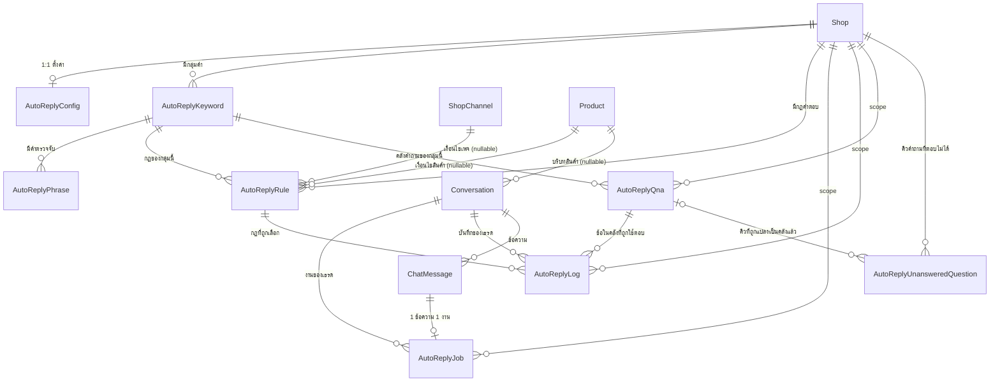

> **โมดูล:** M00023-ChatAutoReply
> **ประเภทเอกสาร:** Database Design
> **เวอร์ชัน:** 1.0
> **วันที่จัดทำ:** 2026-07-29
> **สถานะ:** Draft — 🛑 **FROZEN CONTRACT** สำหรับ SRS/SDS/API/TestCase
> **เจ้าของเอกสาร:** safepay-database (ดู [[Feature-Docs-Ownership]])

# DATABASE: ตอบแชทอัตโนมัติจาก Keyword

---

## 🛑 FROZEN CONTRACT

> **แก้สัญญา 2026-07-29 (ครั้งที่ 3) — โหมดทดสอบย้ายจาก "ระดับร้าน" มาเป็น "รายกลุ่มคำ"**
>
> ที่มา: user "เอาระดับทั้งหมดออกไปเลย ยกเลิก" + "ให้ตั้งค่าทดสอบได้ทีละอัน" หลังลองใช้จริงบน prod
> วันเดียวกับที่ deploy — ของเดิมต้องอ่าน **4 ค่า** ถึงจะตอบได้ว่า "ทำไมชุดนี้ไม่ตอบ"
> (`AutoReplyConfig.testMode` + `Conversation.autoReplyTestEnabled` + `Keyword.isActive` + `Keyword.mode`)
> และในสายตาคนใช้ "ทดสอบ" กับ "ปิดอยู่" แยกกันไม่ออก
>
> สิ่งที่เปลี่ยน:
> - `AutoReplyKeyword.isActive` + `.mode` → ยุบเป็น **`status`** ค่าเดียว 3 ค่า: `OFFLINE` | `TEST` | `LIVE`
> - ตารางใหม่ **`AutoReplyKeywordTestThread`** (keywordId, conversationId) = รายการแชททดสอบ **ของกลุ่มคำนั้น**
> - ลบทิ้ง: `AutoReplyConfig.testMode` / `.testModeExpiresAt` / `.testModeEnabledByUserId`,
>   `Conversation.autoReplyTestEnabled` และ index ของมัน
> - `skipReason` `NOT_IN_TEST_ALLOWLIST` **เลิกใช้แต่ไม่ลบ** ออกจากรายการค่าคงที่ (แถวบันทึกเก่ายังมีค่านี้)
> - migration: `20260729210000_auto_reply_keyword_status` — backfill `status` จาก `(isActive, mode)`
>   และย้าย allowlist เดิมเข้าตารางใหม่ **ก่อน** DROP COLUMN เสมอ
>
> ความหมายของแต่ละสถานะ (คำของ user):
> | status | ตอบใคร |
> |---|---|
> | `OFFLINE` | ไม่ตอบใครเลย ตั้งค่าไว้เฉย ๆ ลองได้ผ่านแผงพรีวิวในหน้าตั้งค่า |
> | `TEST` | ตอบเฉพาะแชทที่ระบุไว้ของกลุ่มนั้น — **ต้องระบุอย่างน้อย 1 แชทเสมอ** ไม่งั้นเท่ากับ OFFLINE |
> | `LIVE` | ตอบทุกแชทตามเงื่อนไขที่ตั้งไว้ |

> **แก้สัญญา 2026-07-30 (ครั้งที่ 4) — สวิตช์ระดับร้านเลิกใช้**
>
> user: "ไม่มีแล้วสิ ปิดทั้งหมด ให้ user ปิดเอง ในแต่ละ row" — `AutoReplyConfig.isEnabled`
> ถูกถอดออกจากเส้นทางตัดสิน (gate 1 เหลือแค่ `Conversation.autoReplyEnabled`) และไม่มี UI แล้ว
> คอลัมน์ยังอยู่ใน DB แต่ **ไม่มีที่อ่าน** — ทำเครื่องหมาย DEPRECATED ไว้ใน schema
> ลบได้ในรอบทำความสะอาด (เลี่ยง migration ทำลายข้อมูลรอบสองในวันเดียว)
>
> เหตุผล: มันซ้ำกับ `AutoReplyKeyword.status` และสร้างกับดักเดิมกลับมา — กลุ่มเป็น `LIVE`
> แต่เงียบเพราะสวิตช์ร้านปิดอยู่คนละหน้า ซึ่งเป็นบั๊กแรกที่เจอตอนลองใช้จริง
> ความปลอดภัย BR-AR ระดับ 0 ยังอยู่ครบ เพราะกลุ่มคำที่สร้างใหม่เป็น `OFFLINE` เสมอ
> `skipReason` `SHOP_DISABLED` เลิกใช้แต่ไม่ลบจากรายการค่าคงที่ (log เก่ามีค่านี้)

ชื่อ model, ชื่อ field, ชนิดข้อมูล และค่าคงที่ในเอกสารนี้คือ **สัญญาที่ตกลงแล้ว** — เอกสาร SRS / SDS / API / TestCase และโค้ดทุกไฟล์ต้องอ้างชื่อเหล่านี้ตรงตัว ห้ามตั้งชื่อใหม่เอง ถ้าต้องเปลี่ยนต้องกลับมาแก้ที่นี่ก่อนแล้วแจ้งทุกฝ่าย (บทเรียน `feedback_lock_contract_before_parallel`)

---

## 1. Overview

เพิ่ม **6 ตารางใหม่** และ **เพิ่มคอลัมน์ในตารางเดิม 2 ตาราง** — ทั้งหมดเป็น **additive อย่างเดียว** ไม่แก้และไม่ลบโครงสร้างเดิมแม้แต่คอลัมน์เดียว เพราะ DB ของ dev และ prod เป็นตัวเดียวกัน (memory `project_shared_db_drift_no_migrate_dev`)

| ตาราง | ประเภท | หน้าที่ |
|---|---|---|
| `AutoReplyConfig` | ใหม่ | การตั้งค่าระดับร้าน (1:1 กับ Shop) รวมสวิตช์เปิดปิดและโหมดทดสอบ |
| `AutoReplyKeyword` | ใหม่ | กลุ่มคำ |
| `AutoReplyPhrase` | ใหม่ | คำตรวจจับภายในกลุ่ม |
| `AutoReplyRule` | ใหม่ | กฎคำตอบทุกระดับในตารางเดียว (เงื่อนไขเป็นคอลัมน์ nullable) |
| `AutoReplyJob` | ใหม่ | คิวงานตอบอัตโนมัติ — **แกนกลางของการกันตอบซ้ำ** |
| `AutoReplyLog` | ใหม่ | บันทึกการตัดสินใจทุกครั้ง ทั้งตอบและไม่ตอบ |
| `Conversation` | เพิ่มคอลัมน์ | สถานะ auto-reply ระดับเธรด + บริบทสินค้า |
| `ChatMessage` | เพิ่มคอลัมน์ | ระบุว่าข้อความนี้ระบบตอบหรือคนตอบ |

**ตารางที่ไม่แตะเลย:** `ShopChannel`, `ExternalContact`, `ConversationAdReferral`, `Product`, `Order`, `Customer` — บริบทโฆษณาใช้ของเดิมที่ feature 00018 เก็บไว้แล้วครบ ไม่สร้างซ้ำ

---

## 2. ERD



**อ่าน ERD ตรงนี้ให้ถูก:** `AutoReplyQna` ผูกกับ `AutoReplyKeyword` **ไม่ใช่กับ `Shop` โดยตรงในเชิงความหมาย** (คอลัมน์ `shopId` มีไว้ให้ query เร็วเฉย ๆ) — คลังคำถามเป็นของกลุ่มคำ ไม่ใช่คลังกลางของร้าน ซึ่งเป็นข้อตัดสินของ user ที่มีเหตุผลรองรับ (ดู §3.9)

---

## 3. Tables

### 3.1 `AutoReplyConfig` (PostgreSQL — Supabase)

การตั้งค่าระดับร้าน 1:1 กับ Shop — แยกตารางแทนเพิ่มคอลัมน์ใน `Shop` ด้วยเหตุผลเดียวกับ `ShopAiSetting` (SDS TD-001 ของ 00019): `Shop` ถูกอ่านแทบทุก request การพกค่าที่ใช้เฉพาะตอนตอบแชทไปด้วยทุก query เป็นการเปลืองเปล่า

```prisma
model AutoReplyConfig {
  id     String @id @default(uuid())
  // shopId @unique = 1 ร้าน 1 ชุดตั้งค่า บังคับที่ DB ไม่พึ่งวินัยโค้ด และเป็น index ของ query หลักไปในตัว
  shopId String @unique

  // 🛑 default false ตั้งใจ (BR-AR ระดับ 0): ระบบส่งข้อความถึงลูกค้าเองโดยไม่มีคนตรวจ
  // ต้องไม่ทำงานจนกว่าร้านจะสั่งเปิดเอง — มิเรอร์ ShopShippingAccount.createMode = "ASK" ของ 00022
  isEnabled Boolean @default(false)

  // --- โหมดทดสอบ (FR-021) ---
  // 🛑 ลบ 2026-07-29 — testMode / testModeExpiresAt / testModeEnabledByUserId
  // โหมดทดสอบไม่ใช่สวิตช์ระดับร้านอีกต่อไป ย้ายไป AutoReplyKeyword.status = "TEST"

  // --- การหยุดเมื่อพนักงานตอบ (FR-016) ---
  // "30M" | "2H" | "MANUAL" (จนกว่าจะเปิดเอง) | "UNTIL_RESOLVED" (จนกว่าเธรดจะถูกปิด)
  // String ไม่ใช่ Prisma enum ตาม convention เดิมทั้งโปรเจกต์ (Order.status/Shop.kind/Product.type)
  // เลี่ยง ALTER TYPE ทุกครั้งที่เพิ่มตัวเลือก — validate ที่ Valibot เท่านั้น ไม่มี DB CHECK
  humanTakeoverPauseMode String @default("2H")

  // --- การจำกัดการตอบ (FR-018) ---
  keywordCooldownSec        Int @default(300)  // กลุ่มคำเดิมห้ามตอบซ้ำในเธรดเดิมภายในกี่วินาที
  maxRepliesPerConversation Int @default(10)   // ครบแล้วหยุดและส่งต่อพนักงาน

  // --- อายุบริบทโฆษณา (FR-013) ---
  // "UNTIL_RESOLVED" | "HOURS" | "UNTIL_NEW_PRODUCT"
  adsContextMode  String @default("UNTIL_RESOLVED")
  adsContextHours Int?   // ใช้เมื่อ adsContextMode = "HOURS" เท่านั้น

  // --- สัญญาณส่งต่อพนักงาน (FR-019 / AC-019-02) ---
  // TEXT[] คอลัมน์เดียว ไม่ทำ table แยก — ลำดับไม่มีความหมาย ไม่มี query ที่ต้อง join/aggregate รายคำ
  // (แบบเดียวกับ ExternalContact.tags/phones และ QuickMessage.imageFileIds)
  handoffPhrases String[] @default([])

  updatedByUserId String?
  createdAt       DateTime @default(now())
  updatedAt       DateTime @updatedAt

  shop      Shop  @relation(fields: [shopId], references: [id], onDelete: Cascade)
  updatedBy User? @relation("AutoReplyConfigUpdatedBy", fields: [updatedByUserId], references: [id], onDelete: SetNull)
}
```

### 3.2 `AutoReplyKeyword`

```prisma
model AutoReplyKeyword {
  id     String @id @default(uuid())
  shopId String
  name   String // ชื่อกลุ่มที่ร้านตั้งเอง เช่น "สนใจสินค้า"

  // "EXACT" | "CONTAINS" | "STARTS_WITH"
  // FUZZY เลื่อนไปเฟส 2 (PRD §5) — ค่าใหม่เพิ่มได้โดยไม่ต้อง migrate เพราะเป็น String
  matchType String @default("CONTAINS")

  // มากกว่า = ถูกเลือกก่อน (AC-003-02, เกณฑ์ที่ 1 ของ BR-AR-04)
  priority Int @default(100)

  // amend 2026-07-29 — แทน isActive+mode เดิม (ดู FROZEN CONTRACT ด้านบน)
  // "OFFLINE" = ไม่ตอบใครเลย | "TEST" = ตอบเฉพาะแชทใน AutoReplyKeywordTestThread | "LIVE" = ตอบทุกแชท
  status String @default("OFFLINE")

  createdByUserId String?
  updatedByUserId String?
  createdAt       DateTime @default(now())
  updatedAt       DateTime @updatedAt

  shop    Shop               @relation(fields: [shopId], references: [id], onDelete: Cascade)
  phrases AutoReplyPhrase[]
  // onDelete Cascade — ลบกลุ่มคำ ลบกฎของกลุ่มนั้นด้วย (กฎที่ไม่มีกลุ่มไม่มีความหมาย)
  rules   AutoReplyRule[]
  logs    AutoReplyLog[]
  testThreads AutoReplyKeywordTestThread[]

  @@unique([shopId, name]) // AC-001-04 ชื่อกลุ่มห้ามซ้ำในร้านเดียวกัน
  @@index([shopId, status, priority]) // query หลัก: โหลดกลุ่มที่ทำงานอยู่ของร้านเรียงตามลำดับความสำคัญ
}
```

### 3.2.1 `AutoReplyKeywordTestThread` (เพิ่ม 2026-07-29)

```prisma
model AutoReplyKeywordTestThread {
  id             String   @id @default(uuid())
  keywordId      String
  conversationId String
  createdAt      DateTime @default(now())

  keyword      AutoReplyKeyword @relation(fields: [keywordId], references: [id], onDelete: Cascade)
  conversation Conversation     @relation(fields: [conversationId], references: [id], onDelete: Cascade)

  @@unique([keywordId, conversationId])
  @@index([conversationId])
}
```

ทำไมเป็นตารางแยกไม่ใช่ `String[]` บน keyword: ต้อง join กับ `Conversation` เพื่อแสดงชื่อคู่สนทนา
ในหน้าตั้งค่า และต้องหายเองเมื่อเธรดถูกลบ (FK cascade) — array ทำสองอย่างนี้ไม่ได้

### 3.3 `AutoReplyPhrase`

```prisma
model AutoReplyPhrase {
  id        String @id @default(uuid())
  keywordId String

  phrase String // คำที่ร้านพิมพ์ (เก็บของเดิมไว้แสดงใน UI)

  // normalizedPhrase: ผ่าน normalize ตัวเดียวกับที่ใช้กับข้อความลูกค้า (SRS — normalizeMessage)
  // 🛑 เก็บที่ DB ไม่ normalize ตอน match: ถ้า normalize ทุกครั้งที่เทียบ จะเสียเวลาซ้ำทุกข้อความ
  // และที่สำคัญกว่าคือใช้บังคับ unique กันคำซ้ำที่ "ต่างกันแค่รูปแบบ" ได้ (AC-002-03)
  normalizedPhrase String

  createdAt DateTime @default(now())

  keyword AutoReplyKeyword @relation(fields: [keywordId], references: [id], onDelete: Cascade)

  @@unique([keywordId, normalizedPhrase]) // AC-002-03 คำซ้ำในกลุ่มเดียวกันต้องถูกปฏิเสธ
  @@index([keywordId])
}
```

### 3.4 `AutoReplyRule`

กฎคำตอบ **ทุกระดับอยู่ตารางเดียว** โดยเงื่อนไขเป็นคอลัมน์ nullable — ตอบโจทย์ PRD §20 ที่ห้ามทั้ง "คอลัมน์ตายตัวเกินไป" และ "JSON จน query/index ไม่ได้"

```prisma
model AutoReplyRule {
  id     String @id @default(uuid())
  shopId String

  // keywordId = null → กฎคำตอบกลาง (ระดับ 7 = ของเพจ ถ้า shopChannelId ไม่ null, ระดับ 8 = ของร้าน ถ้า null)
  keywordId String?

  // --- เงื่อนไข 3 มิติ (null = ไม่จำกัดมิตินั้น) ---
  shopChannelId String? // เงื่อนไขเพจ
  adId          String? // เงื่อนไขโฆษณา — String ดิบ ไม่ FK เพราะโฆษณาไม่ใช่ entity ในระบบเรา
  adLabel       String? // ชื่อกำกับที่ร้านตั้งเอง (AC-007-01) — Meta ไม่ให้ชื่อแคมเปญ/AdSet
  productId     String? // เงื่อนไขสินค้า

  replyText String @db.Text // 🛑 ข้อความที่ส่งถึงลูกค้าตรงตัวทุกอักษร ห้ามระบบดัดแปลง (BR-AR หลัก)

  // specificity: คะแนนความเฉพาะเจาะจง คำนวณตอนเขียนเสมอ (service layer, invariant)
  //   = (shopChannelId != null ? 4 : 0) + (adId != null ? 2 : 0) + (productId != null ? 1 : 0)
  // bitmask นี้เรียงลำดับตรงกับ AC-009-01 พอดีทุกระดับ:
  //   7=K+เพจ+โฆษณา+สินค้า  6=K+เพจ+โฆษณา  5=K+เพจ+สินค้า  4=K+เพจ  1=K+สินค้า  0=K กลาง
  // (2=K+โฆษณาไม่ระบุเพจ และ 3=K+โฆษณา+สินค้า ไม่อยู่ในลิสต์ของ PRD แต่เรียงลงตัวเองระหว่าง 4 กับ 1)
  // 🛑 เก็บเป็นคอลัมน์ไม่คำนวณตอน query — ต้องใช้ ORDER BY ที่ index ได้ และต้องได้ผลเดิมทุกครั้ง (AC-011-03)
  specificity Int

  isActive    Boolean   @default(true)
  activeFrom  DateTime? // ตารางเวลาเปิดใช้ (null = ไม่จำกัด)
  activeUntil DateTime?

  createdByUserId String?
  updatedByUserId String?
  createdAt       DateTime @default(now())
  updatedAt       DateTime @updatedAt

  shop        Shop              @relation(fields: [shopId], references: [id], onDelete: Cascade)
  keyword     AutoReplyKeyword? @relation(fields: [keywordId], references: [id], onDelete: Cascade)
  // SetNull ทั้งคู่: ถอดเพจ/ลบสินค้า ต้องไม่ลบกฎทิ้ง (AC-006-05, AC-008-03) — กฎกลายเป็นกว้างขึ้น
  // แล้ว service ตัดสินเองว่ายังใช้ได้ไหม ดีกว่าข้อมูลที่ร้านตั้งไว้หายเงียบ ๆ
  shopChannel ShopChannel?      @relation(fields: [shopChannelId], references: [id], onDelete: SetNull)
  product     Product?          @relation(fields: [productId], references: [id], onDelete: SetNull)
  logs        AutoReplyLog[]

  // query หลักของ rule resolution: กฎที่เปิดใช้ของกลุ่มคำนี้ เรียงเฉพาะเจาะจงมากก่อน
  @@index([shopId, keywordId, isActive, specificity])
  @@index([shopId, shopChannelId, adId])
  @@index([productId])
}
```

**🛑 unique constraint ต้องเขียน SQL มือ** — Prisma ประกาศ `@@unique([shopId, keywordId, shopChannelId, adId, productId])` ได้ แต่ **Postgres ถือว่า NULL ต่างกันเสมอ** จึงยอมให้มีแถวซ้ำที่มี NULL ได้ ทำให้กฎ "1 กลุ่มคำ 1 คำตอบต่อ 1 เพจ" (AC-006-02) บังคับไม่ได้จริง — ต้องใช้ `UNIQUE NULLS NOT DISTINCT` (Postgres 15+; Supabase รัน PG16) ในไฟล์ migration ที่เขียนเอง แบบเดียวกับ partial unique index ของ `ShopChannel` (`prisma/migrations/20260722000200_shopchannel_active_partial_unique/`)

### 3.5 `AutoReplyJob`

**ตารางที่สำคัญที่สุดของฟีเจอร์นี้** — เป็นทั้งคิวงานและกลไกกันตอบซ้ำในตัวเดียว

```prisma
model AutoReplyJob {
  id String @id @default(uuid())

  // 🛑 chatMessageId @unique = หัวใจของ BR-AR-21 / AC-017-01 "หนึ่งข้อความ หนึ่งคำตอบ"
  // ข้อความลูกค้า 1 แถว สร้างงานได้ครั้งเดียวตลอดกาล — Meta redeliver / cron ทำซ้ำ / after() ทำงาน
  // พร้อมกับ sweeper ล้วนชนที่ constraint นี้แล้วจบ ไม่ต้องพึ่งวินัยของโค้ดหรือ distributed lock
  // (ใช้หลักการเดียวกับ ChatMessage.externalMessageId @unique ที่พิสูจน์แล้วใน feature 00018)
  chatMessageId String @unique

  conversationId String
  shopId         String

  // "PENDING" | "PROCESSING" | "DONE" | "FAILED" | "SKIPPED"
  status String @default("PENDING")

  attempts   Int       @default(0)
  // lockedAt/lockedBy: กัน worker 2 ตัวหยิบงานเดียวกัน (after() กับ cron sweeper)
  // claim ด้วย conditional updateMany (WHERE status='PENDING') แบบเดียวกับ wallet.service deduct
  lockedAt   DateTime?
  lockedBy   String?
  lastError  String?   @db.Text

  createdAt DateTime @default(now())
  updatedAt DateTime @updatedAt

  message      ChatMessage  @relation(fields: [chatMessageId], references: [id], onDelete: Cascade)
  conversation Conversation @relation(fields: [conversationId], references: [id], onDelete: Cascade)
  shop         Shop         @relation(fields: [shopId], references: [id], onDelete: Cascade)

  @@index([status, createdAt]) // cron sweeper: หางานค้างเรียงเก่าสุดก่อน
  @@index([conversationId, createdAt])
}
```

### 3.6 `AutoReplyLog`

```prisma
model AutoReplyLog {
  id             String  @id @default(uuid())
  shopId         String
  conversationId String
  chatMessageId  String? // ข้อความขาเข้าที่เป็นต้นเหตุ (SetNull — ลบข้อความไม่ลบบันทึก)

  // --- สิ่งที่เห็นและตีความ ---
  rawText        String? @db.Text // ข้อความต้นฉบับ
  normalizedText String? @db.Text // หลัง normalize (AC-010-06 — ใช้ debug ว่าทำไมไม่ match)

  // --- ผลการจับคู่ ---
  keywordId     String?
  matchedPhrase String?
  matchType     String?
  // เกณฑ์ที่ทำให้ชนะ + กลุ่มที่แพ้ (AC-011-04) — Json เพราะเป็นข้อมูลวินิจฉัย
  // ไม่มี query ไหนกรองด้วยเนื้อในของมัน (มิเรอร์ ChatMessage.scamMatchedRules)
  matchTrace Json?

  // --- กฎที่ถูกเลือก ---
  ruleId          String?
  resolutionLevel String? // เช่น "KEYWORD_PAGE_AD" — ค่าคงที่ดู §3.8

  // --- บริบท ณ เวลาตัดสินใจ (snapshot ไม่ join ย้อนหลัง) ---
  shopChannelId String?
  adId          String?
  productId     String?

  // --- ผลลัพธ์ ---
  // "REPLIED" | "SKIPPED" | "HANDOFF" | "FAILED"
  decision String
  // 🛑 บังคับมีค่าเมื่อ decision != "REPLIED" (AC-024-02) — บันทึกเฉพาะตอนตอบทำให้ debug
  // คำถามที่ร้านถามบ่อยที่สุด ("ทำไมไม่ตอบ") ไม่ได้เลย. ค่าคงที่ดู §3.8
  skipReason String?

  replyText         String? @db.Text // ข้อความที่ส่งจริง
  outboundMessageId String? // ChatMessage ฝั่งขาออกที่เกิดจากการตอบครั้งนี้

  isTest       Boolean @default(false) // ตอบในโหมดทดสอบ (AC-021-05 กรองแยกได้)
  durationMs   Int?
  errorMessage String? @db.Text

  createdAt DateTime @default(now())

  shop         Shop              @relation(fields: [shopId], references: [id], onDelete: Cascade)
  conversation Conversation      @relation(fields: [conversationId], references: [id], onDelete: Cascade)
  keyword      AutoReplyKeyword? @relation(fields: [keywordId], references: [id], onDelete: SetNull)
  rule         AutoReplyRule?    @relation(fields: [ruleId], references: [id], onDelete: SetNull)

  @@index([shopId, createdAt])            // หน้ารายการบันทึกของร้าน
  @@index([conversationId, createdAt])    // ดูประวัติของเธรดเดียว
  @@index([shopId, decision, createdAt])  // กรอง "ที่ไม่ตอบ" / "ที่พัง"
  @@index([shopId, keywordId, createdAt]) // กลุ่มคำไหนถูกใช้บ่อย
  @@index([shopId, adId, createdAt])      // โฆษณาไหนสร้างบทสนทนาสูง
}
```

### 3.7 คอลัมน์ที่เพิ่มในตารางเดิม

**`Conversation` (เพิ่ม 9 คอลัมน์ — additive ทั้งหมด มี default ครบ backfill ปลอดภัยเอง)**

```prisma
  // --- feature 00023 Chat Auto-Reply (additive) ---
  // null = ตามค่าระดับร้าน (AutoReplyConfig.isEnabled); true/false = ร้านตั้งค่าเธรดนี้ไว้ชัดเจน
  // nullable ตั้งใจ: ต้องแยก "ยังไม่เคยตั้ง" ออกจาก "ตั้งเป็นปิด" ไม่งั้นปิดระดับร้านแล้วเปิดกลับ
  // จะปลุกเธรดที่ร้านตั้งใจปิดไว้ขึ้นมาด้วย (AC-015-03)
  autoReplyEnabled     Boolean?
  // 🛑 ลบ 2026-07-29 — autoReplyTestEnabled (allowlist ระดับร้าน)
  // ย้ายไปตาราง AutoReplyKeywordTestThread ซึ่งผูกกับ "กลุ่มคำ" ไม่ใช่ "ร้าน"
  // หยุดชั่วคราวถึงเมื่อไหร่ (FR-016) — null = ไม่ถูกหยุด
  autoReplyPausedUntil DateTime?
  autoReplyCount       Int       @default(0) // นับคำตอบอัตโนมัติสะสม (AC-018-02)
  lastAutoReplyAt      DateTime?
  handoffAt            DateTime? // null = ยังไม่ถูกส่งต่อ
  handoffReason        String?
  // --- บริบทสินค้าของเธรด (FR-014) ---
  contextProductId     String?
  // "ADS_MAPPING" | "MANUAL" | "REFERRAL" — MANUAL ชนะเสมอ (BR-AR-12 / AC-014-02)
  contextProductSource String?
  contextProductAt     DateTime? // ใหม่กว่าชนะเมื่อที่มาระดับเดียวกัน (AC-014-03)

  autoReplyJobs AutoReplyJob[]
  autoReplyLogs AutoReplyLog[]
  contextProduct Product? @relation("ConversationContextProduct", fields: [contextProductId], references: [id], onDelete: SetNull)

  @@index([shopId, autoReplyTestEnabled]) // หา allowlist ของโหมดทดสอบ
  // 🛑 amend 2026-07-29 (GAP-06): sweeper fallback pass ต้องไล่หา "ข้อความลูกค้าล่าสุดที่ไม่มีงานผูก"
  // ซึ่งสแกนจาก lastInboundAt — SDS TD-008 ใช้ pass นี้เป็นเหตุผลว่า "enqueue พังเงียบยอมรับได้"
  // ถ้าไม่มี index เหตุผลนั้นไม่มีของจริงรองรับ. เพิ่มตอนนี้ฟรีเพราะยังไม่ migrate; เพิ่มทีหลัง
  // ต้อง ALTER ตารางใหญ่บน DB ที่ dev/prod แชร์กัน
  @@index([shopId, lastInboundAt])
```

**`ChatMessage` (เพิ่ม 1 คอลัมน์)**

```prisma
  // --- feature 00023 (additive) ---
  // null = คนส่ง | "AUTO" = ระบบตอบ | "AUTO_TEST" = ระบบตอบขณะอยู่ในโหมดทดสอบ
  // 🛑 คอลัมน์นี้คือสิ่งที่ทำให้ BR-AR-22 บังคับได้: "พนักงานตอบ" = senderRole='SHOP' AND autoReplyKind IS NULL
  // ถ้าไม่มีคอลัมน์นี้ คำตอบของระบบเองจะถูกนับเป็น "พนักงานตอบ" แล้วระบบจะหยุดตัวเองทุกครั้งที่ตอบ
  autoReplyKind String?

  autoReplyJob AutoReplyJob?

  @@index([conversationId, autoReplyKind, createdAt]) // หา "ข้อความคนล่าสุด" ของเธรด
```

**`AutoReplyLog` (เพิ่ม 2 คอลัมน์ — 2026-07-31 phase `00023-qna`)**

```prisma
  // "KEYWORD" = เข้ากลุ่มเพราะคำตรงตัว | "QNA" = เข้ากลุ่มเพราะข้อในคลังคำถาม
  // 🛑 null = แถวที่บันทึกไว้ก่อน phase นี้ — ต้องอ่านว่า "KEYWORD" เสมอ และ **ห้าม backfill ทับ**
  //    เหตุผล: backfill จะทำให้แยกไม่ออกว่าแถวไหน "รู้จริงว่าเป็น KEYWORD" กับแถวไหน "เดาให้"
  //    ซึ่งเป็นสิ่งเดียวที่ตารางบันทึกมีไว้ทำ (ป้าย DeepBot อ่านคอลัมน์นี้ตรง ๆ)
  matchedVia String?

  // ข้อในคลังที่ถูกใช้ตอบ — SetNull เพราะลบข้อในคลังไม่ควรลบบันทึกว่าเคยตอบด้วยข้อนั้น
  qnaId String?
  qna   AutoReplyQna? @relation(fields: [qnaId], references: [id], onDelete: SetNull)
```

`resolutionLevel` ของแถวที่ตอบด้วยคลังเป็น `"QNA"` — **ไม่ใช่ `KEYWORD_DEFAULT`** เพราะคำตอบไม่ได้มาจาก `AutoReplyRule` เลย ถ้าใช้ชื่อระดับเดิมจะไล่ไม่ออกว่าคำตอบมาจากไหนตอนบอทตอบแปลก

**`AutoReplyKeyword` (เพิ่ม 1 คอลัมน์ — 2026-07-31)**

```prisma
  // 🛑 คอลัมน์นี้ยัง **ไม่มีที่ไหนในโค้ดอ่านค่า** — ห้ามเข้าใจว่าเปิดใช้ได้แล้ว
  // user ตัดสิน 2026-07-31: "ตรงตัวก่อน ความคล้ายเปิดทีหลัง" (A1 ใน Scope Baseline 00023-qna)
  // ใส่มาพร้อม migration รอบนี้เพราะ dev DB = prod DB — การกลับมา ALTER TABLE รอบสอง
  // มีต้นทุนความเสี่ยงมากกว่าคอลัมน์ที่นอนเฉย ๆ 1 คอลัมน์
  qnaSimilarityEnabled Boolean @default(false)
```

### 3.8 ค่าคงที่ (String constants — FROZEN)

| กลุ่ม | ค่าที่อนุญาต |
|---|---|
| `AutoReplyKeyword.matchType` | `EXACT` · `CONTAINS` · `STARTS_WITH` |
| `AutoReplyKeyword.mode` | `LIVE` · `TEST` — **amend 2026-07-29** โหมดรายรายการ (migration `20260729190000_auto_reply_keyword_mode`) |
| `AutoReplyConfig.humanTakeoverPauseMode` | `30M` · `2H` · `MANUAL` · `UNTIL_RESOLVED` |
| `AutoReplyConfig.adsContextMode` | `UNTIL_RESOLVED` · `HOURS` · `UNTIL_NEW_PRODUCT` |
| `AutoReplyJob.status` | `PENDING` · `PROCESSING` · `DONE` · `FAILED` · `SKIPPED` |
| `AutoReplyLog.decision` | `REPLIED` · `SKIPPED` · `HANDOFF` · `FAILED` |
| `AutoReplyLog.resolutionLevel` | `KEYWORD_PAGE_AD_PRODUCT` · `KEYWORD_PAGE_AD` · `KEYWORD_PAGE_PRODUCT` · `KEYWORD_PAGE` · `KEYWORD_PRODUCT` · `KEYWORD_DEFAULT` · `PAGE_DEFAULT` · `SHOP_DEFAULT` · `NONE` · **`QNA`** (amend 2026-07-31) |
| `AutoReplyLog.skipReason` | `SHOP_DISABLED` · `CONVERSATION_DISABLED` · `NOT_IN_TEST_ALLOWLIST` · `SPAM` · `HANDED_OFF` · `PAUSED_HUMAN_TAKEOVER` · `OUTBOUND_MESSAGE` · `KEYWORD_COOLDOWN` · `MAX_REPLIES_REACHED` · `NO_KEYWORD_MATCH` · `NO_RULE_MATCH` · `EMPTY_REPLY` · `WINDOW_CLOSED` · `CHANNEL_INACTIVE` · `DUPLICATE_JOB` · `KEYWORD_TEST_ONLY` · `OUTSIDE_SCHEDULE` |
| **`AutoReplyLog.matchedVia`** | `KEYWORD` · `QNA` — **เพิ่ม 2026-07-31** · `null` = แถวเก่าก่อน phase นี้ (ต้องอ่านว่า `KEYWORD` เสมอ ห้าม backfill ทับ ดู §3.7) |
| **`AutoReplyQna.source`** | `MANUAL` · `QUEUE` · `IMPORT` — **เพิ่ม 2026-07-31** |
| **`AutoReplyUnansweredQuestion.status`** | `PENDING` · `DISMISSED` · `ANSWERED` — **เพิ่ม 2026-07-31** |
| `ChatMessage.autoReplyKind` | `null` · `AUTO` · `AUTO_TEST` |
| `Conversation.contextProductSource` | `ADS_MAPPING` · `MANUAL` · `REFERRAL` |

ทั้งหมดเป็น `String` ไม่ใช่ Prisma enum ตาม convention ของโปรเจกต์ (`Order.status`, `Shop.kind`, `Product.type`, `Expense.category`) — เลี่ยง `ALTER TYPE` ทุกครั้งที่เพิ่มตัวเลือก และ **ไม่มี DB CHECK** validate ที่ Valibot ชั้นเดียว

### 3.9 `AutoReplyQna` (เพิ่ม 2026-07-31 — phase `00023-qna`)

คลังคำถาม-คำตอบ **ผูกกับกลุ่มคำ** ไม่ใช่คลังกลางของร้าน (user ตัดสิน — `docs/scope/2026-07-31-00023-ai-enhance-decisions.md` §3)

เป็น **วิธีจับคู่ทางที่สอง** ของกลุ่มคำ: `AutoReplyPhrase` จับแบบตรงตัวตาม `matchType` ของกลุ่ม ส่วนตารางนี้จับ "ทั้งประโยค" แล้วมีคำตอบของตัวเอง — ต่างจาก `AutoReplyRule` ตรงที่ **1 กลุ่มมีได้หลายร้อยข้อ แต่ละข้อมีคำตอบต่างกัน** ในขณะที่ rule คือคำตอบเดียวของกลุ่มที่แตกตามเงื่อนไข เพจ/โฆษณา/สินค้า

```prisma
model AutoReplyQna {
  id        String @id @default(uuid())
  shopId    String // ซ้ำกับ keyword.shopId ตั้งใจ — ทุก query ของหน้าจัดการกรองด้วย shopId ตรง ๆ ไม่ต้อง join
  keywordId String

  question String @db.Text // คำถามที่ร้านพิมพ์ (เก็บของเดิมไว้แสดงใน UI)

  // ผ่าน normalizeMessage() ตัวเดียวกับ AutoReplyPhrase.normalizedPhrase และข้อความลูกค้า
  // 🛑 คำเตือนเดียวกับ AutoReplyPhrase: แก้ normalizeMessage เมื่อไหร่ คอลัมน์นี้ stale ทั้งตาราง
  //    ต้อง backfill พร้อม deploy รอบเดียวกัน (SRS TFR-003 / TFR-031)
  normalizedQuestion String

  answer String @db.Text // 🛑 ส่งถึงลูกค้าตรงตัวทุกอักษร ห้ามระบบดัดแปลง (BR-AR หลัก เหมือน AutoReplyRule.replyText)

  // รูปแนบ (storage fileId) — สูงสุด 5 บังคับที่ Valibot (user ตัดสิน 2026-07-31 A6)
  // TEXT[] คอลัมน์เดียว ลำดับในอาร์เรย์ = ลำดับที่ส่ง — รูปแบบเดียวกับ QuickMessage.imageFileIds
  // 🛑 Messenger ส่งรูปกับข้อความเป็น "คนละข้อความ" (attachment ไม่มี text ในตัว) ⇒ 5 รูป + ข้อความ
  //    = ลูกค้าได้รับ 6 ข้อความรวด · ดู §3.11 เรื่องความล้มเหลวบางส่วนที่ถอนคืนไม่ได้
  imageFileIds String[] @default([])

  isActive Boolean @default(true)

  // นับการถูกใช้ตอบจริง — ใช้ทั้งตัวกรอง "ไม่เคยถูกใช้" และคอลัมน์ "N ครั้ง" ในหน้าจัดการ
  // 🛑 เก็บเป็นคอลัมน์ ไม่ COUNT จาก AutoReplyLog ตอน query: AutoReplyLog เป็นตารางที่โตเร็วที่สุด
  //    ในระบบ (§4) การ COUNT ต่อแถวคลังทุกครั้งที่เปิดหน้า = N+1 บนตารางที่ใหญ่ที่สุด
  useCount   Int       @default(0)
  lastUsedAt DateTime?

  // ที่มาของข้อ: "MANUAL" (ร้านพิมพ์เอง) | "QUEUE" (แปลงจากคิวคำถามที่ตอบไม่ได้) | "IMPORT" (นำเข้าไฟล์)
  // ไม่ใช่ของประดับ — ใช้ตอบว่า "คลังที่โตขึ้นมาจากงานประจำวันจริงไหม" ซึ่งเป็นเหตุผลของฟีเจอร์
  source String @default("MANUAL")

  createdByUserId String?
  updatedByUserId String?
  createdAt       DateTime @default(now())
  updatedAt       DateTime @updatedAt

  shop    Shop             @relation(fields: [shopId], references: [id], onDelete: Cascade)
  keyword AutoReplyKeyword @relation(fields: [keywordId], references: [id], onDelete: Cascade)
  logs    AutoReplyLog[]

  // คำถามซ้ำในกลุ่มเดียวกันต้องถูกปฏิเสธ — บังคับที่ DB ไม่พึ่งวินัยโค้ด (หลักเดียวกับ AutoReplyPhrase)
  // 🛑 unique ที่ระดับ "กลุ่ม" ไม่ใช่ "ร้าน" ตั้งใจ: คำถามเดียวกันอยู่ได้หลายกลุ่ม เพราะแต่ละกลุ่ม
  //    มีน้ำเสียง/กฎ/ขอบเขตของตัวเอง (จะมีผลจริงตอนทำ AI Enhance) — ตอนจับคู่ใช้ตัวตัดสินที่ §3.9.1
  @@unique([keywordId, normalizedQuestion])
  // query หลักของ QnA matching: โหลดข้อที่เปิดใช้ของร้านทั้งหมดในคิวรีเดียว (ไม่แยกตามกลุ่ม —
  // ตอน match ยังไม่รู้ว่ากลุ่มไหน) แล้วกรอง keyword ที่ไม่ใช่ OFFLINE ในหน่วยความจำ
  @@index([shopId, isActive])
  // หน้าจัดการรายกลุ่ม: เรียงตามที่ถูกใช้บ่อย
  @@index([keywordId, isActive, useCount])
}
```

#### 3.9.1 ตัวตัดสินเมื่อคำถามเดียวกันอยู่หลายกลุ่ม (deterministic — ห้ามพึ่งลำดับที่ DB คืนมา)

เรียงตามลำดับ หยุดที่เกณฑ์แรกที่ต่างกัน:
1. `keyword.priority` มากกว่าชนะ (เกณฑ์เดียวกับ `TFR-009` ของกลุ่มคำ — ร้านที่ตั้ง priority ไว้แล้วต้องได้ผลเดิม)
2. `useCount` มากกว่าชนะ (ข้อที่พิสูจน์แล้วว่าใช้จริง)
3. `AutoReplyQna.id` น้อยกว่าชนะ (unique เสมอ ⇒ ไม่มีทางเสมอกันจริง)

🛑 เกณฑ์ที่ 3 มีไว้ให้ผล **ซ้ำได้ทุกครั้ง** ตามหลักเดียวกับ AC-011-03 — ไม่ใช่ tie-break ที่คาดว่าจะได้ใช้

### 3.10 `AutoReplyUnansweredQuestion` (เพิ่ม 2026-07-31 — phase `00023-qna`)

คิว "คำถามที่ DeepBot ตอบไม่ได้" — **ตารางจริงที่เขียนตอนเกิดเหตุ ไม่ใช่ `groupBy` บน `AutoReplyLog` ตอนเปิดหน้า**

เหตุผล 3 ข้อ (ทั้งสามข้อทำให้ `groupBy` ใช้ไม่ได้ ไม่ใช่แค่ช้ากว่า):
1. `AutoReplyLog` ไม่มี index บน `normalizedText` และเป็นตารางที่โตเร็วที่สุดในระบบ (§4)
2. คิวต้องมีสถานะ (`ข้าม` / `ตอบแล้ว`) ซึ่งเก็บใน log ที่เป็น append-only ไม่ได้
3. ต้องกรอง PII **ตอนเขียน** (§3.10.1) — `groupBy` จะดึงที่อยู่/เบอร์ลูกค้าขึ้นมาโชว์ทุกครั้ง

```prisma
model AutoReplyUnansweredQuestion {
  id     String @id @default(uuid())
  shopId String

  // normalize ด้วย normalizeMessage() ตัวเดียวกับทุกที่ — เป็นทั้งคีย์รวมแถวและตัวเทียบตอนแปลงเป็น QnA
  normalizedQuestion String @db.Text
  // ข้อความดิบตัวอย่างล่าสุด — ใช้แสดงในคิว (คนอ่านรู้เรื่องกว่ารูป normalize)
  // ผ่านตัวกรอง §3.10.1 มาแล้วเช่นกัน ไม่ใช่ข้อความดิบที่ไม่ถูกกรอง
  rawSample String @db.Text

  hitCount    Int      @default(1)
  firstSeenAt DateTime @default(now())
  lastSeenAt  DateTime @default(now())

  // "PENDING" = รอกรอกคำตอบ | "DISMISSED" = ร้านกดข้าม | "ANSWERED" = แปลงเป็น AutoReplyQna แล้ว
  status String @default("PENDING")

  // ชี้ข้อในคลังที่เกิดจากคิวแถวนี้ — SetNull เพราะลบข้อในคลังไม่ควรลบประวัติว่าเคยตอบไปแล้ว
  // (ถ้า SetNull แล้ว status ยังเป็น ANSWERED = "เคยตอบแล้วแต่ข้อนั้นถูกลบ" ซึ่งเป็นความจริง)
  qnaId String?

  dismissedAt     DateTime?
  dismissedByUserId String?
  createdAt       DateTime @default(now())
  updatedAt       DateTime @updatedAt

  shop Shop          @relation(fields: [shopId], references: [id], onDelete: Cascade)
  qna  AutoReplyQna? @relation("QnaFromQueue", fields: [qnaId], references: [id], onDelete: SetNull)

  // 🛑 หัวใจของตาราง: ข้อความเดียวกันของร้านเดียวกัน = แถวเดียวตลอดกาล นับที่ hitCount
  //    ทำให้ upsert ในเส้นทางร้อนเป็น operation เดียวและกันคิวบวมโดยไม่ต้องมี dedupe ในโค้ด
  @@unique([shopId, normalizedQuestion])
  // หน้าคิว: ของร้านนี้ ที่ยังรอกรอก เรียงตามที่ถูกถามบ่อย
  @@index([shopId, status, hitCount])
}
```

#### 3.10.1 ตัวกรองก่อนเขียนคิว (บังคับ — ไม่ใช่ตัวเลือกของ UI)

ข้อความที่เข้าเงื่อนไขใดเงื่อนไขหนึ่ง **ไม่ถูกเขียนลงตารางนี้เลย** (ยังอยู่ใน `AutoReplyLog` ตามเดิม — ไม่มีการลบข้อมูล มีแต่การไม่ทำสำเนาเพิ่ม):

| # | เงื่อนไข | เหตุผล | หลักฐานจาก prod |
|---|---|---|---|
| F-1 | ยาว ≤ 3 ตัวอักษรหลัง normalize | ข้อความรับคำ ไม่ใช่คำถาม | `ครับ`(7) `คับ` `รับ` `110` `เลส` |
| F-2 | มีเลขติดกัน ≥ 9 ตัว | เบอร์โทร | `0852995863` |
| F-3 | มีคำบ่งชี้ที่อยู่ (`ตำบล`/`อำเภอ`/`จังหวัด`/`หมู่`) หรือ ไปรษณีย์ 5 หลัก | ที่อยู่จัดส่ง | `... ตำบลศาลายา อำเภอพุทธมณฑล ... 73170 ...` |
| F-4 | ยาวเกิน 80 ตัวอักษรหลัง normalize | ข้อความสั่งซื้อ/ที่อยู่ยาว ไม่ใช่คำถามที่นำกลับมาใช้ซ้ำได้ | แถว 119 / 142 / 171 ตัวอักษร |

🛑 F-2/F-3/F-4 เป็น **มาตรการ PII** ไม่ใช่การกรองขยะ — ที่อยู่และเบอร์ลูกค้าไม่ควรถูก **คัดลอก** ไปอยู่ตารางใหม่ที่มีปุ่ม "ส่งออกเป็นไฟล์" อยู่ข้าง ๆ (memory `feedback_rsc_pii_neutralize_at_source`) · การกรองอยู่ที่ **ขาเขียน** ไม่ใช่ขาแสดงผล เพราะกรองตอนแสดงแปลว่าข้อมูลถูกเก็บไปแล้ว

รายการคำ/เกณฑ์ทั้งหมด **ตายตัวในโค้ด** ร้านแก้ไม่ได้ (user ตัดสิน 2026-07-31 — A4 ใน Scope Baseline)

### 3.11 รูปแนบในคำตอบอัตโนมัติ (เพิ่ม 2026-07-31 — user สั่ง "Auto Reply ต้องใส่รูปได้")

**คอลัมน์ที่เพิ่ม:** `AutoReplyRule.imageFileIds String[] @default([])` และ `AutoReplyQna.imageFileIds String[] @default([])` — สูงสุด 5 บังคับที่ Valibot (A6)

**ทำไมไม่ต้องสร้างอะไรใหม่ฝั่งส่ง:** `sendOutboundMessage()` (`channel-chat.service.ts:890`) รับ `imageFileId` และรองรับเส้นทางระบบ (`systemShopId` + `autoReplyKind`) อยู่แล้ว — `sendAutoReply()` แค่วนส่งต่อ

#### 🛑 ข้อจำกัดของ Messenger ที่โมเดลนี้ต้องอยู่ร่วมด้วย (ไม่ใช่สิ่งที่แก้ได้ด้วยการออกแบบ DB)

| # | ข้อเท็จจริง | ผลต่อการออกแบบ |
|---|---|---|
| 1 | Meta attachment **ไม่มี text ในตัว** | "รูป + ข้อความ" = 2 ข้อความแยก · 5 รูป + ข้อความ = **6 ข้อความรวด** |
| 2 | แต่ละข้อความยิงแยกกัน = **ล้มเหลวแยกกันได้** | เกิดสถานะ "ลูกค้าได้รูปแต่ไม่ได้ข้อความ" ซึ่ง **ถอนคืนไม่ได้** |
| 3 | โค้ดปัจจุบันกลืน error ของข้อความที่ตามหลังรูปด้วย `.catch(() => {})` (`:1063`) | 🛑 **ต้องแก้สำหรับเส้นทาง auto-reply** — คนกดส่งเองเห็นกับตาว่าไม่ขึ้น แต่บอทตอบตอนไม่มีใครเฝ้า ⇒ ต้องบันทึกลง `AutoReplyLog.errorMessage` อย่างน้อย |
| 4 | Meta **มาดึงรูปเองจาก presigned URL อายุ 1 ชม.** | ข้อจำกัด MIME/ขนาดของ Supabase bucket มีผลตรง ๆ — เคยพังเงียบมาแล้ว (memory `project_supabase_uploads_bucket_mime_limit`) |

**ผลต่อการนับ `Conversation.autoReplyCount` (เพดานตอบต่อเธรด AC-018-02):** คำตอบ 1 ชุดที่มี 5 รูป นับเป็น **1** ไม่ใช่ 6
🛑 ถ้านับเป็น 6 ร้านที่ตั้งเพดานไว้ 10 จะโดนตัดจบหลังตอบไปแค่ชุดเดียวครึ่ง ซึ่งไม่ใช่สิ่งที่ "จำนวนคำตอบ" หมายถึงในสายตาร้าน

---

## 4. Indexes

| ตาราง | Index | รองรับ query |
|---|---|---|
| `AutoReplyKeyword` | `[shopId, status, priority]` | โหลดกลุ่มคำที่ไม่ใช่ OFFLINE ของร้าน เรียงตามลำดับความสำคัญ (ทุกข้อความขาเข้า) |
| `AutoReplyKeywordTestThread` | `[keywordId, conversationId]` unique · `[conversationId]` | รายการแชททดสอบของกลุ่มคำ + ทางกลับตอนตัดสินที่ gate 6.5 |
| `AutoReplyPhrase` | `[keywordId]` | โหลดคำตรวจจับของกลุ่ม |
| `AutoReplyRule` | `[shopId, keywordId, isActive, specificity]` | **query หลักของ rule resolution** — เฉพาะเจาะจงมากก่อน |
| `AutoReplyRule` | `[shopId, shopChannelId, adId]` | หน้าตั้งค่า: ดูกฎของเพจ/โฆษณาหนึ่ง ๆ |
| `AutoReplyJob` | `[status, createdAt]` | cron sweeper หางานค้าง |
| `AutoReplyLog` | 5 index (ดู §3.6) | ครอบทุกเงื่อนไขค้นหาใน AC-024-03 |
| `Conversation` | `[shopId, autoReplyTestEnabled]` | หา allowlist โหมดทดสอบ |
| `ChatMessage` | `[conversationId, autoReplyKind, createdAt]` | หาข้อความ "คนส่ง" ล่าสุด เพื่อเช็ค human takeover |
| **`AutoReplyQna`** | `[keywordId, normalizedQuestion]` unique | กันคำถามซ้ำในกลุ่มเดียวกันที่ระดับ DB |
| **`AutoReplyQna`** | `[shopId, isActive]` | **query หลักของ QnA matching** — โหลดคลังที่เปิดใช้ของร้านในคิวรีเดียวต่อข้อความที่ไม่ตรงคำ (ผ่าน cache 60 วิ เหมือน ruleSet) |
| **`AutoReplyQna`** | `[keywordId, isActive, useCount]` | หน้าจัดการรายกลุ่ม เรียงตามที่ถูกใช้บ่อย + ตัวกรอง "ไม่เคยถูกใช้" (`useCount = 0`) |
| **`AutoReplyUnansweredQuestion`** | `[shopId, normalizedQuestion]` unique | **หัวใจ** — ข้อความเดิม = แถวเดิม ทำให้ upsert ในเส้นทางร้อนเป็น operation เดียว |
| **`AutoReplyUnansweredQuestion`** | `[shopId, status, hitCount]` | หน้าคิว: ที่ยังรอกรอกของร้านนี้ เรียงตามที่ถูกถามบ่อย |
| **`AutoReplyLog`** | ไม่เพิ่ม index สำหรับ `qnaId`/`matchedVia` | ตั้งใจ — ป้าย DeepBot join ด้วย `conversationId` ซึ่งมี index อยู่แล้ว · `AutoReplyLog` มี 5 index บนตารางที่โตเร็วที่สุดในระบบ การเพิ่มที่ 6-7 เพื่อ query ที่ยังไม่มีคนเรียกคือการจ่ายค่าเขียนฟรี |

**ผลต่อ write performance และ storage:**
- `ChatMessage` เป็นตารางที่เขียนถี่ที่สุดในระบบ — เพิ่ม 1 คอลัมน์ nullable + 1 index สามคอลัมน์ ต้นทุนเขียนเพิ่มเล็กน้อยแต่ยอมรับได้ เพราะ index นี้แทนที่การ scan เธรดทุกครั้งที่ตัดสินใจตอบ
- `AutoReplyLog` เขียน **ทุกข้อความขาเข้าของร้านที่เปิดใช้** (รวมกรณีไม่ตอบ) — เป็นตารางที่โตเร็วที่สุด มี 5 index ซึ่งเป็นราคาที่ต้องจ่ายเพื่อ AC-024-03 → ต้องมีนโยบายลบย้อนหลัง (§6)
- `AutoReplyJob` มีอายุสั้น (DONE แล้วลบได้) จึงไม่โตสะสม
- ตารางตั้งค่า (`Config`/`Keyword`/`Phrase`/`Rule`) เล็กมากตาม A-4 (หลักสิบกลุ่มต่อร้าน) — อ่านบ่อยเขียนน้อย เหมาะกับการ cache ในหน่วยความจำ (ดู SDS)

---

## 5. Migration Plan

### 5.1 ลำดับการ Migrate

**ไฟล์เดียว** `prisma/migrations/20260729000000_auto_reply/migration.sql` — รวมทุกอย่างในไฟล์เดียวเพราะ DB dev=prod แชร์กัน การ `ALTER` หลายรอบมีต้นทุนความเสี่ยงมากกว่าการเพิ่มทีเดียวจบ (เหตุผลเดียวกับ S-7 ของ feature 00018)

1. `CREATE TABLE` 6 ตารางใหม่
2. `ALTER TABLE "Conversation" ADD COLUMN` × 9 (มี DEFAULT ครบ → ไม่ต้อง backfill)
3. `ALTER TABLE "ChatMessage" ADD COLUMN "autoReplyKind" TEXT` (nullable → ไม่ต้อง backfill)
4. `CREATE INDEX` ทั้งหมด
5. `CREATE UNIQUE INDEX ... NULLS NOT DISTINCT` บน `AutoReplyRule` (เขียนมือ — Prisma ประกาศไม่ได้)
6. `CREATE UNIQUE INDEX` บน `AutoReplyJob(chatMessageId)` และ `AutoReplyConfig(shopId)`

🛑 **apply ด้วย `npx prisma migrate deploy -e .env.local` เท่านั้น และต้องขอ user ยืนยันก่อนทุกครั้ง** — `.env.local` ชี้ Supabase ที่ dev และ prod ใช้ร่วมกัน ห้าม `migrate dev` เด็ดขาด (จะ reset ลบข้อมูลจริง — memory `project_shared_db_drift_no_migrate_dev`)

#### 5.1.1 migration รอบ `00023-qna` (2026-07-31) — `20260731xxxxxx_auto_reply_qna`

**additive 100% — ไม่มี DROP / ไม่มี ALTER ที่เปลี่ยนชนิด / ไม่มี NOT NULL บนตารางเดิม**

1. `CREATE TABLE "AutoReplyQna"` + index 3 ตัว (§4)
2. `CREATE TABLE "AutoReplyUnansweredQuestion"` + index 2 ตัว
3. `ALTER TABLE "AutoReplyLog" ADD COLUMN "matchedVia" TEXT, ADD COLUMN "qnaId" TEXT` — **nullable ทั้งคู่ ไม่มี DEFAULT** (ดู §3.7: null คือข้อมูล ไม่ใช่ค่าที่ขาด)
4. `ALTER TABLE "AutoReplyKeyword" ADD COLUMN "qnaSimilarityEnabled" BOOLEAN NOT NULL DEFAULT false` — มี DEFAULT ⇒ PostgreSQL 11+ ไม่ rewrite ตาราง
4b. `ALTER TABLE "AutoReplyRule" ADD COLUMN "imageFileIds" TEXT[] NOT NULL DEFAULT '{}'` (§3.11) — ลงรอบนี้เลยแม้ UI ในหน้าแก้ไขกลุ่มคำจะยังทำไม่ได้ (ติดงาน v3) เพื่อ**ไม่ต้องกลับมา ALTER รอบสองบน DB ที่ dev/prod แชร์กัน** (user ตัดสิน A5)
5. FK: `AutoReplyLog.qnaId → AutoReplyQna(id) ON DELETE SET NULL` · `AutoReplyUnansweredQuestion.qnaId → AutoReplyQna(id) ON DELETE SET NULL`
6. CHECK ค่าคงที่ (มิเรอร์ `AutoReplyConfig_active_schedule_mode` ของรอบก่อน):
   `AutoReplyQna_source IN ('MANUAL','QUEUE','IMPORT')` · `AutoReplyUnansweredQuestion_status IN ('PENDING','DISMISSED','ANSWERED')` · `AutoReplyLog_matched_via IS NULL OR IN ('KEYWORD','QNA')`

**backfill:** มีหนึ่งรายการและเป็น **สคริปต์แยก ไม่อยู่ใน migration** — `scripts/backfill-auto-reply-unanswered.ts` อ่าน `AutoReplyLog` ที่ `skipReason='NO_KEYWORD_MATCH'` (401 แถว ณ 2026-07-31) ผ่านตัวกรอง §3.10.1 แล้ว upsert เข้าคิว
🛑 แยกออกจาก migration ตั้งใจ: สคริปต์ backfill ที่ **รันซ้ำได้ปลอดภัย** (upsert + `hitCount` คำนวณจากการนับ ไม่ใช่ increment) มีค่ามากกว่าการฝังใน migration ที่รันได้ครั้งเดียวและถ้าพลาดต้องแก้ด้วยมือบน prod
🛑 สคริปต์นี้ **ห้ามมีคำสั่งลบใด ๆ** (Hard Rule 13) — อ่าน + upsert เท่านั้น

⚠️ หลัง migrate **ต้อง restart dev server** (stale Prisma client → session 500)

⚠️ หลัง migrate **ต้อง restart dev server** — stale Prisma client ทำให้ session 500 (บทเรียน seller auth 2026-06-16)

### 5.2 Rollback

ปลอดภัยเต็มที่เพราะเป็น additive ล้วน:

1. **ระดับแอป (แนะนำ):** `AutoReplyConfig.isEnabled = false` ทุกร้าน → ระบบหยุดตอบทันทีโดยไม่แตะ DB และแชทเดิมทำงานปกติ 100%
2. **ระดับ schema:** `DROP TABLE` 6 ตารางใหม่ + `DROP COLUMN` ที่เพิ่ม — ไม่มีตารางเดิมใดพึ่งพาคอลัมน์เหล่านี้ ข้อมูลเดิมไม่ถูกแตะเลย

**ไม่มีขั้นตอนใดที่ย้อนกลับไม่ได้** — ไม่มีการแก้ชนิดข้อมูล ไม่มีการลบคอลัมน์เดิม ไม่มีการเขียนทับข้อมูลเดิม

### 5.3 ผลกระทบ (Impact)

| ด้าน | ผลกระทบ |
|---|---|
| **ข้อมูลเดิม** | ไม่มี — additive ล้วน ทุกคอลัมน์ใหม่มี default หรือ nullable |
| **โค้ดเดิม** | ไม่มี — ไม่มี field เดิมถูกเปลี่ยนชื่อ/ชนิด/ลบ query เดิมทั้งหมดยังทำงานเหมือนเดิม |
| **เธรดที่มีอยู่แล้ว** | `autoReplyEnabled = null` (ตามค่าร้าน), `autoReplyTestEnabled = false`, `autoReplyCount = 0` — ปลอดภัยโดยปริยาย |
| **ข้อความที่มีอยู่แล้ว** | `autoReplyKind = null` = ถือว่าคนส่ง ซึ่งถูกต้องเพราะก่อนหน้านี้ระบบไม่เคยตอบเอง |
| **เวลา migrate** | `ALTER TABLE ADD COLUMN` ที่มี default บน Postgres 11+ ไม่ rewrite ตาราง — เร็วแม้ `ChatMessage` จะใหญ่ |

---

## 6. Retention / ข้อควรระวัง

**Retention**
- `AutoReplyLog` — เก็บ 90 วัน แล้วลบด้วย cron (ตารางที่โตเร็วที่สุด เขียนทุกข้อความขาเข้ารวมกรณีไม่ตอบ)
- `AutoReplyJob` — สถานะ `DONE` เก็บ 7 วันแล้วลบ; `FAILED` เก็บ 30 วันเพื่อวินิจฉัย

**🛑 ข้อควรระวังที่สำคัญที่สุด — echo ของคำตอบตัวเองมาถึงก่อน**

เมื่อระบบส่งคำตอบ Meta จะส่ง echo ของข้อความนั้นกลับมาทาง webhook พร้อม `mid` เดิม ถ้า echo มาถึงและถูก `ingestInboundMessage` เขียนลง DB **ก่อน** ที่เราจะเขียนแถวของตัวเอง แถวนั้นจะมี `autoReplyKind = null` → ระบบจะอ่านว่า "พนักงานตอบ" แล้ว **หยุดตัวเอง** ทั้งที่เป็นข้อความของตัวเอง

ทางแก้ที่ต้องบังคับใน SDS: หลังส่งสำเร็จ ถ้าเขียนแถวแล้วชน `externalMessageId` unique ต้อง **`UPDATE` แถวที่มีอยู่ให้ `autoReplyKind` ถูกต้อง** ไม่ใช่แค่คืนแถวเดิมเฉย ๆ อย่างที่ `sendOutboundMessage:879-885` ทำอยู่ตอนนี้

**ข้อควรระวังอื่น**
- `AutoReplyRule.specificity` เป็น invariant ที่โค้ดต้องรักษา — ทุกจุดที่เขียน rule ต้องคำนวณใหม่ ห้ามให้ client ส่งค่านี้มา
- `AutoReplyPhrase.normalizedPhrase` ต้องใช้ฟังก์ชัน normalize **ตัวเดียวกัน** กับที่ใช้กับข้อความลูกค้า ถ้าแยกกันเมื่อไหร่ระบบจะ match ไม่ตรงแบบหาสาเหตุยากมาก
- ทุก query ต้องมี `shopId` ใน `WHERE` ห้าม post-filter ใน JS (NFR-Sec เดิมของโปรเจกต์)
- `AutoReplyLog` เก็บข้อความลูกค้าดิบ → เป็น PII ต้องปกปิดตามมาตรฐานเดิมและห้ามหลุดเข้า RSC flight (memory `feedback_rsc_pii_neutralize_at_source`)

---

## 7. Traceability

| Requirement | ตาราง/คอลัมน์ที่รองรับ |
|---|---|
| FR-001/002/003 กลุ่มคำ + คำตรวจจับ | `AutoReplyKeyword`, `AutoReplyPhrase` |
| FR-005..009 คำตอบทุกระดับ + ถอยระดับ | `AutoReplyRule.specificity` + `[shopId, keywordId, isActive, specificity]` |
| FR-010 normalize | `AutoReplyPhrase.normalizedPhrase`, `AutoReplyLog.normalizedText` |
| FR-011 ตัดสินเมื่อตรงหลายกลุ่ม | `AutoReplyKeyword.priority` + `specificity` + `AutoReplyLog.matchTrace` |
| FR-012 แสดงผลในเธรด | `ChatMessage.autoReplyKind` |
| FR-013 อายุบริบทโฆษณา | `AutoReplyConfig.adsContextMode/adsContextHours` + `ConversationAdReferral` (ของเดิม) |
| FR-014 บริบทสินค้า + ข้อขัดแย้ง | `Conversation.contextProductId/Source/At` |
| FR-015 เปิดปิดร้าน/เธรด | `AutoReplyConfig.isEnabled`, `Conversation.autoReplyEnabled` |
| FR-016 หยุดเมื่อพนักงานตอบ | `Conversation.autoReplyPausedUntil` + `ChatMessage.autoReplyKind` |
| FR-017 กันตอบซ้ำ | **`AutoReplyJob.chatMessageId @unique`** |
| FR-018 จำกัดจำนวน/ระยะพัก | `AutoReplyConfig.keywordCooldownSec/maxRepliesPerConversation`, `Conversation.autoReplyCount/lastAutoReplyAt` |
| FR-019 ส่งต่อพนักงาน | `Conversation.handoffAt/handoffReason`, `AutoReplyConfig.handoffPhrases` |
| FR-020/021 โหมดทดสอบ | `AutoReplyKeyword.status='TEST'`, `AutoReplyKeywordTestThread`, `AutoReplyLog.isTest` (amend 2026-07-29) |
| FR-022/023 คิวงาน + งานค้างไม่หาย | `AutoReplyJob` ทั้งตาราง |
| FR-024 บันทึก + ค้นหา | `AutoReplyLog` ทั้งตาราง + 5 index |

---

## 8. สรุป (Summary)

6 ตารางใหม่ + 10 คอลัมน์ในตารางเดิม **additive 100%** rollback ได้ทุกขั้น และปิดฟีเจอร์ได้ด้วยการพลิกสวิตช์เดียวโดยไม่แตะ DB

การตัดสินใจที่สำคัญที่สุด 3 ข้อ:

1. **`AutoReplyJob.chatMessageId @unique`** — ยกภาระ "หนึ่งข้อความ หนึ่งคำตอบ" ไปไว้ที่ DB constraint แทนที่จะพึ่งวินัยของโค้ด ใช้หลักการเดียวกับ `externalMessageId @unique` ที่พิสูจน์ตัวเองแล้วใน feature 00018 ว่าทนต่อทั้ง redelivery และ race
2. **`specificity` เป็นคอลัมน์เก็บจริง ไม่คำนวณตอน query** — ทำให้ `ORDER BY` ใช้ index ได้และผลลัพธ์เหมือนเดิมทุกครั้ง ซึ่ง AC-011-03 บังคับไว้
3. **`ChatMessage.autoReplyKind`** — คอลัมน์เล็กที่สุดแต่ขาดไม่ได้ ถ้าไม่มี ระบบจะนับคำตอบของตัวเองเป็น "พนักงานตอบ" แล้วหยุดตัวเองทุกครั้งที่ตอบ

---

**หมายเหตุ:** สำหรับ logic การตัดสินใจและการออกแบบ service ดู [[SDS]] · สำหรับ API contract ดู [[API]] · สำหรับ acceptance criteria ต้นทาง ดู [[BRD]]
