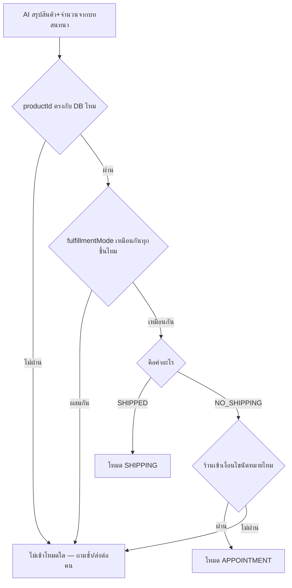
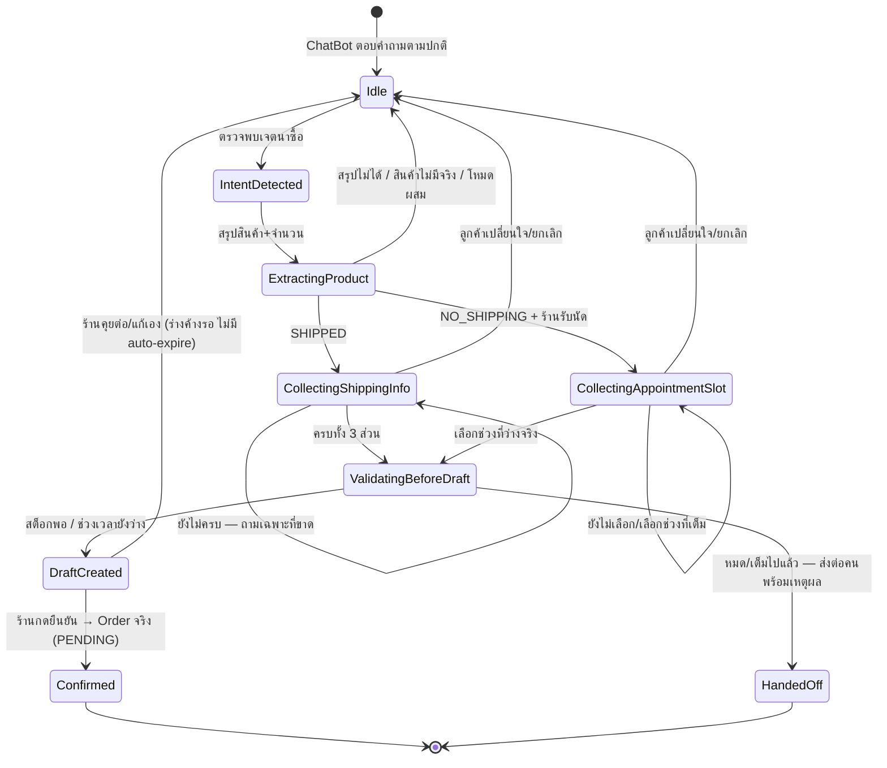

> **โมดูล:** M00023-SalesClosing (ส่วนขยายของ feature 00023 Deep Chat-Bot Assistant)
> **สถานะ:** Draft — รอ user review ก่อน implement (Hard Rule 11 doc-first) ยังไม่มี SRS/SDS/DATABASE

# PRD: ChatBot ปิดการขาย

## 0. ต่อยอดจากอะไร (ไม่ใช่ระบบใหม่)

เพิ่มพฤติกรรมให้เส้นทาง `resolutionLevel = CHATBOT` ที่มีอยู่แล้ว (`tryChatbotAnswer` → `answerFromKnowledge`) เดินหน้าไปถึง "เก็บข้อมูลปิดการขาย" แทนที่จะตอบคำถามเสร็จแล้วเงียบ ของที่ใช้ซ้ำทั้งหมด:

| ใช้ซ้ำ | ไฟล์ |
|---|---|
| เส้นทาง AI ตอบคำถาม + gate ทั้งหมด | `src/services/auto-reply.service.ts` |
| กรอง PII ก่อนส่งเข้า AI | `src/lib/pii-redact.ts` |
| สร้างคำสั่งซื้อจริง + ผูก Customer จาก conversationId | `src/services/order.service.ts::createOrder` |
| ตัดสิน "ต้องจัดส่งไหม" | `Product.fulfillmentMode` |
| คิวงาน + ตรวจความจุ | `src/services/appointment.service.ts`, `src/lib/appointments.ts` |
| แยกตำบล/อำเภอ/จังหวัด | `splitAddress()` ของ `thai-address-database` |

## 1. Executive Summary

ChatBot ตอบคำถามสินค้าได้ดีแล้ว แต่เมื่อลูกค้าตัดสินใจซื้อ ("รับค่ะ") บอทไม่รู้จะทำอะไรต่อ ทำให้เสียจังหวะปิดการขายตอนลูกค้าพร้อมที่สุด

ส่วนขยายนี้ให้บอทสานงานต่อจนถึง **สร้างคำสั่งซื้อ/การจองแบบร่าง**: ร้านมีจัดส่ง → ถามที่อยู่ผู้รับให้ครบ; ร้านบริการหน้าร้าน → ดึงช่วงเวลาว่างจริงมาให้เลือก จากนั้นเมื่อข้อมูลครบและผ่านการตรวจจริง ระบบสร้าง**ร่าง**ขึ้นให้ร้านกด "ยืนยัน" เอง — ไม่มีขั้นไหนที่ออเดอร์เข้าระบบจริงโดยไม่มีคนของร้านตรวจก่อน

หลักการเดิมยังอยู่ครบ: AI ห้ามแต่งข้อมูล ราคามาจาก `Product.price` เสมอ; ที่อยู่/เบอร์โทรห้ามส่งเข้า AI โค้ดเป็นคนอ่านและตรวจเอง; ไม่มั่นใจ = ไม่เดา

## 2. Goal / Non-goal

**Goal:** ให้ ChatBot เดินจาก "ตอบคำถาม" ไปถึง "เก็บข้อมูลให้ครบด้วยการตรวจเชิงโค้ด แล้วสร้างออเดอร์/การจองแบบร่างรอร้านยืนยัน" โดยไม่ให้ AI เป็นผู้ตัดสินราคา สินค้า หรือความครบถ้วนของข้อมูล

**Non-goal:**
- ไม่ทำให้ออเดอร์เข้าระบบจริงโดยไม่มีร้านกดยืนยัน
- ไม่แทนที่ flow ชำระเงิน/ยืนยันตัวตนเดิม (`/o/{token}` + phone-unlock)
- ไม่ตรวจ "เจตนาซื้อ" แม่น 100% — best-effort เหมือนเส้นทาง CHATBOT เดิม
- ไม่ทำ NLP ที่อยู่เกินกว่าที่ `splitAddress()` รองรับ
- ไม่มีปุ่มแก้ไขร่างในแชท (แก้ผ่านหน้าออเดอร์หลังยืนยัน — A-6)

## 3. User Stories

### ฝั่งร้าน
| ID | Story | Priority |
|---|---|---|
| US-SC-1 | ร้านมีจัดส่ง — ให้บอทถามที่อยู่ผู้รับเองเมื่อลูกค้าตกลงซื้อ ไม่ต้องพิมพ์ถามซ้ำทุกคน | Must |
| US-SC-2 | ร้านบริการหน้าร้าน — ให้บอทดึงคิวว่างจริงมาเสนอให้ลูกค้าเลือกจอง | Must |
| US-SC-3 | เห็นการ์ดสรุปร่างและกดยืนยันเองก่อนเข้าระบบจริงเสมอ | Must |
| US-SC-4 | มั่นใจว่าบอทไม่สร้างออเดอร์ผิดสินค้า/ราคาผิด/ตัดสต็อกเกิน เพราะ AI แต่งเอง | Must |

### ฝั่งลูกค้า
| ID | Story | Priority |
|---|---|---|
| US-SC-5 | ตัดสินใจซื้อแล้ว อยากให้ถามข้อมูลที่จำเป็นครบในคราวเดียว ไม่ต้องรอแอดมิน | Must |
| US-SC-6 | ลูกค้าร้านบริการ อยากเห็นเวลาว่างจริงแล้วเลือกจองในแชทเลย | Must |
| US-SC-7 | ให้ข้อมูลไม่ครบ/สะกดผิด อยากรู้ชัดว่าขาดอะไร ไม่ใช่โดนขอใหม่ทั้งหมด | Should |

## 4. Business Requirements

### 4.1 ร่วมทุกโหมด
| BR | คำอธิบาย |
|---|---|
| **BR-SC-01** | ออเดอร์/การจองต้องเป็น "ร่าง" เสมอจนกว่าร้านจะยืนยัน — ไม่มีเส้นทางใดที่มีผลต่อสต็อก/แจ้งเตือน/สถานะจริงโดยไม่มีร้านกดก่อน (user เคาะแล้ว ห้ามเปลี่ยน) |
| **BR-SC-02** | AI คืนได้แค่ `productId` + `qty` ที่เลือกจากสินค้าจริงของร้าน ราคาคำนวณจาก `Product.price` ณ เวลาสร้างร่าง ไม่ใช้ตัวเลขที่ AI พิมพ์ |
| **BR-SC-03** | ที่อยู่/เบอร์โทรห้ามส่งเข้า AI — AI ถาม แต่โค้ดอ่านและตรวจ (regex + `splitAddress()`) แล้วบอก AI แค่ "ฟิลด์ไหนยังขาด" (ชื่อฟิลด์ ไม่ใช่ค่า) |
| **BR-SC-04** | ไม่มั่นใจ = ไม่เดา — แยกเจตนาไม่ออก/แยกที่อยู่ไม่ได้/หาสินค้าไม่เจอ → ไม่สร้างร่าง ให้ถามซ้ำหรือส่งต่อคน |

### 4.2 โหมด SHIPPING
| BR | คำอธิบาย |
|---|---|
| **BR-SC-10** | ต้องเก็บให้ครบ: ชื่อผู้รับ, เบอร์โทร, ที่อยู่ (รายละเอียด + ตำบล + อำเภอ + จังหวัด + รหัสไปรษณีย์) |
| **BR-SC-11** | ต้องรับข้อมูลที่ให้มา **ทีละส่วนคนละข้อความ** และสะสมไว้ ไม่ตัดสินจากข้อความล่าสุดเดียว |

### 4.3 โหมด APPOINTMENT
| BR | คำอธิบาย |
|---|---|
| **BR-SC-20** | ช่วงเวลาที่เสนอต้องว่างจริง ณ ขณะนั้น ใช้ตรรกะความจุเดียวกับ feature 00024 |
| **BR-SC-21** | ช่วงที่ลูกค้าเลือกต้องตรวจซ้ำว่ายังว่างจริง ณ ตอนสร้างร่าง (อาจมีคนจองตัดหน้าระหว่างคุย) |

## 5. การตัดสินโหมด

> ⚠️ **Assumption A-1:** ระบบไม่มี toggle ระดับร้านสำหรับ "มีจัดส่งไหม" — มีแค่ `Product.fulfillmentMode` (`SHIPPED` | `NO_SHIPPING`) ระดับสินค้า ซึ่งเป็น SSOT อยู่แล้ว เสนอใช้ค่านี้ตัดสินโหมดต่อสินค้าที่ AI สรุปได้ แทนสร้าง config ใหม่

**เหตุผลที่ตะกร้าผสมโหมดแล้วไม่เข้าโหมดใด:** user ไม่ได้ระบุพฤติกรรมกรณีนี้ — ถอยดีกว่าเดา (BR-SC-04)

## 6. State Machine

## 7. NFR — PII

- **NFR-SC-1:** ทุกครั้งที่เรียก AI ในเส้นทางนี้ ข้อความต้องผ่าน `redactPii()` ก่อนเสมอ ไม่มีข้อยกเว้น
- **NFR-SC-2:** การตรวจความครบถ้วนของที่อยู่/เบอร์โทรทำที่ชั้นโค้ดเท่านั้น — AI ได้รับแค่รายชื่อฟิลด์ที่ขาด (เช่น `["postcode"]`)
- **NFR-SC-3:** `pii-redact.ts` ปัจจุบันไม่มี kind `NAME` — ชื่อผู้รับจึงไม่ถูกกรอง การขยายขอบเขตเป็นการตัดสินใจแยกของ 00019/00023 ไม่ใช่ scope นี้
- **NFR-SC-4:** `splitAddress()` ต้องมีรหัสไปรษณีย์ 5 หลักในข้อความเสมอ — ห้ามเดาตำบล/อำเภอ/จังหวัดโดยไม่มีรหัส

## 8. Risks

| ความเสี่ยง | ผลกระทบ | ระดับ | แนวทาง |
|---|---|---|---|
| จำแนกเจตนาซื้อผิด (false positive) | บอทถามที่อยู่โดยไม่มีใครขอ | กลาง | ไม่มี side effect จนร้านยืนยัน (BR-SC-01); ร้านเห็น log ว่าทำไมเข้าโหมด |
| จำแนกพลาด (false negative) | เสียจังหวะปิดการขาย (ปัญหาเดิม) | กลาง | ปลอดภัยกว่าเดาผิด — ลูกค้ายังคุยต่อได้ |
| AI หลอน productId | สร้างร่างผิดสินค้า | สูง | validate กับตาราง Product ของร้านเสมอ ไม่ผ่าน = ไม่สร้าง |
| ร่างค้างไม่หมดอายุ | ร่างเก่าสะสม | ต่ำ | ยอมรับในเฟสนี้ (ไม่มี side effect) — auto-expire เป็น Phase 2 |
| ที่อยู่สะกดผิดจน `splitAddress()` คืน null ซ้ำ | ลูกค้าถูกขอซ้ำจนหงุดหงิด | กลาง | ย้อนถามเจาะจง ("ขอรหัสไปรษณีย์ด้วยค่ะ") ไม่ขอใหม่ทั้งหมด |

## 9. Assumptions

| # | สมมติฐาน | เหตุผล |
|---|---|---|
| A-1 | โหมดตัดสินจาก `Product.fulfillmentMode` ไม่ใช่ toggle ระดับร้านใหม่ | มี capability model นี้อยู่แล้ว ไม่สร้างซ้ำ |
| A-2 | ตะกร้าผสมโหมด → ไม่เข้าโหมดอัตโนมัติ | user ไม่ได้ระบุ — ไม่เดา |
| A-3 | จำแนกเจตนาซื้อทำในการเรียก AI ครั้งเดียวกับตอบคำถาม (ไม่เพิ่มต้นทุน) | สอดคล้องงบเวลา/ต้นทุนของ 00023 |
| A-4 | ชื่อผู้รับไม่ถือเป็น PII ที่ต้องกรองในเฟสนี้ | ตรวจ `pii-redact.ts` จริงแล้ว ไม่มี `NAME` kind |
| A-5 | ไม่มี auto-expire ของร่าง | user ไม่ระบุ; ร่างไม่มี side effect |
| A-6 | แก้ร่างได้หลังยืนยันแล้วผ่านหน้าออเดอร์ปกติเท่านั้น | user ระบุแค่ปุ่ม "ยืนยัน" |
| A-7 | กลไกเก็บร่าง (schema) เป็นการตัดสินใจของ SRS/DATABASE รอบถัดไป | PRD/BRD ไม่ตั้งชื่อ schema เอง |

## 10. Out of Scope

| หัวข้อ | หมายเหตุ |
|---|---|
| แก้ไขร่างผ่านการ์ดแชท | แก้หลังยืนยันผ่านหน้าออเดอร์ (A-6) |
| Auto-expire ร่างค้าง | Phase 2 ถ้าพบว่าเป็นปัญหาจริง |
| ตะกร้าผสมโหมด | ไม่เข้าโหมดอัตโนมัติ (A-2) |
| ชำระเงิน/ยืนยันตัวตนแบบใหม่ | ใช้ flow เดิมหลังร้านยืนยัน |
| ขยาย PII ให้ครอบชื่อคน | คนละ scope — ของ 00019/00023 core |
| NLP ที่อยู่ขั้นสูง (แก้สะกดอัตโนมัติ) | เกินความสามารถ `splitAddress()` — ผิดแล้วย้อนถาม |
| แจ้งเตือนร้านทาง SMS/push เมื่อมีร่างใหม่ | user ไม่ได้ระบุ — เห็นจากการ์ดในแชทเท่านั้น |
