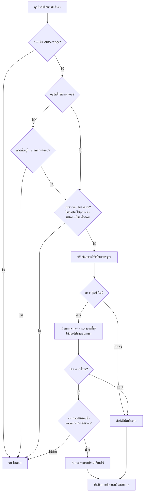

> **โมดูล:** M00023-ChatAutoReply
> **ประเภทเอกสาร:** Product Requirements Document (PRD)
> **เวอร์ชัน:** 1.0
> **วันที่จัดทำ:** 2026-07-29
> **สถานะ:** Draft — รอ user review ก่อนเริ่ม implement (Hard Rule 11)
> **เจ้าของเอกสาร:** BA + PO + PM (ดู [[Feature-Docs-Ownership]])

# PRD: ตอบแชทอัตโนมัติจาก Keyword

---

## 🛑 หมายเหตุสำคัญ — เอกสารนี้กลับมติเดิม (Supersede)

ฟีเจอร์นี้ **กลับมติที่บันทึกไว้ใน PRD 2 ฉบับก่อนหน้า** โดยเจตนา ไม่ใช่การมองข้าม:

| เอกสารเดิม | ข้อความเดิม | สถานะหลังเอกสารนี้ |
|---|---|---|
| `00018 - Facebook Chat Integration/PRD.md:281` | "Broadcast / message template / chatbot อัตโนมัติ … รวมถึง **AI ตอบเองโดยไม่มีคนกดส่ง**" อยู่ใน Out of Scope | **Superseded** เฉพาะส่วน "ตอบอัตโนมัติ" — Broadcast ยังอยู่นอกขอบเขตตามเดิม |
| `00019 - AI Reply Assistant/PRD.md:235` | "ตอบอัตโนมัติ (Auto-reply) — เฟสนี้ AI ร่างให้เท่านั้น คนต้องกดส่งเสมอ — การตอบอัตโนมัติมีความเสี่ยงด้านความน่าเชื่อถือสูงเกินกว่าจะปล่อยพร้อมกัน" | **Superseded** — ความเสี่ยงที่ระบุไว้ยังจริง แต่จัดการด้วยการ **แยก AI ออกจากเฟสแรก** (ดู §5) |

**เหตุผลที่กลับมติได้อย่างปลอดภัย:** ความเสี่ยงที่ 00019 กลัวคือ *AI แต่งข้อมูลแล้วส่งถึงลูกค้าโดยไม่มีคนตรวจ* เฟสแรกของฟีเจอร์นี้ **ไม่มี AI อยู่ในเส้นทางการส่งเลย** — ข้อความที่ลูกค้าได้รับคือข้อความที่เจ้าของร้านพิมพ์ไว้เองคำต่อคำ ความเสี่ยงจึงเปลี่ยนจาก "AI พูดผิด" เป็น "ร้านตั้งค่าผิด" ซึ่งร้านตรวจสอบและแก้ได้เองทันที

---

## Executive Summary

ร้านค้าบน Deep ที่ยิงโฆษณา Facebook เจอปัญหาเดียวกันทุกร้าน: ลูกค้าทักเข้ามาพร้อมกันเป็นสิบเธรดหลังโฆษณาออก แต่แอดมินตอบได้ทีละคน ลูกค้าที่รอเกิน 5 นาทีจำนวนมากหายไปก่อนได้คุย ทั้งที่ 80% ของข้อความแรกเป็นคำถามซ้ำ ๆ ไม่กี่แบบ — "สนใจ", "ราคาเท่าไหร่", "มีเก็บปลายทางไหม", "ส่งฟรีไหม"

ฟีเจอร์นี้ให้ร้านตั้ง **Keyword** พร้อมคำตอบสำเร็จรูปไว้ล่วงหน้า เมื่อลูกค้าทักเข้ามาแล้วข้อความตรงกับ Keyword ระบบจะตอบกลับให้ทันทีภายในไม่กี่วินาที โดยคำตอบเลือกได้ละเอียดตามบริบทที่ลูกค้าเข้ามา — **เพจไหน โฆษณาตัวไหน สินค้าอะไร** เพราะร้านเดียวกันที่ยิงโฆษณา 5 ตัวขายสินค้าคนละรุ่น ย่อมต้องตอบคนละราคา คำตอบกลาง ๆ ชุดเดียวใช้ไม่ได้จริง

จุดที่ต่างจาก chatbot ทั่วไปคือ **ระบบจะไม่แต่งคำตอบเองเด็ดขาด** ข้อความที่ลูกค้าได้รับคือข้อความที่เจ้าของร้านพิมพ์ไว้เองแบบคำต่อคำ ไม่มี AI มาเปลี่ยนราคาหรือเงื่อนไข และเมื่อไม่มี Keyword ไหนตรง ระบบจะเงียบแล้วส่งต่อให้แอดมินแทนที่จะเดา — สอดคล้องกับแกน "ความน่าเชื่อถือ" ที่เป็นคุณค่าหลักของแพลตฟอร์ม

ผู้ได้ประโยชน์คือร้านที่ยิงแอดและมีแชทเข้าเยอะ ผลทางธุรกิจคือลูกค้าได้รับคำตอบทันทีตลอด 24 ชั่วโมงโดยไม่ต้องจ้างแอดมินกะดึก และแอดมินเหลือเวลาไปโฟกัสเธรดที่ใกล้ปิดการขายจริง

---

## 1. Business Goals & KPIs

### 1.1 เป้าหมายทางธุรกิจ

| เป้าหมาย | รายละเอียด |
|----------|-----------|
| **ตอบลูกค้าทันทีโดยไม่ต้องมีคนเฝ้า** | ลูกค้าที่ทักมาตอนตี 2 หรือตอนแอดมินติดคุยเธรดอื่น ต้องได้รับคำตอบแรกภายในไม่กี่วินาที ไม่ใช่รอเช้า |
| **ตอบให้ตรงบริบทโฆษณาที่ลูกค้ากดเข้ามา** | ร้านเดียวยิงหลายโฆษณาขายคนละรุ่นคนละราคา — คำตอบต้องเลือกตามโฆษณา/เพจ/สินค้าที่ลูกค้าเข้ามา ไม่ใช่คำตอบกลางชุดเดียว |
| **ลดภาระคำถามซ้ำของแอดมิน** | คำถามแรกส่วนใหญ่เป็นแบบเดิมไม่กี่แบบ ระบบรับไปตอบเองเพื่อให้แอดมินไปโฟกัสเธรดที่ต้องใช้คน |
| **ไม่แลกความน่าเชื่อถือกับความเร็ว** | ข้อความที่ส่งถึงลูกค้าต้องเป็นข้อความที่ร้านเขียนไว้เองเท่านั้น ระบบห้ามแต่งราคา/เงื่อนไข/สต๊อกขึ้นเอง และเมื่อไม่มั่นใจต้องเงียบแล้วส่งต่อให้คน |
| **ร้านต้องกล้าเปิดใช้** | ต้องมีโหมดทดสอบที่ร้านลองกับเธรดของตัวเองได้ก่อน โดยลูกค้าจริงไม่โดนผลกระทบ — ฟีเจอร์ที่ร้านไม่กล้าเปิดคือฟีเจอร์ที่ไม่มีคุณค่า |

### 1.2 ตัวชี้วัดความสำเร็จ (KPIs)

| KPI | คำอธิบาย | เป้าหมาย |
|-----|----------|---------|
| **อัตราครอบคลุมของ Keyword** | จำนวนข้อความแรกของลูกค้าที่ match Keyword ได้ หารด้วยจำนวนข้อความแรกทั้งหมด (ของร้านที่เปิดใช้) | ≥ 60% ภายใน 30 วันหลังปล่อย |
| **เวลาตอบกลับครั้งแรกเฉลี่ย** | ค่าเฉลี่ยเวลาระหว่างข้อความลูกค้ากับข้อความตอบแรกของร้าน (มีเก็บอยู่แล้วใน `chat-metrics.service`) | ลดลง ≥ 50% ในร้านที่เปิดใช้ |
| **อัตราการตอบซ้ำ (ต้องเป็นศูนย์)** | จำนวนเคสที่ลูกค้าได้รับคำตอบอัตโนมัติเดียวกันเกิน 1 ครั้งต่อ 1 ข้อความ | **0** — เป็น hard requirement ไม่ใช่เป้าหมาย |
| **อัตราส่งต่อพนักงาน (Handoff)** | จำนวนเธรดที่ระบบส่งต่อให้คน หารด้วยจำนวนเธรดที่ระบบเข้าไปตอบ | ติดตามเป็น baseline (ไม่มีเป้าตายตัว — สูงไม่ได้แปลว่าแย่) |
| **ร้านที่เปิดใช้งานจริง** | จำนวนร้านที่ผ่านโหมดทดสอบแล้วเปิดใช้จริง หารด้วยจำนวนร้านที่เชื่อมเพจไว้ | ≥ 25% ภายใน 60 วัน |
| **อัตราที่แอดมินต้องรีบแก้คำตอบของระบบ** | จำนวนเคสที่แอดมินพิมพ์ตามหลังคำตอบอัตโนมัติภายใน 2 นาที (สัญญาณว่าระบบตอบผิดบริบท) | ≤ 15% |

---

## 2. User Personas (กลุ่มผู้ใช้งาน)

### 2.1 เจ้าของร้านที่ยิงโฆษณาหลายตัว

**ข้อมูลพื้นฐาน:**
- ร้านขายสินค้าเฉพาะทาง (อะไหล่มอเตอร์ไซค์ เครื่องสำอาง อาหารเสริม) มี 1-3 เพจ
- ยิงโฆษณาพร้อมกัน 3-10 ตัว แต่ละตัวขายสินค้าคนละรุ่นคนละราคา
- เป็นคนตั้งค่าระบบเอง ไม่มีทีมเทคนิค

**เป้าหมาย:**
- ให้ลูกค้าที่กดโฆษณาเข้ามาได้คำตอบเรื่อง "รุ่นนั้นราคาเท่าไหร่" ทันทีโดยไม่ต้องรอตน
- คุมได้ว่าโฆษณาตัวไหนตอบว่าอะไร โดยไม่ต้องตั้งค่าซ้ำทุกครั้งที่ยิงแอดใหม่

**ความต้องการ:**
- ตั้งคำตอบแยกตามเพจและตามโฆษณาได้ พร้อมมีคำตอบกลางไว้รองรับกรณีที่ไม่ได้ตั้งเฉพาะ
- ทดลองกับเธรดของตัวเองก่อนเปิดใช้จริงกับลูกค้า
- ดูย้อนหลังได้ว่าระบบตอบอะไรไปบ้างและทำไมถึงเลือกคำตอบนั้น

**จุดปวด (Pain Points):**
- ยิงแอดตอนกลางคืนแล้วลูกค้าทักมา 20 คน ตื่นมาเช้าลูกค้าหายไปครึ่ง
- ตอบผิดรุ่นผิดราคาบ่อยเพราะจำไม่ได้ว่าลูกค้าคนนี้มาจากโฆษณาตัวไหน
- เคยลองบอทเจ้าอื่นแล้วมันตอบมั่ว ลูกค้าด่า เลยเลิกใช้และไม่กล้าลองอีก

### 2.2 แอดมินร้าน (ผู้ตอบแชทประจำวัน)

**ข้อมูลพื้นฐาน:**
- ตอบแชท 30-100 เธรดต่อวัน ผ่านหน้า `/inbox` ของ Deep
- ไม่ได้เป็นคนตั้งค่าระบบ แต่เป็นคนรับผลกระทบเต็ม ๆ ถ้าระบบตอบผิด

**เป้าหมาย:**
- ไม่ต้องพิมพ์คำตอบเดิมซ้ำวันละ 50 รอบ
- เข้าไปรับช่วงต่อได้ทันทีเมื่อลูกค้าเริ่มถามลึก โดยระบบต้องหยุดแทรก

**ความต้องการ:**
- เห็นชัดในเธรดว่าข้อความไหนระบบตอบ ข้อความไหนคนตอบ
- กดหยุด auto-reply เฉพาะเธรดนั้นได้ทันทีโดยไม่กระทบเธรดอื่น
- ระบบต้องหยุดเองอัตโนมัติเมื่อตนเริ่มพิมพ์ตอบ ไม่ต้องรอกดปุ่ม

**จุดปวด (Pain Points):**
- กลัวระบบตอบแทรกกลางที่กำลังคุยเรื่องละเอียดกับลูกค้าอยู่ แล้วลูกค้าสับสน
- ไม่รู้ว่าลูกค้าเคยได้รับคำตอบอัตโนมัติอะไรไปแล้วบ้าง เลยตอบซ้ำกับที่ระบบตอบไป

### 2.3 ลูกค้าที่ทักมาจากโฆษณา

**ข้อมูลพื้นฐาน:**
- เห็นโฆษณาบน Facebook/Instagram กดปุ่ม "ส่งข้อความ" เข้ามา
- มักพิมพ์สั้นมาก: "สนใจ", "ราคา", "มีของไหม" — บ่อยครั้งไม่บอกด้วยซ้ำว่าสนใจรุ่นไหน

**เป้าหมาย:**
- รู้ราคาและเงื่อนไขให้เร็วที่สุด ถ้าไม่ตอบใน 5-10 นาทีก็ไปร้านอื่น

**ความต้องการ:**
- ได้คำตอบที่ตรงกับ **สินค้าในโฆษณาที่ตัวเองกดเข้ามา** ไม่ใช่รายการสินค้าทั้งร้าน
- ถ้าคำถามซับซ้อน ต้องได้คุยกับคนจริง ไม่ใช่วนอยู่กับบอท

**จุดปวด (Pain Points):**
- ทักไปแล้วเงียบ ไม่รู้ว่าร้านยังเปิดอยู่ไหม
- เจอบอทตอบไม่ตรงคำถาม แล้วหาทางคุยกับคนไม่ได้

---

## 3. Business Requirements

### 3.1 การตั้งค่า Keyword และคำที่ใช้ตรวจจับ

**ความต้องการ:**
- ร้านสร้าง "กลุ่มคำ" (Keyword) ได้เอง เช่น `สนใจสินค้า` `ถามราคา` `ถามเก็บปลายทาง` โดยหนึ่งกลุ่มมีคำที่ความหมายใกล้เคียงกันได้หลายคำ (`สนใจ`, `สนใจครับ`, `สนใจค่ะ`, `ขอรายละเอียด`, `อยากสั่ง`)
- แต่ละกลุ่มกำหนดรูปแบบการตรวจจับได้: ตรงทั้งข้อความ / มีคำนี้อยู่ในประโยค / ขึ้นต้นด้วยคำนี้
- กำหนดลำดับความสำคัญ (Priority) และเปิด/ปิดรายกลุ่มได้

**Business Rules:**
- BR-AR-01 — Keyword ทุกกลุ่มผูกกับร้านเสมอ ร้านหนึ่งเห็นและแก้ได้เฉพาะของตัวเอง
- BR-AR-02 — ก่อนเทียบคำ ระบบต้องปรับข้อความลูกค้าให้เป็นมาตรฐานก่อน (ตัดช่องว่างหัวท้าย รวมช่องว่างซ้ำ ตัดวรรณยุกต์/เครื่องหมายที่ไม่มีผล ไม่สนตัวพิมพ์เล็กใหญ่ของภาษาอังกฤษ) เพื่อให้ `สนใจค่ะ` `สนใจคับ` `สนใจจ้า` เข้ากลุ่มเดียวกันได้
- BR-AR-03 — หนึ่งข้อความของลูกค้าต้องได้คำตอบไม่เกิน 1 คำตอบเสมอ แม้จะตรงหลาย Keyword
- BR-AR-04 — เมื่อตรงหลายกลุ่ม ลำดับการตัดสินคือ Priority สูงกว่า → เฉพาะเจาะจงกว่า → ตรงทั้งข้อความมาก่อนมีคำอยู่ในประโยค → คำที่ยาวกว่ามาก่อน และถ้ายังเท่ากันต้องมีผู้ชนะที่กำหนดไว้ชัดเจน ห้ามสุ่ม
- BR-AR-05 — ระบบต้องบันทึกเหตุผลว่าเลือกกลุ่มไหนเพราะอะไรทุกครั้ง เพื่อให้ร้านตรวจสอบย้อนหลังได้

**เหตุผล:**
ลูกค้าไทยพิมพ์คำเดียวกันได้สิบแบบ ถ้าบังคับให้ร้านพิมพ์ทุกรูปแบบเองจะตั้งค่าไม่ไหวและพลาดตลอด การรวมเป็นกลุ่มคำและปรับข้อความให้เป็นมาตรฐานก่อนเทียบคือสิ่งที่ทำให้ระบบใช้ได้จริงกับภาษาไทย ส่วนกฎ "หนึ่งข้อความหนึ่งคำตอบ" ป้องกันไม่ให้ลูกค้าโดนยิงคำตอบรัวจนรำคาญ

### 3.2 คำตอบแยกตามเพจ โฆษณา และสินค้า

**ความต้องการ:**
- Keyword เดียวกันตั้งคำตอบแยกตาม **เพจ** ได้ (เพจอะไหล่ตอบแบบหนึ่ง เพจเครื่องสำอางตอบอีกแบบ)
- ตั้งคำตอบแยกตาม **โฆษณา** ได้ (โฆษณาตัวที่ 1 ขายรุ่น 390 บาท ตัวที่ 2 ขายรุ่น 590 บาท)
- ตั้งคำตอบแยกตาม **สินค้า** ได้
- ถ้าไม่ได้ตั้งเฉพาะไว้ ต้องถอยไปใช้คำตอบระดับกว้างกว่าได้เสมอ

**ลำดับการเลือกคำตอบ (เฉพาะเจาะจงที่สุดก่อน):**

| ลำดับ | ระดับ |
|---|---|
| 1 | Keyword + เพจ + โฆษณา + สินค้า |
| 2 | Keyword + เพจ + โฆษณา |
| 3 | Keyword + เพจ + สินค้า |
| 4 | Keyword + เพจ |
| 5 | Keyword + สินค้า |
| 6 | Keyword (คำตอบกลาง) |
| 7 | คำตอบกลางของเพจ |
| 8 | คำตอบกลางของร้าน |
| 9 | ไม่ตอบ — ส่งต่อให้พนักงาน |

**Business Rules:**
- BR-AR-06 — ต้องมีการถอยระดับ (fallback) เสมอ ห้ามมีสภาวะที่ "ตั้งค่าไม่ครบ" แล้วระบบเงียบทั้งที่มีคำตอบกลางอยู่
- BR-AR-07 — โฆษณาที่ระบบไม่รู้จัก (ไม่เคยตั้งค่าไว้) ต้องถอยไปใช้ระดับเพจ ไม่ใช่หยุดตอบ
- BR-AR-08 — ถ้าไม่เหลือระดับไหนให้ถอยแล้ว ระบบต้อง **เงียบและส่งต่อให้คน** ห้ามเดาคำตอบ

**เหตุผล:**
นี่คือหัวใจที่ทำให้ฟีเจอร์นี้ต่างจากบอทตอบคำถามทั่วไป ร้านที่ยิงแอดหลายตัวคือกลุ่มที่เจ็บที่สุดและจ่ายเงินมากที่สุด การตอบราคาผิดรุ่นเพราะระบบไม่รู้ว่าลูกค้ามาจากโฆษณาไหน สร้างความเสียหายมากกว่าการไม่ตอบเลย ส่วนการถอยระดับทำให้ร้านเริ่มใช้ได้ตั้งแต่ตั้งค่าแค่คำตอบกลาง แล้วค่อย ๆ ใส่รายละเอียดทีหลัง

### 3.3 บริบทโฆษณาและอายุของบริบท

**ความต้องการ:**
- เมื่อลูกค้ากดโฆษณาเข้ามา ระบบต้องจำได้ว่ามาจากโฆษณาตัวไหน และใช้บริบทนั้นกับข้อความถัด ๆ ไปในบทสนทนาเดียวกัน
- ร้านกำหนดอายุของบริบทได้ (ใช้จนกว่าจะปิดเธรด / ใช้ภายในกี่ชั่วโมง / ใช้จนกว่าจะเจอสินค้าใหม่)

**Business Rules:**
- BR-AR-09 — บริบทโฆษณาที่ใช้ต้องเป็น **ตัวล่าสุด** เสมอ ลูกค้าเก่าที่กลับมากดโฆษณาตัวใหม่ต้องได้คำตอบของตัวใหม่
- BR-AR-10 — ประวัติการกดโฆษณาทุกครั้งต้องเก็บไว้ครบ ห้ามทับของเดิมทิ้ง
- BR-AR-11 — ระบบต้องบันทึกที่มาของบริบท (มาจากโฆษณา / พนักงานกำหนดเอง / ตรวจจับจากข้อความ) และเวลาที่อัปเดตล่าสุดเสมอ
- BR-AR-12 — เมื่อบริบทขัดแย้งกัน **สิ่งที่พนักงานกำหนดเองชนะการแมปจากโฆษณา** และบริบทใหม่กว่าชนะบริบทเก่ากว่า

**เหตุผล:**
Meta ส่งข้อมูลโฆษณามาให้เพียงครั้งเดียวตอนที่ลูกค้ากดเข้ามา และ **ไม่มีทางเรียกย้อนหลังได้** ถ้าไม่เก็บตอนนั้นคือหายถาวร ส่วนกฎ "คนชนะระบบ" มาจากหลักเดียวกับทั้งฟีเจอร์: เมื่อข้อมูลขัดแย้ง ให้เชื่อสิ่งที่มนุษย์ยืนยันมากกว่าสิ่งที่ระบบอนุมาน

### 3.4 การควบคุมระดับเธรด และการหยุดแทรกพนักงาน

**ความต้องการ:**
- เปิด/ปิด auto-reply รายเธรดได้
- เมื่อพนักงานเข้ามาตอบเอง ระบบต้องหยุดตอบอัตโนมัติในเธรดนั้นชั่วคราว
- ร้านเลือกได้ว่าจะหยุดนานแค่ไหน (30 นาที / 2 ชั่วโมง / จนกว่าจะเปิดเอง / จนกว่าจะปิดเธรด)

**Business Rules:**
- BR-AR-13 — พนักงานพิมพ์ตอบในเธรด = หยุด auto-reply เธรดนั้นทันทีโดยอัตโนมัติ ไม่ต้องกดปุ่มใด ๆ
- BR-AR-14 — เธรดที่ถูกทำเครื่องหมายเป็นสแปม หรือถูกส่งต่อให้พนักงานแล้ว ต้องไม่ได้รับคำตอบอัตโนมัติ
- BR-AR-15 — สถานะการหยุดต้องมองเห็นได้ชัดในหน้าเธรด ไม่ใช่หยุดเงียบ ๆ จนแอดมินเข้าใจผิดว่าระบบยังทำงาน

**เหตุผล:**
สถานการณ์ที่ทำลายความน่าเชื่อถือเร็วที่สุดคือบอทตอบแทรกกลางบทสนทนาที่คนกำลังคุยเรื่องละเอียดอยู่ ลูกค้าจะรู้สึกว่าคุยกับเครื่องจักรและร้านไม่ใส่ใจ การหยุดอัตโนมัติเมื่อคนเริ่มพิมพ์จึงต้องเป็นพฤติกรรมโดยปริยาย ไม่ใช่ตัวเลือกที่ต้องไปเปิดเอง

### 3.5 โหมดทดสอบ (Test Mode)

**ความต้องการ:**
ร้านต้องทดลองระบบได้ 2 แบบ ก่อนเปิดใช้จริงกับลูกค้า:

**แบบที่ 1 — ทดสอบกฎแบบกรอกเอง (ไม่ส่งออกจริง)**
พิมพ์ข้อความสมมติ เลือกเพจ/โฆษณา/สินค้า แล้วดูผลทันทีว่า Keyword ไหน match, เลือกกฎระดับไหน, คำตอบที่จะส่งคืออะไร และทำไมกฎอื่นถึงไม่ถูกเลือก — ไม่แตะ Facebook ไม่บันทึกข้อความ

**แบบที่ 2 — ทดสอบกับเธรดจริง (ส่งออกจริง)**
เปิดโหมดทดสอบแล้วเลือกเธรดจากกล่องข้อความที่มีอยู่จริง (เช่นเธรดของตัวเองหรือของพนักงาน) จากนั้นพิมพ์เข้าไปในเธรดนั้นจาก Messenger จริงเพื่อดูว่าระบบตอบอย่างไร

**Business Rules:**
- BR-AR-16 — ขณะเปิดโหมดทดสอบ auto-reply ทำงาน **เฉพาะเธรดที่ระบุไว้เท่านั้น** ลูกค้าจริงคนอื่นทั้งร้านต้องไม่ได้รับคำตอบอัตโนมัติใด ๆ
- BR-AR-17 — การตรวจสอบโหมดทดสอบต้องเกิด **ก่อน** การประมวลผลที่มีต้นทุน (การเรียกบริการภายนอกใด ๆ) เสมอ
- BR-AR-18 — ข้อความที่ส่งในโหมดทดสอบ **ส่งถึงลูกค้าจริง** และต้องติดป้ายกำกับให้ฝั่งร้านเห็นชัดว่าเป็นข้อความทดสอบ
- BR-AR-19 — ตอนเลือกเธรดมาทดสอบ ระบบต้องเตือนให้ยืนยันพร้อมแสดงชื่อเธรดนั้น เพราะเป็นการส่งข้อความถึงคนจริง
- BR-AR-20 — ต้องมองเห็นได้ตลอดว่าร้านอยู่ในโหมดทดสอบ และโหมดต้องหมดอายุเองได้เพื่อกันร้านลืมปิด

**เหตุผล:**
ร้านที่เคยเจอบอทตอบมั่วมาก่อนจะไม่กล้าเปิดใช้ถ้าไม่ได้ลองเอง แต่การลองต้องไม่แลกด้วยความเสี่ยงที่ลูกค้าจริงโดนบอททดลอง โหมด allowlist แก้ทั้งสองอย่างพร้อมกัน และยังใช้เป็นขั้นแรกของแผนปล่อยจริงได้โดยไม่ต้องสร้างกลไกแยก

### 3.6 การป้องกันการตอบซ้ำและตอบรัว

**ความต้องการ:**
- ลูกค้าต้องไม่ได้รับคำตอบเดียวกันซ้ำ แม้ Facebook จะส่งข้อมูลเดิมเข้ามาซ้ำ
- Keyword เดิมต้องไม่ตอบซ้ำภายในระยะเวลาที่กำหนด
- จำกัดจำนวนคำตอบอัตโนมัติต่อเธรดได้
- ต้องไม่เกิดการตอบวนกันเองระหว่างระบบ

**Business Rules:**
- BR-AR-21 — หนึ่งข้อความของลูกค้าต้องนำไปสู่คำตอบอัตโนมัติไม่เกิน 1 ครั้ง แม้ระบบจะประมวลผลข้อความนั้นซ้ำ
- BR-AR-22 — ข้อความที่ฝั่งร้านเป็นผู้ส่ง (รวมถึงคำตอบของระบบเอง) ต้องไม่ถูกนำมาตรวจจับ Keyword เด็ดขาด
- BR-AR-23 — ถ้าระบบส่งข้อความสำเร็จแล้วแต่บันทึกสถานะไม่สำเร็จ การประมวลผลซ้ำต้องตรวจสอบได้ก่อนว่าส่งไปแล้ว ห้ามส่งซ้ำ

**เหตุผล:**
Facebook ส่งข้อมูลซ้ำเป็นเรื่องปกติ ไม่ใช่ความผิดปกติ ระบบต้องออกแบบโดยถือว่าจะโดนยิงซ้ำแน่นอน การตอบซ้ำสร้างความเสียหายต่อความน่าเชื่อถือทันทีและแก้ย้อนหลังไม่ได้ จึงกำหนดเป็นข้อบังคับระดับ 0 ครั้ง ไม่ใช่เป้าหมายที่ยอมพลาดได้

### 3.7 การส่งต่อให้พนักงาน (Human Handoff)

**ความต้องการ:**
ระบบต้องหยุดตอบและส่งต่อให้คนในกรณีต่อไปนี้:
- ไม่พบ Keyword ที่ตรง หรือไม่มีคำตอบให้ถอยไปใช้
- ลูกค้าขอคุยกับพนักงาน / ร้องเรียน / ถามเรื่องคืนเงิน / ถามเรื่องคำสั่งซื้อที่มีปัญหา
- ลูกค้าส่งข้อความมาเกินจำนวนที่กำหนดแล้วยังปิดการขายไม่ได้
- เกิดข้อผิดพลาดของระบบต่อเนื่อง

**Business Rules:**
- BR-AR-24 — เมื่อส่งต่อ ต้องเปลี่ยนสถานะเธรด หยุด auto-reply แจ้งพนักงาน และบันทึกเหตุผลไว้เสมอ
- BR-AR-25 — พนักงานที่รับช่วงต้องเห็นได้ว่าระบบตอบอะไรไปแล้วบ้าง มาจากโฆษณา/สินค้าอะไร และตัดสินใจด้วยเหตุผลอะไร

**เหตุผล:**
"ไม่รู้แล้วเงียบ" ปลอดภัยกว่า "ไม่รู้แล้วเดา" เสมอสำหรับแพลตฟอร์มที่ขายความน่าเชื่อถือ และการส่งต่อจะมีคุณค่าก็ต่อเมื่อคนที่รับช่วงเห็นบริบทครบ ไม่ใช่รับเธรดเปล่า ๆ มาเดาเองว่าเกิดอะไรขึ้นก่อนหน้า

### 3.8 บันทึกการทำงานและการตรวจสอบย้อนหลัง

**ความต้องการ:**
- ทุกครั้งที่ระบบตัดสินใจ (ทั้งตอบและไม่ตอบ) ต้องบันทึกไว้ให้ร้านค้นย้อนหลังได้
- ค้นหาได้จากเธรด ลูกค้า เพจ โฆษณา สินค้า Keyword ช่วงวันที่ และประเภทข้อผิดพลาด

**Business Rules:**
- BR-AR-26 — ต้องบันทึกทั้งกรณีที่ตอบและกรณีที่ตัดสินใจไม่ตอบ พร้อมเหตุผล — บันทึกเฉพาะตอนตอบจะทำให้ debug เคส "ทำไมไม่ตอบ" ไม่ได้เลย ซึ่งเป็นคำถามที่ร้านจะถามบ่อยที่สุด
- BR-AR-27 — ข้อมูลที่อ่อนไหวในบันทึกต้องถูกปกปิดตามมาตรฐานเดิมของระบบ

**เหตุผล:**
คำถามแรกที่ร้านจะถามเมื่อระบบทำงานผิดคาดคือ "ทำไมมันตอบแบบนี้" ถ้าตอบไม่ได้ ร้านจะปิดฟีเจอร์ทิ้งแทนที่จะแก้การตั้งค่า บันทึกการตัดสินใจจึงเป็นส่วนหนึ่งของคุณค่าฟีเจอร์ ไม่ใช่ของแถมสำหรับนักพัฒนา

---

### 3.9 AI Enhance (เตรียมไว้ล่วงหน้า — ยังไม่ implement ในเฟสปัจจุบัน)

> 🛑 **หัวข้อนี้เป็นเอกสารล่วงหน้าเท่านั้น** เขียนตาม Hard Rule 11 (doc-first) เพื่อล็อกการตัดสินใจของ user ก่อนแตะโค้ด AI Enhance ใด ๆ — **ไม่เปลี่ยน** Out of Scope §5 และไม่เปลี่ยน Non-goals ของ Scope Baseline `docs/scope/2026-07-31-00023-qna-library-scope-baseline.md`
> ที่มาของมติ: `docs/scope/2026-07-31-00023-ai-enhance-decisions.md` (รอบแรก) + `docs/scope/2026-08-01-00023-ai-enhance-decisions-round2.md` (รอบสอง ข้อ 7-10) + คำตอบ user 4 ข้อ 2026-08-01

**ความต้องการ:**
เมื่อร้านเปิด AI Enhance ให้กลุ่มคำใด ระบบจะให้ AI เรียบเรียงคำตอบสำเร็จรูปที่ร้านเขียนไว้ให้อ่านลื่นขึ้นก่อนส่ง โดยต้องไม่ทำให้ลูกค้ารอนาน ไม่พูดเกินสิ่งที่ร้านอนุญาต และไม่ทำให้ร้านเสียเงินเกินที่ตั้งใจ — ทั้งสามข้อสำคัญกว่าความสวยของถ้อยคำ

**Business Rules:**

- **BR-AR-31 (งบเวลา 8 วินาที)** — ทั้ง pipeline ของ AI Enhance (Guardrails-check + เรียบเรียง) ใช้เวลารวมได้ไม่เกิน **8 วินาที** นับตั้งแต่เรียกขั้นตอนแรกหลัง resolve คำตอบดิบสำเร็จ จนได้ผลลัพธ์ที่ parse ได้ เกินเวลาต้องยกเลิกทันทีแล้วส่งคำตอบดิบแทน ห้าม retry — อ้างอิงรุ่น `gemini-2.5-flash-lite`
  - **8 วินาทีคือสัญญากับลูกค้า ไม่ใช่สัญญากับแต่ละโมเดล** (มติ user 2026-08-01): โมเดลแรก timeout = AI Enhance ล้มทั้งรอบ **ไม่ไล่โมเดลสำรองตัวถัดไป** ต่างจาก 00019 ที่ไล่สำรองเฉพาะตอนเจอ 404 เพราะ 00019 มีแอดมินนั่งรอดูผล แต่ auto-reply ไม่มีคนรอ
  - กรณี resolve คำตอบดิบไม่ได้เลย (ส่งต่อคน) — **ไม่เรียก AI เลย** แม้กลุ่มคำนั้นเปิด AI Enhance ไว้
- **BR-AR-32 (ลำดับตรวจ Guardrails)** — ตรวจก่อนส่งถึงลูกค้าเสมอ ตามลำดับ: (1) denylist แบบ pattern (ไม่มีต้นทุน AI) (2) เรียก AI เรียบเรียง (3) **ข้อความที่ AI เรียบเรียงแล้ว** ต้องผ่านด่านตัดสิน AI แยก (prompt สั้น ตอบใช่/ไม่ใช่) อีกครั้งก่อนส่งจริง — ต้องตรวจสิ่งที่ AI สร้างขึ้น ไม่ใช่ตรวจแค่คำตอบดิบ เพราะความเสี่ยงจริงคือคำที่ AI เบี่ยงออกไปเอง
- **BR-AR-33 (fail-closed แต่แยกปลายทาง)** — 🛑 สองกรณีนี้ **ไม่ใช่เรื่องเดียวกัน**
  - **ชน Guardrails จริง** → ไม่ส่งข้อความใด ๆ เลย + ส่งต่อคนทันที (มติรอบแรกข้อ 6)
  - **ด่านตรวจเองล่ม/timeout** → ถอยไปส่ง**คำตอบดิบ**ที่ร้านเขียนเอง ซึ่งปลอดภัยโดยนิยามอยู่แล้ว (ไม่ใช่ส่งต่อคน ไม่ใช่เงียบหาย)
  - ลูกค้าไม่เห็น error ทั้งสามกรณี · ร้านต้องเห็นเหตุผลแยกกันอย่างน้อย 3 ค่า: `GUARDRAILS_BLOCKED` / `GUARDRAILS_CHECK_FAILED` / `AI_ENHANCE_TIMEOUT`
- **BR-AR-34 (ร้านตั้ง Guardrails เอง + ชุดเริ่มต้น)** — Guardrails ตั้งเป็น **รายกลุ่มคำ** ร้านเพิ่ม/ลบ/แก้ได้อิสระทุกข้อ ไม่มีข้อใดถูกบังคับห้ามปิด · SafePay เตรียมชุดเริ่มต้น **6 ข้อ** (มติ user 2026-08-01) ให้ก่อน:
    1. ห้ามต่อรองราคา/ให้ส่วนลดที่ไม่ได้ตั้งไว้ในระบบ
    2. ห้ามสัญญาระยะเวลาจัดส่งที่ไม่ตรงกับที่ร้านตั้งไว้
    3. ห้ามตอบเรื่องคืนเงิน/เคลม/ข้อพิพาทคำสั่งซื้อ — ต้องส่งต่อคนเสมอ
    4. ห้ามให้เลขบัญชี/พร้อมเพย์ที่ไม่ใช่ของร้านที่ตั้งไว้
    5. ห้ามวิจารณ์/เปรียบเทียบกับร้าน-แบรนด์คู่แข่ง
    6. ห้ามตอบประเด็นการเมือง/ศาสนา/เนื้อหาละเอียดอ่อนที่ไม่เกี่ยวกับสินค้า
  - ชุดเริ่มต้น **copy-by-value เฉพาะตอนกลุ่มคำนั้นเปิด AI Enhance ครั้งแรก** (pattern เดียวกับ "คัดลอกจากกลุ่มอื่น") — **ไม่ apply ย้อนหลัง** และเมื่อ SafePay ปรับชุดเริ่มต้นในอนาคต ข้อที่ร้านลบไปแล้ว **ต้องไม่ถูกเติมกลับ**
  - Guardrails (ข้อห้ามฝั่งบอท) เป็นคนละกลไกกับ `handoffPhrases` เดิม (คำที่**ลูกค้า**พิมพ์แล้วทริกเกอร์ส่งต่อคน) — ห้ามรวมเป็นอันเดียวกัน
- **BR-AR-35 (เพดานค่าใช้จ่ายต่อวัน)** — ร้านตั้งเพดานเองได้ หน่วยบาทจำนวนเต็ม **ระดับร้าน** (ไม่ใช่รายกลุ่มคำ) ค่าเริ่มต้น **฿50/วัน** (มติ user 2026-08-01 — ไม่ใช่ 0 เพราะจะบล็อกตั้งแต่วันแรก ไม่ใช่ unlimited เพราะขัดเจตนาที่กลัวเรื่องนี้พอดี)
  - ตัดรอบวันตาม **เวลาไทย** ด้วย `todayThaiIsoDate()` ตัวเดียวกับที่ระบบใช้อยู่ · ถึง **80%** ต้องแจ้งเตือนก่อน · ถึง **100%** ทุกกลุ่มคำในร้านนั้นถอยไปตอบคำตอบดิบจนขึ้นวันใหม่ หรือจนร้านปรับเพดานขึ้นเอง (ปรับขึ้นแล้วกลับมาทำงานทันที ไม่ต้องรอเที่ยงคืน)
  - **ช่องทางแจ้งเตือน 80%** (มติ user 2026-08-01): **banner ในแอปเป็นค่าเริ่มต้น** (ไม่มีต้นทุน ใช้ pattern `AdvanceWarningBanner.tsx` ที่มีอยู่แล้ว) + **SMS เป็น opt-in ที่ร้านเปิดเอง** (฿1/ครั้ง **default = ปิด**) — ยอมรับข้อจำกัดว่า banner อย่างเดียวร้านไม่เห็นตอนไม่เปิดแอป จึงต้องมีทางเลือก SMS ให้ร้านที่ยอมจ่าย
  - ร้านที่สมัคร Subscription รายเดือนไม่มีเพดานนี้ (bypass ทั้งหมด เหมือน `isOwnerPaidPlan` เดิม)
- **BR-AR-36 (หักเครดิตตามต้นทุน token จริง)** — ทุกครั้งที่ AI Enhance ทำงานสำเร็จ ต้องเก็บ `inputTokens` / `outputTokens` / `costUsd` — **ไม่ใช่ ฿1/ครั้งคงที่แบบ 00019**
  - ใช้ตาราง `AiSuggestUsageEvent` เดิมที่มีคอลัมน์เหล่านี้ครบอยู่แล้ว เพิ่ม `kind` ใหม่แยกจากของ 00019 (มติรอบแรกข้อ 5 "ใช้ร่วมกับ 00019 ไม่แยกระบบ")
  - **ตรวจก่อนเรียก AI**: ต้นทุนจริงรู้ได้หลัง Gemini ตอบเท่านั้น จึงตรวจล่วงหน้าได้แค่ระดับ gate — (ก) มีเครดิตเหลือ หรือ Subscription ACTIVE (ข) ยอดวันนี้ยังไม่ถึงเพดาน — ไม่ผ่านข้อใดข้อหนึ่ง **ห้ามเรียก AI** ถอยคำตอบดิบทันที
  - **ชนเพดาน** (`DAILY_CAP_REACHED`) กับ **เครดิตไม่พอ** (`INSUFFICIENT_CREDIT`) ปลายทางเหมือนกัน (ถอยคำตอบดิบ) แต่ต้องแยก log และแยกข้อความ — อย่างแรกคือร้านตั้งใจจำกัดตัวเอง อย่างหลังคือกระเป๋าเงินที่ใช้ร่วมกับ SMS หมดจริง

**⚠️ Assumption (ยังไม่ผ่าน user ยืนยันตรง ๆ — ต่างจาก BR ข้างบนที่มาจากมติ):**
- **USD→บาท** ยังไม่มีเรตกลางในระบบ (`ai-pricing.ts` แสดง `$` ล้วน) เสนอเพิ่มค่าคงที่ที่ตั้งสูงกว่าตลาดเล็กน้อยเป็น margin ปรับด้วยมือ ไม่ผูก API เรตสดแบบ real-time
- **กลไกปัดเศษ** `SellerWallet.balance` เป็นจำนวนเต็มบาท แต่ต้นทุนจริงต่อครั้งของ flash-lite อยู่ระดับเศษสตางค์ — ปัดขึ้น ฿1 ทุกครั้งจะกลายเป็น "฿1 คงที่" ที่ user ปฏิเสธไปแล้ว จึงเสนอ **accrual ledger**: สะสมเศษทศนิยมต่อร้าน พอถึง ≥฿1 ค่อยหักจำนวนเต็มผ่าน `deductCredit` เดิม แล้วเก็บเศษสะสมต่อ (ผลข้างเคียงที่ยอมรับ: ร้านเลิกใช้ก่อนสะสมครบ ฿1 เศษค้างจะไม่ถูกหัก)

**เหตุผล:**
AI ที่พูดเพราะแต่สัญญาสิ่งที่ร้านให้ไม่ได้ สร้างความเสียหายมากกว่าคำตอบสำเร็จรูปที่แข็งแต่ตรง — Guardrails กับการถอยไปคำตอบดิบจึงไม่ใช่ของเสริม แต่เป็นเงื่อนไขที่ทำให้เปิด AI ได้อย่างสบายใจ ส่วนเพดานต่อวันมีไว้เพื่อให้ร้านกล้าเปิดทิ้งไว้ข้ามคืนโดยไม่ต้องกลัวบิลบานปลาย

---

## 4. Business Rules & Constraints

### 4.1 กฎทางธุรกิจหลัก

| กฎ | คำอธิบาย |
|----|----------|
| **ข้อความที่ส่งต้องเป็นข้อความที่ร้านเขียนเอง** | เฟสแรกไม่มีการดัดแปลงข้อความใด ๆ ก่อนส่ง ลูกค้าได้รับสิ่งที่เจ้าของร้านพิมพ์ไว้คำต่อคำ |
| **ไม่มั่นใจ = เงียบ** | ไม่มี Keyword ตรงหรือไม่มีคำตอบให้ถอย ระบบต้องไม่ตอบและส่งต่อให้คน ห้ามเดา |
| **คนชนะระบบเสมอ** | พนักงานเข้ามาตอบ = ระบบหยุด; พนักงานกำหนดสินค้าเอง = ชนะการแมปจากโฆษณา |
| **หนึ่งข้อความ หนึ่งคำตอบ** | ไม่ว่าจะ match กี่ Keyword หรือระบบประมวลผลซ้ำกี่รอบ ลูกค้าได้รับคำตอบไม่เกิน 1 ครั้งต่อข้อความ |
| **ทดสอบต้องไม่กระทบลูกค้าจริง** | เปิดโหมดทดสอบ = ลูกค้าจริงทั้งร้านเงียบสนิท ตอบเฉพาะเธรดที่ระบุ |
| **แยกข้อมูลตามร้านเด็ดขาด** | ทุกการตั้งค่าและทุกบันทึกผูกกับร้าน ห้ามมีเส้นทางใดที่ร้านหนึ่งเห็นหรือกระทบข้อมูลอีกร้าน |

### 4.2 ข้อจำกัดทางธุรกิจ

| ข้อจำกัด | รายละเอียด |
|---------|-----------|
| **หน้าต่างตอบกลับ 24 ชั่วโมงของ Meta** | ตอบได้เฉพาะภายใน 24 ชม. นับจากข้อความล่าสุดของลูกค้า — ในทางปฏิบัติไม่กระทบ auto-reply เพราะระบบตอบทันทีที่ลูกค้าส่งข้อความเข้ามา (หน้าต่างเพิ่งรีเซ็ต) แต่ยังต้องตรวจไว้เป็นการป้องกันชั้นสุดท้าย |
| **ต้องตอบ Facebook ให้เร็ว** | ระบบต้องยืนยันรับข้อมูลกับ Facebook ทันที แล้วจึงค่อยประมวลผลและตอบ — ถ้าตอบช้า Facebook จะส่งข้อมูลซ้ำและอาจทำให้ลูกค้าได้รับคำตอบซ้ำ |
| **ข้อมูลโฆษณาที่ได้จาก Facebook มีจำกัด** | ได้รหัสโฆษณาและชื่อโฆษณา แต่ไม่ได้ชื่อแคมเปญ/ชุดโฆษณา ซึ่งต้องขอสิทธิ์เพิ่มที่ยังไม่มี — เฟสแรกจึงใช้รหัสโฆษณาเป็นหลัก |
| **รองรับเฉพาะ Messenger และ Instagram** | เป็นช่องทางเดียวที่เชื่อมต่ออยู่จริงบน production ในปัจจุบัน |

### 4.3 เงื่อนไขที่ระบบต้องไม่ตอบอัตโนมัติ

ระบบต้องข้ามการตอบอัตโนมัติในทุกกรณีต่อไปนี้ (ตรวจตามลำดับ):

1. ร้านปิด auto-reply
2. อยู่ในโหมดทดสอบ และเธรดนี้ไม่ได้อยู่ในรายการที่ระบุ
3. เธรดถูกทำเครื่องหมายเป็นสแปม
4. เธรดถูกส่งต่อให้พนักงานแล้ว หรือถูกหยุดชั่วคราวอยู่
5. พนักงานเพิ่งตอบในเธรดนี้ภายในช่วงเวลาที่กำหนด
6. ข้อความที่เข้ามาเป็นข้อความจากฝั่งร้านเอง
7. Keyword เดิมเพิ่งตอบไปภายในช่วงเวลาที่กำหนด
8. เธรดนี้ได้รับคำตอบอัตโนมัติครบจำนวนสูงสุดแล้ว
9. ไม่มี Keyword ใดตรง และไม่มีคำตอบกลางให้ถอยไปใช้

---

## 5. Out of Scope (นอกขอบเขต)

สิ่งที่ระบบนี้ **ไม่รองรับ** ในเฟสแรก:

| หัวข้อ | คำอธิบาย |
|--------|----------|
| **AI Enhance (ปรับข้อความให้เป็นธรรมชาติ)** | **เลื่อนไปเฟส 2 โดยเจตนา** — เฟสแรกพิสูจน์ให้ได้ก่อนว่ากลไก Keyword/บริบท/กันตอบซ้ำ/ส่งต่อคน ทำงานถูกต้อง การใส่ AI พร้อมกันทำให้แยกไม่ออกว่าปัญหามาจากกฎผิดหรือ AI พูดเกิน. โครงสร้างข้อมูลและสถาปัตยกรรมจะออกแบบเผื่อไว้ตั้งแต่เฟสแรกเพื่อไม่ต้องรื้อ **(รายละเอียดที่ตัดสินไว้ล่วงหน้าแล้วดู §3.9 — ยังคงอยู่นอกขอบเขตเฟสปัจจุบัน)** |
| **การตั้งค่าบุคลิก/น้ำเสียง AI** | ตามมาพร้อม AI Enhance ในเฟส 2 |
| **การตรวจสอบผลลัพธ์ AI** | ตามมาพร้อม AI Enhance ในเฟส 2 |
| **Broadcast / ส่งข้อความหาลูกค้าหลายคนพร้อมกัน** | ยังอยู่นอกขอบเขตตามมติเดิมของ 00018 — ฟีเจอร์นี้ตอบเฉพาะเมื่อลูกค้าทักมาก่อนเท่านั้น |
| **การตรวจจับคำสะกดผิด (Fuzzy Match)** | เลื่อนไปเฟส 2 — มีความเสี่ยงตอบผิด Keyword สูงถ้าตั้งค่าเกณฑ์ไม่ดี ต้องมีข้อมูลจริงจากเฟสแรกมาปรับก่อน |
| **การตรวจ "เจตนา" ของลูกค้าอัตโนมัติ** (เพิ่ม 2026-07-29 ตาม GAP-05) | เฟสแรกไม่มี AI จึงรู้ได้แค่ว่าข้อความ "ตรงคำที่ร้านตั้งไว้" ไม่ใช่ "ลูกค้ากำลังร้องเรียน" — การส่งต่อพนักงานกรณีร้องเรียน/คืนเงิน/ปัญหาคำสั่งซื้อ จึงอาศัย `handoffPhrases` ที่ร้านตั้งเองเท่านั้น (ดู BRD AC-019-01) |
| **การรวบข้อความหลายข้อความก่อนตอบ (Debounce)** | เลื่อนไปเฟส 2 — ต้องมีข้อมูลจริงว่าลูกค้าพิมพ์ติดกันบ่อยแค่ไหนก่อนจึงจะตั้งค่าหน่วงเวลาได้อย่างมีเหตุผล |
| **ช่องทาง LINE / TikTok** | ยังไม่ได้เชื่อมต่อบน production |
| **ชื่อแคมเปญ / ชุดโฆษณา จาก Facebook Marketing API** | ต้องขอสิทธิ์เพิ่มที่ยังไม่ได้ยื่น — เฟสแรกใช้รหัสโฆษณาและให้ร้านตั้งชื่อกำกับเองได้ |
| **แดชบอร์ดสถิติเต็มรูปแบบ** | เฟสแรกมีบันทึกที่ค้นหาได้ ส่วนกราฟ/รายงานรวมเลื่อนไปเฟส 2 |
| **แชทในแอป (DEEP)** | เฟสแรกทำเฉพาะช่องทางภายนอกที่มาจากโฆษณา ซึ่งเป็นจุดที่เจ็บจริง |

---

## 6. Risks & Mitigation (ความเสี่ยงและแนวทางแก้ไข)

### 6.1 ความเสี่ยงทางธุรกิจ

| ความเสี่ยง | ผลกระทบ | ระดับความรุนแรง | แนวทางแก้ไข |
|-----------|---------|-----------------|-------------|
| **ระบบตอบผิดบริบท (ราคาผิดรุ่น)** | ลูกค้าได้ข้อมูลผิด ร้านเสียเครดิต ขัดแกน "ความน่าเชื่อถือ" ของแพลตฟอร์ม | สูง | คำตอบมาจากที่ร้านพิมพ์เองเท่านั้น + ลำดับการเลือกที่เฉพาะเจาะจงก่อน + โหมดทดสอบก่อนเปิดจริง + บันทึกเหตุผลให้ตรวจย้อนหลังได้ |
| **ลูกค้าได้รับคำตอบซ้ำ** | ดูเป็นบอทเสีย ลูกค้ารำคาญและเลิกคุย | สูง | กำหนดเป็นข้อบังคับ 0 ครั้ง + ป้องกันหลายชั้นตั้งแต่ระดับฐานข้อมูล |
| **บอทตอบแทรกขณะพนักงานกำลังคุย** | ลูกค้าสับสน บทสนทนาเสียจังหวะ | สูง | พนักงานพิมพ์ = หยุดอัตโนมัติทันทีโดยไม่ต้องกดปุ่ม |
| **ร้านลืมปิดโหมดทดสอบ** | ร้านเข้าใจว่าระบบทำงานอยู่ แต่จริง ๆ ตอบแค่เธรดทดสอบ ลูกค้าจริงไม่ได้รับคำตอบและร้านไม่รู้ตัว | สูง | แสดงสถานะค้างไว้ตลอดในหน้ากล่องข้อความ + โหมดหมดอายุเองพร้อมแจ้งเตือน |
| **ร้านเผลอเลือกเธรดลูกค้าจริงมาทดสอบ** | ลูกค้าจริงโดนข้อความทดสอบ | กลาง | ต้องยืนยันพร้อมแสดงชื่อเธรดก่อนเปิดทุกครั้ง |
| **ร้านตั้งค่าไม่เป็น แล้วสรุปว่าฟีเจอร์ใช้ไม่ได้** | ฟีเจอร์ไม่ถูกใช้ ตัวชี้วัดไม่ขยับ | กลาง | เริ่มใช้ได้ตั้งแต่ตั้งคำตอบกลางอย่างเดียว + มีหน้าทดสอบกฎที่เห็นผลทันทีโดยไม่ต้องรอลูกค้าจริง |
| **ลูกค้ารู้สึกว่าคุยกับบอทแล้วออกจากบทสนทนา** | เสียโอกาสขายทั้งที่เดิมอาจปิดได้ | กลาง | ตอบสั้นตรงประเด็นตามที่ร้านเขียน + ส่งต่อคนทันทีเมื่อคำถามเกินกรอบ + ติดตามตัวชี้วัด "แอดมินต้องรีบแก้" |

### 6.2 ความเสี่ยงทางเทคนิค

| ความเสี่ยง | ผลกระทบ | แนวทางแก้ไข |
|-----------|---------|-------------|
| **ประมวลผลช้าจน Facebook ส่งข้อมูลซ้ำ** | เกิดการตอบซ้ำ และยิ่งช้ายิ่งซ้ำเป็นวงจร | ยืนยันรับข้อมูลกับ Facebook ทันทีแล้วแยกงานตอบออกไปทำต่างหาก — เป็นข้อกำหนดสถาปัตยกรรม ไม่ใช่การปรับแต่งประสิทธิภาพ |
| **งานที่แยกออกไปทำหายเมื่อเครื่องดับกลางคัน** | ลูกค้าไม่ได้รับคำตอบโดยไม่มีร่องรอย | บันทึกงานลงฐานข้อมูลก่อนเสมอ + มีงานเบื้องหลังคอยกวาดงานที่ค้าง |
| **แก้ระบบเดิมแล้วกระทบแชทที่ใช้งานอยู่จริง** | ความเสียหายกว้างกว่าตัวฟีเจอร์เอง — แชทเป็นระบบที่ร้านใช้ทุกวัน | ออกแบบให้เพิ่มเข้าไปโดยไม่แก้พฤติกรรมเดิม + ปิดฟีเจอร์ได้ทันทีโดยแชทเดิมทำงานปกติ |
| **การเปลี่ยนแปลงฐานข้อมูลกระทบ production** | ฐานข้อมูล dev และ prod ใช้ตัวเดียวกันในปัจจุบัน | ทุกการเปลี่ยนแปลงต้องเพิ่มอย่างเดียว ไม่แก้ ไม่ลบของเดิม + ขอยืนยันจากเจ้าของระบบก่อนดำเนินการทุกครั้ง |
| **จำนวนบันทึกโตเร็วเกินคาด** | พื้นที่จัดเก็บและความเร็วการค้นหาแย่ลง | กำหนดนโยบายเก็บย้อนหลังตั้งแต่ต้น + ออกแบบดัชนีให้ตรงกับรูปแบบการค้นหาจริง |

---

## 7. Glossary (อภิธานศัพท์)

| คำศัพท์ | ความหมาย |
|---------|----------|
| **Keyword (กลุ่มคำ)** | ชุดคำที่มีความหมายใกล้เคียงกัน ใช้ตรวจจับเจตนาของลูกค้า เช่น กลุ่ม "สนใจสินค้า" ประกอบด้วย สนใจ / สนใจครับ / ขอรายละเอียด |
| **Trigger Phrase (คำตรวจจับ)** | คำหรือวลีหนึ่งรายการภายในกลุ่มคำ |
| **Match Type (รูปแบบการตรวจจับ)** | วิธีเทียบข้อความกับคำตรวจจับ — ตรงทั้งข้อความ / มีคำอยู่ในประโยค / ขึ้นต้นด้วย |
| **Reply Rule (กฎคำตอบ)** | การจับคู่ระหว่างกลุ่มคำกับคำตอบ ภายใต้เงื่อนไขเพจ/โฆษณา/สินค้า |
| **Resolution Level (ระดับการเลือกกฎ)** | ระดับความเฉพาะเจาะจงของกฎที่ถูกเลือกใช้จริง (เช่น "Keyword + เพจ + โฆษณา") |
| **Fallback (การถอยระดับ)** | การถอยไปใช้คำตอบระดับกว้างกว่าเมื่อไม่มีการตั้งค่าเฉพาะ |
| **Ads Context (บริบทโฆษณา)** | ข้อมูลว่าลูกค้าเข้ามาจากโฆษณาตัวไหน ใช้เลือกคำตอบให้ตรงสินค้า |
| **Human Takeover (การรับช่วงโดยพนักงาน)** | สถานะที่พนักงานเข้ามาดูแลเธรดเอง ทำให้ระบบหยุดตอบอัตโนมัติ |
| **Human Handoff (การส่งต่อให้พนักงาน)** | การที่ระบบตัดสินใจหยุดตอบแล้วแจ้งให้คนเข้ามารับช่วง |
| **Test Mode (โหมดทดสอบ)** | โหมดที่ระบบตอบเฉพาะเธรดที่ระบุไว้ ลูกค้าจริงคนอื่นไม่ได้รับผลกระทบ |
| **AI Enhance** | การให้ AI ปรับข้อความจากคำตอบสำเร็จรูปให้ลื่นไหลขึ้น — **ไม่อยู่ในเฟสแรก** (รายละเอียดที่ตัดสินไว้ล่วงหน้าแล้วดู §3.9) |
| **Guardrails (กฎห้ามตอบ)** | ข้อห้ามที่ร้านตั้งไว้ว่า AI **ห้ามพูดถึงอะไร** ตรวจทั้งด้วย denylist และด้วย AI อีกชั้น ชนแล้วไม่ตอบเลยและส่งต่อคน — คนละกลไกกับ "สัญญาณส่งต่อ" ซึ่งเป็นคำที่**ลูกค้า**พิมพ์เข้ามา |

---

## 8. Success Metrics (ตัวชี้วัดความสำเร็จ)

เมื่อระบบทำงานได้ดี ควรมีผลลัพธ์ดังนี้:

| ตัวชี้วัด | ค่าที่คาดหวัง | วิธีวัด |
|----------|---------------|--------|
| **ลูกค้าได้รับคำตอบแรกเร็วขึ้นชัดเจน** | เวลาตอบกลับครั้งแรกลดลง ≥ 50% ในร้านที่เปิดใช้ | เทียบค่าเฉลี่ยก่อน/หลังเปิดใช้จาก `chat-metrics.service` |
| **ไม่มีการตอบซ้ำเลย** | 0 เคส | ตรวจจากบันทึกการทำงาน: ข้อความลูกค้า 1 รายการต้องมีคำตอบอัตโนมัติไม่เกิน 1 รายการ |
| **ระบบครอบคลุมคำถามแรกได้จริง** | ≥ 60% ของข้อความแรก match Keyword ได้ | นับจากบันทึกการทำงาน |
| **ร้านผ่านโหมดทดสอบแล้วกล้าเปิดจริง** | ≥ 70% ของร้านที่เปิดโหมดทดสอบ เปิดใช้จริงภายใน 7 วัน | นับจากการเปลี่ยนสถานะการตั้งค่า |
| **แอดมินไม่ต้องตามแก้บ่อย** | ≤ 15% ของคำตอบอัตโนมัติมีแอดมินพิมพ์ตามภายใน 2 นาที | เทียบเวลาข้อความในเธรด |
| **ไม่มีรายงานว่าบอทตอบแทรก** | 0 เคส | ติดตามจากรายงานผู้ใช้และตรวจสอบบันทึก |

---

## 9. Dependencies & Assumptions

### 9.1 สิ่งที่ต้องพึ่งพา (Dependencies)

| ระบบ/ส่วนประกอบ | ความสัมพันธ์ |
|-----------------|-------------|
| **feature 00018 — Facebook Chat Integration** | เป็นฐานทั้งหมด: การเชื่อมเพจ การรับข้อความ การส่งข้อความ การกันข้อความซ้ำ และการเก็บบริบทโฆษณา |
| **feature 00011 — Deep Chat** | โครงสร้างเธรดและข้อความที่ใช้ร่วมกันทุกช่องทาง |
| **feature 00014 — Customer Directory** | ใช้เชื่อมเธรดกับลูกค้าเพื่อประกอบบริบท |
| **ระบบสินค้า (Product)** | ใช้ผูกคำตอบกับสินค้าและอ้างอิงราคาจริง |
| **feature 00012 — Shop Staff** | สิทธิ์การเข้าถึงการตั้งค่า ใช้กลไกเดิมของร้าน |
| **Facebook Messenger Platform** | ข้อจำกัดเรื่องหน้าต่าง 24 ชม. และการส่งข้อมูลซ้ำเป็นเงื่อนไขที่ควบคุมไม่ได้ ต้องออกแบบรองรับ |

### 9.2 สมมติฐาน (Assumptions)

- **A-1** โหมดทดสอบเป็นการตั้งค่า **ระดับร้าน** ไม่ใช่ระดับเพจ — สอดคล้องกับการตั้งค่า AI เดิมที่เป็นระดับร้าน
- **A-2** ในโหมดทดสอบ การจำกัดจำนวนและระยะเวลาพักยังบังคับตามปกติ ไม่ผ่อนปรน — ถ้าต้องการทดสอบรัว ๆ ให้ใช้หน้าทดสอบกฎแบบกรอกเองแทน
- **A-3** ผู้ทดสอบจะทักเข้ามาในฐานะ **ลูกค้า** (จากบัญชี Facebook ส่วนตัว) ไม่ใช่ตอบในฐานะร้าน ดังนั้นกลไกหยุดเมื่อพนักงานตอบจะไม่ถูกกระทบ
- **A-4** ร้านที่เป็นกลุ่มเป้าหมายมีสินค้าไม่เกินหลักร้อยรายการและ Keyword ไม่เกินหลักสิบกลุ่ม
- **A-5** ร้านยอมรับว่าข้อความทดสอบถูกส่งถึงผู้รับจริง เพราะเลือกเธรดเอง (ยืนยันโดยเจ้าของระบบ 2026-07-29)
- **A-6** เฟสแรกไม่มีการเรียกใช้บริการ AI ใด ๆ ในเส้นทางการตอบ จึงไม่มีต้นทุนต่อข้อความเพิ่มจากผู้ให้บริการภายนอก

---

## 10. Appendix

### 10.1 ตัวอย่าง User Journey

**Scenario A: ร้านอะไหล่มอเตอร์ไซค์เปิดใช้งานครั้งแรก**

1. เจ้าของร้านเข้าหน้าตั้งค่าตอบอัตโนมัติ สร้างกลุ่มคำ `สนใจสินค้า` ใส่คำตรวจจับ: สนใจ / สนใจครับ / สนใจค่ะ / ขอรายละเอียด / อยากสั่ง
2. ใส่คำตอบกลางของกลุ่ม: *"สนใจสินค้ารายการไหนคะ ส่งรูปหรือชื่อสินค้าเข้ามาได้เลยค่ะ"*
3. เพิ่มคำตอบเฉพาะเพจ "โช๊คแต่ง": *"รับโช๊ครุ่นไหนดีคะ แจ้งรุ่นรถและปีรถได้เลยค่ะ"*
4. เพิ่มคำตอบเฉพาะโฆษณาตัวที่กำลังยิงอยู่: *"รุ่นนี้มีขนาดเดียว ราคา 590 บาท มีบริการเก็บเงินปลายทางค่ะ"*
5. เปิดโหมดทดสอบ เลือกเธรดของตัวเอง ระบบเตือนยืนยันว่าจะส่งข้อความจริงถึงเธรดนี้ — กดยืนยัน
6. เปิด Messenger จากบัญชีส่วนตัว พิมพ์ "สนใจครับ" เข้าไปที่เพจ
7. ได้รับคำตอบภายในไม่กี่วินาที ฝั่งร้านเห็นข้อความนั้นติดป้าย "ทดสอบ"
8. ตรวจในบันทึกการทำงาน เห็นว่าเลือกกฎระดับ "Keyword + เพจ + โฆษณา" เพราะเธรดมีบริบทโฆษณาอยู่
9. พอใจแล้วปิดโหมดทดสอบและเปิดใช้งานจริง — ลูกค้าจริงเริ่มได้รับคำตอบทันที

**Scenario B: ลูกค้าจริงทักเข้ามาแล้วถามลึกจนต้องส่งต่อคน**

1. ลูกค้ากดโฆษณา "โช๊คสามล้อบรรทุกหนัก" แล้วพิมพ์ "สนใจ"
2. ระบบบันทึกบริบทโฆษณา จับคู่กลุ่มคำ `สนใจสินค้า` เลือกกฎระดับโฆษณา แล้วตอบราคาของรุ่นนั้น
3. ลูกค้าพิมพ์ต่อ "มีเก็บปลายทางไหม" — ตรงกลุ่มคำ `ถามเก็บปลายทาง` ระบบตอบตามที่ร้านตั้งไว้
4. ลูกค้าพิมพ์ "ผมสั่งไปเมื่อวานแล้วของยังไม่มาเลย ขอเงินคืนได้ไหม"
5. ไม่ตรงกลุ่มคำใด และเข้าเงื่อนไขส่งต่อ (เรื่องคืนเงิน) → ระบบไม่ตอบ เปลี่ยนสถานะเธรด และแจ้งพนักงาน
6. แอดมินเปิดเธรด เห็นครบว่าลูกค้ามาจากโฆษณาไหน ระบบตอบอะไรไปแล้ว 2 ข้อความ และหยุดเพราะเหตุใด
7. แอดมินพิมพ์ตอบเอง → ระบบหยุด auto-reply เธรดนี้อัตโนมัติ ไม่ตอบแทรกอีก

### 10.2 ตัวอย่างการตั้งค่าที่แสดงคุณค่าหลักของฟีเจอร์

Keyword เดียวกัน (`สนใจ`) ให้คำตอบต่างกันตามบริบท:

| บริบทที่ลูกค้าเข้ามา | คำตอบที่ส่ง | ระดับกฎที่ใช้ |
|---|---|---|
| เพจ A (สายยาง) ไม่มีโฆษณา | "รับสายยางรุ่นไหนดีคะ แจ้งรุ่นรถหรือขนาดที่ต้องการได้เลยค่ะ" | Keyword + เพจ |
| เพจ B (โช๊ค) โฆษณาตัวที่ 1 | "มีขนาด 320 มม. และ 335 มม. ราคาคู่ละ 390 บาท มีบริการเก็บเงินปลายทางค่ะ" | Keyword + เพจ + โฆษณา |
| เพจ B (โช๊ค) โฆษณาตัวที่ 2 | "รุ่นนี้มีขนาดเดียว ราคา 590 บาท มีบริการเก็บเงินปลายทางค่ะ" | Keyword + เพจ + โฆษณา |
| เพจ B (โช๊ค) โฆษณาที่ยังไม่ได้ตั้งค่า | "รับโช๊ครุ่นไหนดีคะ แจ้งรุ่นรถและปีรถได้เลยค่ะ" | ถอยไป Keyword + เพจ |
| เพจ C ไม่ได้ตั้งค่าอะไรเลย | "สนใจสินค้ารายการไหน ส่งรูปหรือชื่อสินค้าเข้ามาได้เลยค่ะ" | ถอยไป Keyword (คำตอบกลาง) |

### 10.3 ภาพรวมการตัดสินใจของระบบ

---

**หมายเหตุ:**
เอกสารนี้เป็นการบันทึกความต้องการทางธุรกิจ (Business Requirements) โดยไม่มีรายละเอียดทางเทคนิค
สำหรับ Functional Requirements / User Story / Acceptance Criteria ดู [[BRD]] ของโมดูลนี้
สำหรับ technical specification ดู [[SRS]] ของโมดูลนี้
