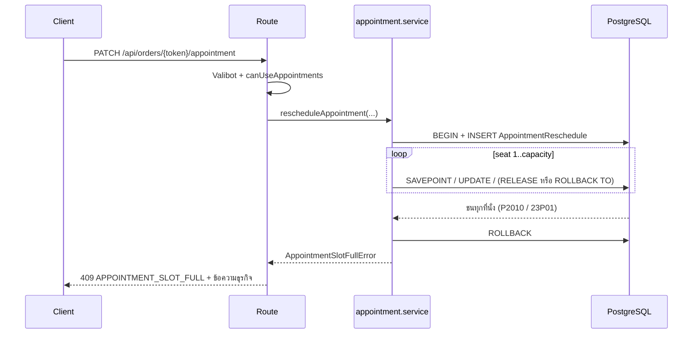
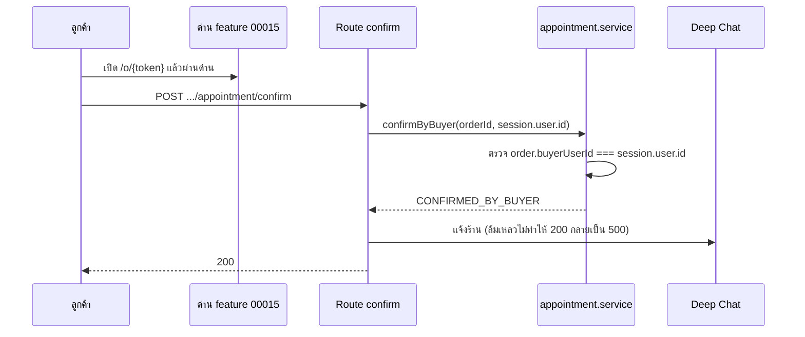

> **โมดูล:** M00024-ServiceAppointmentBooking
> **ประเภทเอกสาร:** API Specification
> **เวอร์ชัน:** 1.0
> **วันที่จัดทำ:** 2026-07-30
> **สถานะ:** Draft
> **เจ้าของเอกสาร:** safepay-planner (ดู [[Feature-Docs-Ownership]])

# API: ระบบนัดหมายวันเข้าใช้บริการ

---

## 1. Overview

พาธทั้งหมดยึด convention ที่มีอยู่จริงใน repo:

- **ทรัพยากรระดับร้าน** → `/api/shops/current/*` (precedent: `rooms`, `housekeepers` ของ feature 00017)
- **การกระทำต่อออเดอร์** → `/api/orders/[token]/*` โดย `token` = `Order.publicToken` (precedent: `confirm`, `ship`, `cancel`, `claim`)
  - ในกลุ่มนี้มีทั้ง action ของร้าน (`ship`) และของลูกค้า (`confirm`) อยู่แล้ว — แยกกันด้วย authz ไม่ใช่ด้วยพาธ

**หลักที่ใช้ทุก endpoint:**

| หัวข้อ | ข้อกำหนด |
|--------|----------|
| Validation | Valibot จาก `src/lib/validations.ts` |
| Feature gate | ทุก endpoint เรียก `canUseAppointments(shop)` — ไม่ผ่าน = 403 (TFR-001) |
| Cache | `export const dynamic = 'force-dynamic'` + `Cache-Control: private, no-store` (บทเรียน `feedback_auth_api_cache_control`) |
| CSRF/Rate-limit | ผ่าน `guardApi` ใน `src/proxy.ts` ตามที่มีอยู่ |
| เวลา | รับ/ส่งเป็น ISO-8601 ที่มี offset เสมอ |
| ข้อความ error | ระดับธุรกิจเท่านั้น — 🛑 ห้ามส่งข้อความดิบจาก Postgres (มีชื่อ constraint + เลขที่นั่ง) |
| `serviceSeat` | 🛑 **ห้ามปรากฏใน response ใด ๆ** — เป็นกลไกภายใน |

---

## 2. Authentication

| กลุ่ม | วิธียืนยันตัวตน | สิทธิ์ |
|------|----------------|-------|
| ร้าน (`/api/shops/current/*`, action ของร้านบน order) | NextAuth session (seller subdomain) | ต้องเป็นเจ้าของร้านหรือพนักงานที่มีสิทธิ์จัดการออเดอร์ (BR-RSV-25) |
| ลูกค้า (`confirm`, `reschedule-request`) | NextAuth session + กติกาการเข้าถึงของ feature 00015 | `order.buyerUserId` ต้องตรงกับ session (BR-RSV-21) |

🛑 **ห้ามสร้างเส้นทางเข้าถึงใหม่สำหรับฝั่งลูกค้า** — ใช้ด่านของ feature 00015 ตามที่เป็น (BR-RSV-20)

---

## 3. Endpoint List

| # | Method | Path | ผู้ใช้ | หน้าที่ |
|---|--------|------|-------|---------|
| 1 | GET | `/api/shops/current/service-resources` | ร้าน | list ทรัพยากร |
| 2 | POST | `/api/shops/current/service-resources` | ร้าน | สร้างทรัพยากร |
| 3 | PATCH | `/api/shops/current/service-resources/[id]` | ร้าน | แก้ไข (รวมความจุ / เปิด-ปิด) |
| 4 | DELETE | `/api/shops/current/service-resources/[id]` | ร้าน | ลบ (ได้เฉพาะที่ไม่มีนัด) |
| 5 | GET | `/api/shops/current/service-resources/availability` | ร้าน | ที่ว่างต่อช่วงเวลา |
| 6 | GET | `/api/shops/current/appointments` | ร้าน | ปฏิทินคิว |
| 7 | PATCH | `/api/orders/[token]/appointment` | ร้าน | ตั้ง/เลื่อนนัด |
| 8 | POST | `/api/orders/[token]/appointment/outcome` | ร้าน | ให้บริการแล้ว / ไม่มาตามนัด |
| 9 | POST | `/api/orders/[token]/appointment/confirm` | ลูกค้า | ยืนยันนัด |
| 10 | POST | `/api/orders/[token]/appointment/reschedule-request` | ลูกค้า | ขอเลื่อนนัด |

**การสร้างออเดอร์พร้อมนัด** ใช้ `POST /api/orders` เดิม โดยเพิ่มฟิลด์ `appointment` ใน payload — **ไม่สร้าง endpoint ใหม่**

---

## 4. Endpoint Detail

### 4.1 `POST /api/shops/current/service-resources`

สร้างทรัพยากรที่จองได้ (FR-RSV-01)

**Request**

```jsonc
{
  "name": "หมอนวด A",              // บังคับ, 1-100 ตัวอักษร
  "description": "นวดแผนไทย",       // ไม่บังคับ
  "durationMinutes": 60,            // ไม่บังคับ, > 0
  "capacity": 1,                    // ไม่บังคับ, default 1, จำนวนเต็ม >= 1
  "depositMode": "PERCENT",         // ไม่บังคับ, "FIXED" | "PERCENT", default "FIXED"
  "depositValue": "30"              // ไม่บังคับ, default "0"; PERCENT → 0-100, FIXED → บาท >= 0
}
```

**Response 201**

```jsonc
{
  "id": "uuid",
  "name": "หมอนวด A",
  "description": "นวดแผนไทย",
  "durationMinutes": 60,
  "capacity": 1,
  "depositMode": "PERCENT",
  "depositValue": "30.00",
  "isActive": true
}
```

**Errors:** `400` validation, `403` ไม่ผ่าน feature gate

> **มัดจำ (FR-RSV-12):** `depositValue = "0"` แปลว่า **ไม่เก็บมัดจำ** (BR-RSV-44) — ค่านี้เป็นเพียง
> "ค่าเริ่มต้นช่วยกรอก" ตอนสร้างออเดอร์ 🛑 **ห้ามให้ออเดอร์อ้างอิงค่านี้สด** ยอดจริงถูก snapshot
> ไว้ที่ `Order.depositAmount` ตอนสร้าง (BR-RSV-46) — แก้ค่าที่ทรัพยากรภายหลังต้องไม่ทำให้ยอดของ
> ออเดอร์เก่าขยับ

---

### 4.0 `PATCH /api/shops/current/appointment-settings`

ตั้งค่าหน่วยเวลาของการนัดระดับร้าน (FR-RSV-13)

**Request**

```jsonc
{ "appointmentGranularity": "DAY" }   // "DAY" | "TIME"
```

**Response 200** — `{ "appointmentGranularity": "DAY" }`

**Errors:** `400 VALIDATION_ERROR` (ค่านอก 2 ตัวเลือก), `403 FEATURE_NOT_AVAILABLE`

> 🛑 เปลี่ยนค่านี้ **ไม่แตะนัดที่บันทึกไว้แล้วแม้แต่แถวเดียว** (BR-RSV-55) — เป็นแค่ค่าที่บอกว่า
> "ฟอร์มสร้างออเดอร์ควรถามอะไร" การแสดงผลของนัดเก่าตัดสินจากข้อมูลจริงของแถวนั้นเสมอ (BR-RSV-57)
>
> โหมด `DAY`: ฝั่ง client ส่ง `start` = 00:00 และ `end` = 00:00 ของวันถัดไป (เวลาไทย) —
> **ไม่มีฟิลด์/flag ใหม่ใน payload ของ appointment** โครงสร้างเดิมรองรับอยู่แล้ว (BR-RSV-54)

---

### 4.1.1 `GET /api/shops/current/service-resources`

รายการทรัพยากรของร้าน (ใช้ทั้งหน้าตั้งค่าและ dropdown เลือกทรัพยากรในฟอร์ม POS)

**Query:** `activeOnly=1` (ไม่บังคับ) — กรองเฉพาะที่ยังเปิดใช้งาน

**Response 200** — 🛑 ห่อด้วยคีย์ `resources` ไม่ใช่ array เปล่า

```jsonc
{
  "resources": [
    { "id": "uuid", "name": "หมอนวด A", "description": "นวดแผนไทย", "durationMinutes": 60, "capacity": 1, "isActive": true }
  ]
}
```

เรียงตาม `isActive desc` แล้ว `name asc` — ทรัพยากรที่ปิดใช้งานตกไปอยู่ท้ายรายการเสมอ

---

### 4.2 `PATCH /api/shops/current/service-resources/[id]`

แก้ไขทรัพยากร — รวมการเปลี่ยนความจุและเปิด/ปิดการใช้งาน

**Request** (ส่งเฉพาะฟิลด์ที่ต้องการแก้)

```jsonc
{ "capacity": 3, "isActive": false }
```

**Response 200** — เหมือน 4.1

**Errors**

| Status | Code | เมื่อไหร่ |
|--------|------|----------|
| 400 | `VALIDATION_ERROR` | ความจุ < 1 หรือไม่ใช่จำนวนเต็ม |
| 403 | `FEATURE_NOT_AVAILABLE` | ร้านไม่เข้าเงื่อนไข BR-RSV-01 |
| 404 | `RESOURCE_NOT_FOUND` | ไม่ใช่ทรัพยากรของร้านนี้ |
| 409 | `CAPACITY_REDUCTION_BLOCKED` | ลดความจุแล้วมีนัดที่ยังไม่ผ่านติดอยู่ (BR-RSV-06.2) |

```jsonc
// 409 CAPACITY_REDUCTION_BLOCKED
{
  "error": "CAPACITY_REDUCTION_BLOCKED",
  "message": "ลดจำนวนคิวไม่ได้ เพราะยังมีนัดที่จองไว้เกินจำนวนใหม่",
  "blockedBy": { "orderNo": "DP25690800001", "start": "2026-08-03T10:00:00+07:00", "end": "2026-08-03T11:00:00+07:00" }
}
```

---

### 4.3 `DELETE /api/shops/current/service-resources/[id]`

**Response 204**

**Errors**

| Status | Code | เมื่อไหร่ |
|--------|------|----------|
| 409 | `RESOURCE_HAS_APPOINTMENTS` | มีนัดผูกอยู่ (FK RESTRICT) — ข้อความต้องแนะให้ปิดการใช้งานแทน |

---

### 4.4 `GET /api/shops/current/service-resources/availability`

ที่ว่างของทรัพยากรหนึ่งหน่วยในช่วงที่ขอ (TFR-005)

> 🛑 **ตั้งแต่ 2026-08-08 ไม่มี UI ไหนเรียก endpoint นี้แล้ว** — ปฏิทินเลือกวัน+เวลา (`AppointmentDateSheet.tsx`, ทั้งตอนสร้างออเดอร์และตอนเลื่อนนัด) เปลี่ยนไปเรียก §4.5 (`GET /api/shops/current/appointments`) แทน เพราะต้องใช้ชื่อลูกค้า/เลขออเดอร์/สถานะนัดประกอบรายการของวันนั้นด้วย ไม่ใช่แค่ตัวเลขจำนวน — endpoint นี้ **ยังอยู่ในระบบ ไม่ได้ถูกลบ** เผื่อมี consumer อื่นในอนาคต (ดู SDS §3.7)

> 🛑 ผลลัพธ์นี้ใช้ **แสดงผลเท่านั้น** ไม่ใช่กลไกตัดสิน — ตัวตัดสินคือ EXCLUDE constraint ตอนบันทึกจริง ระหว่างที่ผู้ใช้ดูอยู่ อาจมีคนจองแทรกเข้ามาได้เสมอ

**Query:** `resourceId` (บังคับ), `from` (ISO), `to` (ISO) — ทั้งสามตัวบังคับ; `to <= from` = 400

**Response 200**

```jsonc
{
  "resourceId": "uuid",
  "capacity": 8,
  "busy": [
    { "start": "2026-08-03T09:00:00+07:00", "end": "2026-08-03T10:00:00+07:00" },
    { "start": "2026-08-03T09:00:00+07:00", "end": "2026-08-03T10:00:00+07:00" },
    { "start": "2026-08-03T10:00:00+07:00", "end": "2026-08-03T11:00:00+07:00" }
  ]
}
```

> 🛑 **`busy` = หนึ่งแถวต่อหนึ่งนัด ไม่ใช่ช่วงที่ aggregate มาแล้ว** — ไม่มีฟิลด์นับจำนวน
> (`getResourceAvailability` ใน `appointment.service.ts` คืนแถวดิบจาก `Order` ที่ `status <> 'CANCELLED'`
> และช่วงทับกับหน้าต่างที่ขอ เรียงตาม `serviceStart`)
>
> ตัวอย่างข้างบนคือ 09:00–10:00 ถูกจอง **2 คิว** และ 10:00–11:00 ถูกจอง **1 คิว**
>
> UI ที่ต้องแสดง "จองแล้ว n จาก m คิว" (FR-RSV-03/04) ต้อง **นับช่วงที่ทับกันเอง** แล้วเทียบกับ `capacity`:
> ณ เวลา `t` ใด ๆ → `n = busy.filter(b => b.start <= t && t < b.end).length`, `m = capacity`
>
> เหตุที่ไม่ aggregate ที่ server: การนัดกำหนดช่วงเวลาได้อิสระ (ไม่ใช่ slot ตายตัว) ช่วงที่ทับกัน
> บางส่วนจึงรวมเป็นแถวเดียวไม่ได้โดยไม่ทำให้ข้อมูลเพี้ยน
>
> 🛑 ห้ามใช้ค่านี้เป็น **ตัวตัดสิน** ว่าจองได้/ไม่ได้ — ใช้แสดงผลอย่างเดียว (ดูคำเตือนด้านบน)

---

### 4.5 `GET /api/shops/current/appointments`

ปฏิทินคิว (FR-RSV-04)

**Query:** `from`, `to` (บังคับ), `resourceId` (ไม่บังคับ)

**Response 200**

```jsonc
{
  "items": [
    {
      "orderToken": "uuid",
      "orderNo": "DP25690800001",
      "resource": { "id": "uuid", "name": "หมอนวด A", "capacity": 1 },
      "start": "2026-08-03T14:00:00+07:00",
      "end": "2026-08-03T15:30:00+07:00",
      "appointmentStatus": "CONFIRMED_BY_BUYER",
      "buyerName": "สมชาย"        // 🛑 ชื่อเท่านั้น — ห้ามส่งเบอร์/อีเมล (TFR-010)
    }
  ]
}
```

> 🛑 **TFR-010:** หน้านี้อยู่ใต้ client layout → ทุก field ที่ส่งกลับจะถูก serialize เข้า flight payload ต้องตัดข้อมูลลูกค้าที่ไม่จำเป็นออก **ที่ server** ไม่ใช่ตอนแสดงผล
>
> 🛑 **คำขอนี้ครอบทั้งเดือน — ห้ามเติมเบอร์/รูปลงที่นี่เด็ดขาด** ต้องการข้อมูลติดต่อให้ใช้ §4.5b

---

### 4.5b `GET /api/shops/current/appointments/day`

นัดของ **หนึ่งวัน** พร้อมข้อมูลติดต่อลูกค้า (ส่วนขยาย 2026-08-11 — การ์ดคิวงานรายวัน)

**Query:** `date` (`YYYY-MM-DD` ตามปฏิทินไทย, บังคับ), `resourceId` (ไม่บังคับ)

**Response 200**

```jsonc
{
  "items": [
    {
      "orderToken": "uuid",
      "orderNo": "DP25690800001",
      "resource": { "id": "uuid", "name": "หมอนวด A", "capacity": 1 },
      "start": "2026-08-15T09:00:00+07:00",
      "end": "2026-08-15T10:00:00+07:00",
      "appointmentStatus": "CONFIRMED_BY_BUYER",
      "buyerName": "สมชาย",
      "buyerContact": "0812345678",   // null ได้ (นัดที่ร้านคีย์เองมักไม่มี)
      "source": {                      // null = ไม่ได้เกิดจากแชท ⇒ UI ห้าม render ปุ่มทักแชท
        "channel": "MESSENGER",        // provider ของ ShopChannel — MESSENGER|INSTAGRAM|LINE
        "pageName": "BT Premium",
        "pageAvatarUrl": "https://…"   // null ได้
      },
      "salesChannel": "STOREFRONT",    // หมวดที่ร้านเลือกเองตอนสร้าง — คนละเรื่องกับ source
      "firstItemName": "ติดตั้งไฟหน้า", // ชื่อรายการแรกในบิล · null = บิลยังไม่มีรายการ
      "itemCount": 2,                  // จำนวนรายการทั้งหมด — UI ต่อท้ายเป็น "+1"
      "totalAmount": "3500.00",
      "depositAmount": "900.00",       // 🛑 ยอดที่ตกลงไว้ ไม่ใช่สถานะจ่าย (ดูหมายเหตุ)
      "customerAvatarUrl": null,       // 🛑 null เป็นค่าปกติ ไม่ใช่ error (ดูหมายเหตุ)
      "conversationId": "uuid"         // null = ไม่มีเธรดให้เปิด (ดูลำดับด้านล่าง)
    }
  ]
}
```

**400** `VALIDATION_ERROR` — ไม่ส่ง `date` หรือรูปแบบไม่ใช่ `YYYY-MM-DD` หรือเป็นวันที่ไม่มีอยู่จริง
(เช็ค roundtrip ไม่ใช่แค่ regex — `2569-02-31` ผ่าน regex แต่ `Date.UTC` จะม้วนไปวันอื่นเงียบ ๆ)

> 🛑 **รับ `date` ไม่รับ `from`/`to`** — endpoint นี้คืนเบอร์ลูกค้า การรับช่วงเวลาอิสระแปลว่าใครก็ขอ
> ทั้งปีในคำขอเดียวได้ เพดานต้องถูกบังคับด้วย **รูปร่างของ input** ไม่ใช่ด้วยความตั้งใจของผู้เรียก
>
> 🛑 **`depositAmount` คือยอดที่ *ตกลงไว้* ไม่ใช่สถานะการจ่าย** — ระบบไม่ติดตามว่าจ่ายแล้วหรือยังเลย
> (BR-RSV-50) UI จึงพูดได้แค่ "มัดจำ ฿900" **ห้ามเขียน "จ่ายมัดจำแล้ว"/"ค้างมัดจำ"** ซึ่งเป็นการกุ
> ข้อมูลที่ไม่มีอยู่จริง · `"0"` = ไม่เก็บมัดจำ (BR-RSV-44) ⇒ ไม่แสดงส่วนมัดจำเลย
>
> 🛑 **ส่งชื่อรายการแรก + ตัวนับ ไม่ส่งทั้งอาเรย์** — การ์ดแสดงบรรทัดเดียว การส่งรายการเต็มคือ
> payload ที่ไม่มีใครอ่านและบวมตามจำนวนสินค้าในบิล

> 🛑 **`customerAvatarUrl` เป็น `null` ได้เสมอ** — Meta บล็อกรูปโปรไฟล์ Messenger ทั้งหมด
> (ต้อง Advanced Access ของ `Business Asset User Profile Access`) ⇒ ฝั่ง UI ต้องออกแบบให้ **ตัวย่อ
> เป็นของหลัก ไม่ใช่ของสำรอง** · IG/LINE ได้รูปจริง
>
> 🛑 **`source` กับ `salesChannel` ห้ามใช้แทนกัน** (สคีมาเตือนไว้ที่ `Order.shopChannelId`) —
> `source` = *ข้อเท็จจริง* ว่าใบนี้เกิดจากเธรดไหน (พาย้อนกลับไปห้องแชทได้) · `salesChannel` =
> *หมวดที่ร้านเลือก/แก้เองได้* ค่าตั้งต้นของฟอร์มคือ `STOREFRONT` จึงมีค่าเกือบทุกใบ
>
> UI แสดง "ลูกค้ามาจากไหน" ตามลำดับ **เธรดจริง → หมวดที่ร้านเลือก → `ไม่ระบุช่องทาง`**
> ⇒ ไม่มีคำที่ประดิษฐ์ขึ้นสำหรับเคส "ไม่มีเธรด" เลย (คำสุดท้ายคือคำเดียวกับที่ `/orders` ใช้กับ
> ฟิลด์เดียวกัน) · ของเดิมเขียนว่า "สร้างนอกแชท" ซึ่งเป็นคำที่สองของเรื่องเดียวกัน — user เคาะเปลี่ยน 2026-08-12

> 🛑 **`conversationId` = ห้อง**ต้นทาง**ของออเดอร์ก่อนเสมอ** (`Order.conversationId`) แล้วค่อยถอย
> ไปห้องที่ derive จาก contact ของลูกค้า — การหาห้องด้วย "contact ของลูกค้าคนนี้ แล้วเอาห้องที่คุย
> ล่าสุด" **เลือกผิดห้องทันทีที่ลูกค้าคนเดียวกันทักมาสองเพจ** (บั๊กเดียวกันถูกปิดไปแล้วที่
> `GET /api/orders/[token]/appointment-summary`) · fallback ยังต้องมีเพราะคอลัมน์นี้เพิ่งเพิ่ม
> 2026-08-12 — นัดที่สร้างก่อนหน้านั้นเป็น null ทั้งหมด ตัดทิ้งแล้วปุ่ม "ทักแชท" จะหายจากออเดอร์เก่าทุกใบ
> · ownership อยู่ใน `WHERE` เสมอ ไม่เชื่อค่าในคอลัมน์ฝ่ายเดียวว่าเป็นห้องของร้านนี้

> 🛑 **รูปลูกค้าหาด้วย "คู่" `(shopChannelId, customerId)` เท่านั้น** — PSID เป็น page-scoped
> ลูกค้าคนเดียวที่ทักมาสองเพจมีคนละ contact คนละรูป การจับด้วย `customerId` เฉย ๆ จะเอารูปเพจอื่นมาแปะ

---

### 4.6 `POST /api/orders` (เดิม — เพิ่ม payload)

**Request** (ส่วนที่เพิ่ม — ทั้งก้อนไม่บังคับ)

```jsonc
{
  // ...ฟิลด์ออเดอร์เดิมทั้งหมด...
  "appointment": {
    "resourceId": "uuid",
    "start": "2026-08-03T14:00:00+07:00",
    "end": "2026-08-03T15:30:00+07:00",
    "depositAmount": "300.00"   // ไม่บังคับ — ยอดมัดจำที่ตกลงกับลูกค้า (FR-RSV-12)
  }
}
```

- ไม่ส่ง `appointment` → ออเดอร์เดินเส้นทางเดิม 100% (zero-regression)
- ส่ง `appointment` → `type` ถูกตั้งเป็น `SERVICE` และ `appointmentStatus` = `SCHEDULED` อัตโนมัติ

**การตัดสินยอดมัดจำ (BR-RSV-46/47/48):**

| กรณี | ยอดที่บันทึกลง `Order.depositAmount` |
|------|--------------------------------------|
| ส่ง `depositAmount` มา | ใช้ค่าที่ส่งมา (ผู้ใช้แก้เองได้เสมอ) |
| ไม่ส่ง | คำนวณจากค่าเริ่มต้นของทรัพยากร — `FIXED` → `depositValue`; `PERCENT` → `totalAmount × depositValue / 100` |
| ผลลัพธ์เกินยอดรวม | ตัดให้เท่ากับ `totalAmount` เสมอ (BR-RSV-47) |
| ผลลัพธ์เป็น 0 | บันทึก 0 → ทุก surface ไม่แสดงส่วนมัดจำ (BR-RSV-44) |

🛑 **มัดจำไม่กั้นการกันคิว** — นัดถูกล็อกทันทีที่บันทึกสำเร็จ ไม่ว่ายอดมัดจำจะเป็นเท่าไร และ
ระบบ **ไม่ติดตามสถานะการจ่าย** (BR-RSV-49/50) ห้ามนำ flow แนบสลิปของ feature 00017 มาใช้ที่นี่

🛑 ยอดคงเหลือที่ลูกค้าเห็น (`totalAmount - depositAmount`) **คำนวณตอนแสดงผล ไม่เก็บเป็นฟิลด์** (BR-RSV-51)

**Response 201** — โครงเดิม + `appointment` object (รวม `depositAmount`)

**Errors ที่เพิ่ม:** `403 FEATURE_NOT_AVAILABLE`, `409 APPOINTMENT_SLOT_FULL`, `400` เวลาไม่ถูกต้อง หรือยอดมัดจำติดลบ

---

### 4.7 `PATCH /api/orders/[token]/appointment` (ร้าน)

ตั้งนัดให้ออเดอร์ที่ยังไม่มีนัด หรือเลื่อนนัดที่มีอยู่ (FR-RSV-08)

**Request**

```jsonc
{
  "resourceId": "uuid",
  "start": "2026-08-07T09:00:00+07:00",
  "end": "2026-08-07T11:00:00+07:00",
  "reason": "ลูกค้าขอเลื่อนเป็นวันศุกร์"   // ไม่บังคับ — เก็บลงประวัติ
}
```

**Response 200**

```jsonc
{
  "appointment": {
    "resource": { "id": "uuid", "name": "ช่างสมชาย" },
    "start": "2026-08-07T09:00:00+07:00",
    "end": "2026-08-07T11:00:00+07:00",
    "appointmentStatus": "SCHEDULED",
    "rescheduleCount": 1
  }
}
```

**Errors**

| Status | Code | เมื่อไหร่ |
|--------|------|----------|
| 400 | `VALIDATION_ERROR` | `end <= start` |
| 403 | `FEATURE_NOT_AVAILABLE` / `FORBIDDEN` | ร้านไม่เข้าเงื่อนไข / ไม่ใช่ออเดอร์ของร้านนี้ |
| 409 | `APPOINTMENT_SLOT_FULL` | เต็มทุกที่นั่งในช่วงนั้น |
| 409 | `APPOINTMENT_TERMINAL` | นัดจบไปแล้ว (`COMPLETED`/`NO_SHOW`) — BR-RSV-31 |
| 409 | `RESOURCE_INACTIVE` | ทรัพยากรถูกปิดการใช้งาน |

```jsonc
// 409 APPOINTMENT_SLOT_FULL — ข้อความระดับธุรกิจ ไม่มีคำว่า "ที่นั่ง" และไม่มีข้อความดิบจาก Postgres
{
  "error": "APPOINTMENT_SLOT_FULL",
  "message": "ช่วงเวลานี้เต็มแล้ว (8 จาก 8 คิว)",
  "resourceName": "คลาสเช้า",
  "capacity": 8
}
```

> **ข้อความแปรตามความจุ** (`appointmentErrorResponse` ใน `src/lib/appointment-api.ts`):
> - `capacity === 1` → `"ช่วงเวลานี้มีนัดอยู่แล้ว"` (พูดว่า "เต็ม 1 จาก 1 คิว" กับบริการตัวต่อตัวแล้วอ่านแปลก)
> - `capacity > 1` → `"ช่วงเวลานี้เต็มแล้ว (N จาก N คิว)"`
>
> body **ไม่มี `start`/`end`** — ผู้เรียกรู้ช่วงเวลาที่ตัวเองส่งไปอยู่แล้ว UI จึงประกอบข้อความเองได้
> ถ้าต้องการอ้างเวลาในหน้าจอ

---

### 4.8 `POST /api/orders/[token]/appointment/outcome` (ร้าน)

ทำเครื่องหมายผลของนัด (FR-RSV-09)

**Request**

```jsonc
{ "outcome": "COMPLETED" }   // "COMPLETED" | "NO_SHOW"
```

**Response 200** — `{ "appointmentStatus": "COMPLETED" }`

**Errors**

| Status | Code | เมื่อไหร่ |
|--------|------|----------|
| 409 | `APPOINTMENT_NOT_STARTED` | ยังไม่ถึงเวลาเริ่มนัด (BR-RSV-34) |
| 409 | `APPOINTMENT_TERMINAL` | ทำเครื่องหมายไปแล้ว |

> 🛑 endpoint นี้ **ห้ามแตะ `Order.status`** (BR-RSV-33) และ **ห้ามกระทบ Trust Score** (BR-RSV-35)

---

### 4.9 `POST /api/orders/[token]/appointment/confirm` (ลูกค้า)

ยืนยันนัด (FR-RSV-06)

**Request:** ไม่มี body

**Response 200**

```jsonc
{ "appointmentStatus": "CONFIRMED_BY_BUYER", "buyerConfirmedAt": "2026-07-30T10:15:00+07:00" }
```

- **Idempotent** — กดซ้ำได้ คืน 200 เหมือนเดิมโดยไม่เปลี่ยนค่า `buyerConfirmedAt` (BR-RSV-26)

**Errors**

| Status | Code | เมื่อไหร่ |
|--------|------|----------|
| 401 | `ไม่ได้เข้าสู่ระบบ` | ไม่มี session |
| 404 | `APPOINTMENT_NOT_FOUND` | ออเดอร์นี้ไม่มีนัด **หรือไม่ใช่ออเดอร์ของผู้เรียก** |
| 409 | `APPOINTMENT_TERMINAL` | นัดจบไปแล้ว |

> **ไม่ใช่เจ้าของ → 404 ไม่ใช่ 403** โดยเจตนา — `confirmAppointmentByBuyer` scope `buyerUserId`
> ลงไปใน `where` ของ query เลย (`feedback_rsc_dal_authz`) คนที่ไม่ใช่เจ้าของจึงหาไม่เจอ
> ตั้งแต่ชั้น DAL แยก "มีอยู่แต่ห้ามดู" ออกจาก "ไม่มี" ไม่ได้ = ไม่มี oracle ให้เดาว่าออเดอร์ไหนมีจริง
> (แต่ในทางปฏิบัติผู้ใช้ไม่เจอเคสนี้ เพราะด่านของ feature 00015 บนหน้า `/o/{token}` บล็อกไปก่อนแล้ว)

---

### 4.10 `POST /api/orders/[token]/appointment/reschedule-request` (ลูกค้า)

ขอเลื่อนนัด (FR-RSV-07)

**Request**

```jsonc
{ "note": "ติดธุระ ขอเป็นวันศุกร์เช้าได้ไหม" }   // ไม่บังคับ, <= 500 ตัวอักษร
```

**Response 200** — `{ "appointmentStatus": "RESCHEDULE_REQUESTED" }`

- 🛑 **ไม่ย้ายเวลาใด ๆ** — ช่วงเวลาเดิมยังถูกกันไว้จนกว่าร้านจะตัดสิน (BR-RSV-23, BR-RSV-27)

**Errors**

| Status | Code | เมื่อไหร่ |
|--------|------|----------|
| 409 | `APPOINTMENT_PAST` | เลยเวลานัดไปแล้ว (BR-RSV-31) |
| 409 | `APPOINTMENT_TERMINAL` | นัดจบไปแล้ว |

---

### 4.11 การไหลของฟิลด์นัดไปยัง `GET /api/chat/conversations/[id]/orders` (feature 00018, เพิ่ม 2026-08-08)

> 🛑 **endpoint นี้เป็นของ feature 00018 (Facebook Chat) ไม่ใช่ของ 00024** — บันทึกไว้ที่นี่เพราะฟิลด์ที่ไหลออกเป็นฟิลด์ที่ 00024 เป็นเจ้าของ (`Order.serviceStart`/`serviceEnd`/`appointmentStatus`/`depositAmount`) และ 00018/API.md ของฟีเจอร์นั้นยังไม่ sync การเปลี่ยนแปลงนี้ (นอกขอบเขตของงานที่ทำวันนี้ — ดู "Missing docs" ใน retro)

`getOrdersByCustomer()` (`src/services/order.service.ts`) ป้อนออเดอร์ของลูกค้าคนหนึ่งเข้าห้องแชท (lazy-load ใบที่ 21 ขึ้นไป — 20 ใบแรกมาจาก select ของ `inbox/[conversationId]/page.tsx` โดยตรง) เพิ่ม 4 field เข้า return type และ `select`:

```ts
serviceStart: string | null    // ISO — null = walk-in ไม่มีนัดผูก
serviceEnd: string | null
appointmentStatus: string | null
depositAmount: string | null   // ทศนิยม 2 ตำแหน่งแบบสตริง เหมือน totalAmount
```

🛑 **สอง select ต้อง sync ฟิลด์ชุดนี้เสมอ** — `inbox/[conversationId]/page.tsx` (20 ใบแรก) กับ `getOrdersByCustomer()` (ใบที่ 21 ขึ้นไป) ถ้าไม่ sync ออเดอร์ที่โหลดทีหลังจะกลายเป็น walk-in เงียบ ๆ ในสายตาแถบสถานะ (ไม่มี error — แค่ field เป็น `undefined` แล้วถูกอ่านว่า "ไม่มีนัด")

ผู้บริโภคปลายทาง: `chat-service-progress.ts` (SDS §3.10, TFR-014/015) → `OrderProgressBar.tsx` (แถบสถานะออเดอร์ใต้หัวเธรด, มือถือ/แท็บเล็ต)

---

## 5. Error Code Table

| Code | HTTP | ความหมาย | อ้างอิง |
|------|------|---------|---------|
| `VALIDATION_ERROR` | 400 | payload ไม่ผ่าน Valibot | TFR-003 |
| `FEATURE_NOT_AVAILABLE` | 403 | ร้านไม่ใช่บัญชีธุรกิจ หรือไม่ใช่ `GENERAL` | BR-RSV-01/02 |
| `FORBIDDEN` | 403 | ไม่ใช่ทรัพยากร/ออเดอร์ของผู้เรียก | BR-RSV-21/22 |
| `RESOURCE_NOT_FOUND` | 404 | ทรัพยากรไม่มีอยู่หรือไม่ใช่ของร้านนี้ | TFR-008 |
| `APPOINTMENT_NOT_FOUND` | 404 | ออเดอร์นี้ไม่มีนัด | — |
| `APPOINTMENT_SLOT_FULL` | 409 | เต็มทุกที่นั่งในช่วงเวลานั้น | BR-RSV-16/19 |
| `CAPACITY_REDUCTION_BLOCKED` | 409 | ลดความจุแล้วมีนัดติดอยู่ | BR-RSV-06.2 |
| `RESOURCE_HAS_APPOINTMENTS` | 409 | ลบทรัพยากรที่มีนัดผูกอยู่ | BR-RSV-08 |
| `RESOURCE_INACTIVE` | 409 | ทรัพยากรถูกปิดการใช้งาน | BR-RSV-07 |
| `APPOINTMENT_TERMINAL` | 409 | นัดจบแล้ว แก้ไม่ได้ | BR-RSV-31 |
| `APPOINTMENT_NOT_STARTED` | 409 | ยังไม่ถึงเวลานัด | BR-RSV-34 |
| `APPOINTMENT_PAST` | 409 | เลยเวลานัดไปแล้ว | BR-RSV-31 |

🛑 **ทุก 409 ที่เกิดจาก EXCLUDE constraint ต้องผ่าน `isExclusionViolation()` แล้วแปลงเป็น `APPOINTMENT_SLOT_FULL`** — Prisma โยน `P2010` + `meta.code = '23P01'` ไม่ใช่ `P2002` (ยืนยันด้วย spike, ดู [[DATABASE]] §4.2.1)

---

## 6. Sequence

### 6.1 ตั้งนัดแล้วชนความจุ



### 6.2 ลูกค้ายืนยันนัด



---

## 7. Traceability

| Endpoint | FR | TFR |
|----------|-----|-----|
| 4.1–4.3 ทรัพยากร | FR-RSV-01, FR-RSV-12 (มัดจำเริ่มต้น) | TFR-001, TFR-003 |
| 4.4 availability | FR-RSV-03 | TFR-005 |
| 4.5 ปฏิทิน | FR-RSV-04 | TFR-008, TFR-010, TFR-012 |
| 4.6 สร้างออเดอร์พร้อมนัด | FR-RSV-03, FR-RSV-12 (ยอดมัดจำของออเดอร์) | TFR-002, TFR-004 |
| 4.7 ตั้ง/เลื่อนนัด | FR-RSV-08 | TFR-002, TFR-006, TFR-007 |
| 4.8 outcome | FR-RSV-09 | TFR-006 |
| 4.9 confirm | FR-RSV-06 | TFR-006, TFR-008, TFR-009 |
| 4.10 reschedule-request | FR-RSV-07 | TFR-006, TFR-008 |
| 4.11 chat orders (cross-feature 00018, เพิ่ม 2026-08-08) | — | TFR-014, TFR-015 |

---

## 8. สรุป

- ไม่มี endpoint ใหม่สำหรับ "สร้างออเดอร์พร้อมนัด" — ต่อ payload บนของเดิมเพื่อรักษา zero-regression
- ฝั่งลูกค้ามีแค่ 2 action (`confirm`, `reschedule-request`) และทั้งคู่อยู่หลังด่านของ feature 00015 ที่ห้ามแก้
- ข้อห้ามที่ reviewer ต้องตรวจใน response ทุกเส้น: **ไม่มี `serviceSeat`**, **ไม่มีข้อความดิบจาก Postgres**, **ไม่มีเบอร์/อีเมลลูกค้าในปฏิทิน**
- **ตั้งแต่ 2026-08-08** endpoint availability (§4.4) ไม่มี UI เรียกใช้แล้ว (แทนที่ด้วย §4.5) และฟิลด์นัด 4 ตัวไหลออกไปยัง endpoint ของ feature 00018 (§4.11) — reviewer ที่แก้ชื่อ/นำฟิลด์นัดออกต้องไล่ดู consumer นอกฟีเจอร์นี้ด้วย
