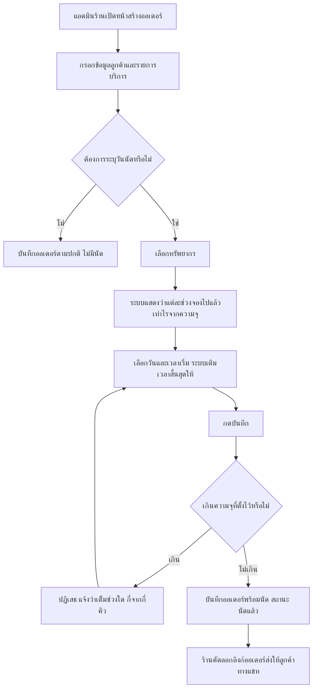
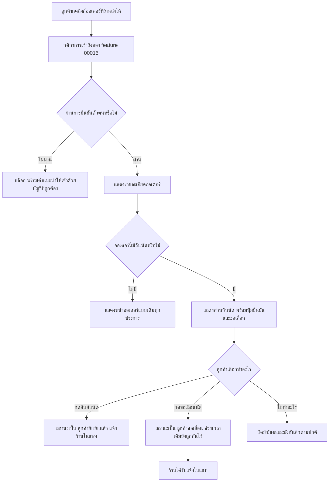
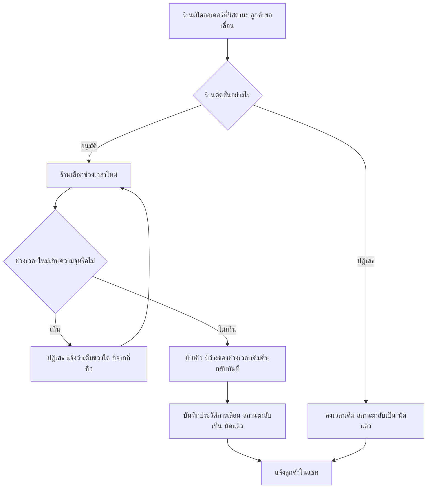
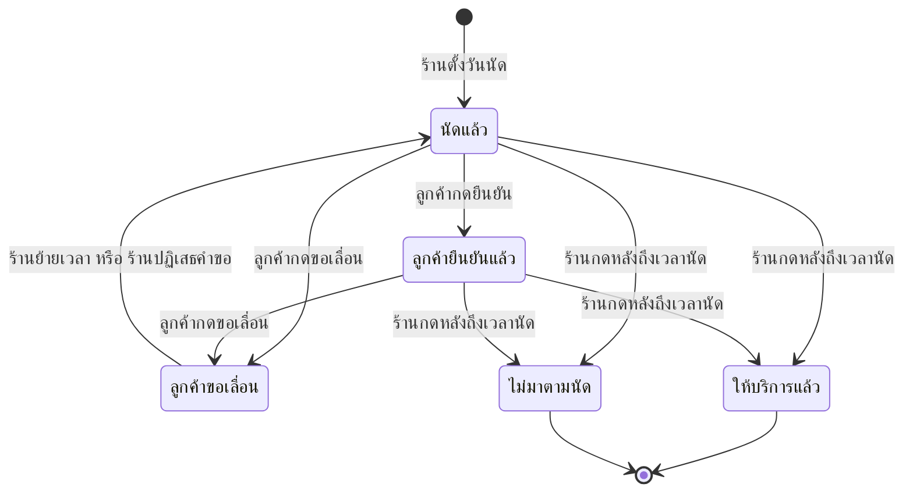

> **โมดูล:** M00024-ServiceAppointmentBooking
> **ประเภทเอกสาร:** Business Requirements Document (BRD) - NON-TECHNICAL
> **เวอร์ชัน:** 1.0
> **วันที่จัดทำ:** 2026-07-30
> **สถานะ:** Draft — รอ user review
> **เจ้าของเอกสาร:** BA (ดู [[Feature-Docs-Ownership]])

# BRD: ระบบนัดหมายวันเข้าใช้บริการ (Business Requirements Document)

---

## 1. บทนำ

### 1.1 วัตถุประสงค์ของเอกสาร

เอกสารนี้มีวัตถุประสงค์เพื่อ:
1. อธิบายความต้องการเชิงหน้าที่ของระบบนัดหมายวันเข้าใช้บริการ สำหรับร้านประเภท "สินค้าและบริการ" ในรูปแบบที่ทดสอบได้
2. กำหนดขอบเขตของ 2 รูปแบบการนัด (ร้านเลือกวันเอง / ส่งลิงก์ให้ลูกค้ายืนยัน) และเส้นแบ่งกับระบบที่มีอยู่แล้ว
3. รวบรวมกฎทางธุรกิจทั้งหมดพร้อมรหัสอ้างอิง `BR-RSV-*` เพื่อให้ทีมพัฒนาและทีมทดสอบใช้ร่วมกัน
4. สร้างความเข้าใจร่วมว่าอะไรคือของใหม่ และอะไรคือการใช้ซ้ำจาก feature 00015 / 00017 ที่อยู่บน production แล้ว

### 1.2 ขอบเขตของระบบ

**ระบบนัดหมายวันเข้าใช้บริการ** คือส่วนขยายของระบบออเดอร์เดิม ที่ทำให้ออเดอร์ประเภทบริการเก็บ "ทรัพยากรที่ให้บริการ + ช่วงเวลาที่ลูกค้าจะเข้ามาใช้" ได้ พร้อมกลไกกันจองเกินความจุและช่องทางให้ลูกค้ายืนยันนัดด้วยตัวเอง เปิดใช้เฉพาะ **บัญชีธุรกิจที่มีประเภทกิจการเป็น "สินค้าและบริการ"**

**เข้าสู่ระบบ (Input):**
- รายการทรัพยากรที่จองได้ ซึ่งร้านตั้งขึ้นเอง (ช่าง/เตียง/ห้อง/คลาส/ชุดอุปกรณ์) พร้อม **จำนวนคิวที่รับได้พร้อมกัน**
- ข้อมูลออเดอร์เดิม (ลูกค้า เบอร์โทร รายการ ยอดเงิน)
- ช่วงเวลาที่ร้านเลือก หรือคำขอเลื่อนจากลูกค้า

**ออกจากระบบ (Output):**
- ออเดอร์ที่มีวันนัดผูกอยู่ พร้อมสถานะการนัด
- ปฏิทินคิวของร้าน
- หน้าออเดอร์สาธารณะที่แสดงวันนัดให้ลูกค้ายืนยัน
- การแจ้งเตือนในแชทเมื่อมีการเปลี่ยนแปลงนัด

**ระบบที่เกี่ยวข้อง:**
- ระบบออเดอร์เดิม (สร้างออเดอร์ POS, รายละเอียดออเดอร์, ออเดอร์สาธารณะ)
- feature 00015 — Order Claim & Forced Login (ใช้ทั้งหมดตามที่เป็น)
- feature 00017 — Lodging Vertical (ยืมรูปแบบและกลไกกันช่วงเวลาซ้อน)
- feature 00014 — Customer Directory (ประวัติการนัดต่อลูกค้า)
- feature 00008/00012 — สิทธิ์พนักงานร้าน
- feature 00011/00018 — Deep Chat (แจ้งเตือน)

### 1.3 กลุ่มผู้ใช้งาน

| กลุ่มผู้ใช้ | บทบาท | สิทธิ์การใช้งาน |
|-----------|--------|----------------|
| **เจ้าของร้าน** | ตั้งค่าทรัพยากร ตั้ง/แก้/ยกเลิกนัด ดูปฏิทินคิว | เต็มทุกอย่าง |
| **พนักงานร้าน** | คีย์ออเดอร์และนัดแทนเจ้าของ | เท่ากับสิทธิ์จัดการออเดอร์ที่ตนมีอยู่ (BR-RSV-25) |
| **ลูกค้าผู้ใช้บริการ** | ดูนัดของตัวเอง ยืนยันนัด ขอเลื่อนนัด | เฉพาะออเดอร์ของตนเอง หลังผ่าน login ตาม feature 00015 |
| **ผู้ดูแลแพลตฟอร์ม Deep** | ดูภาพรวมการใช้งาน | อ่านอย่างเดียว ไม่แก้ไขนัดของร้าน |

---

## 2. ความต้องการหลัก (Functional Requirements)

### 2.1 การจัดการทรัพยากรที่จองได้

#### FR-RSV-01: สร้างและจัดการทรัพยากรที่จองได้

**User Story:**
> ในฐานะเจ้าของร้านบริการ ฉันต้องการกำหนดรายการสิ่งที่ลูกค้าจองเวลาเข้ามาใช้ได้ (ช่าง/เตียง/ห้อง/คลาส/อุปกรณ์) พร้อมระบุว่าแต่ละอย่างรับได้กี่คิวพร้อมกัน เพื่อให้ระบบกันจองเกินที่ให้บริการไหวได้ถูกต้อง

**Acceptance Criteria:**
- [ ] ร้านที่เป็นบัญชีธุรกิจ (`kind = BUSINESS`) และ `vertical = GENERAL` สร้างทรัพยากรได้ โดยระบุชื่อ (บังคับ), คำอธิบาย (ไม่บังคับ), ระยะเวลาบริการมาตรฐานเป็นนาที (ไม่บังคับ), **จำนวนคิวที่รับได้พร้อมกัน (ค่าเริ่มต้น 1)**
- [ ] จำนวนคิวต้องเป็นจำนวนเต็มตั้งแต่ 1 ขึ้นไป — ค่าที่น้อยกว่า 1 หรือไม่ใช่จำนวนเต็ม ต้องถูกปฏิเสธ
- [ ] แก้ไขชื่อ/คำอธิบาย/ระยะเวลามาตรฐานได้ตลอดเวลา และไม่กระทบนัดที่บันทึกไว้แล้ว
- [ ] **เพิ่ม** จำนวนคิวได้ตลอดเวลา
- [ ] **ลด** จำนวนคิวลงต่ำกว่าจำนวนนัดที่จองไว้แล้วในบางช่วงเวลาไม่ได้ — ระบบต้องปฏิเสธพร้อมระบุช่วงเวลาที่ติด
- [ ] ปิดการใช้งานทรัพยากรได้ — ทรัพยากรที่ปิดแล้วเลือกสำหรับนัดใหม่ไม่ได้ แต่นัดเดิมยังเปิดดูได้ครบ
- [ ] ลบทรัพยากรที่ยังมีนัดผูกอยู่ไม่ได้ ระบบต้องปฏิเสธพร้อมบอกจำนวนนัดที่ผูกอยู่
- [ ] ร้านบุคคลธรรมดา และร้าน `vertical = LODGING` เข้าหน้านี้ไม่ได้เลย
- [ ] ร้านเห็นและแก้ไขได้เฉพาะทรัพยากรของร้านตัวเองเท่านั้น

**Business Flow:**
1. เจ้าของร้านเข้าหน้าตั้งค่าทรัพยากรของร้าน
2. กดเพิ่ม กรอกชื่อ เช่น "หมอนวด A"
3. ระบุระยะเวลามาตรฐาน 60 นาที (ใช้เป็นค่าตั้งต้นตอนเลือกเวลา ช่วยลดการพิมพ์)
4. ระบุจำนวนคิวที่รับพร้อมกัน — ปล่อยเป็น 1 สำหรับบริการตัวต่อตัว
5. บันทึก ทรัพยากรพร้อมใช้งานทันที

**Example:**
```
ร้านนวด "สบายดี"
→ หมอนวด A     รับพร้อมกัน 1 คิว
→ หมอนวด B     รับพร้อมกัน 1 คิว
→ ห้อง VIP      รับพร้อมกัน 1 คิว

สตูดิโอโยคะ "ลมหายใจ"
→ คลาสเช้า      รับพร้อมกัน 8 คิว
→ คลาสเย็น      รับพร้อมกัน 12 คิว
→ ครูส่วนตัว     รับพร้อมกัน 1 คิว
```

#### FR-RSV-02: กันจองเกินความจุที่ร้านตั้งไว้

**User Story:**
> ในฐานะเจ้าของร้าน ฉันต้องการให้ระบบกันไม่ให้รับนัดเกินจำนวนที่ให้บริการไหวในช่วงเวลาเดียวกัน เพื่อไม่ให้ต้องโทรขอเลื่อนและเสียความน่าเชื่อถือ

**Acceptance Criteria:**
- [ ] จำนวนนัดที่ยังไม่ถูกยกเลิก ซึ่งมีช่วงเวลาทับกันบนทรัพยากรหน่วยเดียวกัน ต้องไม่เกินจำนวนคิวที่ร้านตั้งไว้ ณ เวลาใด ๆ
- [ ] การบันทึกนัดที่ทำให้เกินความจุ ต้องถูกปฏิเสธ
- [ ] **แม้ผู้ใช้หลายคนกดบันทึกพร้อมกันในเสี้ยววินาทีเดียวกัน จำนวนที่บันทึกสำเร็จต้องไม่เกินความจุ** — ต้องบังคับด้วยกลไกระดับฐานข้อมูล ห้ามใช้วิธีนับแล้วค่อยบันทึกเป็นกลไกความถูกต้อง
- [ ] นัดที่ถูกยกเลิกแล้วไม่นับเข้าความจุ — ที่ว่างคืนกลับทันที
- [ ] ช่วงเวลาที่ต่อกันพอดี (เช่น 10:00-11:00 กับ 11:00-12:00) ไม่ถือว่าทับกัน
- [ ] ข้อความที่ผู้ใช้เห็นตอนถูกปฏิเสธต้องบอกได้ว่าเต็มที่ช่วงเวลาใด และเต็มกี่จาก กี่คิว

**Example:**
```
ทรัพยากร "คลาสโยคะเช้า" ความจุ 8 คิว
ช่วง 09:00-10:00 มีนัดอยู่แล้ว 8 รายการ

→ จอง 09:00-10:00   ปฏิเสธ (เต็ม 8/8)
→ จอง 09:30-10:30   ปฏิเสธ (ทับช่วงที่เต็มอยู่)
→ จอง 10:00-11:00   สำเร็จ (ต่อกันพอดี ไม่ทับ)
→ ยกเลิก 1 รายการ แล้วจอง 09:00-10:00 อีกครั้ง   สำเร็จ (เหลือ 7/8)

ทรัพยากร "หมอนวด A" ความจุ 1 คิว
มีนัด 14:00-15:30 อยู่แล้ว

→ จอง 15:00-16:00   ปฏิเสธ (ทับกัน 30 นาที)
→ จอง 15:30-16:30   สำเร็จ (ต่อกันพอดี)
```

### 2.2 โหมด A — ร้านเลือกวันให้เลย

#### FR-RSV-03: ตั้งวันนัดพร้อมสร้างออเดอร์

**User Story:**
> ในฐานะแอดมินร้าน ฉันต้องการเลือกทรัพยากรและช่วงเวลาได้ในฟอร์มสร้างออเดอร์เดียวกัน เพื่อให้จบงานในครั้งเดียวขณะที่ยังคุยกับลูกค้าอยู่

**Acceptance Criteria:**
- [ ] ฟอร์มสร้างออเดอร์ของบัญชีธุรกิจที่ `vertical = GENERAL` มีส่วนเลือกวันนัด (ทรัพยากร + วัน + เวลาเริ่ม + เวลาสิ้นสุด)
- [ ] ส่วนนี้ **ไม่บังคับกรอก** — ออเดอร์ที่ไม่มีวันนัดยังสร้างได้ตามปกติเหมือนก่อนมีฟีเจอร์นี้
- [ ] เมื่อเลือกทรัพยากรและวัน ระบบแสดงให้เห็นว่าแต่ละช่วงเวลามีคิวถูกจองไปแล้วเท่าไรจากความจุทั้งหมด
- [ ] เมื่อเลือกทรัพยากรที่มีระยะเวลามาตรฐาน ระบบเติมเวลาสิ้นสุดให้อัตโนมัติ แต่ผู้ใช้แก้ได้
- [ ] กรอกวันนัดแล้วออเดอร์ต้องเป็นประเภทบริการโดยอัตโนมัติ
- [ ] เลือกช่วงเวลาที่ทำให้เกินความจุ → ระบบปฏิเสธและระบุว่าเต็มที่ช่วงเวลาใด เต็มกี่จากกี่คิว
- [ ] ตั้งนัดย้อนหลัง (เวลาในอดีต) ได้ แต่ต้องมีคำเตือนให้ผู้ใช้เห็นก่อนบันทึก
- [ ] เวลาสิ้นสุดต้องมาหลังเวลาเริ่มเสมอ มิฉะนั้นปฏิเสธ

**Business Flow:**
1. แอดมินร้านเปิดหน้าสร้างออเดอร์
2. กรอกข้อมูลลูกค้าและรายการบริการตามปกติ
3. เลือกทรัพยากร → ระบบแสดงว่าแต่ละช่วงเวลาจองไปแล้วเท่าไรจากความจุ
4. เลือกวันและเวลาเริ่ม → ระบบเติมเวลาสิ้นสุดตามระยะเวลามาตรฐาน
5. บันทึก → ระบบตรวจความจุอีกครั้งในระดับฐานข้อมูล
6. สำเร็จ → ออเดอร์ถูกสร้างพร้อมนัด สถานะการนัด = "นัดแล้ว"

#### FR-RSV-04: ปฏิทินคิวของร้าน

**User Story:**
> ในฐานะเจ้าของร้าน ฉันต้องการเห็นคิวทั้งหมดของวันนี้และสัปดาห์นี้บนมือถือ เพื่อให้รู้ว่าต้องทำอะไรบ้างโดยไม่ต้องเปิดทีละออเดอร์

**Acceptance Criteria:**
- [ ] มีหน้าปฏิทินคิวสำหรับบัญชีธุรกิจที่ `vertical = GENERAL` แสดงมุมมองรายวันและรายสัปดาห์
- [ ] แต่ละรายการแสดง: เวลา, ชื่อลูกค้า, ทรัพยากร, สถานะการนัด, เลขออเดอร์
- [ ] ทรัพยากรที่ความจุมากกว่า 1 ต้องแสดงให้เห็นว่าแต่ละช่วงเวลาเต็มไปแล้วเท่าไรจากทั้งหมด
- [ ] กรองตามทรัพยากรได้
- [ ] นัดที่ถูกยกเลิกไม่แสดงในปฏิทินโดยค่าเริ่มต้น
- [ ] กดที่รายการแล้วไปยังหน้ารายละเอียดออเดอร์นั้นได้
- [ ] ใช้งานได้ดีบนมือถือเป็นหลัก
- [ ] วันเวลาทั้งหมดแสดงเป็น พ.ศ. และเวลาไทย ผ่านเครื่องมือจัดรูปแบบวันที่กลางของโครงการ

### 2.3 โหมด B — ลูกค้า login เข้ามาตรวจและยืนยัน

#### FR-RSV-05: ลูกค้าเห็นวันนัดบนหน้าออเดอร์สาธารณะ

**User Story:**
> ในฐานะลูกค้า ฉันต้องการเปิดลิงก์ที่ร้านส่งมาแล้วเห็นชัดว่านัดวันไหนกี่โมง เพื่อให้ไม่ต้องเลื่อนหาในแชทและมั่นใจว่าร้านจดนัดไว้จริง

**Acceptance Criteria:**
- [ ] การเข้าถึงหน้าออเดอร์ใช้กติกาของ feature 00015 ทั้งหมดโดยไม่แก้ไข (บังคับ login, ยืนยันตัวตนด้วย OTP เบอร์ตัวเองให้ตรงกับเบอร์ในออเดอร์, ไม่มีการดูแบบผู้ไม่มีบัญชี)
- [ ] หลังผ่านการเข้าถึงแล้ว หากออเดอร์มีวันนัด ต้องแสดงวันนัดเป็นส่วนที่เห็นได้ชัดเจน
- [ ] แสดง: วันที่ (พ.ศ.), ช่วงเวลา, ชื่อทรัพยากร, สถานะการนัด
- [ ] ออเดอร์ที่ไม่มีวันนัดต้องไม่แสดงส่วนนี้เลย และหน้าจอต้องเหมือนเดิมทุกประการ
- [ ] ลูกค้าเห็นนัดได้เฉพาะออเดอร์ของตนเท่านั้น

#### FR-RSV-06: ลูกค้ายืนยันนัด

**User Story:**
> ในฐานะลูกค้า ฉันต้องการกดยืนยันว่าฉันจะมาตามนัด เพื่อให้ร้านมั่นใจและกันเวลาให้ฉันไว้

**Acceptance Criteria:**
- [ ] ลูกค้าที่ผ่าน login แล้วเห็นปุ่มยืนยันนัด เมื่อสถานะการนัดเป็น "นัดแล้ว"
- [ ] กดยืนยันแล้วสถานะเปลี่ยนเป็น "ลูกค้ายืนยันแล้ว" ทันที
- [ ] ระบบบันทึกว่าใครยืนยันและเมื่อไร
- [ ] ยืนยันซ้ำไม่ทำให้เกิดผลเสีย (กดซ้ำได้โดยไม่เปลี่ยนอะไร)
- [ ] ร้านได้รับแจ้งเตือนในแชทเมื่อลูกค้ายืนยัน
- [ ] **การไม่ยืนยันไม่ทำให้นัดเป็นโมฆะ** — นัดยังคงอยู่และยังกันคิวตามปกติ

#### FR-RSV-07: ลูกค้าขอเลื่อนนัด

**User Story:**
> ในฐานะลูกค้า ฉันต้องการแจ้งขอเลื่อนนัดได้โดยไม่ต้องโทร เพื่อให้ร้านรู้ล่วงหน้าและจัดคิวใหม่ได้

**Acceptance Criteria:**
- [ ] ลูกค้ากดขอเลื่อนได้ พร้อมระบุเหตุผล (ไม่บังคับ) และวันเวลาที่สะดวก (ไม่บังคับ)
- [ ] สถานะเปลี่ยนเป็น "ลูกค้าขอเลื่อน" — **ช่วงเวลาเดิมยังถูกกันไว้อยู่** จนกว่าร้านจะตัดสิน
- [ ] ร้านได้รับแจ้งเตือนในแชททันที
- [ ] ลูกค้าเปลี่ยนวันนัดเองโดยตรงไม่ได้ ทำได้แค่ "ขอ" เท่านั้น
- [ ] ร้านอนุมัติโดยเลือกเวลาใหม่ หรือปฏิเสธโดยคงเวลาเดิมไว้
- [ ] ขอเลื่อนหลังเลยเวลานัดไปแล้วไม่ได้

**Business Flow:**
1. ลูกค้าเปิดออเดอร์ กด "ขอเลื่อนนัด" ระบุเหตุผล
2. สถานะเป็น "ลูกค้าขอเลื่อน" ช่วงเวลาเดิมยังถูกกันไว้
3. ร้านได้รับแจ้งในแชท เปิดออเดอร์
4. ร้านเลือกเวลาใหม่ → ระบบตรวจการชนกัน → ย้ายคิว → ช่วงเวลาเดิมกลับมาว่าง
5. หรือร้านปฏิเสธ → สถานะกลับเป็น "นัดแล้ว" ที่เวลาเดิม
6. ลูกค้าได้รับแจ้งผลในแชท

### 2.4 การจัดการนัดฝั่งร้าน

#### FR-RSV-08: ร้านเลื่อนนัด

**User Story:**
> ในฐานะแอดมินร้าน ฉันต้องการเปลี่ยนวันหรือทรัพยากรของนัดที่มีอยู่ เพื่อรับมือกับเหตุที่เปลี่ยนแปลงหน้างาน

**Acceptance Criteria:**
- [ ] ร้านเปลี่ยนช่วงเวลาและ/หรือทรัพยากรของนัดได้
- [ ] การเปลี่ยนต้องผ่านการตรวจความจุเช่นเดียวกับการสร้าง
- [ ] ที่ว่างของช่วงเวลาเดิมคืนกลับทันทีเมื่อย้ายสำเร็จ
- [ ] ระบบบันทึกประวัติการเลื่อนไว้ ไม่ทับข้อมูลเดิม (เลื่อนจากเมื่อไร ไปเมื่อไร โดยใคร เมื่อใด)
- [ ] ลูกค้าได้รับแจ้งเตือนในแชทเมื่อร้านเลื่อนนัด
- [ ] เลื่อนนัดที่ทำเครื่องหมาย "ให้บริการแล้ว" ไปแล้วไม่ได้

#### FR-RSV-09: ร้านทำเครื่องหมายผลของนัด

**User Story:**
> ในฐานะเจ้าของร้าน ฉันต้องการบันทึกว่านัดนี้จบลงอย่างไร เพื่อให้ปฏิทินสะอาดและมีข้อมูลไว้ดูย้อนหลัง

**Acceptance Criteria:**
- [ ] ร้านกด "ให้บริการแล้ว" ได้ → สถานะการนัดเป็น "ให้บริการแล้ว"
- [ ] ร้านกด "ไม่มาตามนัด" ได้ → สถานะเป็น "ไม่มาตามนัด"
- [ ] ทั้งสองปุ่มกดได้ตั้งแต่ถึงเวลาเริ่มนัดเป็นต้นไปเท่านั้น
- [ ] **สถานะการนัดแยกจากสถานะออเดอร์โดยสิ้นเชิง** — การทำเครื่องหมายไม่เปลี่ยนสถานะออเดอร์และไม่กระทบขั้นตอนยืนยัน/รีวิว/คะแนนความน่าเชื่อถือที่มีอยู่
- [ ] การไม่มาตามนัด **ไม่หักคะแนนความน่าเชื่อถือของลูกค้า** ในเฟสนี้

#### FR-RSV-10: ยกเลิกนัด

**User Story:**
> ในฐานะแอดมินร้าน ฉันต้องการยกเลิกนัดที่ไม่เกิดขึ้นแล้ว เพื่อให้ช่วงเวลานั้นกลับมารับลูกค้าคนอื่นได้

**Acceptance Criteria:**
- [ ] การยกเลิกออเดอร์ทำให้นัดหยุดนับเข้าความจุทันที
- [ ] ข้อมูลนัดยังคงอยู่ในออเดอร์ (ไม่ลบทิ้ง) เพื่อเป็นประวัติ
- [ ] ที่ว่างที่คืนมาจองใหม่ได้ทันทีโดยไม่ต้องรอ
- [ ] ลูกค้าได้รับแจ้งเตือนในแชท

### 2.5 การมองเห็นและประวัติ

#### FR-RSV-11: ประวัติการนัดของลูกค้า

**User Story:**
> ในฐานะเจ้าของร้าน ฉันต้องการเห็นว่าลูกค้ารายนี้เคยนัดกับเรากี่ครั้ง เลื่อนกี่ครั้ง ไม่มากี่ครั้ง เพื่อประกอบการตัดสินใจรับนัดครั้งต่อไป

**Acceptance Criteria:**
- [ ] หน้ารายละเอียดลูกค้า (feature 00014) แสดงจำนวนนัดทั้งหมด, นัดที่ให้บริการแล้ว, นัดที่ไม่มาตามนัด, จำนวนครั้งที่เลื่อน
- [ ] แสดงเฉพาะข้อมูลของร้านตนเองเท่านั้น ไม่ข้ามร้าน
- [ ] ร้าน `vertical = LODGING` ไม่เห็นส่วนนี้

---

## 3. Acceptance Criteria สรุป

### 3.1 การกันจองเกินความจุ

**เมื่อระบบทำงานถูกต้อง:**
- ✅ ไม่มีช่วงเวลาใดที่ทรัพยากรหนึ่งหน่วยมีนัดทับกันเกินความจุที่ตั้งไว้ แม้กดบันทึกพร้อมกันหลายคน
- ✅ ช่วงเวลาที่ต่อกันพอดีจองได้ทั้งคู่ ไม่ถูกปฏิเสธผิด ๆ
- ✅ นัดที่ยกเลิกแล้วคืนที่ว่างทันที
- ✅ ลดความจุลงต่ำกว่าที่จองไว้แล้วไม่ได้
- ✅ ข้อความที่ผู้ใช้เห็นตอนถูกปฏิเสธบอกได้ว่าเต็มที่ช่วงใดและเต็มกี่จากกี่คิว ไม่ใช่ข้อความผิดพลาดทั่วไป

### 3.2 โหมด A (ร้านเลือกวันเอง)

**เมื่อระบบทำงานถูกต้อง:**
- ✅ ร้านสร้างออเดอร์พร้อมนัดจบในฟอร์มเดียว ไม่ต้องไปหน้าอื่น
- ✅ ร้านเห็นว่าแต่ละช่วงเต็มไปแล้วเท่าไรจากความจุก่อนเลือก
- ✅ ร้านที่ไม่ต้องการใช้วันนัด สร้างออเดอร์ได้เหมือนเดิมทุกประการ

### 3.3 โหมด B (ลูกค้ายืนยันผ่านลิงก์)

**เมื่อระบบทำงานถูกต้อง:**
- ✅ ลูกค้าต้อง login และผ่านการยืนยันตัวตนตามกติกาเดิมก่อนเห็นนัด ไม่มีทางลัด
- ✅ ลูกค้ากดยืนยันได้ในคลิกเดียว และร้านรู้ทันที
- ✅ ลูกค้าขอเลื่อนได้ แต่เปลี่ยนวันเองไม่ได้
- ✅ ลูกค้าเห็นนัดของออเดอร์ตัวเองเท่านั้น

### 3.4 การไม่กระทบระบบเดิม (Zero-Regression)

**เมื่อระบบทำงานถูกต้อง:**
- ✅ ออเดอร์สินค้าปกติทำงานเหมือนเดิม 100% ไม่มีช่องใหม่โผล่มา
- ✅ ร้านบุคคลธรรมดาและร้าน `vertical = LODGING` ไม่เห็นและใช้ฟีเจอร์นี้ไม่ได้เลย ปฏิทินบ้านพักทำงานเหมือนเดิม
- ✅ ขั้นตอนยืนยันออเดอร์ รีวิว และคะแนนความน่าเชื่อถือเดิมไม่เปลี่ยนแปลง
- ✅ ไม่มี SMS ถูกส่งอัตโนมัติ ไม่มีเครดิตร้านถูกหักโดยที่ร้านไม่ได้สั่ง

---

## 4. Business Flows (กระบวนการทำงาน)

### 4.1 Flow หลัก: โหมด A — ร้านสร้างออเดอร์พร้อมเลือกวันเอง



### 4.2 Flow: โหมด B — ลูกค้า login เข้ามาตรวจและยืนยัน



### 4.3 Flow: ร้านตัดสินคำขอเลื่อนนัด



### 4.4 Flow: วงจรชีวิตของสถานะการนัด



---

## 5. Use Case Scenarios (สถานการณ์การใช้งานจริง)

### Scenario 1: ร้านนวดรับนัดทางโทรศัพท์ (Best Case, โหมด A)

**ผู้เกี่ยวข้อง:** เจ้าของร้านนวด, ลูกค้า

**เงื่อนไขเริ่มต้น:**
- บัญชีธุรกิจ `vertical = GENERAL` มีทรัพยากร "หมอนวด A", "หมอนวด B" ความจุหน่วยละ 1 คิว เปิดใช้งานอยู่
- หมอนวด A มีนัดวันเสาร์ 14:00-15:30 อยู่แล้ว

**ขั้นตอน:**
1. ลูกค้าโทรมาขอนวดวันเสาร์บ่ายสองโมง 90 นาที
2. เจ้าของเปิดหน้าสร้างออเดอร์บนมือถือ กรอกชื่อ+เบอร์ลูกค้า เลือกคอร์สนวด
3. เลือกทรัพยากร "หมอนวด A" วันเสาร์ 14:00 → ระบบเติมเวลาสิ้นสุด 15:30 ให้
4. กดบันทึก → ระบบปฏิเสธ แจ้งว่าช่วง 14:00-15:30 เต็ม 1/1 แล้ว
5. เจ้าของเปลี่ยนเป็น "หมอนวด B" → บันทึกสำเร็จ
6. เจ้าของคัดลอกลิงก์ส่งให้ลูกค้าทางแชท

**ผลลัพธ์:**
- ออเดอร์ถูกสร้างพร้อมนัด สถานะการนัด = "นัดแล้ว"
- คิวของหมอนวด B วันเสาร์ 14:00-15:30 เต็ม 1/1
- ไม่เกิดคิวชน

### Scenario 2: ช่างซ่อมแอร์ ลูกค้ายืนยันแล้วขอเลื่อน (โหมด B)

**ผู้เกี่ยวข้อง:** พนักงานร้าน, ลูกค้า, เจ้าของร้าน

**เงื่อนไขเริ่มต้น:**
- ลูกค้าคุยจบในแชท ตกลงราคาซ่อมแล้ว
- ทรัพยากร "ช่างสมชาย" ว่างวันพุธเช้า

**ขั้นตอน:**
1. พนักงานสร้างออเดอร์พร้อมนัด "ช่างสมชาย" วันพุธ 09:00-11:00 ส่งลิงก์ให้ลูกค้า
2. ลูกค้ากดลิงก์ → ระบบบังคับ login และยืนยันเบอร์ด้วย OTP ตามกติกาเดิม
3. ลูกค้าเห็นรายละเอียดงาน ราคา และวันนัด → กด "ยืนยันนัด"
4. ร้านได้รับแจ้งในแชท สถานะเป็น "ลูกค้ายืนยันแล้ว"
5. วันอังคารเย็น ลูกค้าติดธุระ เปิดลิงก์เดิม กด "ขอเลื่อนนัด" ระบุ "ขอเป็นวันศุกร์เช้าได้ไหม"
6. สถานะเป็น "ลูกค้าขอเลื่อน" ช่วงวันพุธเช้ายังถูกกันไว้
7. เจ้าของเห็นแจ้งเตือน เปิดออเดอร์ เลือกวันศุกร์ 09:00-11:00 → ไม่เกินความจุ → ย้ายคิวสำเร็จ
8. ที่ว่างของวันพุธ 09:00-11:00 คืนกลับทันที พนักงานรับลูกค้าใหม่ลงช่องนั้นได้

**ผลลัพธ์:**
- นัดย้ายไปวันศุกร์ สถานะกลับเป็น "นัดแล้ว"
- ประวัติบันทึกว่ามีการเลื่อน 1 ครั้ง จากพุธเป็นศุกร์
- ลูกค้าได้รับแจ้งผลในแชท

### Scenario 3: ลูกค้าไม่มาตามนัด (Edge Case)

**ผู้เกี่ยวข้อง:** เจ้าของร้าน, ลูกค้า

**เงื่อนไขเริ่มต้น:**
- นัดวันจันทร์ 10:00-11:00 สถานะ "ลูกค้ายืนยันแล้ว"

**ขั้นตอน:**
1. ถึงเวลา 10:30 ลูกค้ายังไม่มาและไม่ติดต่อกลับ
2. เจ้าของเปิดออเดอร์ กด "ไม่มาตามนัด"

**ผลลัพธ์:**
- สถานะการนัด = "ไม่มาตามนัด"
- สถานะออเดอร์ **ไม่เปลี่ยน** เจ้าของจัดการเรื่องเงิน/ยกเลิกออเดอร์แยกต่างหากตามนโยบายร้าน
- คะแนนความน่าเชื่อถือของลูกค้า **ไม่ถูกหัก**
- ประวัติลูกค้ารายนี้บันทึกการไม่มาตามนัด +1

### Scenario 4: คลาสโยคะที่รับได้หลายคนพร้อมกัน (ความจุ > 1)

**ผู้เกี่ยวข้อง:** เจ้าของสตูดิโอโยคะ, ลูกค้าหลายคน

**เงื่อนไขเริ่มต้น:**
- ทรัพยากร "คลาสเช้า" ความจุ 8 คิว
- ช่วงวันจันทร์ 09:00-10:00 มีนัดอยู่แล้ว 7 รายการ

**ขั้นตอน:**
1. ลูกค้า 3 คนทักแชทมาพร้อม ๆ กันขอเข้าคลาสเช้าวันจันทร์
2. พนักงาน 2 คนช่วยกันคีย์ออเดอร์ กดบันทึกในเวลาไล่เลี่ยกัน
3. ระบบรับรายการแรกเข้าเป็นคิวที่ 8
4. รายการที่สองและสามถูกปฏิเสธ แจ้งว่าช่วง 09:00-10:00 เต็ม 8/8 แล้ว
5. พนักงานเสนอคลาสเย็นหรือวันอังคารแทน

**ผลลัพธ์:**
- คลาสเช้าวันจันทร์มีนัดพอดี 8 รายการ ไม่เกิน
- ไม่มีรายการใดหลุดเข้าไปเป็นคิวที่ 9 แม้กดพร้อมกัน
- เมื่อมีคนยกเลิก 1 รายการ ที่ว่างคืนกลับทันทีและรับคนใหม่ได้

### Scenario 5: ร้านขายสินค้าที่ไม่ใช้ฟีเจอร์นี้ (Zero-Regression)

**ผู้เกี่ยวข้อง:** ร้านขายเสื้อผ้าออนไลน์

**เงื่อนไขเริ่มต้น:**
- บัญชีธุรกิจ `vertical = GENERAL` แต่ยังไม่เคยสร้างทรัพยากรใด ๆ

**ขั้นตอน:**
1. ร้านสร้างออเดอร์ขายเสื้อตามปกติ
2. ร้านไม่แตะส่วนวันนัดเลย

**ผลลัพธ์:**
- ออเดอร์ถูกสร้างเหมือนเดิมทุกประการ
- ไม่มีวันนัดผูกอยู่ ไม่มีสถานะการนัด
- หน้าออเดอร์สาธารณะไม่แสดงส่วนวันนัด
- ไม่มีเมนูปฏิทินคิวรบกวนถ้าร้านยังไม่มีทรัพยากร

---

## 6. ความต้องการด้านคุณภาพ (Quality Requirements)

### 6.1 ความถูกต้องของข้อมูล
- การกันจองเกินความจุต้องถูกต้อง 100% แม้ในสภาวะที่มีการกดพร้อมกันหลายราย — ต้องพึ่งกลไกระดับฐานข้อมูล ไม่ใช่การตรวจในแอปเพียงอย่างเดียว
- วันเวลาต้องไม่เหลื่อมจากปัญหาเขตเวลาในทุกจุดที่แสดงผลและบันทึก
- ประวัติการเลื่อนต้องไม่ถูกทับ

### 6.2 ความรวดเร็ว
- การแสดงคิวที่มีอยู่ของทรัพยากรตอนเลือกเวลาต้องเร็วพอที่จะไม่ขัดจังหวะการคีย์งานขณะคุยโทรศัพท์กับลูกค้า
- ปฏิทินคิวรายสัปดาห์ต้องเปิดได้เร็วบนมือถือและเครือข่ายมือถือทั่วไป

### 6.3 ความน่าเชื่อถือ
- นัดที่บันทึกสำเร็จแล้วต้องไม่หายหรือเปลี่ยนเองโดยไม่มีการกระทำของผู้ใช้
- การยกเลิกต้องคืนที่ว่างทันที ไม่มีสภาพค้างที่ทำให้ช่องนั้นจองไม่ได้ทั้งที่ควรว่าง

### 6.4 ความปลอดภัย
- ลูกค้าเข้าถึงและกระทำกับนัดได้เฉพาะออเดอร์ของตนเท่านั้น
- ร้านเข้าถึงทรัพยากรและนัดได้เฉพาะของร้านตนเท่านั้น
- ไม่มีการส่งข้อมูลส่วนบุคคลของลูกค้าออกไปยังส่วนที่ไม่จำเป็น
- ไม่มีการเปลี่ยนแปลงกติกาการยืนยันตัวตนที่มีอยู่

### 6.5 ความสะดวกในการใช้งาน (Usability)
- ออกแบบสำหรับมือถือเป็นหลัก เพราะร้านบริการทำงานนอกสถานที่
- การตั้งนัดต้องจบในฟอร์มเดียวกับการสร้างออเดอร์ ไม่บังคับให้ไปหน้าอื่น
- ข้อความแจ้งเมื่อจองไม่ได้ต้องบอกได้ว่าเต็มที่ช่วงใดและเต็มกี่จากกี่คิว ไม่ใช่ข้อความผิดพลาดกว้าง ๆ
- ลูกค้ายืนยันนัดได้ในคลิกเดียวหลังผ่าน login

---

## 7. ข้อจำกัด (Constraints)

### 7.1 ข้อจำกัดทางธุรกิจ
- เปิดให้เฉพาะบัญชีธุรกิจที่ `vertical = GENERAL` ร้านบุคคลธรรมดาไม่ได้ใช้ และร้านบ้านพักใช้ระบบเดิมของ feature 00017
- ความจุเป็นค่าคงที่ต่อทรัพยากร ไม่แปรตามวันหรือช่วงเวลา
- ลูกค้าจองคิวเองโดยที่ยังไม่มีออเดอร์ไม่ได้
- ไม่มีตารางเวลาทำการ/วันหยุดร้านในเฟสนี้
- ไม่มีระบบมัดจำเฉพาะทางสำหรับการนัด ใช้กลไกยอดเงิน/สลิปของออเดอร์เดิม

### 7.2 ข้อจำกัดทางเทคนิค
- ฟิลด์ใหม่ทั้งหมดบนออเดอร์ต้องยอมให้ว่างได้ และเป็นค่าว่างเสมอสำหรับออเดอร์ที่ไม่ใช่การนัด
- กลไกกันจองเกินความจุระดับฐานข้อมูลเป็นสิ่งที่เครื่องมือสร้าง schema อัตโนมัติมองไม่เห็น — มีบทเรียนจาก feature 00017 ว่าการดึง schema ย้อนกลับจะลบกลไกนี้ทิ้ง ต้องกำกับข้อห้ามนี้ไว้ในเอกสารระดับฐานข้อมูล
- ความจุที่มากกว่า 1 ทำให้ใช้กลไกของ feature 00017 ตรง ๆ ไม่ได้ ต้องต่อยอด — เป็นจุดที่ต้องมี spike พิสูจน์ผ่านเส้นทางจริงก่อนพัฒนา ไม่ใช่สรุปจากการอ่านเอกสาร
- การแจ้งเตือนต้องไม่ผูกกับ SMS โดยอัตโนมัติ เพราะมีต้นทุนต่อครั้งที่หักจากเครดิตร้าน
- ทุกการแสดงวันเวลาต้องผ่านเครื่องมือจัดรูปแบบวันที่กลางของโครงการ (พ.ศ., เวลาไทย)

---

## 8. กฎทางธุรกิจ (Business Rules)

### 8.1 ขอบเขตการเปิดใช้งาน

- **BR-RSV-01** ฟีเจอร์นี้ใช้ได้เฉพาะร้านที่เข้าเงื่อนไข **ทั้งสองอย่างพร้อมกัน**: เป็นบัญชีธุรกิจ (`Shop.kind = "BUSINESS"`) **และ** ประเภทกิจการเป็น `Shop.vertical = "GENERAL"`
- **BR-RSV-02** ร้านบุคคลธรรมดา (`kind = "PERSONAL"`) และร้านที่ `vertical = "LODGING"` ต้องไม่เห็นเมนู ไม่เห็นหน้าจอ และเรียกใช้ความสามารถใด ๆ ของฟีเจอร์นี้ไม่ได้ — ต้องกั้นทั้งที่เมนู หน้าจอ และฝั่งหลังบ้าน ห้ามกั้นแค่ชั้นใดชั้นหนึ่ง
- **BR-RSV-03** ห้ามมีระบบปฏิทินสองชุดทำงานพร้อมกันในร้านเดียว — การนัดบริการและการจองห้องพักเป็นคนละระบบที่แยกกันด้วย `vertical`
- **BR-RSV-04** ออเดอร์ที่ไม่มีวันนัดต้องทำงานเหมือนก่อนมีฟีเจอร์นี้ทุกประการ

### 8.2 ทรัพยากรที่จองได้

- **BR-RSV-05** ทรัพยากรต้องมีชื่อเสมอ และผูกกับร้านเดียวเท่านั้น
- **BR-RSV-06** ร้านกำหนดความจุของทรัพยากรแต่ละหน่วยได้เอง = จำนวนนัดที่รับได้พร้อมกันในช่วงเวลาที่ทับกัน ค่าเริ่มต้น 1 ต้องเป็นจำนวนเต็มตั้งแต่ 1 ขึ้นไป
- **BR-RSV-06.1** ความจุเป็นค่าเดียวคงที่ต่อทรัพยากร ไม่แปรตามวันหรือช่วงเวลาในเฟสนี้
- **BR-RSV-06.2** เพิ่มความจุได้ตลอดเวลา แต่ลดความจุลงต่ำกว่าจำนวนนัดที่จองไว้แล้วในช่วงเวลาใดก็ตามไม่ได้ — ต้องปฏิเสธพร้อมระบุช่วงเวลาที่ติด
- **BR-RSV-06.3** การเปลี่ยนความจุมีผลกับการจองครั้งต่อไปเท่านั้น ไม่ย้อนไปยกเลิกหรือแก้ไขนัดที่บันทึกไว้แล้ว
- **BR-RSV-07** ทรัพยากรที่ถูกปิดการใช้งานเลือกสำหรับนัดใหม่ไม่ได้ แต่นัดเดิมที่ผูกอยู่ยังเปิดดูและจัดการได้ครบ
- **BR-RSV-08** ลบทรัพยากรที่ยังมีนัดผูกอยู่ไม่ได้ — ต้องปิดการใช้งานแทน
- **BR-RSV-09** ระยะเวลาบริการมาตรฐานของทรัพยากรเป็นเพียงค่าตั้งต้นเพื่อช่วยกรอก ไม่ใช่ข้อบังคับ — นัดแต่ละครั้งเก็บช่วงเวลาจริงของตัวเอง และการแก้ค่ามาตรฐานภายหลังต้องไม่ทำให้นัดเดิมเปลี่ยนตาม

### 8.3 การนัดหมายและออเดอร์

- **BR-RSV-10** การนัดหมายคือออเดอร์ ไม่ใช่ระเบียนแยก — ใช้ `Order.type = "SERVICE"` ที่มีอยู่แล้ว
- **BR-RSV-11** ออเดอร์ที่มีวันนัดต้องมีประเภทเป็นบริการเสมอ
- **BR-RSV-12** ออเดอร์หนึ่งใบมีได้หนึ่งนัดเท่านั้น
- **BR-RSV-13** เวลาสิ้นสุดต้องมาหลังเวลาเริ่มเสมอ
- **BR-RSV-14** ช่วงเวลานับแบบรวมเวลาเริ่มแต่ไม่รวมเวลาสิ้นสุด — นัดที่ต่อกันพอดีไม่ถือว่าทับกัน
- **BR-RSV-15** ตั้งนัดย้อนหลังได้ แต่ต้องเตือนผู้ใช้ก่อนบันทึก

### 8.4 การกันจองเกินความจุ

- **BR-RSV-16** จำนวนนัดที่ช่วงเวลาทับกันบนทรัพยากรหนึ่งหน่วย ต้องไม่เกินความจุที่ร้านตั้งไว้ ณ เวลาใด ๆ — บังคับที่ระดับฐานข้อมูล ไม่ใช่แค่ตรวจในแอป
- **BR-RSV-17** เฉพาะนัดที่ยังไม่ถูกยกเลิกเท่านั้นที่นับเข้าความจุ
- **BR-RSV-18** การตรวจในแอปมีไว้เพื่อประสบการณ์ใช้งานเท่านั้น ห้ามถือเป็นกลไกความถูกต้อง
- **BR-RSV-18.1** 🛑 **ห้ามใช้วิธี "นับจำนวนนัดที่มีอยู่แล้วค่อยบันทึก" เป็นกลไกความถูกต้อง** — วิธีนี้มีช่องว่างระหว่างการนับกับการเขียนเสมอ ทำให้จองทะลุความจุได้เมื่อกดพร้อมกัน กลไกที่ใช้ต้องรับประกันความถูกต้องได้เองในระดับฐานข้อมูล และต้องพิสูจน์ด้วย spike ที่เรียกผ่านเส้นทางเดียวกับ production จริงก่อนลงมือพัฒนา
- **BR-RSV-19** เมื่อการบันทึกถูกปฏิเสธเพราะเต็ม ระบบต้องบอกได้ว่าเต็มที่ช่วงเวลาใด และเต็มกี่รายการจากความจุเท่าไร

### 8.5 สิทธิ์และการเข้าถึง

- **BR-RSV-20** การเข้าถึงหน้าออเดอร์สาธารณะใช้กติกาของ feature 00015 ทั้งหมดโดยไม่แก้ไข — ห้ามสร้างเส้นทางเข้าถึงใหม่ ห้ามเปิดช่องให้ดูโดยไม่ login
- **BR-RSV-21** ลูกค้าเห็นและกระทำกับนัดได้เฉพาะออเดอร์ที่ตนเป็นเจ้าของเท่านั้น
- **BR-RSV-22** ร้านเข้าถึงทรัพยากรและนัดได้เฉพาะของร้านตนเท่านั้น
- **BR-RSV-23** ลูกค้าเปลี่ยนวันนัดเองโดยตรงไม่ได้ ทำได้เพียง "ขอเลื่อน" เท่านั้น
- **BR-RSV-24** ร้านเป็นผู้ตัดสินสุดท้ายทุกกรณีเรื่องคิว
- **BR-RSV-25** สิทธิ์ในการตั้ง/แก้/ยกเลิกนัด เท่ากับสิทธิ์ในการจัดการออเดอร์ที่ผู้ใช้นั้นมีอยู่ — ไม่สร้างระดับสิทธิ์ใหม่

### 8.6 การยืนยัน การเลื่อน และการยกเลิก

- **BR-RSV-26** การที่ลูกค้าไม่ยืนยันนัดไม่ทำให้นัดเป็นโมฆะ — นัดยังมีผลและยังกันคิวตามปกติ
- **BR-RSV-27** ขณะที่สถานะเป็น "ลูกค้าขอเลื่อน" นัดยังนับเข้าความจุของช่วงเวลาเดิมจนกว่าร้านจะตัดสิน
- **BR-RSV-28** การเลื่อนทุกครั้งต้องผ่านการตรวจความจุเช่นเดียวกับการสร้างนัดใหม่
- **BR-RSV-29** เมื่อย้ายนัดสำเร็จ ที่ว่างของช่วงเวลาเดิมต้องคืนกลับทันที
- **BR-RSV-30** ประวัติการเลื่อนต้องถูกบันทึกสะสม ไม่ทับข้อมูลเดิม
- **BR-RSV-31** ขอเลื่อนหรือเลื่อนนัดที่เลยเวลานัดไปแล้ว หรือที่ทำเครื่องหมายว่าให้บริการแล้ว ไม่ได้
- **BR-RSV-32** การยกเลิกออเดอร์ทำให้นัดหยุดนับเข้าความจุทันที แต่ข้อมูลนัดยังคงอยู่เป็นประวัติ

### 8.7 สถานะและผลกระทบต่อระบบเดิม

- **BR-RSV-33** สถานะการนัดแยกจากสถานะออเดอร์โดยสิ้นเชิง — การเปลี่ยนสถานะการนัดต้องไม่เปลี่ยนสถานะออเดอร์
- **BR-RSV-34** การทำเครื่องหมาย "ให้บริการแล้ว" หรือ "ไม่มาตามนัด" ทำได้ตั้งแต่ถึงเวลาเริ่มนัดเป็นต้นไปเท่านั้น
- **BR-RSV-35** การไม่มาตามนัดถูกบันทึกเป็นข้อมูล แต่ **ไม่หักคะแนนความน่าเชื่อถือ** ตามหลักการ MVP ที่คะแนนมีแต่ขึ้น
- **BR-RSV-36** ฟีเจอร์นี้ต้องไม่เปลี่ยนขั้นตอนยืนยันออเดอร์ รีวิว และการคำนวณคะแนนความน่าเชื่อถือที่มีอยู่

### 8.8 การแจ้งเตือน

- **BR-RSV-37** การแจ้งเตือนทั้งหมดใช้ช่องทางแชทภายในของ Deep เป็นหลัก
- **BR-RSV-38** ห้ามส่ง SMS โดยอัตโนมัติในทุกกรณี — SMS มีต้นทุนต่อครั้งที่หักจากเครดิตร้าน ต้องเป็นการกดส่งเองผ่านกลไกเดิมเท่านั้น
- **BR-RSV-39** เหตุการณ์ที่ต้องแจ้ง: ร้านตั้งนัด, ลูกค้ายืนยัน, ลูกค้าขอเลื่อน, ร้านเลื่อน, ร้านยกเลิก

### 8.9 วันเวลา

- **BR-RSV-40** วันเวลาทั้งหมดอ้างอิงเขตเวลาไทย
- **BR-RSV-41** การแสดงผลวันเวลาทุกจุดต้องผ่านเครื่องมือจัดรูปแบบวันที่กลางของโครงการ แสดงปีเป็น พ.ศ.
- **BR-RSV-42** การนัดแบบ "ทั้งวัน" เก็บเป็นช่วงเวลาที่ครอบทั้งวัน ไม่ใช่โครงสร้างข้อมูลแยก — ต่างกันที่การแสดงผลเท่านั้น (อยู่ระหว่างรอ user ยืนยันตามคำถามเปิดข้อ 4 ใน PRD)

---

## 9. อภิธานศัพท์ (Glossary)

| คำศัพท์ | ความหมาย |
|---------|----------|
| **นัดหมาย** | ช่วงเวลาที่ลูกค้าจะเข้ามาใช้บริการ ผูกกับออเดอร์หนึ่งใบ |
| **ทรัพยากรที่จองได้** | หน่วยที่ถูกจองเวลา เช่น ช่างหนึ่งคน เตียงหนึ่งเตียง ห้องหนึ่งห้อง คลาสหนึ่งคลาส ชุดอุปกรณ์หนึ่งชุด |
| **ความจุ** | จำนวนนัดที่ทรัพยากรหนึ่งหน่วยรับได้พร้อมกันในช่วงเวลาที่ทับกัน — ร้านตั้งเอง ค่าเริ่มต้น 1 |
| **บัญชีธุรกิจ (Business profile)** | ร้านที่ `Shop.kind = BUSINESS` — เงื่อนไขหนึ่งในสองข้อที่ต้องผ่านจึงจะใช้ฟีเจอร์นี้ได้ |
| **โหมด A** | ร้านสร้างออเดอร์และเลือกวันนัดให้ลูกค้าเองในฟอร์มเดียวกัน |
| **โหมด B** | ร้านส่งลิงก์ออเดอร์ให้ลูกค้า ลูกค้า login เข้ามาตรวจสอบและยืนยันนัด |
| **สถานะการนัด** | สถานะของการนัดหมาย แยกจากสถานะออเดอร์โดยสิ้นเชิง |
| **การกันคิว** | การที่นัดหนึ่งนับเข้าความจุของทรัพยากรในช่วงเวลานั้น ทำให้ที่ว่างลดลงหนึ่งที่ |
| **ไม่มาตามนัด** | ลูกค้าไม่มาตามเวลาที่นัดและไม่ได้แจ้งล่วงหน้า |
| **แอดมินร้าน** | เจ้าของร้านหรือพนักงานที่ร้านเชิญเข้ามา — คนละความหมายกับผู้ดูแลแพลตฟอร์ม Deep |
| **vertical** | ประเภทกิจการของร้าน `GENERAL` (สินค้าและบริการ) หรือ `LODGING` (บ้านพัก) ตั้งครั้งเดียวเปลี่ยนไม่ได้ |

---

## 10. สรุป

เอกสาร BRD นี้อธิบายความต้องการหลักของ **ระบบนัดหมายวันเข้าใช้บริการ** แบบไม่ใช่เทคนิค

**จุดเด่นของระบบ:**
- ร้านขายบริการเก็บ "วันนัด" ไว้ที่เดียวกับ "ออเดอร์" เลิกใช้สมุดจดคู่ขนาน
- ร้านตั้งเองได้ว่าแต่ละทรัพยากรรับได้กี่คิวพร้อมกัน — ครอบทั้งบริการตัวต่อตัวและบริการแบบกลุ่มด้วยระบบเดียว
- กันจองเกินความจุได้จริงในระดับฐานข้อมูล ไม่ใช่แค่คำเตือนที่พลาดได้เมื่อกดพร้อมกัน
- รองรับทั้งการที่ร้านเลือกวันเอง และการที่ลูกค้า login เข้ามาตรวจสอบยืนยันด้วยตัวเอง
- โหมดลูกค้ายืนยันไม่ต้องสร้างกลไกยืนยันตัวตนใหม่เลย ใช้ของที่อยู่บน production แล้ว
- ร้านยังคุมคิวเป็นผู้ตัดสินสุดท้าย ลูกค้า "ขอ" ได้แต่เปลี่ยนเองไม่ได้
- ร้านที่ไม่ใช้ฟีเจอร์นี้และร้านบ้านพักไม่ได้รับผลกระทบใด ๆ

**ผลลัพธ์ที่คาดหวัง:**
- ออเดอร์บริการที่มีวันนัดผูกอยู่ ≥ 60% ภายใน 60 วัน
- เคสจองเกินความจุ = 0
- อัตราลูกค้ายืนยันนัดผ่านลิงก์ ≥ 70% ภายใน 60 วัน
- ไม่มี regression กับออเดอร์เดิมและร้านบ้านพัก

---

**หมายเหตุ:**
สำหรับความต้องการทางธุรกิจระดับภาพรวม/personas/KPI/คำถามเปิดที่รอ user ตัดสิน ดู [[PRD]] ของโมดูลนี้
สำหรับ technical specification (architecture/API/data/NFR) ดู [[SRS]] ของโมดูลนี้
