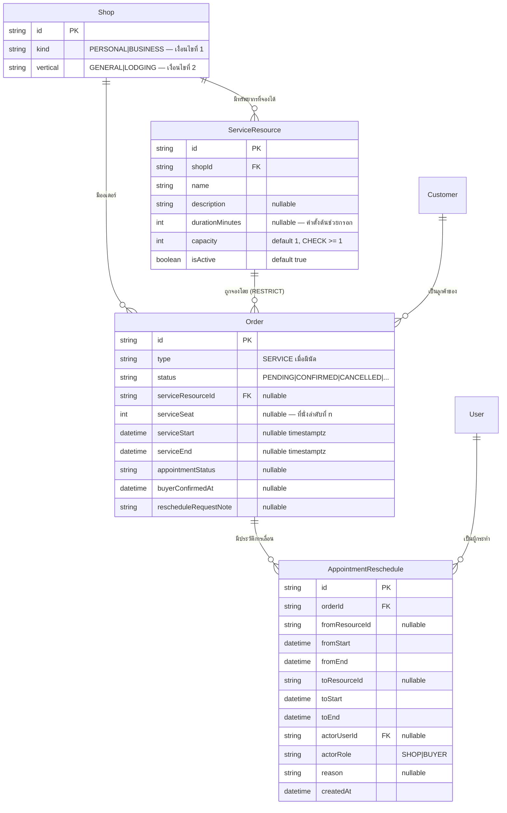

> **โมดูล:** M00024-ServiceAppointmentBooking
> **ประเภทเอกสาร:** Database Design
> **เวอร์ชัน:** 1.0
> **วันที่จัดทำ:** 2026-07-30
> **สถานะ:** Draft
> **เจ้าของเอกสาร:** safepay-database (ดู [[Feature-Docs-Ownership]])

# DATABASE: ระบบนัดหมายวันเข้าใช้บริการ

---

## 1. Overview

ฟีเจอร์นี้เพิ่มตาราง **2 ตารางใหม่** และ **ฟิลด์เสริมบน `Order`** โดยยึดหลักเดียวกับ feature 00017 (Lodging Vertical) ที่ขึ้น production แล้ว:

- **การนัดหมาย = ออเดอร์** ไม่ใช่ตารางแยก (BR-RSV-10) → ได้ `publicToken`/`shortCode`/`orderNo`/`customerId`/`review`/Trust Score มาใช้ซ้ำทั้งหมด
- **ฟิลด์ใหม่บน `Order` เป็น nullable ทั้งหมด** และเป็น NULL เสมอสำหรับออเดอร์สินค้าปกติและออเดอร์ของร้านบ้านพัก (zero-regression, BR-RSV-04)
- **ความถูกต้องของความจุบังคับที่ฐานข้อมูล** ไม่ใช่ที่แอป (BR-RSV-16, BR-RSV-18.1)

**ของใหม่ที่ต่างจาก 00017:** บ้านพักคือ "1 ห้อง 1 ช่วงวัน" (ความจุ 1 เสมอ) แต่บริการต้องรับได้หลายคิวพร้อมกันตามที่ร้านตั้ง จึงเพิ่มมิติ **"ที่นั่งลำดับที่ n" (`serviceSeat`)** เข้าไปใน EXCLUDE constraint — ดู §4.2

| หัวข้อ | ค่า |
|--------|-----|
| ฐานข้อมูล | PostgreSQL 17.6 (Supabase) |
| ORM | Prisma |
| ตารางใหม่ | `ServiceResource`, `AppointmentReschedule` |
| ตารางที่แก้ | `Order` (เพิ่ม 7 ฟิลด์ nullable), `Shop` (เพิ่ม relation) |
| unmanaged SQL | 1 EXCLUDE constraint + 6 CHECK constraints |
| extension ที่ต้องใช้ | `btree_gist` — **ติดตั้งอยู่แล้ว** จาก migration ของ feature 00017 |

---

## 2. ERD



---

## 3. Tables

### 3.1 `ServiceResource` (ใหม่)

ทรัพยากรที่จองเวลาได้ — มิเรอร์โครงสร้าง `Room` ของ feature 00017 แต่เพิ่ม `capacity`

```prisma
// ServiceResource: สิ่งที่ลูกค้าจองเวลาเข้ามาใช้ — feature 00024
// เช่น ช่างหนึ่งคน / เตียงนวดหนึ่งเตียง / ห้องสตูดิโอ / คลาสเรียน / ชุดอุปกรณ์ให้เช่า
// ว่างเสมอสำหรับ shop ที่ไม่เข้าเงื่อนไข BR-RSV-01 (ต้อง kind=BUSINESS และ vertical=GENERAL)
model ServiceResource {
  id          String  @id @default(uuid())
  shopId      String
  name        String
  description String? @db.Text

  // durationMinutes: ระยะเวลาบริการมาตรฐาน (นาที) — เป็น "ค่าตั้งต้นช่วยกรอก" เท่านั้น (BR-RSV-09)
  // 🛑 ห้ามให้การนัดอ้างอิงค่านี้สด — นัดแต่ละครั้ง snapshot ช่วงเวลาจริงไว้ที่ Order.serviceStart/End
  //    มิฉะนั้นเวลาของนัดเก่าจะขยับเองเมื่อเจ้าของแก้ค่ามาตรฐาน (บทเรียนเดียวกับ Room.depositMode)
  durationMinutes Int?

  // capacity: จำนวนนัดที่รับได้พร้อมกันในช่วงเวลาที่ทับกัน (BR-RSV-06)
  // default 1 = ร้านที่ไม่สนใจเรื่องนี้ไม่ต้องตั้งค่าอะไรเลย
  // CHECK(capacity >= 1) ใน migration SQL
  // 🛑 ค่านี้ไม่ได้ถูกบังคับโดย EXCLUDE constraint โดยตรง — constraint บังคับแค่ "ที่นั่งเดียวกัน
  //    ห้ามเวลาทับกัน" ส่วนเพดานจำนวนที่นั่งบังคับที่ service layer ด้วยการวนลอง seat 1..capacity
  //    (ดู DATABASE §4.2 และ SDS §3) — ปลอดภัยเพราะ seat ที่เกิน capacity จะไม่มีวันถูกลองเลย
  capacity Int @default(1)

  // isActive: ปิดการใช้งาน = ไม่รับนัดใหม่ แต่นัดเดิมยังอยู่ครบ (BR-RSV-07)
  isActive  Boolean  @default(true)
  createdAt DateTime @default(now())
  updatedAt DateTime @updatedAt

  shop   Shop    @relation(fields: [shopId], references: [id], onDelete: Cascade)
  orders Order[] // FK ฝั่ง Order เป็น Restrict — ห้ามลบทรัพยากรที่มีนัดผูกอยู่ (BR-RSV-08)

  @@index([shopId, isActive], map: "ServiceResource_shopId_isActive_idx")
}
```

| ฟิลด์ | ชนิด | Null | คำอธิบาย |
|-------|------|------|----------|
| `id` | uuid | ไม่ | PK |
| `shopId` | text | ไม่ | FK → `Shop`, ON DELETE CASCADE |
| `name` | text | ไม่ | ชื่อที่ร้านตั้งเอง เช่น "หมอนวด A", "คลาสเช้า" |
| `description` | text | ได้ | คำอธิบายเพิ่มเติม |
| `durationMinutes` | int | ได้ | ระยะเวลามาตรฐาน — ค่าตั้งต้นช่วยกรอกเท่านั้น |
| `capacity` | int | ไม่ | จำนวนคิวพร้อมกัน default 1, CHECK ≥ 1 |
| `isActive` | boolean | ไม่ | default true |

### 3.2 `Order` (แก้ไข — เพิ่ม 7 ฟิลด์ nullable)

```prisma
  // --- feature 00024: Service Appointment Booking (additive nullable ทั้งหมด) ---
  // การนัดหมาย = Order ที่ type = "SERVICE" ไม่ใช่ตารางแยก (BR-RSV-10)
  // field กลุ่มนี้เป็น NULL เสมอสำหรับออเดอร์สินค้าปกติและการจองบ้านพัก (zero-regression BR-RSV-04)

  serviceResourceId String?   // FK → ServiceResource, ON DELETE RESTRICT (BR-RSV-08)

  // serviceSeat: "ที่นั่งลำดับที่ n" ของทรัพยากรนั้น (1..capacity)
  // 🛑 นี่คือหัวใจของการรองรับความจุ > 1 — ไม่ใช่ข้อมูลที่ผู้ใช้เห็นหรือเลือกเอง
  //    เป็นกลไกภายในล้วน ๆ ที่ทำให้ EXCLUDE constraint บังคับความจุได้ (ดู DATABASE §4.2)
  //    service วนลอง seat 1,2,3... จนกว่าจะ insert ผ่าน — ผ่านที่ไหน = ได้ที่นั่งนั้น
  serviceSeat Int?

  // serviceStart/serviceEnd: ช่วงเวลาเข้าใช้บริการ — timestamptz เพราะบริการละเอียดระดับนาที
  // (ต่างจากบ้านพักที่ใช้ @db.Date ระดับวัน) นับแบบรวมเวลาเริ่ม ไม่รวมเวลาสิ้นสุด (BR-RSV-14)
  serviceStart DateTime? @db.Timestamptz(3)
  serviceEnd   DateTime? @db.Timestamptz(3)

  // appointmentStatus: SCHEDULED | CONFIRMED_BY_BUYER | RESCHEDULE_REQUESTED | COMPLETED | NO_SHOW
  // 🛑 แยกจาก Order.status โดยสิ้นเชิง (BR-RSV-33) — มิเรอร์ housekeepingStatus ของ feature 00017
  //    การเปลี่ยนค่านี้ต้องไม่แตะ Order.status และไม่กระทบ Trust Score (BR-RSV-35/36)
  appointmentStatus String?

  buyerConfirmedAt      DateTime? // ลูกค้ากดยืนยันนัดเมื่อไร (BR-RSV-26) — NULL = ยังไม่ยืนยัน
  rescheduleRequestNote String?   @db.Text // เหตุผลที่ลูกค้าขอเลื่อน (ไม่บังคับกรอก)

  serviceResource ServiceResource?        @relation(fields: [serviceResourceId], references: [id], onDelete: Restrict)
  reschedules     AppointmentReschedule[]
```

**Index ที่เพิ่ม:**

```prisma
  @@index([serviceResourceId, serviceStart], map: "Order_serviceResourceId_start_idx")
  @@index([shopId, type, serviceStart], map: "Order_shopId_type_serviceStart_idx")
  @@index([shopId, appointmentStatus], map: "Order_shopId_appointmentStatus_idx")
```

### 3.3 `AppointmentReschedule` (ใหม่)

BR-RSV-30 บังคับว่าประวัติการเลื่อนต้อง **สะสม ไม่ทับของเดิม** จึงต้องเป็นตารางแยก ไม่ใช่ฟิลด์บน `Order`

```prisma
// AppointmentReschedule: ประวัติการเลื่อนนัด — feature 00024
// แยกตารางเพราะ BR-RSV-30 บังคับให้สะสมทุกครั้ง ไม่ทับของเดิม
// ใช้เป็นแหล่งนับ "จำนวนครั้งที่เลื่อน" ต่อออเดอร์และต่อลูกค้า (FR-RSV-11) — ไม่มี counter column
model AppointmentReschedule {
  id      String @id @default(uuid())
  orderId String

  // สถานะก่อนเลื่อน (snapshot) — ต้องเก็บครบเพื่อให้ย้อนอ่านได้ว่าเดิมนัดไว้ตรงไหน
  fromResourceId String?
  fromStart      DateTime @db.Timestamptz(3)
  fromEnd        DateTime @db.Timestamptz(3)

  // สถานะหลังเลื่อน
  toResourceId String?
  toStart      DateTime @db.Timestamptz(3)
  toEnd        DateTime @db.Timestamptz(3)

  // actorRole: "SHOP" | "BUYER" — ใครเป็นคนทำให้เกิดการเลื่อนนี้
  // ลูกค้า "ขอ" ได้แต่เปลี่ยนเองไม่ได้ (BR-RSV-23) → แถวที่ actorRole=BUYER เกิดได้เฉพาะ
  // กรณีร้านอนุมัติคำขอของลูกค้า ซึ่งบันทึกเป็น SHOP พร้อม reason ที่ลูกค้าให้ไว้
  actorRole   String
  actorUserId String?
  reason      String? @db.Text
  createdAt   DateTime @default(now())

  order Order @relation(fields: [orderId], references: [id], onDelete: Cascade)
  actor User? @relation(fields: [actorUserId], references: [id], onDelete: SetNull)

  @@index([orderId, createdAt], map: "AppointmentReschedule_orderId_createdAt_idx")
}
```

---

## 4. Indexes & Constraints

### 4.1 Index

| ตาราง | Index | เหตุผล |
|-------|-------|--------|
| `ServiceResource` | `("shopId","isActive")` | list ทรัพยากรของร้าน + กรองเฉพาะที่เปิดใช้งาน |
| `Order` | `("serviceResourceId","serviceStart")` | ปฏิทินของทรัพยากรหนึ่งหน่วย + query หาที่ว่างตอนเลือกเวลา |
| `Order` | `("shopId","type","serviceStart")` | ปฏิทินคิวรวมทุกทรัพยากรของร้าน (FR-RSV-04) |
| `Order` | `("shopId","appointmentStatus")` | หน้ารวมนัดที่รอร้านตัดสิน (`RESCHEDULE_REQUESTED`) |
| `AppointmentReschedule` | `("orderId","createdAt")` | แสดงประวัติการเลื่อนเรียงตามเวลา |

### 4.2 🛑 EXCLUDE constraint — หัวใจของการกันจองเกินความจุ

BR-RSV-16 + BR-RSV-18.1 ระบุว่าการกดพร้อมกันต้องไม่ทำให้จองทะลุความจุ และ **ห้ามใช้วิธี "นับแล้วค่อยบันทึก"** เพราะมีช่องว่างระหว่างนับกับเขียนเสมอ

```sql
-- btree_gist ติดตั้งอยู่แล้วจาก migration ของ feature 00017 (20260722000100)
-- คงบรรทัดนี้ไว้เพื่อให้ migration รันซ้ำได้เองในสภาพแวดล้อมใหม่
CREATE EXTENSION IF NOT EXISTS btree_gist;

ALTER TABLE "Order" ADD CONSTRAINT "Order_service_seat_no_overlap"
  EXCLUDE USING gist (
    "serviceResourceId" WITH =,
    "serviceSeat"       WITH =,
    tstzrange("serviceStart", "serviceEnd", '[)') WITH &&
  )
  WHERE ("serviceResourceId" IS NOT NULL AND "status" <> 'CANCELLED');
```

**อ่าน constraint นี้ยังไง:**

- `"serviceSeat" WITH =` → **มิติที่เพิ่มจาก feature 00017** ทำให้ทรัพยากรหนึ่งหน่วยมีนัดพร้อมกันได้หลายรายการ ตราบใดที่อยู่คนละที่นั่ง
- `'[)'` = รวมเวลาเริ่ม ไม่รวมเวลาสิ้นสุด → นัด 10:00-11:00 กับ 11:00-12:00 อยู่ร่วมกันได้ (BR-RSV-14)
- `WHERE status <> 'CANCELLED'` → นัดที่ยกเลิกแล้วคืนที่ว่างทันที (BR-RSV-17)
- `WHERE serviceResourceId IS NOT NULL` → ออเดอร์สินค้าปกติและการจองบ้านพักไม่ถูกแตะเลย (BR-RSV-04)
- ต้องมี `btree_gist` เพราะ `serviceResourceId WITH =` และ `serviceSeat WITH =` เป็นการเทียบ equality บน gist index

**เพดานความจุบังคับที่ไหน:** constraint นี้บังคับแค่ "ที่นั่งเดียวกันห้ามเวลาทับกัน" — ตัว **เพดาน `capacity` บังคับที่ service layer** ด้วยการวนลองที่นั่ง `1..capacity` เท่านั้น ที่นั่งที่เกิน `capacity` จะไม่มีวันถูกลองเลย จึงไม่มีทางเกิดแถวที่ `serviceSeat > capacity` จากเส้นทางปกติ

> **ทำไมวิธีนี้ปลอดภัยแม้กดพร้อมกัน:** สมมติความจุ 2 และมี 3 คนกดพร้อมกันที่ช่วงเวลาเดียวกัน — ทุกคนลองที่นั่ง 1 ก่อน คนแรกได้ อีกสองคนถูกฐานข้อมูลปฏิเสธแล้วไปลองที่นั่ง 2 คนที่สองได้ คนที่สามถูกปฏิเสธอีก ลองครบ 2 ที่นั่งแล้วจึงสรุปว่า "เต็ม" — จำนวนที่สำเร็จเท่ากับความจุพอดีเสมอ โดยไม่ต้องนับอะไรเลย

**🛑 Prisma DSL ประกาศ EXCLUDE constraint ไม่ได้** — เป็น unmanaged SQL เหมือน `Order_room_no_overlap` ของ feature 00017 และ partial unique index ของ feature 00008 ต้องเขียนคำเตือนกำกับใน `schema.prisma` เหนือ model `Order`:

- constraint นี้มีอยู่จริงในฐานข้อมูลแม้ schema จะไม่แสดง
- **ห้าม `prisma db pull` / `prisma migrate dev` เด็ดขาด** — introspection มองไม่เห็น แล้วจะสร้าง migration ที่ DROP ทิ้ง (precedent: feature 00008 และ 00017)

### 4.2.1 ✅ ผลการทดลองจริง (spike 2026-07-30)

รันบนฐานข้อมูลจริงด้วย `TEMP TABLE ... ON COMMIT DROP` ภายใน transaction ที่ ROLLBACK เสมอ → **ไม่เหลือร่องรอย** (ยืนยันแล้ว: ตารางเหลือ 0)

สคริปต์: `spike-capacity.cjs` ในโฟลเดอร์เดียวกับเอกสารนี้ — **ผ่าน 9/9**

| # | เคส | ผล |
|---|-----|-----|
| Q1 | ที่นั่งต่างกัน เวลาทับกันสนิท | ✅ สำเร็จ — **ความจุ > 1 ใช้ได้จริง** |
| Q2 | ที่นั่งเดียวกัน เวลาทับบางส่วน (10:00-11:00 vs 10:30-11:30) | ✅ ถูกปฏิเสธ |
| Q2b | ความจุ 2 เต็มทั้งสองที่นั่ง → วนลองครบแล้วสรุปว่าเต็ม | ✅ ตรงตาม BR-RSV-16 |
| Q2c | เพิ่มความจุเป็น 3 แล้วจองซ้ำช่วงเดิม | ✅ ได้ที่นั่ง 3 — ยืนยันว่าเพิ่มความจุแล้วรับเพิ่มได้ทันที |
| Q3 | ช่วงต่อกันพอดี 11:00-12:00 ที่นั่งเดิม | ✅ สำเร็จ — `'[)'` ให้พฤติกรรมตาม BR-RSV-14 |
| Q4 | ทรัพยากรอื่น ที่นั่งเลขเดียวกัน เวลาเดียวกัน | ✅ สำเร็จ — constraint ผูกกับ `serviceResourceId` จริง |
| Q5 | `serviceResourceId IS NULL` 2 แถว (ออเดอร์สินค้า) | ✅ สำเร็จทั้งคู่ — **zero-regression ยืนยันแล้ว** |
| Q6 | ยกเลิกแล้วจองช่วงเดิมที่นั่งเดิม | ✅ สำเร็จ — ยืนยัน BR-RSV-17 |
| Q7 | ส่งเวลาเป็น UTC (`03:30Z`) ทับกับที่บันทึกด้วย `+07` | ✅ ถูกปฏิเสธตามคาด — `timestamptz` เทียบเป็นเวลาสัมบูรณ์ ไม่เพี้ยนตาม offset |

**รูปร่าง error ที่ได้จริง (Q8):**

```jsonc
{ "ctor": "PrismaClientKnownRequestError", "code": "P2010",
  "meta": { "code": "23P01",
    "message": "ERROR: conflicting key value violates exclusion constraint \"Order_service_seat_no_overlap\"\nDETAIL: Key (\"serviceResourceId\", \"seatIndex\", tstzrange(...))=(r1, 1, [\"2026-08-03 03:30:00+00\",\"2026-08-03 04:30:00+00\")) conflicts with existing key ...=(r1, 1, [\"2026-08-03 03:00:00+00\",\"2026-08-03 04:00:00+00\"))." } }
```

> เหมือน feature 00017 ทุกประการ: **P2010 + `meta.code = '23P01'` ไม่ใช่ P2002** — service ต้องดักแล้วแปลงเป็น error ที่ route map เป็น 409 (ดู [[SRS]] TFR-004 และบทเรียน `feedback_service_error_route_mapping`)
>
> ⚠️ ต่างจาก 00017 ตรงที่ **ข้อความ conflict ที่ได้เป็นข้อมูล "ที่นั่ง" ซึ่งเป็นกลไกภายใน ไม่ควรโชว์ผู้ใช้** — ห้ามส่งข้อความดิบนี้ออกไป ต้องแปลงเป็นข้อความระดับธุรกิจ ("ช่วงเวลานี้เต็มแล้ว 8/8") ตาม BR-RSV-19

🛑 **ข้อจำกัดที่ยืนยันซ้ำจาก 00017:** เมื่อ constraint ยิง **ทั้ง transaction ถูก poison ทันที** (`25P02 current transaction is aborted`) — การวนลองที่นั่งถัดไปในธุรกรรมเดิมจะทำไม่ได้เลยถ้าไม่ครอบ `SAVEPOINT` **นี่เป็นเงื่อนไขบังคับของ service layer ไม่ใช่ทางเลือก** (ดู [[SDS]] §3)

### 4.3 CHECK constraints

| ตาราง | Constraint | กฎ | อ้างอิง |
|-------|-----------|-----|---------|
| `ServiceResource` | `ServiceResource_capacity_positive` | `capacity >= 1` | BR-RSV-06 |
| `ServiceResource` | `ServiceResource_duration_positive` | `durationMinutes IS NULL OR durationMinutes > 0` | BR-RSV-09 |
| `Order` | `Order_service_range` | `serviceStart IS NULL OR serviceEnd IS NULL OR serviceEnd > serviceStart` | BR-RSV-13 |
| `Order` | `Order_service_seat_positive` | `serviceSeat IS NULL OR serviceSeat >= 1` | BR-RSV-06 |
| `Order` | `Order_service_fields_all_or_none` | ฟิลด์นัด 4 ตัวต้องมีครบหรือว่างทั้งหมด | BR-RSV-12 |
| `Order` | `Order_appointment_status` | อยู่ใน 5 ค่าที่กำหนด หรือ NULL | §3.4 PRD |

```sql
ALTER TABLE "Order" ADD CONSTRAINT "Order_service_fields_all_or_none" CHECK (
  ("serviceResourceId" IS NULL AND "serviceSeat" IS NULL
   AND "serviceStart" IS NULL AND "serviceEnd" IS NULL)
  OR
  ("serviceResourceId" IS NOT NULL AND "serviceSeat" IS NOT NULL
   AND "serviceStart" IS NOT NULL AND "serviceEnd" IS NOT NULL)
);

ALTER TABLE "Order" ADD CONSTRAINT "Order_appointment_status" CHECK (
  "appointmentStatus" IS NULL OR "appointmentStatus" IN
    ('SCHEDULED','CONFIRMED_BY_BUYER','RESCHEDULE_REQUESTED','COMPLETED','NO_SHOW')
);
```

> **หมายเหตุ:** ไม่มี CHECK ที่บังคับว่า `type = 'SERVICE'` เมื่อมีนัด (แบบ `Order_booking_fields` ของ 00017) เพราะ BR-RSV-11 บังคับที่ service layer แทน — เหตุผล: ออเดอร์ที่มีนัดอาจถูกแก้ `type` ในอนาคตด้วยเหตุผลทางธุรกิจอื่น การล็อกที่ระดับ DB จะทำให้แก้ยากโดยไม่ได้ประโยชน์เพิ่ม เพราะทางเข้าเดียวคือ service เดียวกันอยู่แล้ว

### 4.4 ⚠️ ข้อจำกัดที่ทราบ — การลดความจุกับที่นั่งที่เป็นรู

BR-RSV-06.2 บอกว่า "ลดความจุลงต่ำกว่าจำนวนนัดที่จองไว้แล้วไม่ได้" — การบังคับจริงใช้เกณฑ์ที่ **เข้มกว่าเล็กน้อย**:

> ปฏิเสธถ้ามีนัดที่ยังไม่ถูกยกเลิกและยังไม่ผ่านไปแล้ว ซึ่ง `serviceSeat > capacity ใหม่`

**ทำไมถึงต่างกัน:** ที่นั่งอาจเป็นรูได้ เช่น ความจุ 3 มีนัดที่นั่ง 1, 2, 3 แล้วยกเลิกที่นั่ง 1 → เหลือนัดจริง 2 รายการ แต่ที่นั่งสูงสุดคือ 3 การลดความจุเป็น 2 จะถูกปฏิเสธ ทั้งที่ "จำนวนนัด" พอดีกับความจุใหม่

**ทางออกให้ผู้ใช้:** ยกเลิกแล้วจองใหม่ (ระบบจะให้ที่นั่งต่ำสุดที่ว่าง) หรือรอให้นัดนั้นผ่านไป

**ไม่แก้ใน phase 1 เพราะ:** การบีบที่นั่งให้ชิด (seat compaction) ต้องย้ายนัดที่มีอยู่ข้ามที่นั่ง ซึ่งเป็นการเขียนทับข้อมูลจริงเพื่อความสวยงามของกลไกภายในล้วน ๆ — ความเสี่ยงไม่คุ้มประโยชน์ ควรทำเมื่อมีข้อมูลว่าผู้ใช้เจอปัญหานี้จริง

---

## 5. Migration Plan

🛑 **ห้าม `prisma migrate dev`** — ฐานข้อมูล dev กับ prod เป็นตัวเดียวกัน (แชร์) และ `migrate dev` จะ reset ลบข้อมูลทิ้ง ต้องเขียนไฟล์ migration ด้วยมือแล้วใช้ `migrate deploy` เท่านั้น (memory `project_shared_db_drift_no_migrate_dev`, `project_prisma_migration_env_targets`)

**ไฟล์:** `prisma/migrations/2026073000XXXX_service_appointment_booking/migration.sql`

**ลำดับ:**

1. `CREATE EXTENSION IF NOT EXISTS btree_gist;` (no-op — มีอยู่แล้วจาก 00017)
2. `CREATE TABLE "ServiceResource"` + index + CHECK 2 ตัว
3. `CREATE TABLE "AppointmentReschedule"` + index + FK
4. `ALTER TABLE "Order" ADD COLUMN` 7 คอลัมน์ (nullable ทั้งหมด → ไม่ล็อกตารางนาน ไม่ต้อง backfill)
5. FK `Order.serviceResourceId` → `ServiceResource` **ON DELETE RESTRICT**
6. Index 3 ตัวบน `Order`
7. CHECK 4 ตัวบน `Order`
8. EXCLUDE constraint `Order_service_seat_no_overlap`

**การรัน:**

```bash
# ต้องขอ user ยืนยันก่อนเสมอ — DB นี้เป็นตัวเดียวกับ prod
npx dotenv -e .env.local -- npx prisma migrate deploy
```

**Rollback:** ทุกอย่างเป็น additive — ถอยได้ด้วยการ DROP ตารางใหม่ 2 ตาราง, DROP constraint/index, และ DROP COLUMN 7 ตัว โดยไม่กระทบข้อมูลเดิมเลย (ไม่มีการแก้/ย้ายข้อมูลที่มีอยู่แม้แต่แถวเดียว)

**หลัง migrate:** ⚠️ ต้อง **restart dev server** — Prisma client ที่ค้างอยู่จะไม่รู้จักฟิลด์ใหม่แล้วทำให้ session พัง (บทเรียนจาก feature seller-auth)

---

## 6. Retention / ข้อควรระวัง

| หัวข้อ | รายละเอียด |
|--------|-----------|
| **ห้าม `prisma db pull`** | จะลบ EXCLUDE + CHECK + partial index ทั้งหมดที่เป็น unmanaged SQL ทิ้ง — รวมของ feature 00008/00017 ที่อยู่บน prod ด้วย |
| **ห้าม `prisma migrate dev`** | reset ฐานข้อมูลที่แชร์กับ prod |
| **`serviceSeat` เป็นกลไกภายใน** | ห้ามแสดงผู้ใช้ ห้ามให้ผู้ใช้เลือก ห้ามใส่ใน API response ที่ส่งออกฝั่ง buyer |
| **ข้อความ error ดิบจาก Postgres** | มีชื่อ constraint และเลขที่นั่ง — ห้ามส่งออก ต้องแปลงเป็นข้อความธุรกิจก่อนเสมอ |
| **ไม่ลบประวัติการเลื่อน** | `AppointmentReschedule` เก็บถาวรตามอายุออเดอร์ (cascade ตาม `Order` เท่านั้น) |
| **PII** | ตารางใหม่ทั้งสองไม่เก็บ PII โดยตรง — ชื่อ/เบอร์ลูกค้าอยู่ที่ `Order`/`Customer` เดิม |

---

## 7. Traceability

| Business Rule | บังคับที่ไหน |
|---------------|-------------|
| BR-RSV-01/02 (เฉพาะบัญชีธุรกิจ + GENERAL) | service layer (ไม่มี DB constraint — `Shop.kind`/`vertical` อยู่คนละตาราง) |
| BR-RSV-04 (zero-regression) | `WHERE serviceResourceId IS NOT NULL` ใน EXCLUDE + ฟิลด์ nullable ทั้งหมด |
| BR-RSV-06 (ความจุ ≥ 1) | CHECK `ServiceResource_capacity_positive` + วนลองที่นั่ง 1..capacity ที่ service |
| BR-RSV-06.2 (ลดความจุ) | service layer — ดูข้อจำกัดใน §4.4 |
| BR-RSV-08 (ห้ามลบทรัพยากรที่มีนัด) | FK `ON DELETE RESTRICT` |
| BR-RSV-12 (1 ออเดอร์ 1 นัด) | โครงสร้าง — ฟิลด์นัดอยู่บนแถว `Order` โดยตรง |
| BR-RSV-13 (เวลาสิ้นสุดหลังเวลาเริ่ม) | CHECK `Order_service_range` |
| BR-RSV-14 (ต่อกันพอดีไม่ทับ) | `'[)'` ใน `tstzrange` — ยืนยันด้วย spike Q3 |
| BR-RSV-16 (ห้ามเกินความจุ) | EXCLUDE constraint + วนลองที่นั่ง — ยืนยันด้วย spike Q1/Q2/Q2b |
| BR-RSV-17 (ยกเลิกคืนที่ว่าง) | `WHERE status <> 'CANCELLED'` — ยืนยันด้วย spike Q6 |
| BR-RSV-30 (ประวัติการเลื่อนสะสม) | ตาราง `AppointmentReschedule` แยก |
| BR-RSV-33 (สถานะนัดแยกจากสถานะออเดอร์) | คนละคอลัมน์ ไม่มี trigger เชื่อมกัน |
| BR-RSV-40 (เวลาไทย) | `@db.Timestamptz(3)` — ยืนยันด้วย spike Q7 |

---

## 8. สรุป

- ตารางใหม่ 2 ตาราง + ฟิลด์ nullable 7 ตัวบน `Order` — **additive ล้วน ไม่แตะข้อมูลเดิมแม้แถวเดียว**
- กลไกกันจองเกินความจุใช้ EXCLUDE constraint ที่เพิ่มมิติ "ที่นั่ง" จาก feature 00017 — **พิสูจน์บนฐานข้อมูลจริงแล้ว 9/9**
- เพดานความจุบังคับด้วยการวนลองที่นั่ง `1..capacity` ที่ service layer โดยมี `SAVEPOINT` เป็นเงื่อนไขบังคับ
- ข้อจำกัดที่ทราบและยอมรับ: การลดความจุใช้เกณฑ์ที่เข้มกว่าที่ BRD เขียนไว้เล็กน้อยเมื่อที่นั่งเป็นรู (§4.4)
