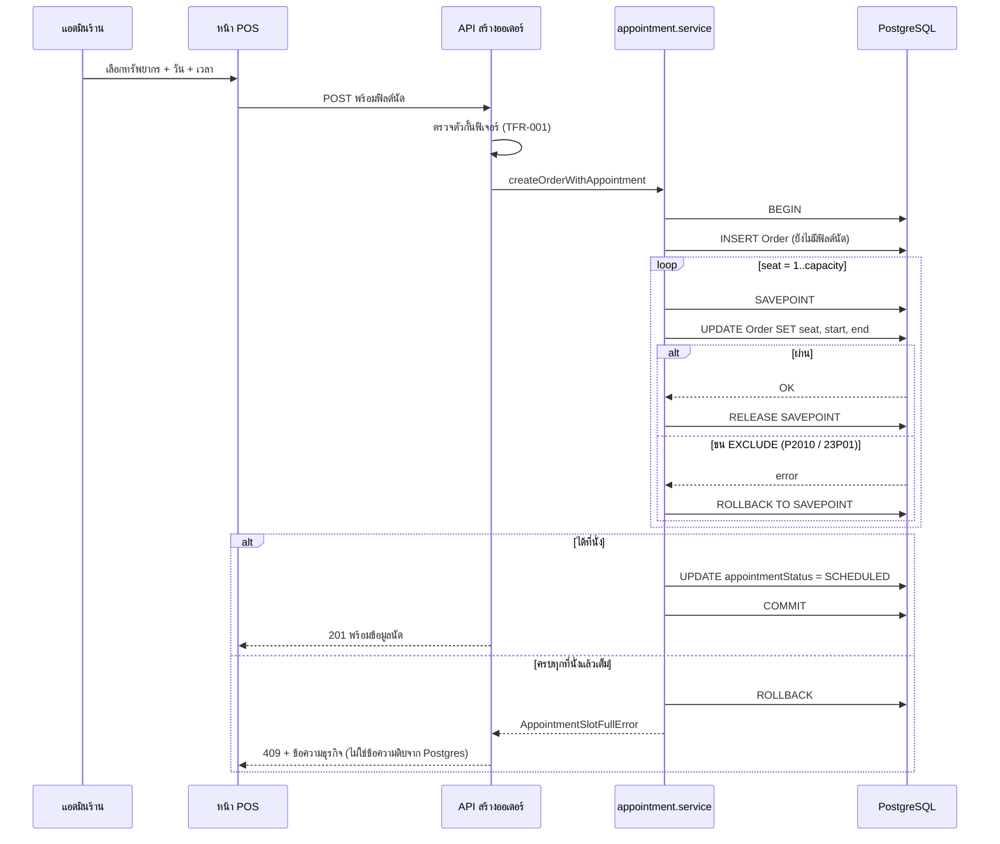
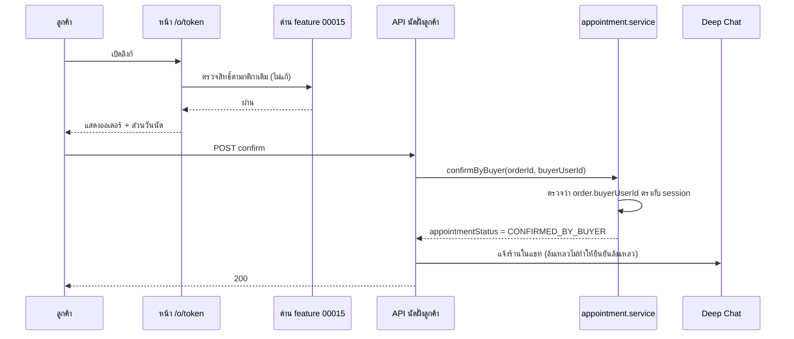

> **โมดูล:** M00024-ServiceAppointmentBooking
> **ประเภทเอกสาร:** Software Design Specification (SDS)
> **เวอร์ชัน:** 1.0
> **วันที่จัดทำ:** 2026-07-30
> **สถานะ:** Draft
> **เจ้าของเอกสาร:** safepay-planner (ดู [[Feature-Docs-Ownership]])

# SDS: ระบบนัดหมายวันเข้าใช้บริการ

---

## 1. บทนำ & References

เอกสารนี้ระบุ **การออกแบบระดับ component** ที่ developer นำไปเขียนโค้ดได้ตรง ๆ — ไฟล์ไหน ฟังก์ชันอะไร รับอะไร คืนอะไร และจุดไหนห้ามพลาด

| อ้างอิง | ใช้ทำอะไร |
|---------|----------|
| [[SRS]] | TFR ทุกข้อที่ออกแบบนี้ต้องตอบ |
| [[DATABASE]] | schema + EXCLUDE constraint + ผล spike |
| [[API]] | contract ของแต่ละ endpoint |
| `src/services/order.service.ts` | จุดที่ต้องต่อการสร้างนัดเข้าไป |
| `docs/20 - Features/00017 - Lodging Vertical/SDS.md` | precedent การดัก error + โครง service |

---

## 2. Architecture Overview

### 2.1 ไฟล์ที่ต้องสร้าง/แก้

| ไฟล์ | สถานะ | หน้าที่ |
|------|-------|---------|
| `src/lib/appointments.ts` | **ใหม่** | ค่าคงที่, ตัวกั้นฟีเจอร์, helper ตรวจ error, state transition |
| `src/services/service-resource.service.ts` | **ใหม่** | CRUD ทรัพยากร + กฎการลดความจุ |
| `src/services/appointment.service.ts` | **ใหม่** | จัดสรรที่นั่ง, ตั้ง/เลื่อน/ยืนยัน/ปิดผลนัด, ประวัติ |
| `src/services/order.service.ts` | แก้ | รับฟิลด์นัดตอนสร้างออเดอร์ (เรียก appointment.service) |
| `src/lib/validations.ts` | แก้ | Valibot schema ของ payload นัด |
| `prisma/schema.prisma` | แก้ | 2 model ใหม่ + 7 ฟิลด์บน `Order` + คำเตือน unmanaged SQL |
| `prisma/migrations/<ts>_service_appointment_booking/migration.sql` | **ใหม่** | เขียนมือ |
| `src/app/(paces)/seller/settings/service-resources/**` | **ใหม่** | หน้าตั้งค่าทรัพยากร |
| `src/app/(paces)/seller/appointments/**` | **ใหม่** | ปฏิทินคิว |
| `src/app/api/shops/current/service-resources/**` | **ใหม่** | API ทรัพยากร + availability |
| `src/app/api/shops/current/appointments/route.ts` | **ใหม่** | API ปฏิทิน |
| `src/app/api/orders/[token]/appointment/**` | **ใหม่** | API นัด — ทั้งฝั่งร้าน (`PATCH`, `outcome`) และฝั่งลูกค้า (`confirm`, `reschedule-request`) แยกกันด้วย authz ไม่ใช่ด้วยพาธ ตาม precedent `ship` (ร้าน) กับ `confirm` (ลูกค้า) ที่อยู่ใต้ `[token]` เดียวกันอยู่แล้ว |
| หน้า `/o/[token]` | แก้ | เพิ่มส่วนแสดง/ยืนยันนัด (หลังด่าน 00015) |
| ฟอร์มสร้างออเดอร์ POS | แก้ | เพิ่มส่วนเลือกวันนัด |

🛑 **ห้ามแตะไฟล์ของ feature 00015** (logic การเข้าถึง `/o/{token}`) — เพิ่มเฉพาะส่วนแสดงผลหลังด่านเท่านั้น

---

## 3. Component Design

### 3.1 `src/lib/appointments.ts`

```ts
export const APPOINTMENT_STATUS = {
  SCHEDULED: 'SCHEDULED',
  CONFIRMED_BY_BUYER: 'CONFIRMED_BY_BUYER',
  RESCHEDULE_REQUESTED: 'RESCHEDULE_REQUESTED',
  COMPLETED: 'COMPLETED',
  NO_SHOW: 'NO_SHOW',
} as const
export type AppointmentStatus = (typeof APPOINTMENT_STATUS)[keyof typeof APPOINTMENT_STATUS]

/** สถานะที่ถือว่า "จบแล้ว" — เลื่อน/ขอเลื่อนไม่ได้ (BR-RSV-31) */
export const TERMINAL_STATUSES: AppointmentStatus[] = ['COMPLETED', 'NO_SHOW']

/**
 * ตัวกั้นฟีเจอร์ (TFR-001) — ต้องเข้าเงื่อนไข "ทั้งสองอย่าง" (BR-RSV-01)
 * 🛑 ห้ามเช็ค vertical อย่างเดียว: ร้าน PERSONAL ที่เป็น GENERAL ต้องถูกปฏิเสธ
 */
export function canUseAppointments(shop: { kind: string; vertical: string }): boolean {
  return shop.kind === 'BUSINESS' && shop.vertical === 'GENERAL'
}

/**
 * ตรวจว่า error ที่ได้คือการชน EXCLUDE constraint หรือไม่
 *
 * 🛑 ต้องทน "สองรูป" เสมอ (บทเรียน feedback_spike_must_match_production_path):
 *    รูปที่ 1 — meta.code === '23P01' (รูปที่ spike เห็นจริงบน Prisma ปัจจุบัน)
 *    รูปที่ 2 — สตริง 23P01 / "exclusion constraint" ฝังในข้อความ (เผื่อ Prisma เปลี่ยนรูป
 *              หรือเส้นทางเรียกต่างกันแล้วห่อ error คนละชั้น)
 * ห้ามเช็ค P2002 — EXCLUDE ไม่ใช่ unique violation (spike ยืนยันว่าได้ P2010)
 */
export function isExclusionViolation(e: unknown): boolean {
  const err = e as { code?: string; meta?: Record<string, unknown>; message?: string }
  if (err?.meta?.code === '23P01') return true
  const blob = `${err?.message ?? ''}${JSON.stringify(err?.meta ?? {})}`
  return /23P01|exclusion constraint/i.test(blob)
}

/** error ของ service ที่ route จะ map เป็น 409 (บทเรียน feedback_service_error_route_mapping) */
export class AppointmentSlotFullError extends Error {
  constructor(
    readonly resourceName: string,
    readonly capacity: number,
    readonly start: Date,
    readonly end: Date,
  ) {
    super('APPOINTMENT_SLOT_FULL')
  }
}

export class AppointmentTerminalError extends Error {
  constructor() { super('APPOINTMENT_TERMINAL') }
}
```

### 3.2 `appointment.service.ts` — การจัดสรรที่นั่ง (หัวใจของฟีเจอร์)

**นี่คือจุดเดียวที่ผิดพลาดแล้วเกิดการจองทะลุความจุ — ต้อง implement ตามนี้เป๊ะ**

```ts
/**
 * จัดสรรที่นั่งให้ออเดอร์หนึ่งใบ (TFR-002)
 *
 * วิธีทำงาน: วนลองที่นั่ง 1..capacity — ที่นั่งไหน update ผ่าน = ได้ที่นั่งนั้น
 * ถ้าครบทุกที่นั่งแล้วยังชน = เต็มจริง
 *
 * 🛑 ห้าม implement ด้วยการ count() แล้วเทียบ capacity — มีช่องว่างระหว่างนับกับเขียน
 *    ทำให้จองทะลุความจุได้เมื่อกดพร้อมกัน (BR-RSV-18.1)
 * 🛑 ทุกครั้งที่ลองต้องครอบ SAVEPOINT — EXCLUDE ที่ยิงจะ poison ทั้ง transaction (25P02)
 *    ถ้าไม่ครอบ ที่นั่งแรกที่ชนจะทำให้ทั้งธุรกรรมตาย ทั้งที่ยังมีที่ว่าง
 */
async function allocateSeat(
  tx: Prisma.TransactionClient,
  args: { orderId: string; resource: { id: string; name: string; capacity: number }
          start: Date; end: Date },
): Promise<number> {
  const { orderId, resource, start, end } = args

  for (let seat = 1; seat <= resource.capacity; seat++) {
    const sp = `seat_try_${seat}`
    await tx.$executeRawUnsafe(`SAVEPOINT ${sp}`)
    try {
      await tx.order.update({
        where: { id: orderId },
        data: {
          serviceResourceId: resource.id,
          serviceSeat: seat,
          serviceStart: start,
          serviceEnd: end,
        },
      })
      await tx.$executeRawUnsafe(`RELEASE SAVEPOINT ${sp}`)
      return seat
    } catch (e) {
      await tx.$executeRawUnsafe(`ROLLBACK TO SAVEPOINT ${sp}`)
      if (!isExclusionViolation(e)) throw e   // error อื่นต้องไม่ถูกกลืน
      // ชนที่นั่งนี้ → ลองที่นั่งถัดไป
    }
  }

  throw new AppointmentSlotFullError(resource.name, resource.capacity, start, end)
}
```

**ลำดับการสร้างออเดอร์พร้อมนัด** (สำคัญ — อธิบายว่าทำไมต้องสองขั้น):

```ts
await prisma.$transaction(async (tx) => {
  // ขั้น 1: สร้างออเดอร์โดย "ยังไม่ใส่ฟิลด์นัด"
  //   เหตุผล: ถ้าใส่ที่นั่งไปตั้งแต่ INSERT แล้วชน จะต้องสร้างออเดอร์ใหม่ทั้งใบเพื่อ retry
  //   (id/orderNo/publicToken ถูกใช้ไปแล้ว) — แยกเป็น update ทำให้ retry ได้สะอาด
  //   CHECK all-or-none ยอมให้ฟิลด์นัดว่างทั้งชุดอยู่แล้ว จึงไม่ผิดกฎ
  const order = await tx.order.create({ data: { ...orderData, type: 'SERVICE' } })

  // ขั้น 2: จัดสรรที่นั่ง (อาจ retry ภายในหลายรอบ)
  await allocateSeat(tx, { orderId: order.id, resource, start, end })

  await tx.order.update({
    where: { id: order.id },
    data: { appointmentStatus: APPOINTMENT_STATUS.SCHEDULED },
  })
  return order
})
```

### 3.3 `appointment.service.ts` — ฟังก์ชันสาธารณะ

| ฟังก์ชัน | ใคร | หน้าที่ | กฎที่บังคับ |
|---------|-----|---------|-------------|
| `setAppointment(shopId, orderId, input)` | ร้าน | ตั้งนัดให้ออเดอร์ที่ยังไม่มีนัด | TFR-001/002/003 |
| `rescheduleAppointment(shopId, orderId, input, actorUserId)` | ร้าน | ย้ายนัด + เขียนประวัติ | TFR-007, BR-RSV-31 |
| `setAppointmentOutcome(shopId, orderId, outcome)` | ร้าน | `COMPLETED`/`NO_SHOW` | BR-RSV-34 (ต้องถึงเวลาแล้ว) |
| `confirmByBuyer(orderId, buyerUserId)` | ลูกค้า | ยืนยันนัด (idempotent) | BR-RSV-26, TFR-008 |
| `requestReschedule(orderId, buyerUserId, note)` | ลูกค้า | ขอเลื่อน (ไม่ย้ายเวลา) | BR-RSV-23/27 |
| `getResourceAvailability(shopId, resourceId, range)` | ร้าน | จำนวนที่จองแล้วต่อช่วง | TFR-005 — แสดงผลเท่านั้น |
| `listAppointments(shopId, range, filter)` | ร้าน | ปฏิทินคิว | TFR-008/010 |

**การเลื่อนนัด — ต้องเขียนประวัติเสมอ (BR-RSV-30):**

```ts
await prisma.$transaction(async (tx) => {
  // อ่านค่าเดิมไว้ก่อน scope shopId ใน WHERE (TFR-008 — ห้าม findUnique แล้วค่อยเช็ค)
  const current = await tx.order.findFirst({
    where: { id: orderId, shopId },   // ownership อยู่ใน WHERE
    select: { serviceResourceId: true, serviceSeat: true,
              serviceStart: true, serviceEnd: true, appointmentStatus: true },
  })
  if (!current?.serviceStart) throw new NotFoundError()
  if (TERMINAL_STATUSES.includes(current.appointmentStatus)) throw new AppointmentTerminalError()

  await tx.appointmentReschedule.create({
    data: {
      orderId,
      fromResourceId: current.serviceResourceId, fromStart: current.serviceStart, fromEnd: current.serviceEnd,
      toResourceId: newResource.id, toStart: newStart, toEnd: newEnd,
      actorRole: 'SHOP', actorUserId, reason,
    },
  })

  // ที่ว่างเดิมคืนอัตโนมัติเพราะแถวเดิมถูกเขียนทับ — ไม่ต้องทำอะไรเพิ่ม (BR-RSV-29)
  await allocateSeat(tx, { orderId, resource: newResource, start: newStart, end: newEnd })

  await tx.order.update({
    where: { id: orderId },
    data: { appointmentStatus: APPOINTMENT_STATUS.SCHEDULED, rescheduleRequestNote: null },
  })
})
```

### 3.4 `service-resource.service.ts` — กฎการลดความจุ

```ts
/**
 * ลดความจุ (BR-RSV-06.2) — ปฏิเสธถ้ายังมีนัดที่ใช้ที่นั่งเกินความจุใหม่
 *
 * ⚠️ เกณฑ์นี้ "เข้มกว่า" ที่ BRD เขียนไว้เล็กน้อยเมื่อที่นั่งเป็นรู
 *    (เช่น ความจุ 3 มีนัดที่นั่ง 2,3 → จำนวนนัด 2 แต่ลดเหลือ 2 ไม่ได้)
 *    เป็นข้อจำกัดที่ทราบและยอมรับแล้ว — ดู DATABASE §4.4
 *    ข้อความที่ผู้ใช้เห็นต้องอธิบายด้วยภาษาธุรกิจ ไม่พูดถึง "ที่นั่ง"
 */
const blocking = await prisma.order.findFirst({
  where: {
    serviceResourceId: resourceId,
    status: { not: 'CANCELLED' },
    serviceSeat: { gt: newCapacity },
    serviceEnd: { gt: new Date() },   // นัดที่ผ่านไปแล้วไม่บล็อก
  },
  select: { serviceStart: true, serviceEnd: true, orderNo: true },
  orderBy: { serviceStart: 'asc' },
})
if (blocking) throw new CapacityReductionBlockedError(blocking)
```

**การลบทรัพยากร (BR-RSV-08):** ไม่ต้องเช็คเองในแอป — FK `ON DELETE RESTRICT` เป็นตัวบังคับ แต่ต้องดัก error ของ FK แล้วแปลงเป็นข้อความที่บอกจำนวนนัดที่ผูกอยู่ พร้อมแนะให้ปิดการใช้งานแทน

### 3.5 UI — ฝั่งร้าน `(paces)/**`

🛑 **ต้องผ่าน `safepay-ux` ก่อนเขียนโค้ดทุกหน้า** (Hard Rule 8) และ copy จาก Paces theme (Hard Rule 1/7)

| หน้า | Theme source ที่ต้อง copy | หมายเหตุ |
|------|--------------------------|----------|
| ตั้งค่าทรัพยากร (list + form) | Paces หน้า list/form ที่ ux ระบุ | ห้าม arbitrary Tailwind value (Hard Rule 7) |
| ปฏิทินคิว | Paces component ที่ ux ระบุ | mobile-first, ไม่ใช่ chart จึงไม่เข้า Hard Rule 10 |
| ส่วนวันนัดในฟอร์มสร้างออเดอร์ | ส่วนขยายของฟอร์ม POS เดิม | ไม่บังคับกรอก |

- toast ทุกจุดใช้ `pacesToast` (Hard Rule 9) — action = top-right
- dialog ยืนยันการยกเลิก/เลื่อน ใช้ Sweet Alert ตาม convention
- วันเวลาใช้ `formatDate`/`formatDateTime`
- **ห้าม emoji** — ไอคอนที่ spec ไม่ได้ระบุตัว ต้องถาม user ก่อน (Hard Rule 12)

### 3.6 UI — ฝั่งลูกค้า `(marketing)/**`

- ส่วนแสดงนัดบน `/o/{token}` render **หลัง** ด่าน 00015 เท่านั้น
- ออเดอร์ที่ไม่มีนัด → ไม่ render อะไรเลย (ไม่ใช่ render แล้วซ่อน)
- ใช้ `formatDateTimeTH` (พ.ศ.)
- ปุ่ม "ยืนยันนัด" + "ขอเลื่อนนัด" — ยืนยันแล้วปุ่มเปลี่ยนสถานะ ไม่หายไป (กดซ้ำได้แบบ idempotent)

---

## 4. Data Flow

### 4.1 โหมด A — ร้านสร้างออเดอร์พร้อมนัด



### 4.2 โหมด B — ลูกค้ายืนยัน/ขอเลื่อน



---

## 5. Integration Points

| จุดเชื่อม | รายละเอียด | ข้อควรระวัง |
|----------|-----------|-------------|
| `order.service.createOrder` | รับฟิลด์นัดเพิ่ม (ไม่บังคับ) | ออเดอร์ที่ไม่ส่งฟิลด์นัดมาต้องเดินเส้นทางเดิม 100% |
| การยกเลิกออเดอร์เดิม | ไม่ต้องแก้อะไร | EXCLUDE มี `WHERE status <> 'CANCELLED'` อยู่แล้ว ที่ว่างคืนเอง |
| feature 00015 | อ่านผลการตรวจสิทธิ์อย่างเดียว | **ห้ามแก้ไฟล์ของ 00015** |
| feature 00014 | `Order.customerId` → นับประวัติการนัดต่อลูกค้า | scope `shopId` เสมอ |
| Deep Chat | ส่งข้อความแจ้งเตือน | ห้ามให้ความล้มเหลวของแชททำให้ธุรกรรมนัดล้มเหลว |
| `SellerWallet` | **ไม่เชื่อมเลย** | ห้ามเรียก `sendSms` (TFR-011) |

---

## 6. Technical Decisions

| # | ประเด็น | ทางเลือกที่พิจารณา | ตัดสิน | เหตุผล |
|---|---------|-------------------|--------|--------|
| D-01 | เก็บการนัดที่ไหน | ตารางแยก / ฟิลด์บน `Order` | **ฟิลด์บน `Order`** | ได้ token/รีวิว/Trust/ลูกค้ากลาง มาใช้ซ้ำ — precedent 00017 พิสูจน์แล้วบน prod |
| D-02 | รองรับความจุ > 1 ยังไง | นับแล้วบันทึก / advisory lock / **ที่นั่งลำดับที่ n** | **ที่นั่งลำดับที่ n + EXCLUDE** | ได้การรับประกันระดับฐานข้อมูลโดยไม่ต้องล็อกทั้งทรัพยากร และต่อยอดกลไกที่ใช้จริงอยู่แล้ว — พิสูจน์ด้วย spike 9/9 |
| D-03 | ชนิดคอลัมน์เวลา | `Date` / `Timestamptz` | **`Timestamptz(3)`** | บริการละเอียดระดับนาที ต่างจากบ้านพักที่เป็นระดับวัน — spike Q7 ยืนยันการเทียบข้ามเขตเวลา |
| D-04 | สถานะนัดเก็บที่ไหน | รวมกับ `Order.status` / **คอลัมน์แยก** | **คอลัมน์แยก** | ไม่กระทบ lifecycle/รีวิว/Trust Score เดิม — มิเรอร์ `housekeepingStatus` ของ 00017 |
| D-05 | ประวัติการเลื่อน | counter บน `Order` / **ตารางแยก** | **ตารางแยก** | BR-RSV-30 บังคับให้สะสม และได้ข้อมูลย้อนหลังว่าเลื่อนจากไหนไปไหน |
| D-06 | ลูกค้าเลื่อนเองได้ไหม | ได้ / **ขอได้อย่างเดียว** | **ขอได้อย่างเดียว** | user เลือก B1 — ร้านคุมคิวเป็นผู้ตัดสินสุดท้าย และตัดปัญหาการแย่งช่องพร้อมกัน |
| D-07 | สร้างออเดอร์กับจัดที่นั่งพร้อมกันไหม | INSERT ครั้งเดียว / **INSERT แล้ว UPDATE** | **สองขั้น** | retry ที่นั่งได้สะอาดโดยไม่ต้องสร้างออเดอร์ใหม่ทั้งใบ |
| D-08 | บังคับ `type = SERVICE` ที่ DB ไหม | CHECK / **service layer** | **service layer** | ทางเข้าเดียวคือ service เดียวกันอยู่แล้ว การล็อกที่ DB ทำให้แก้ยากโดยไม่ได้ประโยชน์เพิ่ม |
| D-09 | แจ้งเตือนช่องทางไหน | SMS / **แชทภายใน** | **แชทภายใน** | SMS มีต้นทุน ฿1/ครั้งจากเครดิตร้าน — ต้นทุนแฝงที่ร้านไม่ได้สั่ง |

---

## 7. Traceability

| TFR (SRS) | Component ที่ตอบ |
|-----------|-----------------|
| TFR-001 | `canUseAppointments()` + เรียกใน 3 ชั้น |
| TFR-002 | `allocateSeat()` §3.2 |
| TFR-003 | Valibot schema ใน `validations.ts` |
| TFR-004 | `isExclusionViolation()` + `AppointmentSlotFullError` |
| TFR-005 | `getResourceAvailability()` |
| TFR-006 | `setAppointmentOutcome()` + `TERMINAL_STATUSES` |
| TFR-007 | `rescheduleAppointment()` §3.3 |
| TFR-008 | ownership ใน `WHERE` ทุก query |
| TFR-009 | §3.6 — render หลังด่านเท่านั้น |
| TFR-010 | mask ที่ server boundary ใน `listAppointments()` |
| TFR-011 | ไม่มีการเรียก `sendSms` เลย |
| TFR-012 | `formatDate*` ตาม surface |

---

## 8. สรุป

- จุดที่ต้อง implement ให้เป๊ะที่สุดคือ `allocateSeat()` — **SAVEPOINT + วน 1..capacity + ห้าม count**
- ทุกอย่างที่เหลือเป็นการต่อของเดิม: ออเดอร์ = ที่เก็บนัด, 00015 = ด่านเข้าถึง, 00014 = ประวัติลูกค้า
- ข้อห้ามที่ reviewer ต้องจับ: แตะไฟล์ 00015, เรียก `sendSms`, ส่งข้อความ error ดิบออก, ใช้ `count` ตัดสินความจุ, ลืม `SAVEPOINT`
