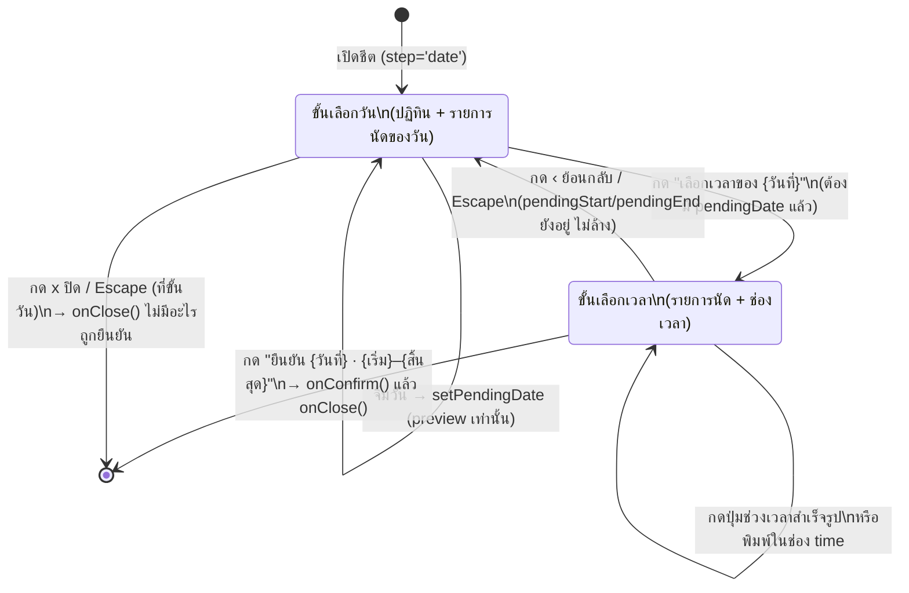
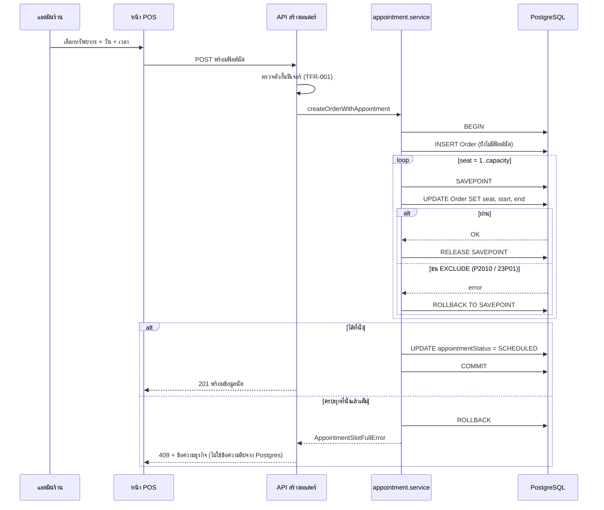
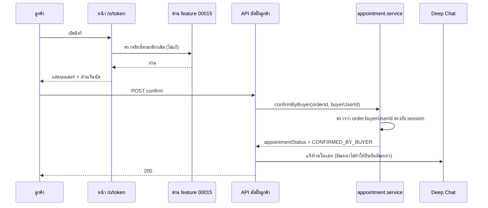
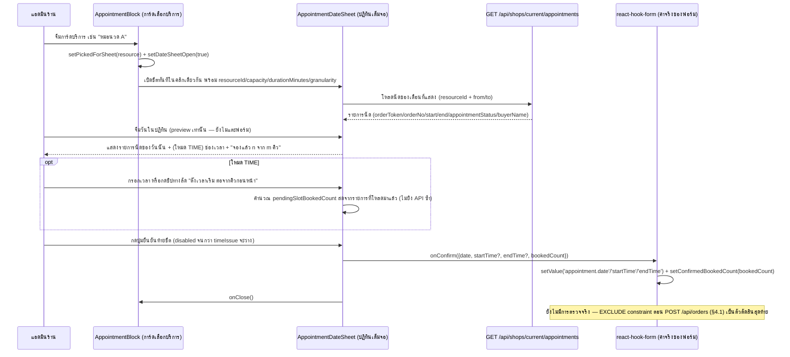

> **โมดูล:** M00024-ServiceAppointmentBooking
> **ประเภทเอกสาร:** Software Design Specification (SDS)
> **เวอร์ชัน:** 1.0
> **วันที่จัดทำ:** 2026-07-30
> **สถานะ:** Draft
> **เจ้าของเอกสาร:** safepay-planner (ดู [[Feature-Docs-Ownership]])

# SDS: ระบบนัดหมายวันเข้าใช้บริการ

---

## 1. บทนำ & References

เอกสารนี้ระบุ **การออกแบบระดับ component** ที่ developer นำไปเขียนโค้ดได้ตรง ๆ — ไฟล์ไหน ฟังก์ชันอะไร รับอะไร คืนอะไร และจุดไหนห้ามพลาด

| อ้างอิง | ใช้ทำอะไร |
|---------|----------|
| [[SRS]] | TFR ทุกข้อที่ออกแบบนี้ต้องตอบ |
| [[DATABASE]] | schema + EXCLUDE constraint + ผล spike |
| [[API]] | contract ของแต่ละ endpoint |
| `src/services/order.service.ts` | จุดที่ต้องต่อการสร้างนัดเข้าไป |
| `docs/20 - Features/00017 - Lodging Vertical/SDS.md` | precedent การดัก error + โครง service |

---

## 2. Architecture Overview

### 2.1 ไฟล์ที่ต้องสร้าง/แก้

| ไฟล์ | สถานะ | หน้าที่ |
|------|-------|---------|
| `src/lib/appointments.ts` | **ใหม่** | ค่าคงที่, ตัวกั้นฟีเจอร์, helper ตรวจ error, state transition |
| `src/services/service-resource.service.ts` | **ใหม่** | CRUD ทรัพยากร + กฎการลดความจุ |
| `src/services/appointment.service.ts` | **ใหม่** | จัดสรรที่นั่ง, ตั้ง/เลื่อน/ยืนยัน/ปิดผลนัด, ประวัติ |
| `src/services/order.service.ts` | แก้ | รับฟิลด์นัดตอนสร้างออเดอร์ (เรียก appointment.service) |
| `src/lib/validations.ts` | แก้ | Valibot schema ของ payload นัด |
| `prisma/schema.prisma` | แก้ | 2 model ใหม่ + 7 ฟิลด์บน `Order` + คำเตือน unmanaged SQL |
| `prisma/migrations/<ts>_service_appointment_booking/migration.sql` | **ใหม่** | เขียนมือ |
| `src/app/(paces)/seller/settings/service-resources/**` | **ใหม่** | หน้าตั้งค่าทรัพยากร |
| `src/app/(paces)/seller/appointments/**` | **ใหม่** | ปฏิทินคิว |
| `src/app/api/shops/current/service-resources/**` | **ใหม่** | API ทรัพยากร + availability |
| `src/app/api/shops/current/appointments/route.ts` | **ใหม่** | API ปฏิทิน |
| `src/app/api/orders/[token]/appointment/**` | **ใหม่** | API นัด — ทั้งฝั่งร้าน (`PATCH`, `outcome`) และฝั่งลูกค้า (`confirm`, `reschedule-request`) แยกกันด้วย authz ไม่ใช่ด้วยพาธ ตาม precedent `ship` (ร้าน) กับ `confirm` (ลูกค้า) ที่อยู่ใต้ `[token]` เดียวกันอยู่แล้ว |
| หน้า `/o/[token]` | แก้ | เพิ่มส่วนแสดง/ยืนยันนัด (หลังด่าน 00015) |
| ฟอร์มสร้างออเดอร์ POS | แก้ | เพิ่มส่วนเลือกวันนัด — implement จริงคือ `AppointmentBlock.tsx` ดู §3.7 |
| `orders/new/components/AppointmentDateSheet.tsx` | **ใหม่ (2026-08-07) — สัญญาแก้ 2026-08-08** | ปฏิทินเต็มจอเลือกวัน**และเวลา** — ดู §3.7 (SDS ฉบับร่างแรกไม่เคยพูดถึงไฟล์นี้เลย ทั้งที่เป็น component หลักของ FR-RSV-03/13 ในตอนนี้) |
| `orders/[token]/components/RescheduleAppointmentSheet.tsx` | แก้ (feature 00036) — เรียก `AppointmentDateSheet` ร่วม | เลื่อนนัดของออเดอร์ที่มีอยู่ — ดู §3.7 |
| `queues/components/GranularitySetting.tsx` | ย้ายตำแหน่งเรียกใช้ (2026-08-08) | จากฟอร์มทรัพยากร (`ResourceForm`) มาอยู่ท้ายหน้า `/queues` — ดู §3.9 |
| `src/lib/chat-service-progress.ts` | **ใหม่ (2026-08-08)** | แกนสถานะนัดในห้องแชทของร้าน `SERVICE_QUEUE` — ดู §3.10 (เจ้าของหลักคือแถบสถานะออเดอร์ในแชท ของ feature 00018/00036 — บันทึกไว้ที่นี่เพราะ input ทั้งหมดเป็นฟิลด์ที่ 00024 เป็นเจ้าของ) |

🛑 **ห้ามแตะไฟล์ของ feature 00015** (logic การเข้าถึง `/o/{token}`) — เพิ่มเฉพาะส่วนแสดงผลหลังด่านเท่านั้น

---

## 3. Component Design

### 3.1 `src/lib/appointments.ts`

```ts
export const APPOINTMENT_STATUS = {
  SCHEDULED: 'SCHEDULED',
  CONFIRMED_BY_BUYER: 'CONFIRMED_BY_BUYER',
  RESCHEDULE_REQUESTED: 'RESCHEDULE_REQUESTED',
  COMPLETED: 'COMPLETED',
  NO_SHOW: 'NO_SHOW',
} as const
export type AppointmentStatus = (typeof APPOINTMENT_STATUS)[keyof typeof APPOINTMENT_STATUS]

/** สถานะที่ถือว่า "จบแล้ว" — เลื่อน/ขอเลื่อนไม่ได้ (BR-RSV-31) */
export const TERMINAL_STATUSES: AppointmentStatus[] = ['COMPLETED', 'NO_SHOW']

/**
 * ตัวกั้นฟีเจอร์ (TFR-001) — ต้องเข้าเงื่อนไข "ทั้งสองอย่าง" (BR-RSV-01)
 * 🛑 ห้ามเช็ค vertical อย่างเดียว: ร้าน PERSONAL ที่เป็น GENERAL ต้องถูกปฏิเสธ
 */
export function canUseAppointments(shop: { kind: string; vertical: string }): boolean {
  return shop.kind === 'BUSINESS' && shop.vertical === 'GENERAL'
}

/**
 * ตรวจว่า error ที่ได้คือการชน EXCLUDE constraint หรือไม่
 *
 * 🛑 ต้องทน "สองรูป" เสมอ (บทเรียน feedback_spike_must_match_production_path):
 *    รูปที่ 1 — meta.code === '23P01' (รูปที่ spike เห็นจริงบน Prisma ปัจจุบัน)
 *    รูปที่ 2 — สตริง 23P01 / "exclusion constraint" ฝังในข้อความ (เผื่อ Prisma เปลี่ยนรูป
 *              หรือเส้นทางเรียกต่างกันแล้วห่อ error คนละชั้น)
 * ห้ามเช็ค P2002 — EXCLUDE ไม่ใช่ unique violation (spike ยืนยันว่าได้ P2010)
 */
export function isExclusionViolation(e: unknown): boolean {
  const err = e as { code?: string; meta?: Record<string, unknown>; message?: string }
  if (err?.meta?.code === '23P01') return true
  const blob = `${err?.message ?? ''}${JSON.stringify(err?.meta ?? {})}`
  return /23P01|exclusion constraint/i.test(blob)
}

/** error ของ service ที่ route จะ map เป็น 409 (บทเรียน feedback_service_error_route_mapping) */
export class AppointmentSlotFullError extends Error {
  constructor(
    readonly resourceName: string,
    readonly capacity: number,
    readonly start: Date,
    readonly end: Date,
  ) {
    super('APPOINTMENT_SLOT_FULL')
  }
}

export class AppointmentTerminalError extends Error {
  constructor() { super('APPOINTMENT_TERMINAL') }
}
```

### 3.2 `appointment.service.ts` — การจัดสรรที่นั่ง (หัวใจของฟีเจอร์)

**นี่คือจุดเดียวที่ผิดพลาดแล้วเกิดการจองทะลุความจุ — ต้อง implement ตามนี้เป๊ะ**

```ts
/**
 * จัดสรรที่นั่งให้ออเดอร์หนึ่งใบ (TFR-002)
 *
 * วิธีทำงาน: วนลองที่นั่ง 1..capacity — ที่นั่งไหน update ผ่าน = ได้ที่นั่งนั้น
 * ถ้าครบทุกที่นั่งแล้วยังชน = เต็มจริง
 *
 * 🛑 ห้าม implement ด้วยการ count() แล้วเทียบ capacity — มีช่องว่างระหว่างนับกับเขียน
 *    ทำให้จองทะลุความจุได้เมื่อกดพร้อมกัน (BR-RSV-18.1)
 * 🛑 ทุกครั้งที่ลองต้องครอบ SAVEPOINT — EXCLUDE ที่ยิงจะ poison ทั้ง transaction (25P02)
 *    ถ้าไม่ครอบ ที่นั่งแรกที่ชนจะทำให้ทั้งธุรกรรมตาย ทั้งที่ยังมีที่ว่าง
 * 🛑 ต้องมี advisory lock ต่อทรัพยากรก่อนเข้าลูป (เพิ่ม 2026-07-31 หลัง TC-A05 ไม่ผ่าน)
 *    EXCLUDE บน GiST "บล็อกให้รอ" เมื่อชนกับ transaction ที่ยังไม่ commit ไม่ใช่ error ทันที
 *    → ติดค้างที่นั่งนั้น ไปลองที่นั่งถัดไปไม่ได้ → deadlock + timeout ยกชุด
 *    วัดจริง: ไม่มี lock นี้ ยิง 12 พร้อมกันบนความจุ 8 ได้สำเร็จ 0 ราย
 *    (ดู DATABASE.md §4.2 และ TestCase.md §5.1)
 */
async function allocateSeat(
  tx: Prisma.TransactionClient,
  args: { orderId: string; resource: { id: string; name: string; capacity: number }
          start: Date; end: Date },
): Promise<number> {
  const { orderId, resource, start, end } = args

  // เรียงคิวการจัดสรรของทรัพยากรนี้ — ทำให้ลูปเห็นเฉพาะแถวที่ commit แล้ว
  // ขอบเขตต่อ resourceId (ไม่ใช่ทั้งร้าน), xact → ปลดเอง, lock เดียว → ไม่มี deadlock
  await tx.$executeRaw`SELECT pg_advisory_xact_lock(24::int, hashtext(${resource.id})::int)`

  for (let seat = 1; seat <= resource.capacity; seat++) {
    const sp = `seat_try_${seat}`
    await tx.$executeRawUnsafe(`SAVEPOINT ${sp}`)
    try {
      await tx.order.update({
        where: { id: orderId },
        data: {
          serviceResourceId: resource.id,
          serviceSeat: seat,
          serviceStart: start,
          serviceEnd: end,
        },
      })
      await tx.$executeRawUnsafe(`RELEASE SAVEPOINT ${sp}`)
      return seat
    } catch (e) {
      await tx.$executeRawUnsafe(`ROLLBACK TO SAVEPOINT ${sp}`)
      if (!isExclusionViolation(e)) throw e   // error อื่นต้องไม่ถูกกลืน
      // ชนที่นั่งนี้ → ลองที่นั่งถัดไป
    }
  }

  throw new AppointmentSlotFullError(resource.name, resource.capacity, start, end)
}
```

**ลำดับการสร้างออเดอร์พร้อมนัด** (สำคัญ — อธิบายว่าทำไมต้องสองขั้น):

```ts
await prisma.$transaction(async (tx) => {
  // ขั้น 1: สร้างออเดอร์โดย "ยังไม่ใส่ฟิลด์นัด"
  //   เหตุผล: ถ้าใส่ที่นั่งไปตั้งแต่ INSERT แล้วชน จะต้องสร้างออเดอร์ใหม่ทั้งใบเพื่อ retry
  //   (id/orderNo/publicToken ถูกใช้ไปแล้ว) — แยกเป็น update ทำให้ retry ได้สะอาด
  //   CHECK all-or-none ยอมให้ฟิลด์นัดว่างทั้งชุดอยู่แล้ว จึงไม่ผิดกฎ
  const order = await tx.order.create({ data: { ...orderData, type: 'SERVICE' } })

  // ขั้น 2: จัดสรรที่นั่ง (อาจ retry ภายในหลายรอบ)
  await allocateSeat(tx, { orderId: order.id, resource, start, end })

  await tx.order.update({
    where: { id: order.id },
    data: { appointmentStatus: APPOINTMENT_STATUS.SCHEDULED },
  })
  return order
})
```

### 3.3 `appointment.service.ts` — ฟังก์ชันสาธารณะ

| ฟังก์ชัน | ใคร | หน้าที่ | กฎที่บังคับ |
|---------|-----|---------|-------------|
| `setAppointment(shopId, orderId, input)` | ร้าน | ตั้งนัดให้ออเดอร์ที่ยังไม่มีนัด | TFR-001/002/003 |
| `rescheduleAppointment(shopId, orderId, input, actorUserId)` | ร้าน | ย้ายนัด + เขียนประวัติ | TFR-007, BR-RSV-31 |
| `setAppointmentOutcome(shopId, orderId, outcome)` | ร้าน | `COMPLETED`/`NO_SHOW` | BR-RSV-34 (ต้องถึงเวลาแล้ว) |
| `confirmByBuyer(orderId, buyerUserId)` | ลูกค้า | ยืนยันนัด (idempotent) | BR-RSV-26, TFR-008 |
| `requestReschedule(orderId, buyerUserId, note)` | ลูกค้า | ขอเลื่อน (ไม่ย้ายเวลา) | BR-RSV-23/27 |
| `getResourceAvailability(shopId, resourceId, range)` | ร้าน | จำนวนที่จองแล้วต่อช่วง | TFR-005 — แสดงผลเท่านั้น |
| `listAppointments(shopId, range, filter)` | ร้าน | ปฏิทินคิว | TFR-008/010 |

**การเลื่อนนัด — ต้องเขียนประวัติเสมอ (BR-RSV-30):**

```ts
await prisma.$transaction(async (tx) => {
  // อ่านค่าเดิมไว้ก่อน scope shopId ใน WHERE (TFR-008 — ห้าม findUnique แล้วค่อยเช็ค)
  const current = await tx.order.findFirst({
    where: { id: orderId, shopId },   // ownership อยู่ใน WHERE
    select: { serviceResourceId: true, serviceSeat: true,
              serviceStart: true, serviceEnd: true, appointmentStatus: true },
  })
  if (!current?.serviceStart) throw new NotFoundError()
  if (TERMINAL_STATUSES.includes(current.appointmentStatus)) throw new AppointmentTerminalError()

  await tx.appointmentReschedule.create({
    data: {
      orderId,
      fromResourceId: current.serviceResourceId, fromStart: current.serviceStart, fromEnd: current.serviceEnd,
      toResourceId: newResource.id, toStart: newStart, toEnd: newEnd,
      actorRole: 'SHOP', actorUserId, reason,
    },
  })

  // ที่ว่างเดิมคืนอัตโนมัติเพราะแถวเดิมถูกเขียนทับ — ไม่ต้องทำอะไรเพิ่ม (BR-RSV-29)
  await allocateSeat(tx, { orderId, resource: newResource, start: newStart, end: newEnd })

  await tx.order.update({
    where: { id: orderId },
    data: { appointmentStatus: APPOINTMENT_STATUS.SCHEDULED, rescheduleRequestNote: null },
  })
})
```

### 3.4 `service-resource.service.ts` — กฎการลดความจุ

```ts
/**
 * ลดความจุ (BR-RSV-06.2) — ปฏิเสธถ้ายังมีนัดที่ใช้ที่นั่งเกินความจุใหม่
 *
 * ⚠️ เกณฑ์นี้ "เข้มกว่า" ที่ BRD เขียนไว้เล็กน้อยเมื่อที่นั่งเป็นรู
 *    (เช่น ความจุ 3 มีนัดที่นั่ง 2,3 → จำนวนนัด 2 แต่ลดเหลือ 2 ไม่ได้)
 *    เป็นข้อจำกัดที่ทราบและยอมรับแล้ว — ดู DATABASE §4.4
 *    ข้อความที่ผู้ใช้เห็นต้องอธิบายด้วยภาษาธุรกิจ ไม่พูดถึง "ที่นั่ง"
 */
const blocking = await prisma.order.findFirst({
  where: {
    serviceResourceId: resourceId,
    status: { not: 'CANCELLED' },
    serviceSeat: { gt: newCapacity },
    serviceEnd: { gt: new Date() },   // นัดที่ผ่านไปแล้วไม่บล็อก
  },
  select: { serviceStart: true, serviceEnd: true, orderNo: true },
  orderBy: { serviceStart: 'asc' },
})
if (blocking) throw new CapacityReductionBlockedError(blocking)
```

**การลบทรัพยากร (BR-RSV-08):** ไม่ต้องเช็คเองในแอป — FK `ON DELETE RESTRICT` เป็นตัวบังคับ แต่ต้องดัก error ของ FK แล้วแปลงเป็นข้อความที่บอกจำนวนนัดที่ผูกอยู่ พร้อมแนะให้ปิดการใช้งานแทน

### 3.5 UI — ฝั่งร้าน `(paces)/**`

🛑 **ต้องผ่าน `safepay-ux` ก่อนเขียนโค้ดทุกหน้า** (Hard Rule 8) และ copy จาก Paces theme (Hard Rule 1/7)

| หน้า | Theme source ที่ต้อง copy | หมายเหตุ |
|------|--------------------------|----------|
| ตั้งค่าทรัพยากร (list + form) | Paces หน้า list/form ที่ ux ระบุ | ห้าม arbitrary Tailwind value (Hard Rule 7) |
| ปฏิทินคิว | Paces component ที่ ux ระบุ | mobile-first, ไม่ใช่ chart จึงไม่เข้า Hard Rule 10 |
| ส่วนวันนัดในฟอร์มสร้างออเดอร์ | ส่วนขยายของฟอร์ม POS เดิม | ไม่บังคับกรอก |

- toast ทุกจุดใช้ `pacesToast` (Hard Rule 9) — action = top-right
- dialog ยืนยันการยกเลิก/เลื่อน ใช้ Sweet Alert ตาม convention
- วันเวลาใช้ `formatDate`/`formatDateTime`
- **ห้าม emoji** — ไอคอนที่ spec ไม่ได้ระบุตัว ต้องถาม user ก่อน (Hard Rule 12)

### 3.6 UI — ฝั่งลูกค้า `(marketing)/**`

- ส่วนแสดงนัดบน `/o/{token}` render **หลัง** ด่าน 00015 เท่านั้น
- ออเดอร์ที่ไม่มีนัด → ไม่ render อะไรเลย (ไม่ใช่ render แล้วซ่อน)
- ใช้ `formatDateTimeTH` (พ.ศ.)
- ปุ่ม "ยืนยันนัด" + "ขอเลื่อนนัด" — ยืนยันแล้วปุ่มเปลี่ยนสถานะ ไม่หายไป (กดซ้ำได้แบบ idempotent)

### 3.7 `AppointmentDateSheet` — ปฏิทินเต็มจอเลือกวัน+เวลา (เพิ่ม 2026-08-07, สัญญาแก้ 2026-08-08, แยก 2 ขั้นบนมือถือ 2026-08-09)

> **เพิ่มเข้าเอกสารนี้ย้อนหลัง 2026-08-08** — SDS ฉบับร่างแรก (§3.5 เดิม) ออกแบบไว้แค่
> `<input type="date">` ธรรมดา + endpoint `.../availability` คืนตัวเลขไปวางไว้ข้าง ๆ ช่อง
> implementation จริงต่างไปมาก: ปฏิทิน + รายการนัดของวัน + ช่องเวลา ถูกรวมเป็นชีตเต็มจอเดียว
> ที่เป็นทั้งจุดเลือกวัน**และ**เวลาของทั้งฟีเจอร์ตอนนี้

**ไฟล์:** `src/app/(paces)/seller/(dashboard)/orders/new/components/AppointmentDateSheet.tsx`
**Base:** `queues/components/AppointmentCalendar.tsx` (FullCalendar dayGridMonth) + `./AddressSearchSheet.tsx` (โครง sheet เต็มจอ)

**Props:**

| Prop | Type | บังคับ | หมายเหตุ |
|------|------|--------|----------|
| `open` | `boolean` | ✓ | |
| `resourceId` | `string?` | | คิวงานที่กำลังดูความว่าง — ไม่ส่ง = ไม่โหลดอะไร |
| `resourceName` | `string?` | | โชว์ในหัวชีต |
| `resourceCapacity` | `number?` | | ความจุของคิวงาน — sheet ไม่ query ซ้ำ ผู้เรียกมีอยู่แล้วในฟอร์ม |
| `resourceDurationMinutes` | `number \| null` | | ระยะเวลามาตรฐาน — ใช้เป็น **ชิป "ใช้เวลา" ที่ถูกเลือกไว้ล่วงหน้า** และถูกแทรกเข้าชุดชิปพื้นฐาน (ดู §3.7.1). `null` → ตกไป `DEFAULT_APPOINTMENT_DURATION_MIN` (60) ไม่ใช่ปล่อยว่าง |
| `granularity` | `AppointmentGranularity` | **✓ บังคับ ไม่ใช่ optional** | `'DAY'` ซ่อนช่องเวลาทั้งหมด, `'TIME'` โชว์ — ปล่อยเป็น optional จะมีค่าตั้งต้นเงียบ ๆ ที่อาจผิดกับร้าน |
| `value` / `valueStartTime` / `valueEndTime` | `string?` | | ค่าที่ฟอร์มถืออยู่ตอนเปิดชีต ("YYYY-MM-DD" / "HH:mm") |
| `excludeOrderToken` | `string?` | | (feature 00036) กันนัดใบที่กำลังเลื่อนอยู่ไม่ให้ถูกนับเป็นคิวที่เต็มของตัวเอง |
| `onConfirm` | `(r) => void` | ✓ | ดูด้านล่าง — ยิง **ครั้งเดียวตอนกดปุ่มยืนยัน** |
| `onClose` | `() => void` | ✓ | |

**สัญญา `onConfirm`** — เปลี่ยนจาก `onSelect(date)` เดิมทั้งหมด:

```ts
onConfirm: (result: {
  date: string
  startTime?: string   // undefined เสมอเมื่อ granularity === 'DAY'
  endTime?: string
  bookedCount: number  // จำนวนคิวที่ทับกับช่วงที่เพิ่งยืนยัน — แสดงผลเท่านั้น ห้ามใช้ตัดสิน (BR-RSV-18)
}) => void
```

จิ้มวัน/พิมพ์เวลา**ใน**ชีตเป็นแค่ preview (`pendingDate`/`pendingStart`/`pendingEnd`) — ค่าจริงในฟอร์ม
ไม่เปลี่ยนจนกว่าจะกดปุ่มยืนยันท้ายชีต กด `‹` ย้อนกลับ/Escape/ปิดชีตแล้วไม่มีอะไรเปลี่ยน

**ผู้เรียก 2 จุด (contract เดียวกัน คนละ context):**

| ผู้เรียก | `granularity` มาจากไหน | เหตุผล |
|---------|------------------------|--------|
| `AppointmentBlock.tsx` (สร้างออเดอร์ใหม่) | `appointmentGranularity` **ของร้าน ณ ปัจจุบัน** | นัดใหม่ต้องตามค่าที่ร้านตั้งไว้ตอนนี้ |
| `RescheduleAppointmentSheet.tsx` (feature 00036, เลื่อนนัด) | `allDay ? 'DAY' : 'TIME'` ของ **นัดใบนั้นเอง** (BR-RSV-57) | ร้านที่สลับโหมดไปแล้วต้องเลื่อนนัดเก่าได้ในรูปแบบเดิมของนัดนั้น ไม่ใช่ถูกบังคับตามโหมดใหม่ของร้าน |

**ที่มาของข้อมูลนัดในชีต:** ยิง `GET /api/shops/current/appointments?resourceId=&from=&to=` (endpoint เดียวกับปฏิทินหน้า `/queues` — ดู API.md §4.5) แทนที่จะยิง
`GET /api/shops/current/service-resources/availability` (§4.4) แบบร่างแรก เพราะต้องใช้ชื่อลูกค้า/เลขออเดอร์/สถานะนัดไปแสดงในรายการของวันนั้นด้วย ไม่ใช่แค่ตัวเลขจำนวน
— 🛑 **ตั้งแต่ 2026-08-08 ไม่มี UI ไหนเรียก endpoint `.../availability` แล้ว** (endpoint ยังอยู่ในระบบ ไม่ได้ถูกลบ เผื่อ consumer อื่นในอนาคต)

**กฎ "เต็ม" แยกตามโหมด (สำคัญ — เคยเป็นจุดพลาดถ้าคิดว่าเกณฑ์เดียวกันใช้ได้ทั้งสองโหมด):**

- โหมด `DAY`: `isFull(day)` นับ **จำนวนนัดทั้งวัน** เทียบ `capacity` — ใช้ย้อมวันในปฏิทิน + ปิดปุ่มยืนยัน
- โหมด `TIME`: **ห้ามใช้เกณฑ์เดียวกัน** ความจุของโหมดนี้วัดที่ "ช่วงเวลาที่ทับกัน" ไม่ใช่จำนวนนัดทั้งวัน (วันที่มี 10 นัดสั้นกระจายทั้งวันยังว่างช่วงอื่นอยู่เต็มไปหมด) — ใช้ `pendingSlotBookedCount` ที่คำนวณสดจากรายการที่โหลดมาแล้ว (ไม่ยิง API ซ้ำ) เทียบ `capacity` แทน
- legend "เต็ม" ในปฏิทินจึง render เฉพาะ `granularity==='DAY'` เท่านั้น

**ตัวเลขทั้งหมดในชีต (`bookedCount`, `pendingSlotBookedCount`, "จองแล้ว n จาก m คิว") ใช้แสดงผลเท่านั้น** — ตัวตัดสินจริงยังเป็น EXCLUDE constraint ตอน `POST /api/orders` (§4.1) เหมือนเดิมทุกประการ ระหว่างที่ชีตเปิดค้างอาจมีคนจองแทรกได้เสมอ

**a11y ที่เพิ่มเข้ามา 2026-08-08 (blocker เดิม — ไม่มีใน draft แรก):**

- เลือกวันด้วยคีย์บอร์ดได้ (`onDayKeyDown` ดัก Enter/Space บน div ที่คืนจาก `dayCellContent` — `dateClick` ของ FullCalendar ผูกกับ mouse/touch เท่านั้น ไม่งั้นงานหลักของทั้งจอทำด้วยคีย์บอร์ดไม่ได้เลย, WCAG 2.1.1)
- `timeIssue` เป็น SSOT เดียวที่ 3 ที่ใช้ร่วม: **สถานะ disabled ของปุ่มยืนยัน** (ผ่านธง `blocking` — ดู §3.7.1), ข้อความใต้ช่องเวลา, `aria-invalid`/`aria-describedby` ของช่องเวลาสิ้นสุดในโหมดกำหนดเอง — ห้ามก็อปคำไปเขียนซ้ำที่ใดที่หนึ่ง. **ป้ายปุ่มไม่ใช่ที่แสดง error อีกต่อไป** (2026-08-09) — ปุ่มพูดเรื่องเดียวคือ "ยืนยันอะไร" เพราะประโยคเดียวกันเคยโผล่ 2 ที่ห่างกัน 40px และปุ่มที่ `disabled` หลุด tab order ข้อความบนมันจึงไปไม่ถึงผู้ใช้ screen reader ตั้งแต่แรก
- กล่อง `aria-live="polite"` อยู่ใน DOM ตลอดเวลา (ไม่ใช่โผล่มาพร้อมข้อความ — live region ที่เพิ่งถูกแทรกมักไม่ถูกประกาศ)
- `role="dialog" aria-modal="true"` + โฟกัสย้ายเข้าปุ่มปิดตอนเปิด + Escape ปิดชีต
- ปุ่มไอคอนทั้งหมด (ปิด/เลื่อนเดือน/วันนี้) `min-h-11 min-w-11` (44px ตาม PRODUCT.md) — `.btn.btn-icon` เปล่าของธีมได้แค่ 37px

**Layout:** ทุก breakpoint ในไฟล์ใช้ **container query** (`@3xl`/`@5xl`) ไม่ใช่ viewport (`md:`/`lg:`) เพราะชีตนี้เปิดได้จาก 2 บริบทกว้างไม่เท่ากันที่วิวพอร์ตเดียวกัน (เต็มจอที่ `/orders/new` กับกล่อง 384px ในหน้าต่างร่างออเดอร์ของแชท ซึ่งตั้ง `transform-gpu` ทำให้เป็น containing block ของ `fixed`)

---

### §3.7.1 ขั้น "เลือกเวลา" — เวลาเริ่ม + **ระยะเวลา** (แก้ 2026-08-09)

🛑 **เลิกถามเวลาสิ้นสุด** — ขั้นนี้ถาม 2 ค่าคือ **เวลาเริ่ม** (ชิป) และ **ใช้เวลา** (ชิป) แล้ว
`pendingEnd` เป็น `useMemo` ที่ derive จาก `start + duration` ทุกครั้ง ไม่ใช่ state

**ทำไม (ไม่ใช่แค่กดง่ายขึ้น):** เมื่อไม่มีช่องเวลาสิ้นสุดให้กรอก เงื่อนไข `end <= start`
ก็สร้างไม่ได้ทางโครงสร้าง เหลือทางเดียวคือช่วงล้นข้ามเที่ยงคืน ซึ่งได้ข้อความของตัวเอง
บั๊ก `endTouched` เดิม (ตั้ง `true` ตอนเปิดถ้าฟอร์มเคยมี `endTime` แล้ว auto-fill ตายทั้งชีต
→ กดชิปเวลาใหม่กี่ครั้งก็ได้ช่วงผิดกฎทุกครั้ง) จึง**หายไปพร้อมกลไกที่มันอาศัยอยู่**

**ฐานข้อมูลยังเก็บ `start`/`end` เป็นความจริงเหมือนเดิม** — ระยะเวลาเป็นแค่ *วิธีกรอก*
ห้ามเพิ่มคอลัมน์ให้มันกลายเป็นความจริงที่สอง (`stored-flag-vs-owner-truth.md`)
จึง derive กลับทุกครั้งที่เปิดชีตด้วย `resolveInitialDuration()`

**ฟังก์ชันบริสุทธิ์ใน `src/lib/appointments.ts` (มีเทสผูก `[blocker]`):**

| ฟังก์ชัน | หน้าที่ | กติกาที่ห้ามพัง |
|---|---|---|
| `resolveInitialDuration(start, end, choices, resourceDefault)` | ถอด start/end ที่บันทึกไว้กลับเป็นชิประยะเวลาตอนเปิดชีตซ้ำ | ช่วงที่ไม่ตรงชิปไหน → โหมด "กำหนดเอง" พร้อมค่าเดิมเป๊ะ **ห้าม snap** · ค่าเสียที่ค้างมา (end ไม่อยู่หลัง start) **ห้ามพาเข้ามาต่อ** |
| `minutesBetweenTimes(start, end)` | ทิศกลับของ `addMinutesToTime` | คืน `null` เมื่อ end ไม่ได้อยู่หลัง start (รวมกรณีเท่ากัน) |
| `formatDurationTH(min)` | SSOT ของ *คำเรียก* ระยะเวลาทั้งระบบ (HR16) | 90 → "1 ชม. 30 นาที" ไม่ใช่ "1.5 ชม." (135 จะกลายเป็น "2.25 ชม." ซึ่งไม่มีใครพูด) · `ResourceList`/`PublicServiceList` เรียกตัวนี้ด้วย |
| `nextShowAllHours(expanded, startsOutside)` | ปุ่ม "เวลาอื่น / ย่อกลับ" | ย่อกลับได้ก็ต่อเมื่อเวลาที่เลือก**ไม่ได้อยู่นอก** 08:00–20:00 ไม่งั้นกริดจะไม่มีชิป active ขณะที่กล่องสรุปยังยืนยันเวลาเดิม |

**ชุดชิป:** ระยะเวลาพื้นฐาน `[30, 60, 90, 120]` แล้ว **แทรก** `resourceDurationMinutes` เข้าไป
ตามลำดับ (ไม่ใช่แทนที่ — ร้าน 45 นาทีจึงได้ 30/45/60/90/120 ไม่ใช่ 45/90/135 ซึ่งจะเลือก 1 ชม.
ไม่ได้เลย) · เวลาเริ่มตั้งต้น 08:00–20:00 ทีละชั่วโมง ปุ่ม "เวลาอื่น" กางเป็น 00:00–23:00

**a11y ของขั้นนี้ (เพิ่ม 2026-08-09 หลัง impeccable critique):**

- ชิปทั้ง 2 ชุดมี `role="group"` + `aria-labelledby` ชี้หัวข้อของตัวเอง — `<p className="form-label">`
  เป็นหัวข้อทางสายตาอย่างเดียว ไม่ผูกกับอะไร (`aria-name-requires-supporting-role.md`)
- **roving tabindex** บนกริดเวลาเริ่ม + ลูกศรซ้าย/ขวา/Home/End (ไม่มีบน/ล่าง เพราะจำนวนคอลัมน์
  เป็น container query ที่ JS ไม่รู้ค่า เดาแล้วกระโดดผิดช่อง) — ลูกศรย้าย **โฟกัส** ไม่ใช่ **เลือก**
- โฟกัสตอนเข้าขั้นนี้ไปที่ **ชิปเวลา** ไม่ใช่ปุ่มย้อนกลับ
- ปุ่มยืนยันใช้ `aria-disabled` ไม่ใช่ `disabled` (ตัวหลังหลุด tab order ผู้ใช้คีย์บอร์ดจึงไม่เจอ
  อะไรที่ท้ายจอเลย) กดแล้วเลื่อนไปหาบรรทัดที่บอกว่าติดอะไรอยู่
- ทุกข้อความบนพื้น `{semantic}/15` และพื้นเทาใช้ `text-{semantic}-ink` — `text-primary` บนพื้น
  `/15` ได้ 4.17:1 และ `text-danger` บนพื้น `default-100` ได้ 2.96:1 ตก AA ทั้งคู่
- ชิปเวลาที่ผ่านมาแล้ว**ห้ามหรี่ด้วย `opacity`** (50% ของ `text-default-800` = 2.75:1 ทั้งที่ยัง
  กดได้ตาม FR-RSV-03) ใช้ `text-default-500` (6.22:1) แล้วหรี่เฉพาะขอบ

🛑 **`blocking` แยกจาก `invalid` ใน `timeIssue`** — "ช่วงเวลานี้เต็ม" เป็น **คำเตือนที่ยังกดยืนยันได้**
ไม่ใช่ตัวบล็อก ตาม BR-RSV-18 (เลขฝั่ง client ห้ามตัดสินว่าจองได้/ไม่ได้ — ตัวตัดสินคือ EXCLUDE
constraint) `disabled` สงวนไว้กับเคสที่ client ตัดสินได้เอง: ยังไม่เลือกเวลาเริ่ม, ยังไม่ระบุ
เวลาสิ้นสุดในโหมดกำหนดเอง, ช่วงข้ามเที่ยงคืน. โหมด DAY ("วันนี้เต็ม") ใช้กติกาเดียวกัน

#### 3.7.1 แยกเลือกวัน/เลือกเวลาเป็น 2 ขั้นบนมือถือ (เพิ่ม 2026-08-09)

> user report 2026-08-09: เลือกเวลาบนมือถือ (เปิดจากหน้าแชท) ใช้ยาก — พอเลือกวันเสร็จ ปฏิทินเดือน
> ยังกินพื้นที่ ~320px กลางจอทั้งที่ทำหน้าที่จบไปแล้ว ช่องเวลาถูกดันไปใต้เส้นพับ ต้องเลื่อนลงไปหา
> แล้วปั่น native time picker ทีละช่อง

**มีผลเฉพาะ กล่องแคบ (`@5xl` ไม่ถึง) + `granularity==='TIME'` เท่านั้น** — โหมด `DAY` ไม่มีขั้นที่ 2
เลย (ทรงเดิม 100%) และกล่องกว้าง (`@5xl`) ไม่แยกขั้นเช่นกัน เพราะที่นั่นเห็นปฏิทินกับรายการ/ช่องเวลา
พร้อมกันอยู่แล้วคนละคอลัมน์ — การบังคับแยกขั้นจะเป็นการเพิ่มคลิกโดยไม่ได้อะไรกลับมา

- state ใหม่ `step: 'date' | 'time'` — คำนวณ `twoStep = !byDay` และ `atTimeStep = twoStep && step === 'time'`
- ซ่อน/แสดงด้วย **คลาส `@5xl:` ทับ ไม่ใช่ JS** (idiom เดียวกับ `DOW_SHORT`/`DOW_FULL` ในไฟล์นี้) — component ไม่ต้องรู้ความกว้างกล่องจริงเลย
- ขั้น `time` ซ่อนแถบเดือน + legend + ปฏิทิน (ข้อมูลซ้ำกับสิ่งที่เพิ่งตัดสินใจไปแล้ว และเป็น ~400px ที่ไปเบียดช่องเวลา) — รายการนัดของวันนั้น + ส่วนเลือกเวลายังอยู่ (รายการเลื่อนในตัวเอง ช่องเวลาตรึงล่าง — กันไม่ให้ทั้ง 3 ส่วนแย่งพื้นที่กันจนรายการเหลือ 0px)
- ปุ่มหัวแผ่นทำ 2 หน้าที่ตามขั้น: ขั้น `date` = ไอคอน `x` ปิดชีต · ขั้น `time` = ไอคอน `chevron-left` ถอยกลับไปขั้น `date` (ไม่ปิดชีต) — Escape ทำเช่นเดียวกัน (ถอยทีละขั้น ไม่ปิดทั้งใบตอนอยู่ขั้น `time`)
- โฟกัสย้ายเข้าปุ่มหัวแผ่นทุกครั้งที่ **ขั้นเปลี่ยน** ไม่ใช่แค่ตอนเปิดชีต (ปุ่มที่เพิ่งกดถูกซ่อนด้วย `hidden` ทันที — ไม่ย้ายโฟกัสจะค้างอยู่บนปุ่มที่หายไปแล้ว)
- ปุ่มล่างมี **2 ปุ่ม เรนเดอร์เสมอทั้งคู่ สลับด้วยคลาส** (เหตุผลเดียวกับ `@5xl:` ด้านบน — ต้องชนะได้โดยไม่ต้องรู้ความกว้างกล่องใน JS):
  - **advance** — "เลือกเวลาของ {formatDateTH(pendingDate)}" (หรือ "แตะวันในปฏิทินก่อน" ถ้ายังไม่จิ้มวัน, `disabled`) — โผล่เฉพาะกล่องแคบ + `twoStep && step==='date'`
  - **confirm** — `confirmState.label` เดิม (ดู §3.7 ด้านบน) — โผล่เมื่อ `byDay || step==='time'` (กล่องกว้างโผล่เสมอผ่าน `@5xl:flex`)

**ปุ่มช่วงเวลาสำเร็จรูป (`timeSlots`)** — ทางลัดหลักของขั้นเลือกเวลา แทนการปั่น native
`<input type="time">` ทีละช่อง:

- ป้ายชิปเป็น **เวลาเริ่มอย่างเดียว** ไม่ใช่ช่วง — ปลายทางมาจากชิป "ใช้เวลา" ที่อยู่ใต้ลงไป เขียนช่วงไว้บนชิปด้วยจะมีเลขขัดกันสองชุดบนจอเดียว (HR16)
- หน้าต่างตั้งต้น **08:00–20:00 ทุก 1 ชั่วโมง = 12 ชิป** กริด 4 คอลัมน์ (`@3xl` = 6) — user เคาะให้ใช้ค่านี้ไปก่อน 🛑 **ไม่มีคอลัมน์ "เวลาทำการ" ใน `Shop`/`ServiceResource` ใน DB จริง** ไม่มี migration ไปกับงานนี้ — ระยะห่างคงที่ 1 ชม. ไม่ผูกกับ `resourceDurationMinutes` (บริการ 25 นาทีจะได้ ~28 ชิปซึ่งล้นทุกความกว้าง)
- ปุ่ม **"เวลาอื่น"** กางเป็น 00:00–23:00 พร้อมหัวข้อคั่น เช้า/บ่าย/เย็น — เป็น *ค่าตั้งต้น ไม่ใช่เพดาน* ร้านเปิดเช้า/เปิดดึกต้องไปถึงได้จากจอนี้ ไม่ใช่ต้องรู้เองว่ามีช่องกรอกซ่อนอยู่ที่อื่น. ย่อกลับได้เฉพาะเมื่อเวลาที่เลือกไม่ได้อยู่นอกหน้าต่าง (`nextShowAllHours`)
- 🛑 **ชิปที่ชนคิวเดิมไม่ `disable`** — ติดจุดเตือน (`s.busy`) เท่านั้น ยึด BR-RSV-18 (การตรวจฝั่ง client เป็นแค่ UX ไม่ใช่กลไกความถูกต้อง — ข้อมูลอาจ stale ระหว่างชีตเปิดค้าง) การ disable จาก client data จะบล็อกช่วงที่จริง ๆ ยังจองได้. **ตั้งแต่ 2026-08-09 ปุ่มยืนยันก็ไม่ถูก disable ด้วยเหตุผลเดียวกัน** (ดู `blocking` ใน §3.7.1)
- เวลาที่ผ่านไปแล้วของวันนี้ (`s.past`) หรี่ด้วย **`text-default-500` + ขอบอ่อน ไม่ใช่ `opacity-50`** — ชิปพวกนี้ยังกดได้ (FR-RSV-03/BR-RSV-15 อนุญาตนัดย้อนหลัง) และ `opacity` ทำให้ตัวหนังสือเหลือ 2.75:1 ซึ่งตก AA สำหรับ control ที่ใช้งานได้จริง
- ⚠️ **จุดเตือน `s.busy` ยังตก WCAG 1.4.11** (6px `bg-warning` บนพื้นขาว = 1.66:1 ต้องการ 3:1) — รู้ตัวแล้วแต่ยังไม่แก้ เพราะจุดสีเดียวกันใช้ใน legend ของปฏิทินด้วย เปลี่ยนข้างเดียวจะทำให้สองที่สื่อคนละภาษา (ค้างไว้เป็นข้อตัดสินใจ)

**Mermaid — flow ขั้นเลือกวัน/เวลา (กล่องแคบ + `granularity==='TIME'` เท่านั้น):**



**หมายเหตุ:** โหมด `DAY` ไม่มี state `Step_Time` เลย — ปุ่มยืนยันโผล่ตั้งแต่จิ้มวันแล้ว (ทรงเดิมก่อน 2026-08-09 ทุกประการ) กล่องกว้าง (`@5xl`) ไม่มี state machine นี้เช่นกัน เพราะเห็นทั้งสองส่วนพร้อมกันตลอดเวลา

`RescheduleAppointmentSheet.tsx` (feature 00036) ไม่ต้องแก้โค้ดเลย — ได้ทรง 2 ขั้นนี้อัตโนมัติเพราะเรียก `AppointmentDateSheet` ตัวเดียวกัน

### 3.8 helper กลาง `combineDateTime` / `addMinutesToTime` (ย้ายเข้า `src/lib/appointments.ts` เมื่อ 2026-08-08)

เดิมประกาศซ้ำใน `AppointmentBlock.tsx` และ `RescheduleAppointmentSheet.tsx` แยกกัน — ย้ายมาเป็น SSOT เดียว เพราะตอนนี้มีผู้ใช้ 2 ที่ (ฟอร์มใช้คำนวณ "นัดนี้ผ่านไปแล้วไหม" · ชีตปฏิทินใช้เช็คช่วงเวลาทับกัน) ปล่อยให้ต่างคนต่างประกาศจะทำให้วันหนึ่งตัดสิน "เวลาเดียวกัน" ไม่ตรงกัน (Hard Rule 16 — domain term/logic เดียวต้องมีนิยามเดียว)

- `combineDateTime(date, time): Date | null` — รวม `"YYYY-MM-DD"` + `"HH:mm"` เป็น `Date` ตามเวลาเครื่อง
- `addMinutesToTime(time, minutes): string` — บวกนาทีแล้ววนกลับที่ 24 ชม. (`% 24`) โดยตั้งใจ — คิวที่ยาวข้ามเที่ยงคืนได้เวลาสิ้นสุดที่ "ดูย้อนหลัง" ซึ่งต้องให้ผู้ใช้เห็นแล้วแก้เอง ไม่ใช่ระบบตีความเงียบ ๆ (ตัวกันจริงคือปุ่มยืนยันที่บังคับ end > start)

`AppointmentBlock.tsx` เลิกยิง `/service-resources/availability` เองไปพร้อมการย้ายนี้ — ตัด state `busy`/`loadingBusy`/`busyFailed`, cache `inFlightBusy` (เดิมจำเป็นเพราะบล็อกนี้ mount พร้อมกัน 2 ใบ — มือถือ+เดสก์ท็อป — แล้วยิงซ้ำ), และชิป "คิวที่มีอยู่แล้ววันนี้" (ซึ่งเคยแสดงนัดทั้งวันเป็น `00:00–00:00` — บั๊กที่ user เจอ 2026-08-08 หายไปพร้อมโค้ดที่ทำให้เกิด) ทั้งหมดย้ายเข้าไปอยู่ใน `AppointmentDateSheet` (§3.7)

### 3.9 การตั้งค่า `Shop.appointmentGranularity` — ย้ายตำแหน่ง UI (2026-08-08)

- **เดิม:** การ์ด `<GranularitySetting>` ฝังอยู่ใน `ResourceForm` (`/queues/new`, `/queues/[id]`) — เข้าถึงได้เฉพาะตอนสร้าง/แก้ทรัพยากรทีละตัว
- **ปัญหา:** ร้านที่ตั้งคิวงานเสร็จแล้วไม่มีเหตุผลย้อนกลับเข้าฟอร์มทรัพยากรอีก จึงหาที่ตั้งค่านี้ไม่เจอ — ร้านจริง (BT) รายงาน 2026-08-08 ว่า "ระบุเวลานัดไม่ได้" ทั้งที่ `appointmentGranularity` ยังเป็นค่าเริ่มต้น `DAY` ของตัวเองอยู่ (ไม่ใช่บั๊ก — แค่หาปุ่มไม่เจอ)
- **แก้:** ย้ายการ์ด `GranularitySetting` ไปวางท้ายสุดของ `queues/page.tsx` (ใต้ปฏิทิน + รายการทรัพยากร) — endpoint `PATCH /api/shops/current/appointment-settings` (API.md §4.0) ไม่เปลี่ยน, บันทึกทันทีที่เลือกเหมือนเดิม (คนละ endpoint จากฟอร์มอื่นในหน้า จึงไม่มีปุ่ม "บันทึก/ยกเลิก" ผูกกับมัน)
- เพิ่มกล่องใบ้ (`bg-info/10`) ใน `AppointmentBlock.tsx` เมื่อ `granularity==='DAY'`: **"ร้านนี้รับนัดเป็นรายวัน จึงไม่ต้องกรอกเวลา — เปลี่ยนได้ที่เมนูคิวงาน (ท้ายหน้า)"** — กันไม่ให้ผู้ขายที่เจอฟอร์มไม่มีช่องเวลาสรุปว่า "ระบบทำไม่ได้" ซ้ำอีก

### 3.10 แกนสถานะนัดในห้องแชท — `src/lib/chat-service-progress.ts` (เพิ่ม 2026-08-08)

🛑 **หมายเหตุความเป็นเจ้าของ:** พื้นผิวที่ใช้ไฟล์นี้จริง (แถบสถานะออเดอร์ในห้องแชท `OrderProgressBar.tsx`, แกนคู่ขนาน `chat-order-progress.ts`, `appointment-stage.ts`) เป็นของ feature 00018 (Facebook Chat) / 00036 (Service Order Surface) ที่ยังไม่มี SDS ของตัวเองครบ — บันทึกไว้ที่นี่เพราะ input ทั้งหมดเป็นฟิลด์ที่ **00024 เป็นเจ้าของ** (`Order.serviceStart`/`serviceEnd`/`appointmentStatus`) เมื่อ 00018/00036 sync เอกสารตัวเองแล้ว ให้ cross-link กลับมาที่นี่

**ที่มา (บั๊ก):** ก่อนหน้านี้ห้องแชทรู้จักแกนเดียวคือ "ของอยู่ไหน" (`chat-order-progress.ts` ของแกนขนส่ง) ร้าน `SERVICE_QUEUE` ที่ไม่เคยส่งของเลยจึงถูกตัดสินด้วยเกณฑ์เดียวกัน — ไม่ใช่แค่ป้ายผิด: `filterActiveOrders` ของแกนขนส่งตัดสิน "ยังเป็นงานค้างไหม" ด้วยเงื่อนไขเดียวกัน ออเดอร์บริการจึงไม่มีวันเป็น `DONE` เลย ค้างอยู่ในแถบสถานะตลอดกาลพร้อมป้าย "รอเลขพัสดุ"

**`serviceProgressStage(order): 'SCHEDULED'|'CONFIRMED_BY_BUYER'|'RESCHEDULE_REQUESTED'|'PENDING'|'DONE'`**

- `status==='CANCELLED'` → `DONE` เสมอ ไม่ว่านัดจะอยู่สถานะไหน
- มี `serviceStart` (มีนัดผูก) → ใช้ `deriveAppointmentStage()` (จาก `appointment-stage.ts`, feature 00036) แล้วยุบ `COMPLETED`/`NO_SHOW` → `DONE`
- ไม่มี `serviceStart` (**walk-in**) → `status==='CONFIRMED'` → `DONE`, อื่น ๆ → **`PENDING`** — 🛑 **ไม่ใช่ตกหาย** (BR-RSV-04 กำหนดว่า walk-in เดินเส้นทางออเดอร์ปกติทุกอย่าง จึงต้องยังเป็นงานค้างของรายการนี้ด้วย)
- `COMPLETED`/`NO_SHOW`/`CANCELLED` = หลุดจากรายการงานค้างทันที — **ไม่มีช่วงค้างแสดง** แบบที่แกนขนส่งมี (`DELIVERED_VISIBLE_MS` เป็นกติกาของ `deriveOrderStage` คนละฟังก์ชัน ไม่เกี่ยวกับแกนนี้)

**`filterActiveServiceOrders(orders)`** — คืนเฉพาะใบที่ยัง `!== 'DONE'` — ตัวที่แก้บั๊กจริง (คู่กับ `filterActiveOrders` เดิมของแกนขนส่ง)

**`SERVICE_STAGE_CHIP_META`** — label/สี/ไอคอนต่อกอง **ไม่ตั้งคำ/สีใหม่แม้แต่ช่องเดียว**: ยกจาก `APPOINTMENT_STAGE_META` (00036) สำหรับ `SCHEDULED`/`CONFIRMED_BY_BUYER`/`RESCHEDULE_REQUESTED` และ `ORDER_STATUS_META.PENDING` สำหรับ walk-in (BR-SOV-03)

**ผูกกับ `OrderProgressBar.tsx`:** prop ใหม่ `vertical: ShopVertical` — เมื่อ `'SERVICE_QUEUE'` สลับทั้งตัวกรอง(`active`)/ไอคอน/ป้าย/สี ไปใช้ชุดนี้แทนแกนขนส่ง แต่ละร้านมีแกนเสริมได้แกนเดียว จึงไม่มีทางชนกันบนจอเดียว การ์ดออเดอร์บริการในแถบนี้เป็น **อ่านอย่างเดียว** (ไม่มี `onClick` เปิดหน้าต่างใด ๆ) — `DraftKind` ของระบบมีแค่ `'ORDER' | 'SHIPMENT'` เท่านั้น ยังไม่มีชนิดสำหรับนัด (ดู Known Gap ใน BRD/PRD §11 ของ `docs/PRD.md`)

🛑 **มัดจำในแถบนี้แสดงได้แค่ยอด ไม่ใช่สถานะจ่าย** — ข้อความ "มัดจำที่ตกลงไว้ ฿X" (ไม่ใช่ "มัดจำ" เฉย ๆ ซึ่งอ่านได้ทั้ง "เก็บแล้ว"/"ต้องเก็บ") **ห้ามเป็นสีเขียวและห้ามเป็นขั้นของ timeline** — ระบบไม่มีคอลัมน์ `depositReceivedAt` (BR-RSV-49/50 ตั้งใจไม่กั้นคิวด้วยมัดจำ) ถ้าทำเป็นขั้นที่ติ๊กถูกได้ จะเป็นป้ายที่อ้างสิ่งที่ระบบไม่รู้ (ดู Known Gap)

🛑 **ต้อง sync select กับ `getOrdersByCustomer`:** ฟิลด์ทั้ง 4 ที่ป้อนแกนนี้ (`serviceStart`/`serviceEnd`/`appointmentStatus`/`depositAmount`) ถูก select จาก **2 จุดที่ต้อง sync กันเสมอ**: `inbox/[conversationId]/page.tsx` (20 ใบแรก) และ `getOrdersByCustomer()` ใน `order.service.ts` (ใบที่ 21 ขึ้นไป, lazy-load) — ไม่ sync แล้วออเดอร์หน้าถัดไปจะกลายเป็น walk-in เงียบ ๆ (ดู §4.11 ของ API.md)

---

## 4. Data Flow

### 4.1 โหมด A — ร้านสร้างออเดอร์พร้อมนัด



### 4.2 โหมด B — ลูกค้ายืนยัน/ขอเลื่อน



### 4.3 UI flow (client-side) — เลือกบริการ → ปฏิทินเปิดเอง → เลือกวัน+เวลา → ยืนยัน → ค่าเข้าฟอร์ม (เพิ่ม 2026-08-07/08)

> เกิดขึ้น**ก่อน** §4.1 เสมอ — เป็นขั้นตอนฝั่ง client ล้วนที่ยังไม่มีการยิง `POST /api/orders` แม้แต่ครั้งเดียว
> ค่าที่ผู้ใช้เห็น (`bookedCount`) เป็นแค่ display จนกว่าจะกด "บันทึกออเดอร์" ที่ปุ่มท้ายฟอร์ม ซึ่งเดินเข้า §4.1 ต่อ



---

## 5. Integration Points

| จุดเชื่อม | รายละเอียด | ข้อควรระวัง |
|----------|-----------|-------------|
| `order.service.createOrder` | รับฟิลด์นัดเพิ่ม (ไม่บังคับ) | ออเดอร์ที่ไม่ส่งฟิลด์นัดมาต้องเดินเส้นทางเดิม 100% |
| การยกเลิกออเดอร์เดิม | ไม่ต้องแก้อะไร | EXCLUDE มี `WHERE status <> 'CANCELLED'` อยู่แล้ว ที่ว่างคืนเอง |
| feature 00015 | อ่านผลการตรวจสิทธิ์อย่างเดียว | **ห้ามแก้ไฟล์ของ 00015** |
| feature 00014 | `Order.customerId` → นับประวัติการนัดต่อลูกค้า | scope `shopId` เสมอ |
| Deep Chat | ส่งข้อความแจ้งเตือน | ห้ามให้ความล้มเหลวของแชททำให้ธุรกรรมนัดล้มเหลว |
| `SellerWallet` | **ไม่เชื่อมเลย** | ห้ามเรียก `sendSms` (TFR-011) |
| Deep Chat — `OrderProgressBar.tsx` (feature 00018/00036, เพิ่ม 2026-08-08) | อ่าน `serviceStart`/`serviceEnd`/`appointmentStatus`/`depositAmount` ผ่าน `chat-service-progress.ts` (§3.10) เพื่อไล่แกน "นัดถึงขั้นไหน" ในห้องแชท | select ของ `getOrdersByCustomer` และ `inbox/[conversationId]/page.tsx` ต้อง sync ฟิลด์ชุดนี้เสมอ (ดู API.md §4.11) |

---

## 6. Technical Decisions

| # | ประเด็น | ทางเลือกที่พิจารณา | ตัดสิน | เหตุผล |
|---|---------|-------------------|--------|--------|
| D-01 | เก็บการนัดที่ไหน | ตารางแยก / ฟิลด์บน `Order` | **ฟิลด์บน `Order`** | ได้ token/รีวิว/Trust/ลูกค้ากลาง มาใช้ซ้ำ — precedent 00017 พิสูจน์แล้วบน prod |
| D-02 | รองรับความจุ > 1 ยังไง | นับแล้วบันทึก / advisory lock / **ที่นั่งลำดับที่ n** | **ที่นั่งลำดับที่ n + EXCLUDE** | ได้การรับประกันระดับฐานข้อมูลโดยไม่ต้องล็อกทั้งทรัพยากร และต่อยอดกลไกที่ใช้จริงอยู่แล้ว — พิสูจน์ด้วย spike 9/9 |
| D-03 | ชนิดคอลัมน์เวลา | `Date` / `Timestamptz` | **`Timestamptz(3)`** | บริการละเอียดระดับนาที ต่างจากบ้านพักที่เป็นระดับวัน — spike Q7 ยืนยันการเทียบข้ามเขตเวลา |
| D-04 | สถานะนัดเก็บที่ไหน | รวมกับ `Order.status` / **คอลัมน์แยก** | **คอลัมน์แยก** | ไม่กระทบ lifecycle/รีวิว/Trust Score เดิม — มิเรอร์ `housekeepingStatus` ของ 00017 |
| D-05 | ประวัติการเลื่อน | counter บน `Order` / **ตารางแยก** | **ตารางแยก** | BR-RSV-30 บังคับให้สะสม และได้ข้อมูลย้อนหลังว่าเลื่อนจากไหนไปไหน |
| D-06 | ลูกค้าเลื่อนเองได้ไหม | ได้ / **ขอได้อย่างเดียว** | **ขอได้อย่างเดียว** | user เลือก B1 — ร้านคุมคิวเป็นผู้ตัดสินสุดท้าย และตัดปัญหาการแย่งช่องพร้อมกัน |
| D-07 | สร้างออเดอร์กับจัดที่นั่งพร้อมกันไหม | INSERT ครั้งเดียว / **INSERT แล้ว UPDATE** | **สองขั้น** | retry ที่นั่งได้สะอาดโดยไม่ต้องสร้างออเดอร์ใหม่ทั้งใบ |
| D-08 | บังคับ `type = SERVICE` ที่ DB ไหม | CHECK / **service layer** | **service layer** | ทางเข้าเดียวคือ service เดียวกันอยู่แล้ว การล็อกที่ DB ทำให้แก้ยากโดยไม่ได้ประโยชน์เพิ่ม |
| D-09 | แจ้งเตือนช่องทางไหน | SMS / **แชทภายใน** | **แชทภายใน** | SMS มีต้นทุน ฿1/ครั้งจากเครดิตร้าน — ต้นทุนแฝงที่ร้านไม่ได้สั่ง |
| D-10 (2026-08-08) | เลือกวันกับเวลาแยกจอกันไหม | ช่อง `<input type="time">` แยกอยู่นอกปฏิทิน (draft แรก) / **รวมเข้าปฏิทินเดียวกัน** | **รวม** — `AppointmentDateSheet` เดียวคุมทั้งวันและเวลา | user สั่งตรง 2026-08-08 ("อยากให้อยู่ตอนที่เลือกวันเลย… UX ใช้งานยากมาก") — ข้อมูลที่ใช้ตัดสินว่าจะนัดกี่โมง (คิวที่มีอยู่แล้วของวันนั้น) อยู่ในชีตนี้อยู่แล้ว แยกจอเพิ่มรอบตัดสินใจโดยไม่จำเป็น |

---

## 7. Traceability

| TFR (SRS) | Component ที่ตอบ |
|-----------|-----------------|
| TFR-001 | `canUseAppointments()` + เรียกใน 3 ชั้น |
| TFR-002 | `allocateSeat()` §3.2 |
| TFR-003 | Valibot schema ใน `validations.ts` |
| TFR-004 | `isExclusionViolation()` + `AppointmentSlotFullError` |
| TFR-005 | `getResourceAvailability()` (endpoint ยังอยู่ — ไม่มี UI เรียกแล้วตั้งแต่ 2026-08-08 ดู §3.7) |
| TFR-006 | `setAppointmentOutcome()` + `TERMINAL_STATUSES` |
| TFR-007 | `rescheduleAppointment()` §3.3 |
| TFR-008 | ownership ใน `WHERE` ทุก query |
| TFR-009 | §3.6 — render หลังด่านเท่านั้น |
| TFR-010 | mask ที่ server boundary ใน `listAppointments()` |
| TFR-011 | ไม่มีการเรียก `sendSms` เลย |
| TFR-012 | `formatDate*` ตาม surface |
| TFR-013 (เพิ่ม 2026-08-08) | `AppointmentDateSheet.isFull()` (โหมด DAY) vs `pendingSlotBookedCount` (โหมด TIME) §3.7 |
| TFR-014 (เพิ่ม 2026-08-08) | `chat-service-progress.ts` §3.10 |
| TFR-015 (เพิ่ม 2026-08-08) | บรรทัดมัดจำใน `OrderProgressBar.tsx` §3.10 |

---

## 8. สรุป

- จุดที่ต้อง implement ให้เป๊ะที่สุดคือ `allocateSeat()` — **SAVEPOINT + วน 1..capacity + ห้าม count**
- ทุกอย่างที่เหลือเป็นการต่อของเดิม: ออเดอร์ = ที่เก็บนัด, 00015 = ด่านเข้าถึง, 00014 = ประวัติลูกค้า
- ข้อห้ามที่ reviewer ต้องจับ: แตะไฟล์ 00015, เรียก `sendSms`, ส่งข้อความ error ดิบออก, ใช้ `count` ตัดสินความจุ, ลืม `SAVEPOINT`
