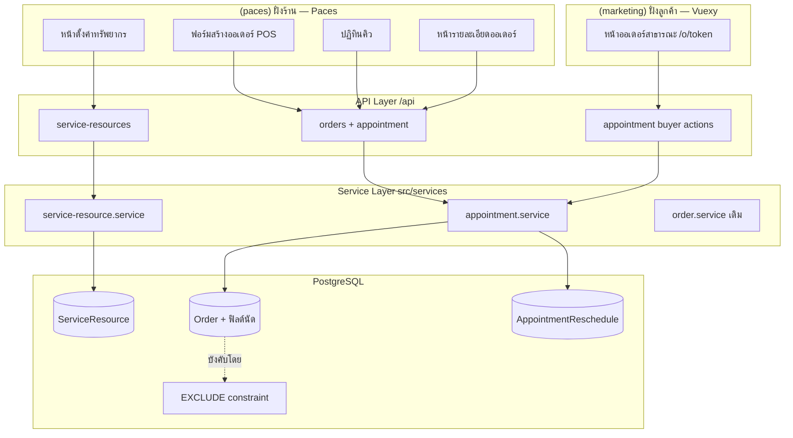

> **โมดูล:** M00024-ServiceAppointmentBooking
> **ประเภทเอกสาร:** Software Requirements Specification (SRS) - TECHNICAL
> **เวอร์ชัน:** 1.0
> **วันที่จัดทำ:** 2026-07-30
> **สถานะ:** Draft
> **เจ้าของเอกสาร:** safepay-planner (ดู [[Feature-Docs-Ownership]])

# SRS: ระบบนัดหมายวันเข้าใช้บริการ

---

## 1. บทนำ (Introduction)

### 1.1 วัตถุประสงค์

เอกสารนี้แปลง Functional Requirements ใน [[BRD]] เป็นข้อกำหนดเชิงเทคนิคที่ developer นำไป implement ได้โดยตรง ครอบคลุมสถาปัตยกรรม, TFR, interface, ข้อมูล, NFR และความเสี่ยงเชิงสถาปัตยกรรม

### 1.2 ขอบเขต

| อยู่ในขอบเขต | นอกขอบเขต |
|-------------|-----------|
| ตาราง `ServiceResource`, `AppointmentReschedule`, ฟิลด์นัดบน `Order` | หน้าจองสาธารณะที่ลูกค้าเลือกวันเอง (B2) |
| API จัดการทรัพยากร + นัด (ฝั่งร้าน) | ระบบเวลาทำการ/วันหยุดร้าน |
| API ยืนยัน/ขอเลื่อนนัด (ฝั่งลูกค้า) | นัดซ้ำเป็นรอบ (recurring) |
| ปฏิทินคิวฝั่งร้าน + ส่วนแสดงนัดบน `/o/{token}` | การแก้ไข flow ยืนยันตัวตนของ feature 00015 |
| กลไกกันจองเกินความจุระดับฐานข้อมูล | ความจุที่แปรตามวัน/ช่วงเวลา |

### 1.3 เอกสารอ้างอิง

| เอกสาร | ใช้ทำอะไร |
|--------|----------|
| [[PRD]] / [[BRD]] | ที่มาของทุก TFR ในเอกสารนี้ |
| [[DATABASE]] | schema, EXCLUDE constraint, ผล spike |
| `docs/20 - Features/00017 - Lodging Vertical/` | precedent ของ "การจอง = ออเดอร์" + EXCLUDE + การดัก error |
| `docs/20 - Features/00015 - Order Claim & Forced Login/` | กติกาการเข้าถึง `/o/{token}` ที่ต้องใช้ตามที่เป็น |
| `docs/conventions/date-format.md` | บังคับใช้ `formatDate*` จาก `src/lib/format-date.ts` |
| `docs/conventions/paces-toast.md` | toast ใน `(paces)/**` ต้องใช้ `pacesToast` |

---

## 2. ภาพรวมสถาปัตยกรรม (Architecture Overview)

### 2.1 ตำแหน่งในระบบ

### 2.2 หลักการออกแบบที่ยึด

| หลักการ | เหตุผล |
|---------|--------|
| **การนัด = ออเดอร์ ไม่ใช่ตารางแยก** | ได้ token/รีวิว/Trust Score/ลูกค้ากลาง มาใช้ซ้ำ — precedent 00017 |
| **ความถูกต้องอยู่ที่ฐานข้อมูล** | การตรวจในแอปมีช่องว่างเสมอ (BR-RSV-18.1) |
| **`serviceSeat` เป็นกลไกภายในล้วน** | ผู้ใช้ไม่ควรรู้จักแนวคิด "ที่นั่ง" — เป็นรายละเอียดการ implement ของความจุ |
| **สถานะนัดแยกจากสถานะออเดอร์** | ไม่กระทบ lifecycle/รีวิว/Trust Score เดิม (BR-RSV-33/36) |
| **ไม่แตะ feature 00015** | reuse การเข้าถึง `/o/{token}` ตามที่เป็น ไม่เพิ่มเส้นทางใหม่ |

### 2.3 การแบ่งชั้น

- **API layer** (`src/app/api/**`) — auth, validate ด้วย Valibot, แปลง error เป็น HTTP status, ไม่มี business logic
- **Service layer** (`src/services/**`) — business rule ทั้งหมด, ownership check ใน WHERE, การวนลองที่นั่ง, การเขียนประวัติ
- **UI** — ฝั่งร้านเป็น Paces (`(paces)/**`), ฝั่งลูกค้าเป็น Vuexy (`(marketing)/**`)

---

## 3. ข้อกำหนดเชิงฟังก์ชันเชิงเทคนิค (TFR)

### TFR-001 — ตัวกั้นการเข้าถึงฟีเจอร์ (Feature Gate)

**มาจาก:** BR-RSV-01, BR-RSV-02

- ต้องมีฟังก์ชันกลางตัวเดียว เช่น `canUseAppointments(shop)` คืนค่าจริงเมื่อ `shop.kind === 'BUSINESS' && shop.vertical === 'GENERAL'`
- **ต้องเรียกใช้ทั้ง 3 ชั้น** ไม่ใช่ชั้นใดชั้นหนึ่ง:
  1. เมนู/การแสดงผล (ซ่อนเมนูปฏิทินคิวและส่วนวันนัด)
  2. หน้า (redirect ออกถ้าเข้ามาตรงด้วย URL)
  3. API ทุกเส้น (คืน 403)
- ห้ามอนุมานจาก `vertical` อย่างเดียว — ร้าน `PERSONAL` ที่เป็น `GENERAL` ต้องถูกปฏิเสธ

### TFR-002 — การจัดสรรที่นั่ง (Seat Allocation)

**มาจาก:** BR-RSV-06, BR-RSV-16, BR-RSV-18.1

- service ต้องวนลอง `seat = 1..resource.capacity` ตามลำดับ พยายาม insert/update ทีละที่นั่ง
- **แต่ละครั้งต้องครอบด้วย `SAVEPOINT`** — เพราะ EXCLUDE ที่ยิงจะ poison ทั้ง transaction (`25P02`) ทำให้ทำคำสั่งต่อไม่ได้ (ยืนยันแล้วทั้งใน spike ของ 00017 และ 00024)
- ที่นั่งแรกที่สำเร็จคือที่นั่งที่ได้ — ครบทุกที่นั่งแล้วยังไม่สำเร็จ = เต็ม
- **ห้าม** implement ด้วยการ `count()` จำนวนนัดที่ทับกันแล้วเทียบกับ `capacity` ก่อน insert เป็นกลไกตัดสิน (อนุญาตให้ทำเพื่อแสดงผลเท่านั้น)
- ห้ามลองที่นั่งเกิน `capacity` เด็ดขาด — เพดานความจุบังคับที่จุดนี้จุดเดียว

### TFR-003 — การตรวจ input ของช่วงเวลา

**มาจาก:** BR-RSV-13, BR-RSV-14, BR-RSV-15, BR-RSV-40

- Valibot schema ต้องบังคับ: `serviceEnd > serviceStart`
- รับค่าเป็น ISO-8601 ที่มี offset เสมอ — ห้ามรับสตริงเวลาที่ไม่มีเขตเวลา
- เก็บลงฐานข้อมูลเป็น `timestamptz` (ยืนยันจาก spike Q7 ว่าเทียบข้ามเขตเวลาถูกต้อง)
- นัดย้อนหลังอนุญาต แต่ API ต้องคืน flag ให้ UI เตือนก่อนบันทึก (ไม่ปฏิเสธ)

### TFR-004 — การแปลง error ของ EXCLUDE constraint

**มาจาก:** BR-RSV-19, บทเรียน `feedback_service_error_route_mapping`

- Prisma โยน `PrismaClientKnownRequestError` **code `P2010`** พร้อม `meta.code === '23P01'` — **ไม่ใช่ P2002**
- ต้องมี helper กลางที่ตรวจได้ทั้งสองรูป (`meta.code` และการค้นสตริง `23P01`/`exclusion` ในข้อความ) เพราะรูปร่าง error ต่างกันได้ตามเวอร์ชัน Prisma/เส้นทางที่เรียก (บทเรียน `feedback_spike_must_match_production_path`)
- service ต้องโยน error ชนิดของตัวเอง เช่น `AppointmentSlotFullError` ที่ route catch แล้ว map เป็น **409**
- 🛑 **ห้ามส่งข้อความดิบจาก Postgres ออกไปยัง client** — มีชื่อ constraint และเลขที่นั่งซึ่งเป็นกลไกภายใน
- ข้อความที่ผู้ใช้เห็นต้องเป็นระดับธุรกิจ: ช่วงเวลาที่เต็ม + จำนวนที่จองแล้ว/ความจุ

### TFR-005 — การคำนวณที่ว่างเพื่อแสดงผล

**มาจาก:** FR-RSV-03, FR-RSV-04

- endpoint คืน "จำนวนที่จองแล้วต่อช่วงเวลา" ของทรัพยากรหนึ่งหน่วยในช่วงวันที่ขอ
- query นับเฉพาะออเดอร์ที่ `serviceResourceId = X AND status <> 'CANCELLED'` และช่วงเวลาทับกับหน้าต่างที่ขอ
- ผลลัพธ์นี้ใช้เพื่อ **แสดงผลเท่านั้น** — ไม่ใช่กลไกตัดสิน (TFR-002 เป็นตัวตัดสิน)
- ต้องมี `force-dynamic` + `Cache-Control: private, no-store` เพราะเป็นข้อมูลต่อร้าน (บทเรียน `feedback_auth_api_cache_control`)

### TFR-006 — สถานะนัดและการเปลี่ยนสถานะ

**มาจาก:** §3.4 PRD, BR-RSV-31, BR-RSV-33, BR-RSV-34

- ค่าที่อนุญาต: `SCHEDULED` | `CONFIRMED_BY_BUYER` | `RESCHEDULE_REQUESTED` | `COMPLETED` | `NO_SHOW`
- การเปลี่ยนสถานะต้องผ่าน service เดียว ที่ตรวจ transition ตาม state diagram ใน [[BRD]] §4.4
- `COMPLETED` / `NO_SHOW` ตั้งได้เมื่อ `now() >= serviceStart` เท่านั้น
- เลื่อน/ขอเลื่อนนัดที่ `COMPLETED`/`NO_SHOW` หรือเลย `serviceEnd` ไปแล้ว = ปฏิเสธ 409
- **ห้ามแตะ `Order.status` ในทุก path ของ TFR นี้**

### TFR-007 — การเลื่อนนัดและประวัติ

**มาจาก:** BR-RSV-28, BR-RSV-29, BR-RSV-30

- การเลื่อนคือการหาที่นั่งใหม่ตาม TFR-002 บนช่วงเวลา/ทรัพยากรใหม่
- ต้องทำใน transaction เดียว: เขียนแถว `AppointmentReschedule` (snapshot ค่าเดิม) + update ฟิลด์นัดบน `Order`
- เมื่อ update สำเร็จ ที่ว่างเดิมคืนอัตโนมัติเพราะแถวเดิมถูกเขียนทับ ไม่ต้องทำอะไรเพิ่ม
- ห้าม update ฟิลด์นัดโดยไม่เขียนประวัติ

### TFR-008 — สิทธิ์และ ownership

**มาจาก:** BR-RSV-21, BR-RSV-22, BR-RSV-25, บทเรียน `feedback_rsc_dal_authz`

- ทุก query ฝั่งร้านต้อง **scope `shopId` ใน `WHERE`** ไม่ใช่ findUnique แล้วค่อยเช็ค (จะ leak เข้า flight payload)
- ทุก action ฝั่งลูกค้าต้องยืนยันว่า `order.buyerUserId === session.user.id`
- สิทธิ์จัดการนัด = สิทธิ์จัดการออเดอร์ที่มีอยู่ ไม่สร้างระดับสิทธิ์ใหม่

### TFR-009 — การเข้าถึงหน้าออเดอร์สาธารณะ

**มาจาก:** BR-RSV-20

- **ห้ามแก้ไข** logic การเข้าถึงของ feature 00015 แม้แต่บรรทัดเดียว
- ส่วนแสดงนัดต้อง render **หลัง** ผ่านด่านเดิมแล้วเท่านั้น
- ออเดอร์ที่ไม่มีนัดต้องไม่มี DOM/ข้อมูลนัดใด ๆ หลุดเข้าไปในหน้า

### TFR-010 — การป้องกัน PII รั่วผ่าน RSC

**มาจาก:** บทเรียน `feedback_rsc_pii_neutralize_at_source`

- หน้าปฏิทินคิวฝั่งร้านอยู่ใต้ client layout → ทุก field ที่ส่งเข้า component จะถูก serialize เข้า flight payload
- ต้อง mask/ตัดข้อมูลลูกค้าที่ไม่จำเป็น (เบอร์เต็ม, อีเมล) **ที่ server boundary** ไม่ใช่ตอนแสดงผล
- ปฏิทินต้องการแค่ชื่อย่อลูกค้า + เลขออเดอร์ ไม่ต้องการเบอร์

### TFR-011 — การแจ้งเตือน

**มาจาก:** BR-RSV-37, BR-RSV-38, BR-RSV-39

- ใช้ระบบแชทภายใน (feature 00011/00018) เป็นช่องทางเดียว
- 🛑 **ห้ามเรียก `sendSms` จากทุก path ของฟีเจอร์นี้** — มีต้นทุน ฿1/ครั้งหักจาก `SellerWallet`
- การแจ้งเตือนล้มเหลวต้องไม่ทำให้การบันทึกนัดล้มเหลว (แยก failure domain)

### TFR-012 — การแสดงวันเวลา

**มาจาก:** BR-RSV-41, `docs/conventions/date-format.md`

- ฝั่งร้าน (`(paces)/**`) ใช้ `formatDate`/`formatDateTime`
- ฝั่งลูกค้า (`(marketing)/**`) ใช้ `formatDateTH`/`formatDateTimeTH`/`formatTimeHM`
- 🛑 ห้ามเรียก `toLocaleDateString`/`Intl.DateTimeFormat` เองที่ไหนก็ตาม

### TFR-013 — "เต็ม" มีความหมายเฉพาะโหมดรายวัน (เพิ่ม 2026-08-08)

**มาจาก:** FR-RSV-13, BR-RSV-18/18.1, `AppointmentDateSheet.tsx` (SDS §3.7)

- โหมด `DAY` (`Shop.appointmentGranularity==='DAY'`): "เต็ม" นับจาก **จำนวนนัดทั้งวัน** เทียบ `capacity` — ใช้ย้อมวันในปฏิทินและปิดปุ่มยืนยันของวันนั้น
- โหมด `TIME`: 🛑 **ห้ามใช้เกณฑ์เดียวกัน** — ความจุของโหมดนี้วัดกันที่ "ช่วงเวลาที่ทับกัน" ไม่ใช่จำนวนนัดทั้งวัน (วันที่มีนัดสั้นกระจายทั้งวันสิบรายการยังว่างช่วงอื่นอยู่เต็มไปหมด) ต้องนับเฉพาะช่วงที่ทับกับช่วงเวลาที่กำลังกรอกอยู่
- legend/เครื่องหมาย "เต็ม" ที่แสดงบนปฏิทิน render เฉพาะโหมด `DAY` เท่านั้น — โหมด `TIME` ไม่มีเครื่องหมายนี้ในปฏิทิน (ตัวนับอยู่ที่บรรทัดใต้ช่องเวลาแทน)
- ตัวเลขทั้งหมดนี้ยังเป็น **แสดงผลเท่านั้น** — ไม่เปลี่ยนตัวตัดสินจริงจาก TFR-002 (EXCLUDE constraint)

### TFR-014 — แกนสถานะนัดในห้องแชทของร้าน `SERVICE_QUEUE` (เพิ่ม 2026-08-08)

**มาจาก:** BR-RSV-04, `src/lib/chat-service-progress.ts` (SDS §3.10) — ownership ของพื้นผิวที่ใช้จริงอยู่ที่ feature 00018/00036

- ห้องแชทของร้าน `Shop.vertical==='SERVICE_QUEUE'` ต้องไล่แกน "นัดถึงขั้นไหน" แทนแกนขนส่ง ("ของอยู่ไหน") ที่ร้านอื่นใช้ — implement ผ่าน `serviceProgressStage()`/`filterActiveServiceOrders()`
- walk-in (ออเดอร์ที่ไม่มี `serviceStart`) ที่ยัง `status !== 'CONFIRMED'/'CANCELLED'` ต้องอยู่ในกอง `PENDING` เสมอ — 🛑 **ห้ามตกหายจากรายการงานค้าง** (BR-RSV-04: walk-in เดินเส้นทางออเดอร์ปกติทุกอย่าง)
- `COMPLETED`/`NO_SHOW`/`CANCELLED` ต้องหลุดออกจากรายการงานค้างทันที ไม่มีช่วง "ค้างแสดง" แบบที่แกนขนส่งมี (`DELIVERED_VISIBLE_MS` ไม่ใช้กับแกนนี้)
- ป้าย/สี/ไอคอนต้องมาจาก `APPOINTMENT_STATUS_LABEL`/`APPOINTMENT_STAGE_META`/`ORDER_STATUS_META` ที่มีอยู่แล้วเท่านั้น — ห้ามตั้งคำ/สีใหม่ (BR-SOV-03)
- 🛑 ฟิลด์ที่ป้อนแกนนี้ (`serviceStart`/`serviceEnd`/`appointmentStatus`/`depositAmount`) ต้องถูก select **ตรงกันทุกจุด** ที่คืนออเดอร์ของเธรดเข้าห้องแชท (ดู §5 ด้านล่าง + API.md §4.11) — ไม่ sync แล้วออเดอร์ที่โหลดทีหลัง (lazy-load) จะกลายเป็น walk-in เงียบ ๆ

### TFR-015 — มัดจำในห้องแชทแสดงได้แค่ยอด ไม่ใช่สถานะจ่าย (เพิ่ม 2026-08-08)

**มาจาก:** BR-RSV-49, BR-RSV-50

- ทุก surface ที่แสดงมัดจำของนัด (รวมแถบสถานะในห้องแชท) ต้องเขียนว่า **"มัดจำที่ตกลงไว้ ฿X"** ไม่ใช่ "มัดจำ ฿X" เฉย ๆ ซึ่งอ่านกำกวมได้ทั้ง "เก็บแล้ว"/"ต้องเก็บ"
- 🛑 **ห้ามใช้สีเขียว (success) และห้ามทำเป็นขั้นของ timeline** — ระบบไม่มีคอลัมน์บอกว่ามัดจำถูกจ่ายแล้วหรือยัง (ไม่มี `depositReceivedAt`) การทำเป็นขั้นที่ติ๊กถูกได้จะเป็นป้ายที่อ้างสิ่งที่ระบบไม่รู้จริง

### TFR-016 — แยกเลือกวัน/เลือกเวลาเป็น 2 ขั้นบนมือถือ + ปุ่มช่วงเวลาสำเร็จรูป (เพิ่ม 2026-08-09)

**มาจาก:** BR-RSV-15, BR-RSV-18, `AppointmentDateSheet.tsx` (SDS §3.7.1) — user report 2026-08-09

- **มีผลเฉพาะ** กล่องแคบของชีต (container query ไม่ถึง `@5xl`) **และ** `granularity==='TIME'` — โหมด `DAY` ไม่มีขั้นที่ 2 (ปุ่มยืนยันโผล่ตั้งแต่จิ้มวันเหมือนเดิมทุกประการ) กล่องกว้าง (`@5xl`) ไม่แยกขั้นเช่นกัน (เห็นปฏิทิน+รายการ/ช่องเวลาพร้อมกันคนละคอลัมน์อยู่แล้ว)
- ขั้นที่ 1 (เลือกวัน) → ปุ่ม "เลือกเวลาของ {วันที่}" → ขั้นที่ 2 (เลือกเวลา) → ปุ่ม "ยืนยัน …" — จิ้มวัน/เลือกเวลาในทั้ง 2 ขั้นยังเป็น **preview เท่านั้น** ค่าจริงในฟอร์มเปลี่ยนตอนกด "ยืนยัน" ท้ายชีตเท่านั้น (ไม่เปลี่ยนพฤติกรรมเดิมจาก 2026-08-07)
- 🛑 **ปุ่มช่วงเวลาสำเร็จรูปคงที่ 08:00–20:00 ทุก 1 ชม. (12 ปุ่ม)** — user เคาะให้ใช้ค่านี้ไปก่อน **ไม่มีคอลัมน์ "เวลาทำการ" ใน DB** (ไม่มี migration) ช่องเวลาเดิม (`<input type="time">`) ยังอยู่ครบเป็นทางเลือกสำรอง ไม่ใช่ถูกแทนที่
- 🛑 **ปุ่มช่วงเวลาที่ชนคิวเดิมห้าม `disable`** — ยึด BR-RSV-18 (การตรวจฝั่ง client เป็น UX เท่านั้น ไม่ใช่กลไกความถูกต้อง เพราะข้อมูลอาจ stale ระหว่างชีตเปิดค้าง) ติดจุดเตือนแทน ตัวตัดสินจริงยังเป็น EXCLUDE constraint ตอน `POST /api/orders` (TFR-002) เหมือนเดิม
- เวลาที่ผ่านไปแล้วของวันนี้มัวลงแต่ยังกดได้ (BR-RSV-15 อนุญาตนัดย้อนหลัง)
- `RescheduleAppointmentSheet.tsx` (feature 00036) ไม่ต้องแก้โค้ด — ได้ผล 2 ขั้นนี้อัตโนมัติเพราะเรียก component เดียวกัน

---

## 4. ข้อกำหนดส่วนต่อประสาน (Interface Specification)

รายละเอียดเต็มดู [[API]] — สรุปที่นี่:

พาธยึด convention ที่มีอยู่จริงใน repo — ทรัพยากรระดับร้านใช้ `/api/shops/current/*` (precedent `rooms`/`housekeepers` ของ 00017) และ action ต่อออเดอร์ใช้ `/api/orders/[token]/*` (precedent `confirm`/`ship`/`cancel`) โดย `token` = `Order.publicToken`

| กลุ่ม | Endpoint | ผู้ใช้ |
|------|----------|-------|
| ทรัพยากร | `GET/POST /api/shops/current/service-resources` | ร้าน |
| ทรัพยากร | `PATCH/DELETE /api/shops/current/service-resources/[id]` | ร้าน |
| ที่ว่าง | `GET /api/shops/current/service-resources/availability` | ร้าน |
| ปฏิทิน | `GET /api/shops/current/appointments` | ร้าน |
| นัด (ร้าน) | `PATCH /api/orders/[token]/appointment` | ร้าน |
| นัด (ร้าน) | `POST /api/orders/[token]/appointment/outcome` | ร้าน |
| นัด (ลูกค้า) | `POST /api/orders/[token]/appointment/confirm` | ลูกค้า |
| นัด (ลูกค้า) | `POST /api/orders/[token]/appointment/reschedule-request` | ลูกค้า |

การสร้างนัดพร้อมออเดอร์ใช้ **endpoint สร้างออเดอร์เดิม** โดยเพิ่มฟิลด์นัดใน payload (ไม่สร้าง endpoint ใหม่)

🛑 **ตั้งแต่ 2026-08-08 ไม่มี UI ไหนเรียก `GET .../service-resources/availability` แล้ว** — `AppointmentDateSheet.tsx` (ปฏิทินเลือกวัน+เวลาในฟอร์มสร้างออเดอร์และในหน้าเลื่อนนัด) เปลี่ยนไปเรียก `GET /api/shops/current/appointments` แทน เพราะต้องใช้ชื่อลูกค้า/เลขออเดอร์/สถานะนัดประกอบรายการของวันนั้นด้วย ไม่ใช่แค่ตัวเลขจำนวน — endpoint เดิมยังอยู่ในระบบ ไม่ได้ถูกลบ (ดู SDS §3.7, API.md §4.4)

🛑 **ฟิลด์นัด 4 ตัว (`serviceStart`/`serviceEnd`/`appointmentStatus`/`depositAmount`) ไหลออกไปนอกขอบเขตเดิมของฟีเจอร์นี้แล้ว** ตั้งแต่ 2026-08-08 — ถูก select เพิ่มใน `getOrdersByCustomer()` (`src/services/order.service.ts`, feature 00018) เพื่อป้อนแกนสถานะนัดในห้องแชท (`chat-service-progress.ts`, ดู TFR-014) ดู API.md §4.11

---

## 5. ข้อกำหนดด้านข้อมูล (Data Requirements)

ดู [[DATABASE]] ฉบับเต็ม — สรุปสิ่งที่ developer ต้องรู้:

| ประเด็น | ข้อกำหนด |
|---------|----------|
| ตารางใหม่ | `ServiceResource`, `AppointmentReschedule` |
| ฟิลด์ใหม่บน `Order` | 7 ฟิลด์ nullable ทั้งหมด |
| ชนิดเวลา | `@db.Timestamptz(3)` — ไม่ใช่ `@db.Date` แบบบ้านพัก |
| constraint หลัก | `Order_service_seat_no_overlap` (EXCLUDE, unmanaged SQL) |
| migration | เขียนมือ + `migrate deploy` เท่านั้น — **ห้าม `migrate dev`/`db pull`** |
| หลัง migrate | ต้อง restart dev server |
| consumer ข้ามฟีเจอร์ (เพิ่ม 2026-08-08) | `serviceStart`/`serviceEnd`/`appointmentStatus`/`depositAmount` ถูก select โดย `getOrdersByCustomer()` (feature 00018) นอกเหนือจาก service ของฟีเจอร์นี้เอง — เปลี่ยนชื่อ/นำฟิลด์เหล่านี้ออกต้องไล่ดู consumer นี้ด้วย ไม่ใช่แค่ `appointment.service.ts` |

---

## 6. ข้อกำหนดที่ไม่ใช่ฟังก์ชัน (NFR)

| NFR | ข้อกำหนด | วิธีวัด |
|-----|----------|--------|
| **NFR-1 ความถูกต้องภายใต้การแข่งขัน** | จำนวนนัดที่ทับกันต้องไม่เกินความจุ แม้ยิงพร้อมกัน | ทดสอบยิงพร้อมกัน N > capacity แล้วนับผลสำเร็จ |
| **NFR-2 ความเร็วของการดูที่ว่าง** | endpoint availability ตอบภายในเวลาที่ไม่ขัดจังหวะการคีย์งาน | index `("serviceResourceId","serviceStart")` รองรับ |
| **NFR-3 ปฏิทินบนมือถือ** | หน้าปฏิทินรายสัปดาห์ใช้งานได้ลื่นบนเครือข่ายมือถือ | ดึงเฉพาะช่วงที่แสดง ไม่ดึงทั้งเดือน |
| **NFR-4 zero-regression** | ออเดอร์ที่ไม่ใช่การนัดทำงานเหมือนเดิม 100% | ชุดทดสอบออเดอร์เดิมผ่านครบ + spike Q5 |
| **NFR-5 ไม่มีต้นทุนแฝง** | ไม่มี SMS ถูกส่งอัตโนมัติ | `rg "sendSms"` ในโค้ดของฟีเจอร์นี้ = 0 |
| **NFR-6 ไม่รั่ว PII** | flight payload ของปฏิทินไม่มีเบอร์/อีเมลลูกค้าเต็ม | ตรวจ payload จริงในเบราว์เซอร์ |

---

## 7. ข้อจำกัดทางเทคนิคและการพึ่งพา

### 7.1 ข้อจำกัด

| ข้อจำกัด | ผลต่อการ implement |
|---------|-------------------|
| Prisma ประกาศ EXCLUDE ไม่ได้ | ต้องเป็น unmanaged SQL + คำเตือนใน `schema.prisma` |
| `db pull`/`migrate dev` ทำลาย constraint | ห้ามใช้เด็ดขาด — DB dev = prod |
| EXCLUDE poison ทั้ง transaction | การวนลองที่นั่งต้องใช้ `SAVEPOINT` เท่านั้น |
| ความจุเป็นค่าคงที่ | ไม่มีตารางเวลาทำการใน phase นี้ |
| ที่นั่งอาจเป็นรูหลังยกเลิก | การลดความจุใช้เกณฑ์เข้มกว่า BRD เล็กน้อย (ดู [[DATABASE]] §4.4) |

### 7.2 การพึ่งพา

| ระบบ | ใช้ทำอะไร | ความเสี่ยงถ้าเปลี่ยน |
|------|----------|---------------------|
| feature 00015 | การเข้าถึง `/o/{token}` | ถ้ามีการแก้ flow นั้น ต้องทดสอบโหมด B ซ้ำ |
| feature 00017 | precedent EXCLUDE + `btree_gist` ที่ติดตั้งแล้ว | ถ้ามีใครถอด extension ฟีเจอร์นี้พังทันที |
| feature 00014 | `Order.customerId` สำหรับประวัติลูกค้า | ต่ำ |
| feature 00008/00012 | `Shop.kind`, สิทธิ์พนักงาน | ถ้านิยาม `kind` เปลี่ยน ต้องแก้ตัวกั้น |
| feature 00011/00018 | ช่องทางแจ้งเตือน | ถ้าแชทล่ม การนัดต้องยังทำงานได้ |

---

## 8. ความเสี่ยงเชิงสถาปัตยกรรม

| ความเสี่ยง | ผลกระทบ | การรับมือ |
|-----------|---------|----------|
| **developer implement ความจุด้วยการ count** | จองทะลุความจุเงียบ ๆ ตอนกดพร้อมกัน | TFR-002 ระบุห้ามชัด + reviewer ต้อง grep หา `count` ใกล้จุดสร้างนัด + test ยิงพร้อมกัน |
| **ลืม `SAVEPOINT` ตอนวนที่นั่ง** | ที่นั่งแรกชนแล้วทั้ง transaction ตาย → ผู้ใช้เห็น error แปลก ๆ ทั้งที่ยังมีที่ว่าง | ยืนยันด้วยเทสที่ทำให้ที่นั่ง 1 เต็มแล้วต้องได้ที่นั่ง 2 |
| **`db pull` ลบ constraint** | จองทับได้เงียบ ๆ ทั้งฟีเจอร์นี้และ 00008/00017 | คำเตือนใน `schema.prisma` + memory + reviewer gate |
| **ข้อความ error ดิบหลุดถึงผู้ใช้** | เปิดเผยกลไกภายใน (ที่นั่ง/ชื่อ constraint) | TFR-004 + reviewer ตรวจ response ของเคส 409 |
| **ตัวกั้นฟีเจอร์ครอบไม่ครบ** | ร้านที่ไม่มีสิทธิ์เรียก API ตรงได้ | TFR-001 บังคับ 3 ชั้น + test เรียก API ด้วยร้าน PERSONAL |
| **แก้ feature 00015 โดยไม่ตั้งใจ** | กระทบ flow ที่อยู่บน prod แล้ว | TFR-009 + reviewer ตรวจ diff ว่าไม่แตะไฟล์ของ 00015 |

---

## 9. Traceability Matrix

| FR (BRD) | TFR | ตาราง/Constraint | API |
|----------|-----|------------------|-----|
| FR-RSV-01 | TFR-001, TFR-003 | `ServiceResource` + CHECK | `POST/PATCH /api/shop/service-resources` |
| FR-RSV-02 | TFR-002, TFR-004 | EXCLUDE `Order_service_seat_no_overlap` | ทุก endpoint ที่เขียนนัด |
| FR-RSV-03 | TFR-002, TFR-003, TFR-005 | ฟิลด์นัดบน `Order` | endpoint สร้างออเดอร์เดิม |
| FR-RSV-04 | TFR-005, TFR-010, TFR-012 | index `("shopId","type","serviceStart")` | `GET /api/shop/appointments` |
| FR-RSV-05 | TFR-009, TFR-012 | — | หน้า `/o/{token}` |
| FR-RSV-06 | TFR-006, TFR-008 | `buyerConfirmedAt`, `appointmentStatus` | `POST /api/o/[token]/appointment/confirm` |
| FR-RSV-07 | TFR-006, TFR-008 | `rescheduleRequestNote` | `POST /api/o/[token]/appointment/reschedule-request` |
| FR-RSV-08 | TFR-002, TFR-007 | `AppointmentReschedule` | `PATCH /api/shop/orders/[id]/appointment` |
| FR-RSV-09 | TFR-006 | `appointmentStatus` | `POST .../appointment/outcome` |
| FR-RSV-10 | TFR-006 | `WHERE status <> 'CANCELLED'` ใน EXCLUDE | endpoint ยกเลิกออเดอร์เดิม |
| FR-RSV-11 | TFR-008, TFR-010 | `AppointmentReschedule` + `Order.customerId` | หน้ารายละเอียดลูกค้า (00014) |
| FR-RSV-13 (เพิ่มแถวนี้ 2026-08-08 — เดิมตกหล่นจาก matrix ทั้งที่มีใน BRD) | TFR-013 | `Shop.appointmentGranularity` | `PATCH /api/shops/current/appointment-settings` |
| — (cross-feature 00018/00036, เพิ่ม 2026-08-08) | TFR-014, TFR-015 | `serviceStart`/`serviceEnd`/`appointmentStatus`/`depositAmount` บน `Order` | `GET /api/chat/conversations/[id]/orders` (ดู API.md §4.11) |
| — (UX enhancement มือถือ ไม่มี FR ใหม่ใน BRD — เพิ่ม 2026-08-09) | TFR-016 | ไม่มี (client-only, ไม่มี migration) | ไม่มี endpoint ใหม่ — ยังยิง `POST /api/orders`/`PATCH .../appointment` เดิม |

---

## 10. สรุป

- ของใหม่เชิงเทคนิคมีจุดเดียวที่เสี่ยงจริง: **การจัดสรรที่นั่งเพื่อรองรับความจุ > 1** (TFR-002) ซึ่งพิสูจน์บนฐานข้อมูลจริงแล้ว 9/9
- ที่เหลือเป็นการต่อยอดของที่อยู่บน production แล้วทั้งสิ้น (00015 การเข้าถึง, 00017 โครงการจอง, 00014 ลูกค้ากลาง)
- จุดที่ reviewer ต้องจับให้ได้: การ implement ความจุด้วย `count`, การลืม `SAVEPOINT`, ตัวกั้นฟีเจอร์ที่ครอบไม่ครบ 3 ชั้น, และข้อความ error ดิบที่หลุดถึงผู้ใช้
