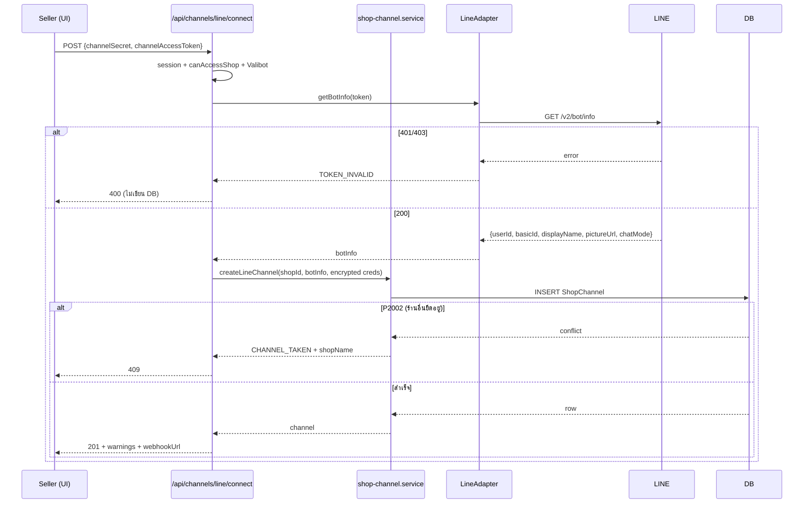

> **โมดูล:** M00025-LineOaChatIntegration
> **ประเภทเอกสาร:** API Contract
> **เวอร์ชัน:** 1.1
> **วันที่จัดทำ:** 2026-07-26
> **สถานะ:** Draft — รอ user review
> **เจ้าของเอกสาร:** safepay-planner (ดู [[Feature-Docs-Ownership]])

---

# API Contract: LINE OA Chat Integration

---

## 1. Overview

API ของ feature นี้แบ่งเป็น 3 กลุ่ม:

1. **Webhook (ขาเข้าจาก LINE)** — 1 endpoint ที่ทุกร้านใช้ร่วมกัน ยืนยันตัวตนด้วยลายเซ็น ไม่ใช้ session
2. **การจัดการช่องทาง (seller)** — เชื่อม / อัปเดต / อ่านโควตา / ถอด
3. **การส่งข้อความ (seller)** — ใช้ endpoint เดิมของ `00018` โดยขยายสัญญาให้รับ `parts[]`

**Base URL:** `https://deepthailand.app` (dev: `https://seller.deepth.local:4000`)
**Content-Type:** `application/json` ทุก endpoint (ยกเว้นที่ระบุเป็นอย่างอื่น)
**ภาษาใน error message:** ไทย (ผู้ใช้เห็นตรง ๆ) พร้อม `code` ภาษาอังกฤษสำหรับให้ client แยกกรณี

---

## 2. Authentication

| กลุ่ม | วิธียืนยันตัวตน | หมายเหตุ |
|-------|------------------|----------|
| **Webhook** | HMAC-SHA256 ของ raw body เทียบกับ header `x-line-signature` โดยใช้ Channel secret ของร้านนั้น (timing-safe) | ไม่มี session, ไม่มี Origin — ต้องอยู่ในรายการยกเว้น Origin-check ของ `src/proxy.ts` |
| **จัดการช่องทาง** | NextAuth session (subdomain `seller`) + ตรวจสิทธิ์ผ่าน `canAccessShop` | การเชื่อม/ถอดเป็นสิทธิ์ระดับเจ้าของร้าน |
| **ส่งข้อความ** | NextAuth session + `canAccessShop` | พนักงานที่มีสิทธิ์ตอบแชทได้ (feature 00012) |

**กฎที่บังคับทุก endpoint ในกลุ่ม 2 และ 3:**
- ต้อง scope `shopId` ใน WHERE ของทุก query (กัน IDOR) — ห้าม `findUnique` แล้วค่อยเช็คทีหลัง
- response ต้องไม่มี `accessTokenEnc`, `channelSecretEnc`, `replyToken` หรือค่าที่ถอดรหัสแล้วของสิ่งเหล่านี้ **ในทุกกรณี**
- ต้องตั้ง `cache-control: private, no-store` สำหรับ response ที่ผูกกับผู้ใช้ (บทเรียน `feedback_auth_api_cache_control`)

---

## 3. Endpoint List

| # | Method | Path | หน้าที่ | FR |
|---|--------|------|--------|-----|
| 1 | POST | `/api/channels/line/webhook` | รับ event จาก LINE | FR-LINE-02/03/13 |
| 2 | POST | `/api/channels/line/connect` | ตรวจ credential + สร้างช่องทาง | FR-LINE-01 |
| 3 | PATCH | `/api/channels/line/[channelId]` | อัปเดต credential / เปิด-ปิด AI | FR-LINE-01/08 |
| 4 | GET | `/api/channels/line/[channelId]/quota` | อ่านโควตาคงเหลือ | FR-LINE-06 |
| 5 | DELETE | `/api/channels/[id]` | ถอดช่องทาง (route เดิม ใช้ได้ทุก provider) | FR-LINE-12 |
| 6 | POST | `/api/chat/conversations/[id]/messages` | ส่งข้อความ (route เดิม — ขยาย `parts[]`) | FR-LINE-04/05/07 |
| 7 | GET | `/api/chat/conversations/[id]` | อ่านเธรด (route เดิม — เพิ่มฟิลด์สถานะ LINE) | FR-LINE-05/06 |

---

## 4. Endpoint Detail

### 4.1 `POST /api/channels/line/webhook`

รับ event จาก LINE Platform — **ต้องตอบ 2xx เสมอ** แม้ปฏิเสธ event เพื่อไม่ให้ LINE ยิงซ้ำไม่จบ

**Headers**

| Header | จำเป็น | คำอธิบาย |
|--------|--------|----------|
| `x-line-signature` | ✔ | ลายเซ็น base64 ของ HMAC-SHA256(raw body, channelSecret) |

**Request Body (จาก LINE)**

```json
{
  "destination": "U1234567890abcdef1234567890abcdef",
  "events": [
    {
      "type": "message",
      "webhookEventId": "01H8...",
      "deliveryContext": { "isRedelivery": false },
      "timestamp": 1785000000000,
      "source": { "type": "user", "userId": "U0987..." },
      "replyToken": "0f3779fba3b349968c5d07db31eab56f",
      "mode": "active",
      "message": { "id": "468789577898262530", "type": "text", "text": "สนใจรุ่นนี้ค่ะ" }
    }
  ]
}
```

**Response**

```json
{ "ok": true }
```

**พฤติกรรมที่บังคับ**

| กรณี | HTTP | ทำอะไร |
|------|------|--------|
| ลายเซ็นผ่าน | 200 | ตอบทันที แล้วประมวลผลใน `waitUntil` |
| ลายเซ็นไม่ผ่าน | 200 | ทิ้ง event, log warn, **ห้ามเขียน DB / ห้ามเรียก LINE** |
| ไม่พบช่องทาง ACTIVE ของ `destination` | 200 | ทิ้ง event, log warn |
| ไม่มี header `x-line-signature` | 200 | ทิ้ง event, log warn |
| body ไม่ใช่ JSON | 200 | ทิ้ง event, log warn |
| event จาก group/room | 200 | ข้ามเฉพาะ event นั้น (event อื่นใน batch เดียวกันยังประมวลผลปกติ) |
| ข้อความซ้ำ (redelivery) | 200 | ข้าม ไม่สร้างแถวใหม่ |

> **หมายเหตุการออกแบบ:** ที่ตอบ 200 แม้ลายเซ็นไม่ผ่าน เพราะการตอบ 4xx ให้ผู้โจมตีเท่ากับบอกว่า "channel นี้มีอยู่จริงแต่คุณเซ็นผิด" และทำให้ LINE ยิงซ้ำในกรณีที่เป็นปัญหาชั่วคราวฝั่งเรา การเฝ้าระวังทำผ่าน log ไม่ใช่ผ่าน status code

### 4.2 `POST /api/channels/line/connect`

**Request**

```json
{
  "channelSecret": "0123456789abcdef0123456789abcdef",
  "channelAccessToken": "eyJhbGciOi..."
}
```

| ฟิลด์ | ชนิด | จำเป็น | Validation (Valibot) |
|-------|------|--------|----------------------|
| `channelSecret` | string | ✔ | ความยาว 32, hex เท่านั้น |
| `channelAccessToken` | string | ✔ | ไม่ว่าง, ≤ 512 ตัวอักษร |

**Response 201**

```json
{
  "channel": {
    "id": "b2f1...",
    "provider": "LINE",
    "externalId": "U1234567890abcdef1234567890abcdef",
    "name": "ร้านตัวอย่าง",
    "basicId": "@example",
    "avatarUrl": "https://profile.line-scdn.net/...",
    "status": "ACTIVE"
  },
  "warnings": ["CHAT_MODE_NOT_BOT"],
  "webhookUrl": "https://deepthailand.app/api/channels/line/webhook"
}
```

**พฤติกรรมที่บังคับ**
- ต้องเรียก `GET /v2/bot/info` ก่อนเขียน DB — ถ้าไม่ผ่าน **ห้ามสร้างแถวใด ๆ**
- `externalId` ต้องมาจาก `userId` ที่ LINE ตอบ **ห้ามให้ client ส่งมาเอง**
- `warnings` เป็น array ของรหัสที่ไม่บล็อกการเชื่อม (เช่น `CHAT_MODE_NOT_BOT`) ให้ UI แสดงเป็นคำเตือน
- response **ห้ามสะท้อน** `channelSecret`/`channelAccessToken` กลับไม่ว่ารูปแบบใด

### 4.3 `PATCH /api/channels/line/[channelId]`

**Request** (ส่งเฉพาะฟิลด์ที่ต้องการแก้)

```json
{
  "channelSecret": "…",
  "channelAccessToken": "…"
}
```

**พฤติกรรมที่บังคับ**
- ถ้าส่ง credential มาด้วย ต้อง verify กับ LINE ใหม่ก่อนบันทึก และ `userId` ที่ได้ต้องตรงกับ `externalId` เดิม ไม่ตรง = `LINE_ACCOUNT_MISMATCH` (กันเผลอวาง key ของ OA อื่นทับ)
- verify สำเร็จ → ถ้าสถานะเดิมเป็น `TOKEN_INVALID` ให้กลับเป็น `ACTIVE`
- **ไม่มีสวิตช์ตอบอัตโนมัติที่นี่** — การเปิด-ปิดใช้ endpoint ของ `00023` ที่มีอยู่แล้ว (`/api/shops/auto-reply/*` และ `/api/chat/conversations/[id]/auto-reply`) เพื่อไม่ให้มีสวิตช์สองที่ที่ขัดกันเอง (BR-LINE-17)

**Response 200:** โครงเดียวกับ 4.2 (`channel` + `warnings`)

### 4.4 `GET /api/channels/line/[channelId]/quota`

**Response 200**

```json
{
  "type": "limited",
  "total": 300,
  "used": 52,
  "remaining": 248,
  "level": "OK",
  "fetchedAt": "2026-07-26T10:06:13.000Z",
  "stale": false
}
```

| ฟิลด์ | ความหมาย |
|-------|----------|
| `type` | `"limited"` = มีเพดาน, `"unlimited"` = ไม่จำกัด, `"unknown"` = อ่านไม่สำเร็จและไม่มีค่า cache เลย (ทั้งสองแบบหลังฟิลด์ตัวเลขเป็น `null`) |
| `remaining` | `total - used` (ไม่ต่ำกว่า 0) — **ค่าโดยประมาณ** ห้ามนำไปใช้เป็นตัวเลขทางการเงิน |
| `level` | `OK` / `LOW` (เหลือ ≤ 20% ของเพดาน) / `EXHAUSTED` (เหลือ 0) / `UNLIMITED` / `UNKNOWN` |
| `fetchedAt` | ISO 8601 (ค.ศ., UTC) — การแปลงเป็น พ.ศ./เวลาไทยเป็นหน้าที่ของหน้าจอผ่าน `formatDateTime` |
| `stale` | `true` เมื่ออ่านจาก LINE ไม่สำเร็จและกำลังใช้ค่า cache เดิม (หรือไม่มีค่าเลย) |

> **`level` เพิ่มเข้ามาตอน implement (S-9, additive)** — เกณฑ์ "เหลือน้อย ≤ 20%" (`QUOTA_LOW_RATIO`) ต้องมีนิยามเดียวทั้งระบบ (Hard Rule 16) ถ้าปล่อยให้หน้าจอคำนวณ `remaining / total` เอง จะมีเกณฑ์ที่สองเกิดขึ้นทันทีที่มี surface ที่สองมาแสดงโควตา

**พฤติกรรมที่บังคับ**
- ใช้ค่า cache ถ้าอายุ < 5 นาที ไม่ยิง LINE ซ้ำ
- อ่านจาก LINE ไม่สำเร็จ → คืน 200 พร้อม `stale: true` **ห้ามคืน 5xx** (การอ่านโควตาไม่ได้ ต้องไม่ทำให้หน้าอินบ็อกซ์พัง)
- ต้องตั้ง `cache-control: private, no-store`
- ownership: `WHERE { id, shopId: activeShopId, provider: 'LINE' }` — ไม่ใช่ของร้านที่กำลังใช้งาน = 404 (ไม่บอกว่ามีอยู่จริงไหม)

**ที่เก็บ cache (S-9)** — คอลัมน์บนแถว `ShopChannel` เดิม ไม่มีตารางใหม่ ไม่มี migration:

| สถานะ | `quotaFetchedAt` | `quotaValue` | ความหมาย |
|-------|------------------|--------------|----------|
| ยังไม่เคยอ่านสำเร็จ | `null` | — | `type: "unknown"` |
| อ่านสำเร็จ = ไม่จำกัด | มีค่า | `null` | `type: "unlimited"` |
| อ่านสำเร็จ = มีเพดาน | มีค่า | ตัวเลข | `type: "limited"` |

🛑 ต้องอ่าน **สองคอลัมน์คู่กันเสมอ** — `quotaValue = null` เพียงอย่างเดียวแยก "ไม่จำกัด" ออกจาก "ไม่รู้" ไม่ได้

### 4.5 `DELETE /api/channels/[id]` (route เดิม)

ไม่เปลี่ยนสัญญา — soft disconnect (`status = 'DISCONNECTED'`) ผ่าน `updateMany({ where: { id, shopId } })` เป็น ownership guard

**เพิ่มเฉพาะ response** สำหรับ provider `LINE`:

```json
{
  "ok": true,
  "postAction": {
    "code": "LINE_DISABLE_WEBHOOK_MANUALLY",
    "message": "ถอดการเชื่อมเรียบร้อย หากไม่ต้องการให้ LINE ส่งข้อมูลมาอีก กรุณาปิด Use webhook ใน LINE Developers Console ด้วยตัวเอง"
  }
}
```

เพราะ Deep ไม่มีสิทธิ์ไปปิด webhook ฝั่ง LINE ให้ (BR-LINE-23)

### 4.6 `POST /api/chat/conversations/[id]/messages` (route เดิม — ขยาย)

**Request (สัญญาใหม่)**

```json
{
  "parts": [
    { "type": "TEXT", "text": "มีสีดำครับ" },
    { "type": "TEXT", "text": "ส่งวันนี้ตัดรอบ 15:00" },
    { "type": "IMAGE", "fileId": "f_abc123" }
  ],
  "replyToMid": null
}
```

| ฟิลด์ | ชนิด | Validation |
|-------|------|-----------|
| `parts` | array | 1–5 ชิ้น |
| `parts[].type` | string | `TEXT` \| `IMAGE` \| `VIDEO` \| `AUDIO` \| `FILE` |
| `parts[].text` | string | จำเป็นเมื่อ `type=TEXT`; ≤ 5000 ตัวอักษร |
| `parts[].fileId` | string | จำเป็นเมื่อเป็นชนิดสื่อ |

> **ความเข้ากันได้ย้อนหลัง:** สัญญาเดิม (`{ text, imageFileId }`) ต้องยังใช้ได้ โดยแปลงเป็น `parts` ที่มี 1 ชิ้นภายใน — ห้าม break client ของ Messenger/IG ที่ใช้งานจริงอยู่

**Response 201**

```json
{
  "messages": [
    { "id": "m1", "type": "TEXT", "sendMethod": "REPLY", "deliveryStatus": "SENT" },
    { "id": "m2", "type": "TEXT", "sendMethod": "REPLY", "deliveryStatus": "SENT" },
    { "id": "m3", "type": "IMAGE", "sendMethod": "REPLY", "deliveryStatus": "SENT" }
  ],
  "sendBatchId": "8b1c…",
  "quota": { "remaining": 248, "consumed": 0 }
}
```

`quota.consumed` = จำนวนข้อความที่ถูกหักจริงจากการเรียกครั้งนี้ (`0` เมื่อส่งด้วย reply, `1` ต่อ 1 batch เมื่อส่งด้วย push) — ให้ UI แสดงต้นทุนของการกดส่งครั้งนั้นได้ตรงไปตรงมา

### 4.7 `GET /api/chat/conversations/[id]` (route เดิม — เพิ่มฟิลด์)

เพิ่มใน response สำหรับเธรดช่องทาง `LINE`:

```json
{
  "channelState": {
    "provider": "LINE",
    "freeWindow": { "open": true, "expiresAt": "2569-07-26T10:07:13.000Z" },
    "quota": { "remaining": 248, "stale": false },
    "contactBlocked": false,
    "capabilities": { "echo": false, "readReceipt": false, "backfill": false, "maxPartsPerRequest": 5 }
  }
}
```

`capabilities` ให้ UI ตัดสินใจแสดงผลโดยไม่ต้องรู้จักชื่อ provider (TD-008) — เช่น ซ่อนตัวชี้ "อ่านแล้ว" เมื่อ `readReceipt === false` แทนที่จะเขียนเงื่อนไขว่า "ถ้าเป็น LINE"

---

## 5. Error Code Table

| Code | HTTP | ข้อความที่ผู้ใช้เห็น (ไทย) | เกิดเมื่อ |
|------|------|---------------------------|-----------|
| `TOKEN_INVALID` | 400 | ไม่สามารถใช้ Channel access token นี้ได้ กรุณาตรวจสอบว่าคัดลอกครบถ้วน | LINE ตอบ 401/403 ตอน verify |
| `SECRET_FORMAT_INVALID` | 400 | รูปแบบ Channel secret ไม่ถูกต้อง (ต้องเป็นตัวอักษร 32 ตัว) | validate ก่อนยิง LINE |
| `LINE_ACCOUNT_MISMATCH` | 409 | key ที่วางเป็นของบัญชี LINE คนละบัญชีกับที่เชื่อมไว้ | PATCH ด้วย credential ของ OA อื่น |
| `CHANNEL_TAKEN` | 409 | บัญชี LINE นี้เชื่อมอยู่กับร้าน "{shopName}" แล้ว ต้องถอดจากร้านนั้นก่อน | ชน partial unique index |
| `CHANNEL_NOT_ACTIVE` | 409 | การเชื่อม LINE มีปัญหา กรุณาวาง Channel access token ใหม่ | ส่งข้อความขณะ `status != ACTIVE` |
| `CONTACT_BLOCKED` | 409 | ลูกค้าบล็อกบัญชีทางการของร้านแล้ว จึงส่งข้อความไม่ได้ | `isBlocked = true` |
| `QUOTA_EXCEEDED` | 409 | โควตาข้อความของเดือนนี้หมดแล้ว — รอเดือนถัดไป อัปเกรดแพ็กเกจ LINE หรือตอบจากแอป LINE OA (ไม่กินโควตา) | โควตาหมด (จาก cache หรือจาก LINE) |
| `PARTS_LIMIT_EXCEEDED` | 400 | ส่งได้ครั้งละไม่เกิน 5 รายการ | `parts.length > 5` |
| `FORBIDDEN` | 403 | คุณไม่มีสิทธิ์ตอบแชทของร้านนี้ | `canAccessShop` ไม่ผ่าน |
| `CONVERSATION_NOT_FOUND` | 404 | ไม่พบเธรดนี้ | id ผิดหรือคนละร้าน |
| `LINE_UNAVAILABLE` | 502 | ระบบ LINE ไม่ตอบสนองชั่วคราว กรุณาลองใหม่อีกครั้ง | 5xx/timeout จาก LINE |

**กฎการ map error ที่บังคับ:** service ที่โยน error ชนิดใหม่ **ต้องมี route catch ครอบเสมอ** — ไม่งั้นจะกลายเป็น 500 ที่ผู้ใช้อ่านไม่รู้เรื่อง (บทเรียน `feedback_service_error_route_mapping`: `OutOfStockError` ของ 00003 เคยหลุดเป็น 500 เพราะ route ไม่ได้อยู่ในรายการ S-id ที่แก้)

---

## 6. Sequence

### 6.1 การเชื่อมช่องทาง



### 6.2 การส่งข้อความ (ตัดสิน reply/push)

ดู [[SRS]] §4.4 — sequence เดียวกัน ไม่ทำซ้ำที่นี่

---

## 7. Traceability

| Endpoint | FR | TFR | Test Case |
|----------|-----|-----|-----------|
| `POST /api/channels/line/webhook` | FR-LINE-02/03/13 | TFR-LINE-02/03/04/09/11 | TC-03..TC-09, TC-20 |
| `POST /api/channels/line/connect` | FR-LINE-01 | TFR-LINE-01 | TC-01, TC-02, TC-21 |
| `PATCH /api/channels/line/[channelId]` | FR-LINE-01 | TFR-LINE-01 | TC-22, TC-23 |
| `GET /api/channels/line/[channelId]/quota` | FR-LINE-06 | TFR-LINE-07 | TC-13, TC-14 |
| `DELETE /api/channels/[id]` | FR-LINE-12 | TFR-LINE-01 | TC-24 |
| `POST /api/chat/conversations/[id]/messages` | FR-LINE-04/05/07/09 | TFR-LINE-05/06/08 | TC-10..TC-17 |
| `GET /api/chat/conversations/[id]` | FR-LINE-05/06 | TFR-LINE-05/07 | TC-18 |

---

## 8. สรุป (Summary)

สัญญา API ของ feature นี้เพิ่ม endpoint ใหม่เพียง 4 ตัว และขยาย 3 ตัวที่มีอยู่แล้ว จุดที่ต้องระวังที่สุดเมื่อ implement มี 3 เรื่อง

**หนึ่ง — webhook ตอบ 200 เสมอ** แม้ปฏิเสธ event เพราะ status code ไม่ใช่ช่องทางแจ้งความผิดปกติในกรณีนี้ การเฝ้าระวังอยู่ที่ log

**สอง — ไม่มี response ใดที่มีความลับของร้าน** ทั้ง token, secret และ `replyToken` — ข้อหลังสำคัญเป็นพิเศษเพราะใครถือมันส่งข้อความในนามร้านได้ทันที

**สาม — สัญญาเดิมของ Messenger/IG ต้องไม่พัง** การขยาย `messages` route ให้รับ `parts[]` ต้องรองรับรูปแบบเดิมต่อไปได้ เพราะ client ที่ใช้งานจริงอยู่ทุกวันยังส่งแบบเดิม
