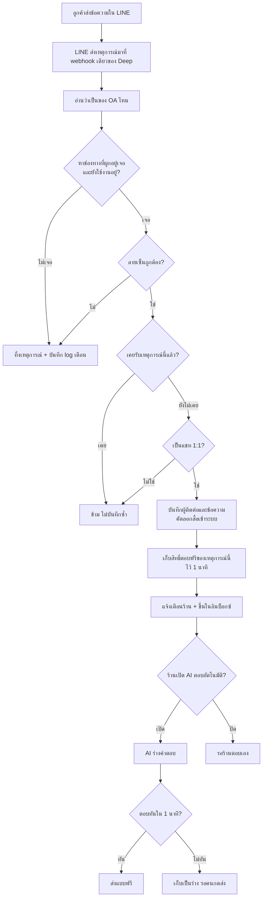
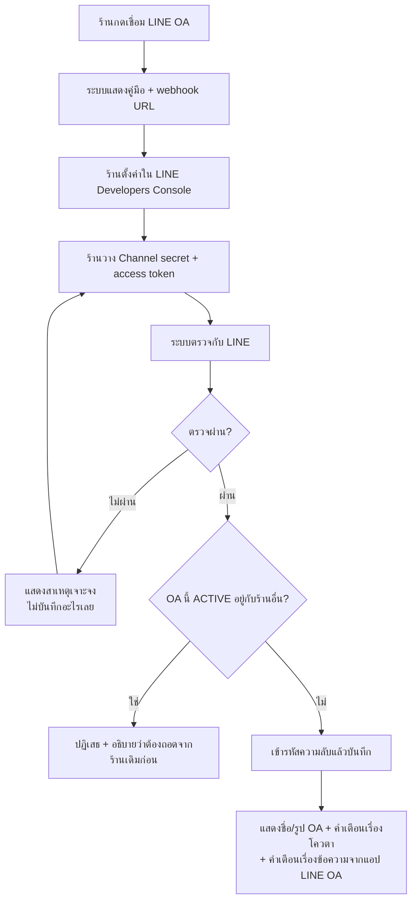
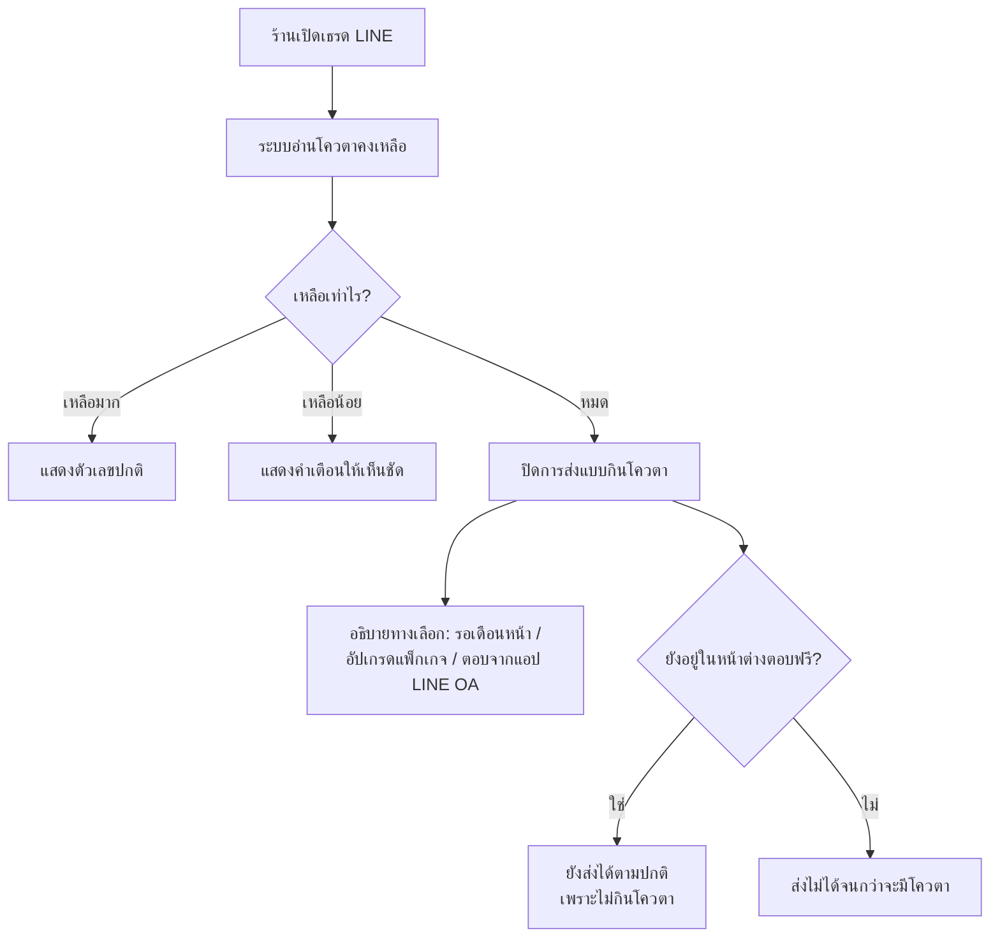

> **โมดูล:** M00025-LineOaChatIntegration
> **ประเภทเอกสาร:** Business Requirements Document (BRD) - NON-TECHNICAL
> **เวอร์ชัน:** 1.1
> **วันที่จัดทำ:** 2026-07-26
> **สถานะ:** Draft — รอ user review คู่กับ [[PRD]]
>
> 🔄 **v1.1 (2026-07-31) — sync กับของจริงบน main:** `00023 - Chat Auto-Reply` ขึ้นโค้ดบน production ไปแล้ว (6 service + 10 route + cron sweeper รายวัน + คอลัมน์ `Conversation.autoReply*` / `ChatMessage.autoReplyKind`) เอกสารรอบนี้จึงเปลี่ยน FR-LINE-08 จาก "AI ตอบเอง" เป็น **"เสียบ LINE เข้าเครื่องยนต์ auto-reply ของ 00023"** และตัดฟิลด์ที่ซ้ำกับของเดิมออก. เดิมจองเลข 00021 — renumber เป็น **00025**
> **เจ้าของเอกสาร:** BA (ดู [[Feature-Docs-Ownership]])

---

# BRD: เชื่อม LINE Official Account เข้าอินบ็อกซ์ Deep (Business Requirements Document)

---

## 1. บทนำ

### 1.1 วัตถุประสงค์ของเอกสาร

เอกสารนี้มีวัตถุประสงค์เพื่อ:
1. อธิบายความต้องการเชิงหน้าที่ของการเชื่อม LINE Official Account เข้ากับอินบ็อกซ์รวมของ Deep ในระดับที่ทดสอบได้
2. กำหนดขอบเขตการทำงานและข้อจำกัดที่มาจากตัวแพลตฟอร์ม LINE เอง โดยเฉพาะเรื่องหน้าต่างตอบ 1 นาทีและโควตาข้อความที่มีค่าใช้จ่าย
3. อธิบายกฎทางธุรกิจที่ระบบต้องบังคับ เพื่อไม่ให้ฟีเจอร์นี้สร้างค่าใช้จ่ายให้ร้านโดยร้านไม่รู้ตัว
4. สร้างความเข้าใจร่วมกันระหว่างทีมธุรกิจและทีมพัฒนา ก่อนเริ่มเขียนโค้ด

### 1.2 ขอบเขตของระบบ

**LINE OA Chat Integration** คือส่วนขยายของอินบ็อกซ์รวม (`/inbox`) ที่ทำให้ร้านรับ-ส่งข้อความ LINE ของลูกค้าได้จากหน้าเดียวกับ Deep Chat และ Messenger/Instagram โดยร้านเป็นผู้เชื่อม LINE OA ของตัวเองผ่านการวาง Channel secret และ Channel access token

**เข้าสู่ระบบ (Input):**
- Channel secret + Channel access token ที่ร้านวางจาก LINE Developers Console
- เหตุการณ์จาก LINE ที่ส่งเข้า webhook: ข้อความของลูกค้า, การเพิ่มเพื่อน, การบล็อก
- ข้อความและไฟล์ที่ร้าน (หรือ AI) พิมพ์ใน `/inbox`

**ออกจากระบบ (Output):**
- เธรดสนทนา LINE ใน `/inbox` พร้อม badge ช่องทาง ประวัติครบ และสื่อที่เก็บไว้ในระบบของ Deep เอง
- ข้อความที่ส่งถึงลูกค้าจริงในแอป LINE
- ตัวเลขโควตาคงเหลือและรายงานโควตาที่ประหยัดได้
- ออเดอร์และข้อมูลลูกค้าที่สร้างต่อจากเธรด

**ระบบที่เกี่ยวข้อง:**
- `00011 - Deep Chat` (โครงเธรด/ข้อความ), `00018 - Facebook Chat Integration` (โครงช่องทางภายนอกและหน้าอินบ็อกซ์), `00023 - Chat Auto-Reply` (เครื่องยนต์ตอบอัตโนมัติที่ LINE เสียบเข้าไป), `00019 - AI Reply Assistant` (AI ช่วยร่างให้คนกดส่ง), `00014 - Customer Directory` (ผูกลูกค้าด้วยเบอร์), `00012 - Shop Staff Invite` (สิทธิ์พนักงาน)

### 1.3 กลุ่มผู้ใช้งาน

| กลุ่มผู้ใช้ | บทบาท | สิทธิ์การใช้งาน |
|-----------|--------|----------------|
| **เจ้าของร้าน** | เชื่อม/ถอด LINE OA, ตอบแชท, เปิด-ปิด AI, ดูโควตา | เต็ม |
| **พนักงานร้าน** | ตอบแชท, สร้างออเดอร์จากเธรด, ดูโควตา | ตามสิทธิ์ที่เจ้าของร้านให้ (00012) — การเชื่อม/ถอดช่องทางเป็นสิทธิ์ระดับเจ้าของร้าน |
| **ลูกค้าใน LINE** | ทักหาร้านผ่าน LINE ตามปกติ | ไม่ต้องมีบัญชี Deep และไม่เห็นระบบ Deep เลย |
| **ผู้ดูแลระบบ Deep** | ตรวจสอบปัญหาการเชื่อม/ข้อความล้มเหลว | อ่านข้อมูลเชิงระบบ ห้ามเห็นความลับของร้าน (secret/token) |

---

## 2. ความต้องการหลัก (Functional Requirements)

### 2.1 การเชื่อมช่องทาง

#### FR-LINE-01: เชื่อม LINE OA ด้วยการวาง key

**User Story:**
> ในฐานะเจ้าของร้าน ฉันต้องการเชื่อม LINE OA ของร้านเข้ากับ Deep ได้ด้วยตัวเองจากหน้าตั้งค่าช่องทาง เพื่อให้ข้อความ LINE เข้ามาที่อินบ็อกซ์เดียวกับช่องทางอื่น

**Acceptance Criteria:**
- [ ] หน้า `settings/channels` มีการ์ด "LINE Official Account" พร้อมปุ่มเชื่อมบัญชี
- [ ] หน้าจอเชื่อมแสดง webhook URL ของระบบพร้อมปุ่มคัดลอก และคู่มือครบทุกขั้นตอนในหน้าเดียว
- [ ] เมื่อร้านวาง Channel secret + Channel access token แล้วกดยืนยัน ระบบต้องตรวจกับ LINE ก่อนบันทึก
- [ ] ตรวจผ่าน → บันทึกช่องทางสถานะ ACTIVE พร้อมชื่อและรูปโปรไฟล์ของ OA ที่ดึงมาจาก LINE
- [ ] ตรวจไม่ผ่าน → ไม่บันทึกอะไรเลย และแสดงข้อความบอกสาเหตุที่เจาะจง (token ผิด / secret ผิด / OA นี้ผูกกับร้านอื่นอยู่)
- [ ] หลังเชื่อมสำเร็จ ต้องแสดงคำเตือน 2 ข้อชัดเจน: การตอบผ่าน Deep กินโควตาข้อความของร้าน และข้อความที่ตอบจากแอป LINE OA จะไม่ปรากฏใน Deep
- [ ] Channel secret และ token ที่บันทึกแล้ว ต้องไม่ถูกส่งกลับมาแสดงเต็มอีก (แสดงแบบปิดบังเท่านั้น)
- [ ] LINE OA ที่กำลัง ACTIVE อยู่กับร้านอื่น ต้องเชื่อมซ้ำไม่ได้

**Business Flow:**
1. ร้านเปิดหน้าตั้งค่าช่องทาง กด "เชื่อม LINE OA"
2. ระบบแสดงคู่มือ + webhook URL
3. ร้านตั้งค่าใน LINE Developers Console แล้วนำ secret + token กลับมาวาง
4. ระบบตรวจกับ LINE เพื่อยืนยันว่าใช้ได้จริงและได้รหัส OA มา
5. ระบบเข้ารหัสความลับแล้วบันทึก พร้อมแสดงชื่อ/รูป OA และคำเตือน

#### FR-LINE-12: ถอดการเชื่อม LINE OA

**User Story:**
> ในฐานะเจ้าของร้าน ฉันต้องการถอด LINE OA ออกจาก Deep ได้เอง เพื่อให้ควบคุมได้ว่าระบบไหนเข้าถึงข้อความของร้านบ้าง

**Acceptance Criteria:**
- [ ] ปุ่มถอดการเชื่อมอยู่ในหน้าตั้งค่าช่องทาง และต้องมีการยืนยันก่อน (dialog แบบต้องกดตอบ)
- [ ] ถอดแล้วเธรดและข้อความเดิมทั้งหมดยังอยู่ อ่านย้อนหลังได้ แต่ส่งข้อความใหม่ไม่ได้
- [ ] ถอดแล้วต้องแจ้งร้านว่าต้องไปปิด webhook เองใน LINE Developers Console ถ้าไม่ต้องการให้ LINE ส่งข้อมูลมาอีก
- [ ] OA ที่ถอดแล้ว นำไปเชื่อมกับร้านอื่นได้
- [ ] ระบบไม่ไปเปลี่ยนแปลงการตั้งค่าใด ๆ ใน LINE OA ของร้าน

#### FR-LINE-14: แยกชั้นเชื่อมช่องทาง (Provider Adapter)

**User Story:**
> ในฐานะทีมพัฒนา เราต้องการให้การเพิ่มช่องทางใหม่ไม่กระทบช่องทางที่ใช้งานจริงอยู่ เพื่อไม่ให้ Messenger/Instagram ที่ร้านใช้อยู่ทุกวันพังจากงาน LINE

**Acceptance Criteria:**
- [ ] การรับข้อความ ส่งข้อความ และดึงโปรไฟล์ ถูกแยกเป็นชั้นที่มีสัญญาเดียวกันทุกช่องทาง
- [ ] การแยกชั้นนี้ทำเป็นการเปลี่ยนแปลงที่ไม่เปลี่ยนพฤติกรรมของ Messenger/Instagram เลย (แยก commit ต่างหาก)
- [ ] ชุดทดสอบถดถอยของ `00018` ต้องผ่านครบ 100% ก่อนเริ่มงานส่วน LINE
- [ ] ความสามารถที่บางช่องทางไม่มี (เช่น echo, สถานะอ่านแล้ว) ต้องประกาศไว้ที่ชั้นนี้ ไม่ใช่กระจายเป็น if ทั่วโค้ด

### 2.2 ข้อความขาเข้า

#### FR-LINE-02: รับข้อความตัวอักษรเข้าอินบ็อกซ์

**User Story:**
> ในฐานะร้านค้า ฉันต้องการเห็นข้อความที่ลูกค้าทักมาทาง LINE ในอินบ็อกซ์ของ Deep ทันที เพื่อไม่ต้องเปิดแอป LINE คู่ไปด้วย

**Acceptance Criteria:**
- [ ] ข้อความ LINE ปรากฏในอินบ็อกซ์ภายในไม่กี่วินาทีหลังลูกค้าส่ง
- [ ] เธรดแสดง badge ระบุว่าเป็นช่องทาง LINE แยกจาก Deep/Messenger/Instagram ชัดเจน
- [ ] ลูกค้าคนเดิมที่ทักซ้ำ ต้องเข้าเธรดเดิมเสมอ ไม่สร้างเธรดใหม่
- [ ] ข้อความเดียวกันที่ LINE ส่งซ้ำ (redelivery) ต้องปรากฏในเธรดเพียงครั้งเดียว
- [ ] เหตุการณ์ที่ตรวจลายเซ็นไม่ผ่าน ต้องไม่ถูกบันทึกลงระบบเลย
- [ ] ข้อความจากแชทกลุ่มหรือห้อง ต้องถูกข้ามโดยไม่ทำให้ระบบผิดพลาด

**Business Flow:**
1. ลูกค้าส่งข้อความหา LINE OA ของร้าน
2. LINE ส่งเหตุการณ์มาที่ webhook เดียวของ Deep
3. ระบบดูว่าเหตุการณ์นี้เป็นของ OA ไหน แล้วหาช่องทางที่ผูกอยู่
4. ระบบตรวจลายเซ็นด้วยความลับของช่องทางนั้น
5. ผ่าน → บันทึกผู้ติดต่อ (ถ้ายังไม่มี) และข้อความ แล้วแจ้งเตือนร้าน

#### FR-LINE-03: รับสื่อ (รูป วิดีโอ เสียง ไฟล์ ตำแหน่ง สติกเกอร์)

**User Story:**
> ในฐานะร้านค้า ฉันต้องการเห็นรูปและไฟล์ที่ลูกค้าส่งมาทาง LINE ในอินบ็อกซ์ และย้อนกลับมาดูได้ในภายหลัง เพื่อใช้อ้างอิงตอนจัดของหรือเคลม

**Acceptance Criteria:**
- [ ] รูป วิดีโอ เสียง และไฟล์ที่ลูกค้าส่ง ถูกคัดลอกมาเก็บในระบบของ Deep ทันทีที่รับ
- [ ] เปิดดูย้อนหลังได้แม้ผ่านไปหลายเดือน (ไม่ขึ้นกับว่า LINE ยังเก็บไฟล์ไว้หรือไม่)
- [ ] ข้อความตำแหน่งแสดงเป็นชื่อสถานที่/ที่อยู่ที่อ่านออก
- [ ] สติกเกอร์แสดงให้รู้ว่าลูกค้าส่งสติกเกอร์ (ไม่จำเป็นต้องแสดงภาพสติกเกอร์จริงใน MVP)
- [ ] ถ้าคัดลอกไฟล์ไม่สำเร็จ ต้องมีข้อความในเธรดบอกว่ามีสื่อที่รับไม่ได้ ห้ามหายเงียบ
- [ ] ไฟล์ที่เก็บไว้ ต้องเปิดดูได้เฉพาะคนของร้านนั้น

#### FR-LINE-10: โปรไฟล์ลูกค้า LINE

**User Story:**
> ในฐานะร้านค้า ฉันต้องการเห็นชื่อและรูปโปรไฟล์ของลูกค้าที่ทักมาทาง LINE เพื่อจะได้ทักตอบได้ถูกคน ไม่ใช่เห็นแค่รหัสยาว ๆ

**Acceptance Criteria:**
- [ ] เธรดแสดงชื่อและรูปโปรไฟล์ LINE ของลูกค้า
- [ ] ถ้าดึงโปรไฟล์ไม่ได้ (เช่น ลูกค้าบล็อกร้านแล้ว) ต้องแสดงชื่อสำรองที่อ่านออก ไม่แสดงรหัสดิบ
- [ ] ร้านตั้งชื่อเล่นให้เธรดเองได้ เหมือนที่ทำได้กับช่องทางอื่น
- [ ] ชื่อโปรไฟล์ที่ดึงมาถือเป็นข้อมูลลูกค้า ต้องอยู่ภายใต้กฎการปกป้องข้อมูลเดียวกับช่องทางอื่น

#### FR-LINE-13: รับเหตุการณ์เพิ่มเพื่อนและบล็อก

**User Story:**
> ในฐานะร้านค้า ฉันต้องการรู้ว่าลูกค้าบล็อกร้านไปแล้ว เพื่อจะได้ไม่พยายามส่งข้อความหาซ้ำจนเปลืองโควตา

**Acceptance Criteria:**
- [ ] เมื่อลูกค้าเพิ่มเพื่อน ระบบสร้าง/อัปเดตผู้ติดต่อเป็นสถานะติดตามอยู่
- [ ] เมื่อลูกค้าบล็อก ระบบทำเครื่องหมายว่าติดต่อไม่ได้
- [ ] เธรดของลูกค้าที่บล็อกแล้ว ต้องปิดช่องพิมพ์พร้อมอธิบายเหตุผล
- [ ] ลูกค้าที่กลับมาเพิ่มเพื่อนใหม่ ต้องส่งข้อความหาได้อีกครั้งโดยอัตโนมัติ

### 2.3 ข้อความขาออกและการจัดการโควตา

#### FR-LINE-04: ส่งข้อความออกไป LINE

**User Story:**
> ในฐานะร้านค้า ฉันต้องการตอบลูกค้า LINE จากอินบ็อกซ์ของ Deep แล้วให้ข้อความถึงลูกค้าจริงในแอป LINE

**Acceptance Criteria:**
- [ ] ข้อความตัวอักษรที่ร้านพิมพ์ ส่งถึงลูกค้าใน LINE จริง
- [ ] ร้านแนบรูป วิดีโอ เสียง และไฟล์ส่งออกได้
- [ ] ข้อความที่ส่งแล้วปรากฏในเธรดฝั่งร้านทันที พร้อมสถานะการส่ง
- [ ] ทุกข้อความขาออกต้องบันทึกว่าส่งด้วยวิธีใด (แบบฟรีหรือแบบกินโควตา)
- [ ] ร้านที่ไม่มีสิทธิ์ตอบแชท ต้องส่งไม่ได้

#### FR-LINE-05: ใช้หน้าต่างตอบฟรีให้ได้มากที่สุด (Reply-token Saver)

**User Story:**
> ในฐานะร้านค้า ฉันต้องการให้ระบบเลือกวิธีส่งที่ถูกที่สุดให้อัตโนมัติ เพื่อที่ฉันจะได้ไม่ต้องมานั่งคิดเองว่าข้อความไหนเสียเงินไม่เสียเงิน

**Acceptance Criteria:**
- [ ] ถ้ายังอยู่ในหน้าต่างตอบฟรี (ภายใน 1 นาทีหลังลูกค้าส่งข้อความล่าสุด) ระบบต้องส่งแบบฟรีเสมอ
- [ ] หน้าต่างตอบฟรีของแต่ละเหตุการณ์ใช้ได้เพียงครั้งเดียว ใช้แล้วต้องไม่ถูกนำกลับมาใช้ซ้ำ
- [ ] หน้าต่างหมดอายุแล้ว ระบบเปลี่ยนไปส่งแบบกินโควตาโดยอัตโนมัติ (ตามเงื่อนไข FR-LINE-06)
- [ ] เธรดแสดงให้ร้านเห็นว่าตอนนี้อยู่ในช่วงตอบฟรีหรือไม่ และเหลือเวลาเท่าไร
- [ ] การแสดงผลนี้ต้องไม่กดดันจนร้านรีบตอบผิด ๆ — เป็นข้อมูล ไม่ใช่การนับถอยหลังที่สร้างความเครียด

#### FR-LINE-06: แสดงโควตาคงเหลือ (Quota Meter)

**User Story:**
> ในฐานะร้านค้า ฉันต้องการเห็นตลอดเวลาว่าเดือนนี้เหลือโควตาข้อความอีกเท่าไร เพื่อวางแผนได้ว่าจะตอบผ่าน Deep หรือผ่านแอป LINE

**Acceptance Criteria:**
- [ ] หน้าอินบ็อกซ์ของช่องทาง LINE แสดงโควตาคงเหลือและโควตาทั้งหมดของเดือน
- [ ] ตัวเลขมาจาก LINE โดยตรง ไม่ใช่ตัวเลขที่ระบบเดาเองจากแพ็กเกจ
- [ ] เมื่อเหลือน้อย (เกณฑ์กำหนดใน SRS) ต้องเตือนให้เห็นชัด
- [ ] เมื่อหมด ต้องบล็อกการส่งแบบกินโควตา **ก่อน** ที่ร้านจะกดส่ง พร้อมบอกทางเลือก (รออีกเดือน / อัปเกรดแพ็กเกจ / ตอบจากแอป LINE OA ซึ่งไม่กินโควตา)
- [ ] ร้านที่โควตาหมด ยังต้องส่งแบบฟรีได้ตามปกติถ้าอยู่ในหน้าต่างตอบฟรี
- [ ] ตัวเลขโควตาต้องไม่ถูกดึงใหม่ทุกครั้งที่เปิดหน้า (ต้องมี cache สั้น ๆ)

#### FR-LINE-07: รวมข้อความก่อนส่ง

**User Story:**
> ในฐานะร้านค้า ฉันต้องการให้ข้อความหลายบรรทัดที่ฉันพิมพ์รัว ๆ นับเป็นข้อความเดียว เพื่อไม่ให้โควตาหมดเร็วกว่าที่ควร

**Acceptance Criteria:**
- [ ] ข้อความและไฟล์ที่ร้านส่งติดกันภายในช่วงเวลาสั้น ๆ ถูกรวมส่งเป็นครั้งเดียว (สูงสุด 5 ชิ้นต่อครั้ง)
- [ ] การรวมต้องไม่ทำให้ลำดับข้อความที่ลูกค้าเห็นสลับกัน
- [ ] การรวมต้องไม่หน่วงจนลูกค้ารู้สึกว่าร้านตอบช้า (เกณฑ์เวลากำหนดใน SRS)
- [ ] เกิน 5 ชิ้น ต้องแบ่งเป็นชุดถัดไปโดยอัตโนมัติ
- [ ] ระบบบันทึกจำนวนข้อความที่ประหยัดได้จากการรวม

#### FR-LINE-09: จัดการและแสดงความล้มเหลว

**User Story:**
> ในฐานะร้านค้า ฉันต้องการรู้ทันทีเมื่อข้อความส่งไม่ออกและรู้ว่าเพราะอะไร เพื่อจะได้แก้ไขหรือติดต่อลูกค้าทางอื่น

**Acceptance Criteria:**
- [ ] ข้อความที่ส่งไม่สำเร็จต้องแสดงสถานะล้มเหลวในเธรด ห้ามแสดงเหมือนส่งสำเร็จ
- [ ] เหตุผลที่แสดงต้องเป็นภาษาที่ร้านเข้าใจ อย่างน้อยแยกได้ว่า: โควตาหมด / ลูกค้าบล็อก / การเชื่อมมีปัญหา / เหตุอื่น
- [ ] กรณีการเชื่อมมีปัญหา ต้องเปลี่ยนสถานะช่องทางและแจ้งให้ร้านไปวาง token ใหม่
- [ ] ร้านลองส่งซ้ำได้เอง และการส่งซ้ำต้องอยู่ภายใต้กฎโควตาเดียวกัน
- [ ] ระบบต้องไม่ลองส่งซ้ำเองอัตโนมัติในกรณีที่การส่งนั้นกินโควตา

### 2.4 AI และการต่อยอดเป็นออเดอร์

#### FR-LINE-08: ตอบอัตโนมัติของ 00023 ทำงานบน LINE ในหน้าต่างฟรี

**User Story:**
> ในฐานะร้านค้าที่ตั้งคำตอบสำเร็จรูปไว้แล้วสำหรับ Messenger ฉันต้องการให้คำตอบชุดเดียวกันนั้นทำงานกับลูกค้าที่ทักมาทาง LINE ด้วย เพื่อไม่ต้องตั้งค่าซ้ำสองที่ และเพื่อให้ลูกค้าได้คำตอบทันทีโดยที่ฉันไม่เสียโควตา

**Acceptance Criteria:**
- [ ] ช่องทาง LINE ใช้กลุ่มคำและกติกาเดียวกับ Messenger/Instagram — ร้านไม่ต้องตั้งค่าชุดใหม่
- [ ] การเปิด-ปิดใช้กลไกเดิมของ 00023 (สถานะรายกลุ่มคำ `OFFLINE`/`TEST`/`LIVE` + สวิตช์รายเธรด) — **ต้องไม่มีสวิตช์เปิด-ปิดเฉพาะ LINE เพิ่มขึ้นมา**
- [ ] คำตอบที่ลูกค้าได้รับต้องเป็นข้อความที่ร้านพิมพ์ไว้เองคำต่อคำ ไม่มีการดัดแปลง
- [ ] คำตอบอัตโนมัติต้องถูกส่งด้วยวิธีที่ไม่กินโควตา (หน้าต่างตอบฟรี)
- [ ] ถ้าพ้นหน้าต่างตอบฟรีแล้ว **ห้ามส่งแบบกินโควตาโดยอัตโนมัติ** ให้ยกเลิกและบันทึกเหตุผลให้ร้านเห็นในบันทึกของ 00023
- [ ] งานที่ยกเลิกต้องไม่ค้างอยู่ในสถานะ "รอส่ง" ที่ทำให้ร้านเข้าใจผิดว่าเดี๋ยวจะได้ส่ง (ระบบไม่มีตัวกู้คืนที่ทันหน้าต่าง 1 นาที)
- [ ] ข้อความที่ระบบตอบเองต้องแยกออกจากข้อความที่พนักงานตอบได้ในระดับข้อมูล และร้านดูย้อนหลังได้ว่าตอบอะไรไปบ้าง

#### FR-LINE-11: สร้างออเดอร์และผูกลูกค้าจากเธรด LINE

**User Story:**
> ในฐานะร้านค้า ฉันต้องการสร้างออเดอร์จากบทสนทนา LINE ได้ทันที เพื่อไม่ต้องพิมพ์ข้อมูลลูกค้าซ้ำ

**Acceptance Criteria:**
- [ ] ปุ่มสร้างออเดอร์ในเธรด LINE ทำงานเหมือนกับเธรด Messenger/Instagram ทุกประการ
- [ ] ระบบเติมข้อมูลที่รู้อยู่แล้วให้อัตโนมัติ และบังคับกรอกเบอร์โทร
- [ ] เมื่อได้เบอร์ ระบบผูกผู้ติดต่อ LINE คนนี้เข้ากับลูกค้าในทะเบียนลูกค้า
- [ ] ผูกแล้วเห็นประวัติออเดอร์ของลูกค้าคนนั้นในเธรดได้
- [ ] การผูกต้องไม่สร้างลูกค้าซ้ำถ้าเบอร์นั้นมีอยู่แล้ว

---

## 3. Acceptance Criteria สรุป

### 3.1 การเชื่อมช่องทาง

**เมื่อระบบทำงานถูกต้อง:**
- ✅ ร้านเชื่อม LINE OA ได้เองจนจบโดยไม่ต้องติดต่อทีม Deep
- ✅ key ที่ใช้ไม่ได้ ถูกปฏิเสธตั้งแต่ตอนกดยืนยัน ไม่ใช่ไปพังตอนลูกค้าทัก
- ✅ ความลับของร้านถูกเข้ารหัสและไม่ถูกส่งกลับมาแสดงอีก
- ✅ ร้านรู้ตั้งแต่วันแรกว่าการตอบผ่าน Deep กินโควตา และรู้ว่าข้อความจากแอป LINE OA จะไม่ปรากฏที่นี่

### 3.2 ข้อความขาเข้า

**เมื่อลูกค้าทักเข้ามา:**
- ✅ ข้อความเข้าอินบ็อกซ์ภายในไม่กี่วินาที เข้าเธรดที่ถูกต้อง
- ✅ ข้อความไม่ซ้ำแม้ LINE ส่งซ้ำ
- ✅ สื่อทุกชิ้นเปิดดูย้อนหลังได้ ไม่ขึ้นกับว่า LINE ยังเก็บไฟล์ไว้หรือไม่
- ✅ เหตุการณ์ปลอมที่ลายเซ็นไม่ตรง ไม่ถูกบันทึกเลย

### 3.3 ข้อความขาออกและโควตา

**เมื่อร้านตอบลูกค้า:**
- ✅ ระบบเลือกวิธีส่งที่ถูกที่สุดให้เองเสมอ
- ✅ ร้านเห็นโควตาคงเหลือก่อนตัดสินใจส่ง
- ✅ โควตาหมด = บล็อกก่อนกด พร้อมบอกทางเลือก ไม่ใช่ปล่อยให้ error
- ✅ ไม่มีข้อความแบบกินโควตาที่ระบบส่งเองโดยไม่มีคนสั่ง
- ✅ ทุกความล้มเหลวเห็นได้ในเธรดพร้อมเหตุผล

### 3.4 ไม่กระทบของเดิม

**เมื่อปล่อยฟีเจอร์นี้:**
- ✅ เธรด Deep Chat, Messenger และ Instagram ทำงานเหมือนเดิมทุกประการ
- ✅ ชุดทดสอบถดถอยของ `00011` และ `00018` ผ่านครบ

---

## 4. Business Flows (กระบวนการทำงาน)

### 4.1 Flow หลัก: ตั้งแต่ลูกค้าทักจนร้านตอบกลับ

### 4.2 Flow การเชื่อมช่องทาง

### 4.3 Flow การจัดการเมื่อโควตาใกล้หมด

---

## 5. Use Case Scenarios (สถานการณ์การใช้งานจริง)

### Scenario 1: Best Case — ปิดการขายจากเธรด LINE โดยเสียโควตา 1 ข้อความ

**ผู้เกี่ยวข้อง:** เจ้าของร้าน, ลูกค้าใน LINE

**เงื่อนไขเริ่มต้น:**
- ร้านเชื่อม LINE OA แล้ว เปิด AI ตอบอัตโนมัติไว้ โควตาเหลือ 248 จาก 300

**ขั้นตอน:**
1. ลูกค้าทักมาว่า "รุ่นนี้มีสีดำไหมคะ ส่งวันนี้ทันไหม"
2. AI ตอบภายในไม่กี่วินาทีด้วยสิทธิ์ตอบฟรี ว่ามีสีดำและตัดรอบส่งกี่โมง
3. ร้านเปิดเธรดหลังจากนั้น 10 นาที เห็นแถบโควตา "เหลือ 248/300"
4. ร้านพิมพ์ตอบ 3 บรรทัดติดกันพร้อมแนบรูปสินค้า 1 รูป
5. ระบบรวมทั้ง 4 ชิ้นส่งเป็นครั้งเดียว
6. ร้านกดสร้างออเดอร์จากเธรด กรอกเบอร์ลูกค้า
7. ระบบผูกลูกค้า LINE คนนี้เข้าทะเบียนลูกค้าด้วยเบอร์นั้น

**ผลลัพธ์:**
- ลูกค้าได้คำตอบทันทีและได้ออเดอร์
- โควตาถูกใช้ไปเพียง 1 ข้อความ (คำตอบของ AI ไม่นับ, 4 ชิ้นที่ร้านส่งนับเป็น 1)
- โควตาเหลือ 247

### Scenario 2: โควตาหมดกลางเดือน

**ผู้เกี่ยวข้อง:** เจ้าของร้านแพ็กเกจฟรี

**เงื่อนไขเริ่มต้น:**
- โควตาเดือนนี้ใช้ครบ 300 แล้ว มีลูกค้าทักเข้ามาใหม่

**ขั้นตอน:**
1. ข้อความลูกค้าเข้าอินบ็อกซ์ตามปกติ (การรับไม่กินโควตา)
2. ร้านเปิดเธรดภายใน 1 นาที ตอบได้ตามปกติเพราะยังอยู่ในหน้าต่างฟรี
3. อีก 2 ชั่วโมงถัดมา ร้านอยากส่งข้อความตามเรื่องอีกครั้ง
4. ระบบปิดช่องพิมพ์พร้อมอธิบายว่าโควตาหมด และเสนอทางเลือก 3 ทาง

**ผลลัพธ์:**
- ร้านไม่เจอ error ลึกลับ เข้าใจสาเหตุและทางออกทันที
- ไม่มีข้อความค้างที่ระบบคิดว่าส่งไปแล้วแต่จริง ๆ ไม่ถึงลูกค้า

### Scenario 3: ร้านตอบจากแอป LINE OA เอง

**ผู้เกี่ยวข้อง:** เจ้าของร้านที่อยู่นอกร้าน

**เงื่อนไขเริ่มต้น:**
- ร้านเชื่อม LINE OA กับ Deep แล้ว แต่ตอนนี้สะดวกตอบจากแอป LINE OA บนมือถือ

**ขั้นตอน:**
1. ร้านตอบลูกค้าจากแอป LINE OA โดยตรง
2. LINE **ไม่ส่ง** ข้อความนั้นมาที่ Deep
3. ร้านกลับมาเปิด Deep ภายหลัง เห็นเธรดที่มีแต่ข้อความของลูกค้า
4. ระบบแสดงหมายเหตุประจำเธรดว่าข้อความที่ตอบจากแอป LINE OA จะไม่แสดงที่นี่

**ผลลัพธ์:**
- ร้านเข้าใจว่านี่คือข้อจำกัดของ LINE ไม่ใช่ระบบพัง
- ร้านเลือกได้เองว่าจะตอบทางไหน โดยรู้ผลที่ตามมา (ตอบใน LINE = ประหยัดโควตาแต่ประวัติไม่รวม, ตอบใน Deep = ประวัติรวมแต่กินโควตา)

### Scenario 4: token ของร้านใช้ไม่ได้แล้ว

**ผู้เกี่ยวข้อง:** เจ้าของร้าน

**เงื่อนไขเริ่มต้น:**
- ร้านไปกดออก token ใหม่ใน LINE Developers Console ทำให้ตัวเดิมใช้ไม่ได้

**ขั้นตอน:**
1. ร้านกดส่งข้อความ ระบบส่งไม่สำเร็จเพราะ token ใช้ไม่ได้
2. ระบบเปลี่ยนสถานะช่องทางและแจ้งร้าน
3. เธรดยังอ่านย้อนหลังได้ แต่ปิดการส่ง
4. ร้านนำ token ใหม่มาวาง ระบบตรวจแล้วคืนสถานะปกติ

**ผลลัพธ์:**
- ไม่มีข้อความหายและไม่มีข้อความที่แสดงว่าส่งสำเร็จทั้งที่ไม่ถึงลูกค้า

### Scenario 5: มีคนยิงข้อมูลปลอมเข้า webhook

**ผู้เกี่ยวข้อง:** ผู้ไม่หวังดี

**เงื่อนไขเริ่มต้น:**
- webhook URL ของ Deep เป็นที่อยู่สาธารณะที่ใครก็ยิงเข้ามาได้

**ขั้นตอน:**
1. ผู้ไม่หวังดีส่งข้อมูลปลอมที่อ้างว่าเป็นของ OA ร้านหนึ่ง
2. ระบบใช้ข้อมูลนั้นเพียงเพื่อหาว่าจะใช้ความลับของช่องทางไหนมาตรวจ
3. ตรวจลายเซ็นไม่ผ่าน
4. ระบบทิ้งข้อมูลนั้น ไม่บันทึกอะไรลงระบบ และบันทึก log เตือน

**ผลลัพธ์:**
- ไม่มีข้อความปลอมโผล่ในอินบ็อกซ์ของร้าน
- ไม่มีการเรียก API ของ LINE ด้วยข้อมูลปลอม

---

## 6. ความต้องการด้านคุณภาพ (Quality Requirements)

### 6.1 ความถูกต้องของข้อมูล
- ข้อความที่ลูกค้าส่งต้องปรากฏในเธรดครบถ้วน ตรงลำดับ และไม่ซ้ำ
- ตัวเลขโควตาที่แสดงต้องมาจาก LINE ไม่ใช่การคำนวณเองของ Deep
- สถานะการส่งของทุกข้อความต้องตรงกับผลจริงที่ LINE ตอบกลับ

### 6.2 ความรวดเร็ว
- ข้อความจากลูกค้าต้องขึ้นในอินบ็อกซ์ภายในไม่กี่วินาที
- ระบบต้องรับทราบเหตุการณ์จาก LINE ให้เร็วพอที่ LINE จะไม่ส่งซ้ำ
- การรวมข้อความก่อนส่ง ต้องไม่หน่วงจนลูกค้ารู้สึกว่าร้านตอบช้า

### 6.3 ความน่าเชื่อถือ
- เหตุการณ์ที่ LINE ส่งซ้ำต้องไม่ทำให้ข้อมูลผิดเพี้ยน
- ความล้มเหลวของการคัดลอกสื่อ ต้องไม่ทำให้ข้อความทั้งก้อนหายไป
- การเพิ่มช่องทาง LINE ต้องไม่กระทบช่องทางที่ใช้งานจริงอยู่

### 6.4 ความปลอดภัย
- Channel secret และ access token ต้องถูกเข้ารหัสก่อนเก็บ ไม่ปรากฏใน log และไม่ถูกส่งกลับไปฝั่งผู้ใช้
- ต้องตรวจลายเซ็นทุกเหตุการณ์ก่อนบันทึกข้อมูลใด ๆ
- ข้อมูลของแต่ละร้านต้องแยกขาดจากกัน ร้านหนึ่งต้องไม่มีทางเห็นเธรดของอีกร้าน
- ข้อมูลที่ส่งเข้า AI ต้องไม่มีเบอร์โทร อีเมล หรือที่อยู่

### 6.5 ความสะดวกในการใช้งาน (Usability)
- ขั้นตอนการเชื่อมต้องอยู่ในหน้าเดียว มีคู่มือครบ และมีปุ่มคัดลอกค่าที่ต้องนำไปวาง
- ข้อความแจ้งข้อผิดพลาดต้องบอกวิธีแก้ ไม่ใช่บอกแค่ว่าผิด
- สถานะที่เกี่ยวกับเงิน (โควตา, ส่งฟรีหรือเสียเงิน) ต้องเห็นได้โดยไม่ต้องคลิกหา

---

## 7. ข้อจำกัด (Constraints)

### 7.1 ข้อจำกัดทางธุรกิจ
- การตอบผ่าน Deep หลังหน้าต่างฟรีปิด มีค่าใช้จ่ายต่อร้านเสมอ — เป็นข้อเท็จจริงที่เปลี่ยนไม่ได้ ทำได้แค่ลดและทำให้โปร่งใส
- ร้านแพ็กเกจฟรีมีโควตาเพียง 300 ข้อความ/เดือน ซึ่งน้อยมากสำหรับร้านที่คุยกับลูกค้าจริงจัง
- ขั้นตอนการเชื่อมต้องอาศัยการเข้า LINE Developers Console ซึ่งเป็นอุปสรรคกับร้านที่ไม่ถนัดเทคนิค
- Deep ไม่ได้ขายข้อความ LINE ต่อ ร้านจ่ายให้ LINE โดยตรง

### 7.2 ข้อจำกัดทางเทคนิค
- หน้าต่างตอบฟรีมีอายุเพียง 1 นาทีต่อเหตุการณ์ และใช้ได้ครั้งเดียว
- ส่งได้สูงสุด 5 ชิ้นต่อการส่ง 1 ครั้ง (แต่ยังนับเป็น 1 ข้อความ)
- LINE ไม่ส่งข้อความที่ร้านตอบจากแอป LINE OA มาที่ระบบภายนอก
- สถานะ "อ่านแล้ว" ของลูกค้าต้องขอสิทธิ์เพิ่มจาก LINE
- ไฟล์ที่ลูกค้าส่งถูกลบจากฝั่ง LINE หลังระยะหนึ่ง ต้องคัดลอกมาเก็บทันที
- MVP รองรับแชท 1:1 เท่านั้น

---

## 8. กฎทางธุรกิจ (Business Rules)

> รหัสกฎตรงกับ [[PRD]] §3 — ที่นี่จัดกลุ่มตามการใช้งานเพื่อให้ทีมพัฒนาและ QA อ้างอิงได้สะดวก

### 8.1 กฎการเชื่อมช่องทาง
- **BR-LINE-01** — LINE OA หนึ่งบัญชีผูกใช้งานอยู่ได้กับร้านเดียวในเวลาเดียวกัน ถอดแล้วย้ายร้านได้
- **BR-LINE-02** — Channel secret และ access token ต้องเข้ารหัสก่อนเก็บ ห้าม log ห้ามส่งกลับฝั่งผู้ใช้ แสดงได้เฉพาะแบบปิดบัง
- **BR-LINE-03** — บันทึกช่องทางได้ต่อเมื่อตรวจกับ LINE ผ่านแล้วเท่านั้น และต้องได้รหัส OA มาเก็บไว้ใช้ route
- **BR-LINE-04** — สิทธิ์เชื่อม/ถอดช่องทางเป็นของเจ้าของร้าน (และพนักงานที่ได้รับสิทธิ์ตาม 00012)
- **BR-LINE-21** — ถอดการเชื่อมแล้ว ประวัติแชทและออเดอร์ที่เกิดจากเธรดต้องยังอยู่ครบ
- **BR-LINE-22** — token ที่ LINE ปฏิเสธ ต้องทำให้ช่องทางเข้าสถานะใช้งานไม่ได้ พร้อมแจ้งร้านให้วางใหม่
- **BR-LINE-23** — การถอดฝั่ง Deep ต้องไม่ไปแก้ไขการตั้งค่าใด ๆ ใน LINE OA ของร้าน และต้องบอกร้านว่าต้องปิด webhook เอง

### 8.2 กฎการรับข้อความ
- **BR-LINE-05** — ต้องตรวจลายเซ็นด้วยความลับของช่องทางนั้นก่อนบันทึกข้อมูลใด ๆ ข้อมูลที่ยังไม่ตรวจใช้ได้เพียงเพื่อหาว่าจะใช้ความลับของช่องทางไหน
- **BR-LINE-06** — เหตุการณ์ที่ลายเซ็นไม่ผ่านหรือหาช่องทางไม่เจอ ให้ทิ้งและตอบรับตามปกติ (ไม่ให้ LINE ยิงซ้ำ) แต่ต้องบันทึก log เตือน
- **BR-LINE-07** — 1 เหตุการณ์ = 1 ข้อความ ไม่ว่าจะได้รับกี่ครั้ง
- **BR-LINE-08** — MVP รับเฉพาะแชท 1:1 เหตุการณ์จากกลุ่ม/ห้องให้ข้ามเงียบ ๆ
- **BR-LINE-09** — สื่อที่คัดลอกไม่สำเร็จ ต้องมีร่องรอยให้ผู้ใช้เห็นในเธรด ห้ามหายเงียบ

### 8.3 กฎการส่งข้อความและโควตา
- **BR-LINE-10** — ต้องพยายามใช้หน้าต่างตอบฟรีก่อนเสมอ ถ้ายังใช้ได้
- **BR-LINE-11** — สิทธิ์ตอบฟรีของแต่ละเหตุการณ์ใช้ได้ครั้งเดียว ใช้แล้วต้องทำเครื่องหมายทันที
- **BR-LINE-12** — ข้อความ/ไฟล์ที่ส่งติดกันในช่วงสั้น ๆ ต้องรวมเป็นการส่งครั้งเดียว สูงสุด 5 ชิ้น
- **BR-LINE-13** — โควตาหมด ต้องบล็อกก่อนกดส่ง พร้อมอธิบายทางเลือก ห้ามปล่อยให้ส่งแล้วค่อยล้มเหลว
- **BR-LINE-14** — ตัวเลขโควตาต้องอ่านจาก LINE และ cache ได้ในระยะสั้น ห้าม hardcode ตัวเลขแพ็กเกจไว้ในโค้ด
- **BR-LINE-15** — ลูกค้าที่บล็อกร้านแล้ว ห้ามพยายามส่งซ้ำ
- **BR-LINE-16** — ทุกข้อความขาออกต้องบันทึกว่าส่งด้วยวิธีใด เพื่อรายงานและตรวจสอบย้อนหลัง

### 8.4 กฎการทำงานอัตโนมัติ (AI)
- **BR-LINE-17** — AI ตอบอัตโนมัติเป็น opt-in ต่อช่องทาง ปิดเป็นค่าเริ่มต้น
- **BR-LINE-18** — AI ต้องตอบภายในหน้าต่างฟรีเท่านั้น เกินแล้วห้ามส่งแบบกินโควตาโดยอัตโนมัติ ให้เก็บเป็นร่าง
- **BR-LINE-19** — ห้ามส่งเบอร์โทร อีเมล หรือที่อยู่ของลูกค้าเข้าโมเดล AI
- **BR-LINE-20** — ข้อความที่ AI ตอบต้องระบุที่มาให้ร้านเห็นในเธรด

---

## 9. อภิธานศัพท์ (Glossary)

| คำศัพท์ | ความหมาย |
|---------|----------|
| **LINE OA** | บัญชีทางการของร้านใน LINE ที่ลูกค้าเพิ่มเป็นเพื่อนเพื่อทักหาร้าน |
| **Channel secret** | กุญแจลับที่ใช้พิสูจน์ว่าข้อมูลที่ส่งเข้ามาเป็นของ LINE จริง |
| **Channel access token** | กุญแจที่ใช้เรียกบริการของ LINE ในนามของ OA นั้น |
| **หน้าต่างตอบฟรี (reply token)** | สิทธิ์ตอบกลับที่ได้มาพร้อมทุกเหตุการณ์ อายุ 1 นาที ใช้ได้ครั้งเดียว และ**ไม่กินโควตา** |
| **ส่งแบบกินโควตา (push message)** | การส่งข้อความเมื่อไรก็ได้ **นับ 1 ข้อความต่อผู้รับ 1 คน** ไม่ว่าจะรวมกี่ชิ้นในการส่งครั้งนั้น |
| **โควตา** | จำนวนข้อความที่ร้านส่งได้ต่อเดือนตามแพ็กเกจ LINE ที่ร้านจ่ายเอง |
| **เหตุการณ์ (event)** | ข้อมูลที่ LINE ส่งมาบอกว่ามีอะไรเกิดขึ้น เช่น ลูกค้าส่งข้อความ เพิ่มเพื่อน หรือบล็อก |
| **webhook** | ที่อยู่ปลายทางที่ LINE ยิงเหตุการณ์เข้ามา — ระบบใช้ที่อยู่เดียวสำหรับทุกร้าน |
| **echo** | ข้อความที่ร้านตอบจากแอปของแพลตฟอร์มเอง — Messenger มีให้ แต่ **LINE ไม่มี** |
| **Module Channel** | วิธีเชื่อมแบบกดปุ่มเดียวสำหรับพันธมิตรที่ผ่านการรับรองจาก LINE (Phase 2) |

---

## 10. สรุป

เอกสาร BRD นี้อธิบายความต้องการหลักของ **การเชื่อม LINE Official Account เข้าอินบ็อกซ์ Deep** แบบไม่ใช่เทคนิค

**จุดเด่นของระบบ:**
- ทำให้ "อินบ็อกซ์เดียว" เป็นจริงในตลาดไทย โดยเพิ่มช่องทางที่ร้านค้าไทยใช้มากที่สุด
- ออกแบบรอบข้อจำกัดจริงของ LINE แทนที่จะฝืน — ใช้หน้าต่างตอบฟรีให้คุ้มที่สุด รวมข้อความก่อนส่ง และแสดงต้นทุนให้ร้านเห็นตลอด
- AI ตอบทันทีในหน้าต่างฟรี = ลูกค้าได้คำตอบเร็วขึ้น โดยร้านไม่เสียโควตาเพิ่ม
- ไม่มีการใช้เงินของร้านโดยที่ร้านไม่ได้สั่ง เป็นกฎระดับสถาปัตยกรรม ไม่ใช่แค่การตั้งค่า
- สื่อสารข้อจำกัดที่แก้ไม่ได้ (ไม่มี echo, ไม่มีสถานะอ่านแล้ว) ตั้งแต่วันแรก แทนที่จะปล่อยให้ร้านไปค้นพบเองแล้วเข้าใจว่าระบบพัง

**ผลลัพธ์ที่คาดหวัง:**
- ข้อความ LINE เข้าอินบ็อกซ์ครบ 100% ของเหตุการณ์ที่ผ่านการตรวจลายเซ็น โดยไม่มีข้อความซ้ำ
- อย่างน้อย 30% ของข้อความขาออกส่งได้แบบไม่กินโควตาในเดือนแรก
- ไม่มีข้อความแบบกินโควตาที่เกิดจากระบบอัตโนมัติแม้แต่ครั้งเดียว
- ช่องทางเดิม (Deep Chat, Messenger, Instagram) ไม่มีการถดถอยใด ๆ

---

**หมายเหตุ:**
สำหรับความต้องการทางธุรกิจระดับภาพรวม/personas/KPI ดู [[PRD]] ของโมดูลนี้
สำหรับ technical specification (architecture/API/data/NFR) ดู [[SRS]] ของโมดูลนี้
