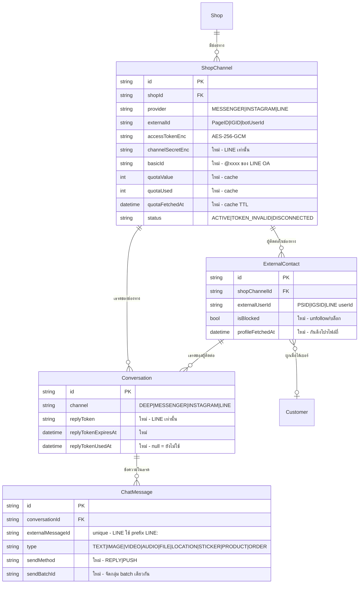

> **โมดูล:** M00025-LineOaChatIntegration
> **ประเภทเอกสาร:** Database Design
> **เวอร์ชัน:** 1.1
> **วันที่จัดทำ:** 2026-07-26
> **สถานะ:** Draft — รอ user review (migration ยังไม่ apply)
>
> 🔄 **v1.1 (2026-07-31) — sync กับของจริงบน main:** `00023 - Chat Auto-Reply` ขึ้นโค้ดบน production ไปแล้ว (6 service + 10 route + cron sweeper รายวัน + คอลัมน์ `Conversation.autoReply*` / `ChatMessage.autoReplyKind`) เอกสารรอบนี้จึงเปลี่ยน FR-LINE-08 เป็น **"เสียบ LINE เข้าเครื่องยนต์ auto-reply ของ 00023"** และตัดฟิลด์ที่ซ้ำกับของเดิมออก. เดิมจองเลข 00021 — renumber เป็น **00025**
> **เจ้าของเอกสาร:** safepay-database (ดู [[Feature-Docs-Ownership]])

---

# DATABASE: LINE OA Chat Integration

---

## 1. Overview

**ไม่มีตารางใหม่** — feature นี้ขยายตารางเดิมของ `00011 - Deep Chat` และ `00018 - Facebook Chat Integration` ทั้งหมด เพราะ LINE เป็นเพียง provider ที่สามบนโครงเดิม (`ShopChannel → ExternalContact → Conversation → ChatMessage`)

**หลักการที่ยึดตลอดเอกสารนี้:**
1. **Additive เท่านั้น** — ทุกคอลัมน์ใหม่ nullable หรือมี default ไม่มี backfill บังคับ ไม่แตะคอลัมน์เดิม
2. **DB dev = prod แชร์กัน** — ต้องใช้ `prisma migrate deploy` + ไฟล์ migration เขียนมือ **ห้าม `migrate dev`** (จะ reset ฐานจริง) ตาม `docs/conventions/prisma-shared-db-drift.md`
3. **ห้าม `prisma db pull`** — schema มี object ที่ Prisma จัดการไม่ได้ (partial unique index ของ `ShopChannel`, EXCLUDE constraint ของ 00017) การ pull จะทับทิ้ง (`feedback_qa_agent_no_prisma_pull`)
4. **ความลับเข้ารหัสก่อนเก็บ** — ไม่มีคอลัมน์ใดเก็บ token/secret เป็น plaintext
5. **ห้ามเพิ่มคอลัมน์ที่ซ้ำกับ 00023** — `Conversation` มี `autoReplyEnabled`, `autoReplyPausedUntil`, `autoReplyCount`, `lastAutoReplyAt`, `handoffAt`, `handoffReason`, `contextProduct*` และ `ChatMessage` มี `autoReplyKind` อยู่แล้วจาก feature 00023 ที่ขึ้น production แล้ว **ให้ใช้ของเดิม** การเพิ่มฟิลด์คู่ขนานจะทำให้มีความจริงสองชุด

---

## 2. ERD



---

## 3. Tables

### 3.1 `ShopChannel` (PostgreSQL / Supabase) — ขยาย

| คอลัมน์ | ชนิด | Null | Default | คำอธิบาย |
|---------|------|------|---------|----------|
| `channelSecretEnc` | `TEXT` | ✔ | `NULL` | Channel secret ของ LINE ที่ผ่าน AES-256-GCM — ใช้ตรวจ `x-line-signature`. Messenger/IG เป็น `NULL` (ใช้ app secret กลางระดับแอป ไม่ใช่ต่อร้าน) |
| `basicId` | `TEXT` | ✔ | `NULL` | Basic ID ของ OA (`@xxxxxxx`) — แสดงในหน้าตั้งค่าให้ร้านยืนยันว่าเชื่อมถูกบัญชี |
| `quotaValue` | `INTEGER` | ✔ | `NULL` | โควตาทั้งเดือนที่อ่านมาจาก LINE (`NULL` = ยังไม่เคยอ่าน / ไม่จำกัด) |
| `quotaUsed` | `INTEGER` | ✔ | `NULL` | จำนวนที่ใช้ไปแล้วเดือนนี้ |
| `quotaFetchedAt` | `TIMESTAMP(3)` | ✔ | `NULL` | เวลาที่อ่านค่าโควตาล่าสุด — ใช้ตัดสิน TTL 5 นาที |

**ข้อควรระวัง:**
- `provider` ยังเป็น `String` (ไม่ใช่ enum) ตาม convention เดิมของโปรเจกต์ — ค่าที่เพิ่มคือ `'LINE'` validate ที่ Valibot ไม่ใช่ที่ DB
- **partial unique index เดิมยังใช้ได้กับ LINE ทันที** — `UNIQUE (provider, externalId) WHERE status <> 'DISCONNECTED'` ให้ผลเป็น BR-LINE-01 (1 OA ACTIVE ได้ทีละร้าน + ย้ายร้านได้หลังถอด) โดยไม่ต้องสร้าง index ใหม่
- `channelSecretEnc` **ต้องไม่** ถูก select ออกไปฝั่ง client ทุกกรณี — เช่นเดียวกับ `accessTokenEnc` (กติกาเดิมใน `shop-channel.service.ts`)

### 3.2 `ExternalContact` — ขยาย

| คอลัมน์ | ชนิด | Null | Default | คำอธิบาย |
|---------|------|------|---------|----------|
| `isBlocked` | `BOOLEAN` | ✘ | `false` | ลูกค้า unfollow/บล็อก OA แล้ว → ห้ามพยายาม push ซ้ำ (BR-LINE-15). ใช้ได้กับ Messenger ด้วยในอนาคต จึงไม่ตั้งชื่อผูกกับ LINE |
| `profileFetchedAt` | `TIMESTAMP(3)` | ✔ | `NULL` | เวลาที่ดึงโปรไฟล์ล่าสุด — refresh เมื่อเกิน 7 วัน (TFR-LINE-10) กันยิง `/v2/bot/profile` ทุกข้อความ |

**ข้อควรระวัง:** `@@unique([shopChannelId, externalUserId])` เดิม **ถูกต้องอยู่แล้วสำหรับ LINE** — LINE userId เป็น channel-scoped เหมือน PSID ของ Meta (userId เดียวกันคนละ OA คือคนละค่า) จึงห้าม dedup ข้าม channel

### 3.3 `Conversation` — ขยาย

| คอลัมน์ | ชนิด | Null | Default | คำอธิบาย |
|---------|------|------|---------|----------|
| `replyToken` | `TEXT` | ✔ | `NULL` | reply token ล่าสุดจาก event — ทับค่าเดิมทุกครั้งที่มี event ใหม่ |
| `replyTokenExpiresAt` | `TIMESTAMP(3)` | ✔ | `NULL` | `event.timestamp + 60s` |
| `replyTokenUsedAt` | `TIMESTAMP(3)` | ✔ | `NULL` | `NULL` = ยังไม่ถูกใช้. ตั้งค่าใน transaction ก่อนยิง LINE เพื่อกัน concurrent send แย่งใช้ token เดียวกัน (TFR-LINE-05) |

**ข้อควรระวัง:**
- `lastInboundAt` เดิมยังใช้ต่อ (เป็นฐานของหน้าต่าง 24 ชม. ฝั่ง Meta) แต่ **ไม่ใช่** ฐานของหน้าต่าง reply ของ LINE — ห้ามนำมาใช้แทน `replyTokenExpiresAt`
- `externalReadAt` จะเป็น `NULL` ตลอดสำหรับเธรด LINE (ไม่มี read receipt ใน MVP) — UI ต้องไม่ตีความว่า "ยังไม่อ่าน"

### 3.4 `ChatMessage` — ขยาย

| คอลัมน์ | ชนิด | Null | Default | คำอธิบาย |
|---------|------|------|---------|----------|
| `sendMethod` | `TEXT` | ✔ | `NULL` | `'REPLY'` \| `'PUSH'` — `NULL` สำหรับข้อความขาเข้าและช่องทางที่ไม่มีแนวคิดนี้. เป็นหลักฐานเวลาร้านทักท้วงเรื่องบิล (BR-LINE-16) |
| `sendBatchId` | `TEXT` | ✔ | `NULL` | UUID ร่วมของข้อความที่ถูกส่งใน request เดียวกัน — ใช้คำนวณ "โควตาที่ประหยัดได้" และเป็นค่า `X-Line-Retry-Key` |

**ข้อควรระวัง:**
- `externalMessageId` มี `@unique` อยู่แล้ว → ทำหน้าที่ dedup redelivery ให้ทันที **แต่ต้องเก็บด้วย prefix `LINE:`** เพื่อไม่ให้ id ของ LINE ชน namespace กับ mid ของ Meta (TFR-LINE-04)
- `type` ขยายค่าเพิ่ม `VIDEO`/`AUDIO`/`FILE`/`LOCATION`/`STICKER` — เป็น `String` อยู่แล้วจึงไม่ต้องแก้ DB แต่ **ทุกจุดที่ render ต้องมี default case** ไม่งั้นข้อความชนิดใหม่จะแสดงเป็นช่องว่าง
- `imageUrl` เดิมใช้กับ `IMAGE` — ชนิดสื่ออื่นใช้คอลัมน์เดิมนี้ต่อ (เก็บ URL/fileId) เพื่อไม่เพิ่มคอลัมน์ซ้ำซ้อน; ถ้าอนาคตต้องแยก metadata ค่อยเพิ่มทีหลัง

---

## 4. Indexes

| Index | ตาราง | เหตุผล | สถานะ |
|-------|-------|--------|-------|
| `UNIQUE (provider, externalId) WHERE status <> 'DISCONNECTED'` | `ShopChannel` | routing webhook ด้วย `destination` + บังคับ BR-LINE-01 | **มีอยู่แล้ว** (migration `20260722000200`) ใช้กับ LINE ได้ทันที |
| `(shopId, status)` | `ShopChannel` | list ช่องทางในหน้าตั้งค่า | มีอยู่แล้ว |
| `UNIQUE (shopChannelId, externalUserId)` | `ExternalContact` | หา contact จาก LINE userId | มีอยู่แล้ว |
| `UNIQUE (externalMessageId)` | `ChatMessage` | dedup redelivery | มีอยู่แล้ว |
| `(conversationId, createdAt)` | `ChatMessage` | pagination ในเธรด | มีอยู่แล้ว |

**ไม่ต้องเพิ่ม index ใหม่** — query pattern ของ LINE ตรงกับของ Messenger ทุกเส้นทาง

---

## 5. Migration Plan

### 5.1 ลำดับการ Migrate

**ไฟล์เดียว:** `prisma/migrations/20260726000100_line_oa_chat/migration.sql`

รวมทุกคอลัมน์ไว้ใน migration เดียว เพราะ DB dev=prod แชร์กัน — การ ALTER หลายรอบมีต้นทุนความเสี่ยงมากกว่าการเพิ่มให้ครบตั้งแต่รอบแรก (เหตุผลเดียวกับที่ 00018 ทำกับ `isPinned/isHidden/resolvedAt`)

```sql
-- ShopChannel: credential + quota cache + ai opt-in
ALTER TABLE "ShopChannel" ADD COLUMN IF NOT EXISTS "channelSecretEnc" TEXT;
ALTER TABLE "ShopChannel" ADD COLUMN IF NOT EXISTS "basicId" TEXT;
ALTER TABLE "ShopChannel" ADD COLUMN IF NOT EXISTS "quotaValue" INTEGER;
ALTER TABLE "ShopChannel" ADD COLUMN IF NOT EXISTS "quotaUsed" INTEGER;
ALTER TABLE "ShopChannel" ADD COLUMN IF NOT EXISTS "quotaFetchedAt" TIMESTAMP(3);

-- ExternalContact: สถานะบล็อก + กันดึงโปรไฟล์ถี่
ALTER TABLE "ExternalContact" ADD COLUMN IF NOT EXISTS "isBlocked" BOOLEAN NOT NULL DEFAULT false;
ALTER TABLE "ExternalContact" ADD COLUMN IF NOT EXISTS "profileFetchedAt" TIMESTAMP(3);

-- Conversation: หน้าต่าง reply token + ร่างของ AI
ALTER TABLE "Conversation" ADD COLUMN IF NOT EXISTS "replyToken" TEXT;
ALTER TABLE "Conversation" ADD COLUMN IF NOT EXISTS "replyTokenExpiresAt" TIMESTAMP(3);
ALTER TABLE "Conversation" ADD COLUMN IF NOT EXISTS "replyTokenUsedAt" TIMESTAMP(3);

-- ChatMessage: หลักฐานวิธีส่ง + การจัดกลุ่ม batch + ที่มาของข้อความ
ALTER TABLE "ChatMessage" ADD COLUMN IF NOT EXISTS "sendMethod" TEXT;
ALTER TABLE "ChatMessage" ADD COLUMN IF NOT EXISTS "sendBatchId" TEXT;
```

**ขั้นตอนที่ต้องทำตามลำดับ:**
1. แก้ `prisma/schema.prisma` ให้ตรงกับ SQL ข้างบน
2. เขียนไฟล์ migration ด้วยมือ (ห้ามให้ Prisma generate ผ่าน `migrate dev`)
3. `npx prisma generate` (ไม่ต้องต่อ DB)
4. **ขอ user ยืนยันก่อน apply** เพราะ apply = แตะ prod
5. `npx prisma migrate deploy -e .env.local`
6. **restart dev server** หลัง migrate (stale Prisma client ทำให้ session 500 — บทเรียน 2026-06-16)
7. `git status` ตรวจว่า `schema.prisma` ไม่ถูกใครแก้ทับ (`feedback_qa_agent_no_prisma_pull`)

### 5.2 Rollback

```sql
ALTER TABLE "ChatMessage" DROP COLUMN IF EXISTS "sendBatchId";
ALTER TABLE "ChatMessage" DROP COLUMN IF EXISTS "sendMethod";
ALTER TABLE "Conversation" DROP COLUMN IF EXISTS "replyTokenUsedAt";
ALTER TABLE "Conversation" DROP COLUMN IF EXISTS "replyTokenExpiresAt";
ALTER TABLE "Conversation" DROP COLUMN IF EXISTS "replyToken";
ALTER TABLE "ExternalContact" DROP COLUMN IF EXISTS "profileFetchedAt";
ALTER TABLE "ExternalContact" DROP COLUMN IF EXISTS "isBlocked";
ALTER TABLE "ShopChannel" DROP COLUMN IF EXISTS "quotaFetchedAt";
ALTER TABLE "ShopChannel" DROP COLUMN IF EXISTS "quotaUsed";
ALTER TABLE "ShopChannel" DROP COLUMN IF EXISTS "quotaValue";
ALTER TABLE "ShopChannel" DROP COLUMN IF EXISTS "basicId";
ALTER TABLE "ShopChannel" DROP COLUMN IF EXISTS "channelSecretEnc";
```

**ข้อควรระวังเรื่อง rollback:** ถ้ามีร้านเชื่อม LINE ไปแล้ว การ drop `channelSecretEnc` = **ทำลาย credential ที่กู้ไม่ได้** ร้านต้องวาง secret ใหม่ทั้งหมด → rollback หลังมีผู้ใช้จริงต้อง export ข้อมูลก่อน หรือเลือกวิธี "ปิดฟีเจอร์ด้วย flag" แทนการ drop คอลัมน์

### 5.3 ผลกระทบ (Impact)

| ด้าน | ผลกระทบ |
|------|---------|
| **ข้อมูลเดิม** | ไม่มี — ทุกคอลัมน์ nullable/มี default แถวเดิมได้ค่า default ทันทีโดยไม่ต้อง backfill |
| **เวลา lock** | สั้นมาก — `ADD COLUMN` พร้อม default ใน PostgreSQL 11+ ไม่ rewrite ตาราง |
| **โค้ดเดิม** | ไม่กระทบ — ไม่มีคอลัมน์ใดถูกลบหรือเปลี่ยนชนิด. เธรด `DEEP`/`MESSENGER`/`INSTAGRAM` เห็นค่า `NULL`/`false` ซึ่งตรงกับพฤติกรรมเดิม |
| **ขนาด** | เล็กน้อย (คอลัมน์ nullable ที่ส่วนใหญ่เป็น NULL) |
| **prod** | migration รันอัตโนมัติตอน build (`vercel.json` มี `migrate deploy`) → **push ขึ้น main = apply prod** ต้องระวัง (`feedback_subagent_git_scope_violation`) |

---

## 6. Retention / ข้อควรระวัง

| หัวข้อ | กติกา |
|--------|-------|
| **replyToken** | ข้อมูลชั่วคราวอายุ 1 นาที ไม่ต้องมี job ลบ (ถูกทับด้วย event ใหม่เรื่อย ๆ) แต่ **ห้ามส่งออกไปฝั่ง client** — ใครถือ token นี้ส่งข้อความในนามร้านได้ |
| **channelSecretEnc / accessTokenEnc** | ห้าม select ออกจาก service layer ในรูป plaintext, ห้าม log, ห้ามอยู่ใน RSC flight payload (NFR-3/NFR-6) |
| **สื่อที่ mirror** | เก็บถาวรใน storage ของ Deep (LINE ลบต้นทางเอง) — ปริมาณโตขึ้นตามการใช้งาน ควรมี retention policy ในอนาคต แต่ไม่ใช่ใน MVP |
| **quota cache** | เป็นค่าประมาณ ห้ามนำไปใช้ออกใบเรียกเก็บเงินหรือรายงานทางการเงิน — ค่าจริงอยู่ที่ LINE |
| **isBlocked** | เป็นสถานะ ไม่ใช่การลบ — ข้อมูลลูกค้าที่บล็อกแล้วยังต้องอยู่ครบเพื่อประวัติออเดอร์ |
| **PII** | `ExternalContact.name/avatarUrl/phones/address` เป็น PII เต็มรูป — ต้อง mask ที่ server boundary ก่อนเข้า client component (`feedback_rsc_pii_neutralize_at_source`) |

---

## 7. Traceability

| FR / BR | คอลัมน์ที่รองรับ |
|---------|------------------|
| FR-LINE-01, BR-LINE-01/02/03 | `ShopChannel.channelSecretEnc`, `basicId`, partial unique index เดิม |
| FR-LINE-02, BR-LINE-07 | `ChatMessage.externalMessageId` (unique, prefix `LINE:`) |
| FR-LINE-03, BR-LINE-09 | `ChatMessage.type` (ค่าใหม่), `imageUrl` |
| FR-LINE-05, BR-LINE-10/11 | `Conversation.replyToken`, `replyTokenExpiresAt`, `replyTokenUsedAt` |
| FR-LINE-06, BR-LINE-13/14 | `ShopChannel.quotaValue`, `quotaUsed`, `quotaFetchedAt` |
| FR-LINE-07, BR-LINE-12 | `ChatMessage.sendBatchId` |
| FR-LINE-08, BR-LINE-17/18/20 | **ไม่มีคอลัมน์ใหม่** — ใช้ `Conversation.autoReplyEnabled/autoReplyPausedUntil/...` และ `ChatMessage.autoReplyKind` ของ 00023 ที่มีอยู่แล้ว |
| FR-LINE-09, BR-LINE-16 | `ChatMessage.sendMethod`, `deliveryStatus`, `failureReason` (เดิม) |
| FR-LINE-13, BR-LINE-15 | `ExternalContact.isBlocked` |
| FR-LINE-10 | `ExternalContact.profileFetchedAt` |

---

## 8. สรุป (Summary)

การเปลี่ยนแปลงฐานข้อมูลของ feature นี้เป็น **additive ล้วน 12 คอลัมน์ใน 4 ตารางเดิม ไม่มีตารางใหม่ ไม่มี index ใหม่ ไม่มี backfill** ความเสี่ยงต่อระบบที่ใช้งานจริงจึงต่ำมาก (v1.0 เคยระบุ 15 คอลัมน์ — ตัด 3 ตัวที่ซ้ำกับ 00023 ออกแล้ว)

จุดที่ต้องระวังที่สุดไม่ใช่ตัว migration แต่เป็น **สองอย่างรอบ ๆ มัน**: (1) `push ขึ้น main = apply migration บน prod ทันที` จึงต้องขอ user ยืนยันก่อนเสมอ และ (2) `channelSecretEnc` เป็นข้อมูลที่ rollback แล้วกู้ไม่ได้ — หลังมีร้านใช้จริง ให้ปิดฟีเจอร์ด้วย flag แทนการ drop คอลัมน์
