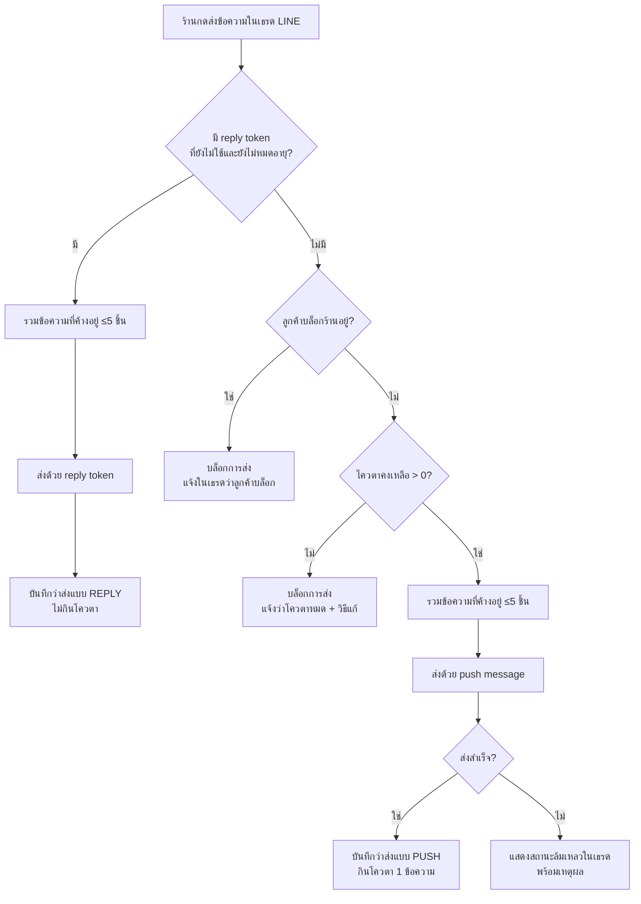

> **โมดูล:** M00025-LineOaChatIntegration
> **ประเภทเอกสาร:** Product Requirements Document (PRD)
> **เวอร์ชัน:** 1.1
> **วันที่จัดทำ:** 2026-07-26
> **สถานะ:** Draft — รอ user review
>
> 🔄 **v1.1 (2026-07-31) — sync กับของจริงบน main:** ร่าง v1.0 เขียนตอน branch ตามหลัง main อยู่ 197 commit จึงมองไม่เห็นว่า **`00023 - Chat Auto-Reply` ขึ้นโค้ดไปแล้ว** (6 service + 10 route + cron sweeper + คอลัมน์ใน `Conversation`/`ChatMessage`) การแก้รอบนี้: **FR-LINE-08 เปลี่ยนจาก "AI ตอบเอง" เป็น "เสียบ LINE เข้ากับเครื่องยนต์ auto-reply ของ 00023 ที่มีอยู่แล้ว"**, ปรับ BR-LINE-17..20, ตัดฟิลด์ที่ซ้ำกับของ 00023, และเพิ่มข้อจำกัดที่เพิ่งรู้ (cron ของโปรเจกต์เป็น **รายวัน** จึงใช้เป็น fallback ของหน้าต่าง 1 นาทีไม่ได้). เดิมจองเลข 00021 — renumber เป็น **00025** เพราะ 00021–00024 ถูกจองไปแล้ว
> **เจ้าของเอกสาร:** BA + PO + PM (ดู [[Feature-Docs-Ownership]])

---

# PRD: เชื่อม LINE Official Account เข้าอินบ็อกซ์ Deep

---

## Executive Summary

LINE OA Chat Integration คือฟีเจอร์ที่เชื่อม **LINE Official Account** ของร้านค้าเข้ากับ `/inbox` ของ Deep ต่อยอดจาก `00011 - Deep Chat` (แชทในแอป) และ `00018 - Facebook Chat Integration` (Messenger/Instagram) ให้อินบ็อกซ์รวมศูนย์ครอบคลุมช่องทางที่คนไทยใช้ซื้อขายมากที่สุด — LINE

ในไทย LINE คือช่องทางแชทหลักของร้านค้า (มากกว่า Messenger ในหลายกลุ่มธุรกิจ) การที่ Deep เห็นเฉพาะ Deep Chat + Messenger/IG ทำให้ "อินบ็อกซ์เดียว" ยังไม่จริง ร้านยังต้องเปิดแอป LINE คู่ไปตลอด ประวัติลูกค้าขาดตอน และการสร้างออเดอร์จากบทสนทนา LINE ยังต้องพิมพ์ข้อมูลซ้ำทุกครั้ง

**ข้อแตกต่างเชิงโครงสร้างที่ต้องยอมรับตั้งแต่ต้น — และเป็นแกนของ PRD ฉบับนี้:** LINE ไม่ได้ให้ "หน้าต่างตอบฟรี 24 ชั่วโมง" แบบ Meta แต่ให้ **reply token อายุ 1 นาที** เท่านั้น ข้อความที่ร้านตอบช้ากว่านั้นต้องส่งด้วย **push message ซึ่งนับโควตาข้อความของร้าน (มีค่าใช้จ่ายจริง)** ขณะที่ถ้าร้านตอบใน LINE OA Manager เอง ข้อความนั้น**ไม่นับโควตา** แปลว่าโดยธรรมชาติของแพลตฟอร์ม การย้ายมาตอบใน Deep มี **ต้นทุนแฝงให้ร้าน** — ฟีเจอร์นี้จึงต้องออกแบบให้ "ประหยัดโควตาโดยค่าเริ่มต้น" และ **โปร่งใสเรื่องค่าใช้จ่าย** ไม่ใช่แค่ทำให้ส่งข้อความออกได้

**ขอบเขต MVP:** เชื่อมแบบ **ร้านวาง key เอง** (ร้านสร้าง Messaging API channel ใน LINE Developers Console แล้ววาง Channel secret + Channel access token ใน Deep) เพราะทำได้ทันทีโดยไม่ติด gate ใด ๆ ส่วน **Module Channel** (OAuth กดปุ่มเดียว) ต้องเป็น LINE Technology Partner ก่อน จึงวางเป็น Phase 2 — แต่ **สถาปัตยกรรมต้องออกแบบให้สลับได้โดยไม่รื้อ schema/webhook** (บทเรียนจาก 00020 TikTok: provider adapter ต้องแยกก่อน ไม่งั้นเสี่ยง Messenger prod พัง)

---

## 1. Business Goals & KPIs

### 1.1 เป้าหมายทางธุรกิจ

| เป้าหมาย | รายละเอียด |
|----------|-----------|
| **ทำให้ "อินบ็อกซ์เดียว" เป็นจริงในตลาดไทย** | LINE เป็นช่องทางแชทหลักของร้านค้าไทย ถ้าไม่มี LINE คำว่า omnichannel inbox ของ Deep ยังไม่จริงสำหรับลูกค้ากลุ่มใหญ่ที่สุด |
| **ไม่เพิ่มต้นทุนให้ร้านโดยที่ร้านไม่รู้ตัว** | push message กินโควตาที่ร้านจ่ายเงินซื้อ ระบบต้องประหยัดโควตาโดยค่าเริ่มต้น + แสดงโควตาคงเหลือให้ร้านเห็นตลอด |
| **ต่อยอดบทสนทนา LINE เป็นออเดอร์ได้ทันที** | ใช้ flow เดิมของ 00018 (สร้างออเดอร์จากเธรด + ผูก Customer Directory) ไม่สร้างของใหม่ |
| **ปูทางเป็น LINE Technology Partner** | การมีร้านใช้งานจริงผ่านวิธี A คือเกณฑ์ข้อหนึ่งของการสมัคร Partner (ต้องมีลูกค้าใช้ LINE อย่างน้อย 1 ราย) ซึ่งเปิดทาง Module Channel ใน Phase 2 |

### 1.2 ตัวชี้วัดความสำเร็จ (KPIs)

> เป้าหมายตัวเลขเป็นเป้าเบื้องต้น (proposed) ยังไม่มี baseline เพราะฟีเจอร์ยังไม่เคย live — ปรับได้หลัง launch

| KPI | คำอธิบาย | เป้าหมาย (เสนอ) |
|-----|----------|---------|
| **LINE OA เชื่อมสำเร็จ** | จำนวน `ShopChannel` provider `LINE` สถานะ `ACTIVE` | วัด trend หลัง launch |
| **% ข้อความ inbound ที่บันทึกสำเร็จ** | ข้อความที่ LINE ส่งเข้า webhook แล้วปรากฏใน `/inbox` ถูกต้อง (รวม dedup กรณี redelivery) | 100% ของ event ที่ signature ผ่าน |
| **Reply-token Hit Rate** | % ของข้อความขาออกที่ส่งได้ด้วย reply token (ฟรี) แทน push (เสียโควตา) | ≥ 30% ในเดือนแรก (ขึ้นกับสัดส่วนที่ตอบอัตโนมัติของ 00023 รับไป) |
| **Quota Saved / เดือน** | จำนวนข้อความที่ประหยัดได้ = (reply ที่ใช้แทน push) + (message object ที่ถูก batch รวม) | รายงานเป็นตัวเลขจริงต่อร้าน |
| **อัตราเชื่อมสำเร็จตั้งแต่ครั้งแรก** | % ร้านที่ทำ setup 5 ขั้นตอนจบโดยไม่ต้องติดต่อ support | ≥ 60% (วิธี A มี friction สูงโดยธรรมชาติ — ตัวเลขนี้คือเหตุผลรองรับการทำ Phase 2) |
| **Zero Regression บน Messenger/IG + Deep Chat** | เธรด `DEEP`/`MESSENGER`/`INSTAGRAM` ไม่มี behavior change ที่ไม่ตั้งใจหลังแยก provider adapter | Regression suite ผ่าน 100% |

---

## 2. User Personas (กลุ่มผู้ใช้งาน)

### 2.1 Seller เจ้าของร้านที่ใช้ LINE OA เป็นช่องทางหลัก

**ข้อมูลพื้นฐาน:** เจ้าของร้าน (`Shop.userId`) มี LINE OA ของร้านอยู่แล้ว (ส่วนใหญ่แพ็กเกจฟรีหรือ Basic) ปัจจุบันตอบลูกค้าผ่านแอป LINE OA บนมือถือหรือ LINE OA Manager บนเว็บ

**เป้าหมาย:** เห็นข้อความจากทุกช่องทาง (Deep, Messenger, IG, LINE) รวมในที่เดียว ตอบได้จากหน้าเดียว และแปลงบทสนทนาเป็นออเดอร์ทันที

**ความต้องการ:** ขั้นตอนเชื่อมที่ทำเองได้จริงแม้ไม่เข้าใจเรื่องเทคนิค (มีคู่มือ + วิดีโอ + ปุ่มคัดลอก webhook URL), เห็น badge ช่องทางว่าข้อความมาจาก LINE, **รู้ว่าเหลือโควตาข้อความกี่ข้อความ** และรู้ว่าการกดส่งแต่ละครั้งกินโควตาหรือไม่

**จุดปวด (Pain Points):** เปิดหลายแอปพร้อมกัน ประวัติลูกค้าไม่ต่อเนื่อง พิมพ์ข้อมูลลูกค้าซ้ำ และ **กลัวว่าการใช้เครื่องมือภายนอกจะทำให้โควตาข้อความหมดเร็วกว่าเดิมโดยไม่รู้ตัว**

**User Story:**
> ในฐานะ Seller ที่ใช้ LINE OA เป็นช่องทางหลัก ฉันต้องการเชื่อม LINE OA เข้ากับ `/inbox` ของ Deep แล้วตอบลูกค้าจากหน้าเดียว โดยที่ระบบต้องบอกฉันชัดเจนว่าเหลือโควตาเท่าไรและช่วยฉันประหยัดโควตาให้มากที่สุด

### 2.2 ลูกค้าที่ทักร้านผ่าน LINE (ไม่ใช่ Deep User)

**ข้อมูลพื้นฐาน:** ผู้ใช้ LINE ทั่วไปที่เพิ่มเพื่อน LINE OA ของร้าน — **ไม่มีบัญชี Deep** และไม่ต้องสมัคร

**เป้าหมาย:** สอบถามสินค้า/สั่งซื้อผ่าน LINE ตามปกติ

**ความต้องการ:** ได้คำตอบในแอป LINE ของตัวเองตามปกติ ไม่ต้องรู้ว่าเบื้องหลังร้านใช้ระบบอะไรตอบ

**จุดปวด:** ไม่มี pain point โดยตรง — แต่ระบบต้องไม่ทำให้แย่ลง เช่น ตอบช้าลง หรือส่งข้อความไม่ออกโดยไม่มีคำอธิบาย (กรณีร้านโควตาหมด)

**User Story:**
> ในฐานะลูกค้าที่ทักร้านผ่าน LINE ฉันต้องการได้รับคำตอบในแอปที่ฉันใช้อยู่ตามปกติ โดยไม่ต้องรู้ว่าร้านใช้เครื่องมืออะไรตอบอยู่เบื้องหลัง

### 2.3 Seller ที่ยังตอบจากแอป LINE OA โดยตรง (Coexistence Scenario)

**ข้อมูลพื้นฐาน:** seller คนเดียวกับ 2.1 แต่บางครั้งตอบจากแอป LINE OA บนมือถือเพราะสะดวกกว่า และเพราะ **ตอบจากตรงนั้นไม่กินโควตา**

**เป้าหมาย:** ไม่ว่าตอบจากช่องทางไหน ประวัติต้องครบและตรงกัน

**ความต้องการ:** เข้าใจได้ทันทีว่าเธรดไหนถูกตอบไปแล้วจากที่อื่น

**จุดปวด (ข้อจำกัดจริงของแพลตฟอร์ม):** **LINE ไม่มี echo event แบบ Messenger** — ข้อความที่ร้านตอบจากแอป LINE OA เอง **จะไม่ถูกส่งมาที่ webhook** ทำให้ Deep ไม่มีทางเห็นข้อความนั้นเลย ต่างจาก 00018 ที่ `is_echo` แก้ปัญหานี้ได้ นี่คือ **ข้อจำกัดที่แก้ไม่ได้ในเชิงเทคนิค** ต้องจัดการด้วยการสื่อสารกับผู้ใช้ (ดู §4.2 และ §6.1)

**User Story:**
> ในฐานะ Seller ที่บางครั้งตอบจากแอป LINE OA โดยตรง ฉันต้องการให้ระบบบอกฉันตรง ๆ ว่าข้อความที่ตอบจากตรงนั้นจะไม่ปรากฏใน Deep เพื่อที่ฉันจะได้เลือกได้ว่าจะตอบจากที่ไหนโดยไม่เข้าใจผิดว่าระบบพัง

---

## 3. Business Requirements

### 3.1 ภาพรวม Functional Requirements (FR-LINE-01..14)

> ตารางนี้เป็น **overview ระดับ feature** — รายละเอียด User Story เต็ม/Acceptance Criteria ดูที่ [[BRD]] §2 (รหัสเดียวกัน)

| FR | ชื่อ | ภาพรวม | Priority |
|----|------|--------|----------|
| **FR-LINE-01** | เชื่อม LINE OA ด้วยการวาง key | หน้า `settings/channels` เพิ่มการ์ด LINE — ร้านวาง Channel secret + Channel access token, ระบบ verify แล้วดึงชื่อ/รูป OA มาแสดง | Must |
| **FR-LINE-02** | รับข้อความ TEXT เข้า `/inbox` | ข้อความ text จาก LINE เข้าระบบผ่าน webhook เดียว routing ด้วย `destination` | Must |
| **FR-LINE-03** | รับสื่อ (รูป/วิดีโอ/เสียง/ไฟล์) | ดาวน์โหลดจาก LINE แล้ว mirror ขึ้น storage ของ Deep ทันที (LINE ลบ content อัตโนมัติ) | Must |
| **FR-LINE-04** | ส่งข้อความออกไป LINE จริง | ร้านพิมพ์/แนบไฟล์ใน Deep → ส่งออกจริง โดยเลือก reply หรือ push ตามกติกาประหยัดโควตา | Must |
| **FR-LINE-05** | Reply-token Saver | ถ้ายังอยู่ในหน้าต่าง reply token (≤1 นาที) ต้องส่งด้วย reply (ฟรี) ห้ามใช้ push | Must |
| **FR-LINE-06** | Quota Meter ในอินบ็อกซ์ | แสดงโควตาคงเหลือของ OA + เตือนเมื่อใกล้หมด/หมด | Must |
| **FR-LINE-07** | รวมข้อความก่อนส่ง (batch) | ข้อความหลายบรรทัด/หลายไฟล์ที่ส่งติดกัน รวมเป็น request เดียว (≤5 message object = นับ 1 ข้อความ) | Must |
| **FR-LINE-08** | ตอบอัตโนมัติของ 00023 ทำงานบน LINE ผ่าน reply token | เสียบช่องทาง LINE เข้ากับเครื่องยนต์ auto-reply ที่ขึ้น production แล้ว — คำตอบสำเร็จรูปจาก keyword ส่งภายในหน้าต่าง 1 นาที จึง **ไม่กินโควตา** | Must |
| **FR-LINE-09** | จัดการสถานะส่งไม่สำเร็จ | โควตาหมด / ลูกค้าบล็อก / token ตาย → เห็นในเธรด ห้าม fail เงียบ | Must |
| **FR-LINE-10** | โปรไฟล์ลูกค้า LINE | ดึงชื่อ/รูปโปรไฟล์มาแสดงในเธรดและ CustomerPanel | Must |
| **FR-LINE-11** | สร้างออเดอร์ / ผูก Customer จากเธรด LINE | ใช้ flow เดิมของ 00018 ไม่สร้างของใหม่ | Must |
| **FR-LINE-12** | ถอดการเชื่อม (disconnect) | ร้านถอด OA ได้เอง ประวัติแชทยังอยู่ | Must |
| **FR-LINE-13** | รับ follow / unfollow | รู้ว่าลูกค้าเพิ่มเพื่อน/บล็อก → บล็อกแล้วห้ามพยายาม push ซ้ำจนโควตาไหม้ | Should |
| **FR-LINE-14** | Provider adapter แยกชั้น | refactor ชั้นเชื่อมช่องทางให้ LINE/Messenger/IG อยู่หลัง interface เดียวกัน | Must |

### 3.2 การเชื่อม LINE OA (วิธี A — ร้านวาง key เอง)

**ความต้องการ:**
- ร้านเชื่อม LINE OA ได้ด้วยตัวเองจากหน้า `settings/channels` โดยไม่ต้องติดต่อทีม Deep
- ระบบต้องพิสูจน์ว่า key ที่วางมาใช้ได้จริง **ก่อน** บันทึก (เรียก LINE เพื่อดึงข้อมูล OA)
- ระบบต้องแสดง webhook URL พร้อมปุ่มคัดลอก และคู่มือทีละขั้นในหน้าเดียวกัน

**Business Rules:**
- **BR-LINE-01** — 1 LINE OA ผูก ACTIVE ได้ทีละร้านเดียว (partial unique เหมือน BR-FBC-01 ของ 00018) ถอดแล้วย้ายไปร้านอื่นได้
- **BR-LINE-02** — Channel secret และ Channel access token ต้องเข้ารหัสก่อนเก็บ (AES-256-GCM) ห้ามเก็บ plaintext ห้าม log ห้ามส่งกลับ client ทุกกรณี รวมถึงตอนแสดงในหน้าแก้ไข (แสดงเป็น masked เท่านั้น)
- **BR-LINE-03** — บันทึกได้ต่อเมื่อ verify กับ LINE ผ่าน และได้ bot userId มาเก็บเป็น `externalId`
- **BR-LINE-04** — เฉพาะเจ้าของร้านและพนักงานที่มีสิทธิ์ (feature 00012) เชื่อม/ถอดได้

**เหตุผล:**
- วิธี A ปล่อยได้ทันทีโดยไม่ติด LINE partner gate ซึ่งเป็นบทเรียนตรงจาก 00020 (TikTok ค้างเพราะรอสิทธิ์)
- bot userId คือค่าที่ LINE ส่งมาในฟิลด์ `destination` ของทุก webhook — เก็บไว้เพื่อ route ข้อความหาร้านที่ถูกต้องจาก URL เดียว

### 3.3 การรับข้อความ (ขาเข้า)

**ความต้องการ:**
- webhook URL เดียวของทั้งระบบ รองรับทุกร้าน
- รองรับข้อความ text, รูป, วิดีโอ, เสียง, ไฟล์, ตำแหน่ง และสติกเกอร์
- สื่อทุกชิ้นต้องถูก mirror เข้า storage ของ Deep ทันทีที่รับ

**Business Rules:**
- **BR-LINE-05** — ต้อง verify ลายเซ็น (`x-line-signature`) ด้วย Channel secret ของร้านนั้น ๆ ก่อนบันทึกอะไรทั้งสิ้น ข้อมูลจาก body ที่ยังไม่ verify ใช้ได้แค่เพื่อ "หา channel" เท่านั้น ห้ามนำไปเขียน DB
- **BR-LINE-06** — event ที่ signature ไม่ผ่าน หรือหา channel ACTIVE ไม่เจอ → ทิ้ง (ตอบ 2xx เพื่อไม่ให้ LINE ยิงซ้ำ) แต่ต้อง log ระดับ warning
- **BR-LINE-07** — ป้องกันข้อความซ้ำจาก redelivery ด้วยรหัส event ที่ LINE ส่งมา (1 event = 1 ข้อความ ไม่ว่าจะได้รับกี่ครั้ง)
- **BR-LINE-08** — MVP รองรับเฉพาะแชท 1:1 เท่านั้น — event จากกลุ่ม/ห้องให้ข้ามอย่างเงียบ ๆ (ดู §5)
- **BR-LINE-09** — สื่อที่ mirror ไม่สำเร็จ ต้องบันทึกข้อความเป็น placeholder ที่ผู้ใช้เห็นได้ ห้ามหายเงียบ (บทเรียน Supabase MIME limit จาก 00018)

**เหตุผล:**
- LINE ลบไฟล์ที่ลูกค้าส่งอัตโนมัติหลังระยะหนึ่ง ถ้าไม่ mirror ทันที ประวัติจะเหลือแต่ลิงก์ตาย
- กลุ่ม/ห้องมีโมเดลสิทธิ์และ userId ต่างออกไป ทำครึ่ง ๆ กลาง ๆ อันตรายกว่าไม่ทำ

### 3.4 การส่งข้อความและการจัดการโควตา (แกนหลักของฟีเจอร์นี้)

**ความต้องการ:**
- ส่งข้อความออกได้จริงจาก `/inbox` ด้วยต้นทุนโควตาต่ำที่สุดเท่าที่แพลตฟอร์มอนุญาต
- ร้านต้องมองเห็นต้นทุนนั้นได้ตลอดเวลา

**สถานะการส่งที่ต้องรองรับ:**

| สถานะ | ชื่อภาษาไทย | คำอธิบาย | ผลต่อโควตา |
|-------|------------|----------|----------|
| **REPLY** | ตอบในหน้าต่างฟรี | ส่งด้วย reply token ภายใน 1 นาทีหลังลูกค้าทัก | ไม่นับ |
| **PUSH** | ส่งแบบเสียโควตา | ส่งด้วย push message หลังหน้าต่าง reply ปิด | นับ 1 ต่อผู้รับ 1 คน (ไม่ว่าจะรวมกี่ message object) |
| **BLOCKED_QUOTA** | ส่งไม่ได้ โควตาหมด | โควตาเดือนนั้นหมด | — |
| **FAILED** | ส่งไม่สำเร็จ | ลูกค้าบล็อก / token ตาย / เหตุอื่น | — |

**Business Rules:**
- **BR-LINE-10** — ระบบต้องพยายามใช้ reply token ก่อนเสมอ ถ้ายังไม่หมดอายุ (≤1 นาทีนับจาก event ล่าสุด) และยังไม่ถูกใช้ไป
- **BR-LINE-11** — reply token ใช้ได้ครั้งเดียวต่อ 1 event ใช้แล้วต้องทำเครื่องหมายว่าใช้แล้วทันที
- **BR-LINE-12** — ข้อความ/ไฟล์ที่ร้านส่งติด ๆ กันภายในช่วงเวลาสั้น ๆ ต้องรวมเป็น request เดียว (≤5 message object) เพื่อให้นับเป็น 1 ข้อความ
- **BR-LINE-13** — ก่อนส่งแบบ push ระบบต้องรู้โควตาคงเหลือ ถ้าเหลือ 0 ต้อง**บล็อกการส่งพร้อมอธิบายเหตุผล** ห้ามปล่อยให้กดส่งแล้วค่อย error
- **BR-LINE-14** — โควตาคงเหลือแสดงในหน้าอินบ็อกซ์ของช่องทาง LINE และ cache ได้ไม่เกินช่วงสั้น ๆ (ค่าที่แน่นอนกำหนดใน SRS) เพื่อไม่ยิง LINE ทุกครั้งที่เปิดหน้า
- **BR-LINE-15** — ลูกค้าที่ unfollow/บล็อกร้านแล้ว ห้ามพยายามส่ง push ซ้ำ (สิ้นเปลืองโควตาโดยไม่มีทางถึงผู้รับ)
- **BR-LINE-16** — ทุกข้อความขาออกต้องบันทึกว่าส่งด้วยวิธีใด (reply/push) เพื่อรายงาน "โควตาที่ประหยัดได้" และเพื่อตรวจสอบย้อนหลังเวลาร้านทักท้วงเรื่องค่าใช้จ่าย

**เหตุผล:**
- reply token อายุ 1 นาที + reply ไม่นับโควตา + push นับโควตา = กติกาของ LINE ที่เปลี่ยนไม่ได้ ระบบต้องออกแบบรอบข้อจำกัดนี้ ไม่ใช่ฝืน
- ถ้าไม่ทำ BR-LINE-13 ร้านจะเจอ error ที่อธิบายไม่ได้ตอนโควตาหมด และจะโทษว่า Deep พัง
- BR-LINE-16 คือหลักฐานเวลามีข้อพิพาทเรื่องบิล LINE ของร้าน

### 3.5 ตอบอัตโนมัติบน LINE (เสียบเข้ากับ 00023 ที่มีอยู่แล้ว)

**บริบทที่เปลี่ยนไปจากร่างแรก:** `00023 - Chat Auto-Reply` ขึ้น production แล้ว — ร้านตั้ง **keyword + คำตอบสำเร็จรูป** ไว้ล่วงหน้า ระบบจับคู่แล้วส่งคำตอบที่เจ้าของร้านพิมพ์ไว้เอง **คำต่อคำ ไม่มี AI อยู่ในเส้นทางการส่ง** (AI Enhance เป็นเฟส 2 ของ 00023) ปัจจุบัน 00023 ยกเว้นช่องทาง LINE ไว้ด้วยเหตุผลเดียว คือ **LINE ยังไม่ได้เชื่อมบน production** ซึ่งฟีเจอร์นี้เป็นตัวปิดช่องว่างนั้นพอดี

**ความต้องการ:**
- ช่องทาง LINE ต้องเข้าเครื่องยนต์ auto-reply ตัวเดียวกับ Messenger/Instagram — ร้านตั้ง keyword ที่เดิม ใช้กติกาเดิม เห็นบันทึกที่เดียวกัน
- คำตอบอัตโนมัติต้องถูกส่งภายในหน้าต่าง reply token เพื่อให้ **ไม่กินโควตาเลย**

**Business Rules:**
- **BR-LINE-17** — การเปิด-ปิดตอบอัตโนมัติใช้กลไกของ 00023 ตามเดิม (สถานะรายกลุ่มคำ `OFFLINE`/`TEST`/`LIVE` + สวิตช์รายเธรด) — **ห้ามสร้างสวิตช์เปิด-ปิดชุดใหม่เฉพาะ LINE** เพราะจะกลายเป็นสองที่ที่ขัดกันเอง
- **BR-LINE-18** — คำตอบอัตโนมัติบน LINE ส่งได้เฉพาะภายในหน้าต่าง reply token เท่านั้น พ้นหน้าต่างแล้ว **ห้าม fallback ไปส่งแบบกินโควตาโดยอัตโนมัติ** ให้ยกเลิกแล้วบันทึกเหตุผลไว้ในบันทึกของ 00023 ให้ร้านเห็น
- **BR-LINE-19** — ข้อความที่ลูกค้าได้รับต้องเป็นสิ่งที่ร้านพิมพ์ไว้เองคำต่อคำ (กติกาแกนของ 00023) เมื่อ AI Enhance ของ 00023 มาถึงเฟส 2 กติกา PII ของ `00019` จึงจะมีผลกับเส้นทางนี้
- **BR-LINE-20** — ข้อความที่ระบบตอบเองต้องแยกออกจากข้อความที่คนตอบได้ในระดับข้อมูล (00023 ใช้ `ChatMessage.autoReplyKind` อยู่แล้ว — **ให้ใช้ตัวเดิม ห้ามเพิ่มฟิลด์ซ้ำ**)

**เหตุผล:**
- keyword matching ทำงานเป็นมิลลิวินาที จึงเข้าหน้าต่าง 1 นาทีได้เกือบแน่นอน ต่างจาก AI ที่ต้องรอโมเดลตอบและยังต้องพิสูจน์ว่าทันหรือไม่ — เท่ากับได้ทั้ง "ตอบทันที" และ "ไม่เสียเงินร้าน" โดยไม่ต้องแบกความเสี่ยงเรื่อง deadline
- ใช้เครื่องยนต์เดิมแปลว่าร้านไม่ต้องเรียนรู้ระบบใหม่ และเราไม่ต้องดูแลตรรกะตอบอัตโนมัติสองชุด
- BR-LINE-18 ยังเป็นเส้นแบ่งเดิม: ระบบอัตโนมัติต้องไม่ก่อค่าใช้จ่ายให้ร้านโดยไม่มีคนตัดสินใจ

### 3.6 การถอดการเชื่อมและวงจรของ token

**ความต้องการ:**
- ร้านถอด OA ออกได้เอง และเชื่อมใหม่ได้ (รวมถึงย้ายไปร้านอื่น)
- token ที่ใช้ไม่ได้ต้องแจ้งให้ร้านรู้ ไม่ใช่เงียบไปเฉย ๆ

**Business Rules:**
- **BR-LINE-21** — ถอดการเชื่อมแล้ว ประวัติแชทและออเดอร์ที่เกิดจากเธรดนั้นต้องยังอยู่ครบ
- **BR-LINE-22** — เมื่อ LINE ตอบว่า token ใช้ไม่ได้ ต้องเปลี่ยนสถานะช่องทางเป็น `TOKEN_INVALID` แล้วแจ้งร้านให้วาง token ใหม่ (เธรดยังอ่านได้ แต่ส่งไม่ได้)
- **BR-LINE-23** — ถอดการเชื่อมฝั่ง Deep ไม่ได้ไปยุ่งกับ LINE OA ของร้าน (ไม่ลบ ไม่ปิด ไม่แก้ค่า) — ร้านต้องปิด webhook เองใน console ถ้าต้องการ และระบบต้องบอกเรื่องนี้ตอนถอด

**เหตุผล:**
- ข้อมูลลูกค้าและประวัติเป็นทรัพย์สินของร้าน การถอด integration ต้องไม่ทำลายมัน
- BR-LINE-23 กันเข้าใจผิดว่า Deep เข้าไปแก้ค่าใน LINE OA ของร้านได้เอง

---

## 4. Business Rules & Constraints

### 4.1 กฎทางธุรกิจหลัก

| กฎ | คำอธิบาย |
|----|----------|
| **1 OA = 1 ร้าน (ณ เวลาหนึ่ง)** | LINE OA หนึ่งบัญชีผูก ACTIVE ได้กับร้านเดียว ถอดแล้วย้ายได้ |
| **reply ก่อนเสมอ push เมื่อจำเป็น** | ระบบต้องเลือกทางที่ถูกที่สุดให้ร้านโดยอัตโนมัติ ไม่ให้ร้านต้องคิดเอง |
| **ไม่ใช้เงินร้านโดยร้านไม่ได้สั่ง** | ระบบอัตโนมัติ (ตอบอัตโนมัติ 00023, retry, ระบบแจ้งเตือน) ห้ามก่อ push message เองโดยไม่มีการตัดสินใจของคน |
| **ความลับของร้านเข้ารหัสเสมอ** | Channel secret/access token ปฏิบัติเหมือน credential ระดับสูงสุด |
| **ไม่ fail เงียบ** | ทุกความล้มเหลว (ส่งไม่ออก โควตาหมด สื่อ mirror ไม่ได้) ต้องปรากฏให้ผู้ใช้เห็น |

### 4.2 ข้อจำกัดทางธุรกิจ

| ข้อจำกัด | รายละเอียด |
|---------|-----------|
| **ตอบช้ากว่า 1 นาที = เสียเงินร้าน** | ข้อจำกัดของ LINE เปลี่ยนไม่ได้ ระบบทำได้แค่ลดจำนวนครั้งและทำให้โปร่งใส |
| **ไม่มี echo จากแอป LINE OA** | ข้อความที่ร้านตอบจากแอป LINE OA เองจะไม่ปรากฏใน Deep — ต้องสื่อสารให้ร้านรู้ตั้งแต่ตอนเชื่อม ไม่ใช่ให้ไปค้นพบเอง |
| **ไม่มีสถานะอ่านแล้วของลูกค้า** | third-party ต้องขอสิทธิ์ Mark-as-Read จาก LINE แยกต่างหาก MVP จึงไม่มีตัวชี้ "อ่านแล้ว" ฝั่ง LINE |
| **ดึงข้อความย้อนหลังไม่ได้** | LINE ไม่มี API ให้อ่านประวัติแชท ต่างจาก Messenger ที่ 00018 เพิ่งเพิ่มกลไก "ดึงข้อความที่ Meta ไม่ยิง webhook ตอนเปิดเธรด" — บน LINE ถ้าพลาด webhook ข้อความนั้นหายถาวร |
| **ขั้นตอนเชื่อมมี friction สูง** | ร้านต้องเข้า LINE Developers Console เอง — ยอมรับได้ใน MVP แต่เป็นเหตุผลหลักที่ต้องผลักดัน Module Channel ใน Phase 2 |
| **โควตาเป็นของร้าน ไม่ใช่ของ Deep** | Deep ไม่ได้ขายข้อความ LINE ต่อ ร้านจ่ายให้ LINE โดยตรง Deep แค่แสดงและช่วยประหยัด |

### 4.3 ราคาและโควตาของ LINE OA (ไทย) — ฐานอ้างอิงของ Quota Meter

อ้างอิงหน้า LINE for Business ประเทศไทย (ตรวจสอบ 2026-07-26 — ต้องทบทวนซ้ำก่อน launch เพราะ LINE ปรับแผนราคาเป็นระยะ):

| แพ็กเกจ | ราคา/เดือน (ไม่รวม VAT 7%) | ข้อความที่รวมให้ | ข้อความส่วนเกิน |
|---------|---------------------------|------------------|-----------------|
| **Free** | 0 บาท | 300 ข้อความ | ส่งเพิ่มไม่ได้ |
| **Basic** | 1,280 บาท | 15,000 ข้อความ | 0.10 บาท/ข้อความ |
| **Pro** | 1,780 บาท | 35,000 ข้อความ | 0.06 บาท/ข้อความ |

**สิ่งที่นับโควตา:** push, multicast, narrowcast, broadcast และการส่งจาก LINE OA Manager แบบ broadcast
**สิ่งที่ไม่นับโควตา:** ข้อความตอบกลับด้วย reply token, ข้อความแชทที่ร้านพิมพ์เองใน LINE OA Manager, ข้อความทักทายตอนเพิ่มเพื่อน, auto-reply

> **นัยสำคัญเชิงผลิตภัณฑ์:** ร้านแพ็กเกจ Free มีโควตาแค่ 300 ข้อความ/เดือน = ตอบผ่าน Deep ได้ราว 10 ข้อความ/วัน ก่อนโควตาหมด นี่คือเหตุผลที่ FR-LINE-05/06/07/08 เป็น **Must ทั้งหมด** ไม่ใช่ nice-to-have — ถ้าไม่มี ฟีเจอร์นี้จะใช้ไม่ได้จริงกับร้านกลุ่มใหญ่ที่สุด

---

## 5. Out of Scope (นอกขอบเขต)

| หัวข้อ | คำอธิบาย |
|--------|----------|
| **Module Channel (OAuth กดปุ่มเดียว)** | Phase 2 — ต้องเป็น LINE Technology Partner ก่อน สถาปัตยกรรมต้องรองรับการสลับ แต่ไม่ implement ในรอบนี้ |
| **แชทกลุ่ม / ห้อง (group, room)** | MVP รองรับ 1:1 เท่านั้น |
| **Broadcast / multicast / narrowcast** | การยิงข้อความหาลูกค้าจำนวนมากเป็นคนละฟีเจอร์ (มีนัยเรื่องค่าใช้จ่ายและ consent ที่ต้องออกแบบแยก) |
| **Rich menu / LIFF / LINE Mini App** | คนละโดเมน ไม่เกี่ยวกับอินบ็อกซ์ |
| **LINE Login เป็นวิธีสมัคร/เข้าสู่ระบบ Deep** | มีอยู่แล้วเป็นคนละเรื่อง (feat 00001) ไม่รวมในนี้ |
| **LINE Pay / LINE Shopping** | นอกขอบเขต |
| **สถานะ "อ่านแล้ว" ของลูกค้า LINE** | ต้องขอสิทธิ์ Mark-as-Read จาก LINE — Phase 2 |
| **ส่งสติกเกอร์ออกจาก Deep** | รับเข้าและแสดงผลได้ แต่ส่งออกไม่รวมใน MVP |
| **Flex Message / carousel / รูปแบบข้อความขั้นสูง** | MVP ส่งได้ text + รูป + วิดีโอ + เสียง เท่านั้น |
| **ส่งไฟล์เอกสาร (pdf/docx/zip) ออก LINE** | **แก้มติ 2026-08-10** (เดิมนับรวมใน MVP): LINE Messaging API ไม่มี message type สำหรับไฟล์ทั่วไปเลย ทางเดียวคือส่งเป็นข้อความที่มีลิงก์ ซึ่งลิงก์ของเราเป็น presigned URL ที่หมดอายุ → ลูกค้ากดวันรุ่งขึ้นแล้วเปิดไม่ได้โดยที่ร้านไม่รู้ตัว. ปิดไปก่อนพร้อมข้อความบอกเหตุผลตั้งแต่ตอนแนบ (ดู [[SRS]] TFR-LINE-09a) |
| **รวมโปรไฟล์ลูกค้าข้ามช่องทาง (LINE + FB + Deep = คนเดียวกัน)** | เป็นหนี้เดิมของ 00018 อยู่แล้ว (ต้อง resolve ด้วยเบอร์) ไม่แก้ในรอบนี้ |

---

## 6. Risks & Mitigation (ความเสี่ยงและแนวทางแก้ไข)

### 6.1 ความเสี่ยงทางธุรกิจ

| ความเสี่ยง | ผลกระทบ | ระดับความรุนแรง | แนวทางแก้ไข |
|-----------|---------|-----------------|-------------|
| **ร้านโควตาหมดเพราะย้ายมาตอบใน Deep แล้วโทษ Deep** | เสียความเชื่อมั่น ร้านเลิกใช้ | **สูง** | Quota Meter (FR-LINE-06) + บล็อกก่อนส่งเมื่อโควตาหมด (BR-LINE-13) + แจ้งเตือนตอนเชื่อมว่าการตอบผ่าน Deep กินโควตา ต่างจากตอบใน OA Manager + รายงานโควตาที่ประหยัดได้ |
| **ร้านตอบจากแอป LINE OA แล้วประวัติใน Deep ขาด** | ร้านเข้าใจว่าระบบพัง | **สูง** | สื่อสารตรง ๆ ตอนเชื่อม + แสดงหมายเหตุถาวรในเธรด LINE ว่า "ข้อความที่ตอบจากแอป LINE OA จะไม่แสดงที่นี่" (ข้อจำกัดแพลตฟอร์ม แก้ไม่ได้) |
| **ขั้นตอนเชื่อมยากเกินไปจนร้านทำไม่จบ** | adoption ต่ำ | **กลาง** | คู่มือทีละขั้นในหน้าเดียวกัน + ปุ่มคัดลอก webhook URL + ข้อความ error ที่บอกวิธีแก้เจาะจง + วัด KPI อัตราเชื่อมสำเร็จเพื่อใช้ผลักดัน Phase 2 |
| **ร้านคาดหวังฟีเจอร์ที่ MVP ไม่มี (broadcast, rich menu)** | ผิดหวัง | **ต่ำ** | ระบุขอบเขตชัดในหน้าเชื่อมและเอกสารช่วยเหลือ |

### 6.2 ความเสี่ยงทางเทคนิค

| ความเสี่ยง | ผลกระทบ | แนวทางแก้ไข |
|-----------|---------|-------------|
| **การแยก provider adapter ทำ Messenger/IG prod พัง** | ระบบที่ใช้งานจริงอยู่ล่ม | ทำ adapter เป็น commit แยกที่ไม่เปลี่ยน behavior + regression suite ของ 00018 ต้องผ่าน 100% ก่อนเริ่มงาน LINE (บทเรียนตรงจาก 00020) |
| **ตอบอัตโนมัติไม่ทันหน้าต่าง 1 นาที** | เสียโอกาสตอบฟรี / หรือแย่กว่าคือไปส่งแบบกินโควตาแทน | keyword matching เร็วพออยู่แล้ว แต่ยังต้องวัดเวลารวมของเส้นทางจริง (webhook -> จับคู่ -> ส่ง) ด้วย spike บน **production path จริง** (บทเรียน `feedback_spike_must_match_production_path`) + BR-LINE-18 ห้าม fallback |
| **cron ของโปรเจกต์เป็นรายวัน จึงกู้คืนงานที่พลาดไม่ได้ทันเวลา** | ลูกค้าไม่ได้คำตอบอัตโนมัติเลยถ้าเส้นทาง inline พลาด | ยอมรับว่าบน LINE **ไม่มี fallback** — งานที่พลาดต้องบันทึกเหตุผลให้ร้านเห็นทันที ไม่ใช่เงียบรอ sweeper ข้ามวัน (ข้อจำกัดเดียวกับที่ `auto-reply-send.service.ts` เตือนไว้) |
| **webhook ตอบช้าจน LINE ยิงซ้ำ** | ข้อความซ้ำในเธรด | ตอบ 2xx ทันทีแล้วทำงานหนักต่อเบื้องหลัง + dedup ด้วยรหัส event (BR-LINE-07) |
| **สื่อ mirror ไม่สำเร็จเงียบ ๆ** | ประวัติแชทขาด | ใช้บทเรียน 00018 (Supabase MIME/size limit) — ต้องมี placeholder ที่ผู้ใช้เห็น + log (BR-LINE-09) |
| **หา channel ก่อน verify signature = เชื่อ input ที่ยังไม่ตรวจ** | ช่องโหว่ปลอม event | ใช้ `destination` เพื่อ "หา key" เท่านั้น แล้ว verify ก่อนเขียน DB เสมอ (BR-LINE-05) — ต้องมี test case ยิง payload ปลอม |
| **LINE เปลี่ยนแผนราคา/โควตา** | Quota Meter แสดงผิด | อ่านโควตาจาก API ของ LINE โดยตรง ไม่ hardcode ตัวเลขแพ็กเกจไว้ในโค้ด (ตาราง §4.3 ใช้เพื่ออธิบายเท่านั้น) |

---

## 7. Glossary (อภิธานศัพท์)

| คำศัพท์ | ความหมาย |
|---------|----------|
| **LINE OA** | LINE Official Account — บัญชีทางการของร้านใน LINE |
| **Messaging API channel** | ช่องทางที่ร้านสร้างใน LINE Developers Console เพื่อให้ระบบภายนอกรับ-ส่งข้อความแทน OA ได้ |
| **Channel secret** | กุญแจลับของ channel ใช้ตรวจลายเซ็นว่า webhook มาจาก LINE จริง |
| **Channel access token** | โทเคนที่ใช้เรียก API ของ LINE ในนามของ OA นั้น |
| **Reply token** | โทเคนใช้ครั้งเดียว **อายุ 1 นาที** ที่มากับทุก event — ตอบด้วยโทเคนนี้ไม่นับโควตา |
| **Push message** | การส่งข้อความหาลูกค้าเมื่อไรก็ได้ — **นับโควตา 1 ข้อความต่อผู้รับ 1 คน** |
| **destination** | ฟิลด์ใน webhook ที่บอกว่า event นี้เป็นของ OA ไหน (bot userId) — ใช้ route หาร้าน |
| **Quota / โควตา** | จำนวนข้อความที่ร้านส่งได้ต่อเดือนตามแพ็กเกจ LINE |
| **Module Channel** | วิธีเชื่อมแบบ OAuth สำหรับ LINE Technology Partner (Phase 2) |
| **Echo** | ข้อความที่ร้านตอบจากแอปของแพลตฟอร์มเอง — Messenger มี, **LINE ไม่มี** |

---

## 8. Success Metrics (ตัวชี้วัดความสำเร็จ)

| ตัวชี้วัด | ค่าที่คาดหวัง | วิธีวัด |
|----------|---------------|--------|
| **ข้อความ LINE เข้าอินบ็อกซ์ครบ** | 100% ของ event ที่ signature ผ่าน | เทียบจำนวน event ที่รับกับข้อความใน DB |
| **ไม่มีข้อความซ้ำจาก redelivery** | 0 รายการซ้ำ | ตรวจ dedup ด้วยรหัส event |
| **Reply-token Hit Rate** | ≥ 30% เดือนแรก | สัดส่วนข้อความขาออกที่ส่งด้วย reply |
| **ข้อความที่ประหยัดได้จาก batch** | รายงานเป็นตัวเลขจริง | จำนวน message object รวม − จำนวน request ที่ส่งจริง |
| **ไม่มีการส่ง push โดยระบบอัตโนมัติ** | 0 ครั้ง | audit log ของข้อความขาออกที่ไม่มี actor เป็นคน |
| **Zero regression ช่องทางเดิม** | 100% ผ่าน | regression suite ของ 00011 + 00018 |
| **สื่อ mirror สำเร็จ** | ≥ 99% | สัดส่วนข้อความสื่อที่มีไฟล์จริงใน storage (ไม่ใช่ placeholder) |

---

## 9. Dependencies & Assumptions

### 9.1 สิ่งที่ต้องพึ่งพา (Dependencies)

| ระบบ/ส่วนประกอบ | ความสัมพันธ์ |
|-----------------|-------------|
| **00011 - Deep Chat** | โครง `Conversation`/`ChatMessage` ที่ LINE จะต่อยอด |
| **00018 - Facebook Chat Integration** | `ShopChannel`/`ExternalContact`, หน้า `/inbox`, flow สร้างออเดอร์จากเธรด, การเข้ารหัส token — LINE ใช้ซ้ำทั้งหมด |
| **00023 - Chat Auto-Reply** | **เครื่องยนต์ตอบอัตโนมัติที่ FR-LINE-08 เสียบเข้าไป** (ขึ้น production แล้ว) — keyword, บริบท, กันตอบซ้ำ, ส่งต่อคน, บันทึก |
| **00019 - AI Reply Assistant** | AI ช่วยร่างให้คนกดส่ง (ไม่อยู่ในเส้นทางตอบอัตโนมัติ) + กติกาห้ามส่ง PII เข้าโมเดล ซึ่งจะมีผลเมื่อ 00023 เฟส 2 มาถึง |
| **00014 - Customer Directory** | ปลายทางของการผูกลูกค้า LINE เข้าเบอร์โทร |
| **00012 - Shop Staff Invite** | สิทธิ์พนักงานในการเชื่อม/ถอด/ตอบแชท |
| **Storage (Supabase uploads bucket)** | ปลายทางของสื่อที่ mirror มาจาก LINE (ต้องรองรับ MIME/ขนาดตามที่แก้ไว้แล้ว) |
| **LINE Messaging API** | แหล่งข้อมูลจริงทั้งขาเข้า/ขาออก/โควตา/โปรไฟล์ |

### 9.2 สมมติฐาน (Assumptions)

- ร้านมี LINE OA อยู่แล้ว และมีสิทธิ์ระดับผู้ดูแลพอที่จะสร้าง Messaging API channel ได้
- ร้านยอมรับว่าการตอบผ่าน Deep กินโควตา และเห็นว่าคุ้มแลกกับการรวมศูนย์ (ต้องยืนยันด้วยการทดลองใช้จริง — ถ้าสมมติฐานนี้ผิด ต้องทบทวนคุณค่าของฟีเจอร์)
- ตัวเลขโควตาที่อ่านจาก API ของ LINE เป็นค่าที่เชื่อถือได้และสะท้อนแพ็กเกจจริงของร้าน
- ปริมาณข้อความต่อร้านอยู่ในระดับที่ระบบปัจจุบันรับไหว ไม่ต้องทำ queue แยกใน MVP

---

## 10. Appendix

### 10.1 ตัวอย่าง User Journey

**Scenario: ร้านเชื่อม LINE OA แล้วปิดการขายจากเธรด LINE**

1. ร้านเปิด `settings/channels` เห็นการ์ด "LINE Official Account" กด "เชื่อมบัญชี"
2. หน้าจอแสดงขั้นตอน 5 ข้อ พร้อม webhook URL และปุ่มคัดลอก
3. ร้านไปสร้าง Messaging API channel ใน LINE Developers Console วาง webhook URL แล้วคัดลอก Channel secret + access token กลับมาวางใน Deep
4. Deep ตรวจกับ LINE แล้วแสดงชื่อและรูป OA ของร้าน พร้อมข้อความเตือนสองข้อ: (ก) การตอบผ่าน Deep กินโควตา (ข) ข้อความที่ตอบจากแอป LINE OA จะไม่ปรากฏที่นี่
5. ลูกค้าทักเข้ามาใน LINE ว่า "สนใจรุ่นนี้ค่ะ ส่งวันนี้ทันไหม"
6. ข้อความเข้า `/inbox` ทันที พร้อม badge LINE — ถ้าข้อความตรง keyword ที่ร้านตั้งไว้ (00023) ระบบตอบคำตอบสำเร็จรูปภายในไม่กี่วินาทีด้วย reply token (ไม่กินโควตา)
7. ร้านเปิดเธรด เห็นแถบโควตา "เหลือ 248/300 ข้อความเดือนนี้" แล้วพิมพ์ตอบ 3 บรรทัดติดกัน — ระบบรวมส่งเป็น request เดียว = กินโควตา 1 ข้อความ
8. ร้านกด "สร้างออเดอร์จากเธรดนี้" ระบบ prefill ข้อมูลลูกค้า บังคับกรอกเบอร์ → เบอร์นั้นผูกลูกค้า LINE คนนี้เข้า Customer Directory
9. เดือนถัดไป ร้านเห็นรายงานว่า "ประหยัดโควตาไป 340 ข้อความจาก reply token และการรวมข้อความ"

### 10.2 Flow การตัดสินใจส่งข้อความ (reply หรือ push)

### 10.3 เปรียบเทียบข้อจำกัดกับช่องทางที่มีอยู่แล้ว

| ประเด็น | Deep Chat (00011) | Messenger/IG (00018) | **LINE (00025)** |
|---------|-------------------|----------------------|------------------|
| หน้าต่างตอบฟรี | ไม่จำกัด | 24 ชั่วโมง | **1 นาที (reply token)** |
| ตอบนอกหน้าต่าง | — | ส่งไม่ได้ | **ส่งได้แต่เสียโควตา** |
| ค่าใช้จ่ายต่อข้อความ | ไม่มี | ไม่มี | **มี (ร้านจ่ายให้ LINE)** |
| echo จากแอปแพลตฟอร์ม | ไม่เกี่ยว | **มี** (`is_echo`) | **ไม่มี** |
| สถานะอ่านแล้วของลูกค้า | มี | มี | **ไม่มีใน MVP** |
| ดึงข้อความย้อนหลังเมื่อพลาด webhook | ไม่เกี่ยว | **มี** (เพิ่มใน 00018) | **ไม่มี** (LINE ไม่มี API) |
| ตอบอัตโนมัติ (00023) | ยังไม่รองรับ | **ใช้งานจริงแล้ว** | **เป้าหมายของ FR-LINE-08** |
| วิธีเชื่อม | ไม่ต้องเชื่อม | OAuth (กดปุ่มเดียว) | **วาง key เอง** (OAuth = Phase 2) |

---

**หมายเหตุ:**
เอกสารนี้เป็นการบันทึกความต้องการทางธุรกิจ (Business Requirements) โดยไม่มีรายละเอียดทางเทคนิค
สำหรับ Functional Requirements / User Story / Acceptance Criteria ดู [[BRD]] ของโมดูลนี้
สำหรับ technical specification ดู [[SRS]] ของโมดูลนี้
