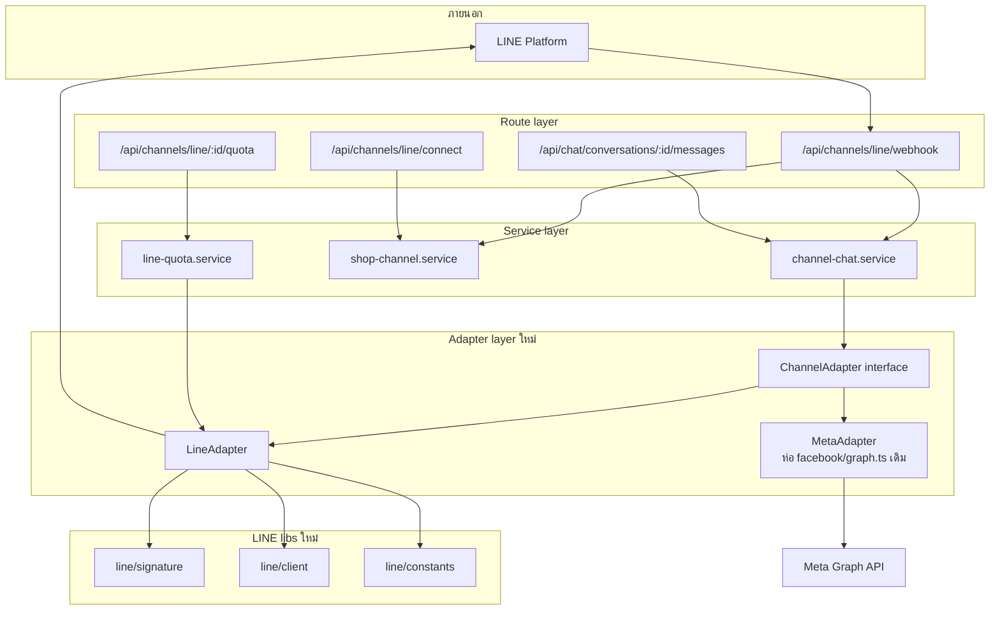
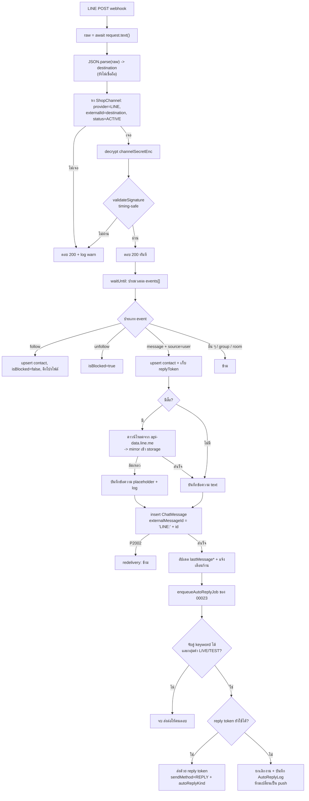
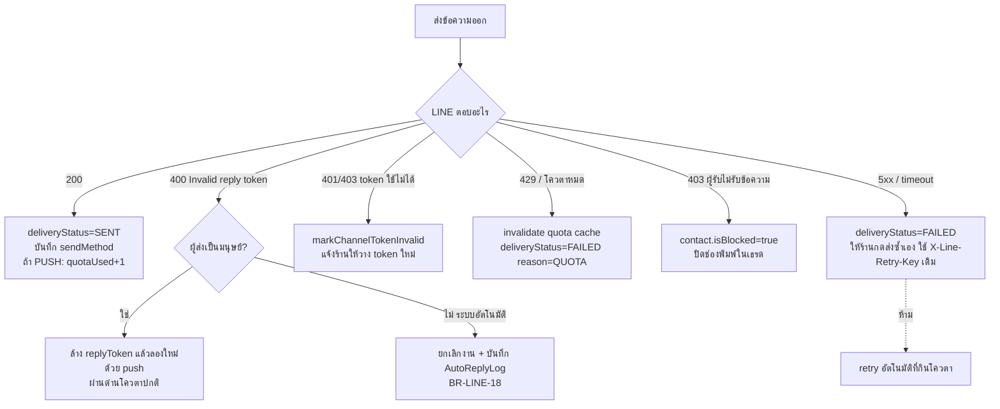

> **โมดูล:** M00025-LineOaChatIntegration
> **ประเภทเอกสาร:** System Design Spec (SDS)
> **เวอร์ชัน:** 1.1
> **วันที่จัดทำ:** 2026-07-26
> **สถานะ:** Draft — รอ user review
>
> 🔄 **v1.1 (2026-07-31) — sync กับของจริงบน main:** `00023 - Chat Auto-Reply` ขึ้นโค้ดบน production ไปแล้ว (6 service + 10 route + cron sweeper รายวัน + คอลัมน์ `Conversation.autoReply*` / `ChatMessage.autoReplyKind`) เอกสารรอบนี้จึงเปลี่ยน FR-LINE-08 เป็น **"เสียบ LINE เข้าเครื่องยนต์ auto-reply ของ 00023"** และตัดฟิลด์ที่ซ้ำกับของเดิมออก. เดิมจองเลข 00021 — renumber เป็น **00025**
> **เจ้าของเอกสาร:** safepay-planner (ดู [[Feature-Docs-Ownership]])

---

# SDS: LINE OA Chat Integration (System Design Spec)

---

## 1. บทนำ & References

### 1.1 วัตถุประสงค์

อธิบายว่า **จะสร้างอย่างไร** — โครงไฟล์ ความรับผิดชอบของแต่ละส่วน ลำดับข้อมูล จุดเชื่อมภายนอก และเหตุผลเบื้องหลังการตัดสินใจเชิงออกแบบที่สำคัญ เพื่อให้ developer ลงมือได้โดยไม่ต้องเดา

### 1.2 ขอบเขตการออกแบบ

ครอบคลุมชั้น adapter, webhook, outbound pipeline, quota, UI ที่ต้องแตะ และลำดับการ implement
ไม่ครอบคลุม: Module Channel OAuth (Phase 2), broadcast, กลุ่ม/ห้อง

### 1.3 เอกสารอ้างอิง

[[SRS]] (TFR/NFR), [[DATABASE]] (คอลัมน์), [[API]] (สัญญา endpoint), [[../00018 - Facebook Chat Integration/SDS]] (โครงเดิมที่ต่อยอด), `docs/conventions/paces-toast.md`, `docs/conventions/no-emoji-use-icons.md`

---

## 2. Architecture Overview

### 2.1 มุมมองสถาปัตยกรรม

**หลักการจัดชั้น:**
- **route** ไม่มี business logic — ทำแค่ auth, parse, เรียก service, map error เป็น HTTP
- **service** เป็นเจ้าของ transaction และกฎธุรกิจ ไม่รู้จักรายละเอียดของ provider ใด ๆ
- **adapter** เป็นที่เดียวที่รู้ว่า LINE/Meta พูดกันอย่างไร — service เรียกผ่าน interface เท่านั้น
- **lib** เป็นฟังก์ชันบริสุทธิ์/HTTP client ไม่แตะ DB

### 2.2 มุมมองการ Deploy

ไม่มี infrastructure ใหม่ — Vercel Fluid Compute, Node.js runtime, Postgres เดิม
สิ่งเดียวที่ต้องแก้นอกโค้ดฟีเจอร์: เพิ่ม `/api/channels/line/webhook` ในรายการยกเว้น Origin-check ของ `src/proxy.ts`

---

## 3. Component Design

| Component | ไฟล์ (เสนอ) | ความรับผิดชอบ | ห้ามทำ |
|-----------|-------------|----------------|--------|
| **ChannelAdapter** | `src/lib/channels/adapter.ts` | ประกาศ interface + `capabilities` ของแต่ละ provider | ไม่มี implementation, ไม่ import provider ใด |
| **MetaAdapter** | `src/lib/channels/meta-adapter.ts` | ห่อฟังก์ชันเดิมใน `lib/facebook/graph.ts` ให้เข้ารูป interface | ห้ามแก้ logic เดิมแม้แต่บรรทัดเดียวในรอบ refactor |
| **LineAdapter** | `src/lib/channels/line-adapter.ts` | reply/push, ดึงโปรไฟล์, ดาวน์โหลดสื่อ, อ่านโควตา, map error | ไม่แตะ Prisma โดยตรง |
| **line/signature.ts** | `src/lib/line/signature.ts` | `validateSignature(rawBody, secret, header)` — HMAC-SHA256 + `timingSafeEqual` | ห้ามใช้ `===` เทียบ signature |
| **line/client.ts** | `src/lib/line/client.ts` | fetch wrapper: Bearer, timeout, `X-Line-Retry-Key`, แปลง error body ของ LINE เป็น error type ภายใน | ห้าม log token/secret |
| **line/constants.ts** | `src/lib/line/constants.ts` | `API_BASE`, `DATA_API_BASE`, `REPLY_WINDOW_MS = 60_000`, `REPLY_SAFETY_MARGIN_MS = 5_000`, `MAX_PARTS = 5`, `QUOTA_TTL_MS = 300_000`, `AUTO_REPLY_DEADLINE_MS = 40_000` | ห้ามกระจายค่าคงที่เหล่านี้ไปไฟล์อื่น |
| **line-quota.service** | `src/services/line-quota.service.ts` | อ่าน/แคช/invalidate โควตา | ห้ามบล็อกการส่งเมื่ออ่านค่าไม่ได้ |
| **channel-chat.service** | เดิม | เพิ่ม dispatch ตาม `provider` ที่จุดเดียว + ตรรกะ reply/push | ห้ามมี `if (provider === 'LINE')` กระจายหลายจุด |
| **shop-channel.service** | เดิม | รองรับ `channelSecretEnc`, `basicId`, สถานะช่องทาง LINE | ห้ามให้ secret/token หลุดออกจากไฟล์ในรูป plaintext |
| **webhook route** | `src/app/api/channels/line/webhook/route.ts` | verify → ตอบ 200 → `waitUntil(ingest)` | ห้ามทำงานหนักก่อนตอบ 200 |
| **UI: หน้าเชื่อม** | `(paces)/seller/(dashboard)/settings/channels/*` | การ์ด LINE + wizard วาง credential + คู่มือ | Paces primitive เท่านั้น (Hard Rule 7), `pacesToast` (Hard Rule 9), Swal สำหรับ confirm |
| **UI: อินบ็อกซ์** | `(paces)/seller/(chat)/inbox/*` | badge LINE, Quota Meter, สถานะหน้าต่างฟรี, ตัวชี้ AI | ห้าม emoji (Hard Rule 12), ต้องผ่าน `safepay-ux` ก่อน (Hard Rule 8) |

---

## 4. Data Flow

### 4.1 Flow หลัก: ข้อความขาเข้า

### 4.2 Flow กรณีล้มเหลว / ชดเชย

**หลักการชดเชยที่ยึด:** ระบบไม่ retry เองในทางที่ทำให้เกิดค่าใช้จ่าย การกดส่งซ้ำเป็นการตัดสินใจของคนเสมอ และการส่งซ้ำต้องใช้ `X-Line-Retry-Key` เดิมเพื่อไม่ให้ลูกค้าได้ข้อความซ้ำและไม่ให้โควตาถูกหักสองครั้ง

---

## 5. Integration Points

| จุดเชื่อม | ทิศทาง | สัญญา | ความล้มเหลวที่ต้องรองรับ |
|-----------|--------|-------|--------------------------|
| LINE webhook | เข้า | HTTPS POST + `x-line-signature` | ลายเซ็นปลอม, redelivery, event ที่ไม่รองรับ |
| `/v2/bot/info` | ออก | ตอนเชื่อม/health check | 401 = token ผิด |
| `/v2/bot/message/reply` | ออก | `{replyToken, messages[≤5]}` | token หมดอายุ/ถูกใช้แล้ว |
| `/v2/bot/message/push` | ออก | `{to, messages[≤5]}` + retry key | โควตาหมด, ผู้รับบล็อก |
| `/v2/bot/message/quota[/consumption]` | ออก | อ่านโควตา | อ่านไม่ได้ = ไม่บล็อกการส่ง |
| `/v2/bot/profile/{userId}` | ออก | โปรไฟล์ผู้ติดต่อ | 404 = ไม่ได้เป็นเพื่อน → ใช้ชื่อสำรอง |
| `api-data.line.me/.../content` | ออก | binary | ไฟล์หมดอายุ/ขนาดเกิน → placeholder |
| Supabase storage | ออก | อัปโหลดสื่อที่ mirror | MIME/ขนาดไม่ผ่าน → placeholder + log (บทเรียน 00018) |
| auto-reply 00023 | ภายใน | `enqueueAutoReplyJob` + `processPendingForConversation` | เกิน deadline → ยกเลิก + บันทึก log (ไม่มี fallback เพราะ cron รายวัน) |
| `src/proxy.ts` | ภายใน | ยกเว้น Origin-check ของ webhook path | ลืม = 403 ทั้งหมด |

---

## 6. Technical Decisions

### TD-001: เชื่อมแบบ "ร้านวาง credential เอง" แทน Module Channel OAuth

**บริบท:** LINE มีสองทางให้ระบบภายนอกเข้าถึง OA ของร้าน — ให้ร้านสร้าง Messaging API channel เองแล้ววาง key หรือใช้ Module Channel ที่เป็น OAuth กดปุ่มเดียว

**ตัดสิน:** ใช้วิธีวาง credential ใน MVP

**เหตุผล:** Module Channel ต้องเป็น LINE Technology Partner (สมัคร + ต้องมีลูกค้าใช้ LINE อย่างน้อย 1 ราย + สัมภาษณ์ + เซ็นสัญญากับ LINE Thailand) ซึ่งเป็น gate แบบเดียวกับที่ทำให้ 00020 TikTok ค้างอยู่ การรอ gate ก่อนเริ่มแปลว่าไม่ได้ปล่อยอะไรเลย ขณะที่วิธีวาง credential ปล่อยได้ทันที และการมีร้านใช้จริงกลับกลายเป็นคุณสมบัติที่ทำให้สมัคร Partner ผ่านง่ายขึ้น

**ผลที่ตามมา:** UX ตอนเชื่อมด้อยกว่าคู่แข่งที่เป็น Partner แล้ว — ต้องชดเชยด้วยคู่มือที่ดีมากในหน้าเดียว และต้องวัด KPI อัตราเชื่อมสำเร็จเพื่อใช้ตัดสินใจว่าจะลงทุนกับ Phase 2 เมื่อไร

**สิ่งที่ต้องเผื่อไว้:** `LineAdapter` ต้องไม่ผูกกับวิธีได้มาซึ่ง token — การเปลี่ยนเป็น Module Channel ต้องแตะแค่ route `connect` และการเก็บ token ไม่แตะ webhook/outbound/schema

### TD-002: parse `destination` ก่อน แล้วค่อย verify ลายเซ็น

**บริบท:** ปกติเราจะ verify ลายเซ็นก่อนแตะ payload แต่ระบบนี้เป็น multi-tenant ที่ secret ต่างกันต่อร้าน — จึงต้องรู้ก่อนว่าจะใช้ secret ตัวไหน และข้อมูลนั้นอยู่ใน payload ที่ยังไม่ได้ verify

**ตัดสิน:** parse เพื่ออ่าน `destination` ได้ แต่ใช้ได้เพียงเพื่อ "เลือก secret" เท่านั้น ห้ามเขียน DB ห้ามเรียก API ภายนอก ห้าม log เนื้อหา จนกว่าจะ verify ผ่าน

**เหตุผล:** การอ่านค่าเพื่อเลือกกุญแจไม่ใช่การเชื่อข้อมูล ตราบใดที่ผลลัพธ์ของการเลือกผิดคือ "verify ไม่ผ่าน" ซึ่งจบที่การทิ้ง event อยู่แล้ว ความเสี่ยงที่เหลือคือ enumeration ของ botUserId ซึ่งเป็นค่าที่ไม่เป็นความลับอยู่แล้ว

**ต้องมีเทสยืนยัน:** ยิง payload ที่ `destination` ถูกแต่ลายเซ็นผิด แล้วต้องพิสูจน์ว่า **ไม่มีแถวใดถูกเขียน** และ **ไม่มี outbound call**

### TD-003: ตอบ 200 ทันที แล้วทำงานหนักใน `waitUntil`

**บริบท:** LINE ยิงซ้ำเมื่อไม่ได้ 2xx และ reply token มีอายุ 1 นาที — งาน ingest (mirror สื่อ + AI) ใช้เวลาหลายวินาที

**ตัดสิน:** verify แล้วตอบ 200 ทันที งานที่เหลือรันใน `waitUntil` ของ Vercel Fluid Compute

**ทางเลือกที่ไม่เลือก:** (ก) ทำงานให้จบก่อนตอบ — เสี่ยง timeout และ redelivery ซ้อน (ข) ต่อ queue ภายนอก — เกินความจำเป็นสำหรับปริมาณระดับนี้ และเพิ่ม infra ที่ต้องดูแล

**ความเสี่ยงที่ยอมรับ:** ถ้า `waitUntil` ถูกตัดกลางคัน ข้อความนั้นหาย โดยที่ LINE จะไม่ยิงซ้ำ (เพราะเราตอบ 200 ไปแล้ว) — ยอมรับได้เพราะโอกาสต่ำ และการทำให้ redelivery เยอะแทนสร้างปัญหาที่หนักกว่า **แต่ต้อง log ระดับ error เพื่อให้จับได้ว่าเคยเกิด**

### TD-004: batching เกิดที่ฝั่ง client ไม่ใช่ timer ฝั่ง server

**บริบท:** LINE นับโควตาต่อผู้รับไม่ใช่ต่อ message object → รวม ≤5 ชิ้นในหนึ่ง request = ประหยัดจริง แต่การรอรวมต้องมีใครสักคน "ถือของไว้" สักครู่

**ตัดสิน:** composer ฝั่ง client รวบข้อความที่ผู้ใช้พิมพ์ติดกันด้วย debounce สั้น ๆ แล้วยิงเป็น request เดียวที่มี `parts[]`; API รับ array เป็นสัญญาหลัก

**เหตุผล:** serverless ไม่มี process ค้างให้ตั้ง timer — การทำ server-side batching ต้องมี queue/cron ซึ่งเพิ่ม latency และ infra โดยได้ประโยชน์เท่ากัน ส่วน client รู้เจตนาผู้ใช้ดีที่สุดอยู่แล้ว (กำลังพิมพ์ต่อหรือส่งจบ)

**ผลที่ตามมา:** ต้องออกแบบ composer ให้ผู้ใช้เข้าใจว่า "กำลังจะส่งรวมกัน" โดยไม่รู้สึกว่าระบบหน่วง — งานนี้ต้องผ่าน `safepay-ux` ก่อน

### TD-005: ใส่ prefix `LINE:` ให้ `externalMessageId`

**บริบท:** คอลัมน์นี้ unique ทั้งตารางและใช้ร่วมกับ mid ของ Meta อยู่แล้ว

**ตัดสิน:** เก็บเป็น `'LINE:' + event.message.id`

**เหตุผล:** id ของสองแพลตฟอร์มมาจาก namespace ที่ต่างกันโดยสิ้นเชิง การชนกันแม้จะไม่น่าเกิดก็จะแสดงออกเป็น "ข้อความหายเงียบ" ซึ่งเป็นบั๊กที่แพงมากในการหาสาเหตุ prefix ทำให้เป็นไปไม่ได้ตั้งแต่แรก

**ข้อควรระวัง:** ต้องสร้าง key นี้ที่ฟังก์ชันเดียวใน adapter ห้ามประกอบ string เองตามที่ต่าง ๆ

### TD-006: quota cache 5 นาที และ "อ่านไม่ได้ = ปล่อยผ่าน"

**บริบท:** ถ้าอ่านโควตาทุกครั้งที่ส่ง จะเพิ่ม round-trip 2 ครั้งต่อข้อความ

**ตัดสิน:** cache บนแถว `ShopChannel` TTL 5 นาที, invalidate ทันทีเมื่อส่ง push สำเร็จหรือเมื่อ LINE ปฏิเสธเพราะโควตา; ถ้าอ่านโควตาไม่สำเร็จ **ไม่บล็อก** ให้ปล่อยไปให้ LINE ตัดสิน

**เหตุผล:** การบล็อกด้วยข้อมูลที่เราอ่านไม่ได้ = ระบบเราล่มทำให้ร้านตอบลูกค้าไม่ได้ ซึ่งแย่กว่าการปล่อยแล้วโดน LINE ปฏิเสธ (ซึ่งจัดการได้ด้วย error path ที่มีอยู่แล้ว)

**ผลที่ตามมา:** ตัวเลขที่แสดงอาจคลาดเคลื่อนได้ถึง 5 นาที — UI ต้องสื่อว่าเป็นค่าโดยประมาณ ไม่ใช่ยอดบิล

### TD-007: ระบบอัตโนมัติห้ามก่อ push เด็ดขาด

**บริบท:** งานตอบอัตโนมัติอาจพ้นหน้าต่าง 1 นาที ทางที่ง่ายที่สุดคือ fallback ไป push (และ `auto-reply-send.service.ts` ของ 00023 ก็เคยเจอแรงกดดันเดียวกัน — มันเลือก "ส่ง inline ห้ามโยนให้ sweeper" เพราะ cron เป็นรายวัน)

**ตัดสิน:** ห้าม — งานตอบอัตโนมัติที่พ้นหน้าต่าง reply ให้ยกเลิกแล้วบันทึกเหตุผลลง `AutoReplyLog` ของ 00023 และห้าม retry อัตโนมัติที่กินโควตาในทุกกรณี

**เหตุผล:** push คือเงินของร้าน ระบบอัตโนมัติที่ใช้เงินคนอื่นโดยไม่มีคนตัดสินใจเป็นสิ่งที่ผู้ใช้ให้อภัยยากที่สุดเมื่อเกิดขึ้นแล้ว และตรวจจับยากเพราะมันทำงาน "ถูกต้อง" ตามโค้ด

**บังคับด้วย:** NFR-8 (จำนวน push ที่ไม่มี actor เป็นมนุษย์ต้องเป็น 0) + test case เฉพาะใน [[TestCase]]

### TD-008: ใช้ `capabilities` object แทน `if (provider === ...)`

**บริบท:** LINE ไม่มี echo, ไม่มี read receipt, มีหน้าต่างฟรี 1 นาที ขณะที่ Meta มี echo/read receipt และหน้าต่าง 24 ชั่วโมง

**ตัดสิน:** ประกาศความสามารถเป็นข้อมูลบน adapter (`{ echo, readReceipt, freeWindowMs, maxPartsPerRequest }`) แล้วให้ service/UI อ่านจากตรงนั้น

**เหตุผล:** ถ้ากระจาย `if (provider === 'LINE')` ตามโค้ด การเพิ่ม provider ที่สี่ (TikTok 00020) จะต้องไล่แก้ทุกจุดและจะลืมบางจุดแน่นอน — บทเรียนตรงจากสิ่งที่ 00020 บันทึกไว้

### TD-009: เก็บ replyToken บน `Conversation` ไม่ใช่ตารางแยก

**บริบท:** reply token ผูกกับ event ไม่ใช่กับเธรด ในทางทฤษฎีหนึ่งเธรดอาจมีหลาย token ที่ยังไม่หมดอายุพร้อมกัน

**ตัดสิน:** เก็บแค่ token ล่าสุดบนแถว `Conversation` ทับของเดิมเสมอ

**เหตุผล:** อายุ 1 นาทีทำให้จำนวน token ที่ยังใช้ได้พร้อมกันแทบเป็น 1 เสมอ และ token ล่าสุดคือตัวที่มีเวลาเหลือมากที่สุด การมีตารางแยกเพิ่มความซับซ้อนโดยได้ประโยชน์ที่วัดไม่ได้

**ข้อควรระวัง:** ต้อง mark `replyTokenUsedAt` ใน transaction ก่อนยิง LINE ไม่งั้น concurrent send สองอันจะใช้ token เดียวกันแล้วอันหลังพัง

---

## 7. ลำดับการ implement (Build Order)

> Phase ≥3 tasks → ต้องใช้ agent team ตาม Hard Rule 4

| ลำดับ | งาน | เหตุผลที่ต้องอยู่ตำแหน่งนี้ | commit แยก |
|-------|-----|------------------------------|------------|
| **S-1** | refactor `ChannelAdapter` + `MetaAdapter` (ไม่เปลี่ยน behavior) | ต้องเสร็จและ regression 00018 ผ่าน 100% ก่อนแตะอะไรเกี่ยวกับ LINE | ✔ |
| **S-2** | migration + schema (15 คอลัมน์) | ทุกงานหลังจากนี้ต้องมีคอลัมน์รองรับ | ✔ |
| **S-3** | `lib/line/*` (signature, client, constants) + unit test | เป็นฐานของ adapter | ✔ |
| **S-4** | `LineAdapter` + unit test (mock HTTP) | ยังไม่ต่อ route | ✔ |
| **S-5** | route `connect` + `shop-channel.service` รองรับ LINE | ต้องเชื่อมได้ก่อนถึงจะทดสอบ webhook จริง | ✔ |
| **S-6** | webhook route + ingest (text ก่อน) + proxy exemption | แกนขาเข้า | ✔ |
| **S-7** | ingest สื่อ + mirror + placeholder | ต่อยอด S-6 | ✔ |
| **S-8** | outbound reply/push + `sendMethod` + error mapping | แกนขาออก | ✔ |
| **S-9** | quota service + route + invalidate | ต้องมีก่อน UI Quota Meter | ✔ |
| **S-10** | batching (`parts[]` ที่ API + composer) | ต้องมี S-8 ก่อน | ✔ |
| **S-11** | follow/unfollow + `isBlocked` | ✔ |
| **S-12** | เสียบ LINE เข้า auto-reply ของ 00023 (`enqueueAutoReplyJob` + `processPendingForConversation`) | **ต้องมี spike พิสูจน์ deadline ก่อนเริ่ม** + ห้ามแตะตรรกะจับคู่ของ 00023 | ✔ |
| **S-13** | UI หน้าเชื่อม (wizard + คู่มือ + คำเตือน 2 ข้อ) | ต้องผ่าน `safepay-ux` ก่อน | ✔ |
| **S-14** | UI อินบ็อกซ์ (badge, Quota Meter, สถานะหน้าต่างฟรี, ตัวชี้ AI) | ต้องผ่าน `safepay-ux` ก่อน | ✔ |
| **S-15** | E2E Playwright + regression suite | ก่อน merge | ✔ |

**Gate ที่ห้ามข้าม:** S-1 ต้องเขียวก่อน S-3 เป็นต้นไป; S-12 ต้องมีผล spike ก่อน; S-13/S-14 ต้องมี Design Spec จาก `safepay-ux` ก่อนแตะโค้ด frontend (Hard Rule 8) และต้องรัน Impeccable CLI เป็น gate ก่อน mark complete

---

## 8. Traceability

| TFR (SRS) | Component / TD |
|-----------|----------------|
| TFR-LINE-01 | route `connect`, `shop-channel.service`, TD-001 |
| TFR-LINE-02 | webhook route, `line/signature`, TD-002 |
| TFR-LINE-03 | webhook route + `waitUntil`, TD-003 |
| TFR-LINE-04 | `LineAdapter` (key builder), TD-005 |
| TFR-LINE-05 | `channel-chat.service`, `Conversation.replyToken*`, TD-009 |
| TFR-LINE-06 | `channel-chat.service` outbound pipeline |
| TFR-LINE-07 | `line-quota.service`, TD-006 |
| TFR-LINE-08 | messages route (`parts[]`) + composer, TD-004 |
| TFR-LINE-09 | `LineAdapter.downloadContent` + storage |
| TFR-LINE-10 | `LineAdapter.fetchContactProfile` |
| TFR-LINE-11 | webhook follow/unfollow handler |
| TFR-LINE-12 | AI hook ใน `waitUntil`, TD-007 |
| TFR-LINE-13 | `ChannelAdapter` interface, TD-008 |

---

## 9. สรุป (Summary)

การออกแบบนี้แบ่งงานเป็นสองก้อนที่แยกความเสี่ยงออกจากกันชัดเจน: **ก้อนแรกคือ refactor adapter ที่ไม่เปลี่ยนพฤติกรรมใด ๆ** (S-1) ซึ่งเป็นจุดเดียวที่แตะระบบที่ร้านใช้งานจริงอยู่ทุกวัน และ **ก้อนที่สองคือ LINE ทั้งหมด** ซึ่งเป็นของใหม่ล้วนที่พังก็ไม่กระทบใคร การเรียงลำดับแบบนี้ทำให้ถ้าเกิดปัญหาระหว่างทาง เราตัดก้อนที่สองทิ้งได้โดยไม่ต้อง revert อะไรเลย

การตัดสินใจที่ควรถูกท้าทายมากที่สุดคือ **TD-007 (ห้ามระบบส่ง push เอง)** เพราะมันแลกความสะดวกของผู้ใช้กับหลักการเรื่องการใช้เงินคนอื่น — ถ้าผู้ใช้ต้องการ ควรทำเป็น opt-in ที่ชัดเจนพร้อมเพดานต่อวัน ไม่ใช่เปลี่ยนเป็นพฤติกรรมเริ่มต้น

**สิ่งที่เปลี่ยนไปใน v1.1 และมีผลต่อความเสี่ยงโดยรวม:** การที่เครื่องยนต์ตอบอัตโนมัติ (00023) มีอยู่แล้วและ **ไม่มี AI ในเส้นทางส่ง** ทำให้ความเสี่ยงเรื่อง "ตอบไม่ทันหน้าต่าง 1 นาที" ลดลงมาก (จับคู่ keyword เร็วกว่าการเรียกโมเดลหลายเท่า) แต่เพิ่มข้อจำกัดใหม่เข้ามาแทน: **cron ของโปรเจกต์เป็นรายวัน จึงไม่มี fallback ใด ๆ สำหรับงานที่พลาดเส้นทาง inline** — บน Messenger งานที่พลาดยังรอ sweeper ข้ามวันได้ (ช้าแต่ถึง) บน LINE คือพลาดถาวร ต้องออกแบบให้ร้านเห็นทันทีว่าพลาด ไม่ใช่ปล่อยค้างเป็นงานที่ดูเหมือนจะได้ส่ง
