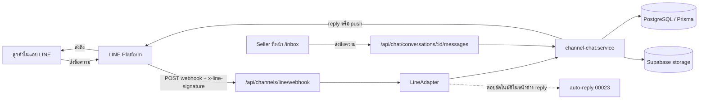
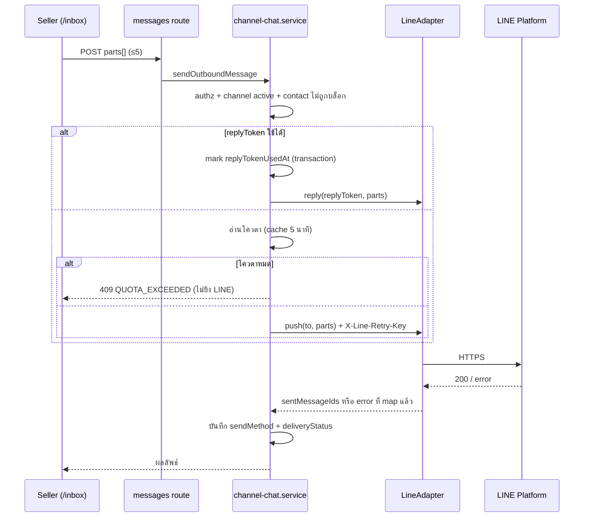

> **โมดูล:** M00025-LineOaChatIntegration
> **ประเภทเอกสาร:** Software Requirements Specification (SRS — Technical)
> **เวอร์ชัน:** 1.1
> **วันที่จัดทำ:** 2026-07-26
> **สถานะ:** Draft — รอ user review
>
> 🔄 **v1.1 (2026-07-31) — sync กับของจริงบน main:** `00023 - Chat Auto-Reply` ขึ้นโค้ดบน production ไปแล้ว (6 service + 10 route + cron sweeper รายวัน + คอลัมน์ `Conversation.autoReply*` / `ChatMessage.autoReplyKind`) เอกสารรอบนี้จึงเปลี่ยน FR-LINE-08 จาก "AI ตอบเอง" เป็น **"เสียบ LINE เข้าเครื่องยนต์ auto-reply ของ 00023"** และตัดฟิลด์ที่ซ้ำกับของเดิมออก. เดิมจองเลข 00021 — renumber เป็น **00025**
> **เจ้าของเอกสาร:** Planner/Architect (ดู [[Feature-Docs-Ownership]])

---

# SRS: LINE OA Chat Integration (Software Requirements Specification — Technical)

---

## 1. บทนำ (Introduction)

### 1.1 วัตถุประสงค์ของเอกสาร

แปลง FR/BR ใน [[PRD]] และ [[BRD]] เป็นข้อกำหนดเชิงเทคนิคที่ implement ได้โดยไม่ต้องตีความเพิ่ม — ครอบคลุมสถาปัตยกรรม, สัญญา interface, data model, NFR และความเสี่ยงเชิงสถาปัตยกรรม

### 1.2 ขอบเขตเชิงระบบ (System Scope)

**อยู่ในขอบเขต:** provider adapter layer สำหรับช่องทางแชทภายนอก, webhook รับ event จาก LINE, การส่งข้อความออก (reply/push) พร้อมกลไกประหยัดโควตา, การเชื่อม/ถอด LINE OA แบบวาง credential, Quota Meter, การ mirror สื่อ, AI auto-reply ในหน้าต่าง reply token

**นอกขอบเขต:** Module Channel OAuth, broadcast/multicast/narrowcast, rich menu/LIFF, group/room chat, Mark-as-Read API, Flex Message (ดู [[PRD]] §5)

### 1.3 เอกสารอ้างอิง (References)

| เอกสาร | ใช้อ้างอิงเรื่อง |
|--------|-----------------|
| [[PRD]] / [[BRD]] | FR-LINE-01..14, BR-LINE-01..23 |
| [[../00018 - Facebook Chat Integration/SRS]] | โครง `ShopChannel`/`ExternalContact`/`Conversation` ที่ต่อยอด |
| [[../00023 - Chat Auto-Reply/SRS]] | เครื่องยนต์ตอบอัตโนมัติ: `enqueueAutoReplyJob` / `processPendingForConversation` / `AutoReplyJob` / `autoReplyKind` |
| [[../00019 - AI Reply Assistant/SRS]] | สัญญาเรียก AI (เส้นทาง "ร่างให้คนกดส่ง" เท่านั้น) + กฎ PII |
| `docs/SRS.md` (product-level) | data model กลาง, authorization matrix |
| `docs/conventions/prisma-shared-db-drift.md` | กติกา migration บน DB ที่ dev=prod แชร์กัน |
| LINE Messaging API (`developers.line.biz`) | สัญญาฝั่งภายนอกทั้งหมด |

### 1.4 นิยามและตัวย่อ (Definitions & Acronyms)

| ตัวย่อ | ความหมาย |
|--------|----------|
| **OA** | LINE Official Account |
| **botUserId** | user ID ของ OA (ค่าเดียวกับฟิลด์ `destination` ใน webhook) — ใช้เป็น `ShopChannel.externalId` |
| **replyToken** | token ตอบกลับ อายุ 1 นาที ใช้ครั้งเดียว ไม่นับโควตา |
| **push** | `POST /v2/bot/message/push` — นับโควตา 1 ต่อผู้รับ 1 คน |
| **adapter** | ชั้นนามธรรมของช่องทางภายนอก (`ChannelAdapter`) ที่ Messenger/IG/LINE implement |

---

## 2. ภาพรวมสถาปัตยกรรม (Architecture Overview)

### 2.1 บริบทระบบ (System Context)



### 2.2 องค์ประกอบหลัก (Components)

| องค์ประกอบ | ที่อยู่ (เสนอ) | หน้าที่ |
|-----------|----------------|--------|
| **ChannelAdapter (interface)** | `src/lib/channels/adapter.ts` | สัญญากลางของทุกช่องทาง: `sendMessages`, `fetchContactProfile`, `downloadContent`, `capabilities` |
| **MetaAdapter** | `src/lib/channels/meta-adapter.ts` | ห่อ `src/lib/facebook/graph.ts` เดิม — ไม่เปลี่ยน behavior |
| **LineAdapter** | `src/lib/channels/line-adapter.ts` | เรียก LINE Messaging API ทั้งหมด |
| **line/signature** | `src/lib/line/signature.ts` | HMAC-SHA256 + timing-safe compare |
| **line/client** | `src/lib/line/client.ts` | HTTP client + error mapping ของ LINE |
| **line/constants** | `src/lib/line/constants.ts` | base URL, `REPLY_WINDOW_MS`, `MAX_MESSAGES_PER_REQUEST` |
| **webhook route** | `src/app/api/channels/line/webhook/route.ts` | รับ event, verify, ตอบ 200 เร็ว, งานหนักไป `waitUntil` |
| **connect route** | `src/app/api/channels/line/connect/route.ts` | verify credential + สร้าง `ShopChannel` |
| **quota route** | `src/app/api/channels/line/[channelId]/quota/route.ts` | อ่านโควตา (มี cache) |
| **channel-chat.service** | เดิม | ingest/outbound — เพิ่ม dispatch ผ่าน adapter |
| **shop-channel.service** | เดิม | เพิ่มรองรับ provider `LINE` + `channelSecretEnc` |

### 2.3 มุมมองการ Deploy (Deployment View)

- รันบน Vercel (Fluid Compute, Node.js runtime) — เหมือนของเดิมทั้งหมด ไม่มี service ใหม่
- webhook เป็น route เดียวของทั้งระบบ ทุกร้านใช้ URL เดียวกัน (`https://deepthailand.app/api/channels/line/webhook`)
- งานหลัง-ตอบ-200 ใช้ `waitUntil` จาก `@vercel/functions` (ไม่ใช้ queue ภายนอกใน MVP)
- ต้องเพิ่ม path นี้ในรายการยกเว้น Origin-check ของ `src/proxy.ts` (บรรทัดที่ยกเว้น `/api/channels/facebook/webhook` อยู่แล้ว) — **ถ้าลืมข้อนี้ webhook จะโดน 403 ทั้งหมด**

---

## 3. ข้อกำหนดเชิงฟังก์ชันเชิงเทคนิค (Technical Functional Requirements)

### TFR-LINE-01: ตรวจสอบและบันทึก credential ตอนเชื่อม

- รับ `channelSecret` + `channelAccessToken` จาก body (server-side เท่านั้น ห้าม log)
- เรียก `GET /v2/bot/info` ด้วย token → ได้ `userId` (= botUserId), `basicId`, `displayName`, `pictureUrl`, `chatMode`, `markAsReadMode`
- ตรวจ `channelSecret` ว่าเป็น hex/ความยาวตามรูปแบบก่อนยิง (ไม่ใช่ validation เชิงความปลอดภัย แค่กันพิมพ์ผิด)
- 401/403 จาก LINE → `TOKEN_INVALID` ไม่บันทึกอะไร
- สร้างแถวด้วย `provider='LINE'`, `externalId=userId`, `accessTokenEnc=encryptToken(token)`, `channelSecretEnc=encryptToken(secret)`
- P2002 จาก partial unique index → แยกเป็น "ร้านเดิมเชื่อมซ้ำ" (ไม่ถือเป็น error) กับ "ร้านอื่นยึดอยู่" (ปฏิเสธพร้อมชื่อร้าน) — ใช้ตรรกะเดียวกับ `connectPages` ของ 00018
- ถ้า `chatMode !== 'bot'` → บันทึกได้ แต่ต้องคืน warning ให้ UI แสดง (ไม่บล็อก — ร้านอาจตั้งใจใช้ทั้งสองโหมด)

**อ้างอิง:** FR-LINE-01, BR-LINE-01/02/03/04

### TFR-LINE-02: รับ webhook และตรวจลายเซ็น

ลำดับบังคับ (ห้ามสลับ):
1. `const raw = await request.text()` — ต้องได้ raw body ก่อน parse เสมอ (HMAC คำนวณบน byte จริง)
2. `JSON.parse(raw)` → อ่าน `destination` — **ข้อมูลนี้ยังไม่ถือว่าเชื่อถือได้ ใช้ได้เพียงเพื่อค้นหา channel**
3. `getChannelByExternalId('LINE', destination)` — ไม่เจอ/ไม่ ACTIVE → ตอบ 200 + log warn แล้วจบ
4. `validateSignature(raw, decryptToken(channel.channelSecretEnc), header['x-line-signature'])` — ไม่ผ่าน → ตอบ 200 + log warn แล้วจบ **ห้ามเขียน DB ห้ามเรียก LINE**
5. ผ่านแล้วจึงประมวลผล `body.events[]`

**อ้างอิง:** FR-LINE-02, BR-LINE-05/06

### TFR-LINE-03: ตอบ 200 เร็ว + ทำงานหนักเบื้องหลัง

- route ต้องคืน `200` ทันทีหลังผ่านขั้นที่ 4 ของ TFR-LINE-02
- งาน ingest (บันทึกข้อความ, mirror สื่อ, ดึงโปรไฟล์, AI auto-reply) รันใน `waitUntil(...)`
- error ภายใน `waitUntil` ห้าม throw ออกไปเปลี่ยนสถานะ HTTP
- error ระดับ infra (DB ล่ม) → ต้อง log ระดับ error เพื่อให้มี alert แต่ยังคืน 200 (LINE retry ไม่ช่วยถ้า DB ล่ม และจะกลายเป็น event ซ้ำ)

**อ้างอิง:** FR-LINE-02, BR-LINE-06/07, NFR-2

### TFR-LINE-04: Idempotency ของ event

- ข้อความ: `ChatMessage.externalMessageId = 'LINE:' + event.message.id` (มี prefix กัน namespace ชนกับ mid ของ Meta) — unique constraint เดิมทำหน้าที่ dedup
- P2002 ตอน insert → ถือว่าเป็น redelivery ให้ข้ามอย่างเงียบ ๆ คืนสถานะ `DUPLICATE`
- event ที่ไม่ใช่ข้อความ (follow/unfollow) เป็น idempotent โดยธรรมชาติ (upsert สถานะ) ไม่ต้อง dedup แยก
- `deliveryContext.isRedelivery === true` ใช้เพื่อ log/สังเกตการณ์เท่านั้น ไม่ใช้เป็นเงื่อนไขตัดสิน (ต้องทน redelivery ที่ไม่ได้ตั้ง flag ด้วย)

**อ้างอิง:** FR-LINE-02, BR-LINE-07

### TFR-LINE-05: จัดเก็บและใช้ replyToken

- ทุก event ที่ผ่าน verify และมี `replyToken` → เขียนลง `Conversation.replyToken`, `replyTokenExpiresAt = event.timestamp + 60s`, `replyTokenUsedAt = null` (ทับค่าเดิมเสมอ — token ล่าสุดคือตัวที่ใช้ได้)
- ก่อนส่งขาออก ถือว่าใช้ reply ได้เมื่อ: `replyToken != null` **และ** `replyTokenUsedAt == null` **และ** `now < replyTokenExpiresAt - SAFETY_MARGIN`
- `SAFETY_MARGIN = 5s` — กันกรณี clock skew และ latency ของ round-trip ไป LINE
- ทำเครื่องหมาย `replyTokenUsedAt = now()` ใน transaction เดียวกับการสร้าง `ChatMessage` **ก่อน** ยิง LINE (เพื่อไม่ให้ concurrent send สองอันแย่งใช้ token เดียวกัน) ถ้ายิงล้มเหลวเพราะ token หมดอายุ → ให้ fallback ไป push ตามเงื่อนไข TFR-LINE-06
- ถ้า LINE ตอบ 400 `Invalid reply token` → ต้อง fallback เป็น push **เฉพาะเมื่อผู้ส่งเป็นมนุษย์** (ระบบอัตโนมัติห้าม fallback — BR-LINE-18)

**อ้างอิง:** FR-LINE-05, BR-LINE-10/11/18

### TFR-LINE-06: ตัดสินใจ reply / push และบังคับกติกาโควตา

ลำดับตรวจก่อนส่ง (fail fast ทุกข้อ):
1. `canAccessShop(shopId, actorUserId)` → ไม่ผ่าน = `FORBIDDEN`
2. `shopChannel.status === 'ACTIVE'` → ไม่ผ่าน = `CHANNEL_NOT_ACTIVE`
3. `externalContact.isBlocked !== true` → ไม่ผ่าน = `CONTACT_BLOCKED`
4. reply ใช้ได้ (TFR-LINE-05)? → ใช้ reply, ข้ามข้อ 5
5. ไม่ใช้ reply → อ่านโควตา (TFR-LINE-07); เหลือ ≤ 0 = `QUOTA_EXCEEDED` (ห้ามยิง LINE)
6. ส่ง แล้วบันทึก `ChatMessage.sendMethod = 'REPLY' | 'PUSH'` เสมอ

**หมายเหตุสำคัญ:** ข้อ 5 เป็นการตรวจแบบ best-effort จากค่า cache — โควตาจริงตัดสินที่ฝั่ง LINE ระบบต้องรองรับกรณี LINE ปฏิเสธเพราะโควตาหมดทั้งที่ cache บอกว่าเหลือ (map เป็น `QUOTA_EXCEEDED` เหมือนกัน แล้ว invalidate cache)

**อ้างอิง:** FR-LINE-04/05/06/09, BR-LINE-10/13/15/16

### TFR-LINE-07: อ่านและ cache โควตา

- `GET /v2/bot/message/quota` → `{type, value}`; `GET /v2/bot/message/quota/consumption` → `{totalUsage}`
- โควตาคงเหลือ = `value - totalUsage` (เมื่อ `type === 'limited'`); `type === 'none'/'unlimited'` → ถือว่าไม่จำกัด
- cache บน `ShopChannel.quotaValue/quotaUsed/quotaFetchedAt` — TTL **5 นาที**
- invalidate ทันทีเมื่อ: ส่ง push สำเร็จ (ลด `quotaUsed` ในหน่วยความจำได้เลย +1) หรือ LINE ตอบว่าโควตาหมด
- อ่านล้มเหลว (LINE ล่ม) → **ไม่บล็อกการส่ง** ให้ถือว่าไม่ทราบโควตา แล้วปล่อยให้ LINE เป็นผู้ตัดสิน (การบล็อกด้วยข้อมูลที่อ่านไม่ได้ อันตรายกว่าปล่อยผ่าน)

**รายละเอียดที่ยืนยันตอน implement (S-9):**

- สถานะการอ่านมี **3 แบบ ไม่ใช่ 2** — `LIMITED` (รู้ตัวเลข) / `UNLIMITED` (`type: 'none'`) / `UNKNOWN` (อ่านไม่ได้/ยังไม่เคยอ่าน) 🛑 มีแต่ `LIMITED` ที่มีสิทธิ์บล็อกการส่ง; `UNKNOWN` ห้ามถูกตีความเป็น "หมด" เด็ดขาด — ตรรกะนี้อยู่ที่ `shouldBlockLinePush()` (`src/lib/line/quota.ts`) จุดเดียว
- ตรวจโควตา **เฉพาะเมื่อกำลังจะส่งด้วย push จริง** (`sendMethod === 'PUSH'`) — ส่งด้วย reply ไม่อ่านโควตาเลย (ไม่เสีย round-trip และกัน TC-28 ที่บล็อกผิด)
- เกณฑ์ "เหลือน้อย" = **≤ 20%** ของเพดาน (`QUOTA_LOW_RATIO` ใน `lib/line/constants.ts`) เป็นแค่ระดับสำหรับแสดงผล **ไม่ใช่ตัวบล็อก**
- คำขออ่านโควตา 2 ตัวยิงขนานกันและใช้ timeout สั้นกว่าปกติ (`QUOTA_FETCH_TIMEOUT_MS` = 5s) เพราะอยู่บนเส้นทางกดส่ง — ผลของมันไม่มีอำนาจบล็อกอยู่แล้วเมื่ออ่านไม่สำเร็จ จึงไม่ควรให้ผู้ใช้รอนาน
- นับโควตาที่ใช้ไป **1 ต่อ 1 คำขอ push ที่สำเร็จ** (ไม่ใช่ต่อชิ้นข้อความ — BR-LINE-12) และเขียนล้มเหลวห้ามทำให้การส่งที่สำเร็จแล้วกลายเป็น error

**สิ่งที่ผู้ขายเห็น (S-14b · ปรับ 2026-08-10 ตาม user):** สถานะโควตาอยู่ **บนปุ่มส่ง** ไม่ใช่แคปชันใต้ช่องพิมพ์อีกต่อไป — ปุ่มอ่านว่า `ส่ง · ฟรี 45 วิ` (อยู่ในหน้าต่าง reply ใบนี้ไม่หักโควตา **นับถอยหลังจริง**) / `ส่ง · 290/300` (ใบนี้หักโควตา) / `ส่ง` เปล่า ๆ (ไม่จำกัด · อ่านยอดไม่สำเร็จ · โควตาหมดซึ่งปุ่มถูกปิดอยู่แล้ว) พร้อม `ring-warning` เมื่อ tone เป็น warning

- 🛑 **การนับถอยหลังห้ามมีตัวเร่งความเครียด** — ห้ามเปลี่ยนเป็นสีแดง/กะพริบ/ขยายเมื่อใกล้ 0 และ `tone` ต้องผูกกับ *สถานะโควตา* อย่างเดียว ไม่ผูกกับเวลาที่เหลือ (มีเทสคุม): พลาดหน้าต่างเสียแค่โควตา 1 ใบจาก 300 แต่รีบจนส่งข้อความผิดไปหาลูกค้าถอนคืนไม่ได้ (BRD `FR-LINE-05`)
- วินาทีถูกปัดขึ้นและ clamp ขั้นต่ำ 1 — `ฟรี 0 วิ` ที่ค้างเต็มวินาทีขัดกับคำว่า "ฟรี" ที่อยู่ข้างมันเอง
- ส่วนวินาทีถูก `aria-hidden` โดยตั้งใจ (เปลี่ยนทุกวินาที = รบกวน screen reader) ความหมายทั้งหมดอยู่ใน `aria-label` ที่นิ่ง

- SSOT ยังเป็น `deriveLineQuotaCaption()` ตัวเดิม — เพิ่มฟิลด์ `buttonSuffix: string | null` (คำว่า "ส่ง" ไม่อยู่ในไฟล์ตรรกะ เพราะปุ่มนั้นใช้ร่วมกับ Messenger/IG/แชทในแอปที่ไม่มีโควตา)
- 🛑 **`buttonSuffix = null` ได้เฉพาะ 3 กรณีที่ไม่มีอะไรต้องบอกจริง ๆ** — เพิ่มสถานะใหม่แล้วปล่อยเป็น null = ผู้ขายไม่รู้ว่าใบนี้หักเงินหรือไม่ ซึ่งเป็นเหตุผลทั้งหมดที่ฟีเจอร์นี้มีอยู่ (มีเทส `[blocker]` คุมไว้)
- ปุ่มเป็น **ช่องทางเดียว**ที่บอกเรื่องนี้แล้ว (แคปชันเดิมถูกลบ) จึงมีเทสสแกนซอร์ส `send-button-shows-quota.test.ts` กันการถอด JSX ออกโดยที่เทสตรรกะยังเขียวหมด
- ชื่อที่เข้าถึงได้ (`aria-label`) เป็นประโยคเต็มจาก `fullText` — `"290/300"` ลอย ๆ ไม่บอกว่าเป็นโควตาเมื่อ screen reader อ่านทีละ element

ปิดช่องพิมพ์เฉพาะเมื่อ **หน้าต่างฟรีปิด + รู้แน่ว่าโควตาหมด** เท่านั้น (ไม่เปลี่ยน) — สถานะนั้นมีแถบแดงเหนือช่องพิมพ์บอกวิธีแก้อยู่แล้ว จึงไม่ต้องให้ปุ่มพูดซ้ำ. 9 สถานะเต็ม ดู `docs/superpowers/specs/2026-08-10-00025-line-quota-meter-design-spec.md`

🛑 **เธรด LINE ไม่ใช้แถบสถานะหน้าต่าง 24 ชั่วโมงของ Meta อีกต่อไป** — หน้าต่างตอบฟรีของ LINE คือ reply token 60 วินาที (`getLineReplyWindowState()` ใน `src/lib/line/reply-window.ts` = นิยามเดียวที่ทั้งฝั่งส่งและหน้าจอเรียกร่วมกัน) และ `syncInboundWindowFromMeta()` ต้องไม่ถูกเรียกกับเธรด LINE (เดิมยิง Graph API ของ Meta ด้วย channel access token ของ LINE ทุกครั้งที่เปิดเธรดเก่า — ล้มเงียบเพราะ error ถูกกลืน)

**อ้างอิง:** FR-LINE-06, BR-LINE-13/14

### TFR-LINE-08: รวมข้อความก่อนส่ง (batching)

- endpoint ส่งข้อความรับ `parts[]` (1..5 ชิ้น) แทนที่จะรับข้อความเดี่ยว — LINE ส่งได้ ≤5 message object ต่อ 1 request และนับเป็น **1 ข้อความต่อผู้รับ**
- เกิน 5 → แบ่งเป็นชุดถัดไปโดยอัตโนมัติ (แต่ละชุดนับโควตาแยก) และต้องส่งตามลำดับ (ไม่ขนาน)
- การรวมเกิดที่ **ฝั่ง client (composer)** ด้วย debounce สั้น ๆ **ไม่ใช่ timer ฝั่ง server** — เหตุผลใน [[SDS]] TD-004 (serverless ไม่มี process ค้างให้ตั้ง timer)
- บันทึก `ChatMessage` แยกแถวต่อ part (ประวัติต้องละเอียดเท่าเดิม) แต่ทุกแถวใน batch เดียวกันแชร์ `sendBatchId` เพื่อคำนวณ "โควตาที่ประหยัดได้"

**อ้างอิง:** FR-LINE-07, BR-LINE-12

### TFR-LINE-09: mirror สื่อขาเข้า

- ประเภทที่รองรับ: `image`, `video`, `audio`, `file`
- ดาวน์โหลด `GET https://api-data.line.me/v2/bot/message/{messageId}/content` (Bearer = channel access token)
- อัปโหลดเข้า storage เดิมของระบบ (เส้นทางเดียวกับ `mirrorRemoteImage` ของ 00018 — ต้อง generalize ให้รับ MIME อื่น)
- สำเร็จ → เก็บ fileId/URL ในข้อความ; ล้มเหลว → บันทึกข้อความพร้อมข้อความแทน (placeholder) และ log — **ห้ามทิ้ง event**
- `location` → เก็บเป็นข้อความอ่านออก (title/address/lat/lng)
- `sticker` → เก็บเป็นข้อความระบุว่าเป็นสติกเกอร์ + `packageId/stickerId` ไว้ใน metadata (MVP ไม่ render ภาพ)

**อ้างอิง:** FR-LINE-03, BR-LINE-09

### TFR-LINE-09a: ส่งสื่อขาออก (ไฟล์แนบจากผู้ขาย) — เพิ่ม 2026-08-10

> **ที่มา:** ร้านแจ้งว่าแนบรูปในเธรด LINE ไม่ได้ ขึ้น "ช่องทางนี้ยังไม่รองรับไฟล์แนบ" — เส้นทางส่ง (S-8) สร้างเสร็จตั้งแต่แรกแล้ว แต่ `ATTACHMENT_CHANNELS` ใน `src/lib/chat-attachment.ts` ไม่มี `'LINE'` อยู่ในลิสต์ (default deny ที่เขียนไว้ตอน 00025 ยังไม่ live แล้วไม่มีใครกลับมาเปิด)

**กฎรับไฟล์ (ตัดสินที่ `checkChannelSupport('LINE', …)` — SSOT เดียวทั้ง client, `/api/chat/upload` และ route ส่งข้อความ)**

| ชนิด | ฟอร์แมตที่ยอมรับ | เพดานขนาด | หมายเหตุ |
|------|------------------|-----------|----------|
| รูป | `jpg` `jpeg` `png` | **10MB** | LINE รับเฉพาะ JPEG/PNG — `webp`/`gif`/`heic` ต้องถูกปฏิเสธตั้งแต่ตอนแนบ |
| วิดีโอ | `mp4` | 25MB (เพดานรวมของระบบ; LINE เองรับถึง 200MB) | — |
| เสียง | `mp3` `m4a` | 25MB (LINE รับถึง 200MB) | ต่างจาก Instagram ที่รับ `wav`/`aac` แต่ไม่รับ `mp3` |
| ไฟล์เอกสาร | **ไม่รองรับ** | — | LINE Messaging API ไม่มี message type สำหรับไฟล์ทั่วไปเลย |

- ลำดับการตรวจ: deny-list (ไฟล์รันได้) → เพดานรวม 25MB → กฎเฉพาะช่องทาง — ผู้ใช้ต้องเห็นเหตุผลที่ "แก้ไม่ได้" ก่อนเหตุผลที่ "แก้ได้ด้วยการเปลี่ยนช่องทาง"
- ข้อความปฏิเสธไฟล์เอกสารต้องบอกว่า *ส่งอะไรได้* (`"LINE ส่งไฟล์เอกสารไม่ได้ — ส่งได้เฉพาะรูป วิดีโอ และไฟล์เสียง"`) ไม่ใช่ `"ยังไม่รองรับ"` ลอย ๆ ซึ่งอ่านเหมือนฟีเจอร์ที่กำลังจะมา
- 🛑 บล็อกท้าย `checkChannelSupport` ต้อง **fail-closed** ห้ามเป็น fall-through ของ Instagram: ช่องทางที่ถูกเพิ่มเข้า `ATTACHMENT_CHANNELS` แล้วลืมเขียนกฎ จะไปใช้กฎ Instagram เงียบ ๆ (รับ `.pdf`, ปฏิเสธ `.webp`, เพดาน 8MB) ซึ่งถูกต้องตามชนิดทุกประการจึงไม่มี `tsc`/เทส/grep ตัวไหนฟ้อง

**รูปตัวอย่าง (`previewImageUrl`)**

- LINE image/video message บังคับ **2 URL**: `originalContentUrl` (ไฟล์เต็ม) และ `previewImageUrl` ซึ่งจำกัดไว้ที่ **1MB** และต้องเป็น JPEG/PNG — รูปจากมือถือปกติ (2–5MB) จึงเกินเพดาน preview ทุกใบถ้าใช้ไฟล์เดียวกันทั้งสองฟิลด์ (พฤติกรรมเดิมของ `line-adapter.ts`)
- ระบบย่อรูปให้เองตอนส่ง: `buildLinePreviewJpeg()` (`src/lib/line/preview-image.ts`) → 1024px ด้านยาวสุด, JPEG q80, เคารพ EXIF orientation, ไม่ขยายรูปที่เล็กอยู่แล้ว
- ทางลัด: ไฟล์ที่เล็กกว่า 1MB อยู่แล้วใช้เป็น preview ได้ตรง ๆ (HEAD อ่านขนาดครั้งเดียว ไม่ดาวน์โหลด ไม่ encode ไม่เขียน bucket)
- 🛑 **ความล้มเหลวของการย่อรูปห้ามล้มการส่ง** — ย่อไม่สำเร็จ = ถอยไปใช้ URL ไฟล์เต็มเป็น preview ตามพฤติกรรมเดิม (รูปตัวอย่างอาจไม่ขึ้น แต่ข้อความยังถึงลูกค้า)
- 🛑 ผลของ `buildParts()` ต้องคำนวณครั้งเดียวต่อการส่ง 1 ใบ — เส้นทาง fallback `REPLY → PUSH` เรียก `attemptSend` ซ้ำ ถ้าไม่ memoize จะย่อรูปใหม่ทั้งใบและได้ไฟล์ค้างใน bucket เพิ่ม
- **วิดีโอยังไม่มี preview จริง** (สกัดเฟรมต้องใช้ ffmpeg ซึ่งไม่มีในระบบ) — ยังถอยไปใช้ URL ของวิดีโอเอง ยอมรับว่า LINE อาจไม่แสดงภาพตัวอย่าง แต่ตัววิดีโอเปิดเล่นได้

**หนี้ที่รู้ตัว:** ไม่ได้ cache รูปที่ย่อแล้ว — ส่งรูปเดิมซ้ำจะย่อซ้ำและได้ไฟล์ใน bucket เพิ่มอีกใบ (ต้องมีคอลัมน์เก็บ `previewFileId` ถึงจะแก้ได้)

**อ้างอิง:** FR-LINE-04, BR-LINE-09

### TFR-LINE-10: โปรไฟล์ผู้ติดต่อ

- `GET /v2/bot/profile/{userId}` → `displayName`, `pictureUrl`
- เรียกเมื่อสร้าง `ExternalContact` ใหม่ และ refresh เมื่อข้อมูลเก่ากว่า 7 วัน (ไม่เรียกทุกข้อความ)
- 404 (ยังไม่เป็นเพื่อน/บล็อกแล้ว) → ใช้ชื่อสำรอง `ลูกค้า LINE` ห้ามแสดง userId ดิบใน UI

**อ้างอิง:** FR-LINE-10

### TFR-LINE-11: follow / unfollow

- `follow` → upsert `ExternalContact`, `isBlocked = false`, ดึงโปรไฟล์
- `unfollow` → `isBlocked = true` (ไม่ลบข้อมูล)
- ส่งไม่สำเร็จด้วย error ที่บ่งชี้ว่าผู้รับไม่รับข้อความแล้ว → ตั้ง `isBlocked = true` ด้วย (webhook อาจมาไม่ถึงในบางกรณี)

**อ้างอิง:** FR-LINE-13, BR-LINE-15

### TFR-LINE-12: ตอบอัตโนมัติ (00023) ในหน้าต่าง reply

**เสียบเข้าเส้นทางเดิม ไม่สร้างของใหม่** — เลียนแบบสิ่งที่ `src/app/api/channels/facebook/webhook/route.ts` ทำอยู่แล้ว:

1. หลังบันทึกข้อความลูกค้าสำเร็จ เรียก `enqueueAutoReplyJob({...})` (ไม่ throw โดยออกแบบ — ห่อ try/catch อีกชั้นตามแบบของ 00018)
2. เก็บ `conversationId` ที่ enqueue สำเร็จ แล้วเรียก `processPendingForConversation` ภายใน `waitUntil` เดียวกับ ingest
3. ชั้นส่งจริงต้องเลือก reply/push ผ่าน pipeline เดียวกับ TFR-LINE-06 — **ไม่ยิง LINE API ตรงจาก auto-reply service**

**กติกาเฉพาะของ LINE ที่ต้องเพิ่มเข้าไปในเส้นทางนี้:**

- ส่งได้เฉพาะเมื่อ reply token ยังใช้ได้ (TFR-LINE-05) — พ้นหน้าต่างแล้ว **ยกเลิกงาน ห้ามเปลี่ยนเป็น push** (BR-LINE-18) และต้องบันทึกเหตุผลลง `AutoReplyLog` ของ 00023 ให้ร้านเห็น ไม่ใช่เงียบ
- ตั้ง deadline ภายในที่ **40 วินาที** นับจาก `event.timestamp` (เผื่อจาก 60 วินาทีจริง) — เกินแล้วยกเลิก
- ข้อความที่ส่งบันทึก `senderRole='SHOP'`, `sendMethod='REPLY'` และ `autoReplyKind` ตามค่าที่ 00023 ใช้อยู่ — **ห้ามเพิ่มฟิลด์ระบุที่มาชุดใหม่** (BR-LINE-20)
- การเปิด-ปิดใช้สถานะรายกลุ่มคำของ 00023 (`OFFLINE`/`TEST`/`LIVE`) และสวิตช์รายเธรด `Conversation.autoReplyEnabled` — **ห้ามสร้างสวิตช์เฉพาะ LINE** (BR-LINE-17)

🛑 **ข้อจำกัดที่ต้องยอมรับ:** cron ของโปรเจกต์เป็น **รายวัน** (`vercel.json`: `auto-reply-sweeper` = `0 22 * * *`) ซึ่ง `auto-reply-send.service.ts` เตือนไว้แล้วว่า "ห้ามโยนงานกลับให้ sweeper" สำหรับ Messenger เพราะลูกค้าจะรอข้ามวัน — **สำหรับ LINE รุนแรงกว่านั้น**: หน้าต่าง reply ปิดไปนานแล้ว ดังนั้นงานที่พลาดเส้นทาง inline คือ **พลาดถาวร** ต้องบันทึกให้ร้านเห็นทันที ห้ามค้างเป็น `PENDING` ให้เข้าใจผิดว่าจะได้ส่งทีหลัง

**อ้างอิง:** FR-LINE-08, BR-LINE-17/18/19/20

### TFR-LINE-13: provider adapter

- ประกาศ `interface ChannelAdapter` ที่มีอย่างน้อย: `sendMessages(ctx, parts[])`, `fetchContactProfile(ctx, externalUserId)`, `downloadContent(ctx, ref)`, `capabilities` (`{ echo: boolean, readReceipt: boolean, freeWindowMs: number | null, maxPartsPerRequest: number }`)
- `channel-chat.service` เลือก adapter จาก `shopChannel.provider` ที่จุดเดียว
- การ refactor นี้ต้องเป็น commit แยกที่ไม่เปลี่ยนพฤติกรรม และชุดทดสอบเดิมของ 00018 ต้องผ่านครบก่อนเริ่มโค้ด LINE

**อ้างอิง:** FR-LINE-14

---

## 4. ข้อกำหนดส่วนต่อประสาน (Interface / API Specification)

### 4.1 API Endpoints

| Method | Path | ใช้ทำอะไร | Auth |
|--------|------|-----------|------|
| POST | `/api/channels/line/webhook` | รับ event จาก LINE | ลายเซ็น `x-line-signature` (ไม่ใช้ session) |
| POST | `/api/channels/line/connect` | ตรวจ credential + สร้างช่องทาง | session seller (เจ้าของร้าน) |
| PATCH | `/api/channels/line/[channelId]` | อัปเดต token/secret ใหม่, เปิด-ปิด AI auto-reply | session seller |
| GET | `/api/channels/line/[channelId]/quota` | อ่านโควตาคงเหลือ (cache) | session seller/staff |
| DELETE | `/api/channels/[id]` | ถอดช่องทาง (route เดิม รองรับทุก provider) | session seller |
| POST | `/api/chat/conversations/[id]/messages` | ส่งข้อความ (route เดิม — ขยายรับ `parts[]`) | session seller/staff |

รายละเอียด request/response เต็มอยู่ใน [[API]]

### 4.2 สัญญาฝั่ง LINE ที่ระบบเรียก

| Endpoint | ใช้ตอน | หมายเหตุ |
|----------|--------|----------|
| `GET https://api.line.me/v2/bot/info` | ตอนเชื่อม + health check | ได้ botUserId ที่ใช้เป็น externalId |
| `GET /v2/bot/profile/{userId}` | สร้าง/รีเฟรชผู้ติดต่อ | 404 = ไม่ได้เป็นเพื่อนแล้ว |
| `POST /v2/bot/message/reply` | ตอบในหน้าต่างฟรี | `{replyToken, messages[≤5]}` |
| `POST /v2/bot/message/push` | ส่งนอกหน้าต่าง | `{to, messages[≤5]}` + header `X-Line-Retry-Key` |
| `GET /v2/bot/message/quota` | Quota Meter | `{type, value}` |
| `GET /v2/bot/message/quota/consumption` | Quota Meter | `{totalUsage}` |
| `GET https://api-data.line.me/v2/bot/message/{id}/content` | ดาวน์โหลดสื่อ | binary |

**หมายเหตุเรื่อง `X-Line-Retry-Key`:** ต้องส่งค่า UUID เดิมเมื่อ retry การส่งเดิม เพื่อไม่ให้ลูกค้าได้รับข้อความซ้ำและไม่ให้โควตาถูกหักซ้ำ

### 4.3 Events / Messaging

event ที่ประมวลผล: `message` (text, image, video, audio, file, location, sticker), `follow`, `unfollow`
event ที่รับแต่ข้าม: `join`, `leave`, `memberJoined`, `memberLeft` (กลุ่ม/ห้อง — BR-LINE-08), `postback`, `beacon`, `videoPlayComplete`, `unsend` (MVP ไม่รองรับการลบย้อนหลัง)

### 4.4 Sequence ของ flow สำคัญ

```mermaid
sequenceDiagram
    participant L as LINE Platform
    participant W as webhook route
    participant S as channel-chat.service
    participant A as LineAdapter
    participant D as DB

    L->>W: POST events (raw body + x-line-signature)
    W->>W: raw = text(); parse destination
    W->>D: getChannelByExternalId('LINE', destination)
    D-->>W: channel (ACTIVE) + channelSecretEnc
    W->>W: validateSignature(raw, secret, header)
    alt ลายเซ็นไม่ผ่าน
        W-->>L: 200 (ทิ้ง event + log warn)
    else ผ่าน
        W-->>L: 200 (ตอบทันที)
        W->>S: waitUntil(ingest(events))
        S->>D: upsert contact + insert message (externalMessageId unique)
        S->>A: downloadContent (ถ้ามีสื่อ)
        A-->>S: binary -> storage
        S->>D: set replyToken/expiresAt
        opt keyword ตรง + กลุ่มคำสถานะ LIVE/TEST (00023)
            S->>A: reply(replyToken, คำตอบสำเร็จรูป) ภายใน deadline 40s
            A-->>S: ok -> insert message (sendMethod=REPLY, autoReplyKind)
        end
    end
```



---

## 5. ข้อกำหนดด้านข้อมูล (Data Requirements)

### 5.1 Data Model / Entities

ไม่มีตารางใหม่ — ขยายตารางเดิมทั้งหมด (รายละเอียดคอลัมน์และ migration อยู่ใน [[DATABASE]])

| Entity | การเปลี่ยนแปลง |
|--------|----------------|
| `ShopChannel` | `provider` รับค่า `'LINE'` เพิ่ม; คอลัมน์ใหม่ `channelSecretEnc`, `basicId`, `quotaValue`, `quotaUsed`, `quotaFetchedAt` |
| `ExternalContact` | คอลัมน์ใหม่ `isBlocked`, `profileFetchedAt` |
| `Conversation` | `channel` รับค่า `'LINE'` เพิ่ม; คอลัมน์ใหม่ `replyToken`, `replyTokenExpiresAt`, `replyTokenUsedAt` (คอลัมน์ `autoReply*` ของ 00023 มีอยู่แล้ว — ใช้ต่อ ห้ามเพิ่มซ้ำ) |
| `ChatMessage` | คอลัมน์ใหม่ `sendMethod`, `sendBatchId`; `type` รับค่าเพิ่ม `VIDEO`/`AUDIO`/`FILE`/`LOCATION`/`STICKER` (การระบุว่าเป็นข้อความตอบอัตโนมัติใช้ `autoReplyKind` ของ 00023 ที่มีอยู่แล้ว) |

### 5.2 ความสัมพันธ์ (ERD)

ดู [[DATABASE]] §2 — ความสัมพันธ์เดิมของ 00018 ไม่เปลี่ยน (`Shop 1:N ShopChannel 1:N ExternalContact 1:N Conversation 1:N ChatMessage`)

### 5.3 Migration / Data Lifecycle

- ทุกคอลัมน์ที่เพิ่มต้อง **nullable หรือมี default** — ห้ามมี backfill บังคับ (DB dev=prod แชร์กัน)
- ใช้ `prisma migrate deploy -e .env.local` + ไฟล์ migration เขียนมือ ตาม `docs/conventions/prisma-shared-db-drift.md` — **ห้ามใช้ `migrate dev`**
- `replyToken` เป็นข้อมูลชั่วคราว หมดอายุใน 1 นาที — ไม่ต้องเก็บถาวร แต่ไม่ต้องมี job ลบ (ค่าถูกทับเรื่อย ๆ)
- ต้องขอ user ยืนยันก่อน apply migration ทุกครั้ง (touch prod)

---

## 6. ข้อกำหนดที่ไม่ใช่ฟังก์ชัน (Non-Functional Requirements)

| รหัส | ข้อกำหนด | เกณฑ์ |
|------|----------|-------|
| **NFR-1 Performance** | ข้อความขาเข้าปรากฏใน `/inbox` | ≤ 5 วินาทีจากเวลาที่ LINE ส่ง (p95) |
| **NFR-2 Webhook latency** | route ตอบ 200 | ≤ 1 วินาที (p95) วัดที่ก่อนเข้า `waitUntil` |
| **NFR-3 Security** | credential ของร้าน | เข้ารหัส AES-256-GCM ด้วย `CHANNEL_TOKEN_KEY`; ไม่ปรากฏใน log/flight payload/response |
| **NFR-4 Security** | การตรวจลายเซ็น | ต้อง timing-safe; payload ที่ลายเซ็นไม่ผ่านต้องไม่ทำให้เกิด write หรือ outbound call ใด ๆ |
| **NFR-5 Isolation** | ข้อมูลข้ามร้าน | ทุก query ที่แตะเธรด/ช่องทาง ต้องมี `shopId` ใน WHERE (ตาม `feedback_rsc_dal_authz`) |
| **NFR-6 PII** | ข้อมูลใน RSC payload | ต้อง mask/neutralize ที่ server boundary ตาม `feedback_rsc_pii_neutralize_at_source` |
| **NFR-7 Reliability** | redelivery จาก LINE | ไม่ทำให้เกิดข้อความซ้ำในเธรด (0 รายการ) |
| **NFR-8 Cost safety** | push ที่เกิดจากระบบอัตโนมัติ | ต้องเป็น 0 — ตรวจสอบได้จาก `sendMethod='PUSH'` ที่ไม่มี actor เป็นมนุษย์ |
| **NFR-9 Observability** | ความล้มเหลว | ทุกเคส (signature ไม่ผ่าน, mirror ล้มเหลว, ส่งไม่สำเร็จ) ต้องมี log ที่ระบุ channelId ได้ แต่ **ห้ามมี token/secret ใน log** |
| **NFR-10 Rate limit** | การเรียก LINE | ไม่ต้องมี throttle ฝั่งเรา (LINE รองรับสูงมาก) แต่ต้องไม่เรียก `/v2/bot/profile` ต่อทุกข้อความ |

---

## 7. ข้อจำกัดทางเทคนิคและการพึ่งพา (Technical Constraints & Dependencies)

### 7.1 ข้อจำกัดทางเทคนิค

- reply token อายุ 1 นาที ใช้ครั้งเดียว — ทำให้ human-in-the-loop ใช้ push เป็นหลักโดยธรรมชาติ
- ส่งได้ ≤5 message object ต่อ request
- **LINE ไม่มี echo event** — ข้อความที่ร้านตอบจากแอป LINE OA จะไม่เข้าระบบ (ต่างจาก `message_echoes` ของ Meta)
- **LINE ไม่มี API อ่านประวัติแชท** — กลไก "ดึงข้อความที่หายตอนเปิดเธรด" ที่ 00018 เพิ่งเพิ่มให้ Messenger ทำซ้ำกับ LINE ไม่ได้ ข้อความที่พลาด webhook คือหายถาวร จึงต้องเข้มกับความถูกต้องของ webhook เป็นพิเศษ
- **การส่งรูป/วิดีโอต้องเป็น URL สาธารณะ** (`originalContentUrl` + `previewImageUrl`) ไม่ใช่การอัปโหลด binary — ต้องใช้ presigned URL เหมือนที่ 00018 ทำกับ Meta อยู่แล้ว และ URL ต้องมีอายุยาวพอให้ LINE ดึงไปได้
- serverless ไม่มี process ค้าง → batching ต้องเกิดที่ request layer ไม่ใช่ timer
- `waitUntil` มีเพดานเวลาของ function — deadline ของ AI ต้องตั้งต่ำกว่านั้น

### 7.2 การพึ่งพาภายนอก/ภายใน

| สิ่งที่พึ่งพา | ผลถ้าไม่มี |
|---------------|-----------|
| LINE Messaging API | ฟีเจอร์ทั้งหมดใช้ไม่ได้ |
| `CHANNEL_TOKEN_KEY` (env เดิมของ 00018) | เชื่อมช่องทางไม่ได้เลย |
| Supabase storage (MIME/ขนาดตามที่แก้ไว้ 00018) | สื่อ mirror ไม่ผ่าน |
| `@vercel/functions` `waitUntil` | ต้องทำงานหนักใน request (เสี่ยง LINE retry) |
| เครื่องยนต์ auto-reply ของ 00023 | FR-LINE-08 ใช้ไม่ได้ (ฟีเจอร์อื่นยังทำงาน) |
| **cron ของโปรเจกต์เป็นรายวัน** (`vercel.json`) | ใช้ sweeper เป็น fallback ของหน้าต่าง 1 นาทีไม่ได้ — LINE ต้องส่ง inline หรือไม่ส่งเลย |
| `src/proxy.ts` exemption | webhook ถูก 403 ทั้งหมด |

### 7.3 สมมติฐานทางเทคนิค (Assumptions)

- `waitUntil` + เส้นทางตอบอัตโนมัติของ 00023 (จับคู่ keyword + ส่ง) ทำงานจบภายใน 40 วินาที — **ยังไม่วัด ต้อง spike บน production path ก่อนยึดเป็นสเปก** (คาดว่าทันสบายเพราะไม่มีการเรียกโมเดล AI แต่ยังต้องวัดจริง)
- ปริมาณ event ต่อร้านอยู่ในระดับที่ไม่ต้องมี queue ภายนอก
- LINE message id ไม่ชนกับ Meta mid หลังใส่ prefix `LINE:`
- token ที่ร้านวางเป็นแบบอายุยาวจาก console (ไม่ต้องมี refresh flow ใน MVP)

---

## 8. ความเสี่ยงเชิงสถาปัตยกรรม (Architectural Risks)

| ความเสี่ยง | ผลกระทบ | การลด |
|-----------|---------|-------|
| refactor adapter ทำ Messenger/IG พัง | ระบบ production ล่ม | commit แยก ไม่เปลี่ยน behavior + regression 00018 ผ่าน 100% ก่อนเริ่ม LINE |
| ตอบอัตโนมัติไม่ทันหน้าต่าง | ประโยชน์หลักหาย และไม่มี fallback (cron รายวัน) | spike บน production path จริง; ถ้าไม่ทัน ให้ย้ายจุด enqueue ให้เร็วขึ้นในลำดับ ingest แทนการยอมส่ง push |
| concurrent send แย่ง replyToken | ข้อความหลุดหรือ error | mark `replyTokenUsedAt` ใน transaction ก่อนยิง |
| cache โควตาไม่ตรงความจริง | บล็อกทั้งที่ยังส่งได้ / ปล่อยทั้งที่หมด | TTL สั้น + invalidate ทันทีเมื่อส่ง/เมื่อ LINE ปฏิเสธ + อ่านไม่ได้ให้ปล่อยผ่าน |
| ลืม exempt path ใน proxy | webhook 403 ทั้งหมดแบบเงียบ | ใส่เป็น test case บังคับ (TC ใน [[TestCase]]) |
| prefix `LINE:` ถูกลืมในบางเส้นทาง | dedup ไม่ทำงาน / ชน namespace | รวมการสร้าง key ไว้ที่ฟังก์ชันเดียวใน adapter |

---

## 9. Traceability Matrix

| FR (BRD) | TFR (SRS) | Endpoint / Component |
|----------|-----------|----------------------|
| FR-LINE-01 | TFR-LINE-01 | `POST /api/channels/line/connect` |
| FR-LINE-02 | TFR-LINE-02, 03, 04 | webhook route |
| FR-LINE-03 | TFR-LINE-09 | LineAdapter.downloadContent |
| FR-LINE-04 | TFR-LINE-06 | `POST /api/chat/conversations/[id]/messages` |
| FR-LINE-05 | TFR-LINE-05 | Conversation.replyToken* |
| FR-LINE-06 | TFR-LINE-07 | `GET /api/channels/line/[channelId]/quota` |
| FR-LINE-07 | TFR-LINE-08 | messages route (`parts[]`) |
| FR-LINE-08 | TFR-LINE-12 | webhook `waitUntil` + auto-reply 00023 |
| FR-LINE-09 | TFR-LINE-06, 07 | error mapping ใน LineAdapter |
| FR-LINE-10 | TFR-LINE-10 | LineAdapter.fetchContactProfile |
| FR-LINE-11 | (ใช้ของ 00018 เดิม) | `/api/chat/conversations/[id]/orders` |
| FR-LINE-12 | TFR-LINE-01 (ทางกลับ) | `DELETE /api/channels/[id]` |
| FR-LINE-13 | TFR-LINE-11 | webhook follow/unfollow |
| FR-LINE-14 | TFR-LINE-13 | `src/lib/channels/adapter.ts` |

---

## 10. สรุป (Summary)

สถาปัตยกรรมนี้ไม่สร้างระบบแชทใหม่ แต่เพิ่ม **ชั้น adapter** แล้วเสียบ LINE เข้าไปเป็น provider ที่สาม โดยมีสองสิ่งที่เป็นของใหม่จริง ๆ เมื่อเทียบกับ 00018: **กลไกเลือก reply/push เพื่อประหยัดโควตา** และ **การบังคับว่าระบบอัตโนมัติห้ามก่อค่าใช้จ่าย** ทั้งสองอย่างนี้ถูกเขียนเป็นข้อกำหนดระดับ TFR และ NFR ไม่ใช่แค่แนวปฏิบัติ เพราะเป็นเรื่องเงินของผู้ใช้

จุดที่ยังต้องพิสูจน์ก่อนลงมือคือ **AI ตอบทันหน้าต่าง 1 นาทีบน production path จริงหรือไม่** — ถ้าไม่ทัน ขอบเขตของ FR-LINE-08 ต้องถูกปรับก่อน ไม่ใช่ปล่อยให้ implement แล้วค่อยพบทีหลัง
