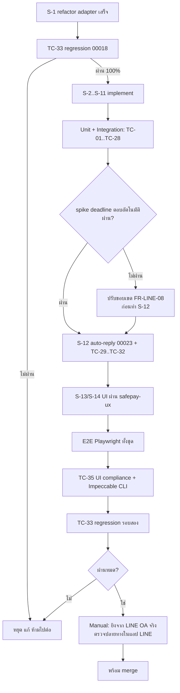

> **โมดูล:** M00025-LineOaChatIntegration
> **ประเภทเอกสาร:** Test Case
> **เวอร์ชัน:** 1.1
> **วันที่จัดทำ:** 2026-07-26
> **สถานะ:** Draft — ยังไม่ได้รัน (ยังไม่มี implementation)
> **เจ้าของเอกสาร:** safepay-qa (ดู [[Feature-Docs-Ownership]])

---

# Test Case: LINE OA Chat Integration

---

## 1. Overview

**ระดับการทดสอบ**

| ระดับ | เครื่องมือ | ครอบคลุม |
|-------|-----------|----------|
| **Unit** | Vitest | signature, การตัดสิน reply/push, การคำนวณโควตา, error mapping, key builder |
| **Integration** | Vitest + Prisma (DB dev) | ingest pipeline, idempotency, transaction ของ replyToken |
| **E2E** | **Playwright (บังคับ)** | หน้าเชื่อมช่องทาง, อินบ็อกซ์, Quota Meter, การส่งข้อความ |
| **Manual/สังเกตการณ์** | LINE OA ทดสอบของทีม + Chrome DevTools MCP | ของจริงปลายทาง: ลูกค้าได้รับข้อความไหม, สื่อเปิดได้ไหม |

**ข้อบังคับของโปรเจกต์:**
- ทุกเมนู/ฟังก์ชันต้องมี Playwright spec และต้องรันจริง (`npm run e2e`) — ไม่ใช่แค่เขียนทิ้งไว้ (`feedback_qa_playwright_e2e_mandatory`)
- bypass login ด้วย `e2e/helpers/auth.ts` (NextAuth cookie)
- **grep + tsc ผ่าน ≠ ใช้งานได้** — ต้องกดจริงในเบราว์เซอร์ (`feedback_browser_qa_catches_what_static_misses`)
- **ห้าม QA agent รัน `prisma db pull`** และ Controller ต้อง `git status` ตรวจ `schema.prisma` หลัง QA (`feedback_qa_agent_no_prisma_pull`)
- dev server รันโดย user ที่พอร์ต 4000 บนโดเมนจริง (`seller.deepth.local:4000`) — QA ไม่ start server เอง

**สภาพแวดล้อมพิเศษที่ต้องเตรียม**

| สิ่งที่ต้องมี | หมายเหตุ |
|---------------|----------|
| LINE OA ทดสอบ + Messaging API channel ของทีม | ใช้ QA ปลายทางจริง (ไม่มี sandbox ของ LINE) |
| อุโมงค์ HTTPS ไปยัง dev (สำหรับ webhook จริง) | LINE ต้องการ HTTPS ที่ certificate ใช้ได้จริง — **ต้องปิดทันทีเมื่อเลิกใช้** (บทเรียน webhook ngrok ค้างของ 00018) |
| ชุด fixture payload ของ LINE | สำหรับเทสส่วนใหญ่ที่ไม่ต้องยิงผ่าน LINE จริง — ยิงเข้า webhook route ตรง ๆ พร้อมลายเซ็นที่คำนวณเอง |

---

## 2. Test Scenarios

### กลุ่ม A — การเชื่อมช่องทาง

#### TC-01: เชื่อม LINE OA สำเร็จ
**Given** seller ล็อกอินและมีร้าน, มี Channel secret + access token ที่ใช้ได้
**When** วางทั้งสองค่าในหน้า `settings/channels` แล้วกดยืนยัน
**Then** สร้าง `ShopChannel` provider `LINE` สถานะ `ACTIVE`, `externalId` = botUserId จาก LINE, หน้าจอแสดงชื่อ+รูป+basicId ของ OA, และแสดงคำเตือน 2 ข้อ (โควตา + ไม่มี echo)
**ระดับ:** E2E + Integration

#### TC-02: token ผิด — ต้องไม่บันทึกอะไรเลย
**Given** วาง access token ที่ใช้ไม่ได้
**When** กดยืนยัน
**Then** ได้ `TOKEN_INVALID` (400), ข้อความไทยที่บอกวิธีแก้, และ **จำนวนแถว `ShopChannel` ต้องไม่เปลี่ยน** (ยืนยันด้วย query ตรง ไม่ใช่ดูแค่หน้าจอ)
**ระดับ:** E2E + Integration

#### TC-21: OA ที่ร้านอื่นเชื่อมอยู่
**Given** OA เดียวกันมีแถว ACTIVE ของอีกร้าน
**When** ร้านที่สองพยายามเชื่อม
**Then** `CHANNEL_TAKEN` (409) พร้อมชื่อร้านเดิม, ไม่แตะแถวของร้านเดิมเลย
**Then (ต่อ)** เมื่อร้านเดิมถอด (`DISCONNECTED`) แล้ว ร้านที่สองเชื่อมได้สำเร็จ — พิสูจน์ว่า partial unique index ทำงานตามเจตนา
**ระดับ:** Integration

#### TC-22: วาง credential ของ OA คนละบัญชีทับ
**Given** ช่องทางเชื่อมกับ OA-A อยู่
**When** PATCH ด้วย credential ของ OA-B
**Then** `LINE_ACCOUNT_MISMATCH` (409) และ credential เดิมไม่ถูกเขียนทับ
**ระดับ:** Integration

#### TC-23: กู้คืนจากสถานะ token ใช้ไม่ได้
**Given** ช่องทางอยู่ในสถานะ `TOKEN_INVALID`
**When** วาง token ใหม่ที่ใช้ได้ของ OA เดิม
**Then** สถานะกลับเป็น `ACTIVE` และส่งข้อความได้อีกครั้ง
**ระดับ:** E2E

#### TC-24: ถอดการเชื่อม
**Given** ช่องทาง ACTIVE ที่มีเธรดและข้อความอยู่แล้ว
**When** ถอดการเชื่อม (ผ่าน Swal confirm)
**Then** สถานะเป็น `DISCONNECTED`, **เธรดและข้อความทั้งหมดยังอยู่ครบและอ่านได้**, ช่องพิมพ์ถูกปิด, และ response มี `postAction` เตือนให้ปิด webhook เองใน console
**ระดับ:** E2E

### กลุ่ม B — ความปลอดภัยของ webhook

#### TC-03: ลายเซ็นถูกต้อง → บันทึกข้อความ
**Given** ช่องทาง ACTIVE
**When** POST payload ข้อความ text พร้อมลายเซ็นที่คำนวณจาก secret จริง
**Then** HTTP 200 และเกิด `ChatMessage` 1 แถว `externalMessageId = 'LINE:<id>'`, เธรดขึ้นใน `/inbox`
**ระดับ:** Integration + E2E

#### TC-04 [ห้ามข้าม] (security): ลายเซ็นผิด → ต้องไม่มีผลข้างเคียงใด ๆ
**Given** payload ที่ `destination` ถูกต้องแต่ลายเซ็นผิด
**When** POST
**Then** HTTP 200, **ไม่มีแถวใดถูกเขียนในทุกตาราง**, **ไม่มี outbound call ไป LINE** (ยืนยันด้วย spy บน HTTP client ไม่ใช่แค่ตรวจ DB)
**ระดับ:** Integration
**เหตุผลที่ต้องเข้ม:** นี่คือด่านเดียวที่กันคนปลอมข้อความเข้าอินบ็อกซ์ร้าน

#### TC-05: ไม่มี header ลายเซ็น / body ไม่ใช่ JSON
**Then** HTTP 200 ทั้งสองกรณี, log warn, ไม่มีผลข้างเคียง, ไม่ throw
**ระดับ:** Integration

#### TC-06: `destination` ที่ไม่มีร้านไหนเชื่อม
**Then** HTTP 200, ไม่มีผลข้างเคียง, log warn
**ระดับ:** Integration

#### TC-20 [ห้ามข้าม] (regression): webhook path ต้องไม่โดน Origin-check
**Given** deploy จริง (หรือ dev ที่ผ่าน `proxy.ts`)
**When** POST เข้ามาแบบไม่มี header `Origin` (เหมือนที่ LINE ยิง)
**Then** ต้องไม่ได้ 403 — ต้องเข้าถึง route handler ได้
**ระดับ:** Integration
**เหตุผล:** ถ้าลืมเพิ่ม path ในรายการยกเว้นของ `src/proxy.ts` ทุกอย่างจะพังเงียบ ๆ โดยที่โค้ดฟีเจอร์ถูกหมด

### กลุ่ม C — ข้อความขาเข้า

#### TC-07: redelivery ไม่ทำให้ข้อความซ้ำ
**When** POST payload เดิม (message id เดิม) 3 ครั้ง
**Then** มี `ChatMessage` แถวเดียว, HTTP 200 ทุกครั้ง
**ระดับ:** Integration

#### TC-08: สื่อทุกชนิดถูก mirror
**When** ส่ง image / video / audio / file เข้ามา
**Then** ไฟล์ถูกอัปโหลดเข้า storage ของ Deep, เปิดดูได้จากเธรด, และ **ไม่พึ่ง URL ของ LINE**
**ระดับ:** Integration + Manual

#### TC-09 [ห้ามข้าม]: mirror ล้มเหลวต้องไม่หายเงียบ
**Given** จำลองให้ storage ปฏิเสธ (MIME/ขนาด)
**When** ลูกค้าส่งไฟล์
**Then** ยังเกิด `ChatMessage` พร้อม placeholder ที่ผู้ใช้เห็นในเธรด + log error
**ระดับ:** Integration
**เหตุผล:** บทเรียนตรงจาก 00018 (`project_supabase_uploads_bucket_mime_limit`) ที่สื่อ fail เงียบจนไม่มีใครรู้

#### TC-25: sticker / location
**Then** แสดงเป็นข้อความอ่านออกในเธรด ไม่ทำให้ render พังและไม่แสดงเป็นช่องว่าง
**ระดับ:** E2E

#### TC-26: event จากกลุ่ม/ห้อง
**When** ส่ง event ที่ `source.type = 'group'`
**Then** ข้ามอย่างเงียบ ๆ, HTTP 200, ไม่สร้างเธรด, **และ event อื่นใน batch เดียวกันยังถูกประมวลผลปกติ**
**ระดับ:** Integration

#### TC-27: โปรไฟล์ดึงไม่ได้
**Given** LINE ตอบ 404 ตอนดึงโปรไฟล์
**Then** เธรดแสดงชื่อสำรองที่อ่านออก **ห้ามแสดง userId ดิบ**
**ระดับ:** Integration + E2E

### กลุ่ม D — ข้อความขาออกและโควตา (แกนของฟีเจอร์)

#### TC-10: ตอบในหน้าต่างฟรี → ใช้ reply ไม่กินโควตา
**Given** เพิ่งได้ event มาไม่เกิน 1 นาที
**When** ร้านกดส่ง
**Then** เรียก `/v2/bot/message/reply`, `sendMethod = 'REPLY'`, `quota.consumed = 0`, และ `replyTokenUsedAt` ถูกตั้งค่า
**ระดับ:** Integration + E2E

#### TC-11: หน้าต่างหมดอายุ → ใช้ push
**Given** เวลาผ่านไปเกิน 1 นาที (ควบคุมเวลาด้วย fake timer / seed `replyTokenExpiresAt` ในอดีต)
**When** ร้านกดส่ง
**Then** เรียก `/v2/bot/message/push`, `sendMethod = 'PUSH'`, `quota.consumed = 1`
**ระดับ:** Integration

#### TC-12 [ห้ามข้าม]: reply token ใช้ซ้ำไม่ได้ (concurrency)
**Given** หน้าต่างฟรีเปิดอยู่
**When** ยิงคำสั่งส่ง 2 ครั้งพร้อมกัน
**Then** มีเพียงครั้งเดียวที่ใช้ reply อีกครั้งต้องไปทาง push (หรือถูกปฏิเสธอย่างชัดเจน) — **ห้ามมีกรณีที่ทั้งสองอ้างว่าใช้ reply สำเร็จ**
**ระดับ:** Integration
**เหตุผล:** เป็นบั๊กแบบ race ที่ static analysis จับไม่ได้

#### TC-13: Quota Meter แสดงค่าจาก LINE
**Then** หน้าอินบ็อกซ์แสดง `remaining/total` ตรงกับที่ LINE ตอบ และไม่ยิง LINE ซ้ำภายใน 5 นาที (ตรวจด้วยจำนวน request)
**ระดับ:** E2E + Integration

#### TC-14: อ่านโควตาไม่ได้ → ต้องไม่พังและไม่บล็อก
**Given** LINE ตอบ 5xx ตอนอ่านโควตา
**Then** endpoint คืน 200 พร้อม `stale: true`, หน้าอินบ็อกซ์ยังใช้งานได้, **และการส่งข้อความยังทำได้** (ปล่อยให้ LINE ตัดสิน)
**ระดับ:** Integration

#### TC-15 [ห้ามข้าม]: โควตาหมด → บล็อกก่อนกดส่ง
**Given** `remaining = 0` และหน้าต่างฟรีปิดแล้ว
**Then** ช่องพิมพ์ถูกปิดพร้อมข้อความอธิบาย + ทางเลือก 3 ทาง, **และถ้าพยายามยิง API ตรงต้องได้ `QUOTA_EXCEEDED` (409) โดยไม่มี request ไป LINE เลย**
**ระดับ:** E2E + Integration

#### TC-28: โควตาหมดแต่ยังอยู่ในหน้าต่างฟรี
**Given** `remaining = 0` แต่เพิ่งได้ event มา
**Then** **ส่งได้ตามปกติ** ด้วย reply — ต้องไม่ถูกบล็อก (เพราะ reply ไม่กินโควตา)
**ระดับ:** Integration
**เหตุผล:** เป็นเคสที่ implement ผิดได้ง่ายที่สุด — บล็อกรวมด้วยเงื่อนไขโควตาเดียว

#### TC-16: batch ≤5 ชิ้น = 1 ข้อความ
**When** ส่ง `parts` 4 ชิ้นในครั้งเดียว
**Then** เรียก LINE 1 ครั้ง, เกิด `ChatMessage` 4 แถวที่มี `sendBatchId` เดียวกัน, `quota.consumed = 1`, และลำดับที่ลูกค้าเห็นตรงกับที่พิมพ์
**ระดับ:** Integration + Manual (ยืนยันลำดับที่ปลายทางจริง)

#### TC-17: เกิน 5 ชิ้น
**When** ส่ง `parts` 7 ชิ้น
**Then** ปฏิเสธด้วย `PARTS_LIMIT_EXCEEDED` (400) หรือแบ่งเป็น 2 ชุดตามที่ออกแบบไว้ — ต้องตรงกับพฤติกรรมที่ระบุใน [[API]] ไม่ใช่ทั้งสองอย่าง
**ระดับ:** Integration

#### TC-18: สถานะในเธรดถูกต้อง
**Then** `GET /api/chat/conversations/[id]` คืน `channelState` ที่มี `freeWindow`, `quota`, `capabilities.readReceipt = false`, `capabilities.echo = false` และ UI **ไม่แสดงตัวชี้ "อ่านแล้ว"** สำหรับเธรด LINE
**ระดับ:** Integration + E2E

#### TC-19: ลูกค้าบล็อก → ปิดการส่ง
**Given** ได้รับ event `unfollow`
**Then** `isBlocked = true`, ช่องพิมพ์ถูกปิดพร้อมเหตุผล, ยิง API ตรงได้ `CONTACT_BLOCKED` (409) โดยไม่มี request ไป LINE
**Then (ต่อ)** เมื่อได้รับ `follow` อีกครั้ง ต้องส่งได้ตามปกติโดยอัตโนมัติ
**ระดับ:** Integration + E2E

#### TC-36: แนบรูปจากมือถือส่งเข้าเธรด LINE (อาการที่ร้านแจ้ง 2026-08-10)
**Given** เธรดช่องทาง LINE ที่ยังส่งข้อความได้ตามปกติ
**When** ผู้ขายกดแนบรูป `.jpg` ขนาด ~3MB
**Then** อัปโหลดผ่าน ไม่ขึ้น "ช่องทางนี้ยังไม่รองรับไฟล์แนบ" และลูกค้าได้รับรูปในแอป LINE จริง
**Then (ต่อ)** ตรวจ payload ที่ยิงไป LINE: `previewImageUrl` **ต้องไม่ใช่ URL เดียวกับ** `originalContentUrl` และไฟล์ที่ preview ชี้ต้องเล็กกว่า 1MB
**ระดับ:** Unit ([blocker] `chat-attachment.test.ts` + `preview-image.test.ts`) + E2E

#### TC-37: ฟอร์แมตที่ LINE ไม่รับ ต้องถูกปฏิเสธตั้งแต่ตอนแนบ ไม่ใช่ตอนส่ง
**Given** เธรด LINE
**When** แนบ `.webp` / `.gif` / `.heic`
**Then** ขึ้น "LINE รองรับรูป jpg/png เท่านั้น" ทันทีที่แนบ (ไม่มี request ไป LINE)
**When (ต่อ)** แนบ `.mov` → "LINE รองรับวิดีโอ mp4 เท่านั้น" · แนบ `.wav` → "LINE รองรับไฟล์เสียง mp3/m4a เท่านั้น"
**ระดับ:** Unit + Integration

#### TC-38: ไฟล์เอกสารถูกปฏิเสธพร้อมเหตุผลที่บอกทางออก
**Given** เธรด LINE
**When** แนบ `.pdf` / `.xlsx` / `.zip`
**Then** ขึ้น "LINE ส่งไฟล์เอกสารไม่ได้ — ส่งได้เฉพาะรูป วิดีโอ และไฟล์เสียง"
**Then (ต่อ)** ข้อความต้อง**ไม่ใช่** "ช่องทางนี้ยังไม่รองรับไฟล์แนบ" และต้องไม่หลุดไปใช้กฎของ Instagram (ซึ่งปล่อย `.pdf` ผ่าน)
**ระดับ:** Unit ([blocker])

#### TC-39: รูปใหญ่เกินเพดานของ LINE
**Given** เธรด LINE
**When** แนบรูป `.jpg` ขนาด 12MB
**Then** ขึ้น "LINE รองรับรูปไม่เกิน 10MB (ไฟล์นี้ 12MB)" — เพดาน preview 1MB ต้อง**ไม่**ถูกใช้เป็นด่านปฏิเสธ (รูป 5MB ยังต้องส่งได้)
**ระดับ:** Unit

#### TC-40: ย่อรูปไม่สำเร็จต้องไม่ทำให้ส่งไม่ได้
**Given** ไฟล์ที่ sharp อ่านไม่ได้ (ไฟล์เสียแต่นามสกุล `.jpg`)
**Then** ยังส่งข้อความออกไปได้ โดย `previewImageUrl` ถอยไปใช้ URL ไฟล์เต็ม — ห้าม throw ห้ามขึ้น error ให้ผู้ขาย
**ระดับ:** Unit ([blocker])

#### TC-41: fallback REPLY → PUSH ต้องไม่ย่อรูปซ้ำ
**Given** ส่งรูปด้วย reply token ที่ LINE ปฏิเสธ (`REPLY_TOKEN_INVALID`) แล้วระบบถอยไป push
**Then** มีไฟล์ preview ถูกสร้างขึ้น **1 ใบเท่านั้น** ไม่ใช่ 2 (ผล `buildParts()` ถูก memoize)
**ระดับ:** Integration

#### TC-42: การ์ดคำสั่งซื้อไปถึงลูกค้าเป็น Flex ไม่ใช่ลิงก์ดิบ
**Given** เธรด LINE ของร้านที่มีออเดอร์อยู่แล้ว
**When** ร้านกดส่งการ์ดคำสั่งซื้อ
**Then** ลูกค้าเห็น **บับเบิลการ์ด** (ชื่อรายการ · ยอดสุทธิ · ปุ่ม "เปิดคำสั่งซื้อ") ไม่ใช่ข้อความ 3 บรรทัดกับลิงก์
**Then (ต่อ)** ปิดแอป LINE แล้วดู **การแจ้งเตือนบนล็อกสกรีน** ต้องเห็นทั้งชื่อของและยอดเงิน (นี่คือ `altText` — จุดที่พังแล้วไม่มีใครเห็นจนกว่าจะปิดแอปไปดู)
**Then (ต่อ)** กดปุ่มแล้วเปิดหน้าออเดอร์ได้จริง
**ระดับ:** Unit ([blocker] `flex-order-card.test.ts`) + Manual บนเครื่องจริง

#### TC-43: ออเดอร์หลายรายการ
**Given** ออเดอร์ที่มี 3 รายการ
**Then** การ์ดขึ้น "และอีก 2 รายการ" (นับจาก `_count.items` ไม่ใช่ `items.length` ที่ take:1)
**Then (ต่อ)** ออเดอร์รายการเดียว **ต้องไม่มี**บรรทัดนั้นเลย
**ระดับ:** Unit ([blocker])

#### TC-44: Messenger/IG ต้องไม่เปลี่ยนพฤติกรรม
**Given** เธรด Messenger และ Instagram
**When** ส่งการ์ดคำสั่งซื้อ
**Then** ลูกค้ายังได้ **ข้อความลิงก์เหมือนเดิมทุกตัวอักษร** และไม่มี request ไหนพยายามส่ง flex
**ระดับ:** Unit ([blocker] `meta-adapter.test.ts`) + Integration

#### TC-45: ลูกค้าแตะปุ่ม (postback) → เข้าเธรด + เปิดหน้าต่างตอบฟรี
**Given** ปุ่มชนิด postback (ยังไม่มีตัวส่งจริงในรอบนี้ — ยิง payload เข้า webhook ตรง ๆ)
**When** ส่ง event `postback` ที่มี `data` + `webhookEventId` + `replyToken`
**Then** เกิด `ChatMessage` ขาเข้า 1 แถว ข้อความอ่านรู้เรื่อง ("ลูกค้าแตะปุ่ม: …") และ `externalMessageId` = `LINE:pb:{webhookEventId}`
**Then (ต่อ)** `replyToken` ถูกบันทึก → แคปชันบนปุ่มส่งเปลี่ยนเป็น `ส่ง · ฟรี xx วิ`
**Then (ต่อ)** ยิง event เดิมซ้ำ → ไม่เกิดแถวที่สอง · แต่ **กดปุ่มเดิมอีกครั้งจริง ๆ** (webhookEventId ใหม่) → ต้องเกิดแถวใหม่
**ระดับ:** Integration ([blocker] `webhook/route.test.ts`)

#### TC-46: postback payload ไม่ครบ
**When** ส่ง postback ที่ไม่มี `data` หรือไม่มี `webhookEventId`
**Then** HTTP 200, ไม่มีแถวใดถูกเขียน, ไม่ล้มทั้ง request
**ระดับ:** Integration

### กลุ่ม E — ตอบอัตโนมัติ (00023) และการไม่ก่อค่าใช้จ่าย

#### TC-29: keyword ตรง + อยู่ในหน้าต่างฟรี → ตอบด้วย reply
**Given** กลุ่มคำสถานะ `LIVE` ที่มี keyword ตรงกับข้อความลูกค้า
**When** ลูกค้าทักเข้ามาทาง LINE
**Then** ข้อความถูกส่งด้วย `sendMethod = 'REPLY'`, มี `autoReplyKind` ตามที่ 00023 ใช้, `quota.consumed = 0`, และเนื้อความตรงกับที่ร้านพิมพ์ไว้ **คำต่อคำ**
**ระดับ:** Integration + E2E

#### TC-30 [ห้ามข้าม] (NFR-8): พ้นหน้าต่างฟรี → ห้ามส่งแบบกินโควตา
**Given** จำลองให้เส้นทางตอบอัตโนมัติช้ากว่า deadline (หรือ seed `replyTokenExpiresAt` ในอดีต)
**Then** **ไม่มี request ไป `/v2/bot/message/push` เลย**, งานถูกยกเลิก, มีแถวใน `AutoReplyLog` ที่ระบุเหตุผลให้ร้านเห็น
**Then (ต่อ)** งานนั้นต้อง **ไม่ค้างสถานะรอส่ง** ที่ทำให้ sweeper รายวันมาหยิบไปส่งทีหลัง (หน้าต่างปิดไปแล้ว = ส่งไม่ได้อีก)
**ระดับ:** Integration
**เหตุผล:** บังคับ TD-007/BR-LINE-18 ซึ่งเป็นกฎเรื่องการใช้เงินของผู้ใช้ — ต้องมีเทสตรง ไม่ใช่พึ่งการ review

#### TC-31 [ห้ามข้าม] (NFR-8, audit): ไม่มี push ที่ไม่มีคนสั่ง
**When** รันสถานการณ์ทั้งชุด (TC-03..TC-30) จบ
**Then** query `ChatMessage` ที่ `sendMethod = 'PUSH'` แล้วทุกแถวต้องมาจากคน (`autoReplyKind IS NULL`) — จำนวนแถวที่มาจากระบบอัตโนมัติต้องเป็น **0**
**ระดับ:** Integration (audit query ท้ายชุด)

#### TC-32: ไม่มีสวิตช์ตอบอัตโนมัติซ้ำซ้อน
**Given** ร้านปิดกลุ่มคำเป็น `OFFLINE` ผ่านหน้าตั้งค่าของ 00023
**Then** ช่องทาง LINE ต้องหยุดตอบอัตโนมัติทันทีเช่นกัน — **ต้องไม่มีสวิตช์แยกของ LINE ที่ยังเปิดค้างอยู่**
**ระดับ:** Integration + E2E
**เหตุผล:** บังคับ BR-LINE-17 — ความจริงสองชุดเรื่อง "เปิดหรือปิด" คือบั๊กที่ผู้ใช้ debug เองไม่ได้

### กลุ่ม F — ไม่กระทบของเดิม

#### TC-33 [ห้ามข้าม] (regression): Messenger / Instagram ทำงานเหมือนเดิม
**When** รัน regression suite ทั้งหมดของ `00018` หลัง refactor adapter (S-1) และอีกครั้งหลัง S-15
**Then** ผ่าน **100%** — ไม่มีข้อยกเว้น
**ระดับ:** Integration + E2E
**Gate:** ถ้าไม่ผ่าน ห้ามไปต่อ S-3 (ตาม [[SDS]] §7)

#### TC-34: Deep Chat เดิมไม่เปลี่ยนพฤติกรรม
**Then** เธรด `channel = 'DEEP'` ส่ง/รับได้ปกติ, ไม่มีคอลัมน์ใหม่ที่ทำให้ query เดิมพัง
**ระดับ:** Integration

#### TC-35: UI compliance
**Then** หน้าที่แตะทั้งหมดผ่านเกณฑ์: ไม่มี emoji (Hard Rule 12), ใช้ `pacesToast` ไม่ใช่ `react-toastify` (Hard Rule 9), ไม่มี arbitrary Tailwind value ใน `(paces)/**` (Hard Rule 7), ฟอนต์ Anuphan (Hard Rule 5)
**วิธีตรวจ:** grep gate ตามที่ระบุใน CLAUDE.md + Impeccable CLI (`/impeccable critique` + `/impeccable clarify`)
**ระดับ:** Static + Manual

---

## 3. Traceability Matrix

| FR | BR | Test Case |
|----|----|-----------|
| FR-LINE-01 | BR-LINE-01/02/03/04 | TC-01, TC-02, TC-21, TC-22, TC-23 |
| FR-LINE-02 | BR-LINE-05/06/07/08 | TC-03, TC-04, TC-05, TC-06, TC-07, TC-20, TC-26 |
| FR-LINE-03 | BR-LINE-09 | TC-08, TC-09, TC-25 |
| FR-LINE-04 | BR-LINE-16 | TC-10, TC-11, TC-16, TC-36…TC-41 (ไฟล์แนบ), TC-42…TC-46 (Flex + postback) |
| FR-LINE-05 | BR-LINE-10/11 | TC-10, TC-12, TC-28 |
| FR-LINE-06 | BR-LINE-13/14 | TC-13, TC-14, TC-15, TC-28 |
| FR-LINE-07 | BR-LINE-12 | TC-16, TC-17 |
| FR-LINE-08 | BR-LINE-17/18/19/20 | TC-29, TC-30, TC-31, TC-32 |
| FR-LINE-09 | BR-LINE-16 | TC-15, TC-19, TC-23 |
| FR-LINE-10 | — | TC-27 |
| FR-LINE-11 | — | (ใช้ชุดเทสเดิมของ 00018) |
| FR-LINE-12 | BR-LINE-21/23 | TC-24 |
| FR-LINE-13 | BR-LINE-15 | TC-19 |
| FR-LINE-14 | — | TC-33, TC-34 |
| NFR-3/4 (security) | BR-LINE-02/05 | TC-04 |
| NFR-8 (cost safety) | BR-LINE-18 | TC-30, TC-31 |

**ครอบคลุม:** FR ทั้ง 14 ตัวมีอย่างน้อย 1 test case; BR ทั้ง 23 ข้อถูกอ้างอิงอย่างน้อย 1 ครั้ง

---

## 4. Flow การทดสอบ

---

## 5. ผลล่าสุด

| รอบ | วันที่ | ผู้รัน | ผ่าน | ไม่ผ่าน | หมายเหตุ |
|-----|--------|--------|------|---------|----------|
| — | — | — | — | — | ยังไม่ได้รัน — ยังไม่มี implementation |

**ค้างที่ต้องเติมเมื่อรันจริง:** จำนวน test ที่เขียนจริง vs ที่ระบุในเอกสารนี้ (35 เคส), เวลา p95 ของ webhook, Reply-token Hit Rate ที่วัดได้จริง

---

## 6. สรุป (Summary)

ชุดทดสอบนี้มี **35 เคส** โดยมี **8 เคสที่ทำเครื่องหมาย [ห้ามข้าม]** ว่าห้ามข้ามและห้าม mark ผ่านโดยไม่มีหลักฐาน เพราะแต่ละเคสปิดความเสี่ยงที่ตรวจด้วยการอ่านโค้ดไม่ได้:

- **TC-04** (ลายเซ็นปลอมต้องไม่มีผลข้างเคียง) — ด่านเดียวที่กันข้อความปลอม
- **TC-09** (mirror ล้มเหลวต้องไม่เงียบ) — บั๊กจริงที่เคยเกิดกับ 00018
- **TC-12** (race ของ reply token) — static analysis จับไม่ได้
- **TC-15 / TC-28** (โควตาหมด vs หน้าต่างฟรี) — คู่ที่ implement ผิดได้ง่ายที่สุด
- **TC-20** (proxy exemption) — ลืมแล้วพังทั้งระบบแบบเงียบ
- **TC-30 / TC-31** (ระบบห้ามก่อ push เอง) — กฎเรื่องเงินของผู้ใช้ ต้องบังคับด้วยเทส ไม่ใช่ด้วยการ review
- **TC-33** (regression 00018) — เป็น gate ที่ถ้าไม่ผ่านต้องหยุดทันที ไม่ใช่บันทึกเป็นหนี้

จุดที่ต้องยอมรับข้อจำกัด: **LINE ไม่มี sandbox** การทดสอบปลายทางจริงจึงต้องใช้ OA ของทีมเองและกินโควตาจริงระหว่าง QA — ต้องวางแผนจำนวนข้อความที่จะใช้ก่อนเริ่ม ไม่ใช่ยิงทดสอบจนโควตาหมดแล้วค่อยรู้
