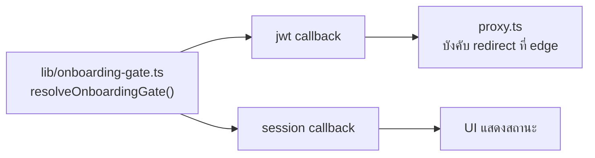
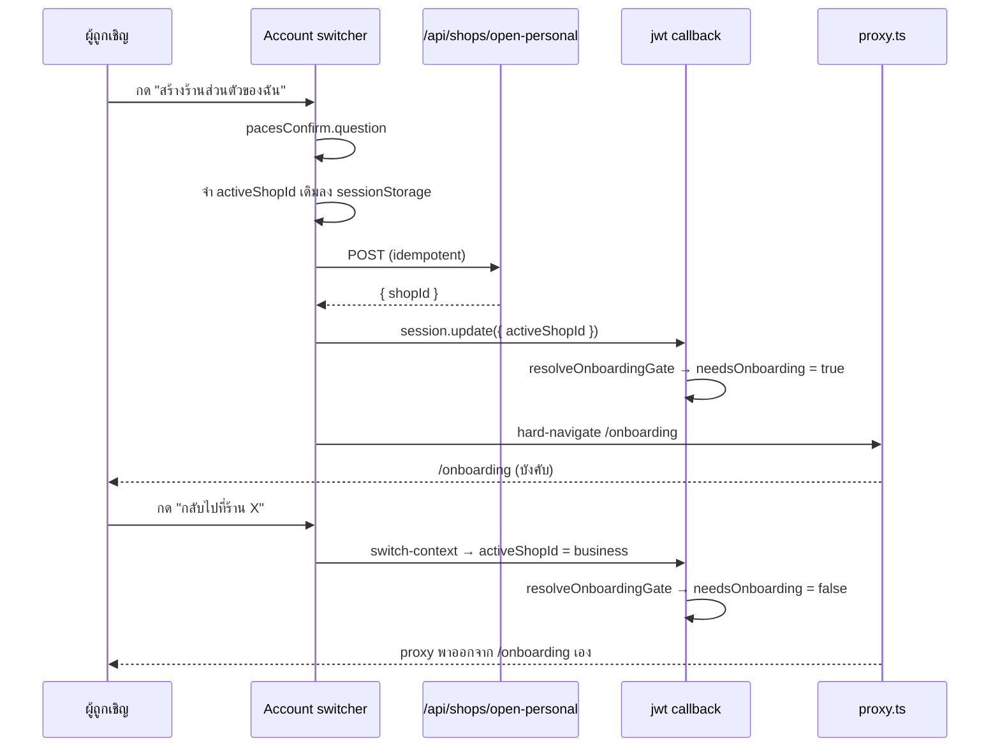

# SDS — Personal Account & Connections (feature 00026)

- **วันที่:** 2026-08-02
- **สถานะ:** deployed prod (commit `c45a7496` → `681deea1`)
- เขียนจากโค้ดที่ deploy จริง ไม่ใช่จากแผน

## 1. ไฟล์ที่เพิ่ม/แก้

### เพิ่ม

| ไฟล์ | หน้าที่ |
|---|---|
| `src/lib/onboarding-gate.ts` | SSOT ของกฎ "ต้องบังคับไป /register หรือ /onboarding ไหม" |
| `src/lib/onboarding-gate.test.ts` | 7 เคส ครอบทั้งทิศหลวมและทิศแน่น |
| `src/hooks/useCreatePersonalShop.ts` | logic กลางของปุ่มสร้างร้านส่วนตัว (ใช้ร่วม 2 switcher) |
| `src/app/(paces)/seller/(dashboard)/account/page.tsx` | หน้า `/account` (server component) |
| `.../account/components/ProfileForm.tsx` | การ์ดข้อมูลส่วนตัว |
| `.../account/components/ConnectedAccountsClient.tsx` | ย้ายมาจาก `settings/` + เพิ่มแถวรหัสผ่าน |
| `.../onboarding/components/BackToBusinessButton.tsx` | ทางออกจาก wizard บังคับ |
| `src/app/api/account/check-username/route.ts` | เช็คชื่อผู้ใช้ว่าง |
| `src/app/api/account/otp-for-password/route.ts` | ส่ง OTP ไปเบอร์ตัวเอง |
| `src/app/api/account/set-password-otp/route.ts` | ตั้ง/เปลี่ยนรหัสผ่าน |
| `src/app/api/users/me/route.test.ts` | 14 เคส regression ของช่องโหว่ privilege escalation |

### แก้

| ไฟล์ | การเปลี่ยน |
|---|---|
| `src/lib/auth.ts` | ย้ายการคำนวณ flag ไปหลัง block ที่ resolve `activeShopId` แล้วเรียก `resolveOnboardingGate` ทั้งใน `jwt` และ `session` callback |
| `src/app/api/users/me/route.ts` + `src/services/user.service.ts` | allow-list 2 ชั้น + `select` ตัด `passwordHash` |
| `src/lib/validations.ts` | เพิ่ม `UpdateProfileSchema` |
| `UserDropdownDetailed.tsx` · `AccountSwitcherSheet.tsx` | แถวสร้างร้าน + ทางเข้า `/account` |
| `AccountSwitcherLauncher.tsx` | ถอด gate `hasBusinessMembership` (เดิม seller เดี่ยวบนมือถือเข้าไม่ถึงเลย) |
| `ShopSwitchOverlay.tsx` | เพิ่ม prop `label`/`subLabel` |
| `settings/page.tsx` | เหลือเฉพาะการจัดส่ง + `SellerEmptyState` |
| `_seller-menu.ts` | กลุ่ม "บัญชีของฉัน" (วางล่างสุด) + เปลี่ยน `/settings` เป็น "การจัดส่ง" |
| `ShopQuickLinks.tsx` | เพิ่ม `/account` เป็นรายการแรก |
| `_shared/SellerEmptyState.tsx` · `SellerErrorState.tsx` · `SellerBottomNav.tsx` | เลิกใช้ arbitrary value กับขนาดไอคอน (HR7) |

## 2. การตัดสินใจเชิงออกแบบที่สำคัญ

### 2.1 ทำไมต้องมี `lib/onboarding-gate.ts` แทนที่จะแก้ 2 ที่ให้เหมือนกัน

กฎนี้ถูกอ่าน 2 ที่ที่ต้องตรงกันเป๊ะเสมอ:

1. `jwt` callback → เขียนลง JWT → `proxy.ts` อ่านแล้ว **บังคับ redirect ที่ edge**
2. `session` callback → ส่งเข้า session → **UI อ่านไปแสดงสถานะ**

ถ้า 2 ที่ไม่ตรงกัน UI จะโชว์คนละอย่างกับที่ proxy บังคับจริง เดิมกันด้วยคอมเมนต์ "mirror logic ใน jwt callback ด้านบน" ซึ่งกันได้แค่ตอนคนอ่านคอมเมนต์เจอ — ตอนนี้ทั้งคู่เรียก helper ตัวเดียวกัน drift ไม่ได้

### 2.2 ลำดับใน `jwt` callback มีความหมาย

`resolveOnboardingGate` ต้องถูกเรียก **หลัง** block ที่ resolve `token.activeShopId` เสมอ — เดิมโค้ดคำนวณ flag อยู่ก่อน block นั้น ซึ่งรอบ sign-in แรก `activeShopId` ยังเป็น `undefined` จะได้ผลผิด

### 2.3 ปุ่ม "กลับไปร้านเดิม" จำร้านจริง ไม่ใช่เดา

`useCreatePersonalShop` เขียน `sessionStorage[PREV_SHOP_ID_KEY]` **ก่อน** จะทับ `activeShopId` แล้ว `BackToBusinessButton` อ่านค่านั้น fallback เป็นร้านแรกที่ไม่ล็อกเมื่ออ่านไม่ได้ — สเปกเดิมเขียนแค่ "ร้านธุรกิจแรกที่เป็นสมาชิก" ซึ่งจะพาไปผิดร้านทันทีที่ user อยู่หลายร้าน

### 2.4 endpoint รหัสผ่านไม่รับ `phone` จาก client

resolve จาก session ฝั่ง server เพื่อไม่ต้องส่งเบอร์จริงลง RSC flight payload และตัดความเสี่ยงที่ client ส่งเบอร์ของคนอื่นมา — คืนกลับเฉพาะ `phoneMasked`

## 3. Flow หลัก

## 4. หนี้ที่รู้ตัว

| เรื่อง | สถานะ |
|---|---|
| Browser QA / E2E Playwright | **ยังไม่ทำ** — verification ทั้งหมดเป็น static (tsc/build/unit/detector/grep) |
| `AccountAvatar` ใส่ `rounded-full` ให้ทั้ง business และ personal | ไม่แก้ (กระทบ switcher ทุกจุด) — เอกสารที่อ้างว่า "วงกลม=คน สี่เหลี่ยม=ร้าน เป็น convention ที่มีอยู่" ถูกแก้แล้ว |
| พฤติกรรม "เจอบัญชีซ้ำ" ต่างกันตาม entry point | user ตัดสิน 2026-08-02 ให้ **คงแยกตามบริบท** — order-claim ต้องลื่นเพราะกำลังจะบล็อกการซื้อ, การตั้งค่าบัญชีเป็นการกระทำที่ตั้งใจ |
| username cooldown 30 วัน | นอก scope (หนี้เดิมตั้งแต่ seller auth 2026-06-17) |
| แก้อีเมล | ช่อง disabled — ต้องออกแบบ flow ยืนยันอีเมลก่อน ไม่งั้นเป็นช่องอ้างสิทธิ์อีเมลคนอื่น |
