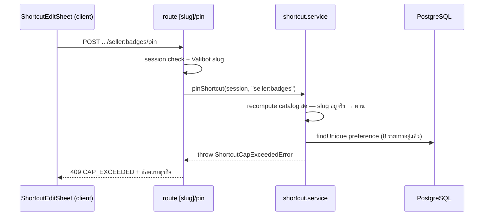

> **โมดูล:** M00027-CustomizableShortcuts
> **ประเภทเอกสาร:** API Specification
> **เวอร์ชัน:** 1.0
> **วันที่จัดทำ:** 2026-08-02
> **สถานะ:** Draft
> **เจ้าของเอกสาร:** safepay-planner (ดู [[Feature-Docs-Ownership]])

# API: เมนูลัดที่ตั้งค่าเองได้ (Customizable Shortcuts)

---

## 1. Overview

พาธยึด convention ที่มีอยู่จริงใน repo — ทรัพยากรระดับ (user × active shop) ใช้ `/api/shops/current/*` (precedent: `service-resources` ของ 00024, `rooms`/`housekeepers` ของ 00017); การ pin/unpin ใช้ path segment ต่อท้ายทรัพยากร (precedent เป๊ะ: `POST /api/seller/products/{id}/pin`, `POST /api/seller/products/{id}/unpin`)

**หลักที่ใช้ทุก endpoint:**

| หัวข้อ | ข้อกำหนด |
|--------|----------|
| Validation | Valibot จาก `src/lib/validations.ts` (schema ใหม่: `ShortcutSlugParamSchema`) |
| Cache | `export const dynamic = 'force-dynamic'` + `Cache-Control: private, no-store` (บทเรียน `feedback_auth_api_cache_control` — ข้อมูลต่อ user) |
| CSRF/Rate-limit | ผ่าน `guardApi` ใน `src/proxy.ts` ตามที่มีอยู่ (mutation = ต้องผ่าน Origin-check) |
| Ownership | `userId`/`shopId` derive จาก session + `requireActiveShop` เท่านั้น — **ไม่มี field ให้ client ส่ง userId/shopId มาเอง** |
| `active.locked` | **ไม่เช็ค** ในทุก endpoint ของฟีเจอร์นี้ (SDS D-05 — preference เป็นการตั้งค่าส่วนตัว ไม่ใช่ spend action) |

---

## 2. Authentication

| กลุ่ม | วิธียืนยันตัวตน | สิทธิ์ |
|------|----------------|-------|
| ทุก endpoint | NextAuth session (seller subdomain) | ต้องเป็นเจ้าของหรือสมาชิก (`ShopMember`) ของ active shop — verify ผ่าน `requireActiveShop(session)` ทุกครั้ง (ไม่ trust JWT เปล่า ๆ) |

🛑 **ไม่มี endpoint ใดให้แก้ preference ของ user อื่น** — ไม่มี parameter ใดรับ `userId` จาก client (BR-SC §3.1, FR-SC-02-AC-02)

---

## 3. Endpoint List

| # | Method | Path | หน้าที่ |
|---|--------|------|---------|
| 1 | GET | `/api/shops/current/shortcuts` | แคตตาล็อก + preference ปัจจุบัน (หรือ default สด) + unavailable |
| 2 | POST | `/api/shops/current/shortcuts/[slug]/pin` | เพิ่ม 1 รายการ (idempotent, cap 8) |
| 3 | POST | `/api/shops/current/shortcuts/[slug]/unpin` | ถอด 1 รายการ (idempotent, min 1) |
| 4 | POST | `/api/shops/current/shortcuts/reset` | รีเซ็ตเป็น default สด (คำนวณใหม่ ณ ขณะกด) |

การ render **ครั้งแรกของหน้า `/dashboard`** ไม่ผ่าน endpoint เหล่านี้ — RSC เรียก `resolveShortcutState()` ตรงจาก service layer (ดู [[SDS]] §4.1) เอกสารนี้ครอบเฉพาะ endpoint ที่ client-side edit sheet เรียกผ่าน `fetch`

---

## 4. Endpoint Detail

### 4.1 `GET /api/shops/current/shortcuts`

อ่านแคตตาล็อกทั้งหมด (FR-SC-01) + preference ปัจจุบัน (FR-SC-06) + รายการที่หมดสิทธิ์ (FR-SC-08) — ใช้เปิดโหมดแก้ไข

**Request:** ไม่มี query/body

**Response 200**

```jsonc
{
  "catalog": [
    { "slug": "seller:sales", "label": "ภาพรวมยอดขาย", "icon": "chart-line", "url": "/sales" },
    { "slug": "seller:inventory", "label": "จัดการสต็อก", "icon": "archive", "url": "/inventory",
      "badge": { "className": "bg-primary", "text": "เลือกแพ็กเกจ" } }
    // ... เรียงตามลำดับ sidebar (SSOT order) — ไม่มี seller:dashboard ปนอยู่
  ],
  "pinnedSlugs": ["seller:sales", "seller:orders", "seller:customers"],
  "unavailable": [
    { "slug": "seller:expenses", "label": "ค่าใช้จ่าย", "icon": "report-money" }
  ]
}
```

- `catalog` = สิ่งที่เลือกปักเพิ่มได้ ณ ขณะนี้ (เรียง SSOT order, ไม่รวม `seller:dashboard`)
- `pinnedSlugs` = ทั้งหมดที่ปักไว้ **รวม unavailable** (เพื่อให้ client รู้ว่านับโควตา 8 ไปแล้วกี่รายการ — FR-SC-08-AC-03) เรียงตาม SSOT order (unavailable ไปท้ายสุด)
- `unavailable` = subset ของ `pinnedSlugs` ที่ไม่อยู่ใน `catalog` แล้ว — client แสดงเป็นสถานะ "ใช้ไม่ได้แล้ว"

**Errors:** `401 UNAUTHORIZED`, `404 SHOP_NOT_FOUND`

---

### 4.2 `POST /api/shops/current/shortcuts/{slug}/pin`

เพิ่มรายการเข้า preference (FR-SC-03) — `slug` เป็น path param เช่น `seller:sales` (มีเครื่องหมาย `:` — client ควร `encodeURIComponent(slug)` ก่อนต่อ URL; Next.js decode `params.slug` กลับให้อัตโนมัติ)

**Request:** ไม่มี body

**Response 200**

```jsonc
{
  "pinnedSlugs": ["seller:sales", "seller:orders", "seller:customers", "seller:inbox"],
  "unavailable": []
}
```

- Idempotent — ปักซ้ำรายการเดิม → 200 คืนสถานะปัจจุบัน ไม่ error (FR-SC-03-AC-02)

**Errors**

| Status | Code | เมื่อไหร่ |
|--------|------|----------|
| 400 | `VALIDATION_ERROR` | `slug` รูปแบบไม่ถูกต้อง (ไม่ตรง `^seller:[a-z-]+$`) |
| 401 | `UNAUTHORIZED` | ไม่มี session |
| 404 | `SHOP_NOT_FOUND` | ไม่มี active shop |
| 403 | `SLUG_NOT_IN_CATALOG` | slug นี้ไม่อยู่ในแคตตาล็อกสิทธิ์ของผู้ใช้คนนี้ ณ ขณะเรียก (พยายามปักเมนูที่ไม่มีสิทธิ์) |
| 409 | `CAP_EXCEEDED` | ปักหมุดอยู่แล้ว 8 รายการ และ slug นี้ยังไม่ถูกปัก |

```jsonc
// 403 SLUG_NOT_IN_CATALOG
{ "error": "ไม่พบเมนูนี้ในรายการที่คุณเลือกได้", "code": "SLUG_NOT_IN_CATALOG" }

// 409 CAP_EXCEEDED
{ "error": "ปักหมุดครบ 8 รายการแล้ว กรุณาถอดรายการเดิมก่อนเพิ่มใหม่", "code": "CAP_EXCEEDED" }
```

---

### 4.3 `POST /api/shops/current/shortcuts/{slug}/unpin`

ถอดรายการออกจาก preference (FR-SC-04)

**Request:** ไม่มี body

**Response 200** — เหมือน §4.2

- Idempotent เมื่อ slug ไม่ได้ถูกปักอยู่แล้ว → 200 คืนสถานะปัจจุบัน ไม่ error (มิเรอร์ `unpinProduct`)

**Errors**

| Status | Code | เมื่อไหร่ |
|--------|------|----------|
| 400 | `VALIDATION_ERROR` | `slug` รูปแบบไม่ถูกต้อง |
| 401 | `UNAUTHORIZED` | ไม่มี session |
| 404 | `SHOP_NOT_FOUND` | ไม่มี active shop |
| 409 | `MIN_REQUIRED` | เหลือรายการที่ **ยังใช้ได้** เพียงตัวเดียว และ slug ที่ขอถอดคือตัวนั้น — ถอดแล้วการ์ดจะว่าง |

```jsonc
// 409 MIN_REQUIRED
{ "error": "ต้องมีเมนูลัดอย่างน้อย 1 รายการเสมอ", "code": "MIN_REQUIRED" }
```

**`MIN_REQUIRED` นับเฉพาะรายการที่ยังใช้ได้** (คำตัดสิน user 2026-08-02 — ดู [[SRS]] §3 TFR-006) รายการที่ปักไว้แต่ `unavailable` แล้ว **ถอดได้เสมอ** แม้เป็นรายการสุดท้าย กรณีนั้น response คืน `pinnedSlugs: []` และการ์ดแสดง empty-state — ไม่ใช่ 409

---

### 4.4 `POST /api/shops/current/shortcuts/reset`

รีเซ็ตกลับ default (FR-SC-12) — คำนวณ default **สด ณ ขณะเรียก** ไม่ใช่ default ที่ client เคยเห็นตอนเปิดหน้า

**Request:** ไม่มี body — การยืนยันก่อนรีเซ็ตเป็นหน้าที่ของ client (Sweet Alert) ก่อนยิง request นี้

**Response 200**

```jsonc
{
  "pinnedSlugs": ["seller:account", "seller:sales", "seller:orders", "seller:products",
                   "seller:reviews", "seller:customers", "seller:inbox", "seller:settings-auto-reply"],
  "unavailable": []
}
```

**Errors:** `401 UNAUTHORIZED`, `404 SHOP_NOT_FOUND`

---

## 5. 🛑 Error Code Table + Cross-file Route-catch Mapping (บังคับ enumerate)

ทุก custom Error ที่ `shortcut.service.ts` throw **ต้องมี branch ครอบในไฟล์ route ที่เรียกมันเสมอ** (บทเรียน feature 00003 P2 — `OutOfStockError` ตกหล่นจาก route catch แล้วกลายเป็น 500 แทน 400)

| Error class (ที่มา: `src/services/shortcut.service.ts`) | Thrown จากฟังก์ชันไหน | Route ไฟล์ที่ต้อง catch | HTTP Status | Code |
|---|---|---|---|---|
| `ShortcutSlugNotInCatalogError` | `pinShortcut()` | `src/app/api/shops/current/shortcuts/[slug]/pin/route.ts` | **403** | `SLUG_NOT_IN_CATALOG` |
| `ShortcutCapExceededError` | `pinShortcut()` | `src/app/api/shops/current/shortcuts/[slug]/pin/route.ts` | **409** | `CAP_EXCEEDED` |
| `ShortcutMinRequiredError` | `unpinShortcut()` | `src/app/api/shops/current/shortcuts/[slug]/unpin/route.ts` | **409** | `MIN_REQUIRED` |
| *(discriminated union, ไม่ใช่ throw)* `{ kind: 'NO_SHOP' }` | `resolveShortcutState()`, `pinShortcut()`, `unpinShortcut()`, `resetShortcuts()` | **ทั้ง 4 route** (`route.ts`, `[slug]/pin/route.ts`, `[slug]/unpin/route.ts`, `reset/route.ts`) | **404** | `SHOP_NOT_FOUND` |
| *(ก่อนเรียก service)* ไม่มี `session.user` | ตรวจใน route โดยตรง ไม่ผ่าน service | **ทั้ง 4 route** | **401** | `UNAUTHORIZED` |
| *(ก่อนเรียก service)* Valibot ปฏิเสธ `slug` | ตรวจใน route โดยตรง | `[slug]/pin/route.ts`, `[slug]/unpin/route.ts` | **400** | `VALIDATION_ERROR` |
| *(catch-all)* Error อื่นที่ไม่รู้จัก | ทุกจุด | **ทั้ง 4 route** — `console.error` แล้วคืน generic | **500** | `INTERNAL_ERROR` |

**Reviewer gate (ก่อน merge):** grep `class Shortcut.*Error extends Error` ใน `shortcut.service.ts` แล้วไล่ทีละตัวว่ามี `instanceof` check ตรงกับตารางนี้ครบทุก route — จำนวน `instanceof ShortcutXxxError` ที่เจอทั้ง repo ต้อง **≥ 1 ต่อ error class** และต้องอยู่ในไฟล์ route ที่ตารางนี้ระบุ ไม่ใช่ไฟล์อื่น

**โครง error response มาตรฐาน** (ตาม pattern `pin`/`unpin` เดิม)

```jsonc
{ "error": "ข้อความภาษาไทยระดับธุรกิจ", "code": "SCREAMING_SNAKE_CASE" }
```

---

## 6. Sequence

### 6.1 Pin ชนแคป 8 (409)



### 6.2 SSR → เปิดโหมดแก้ไข → pin → sync การ์ด

```mermaid
sequenceDiagram
    participant U as Seller
    participant P as dashboard/page.tsx
    participant Sheet as ShortcutEditSheet
    participant R as route pin
    participant S as shortcut.service

    U->>P: เปิด /dashboard
    P->>S: resolveShortcutState (เรียกตรง ไม่ผ่าน HTTP)
    P-->>U: การ์ดเมนูลัด (tiles)
    U->>Sheet: กดปุ่ม "แก้ไข"
    Sheet->>R: (ผ่าน GET §4.1) โหลดแคตตาล็อกเต็ม
    U->>Sheet: แตะเพิ่มรายการ
    Sheet->>R: POST .../pin
    R->>S: pinShortcut
    S-->>R: ShortcutState ใหม่
    R-->>Sheet: 200
    Sheet-->>U: sync UI ทันที; ปิด sheet → การ์ดหลัง /dashboard reload ตรงกัน (SSR คำนวณสดอยู่แล้ว)
```

---

## 7. Traceability

| Endpoint | SDS Component | BRD FR |
|----------|---------------|--------|
| §4.1 GET | `resolveShortcutState()` | FR-SC-01, FR-SC-06, FR-SC-08 |
| §4.2 POST pin | `pinShortcut()` | FR-SC-03, FR-SC-05 |
| §4.3 POST unpin | `unpinShortcut()` | FR-SC-04 |
| §4.4 POST reset | `resetShortcuts()` | FR-SC-12 |

---

## 8. สรุป

- 4 endpoint ใหม่ทั้งหมดอยู่ใต้ `/api/shops/current/shortcuts` — ไม่มี endpoint ไหนรับ `userId`/`shopId` จาก client
- ทุก mutation (`pin`/`unpin`/`reset`) คืน `{ pinnedSlugs, unavailable }` ชุดเดียวกันเสมอ เพื่อให้ client sync UI ได้จาก response ตรง ๆ โดยไม่ต้อง diff เอง
- ตาราง §5 คือจุดที่ reviewer ต้อง verify เข้มที่สุด — error class ใหม่ทุกตัวต้องมี route catch ครบตามที่ enumerate ไว้ ก่อน merge
