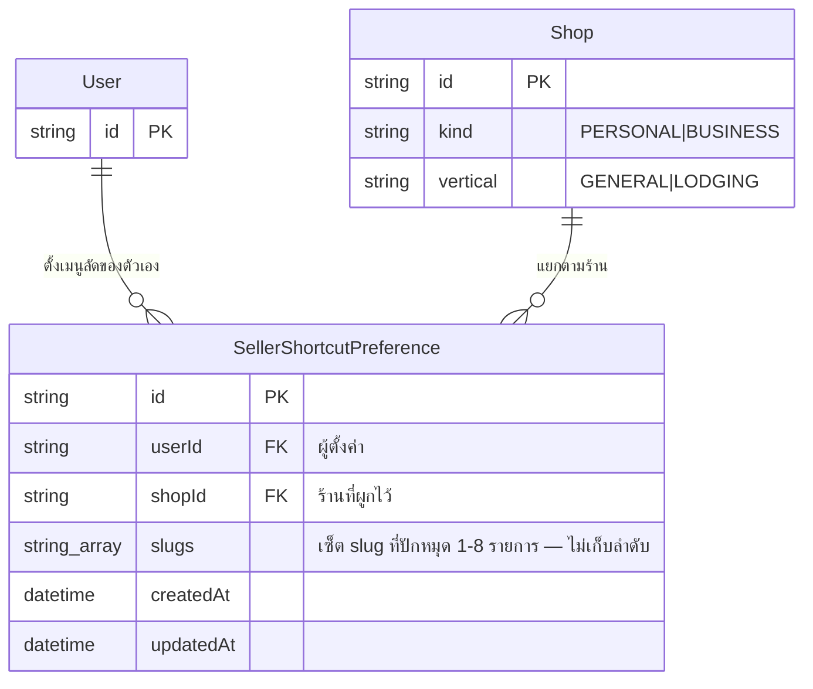

> **โมดูล:** M00027-CustomizableShortcuts
> **ประเภทเอกสาร:** Database Design (ข้อเสนอ — ยังไม่สร้าง migration จริง)
> **เวอร์ชัน:** 1.0
> **วันที่จัดทำ:** 2026-08-02
> **สถานะ:** Draft — รอ dispatch ให้ `safepay-database` ยืนยันก่อน apply
> **เจ้าของเอกสาร:** safepay-planner (ข้อเสนอ) → `safepay-database` (ตัดสินสุดท้าย + apply)

# DATABASE: เมนูลัดที่ตั้งค่าเองได้ (Customizable Shortcuts)

---

## 🛑 หมายเหตุบังคับก่อนอ่าน

- เอกสารนี้เป็น **ข้อเสนอ** — Controller ต้อง dispatch `safepay-database` ให้ทบทวน/ยืนยันก่อน apply จริง (Hard Rule ใน CLAUDE.md: งานแตะ schema ต้องผ่าน `safepay-database`)
- 🛑 **repo นี้ห้าม `prisma migrate dev`** — มี behavior reset ที่ลบข้อมูลทั้งฐานที่ connection ชี้อยู่ และ shadow DB ที่มันสร้างก็ drop schema ทิ้งเสมอ ฐาน prod เคยถูกล้างทั้ง 64 ตารางมาแล้วด้วยกลไกนี้ (2026-07-31 — memory `feedback_shadow_db_url_wipes_target`, `project_prod_db_wipe_20260731`, `project_shared_db_drift_no_migrate_dev`). ตอนนี้ dev DB **แยกจาก prod แล้ว** (memory `project_dev_db_separated_from_prod`) แต่ข้อห้ามไม่ผ่อน — ตัวคำสั่งพิสูจน์ปลายทางเองไม่ได้ `prod-db-guard` hook จึงบล็อกที่ PreToolUse (Hard Rule 14)
- 🛑 **ห้าม `prisma db pull`** — introspection จะลบ unmanaged SQL (EXCLUDE/partial-unique constraint ของ feature 00008/00017/00024) ออกจาก schema.prisma
- วิธีเดียวที่ใช้ได้: **เขียนไฟล์ migration ด้วยมือ** แล้ว `npx dotenv -e .env.local -- npx prisma migrate deploy` **หลังขอ user ยืนยันเสมอ** (memory `project_prisma_migration_env_targets`)

---

## 1. Overview

ฟีเจอร์นี้เพิ่ม **ตารางใหม่ 1 ตาราง** เท่านั้น: `SellerShortcutPreference` — ไม่แตะ field ใด ๆ ของตารางที่มีอยู่แล้วนอกจากเพิ่ม relation field (array ว่าง, ไม่มีผลย้อนหลัง) บน `User` และ `Shop`

**ผลกระทบต่อ schema เดิม: 0** — ไม่มีการแก้ column, ไม่มี backfill, ไม่มี data migration

| หัวข้อ | ค่า |
|--------|-----|
| ฐานข้อมูล | PostgreSQL 17.6 (Supabase, แชร์ dev/prod) |
| ORM | Prisma |
| ตารางใหม่ | `SellerShortcutPreference` |
| ตารางที่แก้ | `User` (เพิ่ม relation field), `Shop` (เพิ่ม relation field) |
| unmanaged SQL | 1 CHECK constraint (ไม่ใช่ EXCLUDE — ไม่ต้องใช้ `btree_gist`) |
| extension ที่ต้องใช้ | ไม่มีเพิ่มเติม |

---

## 2. ERD



---

## 3. Tables

### 3.1 `SellerShortcutPreference` (ใหม่)

เก็บ "เซ็ตของ slug เมนูที่ปักหมุดไว้" ต่อคู่ (ผู้ใช้, ร้าน) — **ไม่เก็บลำดับ/label/icon/badge** เพราะทั้งหมดนั้น derive สดจาก `sellerMenuItems` (SSOT) ทุกครั้งที่ render (ดู [[SDS]] TFR-002/003) — การเก็บ derived data ซ้ำในตารางนี้จะสร้างปัญหา staleness แบบเดียวกับที่ `SHORTCUT_TILES` เดิมเป็นอยู่ (เหตุผลที่ต้องมีฟีเจอร์นี้ตั้งแต่แรก)

```prisma
// SellerShortcutPreference: เมนูลัดที่ผู้ใช้ตั้งเองต่อ (ผู้ใช้, ร้าน) — feature 00027
// เก็บเฉพาะ "เซ็ต slug" — label/icon/url/badge/ลำดับ derive สดจาก sellerMenuItems (SSOT) เสมอ
// ไม่มีแถวนี้ = ยังไม่เคยตั้งค่า → คำนวณ default สด ไม่ persist (compute-on-read, SDS TFR-004)
model SellerShortcutPreference {
  id     String @id @default(uuid())
  userId String
  shopId String

  // slugs: เซ็ตของ MenuItemType.slug ที่ปักหมุดไว้ (เช่น "seller:sales") — ไม่เกิน 8 รายการ (ว่างได้)
  // 🛑 ไม่ใช่ "ลำดับที่ผู้ใช้กด" — render เรียงตามตำแหน่งใน sellerMenuItems (SSOT) ทุกครั้ง (ไม่มี manual reorder ใน MVP)
  // อาจมี slug ที่ไม่อยู่ใน catalog ปัจจุบันแล้ว (entitlement drift) — คงไว้โดยตั้งใจ ไม่ลบอัตโนมัติ (BR-SC §3.6)
  // CHECK(array_length(slugs,1) <= 8) enforce ด้วยมือใน migration SQL (ตารางใหม่ ไม่มีข้อมูลเดิม — validate ได้ทันที ไม่ต้อง NOT VALID)
  // ว่างได้โดยตั้งใจ: ถอดช่องที่ใช้ไม่ได้แล้วตัวสุดท้ายออกได้เสมอ (คำตัดสิน user 2026-08-02 — SRS TFR-006)
  slugs String[] @default([])

  createdAt DateTime @default(now())
  updatedAt DateTime @updatedAt

  user User @relation(fields: [userId], references: [id], onDelete: Cascade)
  shop Shop @relation(fields: [shopId], references: [id], onDelete: Cascade)

  @@unique([userId, shopId], map: "SellerShortcutPreference_userId_shopId_key")
}
```

| ฟิลด์ | ชนิด | Null | คำอธิบาย |
|-------|------|------|----------|
| `id` | uuid | ไม่ | PK |
| `userId` | text | ไม่ | FK → `User`, ON DELETE CASCADE |
| `shopId` | text | ไม่ | FK → `Shop`, ON DELETE CASCADE |
| `slugs` | text[] | ไม่ (default `{}`) | เซ็ต slug ที่ปักหมุด — CHECK ไม่เกิน 8 (ว่างได้) |
| `createdAt` | timestamptz | ไม่ | |
| `updatedAt` | timestamptz | ไม่ | อัปเดตทุกครั้งที่ pin/unpin/reset |

### 3.2 `User` (แก้ — เพิ่ม relation field)

```prisma
model User {
  // ...ฟิลด์เดิมทั้งหมดไม่แตะ...
  shortcutPreferences SellerShortcutPreference[] // NEW (feature 00027) — เมนูลัดที่ตั้งเองต่อร้าน
}
```

### 3.3 `Shop` (แก้ — เพิ่ม relation field)

```prisma
model Shop {
  // ...ฟิลด์เดิมทั้งหมดไม่แตะ...
  shortcutPreferences SellerShortcutPreference[] // NEW (feature 00027) — เมนูลัดของสมาชิกแต่ละคนในร้านนี้
}
```

---

## 4. Indexes & Constraints

### 4.1 Index

| ตาราง | Index | เหตุผล |
|-------|-------|--------|
| `SellerShortcutPreference` | `@@unique([userId, shopId])` | จุดเข้าถึงเดียวของ business rule "1 คน × 1 ร้าน = 1 preference" (FR-SC-02) — ใช้เป็น index สำหรับ point-lookup `findUnique` ทุก request ด้วยในตัว ไม่ต้องเพิ่ม index แยก |

ไม่มี query pattern อื่นที่ต้องการ index เพิ่ม (ไม่มี "list preference ทั้งหมดของร้าน" หรือ "ทั้งหมดของ user" ใน FR ใด ๆ)

### 4.2 CHECK constraint — บังคับ cap 8 ที่ฐานข้อมูล (defense-in-depth)

Service layer enforce cap/min อยู่แล้ว (SRS TFR-006) แต่ตาม pattern ของฟีเจอร์อื่นในโปรเจกต์ (00016 `CHECK(balance >= 0)`, 00024 `CHECK(capacity >= 1)`) **ความถูกต้องของ invariant ควรบังคับซ้ำที่ DB** เป็นชั้นสุดท้าย

🛑 **DB บังคับแค่ขอบบน (≤ 8) เท่านั้น** — ขอบล่างไม่มี เพราะ min-1 ไม่ใช่ invariant ของข้อมูลอีกต่อไป: `slugs` ว่างเป็นสถานะที่ถูกต้อง (ถอดช่องที่ใช้ไม่ได้แล้วตัวสุดท้ายออก) ส่วนกฎ "ต้องเหลือช่องที่ใช้ได้ ≥ 1" ตัดสินจาก catalog สด ซึ่ง DB ไม่รู้จัก — จึงบังคับได้ที่ service layer เท่านั้น (SRS TFR-006)

```sql
-- array_length() ของ Postgres คืน NULL สำหรับ array ว่าง (ไม่ใช่ 0) — COALESCE ทำให้ขอบล่างอ่านตรงกับ
-- ที่ตั้งใจ (0 = ว่าง ผ่าน) แทนที่จะผ่านเพราะ NULL ไม่ถือเป็น FALSE ใน CHECK ซึ่งเป็นคนละเหตุผลกัน
-- 🛑 ถ้าวันหน้ามีใครยกขอบล่างกลับเป็น 1 ห้ามถอด COALESCE ออก ไม่งั้น min-1 จะไม่ถูกบังคับจริง
ALTER TABLE "SellerShortcutPreference" ADD CONSTRAINT "SellerShortcutPreference_slugs_count"
  CHECK (COALESCE(array_length("slugs", 1), 0) BETWEEN 0 AND 8);
```

- ตารางนี้เป็นตารางใหม่ล้วน (ไม่มีข้อมูลเดิม) → เพิ่มแบบ **VALIDATE ทันที** ได้เลย ไม่ต้องแยก `NOT VALID` + `VALIDATE` (ต่างจาก CHECK ของตารางเก่าที่มีข้อมูลจริงอยู่แล้วอย่าง `Shop.pinSlots`/`Product.stockQty`)
- 🛑 **นี่ไม่ใช่ EXCLUDE constraint** — ไม่ต้องมี `btree_gist`, ไม่มีปัญหา transaction-poisoning (`25P02`) แบบ feature 00017/00024 — Prisma โยน error ปกติเป็น `P2002`-style ก็ไม่ใช่ เพราะ CHECK violation คือ **`P2010` + `meta.code = '23514'`** (Postgres error code ของ `check_violation` — ต่างจาก `23P01` ของ exclusion และ `23505` ของ unique) — **service layer ต้อง validate cap/min ก่อนเขียนเสมอ** (TFR-006) ไม่ควร "ปล่อยให้ DB reject แล้วค่อย catch" เป็นทางหลัก เพราะข้อความจะไม่มีบริบทพอสื่อสารกับผู้ใช้ (constraint นี้คือ safety-net ชั้นสุดท้าย ไม่ใช่กลไกหลัก — ต่างจาก EXCLUDE ของ 00017/00024 ที่เป็นกลไกหลักเพราะป้องกัน race condition ที่ในแอปทำไม่ได้)

### 4.3 ไม่มี EXCLUDE constraint

ต่างจาก feature 00017/00024 (การจอง) — ฟีเจอร์นี้ไม่มีมิติเวลา/การแย่งทรัพยากรที่ทับซ้อนกัน จึงไม่ต้องการ concurrency-control ระดับ DB นอกเหนือจาก unique constraint ปกติ ความเสี่ยง race condition เดียวที่มีคือ "แก้ preference เดียวกันพร้อมกันจากสอง tab" ซึ่ง PRD §6.2 ยอมรับ **last-write-wins** แล้ว (ไม่ต้อง optimistic lock/version field)

---

## 5. Migration Plan

**ไฟล์:** `prisma/migrations/20260802180000_seller_shortcut_preference/migration.sql`

(timestamp ใหม่กว่า migration ล่าสุดในสาขานี้ `20260802160000_chat_attachment_meta` — ต้อง verify กับ `safepay-database` อีกครั้งก่อน apply จริง เผื่อมี migration อื่นแทรกจากสาขาอื่นก่อนหน้า)

### 5.1 ลำดับการ Migrate

| ลำดับ | การเปลี่ยนแปลง | หมายเหตุ (dependency) |
|-------|----------------|------------------------|
| 1 | `CREATE TABLE "SellerShortcutPreference"` พร้อม `id`, `userId`, `shopId`, `slugs TEXT[] NOT NULL DEFAULT '{}'`, `createdAt`, `updatedAt` | ไม่มี dependency |
| 2 | `ALTER TABLE ... ADD CONSTRAINT ... FOREIGN KEY ("userId") REFERENCES "User"("id") ON DELETE CASCADE` | หลังลำดับ 1 |
| 3 | `ALTER TABLE ... ADD CONSTRAINT ... FOREIGN KEY ("shopId") REFERENCES "Shop"("id") ON DELETE CASCADE` | หลังลำดับ 1 |
| 4 | `CREATE UNIQUE INDEX "SellerShortcutPreference_userId_shopId_key" ON "SellerShortcutPreference"("userId","shopId")` | หลังลำดับ 1 |
| 5 | `ALTER TABLE "SellerShortcutPreference" ADD CONSTRAINT "SellerShortcutPreference_slugs_count" CHECK (COALESCE(array_length("slugs",1),0) BETWEEN 0 AND 8)` | หลังลำดับ 1 — validate ทันที (ตารางว่าง) |

```sql
CREATE TABLE "SellerShortcutPreference" (
    "id" TEXT NOT NULL,
    "userId" TEXT NOT NULL,
    "shopId" TEXT NOT NULL,
    "slugs" TEXT[] NOT NULL DEFAULT ARRAY[]::TEXT[],
    "createdAt" TIMESTAMP(3) NOT NULL DEFAULT CURRENT_TIMESTAMP,
    "updatedAt" TIMESTAMP(3) NOT NULL,

    CONSTRAINT "SellerShortcutPreference_pkey" PRIMARY KEY ("id")
);

CREATE UNIQUE INDEX "SellerShortcutPreference_userId_shopId_key"
  ON "SellerShortcutPreference"("userId", "shopId");

ALTER TABLE "SellerShortcutPreference" ADD CONSTRAINT "SellerShortcutPreference_userId_fkey"
  FOREIGN KEY ("userId") REFERENCES "User"("id") ON DELETE CASCADE ON UPDATE CASCADE;

ALTER TABLE "SellerShortcutPreference" ADD CONSTRAINT "SellerShortcutPreference_shopId_fkey"
  FOREIGN KEY ("shopId") REFERENCES "Shop"("id") ON DELETE CASCADE ON UPDATE CASCADE;

ALTER TABLE "SellerShortcutPreference" ADD CONSTRAINT "SellerShortcutPreference_slugs_count"
  CHECK (COALESCE(array_length("slugs", 1), 0) BETWEEN 0 AND 8);
```

### 5.2 Rollback

ทุกอย่างเป็นตารางใหม่ล้วน — rollback คือ `DROP TABLE "SellerShortcutPreference";` ตัวเดียวจบ (จะ drop FK/index/CHECK ไปพร้อมกันเอง) ไม่กระทบตารางอื่นแม้แถวเดียว — relation field บน `User`/`Shop` ใน `schema.prisma` ก็ลบตามได้โดยไม่ต้อง SQL เพิ่ม (เป็นแค่ TypeScript-side relation ไม่ใช่ column จริง)

### 5.3 ผลกระทบ (Impact)

- **Downtime:** ไม่มี — `CREATE TABLE` ตารางใหม่ไม่ล็อกตารางอื่น
- **ตารางที่มีข้อมูลจริงถูกแตะไหม:** ไม่ — `User`/`Shop` ไม่มีการ `ALTER COLUMN`/`ADD COLUMN` ใด ๆ (relation field ใน Prisma schema ไม่สร้าง SQL column)
- **Backward compatibility:** 100% — โค้ดเดิมทั้งหมดที่ query `User`/`Shop` ทำงานเหมือนเดิมทุกประการ

**การรัน (ต้องขอ user ยืนยันก่อนเสมอ — DB นี้เป็นตัวเดียวกับ prod):**

```bash
npx dotenv -e .env.local -- npx prisma migrate deploy
```

**หลัง migrate:** ⚠️ ต้อง restart dev server (Prisma client เดิมไม่รู้จัก model ใหม่ — บทเรียนซ้ำจากหลายฟีเจอร์ก่อนหน้า)

---

## 6. Retention / ข้อควรระวัง

| หัวข้อ | รายละเอียด |
|--------|-----------|
| **ห้าม `prisma db pull`** | จะลบ EXCLUDE/CHECK/partial-index ของฟีเจอร์อื่น (00008/00017/00024) ที่เป็น unmanaged SQL ทิ้งหมด — ตารางนี้เองก็มี CHECK ที่ introspection มองไม่เห็นเช่นกัน |
| **ห้าม `prisma migrate dev`** | reset ฐานข้อมูลที่แชร์กับ prod |
| **Data Retention** | ไม่มี job ลบอัตโนมัติ — แถวหนึ่งอยู่ตลอดอายุของ (user, shop) นั้น; ลบอัตโนมัติเมื่อ user หรือ shop ถูกลบจริง (CASCADE) |
| **PII** | ไม่มี — เก็บแค่ slug (identifier ของเมนู ไม่ใช่ข้อมูลลูกค้า/ธุรกรรม) |
| **Performance** | ตารางเล็ก, query เดียวคือ point-lookup ด้วย unique index — ไม่มีความเสี่ยง hot row/lock contention |
| **Consistency** | Single source ในฐานข้อมูลเดียว ไม่มีการ sync ข้าม store |

---

## 7. Traceability

| Table | SDS Component | สถานะ |
|-------|----------------|-------|
| `SellerShortcutPreference` | `resolveShortcutState()`/`pinShortcut()`/`unpinShortcut()`/`resetShortcuts()` ([[SDS]] §3.4) | Draft — รอ `safepay-database` ยืนยัน |

---

## 8. สรุป

- ตารางใหม่ 1 ตาราง, ไม่แตะ column เดิมของระบบแม้แต่ตัวเดียว — ผลกระทบต่อ schema เดิม = 0
- ไม่มี EXCLUDE constraint/`btree_gist` — ต่างจาก feature 00017/00024 เพราะไม่มีมิติเวลา/การแย่งทรัพยากร
- CHECK เดียวที่มี (`slugs_count`) เป็น safety-net ชั้นสุดท้าย ไม่ใช่กลไกหลัก — service layer ต้อง validate cap/min ก่อนเขียนเสมอ (ข้อความ error ของ CHECK violation ไม่เหมาะสื่อสารกับผู้ใช้โดยตรง)
- 🛑 **ก่อน apply จริง:** Controller ต้อง dispatch `safepay-database` ยืนยัน timestamp migration ล่าสุด + ทบทวนโครงตารางนี้อีกครั้ง ตาม Hard Rule ของโปรเจกต์
