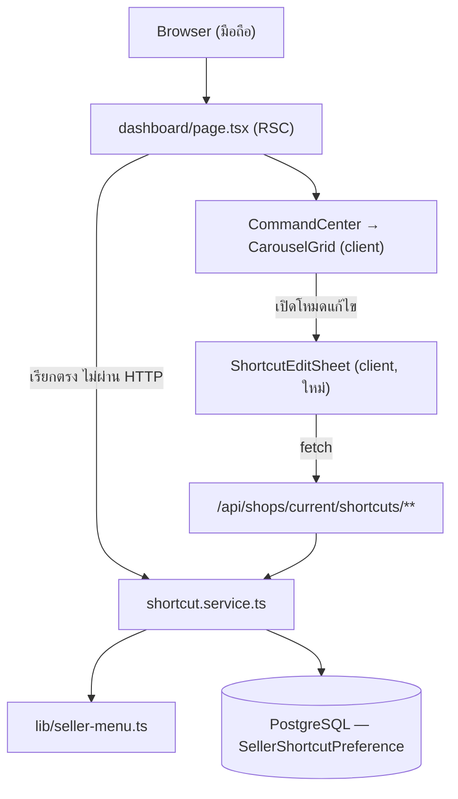
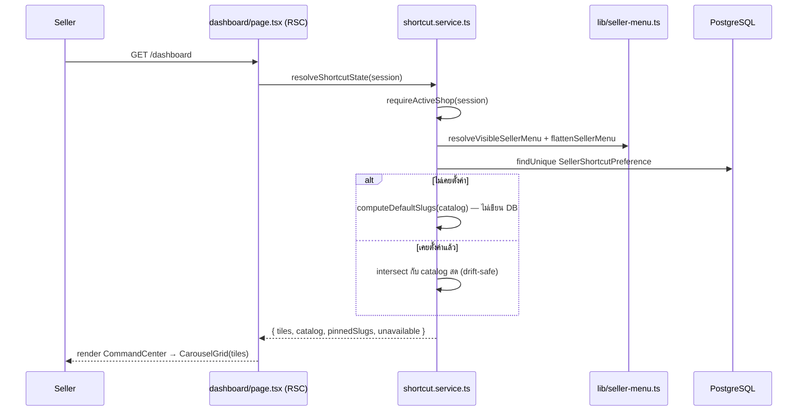
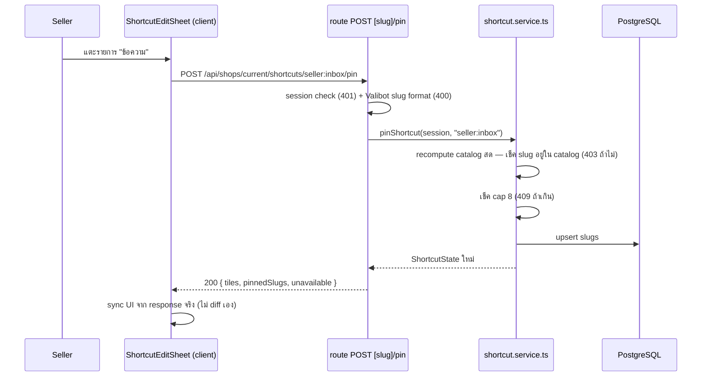
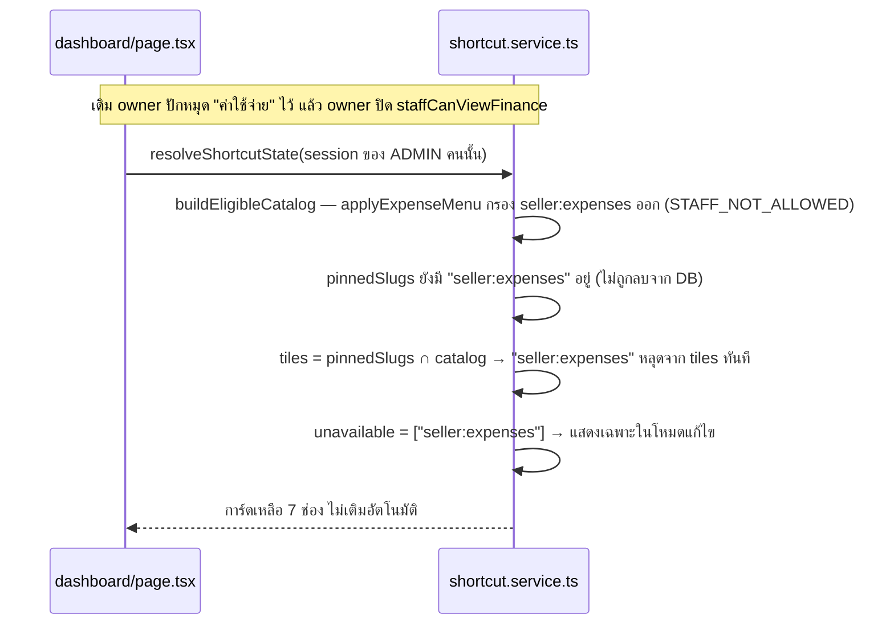

> **โมดูล:** M00027-CustomizableShortcuts
> **ประเภทเอกสาร:** Software Design Specification (SDS)
> **เวอร์ชัน:** 1.0
> **วันที่จัดทำ:** 2026-08-02
> **สถานะ:** Draft
> **เจ้าของเอกสาร:** safepay-planner (ดู [[Feature-Docs-Ownership]])

# SDS: เมนูลัดที่ตั้งค่าเองได้ (Customizable Shortcuts)

---

## 1. บทนำ & References

เอกสารนี้ระบุการออกแบบระดับ component ที่ developer นำไปเขียนโค้ดได้ตรง ๆ — ไฟล์ไหน ฟังก์ชันอะไร รับ/คืนอะไร และจุดไหนห้ามพลาด (โดยเฉพาะ error-mapping ข้ามไฟล์ตามบทเรียน feature 00003)

| อ้างอิง | ใช้ทำอะไร |
|---------|----------|
| [[SRS]] | TFR ทุกข้อที่ออกแบบนี้ต้องตอบ |
| [[DATABASE]] | schema `SellerShortcutPreference` |
| [[API]] | contract ของแต่ละ endpoint |
| `src/app/(paces)/seller/(dashboard)/_seller-menu.ts` | ต้นทางที่ต้อง refactor (ย้าย logic ไป `src/lib`) |
| `src/app/(paces)/seller/(dashboard)/layout.tsx` | จุดเรียกตัวกรองปัจจุบัน (บรรทัด 150-162) ที่ต้องแก้ให้เรียกผ่านฟังก์ชันใหม่ |
| `src/app/(paces)/seller/(dashboard)/dashboard/page.tsx` | จุด SSR ที่ต้องเพิ่มการ fetch shortcut state |
| `src/app/(paces)/seller/(dashboard)/dashboard/components/{CommandCenter,CarouselGrid,ShortcutGrid}.tsx` | UI ที่ต้องแก้/ลบ |
| `src/services/pin.service.ts` + `src/app/api/seller/products/[id]/{pin,unpin}/route.ts` | precedent ของ route/error pattern ที่ endpoint ใหม่ copy โครงมา |
| `src/services/expense-access.service.ts` | precedent discriminated-union return (`ExpenseAccessDecision`) ที่ `resolveShortcutState` มิเรอร์ |

---

## 2. Architecture Overview

### 2.1 ไฟล์ที่ต้องสร้าง/แก้

| ไฟล์ | สถานะ | หน้าที่ |
|------|-------|---------|
| `src/lib/seller-menu.ts` | **ใหม่** | ย้าย `sellerMenuItems` + `apply*` ทั้งหมดจาก `_seller-menu.ts` แบบ byte-identical + เพิ่ม `resolveVisibleSellerMenu()` + `flattenSellerMenu()` |
| `src/app/(paces)/seller/(dashboard)/_seller-menu.ts` | แก้ (ลดเหลือ) | `export * from '@/lib/seller-menu'` — เก็บไว้กัน import path เดิม (`layout.tsx`, `getSellerPageTitle.ts`) พัง |
| `src/app/(paces)/seller/(dashboard)/layout.tsx` | แก้ (บรรทัด 150-162) | ใช้ `applyChatBadge(resolveVisibleSellerMenu(sellerMenuItems, ctx), unreadChatCount)` แทนการ compose 6 ชั้นตรง ๆ |
| `src/services/shortcut.service.ts` | **ใหม่** | catalog derivation, `resolveShortcutState`, `pinShortcut`, `unpinShortcut`, `resetShortcuts`, custom Error classes |
| `prisma/schema.prisma` | แก้ | model ใหม่ `SellerShortcutPreference` + relation field บน `User`/`Shop` |
| `prisma/migrations/<ts>_seller_shortcut_preference/migration.sql` | **ใหม่** | เขียนมือ |
| `src/app/api/shops/current/shortcuts/route.ts` | **ใหม่** | `GET` |
| `src/app/api/shops/current/shortcuts/[slug]/pin/route.ts` | **ใหม่** | `POST` |
| `src/app/api/shops/current/shortcuts/[slug]/unpin/route.ts` | **ใหม่** | `POST` |
| `src/app/api/shops/current/shortcuts/reset/route.ts` | **ใหม่** | `POST` |
| `src/app/(paces)/seller/(dashboard)/dashboard/page.tsx` | แก้ | fetch entitlement/expense/vertical context เพิ่ม (mirror pattern ที่มีอยู่แล้วสำหรับ `packageStatus`) + เรียก `resolveShortcutState()` แทนการ import `SHORTCUT_TILES` static |
| `src/app/(paces)/seller/(dashboard)/dashboard/components/CommandCenter.tsx` | แก้ | รับ `tiles`/`editHref data` จาก page แทน `SHORTCUT_TILES` static import |
| `src/app/(paces)/seller/(dashboard)/dashboard/components/CarouselGrid.tsx` | แก้ (simplify) | ตัด pagination/dots/`IntersectionObserver` ออก (dead code เพราะ cap 8 = 1 หน้าเสมอ ตาม PRD §3.3) + เพิ่มปุ่ม "แก้ไข" ที่ card-header (FR-SC-09) + เปิด `ShortcutEditSheet` |
| `src/app/(paces)/seller/(dashboard)/dashboard/components/ShortcutEditSheet.tsx` | **ใหม่** | โหมดแก้ไข (bottom sheet) — เรียก 4 endpoint, แสดง eligible + unavailable, ปุ่มรีเซ็ต + Sweet Alert ยืนยัน |
| `src/app/(paces)/seller/(dashboard)/dashboard/components/ShortcutGrid.tsx` | **ลบ** | dead code ยืนยันแล้ว (v8, ไม่มี import จริงนอกเอกสาร — superseded โดย `CarouselGrid` ตั้งแต่ v10) |
| `src/app/(paces)/seller/(dashboard)/dashboard/_constants/command-center.ts` | แก้ | ตัด `SHORTCUT_TILES` static array ออก (ย้าย type `ShortcutTile` ไว้ แต่ข้อมูลมาจาก service แล้ว) |

🛑 **ต้องผ่าน `safepay-ux` ก่อนแก้ทุกไฟล์ UI ข้างบน** (Hard Rule 8) — SDS นี้กำหนดแค่ data contract/ไฟล์/หน้าที่ ไม่ใช่ markup

### 2.2 มุมมองสถาปัตยกรรม



---

## 3. Component Design

### 3.1 `src/lib/seller-menu.ts` (ใหม่ — ย้าย + เพิ่ม)

```ts
// ย้าย byte-identical จาก _seller-menu.ts เดิม:
export const sellerMenuItems: MenuItemType[] = [ /* เหมือนเดิมทุกบรรทัด */ ]
export function applyInventoryGate(...) { /* เหมือนเดิม */ }
export function applyChatBadge(...) { /* เหมือนเดิม */ }
export function applyStaffMenu(...) { /* เหมือนเดิม */ }
export function applyExpenseMenu(...) { /* เหมือนเดิม */ }
export function applyVerticalMenu(...) { /* เหมือนเดิม */ }
export function applyAppointmentMenu(...) { /* เหมือนเดิม */ }

/**
 * resolveVisibleSellerMenu — compose ตัวกรองสิทธิ์ "ที่กรอง" ทั้งหมด (ไม่รวม applyChatBadge
 * ซึ่งเป็นคอสเมติกล้วน ไม่ filter อะไร) ลำดับเดียวกับที่ layout.tsx compose อยู่ก่อนหน้านี้
 * (SRS TFR-001) — ใช้ร่วมกันโดย layout.tsx (sidebar) และ shortcut.service.ts (catalog)
 * เพื่อกันความเสี่ยง permission-drift (PRD §6.2)
 */
export function resolveVisibleSellerMenu(
  items: MenuItemType[],
  ctx: {
    entitlement: { status: EntitlementStatus; package: InventoryPackage | null }
    staffCtx: { kind: 'PERSONAL' | 'BUSINESS'; role: 'OWNER' | 'ADMIN' }
    expenseDecision: ExpenseAccessDecision
    shop: { kind: string; vertical: string }
  },
): MenuItemType[] {
  return applyVerticalMenu(
    applyAppointmentMenu(
      applyExpenseMenu(
        applyStaffMenu(
          applyInventoryGate(items, ctx.entitlement),
          ctx.staffCtx,
        ),
        ctx.expenseDecision,
      ),
      { kind: ctx.shop.kind, vertical: ctx.shop.vertical },
    ),
    ctx.shop.vertical,
  )
}

/** flattenSellerMenu — recursive flatten (รวม isTitle groups) → เฉพาะ item ที่มี url
 *  mirror ของ flattenItems ใน getSellerPageTitle.ts (ไม่แก้ไฟล์นั้น — ลดความเสี่ยง diff) */
export function flattenSellerMenu(items: MenuItemType[]): MenuItemType[] {
  const result: MenuItemType[] = []
  for (const item of items) {
    if (item.url) result.push(item)
    if (item.children?.length) result.push(...flattenSellerMenu(item.children))
  }
  return result
}
```

### 3.2 `src/app/(paces)/seller/(dashboard)/_seller-menu.ts` (แก้)

```ts
// เหลือแค่ re-export กัน import path เดิมพัง (layout.tsx, getSellerPageTitle.ts)
export * from '@/lib/seller-menu'
```

### 3.3 `layout.tsx` — จุดที่แก้ (บรรทัด 150-162 เดิม)

```ts
// เดิม: compose 6 ชั้นตรง ๆ (applyVerticalMenu(applyAppointmentMenu(applyExpenseMenu(
//        applyStaffMenu(applyChatBadge(applyInventoryGate(...))))))))
// ใหม่: แยก filter (reusable) ออกจาก cosmetic (applyChatBadge, layout-only)
const menuItems = applyChatBadge(
  resolveVisibleSellerMenu(sellerMenuItems, {
    entitlement: entitlementInfo,
    staffCtx: { kind: active.kind, role: active.role },
    expenseDecision: expenseAccessDecision,
    shop: { kind: active.kind, vertical: shop.vertical },
  }),
  unreadChatCount,
)
```

⚠️ **Regression check บังคับ:** ผลลัพธ์ `menuItems` ต้อง deep-equal กับโค้ดเดิมทุก role/vertical combination — เพราะ `applyChatBadge` ไม่ filter อะไรเลย (มีแค่แต่ง `badge` บน `seller:inbox`) การย้ายมันไปอยู่ "นอก" การ compose filter (แทนที่จะแทรกกลางเหมือนเดิม) ไม่เปลี่ยนผลลัพธ์สุดท้าย — แต่ต้อง verify ด้วยตาก่อน merge

### 3.4 `src/services/shortcut.service.ts` (ใหม่)

```ts
import { prisma } from '@/lib/prisma'
import { requireActiveShop } from '@/lib/shop-context'
import { getEntitlementInfo } from '@/services/inventory-entitlement.service'
import { resolveExpenseAccess } from '@/services/expense-access.service'
import { sellerMenuItems, resolveVisibleSellerMenu, flattenSellerMenu } from '@/lib/seller-menu'
import type { MenuItemType } from '@/types'

const EXCLUDED_SLUGS = new Set(['seller:dashboard'])
export const MAX_SHORTCUTS = 8
export const MIN_SHORTCUTS = 1

export type ShortcutCatalogItem = {
  slug: string
  label: string
  icon: string          // MenuItemType.icon — tabler set, ไม่มี prefix (ผ่าน Icon wrapper เดิม)
  url: string
  badge?: { className: string; text: string }
}

export type ShortcutState = {
  catalog: ShortcutCatalogItem[]                                   // เลือกปักได้ (เรียง SSOT order)
  pinnedSlugs: string[]                                             // saved หรือ default, เรียง SSOT order
  unavailable: { slug: string; label: string; icon: string }[]      // ปักไว้แต่ตอนนี้ไม่ eligible
  tiles: ShortcutCatalogItem[]                                      // pinnedSlugs ∩ catalog — สิ่งที่การ์ด render
}
export type ShortcutAccessResult = ShortcutState | { kind: 'NO_SHOP' }

// custom errors (SRS TFR-010 — ทุกตัวต้องมี route catch คู่กัน ดู API.md §5)
export class ShortcutSlugNotInCatalogError extends Error {
  constructor(readonly slug: string) { super('SLUG_NOT_IN_CATALOG') }
}
export class ShortcutCapExceededError extends Error {
  constructor() { super('CAP_EXCEEDED') }
}
export class ShortcutMinRequiredError extends Error {
  constructor() { super('MIN_REQUIRED') }
}

/** buildEligibleCatalog — reuse resolveVisibleSellerMenu ตรง ๆ (SRS TFR-002) — ห้าม filter เอง */
async function buildEligibleCatalog(active: Awaited<ReturnType<typeof requireActiveShop>> & {}): Promise<ShortcutCatalogItem[]> {
  const shop = active!.shop
  // fail-closed เหมือน layout.tsx/dashboard/page.tsx — error → ค่าปลอดภัยสุด ไม่ throw ทำหน้าพัง
  let entitlement: { status: EntitlementStatus; package: InventoryPackage | null } = { status: 'NOT_SUBSCRIBED', package: null }
  try { entitlement = await getEntitlementInfo(shop.id) } catch (e) { console.error('[shortcut] getEntitlementInfo failed', e) }

  let expenseDecision: ExpenseAccessDecision = { kind: 'NO_SHOP' }
  try {
    expenseDecision = await resolveExpenseAccess({ user: { id: active!.shop.userId } }) // ดู 3.4.1 หมายเหตุ
  } catch (e) { console.error('[shortcut] resolveExpenseAccess failed', e) }

  const visible = resolveVisibleSellerMenu(sellerMenuItems, {
    entitlement,
    staffCtx: { kind: active!.kind, role: active!.role },
    expenseDecision,
    shop: { kind: active!.kind, vertical: shop.vertical },
  })

  return flattenSellerMenu(visible)
    .filter((i): i is MenuItemType & { url: string } => !!i.url && !EXCLUDED_SLUGS.has(i.slug))
    .map((i) => ({ slug: i.slug, label: i.label, icon: i.icon ?? 'circle', url: i.url, badge: i.badge }))
}

function computeDefaultSlugs(catalog: ShortcutCatalogItem[]): string[] {
  return catalog.slice(0, MAX_SHORTCUTS).map((c) => c.slug)
}

/** describeAnySlug — หา label/icon จาก SSOT "ไม่ผ่านตัวกรอง" (โครงสร้างยังอยู่จริง แค่ถูกกรองสิทธิ์)
 *  ใช้เฉพาะแสดงผล unavailable — SRS TFR-005 */
function describeAnySlug(slug: string): { label: string; icon: string } | null {
  const found = flattenSellerMenu(sellerMenuItems).find((i) => i.slug === slug)
  return found ? { label: found.label, icon: found.icon ?? 'circle' } : null
}

export async function resolveShortcutState(
  session: { user?: { id?: string | null; activeShopId?: string | null } | null } | null,
): Promise<ShortcutAccessResult> {
  const active = await requireActiveShop(session)
  if (!active) return { kind: 'NO_SHOP' }
  const userId = session!.user!.id!

  const catalog = await buildEligibleCatalog(active)
  const catalogIndex = new Map(catalog.map((c, i) => [c.slug, i]))
  const catalogSet = new Set(catalog.map((c) => c.slug))

  const pref = await prisma.sellerShortcutPreference.findUnique({
    where: { userId_shopId: { userId, shopId: active.shop.id } },
  })
  const rawSlugs = pref?.slugs ?? computeDefaultSlugs(catalog) // TFR-004: compute-on-read, ไม่ persist

  const pinnedSlugs = [...rawSlugs].sort(
    (a, b) => (catalogIndex.get(a) ?? Number.MAX_SAFE_INTEGER) - (catalogIndex.get(b) ?? Number.MAX_SAFE_INTEGER),
  ) // TFR-003

  const unavailable = pinnedSlugs
    .filter((s) => !catalogSet.has(s))
    .map((s) => ({ slug: s, ...(describeAnySlug(s) ?? { label: s, icon: 'circle' }) }))

  const tiles = pinnedSlugs.filter((s) => catalogSet.has(s)).map((s) => catalog.find((c) => c.slug === s)!)

  return { catalog, pinnedSlugs, unavailable, tiles }
}

export async function pinShortcut(session: Parameters<typeof resolveShortcutState>[0], slug: string): Promise<ShortcutAccessResult> {
  const active = await requireActiveShop(session)
  if (!active) return { kind: 'NO_SHOP' }
  const userId = session!.user!.id!

  const catalog = await buildEligibleCatalog(active)
  if (!catalog.some((c) => c.slug === slug)) throw new ShortcutSlugNotInCatalogError(slug)

  const pref = await prisma.sellerShortcutPreference.findUnique({ where: { userId_shopId: { userId, shopId: active.shop.id } } })
  const current = pref?.slugs ?? computeDefaultSlugs(catalog)

  let next = current
  if (!current.includes(slug)) {
    if (current.length >= MAX_SHORTCUTS) throw new ShortcutCapExceededError()
    next = [...current, slug]
  }

  await prisma.sellerShortcutPreference.upsert({
    where: { userId_shopId: { userId, shopId: active.shop.id } },
    create: { userId, shopId: active.shop.id, slugs: next },
    update: { slugs: next },
  })
  return resolveShortcutState(session)
}

export async function unpinShortcut(session: Parameters<typeof resolveShortcutState>[0], slug: string): Promise<ShortcutAccessResult> {
  const active = await requireActiveShop(session)
  if (!active) return { kind: 'NO_SHOP' }
  const userId = session!.user!.id!

  const catalog = await buildEligibleCatalog(active)
  const pref = await prisma.sellerShortcutPreference.findUnique({ where: { userId_shopId: { userId, shopId: active.shop.id } } })
  const current = pref?.slugs ?? computeDefaultSlugs(catalog)

  if (!current.includes(slug)) {
    // idempotent — มิเรอร์ unpinProduct (unpin ฟรีเสมอ)
    if (!pref) return resolveShortcutState(session)
  } else {
    // MIN_REQUIRED นับเฉพาะช่องที่ "ยังใช้ได้จริง" — ช่องที่สิทธิ์หลุดไปแล้วไม่นับ
    // กฎนี้มีไว้กันการ์ดว่าง แต่ช่องที่ render ไม่ได้ก็ทำให้ว่างอยู่แล้ว การบล็อกจึงไม่กัน
    // อะไร แค่ขังผู้ใช้ไว้กับช่องที่มองไม่เห็นและถอดไม่ออก (คำตัดสิน user 2026-08-02)
    const usable = current.filter((s) => catalog.some((c) => c.slug === s))
    if (usable.includes(slug) && usable.length <= MIN_SHORTCUTS) throw new ShortcutMinRequiredError()
  }

  const next = current.filter((s) => s !== slug)
  // เขียน next ตรง ๆ รวมถึงกรณีว่าง — ห้าม fallback เป็น current เพราะจะทำให้การถอดช่อง
  // unavailable ตัวสุดท้าย "สำเร็จแบบเงียบ ๆ แต่ไม่เกิดอะไรขึ้น" (DB ยังเก็บ slug เดิมไว้)
  // CHECK ที่ DB จึงเป็น BETWEEN 0 AND 8 — ดู DATABASE.md §4
  await prisma.sellerShortcutPreference.upsert({
    where: { userId_shopId: { userId, shopId: active.shop.id } },
    create: { userId, shopId: active.shop.id, slugs: next },
    update: { slugs: next },
  })
  return resolveShortcutState(session)
}

export async function resetShortcuts(session: Parameters<typeof resolveShortcutState>[0]): Promise<ShortcutAccessResult> {
  const active = await requireActiveShop(session)
  if (!active) return { kind: 'NO_SHOP' }
  const userId = session!.user!.id!

  const catalog = await buildEligibleCatalog(active) // สด ณ ขณะกด (TFR-007)
  const next = computeDefaultSlugs(catalog)

  await prisma.sellerShortcutPreference.upsert({
    where: { userId_shopId: { userId, shopId: active.shop.id } },
    create: { userId, shopId: active.shop.id, slugs: next },
    update: { slugs: next },
  })
  return resolveShortcutState(session)
}
```

> **3.4.1 หมายเหตุสำคัญ — `resolveExpenseAccess` รับ `session` ไม่ใช่ `shop`:** signature จริงของ `resolveExpenseAccess(session)` เรียก `requireActiveShop(session)` **ซ้ำ** ภายในตัวมันเอง (ดู `src/services/expense-access.service.ts:17`) — ถ้า `shortcut.service.ts` เรียกมันตรง ๆ ด้วย `session` เดิม จะมีการ resolve active shop **สองรอบ** ต่อ request (คนละครั้งกับที่ `resolveShortcutState`/`pinShortcut` เรียกไปแล้ว) เป็นการ query ซ้ำที่ไม่จำเป็นแต่ไม่ผิด (`requireActiveShop` เป็น read-only, idempotent) — **ยอมรับได้ในระดับนี้** (เทียบเท่ากับที่ `dashboard/page.tsx` เรียก `getSubscriptionStatus` ซ้ำเพราะ RSC แชร์ prop ข้าม layout/page ไม่ได้อยู่แล้ว) ไม่ต้อง optimize ในรอบแรก — ถ้าพบว่าเป็นคอขวดจริงค่อยทำ variant ที่รับ `active` ตรง ๆ ทีหลัง

### 3.5 UI — `CarouselGrid.tsx` (แก้ — simplify + เพิ่มปุ่มแก้ไข)

- ตัด `pages`/`activePage`/`IntersectionObserver`/dot pagination ออกทั้งหมด — **cap 8 = สูงสุด 1 หน้าเสมอ** (PRD §3.3 ยืนยันเองว่า pagination ไม่จำเป็นแล้ว) เหลือ grid 4×2 เดียวแบบ static (โครง markup ใกล้เคียง `ShortcutGrid.tsx` เดิมที่ถูกลบ — นำ pattern `.card`/`.card-header`/`.card-title` มาใช้ต่อได้)
- เพิ่มปุ่ม "แก้ไข" ที่ `card-header` (ข้าง "เมนูลัด") — เปิด `ShortcutEditSheet` (state local, `useState`)
- ถ้า `tiles.length === 0` (edge case: preference ทุกตัวกลาย unavailable พร้อมกัน) → แสดง empty-state พร้อมปุ่ม "ตั้งเมนูลัด" (safepay-ux กำหนด markup)

### 3.6 UI — `ShortcutEditSheet.tsx` (ใหม่, client)

- เปิดแล้ว `GET /api/shops/current/shortcuts` ครั้งเดียว
- แสดง 2 กลุ่ม: **"ปักหมุดอยู่"** (pinnedSlugs ∩ catalog + unavailable ท้ายสุดพร้อม badge "ใช้ไม่ได้แล้ว") และ **"เลือกเพิ่ม"** (catalog - pinnedSlugs)
- แต่ละ toggle ยิง `pin`/`unpin` ทันที (optimistic UI ได้ แต่ sync ด้วย response จริงเสมอ — ไม่ต้อง diff array เอง)
- ปุ่ม "รีเซ็ตเป็นค่าเริ่มต้น" → Sweet Alert ยืนยันก่อน (convention `docs/conventions/...` Sweet Alert) → เรียก `reset`
- toast ทุกจุดผ่าน `pacesToast` (Hard Rule 9) — error จาก 409/403 แสดงข้อความจาก response ตรง ๆ (ธุรกิจ-ระดับ ไม่ใช่ debug message)
- **ห้าม emoji** (Hard Rule 12) — ไอคอนสถานะ "ใช้ไม่ได้แล้ว" ใช้ tabler icon จริง (เช่น `tabler:alert-triangle`) ไม่ใช่ตัวอักษร/emoji

---

## 4. Data Flow

### 4.1 SSR — เปิด `/dashboard` ครั้งแรก



### 4.2 CSR — pin หนึ่งรายการจากโหมดแก้ไข



### 4.3 กรณี Entitlement Drift (เปิด dashboard หลังสิทธิ์หมด)



---

## 5. Integration Points

| จุดเชื่อม | รายละเอียด | ข้อควรระวัง |
|----------|-----------|-------------|
| `lib/seller-menu.ts` (ย้ายจาก `_seller-menu.ts`) | SSOT ของ label/icon/url/slug + ตัวกรองสิทธิ์ | ห้ามแก้ logic ตัวกรองระหว่างย้าย — ต้อง byte-identical |
| `layout.tsx` (sidebar) | ใช้ `resolveVisibleSellerMenu` ร่วมกับ catalog | regression check ผลลัพธ์เหมือนเดิม 100% |
| `requireActiveShop` | resolve (userId, shopId) ของทุก request | ห้าม trust `userId`/`shopId` จาก client |
| `getEntitlementInfo`, `resolveExpenseAccess` | input ของตัวกรอง | ทั้งสองมี fail-closed pattern ของตัวเอง — service ใหม่ต้อง try/catch ครอบเหมือนกัน |
| `CommandCenter.tsx` | รับ `tiles` แทน `SHORTCUT_TILES` static | `_constants/command-center.ts` เก็บ type `ShortcutTile` ไว้ (ใช้เป็น alias ของ `ShortcutCatalogItem`) แต่เลิก export ค่าคงที่ |
| Pin Products (feature 00013) | precedent route/service pattern (POST pin/unpin, idempotent, error class → route catch) | copy โครง ไม่ copy business logic |

---

## 6. Technical Decisions

| # | ประเด็น | ทางเลือกที่พิจารณา | ตัดสิน | เหตุผล |
|---|---------|-------------------|--------|--------|
| D-01 | ที่เก็บตัวกรองสิทธิ์ | คงไว้ที่ `_seller-menu.ts` (app layer) / **ย้ายไป `src/lib`** | **ย้ายไป `src/lib/seller-menu.ts`** | service layer ห้าม import จาก `src/app/**` (ผิดทิศทาง layering) — เป็นเงื่อนไขบังคับให้ reuse ได้จริงโดยไม่ต้องเขียนกฎสิทธิ์คู่ขนาน |
| D-02 | รูปแบบ mutation API | `PUT` แทนที่ทั้งอาร์เรย์ครั้งเดียว / **`POST` add-one + remove-one แยก endpoint** | **add-one/remove-one** | ตรงกับ BRD ที่บรรยาย add/remove เป็น atomic action แยกกัน + มิเรอร์ precedent `pin`/`unpin` ที่มีอยู่แล้วในโปรเจกต์เป๊ะ (ลดของใหม่ที่ reviewer ต้องเรียนรู้) |
| D-03 | เวลาที่สร้างแถว DB | เขียนทันทีตอนเปิดหน้าครั้งแรก (persist-on-first-view) / **เขียนเมื่อมี mutation จริงเท่านั้น (compute-on-read)** | **compute-on-read** | เลี่ยง write-on-every-view; มิเรอร์ lazy-create ของ Personal shop (feature 00012) |
| D-04 | เก็บลำดับที่ผู้ใช้กดไหม | เก็บ order index ต่อ slug / **ไม่เก็บ — sort ตาม SSOT ทุกครั้งที่ render** | **ไม่เก็บลำดับ** | ตรง BR §3.7 (ไม่มี manual reorder ใน MVP) — เก็บลำดับที่ไม่มีใครใช้คือ field ที่ไม่จำเป็น |
| D-05 | block ด้วย `active.locked` ไหม | block เหมือน `pinProduct` / **ไม่ block** | **ไม่ block** | preference เป็นการตั้งค่าส่วนบุคคล ไม่ใช่ spend/exposure action ของร้าน — ต่างบริบทกับ pin สินค้า |
| D-06 | error เมื่อ slug ไม่อยู่ใน catalog | 404 (ซ่อนการมีอยู่ ตาม pattern PII) / **403 FORBIDDEN-style (`SLUG_NOT_IN_CATALOG`)** | **403-style code, HTTP 403** | โครงสร้างเมนูไม่ใช่ข้อมูลอ่อนไหวแบบ PII ของ 00024 — 403 สื่อสารชัดกว่าเวลา debug และไม่ได้เปิดเผยอะไรที่เป็นความลับ |
| D-07 | CarouselGrid เก็บ pagination logic ไว้ไหม | เก็บไว้เผื่ออนาคต / **ตัดออก (simplify)** | **ตัดออก** | cap 8 พิสูจน์แล้วว่า ≤1 หน้าเสมอ — เก็บ dead code ไว้คือหนี้ที่ไม่มีประโยชน์ (PRD §3.3 ระบุเหตุผลเดียวกัน) |
| D-08 | ลบ `ShortcutGrid.tsx` ไหม | เก็บไว้เผื่อใช้ / **ลบ** | **ลบ** | verified 0 import จริงนอกเอกสาร (`CommandCenter.tsx` ใช้ `CarouselGrid` มาตั้งแต่ v10) — dead code ที่ชัดเจน |

---

## 7. Traceability

| TFR (SRS) | Component ที่ตอบ |
|-----------|-----------------|
| TFR-001 | `lib/seller-menu.ts` §3.1, `layout.tsx` §3.3 |
| TFR-002 | `buildEligibleCatalog()` §3.4 |
| TFR-003 | sort ใน `resolveShortcutState()` §3.4 |
| TFR-004 | compute-on-read ใน `resolveShortcutState()`/`pinShortcut()` §3.4 |
| TFR-005 | `unavailable` + `describeAnySlug()` §3.4 |
| TFR-006 | `pinShortcut()`/`unpinShortcut()` cap/min check §3.4 |
| TFR-007 | `resetShortcuts()` §3.4 |
| TFR-008 | `requireActiveShop` ทุกฟังก์ชัน §3.4 |
| TFR-009 | ไม่มีการเช็ค `active.locked` (ตั้งใจ) §3.4 |
| TFR-010 | ตาราง error-mapping เต็มใน [[API]] §5 |

---

## 8. สรุป

- จุดที่ต้อง implement ให้ถูกที่สุดคือ **D-01/TFR-001** — ถ้าไม่ย้าย logic ไป `src/lib` ก่อน จะเกิดแรงจูงใจให้ copy-paste ตัวกรองสิทธิ์ซ้ำในเลเยอร์ service ซึ่งเป็นความเสี่ยง permission-drift ที่ PRD เตือนไว้เป็นอันดับ 1
- ของใหม่ทั้งหมด additive: 1 model DB, 1 service ใหม่, 4 endpoint ใหม่, ปรับ 1 บรรทัดใน `layout.tsx`, ลบ 1 dead-code component, simplify 1 component (`CarouselGrid`)
- ข้อห้ามที่ reviewer ต้องจับ: service import จาก `src/app/**`, สร้าง DB row ตอน SSR โดยไม่มี intent, enforce cap/min แค่ client, ตัวกรองสิทธิ์เขียนซ้ำ, error type ใหม่ที่ไม่มี route catch ครอบ (ดู [[API]] §5)
- MIN_REQUIRED เคาะแล้ว (user 2026-08-02): นับเฉพาะช่องที่ยังใช้ได้ — ถอดช่องที่สิทธิ์หลุดแล้วได้เสมอ ตกลงที่ empty-state ของการ์ด (§3.6) ซึ่งต้องมีอยู่แล้วเพื่อรองรับ drift
