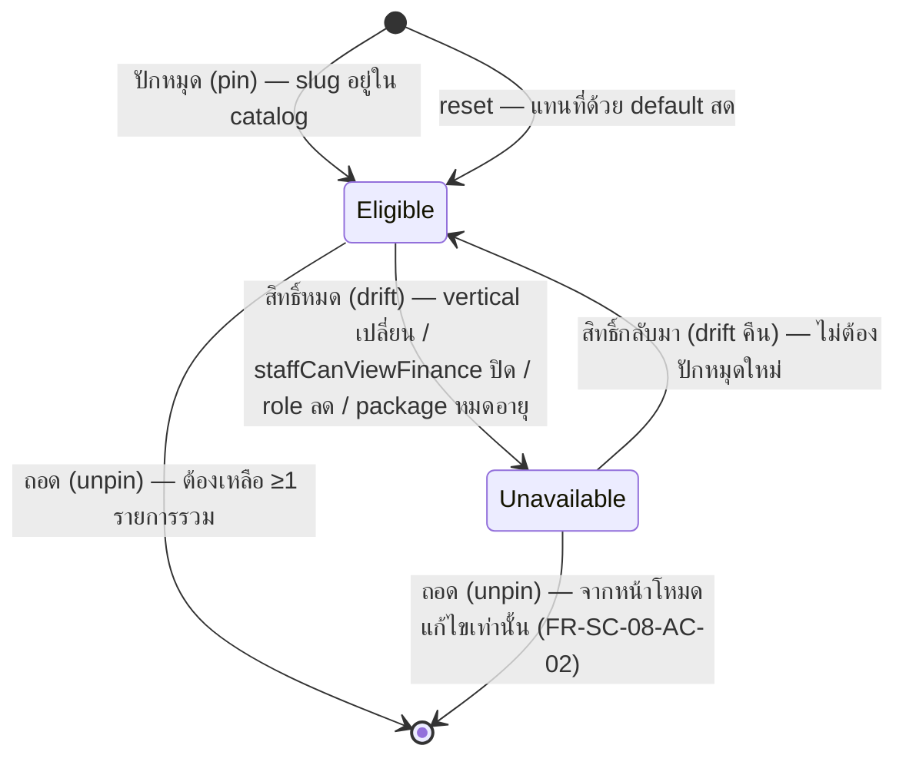

> **โมดูล:** M00027-CustomizableShortcuts
> **ประเภทเอกสาร:** Software Requirements Specification (SRS) — TECHNICAL
> **เวอร์ชัน:** 1.0
> **วันที่จัดทำ:** 2026-08-02
> **สถานะ:** Draft
> **เจ้าของเอกสาร:** safepay-planner (ดู [[Feature-Docs-Ownership]])

# SRS: เมนูลัดที่ตั้งค่าเองได้ (Customizable Shortcuts)

---

## 1. บทนำ (Introduction)

### 1.1 วัตถุประสงค์

เอกสารนี้แปลง Functional Requirements ใน [[BRD]] เป็นข้อกำหนดเชิงเทคนิคที่ developer นำไป implement ได้ตรง ๆ ครอบคลุมสถาปัตยกรรม, TFR, interface, ข้อมูล, สิทธิ์, validation, NFR และความเสี่ยงเชิงสถาปัตยกรรม

### 1.2 ขอบเขต

| อยู่ในขอบเขต | นอกขอบเขต |
|-------------|-----------|
| ตาราง `SellerShortcutPreference` (ใหม่) | เมนูลัดบนเดสก์ท็อป (§3.9 PRD) |
| การ derive แคตตาล็อกจาก `sellerMenuItems` (SSOT) reuse ตัวกรองเดิมทั้งหมด | Manual drag-to-reorder (§3.7 PRD) |
| API อ่าน/บันทึก/ถอด/รีเซ็ต preference ต่อ (userId, shopId) | Custom label/icon ต่อ tile |
| การ์ดเมนูลัด + โหมดแก้ไข บน `/dashboard` มือถือ (`CommandCenter`/`CarouselGrid`) | Custom/external link เป็นเมนูลัด |
| การจัดการ entitlement drift (ซ่อน/แสดงรายการที่หมด/ได้สิทธิ์คืน) | Bulk import/export preference ข้ามร้าน |
| Refactor `_seller-menu.ts` composition ให้ reuse ได้จาก service layer | แก้ logic ตัวกรองสิทธิ์เดิม (`applyStaffMenu` ฯลฯ) — ใช้ตามที่เป็น |

### 1.3 เอกสารอ้างอิง

| เอกสาร | ใช้ทำอะไร |
|--------|----------|
| [[PRD]] / [[BRD]] | ที่มาของทุก TFR ในเอกสารนี้ |
| [[DATABASE]] | schema ของ `SellerShortcutPreference` |
| `src/app/(paces)/seller/(dashboard)/_seller-menu.ts` | SSOT ของเมนู sidebar + ตัวกรองสิทธิ์ที่ต้อง reuse ทั้งหมด |
| `src/app/(paces)/seller/(dashboard)/layout.tsx` | composition ปัจจุบันของตัวกรอง 6 ตัว (จุดที่ต้อง refactor ให้ reuse ได้) |
| `src/app/(paces)/seller/(dashboard)/dashboard/**` | จุด render การ์ดเมนูลัดปัจจุบัน (`CommandCenter`/`CarouselGrid`/`ShortcutGrid`) |
| `docs/conventions/paces-toast.md`, `docs/conventions/reference-vs-theme-source.md` | convention UI ที่ safepay-ux ต้องอิงตอนออกแบบโหมดแก้ไข |
| memory `feedback_rsc_dal_authz`, `feedback_service_error_route_mapping` | หลัก ownership-in-WHERE และ error-mapping ที่ TFR นี้ยึด |

### 1.4 นิยามและตัวย่อ

| คำ | ความหมาย |
|----|----------|
| **Catalog (แคตตาล็อก)** | ผลลัพธ์ของ `sellerMenuItems` หลัง apply ตัวกรองสิทธิ์ทั้งหมด (ไม่รวม `seller:dashboard`) — สิ่งที่ผู้ใช้คนหนึ่งเลือกปักหมุดได้ ณ ขณะนั้น |
| **Preference** | แถวใน `SellerShortcutPreference` — ชุด slug ที่ผู้ใช้คนหนึ่งปักหมุดไว้สำหรับร้านหนึ่ง |
| **Eligible** | slug ที่อยู่ใน catalog ปัจจุบัน (มีสิทธิ์เข้าถึงจริง) |
| **Unavailable / Drift** | slug ที่เคยปักหมุดไว้ (อยู่ใน preference) แต่ตอนนี้ไม่อยู่ใน catalog แล้ว |
| **Tile** | รายการที่ render จริงบนการ์ด = eligible ∩ preference เรียงตาม SSOT order |

---

## 2. ภาพรวมสถาปัตยกรรม (Architecture Overview)

### 2.1 ตำแหน่งในระบบ

```mermaid
flowchart TD
    subgraph seller["(paces) ฝั่งร้าน — Paces, มือถือเท่านั้น"]
        A1["CommandCenter (RSC) — /dashboard lg:hidden"]
        A2["CarouselGrid (client) — การ์ดเมนูลัด + ปุ่มแก้ไข"]
        A3["ShortcutEditSheet (client, ใหม่) — โหมดแก้ไข"]
    end

    subgraph api["API Layer /api/shops/current/shortcuts"]
        B1["GET  — แคตตาล็อก+preference"]
        B2["POST [slug]/pin"]
        B3["POST [slug]/unpin"]
        B4["POST reset"]
    end

    subgraph lib["src/lib/seller-menu.ts (ย้ายจาก _seller-menu.ts)"]
        C1[sellerMenuItems SSOT]
        C2["applyStaffMenu / applyVerticalMenu /
        applyAppointmentMenu / applyExpenseMenu /
        applyInventoryGate"]
        C3["resolveVisibleSellerMenu() ใหม่"]
        C4["flattenSellerMenu() ใหม่"]
    end

    subgraph svc["src/services/shortcut.service.ts (ใหม่)"]
        D1[resolveShortcutState]
        D2[pinShortcut / unpinShortcut / resetShortcuts]
    end

    subgraph db[(PostgreSQL)]
        E1[(SellerShortcutPreference)]
    end

    A1 -->|SSR: resolveShortcutState| D1
    A3 -->|CSR: fetch| B1
    A3 -->|CSR: fetch| B2
    A3 -->|CSR: fetch| B3
    A3 -->|CSR: fetch| B4
    B1 --> D1
    B2 --> D2
    B3 --> D2
    B4 --> D2
    D1 --> C3
    D2 --> C3
    C3 --> C1
    C3 --> C2
    D1 --> E1
    D2 --> E1

    subgraph layout["seller layout.tsx (sidebar, ไม่เปลี่ยน behavior)"]
        L1["applyChatBadge(resolveVisibleSellerMenu(...), unreadCount)"]
    end
    L1 --> C3
```

### 2.2 หลักการออกแบบที่ยึด

| หลักการ | เหตุผล |
|---------|--------|
| **Reuse ตัวกรองเดิม 100% ไม่เขียนกฎสิทธิ์คู่ขนาน** | ป้องกัน permission-drift (PRD §6.2 ความเสี่ยงเทคนิคอันดับ 1) |
| **แยกชั้น filtering (ย้ายลง `src/lib`) ออกจากชั้น cosmetic (`applyChatBadge`)** | ให้ service layer เรียก filtering ได้โดยไม่ต้อง depend บนโค้ดใต้ `src/app/**` (ผิดทิศทาง layering) และไม่ต้องพก unread-count ที่ไม่เกี่ยวกับ catalog |
| **คำนวณ catalog + intersect กับ preference สดทุกครั้ง** | ไม่ cache สิทธิ์เก่า — ตรง §3.6 PRD |
| **ไม่ persist preference จนกว่าจะมี mutation จริงครั้งแรก (compute-on-read)** | มิเรอร์ pattern "lazy create" ของ Personal shop (feature 00012) — ไม่เขียน DB โดยไม่มี intent จากผู้ใช้ |
| **ลำดับการแสดงผล derive จาก index ใน catalog เสมอ ไม่เก็บลำดับ** | ตรง §3.7 PRD — DB เก็บแค่ "เซ็ต" ไม่เก็บ "ลำดับ" |

### 2.3 การแบ่งชั้น

- **`src/lib/seller-menu.ts`** (ย้ายจาก `_seller-menu.ts`) — SSOT ของเมนู + ตัวกรองสิทธิ์ล้วน (pure functions, ไม่มี DB call) — import ได้ทั้งจาก app layer และ service layer
- **`src/app/(paces)/seller/(dashboard)/_seller-menu.ts`** — เหลือเป็น thin re-export `export * from '@/lib/seller-menu'` กัน import path เดิมพัง
- **`src/services/shortcut.service.ts`** (ใหม่) — DB access + business rule (cap 8, min 1, default, drift) — เรียก `src/lib/seller-menu.ts` เพื่อคำนวณ catalog
- **API layer** — auth, validate, แปลง error → HTTP status
- **UI** — `(paces)/**` เท่านั้น (Paces), มือถือเท่านั้น

---

## 3. ข้อกำหนดเชิงฟังก์ชันเชิงเทคนิค (TFR)

### TFR-001 — Refactor การ compose ตัวกรองสิทธิ์ให้ reuse ได้

**มาจาก:** BR (PRD §3.2, §6.2), ความเสี่ยง permission-drift

- ย้าย `sellerMenuItems` + ฟังก์ชัน `apply*` ทั้งหมดจาก `src/app/(paces)/seller/(dashboard)/_seller-menu.ts` ไปที่ **`src/lib/seller-menu.ts`** แบบ byte-identical (ไม่แก้ logic แม้บรรทัดเดียว)
- เพิ่มฟังก์ชันใหม่ 2 ตัวที่ `src/lib/seller-menu.ts`:
  - `resolveVisibleSellerMenu(items, ctx)` — compose 5 ตัวกรอง (`applyInventoryGate` → `applyStaffMenu` → `applyExpenseMenu` → `applyAppointmentMenu` → `applyVerticalMenu`) ตามลำดับเดียวกับที่ `layout.tsx` ทำอยู่ทุกวันนี้ **ยกเว้น** `applyChatBadge` (คอสเมติก ไม่ใช่ filter — ดู TFR-002)
  - `flattenSellerMenu(items)` — recursive flatten `MenuItemType[]` (รวม `children`) → flat array ของ item ที่มี `url` (mirror `flattenItems` ใน `getSellerPageTitle.ts`)
- `src/app/(paces)/seller/(dashboard)/_seller-menu.ts` เหลือ `export * from '@/lib/seller-menu'`
- `layout.tsx` แก้ 1 บรรทัด: จาก compose ตรง ๆ 6 ชั้น → `applyChatBadge(resolveVisibleSellerMenu(sellerMenuItems, ctx), unreadChatCount)` — **ผลลัพธ์ต้องเหมือนเดิมทุกประการ** (พิสูจน์ได้ด้วยการที่ `applyChatBadge` ไม่ filter อะไร มีแค่แต่ง badge บน `seller:inbox` ที่ไม่เคยถูกกรองออกจากทุก path อยู่แล้ว)
- **Postcondition:** sidebar เมนู render เหมือนเดิม 100% (regression test: เทียบ output ก่อน/หลัง refactor ด้วย role/vertical เดิม)

### TFR-002 — การ derive แคตตาล็อกเมนูลัด

**มาจาก:** FR-SC-01, BR-SC (PRD §3.2)

- `getEligibleCatalog(ctx)` ใน `shortcut.service.ts` ต้องเรียก `resolveVisibleSellerMenu(sellerMenuItems, ctx)` แล้ว `flattenSellerMenu(...)` แล้วกรอง:
  1. ตัด `slug === 'seller:dashboard'` ออก (FR-SC-01-AC-04)
  2. ตัด item ที่ `!item.url` ออก (defensive — ปัจจุบันไม่มี item แบบนี้จริง)
- **ต้อง include** รายการที่มี `badge`/`isDisabled` จาก `applyInventoryGate`/`applyExpenseMenu` (เช่น "จัดการสต็อก" badge "เลือกแพ็กเกจ", "ค่าใช้จ่าย" badge "อัปเกรด") — FR-SC-01-AC-02
- **ห้าม cache** ผลลัพธ์ข้าม request — คำนวณสดทุกครั้งที่เรียก (§3.6 PRD)
- ⚠️ **สิ่งที่ต้อง verify ตอน implement:** catalog ปัจจุบันมีกลุ่ม "บัญชีของฉัน" (`seller:account`) เป็นรายการแรกสุด (เพิ่มจาก feature 00026) — ตารางอ้างอิงใน PRD §4.3 ไม่ได้ enumerate รายการนี้ (เอกสารตกหล่น ไม่ใช่ business decision ที่ตัดออก) เพราะ catalog derive แบบ dynamic เสมอ (§3.2) จึงต้องรวมอยู่ด้วย — มีผลต่อ default (§TFR-004): "ข้อมูลส่วนตัว" จะเป็นค่าเริ่มต้นลำดับที่ 1 เสมอ

### TFR-003 — การจัดลำดับการแสดงผล (ไม่เก็บลำดับใน DB)

**มาจาก:** FR-SC-11 (BR-SC §3.7)

- DB เก็บ `slugs: String[]` เป็น "เซ็ต" ไม่ใช่ "ลำดับที่ผู้ใช้กด"
- ทุกครั้งที่ render (`resolveShortcutState`) ต้อง sort `pinnedSlugs` ตาม index ของ slug ใน catalog ปัจจุบัน (`Map<slug, index>` ที่สร้างจาก `flattenSellerMenu` ผลลัพธ์เดียวกับที่ใช้สร้าง catalog)
- slug ที่ไม่อยู่ใน catalog แล้ว (unavailable) → sort ไปอยู่ท้ายสุดเสมอ (ไม่กระทบลำดับของ tile ที่ยัง eligible)

### TFR-004 — การคำนวณ Default (compute-on-read, ไม่ persist จนมี mutation จริง)

**มาจาก:** FR-SC-06, BR §2.3 BRD (persist-on-first-view vs compute-on-read เป็น technical decision ที่ SRS นี้ต้องเคาะ)

- **เคาะ: compute-on-read** — ถ้าไม่มีแถว `SellerShortcutPreference` สำหรับ (userId, shopId) → ไม่สร้างแถวใหม่ตอน `GET`/SSR — คำนวณ `computeDefaultSlugs(catalog) = catalog.slice(0, 8).map(c => c.slug)` แล้วคืนค่าตรง ๆ
- แถวใน DB จะถูกสร้าง **ครั้งแรก** ที่ผู้ใช้ทำ mutation จริง (pin/unpin/reset) เท่านั้น (`upsert`)
- เหตุผล: มิเรอร์ "lazy create" ของ Personal shop (feature 00012) — เลี่ยง write-on-every-view ที่ไม่มี intent จากผู้ใช้

### TFR-005 — Entitlement Drift: intersect สดทุก render

**มาจาก:** FR-SC-07, FR-SC-08 (BR §3.6)

- `resolveShortcutState()` ต้อง:
  1. คำนวณ catalog สด (TFR-002)
  2. อ่าน preference ที่บันทึกไว้ (หรือ default ถ้าไม่มี — TFR-004)
  3. `tiles = pinnedSlugs ∩ catalog` (เรียงตาม TFR-003) — สิ่งที่ card render
  4. `unavailable = pinnedSlugs - catalog` — ใช้เฉพาะหน้าโหมดแก้ไข แสดงสถานะ "ใช้ไม่ได้แล้ว"
- **ห้าม auto-เติม** ช่องที่ว่างจาก unavailable ด้วยรายการอื่น (FR-SC-07-AC-03) — `tiles` แสดงเท่าที่เหลือจริง ไม่เติมให้ครบ 8
- label/icon ของรายการ unavailable: หาจาก `flattenSellerMenu(sellerMenuItems)` **ไม่ผ่านตัวกรอง** (โครงสร้าง slug ยังอยู่จริงใน SSOT แค่ถูกกรองสิทธิ์ออก) — ถ้าหาไม่เจอเลย (feature ถูกถอด slug ออกจาก SSOT จริง) fallback label = slug ดิบ

### TFR-006 — Cap 8 / Min 1 (บังคับ server-side เสมอ ไม่ trust client)

**มาจาก:** FR-SC-03, FR-SC-04, FR-SC-05

- `pinShortcut(session, slug)`:
  - slug ต้องอยู่ใน catalog สด (ไม่ใช่ catalog ที่ client ส่งมา) — ไม่งั้น throw `ShortcutSlugNotInCatalogError`
  - ถ้า slug ถูกปักอยู่แล้ว → idempotent (คืนสถานะปัจจุบัน ไม่ error) — FR-SC-03-AC-02
  - ถ้ายังไม่ถูกปัก และ `current.length >= 8` → throw `ShortcutCapExceededError` — **ห้าม auto-ถอดตัวเก่าสุด** (FR-SC-05-AC-02)
- `unpinShortcut(session, slug)`:
  - **MIN_REQUIRED นับเฉพาะ slug ที่ยังใช้ได้จริง** (อยู่ใน catalog สด) — slug ที่ปักไว้แต่ `unavailable` แล้วไม่นับ
    - ถอด slug ที่ `unavailable` → **อนุญาตเสมอ** แม้เป็นรายการสุดท้าย
    - ถอด slug ที่ใช้ได้ ขณะที่เหลือ slug ที่ใช้ได้ตัวเดียว → throw `ShortcutMinRequiredError`
    - เหตุผล: กฎ min-1 มีไว้กัน "การ์ดว่าง" ซึ่ง slug ที่ render ไม่ได้ก็ทำให้ว่างอยู่แล้ว การบล็อกจึงไม่ได้ป้องกันอะไร แถมขังผู้ใช้ไว้กับช่องที่มองไม่เห็นและถอดไม่ออก (**คำตัดสิน user 2026-08-02** — แทน Q5 ใน [[BRD]] §3.6 ที่ระบุว่านับรวม)
    - ผลต่อ DB: `slugs` เป็น array ว่างได้ → CHECK ใน [[DATABASE]] คือ `BETWEEN 0 AND 8` ไม่ใช่ `1 AND 8`
    - ผลต่อ UI: ตกลงที่ empty-state ของการ์ด ([[SDS]] §3.6 `tiles.length === 0`) ซึ่งต้องมีอยู่แล้วเพื่อรองรับ drift
  - idempotent เมื่อ slug ไม่ได้ถูกปักอยู่แล้ว (คืนสถานะปัจจุบัน ไม่ error) — มิเรอร์ `unpinProduct` (feature Pin Products) ที่ unpin "ฟรีเสมอ"

### TFR-007 — Reset

**มาจาก:** FR-SC-12

- `resetShortcuts(session)` = `upsert` ด้วย `computeDefaultSlugs(catalog สด ณ ขณะกด)` — **ไม่ใช่** default ที่เคยคำนวณตอนเปิดหน้า (กัน stale ถ้า entitlement เปลี่ยนระหว่างเปิดโหมดแก้ไขค้างไว้)
- ไม่มี double-confirm ฝั่ง server — การยืนยันก่อนรีเซ็ต (FR-SC-12-AC-02) เป็นหน้าที่ของ client (Sweet Alert ตาม convention `docs/conventions/...sweet-alert...`) ก่อนยิง request

### TFR-008 — สิทธิ์และ ownership (Scope ต่อคน × ต่อร้าน)

**มาจาก:** FR-SC-02, memory `feedback_rsc_dal_authz`

- ทุก query/update preference **ต้อง** scope ด้วย `(userId, shopId)` ที่มาจาก session + `requireActiveShop(session)` เท่านั้น — **ห้าม trust `userId`/`shopId` จาก request body/query string เด็ดขาด**
- `userId` มาจาก `session.user.id`; `shopId` มาจาก `active.shop.id` ที่ `requireActiveShop` verify membership แล้ว (re-verify ทุก request ไม่ trust JWT เปล่า ๆ — pattern เดียวกับทุก service ที่มีอยู่)
- ไม่มี endpoint ใดรับ `userId`/`shopId` เป็น parameter จาก client

### TFR-009 — ไม่ block ด้วย `active.locked`

**มาจาก:** decision จาก precedent `unpinProduct`

- shop ที่ถูก package-lock (BUSINESS ค้างชำระ, read-only) **ยังแก้เมนูลัดของตัวเองได้** — preference เป็นการตั้งค่าส่วนบุคคลล้วน ๆ ไม่ใช่ spend/exposure action ของร้าน (ต่างจาก `pinProduct` ที่ block เพราะเป็นการเพิ่มการมองเห็นสินค้า)
- **ไม่เช็ค `active.locked`** ในทุก endpoint ของฟีเจอร์นี้

### TFR-010 — Error mapping (ห้ามหลุด 500)

**มาจาก:** memory `feedback_service_error_route_mapping` (บทเรียน 00003 P2 — error type ใหม่ตกหล่นจาก route catch)

- ทุก custom Error ที่ service ใหม่ throw **ต้องมี branch ครอบใน route ที่เรียกมันเสมอ** — ดูตาราง cross-file mapping เต็มใน [[API]] §5 (บังคับ enumerate ทุกจุด ก่อน merge)
- `NO_SHOP` (discriminated-union return ไม่ใช่ throw) ต้องถูก handle แยกในทุก 4 route

---

## 4. State Machine — สถานะของรายการที่ปักหมุด



- **Eligible** = แสดงบนการ์ด (tile) + แสดงเป็น "ปักอยู่" ในโหมดแก้ไข
- **Unavailable** = ไม่แสดงบนการ์ด แต่แสดงในโหมดแก้ไขเป็นสถานะ "ใช้ไม่ได้แล้ว" (นับโควตา 8)
- ไม่มีสถานะ "disabled ค้างบนการ์ด" — ตรง §3.6 PRD (ซ่อนทันที ไม่ใช่เทาค้าง)

---

## 5. ข้อกำหนดส่วนต่อประสาน (Interface Specification)

รายละเอียดเต็มดู [[API]] — สรุปที่นี่:

| Endpoint | ผู้ใช้ | หน้าที่ |
|----------|-------|---------|
| `GET /api/shops/current/shortcuts` | seller (OWNER/ADMIN) | อ่านแคตตาล็อก + preference + unavailable |
| `POST /api/shops/current/shortcuts/[slug]/pin` | seller | เพิ่ม 1 รายการ (idempotent, cap 8) |
| `POST /api/shops/current/shortcuts/[slug]/unpin` | seller | ถอด 1 รายการ (idempotent, min 1) |
| `POST /api/shops/current/shortcuts/reset` | seller | รีเซ็ตเป็น default สด |

RSC เริ่มต้น (`dashboard/page.tsx`) **ไม่เรียก API เหล่านี้ผ่าน HTTP** — เรียก `resolveShortcutState()` ตรงจาก service layer (ตาม convention RSC ปัจจุบันของโปรเจกต์ทั้งหมด) ส่วน client component โหมดแก้ไข (`ShortcutEditSheet`) เรียกผ่าน `fetch` เมื่อเปิด sheet และหลังทุก mutation

---

## 6. ข้อกำหนดด้านข้อมูล (Data Requirements)

ดู [[DATABASE]] ฉบับเต็ม — สรุปสิ่งที่ developer ต้องรู้:

| ประเด็น | ข้อกำหนด |
|---------|----------|
| ตารางใหม่ | `SellerShortcutPreference` เท่านั้น |
| Key | `@@unique([userId, shopId])` |
| เก็บอะไร | `slugs String[]` — เซ็ต ไม่เก็บลำดับ |
| CHECK | `COALESCE(array_length(slugs,1),0) BETWEEN 1 AND 8` (unmanaged SQL, additive) |
| migration | เขียนมือ + `migrate deploy` เท่านั้น — **ห้าม `migrate dev`/`db pull`** |
| ผลกระทบ schema เดิม | 0 — เพิ่ม relation field บน `User`/`Shop` เท่านั้น (additive) |

---

## 7. Authorization Matrix

| บทบาท | เห็น/แก้ preference ของใคร | เห็นรายการอะไรใน catalog |
|--------|---------------------------|---------------------------|
| **Owner (PERSONAL)** | ของตัวเองเท่านั้น ต่อร้านที่ตัวเองเป็นเจ้าของ | ทุกรายการที่ `applyVerticalMenu` ไม่กรองออกตาม `Shop.vertical` |
| **Owner (BUSINESS)** | ของตัวเองเท่านั้น | ทุกรายการ รวม `seller:admins` (owner เท่านั้นที่เห็น — `applyStaffMenu`) |
| **ShopMember role=ADMIN** | ของตัวเองเท่านั้น — **แก้ของ owner/สมาชิกอื่นไม่ได้ แม้เรียก API ตรง ๆ** (userId มาจาก session เสมอ ไม่มีช่องส่ง userId ของคนอื่น) | ไม่เห็น `seller:admins`; ไม่เห็น `seller:expenses` ถ้า `staffCanViewFinance=false`; เห็น badge "อัปเกรด"/"เลือกแพ็กเกจ" ตามสิทธิ์เดียวกับ sidebar |
| **ทุก role** | preference ผูกกับ **active shop เท่านั้น** — สลับร้านแล้ว scope เปลี่ยนตาม `requireActiveShop` ทันที | catalog กรองตาม `Shop.vertical`/`Shop.kind`/entitlement ของ active shop นั้น |
| **ไม่มี active shop** (`requireActiveShop` คืน `null`) | ทุก endpoint คืน `404 SHOP_NOT_FOUND` | — |

**Cross-user isolation (FR-SC-02-AC-02):** ไม่มี endpoint ใดรับ `userId` เป็น parameter — เป็นไปไม่ได้ทาง design ที่ A จะแก้ preference ของ B แม้เรียก API ตรง ๆ ด้วย Postman

---

## 8. Validation Rules

| ฟิลด์/พารามิเตอร์ | กฎ | เมื่อไม่ผ่าน |
|-------------------|-----|-------------|
| `slug` (path param ของ pin/unpin) | ต้องเป็น non-empty string ที่ตรงกับ pattern `^seller:[a-z-]+$` (รูปแบบ slug จริงทุกตัวใน `sellerMenuItems`) | `400 VALIDATION_ERROR` |
| `slug` (business rule) | ต้องอยู่ใน catalog **สด** ของ (userId, shopId) นั้น ณ เวลาเรียก — ไม่ validate จาก static enum เพราะ catalog dynamic ต่อ role/vertical | `403 SLUG_NOT_IN_CATALOG` |
| จำนวนที่ปักหมุดหลัง pin | ≤ 8 เสมอ | `409 CAP_EXCEEDED` |
| จำนวนที่ปักหมุดหลัง unpin | slug **ที่ยังใช้ได้** ≥ 1 เสมอ — slug ที่ `unavailable` ไม่นับ และถอดได้เสมอ (แม้เหลือตัวเดียว → `slugs` ว่างได้) | `409 MIN_REQUIRED` |
| `userId`/`shopId` | **ไม่รับจาก client เลย** — derive จาก session/`requireActiveShop` เท่านั้น | ไม่มีช่องทางส่งผิด (ไม่มี field ให้กรอก) |

---

## 9. ข้อกำหนดที่ไม่ใช่ฟังก์ชัน (NFR)

| NFR | ข้อกำหนด | วิธีวัด |
|-----|----------|--------|
| **NFR-1 Performance (SSR)** | การคำนวณ catalog สำหรับ`/dashboard` เพิ่ม query ไม่เกิน 1-2 ครั้ง (reuse entitlement/expense query pattern ที่ dashboard/page.tsx ทำอยู่แล้วสำหรับ field อื่น) — ไม่เพิ่ม query หนักใหม่ | นับจำนวน DB round-trip ก่อน/หลัง |
| **NFR-2 Performance (edit mode)** | `GET` แคตตาล็อกตอบภายในเวลาที่ไม่รู้สึกหน่วงตอนเปิด sheet (< 300ms p95 ในเครือข่ายมือถือทั่วไป) | วัดผ่าน DevTools/Chrome MCP |
| **NFR-3 Mobile-first / A11y** | ปุ่มแก้ไข + tile ในโหมดแก้ไข ต้อง tap target ≥44px (มาตรฐานเดิมของ CarouselGrid/ShortcutGrid) | ตรวจด้วย Chrome DevTools MCP |
| **NFR-4 Correctness ภายใต้ concurrent edit** | Last-write-wins ยอมรับได้ (preference ส่วนตัว ความเสี่ยงต่ำ) — ไม่ต้อง optimistic lock/version field | ตาม PRD §6.2 accepted risk |
| **NFR-5 Zero Dead-Tile** | ไม่มี tile ที่ผู้ใช้ไม่มีสิทธิ์เข้าถึงถูก render 100% ของ role×vertical×entitlement combination | test scenario ตาม PRD §8 |
| **NFR-6 Observability** | ทุก fail-closed path (entitlement fetch ล้ม ฯลฯ) ต้อง `console.error` พร้อม context (มิเรอร์ pattern ทั้งไฟล์ dashboard/page.tsx) | code review |

---

## 10. ข้อจำกัดทางเทคนิคและการพึ่งพา

### 10.1 ข้อจำกัด

| ข้อจำกัด | ผลต่อการ implement |
|---------|-------------------|
| Service layer ห้าม import จาก `src/app/**` | บังคับย้าย `_seller-menu.ts` logic ไป `src/lib/seller-menu.ts` ก่อน (TFR-001) |
| `array_length()` ของ Postgres คืน `NULL` สำหรับ array ว่าง | CHECK ห่อด้วย `COALESCE(...,0)` ให้ขอบล่างอ่านตรงเจตนา — และถ้าวันหน้ายกขอบล่างกลับเป็น 1 ห้ามถอด COALESCE ออก |
| `db pull`/`migrate dev` ทำลาย unmanaged constraint ของฟีเจอร์อื่น (00008/00017/00024) | ห้ามใช้เด็ดขาด — เขียน migration มือ + `migrate deploy` |
| ไม่มี column เก็บลำดับ | ทุกจุดที่ render preference ต้อง sort ผ่าน catalog index เสมอ (TFR-003) |

### 10.2 การพึ่งพา

| ระบบ | ใช้ทำอะไร | ความเสี่ยงถ้าเปลี่ยน |
|------|----------|---------------------|
| `_seller-menu.ts` / `sellerMenuItems` | SSOT ของ label/icon/url/slug | ถ้าเพิ่ม/ลบเมนูโดยไม่รู้ว่ามีฟีเจอร์นี้พึ่งอยู่ → catalog เปลี่ยนอัตโนมัติ (design ตั้งใจ) แต่ default ของผู้ใช้ที่ยังไม่เคยตั้งค่าจะขยับตาม |
| `applyStaffMenu`/`applyVerticalMenu`/`applyAppointmentMenu`/`applyExpenseMenu`/`applyInventoryGate` | ตัวกรองสิทธิ์ | ถ้ามีคนแก้ signature โดยไม่รู้ว่า service layer เรียกอยู่ด้วย → ต้อง sync ทั้ง 2 caller |
| `requireActiveShop` | resolve active shop + role | เปลี่ยน shape → ต้องแก้ `shortcut.service.ts` |
| `getEntitlementInfo`, `resolveExpenseAccess`, `canUseAppointments` | input ของตัวกรอง | ตรงกับที่ `layout.tsx`/`dashboard/page.tsx` ใช้อยู่แล้ว |
| feature 00012 (Lazy Personal shop) | precedent ของ compute-on-read/lazy-create (TFR-004) | อ้างอิงแนวคิด ไม่ได้เรียกโค้ดตรง ๆ |

---

## 11. ความเสี่ยงเชิงสถาปัตยกรรม

| ความเสี่ยง | ผลกระทบ | การรับมือ |
|-----------|---------|----------|
| **ลืม refactor `_seller-menu.ts` แล้วเขียนตัวกรองเมนูลัดแยกต่างหาก** | permission-drift — เมนูลัดเห็น/เลือกสิ่งที่ sidebar ไม่เห็น | TFR-001 บังคับ reuse + reviewer grep หา `applyStaffMenu`/`applyVerticalMenu` ว่าถูกเรียกจากที่เดียว (`resolveVisibleSellerMenu`) ไม่ใช่ implement ซ้ำ |
| **สร้าง preference record ตอน SSR ทุกครั้งที่เปิด dashboard** | เขียน DB โดยไม่จำเป็น ทุก page view | TFR-004 บังคับ compute-on-read; reviewer ตรวจว่า SSR path ไม่มีการเรียก `upsert` |
| **CAP/MIN enforce แค่ client-side** | เรียก API ตรงเกิน 8 หรือถอดจนไม่เหลือช่องที่ใช้ได้เลย | TFR-006 บังคับ server-side validation ทุก endpoint + test เรียก API ตรง |
| **error type ใหม่ตกหล่นจาก route catch (บทเรียน 00003 P2)** | 500 แทน 400/403/409 ที่ควรเป็น | TFR-010 + ตาราง cross-file mapping บังคับ enumerate ใน [[API]] §5 — Gate 1 ต้อง negative-check ว่าทุก route มี branch ครบ |
| **min-1 บังคับที่ DB ไม่ได้** | ขอบล่างขึ้นกับ catalog สดที่ DB ไม่รู้จัก — CHECK จึงคุมแค่ ≤ 8 | TFR-006 บังคับที่ service layer + test ที่ unpin ช่องสุดท้ายที่ใช้ได้ ต้องได้ 409 |
| **หน้าโหมดแก้ไขไม่แสดง unavailable slug ที่ไม่มีอยู่ใน SSOT อีกแล้ว (feature ถูกถอดทิ้ง)** | label หาไม่เจอ → UI พัง/ว่าง | TFR-005 กำหนด fallback label = slug ดิบ |

---

## 12. Traceability Matrix

| FR (BRD) | TFR | Component | สถานะ |
|----------|-----|-----------|-------|
| FR-SC-01 | TFR-001, TFR-002 | `resolveVisibleSellerMenu`, `getEligibleCatalog` | Draft |
| FR-SC-02 | TFR-008 | `requireActiveShop` + WHERE scope | Draft |
| FR-SC-03 | TFR-006 | `pinShortcut` | Draft |
| FR-SC-04 | TFR-006 | `unpinShortcut` | Draft |
| FR-SC-05 | TFR-006 | `pinShortcut` (CAP_EXCEEDED) | Draft |
| FR-SC-06 | TFR-004 | `computeDefaultSlugs` | Draft |
| FR-SC-07 | TFR-005 | `resolveShortcutState` (tiles) | Draft |
| FR-SC-08 | TFR-005 | `resolveShortcutState` (unavailable) + `unpinShortcut` | Draft |
| FR-SC-09 | — (UI, safepay-ux) | `CarouselGrid` ปุ่มแก้ไข + `ShortcutEditSheet` | Draft |
| FR-SC-10 | — | ไม่แตะ desktop widget | Draft |
| FR-SC-11 | TFR-003 | sort ตาม catalog index | Draft |
| FR-SC-12 | TFR-007 | `resetShortcuts` | Draft |

---

## 13. สรุป

- จุดเทคนิคที่สำคัญที่สุดคือ **TFR-001** (ย้าย logic ตัวกรองไป `src/lib`) เพราะเป็นเงื่อนไขที่ทำให้ TFR อื่นทั้งหมด reuse ได้โดยไม่ต้องเขียนกฎสิทธิ์ซ้ำ — ทำผิดจุดนี้ = เปิดช่อง permission-drift ทันที
- ของใหม่ทางข้อมูลมีตารางเดียว (`SellerShortcutPreference`) เก็บแค่ "เซ็ต slug" ไม่เก็บลำดับ/badge/label — ทุกอย่างอื่น derive สดจาก SSOT ทุกครั้ง
- จุดที่ reviewer ต้องจับ: เขียนตัวกรองสิทธิ์คู่ขนาน, persist preference โดยไม่มี intent, cap/min ที่ enforce แค่ client, error type ใหม่ที่ไม่มี route catch ครอบ (ดูตาราง [[API]] §5 บังคับ)
- MIN_REQUIRED เคาะแล้ว (user 2026-08-02): นับเฉพาะช่องที่ยังใช้ได้ — ช่องที่สิทธิ์หลุดแล้วถอดได้เสมอแม้เป็นช่องสุดท้าย → `slugs` ว่างได้ CHECK ที่ DB จึงเป็น 0..8
