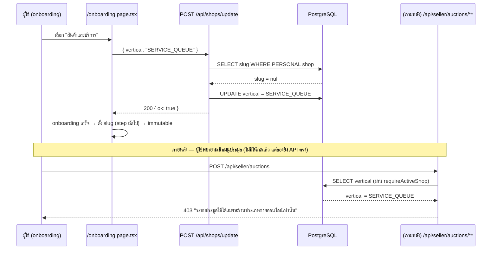

> **โมดูล:** 00028 — Shop Business Type
> **ประเภทเอกสาร:** API Contract
> **เวอร์ชัน:** 1.0
> **วันที่จัดทำ:** 2026-08-03
> **สถานะ:** Draft

# API Contract: ประเภทร้านค้า (Shop Business Type)

---

## 1. Overview

งานนี้**ไม่เพิ่ม endpoint ใหม่แม้แต่เส้นเดียว** — เป็นการ **ขยาย field ของ endpoint เดิม 1 เส้น** (`POST /api/shops/update`) และ **เพิ่ม guard ใหม่ให้ endpoint กลุ่มเดิม** (auction 6 เส้น ผ่านจุดเดียว `_shared.ts`) พร้อมแก้ข้อความ error ของ guard ที่มีอยู่แล้ว 2 จุด (iShip, appointment)

ทุก endpoint อยู่ภายใต้ Next.js API Route เดิม (`src/app/api/**`) — ไม่มี provider ภายนอกใหม่

- **เอกสารออกแบบต้นทาง:** [[SDS]] §3, §6
- **Base URL:** เดิม (relative `/api/**` บน subdomain seller)
- **Content-Type:** `application/json`
- **Convention:** ตาม `docs/buyer-app-api.md`/pattern เดิมของ seller API — session-based (NextAuth), `guardApi` (`src/proxy.ts`) ครอบ Origin-check + rate-limit ให้อัตโนมัติสำหรับทุก mutation (ไม่ต้องทำเพิ่ม)

---

## 2. Authentication

| กลุ่ม | กติกา |
|-------|-------|
| `POST /api/shops/update` | ต้องมี session, derive shop จาก `userId` (`kind:'PERSONAL'`) เท่านั้น — ไม่รับ `shopId` จาก client (เดิมอยู่แล้ว) |
| `/api/seller/auctions/**` | ต้องมี session + `requireActiveShop` ผ่าน (เดิม) — **เพิ่มเงื่อนไข `vertical==='ONLINE_SALES'`** |
| `/api/seller/iship/**` | ต้องมี session + สมาชิกร้าน + **`vertical==='ONLINE_SALES'`** (ค่าที่เทียบเปลี่ยนจาก `'GENERAL'`) |
| `/api/shops/current/appointments/**` ฯลฯ | ต้องมี session + สมาชิกร้าน + **`vertical==='SERVICE_QUEUE'`** (เดิมต้อง `kind==='BUSINESS'` ด้วย — **ตัดออกแล้ว**) |
| ทุก mutation | ผ่าน `guardApi` เดิมอัตโนมัติ (Origin-check + rate-limit) |

🛑 **ทุก endpoint ที่คืนข้อมูลเฉพาะ user** ต้องมี `cache-control: private, no-store` — endpoint ที่แก้ในงานนี้ (`shops/update`) มีอยู่แล้ว (ไม่เปลี่ยน)

---

## 3. Endpoint List (เฉพาะที่เปลี่ยน/เกี่ยว)

| Method | Path | การเปลี่ยนแปลง | สถานะ |
|--------|------|----------------|-------|
| `POST` | `/api/shops/update` | เพิ่ม field `vertical` (optional) | **แก้ (SRS TFR-006)** |
| `POST` | `/api/business/shops` | ไม่แก้โค้ด — `vertical` picklist ขยายอัตโนมัติจาก 2→3 ค่าเมื่อ SSOT อัปเดต | **ไม่แก้ (SRS TFR-005)** |
| `GET`/`POST` | `/api/seller/auctions` | เพิ่ม guard `vertical==='ONLINE_SALES'` (ผ่าน `_shared.ts`) | **แก้ guard (SRS TFR-007)** |
| `GET`/`PATCH` | `/api/seller/auctions/[id]` | เพิ่ม guard เดียวกัน | **แก้ guard** |
| `POST` | `/api/seller/auctions/[id]/cancel` | เพิ่ม guard เดียวกัน | **แก้ guard** |
| `POST` | `/api/seller/auctions/[id]/publish` | เพิ่ม guard เดียวกัน | **แก้ guard** |
| `POST` | `/api/seller/auctions/[id]/end-early` | เพิ่ม guard เดียวกัน | **แก้ guard** |
| `POST`/`GET`/… | `/api/seller/iship/**` (20 files) | ค่าที่ guard เทียบเปลี่ยนจาก `'GENERAL'`→`'ONLINE_SALES'`; ข้อความ error แก้ | **แก้ logic ภายใน guard เดียว (`requireGeneralShop`)** |
| `POST`/`GET`/… | `/api/shops/current/appointments/**`, `/appointment-settings/**`, `/service-resources/**`, `/api/orders/[token]/appointment/**` | เงื่อนไข gate ตัด `kind` ออก; ข้อความ `FEATURE_NOT_AVAILABLE` แก้ | **แก้ logic ภายใน guard เดียว (`canUseAppointments`)** |
| `POST` | `/api/products` | ส่ง `shopVertical` เพิ่มเข้า service (ไม่เปลี่ยน request/response contract ที่ client เห็น) | **แก้ internal เท่านั้น** |

---

## 4. Endpoint Detail

### 4.1 `POST /api/shops/update` (แก้ของเดิม)

เพิ่มความสามารถ: ตั้ง/เปลี่ยนประเภทร้านค้า **ระหว่าง onboarding เท่านั้น** — endpoint เดิมยังทำงานเหมือนเดิมทุกประการถ้าไม่ส่ง `vertical` มา (backward-compatible)

**Request (เพิ่ม field ใหม่ — ทุก field ยัง optional เหมือนเดิม)**
```json
{
  "category": "food",
  "address": "123 ถนนสุขุมวิท",
  "latitude": 13.7563,
  "longitude": 100.5018,
  "vertical": "SERVICE_QUEUE"
}
```

| field | ชนิด | บังคับ | กฎ |
|-------|------|--------|-----|
| `vertical` | `string` | ไม่ | ต้องเป็น 1 ใน `SHOP_VERTICAL_KEYS` (`ONLINE_SALES`\|`SERVICE_QUEUE`\|`LODGING`) — validate ด้วย `v.picklist` |

**Response — Success (200)**
```json
{ "ok": true }
```

**Response — Error (ใหม่)**

| Code | HTTP | เมื่อไหร่ |
|------|------|----------|
| `VALIDATION_ERROR` | 400 | `vertical` ไม่อยู่ใน 3 ค่าที่ยอมรับ (ข้อความเดิม `"ข้อมูลไม่ถูกต้อง"` ของ route นี้ครอบอยู่แล้ว) |
| **`VERTICAL_LOCKED`** | **409** | ส่ง `vertical` มาแต่ `Shop.slug !== null` (onboarding จบแล้ว — immutable ตาม BR-SBT-08) |
| `ไม่พบร้าน` | 404 | ไม่มี Personal shop (เดิมอยู่แล้ว) |

**Logic (route handler, ไม่มี service layer แยก — ตาม pattern เดิมของไฟล์นี้):**
```ts
// เพิ่มใน select เดิม (บรรทัด 24 ของ route.ts เดิม)
const shop = await prisma.shop.findFirst({
  where: { userId, kind: "PERSONAL" },
  select: { id: true, slug: true }, // เพิ่ม slug
});
if (!shop) return NextResponse.json({ error: "ไม่พบร้าน" }, { status: 404 });

if (parsed.output.vertical !== undefined && shop.slug !== null) {
  return NextResponse.json({ error: "VERTICAL_LOCKED" }, { status: 409 });
}

await prisma.shop.update({
  where: { id: shop.id },
  data: {
    ...(category ? { category } : {}),
    ...(address !== undefined ? { address } : {}),
    ...(latitude != null ? { latitude, longitude } : {}),
    ...(parsed.output.vertical !== undefined && shop.slug === null
      ? { vertical: parsed.output.vertical }
      : {}),
  },
});
```

---

### 4.2 `/api/seller/auctions/**` (6 endpoints — guard ใหม่)

**ไม่เปลี่ยน request/response ของ endpoint เดิมแม้แต่ตัวเดียว** — เปลี่ยนแค่เงื่อนไขที่ `requireSellerShop()` ปฏิเสธเพิ่ม 1 กรณี

**Response — Error (ใหม่, 403)**
```json
{ "response": { "error": "ระบบประมูลใช้ได้เฉพาะร้านประเภทขายออนไลน์เท่านั้น" } }
```
> โครงสร้างจริงคือ `NextResponse.json({ error: "..." }, { status: 403 })` — ตรงกับ pattern error response เดิมของไฟล์นี้ทุกจุด (ดู `_shared.ts:39-53` ของเดิม เช่น `"ร้านค้าถูกล็อกแพ็กเกจ..."`)

**เกิดเมื่อ:** `active.shop.vertical !== 'ONLINE_SALES'` — เกิดกับ**ทุก method** ใต้ path นี้ (GET list/detail รวมด้วย ไม่ใช่แค่ mutation) เพราะ BRD §3.2 ระบุ "การเข้าหน้า/เรียก endpoint ที่ไม่ตรงประเภท ... ต้องถูกปฏิเสธเสมอ"

**ตำแหน่งเช็คใน `_shared.ts::requireSellerShop`:**
```ts
const active = await requireActiveShop(...);
if (!active) { /* เดิม — 404 */ }

// ใหม่ — เช็คก่อน mutate/locked check เดิม
if (active.shop.vertical !== "ONLINE_SALES") {
  return {
    response: NextResponse.json(
      { error: "ระบบประมูลใช้ได้เฉพาะร้านประเภทขายออนไลน์เท่านั้น" },
      { status: 403 },
    ),
  } as const;
}

if (opts?.mutate && active.locked) { /* เดิม */ }
```

---

### 4.3 `/api/seller/iship/**` (20 endpoints — แก้ข้อความ error เท่านั้น จาก guard เดิม)

**ไม่เปลี่ยน request/response shape** — เปลี่ยนแค่ **เงื่อนไขที่ trigger** (`'GENERAL'`→`'ONLINE_SALES'`) และ **ข้อความ**

**Response — Error (แก้ข้อความ, shape เดิม — verified จาก `src/lib/shop-api-guard.ts:87-99`)**
```json
{
  "error": {
    "code": "NOT_ELIGIBLE",
    "message": "ร้านประเภทนี้ไม่รองรับการเชื่อมต่อระบบขนส่ง"
  }
}
```
status: `403`

> ข้อความเดิม `"ร้านประเภทบ้านพักไม่รองรับการเชื่อมต่อระบบขนส่ง"` (พูดถึงแค่ LODGING) เปลี่ยนเป็นข้อความกลางที่ครอบทั้ง `SERVICE_QUEUE` และ `LODGING` — ไม่ระบุชื่อประเภทเฉพาะเจาะจงเพื่อไม่ต้องแก้ซ้ำถ้ามีประเภทที่ 4 ในอนาคต (Impeccable: บอกเหตุผล ไม่ใช่แค่ "ไม่มีสิทธิ์")

---

### 4.4 `/api/shops/current/appointments/**`, `/appointment-settings/**`, `/service-resources/**`, `/api/orders/[token]/appointment/**` (แก้ข้อความ error เท่านั้น)

**Response — Error (แก้ข้อความ, shape เดิม — verified จาก `src/lib/appointment-api.ts:28-35`)**
```json
{
  "error": "FEATURE_NOT_AVAILABLE",
  "message": "ระบบนัดหมายใช้ได้เฉพาะร้านประเภทสินค้าและบริการ"
}
```
status: `403`

> ข้อความเดิม `"ระบบนัดหมายใช้ได้เฉพาะบัญชีธุรกิจประเภทสินค้าและบริการ"` (คำว่า "บัญชีธุรกิจ" เป็นเท็จหลังงานนี้ — บัญชีบุคคลใช้ได้แล้วตาม BR-SBT-11) ตัดคำว่า "บัญชีธุรกิจ" ออก

---

### 4.5 `POST /api/business/shops` (ไม่แก้โค้ด — ระบุไว้เพื่อความชัดเจน)

**ไม่มีการเปลี่ยนแปลง endpoint นี้เลย** — `CreateBusinessShopSchema` (`src/lib/validations.ts:722`) ใช้ `v.picklist(SHOP_VERTICAL_KEYS)` อยู่แล้ว เมื่อ [[SDS]] task #1 (`lib/lodging.ts`) เพิ่ม key ที่ 3 เข้า `SHOP_VERTICAL_KEYS` → endpoint นี้รับ `vertical: "SERVICE_QUEUE"` ได้ทันทีโดยอัตโนมัติ ระบุไว้ใน API.md เพื่อให้ QA ทดสอบ endpoint นี้ด้วย 3 ค่าครบแม้ไม่มี diff โค้ดของ endpoint เอง

---

## 5. Error Code Table (บังคับ — Cross-file mapping enumerate)

🛑 **ผลการตรวจ: งานนี้ไม่ throw custom Error class ใหม่ข้ามไฟล์แม้แต่ตัวเดียว** — ทุก guard ใหม่/แก้ ใช้ pattern **`return { response: NextResponse }`** (return ตรง ไม่ throw) ซึ่งสร้าง `NextResponse` ในไฟล์เดียวกับที่เช็คเงื่อนไข (`_shared.ts`, `shop-api-guard.ts`, `appointment-api.ts`) — จึง**ไม่มีความเสี่ยงแบบ 00003 `OutOfStockError` ที่ throw จาก service แล้ว route ไม่ครอบ** เพราะไม่มี throw เกิดขึ้นเลยในจุดที่แก้

ตารางนี้ enumerate ทุกจุดที่ error เกิดเพื่อความครบถ้วนตาม Hard Rule (แม้ไม่มีจุดเสี่ยง cross-file):

| Error/Code | เกิดที่ไฟล์ (สร้าง response) | เรียกจาก (ทุก route ที่ได้ผลอัตโนมัติ) | HTTP | ใหม่/แก้ |
|---|---|---|---|---|
| `VERTICAL_LOCKED` | `src/app/api/shops/update/route.ts` (inline, ไม่ throw) | เฉพาะ route นี้ (ไม่มี call site อื่น) | 409 | ใหม่ |
| `NOT_ONLINE_SALES_SHOP` message | `src/app/api/seller/auctions/_shared.ts::requireSellerShop` (inline) | 6 route files ใต้ `/api/seller/auctions/**` (auto ผ่าน `requireSellerShop()`) | 403 | ใหม่ |
| `NOT_ELIGIBLE` (ข้อความแก้) | `src/lib/shop-api-guard.ts::requireGeneralShop` (inline) | 20 route files ใต้ `/api/seller/iship/**` (auto) | 403 | แก้ข้อความ (code เดิม) |
| `FEATURE_NOT_AVAILABLE` (ข้อความแก้) | `src/lib/appointment-api.ts::appointmentErrorResponse` (map จาก `AppointmentFeatureUnavailableError`) | 7 route files (auto ผ่าน mapper กลาง) — `AppointmentFeatureUnavailableError` ยัง**throw จาก `appointment.service.ts:39` เหมือนเดิม** แต่**ทุก route ที่ throw ได้ต้องเรียก `appointmentErrorResponse()` ใน catch อยู่แล้ว (ของเดิม, ไม่ใช่ gap ใหม่)** — verified ว่า mapper กลางมีอยู่แล้วก่อนงานนี้ | 403 | แก้ข้อความ (error class เดิม, mapping เดิม) |
| `NOT_LODGING_SHOP` | `src/lib/shop-api-guard.ts::requireLodgingShop` | ไม่แตะ — ระบุไว้เพื่อยืนยันว่าไม่เปลี่ยน | 403 | ไม่เปลี่ยน |

**สรุปทำไมไม่มี gap:** ทุก guard ในงานนี้เป็น "guard ที่ return NextResponse ตรงในไฟล์ตัวเอง" (`shop-api-guard.ts`, `_shared.ts`) ยกเว้น `AppointmentFeatureUnavailableError` ที่เป็น throw+catch จริง — แต่จุดนั้น**ไม่ใช่ error ใหม่**, mapper กลาง (`appointmentErrorResponse`) มีอยู่แล้วและ map ครบก่อนงานนี้เริ่ม (แก้แค่ข้อความ ไม่แก้โครงสร้าง exception)

---

## 6. Sequence



---

## 7. Traceability

| Endpoint | SDS Component / Decision | BRD FR |
|----------|---------------------------|--------|
| `POST /api/shops/update` (vertical) | SDS §3.3 task #16-17, TD-002 | FR-SBT-01/02 |
| `/api/seller/auctions/**` (guard) | SDS §3.1 task #7, TD-003 | FR-SBT-05 |
| `/api/seller/iship/**` (ข้อความ) | SDS §3.1 task #4 | FR-SBT-04 |
| `/api/shops/current/appointments/**` (ข้อความ) | SDS §3.1 task #2-3 | FR-SBT-04/07 |
| `POST /api/business/shops` (ไม่แก้) | SDS §3.1 task #1 (SSOT) | FR-SBT-01 |
| `POST /api/products` (internal) | SDS §3.1 task #8-10, TD-004 | FR-SBT-08 |

---

## 8. สรุป

เอกสารนี้กำหนดสัญญาของงานที่ **ไม่เพิ่ม endpoint ใหม่เลย** — ทุกการเปลี่ยนแปลงคือการขยาย field ของ endpoint เดิม 1 เส้น หรือแก้เงื่อนไข/ข้อความของ guard ที่มีอยู่แล้ว 3 ตัว (`requireGeneralShop`, `canUseAppointments`/`appointmentErrorResponse`, `requireSellerShop`)

จุดที่ QA ต้องทดสอบเพิ่มเป็นพิเศษ:
1. **`POST /api/shops/update` กับ `vertical`** — ทดสอบทั้งช่วง `slug===null` (สำเร็จ) และหลัง onboarding จบ (409)
2. **Auction 6 endpoints × 3 vertical ค่า** — ต้องได้ 403 เฉพาะ `SERVICE_QUEUE`/`LODGING`, ผ่านปกติเฉพาะ `ONLINE_SALES`
3. **ร้านเดิม 6 ร้าน (backfill แล้ว) ต้องไม่มีพฤติกรรมเปลี่ยนเลย** ในทุก endpoint ที่แก้ (regression suite เต็ม)

**Open Questions:**
- `/api/inventory/**` (7 endpoints) ยังไม่มี vertical guard — รอ Controller ตัดสินใจ (ดู [[SRS]] §8 ARCH-05, [[SDS]] TD-005)
```

---

## สรุปสำหรับ Controller

ไฟล์ที่ผ่านการ verify จริงทุกไฟล์ (path:line ทั้งหมดในเอกสารข้างต้นเปิดอ่านจริงแล้ว ไม่ได้เดา) ที่สำคัญที่สุดที่ Controller ควรรู้:

1. **`/api/business/shops` ไม่ต้องแก้โค้ดเลย** — `SHOP_VERTICAL_KEYS` เป็น SSOT ที่ validation/form ผูกไว้ครบแล้ว แก้แค่ `src/lib/lodging.ts` พอ
2. **จุดสร้าง Personal shop ตอน onboarding ไม่มีหน้าเลือก vertical เลยในปัจจุบัน** — ต้องเพิ่ม endpoint capability ใหม่ที่ `POST /api/shops/update` (ใช้ `Shop.slug===null` เป็นสัญญาณ "ยังแก้ vertical ได้" แทนการเพิ่มคอลัมน์ DB ใหม่)
3. **`seller-menu.ts` มี binary logic ที่ grep `'GENERAL'` มองไม่เห็น** (ตามที่ Controller เตือนไว้แล้ว) — ระบุ task ไว้ครบใน SDS §3.1 task #5 พร้อมจุดเสี่ยงเฉพาะ (ต้องย้าย `seller:products` ออกจาก `ONLINE_SALES_ONLY_SLUGS` มิฉะนั้น `SERVICE_QUEUE` จะไม่เห็นเมนูสินค้าเลย)
4. **Auction guard ใหม่มีจุดเดียว** — `src/app/api/seller/auctions/_shared.ts::requireSellerShop` เป็น choke point ของทั้ง 6 ไฟล์ route จริง (verified ด้วย grep)
5. **พบ gap เพิ่มเติมนอกลิสต์เดิม:** `/api/inventory/**` (7 ไฟล์) ไม่มี vertical guard เลย ตรงกับ BRD §8.1 matrix ที่ระบุไว้ — ไม่ได้อยู่ใน scope ที่ Controller ระบุมา จึงไม่ implement เอง (ดู SRS ARCH-05 / SDS TD-005) รอ Controller ตัดสินใจ P1 หรือ fast-follow
6. **Cross-file error mapping: ตรวจครบแล้ว ไม่มี gap** — งานนี้ไม่ throw custom Error ใหม่ข้ามไฟล์เลย (ทุก guard ใหม่ return `NextResponse` ตรงในไฟล์เดียวกับที่เช็ค) ยกเว้น `AppointmentFeatureUnavailableError` ที่เป็นของเดิมและ mapper กลาง (`appointmentErrorResponse`) ครอบไว้อยู่แล้วก่อนงานนี้
7. **Sequencing กับ migration:** ต้อง deploy โค้ดก่อน (หรือพร้อมกับ) migration เสมอ — มีหน้าต่างเสี่ยงสั้น ๆ ระหว่าง deploy เสร็จกับรัน migration ที่ร้านเดิม 6 ร้านจะถูกปฏิเสธชั่วคราว ระบุ flow ไว้ใน SDS §8
