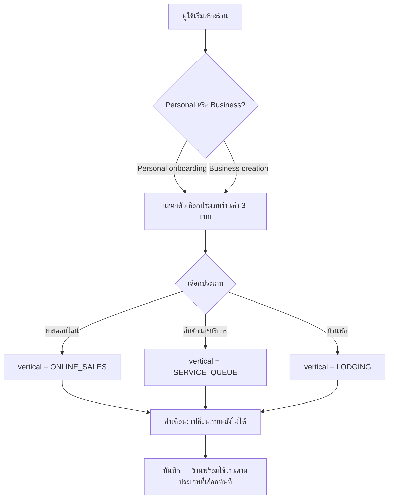
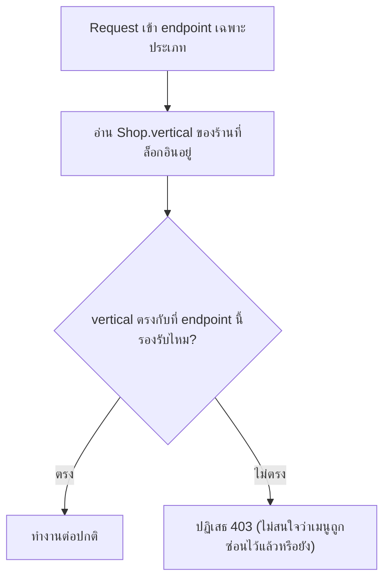
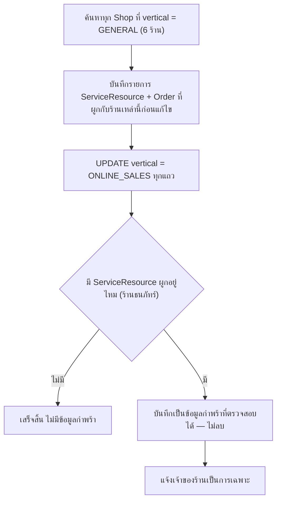

> **โมดูล:** M00028-ShopBusinessType
> **ประเภทเอกสาร:** Business Requirements Document (BRD) - NON-TECHNICAL
> **เวอร์ชัน:** 1.0
> **วันที่จัดทำ:** 2026-08-03
> **สถานะ:** Draft — รอ user review
> **เจ้าของเอกสาร:** BA (ดู [[Feature-Docs-Ownership]])

# BRD: ประเภทร้านค้า (Business Requirements Document)

---

## 1. บทนำ

### 1.1 วัตถุประสงค์ของเอกสาร

เอกสารนี้มีวัตถุประสงค์เพื่อ:
1. อธิบายความต้องการเชิงหน้าที่ของการแยก "ประเภทร้านค้า" จาก 2 ค่า (`GENERAL`/`LODGING`) เป็น 3 ค่า (`ONLINE_SALES`/`SERVICE_QUEUE`/`LODGING`) ในรูปแบบที่ทดสอบได้
2. กำหนดขอบเขตของการ backfill ร้านเดิม และการจัดการข้อมูลกำพร้าที่เกิดจากการ backfill นั้น
3. รวบรวมกฎทางธุรกิจทั้งหมดพร้อมรหัสอ้างอิง `BR-SBT-*` เพื่อให้ทีมพัฒนาและทีมทดสอบใช้ร่วมกัน
4. ระบุจุดในโค้ดที่ต้องแก้ไขทั้งหมด (gate/menu/guard) เพราะงานนี้แก้ SSOT ที่มีผู้ใช้ (consumer) กระจายอยู่หลายฟีเจอร์ (00017, 00022, 00024, ระบบประมูล)

### 1.2 ขอบเขตของระบบ

**ประเภทร้านค้า (Shop Business Type)** คือการขยายค่าที่เป็นไปได้ของ `Shop.vertical` จาก 2 เป็น 3 ค่า พร้อมย้ายเงื่อนไขเปิด/ปิดความสามารถทุกจุดในระบบที่เคยผสม `kind` (บัญชีบุคคล/ธุรกิจ) เข้ากับ `vertical` ให้เหลือเช็คแค่ `vertical` เพียงอย่างเดียว

**เข้าสู่ระบบ (Input):**
- ประเภทร้านค้าที่ผู้ใช้เลือกตอนสร้างร้าน (Personal onboarding หรือ Business creation)
- ข้อมูลร้านเดิมทั้งหมดที่มี `vertical='GENERAL'` ในฐานข้อมูลปัจจุบัน (6 ร้าน)

**ออกจากระบบ (Output):**
- `Shop.vertical` ที่เก็บค่าใหม่ 3 แบบ พร้อมป้ายภาษาไทยที่ถูกต้อง
- เมนู/หน้า/endpoint ที่กรองตามประเภทร้านค้าถูกต้องทั้งระบบ (รวมประมูลที่ไม่เคยถูกกรองมาก่อน)
- รายการข้อมูลกำพร้าที่เกิดจาก backfill (ตรวจสอบย้อนหลังได้)
- Public Profile ที่แสดงผลถูกสาขาตามประเภทร้านค้า (3 สาขา)

**ระบบที่เกี่ยวข้อง:**
- feature 00017 — Lodging Vertical (เจ้าของเดิมของ `Shop.vertical`)
- feature 00022 — iShip Shipping Integration (`requireGeneralShop`)
- feature 00024 — Service Appointment Booking (`canUseAppointments`, เมนูคิวงาน)
- feature 00008 — Business Account & Packages (`Shop.kind`, flow สร้างธุรกิจ)
- ระบบประมูล (Auction) — ไม่มี guard เดิม จะได้ guard ใหม่จากงานนี้
- Public Profile `/u/{username}`

### 1.3 กลุ่มผู้ใช้งาน

| กลุ่มผู้ใช้ | บทบาท | สิทธิ์การใช้งาน |
|-----------|--------|----------------|
| **เจ้าของร้านใหม่** | เลือกประเภทร้านค้าตอนสร้างร้าน | เลือกได้ 1 ครั้ง เปลี่ยนภายหลังไม่ได้ |
| **เจ้าของร้านเดิม (backfill)** | ไม่ต้องทำอะไร — ถูก backfill อัตโนมัติ | พฤติกรรมเหมือนเดิมทุกประการ ยกเว้นร้าน hybrid 1 ราย |
| **สมาชิกร้าน (ADMIN/OWNER)** | ใช้เมนู/ฟีเจอร์ตามประเภทของร้านที่สังกัดอยู่ | ตามสิทธิ์เดิมของบทบาทในร้าน |
| **ผู้ดูแลแพลตฟอร์ม Deep** | รันและตรวจสอบ backfill migration | เข้าถึงรายการข้อมูลกำพร้าเพื่อตรวจสอบ |
| **ผู้เข้าชมโปรไฟล์สาธารณะ** | ดู `/u/{username}` | เห็นเนื้อหาตามประเภทร้านค้าที่ถูกต้อง |

---

## 2. ความต้องการหลัก (Functional Requirements)

### 2.1 เลือกประเภทร้านค้าตอนสร้างร้าน

#### FR-SBT-01: เลือกประเภทร้านค้าตอนสร้างร้าน (Personal + Business)

**User Story:**
> ในฐานะผู้ใช้ที่กำลังสร้างร้าน ฉันต้องการเลือกได้ว่าร้านของฉันเป็น *ขายออนไลน์*, *สินค้าและบริการ*, หรือ *บ้านพัก* เพื่อให้ระบบเตรียมเมนูและความสามารถที่ตรงกับงานของฉันตั้งแต่วันแรก ไม่ว่าฉันจะสมัครเป็นบัญชีบุคคลหรือบัญชีธุรกิจ

**Acceptance Criteria:**
- [ ] หน้าสร้างร้านมีช่องเลือก **"ประเภทร้านค้า"** 3 ตัวเลือก: *ขายออนไลน์*, *สินค้าและบริการ*, *บ้านพัก*
- [ ] ตัวเลือกนี้ปรากฏทั้งที่ Personal onboarding (ปัจจุบันไม่มีเลย) และ Business creation (ปัจจุบันมีแค่ 2 ตัวเลือก)
- [ ] ค่าที่เลือกไว้ล่วงหน้าคือ *ขายออนไลน์*
- [ ] แต่ละตัวเลือกมีคำอธิบายสั้นกำกับว่าจะได้ความสามารถอะไร โดยระบุชัดว่าตัวไหน "ไม่มีการจัดส่งสินค้า"
- [ ] มีข้อความเตือนใต้ช่องเลือกว่า **เลือกแล้วเปลี่ยนภายหลังไม่ได้** ก่อนกดบันทึก
- [ ] หน้าตั้งค่าร้านไม่มีช่องให้แก้ประเภทร้านค้า และการพยายามแก้ผ่านช่องทางอื่นถูกปฏิเสธ

**Business Flow:**
1. ผู้ใช้เข้าสู่ขั้นตอนสร้างร้าน (Personal onboarding หรือ Business creation)
2. เห็นตัวเลือกประเภทร้านค้า 3 แบบพร้อมคำอธิบาย
3. เลือกประเภทที่ตรงกับธุรกิจตนเอง เห็นคำเตือน immutable
4. บันทึก → ร้านถูกสร้างพร้อมประเภทที่เลือก ใช้ต่อได้ทันที

#### FR-SBT-02: ประเภทร้านค้า immutable

**User Story:**
> ในฐานะผู้ดูแลระบบ ฉันต้องการให้ประเภทร้านค้าเปลี่ยนไม่ได้หลังสร้าง เพื่อป้องกันข้อมูล (นัดหมาย/ห้องพัก/สินค้า) ที่ผูกกับประเภทเดิมพังหรือขัดแย้งกัน

**Acceptance Criteria:**
- [ ] ไม่มี endpoint หรือหน้าจอใดในระบบที่แก้ `Shop.vertical` ได้หลังสร้างร้านสำเร็จ
- [ ] service ที่แก้ข้อมูลร้าน (เช่น update ชื่อร้าน/รายละเอียด) ต้องไม่รับฟิลด์นี้เข้ามาแม้แต่พารามิเตอร์เดียว

---

### 2.2 เมนูและสิทธิ์แยกตามประเภท

#### FR-SBT-03: เมนูฝั่ง seller กรองตาม 3 ประเภท

**User Story:**
> ในฐานะเจ้าของร้าน ฉันต้องการเห็นเฉพาะเมนูที่เกี่ยวกับธุรกิจของฉัน เพื่อไม่ต้องเดาว่าเมนูที่ไม่เกี่ยวข้องเอาไว้ทำอะไร

**Acceptance Criteria:**
- [ ] ร้าน `ONLINE_SALES` เห็นเมนู: สินค้า, สต็อก, ประมูล, จัดส่ง — ไม่เห็นคิวงาน/ห้องพัก/ปฏิทิน/การจอง/แม่บ้าน
- [ ] ร้าน `SERVICE_QUEUE` เห็นเมนู: สินค้า, คิวงาน — ไม่เห็นสต็อก/ประมูล/จัดส่ง/ห้องพัก/ปฏิทิน/การจอง/แม่บ้าน
- [ ] ร้าน `LODGING` เห็นเมนู: ห้องพัก, ปฏิทิน, การจอง, แม่บ้าน — ไม่เห็นสินค้า/สต็อก/ประมูล/คิวงาน/จัดส่ง (เหมือนพฤติกรรมเดิม)
- [ ] เมนูความสามารถกลาง (Public Profile, ยืนยันตัวตน, ความสำเร็จ, พนักงาน, แพ็กเกจของฉัน, กระเป๋าเงิน, ข้อความ, ลูกค้า, การจัดส่ง[เฉพาะ ONLINE_SALES ตามเดิม], บัญชีของฉัน) แสดงตามกฎเดิมที่ไม่เกี่ยวกับ vertical

#### FR-SBT-04: API guard ปฏิเสธ endpoint ที่ไม่ตรงประเภท

**User Story:**
> ในฐานะผู้ดูแลระบบ ฉันต้องการให้ทุก endpoint ที่ผูกกับประเภทร้านค้าปฏิเสธคำขอจากร้านที่ไม่ตรงประเภทเสมอ แม้จะยิง API ตรง ๆ ข้ามเมนู

**Acceptance Criteria:**
- [ ] endpoint กลุ่มจัดส่ง (iShip) ปฏิเสธร้านที่ไม่ใช่ `ONLINE_SALES` ด้วย 403
- [ ] endpoint กลุ่มคิวงาน (ทรัพยากร/นัดหมาย) ปฏิเสธร้านที่ไม่ใช่ `SERVICE_QUEUE` ด้วย 403
- [ ] endpoint กลุ่มห้องพัก/ปฏิทิน/การจอง/แม่บ้าน ปฏิเสธร้านที่ไม่ใช่ `LODGING` ด้วย 403 (พฤติกรรมเดิม เปลี่ยนแค่ค่าที่เทียบยังคงเป็น `LODGING`)
- [ ] endpoint กลุ่มสต็อกสินค้าและประมูล ปฏิเสธร้านที่ไม่ใช่ `ONLINE_SALES` ด้วย 403

#### FR-SBT-05: ปิดช่องโหว่ — บังคับ guard ที่ endpoint ประมูลทุกเส้น

**User Story:**
> ในฐานะผู้ดูแลระบบ ฉันต้องการให้ระบบประมูลถูกปฏิเสธสำหรับร้านที่ไม่ใช่ประเภทขายออนไลน์ เพราะพบว่าปัจจุบันระบบประมูลไม่เคยตรวจสอบประเภทร้านค้าเลยแม้แต่จุดเดียว — กันด้วยการซ่อนเมนูอย่างเดียว

**Acceptance Criteria:**
- [ ] endpoint จัดการประมูลฝั่งร้าน (สร้าง/แก้ไข/ยกเลิก/publish/end-early) ปฏิเสธร้านที่ `vertical !== 'ONLINE_SALES'` ด้วย 403
- [ ] ก่อนเปิด guard ใหม่ ต้องตรวจสอบก่อนว่าไม่มี `Auction` ของร้านที่ไม่ใช่ `ONLINE_SALES` อยู่ในฐาน (ถ้ามี ต้องแจ้ง Controller ก่อนปิด ไม่ใช่ปิดแล้วร้านนั้นใช้งานเดิมไม่ได้แบบไม่รู้ตัว)

---

### 2.3 ความสามารถกลางและกรณีพิเศษ

#### FR-SBT-06: ความสามารถกลางใช้ร่วมกันทุกประเภท

**User Story:**
> ในฐานะเจ้าของร้านไม่ว่าประเภทไหน ฉันต้องการใช้ Public Profile, ยืนยันตัวตน, Trust Score, แชท, รีวิว, กระเป๋าเงิน, และสร้างออเดอร์ได้เหมือนกันหมด เพราะสิ่งเหล่านี้ไม่เกี่ยวกับว่าฉันขายของหรือรับนัด

**Acceptance Criteria:**
- [ ] ทั้ง 3 ประเภทเข้าถึง Public Profile, ระบบยืนยันตัวตน (L1/L2/L3), Trust Score, แชท/ChatBot, ระบบรีวิว, กระเป๋าเงินร้าน, และหน้าสร้างออเดอร์ (POS) ได้เหมือนกันทุกประการ
- [ ] ฟอร์มสร้างออเดอร์ปรับฟิลด์ตามประเภท (ที่อยู่จัดส่งสำหรับ `ONLINE_SALES`, เลือกทรัพยากร+เวลาสำหรับ `SERVICE_QUEUE`, เลือกห้อง+วันเข้าพักสำหรับ `LODGING`) แต่ใช้โครง Order เดียวกัน

#### FR-SBT-07: บัญชีบุคคลใช้ระบบคิวงานได้

**User Story:**
> ในฐานะเจ้าของร้านบุคคลธรรมดา ฉันต้องการเปิดใช้ระบบคิวงานได้ เพราะธุรกิจของฉัน (เช่น ร้านแต่งไฟหน้ารถ) เป็นร้านเดี่ยวที่ยังไม่ได้จดทะเบียนธุรกิจ แต่ก็ต้องรับนัดคิวเหมือนร้านใหญ่

**Acceptance Criteria:**
- [ ] เงื่อนไขเปิดใช้ระบบคิวงานเปลี่ยนจาก "`kind==='BUSINESS'` และ `vertical==='GENERAL'`" (2 เงื่อนไข) เหลือ "`vertical==='SERVICE_QUEUE'`" (เงื่อนไขเดียว) — ไม่เช็ค `kind` อีกต่อไป
- [ ] บัญชีบุคคลที่เลือก `SERVICE_QUEUE` สร้าง `ServiceResource`, ตั้งนัดหมาย, ใช้ปฏิทินคิวงานได้ครบเหมือนบัญชีธุรกิจ
- [ ] สิทธิ์อื่นที่ผูกกับ `kind` โดยตรง (พนักงาน/staff invite, expense tracking) **ไม่เปลี่ยน** — บัญชีบุคคลยังไม่มีสิทธิ์เหล่านี้เหมือนเดิม (FR นี้แก้เฉพาะ gate ของคิวงานเท่านั้น)

#### FR-SBT-08: ร้านสินค้าและบริการเปิดเมนูสินค้าได้ (ไม่มีจัดส่ง)

**User Story:**
> ในฐานะเจ้าของร้านบริการ ฉันต้องการขายสินค้าเสริม (เช่น คอร์ส/แพ็กเกจ/ผลิตภัณฑ์ที่ใช้ในร้าน) ได้ด้วย แม้ธุรกิจหลักของฉันคือรับนัด

**Acceptance Criteria:**
- [ ] ร้าน `SERVICE_QUEUE` เห็นเมนู "สินค้า" และสร้าง/แก้ไขสินค้าได้ปกติ
- [ ] ร้าน `SERVICE_QUEUE` **ไม่เห็น** เมนู "จัดการสต็อก" และ "ประมูล"
- [ ] สินค้าที่สร้างในร้าน `SERVICE_QUEUE` มีค่าเริ่มต้น `fulfillmentMode = NO_SHIPPING` (ไม่ใช่ `SHIPPED` ตามค่า default เดิมของระบบ) — ป้องกันการบังคับกรอกที่อยู่จัดส่งที่ไม่มีความหมาย
- [ ] ผู้ใช้ปรับ `fulfillmentMode` ของสินค้าแต่ละชิ้นเป็น `SHIPPED` เองได้ถ้าจำเป็น (manual, ไม่ผ่าน iShip) — ระบบไม่ปิดกั้นการปรับค่านี้ระดับสินค้า

### 2.4 Public Profile

#### FR-SBT-09: Public Profile แสดงผลถูกสาขาตามประเภทร้านค้า

**User Story:**
> ในฐานะผู้เข้าชมโปรไฟล์ร้าน ฉันต้องการเห็นเนื้อหาที่ตรงกับสิ่งที่ร้านนั้นขาย/ให้บริการจริง ไม่ว่าร้านนั้นจะเป็นประเภทไหน

**Acceptance Criteria:**
- [ ] `/u/{username}` มี 3 สาขาการแสดงผลตามประเภทร้านค้าของเจ้าของ (แทนที่ 2 สาขาเดิม)
- [ ] Trust banner, badge, avg rating, รีวิว, channel, chat CTA เหมือนกันทั้ง 3 สาขา
- [ ] สาขา `LODGING` แสดงห้องพัก+ปฏิทินว่าง (พฤติกรรมเดิม ไม่เปลี่ยน)
- [ ] สาขา `ONLINE_SALES` แสดง product grid (พฤติกรรมเดิม ไม่เปลี่ยน)
- [ ] สาขา `SERVICE_QUEUE` ต้องไม่ fallback ไปแสดงเหมือนสาขา `ONLINE_SALES` เฉย ๆ — ต้องผ่าน `safepay-ux` gate ออกแบบสาขาที่ 3 นี้ก่อนแตะโค้ด (รายละเอียด UI อยู่นอกขอบเขตของ BRD นี้ — ให้ SRS/SDS/UX-Design-Spec กำหนด)

### 2.5 Backfill และข้อมูลกำพร้า

#### FR-SBT-10: Backfill ร้านเดิมทั้งหมดเป็นขายออนไลน์

**User Story:**
> ในฐานะผู้ดูแลระบบ ฉันต้องการให้ร้านเดิมทั้งหมดที่เป็น `GENERAL` กลายเป็น `ONLINE_SALES` แบบเหมารวม เพื่อให้การ migrate ตรวจสอบได้ง่ายและไม่มีการเดา heuristic ที่ผิดพลาดได้

**Acceptance Criteria:**
- [ ] ทุกแถวใน `Shop` ที่ `vertical='GENERAL'` (ยืนยันจากข้อมูลจริง 2026-08-03 = 6 ร้าน) ถูกเปลี่ยนเป็น `vertical='ONLINE_SALES'` ไม่มีข้อยกเว้น
- [ ] ค่า `'GENERAL'` ต้องไม่เหลืออยู่ใน `Shop.vertical` เลยหลัง migration (ตรวจด้วย query ตรง ๆ)
- [ ] Migration เป็น one-time script เขียนด้วยมือ ไม่ใช้เครื่องมือ auto-generate ที่แตะ shadow database (ตาม Hard Rule ของโครงการเรื่องความปลอดภัยฐานข้อมูลที่ใช้ร่วมกับ prod)

#### FR-SBT-11: จัดการข้อมูลกำพร้าจาก backfill

**User Story:**
> ในฐานะผู้ดูแลระบบ ฉันต้องการรู้แน่ชัดว่าข้อมูลชิ้นไหนกลายเป็นข้อมูลกำพร้าหลัง backfill เพื่อตรวจสอบย้อนหลังได้และไม่ลบทิ้งโดยไม่ตั้งใจ

**Acceptance Criteria:**
- [ ] ก่อนรัน backfill ต้องมีรายการ (query ผล) ของ `ServiceResource` ทุกแถวที่ผูกกับร้านที่กำลังจะถูก backfill เป็น `ONLINE_SALES` (คาดว่า 2 แถว, 1 แถวอยู่ใต้ร้านธนภัทร์ อะไหล่มอเตอร์ไซค์)
- [ ] ต้องมีรายการ `Order` ทุกแถวที่มี `serviceResourceId IS NOT NULL` ของร้านเหล่านั้น (คาดว่า 1 แถว)
- [ ] แถวเหล่านี้**ห้ามถูกลบ**ในทุกขั้นตอนของ migration
- [ ] หลัง backfill แถวเหล่านี้ยังอ่านได้ผ่าน query ตรง ๆ (ไม่ผ่าน UI) เพื่อยืนยันว่าไม่หาย

### 2.6 ป้ายชื่อ

#### FR-SBT-12: เปลี่ยน label ของ LODGING

**User Story:**
> ในฐานะเจ้าของบ้านพัก ฉันต้องการเห็นชื่อประเภทร้านของฉันเป็น "บ้านพัก" (สั้นกว่าเดิม) แทน "บ้านพักตากอากาศ"

**Acceptance Criteria:**
- [ ] ทุกจุดที่แสดงป้าย "บ้านพักตากอากาศ" ในระบบเปลี่ยนเป็น "บ้านพัก" ทั้งหมด (`SHOP_VERTICALS.LODGING` และทุกจุดที่ import ค่านี้ไปแสดงผล)
- [ ] ค่าที่เก็บใน DB (`'LODGING'`) ไม่เปลี่ยน — เปลี่ยนแค่ label ที่แสดงผล
- [ ] ไม่มีจุดใดในระบบยังโชว์คำว่า "บ้านพักตากอากาศ" หลังงานนี้เสร็จ (ตรวจด้วย grep)

---

## 3. Acceptance Criteria สรุป

### 3.1 การเลือกและ immutability

**เมื่อระบบทำงานถูกต้อง:**
- ✅ ผู้ใช้ทุกคนที่สร้างร้านใหม่ (Personal หรือ Business) เลือกได้ 1 ใน 3 ประเภท พร้อมเห็นคำเตือน immutable
- ✅ ไม่มีทางแก้ประเภทร้านค้าได้อีกหลังสร้างสำเร็จ ไม่ว่าจะผ่านหน้าจอไหน

### 3.2 เมนูและ guard

**เมื่อระบบทำงานถูกต้อง:**
- ✅ ทุกเมนูของทั้ง 3 ประเภทตรงกับตาราง matrix ใน §8.1 เป๊ะ ไม่มีเมนูของประเภทอื่นหลุดเข้ามา
- ✅ ทุก endpoint ที่ผูกกับ domain เฉพาะประเภท ปฏิเสธคำขอจากร้านผิดประเภทด้วย 403 แม้ยิงตรงข้ามเมนู
- ✅ ระบบประมูลปฏิเสธร้านที่ไม่ใช่ `ONLINE_SALES` ได้จริง (เดิมทำไม่ได้)

### 3.3 Backfill

**เมื่อระบบทำงานถูกต้อง:**
- ✅ ไม่มีร้านใดเหลือค่า `vertical='GENERAL'` ในฐานข้อมูล
- ✅ ไม่มีแถวข้อมูลใดถูกลบระหว่าง backfill
- ✅ มีรายการข้อมูลกำพร้าที่ตรวจสอบย้อนหลังได้ครบ

### 3.4 บุคคลธรรมดา + สินค้าและบริการ

**เมื่อระบบทำงานถูกต้อง:**
- ✅ บัญชีบุคคลเลือก `SERVICE_QUEUE` แล้วสร้าง/ใช้คิวงานได้เต็มรูปแบบ
- ✅ ร้าน `SERVICE_QUEUE` ขายสินค้าได้แต่ไม่มีสต็อก/ประมูล/จัดส่ง

---

## 4. Business Flows (กระบวนการทำงาน)

### 4.1 Flow หลัก: สร้างร้านและเลือกประเภท

### 4.2 Flow: ตรวจสอบ guard ต่อ request

### 4.3 Flow: Backfill ร้านเดิม

---

## 5. Use Case Scenarios (สถานการณ์การใช้งานจริง)

### Scenario 1: บัญชีบุคคลเปิดร้านรับนัดคิวเป็นครั้งแรก

**ผู้เกี่ยวข้อง:** ผู้ใช้ใหม่ (Personal)

**เงื่อนไขเริ่มต้น:**
- ยังไม่มีบัญชี Deep เลย

**ขั้นตอน:**
1. สมัครผ่าน Personal onboarding
2. เลือกประเภทร้านค้า "สินค้าและบริการ"
3. เข้าเมนูคิวงาน สร้างทรัพยากร ตั้งนัดแรก

**ผลลัพธ์:**
- ใช้ระบบคิวงานได้เต็มรูปแบบโดยไม่ต้องจดทะเบียนธุรกิจก่อน (ไม่เคยทำได้มาก่อนงานนี้)

### Scenario 2: Backfill ร้าน hybrid ที่มีอยู่จริง

**ผู้เกี่ยวข้อง:** เจ้าของร้านธนภัทร์ อะไหล่มอเตอร์ไซค์ (kind=BUSINESS, `GENERAL` เดิม, มี Product 8, Order 4 SHIPPED, ServiceResource 1, Order ผูกนัดหมาย 1)

**เงื่อนไขเริ่มต้น:**
- ร้านใช้งานทั้งขายของส่งของและรับนัดคิวอยู่ก่อนงานนี้

**ขั้นตอน:**
1. Migration รัน — `vertical` เปลี่ยนเป็น `ONLINE_SALES`
2. เมนู "คิวงาน" หายจากร้านนี้
3. ServiceResource 1 แถว + Order ที่ผูกนัดหมาย 1 ใบ ยังอยู่ในฐาน แต่เข้าถึงผ่านหน้าจอไม่ได้

**ผลลัพธ์:**
- ร้านยังขายของส่งของได้ปกติทุกประการ (ความสามารถที่ใช้บ่อยกว่า)
- ข้อมูลนัดหมายเดิมไม่หาย เพียงเข้าถึงผ่าน UI ไม่ได้ — ต้องมีการแจ้งเจ้าของร้านล่วงหน้า

### Scenario 3: ร้าน LODGING เดิม ไม่ได้รับผลกระทบ

**ผู้เกี่ยวข้อง:** เจ้าของบ้านพัก (สมมติ — ปัจจุบันมี 0 รายในฐาน)

**เงื่อนไขเริ่มต้น:**
- ร้าน `vertical='LODGING'`

**ขั้นตอน:**
1. Migration ไม่แตะร้านที่ `vertical='LODGING'` เลย
2. Label ที่แสดงเปลี่ยนจาก "บ้านพักตากอากาศ" เป็น "บ้านพัก"

**ผลลัพธ์:**
- พฤติกรรม/เมนู/ข้อมูลไม่เปลี่ยนแปลงเลย ยกเว้นชื่อที่แสดงผล

---

## 6. ความต้องการด้านคุณภาพ (Quality Requirements)

### 6.1 ความถูกต้องของข้อมูล
- ค่า `'GENERAL'` ต้องไม่เหลืออยู่ใน `Shop.vertical` แม้แต่แถวเดียวหลัง migration
- ข้อมูลกำพร้าทุกแถว (ServiceResource + Order ที่ผูก) ต้องตรวจสอบได้ 100% ว่ายังอยู่ครบ ไม่มีการ DELETE

### 6.2 ความรวดเร็ว
- ไม่มีข้อกำหนดพิเศษ — migration รันครั้งเดียวกับข้อมูล 6 ร้าน ไม่มีผลต่อ performance

### 6.3 ความน่าเชื่อถือ
- Guard ทุกจุดต้อง fail-closed (ปฏิเสธเป็นค่าเริ่มต้นถ้าตรวจไม่ได้ว่า vertical คืออะไร) ไม่ใช่ fail-open

### 6.4 ความปลอดภัย
- ทุก endpoint เฉพาะประเภทต้องมี server-side guard ไม่พึ่งการซ่อนเมนูฝั่ง UI เพียงอย่างเดียว (รวมถึง endpoint ประมูลที่เพิ่งพบว่าไม่มี guard มาก่อน)

### 6.5 ความสะดวกในการใช้งาน (Usability)
- คำอธิบายใต้ตัวเลือกประเภทร้านค้าต้องสื่อสารความแตกต่างชัดเจน โดยเฉพาะเรื่อง "มีจัดส่งหรือไม่มี" ซึ่งเป็นเงื่อนไขที่ user ระบุเองว่าเป็นตัวแบ่งหลัก

---

## 7. ข้อจำกัด (Constraints)

### 7.1 ข้อจำกัดทางธุรกิจ
- 1 ร้าน = 1 ประเภท ตลอดไป ไม่มี flow เปลี่ยนภายหลัง
- ร้าน hybrid เดิม (1 ราย) ต้องยอมเสียการเข้าถึงคิวงานผ่าน UI เพื่อแลกกับความเรียบง่ายของโมเดลใหม่
- มัดจำสำหรับสินค้าและบริการมีแค่ "แสดงยอด" (ของเดิมจาก feature 00024) ไม่มีแนบสลิป/ยืนยันรับเงินในงานนี้

### 7.2 ข้อจำกัดทางเทคนิค
- ฐานข้อมูล dev และ prod เป็นชุดเดียวกัน — ห้ามใช้คำสั่ง migration อัตโนมัติที่แตะ shadow database, ต้องเขียนไฟล์ migration เองและขอผู้ใช้ยืนยันก่อนรันเสมอ
- ต้องแก้ทุกจุดที่ string literal `'GENERAL'` ปรากฏ (grep ทั้ง repo) ไม่ใช่แค่ไฟล์ที่ระบุไว้ใน §8.4 — รายการนั้นคือจุดที่พบระหว่างสำรวจ ไม่ใช่การรับประกันว่าครบ 100%

---

## 8. กฎทางธุรกิจ (Business Rules)

### 8.1 Matrix ฟีเจอร์ต่อประเภทร้านค้า (SSOT ของงานนี้)

| ฟีเจอร์ | ONLINE_SALES | SERVICE_QUEUE | LODGING |
|---|:---:|:---:|:---:|
| สินค้า (เมนู) | ✅ | ✅ (ไม่มีจัดส่ง) | ❌ |
| สต็อกสินค้า (Inventory Add-on) | ✅ | ❌ | ❌ |
| ประมูล (Auction) | ✅ | ❌ | ❌ |
| จัดส่ง iShip | ✅ | ❌ | ❌ |
| ห้องพัก / ปฏิทิน / การจอง / แม่บ้าน | ❌ | ❌ | ✅ |
| คิวงาน (ทรัพยากร/นัดหมาย) | ❌ | ✅ (รวมบัญชีบุคคล) | ❌ |
| มัดจำ (แสดงยอดอย่างเดียว) | — (ไม่เกี่ยวข้อง) | ✅ (มีอยู่แล้วจาก feature 00024) | ✅ (เต็มรูป แนบสลิป+ยืนยัน — มีอยู่แล้วจาก feature 00017) |
| POS (สร้างออเดอร์) | ✅ | ✅ | ✅ |
| Public Profile | ✅ บังคับ | ✅ บังคับ | ✅ บังคับ |
| ยืนยันตัวตน / Trust Score / แชท / รีวิว / กระเป๋าเงิน | ✅ | ✅ | ✅ |

### 8.2 กฎ Backfill

- **BR-SBT-01:** ทุก `Shop` ที่ `vertical='GENERAL'` ก่อนงานนี้ ถูกเปลี่ยนเป็น `vertical='ONLINE_SALES'` แบบเหมารวม ไม่มีการแยกแยะด้วย heuristic ใด ๆ (แม้ร้านนั้นจะมี `ServiceResource` อยู่จริงก็ตาม)
- **BR-SBT-02:** `Shop` ที่ `vertical='LODGING'` ไม่ถูกแตะต้องโดย migration นี้เลย
- **BR-SBT-03:** ห้ามลบแถวข้อมูลใด ๆ ระหว่าง backfill ไม่ว่ากรณีใด
- **BR-SBT-04:** ต้องบันทึกรายการ `ServiceResource`/`Order` ที่กลายเป็นข้อมูลกำพร้าไว้ก่อนรัน UPDATE เพื่อให้ตรวจสอบย้อนหลังได้
- **BR-SBT-05:** ค่า `'GENERAL'` ต้องไม่เหลืออยู่ใน `Shop.vertical` เลยหลัง migration เสร็จสมบูรณ์ — ไม่มีการเก็บเป็น legacy alias

### 8.3 กฎการเลือกและ immutability

- **BR-SBT-06:** ประเภทร้านค้าเลือกได้ 1 ใน 3 ค่าตอนสร้างร้านเท่านั้น ทั้ง Personal และ Business
- **BR-SBT-07:** ค่าเริ่มต้นของร้านใหม่ที่ยังไม่เลือก = `ONLINE_SALES`
- **BR-SBT-08:** เปลี่ยนประเภทร้านค้าหลังสร้างไม่ได้เลย (immutable — สืบทอด BR-LODG-30 ของ feature 00017)
- **BR-SBT-09:** service ที่แก้ข้อมูลร้านอื่น ๆ ต้องไม่รับฟิลด์ `vertical` เข้ามาเลย (ป้องกันการแก้ผ่านช่องทางอ้อม)

### 8.4 กฎ Gate และรายการจุดในโค้ดที่ต้องแก้ไข (Reference สำหรับทีมพัฒนา)

- **BR-SBT-10:** การซ่อนเมนูไม่ใช่การควบคุมสิทธิ์ — ทุกโดเมนที่ผูกกับประเภทร้านค้าต้องมี server-side guard เสมอ
- **BR-SBT-11:** เงื่อนไขเปิดใช้คิวงานเปลี่ยนจาก `kind==='BUSINESS' && vertical==='GENERAL'` (`src/lib/appointments.ts:45-49`) เป็น `vertical==='SERVICE_QUEUE'` เงื่อนไขเดียว
- **BR-SBT-12:** เงื่อนไข guard จัดส่ง iShip เปลี่ยนจาก `vertical !== 'GENERAL'` (`src/lib/shop-api-guard.ts:87`) เป็น `vertical !== 'ONLINE_SALES'`
- **BR-SBT-13:** guard ห้องพัก (`src/lib/shop-api-guard.ts:48`, `requireLodgingShop`) เทียบค่า `'LODGING'` เหมือนเดิม ไม่ต้องแก้ค่าที่เทียบ
- **BR-SBT-14:** ระบบประมูลต้องมี guard ใหม่ที่ไม่เคยมีมาก่อน — เพิ่มที่ `src/services/auction.service.ts` และ/หรือ `src/app/api/seller/auctions/_shared.ts`, `route.ts`, `[id]/route.ts`, `[id]/cancel/route.ts`, `[id]/end-early/route.ts`, `[id]/publish/route.ts` (ทุกไฟล์ยืนยันแล้วว่าไม่มีคำว่า `vertical` เลย ณ วันที่สำรวจ)
- **BR-SBT-15:** เมนู seller ต้องขยายจาก 2 branch (`GENERAL_ONLY_SLUGS`/`LODGING_ONLY_SLUGS` ที่ `src/lib/seller-menu.ts:333-334`) เป็น 3 branch พร้อมยุบ `applyAppointmentMenu` (`src/lib/seller-menu.ts:361-374`, เดิมเช็ค `kind`+`vertical` 2 เงื่อนไข) เข้ากับ `applyVerticalMenu` (`src/lib/seller-menu.ts:336-345`) เพราะเหลือเช็คแค่ `vertical` เงื่อนไขเดียวพอ
- **BR-SBT-16:** `resolveVisibleSellerMenu` (`src/lib/seller-menu.ts:388-407`) ต้องปรับลำดับ compose ตามการยุบข้างต้น
- **BR-SBT-17:** จุดที่ตัวเลือกประเภทร้านค้าถูกตั้งค่าจริงมีที่เดียว — `src/services/business-shop.service.ts:11-29` (ปัจจุบันรับ vertical เฉพาะตอนสร้าง Business) ต้องขยายให้ Personal onboarding เรียกใช้เส้นทางเดียวกันได้ด้วย
- **BR-SBT-18:** label ที่แสดงผลอยู่ที่ `src/lib/lodging.ts:11-14` (`SHOP_VERTICALS`) — ต้องขยายเป็น 3 ค่าพร้อมเปลี่ยน label `LODGING` เป็น "บ้านพัก" และเพิ่ม hint (`SHOP_VERTICAL_HINTS`, `src/lib/lodging.ts:25-28`) ของอีก 2 ค่าใหม่
- **BR-SBT-19:** Public Profile (`src/app/(marketing)/u/[username]/page.tsx:74-85,236-267`) ต้องขยาย `isLodging` boolean เป็น field 3 ค่า และเพิ่มสาขาการแสดงผลใหม่สำหรับ `SERVICE_QUEUE`
- **BR-SBT-20:** ต้อง grep ค่า string literal `'GENERAL'` ทั้ง repo ก่อนปิดงาน — รายการข้างบนคือจุดที่พบระหว่างสำรวจ ไม่ใช่การรับประกันว่าครบทั้งหมด (ทีมพัฒนาต้อง verify เพิ่มเองตอน implement)

### 8.5 กฎความสามารถกลาง

- **BR-SBT-21:** Public Profile, ยืนยันตัวตน, Trust Score, แชท/ChatBot, รีวิว, กระเป๋าเงินร้าน, และ POS ต้องไม่ผูกกับ `vertical` เลย ใช้ได้ทั้ง 3 ประเภทเสมอ
- **BR-SBT-22:** ร้าน `SERVICE_QUEUE` ที่สร้างสินค้าใหม่ ได้ `fulfillmentMode` เริ่มต้นเป็น `NO_SHIPPING` (ต่างจาก DB default เดิมที่เป็น `SHIPPED` สำหรับทุกร้าน — `prisma/schema.prisma:525`)
- **BR-SBT-23:** มัดจำแบบแสดงยอดของคิวงาน (feature 00024, `docs/20 - Features/00024 - Service Appointment Booking/BRD.md:277-294`) ไม่ต้องแก้ไขอะไรในงานนี้ — ทำงานต่อได้อัตโนมัติทันทีที่ gate เปลี่ยนจาก `vertical='GENERAL'` เป็น `vertical='SERVICE_QUEUE'`

---

## 9. อภิธานศัพท์ (Glossary)

| คำศัพท์ | ความหมาย |
|---------|----------|
| **ประเภทร้านค้า** | ค่าที่เก็บใน `Shop.vertical` — ตอนนี้มี 3 ค่า: `ONLINE_SALES`, `SERVICE_QUEUE`, `LODGING` |
| **ขายออนไลน์** | label ของ `ONLINE_SALES` — แทนที่ `GENERAL` เดิมทั้งหมด |
| **สินค้าและบริการ** | label ของ `SERVICE_QUEUE` — ค่าใหม่ แยกออกมาจาก `GENERAL` เดิม เฉพาะส่วนที่รับนัดคิว |
| **บ้านพัก** | label ใหม่ของ `LODGING` (เดิม "บ้านพักตากอากาศ") — ค่าที่เก็บใน DB ไม่เปลี่ยน |
| **ข้อมูลกำพร้า** | แถวข้อมูล (`ServiceResource`/`Order`) ที่ยังอยู่ในฐานแต่เข้าถึงผ่าน UI ไม่ได้อีก เพราะร้านเจ้าของถูก backfill เป็นประเภทอื่น |
| **ความสามารถกลาง** | ฟีเจอร์ที่เปิดให้ทุกประเภทร้านค้าเหมือนกันเสมอ ไม่ผูกกับ `vertical` |
| **guard** | โค้ดฝั่ง server ที่ตรวจ `vertical`/`kind` ก่อนอนุญาตให้เข้าถึง endpoint — แยกจาก "การซ่อนเมนู" ซึ่งเป็นแค่ UX hint |

---

## 10. สรุป

เอกสาร BRD นี้อธิบายความต้องการหลักของ **ประเภทร้านค้า (Shop Business Type)** แบบไม่ใช่เทคนิค

**จุดเด่นของระบบ:**
- แยก "ประเภทกิจการ" ออกจาก "วิธีส่งมอบ" ที่เคยผสมกันอยู่ใน `vertical=GENERAL` เดิม ให้เป็น 3 ประเภทที่เลือกได้ตรง ๆ ตั้งแต่ตอนสร้างร้าน
- เปิดระบบคิวงานให้บัญชีบุคคลเป็นครั้งแรก โดยไม่ต้องจดทะเบียนธุรกิจก่อน
- ปิดช่องโหว่ vertical guard ของระบบประมูลที่ไม่เคยมีมาก่อนไปพร้อมกันในจังหวะที่โครงสร้าง gate เดิมถูกรื้ออยู่แล้ว

**ผลลัพธ์ที่คาดหวัง:**
- ร้านเดิม 6 ร้าน backfill เป็น `ONLINE_SALES` ครบ ไม่มีข้อมูลสูญหาย
- ทุก endpoint เฉพาะประเภทมี server-side guard ที่ทดสอบได้
- ร้าน hybrid 1 รายที่ได้รับผลกระทบ ถูกดูแลด้วยการสื่อสารล่วงหน้าและข้อมูลนัดหมายเดิมไม่ถูกลบ

---

**หมายเหตุ:**
สำหรับความต้องการทางธุรกิจระดับภาพรวม/personas/KPI ดู [[PRD]] ของโมดูลนี้
สำหรับ technical specification (architecture/API/data/NFR) ดู SRS ของโมดูลนี้ (ยังไม่จัดทำ — ขั้นถัดไปหลัง PRD/BRD ผ่าน review ตาม Hard Rule 11 ของโครงการ: PRD+BRD ต้องผ่าน user review ก่อนเริ่ม implement)
