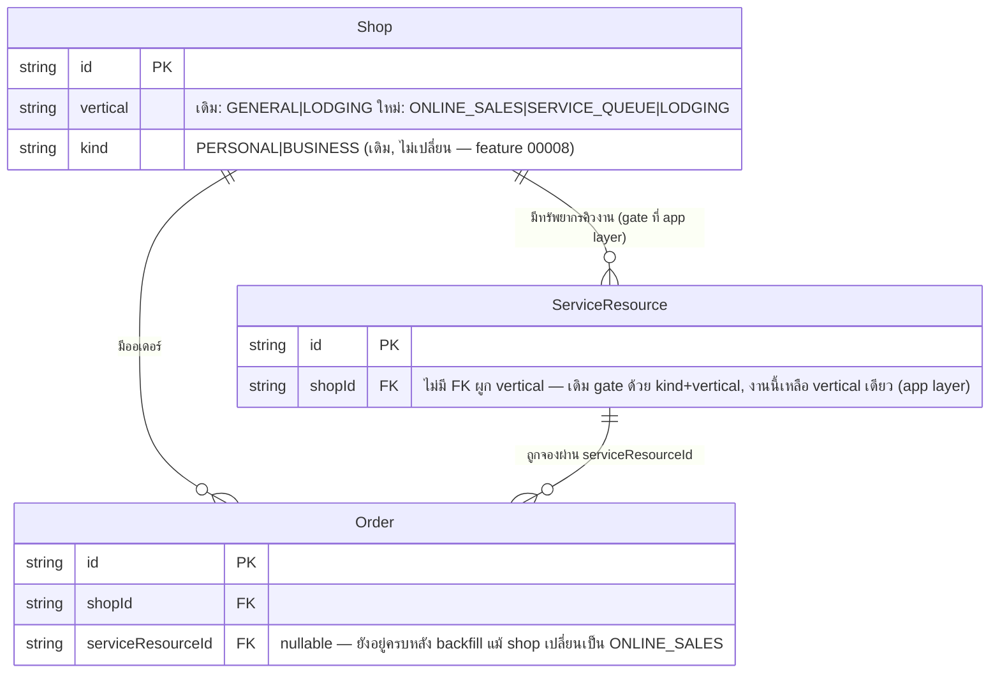

> **โมดูล:** M00028-ShopBusinessType
> **ประเภทเอกสาร:** DATABASE Design
> **เวอร์ชัน:** 1.0
> **วันที่จัดทำ:** 2026-08-03
> **สถานะ:** Draft — migration เขียนไว้แล้ว (hand-written) **ยังไม่ apply** รอผู้ใช้ยืนยันก่อนรัน

# DATABASE: ประเภทร้านค้า (Shop Business Type)

---

## 1. Overview

ฟีเจอร์นี้ **ไม่สร้างตารางใหม่และไม่เพิ่มคอลัมน์ใหม่** — เป็นการเปลี่ยน **ค่าที่ยอมรับได้** ของคอลัมน์เดิม
`Shop.vertical` (เจ้าของเดิม: feature 00017 Lodging Vertical) จาก 2 ค่า (`GENERAL`/`LODGING`) เป็น 3 ค่า
(`ONLINE_SALES`/`SERVICE_QUEUE`/`LODGING`) พร้อม backfill ร้านเดิมทั้งหมดที่เป็น `GENERAL` ให้เป็น
`ONLINE_SALES` แบบเหมารวม (BR-SBT-01)

- **เอกสารต้นทาง:** [[PRD]] + [[BRD]] ของโมดูลนี้ (SRS/SDS ยังไม่จัดทำ — ตาม Hard Rule 11 ของโครงการ
  PRD+BRD ต้องผ่าน user review ก่อนเริ่ม implement; DATABASE.md ฉบับนี้จึง trace กลับ BR-SBT-* ใน BRD
  โดยตรง แทนที่จะ trace ผ่าน SDS component เหมือนฟีเจอร์ที่มี SDS แล้ว — รูปแบบเดียวกับที่ feature 00017
  ทำไว้ตอนที่ยังไม่มี SDS)
- **Store:** PostgreSQL 16/17 บน Supabase — **dev และ prod เป็นฐานข้อมูลเดียวกัน** ณ วันที่เขียนเอกสารนี้
  ยังไม่ได้แยก (ตรวจสอบ `.env.local` ก่อนรันจริงเสมอว่าชี้ dev-only หรือ prod)
- **ตารางที่แตะ:** `Shop` เท่านั้น (1 คอลัมน์เดิม เปลี่ยน default + backfill + เพิ่ม CHECK ใหม่)
- **ตารางที่ต้องไม่แตะและไม่ถูกแตะ:** `ServiceResource`, `Order` — ทั้งสองตารางมีข้อมูลที่ผูกกับร้านที่
  กำลังจะถูก backfill (2 แถว + 1 แถวตามลำดับ) แต่ migration นี้ **ห้ามลบ/แก้ไข**ข้อมูลในสองตารางนี้เด็ดขาด
  (BR-SBT-03) — ตรวจสอบด้วย snapshot ก่อน/หลัง (§5.2)

### 🛑 ข้อบังคับด้านกระบวนการ (อ่านก่อนลงมือ — สืบทอดจาก feature 00017/00022)

- **ห้าม `prisma migrate dev`** — จะพยายาม reset ฐานข้อมูลจริง (Hard Rule 14 — ฐาน prod เคยถูกล้างทั้ง
  64 ตารางมาแล้ว 2026-07-31 ด้วยคำสั่งที่ดูไม่อันตราย)
- **ห้าม `prisma db pull`** — จะไม่เห็น CHECK constraint ที่ Prisma DSL ประกาศไม่ได้ (`Shop_vertical_check`
  ใหม่ในงานนี้ + `Shop_userId_personal_key`, EXCLUDE ต่าง ๆ ที่มีอยู่แล้ว) แล้วเขียนทับ schema ให้ "ตรงกับ
  ที่มองเห็น" ซึ่งจะทำให้ constraint พวกนี้หายไปจาก schema.prisma (แม้ยังอยู่จริงในฐาน จนกว่าจะมี migration
  ถัดไปที่ auto-gen ไป DROP มันทิ้งจริง ๆ)
- ใช้ **hand-written `migration.sql`** (ไฟล์นี้: `prisma/migrations/20260803120000_shop_business_type/`)
  **+ `prisma migrate deploy -e .env.local`** เท่านั้น (ไม่ใช่ `migrate dev`)
- **ต้องขอผู้ใช้ยืนยันก่อนรันทุกครั้ง** เพราะแตะ prod โดยตรง — agent นี้เขียนไฟล์ไว้เฉยเท่านั้น **ไม่ apply เอง**
- อนุญาตเฉพาะ: `prisma migrate status`, `prisma validate`, `prisma generate`, และ `SELECT` (read-only)

อ้างอิง: `docs/conventions/prisma-shared-db-drift.md`, memory `project_shared_db_drift_no_migrate_dev`,
memory `project_prod_db_wipe_20260731`, memory `feedback_shadow_db_url_wipes_target`

---

## 2. ERD

ไม่มีตาราง/ความสัมพันธ์ใหม่ — แสดงเฉพาะคอลัมน์ที่เปลี่ยนความหมาย (ค่าที่ยอมรับได้) เพื่อให้เห็นบริบทกับ
ตารางที่ backfill นี้ทำให้ "มองไม่เห็นผ่าน UI" (ไม่ใช่ FK ที่เปลี่ยน — ไม่มี FK ระหว่าง `Shop.vertical` กับ
`ServiceResource`/`Order` โดยตรง เป็นความสัมพันธ์เชิงกฎธุรกิจที่ gate ฝั่ง service layer เท่านั้น)



---

## 3. Tables

### 3.1 `Shop` — แก้ไขคอลัมน์เดิม (ไม่เพิ่มคอลัมน์ใหม่)

| คอลัมน์ | ชนิด | Null | Default (เดิม → ใหม่) | คำอธิบาย |
|---------|------|------|------------------------|----------|
| `vertical` | `TEXT` | NOT NULL | `'GENERAL'` → **`'ONLINE_SALES'`** | ประเภทร้านค้า — เดิม 2 ค่า (`GENERAL`=สินค้าและบริการรวม, `LODGING`=บ้านพักตากอากาศ), ใหม่ 3 ค่า (`ONLINE_SALES`=ขายออนไลน์, `SERVICE_QUEUE`=สินค้าและบริการ [รับนัดคิว], `LODGING`=บ้านพัก) |

**หมายเหตุสำคัญ:**
- ชนิดคอลัมน์ยังเป็น `TEXT`/`String` ตาม convention เดิมของโปรเจกต์ (มิเรอร์ `kind`/`type`/`status`)
  **ไม่แปลงเป็น Prisma enum** — ตามที่ระบุในบรีฟงาน
- `GENERAL` เดิม **ไม่ได้ถูกเก็บเป็น legacy alias** — backfill แปลงเป็น `ONLINE_SALES` ทั้งหมดแล้วลบค่านี้
  ออกจากขอบเขตที่ยอมรับได้ถาวรผ่าน CHECK constraint ใหม่ (BR-SBT-05)
- **ยังคนละเรื่องกับ 3 คอลัมน์ที่ชื่อคล้ายกัน** เหมือนเดิม — `businessType`
  (`INDIVIDUAL`/`COMPANY`, L3 verification), `kind` (`PERSONAL`/`BUSINESS`, feature 00008),
  `category`/`categories` (หมวดสินค้า) ไม่มีการ reuse หรือเขียนค่าข้ามกันในงานนี้ (BR-SBT ไม่มีเลขเฉพาะ
  แต่สืบทอดจาก BR-LODG-04 ตรงตัว)
- **immutable ที่ระดับแอปเหมือนเดิม** (BR-SBT-08 / สืบทอด BR-LODG-30) — ไม่มี DB trigger กันการแก้ค่านี้
  (โครงการไม่ใช้ trigger ที่ไหนเลย) service ที่แก้ข้อมูลร้านอื่นต้องไม่รับ field นี้เข้ามาเลย (BR-SBT-09)
- `Shop_vertical_idx` (btree index บนคอลัมน์นี้) **มีอยู่แล้ว** จาก feature 00017 — ใช้งานได้กับค่าใหม่ทั้ง
  3 ค่าทันทีโดยไม่ต้องแก้ไขหรือสร้างใหม่

```sql
ALTER TABLE "Shop" ALTER COLUMN "vertical" SET DEFAULT 'ONLINE_SALES';
UPDATE "Shop" SET "vertical" = 'ONLINE_SALES' WHERE "vertical" = 'GENERAL';
ALTER TABLE "Shop" ADD CONSTRAINT "Shop_vertical_check"
    CHECK ("vertical" IN ('ONLINE_SALES', 'SERVICE_QUEUE', 'LODGING')) NOT VALID;
ALTER TABLE "Shop" VALIDATE CONSTRAINT "Shop_vertical_check";
```

### 3.2 `ServiceResource` / `Order` — **ไม่มีการเปลี่ยนแปลงโครงสร้างใด ๆ**

migration นี้ไม่แตะทั้งสองตารางนี้เลยแม้แต่คอลัมน์เดียว — ระบุไว้ในเอกสารนี้เพื่อยืนยันชัดเจนว่า
"ข้อมูลกำพร้า" ที่เกิดจาก backfill (ServiceResource 2 แถว, 1 แถวอยู่ใต้ร้านที่ถูก backfill + Order ที่ผูก
`serviceResourceId` 1 ใบของร้านเดียวกัน) ยังคงอยู่ในฐานครบทุกแถวทุกคอลัมน์ (BR-SBT-03/04, FR-SBT-11)
เพียงแต่เข้าถึงผ่านเมนู "คิวงาน" ไม่ได้อีกต่อไป เพราะเมนูนั้น gate ด้วย `vertical='SERVICE_QUEUE'`
(แก้ที่ `src/lib/seller-menu.ts` — คนละไฟล์ คนละ layer จาก migration นี้)

---

## 4. Indexes & Constraints

### 4.1 Index — ไม่มีการเปลี่ยนแปลง

| ตาราง | Index | สถานะ |
|-------|-------|-------|
| `Shop` | `Shop_vertical_idx` ON `("vertical")` | มีอยู่แล้ว (feature 00017) — ใช้กับค่าใหม่ได้ทันที ไม่ต้องแก้ไข |

ไม่มีการเพิ่ม index ใหม่ในงานนี้ — pattern query ที่ใช้ `vertical` (กรองเมนู/รายงาน) เหมือนเดิมทุกประการ
เปลี่ยนแค่ค่าที่เทียบ (`'GENERAL'` → `'ONLINE_SALES'`) ไม่ใช่รูปแบบ query

### 4.2 CHECK constraint ใหม่ — `Shop_vertical_check`

feature 00017 ไม่เคยเพิ่ม CHECK ให้คอลัมน์นี้มาก่อน (มีแค่ `NOT NULL DEFAULT`) งานนี้เพิ่มให้เป็น
defense-in-depth เพราะตอนนี้ค่าที่ถูกต้องนิ่งแล้วที่ 3 ค่าเป๊ะ ๆ:

```sql
ALTER TABLE "Shop" ADD CONSTRAINT "Shop_vertical_check"
    CHECK ("vertical" IN ('ONLINE_SALES', 'SERVICE_QUEUE', 'LODGING')) NOT VALID;
ALTER TABLE "Shop" VALIDATE CONSTRAINT "Shop_vertical_check";
```

- **`NOT VALID` ก่อน แล้ว `VALIDATE CONSTRAINT` แยกคำสั่ง** — เพราะตาราง `Shop` มีข้อมูลจริงบน prod
  (pattern เดียวกับ `Shop_pinSlots_min1` ของ feature 00013, `Room`/`Order` CHECK ของ feature 00017)
  `NOT VALID` ไม่สแกนตารางตอน `ALTER TABLE` (เร็ว ไม่ล็อกนาน) ส่วน `VALIDATE` สแกนแต่ไม่บล็อก concurrent write
- **ต้องรันหลัง backfill (§3.1) เท่านั้น** — ถ้ารันก่อน แถวที่ยังเป็น `'GENERAL'` จะทำให้ `VALIDATE` ล้มเหลว
  ด้วย error `23514` (check_violation)
- 🛑 **Prisma DSL ประกาศ CHECK constraint ไม่ได้** (unmanaged SQL) — ต้องมีคำเตือนใน `schema.prisma`
  เหนือ field `vertical` ว่า constraint นี้มีอยู่จริงในฐานข้อมูลแม้ schema จะไม่แสดง และ **ห้าม
  `prisma db pull` เด็ดขาด** เพราะ introspection จะไม่เห็น แล้ว migration ถัดไปอาจ generate คำสั่ง
  `DROP CONSTRAINT` ทิ้งโดยไม่ตั้งใจ (precedent เดียวกับ `Shop_userId_personal_key`,
  `Order_room_no_overlap` — ดู §1 ของเอกสารนี้)
- **ผลต่อโค้ด:** ถ้ามีจุดใดในโค้ด (เก่าหรือใหม่) พยายามเขียนค่าอื่นนอกเหนือ 3 ค่านี้เข้า `vertical` จะได้
  `PrismaClientKnownRequestError` code `P2010` (ไม่ใช่ error message ธรรมดา) — ต้องดักที่ service layer
  ถ้ามี path ที่รับค่านี้จาก input ภายนอกโดยตรง (ปัจจุบันมีจุดเดียวคือ `business-shop.service.ts` ตาม
  BRD BR-SBT-17 ซึ่งควร validate ด้วย Valibot allow-list อยู่แล้วก่อนถึงชั้น DB — CHECK คือ safety-net
  ชั้นสุดท้าย ไม่ใช่ชั้นตรวจหลัก)

---

## 5. Migration Plan

### 5.1 ไฟล์ migration

**`prisma/migrations/20260803120000_shop_business_type/migration.sql`** — เขียนมือ (hand-written)
ยืนยันแล้วว่า timestamp มากกว่า migration ล่าสุดที่มีอยู่ในโฟลเดอร์ (`20260802190000_seller_shortcut_preference`)

ลำดับ statement ภายในไฟล์ (รันเป็น transaction เดียวโดย `migrate deploy`):

| ลำดับ | คำสั่ง | ผลกระทบ | ล็อกตาราง |
|-------|--------|---------|-----------|
| 1 | `ALTER TABLE "Shop" ALTER COLUMN "vertical" SET DEFAULT 'ONLINE_SALES'` | metadata-only ไม่แตะแถวเดิม | สั้นมาก (ACCESS EXCLUSIVE ชั่วครู่ระดับ metadata) |
| 2 | `UPDATE "Shop" SET vertical='ONLINE_SALES' WHERE vertical='GENERAL'` | เปลี่ยนค่า ≤6 แถว (ข้อมูลจริง ณ 2026-08-03) | ปกติ (row-level lock, ตารางเล็ก) |
| 3 | `ALTER TABLE "Shop" ADD CONSTRAINT ... NOT VALID` | ไม่สแกนตาราง | สั้นมาก |
| 4 | `ALTER TABLE "Shop" VALIDATE CONSTRAINT ...` | สแกนทั้งตาราง แต่ไม่บล็อก write ระหว่างสแกน | ต่ำ (`Shop` เล็ก ~10 แถว) |

### 5.2 🛑 Pre-flight — ต้องรันและเก็บผลลัพธ์ไว้ก่อน apply migration.sql (BR-SBT-04)

รันด้วย connection ที่ **ยืนยันแล้วว่าชี้ไปถูกฐาน** (parse `DATABASE_URL`/`DIRECT_URL` ก่อนเสมอ — memory
`feedback_parse_database_url_before_claims`) แบบ read-only ล้วน:

```sql
-- (A) Snapshot ร้านที่กำลังจะถูก backfill — เก็บ id ไว้ใช้ selective-rollback ถ้าจำเป็น (§5.4)
SELECT id, "shopName", "userId", kind, vertical, "createdAt"
FROM "Shop"
WHERE vertical = 'GENERAL'
ORDER BY "createdAt";

-- (B) ServiceResource ที่ผูกกับร้านเหล่านั้น — คาดว่า 1 แถว (ร้านธนภัทร์ อะไหล่มอเตอร์ไซค์) ตามข้อมูล
--     prod 2026-08-03 (ServiceResource รวมทั้งระบบมี 2 แถว แถวที่เหลืออยู่ใต้ร้าน BT Premium ซึ่งต้อง
--     ตรวจแยกว่า vertical ปัจจุบันเป็นอะไร — ถ้าไม่ใช่ GENERAL จะไม่ถูก backfill/ไม่กระทบ)
SELECT sr.id, sr."shopId", sr.name, s."shopName", s.vertical
FROM "ServiceResource" sr
JOIN "Shop" s ON s.id = sr."shopId"
WHERE s.vertical = 'GENERAL';

-- (C) Order ที่ผูก serviceResourceId ของร้านเหล่านั้น — คาดว่า 1 แถว
SELECT o.id, o."shopId", o."serviceResourceId", o.status, o."appointmentStatus", o."createdAt"
FROM "Order" o
JOIN "Shop" s ON s.id = o."shopId"
WHERE s.vertical = 'GENERAL' AND o."serviceResourceId" IS NOT NULL;

-- (D) Baseline นับรวม — ใช้เทียบหลัง migrate ว่าจำนวนแถวไม่เปลี่ยน (ไม่มีอะไรถูกลบ)
SELECT vertical, COUNT(*) FROM "Shop" GROUP BY vertical ORDER BY vertical;
SELECT COUNT(*) AS service_resource_total FROM "ServiceResource";
SELECT COUNT(*) AS order_with_service_resource FROM "Order" WHERE "serviceResourceId" IS NOT NULL;
```

> เก็บผลของ (A)/(B)/(C)/(D) ไว้เป็นหลักฐาน (paste ใส่ commit message หรือไฟล์แนบ) — นี่คือ "รายการข้อมูล
> กำพร้าที่ตรวจสอบย้อนหลังได้" ตาม FR-SBT-11 และ PRD KPI "ข้อมูลกำพร้าที่ถูกดูแล = 100%"

### 5.3 Apply

```bash
npx prisma migrate deploy -e .env.local
```

(หรือ target env ที่ user ยืนยัน — ดู memory `project_prisma_migration_env_targets`; ต้องขอ user ยืนยัน
ก่อนรันเสมอเพราะแตะ prod โดยตรง)

### 5.4 🛑 Post-flight — ต้องรันทันทีหลัง apply (BR-SBT-05)

```sql
-- (E) ต้องได้ 0 แถวเสมอ — ถ้าไม่ใช่ 0 = backfill ไม่สมบูรณ์ ห้ามปิดงาน
SELECT COUNT(*) FROM "Shop" WHERE vertical = 'GENERAL';

-- (F) นับรวมหลัง migrate — ผลรวมทุก vertical ต้องเท่ากับผลรวมของ (D) ก่อนหน้า (แถวรวมต้องเท่าเดิม
--     เพราะ backfill แค่เปลี่ยนค่า ไม่เพิ่ม/ลดจำนวนแถว)
SELECT vertical, COUNT(*) FROM "Shop" GROUP BY vertical ORDER BY vertical;

-- (G) ยืนยันว่าไม่มีอะไรถูกลบใน 2 ตารางที่ "ห้ามแตะ" — ต้องเท่ากับ (D) เป๊ะ
SELECT COUNT(*) AS service_resource_total FROM "ServiceResource";
SELECT COUNT(*) AS order_with_service_resource FROM "Order" WHERE "serviceResourceId" IS NOT NULL;

-- (H) ยืนยันรายตัวว่าร้านใน snapshot (A) ทุกแถวได้ 'ONLINE_SALES' ครบ (paste id list จาก A)
SELECT id, "shopName", vertical FROM "Shop" WHERE id IN (/* paste ids จาก (A) */);

-- (I) ยืนยันว่า CHECK constraint ใช้งานจริง — ต้อง error 23514 (ตัวอย่าง ไม่ต้องรันจริงถ้าไม่อยากทดสอบ)
-- UPDATE "Shop" SET vertical = 'INVALID_TEST' WHERE id = (SELECT id FROM "Shop" LIMIT 1); -- ต้อง error
```

ถ้า (E) ≠ 0 หรือ (G) ไม่เท่ากับ baseline — **หยุดทันที แจ้ง user ก่อนทำอะไรต่อ** ห้ามพยายามแก้ไขเองด้วย
คำสั่งเพิ่มเติมที่ไม่ได้ผ่านการ review

### 5.5 Rollback

| ขั้น | คำสั่ง rollback | ความเสี่ยง |
|------|------------------|-------------|
| CHECK constraint | `ALTER TABLE "Shop" DROP CONSTRAINT "Shop_vertical_check";` | ต่ำ — ไม่กระทบข้อมูล |
| Default | `ALTER TABLE "Shop" ALTER COLUMN "vertical" SET DEFAULT 'GENERAL';` | ต่ำ — ไม่กระทบข้อมูล |
| Backfill (UPDATE) | **ห้าม** `UPDATE "Shop" SET vertical='GENERAL' WHERE vertical='ONLINE_SALES'` แบบเหมา — หลัง migrate ร้านใหม่ที่ผู้ใช้เลือก `ONLINE_SALES` เองก็จะถูกดึงกลับผิด ๆ ด้วย ต้อง **ใช้ id list จาก snapshot (A) เท่านั้น**: `UPDATE "Shop" SET vertical='GENERAL' WHERE id IN (/* ids จาก A */);` | **สูง** — ทำได้แค่ช่วงสั้น ๆ ก่อนมีร้านใหม่เลือก `ONLINE_SALES` เอง (P2 ของฟีเจอร์นี้ยังไม่ deploy ณ ตอนที่เขียนเอกสารนี้ จึงยังปลอดภัยเชิงเวลา — แต่ต้องเช็คก่อนว่ามีร้านใหม่ถูกสร้างหลัง migrate หรือยัง) |

> 🛑 เนื่องจาก dev = prod การ rollback backfill คือการเปลี่ยนข้อมูลผู้ใช้จริงอีกรอบ — **ต้องขออนุมัติ
> ผู้ใช้เป็นลายลักษณ์อักษรก่อนเสมอ** ทางที่ปลอดภัยกว่าคือปิดฟีเจอร์ที่ระดับแอป (ซ่อนเมนู/revert โค้ด
> gate) แล้วปล่อยค่า `vertical` ไว้ตามเดิม — ไม่แตะฐานข้อมูลซ้ำถ้าไม่จำเป็นจริง ๆ

### 5.6 ผลกระทบ (Impact)

| ประเด็น | การประเมิน |
|---------|------------|
| **ข้อมูลเดิม** | ไม่มีการลบ — เปลี่ยนค่าคอลัมน์เดียว (≤6 แถว) และเพิ่ม CHECK ที่ผ่านได้ทุกแถวหลัง backfill |
| **การล็อกตาราง** | `SET DEFAULT` และ CHECK `NOT VALID` เป็น metadata-only; `UPDATE` แตะแค่ 6 แถว; `VALIDATE CONSTRAINT` สแกนทั้งตาราง `Shop` แต่ตารางมีแค่ ~10 แถว — เร็วมาก ไม่ต้อง `CONCURRENTLY` |
| **Downtime** | ไม่มี — ทุก statement รันเร็ว (หลักมิลลิวินาที-วินาที) ไม่ต้อง maintenance window |
| **Backward compatibility** | โค้ดที่ยังเทียบ `vertical === 'GENERAL'` ตรง ๆ (ยังไม่ถูกแก้) จะเริ่มพบ 0 แถวที่ตรงเงื่อนไขทันทีหลัง backfill — ต้อง grep ทั้ง repo ให้ครบก่อนปิดงาน (BR-SBT-20, งานนี้เป็นความรับผิดชอบของ developer/reviewer ไม่ใช่ scope ของ DATABASE.md แต่ระบุไว้เพื่อเตือน sequencing: **deploy โค้ดที่แก้ gate ทั้งหมดก่อน หรือพร้อมกับ migration นี้ ไม่ใช่หลัง** มิฉะนั้นร้านที่ backfill แล้วจะเจอ endpoint ที่ gate ด้วยค่าเก่าที่ไม่มีอยู่จริง = ปฏิเสธทุก request โดยไม่ตั้งใจ (ระบุเป็นความเสี่ยงทางเทคนิคใน PRD §6.2) |
| **`prisma generate`** | ต้องรันหลังแก้ `schema.prisma` (§9) และ **restart dev server** มิฉะนั้น Prisma client เก่าจะทำให้ session/API พัง (บทเรียน seller auth 2026-06-16) |

---

## 6. Retention / ข้อควรระวัง

- **ไม่มีการลบข้อมูลใด ๆ ในงานนี้** — migration นี้เป็น UPDATE ค่าคอลัมน์เดียวเท่านั้น ไม่มี DELETE/DROP
  แม้แต่คำสั่งเดียว (Hard Rule ของโครงการ)
- **ข้อมูลกำพร้า (`ServiceResource`/`Order` ของร้าน hybrid)** ยังคงอยู่ในฐานครบ 100% — เข้าถึงได้ผ่าน
  query ตรง ๆ (§5.2/§5.4) ตลอดไป แม้ UI จะซ่อนเมนูคิวงานของร้านนั้น ไม่มี retention job ใดมาลบทิ้ง
- **PII** — ไม่มี PII ใหม่เกิดขึ้นจาก migration นี้ (`Shop.vertical` ไม่ใช่ PII); คอลัมน์ PII ที่มีอยู่แล้ว
  ของ `ServiceResource`/`Order` (เช่น `Order.buyerContact`) ไม่ถูกแตะเลย
- **ห้าม `prisma db pull` หลัง apply migration นี้** — `Shop_vertical_check` เป็น unmanaged SQL ที่
  introspection มองไม่เห็น เหมือน `Shop_userId_personal_key`/`Order_room_no_overlap` ที่มีอยู่ก่อนแล้ว
- **Performance** — ไม่มีผลต่อ performance ระยะยาว; ตาราง `Shop` มีขนาดเล็ก (~10 แถว ณ วันที่เขียน) และ
  ไม่ใช่ hot table ที่เขียนบ่อย (`vertical` เป็น immutable field)

---

## 7. Traceability

| กฎธุรกิจ (BRD) | สิ่งที่บังคับ/สะท้อนในฐานข้อมูล |
|-----------------|-----------------------------------|
| BR-SBT-01 | `UPDATE "Shop" SET vertical='ONLINE_SALES' WHERE vertical='GENERAL'` — เหมารวมทุกแถว ไม่มี heuristic |
| BR-SBT-02 | เงื่อนไข `WHERE vertical='GENERAL'` ไม่มีทางแตะแถวที่ `vertical='LODGING'` ได้เลย |
| BR-SBT-03 | ไม่มี DELETE/DROP statement ใด ๆ ในไฟล์ migration; ตาราง `ServiceResource`/`Order` ไม่ถูกแตะเลย |
| BR-SBT-04 | Pre-flight snapshot query §5.2 (A)(B)(C)(D) |
| BR-SBT-05 | Post-flight verify query §5.4 (E)(F)(G)(H); CHECK constraint กันค่า `'GENERAL'` ไม่ให้กลับเข้ามาได้อีกในอนาคต |
| BR-SBT-06, 07 | `ALTER COLUMN vertical SET DEFAULT 'ONLINE_SALES'` — ร้านใหม่ที่ไม่ระบุ vertical ได้ค่านี้อัตโนมัติ |
| BR-SBT-08, 09 | ไม่มี DB trigger บังคับ immutability (สืบทอด BR-LODG-30) — คงบังคับที่ service layer เท่านั้น ตามที่ระบุใน comment เหนือ field `vertical` (§9) |
| BR-SBT-20 (บางส่วน) | CHECK constraint ใหม่เป็น safety-net ชั้นสุดท้ายกันค่า string literal ผิดหลุดเข้ามาที่ระดับ DB (คนละชั้นจาก grep โค้ดที่ developer ต้องทำแยก) |

---

## 8. สรุป

การเปลี่ยนแปลงฐานข้อมูลทั้งหมดของฟีเจอร์นี้คือ **การแก้ไขคอลัมน์เดียว** บนตาราง `Shop` ที่มีอยู่แล้ว
(`vertical`) — ไม่มีตารางใหม่ ไม่มีคอลัมน์ใหม่ ไม่มีการลบข้อมูล ประกอบด้วย 3 การเปลี่ยนแปลง:

1. เปลี่ยน `DEFAULT` จาก `'GENERAL'` เป็น `'ONLINE_SALES'`
2. Backfill ร้านเดิมทั้งหมด (`≤6` แถว ณ วันที่เขียนเอกสาร) จาก `'GENERAL'` เป็น `'ONLINE_SALES'` แบบเหมารวม
3. เพิ่ม CHECK constraint ใหม่ (`Shop_vertical_check`) จำกัดค่าให้เหลือ 3 ค่าที่ถูกต้องเท่านั้น

ความเสี่ยงหลักไม่ได้อยู่ที่ตัว SQL เอง (เล็ก เร็ว ปลอดภัย) แต่อยู่ที่ **sequencing กับโค้ดฝั่งแอป** — ถ้า
gate ต่าง ๆ (`src/lib/appointments.ts`, `src/lib/shop-api-guard.ts`, `src/lib/seller-menu.ts`, auction
guard ใหม่) ยังไม่ถูกแก้ให้เช็คค่าใหม่ก่อนหรือพร้อมกับ migration นี้ ร้านที่ถูก backfill จะเจอ endpoint
ที่ยังเทียบ `'GENERAL'` ปฏิเสธทุก request โดยไม่ตั้งใจ — ระบุไว้เป็นความเสี่ยงต้องจัดการที่ layer อื่น
(§5.6) ไม่ใช่สิ่งที่ migration SQL แก้ให้ได้เอง

**Open Questions:** ไม่มี — ยืนยันตัวเลขข้อมูล prod แล้วจาก Controller (2026-08-03): 6 ร้าน `GENERAL`,
0 ร้าน `LODGING`, `ServiceResource` 2 แถว, `Order` ที่ผูก `serviceResourceId` 1 ใบ

---

## 9. การเปลี่ยนแปลง `prisma/schema.prisma` ที่ต้องทำ (ให้ Controller แก้)

ดูรายละเอียด diff เต็มในข้อความส่งท้าย (final message) ของ agent นี้ — สรุปสั้น:

| บรรทัด (ปัจจุบัน) | เปลี่ยนอะไร |
|---------------------|--------------|
| `~186-199` (comment block + `@default("GENERAL")`) | อัปเดต comment เป็น 3 ค่า + เปลี่ยน `@default("GENERAL")` → `@default("ONLINE_SALES")` + เพิ่มคำเตือน CHECK constraint unmanaged SQL |
| `~213` (`rooms` relation comment) | `vertical = GENERAL` → ถ้อยคำใหม่ที่ไม่ผูกกับค่าที่ไม่มีอยู่แล้ว |
| `~238` (`shippingAccount` relation comment) | `เฉพาะ vertical=GENERAL` → `เฉพาะ vertical=ONLINE_SALES` |
| `~265` (`@@index([vertical], ...)` comment) | เพิ่มหมายเหตุอ้างอิง `Shop_vertical_check` ใหม่ |
| `~337` (`ServiceResource` model comment) | `kind=BUSINESS "และ" vertical=GENERAL` → `vertical=SERVICE_QUEUE` (ตาม BR-SBT-11 — ตัด `kind` ออก) |
| `~1661` (iShip section comment) | `Shop.vertical = "GENERAL"` → `Shop.vertical = "ONLINE_SALES"` |

**ไม่มีการเพิ่ม field ใหม่ ไม่มีการเพิ่ม relation ใหม่ ไม่มี model ใหม่** — เป็นการแก้ comment +
default value เท่านั้นในไฟล์ schema.prisma
