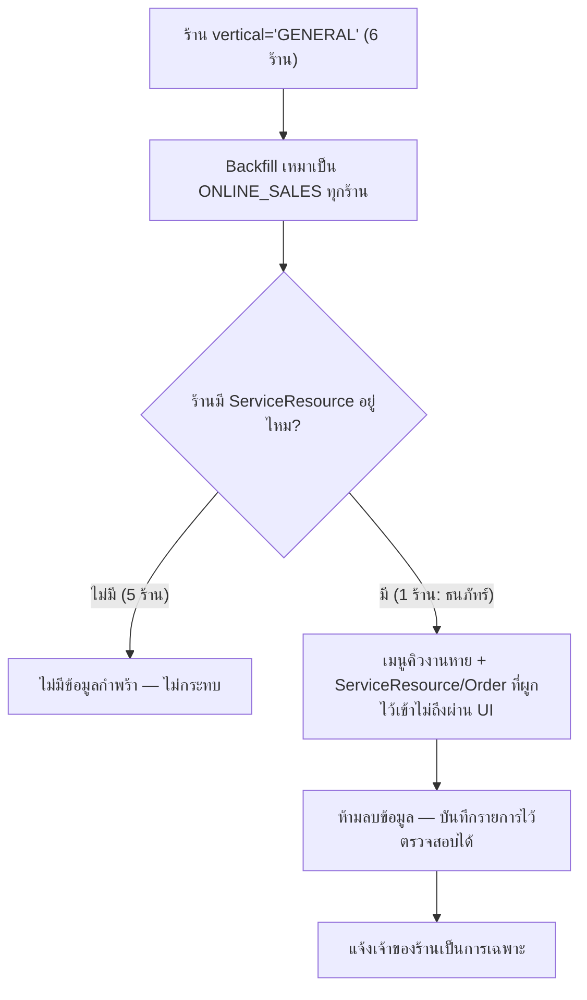

> **โมดูล:** 00028 — Shop Business Type
> **ประเภทเอกสาร:** Product Requirements Document (PRD)
> **เวอร์ชัน:** 1.0
> **วันที่จัดทำ:** 2026-08-03
> **สถานะ:** Draft — รอ user review
> **เจ้าของเอกสาร:** BA + PO + PM (ดู [[Feature-Docs-Ownership]])

# PRD: ประเภทร้านค้า (Shop Business Type)

---

## Executive Summary

Deep มีระบบแยก "ประเภทกิจการ" (`Shop.vertical`) มาตั้งแต่ feature 00017 — แต่ปัจจุบันมีแค่ 2 ค่า: `GENERAL` ("สินค้าและบริการ") กับ `LODGING` ("บ้านพักตากอากาศ") ปัญหาคือ `GENERAL` ทำหน้าที่ 2 อย่างที่ไม่เหมือนกันเลยพร้อมกัน — ร้านขายของที่ต้องจัดส่ง (iShip) กับร้านให้บริการที่ลูกค้านัดวันเข้ามาใช้ (feature 00024 "คิวงาน") ถูกยัดรวมอยู่ใน `vertical=GENERAL` ตัวเดียว แยกกันแค่ด้วยเงื่อนไข `kind==='BUSINESS'` ที่ไม่มีความหมายทางธุรกิจตรงกับสิ่งที่แยกจริง (บัญชีบุคคลก็ให้บริการนัดหมายได้ในชีวิตจริง)

ฟีเจอร์นี้แยก `GENERAL` ออกเป็น 2 ประเภทที่ผู้ใช้เลือกได้ตรง ๆ ตอนสร้างร้าน — **"ขายออนไลน์" (`ONLINE_SALES`)** สำหรับร้านที่ต้องจัดส่งสินค้า และ **"สินค้าและบริการ" (`SERVICE_QUEUE`)** สำหรับร้านที่รับนัดคิวเข้ารับบริการ ไม่มีการจัดส่ง — รวมกับ `LODGING` ("บ้านพัก" — เปลี่ยนชื่อสั้นลงจาก "บ้านพักตากอากาศ") เป็น 3 ประเภทที่เลือกได้ 1 อย่างตอนสร้างร้าน (Personal และ Business เหมือนกัน) และเปลี่ยนไม่ได้ภายหลัง — สอดคล้องกับกติกาเดิมของ `vertical` ที่มีมาตั้งแต่ 00017

ผลที่ตามมาโดยตรง: ระบบเมนู/สิทธิ์ที่ผูกกับ `vertical` ทั้งหมด (คิวงาน, จัดส่ง iShip, ห้องพัก) เปลี่ยนจากการเช็ค 2 เงื่อนไขผสมกัน (`kind`+`vertical`) เหลือเช็คแค่ `vertical` เงื่อนไขเดียว — ลด edge case ที่เคยเกิดจากฟิลด์ 2 ตัวสื่อความหมายซ้อนกัน และเปิดให้บัญชีบุคคลใช้ระบบคิวงานได้เป็นครั้งแรก งานนี้ยังปิดช่องโหว่ที่พบระหว่างสำรวจโค้ด (ระบบประมูลไม่เคยมี server-side guard ตรวจ `vertical` เลย ใช้แค่ซ่อนเมนู) เป็นผลพลอยได้

Trade-off ที่ต้องยอมรับ: ร้านที่ทำทั้งขายส่งของและรับนัดคิวพร้อมกันในบัญชีเดียว (เคสจริงในโปรดักชันวันนี้ 1 ร้าน) ต้องเลือก 1 ประเภท — ข้อมูลนัดหมายเดิมของร้านนั้นไม่ถูกลบ แต่จะเข้าถึงผ่านหน้าจอไม่ได้ชั่วคราวหลังเปลี่ยนแปลง (ดู §3.3, §6.1)

---

## 1. Business Goals & KPIs

### 1.1 เป้าหมายทางธุรกิจ

| เป้าหมาย | รายละเอียด |
|----------|-----------|
| **ประเภทร้านค้าตรงกับพฤติกรรมจริง** | เลิกใช้ `kind` (บัญชีบุคคล/ธุรกิจ) เป็นตัวตัดสินว่าร้านรับนัดคิวได้หรือไม่ — ใช้สิ่งที่ร้าน "เป็น" ตัดสินโดยตรง |
| **เปิดระบบคิวงานให้บัญชีบุคคล** | ร้านเดี่ยว/ฟรีแลนซ์ (เช่นร้านแต่งไฟหน้ารถที่เป็นลูกค้ากลุ่มแรกของ feature 00024) ใช้ระบบคิวงานได้โดยไม่ต้องจดทะเบียนธุรกิจก่อน |
| **ลดความซับซ้อนของ gate เดิม** | เปลี่ยนเงื่อนไข 2 ฟิลด์ (`kind`+`vertical`) เป็นฟิลด์เดียว (`vertical`) ทุกจุดที่เคยเช็คแบบผสม |
| **ปิดช่องโหว่สิทธิ์ที่มีอยู่ก่อน** | ระบบประมูลไม่เคยมี server-side vertical guard — งานนี้ปิดพร้อมกันเพราะโครงสร้าง gate ใหม่บังคับให้ทุก endpoint ต้องประกาศ vertical ที่ตัวเองรองรับ |
| **ไม่ทำลายข้อมูลเดิม** | ร้านที่ backfill ไปเป็นประเภทที่ปิดการเข้าถึงคุณสมบัติเดิม (เช่นร้าน hybrid ที่มีนัดหมายอยู่) ข้อมูลต้องยังอยู่ในฐานครบ ไม่ลบทิ้ง |

### 1.2 ตัวชี้วัดความสำเร็จ (KPIs)

| KPI | คำอธิบาย | เป้าหมาย |
|-----|----------|---------|
| **Regression ร้านเดิม** | ร้านที่ backfill เป็น `ONLINE_SALES` มีพฤติกรรม/เมนูเปลี่ยนไปจากตอนเป็น `GENERAL` | 0 (ยกเว้นร้าน hybrid 1 รายที่รู้ตัวและ mitigate ตาม §3.3) |
| **ช่องโหว่ vertical guard ที่เหลือ** | endpoint กลุ่ม seller ที่ควร gate ด้วย vertical แต่ไม่มี guard | 0 หลังงานนี้เสร็จ (auction รวมอยู่ในนี้) |
| **บัญชีบุคคลที่ใช้คิวงานได้** | จำนวนร้าน `kind=PERSONAL` ที่สร้าง `ServiceResource` ได้สำเร็จหลังเปิดใช้ | > 0 ภายใน 1 เดือนหลัง deploy |
| **ข้อมูลกำพร้าที่ถูกดูแล** | ServiceResource/Order ที่เข้าไม่ถึงผ่าน UI หลัง backfill ยังอยู่ครบในฐาน + มีรายการที่ตรวจสอบได้ | 100% (2 ServiceResource + Order ที่ผูกไว้ ณ วันตัดสินใจ) |

### 1.3 ขอบเขตการส่งมอบตาม Phase

| Phase | ส่งมอบ | คุณค่าที่ผู้ใช้ได้เมื่อจบ Phase |
|-------|--------|-------------------------------|
| **P1 — เปลี่ยนค่า enum + gate + backfill** | เปลี่ยน `Shop.vertical` เป็น 3 ค่า (`ONLINE_SALES`/`SERVICE_QUEUE`/`LODGING`), migrate ร้านเดิมทั้งหมด, แก้ gate ทุกจุด (เมนู, API guard, appointment gate ตัด `kind`), ปิดช่องโหว่ auction | ระบบทำงานถูกต้องตามประเภทใหม่ทันที แม้ยังไม่มีหน้าให้เลือกตอนสร้างร้านใหม่ (ร้านใหม่ default `ONLINE_SALES` เหมือนพฤติกรรมเดิมของ `GENERAL`) |
| **P2 — หน้าเลือกประเภทตอนสร้างร้าน** | ตัวเลือก 3 แบบพร้อม hint + คำเตือน immutable ที่ Personal onboarding และ Business creation | ผู้ใช้ใหม่เลือกประเภทได้ตรงกับธุรกิจจริงตั้งแต่วันแรก |
| **P3 — Public Profile สาขาที่ 3** | หน้า `/u/{username}` แสดงผลต่างสำหรับร้าน `SERVICE_QUEUE` (แทนที่จะ fallback ไปสาขา product grid ของ `ONLINE_SALES`) | ผู้เข้าชมเห็นสิ่งที่ตรงกับร้านบริการจริง (รายการบริการ/ทรัพยากร แทนสินค้า) |

> P1 คือแกนหลักที่ทำให้ระบบถูกต้อง (correctness) — P2/P3 คือ UX ที่ต่อยอด ถ้าเวลาจำกัด P1 ส่งมอบเดี่ยวได้โดยไม่ทำให้ระบบพัง (ร้านใหม่ยัง default ถูกต้อง เพียงแต่ยังเลือกประเภทอื่นเองไม่ได้จนกว่าจะมี P2)

---

## 2. User Personas (กลุ่มผู้ใช้งาน)

### 2.1 ผู้ขายออนไลน์ (ONLINE_SALES)

**ข้อมูลพื้นฐาน:**
- ร้านที่ขายสินค้าต้องจัดส่ง — คือกลุ่มผู้ใช้ส่วนใหญ่ของ Deep วันนี้ (ทุกร้านที่เคยเป็น `GENERAL` และไม่มีระบบคิวงาน)

**เป้าหมาย:**
- ขายสินค้า จัดส่งผ่าน iShip อัตโนมัติ ประมูลสินค้าได้

**ความต้องการ:**
- ไม่ต้องทำอะไรใหม่เลยหลังฟีเจอร์นี้ออก — พฤติกรรมต้องเหมือนตอนเป็น `GENERAL` ทุกประการ

**จุดปวด (Pain Points):**
- กลัวว่าฟีเจอร์ที่แก้ vertical จะทำให้เมนู/ข้อมูลร้านที่มีอยู่หายหรือเปลี่ยนโดยไม่รู้ตัว

### 2.2 ผู้ให้บริการนัดหมาย (SERVICE_QUEUE)

**ข้อมูลพื้นฐาน:**
- ร้านบริการหน้าร้านที่ลูกค้าต้องนัดวัน/เวลาเข้ามาใช้บริการ (ตัวอย่างจริงจาก feature 00024: ร้านแต่งไฟหน้ารถ, ร้านนวด, สตูดิโอโยคะ) — **รวมทั้งบัญชีบุคคลและบัญชีธุรกิจ** (ต่างจากวันนี้ที่บัญชีบุคคลใช้ไม่ได้)

**เป้าหมาย:**
- รับนัดคิว กันจองเกินความจุ ไม่ต้องมีเมนูจัดส่ง/สต็อกที่ไม่เกี่ยวข้องมารก

**ความต้องการ:**
- เลือกประเภทนี้ได้ตอนสร้างร้าน แม้ยังไม่ได้จดทะเบียนธุรกิจ
- ยังขายสินค้าเสริม (เช่น แพ็กเกจ/คอร์ส) ได้ แม้ไม่มีจัดส่ง

**จุดปวด (Pain Points):**
- วันนี้ต้องสร้างเป็นบัญชีธุรกิจก่อนถึงจะปลดล็อกคิวงานได้ ทั้งที่เป็นร้านเดี่ยว/ยังไม่พร้อมจดทะเบียน

### 2.3 เจ้าของบ้านพัก (LODGING)

**ข้อมูลพื้นฐาน:**
- เจ้าของบ้านพัก/พูลวิลล่า — ไม่ได้รับผลกระทบเชิงพฤติกรรมจากฟีเจอร์นี้เลย

**เป้าหมาย:**
- ทำงานเหมือนเดิมทุกประการ

**ความต้องการ:**
- ป้ายชื่อประเภทกิจการที่เห็นเปลี่ยนจาก "บ้านพักตากอากาศ" เป็น "บ้านพัก" เท่านั้น — ไม่มีอะไรอื่นเปลี่ยน

**จุดปวด (Pain Points):**
- ไม่มี (persona ที่ต้องยืนยันว่า "ไม่กระทบ" เหมือน 00017 เดิม)

### 2.4 ร้านที่ใช้ทั้งขายของและรับนัด (persona เสี่ยงกระทบ — ต้องดูแลเป็นพิเศษ)

**ข้อมูลพื้นฐาน:**
- ร้านที่มีอยู่จริงในโปรดักชัน 1 ราย (ธนภัทร์ อะไหล่มอเตอร์ไซค์) ที่ทั้งขายสินค้าส่งของ (4 ออเดอร์ SHIPPED) และรับนัดผ่านระบบคิวงาน (1 ออเดอร์ผูก `ServiceResource`) พร้อมกันในร้านเดียว

**เป้าหมาย:**
- อยากใช้ทั้ง 2 ความสามารถต่อไปถ้าเป็นไปได้ — แต่ยอมรับได้ถ้าต้องเลือก 1 อย่าง (ตราบใดที่ข้อมูลเดิมไม่หาย)

**ความต้องการ:**
- ถูก backfill เป็น `ONLINE_SALES` (คงความสามารถขายของ/จัดส่งที่ใช้บ่อยกว่า — 4 ออเดอร์ SHIPPED vs 1 นัดหมาย) โดยรู้ล่วงหน้าว่าเมนูคิวงานจะหายไป
- ข้อมูลนัดหมายเดิม (ทรัพยากร + ออเดอร์ที่นัดไว้) ต้องไม่ถูกลบ แม้เข้าถึงผ่านเมนูไม่ได้แล้ว

**จุดปวด (Pain Points):**
- ถ้าไม่มีการสื่อสารล่วงหน้า จะงงว่าทำไมเมนู "คิวงาน" หายไปทันที

---

## 3. Business Requirements

### 3.1 เลือกประเภทร้านค้าตอนสร้างร้าน

**ความต้องการ:**
- ตอนสร้างร้าน (ทั้ง Personal onboarding และ Business creation) ผู้ใช้เลือก **ประเภทร้านค้า** ได้ 3 แบบ: *ขายออนไลน์*, *สินค้าและบริการ*, *บ้านพัก*
- ประเภทที่เลือกกำหนดเมนู หน้าตั้งค่า และ capability ที่เปิดใช้ทั้งหมดของร้านนั้น
- ร้านทั้งหมดที่มีอยู่ก่อนฟีเจอร์นี้ (`vertical=GENERAL` เดิม) ถูก backfill เป็น *ขายออนไลน์* โดยอัตโนมัติ (รายละเอียด §3.3)

**Business Rules:**
- ค่าเริ่มต้นของร้านใหม่ที่ยังไม่เลือก = *ขายออนไลน์*
- 1 ร้าน = 1 ประเภท เลือกได้แบบเดียว ไม่ใช่หลายแบบพร้อมกัน
- เลือกแล้ว **เปลี่ยนภายหลังไม่ได้** — สืบทอดกติกาเดิมจาก feature 00017 (BR-LODG-30) ตรงตัว ไม่ใช่กติกาใหม่
- ใช้ได้ทั้งบัญชี Personal และ Business (ต่างจากวันนี้ที่ตัวเลือกนี้มีเฉพาะตอนสร้าง Business shop)

**เหตุผล:**
- ธุรกิจ 3 แบบนี้มีวิธีทำงานต่างกันจนใช้หน้าจอชุดเดียวกันไม่ได้ — เหตุผลเดียวกับที่ feature 00017 ใช้แยก LODGING ออกจากที่เหลือ
- การบังคับเลือกครั้งเดียวตั้งแต่ต้น ทำให้ระบบเมนู/gate เขียนแบบง่าย (เช็คค่าเดียว) แทนที่จะต้องรองรับการสลับไปมาซึ่งมีผลข้างเคียงกับข้อมูลที่บันทึกไว้แล้ว (นัดหมาย/ห้องพัก/สินค้าที่ตั้งค่าตามประเภทเดิม)

### 3.2 เมนูและสิทธิ์แยกตามประเภท (ปิดช่องโหว่เดิมไปพร้อมกัน)

**ความต้องการ:**
- ร้าน *ขายออนไลน์* เห็นเมนู: สินค้า, สต็อก, ประมูล, จัดส่ง (iShip)
- ร้าน *สินค้าและบริการ* เห็นเมนู: สินค้า (ไม่มีสต็อก/ประมูล), คิวงาน
- ร้าน *บ้านพัก* เห็นเมนู: ห้องพัก, ปฏิทิน, การจอง, แม่บ้าน
- ความสามารถกลางเปิดให้ทั้ง 3 ประเภทเหมือนกัน: Public Profile, ยืนยันตัวตน, Trust Score, แชท/ChatBot, รีวิว, กระเป๋าเงินร้าน, สร้างออเดอร์ (POS)
- การเข้าหน้า/เรียก endpoint ที่ไม่ตรงประเภทของร้านตัวเอง โดยพิมพ์ที่อยู่ตรง ๆ หรือยิง API ตรง ๆ ต้องถูกปฏิเสธเสมอ **รวมถึงระบบประมูลที่พบว่าไม่เคยมีการปฏิเสธแบบนี้มาก่อนเลย**

**Business Rules:**
- การซ่อนเมนูไม่ใช่การควบคุมสิทธิ์ — ทุกโดเมนที่ผูกกับประเภทร้านต้องมี guard ระดับ endpoint เสมอ (สืบทอดหลักการเดิมจาก BR-LODG-03/BR-RSV-02)
- ระบบประมูล (ที่พบว่าไม่มี guard นี้มาก่อนฟีเจอร์นี้เลย) ต้องได้ guard ใหม่พร้อมกันในงานนี้ ไม่ใช่ตัดออกไปทำทีหลัง — เพราะโครงสร้างเดิม (`kind`+`vertical` ผสมกัน) กำลังถูกรื้อพอดี เป็นจังหวะแก้ที่ถูกที่สุด

**เหตุผล:**
- มาตรฐานเดียวกับที่ feature 00017/00024 วางไว้แล้ว — งานนี้แค่ขยายจาก 2 branch เป็น 3 branch
- ช่องโหว่ auction ถ้าไม่ปิดพร้อมกัน จะกลายเป็นหนี้เทคนิคที่ไม่มีจุดกลับมาแก้อีก เพราะ gate เดิมกำลังถูก refactor อยู่แล้วในงานนี้พอดี

### 3.3 Backfill ร้านเดิม + การจัดการข้อมูลกำพร้า

**ความต้องการ:**
- ร้านทั้งหมดที่ `vertical=GENERAL` วันนี้ (ยืนยันจากข้อมูลจริง = 6 ร้าน, 0 ร้าน LODGING) ถูกเปลี่ยนเป็น `ONLINE_SALES` ทั้งหมด แบบเหมารวม ไม่แยกแยะ แม้จะมีร้าน 1 รายที่มีการใช้งานคิวงานอยู่จริง (`ServiceResource` 2 แถวทั้งระบบ, 1 แถวอยู่ใต้ร้านนี้ + Order ที่ผูก `serviceResourceId` 1 ใบ)
- ข้อมูล `ServiceResource` และ `Order` ที่ผูกกับนัดหมายเดิมของร้านที่ถูก backfill เป็น `ONLINE_SALES` **ต้องไม่ถูกลบ** — เก็บไว้ในฐานข้อมูลครบทุกแถว เพียงแต่ไม่มีทางเข้าถึงผ่านหน้าจอ (เมนูคิวงานหายไปเพราะร้านกลายเป็น `ONLINE_SALES`)

**Business Rules:**
- Backfill เป็น one-time data migration รันครั้งเดียวตอน deploy ไม่ใช่ logic ที่รันซ้ำได้ในอนาคต
- ห้ามลบแถวข้อมูลใด ๆ ทั้งสิ้นระหว่าง backfill (Hard Rule ของโครงการ — ข้อมูลค้างต้อง "ถูก exclude จาก UI" ไม่ใช่ "ถูกลบ")
- ต้องมีรายการ (list) ของ `Shop`/`ServiceResource`/`Order` ที่กลายเป็นข้อมูลกำพร้าหลัง backfill ให้ทีมพัฒนา/ผู้ดูแลระบบตรวจสอบย้อนหลังได้ — ไม่ใช่แค่รันแล้วปล่อยผ่าน

**เหตุผล:**
- ข้อมูล prod มีขนาดเล็กมาก (10 users) การ backfill เหมารวมโดยไม่ต้องเขียน logic แยกแยะซับซ้อนเป็นทางเลือกที่ปลอดภัยกว่าและตรวจสอบได้ง่ายกว่า การพยายามเขียน heuristic แยกร้าน hybrid ออกมาอัตโนมัติ (สร้างเป็น `SERVICE_QUEUE` แทน) จะทำให้ร้านนั้นเสียความสามารถขายของส่งที่ใช้งานหนักกว่า (4 ออเดอร์ SHIPPED vs 1 นัดหมาย) ซึ่งผิดทิศทาง
- การไม่ลบข้อมูลกำพร้าคือ Hard Rule ของโครงการอยู่แล้ว (ห้ามลบข้อมูลเว้นแต่สั่งชัด) — สอดคล้องกับ precedent ของ `Shop.deletedAt`/`purgedAt` ที่ soft-delete ไม่เคย physical DELETE

### 3.4 Public Profile ต้องแยกสาขาที่ 3

**ความต้องการ:**
- หน้าโปรไฟล์สาธารณะ `/u/{username}` ที่ปัจจุบันมี 2 สาขา (ห้องพัก vs สินค้า) ต้องขยายเป็น 3 สาขา — ร้าน `SERVICE_QUEUE` ต้องไม่ถูกจัดเข้าสาขาเดียวกับร้านขายของ

**Business Rules:**
- Trust banner, badge, รีวิว, channel, chat CTA เหมือนกันทั้ง 3 ประเภท (ความสามารถกลาง)
- Block เนื้อหาหลัก + CTA หลักต่างกันตามประเภท (รายละเอียดให้ SRS/SDS/UX-Design-Spec กำหนด — ต้องผ่าน `safepay-ux` gate ก่อนแตะ UI จริง ตาม Hard Rule 8 ของโครงการ)

**เหตุผล:**
- โปรไฟล์สาธารณะคือหน้าที่ user เน้นย้ำเองว่า "ต้องน่าเชื่อถือทั้ง 3 ประเภท" — ถ้าร้านบริการถูกแสดงเป็นร้านขายของ (product grid เปล่า เพราะไม่มีสินค้าจริง) จะดูไม่น่าเชื่อถือกว่าการไม่มีฟีเจอร์นี้เลย

---

## 4. Business Rules & Constraints

### 4.1 กฎทางธุรกิจหลัก

| กฎ | คำอธิบาย |
|----|----------|
| **ค่าเริ่มต้นคือขายออนไลน์** | ร้านใหม่ที่ยังไม่เลือก และร้านเดิมทั้งหมดที่ backfill = `ONLINE_SALES` |
| **1 ร้าน = 1 ประเภท ตลอดไป** | เลือกครั้งเดียวตอนสร้าง เปลี่ยนไม่ได้ (สืบทอด BR-LODG-30) |
| **ความสามารถกลางไม่ผูกกับประเภท** | Public Profile, ยืนยันตัวตน, Trust Score, แชท, รีวิว, กระเป๋าเงิน, POS ใช้ได้ทั้ง 3 ประเภทเสมอ |
| **การซ่อนเมนูไม่ใช่การควบคุมสิทธิ์** | ทุก endpoint ต้อง guard ด้วยตัวเอง ไม่พึ่งการซ่อนเมนูฝั่ง UI |
| **ห้ามลบข้อมูลระหว่าง backfill** | ข้อมูลที่เข้าถึงผ่าน UI ไม่ได้แล้วหลัง backfill ยังต้องอยู่ในฐานครบ |
| **บุคคลธรรมดาใช้คิวงานได้** | ตัด `kind==='BUSINESS'` ออกจากเงื่อนไขเปิดใช้ระบบคิวงาน เหลือแค่ `vertical==='SERVICE_QUEUE'` |
| **สินค้าและบริการขายสินค้าเสริมได้ แต่ไม่จัดส่งผ่านระบบ** | เปิดเมนูสินค้าให้ แต่ปิดสต็อก/ประมูล/iShip integration |

### 4.2 ข้อจำกัดทางธุรกิจ

| ข้อจำกัด | รายละเอียด |
|---------|-----------|
| **ไม่รองรับ hybrid เต็มรูป** | ร้านที่ต้องการทั้งขายของส่งของและรับนัดคิวพร้อมกันในบัญชีเดียว ทำไม่ได้ในเวอร์ชันนี้ — ต้องเลือก 1 ประเภท |
| **ไม่มีหน้าจอขอเปลี่ยนประเภท** | ต้องการประเภทอื่นต้องสร้างร้านใหม่ (เหมือนกติกาเดิมของ LODGING) |
| **ไม่มีมัดจำแบบเต็มรูปสำหรับสินค้าและบริการ** | มีเฉพาะการแสดงยอดมัดจำ (มีอยู่แล้วจาก feature 00024 FR-RSV-12) — ไม่มีแนบสลิป/ยืนยันรับเงิน |
| **ประมูลใช้ได้เฉพาะขายออนไลน์** | ร้านสินค้าและบริการ/บ้านพัก ไม่มีระบบประมูล |

---

## 5. Out of Scope (นอกขอบเขต)

| หัวข้อ | คำอธิบาย |
|--------|----------|
| **มัดจำเต็มรูปสำหรับสินค้าและบริการ (แนบสลิป+ยืนยันรับเงิน)** | feature 00024 มีแค่ "แสดงยอดมัดจำ" (FR-RSV-12, `docs/20 - Features/00024 - Service Appointment Booking/BRD.md:293`) — การทำให้เท่าเทียม LODGING (แนบสลิป → ตรวจ → ยืนยัน) เป็นงานแยกต่างหาก ไม่ใช่ scope ของการแยกประเภทนี้ |
| **บ้านพักขายของฝากแบบมีจัดส่ง** | ร้าน `LODGING` ยังไม่มีเมนูสินค้าเลยในเวอร์ชันนี้ (คงพฤติกรรมเดิมจาก 00017 ไว้ทั้งหมด) |
| **NO_SHOW-rate เป็น trust signal บน Public Profile** | ยังไม่มี design/SRS สำหรับ metric นี้ — เสนอเป็นงานถัดไปหลัง P3 |
| **flow ขอเปลี่ยนประเภทภายหลัง** | คงกติกา immutable ตาม precedent เดิม — ถ้าต้องการ flow ที่มีเงื่อนไข (เช่น 0 ออเดอร์ที่บันทึกไว้) ต้องเปิดเป็น requirement แยก |
| **hybrid เต็มรูป (ขาย+จัดส่ง และรับนัดพร้อมกัน)** | ต้องเลือก 1 ประเภท — ถ้ามีดีมานด์จริงจากร้านมากกว่านี้ในอนาคต ให้พิจารณาแยกเป็นฟีเจอร์ orthogonal capability ต่างหาก |
| **iShip สำหรับร้านสินค้าและบริการ** | ยังคงปิดไว้ (`requireGeneralShop`-equivalent เปลี่ยนเป็นเช็ค `ONLINE_SALES` เท่านั้น) |
| **ประมูลสำหรับร้านสินค้าและบริการ/บ้านพัก** | ไม่ใช่ use case ที่ระบุมา — คงปิดเหมือนเดิม (เพียงแต่ตอนนี้ปิดด้วย guard จริง ไม่ใช่แค่ซ่อนเมนู) |

---

## 6. Risks & Mitigation (ความเสี่ยงและแนวทางแก้ไข)

### 6.1 ความเสี่ยงทางธุรกิจ

| ความเสี่ยง | ผลกระทบ | ระดับความรุนแรง | แนวทางแก้ไข |
|-----------|---------|-----------------|-------------|
| **ร้าน hybrid (ธนภัทร์ อะไหล่มอเตอร์ไซค์) เสียการเข้าถึงเมนูคิวงาน** | เจ้าของร้านเห็นเมนู "คิวงาน" หายไปกะทันหันหลัง deploy โดยไม่รู้ตัวล่วงหน้า | สูง (กระทบผู้ใช้จริง) | แจ้งร้านนี้เป็นการเฉพาะก่อน/หลัง deploy พร้อมอธิบายเหตุผลและยืนยันว่าข้อมูลนัดหมายเดิม (1 ใบ) ไม่หาย — เป็น data-migration ทางเลือกที่กระทบน้อยที่สุดเมื่อเทียบกับ options อื่น |
| **ผู้ใช้สับสนระหว่าง "สินค้าและบริการ" เดิม (หมายถึงทุกอย่างที่ไม่ใช่บ้านพัก) กับความหมายใหม่ (เฉพาะร้านรับนัดคิว)** | เลือกผิดประเภทตอนสร้างร้าน | กลาง | เขียนคำอธิบายใต้ตัวเลือกให้ชัดว่า "ไม่มีการจัดส่งสินค้า" เป็นเงื่อนไขหลักที่แยกจาก "ขายออนไลน์" |
| **บัญชีบุคคลใช้คิวงานแล้วสับสนกับบัญชีธุรกิจที่มีสิทธิ์มากกว่า** | คาดหวังฟีเจอร์ staff/expense ที่ยังผูกกับ `kind=BUSINESS` อยู่ | ต่ำ | เอกสารและ UI ต้องระบุชัดว่าการเปิดคิวงานให้บุคคลไม่เปลี่ยนสิทธิ์อื่นที่ผูกกับ `kind` (staff invite, expense) |

### 6.2 ความเสี่ยงทางเทคนิค

| ความเสี่ยง | ผลกระทบ | แนวทางแก้ไข |
|-----------|---------|-------------|
| **แก้ enum value ที่ผูกกับ DB จริงบน prod ที่ใช้ร่วมกับ dev** | migration ผิดพลาดกระทบผู้ใช้จริงทันที | ห้ามใช้คำสั่งสร้าง migration อัตโนมัติ ต้องเขียนไฟล์เองและขอผู้ใช้ยืนยันก่อนรัน (ตาม Hard Rule เดิมของโครงการ) |
| **จุดที่เช็ค `vertical==='GENERAL'` string literal ตรง ๆ หลงเหลือหลังแก้ไม่ครบ** | endpoint บางจุดยัง gate ด้วยค่าเก่าที่ไม่มีอยู่แล้ว = ปฏิเสธทุก request อย่างไม่ตั้งใจ | ต้อง grep `'GENERAL'` ทั้ง repo ก่อนปิดงาน ไม่ใช่แก้เฉพาะจุดที่ระบุไว้ใน BRD §8.4 เท่านั้น |
| **auction guard ใหม่ทำให้ endpoint ที่เคยไม่ gate เลย เริ่ม 403 ร้านที่เคยใช้งานได้ (ถ้ามี LODGING/SERVICE_QUEUE ที่เคยสร้างประมูลไว้จริง)** | ร้านเสียการเข้าถึงประมูลเดิมของตัวเอง | ตรวจข้อมูล prod ก่อนปิด guard ว่ามี Auction ของร้านที่ไม่ใช่ `ONLINE_SALES` อยู่จริงหรือไม่ (คาดว่าไม่มี เพราะ 0 ร้าน LODGING ในข้อมูลปัจจุบัน) |

---

## 7. Glossary (อภิธานศัพท์)

| คำศัพท์ | ความหมาย |
|---------|----------|
| **ประเภทร้านค้า** | ชื่อใหม่ของแนวคิด "ประเภทกิจการ" เดิม — ค่าที่เก็บใน `Shop.vertical` |
| **ขายออนไลน์ (`ONLINE_SALES`)** | ค่าที่แทนที่ `GENERAL` เดิม — ร้านขายสินค้าที่ต้องจัดส่ง |
| **สินค้าและบริการ (`SERVICE_QUEUE`)** | ค่าใหม่ — ร้านที่รับนัดคิวเข้ารับบริการ ไม่มีการจัดส่ง |
| **บ้านพัก (`LODGING`)** | ค่าเดิม เปลี่ยนแค่ label ที่แสดงผล (จาก "บ้านพักตากอากาศ") |
| **ข้อมูลกำพร้า** | แถวข้อมูลที่ยังอยู่ในฐานแต่เข้าถึงผ่านหน้าจอไม่ได้อีกต่อไป เพราะร้านที่เป็นเจ้าของถูกเปลี่ยนประเภท |
| **ความสามารถกลาง** | ฟีเจอร์ที่เปิดให้ทุกประเภทร้านค้าเหมือนกัน ไม่ผูกกับ `vertical` |

---

## 8. Success Metrics (ตัวชี้วัดความสำเร็จ)

| ตัวชี้วัด | ค่าที่คาดหวัง | วิธีวัด |
|----------|---------------|--------|
| **ร้านเดิมทำงานถูกต้องหลัง backfill** | 6 ร้านที่เคย `GENERAL` เป็น `ONLINE_SALES` ครบ ไม่มีค่า `GENERAL` เหลือในฐาน | query `SELECT COUNT(*) FROM "Shop" WHERE vertical='GENERAL'` = 0 |
| **ข้อมูลกำพร้าไม่ถูกลบ** | `ServiceResource` 2 แถวเดิม + Order ที่ผูก `serviceResourceId` ยังอยู่ครบ | เทียบ count ก่อน/หลัง migration |
| **endpoint ที่ไม่มี vertical guard เหลือ 0 จุด** | ทุก seller endpoint ที่ผูกกับ domain เฉพาะประเภท (สินค้า/สต็อก/ประมูล/คิวงาน/ห้องพัก/iShip) มี guard | ตรวจ checklist path list ใน BRD §8.4 |
| **บัญชีบุคคลสร้าง ServiceResource สำเร็จ** | ทดสอบได้จริงด้วยบัญชี Personal ที่เลือก `SERVICE_QUEUE` | E2E test |

---

## 9. Dependencies & Assumptions

### 9.1 สิ่งที่ต้องพึ่งพา (Dependencies)

| ระบบ/ส่วนประกอบ | ความสัมพันธ์ |
|-----------------|-------------|
| **feature 00017 (Lodging Vertical)** | เจ้าของเดิมของ `Shop.vertical` — งานนี้ขยายค่าที่เก็บได้ ไม่แตะโครงสร้าง LODGING |
| **feature 00024 (Service Appointment Booking)** | เจ้าของ gate `canUseAppointments` — งานนี้แก้เงื่อนไขจาก `kind+vertical` เป็น `vertical` เดี่ยว |
| **feature 00022 (iShip Shipping Integration)** | เจ้าของ `requireGeneralShop` — งานนี้เปลี่ยนค่าที่เทียบจาก `GENERAL` เป็น `ONLINE_SALES` |
| **feature 00008 (Business Account & Packages)** | เจ้าของ `Shop.kind` และ flow สร้าง Business — งานนี้เพิ่มตัวเลือกประเภทร้านค้าเข้าไปในขั้นตอนสร้าง |
| **Personal seller onboarding (2026-06-17)** | จุดที่ต้องเพิ่มตัวเลือกประเภทร้านค้าเข้าไปเป็นครั้งแรก (เดิมไม่มีเลย) |
| **ระบบประมูล (Auction)** | ผู้รับผลพลอยได้จาก guard ใหม่ — ไม่เคยมี vertical guard มาก่อน |

### 9.2 สมมติฐาน (Assumptions)

- ข้อมูล prod ณ วันที่ query (2026-08-03): 6 ร้าน `GENERAL`, 0 ร้าน `LODGING`, `ServiceResource` 2 แถว — สมมติว่าตัวเลขนี้ไม่เปลี่ยนก่อนเริ่ม implement จริง (ถ้าเปลี่ยน ต้อง re-query ก่อน backfill)
- ไม่มี `Auction` ของร้านที่ไม่ใช่ `GENERAL` อยู่ในฐาน (ยังไม่ query ยืนยัน — ต้อง verify ก่อนเปิด guard ใหม่)
- ฐานข้อมูลของ dev และ prod เป็นชุดเดียวกัน — การเปลี่ยนโครงสร้างต้องเขียนไฟล์ migration เองและขอผู้ใช้ยืนยันก่อนรันเสมอ (สืบทอดจาก 00017)
- ประเภทร้านค้ายังให้ใช้ฟรีเหมือนเดิม ไม่มีการคิดเงินเพิ่มจากการแยกประเภทนี้

---

## 10. Appendix

### 10.1 ตัวอย่าง User Journey

**Scenario: ร้านทำไฟหน้ารถแบบบุคคล เลือก "สินค้าและบริการ" ตั้งแต่วันแรก**

1. ผู้ใช้ใหม่สมัคร Deep ผ่าน Personal onboarding
2. ถึงขั้นตอนเลือกประเภทร้านค้า เห็น 3 ตัวเลือกพร้อมคำอธิบาย เลือก "สินค้าและบริการ" (เห็นคำเตือนเปลี่ยนภายหลังไม่ได้)
3. ตั้งชื่อร้าน "ไฟหน้ารถ ช่างเอ" เสร็จ onboarding
4. เข้าเมนู "คิวงาน" (เห็นได้ทันทีแม้เป็นบัญชีบุคคล) สร้างทรัพยากร "ช่องบริการ 1" ความจุ 2 คิว
5. รับลูกค้าทักมา สร้างออเดอร์พร้อมเลือกวันนัด ระบบกันคิวให้อัตโนมัติ
6. ร้านไม่เห็นเมนูสต็อก/ประมูล/จัดส่งเลย — ไม่มีอะไรให้สับสน

**Scenario: Backfill ร้านเดิมที่มี hybrid**

1. Controller รัน migration script (เขียนมือ ไม่ใช้ auto-generate)
2. ทุกร้าน `vertical='GENERAL'` → `vertical='ONLINE_SALES'` (รวมร้านธนภัทร์ อะไหล่มอเตอร์ไซค์)
3. เมนู "คิวงาน" หายจากร้านธนภัทร์ทันที — แต่ `ServiceResource` 1 แถวและ Order ที่ผูกไว้ยังอยู่ในฐานครบ
4. Controller บันทึกรายการร้าน/แถวที่กลายเป็นข้อมูลกำพร้าไว้เป็นหลักฐาน (ตาม BRD §8.3)
5. แจ้งเจ้าของร้านนี้เป็นการเฉพาะถึงการเปลี่ยนแปลง

### 10.2 ภาพรวมการตัดสินใจ backfill

---

**หมายเหตุ:**
เอกสารนี้เป็นการบันทึกความต้องการทางธุรกิจ (Business Requirements) โดยไม่มีรายละเอียดทางเทคนิค
สำหรับ Functional Requirements / User Story / Acceptance Criteria ดู [[BRD]] ของโมดูลนี้
สำหรับ technical specification ดู SRS ของโมดูลนี้ (ยังไม่จัดทำ — ขั้นถัดไปหลัง PRD/BRD ผ่าน review)
