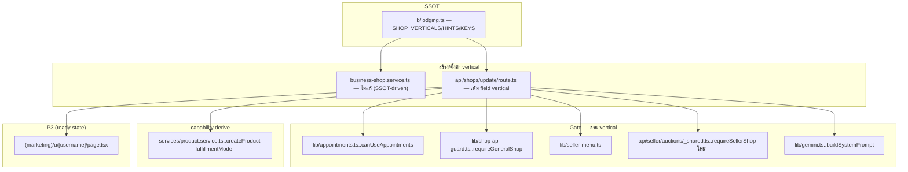
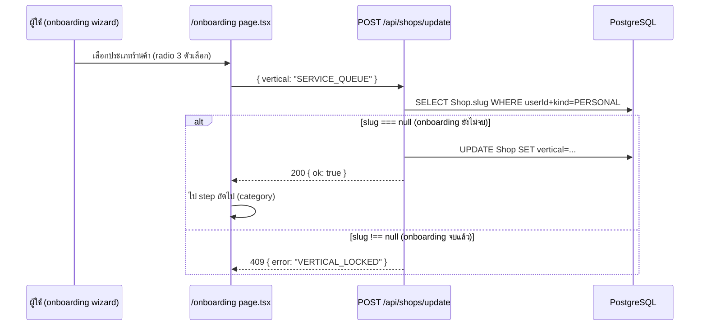
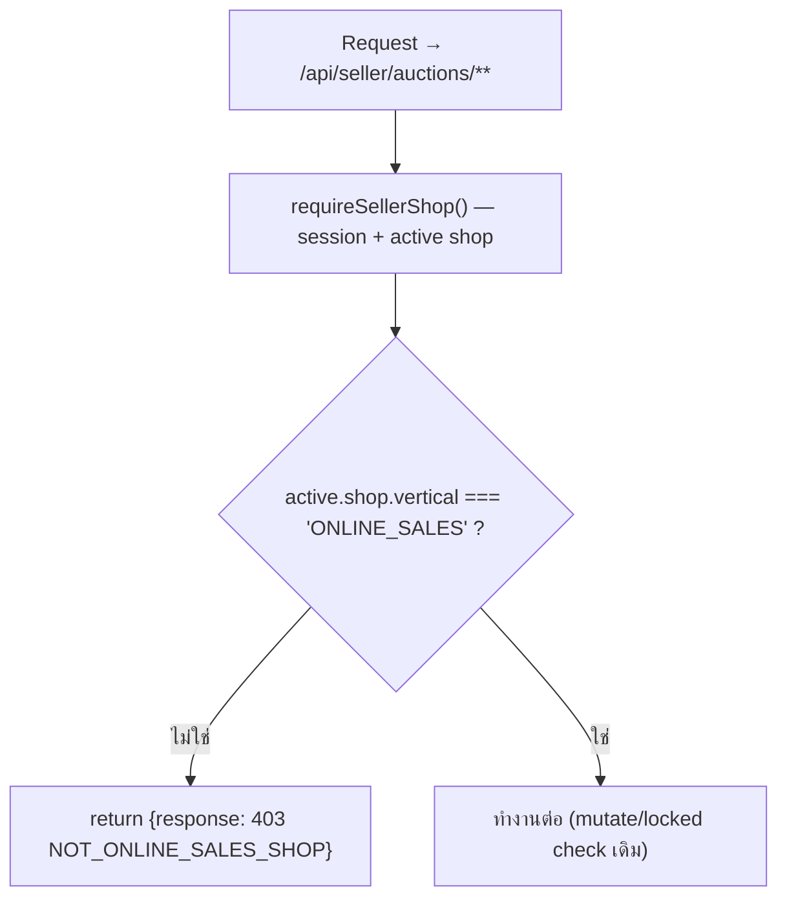
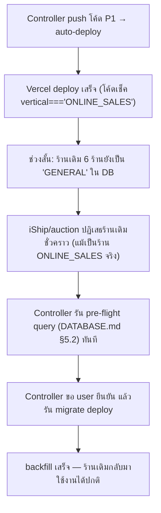
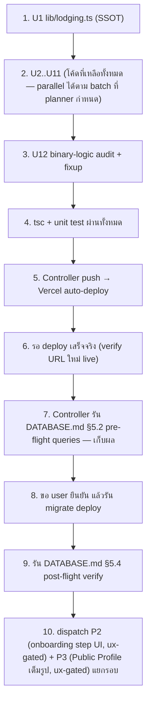

> **โมดูล:** 00028 — Shop Business Type
> **ประเภทเอกสาร:** System Design Spec (SDS)
> **เวอร์ชัน:** 1.0
> **วันที่จัดทำ:** 2026-08-03
> **สถานะ:** Draft

# SDS: ประเภทร้านค้า (Shop Business Type)

---

## 1. บทนำ & References

### 1.1 วัตถุประสงค์
ระบุไฟล์ที่ต้องแก้ทุกไฟล์ (path จริง + บรรทัด), ลำดับ commit ที่แยกได้จริง, และ technical decision ที่ล็อกไว้แล้วเพื่อไม่ให้ dev ต้องเดา

### 1.2 ขอบเขตการออกแบบ
ครอบคลุมโค้ดฝั่งแอปทั้งหมดตาม [[SRS]] §3 — ไม่ครอบ DB schema/migration (อยู่ที่ [[DATABASE]], เขียนแล้ว) และไม่ครอบ UI ของ Public Profile สาขา `SERVICE_QUEUE` เต็มรูป (P3, ต้องผ่าน `safepay-ux` ก่อน)

### 1.3 เอกสารอ้างอิง
[[BRD]] (BR-SBT-01..23) · [[SRS]] (TFR-001..011) · [[API]] · [[DATABASE]] · `docs/conventions/prisma-shared-db-drift.md`

---

## 2. Architecture Overview

### 2.1 มุมมองสถาปัตยกรรม

การออกแบบยึด layering เดิมเป๊ะ — **ไม่มี service ใหม่, ไม่มี route ใหม่** งานนี้คือการแก้ "ตรรกะภายใน" ของไฟล์ที่มีอยู่แล้วให้อ่านค่าที่ 3 ถูกต้อง



### 2.2 มุมมองการ Deploy
ไม่มีการเปลี่ยนโครงสร้าง deploy — **ความเสี่ยงเดียวคือ sequencing กับ migration** (ดู §8 Implementation Order)

---

## 3. Component Design — ตารางไฟล์ที่แก้ครบทุกไฟล์

### 3.1 P1 — enum + gate + backfill-readiness (คุณค่า: ระบบถูกต้องทันที)

| # | Path | เปลี่ยนอะไร | เหตุผล | Atomic unit |
|---|------|-------------|--------|:---:|
| 1 | `src/lib/lodging.ts:11-14,25-28` | `SHOP_VERTICALS`/`SHOP_VERTICAL_HINTS` 2→3 key, label `LODGING`→"บ้านพัก" | SSOT — ต้องเสร็จก่อนทุกไฟล์อื่น | **U1** |
| 2 | `src/lib/appointments.ts:45-49` | `canUseAppointments`: ตัด `kind` เหลือ `vertical==='SERVICE_QUEUE'` | BR-SBT-11 | **U2** |
| 3 | `src/lib/appointment-api.ts:28-35` | ข้อความ `FEATURE_NOT_AVAILABLE` แก้ให้ไม่พูดถึง "บัญชีธุรกิจ" | ARCH-03 (SRS §8) | **U2** (คนละไฟล์ แต่ tsc ผ่านแยกได้ ผูก logic เดียวกัน) |
| 4 | `src/lib/shop-api-guard.ts:59-69,87` | `requireGeneralShop`: `'GENERAL'`→`'ONLINE_SALES'`, comment, ข้อความ `NOT_ELIGIBLE` | BR-SBT-12 | **U3** |
| 5 | `src/lib/seller-menu.ts:333-345,361-374,388-407` | 3-way slug groups, ยุบ `applyAppointmentMenu`, ปรับ `resolveVisibleSellerMenu` | BR-SBT-15/16 | **U4** |
| 6 | `src/lib/gemini.ts:91` | `buildSystemPrompt`: 3-way businessDesc | TFR-010 | **U5** |
| 7 | `src/app/api/seller/auctions/_shared.ts:25-56` | `requireSellerShop`: เพิ่มเช็ค `vertical!=='ONLINE_SALES'`→403 `NOT_ONLINE_SALES_SHOP` | BR-SBT-14 (ปิดช่องโหว่) | **U6** |
| 8 | `src/services/product.service.ts:166-187,196-234` | `CreateProductInput` เพิ่ม `shopVertical?`, `createProduct` priority ใหม่ | BR-SBT-22 | **U7** |
| 9 | `src/app/api/products/route.ts:91` | ส่ง `shopVertical: shop.vertical` เข้า `createProduct` | BR-SBT-22 | **U7** (ผูกกับ #8 — tsc ไม่ผ่านถ้าแยก) |
| 10 | `src/app/api/business/shops/[shopId]/onboarding/route.ts:87` | ส่ง `shopVertical: shop.vertical` เข้า `createProduct` (สินค้าแรก) | BR-SBT-22 — ครบทุก call site | **U7** |
| 11 | `prisma/schema.prisma` | **ไม่ต้องแก้ในรอบนี้** — DB agent (commit `afa267f3`) แก้ครบแล้วทุก comment/default | ยืนยันแล้วจาก Read จริง | — |

### 3.2 P1 — 4 ไฟล์ที่ Controller verify แล้วว่าใช้ `'GENERAL'` (BRD §8.4 ไม่ครอบ)

| # | Path | บรรทัด | เปลี่ยนอะไร | Atomic unit |
|---|------|--------|-------------|:---:|
| 12 | `src/app/(paces)/seller/(dashboard)/business/create/components/CreateBusinessForm.tsx:61` | `defaultValues.vertical: 'GENERAL'` | เปลี่ยนเป็น `'ONLINE_SALES'` (default form ต้อง sync กับ DB default ใหม่) — ปรับ `lg:grid-cols-2` (บรรทัด 143) เป็น layout ที่รองรับ 3 การ์ดพอดี (**cosmetic เท่านั้น ไม่ใช่ safepay-ux gate เพราะ reuse primitive เดิม ไม่สร้าง markup ใหม่**) | **U8** |
| 13 | `src/app/(paces)/seller/(dashboard)/orders/page.tsx:81` | `ishipEnabled = shop.vertical === 'GENERAL'` | `'ONLINE_SALES'` | **U3** (logic เดียวกับ shop-api-guard — bundle รวม) |
| 14 | `src/app/(paces)/seller/(dashboard)/settings/page.tsx:43` | `showShipping = shop?.vertical === 'GENERAL'` | `'ONLINE_SALES'` | **U3** |
| 15 | `src/app/(paces)/seller/(fullscreen)/orders/new/page.tsx:81` | `ishipCreateMode = shop.vertical === 'GENERAL' ? ...` | `'ONLINE_SALES'` | **U3** |

### 3.3 P1 — endpoint ใหม่: เลือก vertical ระหว่าง Personal onboarding

| # | Path | เปลี่ยนอะไร | Atomic unit |
|---|------|-------------|:---:|
| 16 | `src/lib/validations.ts:84-89` (`ShopUpdateWithGeoSchema`) | เพิ่ม `vertical: v.optional(v.picklist(SHOP_VERTICAL_KEYS))` | **U9** |
| 17 | `src/app/api/shops/update/route.ts` | อ่าน `parsed.output.vertical`; ถ้ามีค่า → เช็ค `shop.slug === null` (query เพิ่ม `slug` ใน `select` ที่บรรทัด 24) ก่อน `prisma.shop.update`; ถ้า `slug !== null` → คืน `409 { error: "VERTICAL_LOCKED" }` แทนการ silently ignore | **U9** |
| 18 | `src/app/(paces)/seller/onboarding/page.tsx` | เพิ่ม step ใหม่ (เช่น ก่อน `'category'`) ให้เลือก vertical แบบ radio (reuse `SHOP_VERTICAL_KEYS`/`SHOP_VERTICALS`/`SHOP_VERTICAL_HINTS` เหมือน `CreateBusinessForm.tsx`) เรียก `POST /api/shops/update {vertical}` ก่อนไป step ถัดไป — **ต้องผ่าน `safepay-ux` ก่อนแก้ markup จริง (Hard Rule 8) แม้จะ reuse pattern เดิมของ CreateBusinessForm เพราะเป็นหน้าใหม่ที่ไม่เคยมี step นี้มาก่อน** | **U10 (แยกจาก U9 — UI คนละ concern, ux-gated)** |

### 3.4 P1 — Public Profile ready-state (ไม่ใช่ P3 เต็มรูป)

| # | Path | เปลี่ยนอะไร | Atomic unit |
|---|------|-------------|:---:|
| 19 | `src/app/(marketing)/u/[username]/page.tsx:75-85,236-239` | เพิ่ม `const profileVertical = user.shop?.vertical` และ `const isServiceQueue = profileVertical === 'SERVICE_QUEUE'`; คง `isLodging` เดิมไว้ (backward-compat กับ type ที่มีอยู่) | **U11** |
| 20 | `views/pages/user-profile/v2/ShopProfile.tsx` + `profile.ts` (`ProfileTabData`) | รับ prop `isServiceQueue` เพิ่ม; ที่ block product grid — ถ้า `isServiceQueue` → ซ่อน block แทนโชว์ grid เปล่า (stop-gap ตาม SRS TFR-009) | **U11** — **ต้องผ่าน `safepay-ux` ก่อนแก้ markup แม้เป็นแค่ conditional hide เพราะแตะ view component ที่ user เคย sign-off ไว้แล้ว (2026-05-23)** |

### 3.5 🛑 Binary-logic Audit (TFR-011) — task บังคับก่อนปิดงาน P1

**หัวข้อนี้แยกเพราะเป็น "การตรวจ" ไม่ใช่ "การแก้ไฟล์ที่รู้ล่วงหน้า"** — dev ต้องรัน 3 คำสั่งนี้ก่อน commit สุดท้ายของ P1 แล้วเพิ่มแถวในตารางนี้เองสำหรับทุกจุดที่เจอ (ไม่ใช่แค่รันแล้วดู):

```
rg "'GENERAL'" src/                          # ต้อง 0 ผลลัพธ์หลัง task 1-15 เสร็จ
rg "vertical\s*===?\s*['\"]" src/            # เทียบ diff ก่อน/หลัง — ทุกจุดใหม่ที่ไม่อยู่ใน SDS นี้ = gap
rg "isLodging" src/                          # ทุกจุดนอกเหนือจาก u/[username]/page.tsx + ShopProfile = gap
```

**ที่รู้อยู่แล้วว่าต้องเจอ:** `e2e/iship-shipping.spec.ts`, `e2e/service-appointment.spec.ts`, `scripts/tc-a05-concurrent-capacity.ts` (มี `'GENERAL'` ตาม grep ของ Controller) — เป็น test fixture/script ไม่ใช่ production path แต่ **ยัง reference ค่าที่ไม่มีอยู่จริงแล้วหลัง migration** ต้องอัปเดตด้วยเพื่อไม่ให้ e2e/script พังเงียบ ๆ ตอนรันครั้งถัดไป (**Atomic unit U12** — แยกจาก U1-U11 เพราะไม่แตะ production code, ไม่ block P1 launch แต่ต้องทำก่อน merge เพื่อไม่ทิ้งหนี้)

---

## 4. Data Flow

### 4.1 Flow: Personal onboarding เลือก vertical



### 4.2 Flow: guard ประมูล (ปิดช่องโหว่)



### 4.3 Flow กรณีล้มเหลว: sequencing กับ migration (ARCH-01)



---

## 5. Integration Points

| จุดเชื่อม | รายละเอียด | ความเสี่ยง |
|-----------|-----------|-----------|
| `Shop.slug` (feature 00017/2026-06-17 onboarding) | ใช้เป็นสัญญาณ "vertical ยังแก้ได้ไหม" (TFR-006) แทนคอลัมน์ใหม่ | ถ้า flow อื่นในอนาคตเปลี่ยนความหมายของ `slug===null` (เช่น อนุญาตให้ลบ slug ทีหลัง) จะกระทบ invariant นี้ทันที — ต้อง comment กำกับไว้ที่ทั้ง 2 จุด |
| `canUseAppointments` (feature 00024) | 7 call site พึ่ง SSOT เดียว | ถ้ามี call site ใหม่ในอนาคตที่เขียน `kind==='BUSINESS'` เองแยกจากฟังก์ชันนี้ = กลับไปมี gap เดิม |
| `requireSellerShop` (feature 00002 auction) | choke point เดียวของ 6 ไฟล์ route | ถ้ามี route ใหม่ในอนาคตไม่เรียกผ่าน `_shared.ts` = หลุด guard ใหม่ |
| `deriveCapabilityDefaults` (feature 00003 P1) | ยังเป็นแหล่ง default หลักตาม `type`; `shopVertical` เป็นแค่ override ชั้นบน | ถ้ามี call site ที่ 3 ของ `createProduct` เกิดขึ้นในอนาคต (เช่น bulk import) ต้องส่ง `shopVertical` ด้วยเช่นกัน มิฉะนั้นสินค้าที่สร้างผ่านทางนั้นได้ default ผิด |
| `.impeccable/design.json` / DESIGN.md | error copy ใหม่ (`NOT_ONLINE_SALES_SHOP`, `VERTICAL_LOCKED`, แก้ `NOT_ELIGIBLE`/`FEATURE_NOT_AVAILABLE`) ต้องผ่านหลัก "บอกเหตุผล ไม่เย็นชา" | เป็น copy งานเล็ก ไม่ต้อง full ux gate แต่ dev ต้องเช็คโทนเองก่อน commit |

**สัญญา API เต็ม:** ดู [[API]]

---

## 6. Technical Decisions

### TD-001: คง `requireGeneralShop` ชื่อเดิม ไม่ rename
- **ตัดสินใจ:** เปลี่ยนแค่ค่าที่เทียบภายใน ไม่เปลี่ยนชื่อฟังก์ชัน
- **เหตุผล:** มี 20 ไฟล์ import ชื่อนี้อยู่ — rename เป็น churn ล้วนไม่มีผล runtime เพิ่ม ขัด "ห้าม over-engineer" ของโครงการ
- **ทางเลือกที่ตัดทิ้ง:** rename เป็น `requireOnlineSalesShop` — ตัดเพราะ risk/reward ไม่คุ้ม (20 ไฟล์ diff เพื่อความสวยงามอย่างเดียว)
- **ผลกระทบ:** ต้องเพิ่ม comment กำกับใน `shop-api-guard.ts` ว่าชื่อฟังก์ชันเป็น legacy naming เพื่อกันคนอ่านสับสนในอนาคต

### TD-002: ใช้ `Shop.slug===null` แทนการเพิ่มคอลัมน์ "vertical chosen" ใหม่
- **ตัดสินใจ:** invariant การ mutability ของ vertical ระหว่าง onboarding ผูกกับสัญญาณที่มีอยู่แล้ว
- **เหตุผล:** [[DATABASE]] ไม่ได้เพิ่มคอลัมน์ใหม่เลย (§1 "ไม่สร้างตารางใหม่และไม่เพิ่มคอลัมน์ใหม่") — การเพิ่มคอลัมน์ตอนนี้ต้องกลับไปหา SA เขียน migration ใหม่ ทั้งที่ `slug` ให้สัญญาณเดียวกันแบบไม่มีต้นทุนเพิ่ม (`resolveOnboardingGate` ใช้อยู่แล้ว)
- **ทางเลือกที่ตัดทิ้ง:** เพิ่ม `Shop.verticalLockedAt` — ตัดเพราะต้องผ่าน SA + migration ใหม่ทั้งที่ไม่จำเป็น
- **ผลกระทบ:** ถ้าในอนาคตมี flow ที่ทำให้ `slug` ว่างได้อีกหลัง onboarding จบ (ปัจจุบันไม่มี) ต้องมา revisit decision นี้

### TD-003: guard ประมูลอยู่ที่ route layer (`_shared.ts`) เท่านั้น ไม่ซ้ำใน service layer
- **ตัดสินใจ:** ไม่เพิ่มเช็ค vertical ใน `auction.service.ts`
- **เหตุผล:** สืบ precedent จาก feature 00017 — `room.service.ts` (`createRoom` ฯลฯ) **ไม่มี** vertical check ของตัวเอง เพราะ `requireLodgingShop()` เป็น single-gate ที่ route layer อยู่แล้ว (verified: grep `"vertical"` ใน `room.service.ts` = 0 ผลลัพธ์) — auction ตามรูปแบบเดียวกันเพื่อความสม่ำเสมอของโครงการ
- **ทางเลือกที่ตัดทิ้ง:** defense-in-depth 2 ชั้น (route+service) ตามที่ BRD BR-SBT-14 เขียนว่า "และ/หรือ" — ตัดเพราะ auction.service.ts ถูกใช้จาก 2 เส้นทาง (`/api/seller/auctions/**` ที่มี guard, และ `/api/app/auctions/**` ฝั่ง buyer ที่ไม่ควรมี seller-vertical check เลย) เพิ่มเช็คในนั้นจะผิดที่ผิดทาง
- **ผลกระทบ:** ถ้ามี seller route ใหม่ในอนาคตที่เรียก `createAuction`/`updateAuction` ตรงโดยไม่ผ่าน `_shared.ts` จะหลุด guard — ต้อง code-review เตือนจุดนี้

### TD-004: `fulfillmentMode` override ผ่าน parameter ใหม่ ไม่ใช่ query ภายใน service
- **ตัดสินใจ:** เพิ่ม `shopVertical?: string` เข้า `CreateProductInput` ให้ caller (route) ส่งมา แทนที่จะให้ `createProduct` query `Shop` เอง
- **เหตุผล:** caller ทั้ง 2 จุด (`/api/products/route.ts`, business onboarding route) มี `shop` object พร้อม `.vertical` อยู่แล้วในมือจาก guard ที่รันไปแล้ว — เพิ่ม query ซ้ำใน service เป็น N+1 ที่ไม่จำเป็น
- **ทางเลือกที่ตัดทิ้ง:** query `Shop.vertical` ภายใน `createProduct` เอง — ตัดเพราะ query ซ้ำและทำให้ service รับผิดชอบเกินหน้าที่ (service ควร trust ค่าที่ route ส่งมาหลัง guard แล้ว เหมือน pattern `shopId` เดิม)
- **ผลกระทบ:** ถ้า caller ลืมส่ง `shopVertical` → fallback เป็น type-derived เดิม (ไม่ throw, ไม่ error) — เป็นพฤติกรรม fail-safe (แค่ไม่ได้ override พิเศษ ไม่ใช่ error ใหม่)

### TD-005: ไม่เพิ่ม vertical guard ให้ Inventory Add-on ใน P1 (รอ Controller ตัดสินใจ)
- **ตัดสินใจ:** ปล่อย `/api/inventory/**` ไว้ตามเดิมใน P1 นี้ ระบุเป็น known-gap แทนการ implement เอง
- **เหตุผล:** อยู่นอก scope ที่ Controller ระบุมา (ไม่อยู่ในลิสต์ "จุดที่ต้องแก้") แม้ BRD จะกล่าวถึง — implement เองโดยไม่ถามขัดกับหลัก "ยึด scope ที่ตกลง" และเพิ่มพื้นที่เสี่ยง regression โดยไม่มีใครขอ
- **ทางเลือกที่ตัดทิ้ง:** implement ไปเลยเพราะ BRD เขียนไว้ — ตัดเพราะเป็นการขยาย scope เอง (Controller ควรเป็นคน dispatch หลังเห็น gap นี้ใน SRS §8 ARCH-05)
- **ผลกระทบ:** ถ้า Controller ตัดสินใจรวม P1 — ทำเป็น task เพิ่มแยก (7 ไฟล์ pattern เดียวกันหมด: เพิ่ม `if (shop.vertical !== 'ONLINE_SALES') return 403` หลัง `getShopByUserId`)

---

## 7. Traceability

| SRS TFR | SDS Element | สถานะ |
|---------|-------------|-------|
| TFR-001 | §3.1 task #1 (U1) | Draft |
| TFR-002 | §3.1 task #2,#3 (U2) | Draft |
| TFR-003 | §3.1 task #4 (U3), §3.2 task #13-15 (U3) | Draft |
| TFR-004 | §3.1 task #5 (U4) | Draft |
| TFR-005 | §3.1 task #12 (U8) — no-op logic, form default sync เท่านั้น | Draft |
| TFR-006 | §3.3 task #16-18 (U9, U10), TD-002 | Draft |
| TFR-007 | §3.1 task #7 (U6), §4.2, TD-003 | Draft |
| TFR-008 | §3.1 task #8-10 (U7), TD-004 | Draft |
| TFR-009 | §3.4 task #19-20 (U11) | Draft — P1 ready-state, P3 UI แยก |
| TFR-010 | §3.1 task #6 (U5) | Draft |
| TFR-011 | §3.5 (U12) | Draft — บังคับก่อนปิด P1 |
| ARCH-01 | §4.3, §8 Implementation Order | Draft |
| ARCH-05 | TD-005 | Open — รอ Controller |

---

## 8. Implementation Order (sequencing กับ migration — บังคับอ่าน)

**หลักการ: โค้ดต้องขึ้นก่อนหรือพร้อมกับ migration เสมอ ไม่ใช่หลัง** (สืบทอดจาก [[DATABASE]] §5.6 ตรงตัว)



**เหตุผลที่ step 5→8 ต้องเป็นลำดับนี้ไม่ใช่สลับ:** ระหว่าง step 5-8 ร้านเดิม 6 ร้าน (ยังเป็น `GENERAL` ใน DB) จะถูก `requireGeneralShop`/`requireSellerShop` ปฏิเสธชั่วคราว (ARCH-01) — Controller ต้องรัน migration **ทันทีหลัง verify ว่า deploy ขึ้นจริงแล้ว** ไม่ปล่อยลอยข้ามวัน เพื่อจำกัดหน้าต่างความเสี่ยงให้สั้นที่สุดเท่าที่ Hard Rule 14 (ขอ user ยืนยันก่อนรันเสมอ) จะอนุญาต

---

## 9. สรุป

การออกแบบนี้แก้ **11 ไฟล์ production code (P1)** + 1 endpoint ใหม่ (extend, ไม่ใช่ route ใหม่) + audit บังคับ 1 รอบ — **ไม่มี service ใหม่ ไม่มี route ใหม่ ไม่มี dependency ใหม่** เพราะ `Shop.vertical` เป็น field ที่มีโครงสร้าง gate/menu/label อยู่แล้วครบจาก feature 00017/00024/00022 งานนี้แค่ขยายจาก 2 ทางเป็น 3 ทาง

การตัดสินใจที่มีผลยาวที่สุดคือ **TD-002 (ใช้ `slug===null` แทนคอลัมน์ใหม่)** เพราะผูก UX ของ onboarding เข้ากับ invariant ของ DB โดยไม่ต้องแตะ schema เพิ่ม — ถ้า onboarding flow เปลี่ยนโครงในอนาคต ต้อง revisit จุดนี้ก่อนอย่างอื่น

จุดที่พลาดง่ายที่สุดคือ **TFR-011/§3.5 (binary-logic audit)** เพราะเป็นงานเดียวที่ "ไม่มี checklist ตายตัว" — ต้อง grep จริงแล้วอ่านทุกผลลัพธ์ ไม่ใช่เชื่อว่ารายการ 15 ไฟล์ที่ระบุไว้ครบแล้ว (บทเรียนตรงจาก `seller-menu.ts` ที่ grep string literal ธรรมดาไม่เจอ)
