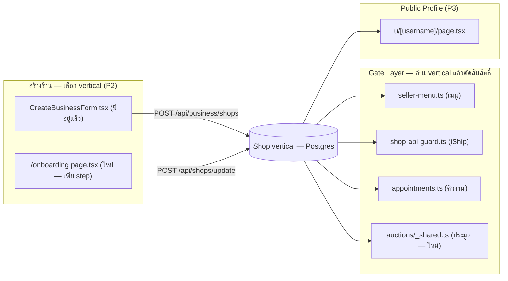

> **โมดูล:** 00028 — Shop Business Type
> **ประเภทเอกสาร:** Software Requirements Specification (SRS) - TECHNICAL
> **เวอร์ชัน:** 1.0
> **วันที่จัดทำ:** 2026-08-03
> **สถานะ:** Draft — DB layer เขียนไฟล์ migration เสร็จแล้ว (ยังไม่ apply) ตาม [[DATABASE]]; เอกสารนี้ครอบเฉพาะโค้ดฝั่งแอป
> **เจ้าของเอกสาร:** SA (ดู Feature-Docs-Ownership)

# SRS: ประเภทร้านค้า (Shop Business Type) — Technical

---

## 1. บทนำ (Introduction)

### 1.1 วัตถุประสงค์ของเอกสาร

แปลงความต้องการทางธุรกิจใน [[PRD]]/[[BRD]] (FR-SBT-01..12, BR-SBT-01..23) ให้เป็นข้อกำหนดเชิงเทคนิคที่ dev นำไป implement ได้โดยไม่ต้องตีความเอง โฟกัสเฉพาะ **โค้ดฝั่งแอป** — DB layer (`Shop.vertical` 2→3 ค่า, backfill, CHECK constraint) เขียนไว้แล้วใน [[DATABASE]] (migration `20260803120000_shop_business_type`, ยังไม่ apply)

งานนี้เป็น "ขยาย enum ของ field เดิม" ไม่ใช่ "เพิ่ม field ใหม่" — ความยากอยู่ที่การไล่ทุกจุดในโค้ดที่เคย hardcode ตรรกะ 2 ทาง (`'GENERAL' | 'LODGING'` หรือ `kind==='BUSINESS' && vertical==='GENERAL'`) ให้กลายเป็น 3 ทางถูกต้องครบ ไม่ใช่การออกแบบระบบใหม่

### 1.2 ขอบเขตเชิงระบบ (System Scope)

**อยู่ในขอบเขต:**
- ค่าคงที่ + label ของ vertical (`src/lib/lodging.ts`)
- ตัวกั้นระบบคิวงาน (`src/lib/appointments.ts::canUseAppointments`) — ตัด `kind` ออก
- API guard ของ iShip (`src/lib/shop-api-guard.ts::requireGeneralShop`) — เปลี่ยนค่าที่เทียบ
- เมนู seller (`src/lib/seller-menu.ts`) — ขยาย 2 branch → 3 branch
- จุดที่ตั้งค่า vertical ตอนสร้างร้าน: Business creation (มีอยู่แล้ว) + **Personal onboarding (ใหม่ — ไม่เคยมีมาก่อน)**
- guard ใหม่ของระบบประมูล (ไม่เคยมี vertical guard มาก่อนเลย)
- ค่าเริ่มต้น `fulfillmentMode` ของสินค้าที่สร้างในร้าน `SERVICE_QUEUE`
- Public Profile สาขาที่ 3 (`SERVICE_QUEUE`) — ขอบเขต **โครงข้อมูล/gate เท่านั้น**; รายละเอียด UI ต้องผ่าน `safepay-ux` gate ก่อนแตะโค้ดจริง (BR-SBT §2.4 FR-SBT-09 ระบุไว้ชัดว่าเป็นงานแยก)
- binary-logic audit ทั้ง repo (`vertical`/`isLodging`)

**นอกขอบเขต (ตาม [[PRD]] §5 / §9):**
- DB migration เอง (อยู่ใน [[DATABASE]] — SA เขียนไว้แล้ว)
- flow เปลี่ยนประเภทร้านภายหลัง (immutable ตาม BR-SBT-08)
- hybrid เต็มรูป (ขาย+จัดส่ง และรับนัดพร้อมกัน)
- มัดจำแบบเต็มรูปสำหรับ `SERVICE_QUEUE` (มีแค่แสดงยอด — ของเดิมจาก feature 00024)
- Inventory Add-on vertical guard (`src/app/api/inventory/**`) — **ดู §8 ความเสี่ยง ARCH-05: พบเป็น gap ระหว่างสำรวจ ไม่ได้อยู่ใน scope เดิมที่ Controller กำหนด แต่ BRD §8.1/FR-SBT-04 เขียนไว้ชัด ต้องให้ Controller ตัดสินใจว่าจะรวมใน P1 หรือ fast-follow**

### 1.3 เอกสารอ้างอิง (References)

| เอกสาร | ใช้อ้างอิงเรื่อง |
|--------|------------------|
| [[PRD]] | เป้าหมาย, persona, phase P1/P2/P3, KPI |
| [[BRD]] | FR-SBT-01..12, BR-SBT-01..23, matrix §8.1 |
| [[DATABASE]] | migration SQL, CHECK constraint, sequencing risk §5.6 |
| [[SDS]] | ตารางไฟล์ที่แก้ + technical decisions |
| [[API]] | สัญญา endpoint ที่เพิ่ม/แก้ |
| feature 00017 (Lodging) | เจ้าของเดิมของ `Shop.vertical`, `requireLodgingShop`, `SHOP_VERTICALS` |
| feature 00024 (Service Appointment) | เจ้าของ `canUseAppointments`, เมนูคิวงาน, `assertShopCanUseAppointments` |
| feature 00022 (iShip) | เจ้าของ `requireGeneralShop` |
| feature 00002 (Seller Auction) | เจ้าของ `auction.service.ts`, `requireSellerShop` ที่ `_shared.ts` |
| feature 00008 (Business Account) | เจ้าของ `createBusinessShop`, `Shop.kind` |
| `docs/conventions/prisma-shared-db-drift.md` | ข้อห้าม `migrate dev`/`db pull` |

### 1.4 นิยามและตัวย่อ

| คำ | ความหมายเชิงเทคนิค |
|----|---------------------|
| **vertical** | `Shop.vertical` — เดิม `'GENERAL' \| 'LODGING'` ใหม่ `'ONLINE_SALES' \| 'SERVICE_QUEUE' \| 'LODGING'` (String, ไม่ใช่ Prisma enum) |
| **binary-logic** | เงื่อนไขในโค้ดที่เขียนเป็น ternary/if 2 ทาง (`x === 'LODGING' ? A : B`) ซึ่งค่าที่ 3 จะตกเข้า branch ผิดโดยไม่มี compile error |
| **SSOT ของ vertical** | `src/lib/lodging.ts` (`SHOP_VERTICALS`, `SHOP_VERTICAL_KEYS`, `SHOP_VERTICAL_HINTS`) |
| **onboarding window** | ช่วงเวลาที่ `resolveOnboardingGate().needsOnboarding === true` (ยังไม่มี `Shop.slug`) — ใช้เป็นเงื่อนไข "ยังเลือก vertical ได้" ของ Personal shop (ดู TFR-003) |

---

## 2. ภาพรวมสถาปัตยกรรม (Architecture Overview)

### 2.1 บริบทระบบ (System Context)

### 2.2 องค์ประกอบหลัก (Components)

| Component | หน้าที่ | สถานะ |
|-----------|--------|-------|
| `src/lib/lodging.ts` | SSOT ของ label/hint (`SHOP_VERTICALS` ฯลฯ) | **แก้ (TFR-001)** |
| `src/lib/appointments.ts::canUseAppointments` | ตัวกั้นระบบคิวงาน | **แก้ (TFR-002)** |
| `src/lib/appointment-api.ts::appointmentErrorResponse` | ข้อความ error ของ FEATURE_NOT_AVAILABLE | **แก้ (TFR-002)** |
| `src/lib/shop-api-guard.ts::requireGeneralShop` | API guard iShip | **แก้ (TFR-003)** |
| `src/lib/seller-menu.ts` | เมนู seller ทั้งหมด | **แก้ (TFR-004)** |
| `src/services/business-shop.service.ts::createBusinessShop` | ตั้ง vertical ตอนสร้าง Business | **ไม่ต้องแก้** (SSOT-driven, ดู §3 TFR-005) |
| `src/app/api/shops/update/route.ts` | ตั้ง vertical ตอน Personal onboarding | **แก้ (TFR-005 — ใหม่)** |
| `src/app/api/seller/auctions/_shared.ts::requireSellerShop` | guard ประมูล | **แก้ (TFR-006 — ใหม่)** |
| `src/services/product.service.ts::createProduct` | default `fulfillmentMode` | **แก้ (TFR-007)** |
| `src/app/(marketing)/u/[username]/page.tsx` + `views/pages/user-profile/**` | Public Profile สาขาที่ 3 | **แก้ (TFR-008, P3)** |
| `src/lib/gemini.ts::buildSystemPrompt` | prompt context ตาม vertical | **แก้ (TFR-009)** |

### 2.3 มุมมองการ Deploy

ไม่มีบริการ/cron/env ใหม่ — ทุกอย่างอยู่ใน Next.js app เดิม การเปลี่ยนแปลงเชิง deploy เดียวที่ต้องระวังคือ **ลำดับ code-deploy vs migration-apply** (ดู §8 ARCH-01 — สืบทอดความเสี่ยงจาก DATABASE.md §5.6)

---

## 3. ข้อกำหนดเชิงฟังก์ชันเชิงเทคนิค (TFR)

### TFR-001: SSOT label/hint ขยายเป็น 3 ค่า
- **Trace to:** BR-SBT-18, FR-SBT-12
- **คำอธิบาย:** `src/lib/lodging.ts:11-14` (`SHOP_VERTICALS`) เพิ่ม key `ONLINE_SALES`/`SERVICE_QUEUE`, เปลี่ยน label `LODGING` จาก `'บ้านพักตากอากาศ'` → `'บ้านพัก'`. `:25-28` (`SHOP_VERTICAL_HINTS`) เพิ่ม hint 2 ค่าใหม่ โดยเน้นคำว่า "ไม่มีการจัดส่งสินค้า" สำหรับ `SERVICE_QUEUE` ตาม BR-SBT-05 (ความสับสนที่ user เตือนไว้ใน PRD §6.1)
- **Precondition:** ไม่มี
- **Postcondition:** `SHOP_VERTICAL_KEYS` มี 3 entries; ทุกจุดที่ import ค่านี้ (CreateBusinessForm.tsx, CreateBusinessShopSchema) ได้ 3 ตัวเลือกอัตโนมัติโดยไม่ต้องแก้ไฟล์เพิ่ม (verified — ดู §7 SDS)
- **Error/Edge:** ไม่มี key ซ้ำ; `isShopVertical()` ต้อง type-guard ผ่านทั้ง 3 ค่า

### TFR-002: ตัวกั้นระบบคิวงาน — ตัด `kind` ออก
- **Trace to:** BR-SBT-11, FR-SBT-07
- **คำอธิบาย:** `src/lib/appointments.ts:45-49` (`canUseAppointments`) เปลี่ยนจาก `shop?.kind === "BUSINESS" && shop?.vertical === "GENERAL"` เหลือ `shop?.vertical === "SERVICE_QUEUE"` เดียว **คง signature parameter `{kind, vertical}` เดิมไว้** (ไม่ตัด `kind` ออกจาก type) เพื่อไม่ต้องแก้ 7 call site ที่ยังส่ง object ทั้งสอง field
- **ผลกระทบต่อ error message:** `src/lib/appointment-api.ts:32` ข้อความ `"ระบบนัดหมายใช้ได้เฉพาะบัญชีธุรกิจประเภทสินค้าและบริการ"` เป็นเท็จหลังงานนี้ (บัญชีบุคคลใช้ได้แล้ว) **ต้องแก้ข้อความด้วย** — ไม่ใช่แค่ logic
- **Precondition:** ไม่มี
- **Postcondition:** ร้าน `kind=PERSONAL, vertical=SERVICE_QUEUE` ผ่าน gate ได้ (เดิมไม่ผ่าน); ร้าน `kind=BUSINESS, vertical=ONLINE_SALES` (เดิมชื่อ `GENERAL`) ไม่ผ่าน (เหมือนเดิม — ไม่ regression)
- **Error/Edge:** 7 caller ที่ import ฟังก์ชันนี้ (page-level ×3 คือ `queues/page.tsx`, `queues/new/page.tsx`, `queues/[resourceId]/page.tsx`, service-level ×1 คือ `appointment.service.ts::assertShopCanUseAppointments`, menu-level ×1 คือ `seller-menu.ts::applyAppointmentMenu`, POS ×1 คือ `orders/new/page.tsx`) ได้ผลถูกต้องอัตโนมัติโดยไม่ต้องแก้ไฟล์เพิ่ม — **verify ด้วย grep ว่าไม่มี caller ไหนเช็ค `kind` ซ้ำเองนอกเหนือจากที่ผ่าน `canUseAppointments`**

### TFR-003: guard iShip — เปลี่ยนค่าที่เทียบ
- **Trace to:** BR-SBT-12, FR-SBT-04
- **คำอธิบาย:** `src/lib/shop-api-guard.ts:87` (`requireGeneralShop`) เปลี่ยน `active.shop.vertical !== "GENERAL"` → `!== "ONLINE_SALES"`. **คงชื่อฟังก์ชัน `requireGeneralShop` ไว้** (ดู SDS TD สำหรับเหตุผล — เปลี่ยนชื่อจะกระทบ 20 ไฟล์โดยไม่มีประโยชน์เชิง runtime) แต่ต้องแก้ comment `:59-69` ให้ตรงคำศัพท์ใหม่ (`GENERAL`→`ONLINE_SALES`) กันคนอ่านสับสน
- **Precondition:** ร้านต้องผ่าน `requireShopMember`-equivalent (มี session + เป็นสมาชิก) มาก่อนแล้ว
- **Postcondition:** ร้าน `ONLINE_SALES` (เดิม `GENERAL`) ผ่าน guard เหมือนเดิมทุกประการ; ร้าน `SERVICE_QUEUE`/`LODGING` ถูกปฏิเสธ 403 เหมือนที่ `LODGING` เคยถูกปฏิเสธ
- **Error/Edge:** response shape เดิมคือ `{error:{code:"NOT_ELIGIBLE", message:"ร้านประเภทบ้านพักไม่รองรับการเชื่อมต่อระบบขนส่ง"}}` — ข้อความนี้พูดถึงเฉพาะ "บ้านพัก" ทั้งที่ตอนนี้มี 2 ประเภทที่ไม่รองรับ (`SERVICE_QUEUE` ด้วย) **ต้องแก้ข้อความ** เป็นภาษากลางที่ครอบทั้งคู่ (ดู [[API]] §4)

### TFR-004: เมนู seller — ขยาย 2 branch → 3 branch
- **Trace to:** BR-SBT-15/16, FR-SBT-03
- **คำอธิบาย:** `src/lib/seller-menu.ts:333-334` (`LODGING_ONLY_SLUGS`/`GENERAL_ONLY_SLUGS`) ต้องแยกเป็น 3 กลุ่ม slug ตาม matrix BRD §8.1:
  - `LODGING_ONLY_SLUGS` (ไม่เปลี่ยน): `['seller:rooms','seller:calendar','seller:bookings','seller:housekeepers']`
  - `ONLINE_SALES_ONLY_SLUGS` (เดิมชื่อ `GENERAL_ONLY_SLUGS`): `['seller:inventory','seller:auctions']` — **ย้าย `seller:products` ออก** เพราะ `SERVICE_QUEUE` เห็นเมนูสินค้าได้ด้วย (BR-SBT §8.1 แถว "สินค้า (เมนู)" = ✅ ทั้ง ONLINE_SALES และ SERVICE_QUEUE)
  - `SERVICE_QUEUE_ONLY_SLUGS` (ใหม่): `['seller:queues']` — ย้ายมาจาก `APPOINTMENT_ONLY_SLUGS` เดิมที่ `:361`
  - logic ใหม่: `hidden = vertical==='LODGING' ? [...ONLINE_SALES_ONLY, ...SERVICE_QUEUE_ONLY] : vertical==='SERVICE_QUEUE' ? [...LODGING_ONLY, ...ONLINE_SALES_ONLY] : [...LODGING_ONLY, ...SERVICE_QUEUE_ONLY]` (3-way switch แทน ternary เดิม)
- **ยุบ `applyAppointmentMenu` เข้า `applyVerticalMenu`:** `:363-374` (ทั้งฟังก์ชัน) ลบทิ้ง เพราะเดิมมีอยู่เพราะต้องเช็ค 2 เงื่อนไข (`kind`+`vertical`) พร้อมกัน — ตอนนี้เหลือเช็ค `vertical` เดียวจึงรวมเข้า `applyVerticalMenu` ได้ (BR-SBT-15 สั่งไว้ตรงตัว)
- **`resolveVisibleSellerMenu`:** `:388-407` ต้องปรับ compose chain — ตัด `applyAppointmentMenu(...)` wrapping ออก, เหลือ `applyVerticalMenu(...)` ชั้นนอกสุดเหมือนเดิม (ลำดับ compose คงเดิม แค่ลด 1 ชั้น)
- **Precondition:** TFR-001 เสร็จก่อน (ใช้ `ShopVertical` type)
- **Postcondition:** เมนูตรงกับ BR-SBT §8.1 matrix เป๊ะทั้ง 3 ประเภท; `shortcut.service.ts:115` (caller อีกจุดของ `resolveVisibleSellerMenu`) ได้ผลถูกต้องอัตโนมัติ
- **Error/Edge:** ถ้าลืมย้าย `seller:products` ออกจาก `ONLINE_SALES_ONLY_SLUGS` → ร้าน `SERVICE_QUEUE` จะไม่เห็นเมนูสินค้าเลย ขัด FR-SBT-08 AC ข้อ 1 โดยตรง — **จุดเสี่ยงสูงสุดของ TFR นี้**

### TFR-005: ตั้ง vertical ตอนสร้างร้าน (Business — ของเดิม, ไม่ต้องแก้โค้ด | Personal — ใหม่)
- **Trace to:** BR-SBT-06/07/17, FR-SBT-01
- **Business creation:** `createBusinessShop` (`src/services/business-shop.service.ts:8-35`) รับ `vertical?: string` อยู่แล้ว, `CreateBusinessShopSchema` (`src/lib/validations.ts:715-723`) ใช้ `v.picklist(SHOP_VERTICAL_KEYS)` อยู่แล้ว, `CreateBusinessForm.tsx:144` วน `SHOP_VERTICAL_KEYS.map(...)` render radio อยู่แล้ว — **ทั้ง 3 จุดเป็น SSOT-driven ครบ ไม่ต้องแก้โค้ด logic แม้แต่บรรทัดเดียว** เมื่อ TFR-001 เสร็จ (แก้ layout `lg:grid-cols-2` → รองรับ 3 การ์ดสวยงามเป็นงาน UX เท่านั้น ไม่ใช่ TFR)
- **Personal onboarding (ใหม่):** ปัจจุบัน Personal shop ถูกสร้างล่วงหน้าโดยไม่มีให้เลือก vertical จาก 3 จุด — (a) `lib/auth.ts:222-229` (seller-credentials signup, `shop.create` ไม่ส่ง `vertical` → ได้ DB default `ONLINE_SALES`), (b) `lib/shop-context.ts:118-131` (`ensurePersonalShop`, เรียกจาก `/api/shops/open-personal` — ผู้ถูกเชิญกด "สร้างร้านส่วนตัว"), (c) `/api/account/shop-info/route.ts:43-45` (FB signup fallback). ทั้ง 3 จุดไม่ต้องแก้ — ปล่อยให้ default `ONLINE_SALES` ไปก่อน แล้วให้ **onboarding wizard** เป็นจุดเดียวที่ผู้ใช้ "ยืนยัน/เปลี่ยน" vertical ก่อน onboarding จะจบ (ดู TFR ถัดไป)
- **Postcondition:** Business creation ทำงานถูกต้องทันทีที่ TFR-001 เสร็จ (regression-free); Personal onboarding มีช่องทางเลือก vertical เป็นครั้งแรก

### TFR-006 (ใหม่): endpoint เลือก/ล็อก vertical ของ Personal shop ระหว่าง onboarding
- **Trace to:** BR-SBT-06/07/08, FR-SBT-01
- **คำอธิบาย:** ขยาย `src/app/api/shops/update/route.ts` (ปัจจุบันรับ `category`/`address`/`latitude`/`longitude` ผ่าน `ShopUpdateWithGeoSchema`) ให้รับ `vertical?: ShopVertical` เพิ่ม
- **กติกา immutability แบบไม่ต้องเพิ่มคอลัมน์ใหม่:** ใช้สัญญาณที่มีอยู่แล้ว — `Shop.slug === null` แปลว่า onboarding ยังไม่จบ (`resolveOnboardingGate().needsOnboarding` อ่านค่าเดียวกันนี้อยู่แล้ว, `src/lib/onboarding-gate.ts:48`) **เท่ากับ "vertical ยังเปลี่ยนได้"**; เมื่อ `slug !== null` (onboarding จบแล้ว) → ปฏิเสธการเปลี่ยน vertical ด้วย `409 VERTICAL_LOCKED`
  - เหตุผลที่ไม่เพิ่มคอลัมน์ "chosen flag" ใหม่: หลัง migration DB default กลายเป็น `ONLINE_SALES` แล้ว แยกไม่ออกว่า "ยังไม่เลือก" กับ "เลือก ONLINE_SALES เอง" จากค่าคอลัมน์เดียว — แต่ `slug` เป็นสัญญาณที่แยกออกอยู่แล้วโดยไม่ต้องเพิ่มอะไร (ไม่ over-engineer)
- **Precondition:** ต้องมี session; ต้องมี Personal shop อยู่แล้ว (ถ้ายังไม่มี — 404 เหมือน route เดิม)
- **Postcondition:** ระหว่าง onboarding ผู้ใช้เปลี่ยนใจเลือก vertical ใหม่ได้กี่ครั้งก็ได้ (UX ที่ดีกว่า "เลือกพลาดแล้วต้องสร้างร้านใหม่"); หลัง set slug แล้ว endpoint นี้ปฏิเสธเสมอ
- **Error/Edge:** ต้อง valibot `v.picklist(SHOP_VERTICAL_KEYS)` เดียวกับฝั่ง Business — ห้ามรับ string อิสระ

### TFR-007 (ใหม่): guard ประมูล — ปิดช่องโหว่ที่ไม่เคยมี
- **Trace to:** BR-SBT-14, FR-SBT-05
- **คำอธิบาย:** `src/app/api/seller/auctions/_shared.ts::requireSellerShop` (`:25-56`) เป็น choke point เดียวของทั้ง 6 ไฟล์ route ใต้ `/api/seller/auctions/**` (ยืนยันแล้วด้วย grep — ทุกไฟล์ import จาก `_shared.ts` เดียวกัน) เพิ่มเช็ค **หลัง** `requireActiveShop` สำเร็จ, **ก่อน** `mutate`+`locked` check เดิม: `if (active.shop.vertical !== "ONLINE_SALES") return { response: 403 {error:{code:"NOT_ONLINE_SALES_SHOP", message:"..."}} }`
- **Precondition:** ต้อง verify ก่อนว่า prod ไม่มี `Auction` ของร้านที่ไม่ใช่ `ONLINE_SALES` อยู่จริง (BR-SBT §2.2 FR-SBT-05 AC ข้อ 2) — **Controller ยืนยันแล้ว: prod มี Auction 0 แถวทั้งฐาน** → zero-risk ตัดปัญหา precondition ตรงนี้ทิ้งได้
- **Postcondition:** ทุก endpoint ประมูล (list/create/detail/update/cancel/publish/end-early) ปฏิเสธร้านที่ไม่ใช่ `ONLINE_SALES` ด้วย 403 แม้ยิง API ตรง
- **Error/Edge:** guard นี้ปฏิเสธด้วย pattern `return {response: NextResponse}` (ไม่ throw) — เหมือน guard อื่นทุกตัวในไฟล์เดียวกัน จึง**ไม่มีความเสี่ยง cross-file error-mapping** (ดู §9 Traceability + [[API]] §5)

### TFR-008: fulfillmentMode เริ่มต้นของสินค้าในร้าน SERVICE_QUEUE
- **Trace to:** BR-SBT-22, FR-SBT-08 (AC ข้อ 3/4)
- **คำอธิบาย:** DB default ของ `Product.fulfillmentMode` ยังเป็น `"SHIPPED"` (`prisma/schema.prisma:534`, ไม่แก้ — เป็น default กลางของทุกร้าน ไม่ใช่ของ vertical เดียว) `createProduct` (`src/services/product.service.ts:196-234`) ปัจจุบัน derive จาก `data.type` ผ่าน `deriveCapabilityDefaults()` เท่านั้น ไม่รู้จัก vertical ของร้านเลย — ต้องเพิ่ม field ใหม่ optional `shopVertical?: string` ใน `CreateProductInput` (`:166-187`) แล้วปรับลำดับ priority: **explicit `data.fulfillmentMode` (ถ้า caller ส่งมา) > SERVICE_QUEUE override (NO_SHIPPING) > type-derived default (เดิม)**
- caller 2 จุดต้องส่ง `shopVertical: shop.vertical` เพิ่ม: `src/app/api/products/route.ts:91` (มี `shop` object พร้อม `.vertical` อยู่แล้วจาก `requireActiveShop`) และ `src/app/api/business/shops/[shopId]/onboarding/route.ts:87` (สินค้าแรกตอน Business onboarding)
- **Precondition:** TFR-006 ทำให้ Personal shop มี vertical ถูกต้องก่อนเข้าเมนูสินค้า
- **Postcondition:** สินค้าที่สร้างในร้าน `SERVICE_QUEUE` ได้ `fulfillmentMode='NO_SHIPPING'` โดยไม่ต้องกรอกที่อยู่จัดส่ง; caller ที่ระบุ `fulfillmentMode` เองยัง override ได้เสมอ (BR-SBT-22 AC ข้อ 2 — manual adjust ได้)
- **Error/Edge:** ร้าน `ONLINE_SALES`/`LODGING` ต้องไม่ได้รับผลกระทบ (behavior เดิม 100%) — ต้อง unit test ครอบทั้ง 3 กรณี vertical × ไม่ส่ง fulfillmentMode

### TFR-009: Public Profile สาขาที่ 3 (P3 — ux-gated)
- **Trace to:** BR-SBT-19, FR-SBT-09
- **คำอธิบาย:** `src/app/(marketing)/u/[username]/page.tsx:75` (`const isLodging = user.shop?.vertical === 'LODGING'`) ต้องขยายเป็น field แบบ discriminated ไม่ใช่ boolean เดี่ยว เช่น `const profileMode: 'ONLINE_SALES' | 'SERVICE_QUEUE' | 'LODGING' = ...` แล้วส่งต่อทุกจุดที่ `:236-239` เคยส่ง `isLodging`/`isLodging` ซ้ำ (ทั้ง `profileHeader.isLodging` และ prop `isLodging` ระดับบนของ `<ShopProfile>`) — **ต้องคง prop เดิมไว้เพื่อ backward-compat กับ `ShopProfile`/`ProfileHeaderData` types** (`views/pages/user-profile/UserProfileHeader.tsx`, `profile.ts`) แล้วเพิ่ม prop ใหม่คู่กันแทนการรื้อ type เดิม
- **ขอบเขตจริงของ TFR นี้ (P1 ready-state เท่านั้น):** เตรียม data-flow ให้ page คำนวณ `profileMode` ถูกต้อง 3 ทาง และส่งลง view — **ไม่ออกแบบ/ไม่สร้าง UI ของสาขา SERVICE_QUEUE** (ไม่มีทั้ง service `getServiceResourcesForProfile` หรือ view component ใหม่) เพราะ BR-SBT §2.4 กำหนดให้ผ่าน `safepay-ux` gate ก่อนแตะ UI จริง (Hard Rule 8 ของโครงการ) — เป็น task แยกที่ Controller dispatch รอบถัดไป
- **Precondition:** TFR-001..004 เสร็จ
- **Postcondition:** ร้าน `SERVICE_QUEUE` ไม่ fallback เข้าสาขา `ONLINE_SALES` (ซึ่งจะโชว์ product grid เปล่า) — **อย่างน้อยต้องไม่แสดงข้อมูลผิด** แม้ยังไม่มี UI เฉพาะ (เช่น ซ่อน product grid block ชั่วคราวสำหรับ `SERVICE_QUEUE` แทนที่จะโชว์ grid ว่างเปล่า — เป็น P1 stop-gap ที่ปลอดภัยกว่าไม่ทำอะไรเลย)

### TFR-010: prompt context ของ AI (ChatBot/Auto-Reply Assistant)
- **Trace to:** ไม่มี BR-SBT ตรง — พบระหว่าง grep `'GENERAL'` (BRD §7.2 บังคับ grep ทั้ง repo)
- **คำอธิบาย:** `src/lib/gemini.ts:91` (`buildSystemPrompt`) เทียบ `ctx.vertical === 'LODGING' ? 'ที่พัก/โรงแรม (รับจอง)' : 'ร้านค้าออนไลน์ (ขายสินค้า)'` เป็น binary — ร้าน `SERVICE_QUEUE` จะได้ prompt context ผิดว่าเป็น "ร้านค้าออนไลน์ (ขายสินค้า)" ทำให้ AI ร่างคำตอบผิดโทน (แนะนำเรื่องจัดส่งให้ร้านที่ไม่มีจัดส่ง) ต้องขยายเป็น 3-way: `LODGING → 'ที่พัก/โรงแรม (รับจอง)'`, `SERVICE_QUEUE → 'ร้านรับนัดคิวเข้าใช้บริการ'`, else → `'ร้านค้าออนไลน์ (ขายสินค้า)'`
- **Postcondition:** AI ไม่แนะนำ/สัญญาเรื่องจัดส่งให้ลูกค้าของร้าน `SERVICE_QUEUE`

### TFR-011: binary-logic audit (บังคับ — ไม่ใช่ optional)
- **Trace to:** BR-SBT-20, PRD §6.2 (ความเสี่ยงเทคนิคข้อ 2)
- **คำอธิบาย:** Controller grep `'GENERAL'` แล้วได้ 13 ไฟล์ (6 ใน `src/`, ที่เหลือ e2e/scripts/prisma) — **แต่ `seller-menu.ts` ไม่โผล่ในผลนั้นเพราะเขียนเป็นตรรกะ binary ไม่มี string `'GENERAL'` ตรง ๆ** เป็นหลักฐานว่า grep string literal เพียงอย่างเดียวไม่พอ ต้อง grep เพิ่ม 2 แบบ:
  1. `rg "vertical\s*===?\s*['\"]" src/` — จับทุกจุดที่เทียบ vertical ตรง ๆ (ไม่ว่าเทียบกับ `GENERAL`/`LODGING`/ค่าใหม่)
  2. `rg "isLodging" src/` — จับทุกจุดที่ใช้ boolean แทน 3-way (พบแล้ว 1 จุดใหญ่ที่ `u/[username]/page.tsx`, อาจมีเพิ่มใน `views/pages/user-profile/**`)
- **Postcondition:** รายการไฟล์ที่พบ **ทุกไฟล์ต้องถูกจัดอยู่ใน task table ของ [[SDS]] §3** ไม่มีไฟล์ไหนถูกพบแล้วไม่มี task ตาม — นี่คือ "ตรวจแบบมองหาไฟล์ที่ควรแก้แต่ยังไม่ได้แก้" ตามบทเรียน 00017 TD-004

---

## 4. ข้อกำหนดส่วนต่อประสาน (Interface Specification)

สัญญาฉบับเต็มอยู่ใน **[[API]]** — สรุป: **0 endpoint ใหม่จริง ๆ**, 1 endpoint ขยาย field (`POST /api/shops/update` เพิ่ม `vertical`), 1 endpoint เพิ่ม guard ใหม่แบบ implicit (6 auction endpoints ผ่าน `_shared.ts` จุดเดียว ไม่เพิ่มไฟล์ route), 2 endpoint แก้ข้อความ error (`requireGeneralShop`, `appointmentErrorResponse`)

**Events/Messaging:** ไม่มี — งานนี้ไม่แตะ realtime/queue/webhook

---

## 5. ข้อกำหนดด้านข้อมูล (Data Requirements)

โครงสร้างฉบับเต็มอยู่ใน **[[DATABASE]]** (เขียนไว้แล้ว hand-written migration, ยังไม่ apply) — สรุปสิ่งที่ SRS ระดับแอปต้องรู้:

| ประเด็น | ข้อกำหนด |
|---------|----------|
| คอลัมน์ที่แตะ | `Shop.vertical` (String, ไม่เพิ่มคอลัมน์ใหม่) |
| ค่าเดิม → ใหม่ | `GENERAL`→ลบทิ้ง (backfill เป็น `ONLINE_SALES`), เพิ่ม `SERVICE_QUEUE`, `LODGING` ไม่เปลี่ยน |
| CHECK constraint | `Shop_vertical_check` (unmanaged SQL, ห้าม `prisma db pull`) |
| Default ใหม่ | `'ONLINE_SALES'` (schema.prisma แก้แล้วที่ `prisma/schema.prisma:207`) |
| **สัญญาณ "onboarding ยังไม่จบ"** | `Shop.slug === null` — ใช้เป็นเงื่อนไข mutability ของ vertical ระหว่าง Personal onboarding (TFR-006) แทนการเพิ่มคอลัมน์ใหม่ |

---

## 6. ผลกระทบต่อ JWT/Session (ตามที่ CLAUDE.md บังคับให้ตรวจ)

**ตรวจแล้ว: `vertical` ไม่เคยอยู่ใน JWT/session และงานนี้ไม่เพิ่มเข้าไป**

- `lib/auth.ts` `jwt`/`session` callback (`:583-674`) select เฉพาะ `phone`, `shops.{id,slug}` — ไม่มี `vertical`
- ทุกจุดที่อ่าน `vertical` เพื่อตัดสินสิทธิ์ (`seller-menu.ts` ผ่าน `layout.tsx:141`, `appointments.ts`, `shop-api-guard.ts`) **query จาก `Shop` table สดทุกครั้ง** ไม่เคย trust ค่าจาก session — เป็น pattern ที่ถูกต้องอยู่แล้ว (fail-closed, ไม่มี staleness หลัง onboarding เปลี่ยน vertical)
- **การตัดสินใจสำหรับงานนี้:** ไม่เพิ่ม `vertical` เข้า JWT/session เลย — ไม่มีเหตุผลด้าน perf ที่ต้อง cache (Shop table เล็ก, query เร็ว) และการเพิ่มจะสร้างความเสี่ยง staleness ใหม่ที่ไม่มีอยู่เดิม (เช่น onboarding เปลี่ยน vertical แล้ว session เก่ายังพก JWT เดิมจนกว่าจะ refresh)

---

## 7. Authorization Matrix (Endpoint × Vertical) — บังคับตาม prompt

| Endpoint group | ONLINE_SALES | SERVICE_QUEUE | LODGING | Guard function |
|---|:---:|:---:|:---:|---|
| `/api/seller/iship/**` (20 files) | ✅ | ❌ 403 NOT_ELIGIBLE | ❌ 403 NOT_ELIGIBLE | `requireGeneralShop` (`shop-api-guard.ts`) |
| `/api/shops/current/rooms/**`, `/bookings/**`, `/housekeepers/**` | ❌ 403 NOT_LODGING_SHOP | ❌ 403 NOT_LODGING_SHOP | ✅ | `requireLodgingShop` (ไม่เปลี่ยน) |
| `/api/shops/current/service-resources/**`, `/appointments/**`, `/appointment-settings/**`, `/api/orders/[token]/appointment/**` | ❌ 403 FEATURE_NOT_AVAILABLE | ✅ | ❌ 403 FEATURE_NOT_AVAILABLE | `assertShopCanUseAppointments`/`canUseAppointments` |
| `/api/seller/auctions/**` (6 files) | ✅ | ❌ 403 NOT_ONLINE_SALES_SHOP (ใหม่) | ❌ 403 NOT_ONLINE_SALES_SHOP (ใหม่) | `requireSellerShop` (`_shared.ts`, ใหม่) |
| `/api/products/**` | ✅ | ✅ (ไม่มีสต็อก/ประมูล) | ❌ (ไม่มีเมนู — ไม่มี route call จริงจาก UI, service ไม่ gate เอง) | ไม่มี guard เฉพาะ — capability กลาง |
| `/api/inventory/**` (7 files) | ✅ | ⚠️ **gap — ยังไม่มี guard** | ⚠️ **gap — ยังไม่มี guard** | ไม่มี — ดู §8 ARCH-05 |
| `POST /api/business/shops` | ✅ เลือกได้ | ✅ เลือกได้ | ✅ เลือกได้ | ไม่ gate — เป็นจุดตั้งค่า |
| `POST /api/shops/update` (field `vertical`, ใหม่) | ✅ ระหว่าง onboarding | ✅ ระหว่าง onboarding | ✅ ระหว่าง onboarding | เงื่อนไข `slug===null` (TFR-006) |
| Public Profile, ยืนยันตัวตน, Trust Score, แชท, รีวิว, กระเป๋าเงิน, POS | ✅ | ✅ | ✅ | ไม่ gate (ความสามารถกลาง BR-SBT-21) |

---

## 8. ความเสี่ยงเชิงสถาปัตยกรรม

| ID | ความเสี่ยง | ผลกระทบ | แนวทาง |
|----|-----------|---------|--------|
| **ARCH-01** | ลำดับ code-deploy vs migration-apply | ถ้า migration รันก่อนโค้ด → ร้านเดิมทุกร้าน (backfill แล้วเป็น `ONLINE_SALES`) ถูกปฏิเสธที่ guard ที่ยังเทียบ `'GENERAL'` (DATABASE.md §5.6 เตือนไว้); ถ้าโค้ดขึ้นก่อน migration → มี**ช่วงสั้น**ที่ร้านเดิม (ยังเป็น `GENERAL` ใน DB) ถูก guard ใหม่ (`!=='ONLINE_SALES'`) ปฏิเสธ | **เลือก "โค้ดก่อน migration เสมอ"** (ตาม DATABASE.md ชี้ทาง) เพราะ Controller ควบคุมช่วงเวลาระหว่าง deploy-เสร็จ→รัน migration ให้สั้นได้ (นาทีระดับ ไม่ใช่ปล่อยลอย) ต่างจากทิศทางกลับที่ไม่มีใครควบคุมเวลาที่โค้ดจะตามทัน — ดู [[SDS]] §Implementation Order |
| **ARCH-02** | binary-logic ที่ grep string literal มองไม่เห็น (`seller-menu.ts`) | ค่าที่ 3 ตกเข้า branch ผิดเงียบ ๆ | TFR-011 บังคับ grep 2 แบบเพิ่มจาก grep ธรรมดา |
| **ARCH-03** | `requireGeneralShop`/`appointmentErrorResponse` ข้อความ error พูดถึงแค่ 2 ประเภทเดิม | ผู้ใช้เห็นข้อความผิด/เข้าใจผิดว่า feature ใช้ไม่ได้เพราะเหตุผลที่ไม่จริง (Impeccable "บอกเหตุผลตรง") | ต้องแก้ copy พร้อมกับ logic ไม่ใช่แค่ logic |
| **ARCH-04** | `SERVICE_QUEUE` ที่ยังไม่มี UI สาขา Public Profile (P3 ถูก defer) | ผู้เข้าชมเห็นหน้าโปรไฟล์ที่ดูพัง/ว่างเปล่าถ้าไม่ทำ stop-gap | TFR-009 กำหนด stop-gap ขั้นต่ำ (ซ่อน block แทนโชว์ grid เปล่า) สำหรับ P1 |
| **ARCH-05** | Inventory Add-on (`/api/inventory/**`) ไม่มี vertical guard เลย ทั้งที่ BRD §8.1/FR-SBT-04 AC ระบุไว้ | ร้าน `SERVICE_QUEUE`/`LODGING` เชิงทฤษฎีสมัคร Inventory Add-on ได้ (แม้ไม่มีเมนูให้กด) — ไม่พบในรายการที่ Controller verify มา | **ต้องให้ Controller ตัดสินใจ**: รวมใน P1 (เพิ่ม guard 7 ไฟล์ ความเสี่ยง regression ต่ำเพราะ pattern `getShopByUserId` ซ้ำทุกไฟล์) หรือ fast-follow แยก — ไม่ implement เองโดยไม่ถาม เพราะอยู่นอก scope ที่ระบุมา |
| **ARCH-06** | `ensurePersonalShop`/`auth.ts` signup ยังสร้าง Personal shop ด้วย DB default โดยไม่ผ่านหน้าเลือก vertical เลย (ก่อน TFR-006 ทำงาน) | ผู้ใช้ใหม่ที่ signup ผ่าน seller-credentials ได้ `ONLINE_SALES` เสมอจนกว่าจะถึง onboarding step ใหม่ — ถ้า P2 ยังไม่ deploy (ตาม PRD phasing ที่อนุญาตให้ P1 ส่งเดี่ยวได้) ผู้ใช้ใหม่จะไม่มีทางเลือก `SERVICE_QUEUE`/`LODGING` เลย | **ตรงกับที่ PRD §1.3 ยอมรับไว้แล้ว**: "ร้านใหม่ default `ONLINE_SALES` เหมือนพฤติกรรมเดิม" จนกว่า P2 จะ deploy — ไม่ใช่ bug ใหม่ |

---

## 9. Traceability Matrix

| BRD FR-ID | SRS TFR-ID | Component | สถานะ |
|-----------|------------|-----------|-------|
| FR-SBT-01, BR-SBT-06/07/17 | TFR-005, TFR-006 | `business-shop.service.ts` (no-op), `shops/update/route.ts` | Draft |
| FR-SBT-02, BR-SBT-08/09 | TFR-006 | `shops/update/route.ts` (slug-gate) | Draft |
| FR-SBT-03, BR-SBT-15/16 | TFR-004 | `seller-menu.ts` | Draft |
| FR-SBT-04, BR-SBT-12/13 | TFR-003 | `shop-api-guard.ts` | Draft |
| FR-SBT-05, BR-SBT-14 | TFR-007 | `auctions/_shared.ts` | Draft |
| FR-SBT-06, BR-SBT-21 | — | ไม่ต้องแก้ (capability กลางไม่ผูก vertical อยู่แล้ว) | N/A |
| FR-SBT-07, BR-SBT-11 | TFR-002 | `appointments.ts`, `appointment-api.ts` | Draft |
| FR-SBT-08, BR-SBT-22 | TFR-008 | `product.service.ts`, `products/route.ts`, `business/shops/[shopId]/onboarding/route.ts` | Draft |
| FR-SBT-09, BR-SBT-19 | TFR-009 | `u/[username]/page.tsx` (ready-state เท่านั้น) | Draft — P3 |
| FR-SBT-10/11, BR-SBT-01..05 | — | ไม่ใช่ SRS scope — อยู่ที่ [[DATABASE]] | Done (เขียนแล้ว) |
| FR-SBT-12, BR-SBT-18 | TFR-001 | `lodging.ts` | Draft |
| BR-SBT-20 (grep audit) | TFR-011 | ทั้ง repo | Draft |
| ไม่มี BR ตรง (พบระหว่างสำรวจ) | TFR-010 | `gemini.ts` | Draft |

---

## 10. สรุป

ข้อกำหนดทางเทคนิคของฟีเจอร์นี้ยืนอยู่บนหลักเดียว: **`Shop.vertical` เดิมเป็น SSOT ที่ดีอยู่แล้วในหลายจุด (label, validation, form) — งานนี้แค่ต้องเติมค่าที่ 3 ให้ SSOT แล้วตามล่าจุดที่ "เขียนตรรกะ binary เอง" แทนที่จะอ่านจาก SSOT** จุดที่เป็น SSOT-driven (Business creation form/validation) ไม่ต้องแก้เลย จุดที่ไม่ใช่ (`seller-menu.ts`, `appointments.ts`, `gemini.ts`, `u/[username]/page.tsx`) คือทั้งหมดของงานจริง

**ความเสี่ยงที่ต้องเฝ้ามากที่สุด:** ARCH-01 (sequencing กับ migration) เพราะเป็นความเสี่ยงเดียวที่กระทบ **ผู้ใช้จริงบน prod ทันที** ถ้าทำผิดลำดับ ส่วน ARCH-02 (binary-logic ที่ grep มองไม่เห็น) คือความเสี่ยงที่ **เงียบที่สุด** เพราะจะไม่มี error เห็นชัด แค่ค่าที่ 3 ทำงานผิดไปเรื่อย ๆ

**Open Questions ที่ต้องส่งต่อ Controller:**
- ARCH-05 (Inventory Add-on guard) — รวมใน P1 หรือ fast-follow?
- ARCH-04/TFR-009 — P3 (Public Profile UI เต็มรูป) จะ dispatch เป็น task แยกเมื่อไหร่ (ต้องผ่าน `safepay-ux` ก่อน)
