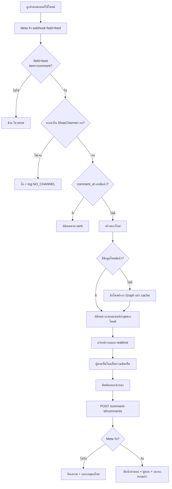
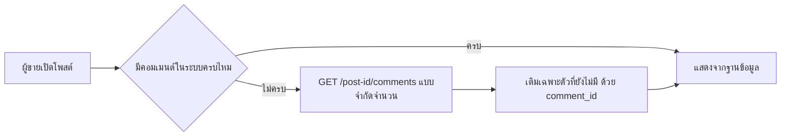

> **โมดูล:** 00029 — Facebook Comments Inbox
> **ประเภทเอกสาร:** Business Requirements Document (BRD)
> **เวอร์ชัน:** 1.0
> **วันที่จัดทำ:** 2026-08-03
> **สถานะ:** Draft — รอ user review
> **เจ้าของเอกสาร:** BA + PO (ดู [[Feature-Docs-Ownership]])

# BRD: กล่องความคิดเห็น Facebook (Facebook Comments Inbox)

---

## 1. บทนำ

### 1.1 วัตถุประสงค์ของเอกสาร

แปลงความต้องการใน [[PRD]] ให้เป็นข้อกำหนดที่ทดสอบได้ ก่อนเริ่มเขียนโค้ด — ครอบคลุมกฎธุรกิจ, flow, acceptance criteria และเคสที่ต้องผ่านทั้งหมดของ **v1: เห็นคอมเมนต์ + ตอบสาธารณะ (เฉพาะ Facebook)**

### 1.2 ขอบเขตของระบบ

**อยู่ในขอบเขต**
- รับ webhook `feed` ของเพจที่เชื่อมกับร้าน แล้วเก็บคอมเมนต์ + ข้อมูลโพสต์ที่จำเป็น
- แท็บ "ความคิดเห็น" ในกล่องข้อความ — รายการโพสต์ (ซ้าย) + โพสต์และคอมเมนต์ (ขวา)
- ตอบคอมเมนต์แบบสาธารณะในนามเพจ พร้อมบันทึกว่าใครในทีมเป็นคนตอบ
- สะท้อนการแก้ไข/ลบคอมเมนต์ที่เกิดฝั่ง Facebook
- backfill คอมเมนต์เก่าของโพสต์ที่กำลังเปิดดู (จำกัดจำนวน)

**ไม่อยู่ในขอบเขต** — ตาม PRD §5 (ซ่อน/ลบ, ทักส่วนตัว, บอทตอบ, Instagram, dark post, สร้างโพสต์)

### 1.3 กลุ่มผู้ใช้งาน

| กลุ่ม | สิทธิ์ |
|---|---|
| เจ้าของร้าน | เห็นและตอบคอมเมนต์ของเพจที่ร้านตัวเองเชื่อมไว้ |
| พนักงาน/แอดมินที่ถูกเชิญ | เท่ากับเจ้าของสำหรับ feature นี้ (ตัดสินด้วย `canAccessShop` เหมือนแชท) |
| ผู้ใช้ที่ไม่ได้อยู่ในร้าน | ไม่เห็นอะไรเลย |

---

## 2. ความต้องการหลัก (Functional Requirements)

### 2.1 การรับคอมเมนต์เข้าระบบ (Ingest)

| # | ความต้องการ | รายละเอียด |
|---|---|---|
| BR-01 | รับเฉพาะ change ที่ `field = "feed"` และ `value.item = "comment"` | item อื่น (post/reaction/share) ยังไม่ใช้ใน v1 — ข้ามแบบเงียบ ไม่ error |
| BR-02 | ผูกคอมเมนต์กับร้านผ่าน `pageId` → `ShopChannel` → `Shop` | เพจที่ไม่มีร้านเชื่อม = ทิ้ง + log (pattern เดียวกับ `NO_CHANNEL` ของแชท) |
| BR-03 | `comment_id` เป็นกุญแจกันซ้ำ (unique) | webhook ยิงซ้ำ/retry ต้องไม่เกิดแถวซ้ำ — เหมือน `externalMessageId` ของแชท |
| BR-04 | `verb = add` → สร้างแถวใหม่ · `edited` → อัปเดตข้อความ · `remove` → ทำเครื่องหมายว่าถูกลบ | ห้ามลบแถวจริง (BR-CMT-04) |
| BR-05 | ต้องแยกได้ว่าคอมเมนต์นั้น "เพจเป็นคนเขียน" หรือ "ลูกค้าเป็นคนเขียน" | เทียบ `from.id` กับ page id เหมือนที่ backfill ของแชททำ |
| BR-06 | คอมเมนต์ที่ตอบคอมเมนต์อื่น ต้องเก็บ `parent_id` ไว้ | ใช้แสดงชั้นย่อย และใช้ตัดสินว่า "ตอบแล้ว" |
| BR-07 | ข้อมูลโพสต์ (ข้อความ, รูป, permalink, เวลา) ที่ webhook ไม่ได้ให้ ต้องดึงเพิ่มจาก Graph ครั้งเดียวแล้ว cache | `feed` ให้แค่ `post_id` |

### 2.2 การแสดงผล

| # | ความต้องการ | รายละเอียด |
|---|---|---|
| BR-10 | แท็บ "ความคิดเห็น" อยู่ระดับเดียวกับแท็บช่องทางอื่นในกล่องข้อความ | เข้าถึงได้ทั้งเดสก์ท็อปและมือถือ |
| BR-11 | รายการซ้าย = **โพสต์** เรียงตามเวลาคอมเมนต์ล่าสุด (ใหม่สุดอยู่บน) | ไม่ใช่เรียงตามวันที่โพสต์ |
| BR-12 | แต่ละแถวโพสต์ต้องมี: รูปโพสต์, ข้อความโพสต์แบบตัด, ชื่อผู้คอมเมนต์ล่าสุด, เวลาล่าสุด, จำนวนที่ยังไม่ตอบ | ตามภาพอ้างอิงของ Business Suite |
| BR-13 | ฝั่งขวา = โพสต์ + คอมเมนต์ทั้งหมด เรียงเก่า→ใหม่ คอมเมนต์ลูกอยู่ใต้ตัวแม่ | |
| BR-14 | คอมเมนต์ที่ยังไม่ตอบต้องเห็นชัดจากรายการ ไม่ต้องเปิดเข้าไปหา | นิยาม "ตอบแล้ว" = มีคอมเมนต์ลูกที่ `from.id == pageId` |
| BR-15 | ต้องแสดงเวลาแบบเดียวกับทั้งระบบ (`formatDate`/`formatTimeHM`) | ห้ามฟอร์แมตเอง (convention เดิม) |
| BR-16 | คอมเมนต์ที่ถูกลบแสดงเป็น "ความคิดเห็นถูกลบ" ไม่ใช่หายไปเฉย ๆ | |

### 2.3 การตอบกลับ

| # | ความต้องการ | รายละเอียด |
|---|---|---|
| BR-20 | ตอบคอมเมนต์ได้จากช่องพิมพ์ใต้คอมเมนต์นั้น | `POST /{comment-id}/comments` |
| BR-21 | คำตอบขึ้นทันทีแบบ optimistic แล้วแทนที่ด้วยของจริงเมื่อ Meta ตอบกลับ | ล้มเหลว = คืนสภาพ + บอกเหตุผล |
| BR-22 | บันทึกผู้ตอบฝั่งเรา (`repliedByUserId`) | Meta มองว่าเป็นเพจทั้งหมด — ถ้าไม่เก็บเอง จะไม่มีวันรู้ว่าใครตอบ |
| BR-23 | เตือนก่อนตอบว่าข้อความนี้เป็นสาธารณะ | ข้อความเตือนถาวรใกล้ช่องพิมพ์ ไม่ใช่ toast ที่หายไป |
| BR-24 | คอมเมนต์ที่ร้านตอบจาก Business Suite/แอป ต้องขึ้นในระบบเราด้วย (ผ่าน webhook) และทำให้สถานะเป็น "ตอบแล้ว" | กันสภาพข้อมูลไม่ตรงระหว่าง 2 หน้าจอ |

---

## 3. Acceptance Criteria สรุป

### 3.1 Ingest

- [ ] AC-01 ลูกค้าคอมเมนต์ใต้โพสต์ → ภายใน 10 วินาที คอมเมนต์ปรากฏในแท็บความคิดเห็นโดยไม่ต้องรีเฟรช
- [ ] AC-02 ยิง webhook เดิมซ้ำ 3 ครั้ง → มีคอมเมนต์เดียวในระบบ
- [ ] AC-03 ลูกค้าแก้คอมเมนต์บน Facebook → ข้อความในระบบเปลี่ยนตาม
- [ ] AC-04 ลูกค้าลบคอมเมนต์ → ระบบแสดงว่าถูกลบ แถวไม่หาย
- [ ] AC-05 คอมเมนต์ของเพจที่ไม่มีร้านเชื่อม → ไม่ถูกเก็บ และมี log บอก

### 3.2 การแสดงผล

- [ ] AC-10 โพสต์ที่มีคอมเมนต์ใหม่ล่าสุดอยู่บนสุดของรายการ
- [ ] AC-11 โพสต์ที่มีคอมเมนต์ 50+ อัน เปิดได้โดยไม่ค้าง (แบ่งหน้า)
- [ ] AC-12 คอมเมนต์ที่ตอบคอมเมนต์อื่นแสดงเป็นชั้นย่อยใต้ตัวแม่ ไม่ปนกับคอมเมนต์ระดับบน
- [ ] AC-13 จำนวน "ยังไม่ตอบ" ในแถวโพสต์ตรงกับจำนวนจริงในหน้าโพสต์

### 3.3 การตอบกลับ

- [ ] AC-20 พิมพ์ตอบแล้วกดส่ง → ข้อความขึ้นทันที และไปโผล่บน Facebook จริง
- [ ] AC-21 ตอบสำเร็จ → คอมเมนต์นั้นเปลี่ยนสถานะเป็น "ตอบแล้ว" ทั้งในหน้าโพสต์และในรายการซ้าย
- [ ] AC-22 Meta ปฏิเสธ (เช่น คอมเมนต์ถูกลบไปแล้ว) → ขึ้นเหตุผลภาษาไทย ไม่ใช่ error ดิบ
- [ ] AC-23 พนักงานคนละคนตอบคนละคอมเมนต์ → ระบบบอกได้ว่าใครตอบอันไหน
- [ ] AC-24 ตอบจาก Business Suite → สถานะในระบบเราเปลี่ยนเป็น "ตอบแล้ว" เช่นกัน

---

## 4. Business Flows

### 4.1 Flow หลัก: คอมเมนต์เข้า → ร้านตอบ

### 4.2 Flow ย่อย: เปิดโพสต์ที่มีคอมเมนต์เก่าอยู่ก่อนเชื่อมระบบ

---

## 5. Use Case Scenarios

### Scenario 1: Best case — ลูกค้าถามราคาใต้โฆษณา

1. โฆษณาโช๊คหลังวิ่งอยู่ ลูกค้าคอมเมนต์ "ราคาเท่าไหร่ครับ"
2. คอมเมนต์เด้งเข้าแท็บความคิดเห็นภายในไม่กี่วินาที โพสต์นั้นเด้งขึ้นบนสุดพร้อมป้าย "ยังไม่ตอบ 1"
3. ผู้ขายกดโพสต์ → เห็นคอมเมนต์ → พิมพ์ "360 ครับ ส่งฟรี" → กดส่ง
4. คำตอบขึ้นใต้คอมเมนต์ทันที และไปโผล่บน Facebook จริง
5. ป้าย "ยังไม่ตอบ" หายไป

### Scenario 2: ลูกค้าลบคอมเมนต์หลังร้านตอบไปแล้ว

1. ร้านตอบไปแล้ว ลูกค้าลบคอมเมนต์ตัวเอง
2. Meta ส่ง `verb=remove` → ระบบแสดง "ความคิดเห็นถูกลบ" แต่คำตอบของร้านยังอยู่
3. ไม่มี error ให้ผู้ขายเห็น

### Scenario 3: ตอบจาก Business Suite แทน

1. ผู้ขายเผลอไปตอบใน Business Suite
2. Meta ส่ง feed ของคอมเมนต์เพจเข้ามา → ระบบผูกเป็นคำตอบของคอมเมนต์ตัวแม่
3. สถานะเปลี่ยนเป็น "ตอบแล้ว" โดยไม่มีใครต้องกดอะไรใน Deep (แต่ช่อง "ใครตอบ" ว่าง เพราะไม่ได้ตอบผ่านเรา)

### Scenario 4: โพสต์ไวรัล 220 คอมเมนต์

1. ผู้ขายเปิดโพสต์ที่มีคอมเมนต์ 220 อัน
2. ระบบโหลดชุดแรก (เช่น 30 อัน) แล้วเลื่อนโหลดเพิ่ม
3. ตัวนับ "ยังไม่ตอบ" ต้องถูกต้องแม้ยังโหลดไม่ครบ

---

## 6. ความต้องการด้านคุณภาพ

### 6.1 ความถูกต้องของข้อมูล
- คอมเมนต์เดียวกันต้องมีแถวเดียวเสมอ ไม่ว่าจะมาจาก webhook หรือ backfill
- สถานะ "ตอบแล้ว" ต้องตรงกับความจริงบน Facebook เสมอ

### 6.2 ความรวดเร็ว
- คอมเมนต์ใหม่ → เห็นบนหน้าจอภายใน ~10 วินาที
- เปิดโพสต์ที่มีคอมเมนต์ 50 อัน → แสดงชุดแรกภายใน 2 วินาที

### 6.3 ความน่าเชื่อถือ
- webhook ต้องตอบ 200 เสมอ ยกเว้น infra error (กติกาเดิมของ route)
- Meta ล่ม/ปฏิเสธ = ไม่ทำให้หน้าจอพัง แค่ตอบไม่ได้ชั่วคราว

### 6.4 ความปลอดภัย
- ตรวจสิทธิ์ที่ service layer ด้วย `canAccessShop` ก่อนอ่าน/ตอบทุกครั้ง
- ห้าม page access token หลุดไปฝั่ง browser
- เนื้อคอมเมนต์เป็นข้อมูลลูกค้า — ห้าม log เต็ม ๆ

### 6.5 ความสะดวกในการใช้งาน
- ใช้ pattern เดียวกับแชทให้มากที่สุด (optimistic, toast, การจัดวางช่องพิมพ์) เพื่อไม่ต้องเรียนรู้ใหม่
- มือถือต้องใช้งานได้จริง ไม่ใช่ย่อจากเดสก์ท็อป

---

## 7. ข้อจำกัด (Constraints)

### 7.1 ข้อจำกัดทางธุรกิจ
- v1 ใช้ได้จริงเฉพาะเพจที่บัญชีของเรามี role อยู่ (Standard Access) — ร้านนอกต้องรอ Advanced Access
- ต้องอัด screencast ของฟีเจอร์นี้เพื่อยื่น App Review หลังสร้างเสร็จ

### 7.2 ข้อจำกัดทางเทคนิค
- `feed` ให้ข้อมูลจำกัด — ข้อมูลโพสต์/ชื่อผู้คอมเมนต์บางส่วนอาจต้อง GET เพิ่ม (ยังไม่ยืนยัน — ดู PRD §9.2)
- ฐานข้อมูล dev = prod เดียวกัน → migration ต้อง additive เท่านั้น และขอยืนยันก่อนรัน
- ไม่มี queue/worker — ingest ต้องเบาพอที่จะทำใน webhook request เดียว

---

## 8. สิ่งที่ต้องตัดสินก่อนเขียน SRS/SDS

| # | คำถามที่ยังเปิดอยู่ | ใครตอบ |
|---|---|---|
| Q-1 | payload จริงมี `from.name` ไหม (ถ้าไม่มี ต้อง GET เพิ่ม = ช้าลง + โควตา API) | รอผลเก็บ payload |
| Q-2 | เก็บคอมเมนต์ย้อนหลังกี่วัน / โพสต์เก่าแค่ไหนที่ต้องดึงมา | user |
| Q-3 | ต้องมีการค้นหาในคอมเมนต์ไหม (ภาพอ้างอิงมีช่อง Search) | user |
| Q-4 | ป้าย "ยังไม่ตอบ" นับรวมคอมเมนต์ของเพจเองไหม (เช่น เพจคอมเมนต์เพิ่มเอง) | BA |
