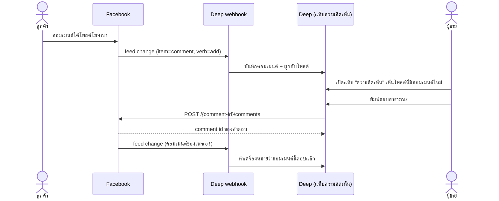

> **โมดูล:** 00029 — Facebook Comments Inbox
> **ประเภทเอกสาร:** Product Requirements Document (PRD)
> **เวอร์ชัน:** 1.0
> **วันที่จัดทำ:** 2026-08-03
> **สถานะ:** Draft — รอ user review
> **เจ้าของเอกสาร:** BA + PO + PM (ดู [[Feature-Docs-Ownership]])

# PRD: กล่องความคิดเห็น Facebook (Facebook Comments Inbox)

---

## Executive Summary

ทุกวันนี้ Deep รับ **ข้อความ** จาก Messenger/Instagram เข้ากล่องเดียวกับออเดอร์และลูกค้าได้แล้ว (feature 00018) แต่ **ความคิดเห็นใต้โพสต์ของเพจ** ยังไม่เข้าระบบเลย ทั้งที่เป็นจุดที่ลูกค้าถามราคา/ถามของ/ทิ้งเบอร์ไว้มากที่สุดของร้านที่ยิงโฆษณา — โพสต์เดียวของร้านตัวอย่างมี **220 ความคิดเห็น / 1,342 รีแอ็กชัน**

ผลคือผู้ขายต้องสลับไป Meta Business Suite เพื่อไล่ตอบคอมเมนต์ แล้วกลับมาที่ Deep เพื่อออกออเดอร์ — งานเดียวกันแต่ทำสองหน้าจอ และไม่มีใครรู้ว่าคอมเมนต์ไหนตอบไปแล้วบ้าง

feature นี้เพิ่ม **แท็บ "ความคิดเห็น" ในกล่องข้อความของ Deep**: รวมคอมเมนต์จากทุกโพสต์ของเพจที่เชื่อมไว้ จัดกลุ่มตามโพสต์ (เหมือน Business Suite) และตอบกลับแบบสาธารณะได้จากในหน้าเดียวกัน

**ขอบเขต v1 (ตัดสินโดย user 2026-08-03):** เห็นคอมเมนต์ + ตอบสาธารณะ · เฉพาะ **Facebook** · ยังไม่มี ซ่อน/ลบ, ทักส่วนตัว, บอทตอบอัตโนมัติ

---

## 1. Business Goals & KPIs

### 1.1 เป้าหมายทางธุรกิจ

| # | เป้าหมาย | เหตุผล |
|---|---|---|
| G-1 | ไม่ต้องออกจาก Deep เพื่อตอบคอมเมนต์ | ทุกวันนี้ผู้ขายเปิด Business Suite คู่กับ Deep ตลอดวัน — สลับหน้าจอคือต้นทุนที่มองไม่เห็นแต่จ่ายทุกวัน |
| G-2 | คอมเมนต์ที่ยังไม่ได้ตอบต้องไม่หล่น | โพสต์โฆษณาที่วิ่งอยู่มีคอมเมนต์เข้าเป็นร้อย ลูกค้าที่ถามแล้วเงียบ = ยอดที่เสียไปโดยไม่รู้ตัว |
| G-3 | ต่อยอดเป็นออเดอร์ได้ในอนาคต | คอมเมนต์คือ "ลูกค้าที่สนใจแต่ยังไม่ทัก" — ขั้นถัดไปคือเปลี่ยนเป็นแชท/ออเดอร์ (นอกขอบเขต v1 แต่ต้องออกแบบให้ต่อได้) |

### 1.2 ตัวชี้วัดความสำเร็จ (KPIs)

| # | ตัวชี้วัด | เป้า | วัดจาก |
|---|---|---|---|
| K-1 | สัดส่วนคอมเมนต์ที่ร้านตอบผ่าน Deep (ไม่ใช่ Business Suite) | ≥ 50% ภายใน 30 วันหลังเปิดใช้ | นับ reply ที่สร้างผ่าน API ของเรา เทียบกับคอมเมนต์ทั้งหมดที่ร้านตอบ |
| K-2 | เวลาเฉลี่ยจากคอมเมนต์เข้า → ร้านตอบ | ลดลงจาก baseline ที่วัดได้สัปดาห์แรก | `repliedAt - createdTime` |
| K-3 | คอมเมนต์ค้างเกิน 24 ชม. โดยไม่มีใครตอบ | ลดลงอย่างมีนัย | นับคอมเมนต์ที่ไม่มี reply ของเพจ |

> baseline ยังไม่มี — สัปดาห์แรกหลัง deploy คือช่วงเก็บ baseline ไม่ใช่ช่วงตัดสินผล

---

## 2. User Personas (กลุ่มผู้ใช้งาน)

### 2.1 เจ้าของร้านที่ยิงโฆษณา (persona หลัก)

- ร้านอะไหล่/ของใช้ที่ยิงโฆษณา Facebook ทุกวัน โพสต์ที่วิ่งอยู่มีคอมเมนต์เข้าเป็นร้อยต่อโพสต์
- ทุกวันนี้: เปิด Business Suite ในมือถือ ไล่ตอบคอมเมนต์ทีละอัน แล้วสลับมา Deep เพื่อออกออเดอร์
- ต้องการ: เห็นว่าคอมเมนต์ไหนยังไม่ตอบ และตอบได้ทันทีจากที่เดียวกับที่ทำออเดอร์
- ความคาดหวัง: **คอมเมนต์ต้องมาไว** (ใกล้เคียง realtime เท่าแชท) ไม่ใช่รอรีเฟรช

### 2.2 พนักงานร้าน (แอดมินที่ถูกเชิญ)

- เข้าถึงเพจของร้านผ่าน Deep เท่านั้น (ไม่มีสิทธิ์ใน Business Suite ของเจ้าของ)
- ต้องการตอบคอมเมนต์ได้ในนามเพจ โดยเจ้าของยังเห็นได้ว่าใครตอบอะไรไป

---

## 3. Business Requirements

### 3.1 รับและแสดงความคิดเห็น

| # | ความต้องการ | หมายเหตุ |
|---|---|---|
| FR-CMT-01 | คอมเมนต์ใหม่บนโพสต์ของเพจที่เชื่อมกับร้าน ต้องเข้ามาที่ Deep อัตโนมัติ | ผ่าน webhook `feed` (ทำชั้นรับแล้ว 2026-08-03) |
| FR-CMT-02 | แท็บ "ความคิดเห็น" อยู่ในกล่องข้อความเดียวกับแชท | คนละแท็บกับ Messenger/Instagram |
| FR-CMT-03 | รายการซ้ายจัดกลุ่ม **ตามโพสต์** — แสดงรูปโพสต์, ข้อความโพสต์ (ตัด), ชื่อคนคอมเมนต์ล่าสุด, เวลาล่าสุด | ตามที่ user เลือก (แบบ Business Suite) |
| FR-CMT-04 | คลิกโพสต์ → ฝั่งขวาแสดงโพสต์ + คอมเมนต์ทั้งหมดของโพสต์นั้น เรียงเก่า→ใหม่ | คอมเมนต์ที่ตอบคอมเมนต์ (`parent_id`) แสดงเป็นชั้นย่อยใต้ตัวแม่ |
| FR-CMT-05 | ต้องบอกได้ว่าคอมเมนต์ไหน **ยังไม่ถูกตอบ** | นิยาม: ไม่มีคอมเมนต์ลูกที่เป็นของเพจเอง |
| FR-CMT-06 | คอมเมนต์ที่ถูกแก้/ลบบน Facebook ต้องสะท้อนใน Deep | `verb=edited` → อัปเดตข้อความ; `verb=remove` → ทำเครื่องหมายว่าถูกลบ ไม่ลบแถวทิ้ง |
| FR-CMT-07 | คอมเมนต์ที่มีรูป/วิดีโอแนบ ต้องรู้ว่ามีสื่อ และเปิดดูได้ | รายละเอียดขึ้นกับ payload จริง (ดู §9.2) |

### 3.2 ตอบกลับสาธารณะ

| # | ความต้องการ | หมายเหตุ |
|---|---|---|
| FR-CMT-10 | ตอบคอมเมนต์แบบสาธารณะได้จากหน้า Deep | `POST /{comment-id}/comments` — ต้องมี `pages_manage_engagement` |
| FR-CMT-11 | คำตอบของเราต้องโผล่ในเธรดทันทีแบบ optimistic แล้วยืนยันด้วยของจริงจาก Meta | pattern เดียวกับการส่งข้อความในแชท |
| FR-CMT-12 | ตอบไม่สำเร็จต้องบอกเหตุผลจาก Meta ตรง ๆ เป็นภาษาไทย | ไม่ปล่อยให้เงียบ |
| FR-CMT-13 | ต้องรู้ว่า "ใครในทีมร้าน" เป็นคนตอบคอมเมนต์นั้น | Meta ไม่แยกให้ (ทุกคำตอบเป็นของเพจ) — เก็บฝั่งเราเอง เหมือน `senderUserId` ในแชท |
| FR-CMT-14 | คอมเมนต์ที่เพจตอบเอง (จาก Business Suite/มือถือ) ต้องเข้ามาด้วย | Meta ส่ง `feed` ของคอมเมนต์เพจเหมือนกัน — กันสภาพ "ตอบไปแล้วแต่ Deep ยังขึ้นว่าค้าง" |

---

## 4. Business Rules & Constraints

### 4.1 กฎทางธุรกิจหลัก

| # | กฎ |
|---|---|
| BR-CMT-01 | คอมเมนต์เป็น **ข้อความสาธารณะ** — คนอื่นเห็นได้หมด การตอบจึงต้องเตือนน้ำเสียงต่างจากแชทส่วนตัว (ห้ามพิมพ์ที่อยู่/เบอร์ลูกค้าในคอมเมนต์) |
| BR-CMT-02 | ผูกกับ `ShopChannel` เดิม (เพจที่เชื่อมไว้แล้ว) — ไม่มีการเชื่อมเพจแยกสำหรับคอมเมนต์ |
| BR-CMT-03 | สิทธิ์เข้าถึง = สิทธิ์เดียวกับแชทของร้านนั้น (`canAccessShop`) ไม่มีสิทธิ์ระดับใหม่ |
| BR-CMT-04 | คอมเมนต์ที่ถูกลบบน Facebook ยังคงเก็บแถวไว้ในระบบ (ทำเครื่องหมาย) — เป็นหลักฐานว่าเคยมีคนถามอะไร |

### 4.2 ข้อจำกัดทางธุรกิจ / เทคนิค (จากเอกสาร Meta)

| # | ข้อจำกัด | ผลกระทบ |
|---|---|---|
| C-1 | ต้องมี `pages_read_user_content` (อ่าน) + `pages_manage_engagement` (ตอบ) | เพิ่ม use case "Manage everything on your Page" แล้ว 2026-08-03 → **Standard Access ใช้ได้กับเพจที่เรามี role อยู่ทันที** |
| C-2 | จะเปิดให้ร้านนอกใช้ ต้องผ่าน **App Review (Advanced Access)** | ยื่นชุดใหม่ไม่ได้จนกว่า submission ที่ยื่น 2026-08-01 จะรู้ผล — และต้องอัด screencast ของฟีเจอร์นี้ **หลังสร้างเสร็จ** |
| C-3 | คอมเมนต์มาที่ `entry.changes[]` ไม่ใช่ `entry.messaging[]` | schema/handler คนละเส้นกับแชท (ทำชั้นรับแล้ว) |
| C-4 | โพสต์ยอดนิยมมีคอมเมนต์หลักร้อย | ต้องมี pagination + ไม่ backfill ทั้งเพจในครั้งเดียว |
| C-5 | ไม่มี "หน้าต่าง 24 ชม." แบบข้อความ — ตอบคอมเมนต์เมื่อไหร่ก็ได้ | ตรงข้ามกับแชท อย่ายกกติกาแชทมาใช้ซ้ำ |

---

## 5. Out of Scope (นอกขอบเขต v1)

| # | สิ่งที่ไม่ทำใน v1 | เหตุผล |
|---|---|---|
| O-1 | ซ่อน / ลบคอมเมนต์ | user ตัดออกจาก v1 — เป็น moderation ที่ต้องคิดเรื่องสิทธิ์และ audit ให้จบก่อน |
| O-2 | **ทักส่วนตัวจากคอมเมนต์** (private reply) | Meta จำกัด "ภายใน 7 วัน" และ "ส่งได้ครั้งเดียวต่อคอมเมนต์" — กติกาเฉพาะที่ต้องออกแบบ UX แยก |
| O-3 | บอท/AI ตอบคอมเมนต์อัตโนมัติ | ต่อยอดจาก ChatBot (00023) ได้ แต่ความเสี่ยงสูงเพราะเป็นข้อความสาธารณะ |
| O-4 | คอมเมนต์ Instagram | ต้องเพิ่ม use case IG + ยื่นรีวิว IG ใหม่ (ถูกตีกลับรอบก่อน) |
| O-5 | คอมเมนต์บนโฆษณาที่ไม่ได้อยู่บนโพสต์ของเพจ (dark post) | ต้องตรวจว่า `feed` ส่งมาหรือไม่ — ยังไม่ยืนยัน |
| O-6 | สร้าง/แก้โพสต์จาก Deep | คนละเรื่องกับกล่องข้อความ |

---

## 6. Risks & Mitigation

### 6.1 ความเสี่ยงทางธุรกิจ

| # | ความเสี่ยง | แนวทาง |
|---|---|---|
| R-1 | ร้านตอบคอมเมนต์สาธารณะด้วยข้อความที่ควรเป็นส่วนตัว (ที่อยู่/เบอร์) | UI เตือนชัดว่า "ทุกคนเห็นข้อความนี้" + v2 มีปุ่มทักส่วนตัว |
| R-2 | ใช้ไม่ได้จริงกับร้านนอกจนกว่า App Review ผ่าน | v1 ใช้กับเพจของเราเองเพื่อเก็บ screencast + พิสูจน์ของจริงก่อนยื่น |

### 6.2 ความเสี่ยงทางเทคนิค

| # | ความเสี่ยง | แนวทาง |
|---|---|---|
| R-3 | payload `feed` ให้ข้อมูลไม่ครบ (เช่น ไม่มีชื่อคนคอมเมนต์) | **ยังไม่ยืนยัน** — กำลังเก็บ payload จริงอยู่ (§9.2) ถ้าไม่ครบต้อง GET เพิ่มจาก Graph |
| R-4 | คอมเมนต์เข้าถี่มากตอนโฆษณาวิ่ง | ingest ต้องเบาและ idempotent ด้วย `comment_id` unique เหมือน `externalMessageId` ของแชท |
| R-5 | โพสต์เก่าที่มีคอมเมนต์อยู่แล้วก่อนเชื่อมระบบ | webhook ให้เฉพาะของใหม่ → ต้องมี backfill ผ่าน `GET /{post-id}/comments` แบบจำกัดจำนวน |

---

## 7. Glossary

| คำ | ความหมาย |
|---|---|
| **feed (webhook field)** | field ของ Page topic ที่ส่ง event ของหน้าเพจ — คอมเมนต์/โพสต์/รีแอ็กชัน |
| **comment_id** | id ของคอมเมนต์ฝั่ง Meta — ใช้เป็นกุญแจกันซ้ำและเป็นเป้าหมายตอนตอบ |
| **parent_id** | id ของคอมเมนต์แม่ (กรณีตอบคอมเมนต์) หรือ id ของโพสต์ |
| **private reply** | การทัก DM หาคนที่คอมเมนต์ ผ่าน `recipient: {comment_id}` — นอกขอบเขต v1 |
| **Advanced Access** | ระดับสิทธิ์ที่ให้ใช้กับผู้ใช้ทั่วไปที่ไม่มี role บนแอป ต้องผ่าน App Review |

---

## 8. Success Metrics

| # | ตัววัด | วิธีวัด |
|---|---|---|
| M-1 | จำนวนคอมเมนต์ที่ ingest สำเร็จต่อวัน | นับแถวใหม่ |
| M-2 | จำนวน reply ที่ส่งผ่าน Deep | นับ reply ที่มี `repliedByUserId` |
| M-3 | อัตราตอบไม่สำเร็จจาก Meta | นับ error ต่อ 100 ครั้ง |

---

## 9. Dependencies & Assumptions

### 9.1 สิ่งที่ต้องพึ่งพา

| # | สิ่งที่พึ่งพา | สถานะ |
|---|---|---|
| D-1 | webhook field `feed` (app-level + page-level) | ✅ เปิดครบแล้ว 2026-08-03 |
| D-2 | ชั้นรับ `entry.changes[]` + `extractFeedChanges()` | ✅ deploy แล้ว (`88164e57`) — ยัง log อย่างเดียว |
| D-3 | `pages_read_user_content` / `pages_manage_engagement` | ✅ ปลดล็อกแล้วผ่าน use case ใหม่ (Standard) · ⏳ Advanced รอ App Review |
| D-4 | `ShopChannel` + page access token ของ feature 00018 | ✅ มีอยู่แล้ว |

### 9.2 สมมติฐานที่ **ยังไม่พิสูจน์** (ต้องปิดก่อนเขียน SRS/SDS)

| # | สมมติฐาน | จะรู้เมื่อ |
|---|---|---|
| A-1 | `feed` ส่ง `from.name` (ชื่อคนคอมเมนต์) มาให้ | เก็บ payload จริงจากการคอมเมนต์ทดสอบ |
| A-2 | ข้อความภาษาไทยมาครบใน `message` | เดียวกัน |
| A-3 | คอมเมนต์ที่แนบรูปส่ง `photo` เป็น URL ที่เปิดได้ | เดียวกัน |
| A-4 | คอมเมนต์ของเพจเอง (ตอบจาก Business Suite) ก็ยิง `feed` มาด้วย | เดียวกัน |
| A-5 | ต้องดึงข้อมูลโพสต์ (รูป/ข้อความ/permalink) เพิ่มจาก Graph | คาดว่าใช่ — `feed` ให้แค่ `post_id` |

---

## 10. Appendix

### 10.1 User Journey (v1)



### 10.2 โครงหน้าจอที่ user เลือก

```
[ ทั้งหมด | Messenger | Instagram | ความคิดเห็น ]      ← แท็บในกล่องข้อความเดิม

┌── รายการโพสต์ ─────────────┐ ┌── โพสต์ + คอมเมนต์ ──────────────┐
│ [รูป] โช๊คหลังสามล้อ…  13:12 │ │ [รูปโพสต์] โช๊คหลังสามล้อ งานหนัก…  │
│      ช่างแดง and 3 คน        │ │ 1,342 รีแอ็กชัน · 220 ความคิดเห็น    │
│ ─────────────────────────── │ │ ───────────────────────────────── │
│ [รูป] โรงงานล้างสต๊อก 13:04 │ │ ช่างแดง: ราคาเท่าไหร่ครับ            │
│      ธนภัทร์ อะไหล่…          │ │   └ เพจ: 360 ครับ ส่งฟรี            │
│ ─────────────────────────── │ │ สมชาย: มีสีดำไหม     [ยังไม่ตอบ]    │
│ …                            │ │ [ ช่องพิมพ์ตอบสาธารณะ ]            │
└─────────────────────────────┘ └───────────────────────────────────┘
```

> รายละเอียด layout/มือถือ ให้ `safepay-ux` ออก UX-Design-Spec ต่อจากเอกสารนี้
