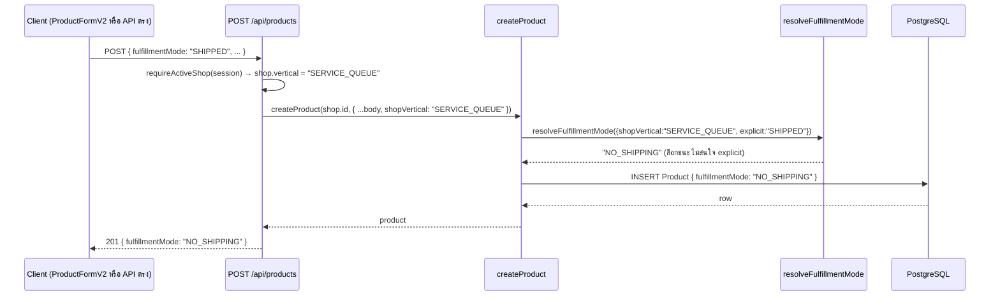
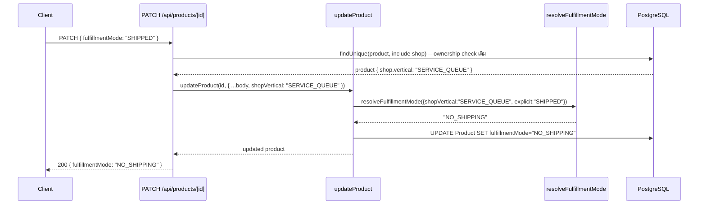

> **โมดูล:** M00030-BookingBusinessUXUnification
> **ประเภทเอกสาร:** API Specification
> **เวอร์ชัน:** 1.0
> **วันที่จัดทำ (backfill):** 2026-08-05
> **สถานะ:** Implemented — backfill จากโค้ดจริง
> **เจ้าของเอกสาร:** safepay-planner (ดู [[Feature-Docs-Ownership]])

# API: รวมประสบการณ์ธุรกิจแบบนัดหมาย·จอง

---

## 1. Overview

🛑 **งานนี้ไม่มี endpoint ใหม่แม้แต่ตัวเดียว** — เป็นการเปลี่ยน **behavior contract** ของ endpoint ที่มีอยู่แล้ว 2 ตัว (`POST /api/products`, `PATCH /api/products/[id]`) ให้บังคับ `fulfillmentMode = NO_SHIPPING` เสมอสำหรับร้าน `SERVICE_QUEUE` โดยไม่เปลี่ยน request/response shape ใด ๆ ที่ client เห็น

หน้าเลือกประเภทร้าน (`VerticalTaxonomyPicker`) ไม่มี API ของตัวเอง — เป็น client state ล้วนที่ยิง `POST /api/shops/update` เดิม (feature 00028) ด้วย body shape เดิมทุกประการ (`{ vertical }`)

- **Provider:** `src/app/api/products/**` (Next.js Route Handler)
- **ผู้บริโภค:** `ProductFormV2.tsx` (ฝั่ง seller, Paces) — และใครก็ตามที่ยิง API ตรง (ต้องถูกล็อกเหมือนกัน ตาม BR-LODG-03/BR-SBT-10)
- **Base URL:** เหมือนเดิมของระบบ (`/api/products`, `/api/products/{id}`)
- **Content-Type:** `application/json`

---

## 2. Authentication

**ไม่เปลี่ยนจากของเดิม** — ทั้ง 2 endpoint ยังใช้ NextAuth session + ownership check เดิมทุกประการ:

| รายการ | ค่า |
|---|---|
| **วิธี** | NextAuth session (seller subdomain) |
| **POST /api/products** | `requireActiveShop(session)` — resolve active shop ของ session, verify membership |
| **PATCH /api/products/[id]** | `prisma.product.findUnique({include:{shop:true}})` แล้วเช็ค `product.shop.userId === session.user.id` (ownership แบบ pre-existing — **ไม่ได้แก้ในงานนี้** แม้จะเป็น pattern `findUnique` แล้วค่อยเช็คที่ไม่ scope ownership ใน `WHERE` โดยตรง — นอกขอบเขตของ feature 00030) |
| **สิ่งที่เพิ่มในงานนี้** | ทั้ง 2 route ดึง `shop.vertical`/`product.shop.vertical` (ได้มาฟรีจาก object ที่ query อยู่แล้ว) แล้วส่งเข้า service เป็น `shopVertical` |
| **กรณีไม่ผ่าน** | 401 (ไม่มี session) / 404 (ไม่ใช่เจ้าของ) — เหมือนเดิมทุกประการ |

---

## 3. Endpoint List

| Method | Path | สถานะ | คำอธิบาย |
|---|---|---|---|
| `POST` | `/api/products` | **behavior เปลี่ยน** | สร้างสินค้า — เพิ่ม override `fulfillmentMode` สำหรับร้าน `SERVICE_QUEUE` |
| `PATCH` | `/api/products/[id]` | **behavior เปลี่ยน** | แก้ไขสินค้า — เพิ่ม override เดียวกัน (จุดที่เดิม**ไม่มี logic นี้เลย**) |
| `POST` | `/api/shops/update` | ไม่เปลี่ยน (อ้างอิงเท่านั้น) | ตั้งค่า `vertical` — สืบทอด `VERTICAL_LOCKED` 409 จาก feature 00028 เต็มรูป ไม่ทำซ้ำเอกสารที่นี่ |

---

## 4. Endpoint Detail

### 4.1 `POST /api/products` (behavior change)

Request/response shape **ไม่เปลี่ยน** จากเดิม — เอกสาร field เต็มดูที่ schema `CreateProductSchema` (`src/lib/validations.ts`). `fulfillmentMode` ยังเป็น optional field ที่ client ส่งได้ตามเดิม

**สิ่งที่เปลี่ยน (server-internal, ไม่ปรากฏใน request):**

```
route resolve shop (มีอยู่แล้วสำหรับ ownership)
  → createProduct(shop.id, { ...body, shopVertical: shop.vertical })
    → resolveFulfillmentMode({ shopVertical, explicit: body.fulfillmentMode, type: body.type })
```

**ตัวอย่าง — ร้าน `SERVICE_QUEUE` ยิงพร้อมค่าที่ควรถูกปฏิเสธ:**

```jsonc
// Request
POST /api/products
{ "name": "แพ็กเกจนวด 5 ครั้ง", "price": 1500, "type": "SERVICE", "fulfillmentMode": "SHIPPED" }

// Response 201 — fulfillmentMode ถูก override เงียบ ไม่ใช่ SHIPPED ที่ส่งมา
{ "id": "...", "name": "แพ็กเกจนวด 5 ครั้ง", "fulfillmentMode": "NO_SHIPPING", ... }
```

**ตัวอย่าง — ร้าน `ONLINE_SALES` (ไม่กระทบ — พฤติกรรมเดิมทุกประการ):**

```jsonc
// Request
POST /api/products
{ "name": "เสื้อยืด", "price": 250, "type": "PHYSICAL", "fulfillmentMode": "NO_SHIPPING" }

// Response 201 — caller override ชนะเหมือนเดิม
{ "id": "...", "fulfillmentMode": "NO_SHIPPING", ... }
```

**Errors:** เหมือนเดิมทุกตัว (`400` validation, `403 INVENTORY_NOT_ACTIVE`/`INVENTORY_NOT_PRO`/`COST_REQUIRES_BUSINESS_PACKAGE` ตาม guard เดิม) — **ไม่มี error code ใหม่สำหรับ override นี้** (เป็น silent override ไม่ใช่ rejection — ดู §5)

### 4.2 `PATCH /api/products/[id]` (behavior change — จุดที่เคยเป็นช่องโหว่จริง)

เหมือน 4.1 แต่เป็นจุดที่ **ก่อนงานนี้ไม่มี logic ล็อกใด ๆ เลย** — สินค้าที่สร้างถูกต้อง (`NO_SHIPPING`) ตอนแรก แก้ไขทีหลังด้วย `fulfillmentMode: "SHIPPED"` เคยผ่านได้จริง

```
route: prisma.product.findUnique({include:{shop:true}}) (มีอยู่แล้วสำหรับ ownership)
  → updateProduct(id, { ...body, shopVertical: product.shop.vertical })
    → resolveFulfillmentMode({ shopVertical, explicit: body.fulfillmentMode, type: body.type })
    → เขียนเฉพาะถ้าผลลัพธ์ !== undefined (คง partial-update semantics เดิม)
```

**ตัวอย่าง — แก้ไขสินค้าเดิมของร้าน `SERVICE_QUEUE`:**

```jsonc
// Request
PATCH /api/products/prod_123
{ "fulfillmentMode": "SHIPPED" }

// Response 200 — ยังคง NO_SHIPPING แม้ payload ขอเปลี่ยนเป็น SHIPPED
{ "id": "prod_123", "fulfillmentMode": "NO_SHIPPING", ... }
```

**Errors:** เหมือนเดิมทุกตัว — ไม่มี error code ใหม่

### 4.3 `POST /api/shops/update` (ไม่เปลี่ยน — อ้างอิงเท่านั้น)

ไม่แตะในงานนี้ ยึดพฤติกรรมเดิม 100% ของ feature 00028: `vertical` ตั้งได้เฉพาะตอน `Shop.slug === null` (onboarding ยังไม่จบ) — มี slug แล้วยิงมาอีก → `409 { error: "VERTICAL_LOCKED" }` (ดู `docs/20 - Features/00028 - Shop Business Type/API.md` §4 — ไม่ทำซ้ำที่นี่ตาม PRD §5 "ไม่สร้าง SSOT ใหม่")

Client ที่ยิง endpoint นี้เปลี่ยนไปคือ `VerticalTaxonomyPicker` (2 ทางเข้า: onboarding + business create) แต่ **body shape ที่ส่งไม่เปลี่ยน** — ยังเป็น `{ vertical: 'ONLINE_SALES' | 'SERVICE_QUEUE' | 'LODGING' }` เหมือนเดิมทุกประการ (2 ขั้นเป็นแค่ UI ก่อนกดถัดไป)

---

## 5. Error Code Table

🛑 **งานนี้ไม่มี error code ใหม่** — ตารางด้านล่างคือของเดิมที่ endpoint ทั้ง 2 ใช้อยู่แล้ว (ไม่เปลี่ยน):

| Error Code | HTTP | ความหมาย | เกิดจากงานนี้ไหม |
|---|---|---|---|
| `VALIDATION_ERROR` (message `"Invalid input"`) | 400 | payload ไม่ผ่าน Valibot | ไม่ — เดิม |
| `INVENTORY_NOT_ACTIVE` / `INVENTORY_NOT_PRO` | 403 | Add-on guard เดิม | ไม่ — เดิม |
| `COST_REQUIRES_BUSINESS_PACKAGE` | 403 | Expense guard เดิม | ไม่ — เดิม |
| `Not found` | 404 | ไม่ใช่เจ้าของ/ไม่มี product | ไม่ — เดิม |
| `VERTICAL_LOCKED` | 409 | เฉพาะ `POST /api/shops/update` เท่านั้น — ไม่เกี่ยวกับ endpoint สินค้า | ไม่ — feature 00028 |

**การ override `fulfillmentMode` เป็น "silent lock" โดยตั้งใจ — ไม่ใช่ validation rejection:**

```jsonc
{
  "error": {
    "code": "ไม่มี — ไม่ reject request",
    "message": "ระบบเขียนค่า NO_SHIPPING ทับเงียบ ๆ แทนการคืน 400/409 ให้ client แก้ไข"
  }
}
```

**เหตุผลของการออกแบบนี้ (ตัดสินใจโดย BR-BKU-13):** ร้าน `SERVICE_QUEUE` ไม่ควรมีทางส่งค่าอื่นได้ตั้งแต่ UI อยู่แล้ว (TFR-009 ซ่อน field) การ reject ด้วย error code จึงไม่มี use case จริง (ไม่มีทางที่ user เห็น error นี้ผ่าน UI ปกติ) — ผู้ที่ยิง API ตรงข้าม UI คือกรณีเดียวที่ path นี้ทำงาน และการ "เงียบแล้วล็อกให้ถูก" ปลอดภัยกว่าการ reject เพราะไม่เปิดโอกาสให้เดา error message เพื่อสำรวจระบบ

**Reviewer checklist สำหรับ error mapping (Hard Rule จาก `feedback_service_error_route_mapping`):** `resolveFulfillmentMode` **ไม่ throw** — เป็น pure function ที่คืนค่าเสมอ ไม่มี branch ใหม่ที่ route ต้อง catch เพิ่ม จึงไม่มีช่องว่าง route-catch↔service-throw ให้ตรวจในงานนี้

---

## 6. Sequence

### 6.1 สร้างสินค้าที่ร้าน SERVICE_QUEUE พยายามส่ง SHIPPED



### 6.2 แก้ไขสินค้าเดิมของร้าน SERVICE_QUEUE (จุดที่เคยเป็นช่องโหว่)



---

## 7. Traceability

| Endpoint | SDS Component / Decision | BRD FR |
|---|---|---|
| `POST /api/products` | §3.4/§3.5 SDS (`resolveFulfillmentMode`, route wiring) / TD-03, TD-04 | FR-BKU-05 |
| `PATCH /api/products/[id]` | §3.4/§3.5 SDS | FR-BKU-05 |
| `POST /api/shops/update` (อ้างอิง) | ไม่มี design ใหม่ในงานนี้ | — (feature 00028) |

---

## 8. สรุป

- **ไม่มี endpoint ใหม่** — งานนี้เป็นการปิดช่องโหว่ใน 2 endpoint เดิมด้วย parameter (`shopVertical`) ที่ route มีอยู่แล้วในมือ ไม่ต้อง query เพิ่ม
- **ไม่มี error code ใหม่** — การล็อกเป็น silent override ไม่ใช่ rejection เพราะ UI ปิดทางไม่ให้ user เห็น error นี้อยู่แล้ว (TFR-009)
- **จุดที่ reviewer ต้องตรวจก่อนปิดงานซ้ำ:** `updateProduct` (เดิมเป็นช่องโหว่จริงที่ไม่มี logic เลย) ต้องมี `shopVertical` wiring ครบ และ 12 unit test ของ `resolveFulfillmentMode` ต้องผ่านทั้งหมดก่อน merge รอบถัดไป
