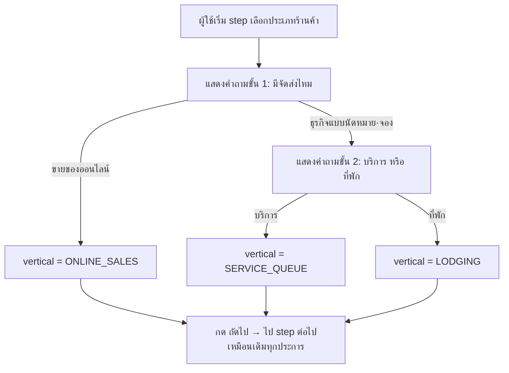
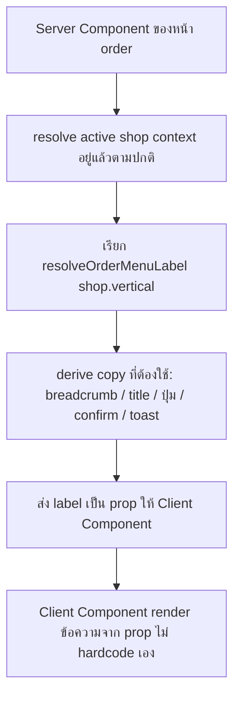
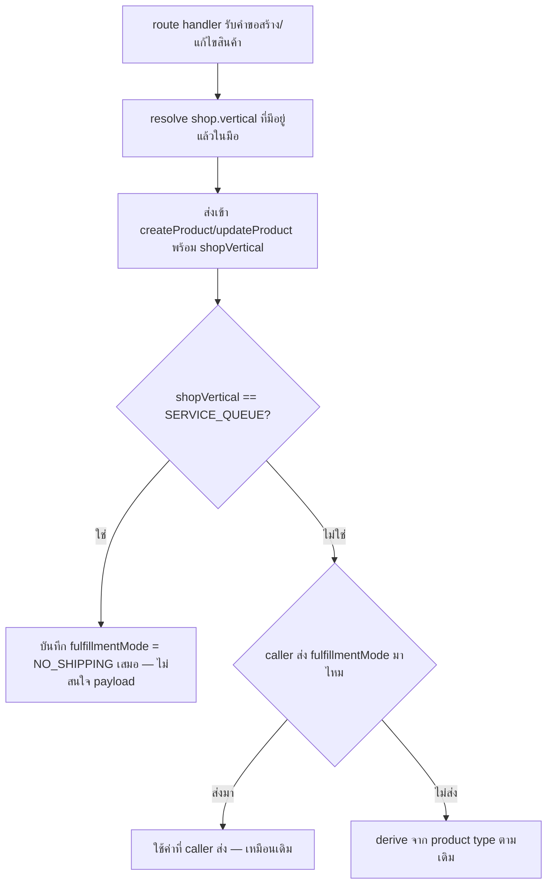

> **โมดูล:** M00030-BookingBusinessUXUnification
> **ประเภทเอกสาร:** Business Requirements Document (BRD) - NON-TECHNICAL
> **เวอร์ชัน:** 1.0
> **วันที่จัดทำ:** 2026-08-04
> **สถานะ:** Draft — decision D-1..D-5 ล็อกแล้ว รอ user review ก่อน implement
> **เจ้าของเอกสาร:** BA (ดู [[Feature-Docs-Ownership]])

# BRD: รวมประสบการณ์ธุรกิจแบบนัดหมาย·จอง (Business Requirements Document)

---

## 1. บทนำ

### 1.1 วัตถุประสงค์ของเอกสาร

เอกสารนี้มีวัตถุประสงค์เพื่อ:
1. อธิบายความต้องการเชิงหน้าที่ของการรวมประสบการณ์ผู้ใช้ (UX) ระหว่าง 3 ประเภทร้านค้า (`ONLINE_SALES`/`SERVICE_QUEUE`/`LODGING`) โดยไม่แตะโครงสร้างข้อมูลที่แยกกันอยู่แล้ว
2. กำหนดขอบเขตของ 3 ก้อนงาน — onboarding 2 ขั้น, wording SSOT ครบทุกจุด, fulfillmentMode lock — พร้อมรหัสอ้างอิง `FR-BKU-*`/`BR-BKU-*`
3. รวบรวมรายการจุด wording ที่ต้อง sync จริงพร้อม path:line ที่ตรวจสอบได้ ไม่ใช่คำว่า "ทุกจุด" ลอย ๆ
4. ยืนยันว่ากฎเดิมของ feature 00017/00024/00028 (BR-LODG-*/BR-RSV-*/BR-SBT-*) ข้อใดยังบังคับใช้อยู่โดยไม่เปลี่ยนแปลง

### 1.2 ขอบเขตของระบบ

**ระบบรวมประสบการณ์ธุรกิจแบบนัดหมาย·จอง** คือส่วนขยายชั้น UX ล้วน บนโครงสร้างข้อมูลที่มีอยู่แล้วของ feature 00017/00024/00028 — ไม่มีตาราง/enum/constraint ใหม่

**เข้าสู่ระบบ (Input):**
- การเลือกของผู้ใช้ระหว่าง onboarding (หมวดใหญ่ + หมวดย่อย)
- `shop.vertical` ที่มีอยู่แล้วในฐานข้อมูล (อ่านเท่านั้น ไม่เขียนค่าใหม่)
- คำขอสร้าง/แก้ไขสินค้าที่มี `fulfillmentMode`

**ออกจากระบบ (Output):**
- ค่า `Shop.vertical` เดิม (3 ค่า) ที่ยังบันทึกด้วยกลไกเดิมทั้งหมด
- Copy ที่ผู้ใช้เห็นตรงกับ vertical ของร้านทุกจุด
- `Product.fulfillmentMode` ที่ถูกล็อกเป็น `NO_SHIPPING` เสมอสำหรับร้าน `SERVICE_QUEUE`

**ระบบที่เกี่ยวข้อง:**
- feature 00028 — `Shop.vertical`, `ORDER_MENU_LABELS`/`resolveOrderMenuLabel` (SSOT ที่ต้องขยาย)
- feature 00024 — `ServiceResource`, `canUseAppointments`
- feature 00017 — `Room`, booking model
- `product.service.ts` — `createProduct`/`updateProduct`

### 1.3 กลุ่มผู้ใช้งาน

| กลุ่มผู้ใช้ | บทบาท | สิทธิ์การใช้งาน |
|-----------|--------|----------------|
| **ผู้สมัครใหม่ (Personal/Business)** | เลือกประเภทร้านค้าตอน onboarding | ผ่าน 2 ขั้นแทน flat 3-choice |
| **เจ้าของร้าน SERVICE_QUEUE/LODGING** | ใช้เมนูออเดอร์/บิลเข้าพักทุกวัน | เห็น copy ตรงกับ vertical ตัวเองทุกจุด |
| **เจ้าของร้าน ONLINE_SALES** | ใช้ระบบเดิม | เห็นคำว่า "คำสั่งซื้อ" ตรงกันทุกจุด แทนที่จะสลับกับ "ออเดอร์" เหมือนเดิม |
| **ผู้ดูแลแพลตฟอร์ม Deep** | ดูแลความถูกต้องของ enforcement | ตรวจสอบว่า fulfillmentMode lock ทำงานจริง |

---

## 2. ความต้องการหลัก (Functional Requirements)

### 2.1 Onboarding 2 ขั้น

#### FR-BKU-01: onboarding 2 ขั้นที่ Personal onboarding (`/onboarding`)

**User Story:**
> ในฐานะผู้สมัครใหม่ (บุคคลธรรมดา) ฉันต้องการเลือกประเภทร้านค้าเป็น 2 ขั้นตามลำดับความคิดจริง (มีจัดส่งไหม → ถ้าไม่มี เป็นบริการหรือที่พัก) แทนการเลือกจาก 3 การ์ดพร้อมกัน เพื่อไม่ให้เลือกผิดในสิ่งที่เปลี่ยนภายหลังไม่ได้

**Acceptance Criteria:**
- [ ] step `'vertical'` ของ `src/app/(paces)/seller/onboarding/page.tsx` แสดงคำถามขั้นที่ 1 ก่อน: 2 ตัวเลือก "ขายของออนไลน์" / "ธุรกิจแบบนัดหมาย·จอง"
- [ ] เลือก "ขายของออนไลน์" → `vertical` ตั้งเป็น `ONLINE_SALES` ทันที ไม่มีคำถามขั้นที่ 2
- [ ] เลือก "ธุรกิจแบบนัดหมาย·จอง" → เผยคำถามขั้นที่ 2 ในหน้าเดิม (ไม่เปลี่ยน step/URL): "บริการ" / "ที่พัก"
- [ ] เลือก "บริการ" → `vertical = SERVICE_QUEUE`; เลือก "ที่พัก" → `vertical = LODGING`
- [ ] ปุ่ม "ถัดไป" ของ step นี้ถูก disable จนกว่าจะได้ค่า vertical ที่สมบูรณ์ (เลือกหมวดใหญ่ "ขายของออนไลน์" = สมบูรณ์ทันที; เลือก "ธุรกิจแบบนัดหมาย·จอง" ต้องเลือกหมวดย่อยด้วยจึงสมบูรณ์)
- [ ] ค่าเริ่มต้นก่อนกดอะไรเลยยังเป็น `ONLINE_SALES` เหมือนเดิม (`DEFAULT_SHOP_VERTICAL`, BR-SBT-07 ไม่เปลี่ยน)
- [ ] step ถัดจากนี้ทั้งหมด (category chip → slug → address → product/queue/rooms) ทำงานเหมือนเดิมทุกประการ ไม่มี regression
- [ ] `POST /api/shops/update` ที่ยิงตอนจบ step นี้ยังส่ง body `{ vertical }` เหมือนเดิมทุกประการ (ไม่มีการเปลี่ยน API contract)

#### FR-BKU-02: onboarding 2 ขั้นที่ Business creation (`/business/create`)

**User Story:**
> ในฐานะผู้สมัครใหม่ (สร้างบัญชีธุรกิจ) ฉันต้องการเห็นคำถาม 2 ขั้นแบบเดียวกับ Personal onboarding เพื่อไม่ให้ประสบการณ์ต่างกันระหว่าง 2 ทางเข้าที่เจตนาเหมือนกัน

**Acceptance Criteria:**
- [ ] `CreateBusinessForm.tsx` (`src/app/(paces)/seller/(dashboard)/business/create/components/`, บริเวณ vertical selection ที่ `139-174`) ใช้ **component เดียวกัน** กับที่ใช้ใน Personal onboarding (ไม่ implement логика 2 ขั้นแยกซ้ำสองชุด)
- [ ] พฤติกรรม map ค่าเหมือนกันทุกประการกับ FR-BKU-01 (หมวดใหญ่/หมวดย่อย → 3 ค่าเดิม)
- [ ] `BusinessOnboardingWizard.tsx` (step ถัดจาก vertical selection) รับค่า `vertical` prop เหมือนเดิมทุกประการ ไม่มีการเปลี่ยน prop contract
- [ ] ค่า default, validation, immutable-after-slug เหมือนกับ FR-BKU-01 ทุกข้อ

### 2.2 Wording SSOT — order-lifecycle copy ทุกจุด

#### FR-BKU-03: ขยาย SSOT ให้ครอบคลุม copy นอกเหนือจากเมนู

**User Story:**
> ในฐานะเจ้าของร้าน SERVICE_QUEUE/LODGING ฉันต้องการเห็นคำที่ตรงกับธุรกิจของฉัน ("การเข้ารับบริการ"/"บิลเข้าพัก") ทุกจุดในแอป ไม่ใช่แค่ที่เมนูซ้าย เพื่อไม่ให้สับสนว่ากดถูกที่หรือเปล่า

**Acceptance Criteria — ทุกแถวคือจุดจริงที่ grep เจอ ณ 2026-08-04 พร้อม path:line:**

> 🛑 **เลขบรรทัดคือส่วนที่เน่าเร็วที่สุดของเอกสารนี้** — ระหว่างเขียน BRD อีก session push งาน "รื้อหัวออเดอร์" (`812bd2e6`) แตะไฟล์ชุดเดียวกันจนเลขเลื่อน (ปรับตาม `72412fa0` แล้ว) และเกิดจุดใหม่ที่ไม่มีในตารางตอนแรก. **ให้ค้นด้วย "ข้อความ" ในคอลัมน์ที่ 3 ไม่ใช่กระโดดไปตามเลขบรรทัด** และ re-grep ก่อนลงมือทุกครั้ง (ดู `UX-Copy.md` §4)

| # | ไฟล์:บรรทัด | copy ปัจจุบัน (hardcode) | ต้องเปลี่ยนเป็น |
|---|---|---|---|
| 1 | `orders/page.tsx:28` (`export const metadata`) | `title: 'ออเดอร์'` | dynamic title ตาม `resolveOrderMenuLabel(shop.vertical)` |
| 2 | `orders/page.tsx:228` | `<PageBreadcrumb title="คำสั่งซื้อ" ...>` | ใช้ label จาก SSOT |
| 3 | `orders/loading.tsx:19` | เหมือนบรรทัด 228 | ใช้ label จาก SSOT (skeleton ต้อง fetch/รับ vertical ได้ หรือ fallback ปลอดภัย) |
| 4 | `orders/[token]/page.tsx:50` (`metadata`) | `title: 'รายละเอียดคำสั่งซื้อ'` | ผันตาม SSOT: "รายละเอียด{label}" |
| 5 | `orders/[token]/page.tsx:175,178-179` | `h1 sr-only` + `PageBreadcrumb title/trail` = "รายละเอียดคำสั่งซื้อ"/"คำสั่งซื้อ" | ผันตาม SSOT |
| 6 | `orders/[token]/components/StatusHero.tsx:93,97,202,225` | "คำสั่งซื้อนี้จบสมบูรณ์แล้ว…", "คำสั่งซื้อนี้ถูกยกเลิกแล้ว…", "เลขคำสั่งซื้อ" | ผันตาม SSOT |
| 7 | `orders/[token]/components/CancelOrderButton.tsx:32,44,46,49,66` | confirm dialog "ยกเลิกคำสั่งซื้อนี้?", error/toast "ยกเลิกคำสั่งซื้อไม่สำเร็จ"/"ยกเลิกคำสั่งซื้อแล้ว", ปุ่ม "ยกเลิกคำสั่งซื้อ" | ผันตาม SSOT ทั้ง 4 string |
| 8 | `orders/[token]/components/OrderDetailClient.tsx:50,143,179,188,190,193` | ข้อความ SMS/confirm/toast เดียวกันซ้ำในไฟล์นี้ | ผันตาม SSOT |
| 9 | `orders/[token]/components/order-action-set.ts:50-51` | `editOrder.label: 'แก้ไขคำสั่งซื้อ'`, `cancelOrder.label: 'ยกเลิกคำสั่งซื้อ'` | ฟังก์ชันต้องรับ vertical/label เป็นพารามิเตอร์แล้วผัน label |
| 10 | `orders/components/OrdersList.tsx:425,435,441,485` | comment+ปุ่ม "สร้างออเดอร์", empty state action `'+ สร้างออเดอร์แรก'`, empty state title `'ไม่มีออเดอร์ในสถานะนี้'` | ผันตาม SSOT ทั้งปุ่มและ empty state |
| 11 | `orders/components/OrdersTable.tsx:452,456` | ปุ่ม "สร้างออเดอร์" (เดสก์ท็อป) | ผันตาม SSOT |
| 12 | `orders/new/components/SubmitStatusSheet.tsx:42,47,60` | "กำลังสร้างคำสั่งซื้อ", "สร้างออเดอร์ไม่สำเร็จ" | ผันตาม SSOT (ใช้คำกริยา "สร้าง{label}"/"{label}ไม่สำเร็จ") |
| 13 | `orders/new/components/OrderCreateForm.tsx:667,681` | error `'สร้างออเดอร์ไม่สำเร็จ กรุณาลองใหม่'`, success `'สร้างออเดอร์แล้ว แชร์ลิงก์ให้ลูกค้า'` | ผันตาม SSOT |
| 14 | `orders/[token]/components/OrderOverflowMenu.tsx:6` (comment อ้างคำ) | อ้างถึง "ยกเลิกคำสั่งซื้อ" | ตามหลัง #7/#9 อัตโนมัติ (ไม่ hardcode ในไฟล์นี้เอง อยู่แล้ว — ตรวจว่าไม่มี string ใหม่แอบเพิ่ม) |
| 15 | `orders/[token]/components/ShippingActivity.tsx:260` | `<h4 className="card-title">ประวัติคำสั่งซื้อ</h4>` | ผันตาม SSOT **เฉพาะหัวข้อการ์ดนี้เท่านั้น** (PRD §9.3 Q-2 ปิดแล้ว — user เคาะให้ผัน) — ส่วนอื่นในไฟล์นี้ (สถานะจัดส่ง/courier) **ห้ามแตะ** |

**Business Flow:**
1. ทุก Server Component ที่แสดง copy เหล่านี้ ต้องมี `shop.vertical` อยู่ในมือแล้ว (ทุกหน้า order ต้อง resolve active shop อยู่แล้วเพื่อ query orders — ไม่ใช่การ query ใหม่)
2. เรียก `resolveOrderMenuLabel(shop.vertical)` แล้ว derive ข้อความที่ต้องการ (ทั้งคำนามตรง ๆ และประโยคที่ผันคำกริยารอบ label)
3. ส่ง label/ข้อความที่ derive แล้วลงไปเป็น prop ให้ Client Component (pattern เดียวกับที่ `layout.tsx:155` → `SellerMobileHeader` ทำอยู่แล้ว)
4. Client Component (CancelOrderButton, OrderDetailClient, SubmitStatusSheet ฯลฯ) รับ label เป็น prop แทนการ hardcode string ในไฟล์ตัวเอง

**Example:**
```
ร้าน ONLINE_SALES:
  breadcrumb = "คำสั่งซื้อ" (เหมือนเดิม)
  ปุ่ม create = "สร้างคำสั่งซื้อ" (แก้จาก "สร้างออเดอร์" เดิม — clarify C-2 ตัดสินให้รวมเป็น
                 "คำสั่งซื้อ" คำเดียว เพราะ copy ของ ONLINE_SALES เองไม่นิ่งอยู่ก่อนแล้ว;
                 ตัวอย่างเดิมในบรรทัดนี้เคยขัดกับ §3.1 และ UX-Copy §3 — sync แล้ว 2026-08-05)
  confirm ยกเลิก = "ยกเลิกคำสั่งซื้อนี้?" (เหมือนเดิม)

ร้าน SERVICE_QUEUE:
  breadcrumb = "การเข้ารับบริการ"
  ปุ่ม create = "สร้างการเข้ารับบริการ"
  confirm ยกเลิก = "ยกเลิกการเข้ารับบริการนี้?"

ร้าน LODGING:
  breadcrumb = "บิลเข้าพัก"
  ปุ่ม create = "สร้างบิลเข้าพัก"
  confirm ยกเลิก = "ยกเลิกบิลเข้าพักนี้?"
```

### 2.3 fulfillmentMode lock สำหรับร้าน SERVICE_QUEUE

#### FR-BKU-04: ซ่อน/ล็อกช่องเลือก "ต้องจัดส่ง" ในฟอร์มสินค้าของร้าน SERVICE_QUEUE

**User Story:**
> ในฐานะเจ้าของร้าน SERVICE_QUEUE ฉันไม่ต้องการเห็นตัวเลือก "ต้องจัดส่ง" ในฟอร์มสินค้าเลย เพราะร้านฉันไม่มีทางจัดส่งได้จริงตามที่ประกาศไว้ตอนสมัคร

**Acceptance Criteria:**
- [ ] `ProductFormV2.tsx`/`ProductCapabilityCardV2.tsx` เมื่อ shop vertical = `SERVICE_QUEUE`: ไม่แสดง `<select {...register('fulfillmentMode')}>` เลย (ซ่อน ไม่ใช่ disable ที่ยังเห็น options)
- [ ] ฟอร์มยังส่งค่า `fulfillmentMode` แนบไปด้วย (ค่า `NO_SHIPPING` fixed) เพื่อให้ payload สอดคล้องกับ FR-BKU-05 แม้ไม่มี field ให้ผู้ใช้เลือก
- [ ] shop vertical อื่น (`ONLINE_SALES`/`LODGING`) เห็นฟอร์มเหมือนเดิมทุกประการ ไม่มีการเปลี่ยนแปลง

#### FR-BKU-05: บังคับ `fulfillmentMode=NO_SHIPPING` ที่ service layer เสมอสำหรับร้าน SERVICE_QUEUE

**User Story:**
> ในฐานะผู้ดูแลแพลตฟอร์ม ฉันต้องการให้ระบบปิดช่องทางที่ร้าน SERVICE_QUEUE จะตั้งสินค้าเป็นต้องจัดส่งได้ ไม่ว่าจะยิงผ่าน UI หรือ API ตรง เพื่อไม่ให้ order flow ของสินค้านั้นไปขอ shippingAddress ที่ร้านไม่มีทางส่งได้จริง

**Acceptance Criteria:**
- [ ] `createProduct` (`src/services/product.service.ts:200-258`): เมื่อ `data.shopVertical === "SERVICE_QUEUE"` → `fulfillmentMode` ที่บันทึกจริงเป็น `NO_SHIPPING` **เสมอ** แม้ `data.fulfillmentMode` จะถูกส่งมาเป็นค่าอื่น (เปลี่ยนจาก priority เดิมที่ caller override ชนะทุกกรณี เป็น priority ที่ vertical-lock ชนะก่อนสำหรับ vertical นี้เท่านั้น)
- [ ] `updateProduct` (`src/services/product.service.ts:302-321`): เพิ่มพารามิเตอร์ shop vertical (mirror `CreateProductInput.shopVertical`) และบังคับกฎเดียวกัน — ปัจจุบันไม่มี logic นี้เลยต้องเพิ่มใหม่ทั้งหมด ไม่ใช่แก้ของเดิม
- [ ] route handler ที่เรียก `createProduct`/`updateProduct` (`api/products/**`) ต้องส่ง `shop.vertical` ที่มีอยู่แล้วในมือ (จาก guard ที่ resolve shop ไปแล้ว) — **ห้าม service query Shop เองเพิ่ม** (mirror หลักการเดิมของ BR-SBT-22 ที่ระบุไว้แล้วว่า "ห้าม service query Shop เอง")
- [ ] shop vertical อื่น (`ONLINE_SALES`/`LODGING`) พฤติกรรม caller-override เดิมทำงานเหมือนเดิมทุกประการ ไม่มี regression
- [ ] integration test ครอบทั้ง 2 เคส: (ก) `createProduct` ถูกยิงพร้อม `fulfillmentMode: "SHIPPED"` บนร้าน `SERVICE_QUEUE` → ค่าที่บันทึกต้องเป็น `NO_SHIPPING` (ข) `updateProduct` แก้สินค้าเดิมของร้าน `SERVICE_QUEUE` พร้อม `fulfillmentMode: "SHIPPED"` → ค่าที่บันทึกต้องยังเป็น `NO_SHIPPING`

**Business Flow:**
1. เจ้าของร้าน SERVICE_QUEUE เปิดฟอร์มสินค้า (สร้างใหม่หรือแก้ไข) — ไม่เห็นช่องเลือก "ต้องจัดส่ง" (FR-BKU-04)
2. Submit → route handler resolve `shop.vertical` จาก context ที่มีอยู่แล้ว → ส่งเข้า `createProduct`/`updateProduct` พร้อม field นี้
3. Service layer เช็ค vertical ก่อนตัดสินใจ: ถ้า `SERVICE_QUEUE` → override เป็น `NO_SHIPPING` เสมอ ไม่สนใจค่าที่ payload ส่งมา
4. บันทึกสินค้า → `fulfillmentMode = NO_SHIPPING` การันตี 100%

**Example:**
```
ร้าน SERVICE_QUEUE ยิง POST /api/products { fulfillmentMode: "SHIPPED", ... }
→ บันทึกจริง: fulfillmentMode = "NO_SHIPPING" (ไม่ใช่ SHIPPED)

ร้าน SERVICE_QUEUE ยิง PATCH /api/products/:id { fulfillmentMode: "SHIPPED" }
→ บันทึกจริง: fulfillmentMode = "NO_SHIPPING" (ไม่ใช่ SHIPPED)

ร้าน ONLINE_SALES ยิง POST /api/products { fulfillmentMode: "NO_SHIPPING", type: "PHYSICAL" }
→ บันทึกจริง: fulfillmentMode = "NO_SHIPPING" (caller override ทำงานเหมือนเดิม — ไม่ล็อก)
```

---

## 3. Acceptance Criteria สรุป

### 3.1 Onboarding 2 ขั้น

**เมื่อระบบทำงานถูกต้อง:**
- ✅ ทั้ง Personal และ Business onboarding แสดงคำถาม 2 ขั้นแบบเดียวกัน จาก component เดียวกัน
- ✅ ค่าที่บันทึกจริงยังเป็น `ONLINE_SALES`/`SERVICE_QUEUE`/`LODGING` เหมือนเดิมทุกประการ ไม่มีค่าใหม่
- ✅ ค่า default ยังเป็น `ONLINE_SALES` เหมือนเดิม

### 3.2 Wording SSOT

**เมื่อระบบทำงานถูกต้อง:**
- ✅ ทุกจุดใน checklist §2.2 FR-BKU-03 อ่าน label จาก SSOT ไม่ hardcode
- ✅ ร้าน `ONLINE_SALES` เห็นคำว่า "คำสั่งซื้อ" ทุกจุด ไม่เหลือ "ออเดอร์" (C-2 — เกณฑ์ byte-equal เดิมถูกยกเลิก ดู `UX-Copy.md` §1)
- ✅ ไม่มี dialog/toast ที่บอกผลลัพธ์ซึ่งไม่เกิดขึ้นจริงกับ vertical นั้น (`UX-Copy.md` §5 D-1)
- ✅ `aria-label` ตรงกับข้อความที่แสดงจริงทุกจุดในเช็คลิสต์ (`UX-Copy.md` §5 D-2)
- ✅ ร้าน `SERVICE_QUEUE`/`LODGING` เห็น copy ที่ผันถูกต้องทุกจุดในเช็คลิสต์ รวมถึง breadcrumb, page title, ปุ่ม, confirm dialog, toast

### 3.3 fulfillmentMode lock

**เมื่อระบบทำงานถูกต้อง:**
- ✅ ฟอร์มสินค้าของร้าน `SERVICE_QUEUE` ไม่มีตัวเลือก "ต้องจัดส่ง" ให้เห็นเลย
- ✅ `createProduct`/`updateProduct` บังคับ `NO_SHIPPING` เสมอสำหรับร้าน `SERVICE_QUEUE` ไม่ว่า caller จะส่งอะไรมา
- ✅ ร้าน `ONLINE_SALES`/`LODGING` พฤติกรรมเดิมไม่เปลี่ยน

### 3.4 การไม่กระทบระบบเดิม (Zero-Regression)

**เมื่อระบบทำงานถูกต้อง:**
- ✅ ไม่มีการแตะ `Shop.vertical` enum/CHECK constraint/EXCLUDE constraint
- ✅ ไม่มีการแตะ `Room`/`ServiceResource` schema
- ✅ ไม่มีการแตะไฟล์ในโดเมน iShip/shipment tracking (ยกเว้นหัวข้อการ์ดทั่วไป 1 จุดที่รอ confirm)
- ✅ ไม่มี migration ใหม่ในงานนี้เลย (เป็น UX/enforcement layer ล้วน)

---

## 4. Business Flows (กระบวนการทำงาน)

### 4.1 Flow หลัก: onboarding 2 ขั้น



### 4.2 Flow: sync wording ตอน render หน้า order



### 4.3 Flow: fulfillmentMode lock



---

## 5. Use Case Scenarios (สถานการณ์การใช้งานจริง)

### Scenario 1: ผู้สมัคร Business ที่ไม่แน่ใจว่าธุรกิจตัวเองเป็นแบบไหน (Best Case)

**ผู้เกี่ยวข้อง:** ผู้สมัคร Business creation

**เงื่อนไขเริ่มต้น:**
- ยังไม่เคยสร้างร้านมาก่อน อยู่หน้า `/business/create`

**ขั้นตอน:**
1. เห็นคำถามขั้น 1 "ร้านของคุณขายของที่ต้องจัดส่งไหม" — เลือก "ธุรกิจแบบนัดหมาย·จอง" เพราะเป็นร้านนวด
2. เห็นคำถามขั้น 2 เผยขึ้นมาทันที "บริการ หรือ ที่พัก" — เลือก "บริการ"
3. กดถัดไป → `vertical = SERVICE_QUEUE` บันทึกเข้า flow onboarding ที่เหลือเหมือนเดิม

**ผลลัพธ์:**
- ร้านถูกสร้างด้วย `vertical = SERVICE_QUEUE` ถูกต้องตั้งแต่ครั้งแรก โดยไม่ต้องอ่านคำอธิบายเปรียบเทียบ 3 การ์ด

### Scenario 2: เจ้าของร้านคิวงานสร้าง "การเข้ารับบริการ" (โหมด wording sync)

**ผู้เกี่ยวข้อง:** เจ้าของร้าน SERVICE_QUEUE

**เงื่อนไขเริ่มต้น:**
- ร้านมี `vertical = SERVICE_QUEUE` อยู่แล้ว

**ขั้นตอน:**
1. เข้าเมนู "การเข้ารับบริการ" (sidebar ถูกอยู่แล้ว)
2. เห็น breadcrumb/page title = "การเข้ารับบริการ" (ไม่ใช่ "คำสั่งซื้อ"/"ออเดอร์" อีกต่อไป)
3. กดปุ่ม "สร้างการเข้ารับบริการ" (เดิม "สร้างออเดอร์") → กรอกข้อมูล → บันทึก
4. เห็น toast "สร้างการเข้ารับบริการแล้ว แชร์ลิงก์ให้ลูกค้า"
5. เข้าไปดูรายละเอียด เห็นหัว h1/breadcrumb = "รายละเอียดการเข้ารับบริการ"
6. กด ⋮ เห็นเมนู "แก้ไขการเข้ารับบริการ"/"ยกเลิกการเข้ารับบริการ" แทน "แก้ไขคำสั่งซื้อ"/"ยกเลิกคำสั่งซื้อ"

**ผลลัพธ์:**
- ทุกจุดตลอด flow ใช้คำว่า "การเข้ารับบริการ" สม่ำเสมอ ไม่มีจุดไหนหลุดกลับไปเป็น "คำสั่งซื้อ"/"ออเดอร์"

### Scenario 3: เจ้าของร้าน SERVICE_QUEUE พยายามตั้งสินค้าเป็น "ต้องจัดส่ง" ผ่าน API ตรง (Edge Case)

**ผู้เกี่ยวข้อง:** เจ้าของร้าน SERVICE_QUEUE (หรือคนที่ยิง API ตรงข้าม UI)

**เงื่อนไขเริ่มต้น:**
- ร้านมี `vertical = SERVICE_QUEUE`

**ขั้นตอน:**
1. ยิง `POST /api/products` ด้วย body ที่มี `fulfillmentMode: "SHIPPED"` ตรง ๆ (ข้าม UI ที่ซ่อน field นี้ไปแล้ว)
2. route handler resolve `shop.vertical = "SERVICE_QUEUE"` ส่งเข้า `createProduct`

**ผลลัพธ์:**
- สินค้าที่บันทึกได้ `fulfillmentMode = "NO_SHIPPING"` ไม่ใช่ `"SHIPPED"` ที่ส่งมา — ปิดช่องโหว่แม้ไม่ผ่าน UI

### Scenario 4: ร้านขายออนไลน์เดิม (Zero-Regression)

**ผู้เกี่ยวข้อง:** ร้าน `ONLINE_SALES`

**เงื่อนไขเริ่มต้น:**
- ร้านมีอยู่แล้วก่อน deploy งานนี้

**ขั้นตอน:**
1. เจ้าของร้านเข้าเมนู "คำสั่งซื้อ" เหมือนเดิม
2. สร้าง/แก้ไข/ยกเลิกออเดอร์ตามปกติ

**ผลลัพธ์:**
- ทุก copy ที่เห็น (breadcrumb, ปุ่ม, toast, confirm dialog) ใช้คำว่า "คำสั่งซื้อ" ตรงกันหมด — จุดที่เคยเขียน "ออเดอร์" (`<title>`, ปุ่มสร้าง, toast, empty state) เปลี่ยนมาใช้คำเดียวกับที่เมนู/breadcrumb ใช้อยู่ก่อนแล้ว ไม่มีคำใหม่ที่ผู้ใช้ไม่เคยเห็น

---

## 6. ความต้องการด้านคุณภาพ (Quality Requirements)

### 6.1 ความถูกต้องของข้อมูล
- ค่า `Shop.vertical` ที่บันทึกจริงต้องตรงกับ mapping 2 ขั้นเสมอ (หมวดใหญ่+หมวดย่อย → 1 ใน 3 ค่า) ไม่มีค่ากำกวม
- `Product.fulfillmentMode` ของร้าน `SERVICE_QUEUE` ต้องเป็น `NO_SHIPPING` 100% ไม่มีข้อยกเว้น ไม่ว่าทางเข้าไหน

### 6.2 ความรวดเร็ว
- คำถามขั้นที่ 2 ของ onboarding ต้องเผยขึ้นทันทีในหน้าเดิม ไม่โหลดหน้าใหม่ (client-side toggle)

### 6.3 ความน่าเชื่อถือ
- wording ที่ผันตาม vertical ต้องสม่ำเสมอทุกจุดในเช็คลิสต์ §2.2 — ไม่มีจุดใดหลุดกลับไปเป็นคำเดิมแบบสุ่ม

### 6.4 ความปลอดภัย
- การล็อก `fulfillmentMode` ต้องทำงานที่ server-side เสมอ ไม่พึ่งการซ่อน field ฝั่ง client เพียงอย่างเดียว (BR-LODG-03/BR-SBT-10 หลักการเดิม)

### 6.5 ความสะดวกในการใช้งาน (Usability)
- onboarding 2 ขั้นต้องเพิ่มคลิกสูงสุด 1 ครั้งจากเดิมสำหรับผู้ใช้ที่เลือกหมวด "ธุรกิจแบบนัดหมาย·จอง" (ไม่ใช่ 2 ครั้ง) — ผู้ใช้หมวด "ขายของออนไลน์" ไม่มีคลิกเพิ่มเลย

---

## 7. ข้อจำกัด (Constraints)

### 7.1 ข้อจำกัดทางธุรกิจ
- ไม่แตะ enum/constraint ของ `Shop.vertical` ที่มีอยู่แล้ว — งานนี้เป็น UX layer ล้วน
- ไม่แตะโดเมน iShip/shipment tracking ตาม D-1 (ยกเว้นหัวข้อการ์ดทั่วไป 1 จุดที่รอ confirm — ดู PRD §9.3 Q-2)
- ไม่รวม `Room`/`ServiceResource` เป็นโมเดลเดียว และไม่เพิ่ม date-range ให้ `ServiceResource`
- ไม่เปิดช่องเปลี่ยนประเภทร้านค้าภายหลัง (ยังคง immutable ตาม BR-LODG-30/BR-SBT-08)

### 7.2 ข้อจำกัดทางเทคนิค
- SSOT ต้องขยายจาก `ORDER_MENU_LABELS`/`resolveOrderMenuLabel` ที่มีอยู่แล้ว ห้ามสร้างชุดคำใหม่คู่ขนาน
- งานนี้แตะ UI หนัก (onboarding 2 หน้า + order-lifecycle copy ทั่วทั้งแอปฝั่ง seller) — ต้องผ่าน `safepay-ux` gate ก่อนแตะโค้ด (Hard Rule 8) และมี `UX-Design-Spec.md` เพิ่มนอก template ตาม Hard Rule 11
- Reviewer ต้อง grep ซ้ำ path:line ทั้งหมดในเช็คลิสต์ §2.2 ก่อนปิดงาน ไม่ใช่เชื่อ diff ที่ developer รายงานเฉย ๆ (บทเรียน `feedback_write_docs_from_code_not_memory`/retro 00028 P1)

---

## 8. กฎทางธุรกิจ (Business Rules)

### 8.1 ขอบเขตการเปิดใช้งาน (สืบทอดจาก 00017/00024/00028 — ไม่เปลี่ยน)

- **BR-BKU-01** งานนี้เป็นชั้น UX/enforcement เท่านั้น — `Shop.vertical` ยังมี 3 ค่าเดิม (`ONLINE_SALES`/`SERVICE_QUEUE`/`LODGING`) ไม่มีค่าใหม่ ไม่มีค่าลดลง (สืบทอด BR-SBT-06 ตรงตัว — **ไม่เปลี่ยน**)
- **BR-BKU-02** `vertical` ยังคงเปลี่ยนไม่ได้หลังตั้งครั้งแรก (สืบทอด BR-LODG-30/BR-SBT-08 ตรงตัว — **ไม่เปลี่ยน**)
- **BR-BKU-03** ค่าเริ่มต้นของร้านใหม่ที่ยังไม่เลือก = `ONLINE_SALES` (สืบทอด BR-SBT-07 ตรงตัว — **ไม่เปลี่ยน**)
- **BR-BKU-04** การซ่อนเมนู/field ไม่ใช่การควบคุมสิทธิ์ — ทุก enforcement ต้องมี server-side guard เสมอ (สืบทอด BR-LODG-03/BR-SBT-10 ตรงตัว — **ไม่เปลี่ยน**, และเป็นหลักการที่ FR-BKU-05 ใช้โดยตรง)

### 8.2 Onboarding taxonomy (ใหม่)

- **BR-BKU-05** คำถามเลือกประเภทร้านค้าตอน onboarding แบ่งเป็น 2 ขั้น: ขั้น 1 = หมวดใหญ่ ("ขายของออนไลน์" vs "ธุรกิจแบบนัดหมาย·จอง"), ขั้น 2 = หมวดย่อย ("บริการ" vs "ที่พัก") เฉพาะเมื่อเลือกหมวดใหญ่หลัง
- **BR-BKU-06** การ map ค่า: หมวดใหญ่ "ขายของออนไลน์" → `ONLINE_SALES` (ไม่มีขั้น 2); หมวดย่อย "บริการ" → `SERVICE_QUEUE`; หมวดย่อย "ที่พัก" → `LODGING`
- **BR-BKU-07** Personal onboarding (`/onboarding`) และ Business creation (`/business/create`) ต้องใช้ **component เดียวกัน** สำหรับ 2 ขั้นนี้ — ห้าม implement แยก 2 ชุดที่เสี่ยง drift
- **BR-BKU-08** ปุ่มถัดไปของ step นี้ต้องรอค่า vertical ที่สมบูรณ์ก่อนกดได้ (หมวดใหญ่แรกสมบูรณ์ทันที หมวดใหญ่หลังต้องมีหมวดย่อยด้วย)

### 8.3 Wording SSOT (ใหม่)

- **BR-BKU-09** ทุก order-lifecycle copy ที่ผู้ใช้เห็น (breadcrumb, page title/metadata, h1, ปุ่มสร้าง/แก้ไข/ยกเลิก, empty state, submit sheet, confirm dialog, toast, เมนู ⋮, หัวการ์ดทั่วไปในหน้ารายละเอียด) ต้องอ่านค่าจาก SSOT ตัวเดียว (`resolveOrderMenuLabel` หรือฟังก์ชันที่ derive จากมัน) — ห้าม hardcode string คำว่า "คำสั่งซื้อ"/"ออเดอร์" แยกไว้เองในไฟล์ใด ๆ
- **BR-BKU-10** SSOT ต้องประกาศ **4 ช่องต่อ vertical** (`noun` / `nounShort` / `createLabel` / `createLabelShort`) ไม่ใช่ noun เดี่ยวแล้วให้ call site ต่อสตริงเอง — ภาษาไทยผันไม่เท่ากันทุกช่อง ("เปิดบิลเข้าพัก" ไม่ใช่ "สร้างบิลเข้าพัก") และช่องแคบรับคำเต็มไม่ได้. ค่า fallback ของ vertical ที่ไม่รู้จัก = ชุดของ `ONLINE_SALES` (ดู `UX-Copy.md` §3)
- **BR-BKU-10b** `VERTICAL_CTA` (`CustomerPanel.tsx:124`) ห้ามประกาศคำของตัวเองอีกต่อไป — เหลือเฉพาะ `href`/`icon` แล้วอ่านคำจาก SSOT. เหตุผล: ปัจจุบันมี SSOT 2 ตัวที่ขัดกันเอง (LODGING = "บิลเข้าพัก" vs "การจอง"; SERVICE_QUEUE = "การเข้ารับบริการ" vs "คำสั่งซื้อ") โดยทั้งคู่มีคอมเมนต์อ้างว่าตัวเองเป็นแหล่งความจริงเดียว (`UX-Copy.md` §2)
- **BR-BKU-10c** ข้อความที่ระบุผลลัพธ์ของการกระทำ (confirm dialog, toast) ต้องเป็นจริงกับ vertical/เงื่อนไขนั้นจริง — ถ้าพิสูจน์ผลไม่ได้ให้ **ตัดประโยคนั้นทิ้ง ไม่ใช่เดาผลใหม่มาแทน** (`UX-Copy.md` §5 D-1)
- **BR-BKU-10d** `aria-label` / accessible name ต้อง derive จากช่องเดียวกับข้อความที่แสดงจริง ห้ามเขียนแยก (`UX-Copy.md` §5 D-2)
- **BR-BKU-11** copy ที่เฉพาะเจาะจงกับโดเมนพัสดุ (สถานะจัดส่ง/เลขพัสดุ/courier ภายใน `ShippingActivity.tsx`/`ShipmentPanel.tsx`/`IShipImportModal.tsx`) **ไม่อยู่ใต้ BR-BKU-09** — เป็นของ D-1 (ห้ามแตะ iShip/Command Center) ยกเว้นหัวข้อการ์ดทั่วไปที่ไม่ใช่เนื้อหาพัสดุ ซึ่ง **user เคาะแล้ว 2026-08-04 ว่าให้ผันตาม SSOT** — บรรทัดที่ผันใน `ShippingActivity.tsx` = 92, 94, 121, 235, 260 (ยืนยันกับ `72412fa0`) (PRD §9.3 Q-2 ปิดแล้ว)
- **BR-BKU-12** Server Component ที่ derive label ต้องใช้ `shop.vertical` ที่ resolve อยู่แล้วในหน้านั้น (ทุกหน้า order ต้อง query shop context อยู่แล้ว) — ห้ามเพิ่ม query ใหม่เพื่อจุดประสงค์นี้เพียงอย่างเดียว

### 8.4 fulfillmentMode lock (ใหม่ — ขยาย/เข้มขึ้นจาก BR-SBT-22)

- **BR-BKU-13** 🛑 ร้าน `SERVICE_QUEUE`: `Product.fulfillmentMode` ที่บันทึกจริงต้องเป็น `NO_SHIPPING` เสมอ ไม่ว่า caller (UI หรือ API ตรง) จะส่งค่าอื่นมาก็ตาม — เข้มกว่า **BR-SBT-22** เดิม (BR-SBT-22 เป็นแค่ default เมื่อ caller ไม่ส่งมา ซึ่งยังปล่อยให้ override ได้จริง) BR-BKU-13 ปิดช่องนั้น
- **BR-BKU-14** `createProduct` และ `updateProduct` ต้องบังคับกฎเดียวกัน — ก่อนหน้านี้มีแค่ `createProduct` ที่มี logic บางส่วน (`shopVertical` param) ส่วน `updateProduct` ไม่มีเลย ต้องเพิ่มพารามิเตอร์และ logic ให้ครบทั้งคู่
- **BR-BKU-15** shop vertical อื่น (`ONLINE_SALES`/`LODGING`) ยังใช้พฤติกรรม caller-override เดิมทั้งหมด — BR-BKU-13/14 มีผลเฉพาะ `SERVICE_QUEUE` เท่านั้น
- **BR-BKU-16** ฟอร์มสินค้าฝั่ง UI (`ProductFormV2.tsx`) ต้องซ่อนช่องเลือก `fulfillmentMode` สำหรับร้าน `SERVICE_QUEUE` ทั้งหมด — เป็นการป้องกันชั้น UX ที่ทำงานคู่กับ BR-BKU-13 (ไม่ใช่แทนกัน ตาม BR-BKU-04)
- **BR-BKU-17** route handler ที่เรียก `createProduct`/`updateProduct` ต้องส่ง `shopVertical` จาก context ที่ resolve ไว้แล้ว — ห้าม service layer query `Shop` เองเพิ่ม (สืบทอดหลักการเดียวกับที่ BR-SBT-22 วางไว้ — **ไม่เปลี่ยน**)

---

## 9. อภิธานศัพท์ (Glossary)

| คำศัพท์ | ความหมาย |
|---------|----------|
| **หมวดใหญ่** | ขั้นแรกของ onboarding — "ขายของออนไลน์" หรือ "ธุรกิจแบบนัดหมาย·จอง" |
| **หมวดย่อย** | ขั้นที่สอง เฉพาะหมวดใหญ่ "ธุรกิจแบบนัดหมาย·จอง" — "บริการ" หรือ "ที่พัก" |
| **SSOT wording** | `ORDER_MENU_LABELS`/`resolveOrderMenuLabel` ที่ขยายให้ครอบคลุม order-lifecycle copy ทั้งหมด |
| **order-lifecycle copy** | ข้อความทั่วไปเกี่ยวกับการสร้าง/แก้ไข/ยกเลิก/แสดงรายละเอียดของ "ใบสั่ง" — ต่างจาก copy เฉพาะโดเมนพัสดุ |
| **fulfillmentMode lock** | การบังคับค่า `NO_SHIPPING` ที่ทั้ง UI และ service layer สำหรับร้าน `SERVICE_QUEUE` |
| **ช่องคำ (copy slot)** | หนึ่งใน 4 ค่าที่ SSOT ประกาศต่อ vertical — `noun` / `nounShort` / `createLabel` / `createLabelShort` (`UX-Copy.md` §3) |

---

## 10. สรุป

เอกสาร BRD นี้อธิบายความต้องการหลักของ **ระบบรวมประสบการณ์ธุรกิจแบบนัดหมาย·จอง** แบบไม่ใช่เทคนิค

**จุดเด่นของระบบ:**
- ผู้สมัครใหม่ตัดสินใจประเภทร้านค้าถูกต้องตั้งแต่ครั้งแรกด้วยคำถาม 2 ขั้นที่ตรงกับวิธีคิดจริง แทนการ์ด 3 ตัวเลือกเท่ากันหมด
- ร้าน `SERVICE_QUEUE`/`LODGING` เห็น wording ที่ตรงกับธุรกิจตัวเองสม่ำเสมอทุกจุด ไม่ใช่แค่เมนู — ผ่าน SSOT เดียวที่ขยายจากของเดิม ไม่สร้างชุดคำคู่ขนาน
- ปิดช่องโหว่ที่ร้าน `SERVICE_QUEUE` เคยตั้งสินค้าเป็น "ต้องจัดส่ง" ได้ทั้งที่ประกาศไว้ว่าไม่มีจัดส่ง — ล็อกทั้ง UI และ service layer ตามหลักการเดิมของโครงการ (ซ่อนอย่างเดียวไม่พอ)
- ไม่แตะโครงสร้างข้อมูล/enum/guard ของ feature 00017/00024/00028 แม้แต่บรรทัดเดียว — เป็น UX/enforcement layer ล้วน ความเสี่ยง regression ต่ำ

**ผลลัพธ์ที่คาดหวัง:**
- ร้าน `ONLINE_SALES` เห็นคำเดียวคือ "คำสั่งซื้อ" ทั่วทั้ง flow ไม่มีคำว่า "ออเดอร์" หลงเหลือ
- 0 จุด hardcode wording ที่เหลือในเช็คลิสต์ §2.2 หลัง deploy
- 0 เคสที่ร้าน `SERVICE_QUEUE` ตั้งสินค้าเป็น `fulfillmentMode=SHIPPED` ได้สำเร็จ ไม่ว่าทางเข้าไหน

---

**หมายเหตุ:**
สำหรับความต้องการทางธุรกิจระดับภาพรวม/personas/KPI/open questions ดู [[PRD]] ของโมดูลนี้
สำหรับ technical specification (architecture/API/data/NFR) ดู SRS ของโมดูลนี้ (ยังไม่จัดทำ — ขั้นถัดไปหลัง PRD/BRD ผ่าน review)
