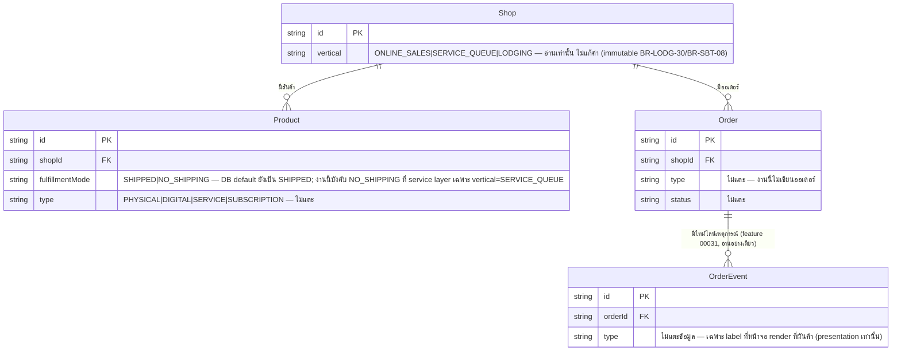

> **โมดูล:** M00030-BookingBusinessUXUnification
> **ประเภทเอกสาร:** Database Design (Backfill — เอกสารย้อนหลัง)
> **เวอร์ชัน:** 1.0
> **วันที่จัดทำ:** 2026-08-04 (backfill เขียน 2026-08-05)
> **สถานะ:** Implemented — ไม่มี migration ให้ apply
> **เจ้าของเอกสาร:** safepay-database (ดู [[Feature-Docs-Ownership]])

# DATABASE: รวมประสบการณ์ธุรกิจแบบนัดหมาย·จอง (Booking Business UX Unification)

---

## 1. Overview

🛑 **ฟีเจอร์นี้ไม่มี migration ใหม่ ไม่มีตารางใหม่ ไม่มีคอลัมน์ใหม่ ไม่มี constraint ใหม่แม้แต่ตัวเดียว**

feature 00030 เป็น **UX/enforcement layer ล้วน** บนโครงสร้างข้อมูลที่มีอยู่แล้วของ feature 00017 (Lodging Vertical), 00024 (Service Appointment Booking) และ 00028 (Shop Business Type) — งานทั้ง 3 ก้อน (onboarding 2 ขั้น, wording SSOT, `fulfillmentMode` lock) แก้ที่:

- **ชั้น presentation** (component/copy resolver ฝั่ง `src/lib/seller-menu.ts`, page/component ต่าง ๆ ใต้ `orders/**`) — อ่านค่าที่มีอยู่แล้วมา derive ข้อความ ไม่เขียนข้อมูลใหม่
- **ชั้น service layer** (`src/services/product.service.ts`) — เปลี่ยนลำดับความสำคัญของค่าที่ **มีอยู่แล้ว** (`fulfillmentMode`) จาก "caller ส่งมาชนะเสมอ" เป็น "vertical-lock ชนะก่อนเฉพาะ `SERVICE_QUEUE`" — เป็นตรรกะโค้ด ไม่ใช่การเปลี่ยนแปลงที่ฐานข้อมูล ค่า default ระดับ DB (`"SHIPPED"`) และ CHECK/constraint ที่มีอยู่เดิมไม่ถูกแตะ

เอกสารนี้มีไว้เพื่อบันทึกอย่างเป็นทางการว่า "ไม่มี schema change" (ตอบ Hard Rule 11 requirement ที่ทุก feature ต้องมี DATABASE.md แม้ไม่มีงาน DB จริง) และระบุ **ตาราง/ฟิลด์ที่มีอยู่แล้วซึ่งงานนี้พึ่งพา** เพื่อไม่ให้ dev รุ่นถัดไปเข้าใจผิดว่ามี field ใหม่ที่ต้อง migrate

- **เอกสารออกแบบต้นทาง:** [[PRD]] + [[BRD]] ของโมดูลนี้
- **Store ที่เกี่ยวข้อง:** PostgreSQL 16 (Supabase) ตัวเดียวกับทั้งระบบ — อ่านอย่างเดียว (read path) ผ่าน Prisma Client ที่มีอยู่แล้ว
- **Engine / Charset:** ไม่เปลี่ยนจากที่มีอยู่ (ไม่มีการสร้างวัตถุ DB ใหม่)

---

## 2. ERD

ไม่มีตาราง/ความสัมพันธ์ใหม่ — ERD ด้านล่างแสดงเฉพาะ **field ที่มีอยู่แล้วและถูกอ่าน/ตัดสินใจ logic โดยงานนี้** (ไม่ใช่โครงสร้างที่ถูกสร้างใหม่) เพื่อให้เห็นภาพว่า enforcement ผูกกับ field ไหนบ้าง



---

## 3. Tables

ไม่มีตารางใหม่ — หัวข้อนี้ระบุ **field ที่มีอยู่แล้ว** ซึ่งงานนี้พึ่งพาโดยตรง (อ่านค่า/ปรับ priority ของ logic เท่านั้น ไม่แก้โครงสร้าง)

### 3.1 `Shop.vertical` (มีอยู่แล้ว — feature 00017/00028)

| ฟิลด์ | ชนิด | Default | หมายเหตุสำหรับ 00030 |
|-------|------|---------|----------------------|
| `vertical` | `String` | `"ONLINE_SALES"` | อ่านอย่างเดียวเพื่อ (1) resolve wording จาก `resolveOrderVocab(vertical)` และ (2) ตัดสินใจว่าจะซ่อน field `fulfillmentMode` ในฟอร์มสินค้า/บังคับ `NO_SHIPPING` ที่ service layer หรือไม่ — **ไม่มีการเขียนค่านี้ใหม่จากงานนี้เลย** ยังคง immutable ตามเดิม (BR-LODG-30/BR-SBT-08) |

🛑 **CHECK constraint `Shop_vertical_check`** (จำกัดค่าไว้ 3 ค่า: `ONLINE_SALES`/`SERVICE_QUEUE`/`LODGING`) เป็น **unmanaged SQL** จาก migration ของ feature 00028 — Prisma DSL ประกาศไม่ได้ ไม่ปรากฏใน `schema.prisma` แต่มีอยู่จริงในฐาน งานนี้ไม่แตะ ไม่เพิ่ม ไม่ลด

### 3.2 `Product.fulfillmentMode` (มีอยู่แล้ว — spec 2026-05-10, ขยาย default โดย feature 00028)

```prisma
// จาก prisma/schema.prisma:565 — ยืนยันแล้ว ไม่ใช่จากความจำ
fulfillmentMode   String    @default("SHIPPED")
```

| ประเด็น | ค่าจริงที่ตรวจแล้ว |
|--------|---------------------|
| **DB default** | `"SHIPPED"` — **ไม่เปลี่ยนโดยงานนี้** (ยังเป็นค่าเดิมของทุก vertical ที่ระดับ DB) |
| **ที่มาของ `"NO_SHIPPING"` สำหรับร้าน `SERVICE_QUEUE`** | ไม่ใช่ DB default — เกิดจาก **service layer override** ใน `createProduct`/`updateProduct` (`src/services/product.service.ts`) เท่านั้น |
| **การเปลี่ยนแปลงของ 00030** | ยกระดับ logic เดิม (feature 00028 BR-SBT-22 เป็นแค่ *fallback เมื่อ caller ไม่ส่งค่ามา*) → เป็น **override เสมอ** สำหรับ `shopVertical === "SERVICE_QUEUE"` ไม่ว่า caller จะส่งค่าอะไรมาก็ตาม (BR-BKU-13/14) — เป็นการแก้ **ลำดับความสำคัญของเงื่อนไขในโค้ด TypeScript** ไม่ใช่การแก้ schema/constraint |
| **`Order.fulfillmentMode`** (`prisma/schema.prisma:630`, default `"SHIPPED"` เช่นกัน) | **ไม่เกี่ยวกับงานนี้** — ฟิลด์นี้เป็นของ `Order` (snapshot ตอนสร้างออเดอร์) คนละฟิลด์กับ `Product.fulfillmentMode` ที่งานนี้ล็อก งานนี้ไม่แตะ `Order.fulfillmentMode` |

**ไม่มี CHECK constraint ใหม่** — การบังคับ `NO_SHIPPING` ทำที่ service layer 100% (BR-BKU-13) เหตุผลตรงกับที่ BRD ระบุ (§6.4): "การล็อกต้องทำงานที่ server-side เสมอ ไม่พึ่งการซ่อน field ฝั่ง client" — แต่ "server-side" ในที่นี้คือ **application code** ไม่ใช่ database constraint เพราะ business rule นี้ต้อง cross-reference `Shop.vertical` (คนละตาราง) ซึ่งเป็นรูปแบบเดียวกับ BR-RSV-01/02 ของ feature 00024 (ดู DATABASE 00024 §7: "service layer — ไม่มี DB constraint เพราะอยู่คนละตาราง")

### 3.3 `OrderEvent` (มีอยู่แล้ว — feature 00031, อ้างอิงเท่านั้น)

งานนี้ **ไม่แตะข้อมูลหรือโครงสร้างของ `OrderEvent` เลย** — จุดที่เกี่ยวข้องมีแค่ label ฝั่ง presentation: หัวการ์ด "ประวัติ{noun}" และ label ต่อแถว (`resolveOrderEventLabel` ผันเฉพาะ 3 event lifecycle) — `OrderEvent.type` (9 ค่าคงที่ + CHECK constraint `OrderEvent_type_check` unmanaged SQL) และค่า `meta` ที่ event แต่ละแถวเก็บ **ไม่ถูกแตะ ไม่ถูกอ่านเปลี่ยนความหมาย** โดยงานนี้เลย

---

## 4. Indexes

**ไม่มี index ใหม่** — pattern การ query ของงานนี้ (`resolveOrderVocab(shop.vertical)` ที่เรียกในทุกหน้า order) เป็นการอ่าน field เดียวจากแถว `Shop` ที่หน้าเหล่านั้น query อยู่แล้วเพื่อ resolve active shop context (ไม่ใช่ query ใหม่แยกต่างหาก ตาม BR-BKU-12) — index ที่มีอยู่แล้วเพียงพอ:

| Table | Index ที่มีอยู่แล้ว | เกี่ยวข้องกับ 00030 อย่างไร |
|-------|---------------------|------------------------------|
| `Shop` | `@@index([vertical])` (feature 00017) | ไม่ได้ใช้ตรง ๆ โดย 00030 (อ่าน `vertical` จากแถวเดียวที่ resolve ไว้แล้ว ไม่ query ตาม vertical เป็นชุด) — คงไว้เพราะ feature อื่นยังใช้อยู่ |
| `Product` | index เดิมบน `shopId` composite | ไม่เกี่ยวกับ `fulfillmentMode` — ไม่มี index ใหม่บนคอลัมน์นี้เพราะไม่ใช่ query filter/sort ของงานนี้ |

---

## 5. Migration Plan

### 5.1 สถานะ: ไม่มี migration

🛑 **ไม่มีไฟล์ migration ใหม่ในโฟลเดอร์ `prisma/migrations/` สำหรับ feature 00030** — ทุก migration ที่เกี่ยวข้องกับ `Shop.vertical`/`Product.fulfillmentMode`/`OrderEvent` เป็นของ feature 00017/00024/00028/00031 ที่ apply ไปก่อนหน้านี้แล้วทั้งหมด

### 5.2 Rollback

ไม่มีสิ่งที่ต้อง rollback ระดับฐานข้อมูล — การถอย feature นี้ (ถ้าจำเป็น) ทำได้ด้วยการ revert commit ของโค้ด (component/service logic) เท่านั้น ไม่กระทบข้อมูลที่มีอยู่แม้แถวเดียว เพราะไม่มีการเขียน/แก้ค่าใหม่ในฐานข้อมูลจากงานนี้เลย

### 5.3 ผลกระทบ (Impact)

- **Downtime:** ไม่มี — ไม่มี DDL ให้รัน
- **Data migration/backfill:** ไม่มี — ไม่มีการเปลี่ยนความหมายของค่าที่มีอยู่ (ต่างจาก feature 00028 ที่ backfill `GENERAL → ONLINE_SALES`)
- **Backward compatibility:** สมบูรณ์ 100% เพราะ output ที่บันทึกจริง (`Shop.vertical` 3 ค่าเดิม, `Product.fulfillmentMode` 2 ค่าเดิม) ไม่เปลี่ยนรูปแบบ — เปลี่ยนแค่ *เมื่อไรจะใช้ค่าไหน* ในโค้ด service layer

---

## 6. Retention / ข้อควรระวัง

| หัวข้อ | รายละเอียด |
|--------|-----------|
| **ห้าม `prisma db pull`** | ไม่เปลี่ยนจากคำเตือนเดิมของ feature 00028/00024/00017/00008/00031 — ฐานข้อมูลมี unmanaged SQL สะสมหลายชั้น (CHECK `Shop_vertical_check`, CHECK `OrderEvent_type_check`, EXCLUDE constraint การจองซ้อนของ 00017/00024 ฯลฯ) ที่ introspection มองไม่เห็นแล้วจะสร้าง migration ที่ DROP ทิ้ง งานนี้ไม่เพิ่มความเสี่ยงใหม่ แต่ก็ไม่ลดความเสี่ยงเดิมเช่นกัน — ยังต้องระวังเหมือนเดิมทุกประการ |
| **ห้าม `prisma migrate dev`** | ยังคงห้ามตาม convention เดิม (Hard Rule 14) — ไม่เกี่ยวกับงานนี้เพราะไม่มี migration ให้รันอยู่แล้ว |
| **`Product.fulfillmentMode` มีผู้ตัดสินใจที่ไม่ใช่ DB** | ค่าจริงที่บันทึกมาจาก priority chain ใน service layer (vertical-lock ก่อน → caller override → derive จาก type) — ผู้พัฒนาที่อ่าน schema เพียงอย่างเดียวจะเห็นแค่ `@default("SHIPPED")` และเข้าใจผิดว่าเป็นค่าที่ควบคุมพฤติกรรมจริง ต้องอ่าน `product.service.ts` ควบคู่เสมอ |
| **PII** | ไม่มีตาราง/ฟิลด์ใหม่ที่เก็บ PII — งานนี้ไม่แตะ PII เลย |
| **Performance** | ไม่มีผลกระทบ — ไม่มี query pattern ใหม่, ไม่มีตารางโต |

---

## 7. Traceability

ตาราง map business rule (BRD) กลับไปยัง **ตำแหน่งบังคับจริง** เพื่อความชัดเจนว่าไม่มีจุดใดตกไปอยู่ที่ database โดยไม่ตั้งใจ:

| Business Rule | บังคับที่ไหน | มี DB object ใหม่ไหม |
|---------------|-------------|----------------------|
| BR-BKU-01..04 (onboarding taxonomy, ค่า vertical เดิม, immutable) | UI component (`VerticalTaxonomyPicker` shared) + service layer เดิม (`POST /api/shops/update`) | ไม่มี — อ่าน/เขียน `Shop.vertical` ด้วยกลไกเดิมทั้งหมด |
| BR-BKU-09..12 (wording SSOT) | `src/lib/seller-menu.ts` (`ORDER_VOCAB`/`resolveOrderVocab`) + Server Component ที่ derive prop ให้ Client Component | ไม่มี — เป็น pure function บนค่าที่อ่านจาก `Shop.vertical` ที่มีอยู่แล้วในมือ |
| BR-BKU-13..17 (fulfillmentMode lock) | `src/services/product.service.ts` (`createProduct`/`updateProduct`) + `ProductFormV2.tsx` (UI ซ่อน field) | ไม่มี — override logic ในโค้ด TypeScript เท่านั้น ไม่มี CHECK constraint ใหม่บน `Product.fulfillmentMode` |

---

## 8. สรุป (Summary)

- **ฟีเจอร์นี้ไม่มี migration ใหม่ ไม่มีตาราง/คอลัมน์/index/constraint ใหม่แม้แต่รายการเดียว** — เป็น UX/enforcement layer ล้วนบนโครงสร้างที่มีอยู่แล้วของ feature 00017/00024/00028/00031
- **Dependency หลัก:** `Shop.vertical` (String + CHECK unmanaged SQL จาก 00028, immutable, อ่านอย่างเดียว) และ `Product.fulfillmentMode` (String, DB default `"SHIPPED"` ไม่เปลี่ยน, ค่า `"NO_SHIPPING"` ของร้าน `SERVICE_QUEUE` เกิดจาก service layer override ไม่ใช่ DB default)
- **ข้อควรระวังที่ยังต้องยึดต่อไป:** ห้าม `prisma db pull`/`migrate dev` เหมือนทุก feature ก่อนหน้า เพราะฐานข้อมูลสะสม unmanaged SQL หลายชั้นที่ introspection มองไม่เห็น (ไม่ใช่ความเสี่ยงใหม่จากงานนี้ — แค่ยืนยันซ้ำว่ายังมีผลบังคับใช้)
- ไม่มี Open Questions ด้าน database — งานนี้ไม่มีขอบเขตให้ตัดสินใจด้าน data model เลย
