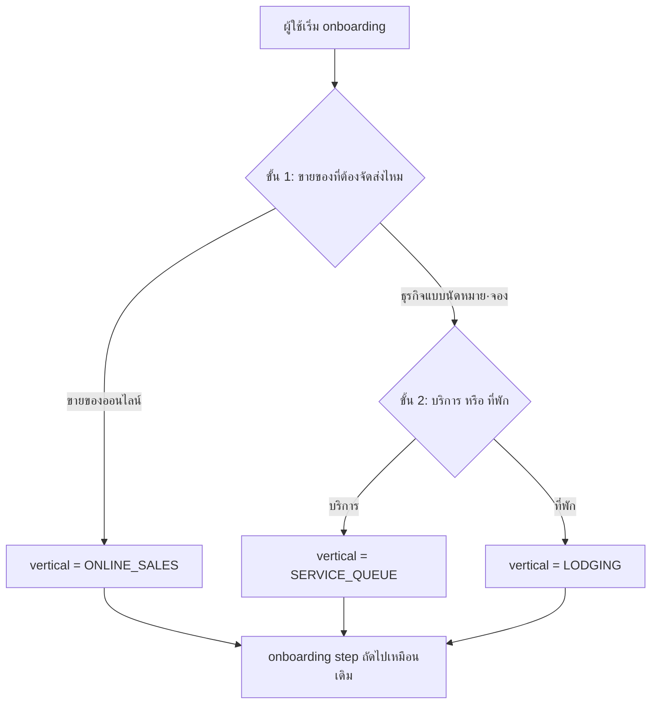
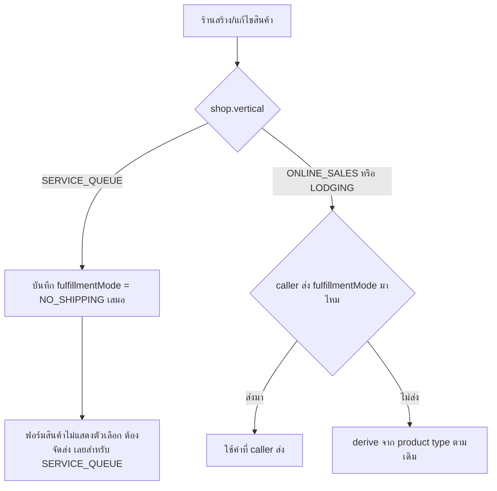

> **โมดูล:** M00030-BookingBusinessUXUnification
> **ประเภทเอกสาร:** Product Requirements Document (PRD)
> **เวอร์ชัน:** 1.0
> **วันที่จัดทำ:** 2026-08-04
> **สถานะ:** Draft — decision D-1..D-5 ล็อกแล้วโดย user (ดู §10.2), รอ implement
> **เจ้าของเอกสาร:** BA + PO + PM (ดู [[Feature-Docs-Ownership]])

# PRD: รวมประสบการณ์ธุรกิจแบบนัดหมาย·จอง (Booking Business UX Unification)

---

## Executive Summary

Deep มี 3 ประเภทร้านค้า (`Shop.vertical`: `ONLINE_SALES`/`SERVICE_QUEUE`/`LODGING`) มาตั้งแต่ feature 00028 — แต่ `SERVICE_QUEUE` (คิวงาน, feature 00024) กับ `LODGING` (บ้านพัก, feature 00017) เป็นระบบที่ต่างกันเชิงโครงสร้างจริง 9 จุด (หน่วยจอง, ช่วงเวลา vs คืน, มัดจำเต็มรูปกับแค่แสดงยอด ฯลฯ) จึง**ไม่ควรรวมที่ชั้นข้อมูล** — งานนี้แก้ปัญหาคนละชั้น: **ผู้ใช้ที่เพิ่งเริ่มสมัครไม่รู้ว่าธุรกิจตัวเองควรเป็น "สินค้าและบริการ" หรือ "บ้านพัก"** เพราะหน้าจอปัจจุบันโยนตัวเลือกทั้ง 3 แบบให้ตัดสินใจพร้อมกันในจอเดียว (flat 3-choice ที่ `src/app/(paces)/seller/onboarding/page.tsx:243-269` และ `CreateBusinessForm.tsx:139-174`) ทั้งที่คำถามจริงของผู้ใช้คือ 2 ขั้น: "ฉันขายของหรือรับนัด" ก่อน แล้วค่อย "ถ้ารับนัด เป็นบริการหรือที่พัก"

ปัญหาที่สองคือ **wording ไม่ตามประเภทร้าน** — ร้าน `SERVICE_QUEUE` ที่ sidebar/มือถือ header เห็นป้าย "การเข้ารับบริการ" ถูกต้องแล้ว (SSOT `ORDER_MENU_LABELS` ใน `src/lib/seller-menu.ts:353-357` ถูกเพิ่มเมื่อ 2026-08-04) แต่พอกดเข้าไปในหน้าเดียวกันกลับเห็นคำว่า **"คำสั่งซื้อ"/"ออเดอร์"** สลับกันไปมาไม่มีแบบแผน — page `<title>` ใช้คำว่า "ออเดอร์" (`orders/page.tsx:28`), breadcrumb hardcode "คำสั่งซื้อ" (`orders/page.tsx:228`), ปุ่มสร้างใช้ "สร้างออเดอร์" (`OrdersList.tsx:441`), toast/confirm ใช้ "ยกเลิกคำสั่งซื้อ" (`CancelOrderButton.tsx`) — เป็น hardcoded string กว่า 30 จุดที่ไม่มีทางรู้จัก vertical ของร้านเลย

ปัญหาที่สามคือช่องโหว่ที่ D-5 ระบุตรงจุด: ร้าน `SERVICE_QUEUE` (ประกาศชัดว่า "ไม่มีการจัดส่ง") ยังตั้งสินค้าเป็น `fulfillmentMode=SHIPPED` ได้จากฟอร์มสินค้า (`ProductFormV2.tsx` มี `<select {...register('fulfillmentMode')}>` ไม่ถูกล็อกตาม vertical เลย) และที่ service layer `createProduct` แม้จะมี default `NO_SHIPPING` ให้ร้าน `SERVICE_QUEUE` แล้ว (feature 00028 BR-SBT-22) แต่เป็นแค่ **fallback เมื่อ caller ไม่ส่งค่ามา** — ถ้า caller (ฟอร์มนี้เอง) ส่ง `fulfillmentMode: "SHIPPED"` มาตรง ๆ มันชนะเสมอ (`product.service.ts:238-245` ลำดับความสำคัญข้อ 1) และ `updateProduct` ไม่มี fallback นี้เลยด้วยซ้ำ (`product.service.ts:302-321`)

ฟีเจอร์นี้แก้ทั้ง 3 จุดโดยไม่แตะ schema/enum/guard ที่มีอยู่แล้วแม้แต่บรรทัดเดียว: (1) onboarding ทั้ง 2 จุด (Personal + Business) เปลี่ยนจาก flat 3-choice เป็น 2 ขั้น, (2) ขยาย `ORDER_MENU_LABELS` เป็น SSOT กลางของทุก order-lifecycle copy ที่ผู้ใช้เห็น ไม่ใช่แค่ป้ายเมนู, (3) ปิดช่องว่าง override ของ `fulfillmentMode` ให้ร้าน `SERVICE_QUEUE` ล็อก `NO_SHIPPING` จริงทั้ง UI และ service layer

---

## 1. Business Goals & KPIs

### 1.1 เป้าหมายทางธุรกิจ

| เป้าหมาย | รายละเอียด |
|----------|-----------|
| **ผู้สมัครใหม่เลือกประเภทร้านถูกต้องตั้งแต่ครั้งแรก** | ลดอัตราที่ผู้ใช้เลือกผิดแล้วต้องมาขอสร้างร้านใหม่ (ประเภทเปลี่ยนไม่ได้ตาม BR-LODG-30/BR-SBT-08) ด้วยการถามเป็น 2 คำถามที่ตรงกับวิธีคิดจริง แทนโยน 3 ตัวเลือกให้ตัดสินพร้อมกัน |
| **ร้านรับนัดคิว/บ้านพักเห็นภาษาที่ตรงกับธุรกิจตัวเองตลอดทั้ง flow ไม่ใช่แค่ที่เมนู** | wording sync ระหว่างเมนู (ทำแล้ว) กับหน้าจอจริง (ยังไม่ทำ) ปิดช่องว่างที่ผู้ใช้เห็น "การเข้ารับบริการ" ที่ sidebar แต่เห็น "ออเดอร์"/"คำสั่งซื้อ" ในหน้าเดียวกัน |
| **ปิดช่องโหว่ที่ร้านรับนัดคิวขายสินค้าที่ต้องจัดส่งได้ทั้งที่ประกาศไว้ว่าไม่มีจัดส่ง** | ล็อกที่ทั้ง UI (ฟอร์มสินค้า) และ service layer (`createProduct`/`updateProduct`) ให้ตรงกับ business rule ที่มีอยู่แล้ว (BR-SBT-22) แต่ enforcement ยังไม่สมบูรณ์ |
| **ไม่แตะโครงสร้างข้อมูล/enum/guard ที่มีอยู่แล้ว** | งานนี้เป็น UX layer ล้วน — `Shop.vertical`, CHECK constraint, EXCLUDE constraint (booking overlap), Room/ServiceResource schema ต้องเหมือนเดิมทุกประการหลัง deploy |

### 1.2 ตัวชี้วัดความสำเร็จ (KPIs)

| KPI | คำอธิบาย | เป้าหมาย |
|-----|----------|---------|
| **ความสอดคล้องของ wording ต่อ vertical** | จำนวนจุด UI ที่แสดง order-lifecycle copy hardcode ไม่ผ่าน SSOT (นับจาก checklist §10.3 ของ BRD) | 0 จุดที่เหลือ hardcode หลัง deploy (ยกเว้นจุดที่ประกาศ Out of Scope) |
| **คำเดียวต่อหนึ่งความหมาย (ONLINE_SALES)** | จุดที่ยังใช้คำว่า "ออเดอร์" กับร้าน `ONLINE_SALES` | 0 — รวมเป็น "คำสั่งซื้อ" ทั้งหมดตาม C-2 (`UX-Copy.md` §1). **แก้จากเกณฑ์ byte-equal เดิม** เพราะ clarify พบว่า copy ของ `ONLINE_SALES` เองไม่นิ่งอยู่ก่อนแล้ว (`<title>`="ออเดอร์" · breadcrumb="คำสั่งซื้อ" · ปุ่ม="สร้างออเดอร์") การล็อกให้เหมือนเดิมทุกตัวอักษรคือการล็อกความไม่นิ่งนั้นไว้ |
| **ช่องโหว่ fulfillmentMode override สำหรับ SERVICE_QUEUE** | สินค้าที่ตั้ง `fulfillmentMode=SHIPPED` ได้ในร้าน `SERVICE_QUEUE` ผ่าน UI หรือ API ตรง | 0 หลัง deploy (ทั้ง create และ update) |
| **onboarding 2-tier completion** | ผู้สมัครใหม่ผ่าน onboarding ครบด้วยเส้นทาง 2 ขั้นใหม่ไม่ค้าง (ทั้ง Personal และ Business) | 100% ของผู้สมัครใหม่หลัง deploy ไม่มี error/dead-end |

### 1.3 ขอบเขตการส่งมอบ

งานนี้เป็น phase เดียว ไม่แบ่ง phase — 3 ก้อนงาน (onboarding, wording SSOT, fulfillment lock) เป็น UX/enforcement layer ที่ independent กัน สามารถ ship พร้อมกันหรือแยก commit ได้ แต่ acceptance รวมเป็นชุดเดียวของ feature นี้

---

## 2. User Personas (กลุ่มผู้ใช้งาน)

### 2.1 ผู้สมัครใหม่ที่ยังไม่แน่ใจประเภทธุรกิจตัวเอง

**ข้อมูลพื้นฐาน:**
- คนที่กำลังผ่าน Personal onboarding (`/onboarding`) หรือ Business creation (`/business/create`) ครั้งแรก
- ไม่คุ้นกับศัพท์ "vertical"/"ประเภทร้านค้า" — คิดจากสิ่งที่ตัวเองทำจริง

**เป้าหมาย:**
- เลือกประเภทที่ตรงกับธุรกิจตัวเองได้โดยไม่ต้องอ่านคำอธิบายยาว เพราะเปลี่ยนทีหลังไม่ได้ (BR-LODG-30/BR-SBT-08)

**ความต้องการ:**
- คำถามที่ตรงกับวิธีคิดตามลำดับ: "ฉันขายของที่ต้องส่งไหม" ก่อน แล้วค่อย "ถ้าไม่ส่ง ลูกค้ามาหาฉันแบบบริการหรือมาพักค้าง"

**จุดปวด (Pain Points):**
- จอปัจจุบันโชว์ 3 การ์ดเท่ากันหมด (ขายออนไลน์/สินค้าและบริการ/บ้านพัก) — คนที่ทำร้านตกแต่งไฟหน้ารถหรือร้านนวดต้องเดาว่า "สินค้าและบริการ" หมายถึงร้านตัวเองไหม เพราะคำนี้ก็ฟังดูเหมือนขายของได้เหมือนกัน

### 2.2 เจ้าของร้านคิวงาน (SERVICE_QUEUE) ที่ใช้งานทุกวัน

**ข้อมูลพื้นฐาน:**
- ร้านที่เลือก `SERVICE_QUEUE` แล้ว (เช่น ร้านตกแต่งไฟหน้ารถ ร้านนวด) ใช้เมนู "คิวงาน" + หน้าออเดอร์ (การเข้ารับบริการ) ทุกวัน

**เป้าหมาย:**
- เห็นคำว่า "การเข้ารับบริการ" สม่ำเสมอทุกจุด ไม่ใช่แค่ sidebar

**ความต้องการ:**
- กดสร้าง → เห็น "สร้างการเข้ารับบริการ" ไม่ใช่ "สร้างออเดอร์"
- กดยกเลิก → เห็น "ยกเลิกการเข้ารับบริการนี้?" ไม่ใช่ "ยกเลิกคำสั่งซื้อนี้?"

**จุดปวด (Pain Points):**
- เมนูซ้ายบอก "การเข้ารับบริการ" แต่พอกดเข้าไปในหน้าเดียวกันกลับเจอ "คำสั่งซื้อ"/"ออเดอร์" สลับกันไปมา ทำให้ไม่มั่นใจว่ากดถูกเมนูหรือเปล่า

### 2.3 เจ้าของร้าน SERVICE_QUEUE ที่ตั้งสินค้า/แพ็กเกจ

**ข้อมูลพื้นฐาน:**
- ร้านคิวงานที่ขายแพ็กเกจ/คอร์สเสริม (สินค้าที่ไม่ต้องจัดส่ง) ตามที่ BR-SBT ระบุไว้แล้วว่าเปิดเมนูสินค้าให้แต่ปิดจัดส่ง

**เป้าหมาย:**
- ตั้งสินค้าได้โดยไม่ต้องกังวลว่าจะไปตั้งค่า "ต้องจัดส่ง" ผิดโดยไม่ตั้งใจ

**ความต้องการ:**
- ฟอร์มสินค้าไม่ควรมีตัวเลือก "ต้องจัดส่ง" ให้เลือกเลยตั้งแต่แรก เพราะร้านตัวเองไม่มีทางจัดส่งได้จริง

**จุดปวด (Pain Points):**
- ถ้าเผลอกดเลือก "ต้องจัดส่ง" (ตัวเลือกยังอยู่ในฟอร์มปัจจุบัน) ออเดอร์ของสินค้านั้นจะเข้า flow ที่ขอ shippingAddress ทั้งที่ร้านไม่มีทางส่งของได้จริง

### 2.4 ผู้ขายออนไลน์เดิม (persona ที่ต้องไม่ถูกกระทบ)

**ข้อมูลพื้นฐาน:**
- ร้าน `ONLINE_SALES` ทั้งหมดที่ใช้งานอยู่วันนี้ (ค่า default ของระบบ)

**เป้าหมาย:**
- ไม่เห็นความเปลี่ยนแปลงใด ๆ — คำว่า "คำสั่งซื้อ"/"ออเดอร์" ที่ตัวเองคุ้นเคยต้องเหมือนเดิมทุกจุด

**ความต้องการ:**
- SSOT ที่ขยายต้องคง fallback เป็นค่าเดิมเป๊ะสำหรับ `ONLINE_SALES`

**จุดปวด (Pain Points):**
- กลัวว่าการรวม wording ให้ vertical อื่นจะทำให้คำที่ตัวเองคุ้นเคยเปลี่ยนไปด้วย

---

## 3. Business Requirements

### 3.1 Onboarding 2 ขั้น แทน flat 3-choice

**ความต้องการ:**
- หน้าเลือกประเภทร้านค้าตอน onboarding (ทั้ง Personal `/onboarding` และ Business `/business/create`) เปลี่ยนจากการ์ด 3 ตัวเลือกเรียงเท่ากัน เป็น 2 ขั้น: ขั้นแรกเลือกหมวดใหญ่ **"ขายของออนไลน์"** vs **"ธุรกิจแบบนัดหมาย·จอง"** ขั้นที่สอง (เฉพาะเมื่อเลือกหมวดหลัง) เลือกย่อยระหว่าง **"บริการ"** กับ **"ที่พัก"**
- ค่าที่บันทึกจริงยังเป็น `ONLINE_SALES`/`SERVICE_QUEUE`/`LODGING` เหมือนเดิมทุกประการ — 2 ขั้นเป็นแค่การจัด layout คำถามใหม่ ไม่ใช่ค่าใหม่

**Business Rules:**
- หมวดใหญ่ "ขายของออนไลน์" กด map ตรงเข้า `ONLINE_SALES` ทันที ไม่มีขั้นที่สอง
- หมวดใหญ่ "ธุรกิจแบบนัดหมาย·จอง" ต้องเลือกขั้นที่สองก่อนจึงกดถัดไปได้ — เลือก "บริการ" → `SERVICE_QUEUE`, เลือก "ที่พัก" → `LODGING`
- ค่า default ก่อนกดอะไรเลยยังเป็น `ONLINE_SALES` เหมือนเดิม (BR-SBT-07 ไม่เปลี่ยน)
- ทุก validation/immutable-after-slug เดิม (BR-LODG-30/BR-SBT-08) ใช้เหมือนเดิมทุกประการ — 2 ขั้นเป็นแค่ UI ไม่เปิดช่องเปลี่ยนใจหลัง submit

**เหตุผล:**
- ผู้ใช้จริงคิดเป็นลำดับ ไม่ใช่พร้อมกัน — คำถามว่า "มีการจัดส่งไหม" ตัดสินได้เร็วกว่าคำถามว่า "อันไหนใน 3 อันนี้ตรงกับฉัน"
- เพราะเปลี่ยนประเภทภายหลังไม่ได้ (ทั้งระบบ) การช่วยให้ตัดสินใจถูกตั้งแต่ต้นมีมูลค่าธุรกิจสูงกว่าการลดจำนวนคลิก

### 3.2 คำที่ผู้ใช้เห็นต้องผันตามประเภทร้านทุกจุด ไม่ใช่แค่เมนู

**ความต้องการ:**
- ขยาย SSOT ที่มีอยู่แล้ว (`ORDER_MENU_LABELS`/`resolveOrderMenuLabel` ใน `src/lib/seller-menu.ts`) ให้ครอบคลุม order-lifecycle copy ทุกจุดที่ผู้ใช้เห็น: page title/metadata, breadcrumb, h1, ปุ่มสร้าง/แก้ไข/ยกเลิก, empty state, submit-loading sheet, confirm dialog, toast สำเร็จ/ล้มเหลว, เมนู ⋮ ในหน้ารายละเอียด, หัวการ์ดในหน้ารายละเอียด
- คำที่ผันตาม vertical: **"คำสั่งซื้อ"** (ONLINE_SALES) / **"การเข้ารับบริการ"** (SERVICE_QUEUE) / **"บิลเข้าพัก"** (LODGING) — user เคาะ 2026-08-04 หลัง `/impeccable clarify`; ชุดคำเต็ม 4 ช่อง (`noun`/`nounShort`/`createLabel`/`createLabelShort`) และข้อความรายจุดอยู่ที่ **[[UX-Copy]] §3–§4**
- 🛑 **SSOT ของคำมีอยู่ 2 ที่ที่ขัดกันเอง ต้องยุบก่อน** — `ORDER_MENU_LABELS` (`seller-menu.ts:353`) กับ `VERTICAL_CTA` (`CustomerPanel.tsx:124`) ต่างประกาศคำของตัวเองและไม่ตรงกัน (LODGING = "บิลเข้าพัก" vs "การจอง"; SERVICE_QUEUE = "การเข้ารับบริการ" vs "คำสั่งซื้อ"). `VERTICAL_CTA` ต้องเหลือแค่ `href`/`icon` แล้วอ่านคำจาก SSOT (ดู [[UX-Copy]] §2)

**Business Rules:**
- ทุกจุดที่แสดงคำนี้ต้องอ่านค่าจาก `resolveOrderMenuLabel(vertical)` (หรือ derive จากมันโดยผัน grammar เช่น "สร้าง{label}"/"ยกเลิก{label}นี้?") — ห้าม hardcode string คำว่า "คำสั่งซื้อ"/"ออเดอร์" แยกไว้เอง
- Server Component ที่ต้องใช้ label (breadcrumb, metadata, h1) ต้อง fetch `shop.vertical` มาก่อน resolve label เหมือนที่ `layout.tsx:155` ทำอยู่แล้วสำหรับ sidebar/mobile header — ไม่ใช่การ fetch ใหม่ที่ไม่มีอยู่ก่อน (RSC ต้อง query shop context อยู่แล้วในทุกหน้า order)
- ขอบเขตคำที่ผัน = **order-lifecycle copy ทั่วไปที่ไม่ผูกกับโดเมนพัสดุ** เท่านั้น — copy ที่เฉพาะเจาะจงกับสถานะจัดส่ง/เลขพัสดุ/courier (เช่นภายใน `ShippingActivity.tsx`/`ShipmentPanel.tsx`/`IShipImportModal.tsx`) **ไม่แตะ** เพราะเป็นของ D-1 (ห้ามแตะ iShip/Command Center) — ยกเว้นหัวข้อการ์ดกลาง ๆ ที่ไม่ใช่เนื้อหาพัสดุ (เช่นหัวการ์ด "ประวัติคำสั่งซื้อ" ที่ `ShippingActivity.tsx:260`) ให้ผันได้เพราะเป็นแค่ label ของ event timeline ทั่วไป ไม่ใช่ข้อมูลพัสดุ
- ร้าน `ONLINE_SALES` เปลี่ยนได้ทางเดียวคือ **รวมคำว่า "ออเดอร์" เข้าเป็น "คำสั่งซื้อ"** (C-2) — ห้ามเปลี่ยนไปเป็นคำอื่นที่ user ไม่ได้เคาะ. เกณฑ์ byte-equal เดิมถูกยกเลิกเพราะมันล็อกความไม่นิ่งที่มีอยู่ก่อนแล้วเอาไว้
- 🛑 **ข้อความที่บอกผลลัพธ์ต้องเป็นจริงกับ vertical นั้นจริง ๆ** — กล่องยืนยันยกเลิกปัจจุบันสัญญาว่า "สินค้าจะถูกคืนเข้าสต็อก" กับทุกร้าน ทั้งที่ `restockFromCancelledOrder` คืนสต็อกเฉพาะ `OrderItem` ที่ `stockDeducted != null` ซึ่งเกิดจาก Inventory Add-on เท่านั้น (ดู [[UX-Copy]] §5 D-1)

**เหตุผล:**
- ผู้ใช้ประเมินความน่าเชื่อถือของระบบจากความสม่ำเสมอ — เมนูบอกอย่างหนึ่งแต่หน้าจอบอกอีกอย่างทำให้ดูเหมือนระบบทำงานผิดพลาด ทั้งที่จริงแค่ยังไม่ sync กัน
- SSOT ตัวเดียวป้องกันปัญหาเดิมที่เกิดแล้ว (บทเรียน `feedback_sibling_surface_parity`/`feedback_entity_names_from_schema_not_memory`) คือแก้จุดเดียวแล้วจุดอื่นลืมตาม

### 3.3 ล็อก fulfillmentMode ของร้าน SERVICE_QUEUE ให้เป็น NO_SHIPPING เสมอ ไม่มีทาง override

**ความต้องการ:**
- ฟอร์มสร้าง/แก้ไขสินค้า (`ProductFormV2.tsx`) ของร้าน `SERVICE_QUEUE` ต้องไม่แสดงตัวเลือก "ต้องจัดส่ง" ให้เลือกเลย — ซ่อนหรือ disable ช่องนี้ไปเลย ไม่ใช่แค่ตั้งเป็นค่าเริ่มต้น
- Service layer (`createProduct` และ `updateProduct`) ต้องบังคับ `fulfillmentMode = NO_SHIPPING` สำหรับร้าน `SERVICE_QUEUE` แม้ caller จะส่งค่าอื่นมาก็ตาม (เดิม `createProduct` เป็นแค่ fallback เมื่อ caller ไม่ส่งมา — ต้องยกระดับเป็นการ override เสมอ; `updateProduct` ไม่มี logic นี้เลยต้องเพิ่มใหม่)

**Business Rules:**
- ร้าน `SERVICE_QUEUE`: `fulfillmentMode` ที่บันทึกจริงต้องเป็น `NO_SHIPPING` เสมอ ไม่ว่า client จะส่งอะไรมา — priority เดิม ("caller ส่งมาเองชนะเสมอ") ต้องกลับด้าน**เฉพาะ vertical นี้**เท่านั้น
- ร้าน `ONLINE_SALES`/`LODGING`: พฤติกรรมเดิมทั้งหมด (caller override ยังทำงานตามเดิม) — ห้ามกระทบ
- `updateProduct` ต้องรับพารามิเตอร์ shop vertical (mirror ของ `createProduct` ที่มี `shopVertical` อยู่แล้ว) เพื่อบังคับกฎเดียวกันตอนแก้ไขสินค้าเดิม

**เหตุผล:**
- D-5 ล็อกไว้ชัดว่าร้าน `SERVICE_QUEUE` ขายสินค้าที่ต้องจัดส่งไม่ได้ — การมี default ที่ยัง override ได้จริง ๆ แล้วไม่ได้ปิดช่องโหว่ตามที่ business rule ตั้งใจ (เจตนาของ BR-SBT-22 คือ "ล็อก" ไม่ใช่ "แนะนำ")
- ถ้าไม่ปิดที่ service layer ด้วย การซ่อน field ใน UI อย่างเดียวเป็นแค่ความสะดวก ไม่ใช่การควบคุม — ใครยิง API ตรงยังทำได้เหมือนเดิม (หลักการเดียวกับ BR-LODG-03/BR-SBT-10 ที่บังคับใช้ทั้งระบบแล้วว่า "ซ่อนเมนูไม่ใช่การควบคุมสิทธิ์")

---

## 4. Business Rules & Constraints

### 4.1 กฎทางธุรกิจหลัก

| กฎ | คำอธิบาย |
|----|----------|
| **ไม่แตะข้อมูล/enum/guard ที่มีอยู่แล้ว** | `Shop.vertical` 3 ค่า, CHECK constraint, EXCLUDE constraint การจองซ้อนของ 00017, gate ของ 00024/00028 ต้องเหมือนเดิมทุกประการ |
| **onboarding 2 ขั้น = UX เท่านั้น** | ค่าที่บันทึกจริงยังเป็น 3 ค่าเดิม ไม่มีค่าใหม่ ไม่มีตารางใหม่ |
| **SSOT เดียวของ wording** | ทุกจุดที่แสดง order-lifecycle label ต้องอ่านจาก SSOT ตัวเดียว (`resolveOrderMenuLabel`/ส่วนขยาย) ห้าม hardcode ซ้ำ |
| **ONLINE_SALES เปลี่ยนได้ทางเดียว: "ออเดอร์" → "คำสั่งซื้อ"** | นอกจากการรวมคำนี้ (C-2) ห้ามเปลี่ยนคำอื่นของร้านขายออนไลน์ |
| **คำที่บอกผลลัพธ์ต้องเป็นจริง** | ห้ามให้ dialog/toast สัญญาสิ่งที่ระบบไม่ได้ทำกับ vertical นั้น และห้ามเดาผลใหม่มาแทนผลที่ยังพิสูจน์ไม่ได้ |
| **SERVICE_QUEUE ล็อก NO_SHIPPING ทั้ง UI และ service layer** | ปิดทั้ง 2 ชั้น ไม่ใช่แค่ชั้นใดชั้นหนึ่ง (สอดคล้องหลักการเดิมของโครงการ) |

### 4.2 ข้อจำกัดทางธุรกิจ

| ข้อจำกัด | รายละเอียด |
|---------|-----------|
| **ไม่ยุบ Room กับ ServiceResource เข้าด้วยกัน** | โครงสร้างต่างกันจริง (date-range vs slot capacity) — คงแยกกันตามที่ Discovery วิเคราะห์ไว้ |
| **ไม่เพิ่ม date-range ให้ ServiceResource** | คิวงานยังเป็นระบบ slot/capacity ตามเดิม — D-3 ยืนยันบ้านพักยังจองข้ามคืนแบบเดิมทุกประการ ไม่มีการยกเครื่องโมเดลใด ๆ |
| **ไม่แตะ iShip/ONLINE_SALES/Command Center สถานะพัสดุ** | D-1 ล็อกไว้เด็ดขาด — ทุกจุดที่เกี่ยวกับ shipment tracking/courier/tracking number ไม่อยู่ในขอบเขตนี้ |
| **ไม่มีมัดจำเต็มรูปสำหรับ SERVICE_QUEUE** | ยังเป็นแค่แสดงยอด (FR-RSV-12 เดิม) — ไม่ใช่ scope ของงานนี้ |

### 4.3 เคสที่ระบบต้องปฏิเสธ/ป้องกัน

- คำขอสร้าง/แก้ไขสินค้าที่ระบุ `fulfillmentMode=SHIPPED` (หรือค่าอื่นที่ไม่ใช่ `NO_SHIPPING`) จากร้าน `SERVICE_QUEUE` — ต้องถูก override เป็น `NO_SHIPPING` เสมอที่ service layer ไม่ว่า UI จะส่งอะไรมา
- onboarding step 2 (บริการ/ที่พัก) ที่ยังไม่ถูกเลือก แต่ผู้ใช้พยายามกดถัดไปจากหมวดใหญ่ "ธุรกิจแบบนัดหมาย·จอง" — ต้องบล็อกจนกว่าจะเลือกขั้นที่สอง

---

## 5. Out of Scope (นอกขอบเขต)

| หัวข้อ | คำอธิบาย |
|--------|----------|
| **ยุบ `Shop.vertical` เป็นค่าอื่น/ลดจำนวนค่า** | คง 3 ค่าเดิม (`ONLINE_SALES`/`SERVICE_QUEUE`/`LODGING`) ตาม D-2 — เปลี่ยนแค่วิธีถามตอน onboarding เท่านั้น ไม่แตะ enum/DB constraint |
| **แตะ iShip integration / Command Center สถานะพัสดุ / โดเมน ONLINE_SALES** | D-1 ล็อกเด็ดขาด — ทุก endpoint/component ที่เป็นของ shipment tracking ไม่อยู่ในขอบเขต |
| **รวม `Room` กับ `ServiceResource` เป็นโมเดลเดียว** | Discovery ยืนยันแล้วว่าโครงสร้างต่างกันจริง 9 จุด — คงแยกกันตลอดไปในเวอร์ชันนี้ |
| **เพิ่ม date-range (checkIn/checkOut) ให้ `ServiceResource`** | คิวงานยังเป็น slot/capacity model ตาม feature 00024 เดิม ไม่แปลงเป็นโมเดลการจองข้ามวันแบบบ้านพัก |
| **มัดจำเต็มรูป (แนบสลิป+ยืนยันรับเงิน) สำหรับ SERVICE_QUEUE** | ยังเป็นแค่แสดงยอดตาม FR-RSV-12 — งานแยกต่างหากถ้าต้องการในอนาคต |
| **เปลี่ยน flow เปลี่ยนประเภทร้านค้าภายหลัง** | ยังคง immutable ตาม BR-LODG-30/BR-SBT-08 — งานนี้ไม่เปิดช่องเปลี่ยนใจหลัง submit |
| **แก้ wording ของโดเมนพัสดุ (courier/tracking/สถานะจัดส่ง)** | อยู่ใต้ D-1 — `ShippingActivity`/`ShipmentPanel`/`IShipImportModal` ไม่แตะเนื้อหาพัสดุ (เว้นหัวข้อทั่วไปที่ไม่ใช่เนื้อหาพัสดุตาม §3.2) |
| **สร้าง SSOT wording ใหม่แยกจาก `ORDER_MENU_LABELS`** | ต้องขยายของเดิม ไม่สร้างชุดคำคู่ขนานที่จะ drift กันในอนาคต |

---

## 6. Risks & Mitigation (ความเสี่ยงและแนวทางแก้ไข)

### 6.1 ความเสี่ยงทางธุรกิจ

| ความเสี่ยง | ผลกระทบ | ระดับความรุนแรง | แนวทางแก้ไข |
|-----------|---------|-----------------|-------------|
| **onboarding 2 ขั้นเพิ่มจำนวนคลิกให้คนที่รู้ประเภทอยู่แล้ว** | ผู้สมัครหมวด "ขายของออนไลน์" (ส่วนใหญ่ของผู้ใช้วันนี้) เจอขั้นตอนเพิ่มโดยไม่จำเป็น | ต่ำ | หมวด "ขายของออนไลน์" ไม่มีขั้นที่สอง (map ตรง) — เพิ่มแค่ 1 คลิกจากเดิม ไม่ใช่ 2 |
| **ผู้ขายออนไลน์เดิมเห็นคำเปลี่ยนจาก "ออเดอร์" เป็น "คำสั่งซื้อ"** | คนที่ใช้ทุกวันอาจสะดุดตาในช่วงแรก | ต่ำ | ทั้งสองคำหมายถึงสิ่งเดียวกันและ "คำสั่งซื้อ" เป็นคำที่ปรากฏถี่กว่าอยู่แล้ว (เมนู/breadcrumb/แท็บแชท) — ผู้ใช้จึงเห็นคำที่คุ้นอยู่แล้วมากขึ้น ไม่ใช่คำใหม่. ไม่ต้องประกาศล่วงหน้า |

### 6.2 ความเสี่ยงทางเทคนิค

| ความเสี่ยง | ผลกระทบ | แนวทางแก้ไข |
|-----------|---------|-------------|
| **แก้ wording ไม่ครบทุกจุด เหลือ hardcode กระจาย** | ร้าน SERVICE_QUEUE/LODGING ยังเห็นคำผิด vertical ในบางหน้า | ใช้ checklist ที่มี path:line จริงจาก grep (BRD §10.3) เป็น acceptance ไม่ใช่คำว่า "ทุกจุด" ลอย ๆ — Reviewer ต้อง grep ซ้ำก่อนปิดงาน (บทเรียน `feedback_enum_removal_scan_whole_repo`) |
| **`fulfillmentMode` override ปิดไม่สนิท เพราะ `updateProduct` ไม่รู้จัก shop vertical เลย** | ร้าน SERVICE_QUEUE ยังเปลี่ยนสินค้าเป็น SHIPPED ได้ผ่านการแก้ไข แม้สร้างใหม่ถูกต้องแล้ว | ต้องส่ง `shopVertical` เข้า `updateProduct` เหมือน `createProduct` — caller (route handler) มี shop object อยู่แล้วในมือ ไม่ต้อง query ซ้ำ |
| **onboarding page.tsx (Personal) กับ BusinessOnboardingWizard/CreateBusinessForm (Business) เป็นคนละไฟล์ที่ไม่ได้ share component ของหน้าเลือก vertical** | แก้ที่หนึ่งแล้วอีกที่ไม่ sync (2-tier ไม่ตรงกัน) | ต้อง implement เป็น shared component ตัวเดียว (เช่น `VerticalTaxonomyPicker`) ที่ทั้ง 2 flow import ใช้ร่วมกัน ไม่ implement แยก 2 ชุด |

---

## 7. Glossary (อภิธานศัพท์)

| คำศัพท์ | ความหมาย |
|---------|----------|
| **หมวดใหญ่ (Category)** | ขั้นแรกของ onboarding 2 ขั้น — "ขายของออนไลน์" หรือ "ธุรกิจแบบนัดหมาย·จอง" |
| **หมวดย่อย (Sub-category)** | ขั้นที่สอง เฉพาะเมื่อเลือก "ธุรกิจแบบนัดหมาย·จอง" — "บริการ" (map SERVICE_QUEUE) หรือ "ที่พัก" (map LODGING) |
| **SSOT wording** | `ORDER_MENU_LABELS`/`resolveOrderMenuLabel` ใน `src/lib/seller-menu.ts` ที่ขยายให้ครอบคลุม order-lifecycle copy ทั้งหมด ไม่ใช่แค่เมนู |
| **order-lifecycle copy** | ข้อความที่พูดถึง "การสั่ง/บันทึกงาน" แบบทั่วไป (สร้าง/แก้ไข/ยกเลิก/หัวข้อ/breadcrumb/toast) ต่างจาก copy เฉพาะโดเมนพัสดุ |
| **fulfillmentMode lock** | การบังคับค่า `NO_SHIPPING` ที่ทั้ง UI (ซ่อน field) และ service layer (override เสมอ) สำหรับร้าน SERVICE_QUEUE |

---

## 8. Success Metrics (ตัวชี้วัดความสำเร็จ)

| ตัวชี้วัด | ค่าที่คาดหวัง | วิธีวัด |
|----------|---------------|--------|
| **"ออเดอร์" หายไปจากจอผู้ใช้** | 0 จุด | `rg "ออเดอร์" "src/app/(paces)/seller/"` เหลือเฉพาะในคอมเมนต์ ([[UX-Copy]] §8) |
| **คำที่บอกผลลัพธ์เป็นจริง** | 0 dialog/toast ที่สัญญาสิ่งที่ vertical นั้นทำไม่ได้ | กดยกเลิกจริงบนร้านที่ไม่มี Inventory Add-on แล้วต้องไม่เห็นคำว่า "คืนเข้าสต็อก" ([[UX-Copy]] §5 D-1) |
| **SSOT coverage** | ทุกจุดในเช็คลิสต์ §10.3 อ่านค่าจาก SSOT | grep hardcode string "คำสั่งซื้อ"/"ออเดอร์" ในไฟล์ที่ระบุ = 0 (ยกเว้นภายใน SSOT เอง + copy พัสดุที่ยกเว้นไว้) |
| **fulfillmentMode override ปิดสนิท** | ยิง API สร้าง/แก้ไขสินค้าด้วย `fulfillmentMode=SHIPPED` บนร้าน SERVICE_QUEUE แล้วค่าที่บันทึกยังเป็น NO_SHIPPING | integration test ทั้ง create/update |
| **onboarding 2 ขั้น ใช้ component เดียวกันทั้ง 2 flow** | Personal + Business share ตัวเลือกเดียวกัน | ตรวจ import path ว่าเป็น component เดียวกันจริง |

---

## 9. Dependencies & Assumptions

### 9.1 สิ่งที่ต้องพึ่งพา (Dependencies)

| ระบบ/ส่วนประกอบ | ความสัมพันธ์ |
|-----------------|-------------|
| **feature 00028 (Shop Business Type)** | เจ้าของ `Shop.vertical` 3 ค่า และ `ORDER_MENU_LABELS`/`resolveOrderMenuLabel` ที่งานนี้ขยายต่อ — ไม่แตะ enum/guard เดิม |
| **feature 00024 (Service Appointment Booking)** | เจ้าของ `ServiceResource`/`canUseAppointments` — งานนี้แค่ปิดช่องโหว่ `fulfillmentMode` ของสินค้าที่ร้าน SERVICE_QUEUE สร้าง ไม่แตะ appointment domain เอง |
| **feature 00017 (Lodging Vertical)** | เจ้าของ `Room`/booking model — คงเดิมทั้งหมดตาม D-3 |
| **Personal seller onboarding (`/onboarding`) และ Business creation (`/business/create`)** | จุดที่ต้องแก้ 2-tier selection ทั้งคู่ |
| **`src/lib/seller-menu.ts` (`ORDER_MENU_LABELS`)** | SSOT ที่ต้องขยาย — ไม่สร้างใหม่ |
| **`src/services/product.service.ts` (`createProduct`/`updateProduct`)** | จุดที่ต้อง enforce `fulfillmentMode` lock |
| **[[UX-Copy]] (`UX-Copy.md` ในโฟลเดอร์นี้)** | ผลของ `/impeccable clarify` 2026-08-04 — ชุดคำ 4 ช่องต่อ vertical, ตารางเปลี่ยนคำรายจุดพร้อม `path:line`, ข้อความ onboarding 2 ขั้น, และข้อบกพร่อง 2 ข้อที่ต้องแก้ไปด้วย. **ไฟล์นี้เป็นแหล่งความจริงของ "คำ" — PRD/BRD อ้างถึง ไม่ทำซ้ำ** |
| **`safepay-ux` gate (Hard Rule 8)** | งานนี้แตะ UI หนัก (onboarding 2 หน้า + order-lifecycle copy ทั่วทั้งแอปฝั่ง seller) — ต้องผ่าน `safepay-ux` ออก Design Spec ก่อนแตะโค้ด และต้องมี `UX-Design-Spec.md` เพิ่มนอก template (Hard Rule 11 อนุญาตไว้แล้วสำหรับงานที่แตะ UI หนัก) |

### 9.2 สมมติฐาน (Assumptions)

- **A-1:** ผู้ใช้ Personal onboarding และ Business creation เป็นคนละ persona ที่อาจไม่เคยเห็นหน้าจอของกันและกัน — การ implement เป็น shared component ตัวเดียวเป็นเรื่อง engineering ล้วน ไม่กระทบ UX ที่ผู้ใช้แต่ละฝั่งเห็น (แต่ละฝั่งยังมี layout/step อื่นรอบข้างต่างกันตามเดิม)
- **A-2:** คำว่า "ธุรกิจแบบนัดหมาย·จอง" เป็น label ชั่วคราวที่เสนอในเอกสารนี้ — ข้อความจริงบนปุ่ม/การ์ดต้องผ่าน `safepay-ux` + Impeccable compliance ก่อน (อาจปรับถ้อยคำสุดท้ายได้ ตราบใดที่ยัง map ไปที่หมวดใหญ่เดิม 2 หมวด)
- **A-3:** checklist ของจุดที่ต้อง sync wording (BRD §10.3) มาจากการ grep จริงในเซสชันนี้ ณ 2026-08-04 — ถ้ามี commit ใหม่แตะไฟล์เหล่านี้ก่อนเริ่ม implement ต้อง re-grep ก่อนเริ่มงาน (บทเรียน `feedback_write_docs_from_code_not_memory`)
- **A-4:** `ShippingActivity.tsx` render ให้ทุก vertical โดยไม่มีการกรองตาม vertical เลยในปัจจุบัน (ยืนยันจาก `orders/[token]/page.tsx:241` — render unconditional) — สมมติว่า order ของร้าน SERVICE_QUEUE/LODGING จะไม่มีทาง fulfillmentMode=SHIPPED เกิดขึ้นจริง (เพราะ §3.3 ล็อกไว้แล้ว) จึง timeline step เฉพาะพัสดุจะไม่ทำงานเองโดยธรรมชาติ ไม่ต้องเพิ่ม vertical-guard ในไฟล์นี้

### 9.3 Open questions — ปิดแล้วทั้งหมด (2026-08-04 หลัง `/impeccable clarify`)

| # | คำถาม | ข้อสรุป |
|---|-------|---------|
| Q-1 | ถ้อยคำจริงของหมวดใหญ่ขั้นที่ 1 และหมวดย่อยขั้นที่ 2 บนปุ่ม/การ์ด | **ปิด** — ข้อความจริงอยู่ที่ [[UX-Copy]] §7. ขั้น 1 = "ขายของออนไลน์" / "รับนัดหมายและจอง"; ขั้น 2 = "มาใช้บริการแล้วกลับ" / "มาพักค้างคืน" |
| Q-2 | หัวการ์ด "ประวัติคำสั่งซื้อ" ใน `ShippingActivity.tsx:260` จะผันตาม SSOT หรือคงคำเดิม | **ปิด — ผันตาม SSOT** (user เคาะ). หัวการ์ดเป็น label ของ event timeline ทั่วไป ไม่ใช่เนื้อหาพัสดุ จึงไม่ขัด D-1. บรรทัดอื่นในไฟล์เดียวกันที่ผันด้วย: 92, 94, 121, 235 (ยืนยันกับ `72412fa0`) |
| Q-3 | คำเรียกรายการ `/orders` ของแต่ละ vertical | **ปิด** — คำสั่งซื้อ / การเข้ารับบริการ / บิลเข้าพัก ([[UX-Copy]] §1 C-1..C-3) |

---

## 10. Appendix

### 10.1 ตัวอย่าง User Journey

**Scenario: ร้านตกแต่งไฟหน้ารถ (บุคคลธรรมดา) สมัครใหม่ผ่าน onboarding 2 ขั้น**

1. ผู้ใช้สมัคร Deep ผ่าน Personal onboarding มาถึง step แรก (เดิมชื่อ 'vertical')
2. เห็นคำถามขั้นที่ 1: "ร้านของคุณขายของที่ต้องจัดส่งไหม" — 2 การ์ด: "ขายของออนไลน์" / "ธุรกิจแบบนัดหมาย·จอง"
3. เลือก "ธุรกิจแบบนัดหมาย·จอง" → ระบบเผยคำถามขั้นที่ 2 ทันที (ไม่เปลี่ยนหน้า): "บริการ" หรือ "ที่พัก"
4. เลือก "บริการ" → ค่าที่บันทึกจริงคือ `SERVICE_QUEUE` (เหมือนเดิมทุกประการ)
5. onboarding ดำเนินต่อ (category chip → slug → address → คิวงานแรก) เหมือนเดิมทุกขั้นตอน ไม่มีอะไรเปลี่ยนหลังจากนี้
6. เข้าเมนู "คิวงาน" สร้างทรัพยากร → เข้าเมนู "การเข้ารับบริการ" (sidebar ถูกอยู่แล้ว) → กด "สร้างการเข้ารับบริการ" (เดิม "สร้างออเดอร์") → กรอกข้อมูลลูกค้า → บันทึก → toast ขึ้น "สร้างการเข้ารับบริการแล้ว แชร์ลิงก์ให้ลูกค้า" (เดิม "สร้างออเดอร์แล้ว...")
7. เข้าเมนู "สินค้า" กดสร้างสินค้าแพ็กเกจเสริม → ไม่เห็นตัวเลือก "ต้องจัดส่ง" เลยในฟอร์ม → บันทึก → สินค้าได้ `fulfillmentMode=NO_SHIPPING` เสมอ

### 10.2 สรุปการตัดสินใจที่ล็อกแล้ว (D-1..D-5, user เคาะ 2026-08-04)

| # | Decision | สถานะ |
|---|----------|-------|
| D-1 | "ไม่มีการขนส่ง" = เฉพาะ vertical จอง/นัดหมายเท่านั้น ห้ามแตะ iShip/ONLINE_SALES/Command Center | ล็อก — ดู §5 Out of Scope |
| D-2 | เก็บ `Shop.vertical` 3 ค่าเดิม รวมเฉพาะชั้น UX เป็น onboarding 2 ขั้น | ล็อก — ดู §3.1 |
| D-3 | บ้านพักยังจองข้ามคืนแบบเดิมทุกประการ | ล็อก — ดู §4.2/§5 |
| D-4 | wording ทุกจุดที่ผู้ใช้เห็นต้องมาจาก SSOT เดียว ขยายจาก `ORDER_MENU_LABELS` | ล็อก — ดู §3.2 |
| D-5 | ร้าน SERVICE_QUEUE ขายสินค้าที่ต้องจัดส่งไม่ได้ ล็อก `fulfillmentMode=NO_SHIPPING` ทั้ง UI และ service layer | ล็อก — ดู §3.3 |

### 10.3 ภาพรวม flow onboarding 2 ขั้น

### 10.4 ภาพรวม fulfillmentMode lock

---

**หมายเหตุ:**
เอกสารนี้เป็นการบันทึกความต้องการทางธุรกิจ (Business Requirements) โดยไม่มีรายละเอียดทางเทคนิค
สำหรับ Functional Requirements / User Story / Acceptance Criteria ดู [[BRD]] ของโมดูลนี้
สำหรับ technical specification ดู SRS ของโมดูลนี้ (ยังไม่จัดทำ — ขั้นถัดไปหลัง PRD/BRD ผ่าน review)
