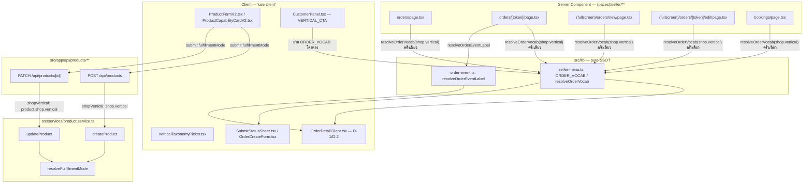
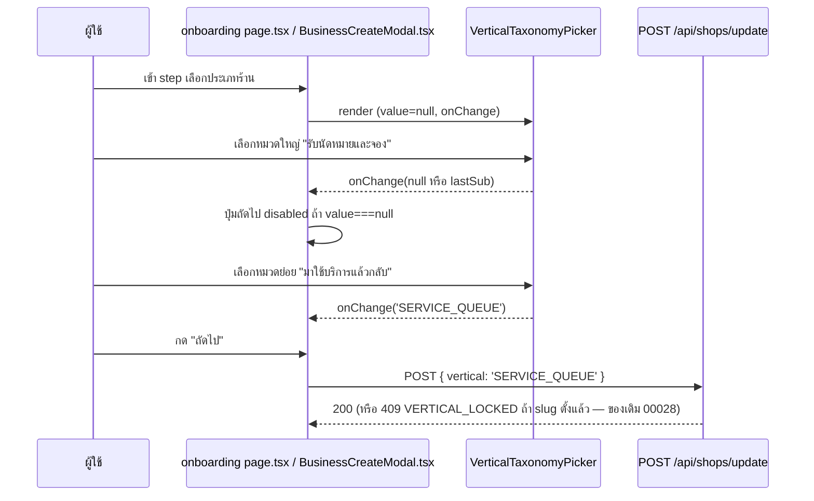
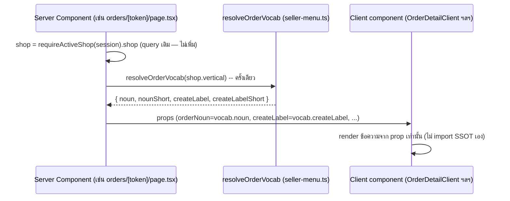
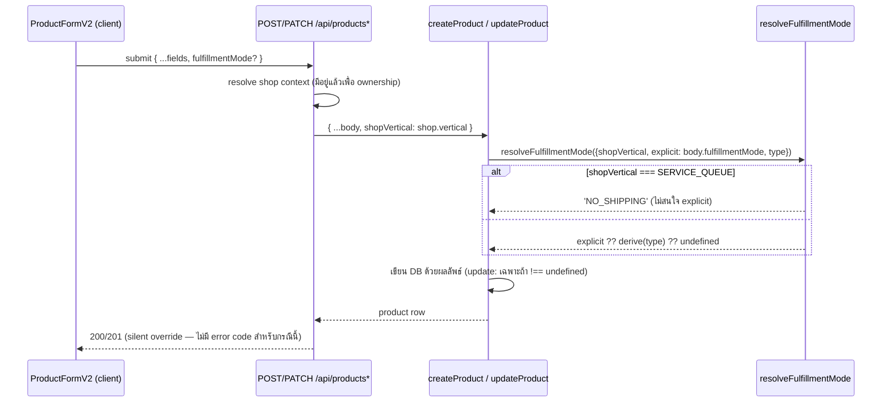

> **โมดูล:** M00030-BookingBusinessUXUnification
> **ประเภทเอกสาร:** System Design Spec (SDS)
> **เวอร์ชัน:** 1.0
> **วันที่จัดทำ (backfill):** 2026-08-05
> **สถานะ:** Implemented — backfill จากโค้ดจริง
> **เจ้าของเอกสาร:** safepay-planner (ดู [[Feature-Docs-Ownership]])

# SDS: รวมประสบการณ์ธุรกิจแบบนัดหมาย·จอง (System Design Spec)

---

## 1. บทนำ & References

เอกสารนี้บันทึก **design จริงที่ shipped แล้ว** — ไม่ใช่ design ที่รอ implement เนื้อหาสกัดจากการอ่านโค้ดตรง ๆ (`VerticalTaxonomyPicker.tsx`, `seller-menu.ts`, `order-event.ts`, `product.service.ts`, route handlers) เพื่อให้เป็น ground truth สำหรับ dev/reviewer/QA รอบถัดไป

| อ้างอิง | ใช้ทำอะไร |
|---|---|
| [[SRS]] | TFR ทุกข้อที่ design นี้ realize |
| `docs/superpowers/specs/2026-08-04-feature-00030-vertical-picker-design.md` | design ต้นฉบับของ picker (ก้อน onboarding) |
| `docs/superpowers/specs/2026-08-05-feature-00030-wording-fulfillment-backfill-design.md` | design + ผล Impeccable gate ของก้อน wording/fulfillment |
| [[API]] | contract ของ 2 endpoint ที่ behavior เปลี่ยน |

---

## 2. Architecture Overview

### 2.1 มุมมองสถาปัตยกรรม

ไม่มี component/service ใหม่ระดับ infra — งานนี้คือ (1) 1 shared client component ใหม่ (2) ขยาย SSOT function ที่มีอยู่แล้ว (3) 1 pure function ใหม่ในระดับ service (4) wiring parameter เพิ่มในเส้นทางที่มีอยู่แล้ว



---

## 3. Component Design

### 3.1 `VerticalTaxonomyPicker.tsx` — state machine

| State | ที่มา | เหตุผลที่แยกจาก `value` prop |
|---|---|---|
| `category: 'SALES' \| 'BOOKING'` | `useState`, init จาก `value === 'SERVICE_QUEUE' \|\| value === 'LODGING' ? 'BOOKING' : 'SALES'` | `value === null` กำกวม (ยังไม่เลือกอะไร vs เลือก BOOKING แล้วแต่ยังไม่เลือกย่อย) — ต้องมี state แยกบอกว่า "อยู่หมวดไหน" |
| `lastSub: ShopVertical \| null` | `useState`, init จาก `value` ถ้าเป็น SERVICE_QUEUE/LODGING | จำหมวดย่อยล่าสุด — สลับไปหมวด SALES แล้วกลับมา BOOKING ต้อง highlight ตัวเดิม ไม่รีเซ็ต |

Transition:
```
pickCategory('SALES')   → category='SALES', onChange('ONLINE_SALES')          (สมบูรณ์ทันที)
pickCategory('BOOKING') → category='BOOKING', onChange(lastSub)               (lastSub อาจเป็น null)
pickSub(v)              → lastSub=v, onChange(v)                              (เฉพาะ category='BOOKING')
```

Parent (onboarding page) เช็คแค่ `!vertical` เพื่อ disable ปุ่มถัดไป — ไม่ต้องรู้จัก `category`/`lastSub` ภายใน (encapsulation เต็ม)

Accessibility: radio ที่ `sr-only` ยังอยู่ใน DOM (คีย์บอร์ด/screen reader ใช้ได้) การ์ดสื่อ "เลือกอยู่" ด้วยขอบ+พื้น+ไอคอน check — ไม่ใช้จุดวงกลมซ้ำเป็นสัญญาณที่ 3

### 3.2 `ORDER_VOCAB` / `resolveOrderVocab` — SSOT design

```ts
export type OrderVocab = {
  noun: string             // เมนู, breadcrumb, <title>, หัวข้อ, แท็บ
  nounShort: string        // bottom nav, chip, <120px
  createLabel: string      // ปุ่มหลัก, หัวฟอร์ม, page title ของ /orders/new
  createLabelShort: string // bottom nav FAB, ปุ่มแถบเครื่องมือแชท
}

export const ORDER_VOCAB: Record<string, OrderVocab> = {
  ONLINE_SALES:   { noun: 'คำสั่งซื้อ',        nounShort: 'คำสั่งซื้อ',     createLabel: 'สร้างคำสั่งซื้อ',        createLabelShort: 'สร้างคำสั่งซื้อ' },
  SERVICE_QUEUE:  { noun: 'การเข้ารับบริการ',  nounShort: 'บริการ',         createLabel: 'สร้างการเข้ารับบริการ',  createLabelShort: 'งานใหม่' },
  LODGING:        { noun: 'บิลเข้าพัก',        nounShort: 'บิลเข้าพัก',     createLabel: 'เปิดบิลเข้าพัก',         createLabelShort: 'เปิดบิลเข้าพัก' },
}

export function resolveOrderVocab(vertical: string): OrderVocab {
  return ORDER_VOCAB[vertical] ?? ORDER_VOCAB.ONLINE_SALES   // fail-safe
}
export function resolveOrderMenuLabel(vertical: string): string {
  return resolveOrderVocab(vertical).noun   // wrapper เดิมของ feature 00028 — ยังใช้ได้
}
```

**ทำไม 4 ช่องไม่ใช่ 1:** ภาษาไทยผันไม่เท่ากันทุกช่อง `"สร้าง" + noun` ใช้กับ LODGING ไม่ได้ ("สร้างบิลเข้าพัก" ผิด ต้องเป็น "เปิดบิลเข้าพัก") และช่องแคบ (<120px) รับคำเต็มไม่ไหว

### 3.3 `resolveOrderEventLabel` — override เฉพาะ 3 event

```ts
export function resolveOrderEventLabel(
  type: OrderEventType,
  vocab: { noun: string; createLabel: string },
): string {
  switch (type) {
    case 'ORDER_CREATED':   return vocab.createLabel                // ตรง ๆ ไม่ประกอบ
    case 'ORDER_EDITED':    return `แก้ไข${vocab.noun}`
    case 'ORDER_CANCELLED': return `ยกเลิก${vocab.noun}`
    default:                return ORDER_EVENT_META[type].label     // โดเมนพัสดุ/SMS ไม่ผัน
  }
}
```

`tone`/`icon` ใน `ORDER_EVENT_META` ไม่ถูกแตะ (Verified-Means-Green ของ timeline คงเดิม — เขียวสงวนให้ `BUYER_CONFIRMED` เท่านั้น)

### 3.4 `resolveFulfillmentMode` — จุดตัดสินเดียวของทั้งระบบ

```ts
export function resolveFulfillmentMode(input: {
  shopVertical?: string
  explicit?: FulfillmentMode
  type?: string
}): FulfillmentMode | undefined {
  if (input.shopVertical === "SERVICE_QUEUE") return "NO_SHIPPING"          // 1) ล็อก ชนะทุกกรณี
  if (input.explicit !== undefined) return input.explicit                   // 2) caller override
  if (input.type !== undefined && input.type in PRODUCT_TYPES) {
    return deriveCapabilityDefaults(input.type as ProductTypeId).fulfillmentMode // 3) derive จาก type
  }
  return undefined                                                          // 4) ไม่แตะ
}
```

**สกัดออกมาจาก `createProduct`/`updateProduct` โดยตั้งใจ** เพราะเดิม (ก่อนงานนี้) ทั้งสองฟังก์ชันตัดสินคนละที่ด้วยลำดับคนละแบบ — `createProduct` มี fallback logic บางส่วน `updateProduct` ไม่มีเลย ผลคือ **สร้างสินค้าถูกแล้วแก้ไขให้ผิดทีหลังได้**

`createProduct` เรียกที่จุดสร้าง `data:` object (`fulfillmentMode: resolveFulfillmentMode({shopVertical: data.shopVertical, explicit: data.fulfillmentMode, type: data.type})`) — `updateProduct` เรียกก่อน build `scalarUpdate`, เขียนเฉพาะเมื่อผลลัพธ์ `!== undefined` (คง partial-update semantics เดิม)

### 3.5 Route handler wiring

| Route | Shop context มาจากไหน | ส่งอะไรเข้า service |
|---|---|---|
| `POST /api/products` | `requireActiveShop(session)` (มีอยู่แล้วสำหรับ ownership) | `{ ...parsed.output, shopVertical: shop.vertical }` |
| `PATCH /api/products/[id]` | `prisma.product.findUnique({include:{shop:true}})` (มีอยู่แล้วสำหรับ ownership check) | `{ ...parsed.output, shopVertical: product.shop.vertical }` |

ทั้งสอง route **ไม่เพิ่ม query ใหม่** — `shop`/`product.shop` ถูก fetch มาแล้วเพื่อ ownership check อยู่ก่อนงานนี้

### 3.6 RSC-hoist-once pattern (locked convention)

```
Server Component:
  const shop = (await requireActiveShop(session)).shop
  const vocab = resolveOrderVocab(shop.vertical)   // เรียกครั้งเดียว
  return <ClientComp orderNoun={vocab.noun} createLabel={vocab.createLabel} .../>

Client Component:
  // รับ prop ตรง ๆ — ไม่ import resolveOrderVocab, ไม่รู้จัก vertical
```

Wiring จริงที่ยืนยันแล้วใน `orders/[token]/page.tsx`:
```ts
const vocab = resolveOrderVocab(shop.vertical)
...
<h1 className='sr-only'>รายละเอียด{vocab.noun}</h1>
<PageBreadcrumb title={`รายละเอียด${vocab.noun}`} trail={[{ label: vocab.noun, href: '/orders' }]} />
...
orderNoun={vocab.noun}
shippingActivity={<ShippingActivity events={orderEvents} orderNoun={vocab.noun} createLabel={vocab.createLabel} />}
```

`generateMetadata()` resolve shop context **แยกจาก page component** (Next.js เรียกคนละรอบ execution) — เป็น pattern ที่ยอมรับแล้วเพราะ metadata generation เดิมก็ query shop อยู่แล้วสำหรับ title ธรรมดา ไม่ใช่ query ใหม่ที่ไม่เคยมี:
```ts
export async function generateMetadata(): Promise<Metadata> {
  const active = await requireActiveShop(...).catch(() => null)
  return { title: resolveOrderVocab(active?.shop?.vertical ?? '').noun }
}
```

### 3.7 UI field-hide — `ProductFormV2` / `ProductCapabilityCardV2`

- `ProductCapabilityCardV2.tsx` ประกาศตัวเองเป็น **Domain component** (ไม่มี Paces primitive 1:1 สำหรับ "อธิบายว่า field ถูกล็อกทำไม") — ใช้ primitive ที่ลงทะเบียนแล้วประกอบ (`text-default-500 text-xs` + `Icon`) แทน `<select>` เมื่อ `shop.vertical === 'SERVICE_QUEUE'`
- default value ของฟอร์ม (create mode): `fulfillmentMode ?? (noShipping ? 'NO_SHIPPING' : 'SHIPPED')` — แก้จาก fixed `'SHIPPED'` เดิม (rework #4) เพื่อให้ payload ตรงเจตนา UI แม้ server จะ override ให้อยู่ดี

### 3.8 D-1 truthful-copy logic — `OrderDetailClient.tsx`

- Prop `hasStockDeducted: boolean` (ตั้งชื่อเทียบเท่า) — server resolve จาก `OrderItem.stockDeducted != null` อย่างน้อย 1 แถว **ไม่ derive จาก `vertical`**
- Branch ข้อความ:
  - `true` → `` `สินค้าจะถูกคืนเข้าสต็อก · ${linkClause}` ``
  - `false` (ครอบทั้ง SERVICE_QUEUE/LODGING ทั้งหมด และ ONLINE_SALES ที่ไม่มี Add-on) → เหลือแค่ `linkClause` (ไม่มีประโยคคืนสต็อก)
- ปุ่ม/ข้อความยกเลิกอื่น (`` `ยกเลิก${vocab.noun}นี้?` `` ฯลฯ) ผันตาม `vocab.noun` ปกติตาม TFR-006 pattern

---

## 4. Data Flow

### 4.1 Onboarding — เลือกประเภทร้าน (ทั้ง 2 ทางเข้า)



### 4.2 Order page — wording resolution



### 4.3 Product create/update — fulfillmentMode lock



---

## 5. Integration Points

| จุดเชื่อม | รายละเอียด | ข้อควรระวัง |
|---|---|---|
| feature 00028 (`Shop.vertical`, `resolveOrderMenuLabel`) | ขยาย ไม่แทนที่ | `resolveOrderMenuLabel` ยัง export เป็น thin wrapper กัน call site เดิมพัง |
| feature 00024 (`canUseAppointments`, คิวงาน) | ไม่แตะ | เมนู "คิวงาน" ไม่อยู่ใน scope wording ของงานนี้ (ชื่อ resource ไม่ใช่ order) |
| feature 00017 (`Room`, `ShippingActivity` domain) | เขียนเฉพาะหัวการ์ดทั่วไป 1 จุด | ส่วนอื่นในไฟล์เดียวกัน (สถานะจัดส่ง/courier) ห้ามแตะ (frozen zone D-1 ของ PRD) |
| Deep Chat (`CustomerPanel.tsx`) | `VERTICAL_CTA` อ่าน `ORDER_VOCAB` แทนประกาศเอง | เดิมมี SSOT 2 ตัวขัดกัน (LODGING="บิลเข้าพัก" vs "การจอง") — ยุบแล้ว |
| Inventory Add-on (`restockFromCancelledOrder`) | เงื่อนไข `stockDeducted != null` เป็น input ของ D-1 copy | ถ้า service ตัวนั้นเปลี่ยนเงื่อนไข ต้องตาม D-1 ให้ตรงใหม่ |

**Timeout/Retry/Idempotency:** ไม่มีจุดเชื่อมข้าม submodule ใหม่ — ทั้งหมดเป็น synchronous function call ภายใน process เดียว

---

## 6. Technical Decisions

| # | ประเด็น | ตัดสิน | เหตุผล | ทางเลือกที่ตัดทิ้ง |
|---|---|---|---|---|
| TD-01 | รูปร่าง SSOT คำ | **4 ช่อง** (`noun`/`nounShort`/`createLabel`/`createLabelShort`) | ภาษาไทยผันไม่เท่ากันทุกที่ใช้ ("เปิดบิลเข้าพัก" ≠ "สร้าง"+noun) | `noun` เดี่ยวแล้วให้ call site ต่อสตริง — ถูกปฏิเสธเพราะพังกับ LODGING ทันที |
| TD-02 | หมวดใหญ่ของ picker เก็บที่ไหน | **local UI state** ใน `VerticalTaxonomyPicker` ไม่ผูกกับ prop `value` | `value=null` กำกวมระหว่าง "ยังไม่เลือก" กับ "เลือกหมวดใหญ่แล้วรอหมวดย่อย" | derive จาก `value` อย่างเดียว — ทางตัน (ขั้น 2 หายไปทันทีที่ value ว่าง) |
| TD-03 | จุดตัดสิน `fulfillmentMode` | **สกัดเป็น pure function เดียว** (`resolveFulfillmentMode`) ใช้ร่วมทั้ง create/update | เดิมตัดสินคนละที่คนละลำดับ → สร้างถูกแก้ผิดได้ | เขียน logic แยกในแต่ละฟังก์ชัน — ถูกปฏิเสธเพราะเป็นต้นเหตุของช่องโหว่เดิม |
| TD-04 | ลำดับ priority ของ lock | **vertical-lock ชนะก่อน caller override** เฉพาะ `SERVICE_QUEUE` | 00028 ตั้งใจ "ล็อก" แต่เขียนเป็น default ที่ทับได้จริง ไม่ได้ปิดอะไรเลย | คง caller-override ชนะเสมอ — ถูกปฏิเสธเพราะไม่ปิดช่องโหว่ตามเจตนา BR-SBT-22 |
| TD-05 | wording resolve ที่ไหน | **RSC hoist-once** ส่ง string ลง prop | client ไม่ควรรู้จัก vertical เอง (กัน drift ระหว่างจุด render ในหน้าเดียวกัน) | client import SSOT เอง — ถูกปฏิเสธเพราะเสี่ยง 2 จุดใน component tree เดียวกัน resolve ไม่ตรงกันถ้า prop ไม่ sync |
| TD-06 | ข้อความคำเตือนยกเลิก | ผูกกับ **evidence จริง** (`stockDeducted`) ไม่ใช่ `vertical` | vertical ทำนายผลไม่ได้ตรง (ONLINE_SALES ไม่มี Add-on ก็ไม่คืนสต็อกเหมือนกัน) | ผูกกับ vertical — ถูกปฏิเสธเพราะยังโกหก ONLINE_SALES ส่วนใหญ่ที่ไม่มี Add-on |
| TD-07 | field-hide vs disable | **ซ่อนทั้ง fieldset** ไม่ใช่ disable ที่ยังเห็น options | ผู้ใช้ SERVICE_QUEUE ไม่ควรเห็นตัวเลือกที่เลือกไม่ได้เลย (ตรง FR-BKU-04 เป๊ะ) | disable เฉย ๆ — ถูกปฏิเสธเพราะ FR ระบุ "ไม่แสดง...เลย" ชัดเจน |
| TD-08 | Room/ServiceResource ยุบรวมไหม | **ไม่ยุบ** (สืบทอดจาก PRD D-2 เดิม) | โครงสร้างต่างกันจริง 9 จุด (date-range vs slot capacity) | ยุบเป็นโมเดลเดียว — อยู่นอกขอบเขตงานนี้อยู่แล้ว |

---

## 7. Traceability

| SRS TFR | SDS Element |
|---|---|
| TFR-001, TFR-002 | §3.1 `VerticalTaxonomyPicker` state machine / TD-02 |
| TFR-003 | §3.2 `ORDER_VOCAB`/`resolveOrderVocab` / TD-01 |
| TFR-004 | §3.6 RSC-hoist-once pattern / TD-05 |
| TFR-005, TFR-006 | §3.3 `resolveOrderEventLabel` |
| TFR-007 | §3.4 `resolveFulfillmentMode` / TD-03, TD-04 |
| TFR-008 | §3.5 Route handler wiring |
| TFR-009 | §3.7 UI field-hide / TD-07 |
| TFR-010 | §3.8 D-1 truthful-copy / TD-06 |
| TFR-011, TFR-012 | §3.2/§3.3 (derive จากช่องเดียวกัน), CustomerPanel wiring |

---

## 8. สรุป

- Design จริงยึด 2 หลักการหลัก: **SSOT 4 ช่องแบบ resolve-once-at-server** (wording) และ **pure-function priority-lock ตัวเดียวใช้ร่วมกัน** (fulfillmentMode) — ทั้งคู่แก้ปัญหาต้นเหตุเดียวกันคือ "ตรรกะเดียวกันเขียนซ้ำคนละที่แล้ว drift"
- **ลำดับ build ที่เกิดขึ้นจริง:** ก้อน 1 (wording SSOT rollout) → ก้อน 2 (ProductFormV2 field-hide) → rework round (แก้ 6 จุดที่ reviewer/Impeccable critique พบ ในคอมมิตเดียว)
- **Open questions ที่ยังไม่ปิด:** LODGING เข้า `/orders/new` ได้จริงหรือไม่ (ถ้าไม่ได้ `createLabel` ของ LODGING ไม่มีที่ใช้), ความยาวคำที่ 320px ยังไม่เคย verify ด้วยตา, wording hardcode ที่เหลือหลายไฟล์ยังเป็นหนี้เปิด
