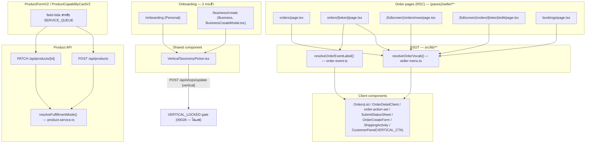

> **โมดูล:** M00030-BookingBusinessUXUnification
> **ประเภทเอกสาร:** Software Requirements Specification (SRS) - TECHNICAL
> **เวอร์ชัน:** 1.0
> **วันที่จัดทำ (backfill):** 2026-08-05
> **สถานะ:** Implemented — เขียนย้อนหลังจากโค้ดจริงบน prod (commit `9d900146` onboarding picker, `58d35418` wording SSOT rollout, `dfe24e64` ProductFormV2 field-hide, `ca961af1` rework 2026-08-05)
> **เจ้าของเอกสาร:** safepay-planner (ดู [[Feature-Docs-Ownership]])

# SRS: รวมประสบการณ์ธุรกิจแบบนัดหมาย·จอง (Software Requirements Specification — Technical)

---

## 1. บทนำ (Introduction)

### 1.1 วัตถุประสงค์

เอกสารนี้เป็น **backfill** — โค้ดขึ้น prod แล้วก่อนมี SRS (ละเมิด Hard Rule 11 ไปแล้วบางส่วน ก้อน wording rollout + fulfillment field-hide ก็ข้าม `safepay-ux` gate ไปด้วย ดู `docs/superpowers/specs/2026-08-05-feature-00030-wording-fulfillment-backfill-design.md`). เนื้อหาทุกข้อสกัดจาก**โค้ดจริงที่อ่านแล้ว** ไม่ใช่จาก BRD checklist ที่ path:line บางจุดเน่าไปแล้ว (BRD เขียนช่วง `72412fa0`; โค้ดปัจจุบันหลัง `ca961af1` มีไฟล์/บรรทัดต่างไปแล้วหลายจุด เช่น `CancelOrderButton.tsx` ถูกรื้อเข้า `OrderDetailClient.tsx` ไปแล้ว) — ดู `feedback_write_docs_from_code_not_memory`.

### 1.2 ขอบเขต

| อยู่ในขอบเขต | นอกขอบเขต |
|---|---|
| `VerticalTaxonomyPicker.tsx` (2-tier picker ใช้ร่วม onboarding 2 จุด) | schema/enum ของ `Shop.vertical` (คง 3 ค่าเดิม, ไม่แตะ) |
| `ORDER_VOCAB`/`resolveOrderVocab` (`src/lib/seller-menu.ts`) เป็น SSOT 4 ช่อง | `Room`/`ServiceResource` model (คงแยกกันตามเดิม) |
| `resolveOrderEventLabel` (`src/lib/order-event.ts`) ผัน 3 event lifecycle | iShip integration / shipment tracking copy (ยกเว้น 1 หัวการ์ดทั่วไปที่ user เคาะให้ผัน) |
| `resolveFulfillmentMode` (`src/services/product.service.ts`) — ล็อกลำดับความสำคัญ | มัดจำเต็มรูปสำหรับ `SERVICE_QUEUE` |
| Route handler wiring ของ `POST/PATCH /api/products*` (ส่ง `shop.vertical` เข้า service) | เปลี่ยน flow เปลี่ยนประเภทร้านค้าภายหลัง (ยัง immutable) |
| `ProductFormV2`/`ProductCapabilityCardV2` field-hide สำหรับ `SERVICE_QUEUE` | `VERTICAL_LOCKED` 409 ของ `POST /api/shops/update` (สืบทอดจาก feature 00028 — ไม่ทำซ้ำที่นี่) |
| D-1/D-2 copy fix ใน `OrderDetailClient.tsx` (ยกเลิกออเดอร์) | migration ใด ๆ (ไม่มีในงานนี้) |

### 1.3 เอกสารอ้างอิง

| เอกสาร | ใช้ทำอะไร |
|---|---|
| [[PRD]] / [[BRD]] | ที่มาของ FR-BKU-01..05 / BR-BKU-01..17 |
| [[UX-Copy]] | ค่าคำจริงต่อ vertical (`noun`/`nounShort`/`createLabel`/`createLabelShort`) + checklist path:line |
| `docs/superpowers/specs/2026-08-04-feature-00030-vertical-picker-design.md` | design ของ picker (ก้อน onboarding) |
| `docs/superpowers/specs/2026-08-05-feature-00030-wording-fulfillment-backfill-design.md` | design + rework log ของก้อน wording/fulfillment (แหล่งหลักของเอกสารนี้) |
| `docs/20 - Features/00028 - Shop Business Type/` | เจ้าของ `Shop.vertical` 3 ค่า, `VERTICAL_LOCKED` 409 — ไม่ทำซ้ำ |
| `docs/20 - Features/00024 - Service Appointment Booking/` | เจ้าของ `ServiceResource`/`canUseAppointments` — ไม่แตะ |
| `feedback_write_docs_from_code_not_memory`, `feedback_service_error_route_mapping` | บทเรียนที่บังคับให้เอกสารนี้ verify กับโค้ดจริงทุกจุด |

### 1.4 นิยามและตัวย่อ

| คำ/ตัวย่อ | ความหมาย |
|---|---|
| **หมวดใหญ่ / หมวดย่อย** | ขั้น 1 ("ขายของออนไลน์"/"รับนัดหมายและจอง") และขั้น 2 ("มาใช้บริการแล้วกลับ"/"มาพักค้างคืน") ของ `VerticalTaxonomyPicker` — เป็น **UI state ล้วน** ไม่ใช่ค่าที่บันทึก |
| **ORDER_VOCAB** | SSOT 4 ช่องต่อ `Shop.vertical` — `noun`/`nounShort`/`createLabel`/`createLabelShort` |
| **order-lifecycle copy** | ข้อความทั่วไปเกี่ยวกับสร้าง/แก้ไข/ยกเลิก/แสดงรายละเอียด "ใบสั่ง" — ต่างจาก copy เฉพาะโดเมนพัสดุ (BR-BKU-11) |
| **fulfillmentMode lock** | การบังคับ `NO_SHIPPING` ที่ทั้ง UI (ซ่อน field) และ service layer (`resolveFulfillmentMode`) สำหรับร้าน `SERVICE_QUEUE` |
| **fail-safe fallback** | vertical ที่ resolve ไม่ได้/ไม่รู้จัก → ตกไปใช้ชุดคำ/พฤติกรรมของ `ONLINE_SALES` เสมอ |

---

## 2. ภาพรวมสถาปัตยกรรม (Architecture Overview)

### 2.1 ตำแหน่งในระบบ



### 2.2 หลักการออกแบบที่ยึด

| หลักการ | เหตุผล |
|---|---|
| **onboarding 2 ขั้น = UX เท่านั้น** | ค่าที่บันทึกจริงยังเป็น 3 ค่าเดิมของ `Shop.vertical` — ไม่มี migration |
| **SSOT เดียวของคำ ไม่ใช่หลายชุดที่ขัดกัน** | ก่อนงานนี้มี `ORDER_MENU_LABELS`(seller-menu) กับ `VERTICAL_CTA`(CustomerPanel) ขัดกันเอง — ยุบเหลือ `ORDER_VOCAB` ตัวเดียว |
| **server resolve ครั้งเดียว ส่ง string ที่ derive แล้วลง prop** | client component ไม่รู้จัก vertical เอง (ป้องกัน drift ระหว่างจุด render) |
| **fulfillmentMode lock เป็นการ override ไม่ใช่ default** | ของเดิม (00028 BR-SBT-22) เป็นแค่ fallback ที่ caller ทับได้จริง ซึ่งไม่ได้ปิดช่องโหว่ |
| **ซ่อน field ใน UI ไม่ใช่ enforcement — server ต้องล็อกเสมอ** | สืบทอด BR-LODG-03/BR-SBT-10 — ยิง API ตรงต้องยังถูกบังคับ |
| **ข้อความที่บอกผลลัพธ์ต้องพิสูจน์ได้ ห้ามเดา (D-1)** | ผูกกับหลักฐานจริง (`stockDeducted != null`) ไม่ใช่ผูกกับ vertical |

### 2.3 การแบ่งชั้น

- **UI (client)** — `VerticalTaxonomyPicker`, `ProductFormV2`/`ProductCapabilityCardV2`, order-detail client components — ไม่ import SSOT resolver เอง รับ label เป็น prop
- **RSC (server component)** — resolve `shop.vertical` (ผ่าน `requireActiveShop`/`generateMetadata`) แล้วเรียก `resolveOrderVocab` ครั้งเดียว
- **Service layer** (`src/services/product.service.ts`) — `resolveFulfillmentMode` เป็นจุดตัดสินเดียว ใช้ทั้ง `createProduct`/`updateProduct`
- **Route layer** (`src/app/api/products/**`) — resolve `shop.vertical` จาก context ที่มีอยู่แล้ว ส่งเข้า service เป็น `shopVertical` — **ห้าม service query Shop เอง** (BR-BKU-17)

---

## 3. ข้อกำหนดเชิงฟังก์ชันเชิงเทคนิค (TFR)

### TFR-001 — Shared 2-tier vertical picker

**มาจาก:** FR-BKU-01, FR-BKU-02, BR-BKU-07

- `VerticalTaxonomyPicker.tsx` (`src/components/safepay/`) เป็น component เดียวที่ทั้ง `seller/onboarding/page.tsx` (Personal) และ `BusinessCreateModal.tsx` (Business) import ใช้ — ห้าม implement แยก 2 ชุด
- Props: `value: ShopVertical | null`, `onChange: (v: ShopVertical | null) => void`, `columns?: 1 | 2`, `disabled?: boolean`
- ค่าที่ผลิตออกมายังเป็น 1 ใน 3 ค่าเดิมของ `ShopVertical` (`src/lib/lodging.ts`) เท่านั้น

### TFR-002 — Category state derivation + null-when-incomplete gating

**มาจาก:** BR-BKU-05, BR-BKU-06, BR-BKU-08

- Component เก็บ `category: 'SALES' | 'BOOKING'` เป็น **local state ของตัวเอง** — derive จาก `value` อย่างเดียวไม่ได้ (เพราะ `value === null` เกิดได้ทั้งตอนยังไม่เลือกอะไรเลย และตอนเลือก "รับนัดหมายและจอง" แล้วแต่ยังไม่เลือกย่อย — สอง state นี้ต้องแยกจากกัน)
- เลือกหมวดใหญ่ "ขายของออนไลน์" → `onChange('ONLINE_SALES')` ทันที ไม่มีขั้นที่ 2
- เลือกหมวดใหญ่ "รับนัดหมายและจอง" → `onChange(lastSub)` โดย `lastSub` คือหมวดย่อยที่เคยเลือกไว้ล่าสุด (หรือ `null` ถ้ายังไม่เคยเลือก) — parent (onboarding page) **ต้อง disable ปุ่ม "ถัดไป" เมื่อ `value === null`**
- สลับกลับไปหมวดใหญ่อื่นแล้วกลับมา ต้องเห็นหมวดย่อยเดิมที่เคยเลือกไว้ (state `lastSub` ไม่รีเซ็ต)

### TFR-003 — SSOT `ORDER_VOCAB` 4 ช่อง + fail-safe fallback

**มาจาก:** BR-BKU-09, BR-BKU-10

- `ORDER_VOCAB: Record<string, OrderVocab>` (`src/lib/seller-menu.ts`) ประกาศ 4 ช่องต่อ vertical: `noun`/`nounShort`/`createLabel`/`createLabelShort` — **ห้าม** เขียนเป็น `noun` เดี่ยวแล้วให้ caller ต่อสตริงเอง (ภาษาไทยผันไม่เท่ากันทุกช่อง — "เปิดบิลเข้าพัก" ไม่ใช่ "สร้าง"+"บิลเข้าพัก")
- `resolveOrderVocab(vertical: string): OrderVocab` — vertical ที่ไม่รู้จัก (string เพี้ยน/undefined) → คืนชุดของ `ONLINE_SALES` เสมอ (`ORDER_VOCAB[vertical] ?? ORDER_VOCAB.ONLINE_SALES`)
- `resolveOrderMenuLabel(vertical)` (ของเดิม feature 00028) กลายเป็น thin wrapper ของ `resolveOrderVocab(vertical).noun` — call site เดิมยังใช้ได้ไม่พัง

### TFR-004 — RSC-hoist-once pattern (บังคับ)

**มาจาก:** BR-BKU-12, design spec 2026-08-05 "Pattern ที่ล็อกเป็น convention"

- Server Component ที่ต้องแสดง order-lifecycle copy ต้อง resolve `shop.vertical` ที่มีอยู่แล้วในมือ (จาก `requireActiveShop`) แล้วเรียก `resolveOrderVocab(shop.vertical)` **ครั้งเดียว (hoist)**
- ส่ง**string ที่ derive แล้ว** (เช่น `vocab.noun`, `` `แก้ไข${vocab.noun}` ``) ลงไปเป็น prop — 🛑 **client component ห้าม import `resolveOrderVocab`/`ORDER_VOCAB` หรือรู้จัก `vertical` เอง**
- `generateMetadata()` ของแต่ละหน้า resolve shop context **แยกจาก** page component เอง (เพราะ Next.js เรียกคนละ execution — เป็น query ซ้ำที่ยอมรับได้ ไม่ใช่ query ใหม่ที่ไม่เคยมี เนื่องจาก metadata generation เดิมก็ query อยู่แล้ว)

### TFR-005 — ขอบเขตคำที่ผัน (BR-BKU-11)

**มาจาก:** BR-BKU-09, BR-BKU-11

- ผันเฉพาะ **order-lifecycle copy ทั่วไป** (breadcrumb, page title/metadata, h1, ปุ่มสร้าง/แก้ไข/ยกเลิก, empty state, submit sheet, confirm dialog, toast, เมนู ⋮, หัวการ์ดทั่วไป)
- **ห้ามแตะ** copy เฉพาะโดเมนพัสดุ (สถานะจัดส่ง/เลขพัสดุ/courier) ใน `ShippingActivity.tsx`/`ShipmentPanel.tsx`/`IShipImportModal.tsx` — ยกเว้น**หัวการ์ดทั่วไป 1 จุด** ("ประวัติคำสั่งซื้อ" → "ประวัติ{noun}") ที่ user เคาะให้ผันได้เพราะเป็น label ของ event timeline ไม่ใช่เนื้อหาพัสดุ (PRD §9.3 Q-2)
- Reviewer ต้อง **grep ด้วยข้อความ ไม่ใช่เลขบรรทัด** ก่อนปิดงานทุกรอบ — repo นี้มีหลาย session push แข่งกัน เลขบรรทัดเน่าเร็ว (พิสูจน์แล้ว 2 รอบระหว่างเขียน BRD)

### TFR-006 — `resolveOrderEventLabel` ผันเฉพาะ 3 event

**มาจาก:** BR-BKU-09, BR-BKU-11 (rework `ca961af1`)

- `resolveOrderEventLabel(type: OrderEventType, vocab: {noun, createLabel}): string` (`src/lib/order-event.ts`)
- `ORDER_CREATED` → คืน `vocab.createLabel` **ตรง ๆ** ไม่ใช่ `` `สร้าง${noun}` `` (LODGING ต้องได้ "เปิดบิลเข้าพัก" ไม่ใช่ "สร้างบิลเข้าพัก")
- `ORDER_EDITED` → `` `แก้ไข${vocab.noun}` `` , `ORDER_CANCELLED` → `` `ยกเลิก${vocab.noun}` ``
- event ที่เหลือ (`TRACKING_ADDED`/`SHIPMENT_*`/`SMS_LINK_SENT`/`BUYER_CONFIRMED`) → คืน `ORDER_EVENT_META[type].label` แบบ static เดิม (ไม่ผัน — เป็นโดเมนพัสดุ/SMS)
- 🛑 **ห้ามแตะ `tone`/`icon`** ของ `ORDER_EVENT_META` — Verified-Means-Green ของ timeline (เขียวเฉพาะ `BUYER_CONFIRMED`) ต้องคงเดิม
- ต้องมี unit test ล็อกกฎนี้ (`src/lib/order-event.test.ts`) — โดยเฉพาะ negative assertion "LODGING ต้องไม่มีคำว่า 'สร้าง'"

### TFR-007 — `resolveFulfillmentMode` ลำดับความสำคัญ (หัวใจของ fulfillment lock)

**มาจาก:** BR-BKU-13, BR-BKU-14, BR-BKU-15

```
priority:
  1) shopVertical === 'SERVICE_QUEUE' → 'NO_SHIPPING' เสมอ (ล็อก ชนะทุกกรณี)
  2) explicit (caller ส่งมาเอง)        → ใช้ค่านั้น
  3) derive จาก product type ตาม registry
  4) undefined                        → ไม่แตะ (partial update / schema default)
```

- ต้องเป็น **ฟังก์ชัน pure ตัวเดียว** ที่ทั้ง `createProduct` และ `updateProduct` เรียกใช้ร่วมกัน (ห้ามมี logic คนละชุดคนละที่ — ต้นเหตุของช่องโหว่เดิมคือ `updateProduct` ไม่มี logic นี้เลย)
- ร้าน `ONLINE_SALES`/`LODGING`: พฤติกรรม caller-override เดิมทำงานเหมือนเดิมทุกประการ (ข้อ 2-4 ไม่เปลี่ยนจาก 00028)
- 🛑 ต้องมี unit test ครอบทั้ง 2 เคส (create/update) + ครอบ vertical อื่นไม่ถูกกระทบ (`src/services/__tests__/product-fulfillment-mode.test.ts`, 12 เคส)

### TFR-008 — Route handler ต้องส่ง `shopVertical` จาก context ที่มีอยู่แล้ว

**มาจาก:** BR-BKU-17

- `POST /api/products` (`src/app/api/products/route.ts`): `shop` ได้จาก `requireActiveShop` อยู่แล้ว → ส่ง `shopVertical: shop.vertical` เข้า `createProduct`
- `PATCH /api/products/[id]` (`src/app/api/products/[id]/route.ts`): `product.shop` ได้จาก `findUnique({include:{shop:true}})` ที่ใช้ ownership-check อยู่แล้ว → ส่ง `shopVertical: product.shop.vertical` เข้า `updateProduct`
- 🛑 **ห้าม service (`product.service.ts`) query `Shop` เพิ่มเอง** — N+1 ที่ไม่จำเป็น, caller มี object พร้อมอยู่แล้วทั้ง 2 จุด

### TFR-009 — Field-hide ใน UI (ป้องกันชั้นที่ 2 ไม่ใช่ชั้นเดียว)

**มาจาก:** FR-BKU-04, BR-BKU-16

- `ProductFormV2.tsx`/`ProductCapabilityCardV2.tsx`: เมื่อ `shop.vertical === 'SERVICE_QUEUE'` → ไม่ render `<select {...register('fulfillmentMode')}>` เลย (ซ่อน ไม่ใช่ disable) แสดง `<p>` อธิบายแทน
- ฟอร์มยัง submit `fulfillmentMode` แนบไปด้วย (ค่า default `?? (noShipping ? 'NO_SHIPPING' : 'SHIPPED')` — แก้ตาม rework #4 ของ design spec เพราะเดิม default เป็น `'SHIPPED'` fixed แม้ `noShipping=true` ซึ่งไม่ตรงเจตนา UI แม้ service จะ override ทับให้อยู่ดี)
- 🛑 **นี่คือ UX hint เท่านั้น** — enforcement จริงต้องอยู่ที่ TFR-007 เสมอ (ยิง API ตรงยังโดนล็อก)

### TFR-010 — คำที่บอกผลลัพธ์ต้องพิสูจน์ได้ (D-1)

**มาจาก:** BR-BKU-10c, UX-Copy §5 D-1

- กล่องยืนยันยกเลิกออเดอร์ (`OrderDetailClient.tsx`) ต้องมี flag ที่ผูกกับ**หลักฐานจริง** ว่าออเดอร์นี้มี `OrderItem.stockDeducted != null` อย่างน้อย 1 รายการหรือไม่ (ไม่ใช่ derive จาก `vertical`)
- มี evidence → ข้อความรวม "สินค้าจะถูกคืนเข้าสต็อก · ..."; ไม่มี evidence (รวมร้าน `SERVICE_QUEUE`/`LODGING` ทั้งหมด และ `ONLINE_SALES` ที่ไม่มี Inventory Add-on) → ตัดประโยคนั้นทิ้ง เหลือแค่ "ลิงก์ที่ส่งให้ลูกค้าจะใช้ไม่ได้ · ย้อนกลับไม่ได้"
- 🛑 **ห้ามเดาผลลัพธ์ใหม่มาแทน** (เช่น เขียนให้ `SERVICE_QUEUE` ว่า "คิวที่จองไว้จะถูกปล่อยคืน" โดยไม่พิสูจน์ก่อนว่า `cancelOrder` ปล่อย `serviceSeat` จริง)

### TFR-011 — a11y parity (D-2)

**มาจาก:** BR-BKU-10d, UX-Copy §5 D-2

- ทุกจุดที่มี `aria-label` คู่กับข้อความที่ตาเห็น ต้อง derive จาก**ช่องเดียวกัน** ของ `ORDER_VOCAB` (เช่น `SubmitStatusSheet.tsx`: `aria-label` และข้อความ render ต้องมาจาก `vocab.createLabel` ตัวเดียวกัน) — ห้ามเขียนแยกกันคนละคำ

### TFR-012 — ยุบ SSOT ที่ขัดกัน (`VERTICAL_CTA`)

**มาจาก:** BR-BKU-10b

- `VERTICAL_CTA` (`CustomerPanel.tsx`) ห้ามประกาศคำของตัวเองอีก — เหลือเฉพาะ `href`/`icon` (เรื่อง routing) แล้วอ่าน `label`/`tabLabel`/`emptyLabel` จาก `ORDER_VOCAB[vertical].createLabelShort`/`.noun` โดยตรง

---

## 4. ข้อกำหนดส่วนต่อประสาน (Interface Specification)

**ไม่มี endpoint ใหม่ในงานนี้** — รายละเอียดเต็มดู [[API]]:

| กลุ่ม | Endpoint | การเปลี่ยนแปลง |
|---|---|---|
| สินค้า | `POST /api/products` | เพิ่ม wiring `shopVertical` → behavior contract เปลี่ยน (ค่าที่บันทึกอาจต่างจาก payload) |
| สินค้า | `PATCH /api/products/[id]` | เหมือนกัน — เป็นจุดที่เคย**ไม่มี logic นี้เลย** |
| ร้านค้า (อ้างอิง ไม่แก้) | `POST /api/shops/update` | ไม่เปลี่ยน — `VERTICAL_LOCKED` 409 ยังเป็นของ feature 00028 |
| ไม่มี API | หน้าเลือกประเภทร้าน | เป็น client state ล้วน (`VerticalTaxonomyPicker`) ก่อนยิง `POST /api/shops/update` เดิม |

---

## 5. ข้อกำหนดด้านข้อมูล (Data Requirements)

**ไม่มีการแตะ schema ใด ๆ ในงานนี้**

| ประเด็น | ข้อกำหนด |
|---|---|
| `Shop.vertical` | คง 3 ค่าเดิม (`ONLINE_SALES`/`SERVICE_QUEUE`/`LODGING`), CHECK constraint เดิม — ไม่แตะ |
| `Product.fulfillmentMode` | คอลัมน์เดิม, ค่าเดิมทั้งหมด (`SHIPPED`/`NO_SHIPPING`/...) — เปลี่ยนแค่ตรรกะที่ตัดสินค่าที่จะเขียน |
| migration | **ไม่มี** — งานนี้เป็น UX/enforcement layer ล้วน |

---

## 6. ข้อกำหนดที่ไม่ใช่ฟังก์ชัน (NFR)

| NFR | ข้อกำหนด | วิธีวัด |
|---|---|---|
| **NFR-1 ความสม่ำเสมอของ wording** | ทุกจุดในเช็คลิสต์ BRD §2.2 / UX-Copy §4 อ่านจาก SSOT | `rg "ออเดอร์" "src/app/(paces)/seller/"` (เหลือเฉพาะคอมเมนต์) + `rg "คำสั่งซื้อ"` ทุก hit ต้องมาจาก SSOT — **ยังมีหนี้ค้าง** (ดู §8) |
| **NFR-2 zero-regression ของ fulfillmentMode** | ร้าน `ONLINE_SALES`/`LODGING` พฤติกรรม caller-override เดิมไม่เปลี่ยน | 12 unit test ผ่านครบ (`product-fulfillment-mode.test.ts`) |
| **NFR-3 a11y parity** | `aria-label` = ข้อความที่ตาเห็นทุกจุด | ตรวจด้วย screen reader จริง (UX-Copy §8 ข้อ 4 — **ยังไม่เคยเช็ค**) |
| **NFR-4 ความน่าเชื่อถือของคำเตือนยกเลิก** | ไม่มี dialog สัญญาผลที่ไม่เกิดจริง | กดยกเลิกจริงบนร้านไม่มี Add-on แล้วดูว่าไม่มีคำว่า "คืนเข้าสต็อก" (UX-Copy §8 ข้อ 5 — **ยังไม่เคยเช็ค**) |
| **NFR-5 ไม่มี migration/ไม่มี regression schema** | ไม่แตะ enum/constraint | grep schema.prisma diff = 0 |
| **NFR-6 test coverage** | logic ที่กลายเป็น business rule ต้องมีเทส | vitest 107/107 ผ่าน ณ commit `ca961af1` (order-event 3, seller-menu 19, order-action-set 73, fulfillment 12) |

---

## 7. ข้อจำกัดทางเทคนิคและการพึ่งพา

### 7.1 ข้อจำกัด

| ข้อจำกัด | ผลต่อ implement |
|---|---|
| เลขบรรทัดใน BRD/PRD เน่าเร็ว | เอกสารนี้อ้างชื่อไฟล์/ฟังก์ชัน ไม่อ้างเลขบรรทัด — reviewer grep ด้วยข้อความเสมอ |
| ห้ามแตะไฟล์โดเมน iShip/shipment | `ShippingActivity.tsx` แก้ได้เฉพาะหัวการ์ดทั่วไป 1 จุด (Q-2) — ที่เหลือถือเป็น frozen zone |
| ห้ามสร้าง SSOT คำคู่ขนานใหม่ | ทุกจุดต้องขยาย `ORDER_VOCAB` เดิม — `VERTICAL_CTA` ต้องถูกยุบเข้าไม่ใช่คงคู่ขนาน |
| `resolveFulfillmentMode` ต้องเป็น pure function | ห้าม import prisma/side-effect เพื่อให้ทดสอบได้โดยไม่ต้องมี DB (Hard Rule 13 spirit) |

### 7.2 การพึ่งพา

| ระบบ | ใช้ทำอะไร | ความเสี่ยงถ้าเปลี่ยน |
|---|---|---|
| feature 00028 | `Shop.vertical`, `resolveOrderMenuLabel` เดิม, `VERTICAL_LOCKED` guard | ถ้าเพิ่ม vertical ที่ 4 ต้องแก้ `ORDER_VOCAB`/`VerticalTaxonomyPicker` คู่กัน |
| feature 00024 | `canUseAppointments`, seller menu slug ของคิวงาน | ไม่แตะ appointment domain เอง |
| feature 00017 | `Room`, booking model | คงแยกจาก `ServiceResource` ตลอด |
| Deep Chat (00011/00018) | `CustomerPanel.tsx` (`VERTICAL_CTA`) | ต้องอ่าน `ORDER_VOCAB` แทนประกาศเอง (TFR-012) |
| Inventory Add-on (00003) | `stockDeducted` — เงื่อนไขของ D-1 copy | ถ้าเปลี่ยนเงื่อนไข `restockFromCancelledOrder` ต้องตาม D-1 ให้ตรง |

### 7.3 สมมติฐานทางเทคนิค

- `requireActiveShop`/ownership `findUnique` ที่มีอยู่แล้วใน route handler คืน `shop.vertical` มาให้พร้อมใช้ — ไม่ต้องเพิ่ม query
- Server Component ทุกหน้า order มี `shop` context อยู่แล้ว (ต้อง query เพื่อ list orders อยู่แล้ว) — resolve vocab ไม่ใช่ query ใหม่

---

## 8. ความเสี่ยงเชิงสถาปัตยกรรม

| ความเสี่ยง | ผลกระทบ | การรับมือ / สถานะ |
|---|---|---|
| **wording rollout ไม่ครบทุกจุด (หนี้ที่รู้แล้ว)** | ร้าน `SERVICE_QUEUE`/`LODGING` ยังเห็น "ออเดอร์" hardcode ในบางไฟล์ (`OrdersList`/`OrdersTable`/`OrderQrSheet`/`BulkActionBar`/`Customer*Block` ฯลฯ ตาม design spec debt #3) | **carried debt** — ไม่ปิดในรอบนี้ ต้อง re-grep ก่อน implement รอบถัดไป |
| **stat card "กำลังจัดส่ง" ยังเป็นคำเดียวทุก vertical** | ฝาแฝดฝั่ง list ของปัญหาเดียวกัน | carried debt #0 (design spec) |
| **`ORDER_EVENT_META` มี label ONLINE_SALES ซ้ำกับ SSOT ที่จุดเดียว** | ไม่ผิดแต่ maintain 2 ที่ | carried debt #0 |
| **onboarding 2 flow drift** (คนละไฟล์ 2 จุด) | แก้ที่หนึ่งอีกที่ไม่ตาม | **ปิดแล้ว** — TFR-001 บังคับ shared component |
| **fulfillmentMode override ปิดไม่สนิทที่ update path** | ร้าน SERVICE_QUEUE แก้สินค้าเป็น SHIPPED ได้ | **ปิดแล้ว** — TFR-007/008 + 12 unit test |
| **กล่องยืนยันยกเลิกโกหกผลลัพธ์** | ผู้ใช้เสียความเชื่อมั่นเมื่อกดจริงแล้วไม่เกิดตามที่บอก | **ปิดแล้ว** — TFR-010 (D-1) |
| **LODGING เข้า `/orders/new` ได้จริงไหมยังไม่ยืนยัน** | ถ้าเข้าไม่ได้ `createLabel` ของ LODGING ไม่มีที่ใช้ | **หนี้เปิดอยู่** — UX-Copy §8 ข้อ 7 |
| **a11y parity/ความยาวคำที่ 320px ยังไม่เคย verify ด้วยตา** | คำ "การเข้ารับบริการ" ยาวสุดในชุด อาจดันเลย์เอาต์ | **หนี้เปิดอยู่** — design spec "Edge states" |

---

## 9. Traceability Matrix

| FR (BRD) | TFR | ไฟล์หลัก |
|---|---|---|
| FR-BKU-01/02 | TFR-001, TFR-002 | `VerticalTaxonomyPicker.tsx`, `seller/onboarding/page.tsx`, `BusinessCreateModal.tsx` |
| FR-BKU-03 | TFR-003, TFR-004, TFR-005, TFR-006, TFR-011, TFR-012 | `seller-menu.ts` (`ORDER_VOCAB`), `order-event.ts`, `order-action-set.ts`, order pages, `CustomerPanel.tsx` |
| FR-BKU-04 | TFR-009 | `ProductFormV2.tsx`, `ProductCapabilityCardV2.tsx` |
| FR-BKU-05 | TFR-007, TFR-008 | `product.service.ts` (`resolveFulfillmentMode`), `api/products/route.ts`, `api/products/[id]/route.ts` |
| (ไม่มี FR ตรง — clarify finding) | TFR-010 | `OrderDetailClient.tsx` (D-1) |

---

## 10. สรุป

- งานนี้เป็น UX/enforcement layer ล้วนบนโครงสร้างข้อมูลของ feature 00017/00024/00028 — ไม่มี migration
- จุดเสี่ยงจริงมีจุดเดียวเชิง logic: **`resolveFulfillmentMode` ต้องเป็น pure function ตัวเดียวที่ create/update ใช้ร่วมกัน** (พิสูจน์แล้วด้วย 12 unit test)
- **หนี้ที่ยังไม่ปิด (ต้องบอก QA/Controller ชัดเจน):** wording hardcode ที่เหลือใน `OrdersList`/`OrdersTable`/`OrderQrSheet`/`BulkActionBar`/`Customer*Block`, LODGING เข้า `/orders/new` ได้จริงไหมยังไม่ยืนยัน, a11y/ความยาวคำที่ 320px ยังไม่เคย verify ด้วยตา
- Reviewer ต้อง grep ด้วย**ข้อความ** ไม่ใช่เลขบรรทัดเสมอ — บทเรียนซ้ำ 2 รอบระหว่างพัฒนางานนี้เอง
