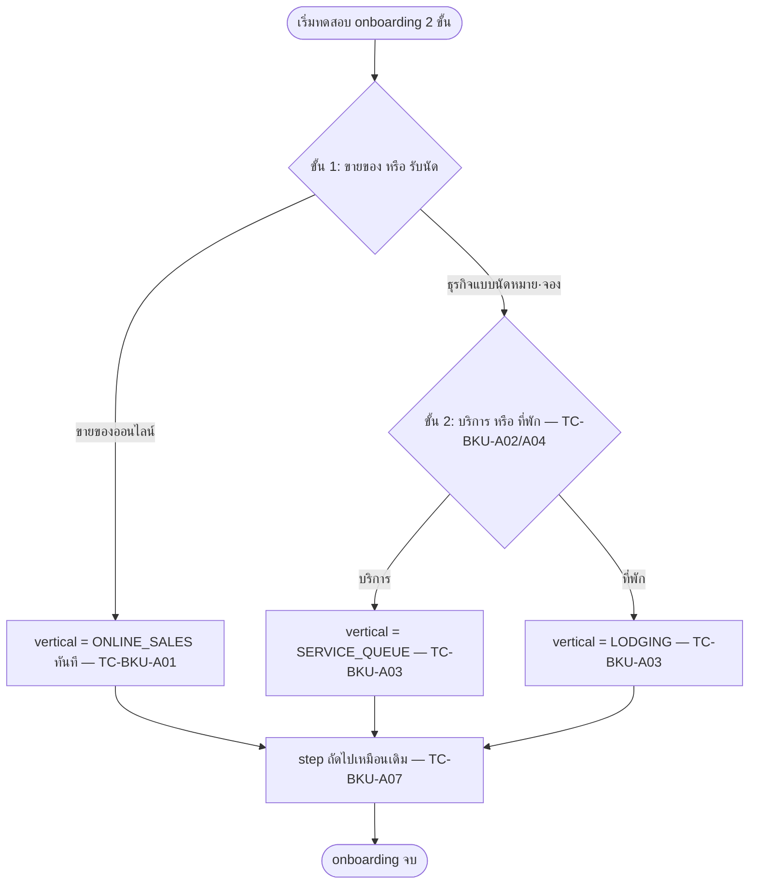
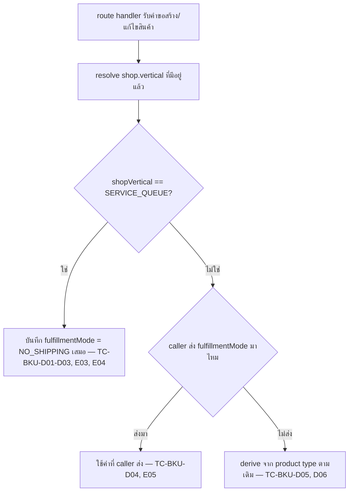

> **โมดูล:** M00030-BookingBusinessUXUnification
> **ประเภทเอกสาร:** Test Cases
> **เวอร์ชัน:** 1.0
> **วันที่จัดทำ:** 2026-08-05 (**backfill** — เขียนหลัง implement เสร็จแล้ว ไม่ใช่ก่อน)
> **สถานะ:** implemented — automated ผ่านครบ (vitest 107/107); manual/browser QA ยังไม่เคยกดจริงสักครั้ง
> **เจ้าของเอกสาร:** safepay-qa (ดู [[Feature-Docs-Ownership]])

# TestCase: รวมประสบการณ์ธุรกิจแบบนัดหมาย·จอง (Booking Business UX Unification)

---

## 1. Overview

### 1.1 หมายเหตุการ backfill

เอกสารนี้เขียน **หลัง** code เสร็จและ merge แล้ว (commits `58d35418`, `dfe24e64`, `ca961af1`) ไม่ใช่ก่อน implement ตามลำดับปกติของ Hard Rule 11 — เป็นการเติม `TestCase.md` ที่ขาดไปจาก template (retro `docs/retro/2026-08-03-feature-00028-shop-business-type-retrospective.md` เคยพลาดจุดเดียวกันมาก่อน) เนื้อหาทุกเคสอ้างจากโค้ด/เทสจริงที่มีอยู่ ณ 2026-08-05 (`feedback_write_docs_from_code_not_memory`) ไม่ใช่จากความจำ

### 1.2 ขอบเขตการทดสอบ

| ระดับ | เครื่องมือ | ครอบอะไร | สถานะ ณ 2026-08-05 |
|-------|-----------|----------|----------------------|
| **Unit (pure function)** | Vitest | `resolveFulfillmentMode`, `resolveOrderVocab`/`resolveOrderMenuLabel`/`applyOrderLabel`, `resolveVisibleSellerMenu`, `resolveOrderEventLabel`, `getOrderActionSet` | ✅ **ผ่าน 107/107** |
| **Integration (DB)** | — | ยิง API สร้าง/แก้ไขสินค้าจริงบน DB ยืนยันค่าที่บันทึก | ❌ ยังไม่มี — มีแค่ unit ของฟังก์ชันบริสุทธิ์ที่ service เรียกใช้ |
| **E2E (Playwright)** | — | onboarding 2 ขั้น ทั้ง Personal/Business, wording ครบ flow | ❌ ยังไม่มี spec — `e2e/` ไม่มีไฟล์ที่ครอบ feature นี้ (ตรวจแล้ว 2026-08-05) |
| **Visual/Browser QA** | Chrome DevTools MCP | onboarding 2 ขั้น, wording 3 vertical บนจอจริง, field-hide, layout 320px | ❌ ยังไม่เคยกดจริงสักครั้ง (dev server ไม่ได้รันตอน backfill นี้) |

### 1.3 ข้อบังคับตาม convention (ที่มีผลกับรอบทดสอบถัดไป)

- **E2E เป็นภาคบังคับ** ทุกเมนู — bypass login ด้วย `e2e/helpers/auth.ts` — **ยังไม่ทำสำหรับ feature นี้ ถือเป็นหนี้**
- QA ทดสอบบน `*.deepth.local:4000` — **ห้าม `localhost`**
- 🛑 **QA ห้ามรัน `prisma db pull`** เด็ดขาด
- grep + type-check ผ่าน ≠ ใช้ได้ — ต้องกดจริงในเบราว์เซอร์
- ตัดสิน "สวย/เป็นแบรนด์ไหม" ต้องผ่าน `/impeccable critique` — รอบ implement อ้างว่าผ่านแล้ว (critique detector 0 findings + 4 defect แก้ในรอบ `ca961af1`) แต่ QA ยังไม่ได้ยืนยันด้วยตาตัวเอง

### 1.4 ข้อมูลทดสอบที่ต้องเตรียม (สำหรับรอบทดสอบจริงถัดไป)

| ชื่อ | ค่า |
|------|-----|
| ร้าน A | `vertical = ONLINE_SALES` — ร้านขายของเดิม (zero-regression persona) |
| ร้าน B | `vertical = SERVICE_QUEUE` — ร้านคิวงาน (มีสินค้า/แพ็กเกจเสริมด้วย) |
| ร้าน C | `vertical = LODGING` — ร้านบ้านพัก |
| ร้าน D | ยังไม่ผ่าน onboarding เลย (สำหรับกลุ่ม A) ทั้ง Personal และ Business creation |
| สินค้า P1 | ของร้าน B (`SERVICE_QUEUE`) — ใช้ยิง API ตรงทดสอบ `fulfillmentMode` override |
| Inventory Add-on | เปิดให้ร้าน A บางร้าน ปิดให้บางร้าน — ใช้ตรวจ D-1 (ข้อความยกเลิกต้องเป็นจริง) |

---

## 2. Test Scenarios

### กลุ่ม A — Onboarding 2 ขั้น (Manual/Browser — **PENDING ทั้งหมด**, ยังไม่เคยกดจริง)

| ID | เคส | Precondition | Steps | Expected Result | Linked to |
|----|-----|--------------|-------|------------------|-----------|
| **TC-BKU-A01** | Personal onboarding เลือกหมวดใหญ่ "ขายของออนไลน์" | ผู้ใช้ใหม่มาถึง step เลือกประเภทร้านของ `/onboarding` | 1. เปิด `/onboarding` ถึง step เลือกประเภทร้าน 2. เห็นคำถามขั้น 1 พร้อม 2 การ์ด 3. กดการ์ด "ขายของออนไลน์" 4. กด "ถัดไป" | ไม่มีคำถามขั้น 2 ปรากฏ; `vertical` ตั้งเป็น `ONLINE_SALES` ทันที | FR-BKU-01 |
| **TC-BKU-A02** | เลือกหมวดใหญ่ "ธุรกิจแบบนัดหมาย·จอง" เผยขั้น 2 ในหน้าเดิม | เหมือน A01 | กดการ์ด "ธุรกิจแบบนัดหมาย·จอง" | คำถามขั้น 2 ("บริการ"/"ที่พัก") เผยขึ้นทันทีในหน้าเดิม **ไม่เปลี่ยน URL/step** | FR-BKU-01 |
| **TC-BKU-A03** | ขั้น 2 → mapping ค่าถูกต้อง | ต่อจาก A02 | เลือก "บริการ" (เคสหนึ่ง) / "ที่พัก" (อีกเคส) แล้วกดถัดไป | เคส 1 → `vertical = SERVICE_QUEUE`; เคส 2 → `vertical = LODGING` | FR-BKU-01, BR-BKU-06 |
| **TC-BKU-A04** | ปุ่ม "ถัดไป" disable จนกว่าจะเลือกขั้น 2 ครบ | เลือกหมวดใหญ่แล้ว ยังไม่เลือกขั้น 2 | สังเกต/พยายามกดปุ่ม | ปุ่ม disabled กดไม่ได้จนกว่าจะเลือกหมวดย่อย | BR-BKU-08 |
| **TC-BKU-A05** | Business creation ใช้ component เดียวกัน behavior เหมือน Personal | กำลังสร้างบัญชี Business ใหม่ | เปิด `BusinessCreateModal` ถึงส่วนเลือกประเภทร้าน ทำซ้ำ A01–A04 | พฤติกรรมเหมือนกันทุกประการ (implement จริงคือ `VerticalTaxonomyPicker` ตัวเดียวกัน) | FR-BKU-02, BR-BKU-07 |
| **TC-BKU-A06** | ค่า default ก่อนกดอะไรเลย | เพิ่งเปิดหน้า | สังเกต state เริ่มต้น | ยังเป็น `ONLINE_SALES` (`DEFAULT_SHOP_VERTICAL`) | BR-BKU-03 |
| **TC-BKU-A07** | Step ถัดไปหลัง vertical selection ไม่ regression | ผ่าน A01/A03 แล้ว | เดินต่อ: category → slug → (product/queue/rooms ตาม vertical) | ทุก step ทำงานเหมือนก่อนมีงานนี้ ไม่มี dead-end | FR-BKU-01/02 |
| **TC-BKU-A08** | badge "มี/ไม่มีจัดส่งสินค้า" ถูกถอดออกแล้วจริง | อยู่ที่ step เลือกประเภทร้าน | สังเกต badge ใต้การ์ด | ไม่มี badge ซ้ำ (คำอธิบายใต้การ์ดพูดเรื่องเดียวกันไปแล้ว) | UX-Copy §7 |

### กลุ่ม B — Wording SSOT: ระดับฟังก์ชัน (Automated — ✅ **PASSED**, vitest 2026-08-05)

| ID | เคส | ไฟล์เทส | Expected Result | Linked to |
|----|-----|---------|------------------|-----------|
| **TC-BKU-B01** | `resolveOrderVocab` คืน 4 ช่องถูกต้องทั้ง 3 vertical | `src/lib/seller-menu.test.ts` | ONLINE_SALES=(คำสั่งซื้อ,คำสั่งซื้อ,สร้างคำสั่งซื้อ,สร้างคำสั่งซื้อ) · SERVICE_QUEUE=(การเข้ารับบริการ,บริการ,สร้างการเข้ารับบริการ,งานใหม่) · LODGING=(บิลเข้าพัก,บิลเข้าพัก,เปิดบิลเข้าพัก,เปิดบิลเข้าพัก) | BR-BKU-10 |
| **TC-BKU-B02** | vertical ไม่รู้จัก → fail-safe ชุด `ONLINE_SALES` | เดียวกัน | `resolveOrderVocab('SOMETHING_NEW')` = `ORDER_VOCAB.ONLINE_SALES` | BR-BKU-10 |
| **TC-BKU-B03** | `resolveOrderMenuLabel` = `noun` ชุดเดียวกัน (ห้ามแยกคลังคำ) | เดียวกัน | เท่ากันทุกค่า (3 vertical + ค่าเพี้ยน) | BR-BKU-09/10 |
| **TC-BKU-B04** | `nounShort` ไม่ยาวกว่า `noun` ทุก vertical | เดียวกัน | ผ่านทุกตัวใน `ORDER_VOCAB` | UX-Copy §8 ข้อ 6 |
| **TC-BKU-B05** | `applyOrderLabel` ผันเฉพาะ `seller:orders` ไม่แตะรายการอื่น | เดียวกัน | diff เมนูเปลี่ยนแค่แถวเดียว | BR-BKU-09 |
| **TC-BKU-B06** | `applyOrderLabel` เป็น pure transform | เดียวกัน | `sellerMenuItems` ต้นฉบับไม่ถูกแก้ | zero-regression |
| **TC-BKU-B07** | `resolveVisibleSellerMenu` filter ถูกต้องครบ 3 vertical | เดียวกัน | เมนูต่อ vertical ตาม allow-list | zero-regression |
| **TC-BKU-B08** | ป้าย `/orders` ผันผ่าน pipeline เต็ม | เดียวกัน | LODGING → "บิลเข้าพัก" | BR-BKU-09 |
| **TC-BKU-B09** | ร้านส่วนตัว/ผู้ถูกเชิญไม่เห็นเมนูพนักงาน | เดียวกัน | `PERSONAL` → ไม่มี `seller:admins` | zero-regression |
| **TC-BKU-B10** | slug contract 26 รายการตรึงไว้ | เดียวกัน | ตรงกับ list ที่ตรึงเป๊ะ | zero-regression (00027) |
| **TC-BKU-B11** | `resolveOrderEventLabel('ORDER_CREATED')` ใช้ `createLabel` ตรง ๆ — LODGING = "เปิดบิลเข้าพัก" **ไม่ใช่** "สร้างบิลเข้าพัก" | `src/lib/order-event.test.ts` | ผลลัพธ์ LODGING ไม่มีคำว่า "สร้าง" | BR-BKU-09, UX-Copy §3 |
| **TC-BKU-B12** | `ORDER_EDITED`/`ORDER_CANCELLED` ผันเป็น กริยา+noun | เดียวกัน | "แก้ไขการเข้ารับบริการ"/"ยกเลิกบิลเข้าพัก" ฯลฯ | BR-BKU-09 |
| **TC-BKU-B13** | event นอก lifecycle (พัสดุ/SMS/BUYER_CONFIRMED) **ไม่ผัน** | เดียวกัน | label = `ORDER_EVENT_META[type].label` เดิมทุก vertical | BR-BKU-11 |
| **TC-BKU-B14** | `getOrderActionSet` matrix ครบทุก combination หลังเพิ่ม `orderNoun` | `order-action-set.test.ts` (73 cases) | matrix เดิมไม่พัง (CANCELLED ว่าง, ISHIP ไม่มี edit-tracking, PICKUP=NO_SHIPPING) | zero-regression |

### กลุ่ม C — Wording SSOT: ระดับหน้าจอจริง (Manual/Browser — **PENDING ทั้งหมด**)

| ID | เคส | Precondition | Steps | Expected Result | Linked to |
|----|-----|--------------|-------|------------------|-----------|
| **TC-BKU-C01** | wording ครบ list→detail→timeline→edit→blocked ทั้ง 3 vertical | ร้าน A/B/C มีออเดอร์อย่างน้อย 1 ใบ | ไล่เปิด `/orders` → `/orders/new` → `/orders/[token]` → `/orders/[token]/edit` ตรวจ title/breadcrumb/ปุ่ม/toast/หัวการ์ด/timeline/เมนู ⋮/blockedCopy | ทุกจุดใน BRD §2.2 (15 รายการ) แสดงคำตรง vertical ตาม `ORDER_VOCAB` | FR-BKU-03, BR-BKU-09 |
| **TC-BKU-C02** | D-1: ข้อความยกเลิกต้องเป็นจริง | ร้าน B + ร้าน A ที่ไม่มี Inventory Add-on | กดยกเลิกออเดอร์ อ่าน confirm dialog | **ไม่มี** "สินค้าจะถูกคืนเข้าสต็อก" | BR-BKU-10c |
| **TC-BKU-C02b** | D-1 inverse: ร้าน A ที่มี item `stockDeducted != null` | ร้าน A + Inventory Add-on | กดยกเลิก อ่าน dialog | เห็น "สินค้าจะถูกคืนเข้าสต็อก" เฉพาะกรณีนี้ | BR-BKU-10c |
| **TC-BKU-C03** | D-2: `aria-label` ตรงข้อความที่ตาเห็นใน `SubmitStatusSheet` | สร้างออเดอร์ผ่าน `/orders/new` | inspect accessible name ตอน submitting/error | aria-label และข้อความที่เห็นมาจาก `createLabel` ตัวเดียวกัน | BR-BKU-10d |
| **TC-BKU-C04** | LODGING subtitle คู่ `/bookings` ↔ `/orders` บน desktop ≥ lg | ร้าน C | เปิดทั้ง 2 หน้าที่ viewport ≥ 1200px | subtitle คู่ตรงข้ามครบทั้งคู่ · **มือถือ (<lg) ต้องไม่เห็นทั้งคู่** (ห่อ `hidden lg:block` ทั้งสองหน้าแล้วตาม `ca961af1`) | UX-Copy §6 |
| **TC-BKU-C05** | `VERTICAL_CTA` แผงลูกค้าในแชทอ่านจาก SSOT (ยกเว้น LODGING = "การจอง" ตามเจตนา C-3) | ร้าน A/B/C | เปิดแท็บข้อมูลลูกค้าในแชท | ONLINE_SALES/SERVICE_QUEUE ตรง `ORDER_VOCAB`; LODGING คง "การจอง" (คนละ entity) | BR-BKU-10b |
| **TC-BKU-C06** | คำยาวสุด "การเข้ารับบริการ" ไม่พัง layout ที่ 320px | ร้าน B, viewport 320px | ตรวจ bottom nav/sidebar/breadcrumb/timeline h5 | ไม่มีคำถูกตัด ไม่มี layout ล้น (timeline `min-h-9` + ข้อความ 2 บรรทัดต้องไม่เพี้ยน) | UX-Copy §8 ข้อ 6 |
| **TC-BKU-C07** | ร้าน LODGING เข้า `/orders/new` ได้จริงหรือไม่ (**open verify จาก UX-Copy §8 ข้อ 7**) | ร้าน C | เปิด `/orders/new` ตรงด้วย URL | ยืนยันว่าเข้าได้/ถูกบล็อก — โค้ดผูกเงื่อนไข ONLINE_SALES เฉพาะจุด iShip create-mode ไม่ block ทั้งหน้า แต่ยังไม่เคยยืนยันด้วยตา — ถ้าเข้าไม่ได้จริง `createLabel` LODGING ไม่มีที่ใช้ | UX-Copy §8 ข้อ 7 |
| **TC-BKU-C08** | ร้าน ONLINE_SALES เห็นคำเดียว "คำสั่งซื้อ" ทุกจุด ไม่เหลือ "ออเดอร์" | ร้าน A | เดิน flow ปกติ list → new → detail → cancel | copy ที่เห็นใช้ "คำสั่งซื้อ" ตรงกันหมด — grep ดิบ (`rg "ออเดอร์"`) ยังเจอ 247 hits รวมคอมเมนต์+ไฟล์นอกขอบเขต ต้องแยก string ที่ user เห็นจริงก่อนสรุป | PRD §8, C-2 |

### กลุ่ม D — fulfillmentMode lock: ระดับฟังก์ชัน (Automated — ✅ **PASSED**, vitest 2026-08-05)

| ID | เคส | ไฟล์เทส | Expected Result | Linked to |
|----|-----|---------|------------------|-----------|
| **TC-BKU-D01** | SERVICE_QUEUE ชนะค่าที่ caller ส่ง (`explicit: 'SHIPPED'`) | `product-fulfillment-mode.test.ts` | คืน `'NO_SHIPPING'` — หัวใจของกฎ (override ไม่ใช่แค่ default) | BR-BKU-13 |
| **TC-BKU-D02** | SERVICE_QUEUE ชนะค่าที่ derive จาก `type: 'PHYSICAL'` | เดียวกัน | คืน `'NO_SHIPPING'` | BR-BKU-13 |
| **TC-BKU-D03** | SERVICE_QUEUE ชนะแม้ส่งทั้ง explicit+type | เดียวกัน | คืน `'NO_SHIPPING'` | BR-BKU-13 |
| **TC-BKU-D04** | vertical อื่น/undefined/เพี้ยน → caller ชนะตามเดิม | เดียวกัน | คืน `'SHIPPED'` ทุกกรณี | BR-BKU-15 |
| **TC-BKU-D05** | derive เดิม: PHYSICAL→SHIPPED, DIGITAL→NO_SHIPPING | เดียวกัน | zero-regression | BR-BKU-15 |
| **TC-BKU-D06** | ไม่ส่งอะไรเลย → `undefined` (partial update ไม่ถูกเดา) | เดียวกัน | คืน `undefined` | BR-BKU-15 |
| **TC-BKU-D07** | type ไม่รู้จัก + ไม่มี explicit → `undefined` | เดียวกัน | คืน `undefined` | BR-BKU-15 |
| **TC-BKU-D08** | LODGING ไม่ส่งอะไรเลย → `undefined` (**ไม่ถูกล็อก**) | เดียวกัน | คืน `undefined` — lock เฉพาะ SERVICE_QUEUE | BR-BKU-15 |

### กลุ่ม E — fulfillmentMode lock: ระดับหน้าจอ/API (Manual — **PENDING ทั้งหมด**)

| ID | เคส | Precondition | Steps | Expected Result | Linked to |
|----|-----|--------------|-------|------------------|-----------|
| **TC-BKU-E01** | `ProductFormV2` ซ่อนช่อง "ต้องจัดส่ง" จริงสำหรับร้าน SERVICE_QUEUE | ร้าน B | เปิดฟอร์มสร้าง/แก้ไขสินค้า | ไม่มี fieldset fulfillmentMode ปรากฏ (ซ่อนจริง ไม่ใช่ disabled) · create-mode payload = `NO_SHIPPING` (default แก้แล้วใน `ca961af1`) | FR-BKU-04, BR-BKU-16 |
| **TC-BKU-E02** | ร้าน ONLINE_SALES/LODGING เห็นฟอร์มเหมือนเดิม | ร้าน A/C | เปิดฟอร์มสินค้า | เห็นช่องเลือกตามปกติ | FR-BKU-04 |
| **TC-BKU-E03** | ยิง `POST /api/products` ตรงด้วย `fulfillmentMode: "SHIPPED"` บนร้าน SERVICE_QUEUE | ร้าน B + auth cookie | ยิง request ตรง | DB บันทึก `NO_SHIPPING` | FR-BKU-05, BR-BKU-13 |
| **TC-BKU-E04** | ยิง `PATCH /api/products/:id` ตรงด้วย `"SHIPPED"` บนสินค้าร้าน B | สินค้า P1 | ยิง PATCH | ยังเป็น `NO_SHIPPING` — สำคัญเพราะ `updateProduct` เดิมไม่มี logic นี้เลย | FR-BKU-05, BR-BKU-14 |
| **TC-BKU-E05** | ร้าน A/C ยิง API พร้อม fulfillmentMode ตรง → ใช้ค่าที่ส่ง | ร้าน A/C | POST พร้อม `NO_SHIPPING` | บันทึกตามที่ส่ง (ไม่ล็อก) | BR-BKU-15 |

### กลุ่ม F — Zero-regression / Cross-cutting (**PENDING**)

| ID | เคส | วิธีตรวจ | Expected Result | Linked to |
|----|-----|---------|------------------|-----------|
| **TC-BKU-F01** | grep "ออเดอร์" เหลือเฉพาะคอมเมนต์/นอกขอบเขต | `rg "ออเดอร์" "src/app/(paces)/seller/"` แยกประเภท hit | string ที่ user เห็นใน order-lifecycle scope = 0 (ยกเว้น debt ที่ประกาศใน `58d35418`) | PRD §8 |
| **TC-BKU-F02** | ไม่มี migration ใหม่ | diff `prisma/migrations/` ของ commits งานนี้ | ไม่มีไฟล์ใหม่ | BR-BKU-01 |
| **TC-BKU-F03** | `Room`/`ServiceResource` schema ไม่ถูกแตะ | schema diff | ไม่เปลี่ยน | PRD §5 Out of Scope |
| **TC-BKU-F04** | tsc สะอาดในไฟล์ที่แตะ | `node node_modules/typescript/lib/tsc.js --noEmit` | ไม่มี error ใหม่ในไฟล์ 00030 (ยืนยันแล้ว 2026-08-05 — baseline worktree 78 × TS2307 asset ไม่เกี่ยว) | zero-regression |

---

## 3. Traceability Matrix

| FR/BR | Test Case | สถานะ |
|-------|-----------|--------|
| FR-BKU-01 | TC-BKU-A01–A04, A06–A08 | PENDING (manual) |
| FR-BKU-02 | TC-BKU-A05 | PENDING (manual) |
| FR-BKU-03 | TC-BKU-C01 (+B01–B14 ระดับฟังก์ชัน) | ฟังก์ชัน PASSED · จอจริง PENDING |
| FR-BKU-04 | TC-BKU-E01, E02 | PENDING (manual) |
| FR-BKU-05 | TC-BKU-D01–D08 (PASSED) + E03–E05 (PENDING) | ผสม |
| BR-BKU-01 | TC-BKU-F02 | PENDING verify |
| BR-BKU-02 (immutable) | — สืบทอดจาก BR-LODG-30/BR-SBT-08 เดิม | นอกขอบเขต backfill |
| BR-BKU-03 | TC-BKU-A06 | PENDING |
| BR-BKU-04 | TC-BKU-D01–D08, E03–E04 | ผสม |
| BR-BKU-05/06 | TC-BKU-A01–A03 | PENDING |
| BR-BKU-07 | TC-BKU-A05 | PENDING |
| BR-BKU-08 | TC-BKU-A04 | PENDING |
| BR-BKU-09 | TC-BKU-B01–B13, C01 | ผสม |
| BR-BKU-10 | TC-BKU-B01, B02, B04 | PASSED |
| BR-BKU-10b | TC-BKU-C05 | PENDING |
| BR-BKU-10c (D-1) | TC-BKU-C02, C02b | PENDING |
| BR-BKU-10d (D-2) | TC-BKU-C03 | PENDING |
| BR-BKU-11 | TC-BKU-B13 | PASSED |
| BR-BKU-12 | — code review เท่านั้น | ช่องว่าง (ดู §5) |
| BR-BKU-13 | TC-BKU-D01–D03, E03 | ผสม |
| BR-BKU-14 | TC-BKU-E03, E04 | PENDING |
| BR-BKU-15 | TC-BKU-D04–D08, E05 | ผสม |
| BR-BKU-16 | TC-BKU-E01 | PENDING |
| BR-BKU-17 | — code review เท่านั้น | ช่องว่าง (ดู §5) |

---

## 4. Flow

---

## 5. ผลล่าสุด

| Run | วันที่ | ผล | ผู้ทดสอบ |
|-----|--------|-----|-----------|
| Unit (Vitest) ครบ 4 ไฟล์ | 2026-08-05 | ✅ **107/107** — fulfillment (12) + seller-menu (19) + order-action-set (73) + order-event (3) | safepay-qa (backfill, รันยืนยันซ้ำ) |
| Integration (API จริง) | — | ⛔ ยังไม่รัน | — |
| E2E (Playwright) | — | ⛔ ยังไม่มี spec เลย | — |
| Browser QA | — | ⛔ ยังไม่เคยกดจริงสักครั้ง (dev server ไม่ได้รัน) | — |
| grep "ออเดอร์" ดิบ | 2026-08-05 | ⚠️ 247 hits (รวมคอมเมนต์/นอกขอบเขต) — ต้อง pass ที่แม่นกว่านี้ | safepay-qa |
| `/impeccable critique`/`clarify` | 2026-08-05 | ตาม `ca961af1`: detector 0 findings + 4 defect แก้ครบ, clarify ผ่าน — QA ยังไม่ verify อิสระ | — |

---

## 6. สรุป + Open Items (carry ไปรอบถัดไป)

แยกชัด: **พิสูจน์แล้วจริง** = unit 107/107 (pure function ทั้งหมด ไม่แตะ DB) · **ยังเป็นคำกล่าวอ้าง** = ทุกอย่างบนจอจริง

1. **E2E Playwright ยังไม่มีเลย** — ต้องเขียน spec ครอบ onboarding 2 ขั้น (Personal+Business) เป็นอย่างน้อย
2. **Integration test ระดับ API/DB ของ fulfillmentMode lock ยังไม่มี** (TC-BKU-E03/E04)
3. **Browser QA ทั้งหมดยังไม่เคยกดจริง** — โดยเฉพาะ D-1 (confirm ยกเลิกที่ย้อนกลับไม่ได้)
4. **grep verify "ออเดอร์" ยังไม่แม่น** — 247 hits ดิบต้องแยกคอมเมนต์/ขอบเขตก่อนปิด PRD §8
5. **TC-BKU-C07 (LODGING เข้า /orders/new)** — open verify เดิมจาก UX-Copy §8 ข้อ 7
6. **BR-BKU-12/17** ไม่มี TC เฉพาะ — ตรวจได้จาก code review เท่านั้น
7. **BR-BKU-02 (immutable)** สืบทอดจาก 00017/00028 — นอกขอบเขต backfill รอบนี้
