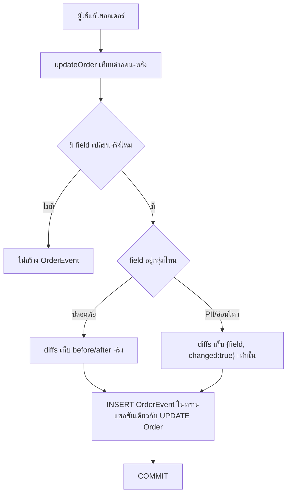
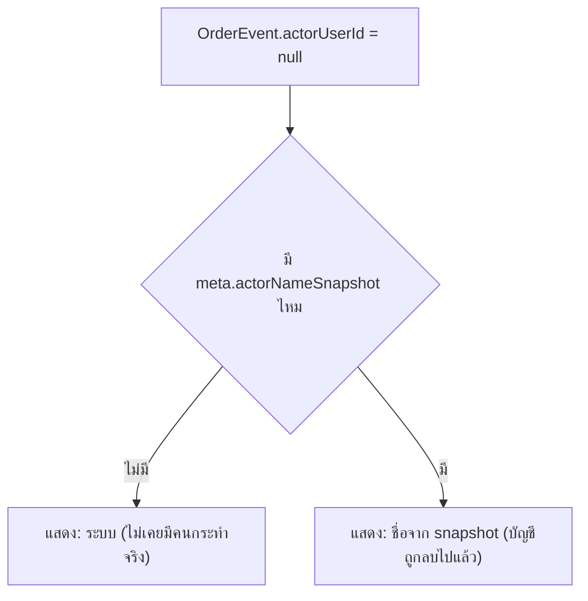

> **โมดูล:** M31-OrderActivityLog
> **ประเภทเอกสาร:** Business Requirements Document (BRD) - NON-TECHNICAL
> **เวอร์ชัน:** 1.0
> **วันที่จัดทำ:** 2026-08-04
> **สถานะ:** Draft
> **เจ้าของเอกสาร:** BA

# BRD: ประวัติกิจกรรมคำสั่งซื้อ (Order Activity Log)

---

## 1. บทนำ

### 1.1 วัตถุประสงค์ของเอกสาร

เอกสารนี้มีวัตถุประสงค์เพื่อ:
1. อธิบายความต้องการหลักของระบบบันทึกกิจกรรมคำสั่งซื้อ (`OrderEvent`) ที่แยกออกจากการ์ดสถานะเดิม
2. กำหนดขอบเขตการทำงาน — เหตุการณ์ที่ต้องบันทึก, ใครเห็นได้, ข้อมูลที่ห้ามเก็บ
3. อธิบายเงื่อนไขการใช้งานและกฎทางธุรกิจว่าด้วยความปลอดภัยของตัวตนผู้กระทำ (actor) และ PII
4. สร้างความเข้าใจร่วมกันระหว่างทีมธุรกิจและทีมพัฒนาก่อนเข้าสู่ขั้น SRS/SDS/DATABASE/API/Tests (Hard Rule 11 — ห้าม implement ก่อนมี PRD+BRD ผ่าน review)

### 1.2 ขอบเขตของระบบ

**ประวัติกิจกรรมคำสั่งซื้อ** คือระบบบันทึก audit log ระดับออเดอร์ ที่จับคู่ "การกระทำ" กับ "ผู้กระทำ" และ "เวลา" อัตโนมัติทุกครั้งที่มีการเปลี่ยนแปลงสำคัญเกิดขึ้นกับออเดอร์

**เข้าสู่ระบบ (Input):**
- session ของผู้ใช้ (seller/staff/buyer) ที่กำลังทำ action บนออเดอร์
- ผลลัพธ์ของ action นั้น (สร้าง/แก้ไข/ยกเลิก/แจ้งเลขพัสดุ/เปิดพัสดุ iShip/ส่ง SMS/ยืนยันรับของ)

**ออกจากระบบ (Output):**
- แถว `OrderEvent` ใหม่ 1 แถวต่อ 1 การกระทำ
- ไทม์ไลน์กิจกรรมที่แสดงในหน้ารายละเอียดคำสั่งซื้อฝั่งร้าน

**ระบบที่เกี่ยวข้อง:**
- Simple OMS (FR-6 ใน `docs/PRD.md`) — order lifecycle เดิมทั้งหมด
- iShip Shipping Integration (feature 00022) — `OrderShipment`
- SMS Order Link + Seller Wallet — `SmsCode`
- Shop Staff Invite (feature 00012) — `ShopMember`, `ShopInvite`

### 1.3 กลุ่มผู้ใช้งาน

| กลุ่มผู้ใช้ | บทบาท | สิทธิ์การใช้งาน |
|-----------|--------|----------------|
| **เจ้าของร้าน** | `ShopMember.role=OWNER` | เห็นไทม์ไลน์เต็มของทุกออเดอร์ในร้านตัวเอง |
| **พนักงานที่ถูกเชิญ** | `ShopMember.role=ADMIN` | เห็นไทม์ไลน์เต็มเท่ากับเจ้าของร้าน (ไม่มี toggle จำกัดสิทธิ์ใน MVP) |
| **ผู้ซื้อ** | ไม่มีสิทธิ์เห็น log | ไม่แสดงที่ `/o/[token]` (Out of Scope) |
| **ระบบ (System)** | actor พิเศษเมื่อ `actorUserId=null` และไม่มี snapshot ชื่อ | ใช้เฉพาะ event ที่ไม่มีคนกดจริง (เช่น ปิดประมูลอัตโนมัติ) |

---

## 2. ความต้องการหลัก (Functional Requirements)

### 2.1 การบันทึกเหตุการณ์ (Event Capture)

#### FR-001: บันทึกเหตุการณ์สร้างคำสั่งซื้อ

**User Story:**
> ในฐานะเจ้าของร้าน ฉันต้องการให้ระบบบันทึกอัตโนมัติว่าใครสร้างคำสั่งซื้อและเมื่อไหร่ เพื่อให้สืบย้อนได้เมื่อมีคำถามเรื่องที่มาของออเดอร์

**Acceptance Criteria:**
- [ ] เมื่อ `createOrder()` สำเร็จ ต้องมีแถว `OrderEvent(type='ORDER_CREATED')` เกิดขึ้นในทรานแซกชันเดียวกัน
- [ ] ถ้า `createdByUserId` ที่ส่งเข้า `createOrder()` ไม่เป็น `null` → `OrderEvent.actorUserId` ต้องเท่ากับค่านั้น และ `meta.actorNameSnapshot` ต้องมีชื่อของ user คนนั้น ณ เวลาที่สร้าง
- [ ] ถ้า `createdByUserId` เป็น `null` (เช่น auction ปิดอัตโนมัติ) → `OrderEvent.actorUserId = null` และไม่มี `meta.actorNameSnapshot`
- [ ] `createOrder()` ที่ล้มเหลว (throw error ใด ๆ) ต้องไม่มี `OrderEvent` หลงเหลืออยู่ (rollback พร้อมกัน)

**Business Flow:**
1. ผู้ใช้กดสร้างออเดอร์ (POS/quick-create/นำเข้าจากพัสดุ)
2. Route ส่ง `session.user.id` เข้า `createOrder()` เป็น `createdByUserId` (หรือ `null` ถ้าเป็น auction)
3. `createOrder()` เขียน `Order` + `OrderEvent` ในทรานแซกชันเดียว

#### FR-002: บันทึกเหตุการณ์แก้ไขคำสั่งซื้อแบบ field-level

**User Story:**
> ในฐานะเจ้าของร้าน ฉันต้องการรู้ว่า field ไหนของออเดอร์ถูกแก้ไข โดยใคร และเปลี่ยนจากอะไรเป็นอะไร (เฉพาะ field ที่ไม่ใช่ข้อมูลอ่อนไหวของผู้ซื้อ) เพื่อตรวจสอบความถูกต้องของราคา/รายการสินค้าได้

**Acceptance Criteria:**
- [ ] `updateOrder()` ที่เปลี่ยนค่า field ใดก็ตามในกลุ่ม "ปลอดภัย" (§3.3 ของ PRD) ต้องบันทึก `meta.diffs` พร้อมค่า before/after ของ field นั้นเท่านั้น (field ที่ไม่เปลี่ยนต้องไม่ปรากฏใน diffs)
- [ ] `updateOrder()` ที่เปลี่ยนค่า field ในกลุ่ม PII/อ่อนไหว (`buyerContact`/`buyerName`/`shippingAddress`/`internalNote`) ต้องบันทึกเฉพาะ `{ field, changed: true }` — ห้ามมีค่าจริงปรากฏใน `meta` เด็ดขาด
- [ ] `updateOrder()` ที่เรียกแล้วไม่มีค่าใด ๆ เปลี่ยนจริง (ส่งค่าเดิมทั้งหมด) ต้อง**ไม่สร้าง** `OrderEvent(type='ORDER_EDITED')` เลย
- [ ] Query PII จาก `meta` ทั้งตาราง (`grep`/SQL scan สุ่ม) ต้องไม่พบ raw phone/email/address

**Business Flow:**
1. ผู้ใช้แก้ไขออเดอร์ผ่านฟอร์ม
2. `updateOrder()` เทียบค่าก่อน-หลังของทุก field ที่ส่งมา แบ่งกลุ่มตาม allow-list
3. สร้าง `meta.diffs` เฉพาะ field ที่เปลี่ยนจริง ตามกฎกลุ่ม
4. เขียน `Order` (update) + `OrderEvent` ในทรานแซกชันเดียว

#### FR-003: บันทึกเหตุการณ์ยกเลิกคำสั่งซื้อ

**User Story:**
> ในฐานะเจ้าของร้าน ฉันต้องการรู้ว่าใคร (ร้านหรือผู้ซื้อ) เป็นคนยกเลิกออเดอร์ เพื่อแยกแยะกรณีพนักงานยกเลิกผิดกับผู้ซื้อยกเลิกเอง

**Acceptance Criteria:**
- [ ] `cancelOrder()` ต้องรับพารามิเตอร์ `actorUserId` เพิ่ม (ปัจจุบันไม่รับ — ต้องแก้ signature)
- [ ] เมื่อ `initiator='seller'` และมี `actorUserId` → `meta.actorNameSnapshot` ต้องมีชื่อจริงของคนที่กด
- [ ] เมื่อ `initiator='buyer'` และผู้ซื้อเป็น guest (ไม่มี `actorUserId`) → `actorUserId=null`, `meta.initiatorRole='buyer'`, ไม่มี `actorNameSnapshot`
- [ ] `Order.cancelInitiator` ที่มีอยู่แล้วต้องยังคงเดิมทุกประการ (ไม่เปลี่ยน behavior เดิม — เพิ่ม log เป็นของใหม่เท่านั้น)

#### FR-004: บันทึกเหตุการณ์แจ้งเลขพัสดุด้วยตนเอง

**User Story:**
> ในฐานะเจ้าของร้าน ฉันต้องการรู้ว่าใครเป็นคนกรอกเลขพัสดุให้ออเดอร์นี้ (กรณีไม่ผ่าน iShip) เพื่อตรวจสอบเมื่อเลขพัสดุผิด

**Acceptance Criteria:**
- [ ] `shipOrder()`/`updateShipmentTracking()` ต้องรับ `actorUserId` และเขียน `OrderEvent(type='TRACKING_ADDED')` พร้อม `meta.provider` (ชื่อขนส่งที่กรอก — ไม่ใช่ PII)
- [ ] เขียนพร้อมกับ `ShipmentTracking` ในทรานแซกชันเดียว

### 2.2 iShip Shipment Events

#### FR-005: บันทึกเหตุการณ์เปิดพัสดุผ่าน iShip

**User Story:**
> ในฐานะเจ้าของร้าน ฉันต้องการรู้ว่าใครกดเปิดพัสดุกับ iShip ให้ออเดอร์นี้ เพื่อตรวจสอบเมื่อพัสดุมีปัญหา

**Acceptance Criteria:**
- [ ] `createShipment()` สำเร็จ (`OrderShipment.status='CREATED'`) ต้องเขียน `OrderEvent(type='SHIPMENT_CREATED', actorUserId=OrderShipment.createdByUserId, meta.courierName)`
- [ ] ถ้าเปิดพัสดุในโหมด AUTO (`createdByUserId=null`) → `OrderEvent.actorUserId=null` เช่นกัน ไม่ fallback เป็นใคร

#### FR-006: บันทึกเหตุการณ์ยกเลิกพัสดุ iShip

**User Story:**
> ในฐานะเจ้าของร้าน ฉันต้องการรู้ว่าใครยกเลิกพัสดุที่เปิดไปแล้ว เพื่อตรวจสอบว่าไม่ใช่การยกเลิกผิดพลาด

**Acceptance Criteria:**
- [ ] `cancelShipment()` สำเร็จ ต้องเขียน `OrderEvent(type='SHIPMENT_CANCELLED', actorUserId=OrderShipment.cancelledByUserId, meta.courierName)`

#### FR-007: บันทึกเหตุการณ์ผูกพัสดุที่มีอยู่แล้ว

**User Story:**
> ในฐานะเจ้าของร้าน ฉันต้องการรู้ว่าใครผูกพัสดุที่เปิดไว้บน iShip ก่อนหน้าเข้ากับออเดอร์นี้ เพื่อแยกจากพัสดุที่ Deep เปิดให้เอง

**Acceptance Criteria:**
- [ ] `linkShipment()` สำเร็จ (`OrderShipment.source='LINKED'`) ต้องเขียน `OrderEvent(type='SHIPMENT_LINKED', actorUserId, meta.courierName)`

### 2.3 SMS & Buyer Events

#### FR-008: บันทึกเหตุการณ์ส่งลิงก์ทาง SMS

**User Story:**
> ในฐานะเจ้าของร้าน ฉันต้องการรู้ว่าใครกดส่ง SMS (เสียเครดิต ฿1/ครั้ง) ให้ออเดอร์นี้ เพื่อตรวจสอบการใช้เครดิตของร้าน

**Acceptance Criteria:**
- [ ] `POST /api/orders/[token]/send-sms` สำเร็จ (issue `SmsCode` สำเร็จ + หักเครดิต) ต้องเขียน `OrderEvent(type='SMS_LINK_SENT', actorUserId)`
- [ ] `meta` ของ event นี้ **ห้ามมีเบอร์โทรปลายทางของผู้ซื้อ** ไม่ว่ากรณีใด (ตรงตาม BR-OEV-02)
- [ ] ถ้าการส่ง SMS ล้มเหลว (เครดิตไม่พอ/rate limit) ต้อง**ไม่**เขียน event (event = "ส่งสำเร็จ" เท่านั้น ไม่ใช่ "พยายามส่ง")

#### FR-009: บันทึกเหตุการณ์ผู้ซื้อยืนยันรับของ

**User Story:**
> ในฐานะเจ้าของร้าน ฉันต้องการรู้เวลาที่แน่ชัดที่ผู้ซื้อกดยืนยันรับสินค้า/บริการ แยกจากเวลาที่ออเดอร์ถูกแก้ไขด้วยเหตุอื่น

**Acceptance Criteria:**
- [ ] `confirmOrder()` สำเร็จ ต้องเขียน `OrderEvent(type='BUYER_CONFIRMED', actorUserId=buyerUserId ถ้ามี หรือ null)`
- [ ] event นี้มี `occurredAt` เป็นของตัวเอง ไม่ผูกกับ `Order.updatedAt` ที่ overwrite ได้จากหลายสาเหตุ

### 2.4 การแสดงผลไทม์ไลน์

#### FR-010: แสดงไทม์ไลน์กิจกรรมในหน้ารายละเอียดคำสั่งซื้อฝั่งร้าน

**User Story:**
> ในฐานะเจ้าของร้าน/พนักงาน ฉันต้องการเห็นลำดับเหตุการณ์ทั้งหมดของออเดอร์เรียงเวลา เพื่อเข้าใจว่าออเดอร์นี้เดินทางมาอย่างไร

**Acceptance Criteria:**
- [ ] หน้า `seller/orders/[token]` แสดง `OrderEvent` ทั้งหมดของออเดอร์นั้น เรียงจากใหม่→เก่า
- [ ] แต่ละแถวแสดง: ประเภทเหตุการณ์ (ข้อความไทยตามตาราง §3.1.1 ของ PRD), ชื่อ actor (หรือ "ระบบ"), เวลา (`formatDateTime`)
- [ ] ผู้ใช้ที่ไม่ใช่ `ShopMember` ของร้านนั้น (owner/staff) เรียก endpoint นี้ต้องได้ 403/404 — ทดสอบด้วยบัญชีร้านอื่น
- [ ] Field ที่ไม่ต้องแสดง (เช่น diff ของ PII field) ต้องไม่ปรากฏใน RSC flight payload เลย (ตรวจด้วย view-source/flight inspection ไม่ใช่แค่ไม่ render บนจอ)

#### FR-011: จัดลำดับเวลาที่ deterministic แม้ `occurredAt` ชนกัน

**User Story:**
> ในฐานะเจ้าของร้าน ฉันต้องการให้ไทม์ไลน์เรียงลำดับเดิมทุกครั้งที่โหลด แม้มี 2 เหตุการณ์เกิดเวลาเดียวกันเป๊ะ

**Acceptance Criteria:**
- [ ] 2 event ที่มี `occurredAt` เท่ากันเป๊ะ ต้องเรียงลำดับเดียวกันทุกครั้งที่ query ซ้ำ (ไม่สุ่ม)
- [ ] ลำดับ tie-break ต้องสอดคล้องกับลำดับที่เกิดขึ้นจริง (insert order) ไม่ใช่ลำดับตามตัวอักษรของ `type`

### 2.5 Backfill

#### FR-012: สร้างข้อมูลย้อนหลังจากฟิลด์ที่มีอยู่แล้ว

**User Story:**
> ในฐานะเจ้าของร้าน ฉันต้องการเห็นไทม์ไลน์บางส่วนของออเดอร์เก่า (ก่อนฟีเจอร์นี้) เท่าที่ระบบพิสูจน์ได้จริง แทนที่จะเห็นหน้าว่างเปล่าทั้งหมด

**Acceptance Criteria:**
- [ ] Order ที่มี `Order.createdByUserId` ไม่เป็น `null` → ได้ `OrderEvent(type='ORDER_CREATED')` แบบ backfill พร้อม actor+เวลาถูกต้อง
- [ ] `OrderShipment` ที่มี `createdByUserId`/`cancelledByUserId` → ได้ event `SHIPMENT_CREATED`/`SHIPMENT_CANCELLED`/`SHIPMENT_LINKED` แบบ backfill ตามตาราง §3.5 ของ PRD
- [ ] Order ที่ backfill ไม่ได้เลย (ไม่มีฟิลด์ต้นทางให้ derive) แสดงไทม์ไลน์ว่างพร้อมข้อความอธิบาย ไม่ error
- [ ] Backfill migration รันครั้งเดียว ไม่ recompute ทุก request

---

## 3. Acceptance Criteria สรุป

### 3.1 การบันทึกเหตุการณ์

**เมื่อระบบทำงานถูกต้อง:**
- ✅ ทุก action ใน 9 ประเภท (PRD §3.1.1) เขียน `OrderEvent` 1 แถวเสมอ ไม่มีการข้าม
- ✅ ไม่มี `OrderEvent` ที่หลงเหลืออยู่โดยที่ action หลักล้มเหลว (atomic)
- ✅ ไม่มี raw PII (เบอร์/อีเมล/ที่อยู่) ปรากฏใน `meta` แม้แถวเดียว

### 3.2 การแสดงผลและสิทธิ์

**เมื่อ owner/staff เปิดหน้าออเดอร์:**
- ✅ เห็นไทม์ไลน์เรียงเวลาใหม่→เก่า ครบทุก event ของออเดอร์นั้น
- ✅ ชื่อ actor ที่ถูกลบบัญชีไปแล้วยังแสดงชื่อ (จาก snapshot) ไม่ใช่ "ระบบ" และไม่ error

**เมื่อผู้ใช้นอกร้าน (ไม่ใช่ owner/staff) พยายามเข้าถึง:**
- ✅ ได้ 403/404 ไม่ใช่เห็นข้อมูลบางส่วน

### 3.3 Backfill

**เมื่อเปิดออเดอร์ที่สร้างก่อนฟีเจอร์นี้:**
- ✅ เห็น event เท่าที่ backfill ได้ตามตาราง PRD §3.5 ไม่มี event ที่ถูกเดา/mock

---

## 4. Business Flows (กระบวนการทำงาน)

### 4.1 Flow หลัก: บันทึกเหตุการณ์ตอนแก้ไขคำสั่งซื้อ

### 4.2 Flow ย่อย: การแสดง actor เมื่อ actorUserId เป็น null

---

## 5. Use Case Scenarios (สถานการณ์การใช้งานจริง)

### Scenario 1: Best Case — พนักงานเปิดพัสดุ iShip สำเร็จ

**ผู้เกี่ยวข้อง:** พนักงานร้าน (ShopMember role=ADMIN)

**เงื่อนไขเริ่มต้น:**
- ออเดอร์อยู่ในสถานะ PENDING, ยังไม่มีพัสดุ

**ขั้นตอน:**
1. พนักงานกดปุ่ม "เปิดพัสดุกับ iShip" บนหน้าออเดอร์
2. `createShipment()` เรียก iShip API สำเร็จ, ได้ `trackingNo`
3. เขียน `OrderShipment` + `OrderEvent(type='SHIPMENT_CREATED')` ในทรานแซกชันเดียว

**ผลลัพธ์:**
- หน้าออเดอร์แสดงไทม์ไลน์แถวใหม่: "{ชื่อพนักงาน} เปิดพัสดุกับ {ขนส่ง} ผ่าน iShip" พร้อมเวลาที่กด

### Scenario 2: บัญชีพนักงานถูกลบหลังทำเหตุการณ์ไปแล้ว

**ผู้เกี่ยวข้อง:** เจ้าของร้าน, อดีตพนักงาน

**เงื่อนไขเริ่มต้น:**
- พนักงาน X เคยยกเลิกออเดอร์ไว้ 1 ใบ (มี `OrderEvent(type='ORDER_CANCELLED', actorUserId=X, meta.actorNameSnapshot='คุณ X')`)
- เจ้าของร้านลบบัญชีพนักงาน X ออกจาก `ShopMember`

**ขั้นตอน:**
1. `User` ของพนักงาน X ถูกลบ (หรือ relation ถูก set null ตาม `onDelete: SetNull`)
2. `OrderEvent.actorUserId` ของแถวเดิมกลายเป็น `null` อัตโนมัติ
3. เจ้าของร้านเปิดออเดอร์ใบเดิมอีกครั้ง

**ผลลัพธ์:**
- ไทม์ไลน์ยังแสดง "คุณ X ยกเลิกคำสั่งซื้อ" ได้ถูกต้อง (อ่านจาก `meta.actorNameSnapshot` ไม่ใช่ live-join) — **ไม่**แสดง "ระบบยกเลิกคำสั่งซื้อ" ซึ่งจะเป็นข้อมูลเท็จ

### Scenario 3: ออเดอร์เก่าก่อนฟีเจอร์นี้ — backfill บางส่วน

**ผู้เกี่ยวข้อง:** เจ้าของร้าน

**เงื่อนไขเริ่มต้น:**
- ออเดอร์สร้างก่อน migration นี้ มี `Order.createdByUserId` (มี field นี้อยู่แล้วตั้งแต่ 2026-08-04) แต่ไม่มีข้อมูลการแก้ไข/ส่ง SMS ใด ๆ

**ขั้นตอน:**
1. Migration script รัน backfill ตามตาราง PRD §3.5
2. เจ้าของร้านเปิดออเดอร์เก่าใบนั้น

**ผลลัพธ์:**
- เห็น event เดียว: "{ชื่อคนสร้าง} สร้างคำสั่งซื้อนี้" พร้อมเวลาจริงตอนสร้าง
- ไม่มี event อื่นก่อนหน้าวันที่ backfill — ไม่ error ไม่มีแถวหลอก

---

## 6. ความต้องการด้านคุณภาพ (Quality Requirements)

### 6.1 ความถูกต้องของข้อมูล
- Event ที่บันทึกต้องตรงกับสิ่งที่เกิดขึ้นจริง 100% — ห้ามมี event ที่ "เดา" หรือ "ประมาณ" (โดยเฉพาะ backfill ตาม PRD §3.5 ต้องเคร่งครัดตามตารางที่ระบุ)
- `meta.actorNameSnapshot` ต้องนิ่ง (immutable) แม้ user เปลี่ยนชื่อทีหลัง

### 6.2 ความรวดเร็ว
- โหลดไทม์ไลน์ของ 1 ออเดอร์ต้องไม่ scan ตารางทั้งหมด (มี index รองรับ query ตาม orderId) — ไม่ผูก benchmark ตัวเลขเฉพาะในเฟสนี้ เพราะยังไม่มี traffic จริงให้ตั้ง baseline

### 6.3 ความน่าเชื่อถือ
- Event ต้องเขียนแบบ atomic กับ action หลักเสมอ (BR-OEV-05) — ไม่มีสถานะ "action สำเร็จแต่ log หาย"

### 6.4 ความปลอดภัย
- ไม่มี raw PII ของผู้ซื้อใน `meta` เด็ดขาด (BR-OEV-02)
- สิทธิ์การเห็น log จำกัดเฉพาะ `ShopMember` ของร้านเจ้าของออเดอร์ (owner+staff เท่านั้น)
- Field ที่ไม่ต้องส่งไป client ต้องไม่ select จาก DB เลย (mask-at-source ไม่ใช่ mask-at-display)

### 6.5 ความสะดวกในการใช้งาน (Usability)
- ข้อความไทยของแต่ละ event ต้องอ่านแล้วเข้าใจทันทีว่า "ใครทำอะไร" โดยไม่ต้องตีความสถานะเทคนิค (ตรงตาม PRD §3.1.1)

---

## 7. ข้อจำกัด (Constraints)

### 7.1 ข้อจำกัดทางธุรกิจ
- ผู้ซื้อไม่เห็น log นี้ในเฟสนี้ (ตัดสินใจแล้ว — ไม่ใช่ backlog)
- Admin/Ops ไม่เห็น log นี้ในเฟสนี้ (ไม่มีหน้า order-detail ฝั่ง admin ให้ต่อยอด)

### 7.2 ข้อจำกัดทางเทคนิค
- Migration ต้อง additive เท่านั้น (push main = migrate prod อัตโนมัติ ตาม Hard Rule 15 — ต้องแจ้ง user ก่อน migrate ทุกครั้ง)
- ต้องแก้ signature ของ `cancelOrder()`, `shipOrder()`, `updateShipmentTracking()` เพื่อรับ `actorUserId` เพิ่ม (ไม่ใช่งาน additive ล้วน — กระทบ caller เดิมทุกจุดที่เรียกฟังก์ชันเหล่านี้)
- ตารางนี้จะโตเร็วกว่า `Order` (หลาย event ต่อ 1 order) — index ต้องออกแบบตั้งแต่ migration แรก ไม่ผัดไปทีหลัง (ดู PRD §4.3)

---

## 8. กฎทางธุรกิจ (Business Rules)

### 8.1 กฎการบันทึกเหตุการณ์
- **BR-OEV-05** เขียนแบบ atomic ในทรานแซกชันเดียวกับการเปลี่ยนแปลงหลักเสมอ
- **BR-OEV-06** `type` มาจาก server-side logic เท่านั้น
- ไม่มี event ประเภทไหนที่ client กำหนดเองได้

### 8.2 กฎเรื่องตัวตนผู้กระทำ (Actor)
- **BR-OEV-03** `actorUserId` nullable + `onDelete: SetNull` เสมอ · ห้าม fallback เป็นเจ้าของร้านเมื่อ `actorUserId=null`
- **BR-OEV-04** Snapshot ชื่อ actor ณ เวลาเกิดเหตุการณ์ทุกครั้งที่มี actor

### 8.3 กฎเรื่อง PII
- **BR-OEV-02** ห้ามเก็บเบอร์/อีเมล/ที่อยู่ผู้ซื้อดิบใน `meta` ไม่ว่ากรณีใด · field ที่กระทบ PII เก็บได้แค่ boolean ว่าเปลี่ยนหรือไม่

### 8.4 กฎเรื่องความคงอยู่ของข้อมูล (Immutability & Retention)
- **BR-OEV-01** `OrderEvent` เป็น insert-only ไม่มี UPDATE/DELETE ผ่าน application code
- ไม่มี auto-purge ในเฟสนี้ — เก็บถาวรตาม lifecycle ของ `Order`

---

## 9. อภิธานศัพท์ (Glossary)

| คำศัพท์ | ความหมาย |
|---------|----------|
| **OrderEvent** | ตาราง audit log ระดับออเดอร์ |
| **actor** | ผู้กระทำเหตุการณ์ (`actorUserId`, nullable) |
| **actorNameSnapshot** | ชื่อ actor ที่ freeze ไว้ ณ เวลาเกิดเหตุการณ์ |
| **backfill** | การสร้าง event ย้อนหลังจากฟิลด์ที่มีอยู่แล้ว สำหรับออเดอร์เก่า |
| **field-level diff** | การบันทึกค่าก่อน-หลังเฉพาะ field ที่เปลี่ยนจริง แยกตามกลุ่มความอ่อนไหว |

---

## 10. สรุป

เอกสาร BRD นี้อธิบายความต้องการหลักของ **ประวัติกิจกรรมคำสั่งซื้อ (Order Activity Log)** แบบไม่ใช่เทคนิค

**จุดเด่นของระบบ:**
- แยกคำถาม "สถานะออเดอร์อยู่ขั้นไหน" ออกจาก "ใครทำอะไรกับออเดอร์นี้" อย่างชัดเจน
- ใช้ session ที่มีอยู่แล้วทุก API เป็นแหล่งข้อมูล actor — ไม่ต้องเก็บข้อมูลใหม่จากผู้ใช้เพิ่ม
- แก้ปัญหา "ลบพนักงานแล้วประวัติหาย/บิดเบือน" ด้วย actor name snapshot ที่สอดคล้องกับ convention เดิมของโปรเจกต์ (`OrderShipment.senderSnapshot`)
- ไม่เก็บ PII ของผู้ซื้อใน audit log — ปลอดภัยต่อการเปิดดูภายในร้านโดยพนักงานหลายคน

**ผลลัพธ์ที่คาดหวัง:**
- เจ้าของร้านที่มีพนักงานหลายคนสามารถสืบสวนปัญหาภายในร้านได้เองโดยไม่ต้องพึ่ง support
- ทุกออเดอร์ใหม่หลัง go-live มี audit trail ที่พิสูจน์ได้ 100% ไม่มี silent gap

---

**หมายเหตุ:**
สำหรับความต้องการทางธุรกิจระดับภาพรวม/personas/KPI ดู PRD ของโมดูลนี้
สำหรับ technical specification (schema/index/API contract/state) ดู SRS/SDS/DATABASE/API ของโมดูลนี้ (ยังไม่ได้ทำ — รอ PRD+BRD ผ่าน review ก่อนตาม Hard Rule 11)
