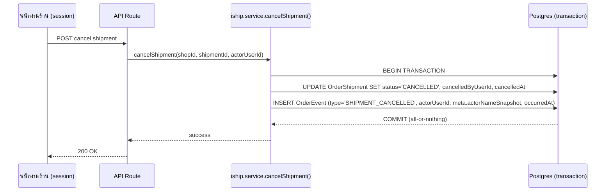

> **โมดูล:** M31-OrderActivityLog
> **ประเภทเอกสาร:** Product Requirements Document (PRD)
> **เวอร์ชัน:** 1.0
> **วันที่จัดทำ:** 2026-08-04
> **สถานะ:** Draft
> **เจ้าของเอกสาร:** BA + PO + PM

# PRD: ประวัติกิจกรรมคำสั่งซื้อ (Order Activity Log)

---

## Executive Summary

หน้ารายละเอียดคำสั่งซื้อฝั่งร้าน (`seller/orders/[token]`) มีการ์ดชื่อ "ประวัติคำสั่งซื้อ" อยู่แล้ว แต่สิ่งที่การ์ดนี้แสดงจริงคือ**สถานะ** (สั่งซื้อ→ชำระ→จัดส่ง→รับของ) ที่ derive จาก state machine ปัจจุบันของออเดอร์เท่านั้น ไม่ใช่ log ว่า "ใครทำอะไรกับออเดอร์นี้บ้าง" ปัญหานี้ชัดขึ้นเรื่อย ๆ เพราะร้านมี**พนักงานที่ถูกเชิญ** ได้ (feature 00012) — เมื่อมีคนมากกว่าเจ้าของร้านคนเดียวกดปุ่มต่าง ๆ ในออเดอร์เดียวกัน คำถาม "ใครสร้าง ใครขอเลขพัสดุ ใครส่ง SMS ใครยกเลิก ใครแก้ราคา" ตอบไม่ได้เลยในปัจจุบัน ทั้งที่ API แทบทุกตัวมี session อยู่แล้ว (รู้ว่าใครกด) เพียงแต่ไม่เคยถูกเขียนลงตารางที่ทน (persist)

ฟีเจอร์นี้เพิ่มตาราง `OrderEvent` เป็น SSOT ของ audit log ระดับออเดอร์ (`orderId`, `type`, `actorUserId` nullable, `meta` Json, `occurredAt`) แล้วแทนที่การ์ดเดิมด้วยไทม์ไลน์กิจกรรมจริง ให้เจ้าของร้าน/พนักงานเห็นร่องรอยการกระทำทั้งหมดในออเดอร์เดียว โดยไม่กระทบ flow การซื้อขายเดิม (additive ทั้งหมด) และไม่รั่วข้อมูล PII ของผู้ซื้อผ่าน RSC flight payload (บทเรียนเดิมของโปรเจกต์)

**หมายเหตุขอบเขต:** งาน "แถบสถานะแนวนอน (stepper) ที่แยกลำดับขั้นตาม COD/โอนเงิน" เป็นงานคนละก้อนที่ทำคู่กันในรอบเดียวกัน แต่**ไม่ใช่ส่วนหนึ่งของ feature นี้** — ตัวนั้น derive จาก `Order.status`/`paymentMethod` ล้วน ไม่ต้องใช้ `OrderEvent`

---

## 1. Business Goals & KPIs

### 1.1 เป้าหมายทางธุรกิจ

| เป้าหมาย | รายละเอียด |
|----------|-----------|
| **แยก "สถานะ" ออกจาก "กิจกรรม"** | การ์ดปัจจุบันตอบ "ตอนนี้ออเดอร์อยู่ขั้นไหน" (สถานะ) — ฟีเจอร์นี้เพิ่มการตอบ "ใครทำอะไรเมื่อไหร่" (กิจกรรม) ซึ่งเป็นคนละคำถามและต้องคนละกลไกเก็บข้อมูล |
| **รองรับร้านที่มีพนักงานหลายคน** | feature 00012 ทำให้ร้านมีคนมากกว่าเจ้าของคนเดียวกดปุ่มในออเดอร์เดียวกันได้ — การไม่มี audit trail แปลว่าเจ้าของร้านสืบปัญหาภายในร้านตัวเองไม่ได้เลย |
| **วางฐานข้อมูล audit ที่ต่อยอดได้** | ตาราง `OrderEvent` เป็นจุดเริ่มของ evidence เมื่อเกิดข้อพิพาท (ในอนาคต) — MVP นี้แค่ "เขียน + แสดงผล" ยังไม่ทำ dispute workflow |

### 1.2 ตัวชี้วัดความสำเร็จ (KPIs)

| KPI | คำอธิบาย/วิธีวัด | เป้าหมาย |
|-----|----------|---------|
| **Event coverage** | นับ order ที่สร้างหลัง go-live ที่มี `OrderEvent` ประเภท `ORDER_CREATED` อย่างน้อย 1 แถว หาร order ทั้งหมดหลัง go-live | 100% — ไม่มี silent gap ตั้งแต่วันแรก |
| **PII leak incident** | นับครั้งที่พบ raw phone/email/address ใน `meta` (code review + grep gate ตอน implement) | 0 |
| **ไทม์ไลน์ order เก่า ไม่ error** | เปิดหน้า order ที่สร้างก่อน migration แล้วไม่ throw/ไม่ render ว่างผิดปกติ | 100% ของ order ที่สุ่มตรวจ |

---

## 2. User Personas (กลุ่มผู้ใช้งาน)

### 2.1 เจ้าของร้าน (Shop Owner — `ShopMember.role = OWNER`)

**ข้อมูลพื้นฐาน:** เจ้าของร้านที่เปิดร้านผ่าน onboarding เป็นเจ้าของ `Shop` นั้นโดยตรง

**เป้าหมาย:** อยากรู้ว่าออเดอร์แต่ละใบถูกใครแตะบ้าง โดยเฉพาะเมื่อผลลัพธ์ผิดปกติ (ยกเลิกโดยไม่แจ้ง แก้ราคาไม่ตรง)

**ความต้องการ:** เปิดหน้าออเดอร์แล้วเห็นลำดับเหตุการณ์พร้อมชื่อคนที่ทำ ไม่ต้องถามพนักงานเอง

**จุดปวด (Pain Points):** ทุกวันนี้เห็นแค่ "จัดส่งแล้ว" ลอย ๆ ไม่รู้ว่าพนักงานคนไหนกด และไม่รู้ว่าราคาที่เห็นถูกแก้มาก่อนหรือเปล่า

### 2.2 พนักงานร้านที่ถูกเชิญ (Invited Staff — `ShopMember.role = ADMIN`, feature 00012)

**ข้อมูลพื้นฐาน:** ได้รับเชิญเข้าร้าน มีสิทธิ์เปิด/แก้ไข/ยกเลิกออเดอร์เหมือนเจ้าของร้าน (ปัจจุบันไม่มี granular RBAC แยกสิทธิ์)

**เป้าหมาย:** ทำงานส่งต่อกันได้ (คนหนึ่งเปิดบิล อีกคนตามเรื่องพัสดุ) โดยไม่ต้องสื่อสารนอกระบบว่า "ใครทำถึงไหนแล้ว"

**ความต้องการ:** เห็นว่าเพื่อนร่วมงานคนไหนขอเลขพัสดุไปแล้ว กันการขอซ้ำ/ยกเลิกซ้ำ

**จุดปวด (Pain Points):** ไม่มีทางรู้ว่ามีคนอื่นแตะออเดอร์นี้ไปก่อนหน้าหรือยัง

### 2.3 ผู้ซื้อ (Buyer) — **ไม่ใช่ persona เป้าหมายของเฟสนี้**

ผู้ซื้อไม่ได้อยู่ใน scope การเห็น log นี้ (ดู §5 Out of Scope) — ระบุไว้เพื่อความชัดเจนว่าถูกพิจารณาแล้วและตัดออกอย่างมีเหตุผล ไม่ใช่ลืม

---

## 3. Business Requirements

### 3.1 บันทึกเหตุการณ์คำสั่งซื้อโดยอัตโนมัติ (Event Capture)

**ความต้องการ:**
- ระบบต้องบันทึกเหตุการณ์สำคัญของคำสั่งซื้อ**โดยอัตโนมัติ**ทุกครั้งที่เกิดขึ้นจริง (ไม่มีปุ่ม "บันทึก log" ให้ผู้ใช้กดเอง) ครอบคลุม 9 ประเภทเหตุการณ์ (ตาราง §3.1.1)

**3.1.1 ตารางประเภทเหตุการณ์ (event catalog)**

| ประเภท (`type`) | เกิดขึ้นตอนไหน | actor ที่เป็นไปได้ | ข้อความไทยที่แสดง | Priority |
|---|---|---|---|---|
| `ORDER_CREATED` | สร้างออเดอร์สำเร็จ | ร้าน/พนักงาน หรือ `null`=ระบบ (ปิดประมูลอัตโนมัติ/ออเดอร์เก่าก่อน migration) | "{actor} สร้างคำสั่งซื้อนี้" / "ระบบสร้างคำสั่งซื้อนี้อัตโนมัติ" | Must |
| `ORDER_EDITED` | แก้ไขออเดอร์ (ราคา/สินค้า/ช่องทาง/ที่อยู่ ฯลฯ) | ร้าน/พนักงาน | "{actor} แก้ไขคำสั่งซื้อ ({n} รายการ)" | Must |
| `ORDER_CANCELLED` | ยกเลิกออเดอร์ | ร้าน/พนักงาน หรือ ผู้ซื้อ (มักเป็น guest → actor=`null`, ใช้ role แทน) | "{actor} ยกเลิกคำสั่งซื้อ" / "ผู้ซื้อยกเลิกคำสั่งซื้อ" | Must |
| `TRACKING_ADDED` | แจ้งเลขพัสดุด้วยตนเอง (ไม่ผ่าน iShip) | ร้าน/พนักงาน | "{actor} แจ้งเลขพัสดุ ({ขนส่ง})" | Must |
| `SHIPMENT_CREATED` | เปิดพัสดุผ่าน iShip สำเร็จ | ร้าน/พนักงาน หรือ `null`=โหมด AUTO | "{actor} เปิดพัสดุกับ {ขนส่ง} ผ่าน iShip" | Must |
| `SHIPMENT_CANCELLED` | ยกเลิกพัสดุ iShip | ร้าน/พนักงาน | "{actor} ยกเลิกพัสดุ {ขนส่ง}" | Must |
| `SHIPMENT_LINKED` | ผูกพัสดุที่มีอยู่แล้วบน iShip เข้ากับออเดอร์นี้ | ร้าน/พนักงาน | "{actor} ผูกพัสดุที่มีอยู่แล้วกับคำสั่งซื้อนี้" | Must |
| `SMS_LINK_SENT` | กดส่งลิงก์ออเดอร์ทาง SMS (paid) | ร้าน/พนักงาน | "{actor} ส่งลิงก์คำสั่งซื้อทาง SMS ให้ผู้ซื้อ" | Must |
| `BUYER_CONFIRMED` | ผู้ซื้อกดยืนยันรับสินค้า/บริการ | ผู้ซื้อ (มักเป็น guest → actor=`null`) | "ผู้ซื้อยืนยันได้รับสินค้า/บริการแล้ว" | Must |

> **หมายเหตุ scope:** `SLIP_ATTACHED` (ผู้ซื้อแนบสลิป), `LABEL_PRINTED` (พิมพ์ใบปะหน้าซ้ำ), `SHIPMENT_RETRY`, `SHIPMENT_UNLINKED`, `PICKUP_REQUESTED/CANCELLED` — พิจารณาแล้วแต่**จงใจไม่รวม MVP** ดูเหตุผลราย item ใน §5 Out of Scope

**Business Rules:**
- BR-3.1-a: event เขียนใน**ทรานแซกชันเดียวกัน**กับการเปลี่ยนแปลงข้อมูลหลักเสมอ (all-or-nothing) — operation หลักที่มี `$transaction` อยู่แล้ว (`createOrder`, `cancelOrder`, `createShipment`, `cancelShipment`, `linkShipment`) ต้องรวม insert `OrderEvent` เข้าไปในทรานแซกชันเดียวกัน ห้ามยิงแยกแบบ fire-and-forget
- BR-3.1-b: `type` เป็น fixed enum ตามตารางข้างบนเท่านั้น — ห้ามให้ client ส่ง type อิสระมาเอง (สร้างจาก server-side action เท่านั้น)

**เหตุผล:**
- Event ที่ขาดแม้แค่ 1 จุด ทำให้ timeline "โกหก" (ดูเหมือนไม่มีอะไรเกิดขึ้นทั้งที่มี) — ความน่าเชื่อถือของ log ทั้งชุดขึ้นอยู่กับความครบ ไม่ใช่ความสวย
- Atomic write ป้องกัน "ทำสำเร็จแต่ log หาย" ซึ่งเป็นเคสที่แย่ที่สุดของ audit trail (ดูเหมือนไม่มีใครทำ ทั้งที่มีคนทำจริง)

### 3.2 แสดงไทม์ไลน์กิจกรรมในหน้าออเดอร์ฝั่งร้าน

**ความต้องการ:**
- แทนที่การ์ด "ประวัติคำสั่งซื้อ" (ปัจจุบันคือ status stepper) ด้วยไทม์ไลน์ที่ดึงจาก `OrderEvent` จริง เรียงใหม่→เก่า
- เห็นได้เฉพาะ `ShopMember` (role `OWNER` หรือ `ADMIN`) ของร้านที่เป็นเจ้าของออเดอร์นั้นเท่านั้น

**Business Rules:**
- BR-3.2-a: ส่วนที่เป็น "กิจกรรม" ต้องมาจาก `OrderEvent` เท่านั้น ห้าม derive จาก state machine อีกต่อไป (ส่วนที่เป็น "สถานะ" ยัง derive จาก `Order.status` ได้ตามเดิม — คนละคำถามกัน) · การจัดวาง/รูปแบบต้องผ่าน `safepay-ux` gate (Hard Rule 8)
- BR-3.2-b: ห้ามแสดงให้ผู้ซื้อเห็นที่ `/o/[token]` ในเฟสนี้ (ดู §5)
- BR-3.2-c: หน้าอยู่ใต้ client layout (`(paces)`) — field ที่ไม่ต้องแสดงต้อง**ไม่ select ออกจาก DB เลย** ไม่ใช่ select มาแล้ว mask ที่ชั้น render (บทเรียน RSC PII leak ของโปรเจกต์นี้ — mask-at-source ไม่ใช่ mask-at-display)

**เหตุผล:**
- ผู้ซื้อไม่มีเหตุผลทางธุรกิจต้องเห็นว่าพนักงานคนไหนของร้านทำอะไร (เป็นข้อมูลภายในร้าน) และการเปิดเผยชื่อพนักงานให้ผู้ซื้อเห็นเป็นความเสี่ยงด้าน privacy ที่ไม่มีใครขอ

### 3.3 บันทึกการแก้ไขคำสั่งซื้อแบบ field-level โดยไม่ทับข้อมูล PII

**ความต้องการ:**
- เมื่อแก้ไขออเดอร์ (`updateOrder`) ระบบต้องบันทึกว่า **field ไหนเปลี่ยน** ไม่ใช่แค่ "แก้ไขแล้ว" ลอย ๆ — เพื่อให้ตอบได้ว่า "แก้ราคาจาก X เป็น Y" ไม่ใช่แค่ "มีคนแก้"
- แบ่ง field ที่แก้ไขได้ (`items`/`type`/`buyerContact`/`buyerName`/`paymentMethod`/`salesChannel`/`internalNote`/`discount`/`vatRate`/`vatAmount`/`shippingAddress` — ตาม signature จริงของ `updateOrder()`) เป็น 2 กลุ่ม:

| กลุ่ม | field | เก็บอะไรใน `meta` |
|---|---|---|
| **ปลอดภัย — เก็บ before/after เต็ม** | `items` (ชื่อ/จำนวน/ราคาต่อสินค้า), `discount`, `vatRate`, `vatAmount`, `paymentMethod`, `salesChannel`, `type` | ค่าก่อน-หลังจริง |
| **PII/อ่อนไหว — เก็บแค่ boolean ว่าเปลี่ยนหรือไม่** | `buyerContact`, `buyerName`, `shippingAddress`, `internalNote` | `{ field: "buyerContact", changed: true }` เท่านั้น ห้ามมีค่าจริงทั้งก่อนและหลัง |

**Business Rules:**
- BR-3.3-a: `internalNote` จัดเป็นกลุ่ม PII/อ่อนไหว แม้เป็นข้อความที่ร้านพิมพ์เอง เพราะเนื้อหาไม่ถูกควบคุม (ร้านอาจพิมพ์เบอร์/ที่อยู่ลูกค้าลงไปเอง) — เก็บ diff ค่าจริงไม่ได้
- BR-3.3-b: field ที่ไม่เปลี่ยนค่า (เท่าเดิม) ห้ามปรากฏใน `meta.diffs` เลย (ไม่ใช่ปรากฏแล้วค่า before=after)

**เหตุผล:**
- Trade-off ที่เลือก (field-level allow-list) อยู่กึ่งกลางระหว่าง "แค่บอกว่าแก้ไขแล้ว" (ข้อมูลน้อยเกินไป ตอบคำถามธุรกิจไม่ได้) กับ "diff ทุก field รวม PII" (ละเมิดกฎ PII ของโปรเจกต์ทันที) — allow-list ที่แยกกลุ่มชัดเจนให้ประโยชน์ทางธุรกิจ (เห็นราคาที่แก้จริง) โดยไม่ต้องแลกกับความเสี่ยง PII

### 3.4 ระบุตัวตนผู้กระทำอย่างปลอดภัยแม้บัญชีถูกลบภายหลัง

**ความต้องการ:**
- `actorUserId` ต้อง nullable และ `onDelete: SetNull` เสมอ — ลบพนักงานออกจากร้านแล้วประวัติร้านต้องไม่หายไปด้วย
- เมื่อ `actorUserId` เป็น `null` ที่จอต้องแยกให้ออกว่าเป็นกรณีไหนใน 2 กรณี ไม่ใช่โชว์ข้อความเดียวกันปนกัน:
  1. **ไม่เคยมีคนกระทำจริง** (ระบบทำเอง เช่น ปิดประมูลอัตโนมัติ) → แสดง "ระบบ"
  2. **เคยมีคนกระทำ แต่บัญชีถูกลบไปแล้ว** (`onDelete: SetNull` ทำงาน) → แสดงชื่อที่ snapshot ไว้ตอนเกิดเหตุการณ์ (ไม่ใช่ "ระบบ")

**Business Rules:**
- BR-3.4-a: ทุก event ที่มี `actorUserId` ไม่ใช่ `null` ตอนเขียน ต้อง snapshot `displayName`/`username` ของ actor ลงใน `meta` ณ เวลานั้น (`meta.actorNameSnapshot`) — pattern เดียวกับ `OrderShipment.senderSnapshot`/`receiverSnapshot` ที่มีอยู่แล้วในระบบ (freeze ค่า ณ เวลาจริง ไม่อ้างอิงสด)
- BR-3.4-b: ห้าม fallback `actorUserId = null` เป็นเจ้าของร้านเด็ดขาด ไม่ว่ากรณีใด (ตรงตามบทเรียนเดิมของ `Order.createdByUserId`)
- BR-3.4-c: ชื่อที่แสดงต้องใช้ `meta.actorNameSnapshot` เป็นหลักเสมอ (ไม่ live-join ไปเอาชื่อปัจจุบันของ User) — ป้องกันกรณีพนักงานเปลี่ยนชื่อทีหลังแล้วประวัติเก่าเปลี่ยนตาม (ประวัติต้องนิ่ง ไม่ถูกเขียนทับย้อนหลัง)

**เหตุผล:**
- ไม่มี snapshot แปลว่าเจ้าของร้านลบพนักงานคนไหนก็ได้แล้ว "ลบร่องรอย" การกระทำของคนนั้นไปด้วยในตัว (log กลายเป็นไม่มีความหมายพอที่จะพิสูจน์อะไร) — snapshot แก้ปัญหานี้ตรงจุด และสอดคล้องกับ convention ที่มีอยู่แล้วในตารางพี่น้อง (`OrderShipment`)

### 3.5 ข้อมูลย้อนหลัง (Backfill) จากฟิลด์ที่มีอยู่แล้วในระบบ

**ความต้องการ:**
- ออเดอร์ที่สร้างก่อนฟีเจอร์นี้ ต้องได้ event เท่าที่ backfill ได้จริงจากฟิลด์ที่มีอยู่ ไม่ error ไม่ mock ข้อมูล ไม่เดา

**ตาราง backfill capability (ยืนยันจาก `prisma/schema.prisma` จริง):**

| Event | Backfill ได้ไหม | ที่มา |
|---|---|---|
| `ORDER_CREATED` | ได้เต็ม (actor+เวลา) | `Order.createdByUserId` + `Order.createdAt` |
| `SHIPMENT_CREATED` | ได้เต็ม | `OrderShipment.createdByUserId` + `OrderShipment.createdAt` |
| `SHIPMENT_CANCELLED` | ได้เต็ม | `OrderShipment.cancelledByUserId` + `OrderShipment.cancelledAt` |
| `SHIPMENT_LINKED` | ได้เต็ม (เฉพาะแถวที่ `source='LINKED'`) | `OrderShipment.createdByUserId` + `OrderShipment.linkedAt` |
| `ORDER_CANCELLED` | ได้บางส่วน (เวลา+role แต่ไม่มี actor เจาะจง) | `Order.updatedAt` (ประมาณเวลา) + `Order.cancelInitiator` (role เท่านั้น — `meta.actorNameSnapshot` จะไม่มี) |
| `ORDER_EDITED` | **ไม่ได้เลย** | ไม่มีการเก็บประวัติแก้ไขมาก่อนฟีเจอร์นี้ |
| `TRACKING_ADDED` | **ไม่ได้เลย** | `ShipmentTracking` ไม่มีคอลัมน์ actor |
| `SMS_LINK_SENT` | **ไม่ได้เลย** | `SmsCode` ไม่มีคอลัมน์ actor |
| `BUYER_CONFIRMED` | **ไม่ได้เลย** | ไม่มี timestamp แยกจาก `Order.updatedAt` ซึ่งถูกเขียนทับได้จากหลายสาเหตุ ไม่ใช่ signal ที่เชื่อถือได้พอ |

**Business Rules:**
- BR-3.5-a: backfill รันครั้งเดียวตอน migrate (data migration script) ไม่ใช่ lazy-compute ตอน request — เพื่อไม่ให้ query หน้าออเดอร์ช้าลงเพราะต้อง derive ย้อนหลังทุกครั้ง
- BR-3.5-b: order ที่ backfill ไม่ได้เลยสักรายการ (ไม่เข้าเงื่อนไขไหนในตารางบน) แสดงไทม์ไลน์ว่างพร้อมข้อความอธิบาย ("ออเดอร์นี้สร้างก่อนระบบเริ่มบันทึกประวัติ — เหตุการณ์ใหม่หลังจากนี้จะแสดงที่นี่") ไม่ใช่หน้าเปล่าที่ดูเหมือน bug

**เหตุผล:**
- ตรงตามข้อเท็จจริงที่ยืนยันแล้วจาก schema — การพยายาม backfill เกินกว่าที่ข้อมูลมีจริงจะเป็นการ "สร้างประวัติเท็จ" ซึ่งขัดกับจุดประสงค์ทั้งหมดของฟีเจอร์นี้ (audit trail ที่เชื่อถือได้)

---

## 4. Business Rules & Constraints

### 4.1 กฎทางธุรกิจหลัก

| กฎ | คำอธิบาย |
|----|----------|
| **BR-OEV-01 Immutable** | `OrderEvent` เป็น insert-only — ไม่มี UPDATE/DELETE ผ่าน application code ในเฟสนี้ (ไม่มี use case ที่ต้องแก้ไข event ย้อนหลัง) |
| **BR-OEV-02 No PII ใน `meta`** | ห้ามเก็บเบอร์/อีเมล/ที่อยู่ผู้ซื้อดิบใน `meta` ไม่ว่า event ประเภทไหน — field ที่กระทบ PII เก็บได้แค่ boolean ว่าเปลี่ยนหรือไม่ (§3.3) |
| **BR-OEV-03 No owner-fallback** | `actorUserId = null` ห้าม fallback แสดงเป็นเจ้าของร้าน — ต้องแยก "ระบบ" กับ "อดีตพนักงาน (ใช้ snapshot)" ตาม §3.4 |
| **BR-OEV-04 Actor snapshot บังคับ** | ทุก event ที่มี actor ต้อง snapshot ชื่อ ณ เวลานั้นใน `meta` — ห้าม live-join |
| **BR-OEV-05 Atomic write** | เขียน `OrderEvent` ในทรานแซกชันเดียวกับการเปลี่ยนแปลงหลักเสมอ |
| **BR-OEV-06 Fixed enum type** | `type` มาจาก server-side logic เท่านั้น ไม่รับจาก client |

### 4.2 ข้อจำกัดทางธุรกิจ

| ข้อจำกัด | รายละเอียด |
|---------|-----------|
| **Migration ต้อง additive** | push `main` = migrate prod อัตโนมัติ (Hard Rule 15) — schema ใหม่ทั้งหมดต้องเป็นตารางใหม่ล้วน ไม่แตะคอลัมน์ของ `Order`/`OrderShipment`/`SmsCode` ที่มีอยู่ ไม่มี backward-incompatible change |
| **ต้องแก้ signature ของ service เดิมหลายตัว** | `cancelOrder()` ปัจจุบันไม่รับ `actorUserId` เลย (รับแค่ `initiator: "seller"\|"buyer"`) — implementation ต้องแก้ signature + route ที่เรียกใช้ ไม่ใช่งานเสริมข้าง ๆ |
| **ไม่มีหน้า admin order-detail** | `(paces)/admin` ปัจจุบันมีแค่ order list ไม่มี detail page ต่อออเดอร์ — การให้ admin เห็น log ต้องรอมีหน้านั้นก่อน (Phase 2) |

### 4.3 นโยบาย Retention & Index

- **Retention:** ไม่มีการลบอัตโนมัติ (auto-purge) ในเฟสนี้ — จุดประสงค์หลักของตารางคือหลักฐาน (evidence) เมื่อเกิดข้อพิพาทหรือปัญหาภายในร้าน การลบทิ้งเองขัดกับจุดประสงค์ตรง ๆ ในทางปฏิบัติ `Order` ไม่เคยถูก hard-delete ในระบบนี้อยู่แล้ว จึงเก็บถาวรตาม lifecycle ของ order (cascade delete เฉพาะกรณี order ถูกลบจริง ซึ่งไม่เกิดในทางปฏิบัติปัจจุบัน)
- **Index (ระดับ requirement — ให้ SDS/DATABASE เลือก implementation):** query pattern หลักคือ "ดึงไทม์ไลน์ของ 1 ออเดอร์ เรียงตามเวลา" — ต้องมี index ที่รองรับ query นี้โดยไม่ scan ทั้งตาราง ไม่ว่าตารางจะโตแค่ไหน
- **แยก "เวลาที่เหตุการณ์เกิดจริง" ออกจาก "เวลาที่บันทึกแถว"** — pattern เดียวกับที่มีอยู่แล้วใน `ShipmentEvent` (`occurredAt` vs `createdAt`) ต้องมีใน `OrderEvent` ด้วย เพื่อ (1) tie-break การเรียงลำดับเมื่อ `occurredAt` ชนกัน (2) แยก event ที่ backfill ย้อนหลังตอน migrate ออกจาก event ที่เกิดสด
- **ขนาด `meta` ต่อแถว:** ต้องมีเพดานขนาด (เช่น จำกัดจำนวน field ใน diff, ไม่เก็บ full snapshot ของ order ทั้งใบ) — ป้องกันแถวบวมจากการ diff ที่ไม่มีขอบเขต

---

## 5. Out of Scope (นอกขอบเขต)

| หัวข้อ | คำอธิบาย |
|--------|----------|
| **แถบสถานะแนวนอน (stepper) COD-aware** | เป็นงานคู่ขนานในรอบเดียวกัน แต่ derive จาก `Order.status`/`paymentMethod` ล้วน ไม่ใช้ `OrderEvent` — ไม่นับเป็น scope ของ feature นี้ |
| **ผู้ซื้อเห็น log ที่ `/o/[token]`** | ไม่มีเหตุผลทางธุรกิจให้ผู้ซื้อเห็นว่าพนักงานร้านคนไหนทำอะไร — เป็นข้อมูลภายในร้าน (§3.2) |
| **Admin/Ops เห็น log** | ไม่มีหน้า order-detail ฝั่ง admin อยู่จริงในปัจจุบัน (มีแค่ list) — รอ Phase 2 เมื่อมีหน้านั้น |
| **`SLIP_ATTACHED` event** | ผู้ซื้อแนบสลิปโอนเงิน — ไม่ได้อยู่ใน 4 คำถามหลักที่ user ระบุ (สร้าง/เลขพัสดุ/SMS/ยกเลิก) เป็น candidate สำหรับรอบถัดไป |
| **`LABEL_PRINTED` แบบ per-print event** | `OrderShipment.labelPrintedAt`/`labelPrintCount` เก็บสรุปอยู่แล้วแต่ไม่มี actor ต่อครั้ง — พิมพ์ซ้ำได้ไม่จำกัดจะทำให้ตารางบวมเร็วโดยประโยชน์ต่ำ |
| **`PICKUP_REQUESTED`/`PICKUP_CANCELLED`** | เป็น event ระดับ**ร้าน** (เรียกรถมารับได้หลายกล่องต่อครั้ง) ไม่ใช่ระดับ**ออเดอร์เดี่ยว** — ไม่ fit กับ schema `OrderEvent(orderId, ...)` ตรง ๆ |
| **`SHIPMENT_RETRY`/`SHIPMENT_UNLINKED`** | retry ถือเป็นรายละเอียดย่อยของ `SHIPMENT_CREATED` (เก็บใน `meta.isRetry`) ส่วน unlink ยังไม่มี use case ธุรกิจชัดเจนพอ |
| **Diff เต็มของ field ที่เป็น PII** | เก็บได้แค่ boolean ว่าเปลี่ยน (§3.3) — ไม่มีทางเห็นค่าก่อน/หลังจริงของ `buyerContact`/`shippingAddress` แม้เป็นเจ้าของร้าน |
| **Export/Download log** | ไม่มี CSV/PDF export ในเฟสนี้ |
| **Notification/Alert เมื่อมี event** | ไม่มีการแจ้งเตือน real-time เมื่อมี event เกิด |
| **Search/Filter ข้ามหลายออเดอร์** | เห็นได้เฉพาะไทม์ไลน์ต่อ 1 ออเดอร์ผ่านหน้า order detail เท่านั้น ไม่มีหน้า "activity feed รวมทั้งร้าน" |
| **RBAC granular ระหว่าง OWNER/ADMIN** | ทั้ง `OWNER` และ `ADMIN` (staff) เห็น log เท่ากันทุกประการในเฟสนี้ |

---

## 6. Risks & Mitigation

### 6.1 ความเสี่ยงทางธุรกิจ

| ความเสี่ยง | ผลกระทบ | ระดับความรุนแรง | แนวทางแก้ไข |
|-----------|---------|-----------------|-------------|
| พนักงานรู้สึกถูกจับตา (surveillance) | ขวัญกำลังใจ/ความไว้ใจในทีมร้าน | กลาง | สื่อสารเป็น "ประวัติกิจกรรมของออเดอร์" ไม่ใช่ "ติดตามพนักงาน" จำกัด field ที่เก็บให้เกี่ยวกับ order เท่านั้น (ไม่เก็บ IP/device/location) |
| เจ้าของร้านลบพนักงานเพื่อลบร่องรอยการกระทำ | log สูญเสียความน่าเชื่อถือ | สูง | แก้แล้วด้วย actor name snapshot (§3.4) — ลบ user ไม่ลบชื่อที่ปรากฏในประวัติ |

### 6.2 ความเสี่ยงทางเทคนิค

| ความเสี่ยง | ผลกระทบ | แนวทางแก้ไข |
|-----------|---------|-------------|
| ตารางโตเร็วกว่า `Order` หลายเท่า (หลาย event ต่อ 1 order) | query ช้าลงเมื่อข้อมูลสะสมมาก | index ตาม §4.3 ตั้งแต่ migration แรก ไม่ผัดไปทีหลัง |
| Atomic write ทำให้ operation หลักพังถ้า insert `OrderEvent` มีบั๊ก | สร้าง/ยกเลิกออเดอร์ล้มเหลวทั้งที่ควรสำเร็จ | ทดสอบ transaction path ให้ครบก่อน deploy (unit + E2E) เพราะ trade-off นี้เลือก consistency เหนือ availability โดยตั้งใจ |
| เผลอใส่ PII ลง `meta` ระหว่าง implement (bug ไม่ใช่ design) | ละเมิด BR-OEV-02 | เพิ่ม convention doc + grep gate ตอน implement (คล้าย gate ของ emoji/react-toastify ที่มีอยู่แล้ว) |

---

## 7. Glossary (อภิธานศัพท์)

| คำศัพท์ | ความหมาย |
|---------|----------|
| **OrderEvent** | ตารางใหม่ = SSOT ของ audit log ระดับออเดอร์ |
| **actor** | ผู้กระทำ — ระบุด้วย `actorUserId` (nullable) |
| **actorNameSnapshot** | ชื่อของ actor ที่ freeze ไว้ ณ เวลาเกิดเหตุการณ์ ไม่อ้างอิงชื่อปัจจุบันของ user |
| **occurredAt** | เวลาที่เหตุการณ์เกิดขึ้นจริงทางธุรกิจ (ต่างจากเวลาที่แถวถูกบันทึกลง DB) |
| **backfill** | การสร้าง event ย้อนหลังจากฟิลด์ที่มีอยู่แล้วในระบบ สำหรับออเดอร์ที่สร้างก่อนฟีเจอร์นี้ |
| **ShopMember** | membership User↔Shop (`role: OWNER \| ADMIN`) จาก feature 00008/00012 |

---

## 8. Success Metrics (ตัวชี้วัดความสำเร็จ)

| ตัวชี้วัด | ค่าที่คาดหวัง | วิธีวัด |
|----------|---------------|--------|
| Event coverage หลัง go-live | 100% ของ order ใหม่มี `ORDER_CREATED` | query `Order` LEFT JOIN `OrderEvent` หา order ที่ไม่มี event เลย |
| PII leak ใน `meta` | 0 | code review checklist + grep pattern ตอน implement |
| Backfill ความถูกต้อง | ตรงตามตาราง §3.5 100% (ไม่มี event ที่ backfill ผิดประเภท) | สุ่มตรวจ order เก่า N ใบเทียบกับ field ต้นทาง |

---

## 9. Dependencies & Assumptions

### 9.1 สิ่งที่ต้องพึ่งพา (Dependencies)

| ระบบ/ส่วนประกอบ | ความสัมพันธ์ |
|-----------------|-------------|
| `ShopMember` (feature 00008/00012) | ใช้กำหนดสิทธิ์การเห็น log (owner+staff ของร้านเดียวกัน) |
| `order.service.ts` — `cancelOrder()`, `shipOrder()`, `updateShipmentTracking()` | ต้องแก้ signature เพิ่ม `actorUserId` — ปัจจุบันไม่รับพารามิเตอร์นี้เลย |
| `iship.service.ts` — `createShipment()`, `cancelShipment()`, `linkShipment()` | มี `createdByUserId`/`cancelledByUserId` อยู่แล้วในระดับ `OrderShipment` — ต้องส่งค่าเดียวกันเข้า `OrderEvent` ด้วย ไม่ใช่ derive ใหม่ |
| SMS send route (`POST /api/orders/[token]/send-sms`) | ต้องส่ง `actorUserId` จาก session เข้า `sms-code.service` เพื่อเขียน `SMS_LINK_SENT` |
| Prisma migration (additive) | ตารางใหม่ล้วน — push main = migrate prod อัตโนมัติ (Hard Rule 15) ต้องแจ้ง user ก่อน migrate ทุกครั้ง |

### 9.2 สมมติฐาน (Assumptions)

- `session.user.id` ที่ route รับมาเชื่อถือได้เป็น actor เสมอ (ระบบมี auth guard อยู่แล้วในทุก route ที่เกี่ยวข้อง)
- Order เก่าที่ backfill ไม่ได้ตามตาราง §3.5 = ยอมรับช่องว่างของข้อมูล ไม่ถือเป็นบั๊ก
- `ADMIN` (staff) เห็น log เท่าเทียมกับ `OWNER` ทุกประการในเฟสนี้
- ไม่มี hard-delete ของ `Order` ในระบบจริง (retention policy §4.3 อิงสมมติฐานนี้)
- ผู้ซื้อที่ยกเลิก/ยืนยันออเดอร์ส่วนใหญ่เป็น guest (ไม่ login) ดังนั้น `BUYER_CONFIRMED`/`ORDER_CANCELLED (initiator=buyer)` จะมี `actorUserId = null` เป็นค่าปกติ ไม่ใช่ข้อยกเว้น

---

## 10. Appendix

### 10.1 ตัวอย่าง User Journey

**Scenario: ร้านมีพนักงาน 2 คน — สร้าง แก้ไข แล้วเจ้าของร้านยกเลิก**

1. พนักงาน A (`ShopMember role=ADMIN`) กดสร้างออเดอร์จากหน้า POS → บันทึก `ORDER_CREATED` (`actorUserId` = A, `meta.source='MANUAL'`)
2. ลูกค้าโทรมาขอเปลี่ยนจำนวนสินค้า พนักงาน B แก้ไขออเดอร์ → บันทึก `ORDER_EDITED` (`actorUserId` = B, `meta.diffs = { items: {...} }`)
3. เจ้าของร้านเห็นว่าลูกค้าไม่ตอบรับการชำระเงินเกิน 3 วัน กดยกเลิก → บันทึก `ORDER_CANCELLED` (`actorUserId` = เจ้าของร้าน, `meta.initiatorRole='seller'`)
4. เจ้าของร้านเปิดหน้าออเดอร์ เห็นไทม์ไลน์ 3 แถวเรียงเวลา พร้อมชื่อ A, B, ตัวเองตามลำดับจริง

### 10.2 Sequence diagram — การเขียน event ตอนยกเลิกพัสดุ iShip

---

**หมายเหตุ:**
เอกสารนี้เป็นการบันทึกความต้องการทางธุรกิจ (Business Requirements) โดยไม่มีรายละเอียดทางเทคนิค
สำหรับ Functional Requirements / User Story / Acceptance Criteria ดู BRD ของโมดูลนี้
สำหรับ technical specification (schema/API/state machine) ดู SRS/SDS/DATABASE/API ของโมดูลนี้ (ยังไม่ได้ทำ — รอ PRD+BRD ผ่าน review ตาม Hard Rule 11)
